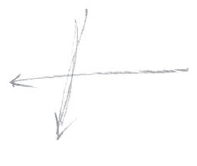

Meine lieben Freunde! Zunächst, um es nicht zu vergessen, möchte ich ankündigen, daß wir morgen bereits um drei Uhr beginnen, damit einige der Freunde, welche wahrscheinlich schon morgen abreisen müssen, die Zeit dazu finden, dem Vortrag beizuwohnen. Dann möchte ich Sie bitten, diese Aufführung, die wir heute versuchten, Ihnen zu geben, nicht allzu sehr übelzunehmen. Man muß sie selbstverständlich im Zusammenhange verstehen mit der ganzen Faust-Dichtung, nicht als eine Einzelheit, und ich werde versuchen wie ich glaube schon morgen -, anfügend an meinen Vortrag, dann einiges zur Erläuterung gerade dieser Dichtung zu sagen, bevor wir sie am Montag wiederholen. ^mkhj8p

Heute möchte ich, da ich bemerkt habe, daß dies doch den Wünschen einiger unserer Freunde entspricht, einige weitere Bemerkungen zu dem machen - so weit es möglich ist -, was ich am letzten Montag begonnen habe. Ich werde also heute und morgen weiter in diese Sache einzudringen versuchen, muß aber - damit wir uns verstehen und keine Mißverständnisse auftreten, wenn ich die Sache mehr von der geistigen Seite beleuchten soll, wie das nunmehr zu geschehen hat — einiges vorausschicken. Denn ohne daß man in der Lage ist, auf gewisse Verhältnisse in der Gegenwart und in den Zeiten, in denen sich diese Gegenwart vorbereitet hat, zu schauen, ohne daß man also in der Lage ist, auf diese Verhältnisse auf dem physischen Plan zu schauen, ist es nicht möglich, auf die tieferen, gewissermaßen okkulten Seiten einzugehen. Sie wissen ja, daß es sich hier nicht um irgendeine Parteinahme handelt, daß es sich nicht um Sympathien oder Antipathien handelt, sondern um die Darlegung gewisser Verhältnisse, die eben manchem, wie ich gehört habe, zum Verständnis der gegenwärtigen schweren Zeit wünschenswert ist. Ich will also heute, soweit es unsere Zeit gestattet, noch einige vorbereitende Erläuterungen geben. ^2silec

Zunächst müssen wir uns schon klar sein darüber, daß alles, was äußerlich auf dem physischen Plane geschieht, abhängig ist von den zugrunde liegenden geistigen Kräften und Mächten. Es ist aber im Konkreten schwierig, die Art und Weise des Wirkens dieser geistigen Kräfte und Mächte präzis kennenzulernen, denn an einigen Stellen des physischen Planes liegen, man möchte sagen Einbrüche, deutlichere Einbrüche der geistigen Welt vor als an andern Stellen. Ich habe hier öfter darauf hingedeutet, daß es gewissermaßen Verbindungslinien gibt von der äußeren Welt durch die mannigfaltigsten Zwischenverhältnisse hindurch zu okkulten Bruderschaften und wiederum von den okkulten Bruderschaften hinein in die geistige Welt. Wenn man diese Dinge richtig verstehen will, so muß man vor allen Dingen ins Auge fassen, daß da, wo Menschen gewissermaßen mit Zuhilfenahme geistig wirksamer Kräfte arbeiten - sei es im guten, sei es im schlimmen Sinne -, immer mit großen Zeiträumen gerechnet wird. Und noch etwas, worauf vieles ankommt [bei diesen Bruderschaften], ist, die Verhältnisse des physischen Planes mit einer gewissen Kaltblütigkeit zu überschauen und sie zu benützen. ^fn7qd4

Das ist insbesondere dann erforderlich, wenn man sich der vorhandenen geistigen Richtungen, Strömungen bedienen will, um das oder jenes zu erreichen. Sie werden im Verlaufe meiner Darstellungen schon sehen, inwiefern das eine oder das andere in gutem oder schlechtem Sinne angestrebt und erreicht wird. Eine Eigentümlichkeit derer, die sich geistiger Kräfte bedienen, ist diese, daß sie sehr häufig — ich sage «sehr häufig», nicht «immer» -, Gründe haben, nicht selbst auf die Bühne des äußeren, physischen Planes zu treten, sondern sich [geeigneter] Mittelspersonen zu bedienen - Mittelspersonen, durch die gewisse Pläne erreicht, verwirklicht werden können. Nun handelt es sich darum, daß diese Dinge oftmals so geschehen müssen, daß die andern Menschen sie nicht merken. Wir haben ja aus den verschiedenen Betrachtungen gesehen, daß die Menschen gewissermaßen unaufmerksam sind, nicht gerne hinschauen auf das, was geschieht. Das aber benützen viele, welche sich gewisser okkulter Zusammenhänge bedienen, um in der Welt zu wirken. Wer diese nicht so anschaut, wie man sie gewöhnlich betrachtet, sondern wer mit einem freien, offenen Blick sich diese Welt anschaut, wird wissen, daß es für diejenigen, die sich solcher Mittel bedienen wollen, stets beeinflußbare Menschen gibt. Und wenn es jemand darauf anlegt, Menschen zu beeinflussen und in einem gewissen Sinne als Okkultist vielleicht nicht ganz gewissenhaft ist, so kann er solche Beeinflussungen schon bewirken. ^2rpi5v

Wie gesagt, ich will Ihnen Vorbereitendes geben. Nehmen wir ein Beispiel - ich will ganz elementar vorgehen, Sie werden schon sehen, daß uns dieses Elementare zum Verständnis von Tiefergehendem führt —, nehmen wir also ein Beispiel. So schrieb Richard Graf von Pfeil, [ein preußischer Offizier], der sich [über lange Jahre] in Petersburg [und anderen Orten in Rußland] aufgehalten und umgesehen hat, die folgenden Zeilen über den [Eindruck, den er anläßlich seiner Verabschiedung] im Jahre 1889 vom damals regierenden Kaiser von Rußland, Alexander III., hatte: ^dwcqt1

Der Gesamteindruck, den mir Kaiser Alexander III. in dieser Unterredung machte, war der von mir lange vermutete, daß er absichtlich von seiner Umgebung in einem tiefen Mißtrauen gegen Deutschland gehalten werde und daß sich dieses Mißtrauen nunmehr derart in ihm eingewurzelt habe, daß an eine Änderung überhaupt kaum noch zu denken sei. Er war von seiner tiefen Friedensliebe mit Recht überzeugt, glaubte aber auch an die seiner Ratgeber und der sonstigen maßgebenden Persönlichkeiten in Rußland, von denen viele den Frieden durchaus nicht so wünschten wie er. ^w2k94k

Sie haben also an hervorragender Stelle einen Menschen, den man so beschreiben muß: Er ist beeinflußbar für diejenigen, die sich zur Beeinflussung an ihn herandrängen, die sich aber nicht selber zeigen wollen, die nicht selber in den Vordergrund treten wollen. Nehmen Sie an, jemand, der gewisse Zusammenhänge kennt, die sich aus dem Impulse des fünften nachatlantischen Zeitraums ergeben, und diese Zusammenhänge in seinem Sinne oder im Sinne irgendeiner Gemeinschaft ausnützen will - was tut der? Der sucht an eine solche hervorragende Persönlichkeit heranzukommen, sucht Einfluß zu gewinnen, indem er die Vorstellung erweckt, daß es ihm im eminentesten Sinne ganz fernliegt, irgendeinen Einfluß zu gewinnen, in der Hoffnung, niemand bemerke, daß er Einfluß gewinnen will, aber er gewinnt diesen Einfluß. Man braucht ja nur gewisse Arten, seine Sätze zu formen, gewisse Arten, seine Wendungen zu gebrauchen, um einfach durch die Formung gewisser Sätze, durch das Aussprechen gewisser Worte oder durch noch andere Mittel, die ich nicht schildern will, Einfluß auf die Menschen zu gewinnen. Man braucht nur die Mittel zu kennen, wie man jemanden beeinflussen kann, um ihn in eine gewisse Richtung zu bringen. Weil manche Leute bis zu einem gewissen Grade unaufmerksam sind, scheint ihnen die Welt ihrem Urteile nach einfach gut, und weil die Welt für sie also gut ist, wird sie sich selbstverständlich auch darnach richten. Nun ja, Alexander II. mochte ja von seiner tiefen Friedensliebe mit Recht überzeugt gewesen sein, aber er glaubte ebenso auch allen seinen Ratgebern und sonstigen maßgebenden Persönlichkeiten in Rußland, von denen viele den Frieden durchaus nicht so sehr wünschten wie er. ^cljrn2

Wie leicht so etwas im weitesten Umfange möglich ist, sehen Sie an einem andern Fall - Sie sehen es gerade daran, was ich in bezug auf die Blavatsky erzählt habe. Nachdem eine Zeitlang jener Mahatma, den man mit dem Signum K. H. bezeichnet, einen guten Einfluß auf sie hatte, wurde er mittels gewisser Machinationen durch einen anderen Meister ersetzt, [ohne daß die Blavatsky dies bemerkte]. Dieser war ein Spion im Solde einer gewissen Körperschaft, aber entlaufen aus okkulten Bruderschaften, in deren Hochgrade er eingeweiht war, so daß es ihm möglich war, selber als Mahatma im Hintergrund zu bleiben, aber durch die Blavatsky gewisse Dinge zu erreichen, die er erreichen wollte. Ich will Sie durch die Anführung dieser elementaren Dinge nur hinweisen auf das, worauf man aufmerksam sein muß, wenn man die Dinge beurteilen will, denn durch die Art und Weise, wie Geschichte geschrieben wird, wird die Welt vielfach irregeführt ganz irregeführt. Es handelt sich nämlich bei der Geschichtsschreibung wirklich auch um etwas Tieferes. So an der alleräußersten Oberfläche des physischen Daseins, in der alleräußersten Maja wird man sagen: Nun ja, wenn der oder jener Professor ein tüchtiger Mann ist und die historischen Methoden kennt, so weiß er das Richtige geschichtlich darzustellen. - Das muß aber durchaus nicht sein. ^j9i6w2

Ob man als Geschichtsschreiber das Richtige darzustellen vermag ‚oder nicht, das hängt davon ab, ob einen sein Karma dazu führt, das Richtige kennenzulernen oder nicht. Das ist sehr wichtig. Und das Richtige drückt sich oftmals nicht aus in dem, worauf man beliebig den Blick wendet, sondern das Richtige drückt sich sehr häufig nur für den aus, der an die richtigen Stellen den Blick wenden kann - ich könnte auch sagen, der durch sein Karma dahin geführt wird, das Richtige im richtigen Augenblick da zu sehen, wo sich an einer einzelnen Erscheinung etwas Bedeutsames ausspricht. Oftmals drückt sich nämlich in einer einzelnen Erscheinung etwas aus, was ein Licht auf dasjenige wirft, was sich eigentlich in Jahrzehnten vollzieht - aber nur in der Art eines Blitzschlages, der schnell etwas beleuchtet. So will ich Ihnen eine kleine Geschichte erzählen, um vorzubereiten auf solche Dinge, die für uns dann bei der mehr geistigen Betrachtung besonders wichtig sein werden. Ich will Ihnen also eine kleine Geschichte erzählen. ^et8831

Es gab in Wien einen Mediziner - es gibt ihn noch, aber jetzt befaßt er sich nicht mehr so mit diesen Dingen -, der schon in den achtziger Jahren in den Grenzen, in denen es, wenn wir so sagen dürfen, berechtigt ist - nicht in den Grenzen, in denen es seit den Freud’schen Theorien getrieben wird -, analytische Psychologie, Psychoanalyse betrieben hat. Er hat mit seiner Psychoanalyse gewisse, auch große Erfolge gehabt, weil er imstande war, durch sein besonderes Gebaren allerlei aus den Leuten herauszukriegen durch Katechisation. Ich habe Ihnen in einem früheren Vortrage dargestellt, was es bedeutet, allerlei herauszukriegen. Nun, zu diesem Arzte kam im Jahre 1886 ein Mann, der ihm den Anschein erweckte, daß viel in ihm stecken könnte. Nun hatte er ihn zu behandeln, zu behandeln namentlich als einen nervösen Menschen. Es war also für einen Arzt, der sich darauf versteht, allerlei herauszulesen aus dem Seelenleben, sozusagen ein gefundener Fall, der als Fall schon außerordentlich interessant war. Und er brachte heraus, daß der Betreffende eine in die verschiedensten politischen Strömungen verwickelte Persönlichkeit war — eine Persönlichkeit, die, wie man so sagt, überall seine Nase hineinstecken konnte und seine Finger mit im Spiel hatte; er fand heraus, daß der Betreffende auch für gewisse Journale des Kontinents Artikel schrieb, die auf den Herrscher des betreffenden Staates einen großen Einfluß hatten. ^6ambb9

Der betreffende Patient - Vojdarevič hieß er und war der Sprößling, der sehr spät geborene Sprößling einstiger Vojdarevič der Herzegovina — sagte dazumal noch so mancherlei. Unter anderem wußte er auch genau Bescheid, wie die Fäden liefen, als vor dem Beginne des Russisch-Türkischen Krieges in den siebziger Jahren in der Herzegovina und in Bosnien von Rußland her diese Dinge eingefädelt worden sind. Unter gewöhnlichen Verhältnissen verrät ein solcher Mensch derartige Dinge nicht, aber wenn der psychoanalytische Arzt über ihn kommt - nun ja, da kommt mancherlei anderes heraus, was sonst nicht herauskommt. Und nachdem er so eine Weile, das heißt öfters katechisiert worden war, wurde es klar, daß dazumal der gute Vojdarevič auch seine Finger mit im Spiele hatte, als vor der Kriegserklärung des Königs Milan und des Fürsten Nikita an die Türkei Mitte der siebziger Jahre die Aufstände in Bosnien und der Herzegovina arrangiert wurden, daß dazumal dieser Vojdarevič mit im Spiele war, als man von Rußland aus Nikita und Milan Anlaß gab, der Türkei den Krieg zu erklären. Nicht wahr, äußerlich sagt man dann: Jetzt haben sich die Leute empört über die schlechte türkische Behandlung. — Die mag ja auch da gewesen sein; das soll nicht geleugnet werden. Ich stelle nur die Zusammenhänge dar, aber man muß sich klar sein darüber, daß die Ursachen oftmals viel weiter zurückliegen und [und viel früher] «gemacht» werden. Also es handelt sich darum, daß jener Vojdarevič tief in diese Dinge verwickelt war. ^46gkmi

Was aber weiter noch herauskam aus ihm, das veranlaßte jenen Arzt damals, zu einer einflußreichen Stelle seines Landes zu gehen, denn das, was herauskam, wenn auch nur in abgebrochenen Sätzen, war doch so, daß der Arzt, der immerhin ein heller Kopf war, allerlei aus diesen abgebrochenen Sätzen entnehmen konnte. So wurde ihm mitgeteilt, daß der russische Botschafter in der Türkei in Wien sei und nicht in Konstantinopel, wie die Zeitungen meldeten. Ferner wurde ihm gesagt, daß dieser Botschafter nicht nach Konstantinopel reise, wie wiederum die Zeitungen meldeten, sondern nach Petersburg. Ferner kam heraus, daß der russische Minister des Äußeren nicht, wie die Zeitungen sagten, in die böhmischen Bäder gehe, sondern in Petersburg zu Hause bleibe. Diese beiden Dinge machten einen sonderbaren Eindruck auf den Arzt: daß der russische Botschafter in Konstantinopel über Wien nach Petersburg reise und daß der russische Minister des Äußeren nicht in die böhmischen Bäder gehe, sondern in Petersburg bleibe - also, um dort den Botschafter zu empfangen - und daß die Zeitungen etwas ganz anderes meldeten. Und da ging es ihm wie ein Blitz durch den Kopf - das sind solche dunklen, instinktartigen Intuitionen: Diese ganze Sache hängt damit zusammen, daß in Bulgarien der Battenberger, Alexander von Battenberg, abgesetzt werden wird. Dem Arzt war das nicht recht geheuer, und er teilte das — wie ich schon sagte - an maßgebender Stelle mit. Aber diese «maßgebende» Stelle wußte nichts anderes, als daß der russische Gesandte in Privatangelegenheiten, wie man so sagt, nach Petersburg gehe - sie war auch zufrieden mit solcher Auskunft, wie dies sehr häufig ist, weil man eben auch an maßgebender Stelle zuweilen von jenem Unaufmerksamkeitsdrang erfüllt ist, von dem ich sprach, und durchaus nicht darauf aus ist, die Dinge tiefer zu prüfen. Und eine Woche später mußte der Battenberger «abdampfen»! ^663yk3

Sie sehen, ein eigentlich recht unbedeutendes Ereignis für einen Historiker, aber ein Ereignis, welches im tiefsten Sinne Licht wirft. Und wäre nicht «zufällig», wie man so sagt, der Arzt dahin gelangt, diese Dinge psychoanalytisch aus jenem Vojdarevič herauszubekommen, so wäre das niemals ans Licht gekommen. Allein die Fäden des Karma gehen in sonderbarer Weise, und man weiß einfach durch die Katechisierung, daß Vojdarevič, der außerdem noch manches andere nach dieser Richtung hin verraten hat, daß er dazu ausersehen war, in Bosnien und der Herzegovina selber wiederum Vojdarevič zu werden, wenn die ganze Geschichte richtig gelänge für die Nachkommen der alten Vojdarevič. Aus dem Lichtblitz, der auf die Sache fiel, weiß man, wie die Fäden vom russischen Osten herübergingen nach der Herzegovina und Bosnien, und man kann die Geschichte, die später eine große Rolle gespielt hat, an ihrem Ursprung erlauschen, denn jener Vojdarevič war im Dienste Rußlands von vornherein an der ganzen Sache beteiligt. ^qq2vm3

Sie sehen, hier handelt es sich darum, nicht gerade durch Zauberei, aber jedenfalls dadurch, daß man die Verhältnisse des physischen Planes in der richtigen Weise ausnützt, ganz bestimmte Ziele zu verwirklichen. Und jener Vojdarevič war nur dadurch, daß er nervös geworden war, dahin gekommen, seiner Aufgabe gewissermaßen nicht recht zu dienen, denn ihm war viel eingeflößt worden und er war zu vielem ausersehen. Sie sehen hier ein eminentes Beispiel, wie man in der Welt wirkt, indem man gleichzeitig die Spuren verwischt, in bewußter Weise die Spuren seines Wirkens verwischt. Und Sie werden dadurch einen Begriff bekommen, daß die Beurteilung der Weltverhältnisse doch nicht so leicht ist, wie man sie sich gewöhnlich vorstellt. Denn diejenigen, welche in systematischer Weise gewissermaßen hinter den Kulissen der Weltgeschichte mitwirken wollen, die kennen die Art, wie man solche Fäden benützt, sehr genau, und sie haben die Kaltblütigkeit, diese Dinge in der entsprechenden Weise gründlich auszunützen. Und man kann in dieser Beziehung vieles ausnützen. Nur der Erkenntnisdrang und der Erkenntniswille können einen dazu führen, in den Dingen der Welt klar zu sehen. ^g5hglq

Wenn man diese Dinge verstehen will- was nun auch viele unserer Freunde anstreben -, so muß man ins Auge fassen, was da vorhanden ist, um gewissermaßen benützt, ausgenützt zu werden. Fassen wir einmal ins Auge, wie die Strömungen der fünften nachatlantischen Zeit hindurchwirken durch gewisse äußerlich wahrnehmbare Bestrebungen, äußerlich vorhandene Tatsachen der gegenwärtigen Zeit im weiteren Sinne. Da haben wir zunächst im Osten von Europa das russische Volk - jenes russische Volk, von dem ich ja schon am letzten Montag gesagt habe, daß es eigentlich ganz Europa gewissermaßen ans Herz gewachsen ist. In diesem russischen Volke, zusammen mit den verschiedenen andern Slawenstämmen, lebt - ich habe das ja öfter dargestellt - völkisches Zukunftselement, denn in dem Volkstum, das als das slawische zusammengefaßt wird, lebt die Substanz, aus der sich später einmal die Geistesströmung des sechsten nachatlantischen Zeitraums entwickeln wird. ^f6gxqc

Und wir haben es zu tun in diesem slawischen Element erstens mit dem russischen Volk als solchem, dann mit den übrigen einzelnen Slawenstämmen, welche zwar differenziert sind gegenüber dem Russentum, sich aber dann doch als Slawen mit den russischen Slawen bis zu einem gewissen Grade verbunden fühlen. Aus diesem Zusammenhang geht oder ging hervor, was man heute als Panslawismus bezeichnet, gewissermaßen als eine Empfindung der Zusammengehörigkeit im Geistigen, im Gemütsleben, und im politischen Leben, im politischen Kulturleben, durch alle Slawen hindurch. Nun, insofern so etwas innerhalb der Volksseele ist, ist es selbstverständlich eine durchaus ehrliche und auch im höheren Sinne der menschlichen Evolution richtige Sache, obschon mit dem Worte «Pan-» heute ein großer Mißbrauch getrieben wird. Für den, der die Verhältnisse kennt, ist es möglich, jene geistige Gemeinschaft, welche die Slawenseelen in der eben charakterisierten Weise, ich möchte sagen durchzittert, «Panslawismus» zu nennen. Von einem «Pangermanismus» zu reden, gleichgültig, wo es geschieht, ob innerhalb oder außerhalb Deutschlands, ist jedoch ein Unsinn, nicht bloß ein Unfug, denn man kann nicht alle Dinge in dieselbe Schablone hineinzwängen - was es nicht gibt, von dem kann man auch nicht sprechen. Es kann irgend etwas einmal als eine Theorie auftauchen, auch in einzelnen Köpfen spuken, aber von solchen Dingen unterscheidet sich das Reale, das - wie ich sagte — die verschiedenen Slawenseelen durchzittert und sich differenziert nach den verschiedenen slawischen Volksstämmen. ^m8wmkr

Von dieser Tatsache, daß man es im Osten von Europa mit einem differenzierten Volkselemente zu tun hat, wissen alle, welche sich seit dem 19. Jahrhundert ernsthaft mit gewissen okkulten Erkenntnissen befaßt haben. Daß in dem Slawenelemente jenes Zukunftsvölkische lebt, das weiß der Okkultist und wußte es immer. Und wenn unter den Okkultisten der Theosophischen Gesellschaft etwas anderes behauptet worden ist, zum Beispiel, daß in den Amerikanern dieses Zukunftselement für die sechste Unterrasse steckt, so beweist das nur, daß diese Okkultisten keine Okkultisten waren ‚oder sind beziehungsweise daß sie anderes erreichen wollen als dasjenige, was in den Tatsachen vorgesehen ist. So müssen wir auf der einen Seite damit rechnen, daß wir es im Osten zu tun haben mit einem gewissermaßen Zukunft in sich tragenden, wie aus dem Blute herauskommenden Element. Aber dieses Element ist heute noch vielfach naiv, kennt sich selbst noch nicht, hat in sich, ich möchte sagen prophetisch-instinktiv das, was sich aus ihm entwickeln soll. In Träumen ist es vielfach vorhanden. Und wie jedem Okkultisten weiter - ich meine jetzt nicht im Sinne der äußeren Tatsachen, sondern als Kulturtatsache —, bekannt ist, daß in einer ganz bestimmten Weise das polnische Element [unter den slawischen Völkern] das am meisten vorgeschrittene, kulturell das solideste ist, weil es zugleich religiös und politisch gefestigt ist. Dieses polnische Element, [nach Mitteleuropa] vorgeschoben, unterscheidet sich im wesentlichen dadurch von allen andern Slawenstämmen, daß es ein einheitliches, in sich gefestigtes Geistesleben hat von einer außerordentlichen Schwung- und Tragkraft. Ich will dies heute nur skizzieren; wir werden vielleicht auf diese Dinge noch weiter eingehen. ^f2bx10

Stellen wir uns das vor die Seele, was ich soeben charakterisiert habe. Nun gibt es - wiederum den Okkultisten in seiner tieferen Bedeutung sehr wohl bekannt -, ich möchte sagen wie das Gegenbild davon, wie eine Art von Gegensatz zu dem eben Charakterisierten, das Geistesleben des britischen Volkes. Und ich meine vorzugsweise jetzt die Art des Geisteslebens, wie es sich für die Welt darstellt aus den britischen Institutionen, aus dem britischen Volksleben heraus. Dieses Element trägt vor allen Dingen einen außerordentlich starken politischen Charakter in sich, ist im eminentesten Sinne politisch veranlagt. Daher ist eine Folge davon, daß aus diesem Element das von der ganzen übrigen Welt am meisten bewunderte politische Denken hervorgegangen ist, gewissermaßen das fortgeschrittenste, das freieste politische Denken. Und man kann sagen: Überall, wo man in den übrigen Gegenden der Erde nach politischen Einrichtungen gesucht hat, in denen Freiheit, wie man sie verstehen lernte vom Ende des 18. Jahrhunderts bis in das 19. Jahrhundert herein, wohnen kann, machte man Anleihen bei britischem Denken. Denn die Französische Revolution am Ende des 18. Jahrhunderts war in sich selber mehr eine Gefühlssache, war mehr ein Leidenschaftsimpuls, und dasjenige, was an Gedanken darinnen war, war aus britischem Denken herübergetragen. Die Art und Weise, wie man die politischen Begriffe formt, wie man politische Körperschaften gliedert, wie man den Volkswillen in möglichst freie politische Organisationen hineinleitet, so daß er von allen Seiten wirken kann, das kommt nach der ursprünglichen Anlage in diesem britischen politischen Denken zum Ausdruck - daher die so vielfache Nachahmung der britischen Institutionen bei den aufstrebenden Staatswesen des 19. Jahrhunderts. In irgendeiner Weise hat man an vielen Stellen immer etwas herüberzunehmen versucht von der britischen Art und Weise, wie man parlamentarisch lebt, wie man parlamentarische Einrichtungen macht, denn in dieser Beziehung ist das britische Denken der Lehrmeister der neueren Zeit. ^j606hs

Im 19. Jahrhundert, etwa bis in die letzten Jahrzehnte des 19. Jahrhunderts hinein, kam nun innerhalb Englands in ganz hervorragendem Maße gerade dieses politische Denken zum Ausdruck in außerordentlich bedeutenden Persönlichkeiten - in Persönlichkeiten, welche ihre Gedanken ganz im Sinne dieser politischen Vorstellungen formten. Und da zeigte sich vor allen Dingen eines: Es schien diesen Persönlichkeiten, daß man mit diesem politischen Denken das Heil der Welt bewirken könnte, wenn man sich nur diesem politischen Denken hingeben würde, wenn nichts anderes leben würde als dieses politische Denken in den äußeren Einrichtungen der verschiedenen Körperschaften. Daher erwiesen sich Persönlichkeiten, welche sich vielleicht nach der einen oder andern Richtung zwar einseitig, aber mit ihren Gedankenformen ganz im Sinne dieses politischen Denkens orientierten und versuchten, in dieser Weise zu wirken, als ganz hervorragende und zugleich moralische Persönlichkeiten. ^47bj1o

Ich erinnere an Cobden, an Bright und so weiter, um Größere, die sonst genannt werden, nicht zu nennen, denn auf diesem Gebiete ist es, sobald man an eine recht hervorragende Stelle gestellt wird, sehr leicht möglich - na ja, [abzuirren]. Deshalb nenne ich solche, die nach keiner Richtung hin abgeirrt sind, sondern die wirklich bedeutend sind in dem Sinne, wie ich das jetzt meine; es könnten aber noch viele andere Namen genannt werden. Was ich eben charakterisiert habe, ist wirklich als ein Impuls bis in die neunziger Jahre des 19. Jahrhunderts dort vorhanden gewesen, und es ist in einem gewissen Sinne das Gegenbild zu dem, was ich früher charakterisiert habe als im Slawenvolk liegend. Denn dieses Denken, wie ich es charakterisiert habe, diese Art, Gedanken zur politischen Orientierung zu bilden, das ist so recht im Charakter der fünften nachatlantischen Periode gelegen. Da gehört es hinein, da muß es ausgebildet werden, und an der Stelle, von der ich gesprochen habe, ist es in der richtigen Weise ergriffen worden. Wir haben also auf der einen Seite dasjenige, was durch Verstand, durch Klugheit, durch politische Moral zum Vorschein kommt - das haben wir auf der einen Seite und auf der andern Seite dasjenige, was tief, ich möchte sagen nicht nur in den Gemütern, sondern im Blute als zukunftsvölkisches Element veranlagt ist. ^n54ghn

Nun müssen wir uns klar sein darüber, daß dasjenige, was ich Ihnen jetzt erzähle, nicht bloß meine Weisheit ist, sondern daß das etwas ist, was die Leute, die sich um solche Dinge kümmern, im ganzen 19. Jahrhundert so angeschaut haben, wie ich es Ihnen jetzt geschildert habe. Namentlich in jenen westlichen Bruderschaften, von denen ich Ihnen erzählt habe, lebte eine ganz genaue Kenntnis von dem, was ich Ihnen auseinandergesetzt habe, wie auch von dem Zusammenhang dieser Dinge mit der Entwicklungsströmung, der Evolutionsströmung des fünften nachatlantischen Zeitraums in den sechsten nachatlantischen Zeitraum hinüber. Und es lebte bei einzelnen der Wille - wir werden noch sehen, inwiefern im guten oder im bösen Sinne -, es lebte der Wille, die entsprechenden Kräfte zu benützen. Denn sehen Sie, das sind ja wirklich real vorhandene Kräfte: auf der einen Seite das Talent zu einem solchen Denken, wie ich es charakterisiert habe, auf der andern Seite ein entsprechendes zukunftsvölkisches Element. ^d7md3u

Wer nun so etwas benützen will, der kann es benützen. Aber es lebt ja, meine lieben Freunde, durchaus nicht bloß das, was ich geschildert habe als Strömung, sondern neben dieser Strömung leben andere, und man muß nach und nach auch auf diese andern Strömungen hinweisen. Sehen Sie, es gibt in der Welt Mittel, um, ich möchte sagen Suggestionen im Großen auszuführen. Wenn man Suggestionen im Großen ausführen will, dann muß man irgend etwas in die Welt setzen, was Eindruck macht. So wie man einen einzelnen Menschen suggestionieren kann, wie ich es Ihnen geschildert habe, so kann man, indem man die entsprechenden Mittel anwendet, ganze Gruppen von Menschen suggestionieren, besonders wenn man weiß, was diese Gruppen von Menschen konkret zusammenbindet. Man kann die Kraft, die in einem einzelnen Menschen ist, in eine gewisse Richtung lenken. Er kann dann von seiner tiefen Friedensliebe überzeugt sein, aber das, was er tut, das tut er, weil er von anderer Seite suggestioniert wird — dieser Mensch ist ganz anders als das, was er tut. So kann man es aber, wenn man die entsprechenden Kenntnisse hat, mit den Gemütern ganzer Gruppen machen - da muß man dann nur die entsprechenden Mittel wählen. Man muß sozusagen eine Kraft, die keine bestimmte Richtung hat, die aber lebt wie die Kraft in gewissen Slawenstämmen, die muß man in eine gewisse Richtung schieben durch eine Suggestion im Großen. ^31bnuh

Nun gibt es eine solche Suggestion im Großen - eine Suggestion, die ganz wunderbar im Großen gewirkt hat und weiter wirkt und weiter wirken wird: Das ist das sogenannte «Testament Peters des Großen». Sie kennen die Geschichte Peters des Großen, Sie wissen, wie dieser Peter der Große bemüht war, westliches Leben in Rußland einzuführen. Das brauche ich Ihnen nicht zu schildern; das können Sie in jedem Konversationslexikon nachlesen, denn ich will hier nicht äußere Geschichte schildern, auch nicht für das eine oder andere Sympathien entwickeln, sondern nur, zunächst in elementarer Weise, auf gewisse Tatsachen hinweisen. Nun, es gilt vieles von jenem Peter dem Großen, aber nur das gilt nicht, daß er jenes Testament verfaßt hat, denn dieses Testament ist in bezug auf Peter den Großen eine Fälschung. Es rührt nicht von ihm her, sondern es erschien einmal, wie solche Dinge erscheinen, aus allerlei Untergründen heraus; es wurde hineingeworfen in die Menschheitsentwicklung, war auf einmal da, hat aber nichts zu tun mit Peter dem Großen, sondern mit andern Untergründen, aber es wirkt überzeugend, denn es vindiziert Rußland - bitte, ich sage jetzt nicht dem [russisch]-slawischen Volke, sondern Rußland -, [es gibt ihm die Rechtfertigung] sich in Zukunft über den Balkan auszudehnen, bis nach Konstantinopel, bis zu den Dardanellen und so weiter. Das alles steht in dem «Testament Peters des Großen». Man wird von diesem Testament Peters des Großen in einer Weise berührt, daß man, wenn man es kennenlernt, sich wirklich sagt: Die Sache ist wahrhaftig keine Stümperei, sondern sie ist mit einem großen, genialischen Zug in die Welt gesetzt. - Ich denke zuweilen noch immer daran, welchen Eindruck dieses «Testament Peters des Großen» einmal machte, als ich es in einem Lehrkurse, den ich zu halten hatte, gleichsam seminaristisch mit einzelnen Schülern durchnahm, um daran zu zeigen, welche Tragweite die einzelnen Paragraphen dieses Testaments haben und wie ihr Einfluß auf die Kulturentwicklung Europas ist. ^t9bx9f

Nun handelt es sich, wenn man durch so etwas wirken will, immer darum, daß man nicht bloß eine Strömung erregt, sondern daß man die eine Strömung immer durchkreuzt mit einer andern, so daß sich diese beiden Strömungen in irgendeiner Weise gegenseitig beeinflussen. Denn man erlangt nämlich nicht viel, wenn man mit einer Strömung gewissermaßen nur geradeaus läuft, sondern man muß manchmal von der Seite her ein Licht werfen können auf diese Strömung, damit sich manches verwirrt, damit sich manche Spuren verwischen, damit sich manches sozusagen in ein undurchdringliches Dickicht hineinverliert. So etwas ist sehr wichtig. Daher kommt es auch, daß sich gewisse okkulte Strömungen, welche das eine oder das andere Ziel verfolgen, zuweilen ganz entgegengesetzte Aufgaben setzen. Aber diese entgegengesetzten Aufgaben wirken so, daß sie so gut wie alle Spuren verwischen. Ich könnte Sie auf eine Stelle in Europa hinweisen, auf die einmal in einer bestimmten Zeit, als es sich um Bedeutungsvolles handelte, gewisse Freimaurergesellschaften, sogenannte geheime Gesellschaften, einen großen Einfluß hatten, das heißt: Es taten bestimmte Menschen etwas unter dem suggestiven Einfluß gewisser Freimaurergesellschaften mit einem okkulten Hintergrund. Nun handelte es sich aber darum, die Spuren an der betreffenden Stelle unklar zu machen. Daher leitete man an dieselbe Stelle etwas jesuitischen Einfluß hin, so daß an dieser einen Stelle sich freimaurerischer und jesuitischer Einfluß trafen. Es gibt nämlich durchaus höhere Stellen, die ebensogut Freimaurer wie Jesuiten sind, es gibt solche Imperien, die sich sowohl des Instruments des Jesuitismus wie des Instruments der Freimaurerei bedienen können, um durch das Zusammenwirken beider das zu erreichen, was sie erreichen wollen. Man darf nicht glauben, daß es in der Welt nicht Menschen geben könnte, die beides zugleich sein können - Jesuit und Freimaurer -, denn diese Menschen sind darüber hinaus, bloß nach der einen Seite hin zu wirken; sie wissen, wie man die Dinge von verschiedenen Seiten her fassen muß, wenn man sie in eine bestimmte Richtung schieben will. Ich sage das, um - wiederum in elementarer Weise — auf gewisse Zusammenhänge hinzuweisen. ^b6n9cz

Nun, Peter der Große - kommen wir noch einmal zu ihm zurück — führte Westliches ein in Rußland. Vielen, die echte Slawenseelen sind und das war immer vorhanden, ist aber ganz besonders stark geworden während dieser Kriegszeit -, vielen echten Slawenseelen ist alles, was gerade Peter der Große als westliches Element nach Rußland gebracht hat, tief verhaßt; sie haben eine tiefe Antipathie dagegen. Auf der andern Seite existiert das «Testament Peters des Großen», das nicht von ihm ist, sondern das irgendwie aufgetaucht ist und zu gleicher Zeit geeignet ist, sich jetzt nicht eines einzelnen Menschen, sondern ganzer slawischer Zusammenhänge suggestiv zu bedienen, eine große Suggestion über ganze Volksmassen hin auszudehnen, in denen dann zugleich die Antipathie gegen den Westen lebt, die ihnen symbolisiert ist in dem Namen Peters des Großen. Wir haben da in einer, ich möchte sagen historisch genialen Weise zwei Dinge - Sympathie mit dem Testament Peters des Großen und Antipathie gegen alles Westliche - zu gleicher Zeit sehr schön durcheinanderwirken, so durcheinanderwirken, daß sich eben eine außerordentliche Wirksamkeit einstellen kann. Da haben wir also gewissermaßen noch auf eine weitere Seite der Strömung im Osten hingewiesen. Ich werde im weiteren Verlauf zeigen, wie eine solche Strömung, nachdem man sie jahrelang vorbereitet hat, dann von einem bestimmten Moment an benützt werden kann. Man hat also eine Hauptströmung, in die man gleichsam zwei Nebenströmungen hat hineinlaufen lassen. Man rechnet, sagte ich gleich im Eingang, mit langen Zeiträumen: Hat man einmal eine solche Strömung eingeleitet, so wird sie zu etwas, das dann [über längere Zeit] benützt werden kann. ^bpoydb

Aber wir wollen uns noch in anderer Weise vorbereiten. Da möchte ich auf eine andere Strömung hinweisen, die nun im Westen neben derjenigen einhergeht, die aus sich heraus das bisher reifste politische Denken für den fünften nachatlantischen Zeitraum hervorgebracht hat. Diese andere Strömung, auf die ich sie aufmerksam machen will, hat sich nun mehr im Okkulten gehalten und nur zeitweise - durch Hineingießen in allerlei öffentliche Wirksamkeiten - den okkulten Untergrund gezeigt. Und da muß ich eben wiederum hinweisen auf gewisse okkulte Bruderschaften des Westens. Diese charakterisieren sich vor allen Dingen dadurch, daß sie solche Verhältnisse, wie ich sie jetzt geschildert habe, genau kennen und ihren Schülern mitteilen, ihre Schüler genau darüber unterrichten, wie es um die fünfte, um die sechste nachatlantische Entwicklungsperiode steht, was da für Kräfte mitspielen, wie das eine, das Klugheitselement, und wie das andere, das völkische Element, wirken und so weiter, daß sie aber zugleich ihren Schülern zeigen, wie man solche Dinge nun zu dem einen oder anderen benützen kann. ^sy9mpf

Nun ist bei einer solchen okkultistischen Richtung, die sich, wie schon gesagt, in Bruderschaften auslebt, eine Grundlehre diese, daß dasselbe, was das römische Volk für die vierte nachatlantische Zeit war, die englisch sprechenden Menschen für die fünfte nachatlantische Zeit sind. Das ist eine Grundlehre bei diesen okkulten Verbrüderungen, und zwar sagt man, es müsse unter allen Umständen mit folgendem gerechnet werden: Das lateinische Element, das sich in den verschiedenen romanischen Kulturen und Völkerschaften zum Ausdruck bringt, ist dasjenige, worauf zuerst der Blick gerichtet werden muß. Dieses Element ist dazu bestimmt - ich lehre nichts von mir aus, sondern wiederhole nur die Lehre, die da immer gegeben worden ist —, dieses Element, das von der lateinischen Strömung durchdrungen ist, ist dazu bestimmt, immer mehr und mehr in den Materialismus zu versinken - in den Materialismus der Wissenschaft, in den Materialismus des Lebens, in den Materialismus der Religion. Um das braucht man sich als solches nicht zu kümmern, denn das wird sich selber durch die Dekadenz, in die es fällt, auflösen. Man müsse also, sagt man, sein Hauptaugenmerk darauf richten, daß dasjenige, was man die lateinische Rasse nennt, in der vollen Auflösung begriffen sei, daß das ein untergehendes Element sei und man deshalb die Aufgabe habe, die Dinge so einzurichten, daß mit Bedacht alles unternommen werde, damit das lateinische Element untergehe. ^fx2g27

Diese Anschauung geht so weit, daß man sagt: Aufgenommen werden muß in alle politischen Impulse, aber auch in alle okkulten und religiösen Impulse an Kraft dasjenige, was das lateinische Element auf die schiefe Ebene hinunterführt. - Dabei darf man selbstverständlich äußerlich zeigen, was man [im einzelnen] will, aber das muß immer dazu dienen, die Welt gewissermaßen leer zu machen von diesem lateinischen Element. Denn, so sagt man, es sei eben dem fünften nachatlantischen Zeitraum die Aufgabe zugeteilt, es vor seinem Ende so weit zu bringen, daß vom Westen her alles durchdrungen sein werde von der Kultur der englischsprechenden Völker — ebenso wie am Ende des vierten nachatlantischen Zeitraums alles von der romanischen Kultur durchdrungen gewesen sei. Also, ich spreche nur von dem, was als Lehre vorhanden war und vorhanden ist in jenen okkulten Bruderschaften und in entsprechender Weise eben herausgeleitet werden kann und auch herausgeleitet worden ist. Und es wurde zudem immer gelehrt: So wie einstmals das germanisch-englische Element, das germanisch-britische Element, wie man dort sagt, den Römern entgegentrat, so werden die Slawen, wird das slawische Element dereinst dem englischen Element entgegentreten, denn das ist der Gang der Welt. So lehrt man: Das ist der Gang der Welt. Nur findet gewissermaßen eine Umdrehung um einen Winkel von neunzig Grad statt: Während das romanische, das römische Element vom Norden her impulsiert wurde, findet nun der Impuls vom Osten nach dem Westen statt. ^sdj8u2

 ^3xuldf

Nun müssen wir uns klar sein, daß nun in vieles, was öffentlich gelesen werden kann, was gedruckt wird, was sonst irgendwie hineinsikkert in das menschliche Zusammenleben, solche Dinge hineinfließen. Man hat schon die Mittel und Wege, sie so einfließen zu lassen, daß man das nicht erkennt, was ich jetzt erzählt habe. Denn denken Sie, wenn in gewissen Gegenden bekannt würde, was ich erzählt habe es wäre natürlich undenkbar! Man sagt die Dinge eben anders; es handelt sich ja darum, daß man einen suggestiven Einfluß ausüben kann. Man sagt die Dinge anders. Man tut das eine und sagt aber das andere und umgekehrt, und so kann man oftmals etwas tun, was wie das Entgegengesetzte ausschaut von dem, was man möchte, daß es geschieht - und man tut es trotzdem! ^53id0g

Betrachten Sie solche Dinge, wie ich sie bis jetzt skizzenhaft geschildert habe, als eine Art geistiger Atmosphäre - denn daß sie eine Art geistiger Atmosphäre sind, dafür wird schon gesorgt. Man kann da oder dort etwas lesen, etwas recht Harmloses, aber zwischen den Zeilen - und dieser Begriff «zwischen den Zeilen» kann dabei etwas recht, recht Reales sein -, zwischen den Zeilen liest man etwas ganz anderes mit, erfährt etwas ganz anderes, schaut etwas ganz anderes an. Nun sind aber doch die Menschen hineinversetzt in diese Atmosphäre - ihre Gedanken bilden sich danach. Manchmal nehmen die Gedanken der gescheitesten Leute ganz besondere Formen an. Will man also beurteilen, wie die Menschen denken, so genügt es nicht, den Enthusiasmus der Unaufmerksamkeit zu entwickeln, von dem ich jetzt öfters gesprochen habe, sondern man muß aufmerksam sein für das, was als Atmosphäre da ist, in der die Menschen drinnen leben, denn das ist etwas Konkretes, das ist nicht jenes Nebulose, Abstrakte, von dem viele Leute reden, wenn sie vom Einfluß des Milieus und so weiter sprechen, wie zum Beispiel der Eucken. Er redet vom Einfluß des Milieus und bemerkt nicht, daß er bei seiner ganzen Charakteristik wirklich auf der einen Seite sagt: das Milieu macht den Menschen - und auf der andern Seite: das Milieu wird von den Menschen gemacht -, was ungefähr soviel heißt wie: Ich will mich an meinem eigenen Haarschopf in die Höhe heben. - Von diesem Gesichtspunkte muß man das Darinnenstehen der Menschen in dem, was man als Milieu bezeichnet, sehen, aber dieses Milieu geht ganz konkret aus gewissen Strömungen hervor; es ist nicht das Unbestimmte, das viele Leute meinen. ^ri0npb

Und nun nehmen wir wiederum einen konkreten Fall. Sie müssen verzeihen, ich habe schon letzten Montag gesagt: So bequem kann ich es Ihnen nicht machen, Sie müssen auch auf einzelne Dinge eingehen Sie werden schon den Zusammenhang morgen einsehen. Nehmen wir also wieder einen konkreten Fall. Ich möchte Ihnen einzelne Stellen vorlesen aus einem Briefe, den Mitrofanov, ein Geschichtsprofessor in St. Petersburg, Mitte April 1914 geschrieben hat an einen Deutschen, der sein Lehrer war an einer deutschen Universität und mit dem er befreundet geblieben ist. Diesen Geschichtsprofessor haben Sie sich - ohne daß Sie jetzt weiter etwas zu tun brauchen - als drinnenstehend zu denken in den verschiedenen Strömungen. Im April 1914 schreibt Mitrofanov einen Brief, in dem folgende Stelle vorkommt: ^tny8ji

Eine besonders interessante Stelle in diesem Brief ist nun die folgende; ich bitte Sie, recht achtzugeben auf diese Stelle, aber nicht wegen des Namens, der da drinnen vorkommt - man kann Sympathie oder Antipathie haben, noch so große Sympathien oder Antipathien -, ich will nur auf das Formale, was da lebt, aufmerksam machen. ^nroks1

— schreibt dieser Petersburger Geschichtsprofessor — ^2bym78

- auf dem Berliner Kongreß ^a68sbx

Denken Sie sich, das ist doch ein herrliches Verlangen! Der Mann wirft dem Bismarck vor, er hätte «russischer» sein sollen als die russischen Staatsmänner, die damals auf dem Berliner Kongreß waren. Deshalb muß man die Landsleute von diesem Bismarck hassen. Über die Sache mag jeder denken, wie er will, aber dieser Satz ist jedenfalls etwas außerordentlich Originelles. Aber gerade weil er sich solchen Gedanken hingibt, der gute Professor von St. Petersburg, kann er auch schreiben: ^7eb745

— gegen das, was als Dreibund in Mitteleuropa entstand — ^h1tq7p

Weiter schreibt er: ^uwgnjh

— halten Sie das zusammen mit einigem, was ich über das Slawische Wohltätigkeitskomitee am Montag gesagt habe - zuviel russischen Goldes wurde verwendet!— ^1ddx4u

Dann wird in diesem Briefe vom April 1914 zusammengefaßt: ^3z3pug

Er meint im Jahre 1908. ^u6f43q

Dieser Brief ist ganz interessant, denn er macht auf manches Merkwürdige aufmerksam. So zum Beispiel ereifert sich der Herr darüber: ^g0me5i

Und weiter: ^kmsc20

— April 1914 — ^jwcxox

April 1914! Dann wird allerlei ausgeführt, und dasjenige, was ausgeführt wird, zeigt deutlich, daß in diesem Kopf ganz genau etwas wie ein Traum von dem lebt, was in kurzer Zeit geschehen soll. Ob der betreffende Kopf sich das [zeitlich] so nahe gedacht hat, das mag eine andere Frage sein, aber der betreffende Kopf - selbstverständlich auch mit seinem Rumpf und mit seinen Gliedmaßen - besuchte nun [im Juli 1914] seinen Lehrer in Berlin. Da sprachen sie allerlei, und ich will auch noch einiges von dem angeben, was da gesprochen wurde, was da der Professor der Geschichte sagte: ^nlvmiw

Dabei sagte er dazumal immer wieder, ^8kgryd

[...] daß wir [...] ^eroy8c

- die Deutschen — ^9dzor4

Aber er sagte auch darauf: ^l6qbz9

Und dann sagte er wieder: ^j85eww

Man könnte, sehen Sie, in mancherlei Weise zeigen, wie sich die Gedankenformen in dem entsprechenden Milieu drinnen bilden. Mancherlei ist in der letzten Zeit geschehen, was da oder dort Verwunderung erregen kann. Aber was geschieht, geht ja zuweilen da, wo mehr autokratische Formen herrschen, von einzelnen Stellen aus, anderswo manchmal mehr von Volksströmungen. Man darf niemals generalisieren, denn da [an der einen Stelle] ist es so, an einer andern ist es anders. So zum Beispiel könnte man fragen: Worauf beruhte denn das Vorgehen eines solchen Staates wie Rumänien - dieses eigentümliche, rätselhafte Vorgehen? Nun, ich will hier nicht von dem, was den letzten Anstoß gegeben hat, sprechen, aber ich will von der Strömung sprechen. Ich will nicht so sprechen, wie man es jetzt vielfach findet, daß man, wie man sagt, «historisch» darstellt, denn diese Historie, die sich allmählich vom 19. ins 20. Jahrhundert herein gebildet hat, die ist im Grunde keinen Schuß Pulver wert. Eine wirkliche Historie muß sozusagen symptomatisch vorgehen, muß eben die einzelnen Situationen zeigen, muß die Dinge wie Blitzlichter beleuchten. Auf ein solches Blitzlicht möchte ich Sie noch hinweisen. ^8sg82z

Wer die Verhältnisse kennt, weiß, daß in Rumänien seit einiger Zeit vieles rätselhaft war; aber man rechnete im ganzen Osten mit einer ganz bestimmten Voraussetzung, die wie eine suggestive Vorstellung ungemein viele Menschen beherrschte. Ich will sie Ihnen nicht aus allgemeinen Eindrücken heraus charakterisieren, ich will Ihnen nicht etwas Unbestimmtes erzählen, sondern ich will Ihnen nur mitteilen die Äußerungen, die der rumänische Minister des Innern im Jahre 1913, Take Ionescu, einem gewissen Herrn Redlich gegenüber gemacht hat. Er sagte ungefähr wörtlich, daß nach seiner Meinung die österreichisch-ungarische Monarchie nicht länger existieren werde als bis zum Tode Franz Josephs und der müsse doch bald sterben. Dann würde es sich darum handeln, diese Monarchie in ihre einzelnen Stücke zu zerteilen. - Das war eine fest eingewurzelte Meinung, und nach dieser fest eingewurzelten Meinung hat man seine ganzen Gedanken nach einer bestimmten Richtung hin geordnet. Das war wiederum solch eine Suggestion, die weitverbreitet war. ^vpeuyo

In einem Brief, den ein anderer Russe geschrieben hat, wird viel davon geredet, was denn Rußland jetzt noch von Frankreich haben könne. Und es wird auseinandergesetzt, daß Rußland von Frankreich gar nicht mehr viel für seine eigentlichen Pläne haben könne, daß eigentlich Rußland das Opfer von Frankreich werden müsse, wenn die Dinge nicht anders würden. In diesem Brief, der von Kočubej herrührt, nein, es ist ein Aufsatz, den Fürst Kočubej geschrieben hat und der in der Pariser [Halbmonatsschrift] «Le Correspondant» am 25. Juni 1914 veröffentlicht worden ist - ich nehme nicht einen beliebigen Zeitungsartikel, sondern den Aufsatz eines bekannten Mannes, der sich gründlich in das, was im Milieu lebte, eingearbeitet hatte. So spricht er auch davon, ob es denn nicht vielleicht besser wäre - wie gesagt, ich erzähle -, ob es denn nicht vielleicht doch besser für Rußland wäre, nicht mehr auf das französische Bündnis zu bauen, sondern sich wieder an Deutschland anzuhängen. Diese Möglichkeit erörtert der Fürst Ko£ubej. Er schreibt, [ausgehend von der Möglichkeit eines gezielten russischen Vordringens nach dem Fernen Osten]: ^mf1k6u

Sehen Sie, in diesem Kopfe spiegelt sich die Sache also so, daß Rußland zum Gegner Deutschlands gemacht wird durch den Druck des französischen Bündnisses. ^l2g5bl

— der Ausbreitung herüber nach Asien — ^lfbqtf

Und dann sagt er [einige Zeilen] weiter: ^4dvl6y

Juni 19141 So also wird von diesem Fürsten die Triple-Alliance angesehen, die sich allmählich gebildet hat. Denn mit dem französischen Bündnis allein, meint er, ginge es nicht mehr. Die Franzosen müßten vor allen Dingen recht stark sein, aber das genüge noch nicht; England müsse die allgemeine Wehrpflicht einführen! ^o2jjh2

Sie sehen, der Gedanke ist so umspannend, daß zu seiner Verwirklichung keine Zeit bis zum Kriegsausbruch mehr war, aber - die allgemeine Wehrpflicht in England ist doch noch eingeführt worden. Es handelt sich wirklich darum, wenn man die realen Verhältnisse in der Welt verstehen will, daß man nicht bloß beliebig das oder jenes herausgreift, sondern daß man den Willen entwickelt, auf dasjenige hinzuschauen, worauf es ankommt. Ein einziger Mensch kann ja etwas viel Wichtigeres sagen als hundert andere, die wie die Blinden von der Farbe reden und nur nachsprechen und deren Worte keine Wirkung haben. ^s81hue

Ich versuchte also zunächst auf der einen Seite Ihnen, meine lieben Freunde, darzustellen, wie sich konkrete Milieus bilden, auf der andern Seite wenigstens ein paar Beispiele anzuführen, welche zeigen, wie die Menschen hineingestellt sind in die Milieus und daß man, wenn man die Gedanken verstehen will, die da oder dort geäußert werden, dieses Milieu kennenlernen muß. Es ist schon notwendig, sich wenigstens einmal gründlich mit der Forderung zu durchdringen, die an das Leben gestellt werden muß, so wie es sich heute entwickelt: nicht den Enthusiasmus der Unaufmerksamkeit auszubilden, sondern gewissermaßen den Enthusiasmus der Aufmerksamkeit. ^z4mvam

Wir wollen morgen von solchen Dingen weitersprechen und von da ausgehend immer mehr versuchen, in das Innere der Sache einzudringen. Wir müssen solche Einzelheiten schon auch haben. Es wäre bequemer, nur ganz oben zu schweben, aber wer nicht wenigstens einzelne Fälle aus der Wirklichkeit kennt, der kann auch nicht die richtigen Fragen an die geistige Welt stellen. ^8gqurp

Also morgen kommen wir um drei Uhr zusammen. ^0m9yr4