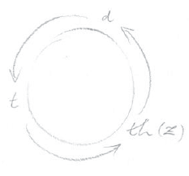
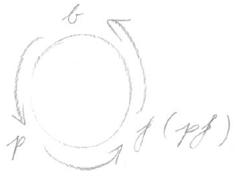
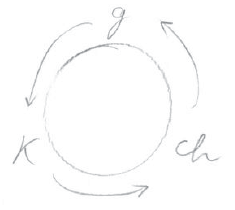
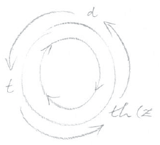

Meine lieben Freunde! Wollen wir nun in unseren Betrachtungen zu einem Ziele kommen, so handelt es sich vor allen Dingen darum, daß wir das ganze Wesen des sogenannten fünften nachatlantischen Zeitraums in des Wortes tiefster Bedeutung nehmen, denn wenn man nicht auf diese konkreten Dinge eingeht, sondern nur stehenbleiben will in allgemeinen Weltbetrachtungen, in allgemeinen Menschheitsbetrachtungen, ohne daß man auf irgendwelche speziellen Dinge Rücksicht nimmt, so kann man nicht zu einem Verständnisse kommen, namentlich nicht über Ereignisse, die von so tief einschneidender Bedeutung sind wie diejenigen, die wir in der Gegenwart erleben, zumal auch immer wieder betont werden muß, daß ja leider das tiefere Verständnis für das Einschneidende dieser Ereignisse in weitesten Kreisen nicht eigentlich vorhanden ist. ^0x6ysp

Nun habe ich Ihnen gestern aus ganz bestimmten Gründen, die aus den weiteren Betrachtungen ersichtlich sein werden, zweierlei angeführt: Erstens, daß gewissermaßen in die Menschheit hineingeworfen worden ist - sozusagen als Versuchsballon - die Schrift von Brooks Adams, um zu sehen, wieviel von solchen Dingen - wenigstens von einzelnen — verstanden werden könne, um zu schauen, ob die Idee verstanden werden könne, die in dem genannten Buch von Brooks Adams ausgeführt ist. Dort ist [aufgrund eines reichen historischen Materials] ausgeführt - ich wiederhole kurz —, daß ein Volksorganismus wirklich auch als Organismus aufzufassen ist, das heißt er entsteht, er macht ein Jugendalter durch, ein Wachstumsalter, ein Reifealter, ein Verfallsalter - ähnlich wie der einzelne Mensch, wenn auch selbstverständlich nur eine Ähnlichkeit, nicht eine Gleichheit vorliegt. Und dann wird darauf hingewiesen, daß in bestimmten Phasen ihrer Entwicklung die Völker jeweils zwei zusammengehörige Eigenschaften ausbilden, nämlich das Imaginative und das Kriegerische in einem Lebensalter, das Wissenschaftliche und das Industriell-Kommerzielle in einem andern Lebensalter. Es wird also von dieser Seite angenommen - wir wollen das nur referieren —, daß nebeneinander wohnen einerseits Völker, die durch ihre Natur imaginativ und kriegerisch sind, und andererseits Völker, die durch ihre Natur wissenschaftlich und industriell-kommerziell veranlagt sind; in der Wechselwirkung solcher Völker aufeinander entwickelt sich der menschheitliche Weltenprozeß. Ich sagte Ihnen [gestern], daß dies eine einseitige, [korrekturbedürftige] Anschauung ist. Wodurch kommen aber solche Anschauungen überhaupt an die Oberfläche? Was bedeutet es, daß sie in die Öffentlichkeit getragen werden? ^qb1e2w

Sehen Sie, bei solchen Anschauungen wie diesen, die wirklich einen Eindruck gemacht haben bei einzelnen Menschen, die schon etwas zu bedeuten haben und die mitten drinnen sind in den Impulsen, die in der Gegenwart wirken, bei solchen Dingen kommt es darauf an, daß immer einzelne Teile der umfassenden geistigen Erkenntnis sagen wir also der okkulten Erkenntnis der Menschheitsevolution — herausgerissen werden aus dem Zusammenhang und - je nachdem man sie braucht oder sie haben will - in die Welt hineinverpflanzt werden. Dadurch, daß man aus dem gesamten Umfange richtiger okkulter Einsichten in die Menschheitsentwicklung das eine oder das andere herausgreift, kann man immer Spezielles im Dienste einer Gruppe, im Dienste irgendeines Gruppenegoismus erreichen. Das Ganze dient immer der ganzen Menschheit; das Einzelne, das herausgegriffen wird, dient immer dem Egoismus einzelner Gruppen. Das ist das Bedeutsame und Wichtige, das man ins Auge fassen muß, weil sehr viele Dinge, die von okkulter Seite in die Öffentlichkeit hineingeworfen werden, nicht unrichtig sind, sondern halbe Wahrheiten sind, Viertels- oder Achtelswahrheiten und gerade dadurch, daß sie einen Teil des Wahren in sich tragen, verwendet werden können, um dieses oder jenes in einseitiger Weise zu erreichen. Daher machte es auf den, der solche Dinge durchschaut, einen bedeutenden Eindruck, als man von Amerika her das 20. Jahrhundert einleitete, indem diese Ideen — wie gesagt durch buchhändlerische Kanäle, die im Dienste von gewissen, sich okkulter Mittel bedienender Bewegungen stehen in die Welt gesetzt wurden. Wir kommen auf diese Sache noch zurück. ^mjvkqs

Das andere, was ich Ihnen angeführt habe, war die merkwürdige Abhandlung des edlen Thomas Morus über die beste Form der öffentlichen Verhältnisse des Staatswesens und die neue Insel Utopia. Nun, ich habe Ihnen gestern vorgelesen aus der Einleitung dieser Abhandlung von Thomas Morus über «Utopia», und sie haben daraus gesehen, daß Thomas Morus das, was er sagen will über dieses Utopien, einem Fremden in den Mund legt, der ja meinetwillen erfunden sein mag, das heißt, den man erfunden nennen kann - erfunden ist er nicht, wie Sie sehen werden. Dieser Fremde - wir werden ihn vielleicht heute noch etwas näher vorstellen können - legt ihm auseinander, daß er eine solche Insel, eben Utopia, gefunden habe, und er entwickelt aus einer gewissen Stimmung über seine Zeit, die ich Ihnen gestern geschildert habe, zuerst seine Empfindungen, und dann schildert er dieses Utopien. ^pau4ht

Nun ist diese Schilderung Utopiens durch Thomas Morus, der diese Ideen gerade im Beginne des fünften nachatlantischen Zeitraums in die Menschheitsentwicklung hineinwirft, wirklich höchst eigentümlich. Und ich muß sagen, ich habe mancherlei Leute gefunden, die «Utopia» gelesen haben, aber ich habe keinen einzigen gefunden, der dieses «Utopia» so genau gelesen hätte, daß er all die sonderbaren Winkelzüge, die sonderbaren Dinge, die in diesem Buche stehen, sich wirklich auch nur zum Bewußtsein gebracht hätte. Man nimmt diese Schilderung der Insel Utopia eben wie die Schilderung eines Phantasielandes und liest so Seite für Seite - das ist ja begreiflich in unserer jeder Spiritualität baren Zeit. Aber man sollte wenigstens bemerken und sich sagen: Entweder schildert Thomas Morus ein Phantasiegebilde, was man, wenn man nur den gewöhnlichen Materialisten-Verstand hat, dann doch nicht begreift, oder aber Thomas Morus muß ein vollendeter Narr, ein Dummkopf gewesen sein. Aber solche konsequenten Konklusionen macht unsere Zeit nicht; sie geht viel lieber über alle diese Dinge hinweg mit einem leichtgeschürzten Verständnis. Nun, ich kann Ihnen natürlich nicht alle Einzelheiten schildern, da müssen Sie die Schrift «Utopia» schon selber lesen, wenn Sie auf die Einzelheiten eingehen wollen, aber ich werde in einigen skizzenhaften Zügen wenigstens den Inhalt dieses Werkes von Thomas Morus vor unsere Seele hinstellen. ^5uhb2q

Zunächst müssen wir es für bedeutsam ansehen, daß Utopien so geschildert wird, daß es eine gewisse Reife in seinen Einrichtungen erlangt hat, denn es wird ausdrücklich gesagt, daß der Zustand, der da geschildert wird, nicht von Anfang an in Utopia vorhanden war, sondern 1760 Jahre gebraucht hat zu seiner Entwicklung, so daß es sich also gewissermaßen um einen Endzustand handelt. ^zg4iww

Das erste, was besonders hervorgehoben wird, ist, daß der Besitz ein gemeinsamer ist, daß niemand ein spezielles Eigentum hat und daß der ganze Staat in gewisse Familien eingeteilt ist, welche, wenn wir so sagen wollen, Älteste wählen. Aus den Ältesten heraus wird wiederum ein Fürst gewählt, und in einer von Zeit zu Zeit einberufenen Versammlung verhandeln die Gewählten über die öffentlichen Angelegenheiten in dem Sinne, wie sie von den einzelnen Gliedern des Volkes beauftragt worden sind. Dabei finden wir gleich eine höchst merkwürdige Einrichtung in Utopien: Es ist nur gestattet, über öffentliche Angelegenheiten auf den vorgeschriebenen Wegen zu verhandeln. Wenn jemand in Utopien sich privatim mit andern Menschen über öffentliche Angelegenheiten unterhält, so steht auf einer solchen Handlungsweise der Tod. ^2s5v1a

Ferner finden wir eine höchst vernünftige Einrichtung: Wenn ein Vorschlag in der öffentlichen Versammlung gemacht wird, so darf niemals über diesen Vorschlag gleich irgendwie verhandelt werden, sondern die Leute müssen erst nach Hause gehen und nachdenken, und erst später wird dann die Sache verhandelt. Derjenige, der das erzählt, gibt an, daß auf diese Weise die Leute nachdenken können und nicht dazu getrieben werden, vorschnell ein Urteil abzugeben, an dem sie dann, getrieben von Eigensinn und Egoismus, selbstverständlich festhalten, aber nicht, weil sie die Sache für gut befinden, sondern weil sie sich einmal mit ihrem Urteil engagiert haben. ^ah3twi

In Utopien muß jeder als Kind den Ackerbau lernen, später aber auch ein Handwerk, in der Regel dasjenige, das die Eltern betreiben; er kann aber auch ein anderes Handwerk wählen, wenn er dazu geschickt ist. Die Arbeit ist streng geregelt, niemand braucht mehr als sechs Stunden am Tag zu arbeiten. Alles übrige ist auch in der besten Weise eingeteilt: Drei Stunden am Vormittag arbeitet man; vorher aber, und zwar schon bei Sonnenaufgang, versammeln sich die Menschen, die das wollen, und bekommen da geistige Dinge und dergleichen zu hören. Spiele von der Art, wie sie außerhalb Utopiens stattfinden, gibt es nicht; dagegen gibt es ein Kampfspiel, das dem Schachspiel ähnlich ist, eine Art arithmetischer Schlacht, und dann gibt es noch ein anderes Kampfspiel, das - wiederum in schachartiger Weise - den Kampf der Laster mit den Tugenden darstellt. Unter der Aufsicht der öffentlich gewählten Personen werden diejenigen, die dazu geeignet sind, zu Gelehrten gemacht; aus ihnen wiederum werden die Gesandten und die Priester gewählt. Die schmutzigsten Arbeiten machen die Sklaven, welche sich rekrutieren entweder aus den Leuten von eroberten Völkern oder aus den Verbrechern. Jeder wirkliche Utopier ist frei. Dann findet sich eine Einrichtung in Utopia, die wir andern Nicht-Utopier jetzt erst genießen: Reisen kann man nicht, ohne daß man die Erlaubnis bekommt von der entsprechenden Behörde. Für jede einzelne, selbst die kleinste Reise muß ein Paß vorliegen. ^wmsnr7

Geld gibt es nicht. Was zur Verfügung steht, wird auf die Märkte gebracht; dort kann es sich jeder abholen. Durch die Einrichtungen, die so gut sind, daß keiner mehr holt, als er braucht, braucht niemand irgend etwas zu bezahlen, sondern er bekommt alle Dinge. Es ist eben nicht nötig, daß man Geld oder dergleichen hat. Das einzige Metall, das wirklich geschätzt wird, ist das Eisen - ich bitte Sie, darauf besonders zu achten, denn darin liegt etwas sehr Bedeutsames. Wenig geschätzt ist das Silber, am allerwenigsten das Gold. Aus dem Golde werden nicht diejenigen Dinge hergestellt, die die NichtUtopier daraus machen, sondern aus dem Golde werden höchstens allerlei Ketten und dergleichen gemacht, die die Verbrecher zu tragen haben: Mit goldenen Ketten zum Beispiel werden sie angeschmieder; goldene Ketten haben sie als Schandmal zu tragen. Dann werden gewisse Gefäße aus Gold gemacht, von denen man in anständiger Gesellschaft nicht reden darf, und dergleichen mehr. Das bewirkte, als einmal die Gesandten eines fremden Hofes nach Utopien kamen und glaubten, den Utopiern dadurch zu imponieren, daß sie in Goldgepränge kamen, daß diese sie für sehr minderwertige Leute ansahen, weil in Utopien eben nur die Verbrecher Gold tragen oder man höchstens für die allerjüngsten Kinder etwas Spielzeug aus Gold macht, was diese dann aber wieder wegwerfen. Als die fremden Gesandten kamen, stellten sich die Kinder auf die Straßen und sagten: Da seht einmal hin, das sind so alte Hänse, die haben noch immer Kinderspielzeug bei sich. - Es gilt nichts in Utopien, wenn jemand ein feines Kleid trägt, denn die Utopier sagen: Wie kann sich jemand etwas darauf einbilden, daß er ein Kleid aus dieser oder jener Wolle trägt - das haben ja die Schafe zuerst getragen! Man kann sich doch nichts einbilden auf etwas, was zuerst die Schafe in natürlicher Weise an sich getragen haben. ^f67kux

Dann ist in Utopien die Eigentümlichkeit vorhanden, daß über Gut und Böse, über Tugend und Laster nicht anders geurteilt wird als im Zusammenhange mit religiösen Vorstellungen. Ein gewisser Epikureismus in Vergnügungen gilt als das, was man im Leben zu erstreben hat, und je vergnügter man sich das Leben macht, desto tugendhafter ist man in Utopien. Die Utopier glauben an die unsterbliche Seele des Menschen und haben eine Art Vernunftreligion, indem sie der Anschauung sind, jeder Mensch könne durch seine eigene Vernunft einsehen, daß Gott wie ein Werkmeister die Welt regiere, daß der Mensch eine unsterbliche Seele habe, daß er nach dem Tode in eine geistige Welt eingehe, in der es Belohnungen und Bestrafungen für Tugend und Laster gibt. Von Edelsteinen halten sie nichts, denn sie sagen: Wenn irgend jemand einen Edelstein kauft, so läßt er sich von dem Verkäufer beschwören, daß es ein echter ist was kann denn das für eine Bedeutung haben, wenn man nicht einmal mit dem Auge sieht, ob es ein echter oder unechter Edelstein ist? — Das kann also nur bei den Utopiern so sein. Die Jagd ist bei ihnen als unwürdig verpönt; sie darf nur ausgeübt werden durch die Metzger; ihr Gewerbe ist kein angesehenes. ^2mgcuo

Der Mann, der diese Mitteilungen macht, erklärt, daß er selber die Utopier mit griechischer Literatur, mit griechischer Kunst bekannt gemacht habe und daß sich die Utopier als außerordentlich gelehrig erwiesen hätten, daß sogar ihre Sprache etwas an das Griechische anklinge, wie ihre Kultur überhaupt das Eigentümliche habe, daß sie an das Griechische in einer Mischung mit dem Persischen erinnere. Wie Gatte und Gattin gewählt werden, will ich nicht beschreiben, aus Gründen, die Sie ersehen werden, wenn Sie das Buch lesen. Advokaten gibt es nicht in Utopien, weil man sie für die allerschädlichsten Menschen hält. Verträge werden nicht abgeschlossen, weil die Utopier glauben, daß, wer etwas einhalten wolle, es auch ohne Vertrag halte, und wer etwas nicht halten wolle, es auch dann nicht halte, wenn er einen Vertrag gemacht habe. Im Kriege vermeiden sie, wenn irgend möglich, das Blutvergießen; das gilt ihnen als das Schändlichste, was es nur geben kann. Sie sagen: Wenn man im Kriege Blut vergießt, so ist man den Tieren gleich; Wölfe und Tiger machen es auf diese Weise, aber der Mensch hat seine Intelligenz. - Nur im äußersten Falle, wenn sie nicht auf andere Weise zurechtkommen, vergießen sie Blut. Sie schicken nämlich unter diejenigen, die sie bekriegen wollen, allerlei Leute, die entweder die Aufgabe haben, die Leute in Uneinigkeit zu bringen, damit sie sich selber in die Haare fahren, oder sie haben die Aufgabe, den einen oder den andern zu ermorden oder dergleichen. Sie suchen also durch «Liebe und Vernunft», wie sie sagen, Zwietracht und Uneinigkeit hervorzurufen, so daß die Menschen, die sie bekriegen wollen, sich gegenseitig aufreiben, und erst, wenn ihnen das nicht gelingt, greifen sie zu den Waffen, um Blut zu vergießen. Aber auch da haben sie ihre ganz besonderen Usancen, die zeigen, daß sie mit dem Blutvergießen sobald als möglich aufhören wollen, wenn sich nur irgend die Gelegenheit dazu ergibt. ^5k399o

Weiter wird erzählt, daß ein Grundzug der Utopier ist, religiöse Toleranz zu üben. Jeder kann, wenn er nicht gegen die Gesetze verstößt, jeder beliebigen Sekte angehören, jede Religionsanschauung vertreten. Das habe der Begründer von Utopien, Utopus, gleich so eingerichtet; aber jeder müsse an ein höchstes Wesen glauben, das sie «Mythra» nennen. Derjenige, der das erzählt, hat auch versucht, das Christentum dort einzuführen. Für dieses haben sie ein außerordentliches Entgegenkommen gezeigt, haben es wirklich als die beste Religion erkannt. Es herrscht in höchstem Maße religiöse Toleranz dort; jeder kann glauben, was er will - bitte, ich erzähle, wie die Dinge da geschildert sind -, jeder kann glauben, was er will. Dagegen darf jemand, der ein Materialist ist, der nicht an die Unsterblichkeit der Seele glaubt, keine irgendwelchen bürgerlichen Rechte genießen oder irgendwie dieselben Rechte haben wie ein gewöhnlicher Utopier; er wird sozusagen für rechtlos erklärt. Es gibt dort eine Sekte, welche die Tiere gleich wie die Menschen für beseelte Wesen hält. Priester gibt es, welche die Leute in besonderen Mysterienkirchen belehren und ihnen Kulte vorführen. Feste werden am Ende und am Beginn des Jahres gefeiert. Musikinstrumente gibt es, aber die sind von etwas anderer Art als bei den Nicht-Utopiern. Sie sind besonders geeignet, dasjenige in Tönen wiederzugeben, was die menschliche Seele in den verschiedensten Stimmungen empfindet und so weiter. ^ewfywd

Ich habe Ihnen alles so erzählt, wie es in dem Buche selbst geschildert wird. Es wird Ihnen aufgefallen sein, daß ich Ihnen an einer Stelle erzählt habe, bei den Utopiern herrsche eine Vernunftreligion, jeder glaube das, was ihm seine Vernunft eingibt. Dann wieder wird erzählt, daß das Christentum eingeführt wurde und daß alle an eine Art Mythra glauben. Dann heißt es wiederum, daß eine Art Toleranz herrsche, daß aber jeder, der ein Materialist sei, nicht die gleichen Rechte habe. Kurz, Sie werden in dem Buch Widerspruch über Widerspruch finden. Um was handelt es sich denn nun eigentlich in diesem Buche, was soll denn da eigentlich geschildert werden? ^u0x90c

Was da geschildert werden soll, ist wirklich nur aus den Grundlagen der Geisteswissenschaft heraus zu verstehen. Seien wir uns ganz klar darüber: Thomas Morus ist, wie Pico della Mirandola und andere, ein Mensch, welcher mit einem Teil seines Wesens noch drinnensteht in den Nachwirkungen des vierten nachatlantischen Zeitraumes und mit der andern Seite seines Wesens schon in den fünften nachatlantischen Zeitraum hineinragt. In gewisser Beziehung ist er aber auch ein Mensch, der dies weiß, der dies mit vollem Bewußtsein zur Entwicklung bringt, weil er ein gewisses geistiges Leben hat. Thomas Morus hat viele Stunden des Tages in Meditationen zugebracht, und er hat durch seine Meditationen ganz bestimmte Erfolge gehabt. Aber diese Erfolge kamen dadurch zustande, daß er eben, wie gesagt, mit einem Teil seines Wesens noch im vierten nachatlantischen Zeitraum drinnen lebte und noch Atavistisches in ihm sich verband mit dem bewußten Hinauftreiben der Seele in die geistige Welt. Dabei lebte er aber doch schon ein Jahrhundert nach dem Beginne des fünften nachatlantischen Zeitraumes, und in seiner Seele war alles vorhanden, was den fünften nachatlantischen Zeitraum charakterisiert: die Intellektualität, der Verstand, wie wir ihn heute kennen und wie er im vierten nachatlantischen Zeitraum noch nicht da war - oder nur nach der Meinung derer, die die Geschichte phantastisch auffassen, da war. Das alles wirkte in seiner Seele zusammen und durcheinander. Wie es in solchen Seelen aussah, das können Sie auch bei Pico della Mirandola studieren und an seinem Verhältnis zu Savonarola. ^ii6cwe

Also, wir haben es zu tun mit einem Menschen, in dessen Seele wir schon ein bißchen hineinblicken müssen, wenn wir verstehen wollen, um was es sich gerade bei seinen Utopien handelt. Sehen Sie, solch ein Mensch wußte, daß in der Menschheitsevolution okkulte Impulse walten und weben - das wußte er genau. Und er wußte, daß es sich in der Wende des vierten zum fünften nachatlantischen Zeitraum darum handelte, einen richtigen Impuls für viele Leute zu geben. Ob sie ihn gebrauchen, das ist ja dann eine andere Frage. Was wußten solche Leute - es war damals so, heute sind die Dinge wieder anders, aber darüber haben wir ja schon oft gesprochen -, was wußten denn solche Leute? Sie wußten, daß die Menschheit in die Dekadenz kommen muß, wenn sie nur dasjenige entwickelt, was, ich möchte sagen unspirituell ist, was nur ausgedacht ist, was nur Vernunftgabe ist. Solche Menschen wußten, daß die Menschheit vertrocknet, bis ins Physische hinein vertrocknet - natürlich nicht in ein paar Jahrhunderten, aber in langer Dauer -, wenn nur der trockene Verstand, nur das, was den materialistischen Anschauungen zugrunde liegt, entwickelt wird. Solche Leute haben einen ganz andern Wahrheitsbegriff als den, der sich in der fünften nachatlantischen Zeit allmählich herausgebildet hat. Solche Menschen wissen, daß Dinge gedacht werden müssen, die sich nicht auf den physischen Plan beziehen, denn - ganz abgesehen davon, wie es um die Wahrheit solcher Dinge steht -, der Mensch muß, wenn er nicht verdorren will, Gedanken haben, die sich nicht auf den physischen Plan beziehen. Das sind die belebenden Gedanken, das sind diejenigen Gedanken, die überhaupt das Leben möglich machen und vorwärtsbringen. Das ist es, was neben dem Wahrheitswert des Spirituellen in Betracht kommt. ^6fgixu

Durch seine Meditationen war Thomas Morus dazu gelangt, in halb atavistischer, halb bewußter Weise Vorstellungen der höheren Welt zu haben, die sich aber bei ihm durcheinander mischten mit den Elementen der Traumeswelten. Und in solchen wirklichen inneren Erlebnissen hat sich ihm jenes ergeben, was er in «Utopia» erzählt. Das ist nicht etwas Ausgedachtes, das ist nicht eine Phantasie, sondern etwas, was er wirklich als Frucht seiner Meditationen erlebt hat. Er hat es so hingestellt, wie er es erlebt hat, um zu sagen: Seht, ein Mensch, der unter König Heinrich VIIT. in England lebt, der sogar ein Staatsdiener Heinrichs VIII. ist, der die Gefühle, die inneren Wünsche, die inneren Ziele Englands in dieser Zeit in seiner Seele trägt, der erlebt, wenn seine Schauungen sein Inneres durchwühlen, dieses als eine Art Staatsideal. - Er wollte ausdrücken, welches die Wünsche, die Ziele, die Ideen sind, die gewissermaßen im Unterbewußten lauern bei denen, die mit der Außenwelt nicht zufrieden sind; das wollte er hinstellen. Man kann also sagen: Es ist die astralische Selbsterkenntnis eines Menschen der damaligen Zeit. ^g5pf5f

Solch ein weiser Mensch wie Thomas Morus stellt nicht einfach ein phantastisches Zukunftsideal hin, sondern er stellt das hin, was er erlebt, weil er dadurch, auf seine Art und seinem Zeitalter gemäß, die große Wahrheit vor die Menschen hinstellen will, daß die äußere, sinnliche Wirklichkeit eine Maja ist und daß man diese äußere, sinnliche Wirklichkeit mit der übersinnlichen Welt zusammenhalten muß. ‚Aber wenn man sie so zusammenhält, daß man zugleich alle Begierden, alle Wünsche, die einem bestimmten Zeitalter angehören und die aus der Natur dieses Zeitalters heraus da sind, mit hineinwirken läßt, so entsteht etwas, was man, wenn man es so anschaut, nun durchaus nicht etwa als ein Ideal hinstellen möchte. Denn ich darf ja wohl gestehen: Wenn ich selber in Utopien geboren wäre, so würde ich wahrscheinlich als meine nächste Aufgabe betrachten, diese utopistischen Zustände so schnell wie möglich zu überwinden und durch andere zu ersetzen. Vielleicht würde ich sogar die Zustände, die da oder dort auf unserer Erde herrschen - abgesehen von den jetzigen Zeiten - für viel idealere anschauen als diejenigen, die in Utopien herrschen. Aber Thomas Morus wollte ja auch keine Idealzustände schildern, sondern das, was er unter den Verhältnissen, wie ich sie beschrieben habe, wirklich erlebt hat. Er wollte gewissermaßen den Menschen sagen: Wenn ihr eure Wünsche sehen könntet, wenn ihr sehen könntet, was ihr euch vorstellt über ideale Zustände, dann würde es so ausschauen - so ausschauen, daß ihr jedenfalls damit auch nicht einverstanden sein würdet. Jetzt kennen wir auch diesen Fremden, [der die Beschreibung Utopiens gibt]: Dieser Fremde ist das astralische Selbst des Thomas Morus. ^lsk1qo

Diese Dinge müssen viel realer genommen werden, als man gewöhnlich meint. An bestimmten Stellen, meine lieben Freunde, an bestimmten Stellen der Menschheitsevolution muß man die grundlegenden Tatsachen aufsuchen, um diese Menschheitsevolution zu verstehen. Das Urteil ist jedenfalls nicht so zu gestalten, daß man aus den paar Tatsachen, die gerade in der Umgebung liegen und von den Menschen der Umgebung noch gar zubereitet werden, irgendein gültiges Urteils ableiten könnte. Man könnte daraus bloß ein Urteil ableiten, das gerade den Sympathien und Antipathien entspricht, was ja in allen Ehren gelten mag, aber weiter kommt man damit nicht, und der Menschheit kann man keine Dienste damit leisten. So wollte ich Ihnen zunächst einen Menschen hinstellen, der für den Umschwung des Zeitalters - für die Wende des vierten nachatlantischen Zeitraums zum fünften - besonders charakteristisch ist; wir werden auf alle diese Dinge noch zurückkommen. Ich wollte Ihnen einen Menschen schildern, der das Charakteristische des tieferen Seelenlebens wirklich an die Oberfläche fördert, es zum Selbsterlebnis bringt. Ich will zunächst nur diese Tatsache vor Sie hinstellen. ^xz0r93

Wenn wir die Zusammenhänge verstehen sollen, um die es ja manchen unter unseren Freunden - wie es als Wunsch ausgedrückt worden ist — zu tun ist, haben wir es ferner nötig, die konkrete Realität dessen, was Volksseele ist, wirklich zu verstehen, denn unsere materialistische Zeit und Empfindungsweise ist nur allzu geneigt, die Volksseele zu verwechseln mit der einzelnen Seele, das heißt, wenn man von einem Volke spricht, zu glauben, daß dieses in der Realität etwas zu tun hat mit den einzelnen Angehörigen eines Volkes. Für den Okkultisten ist es unsinnig — wenn ich einen Vergleich gebrauchen darf, der allerdings grob ist, der Ihnen aber veranschaulichen kann, worum es sich handelt -, für den Okkultisten ist es unsinnig, jemanden, der sich einen Engländer oder einen Deutschen nennt, mit seiner Volksseele zu identifizieren, ebenso wie es unsinnig ist, den Sohn oder die Tochter mit dem Vater oder der Mutter zu identifizieren. Es ist, wie gesagt, ein grober Vergleich, weil wir es hier mit zwei physischen Wesenheiten zu tun haben, und dort mit einer physischen und einer nicht-physischen Wesenheit, aber in beiden Fällen haben wir zwei ganz verschiedene Gebilde, wenn man sie konkret betrachtet - zwei ganz verschiedene Wesenheiten. ^rrh0he

Verstehen, meine lieben Freunde, wird man allerdings das, was da zugrunde liegt - was aber zu verstehen höchst notwendig ist, wenn man überhaupt von diesen Dingen mit einer realen Unterlage reden will —, verstehen wird man diese Dinge erst von dem Zeitpunkt an, wo man ernsthaft die Geheimnisse der wiederholten Erdenleben und des damit zusammenhängenden Karmas begreift. Denn es liegt eine ungeheuer bedeutsame Wahrheit darin, daß man ja nur mit einer Inkarnation in einem Volke drinnensteckt, aber in der eigenen, individuellen Wesenheit etwas ganz anderes trägt als das, was in der Volksseele ist - etwas, was unendlich vielmehr und wiederum unendlich viel weniger ist als die Volksseele. Sich zu identifizieren mit der Volksseele, hat der Realität gegenüber überhaupt keinen Sinn, wenn es etwas anderes sein soll, als das, was man mit den Worten Vaterlandsliebe, Heimatliebe, Patriotismus und dergleichen bezeichnet. Aber richtig sehen wird man diese Dinge erst, wenn man ernsthaft und tief die Wahrheiten von Reinkarnation und Karma ins Auge fassen kann. Ich habe in der letzten Zeit an verschiedenen Orten gesprochen von dem Zusammenhange der Menschenseele im Dasein zwischen Tod und neuer Geburt mit dem, was auftritt, wenn der Mensch dann durch die Geburt ins irdische Dasein tritt. Ich habe darauf aufmerksam gemacht, daß der Mensch zwischen Tod und neuer Geburt mit denjenigen Kräften in Verbindung ist, die die Menschen durch Generationen zusammenführen, also solche Verhältnisse bewirken, daß zuletzt durch die Bedingungen der Generationenfolge, durch das beständige Zusammenführen von Elternpaaren, durch die Nachkommenschaft der Mensch zwischen Tod und Geburt in einer ganz bestimmten Strömung drinnen ist, die zuletzt dahin führt, daß da ein Elternpaar ist, durch das er sich verkörpern kann. So wie man im physischen Leben mit seinem physischen Leib zusammenhängt, so hängt man zwischen Tod und Geburt zusammen mit den Verhältnissen, welche die Geburt vorbereiten aus einem bestimmten Elternpaar heraus. Also darin, daß man diesen Vater, diese Mutter hat, daß dieser Vater wieder jenen Vater, diese Mutter wieder jene Mutter hat und so weiter hinauf, in alldem, was sich da in den verschiedensten Verzweigungen verästelt, was da in der verschiedensten Weise zusammenwirkt, in alldem steckt man drinnen durch Jahrhunderte. Ich mache Sie darauf aufmerksam, daß es schon eine stattliche Anzahl von Jahrhunderten ist, wenn man nur in dem, was sich durch dreißig Generationen zieht, drinnensteckt, denn von Karl dem Großen bis auf unsere Zeit sind es etwa dreißig Generationen. In alldem, was sich da so vollzieht an Sich-Lieben und Sich-Finden, an Nachkommenschaft-Erzeugen und zuletzt zu dem Elternpaar führt, aus dem man geboren wird, in alldem steckt man selbst darinnen, das bereitet man selber vor. ^4rnjjk

Ich wiederhole dies aus dem Grunde, weil es bei jenen Persönlichkeiten, die man die Führenden nennt und die man als Führende in einer gewissen Weise anerkennen kann, wichtig ist einzusehen, wie gerade durch die Tatsache, die ich jetzt vorgeführt habe, das zustande kommt, was sie dann für die Menschheit bedeuten. Ich möchte Ihren Blick auf eine führende Persönlichkeit lenken, möchte aber das, was über sie zu sagen ist, zuletzt gipfeln lassen in einem Ausspruch, den ein anderer über diese Persönlichkeit getan hat - sie werden gleich sehen, warum. Ich möchte Ihren Blick lenken auf die Persönlichkeit Dantes. ^xo4vb5

Da haben wir also eine Persönlichkeit im Ausgang des vierten nachatlantischen Zeitraums — eine ganz hervorragende Persönlichkeit. Wir können eine solche hervorragende Persönlichkeit jenen Persönlichkeiten gegenüberstellen, die nach dem Eintritt des fünften nachatlantischen Zeitraums eine gewisse Bedeutung erlangt haben, wie zum Beispiel Thomas Morus. Fassen wir dasjenige, was wir im allgemeinen erkannt haben, bei einer solchen Persönlichkeit wie Dante ins Auge. Solch eine Persönlichkeit wirkt weithin impulsierend, weithin bedeutungsvoll. Da ist es schon interessant, wenigstens ahnend darüber nachzudenken, wie denn eine solche Seele, eine solche Persönlichkeit, bevor sie durch diejenige Geburt, die für die Menschheit bedeutend wird, ins physische Erdendasein tritt, sich gewissermaßen, wenn ich den etwas barocken Ausdruck gebrauchen darf, das zusammenstellt, was sie braucht, damit sie dann in der richtigen Weise durch das richtige Elternpaar geboren wird. Selbstverständlich werden diese Verhältnisse aus der geistigen Welt heraus zustande gebracht, aber sie werden dann mit Hilfe der physischen Werkzeuge realisiert, so daß gewissermaßen aus der geistigen Welt heraus dieses Blut zu jenem Blut dirigiert wird und so weiter. In der Regel könnte eine solche Persönlichkeit wie Dante nie zustande kommen aus einem homogenen Blut heraus. Einem einzigen Volke anzugehören, ist für eine solche Seele geradezu unmöglich; da muß schon eine geheimnisvolle Alchemie stattfinden, das heißt, es muß Blut aus verschiedenen Völkern zusammenfließen. Und was diejenigen auch sagen mögen, welche in Überpatriotismus die großen Persönlichkeiten für ein Volk in Anspruch nehmen wollen - da steckt nicht viel Reales dahinter! ^diw359

Was Dante betrifft, so möchte ich zunächst, damit Sie sehen, daß ich nicht irgendwie parteiisch bin, einen andern über ihn sprechen lassen, denn man könnte sonst sehr leicht glauben, daß ich irgendwie Politik treibe, was mir natürlich so fern wie möglich liegt. Einen andern will ich schildern lassen, was in seinem Wesen deutlich zu sehen ist für denjenigen, der auf dieses Wesen einzugehen versteht. Deshalb habe ich bei Carducci nachgeforscht, dem großen italienischen Dichter der neueren Zeit, der ein großer Dante-Kenner war. Aber hinter ihm steht - und besonders aus diesem Grunde führe ich ihn an -, auch das, was man in Italien die «massoneria» nennt, das, ^fhrrux

was mit all den okkulten Verbrüderungen zusammenhängt, auf die ich Sie aufmerksam gemacht habe, so daß Carduccis theoretische Auseinandersetzungen über die realen Dinge des Lebens doch bis zu einem gewissen Grade von einer solchen tieferen Erkenntnis getragen sind. Nicht daß er diese Erkenntnis überall auf den Markt geworfen hätte, nicht daß er irgendwie Okkultist gewesen wäre - das will ich nicht behaupten -, aber in dem, was er sagt, steckt doch manches, was auf allerlei geheimnisvollen Kanälen zu ihm gekommen ist. Das ist es, was seinen Äußerungen zugrunde liegt. ^u9sywb

Nun sagt Carducci, in Dante würden drei Elemente zusammenwirken, und nur dadurch, daß diese drei Elemente zusammenwirken, sei das zustande gekommen, was Dante war. Das erste sei ein altetruskisches Element - durch gewisse Glieder in seiner Abstammungsreihe sei es auf ihn gekommen, denn in diesen zurückliegenden Generationen liegt eben Verschiedenes, das zuletzt zu dem Elternpaar von Dante geführt hat. Und von diesem altetruskischen Elemente, sagt Carducci, habe Dante das, was ihm die übersinnlichen Welten erschlossen habe - dadurch habe er in solch tiefer Weise über die übersinnlichen Welten sprechen können. Zweitens liege in ihm, so sagt Carducci, das romanische Element. Von diesem habe er die Art des Alltagslebens und das Ausgehen von gewissen Rechtsbegriffen. Und als drittes, sagt Carducci, liege in Dante das germanische Element. Von diesem habe er die Kühnheit und Frische der Anschauung und einen gewissen Freimut, ein gewisses festes Eintreten für das, was er sich vorgesetzt hat. Aus diesen drei Elementen setzt sich für Carducei das Seelenleben Dantes zusammen. ^x33t9f

Das erste weist uns hin auf Altkeltisches, das ihn irgendwie durchblutet - wenn ich das Wort gebrauchen darf - und ihn unmittelbar in Zusammenhang bringt mit dem dritten nachatlantischen Zeitraum, denn das Keltische im Norden führt zurück in das, was wir kennengelernt haben als den dritten nachatlantischen Zeitraum. Dann finden wir den vierten nachatlantischen Zeitraum im romanischen, den fünften im germanischen Elemente. Aus diesen drei Zeiträumen und ihren Impulsen setzen sich für Carducci die Elemente in Dantes Seele zusammen, so daß wir also wirklich drei Schichten haben, welche nebeneinander oder vielmehr übereinander gelagert sind: dritter, vierter, fünfter nachatlantischer Zeitraum - keltisch, romanisch, germanisch. Gute Dante-Forscher haben viele Bemühungen angestellt, um dahinterzukommen, wie Dante von der geistigen Welt aus sein Blut in der Weise hat mischen können, daß es ein so zusammengesetztes wurde — das heißt, sie haben es natürlich nicht mit diesen Worten ausgesprochen, wie ich es jetzt gesagt habe, aber sie haben sich [nach dieser Richtung] bemüht, und manches ist, so glauben diese Leute, dadurch zustande gekommen, daß ein gut Teil von Dantes Vorfahrenschaft zum Beispiel in Graubünden zu finden sei. Das kann die Geschichte schon bis zu einem gewissen Grade bekräftigen: Nach allen Windrichtungen, aber auch nach dieser Gegend hin, wo so viel Blutmischung stattgefunden hat, weist der Vorfahrenzug Dantes. ^ua6ift

Da sehen wir, wie an einer einzelnen Persönlichkeit das merkwürdige Zusammenwirken der drei Schichten in der europäischen Menschheitsentwicklung zutage tritt. Und Sie sehen, ein Mann wie Carducci, der dieses Urteil nicht unter dem Einfluß der heutigen völkischen Tollheit gefällt hat, sondern aus einer gewissen Objektivität heraus, ist es, welcher auf das hinweist, was bei Dante zugrunde liegt. Nun, damit aber berühren wir Verhältnisse, die überall dort bekannt sind, wo über die Menschheitsentwicklung vom okkultistischen Standpunkte aus so gesprochen wird, daß man auf die wirklichen Verhältnisse sieht - man rechnet mit ihnen und will sie auch als Kräfte benützen, wenn man dieses oder jenes tut. Diese Verhältnisse sind in den rechtmäßigen okkulten Bruderschaften keineswegs unbekannt, sie sind auch denjenigen bis zu einem gewissen Grade nicht unbekannt, die die Dinge nach der einen oder nach der anderen Richtung in den Dienst irgendeines Gruppenegoismus stellen. Denn das Geheimnis von dem Zusammenwirken der drei aufeinanderfolgenden Schichten, das ja hauptsächlich für Europa eine große Bedeutung hat, dieses Geheimnis wird in allen okkulten Bruderschaften, die dieses Namens wert sind, mit großer Sorgfalt besprochen - nur natürlich zuweilen auch ablenkend in der einen oder andern Weise von dem, was man die gute Richtung nennen kann. Also, das bitte ich Sie ganz genau festzuhalten, daß man in solchen Dingen Erkenntnisse hat, die gelehrt werden - wenn man auch in der äußeren, gescheiten Welt oftmals so wenig davon wissen will-, und zwar mit einer besonderen Sorgfalt und Systematik gelehrt werden, insbesondere in westlichen und in amerikanischen okkulten Bruderschaften. ^38l4sg

Nun will ich Sie, nachdem ich in dieser Weise den Weg vorbereitet habe, auf etwas hinweisen, was gewissermaßen Evolutionsgeheimnis ist und was auch immer gelehrt wird- allerdings mit den verschiedenartigsten Zielen gelehrt wird. Ich will Sie jetzt hinweisen auf einige besondere Lehren, welche ich einfach referierend mitteilen will. Diese Lehren haben den Inhalt [der Unterweisungen gewisser Bruderschaften] gebildet, namentlich intensiv am Ende des 19. Jahrhunderts; sie haben sich dann im 20. Jahrhundert fortgesetzt. Sie sind aber besonders am Ende des 19. Jahrhunderts in Angriff genommen worden, haben einen besonders intensiven Einfluß gewonnen, und man hat versucht, sie überall dort hineinzutragen, wo man es für notwendig fand, um sie zu gewissen Zwecken, zu gewissen Zielen zu gebrauchen. Ich will Ihnen also zuerst, ohne daß ich Kritik übe, sondern indem ich bloß referiere, gewisse Lehren aus okkulten Bruderschaften Englands mitteilen - ich spiele also auf das an, wozu ich Sie vorbereitet habe. ^cs9rph

Da wurde und wird gelehrt: Die Evolution Europas kann man nur verstehen, wenn man zunächst zurückblickt auf den Übergang des romanischen, des vierten nachatlantischen Zeitraums, zum fünften nachatlantischen Zeitraum. Und weiter wurde gelehrt - also bitte das streng nur als Referat aufzufassen -, es wurde gelehrt, daß man verstehen müsse das Geheimnis des Überganges vom vierten in den fünften nachatlantischen Zeitraum oder, wie man in diesen Bruderschaften sagte, von der vierten in die fünfte Unterrasse. - Sie wissen, wir können diesen Ausdruck «Unterrasse» aus oft schon wiederholten Gründen nicht anführen, weil man dadurch schon ein einseitiges Ziel, ein gewisses Gruppenziel verfolgt, während es uns nie um Gruppenziele zu tun ist, sondern immer um die allgemeinen menschheitlichen Ziele. Es wurde also gelehrt, daß man verstehen müsse den Übergang von der vierten in die fünfte Unterrasse. Die vierte Unterrasse stellen im wesentlichen die romanischen, die lateinischen Völkerschaften dar. Es ist in der Menschheitsevolution so, daß das, was sich nacheinander entwickelt, nicht etwa so verläuft, daß einfach das Nachfolgende hinter dem Vorhergehenden steht, sondern das Vorhergehende bleibt neben dem Nachfolgenden vorhanden, so daß dann räumlich nebeneinander leben das Vorhergehende und das Nachfolgende. So ist die vierte Unterrasse, die wesentlich aus dem romanisch-lateinischen Element besteht, auch während des Zeitraumes der fünften Unterrasse, die mit dem Beginne des 15. Jahrhunderts ihren Anfang nahm, in ihren Nachzüglern - eben in den romanisch-lateinischen Völkerschaften — bestehen geblieben. ^0c9w0e

Die fünfte Unterrasse stellen [nach jener Lehre] diejenigen Völker in der Welt dar, welche berufen sind, Englisch zu sprechen - die englischsprechenden Völker stellen die fünfte Unterrasse dar. Und die ganze Aufgabe des fünften nachatlantischen Zeitraums besteht darin, die Welt für die englischsprechenden Völker zu erobern. Es wird so sein, daß die Überbleibsel der vierten Unterrasse, die lateinisch angehauchten Völker, augenscheinlich immer mehr und mehr in einen gewissen Materialismus verfallen werden. Diese Völker enthalten in sich das Element der inneren Auflösung, und sie tragen auch in physischer Beziehung das Element der Dekadenz in sich - wie gesagt, ich referiere nur, ich stelle nicht irgend etwas dar, was eine Behauptung von mir ist, sondern ich referiere bloß. [Und es wird dann noch gesagt], daß das [führende] Element der fünften Unterrasse die Anlage zum Spiritualismus, zum Erfassen der geistigen Welt enthalte. ^u6grsl

Nun müsse man verstehen, wie die vierte Unterrasse auf die fünfte gewirkt hat. Man müsse - so wird gelehrt - den Blick zunächst zurückwenden bis dahin - wenn man ihn nicht weiter zurückgehen lassen wolle-, wo diejenigen Völkerschaften im Norden, die dann zu den Britanniern, Galliern, Germanen geworden sind, ans Römische Reich herangekommen sind. Man warf die Frage auf: Was waren eigentlich diese Völkerschaften, die da vom Norden herankamen zu der Zeit, als sie vom Römischen Reich bekriegt wurden, als also gewissermaßen der Kampf ausbrach zwischen der vierten und fünften Unterrasse - was waren denn diese Völkerschaften? Als Völker waren sie dem Lebensalter nach sozusagen Kleinkinder - «Säuglinge». Also, wichtig ist gerade das festzuhalten, daß die Römer - das romanische Element, die Angehörigen der vierten Unterrasse - kamen, um diese Völkerschaften wie eine «Amme» zu pflegen. Man braucht diese Ausdrücke, um eben die Analogien zwischen dem Volkselemente und dem Elemente des individuellen Menschen darzustellen. Also, die Römer wurden sozusagen zu Ammen, [zu Kindermädchen], und diese Ammenschaft dauerte so lange, wie sich die Herrschaft der Römer über die mehr oder weniger im Säuglingsalter befindlichen Völker im Norden erstreckte. ^bezwf0

Vom Kleinkind wird man zum Schulkind - das ist die Zeit, in der das Papsttum in Rom gegründet wurde und der Papst mit seiner Herrschaft zum [«Erzieher» und] «Vormund» des Kindes wird, so wie das romanische Element, der frühere Romanismus, die «Amme» dieser Völker war - wie gesagt, ich referiere nur, ich behaupte nichts. Dann haben wir die ganze Wechselwirkung zwischen dem Papsttum und den nördlichen Verhältnissen, alles das, was sich entwickelte durch Mitteleuropa bis nach Britannien hinein: Das ist die Erziehung unter dem päpstlichen Vormund, in dem noch das romanische Element aus der vierten nachatlantischen Zeit herüberwirkt. Es beginnt — so um das 12. Jahrhundert herum, als das Papsttum anfängt, sich zu verändern — das Jünglingsalter und die Entwicklung der eigenen Intelligenz dieser verschiedenen Völkerschaften. Der [Erzieher und] Vormund tritt immer mehr zurück. Und dieses Jünglingsalter, das dauert ungefähr bis zum Ende des 18. Jahrhunderts. ^yx1l3c

Nun läßt man in der Regel, indem man solche Dinge lehrt, die Gegenwart weg, weil man dies aus bestimmten Gründen für sehr gut befindet. Die Leute sollen nicht zu deutlich hören, wie man über die Gegenwart denkt - das will man ihnen mehr auf suggestive Weise beibringen. Und so hat sich denn aus dem, was sich im Norden da unter Ammenschaft, Vormundschaft und so weiter entwickelt hat, dasjenige zu dem gegenwärtigen Reifezustand herangebildet, was nun die Anlage enthält, um eben die Bewohner von «Britannia» allmählich so zum herrschenden Volke im fünften nachatlantischen Zeitraum zu machen, wie es nicht nur die Römer waren, sondern wie es auch der Romanismus war, als aus ihm das Papsttum hervorging. Indem also vom Menschheitsstamm die Überbleibsel des lateinischen Elements abbröckeln, bereitet sich nach dieser Anschauung das «britannische», das britische Element als das fruchtbare aus. Und es wird nun angedeutet, daß alle äußeren Vornahmen, alle äußeren Maßnahmen, die einen Sinn haben sollen, die fruchtbar sein sollen, so getroffen werden müssen, daß sie gewissermaßen influenziert sind von diesen Anschauungen, denn was ohne diese Anschauungen geschieht, was etwa in dem Glauben geschieht, daß das lateinische Element nicht in der Dekadenz ist oder daß das britische Element nicht im Aufsteigen ist, das ist dazu verurteilt abzudorren. Man kann natürlich - so sagen diese Leute - trotzdem solche Dinge machen, aber sie sind dazu verurteilt, nichts zu bedeuten; sie wachsen sozusagen nicht. Es ist, wie wenn man einen Samen in ein unrichtiges Erdreich wirft. ^bxi75d

Wir haben, meine lieben Freunde, gewissermaßen eine Grundlage in dem, was ich Ihnen so als Lehre skizziert habe - eine Grundlage, die auch in alle mehr exoterisch ausgerichteten okkulten Bruderschaften hineinsickerte und dann als sogenannte Hochgradmaurerei und dergleichen in westlichen Gegenden wirkte. Dieses wurde dann durch jene Menschen, die in fernerem oder näherem Zusammenhange standen mit diesen Bruderschaften, hineingetragen in die öffentlichen Angelegenheiten - oftmals in einer Weise, daß die Leute, die dann draußen wirkten, gar keine Ahnung hatten, wie ihnen die Dinge übertragen wurden. So leben - gerade vom Westen hereingetragen — hinter vielen Dingen, die wir in der Evolution namentlich seit dem 16. Jahrhundert bemerken, diese Lehren. ^qfg0ja

Nun gehen diese Lehren noch weiter. Man sagt, so wie diejenigen Menschen, welche sich nördlich des romanischen Elementes zur fünften Unterrasse vorbereiteten - sich entwickelt haben, wie es jetzt geschildert worden ist —, so kommen vom Osten her die slawischen Menschen; sie kommen heute als die werdende sechste Unterrasse vom Osten her dem Westen in ähnlicher Weise entgegen, wie damals vom Norden her die germanischen Völkerschaften dem romanischen Elemente entgegengekommen sind. Man sieht, sagt man, da im Osten unter einer dem Untergange zutreibenden despotischen Regierung eine Anzahl einzelner Völkerstämme, die vorerst nur Völkerstämme sind, ebenso wie damals, als die Römer nach Norden stürmten, die nördlichen Völker noch nicht wirkliche Völker waren, sondern erst Völkerstämme. Und in diesen Völkerstämmen im Osten sieht man die einzelnen Elemente des sogenannten slawischen Volkes. Allein, man sagt, das sind eben Volksstämme, die nur in äußerlicher Weise heute zusammengehalten werden durch eine wegzufegende - ich verwende die Ausdrücke, die in diesen okkulten Bruderschaften durchaus gebraucht werden —, durch eine wegzufegende despotische Regierung. Daß man es [im Osten] mit Völkerstämmen zu tun hat — das sage ich nur in Parenthese nach allem Guten, was ich über die Slawen gesagt habe —, geht zum Beispiel auch daraus hervor, daß, als im Jahre 1848 in Prag die Slawenstämme sich versammelten, jeder Slawenstamm in seiner eigenen Sprache sprechen wollte. Aber sie konnten sich nicht verstehen und wählten dann Deutsch als Verhandlungssprache. Das ist nicht zum Lachen, sondern nur um zu charakterisieren, daß es doch eine gewisse Bedeutung hat, was da im Westen über die Slawen gelehrt wird. ^jj2q0w

Nun ragen da, sagt man im Westen - also in diesen englischen Bruderschaften -, vor allen Dingen die Polen heraus, die den übrigen Slawen das voraus haben, daß sie auf einer verhältnismäßig hohen Stufe einheitlich ein religiöses und sonstiges Kulturleben ausgebildet haben. Man schildert dann ein wenig die Schicksale der Polen, behauptet aber, daß sie eigentlich zum Russischen Reiche gehören. Dann weist man vor allem auf die Balkanslawen hin, von denen man sagt; sie hätten sich von den Bedrücklingen der Türken gelöst und einzelne Slawenstaaten konstituiert, welche aber in dieser Form nur bestehen sollten - und das war ein immer wiederholter Satz - bis zum nächsten großen europäischen Kriege. Dieser wurde - insbesondere in den neunziger Jahren - von den Bruderschaften als in nächster Zukunft bevorstehend hingestellt und in Zusammenhang gebracht mit jenen Evolutionsimpulsen, die von den Balkanslawen auszugehen hätten. Diese Impulse charakterisierten sie so, daß das, was sich nach der Loslösung aus dem Türkenreich [als staatliche Formen] gebildet habe, in andere Formen überzugehen hätte. Nur bis der große europäische Krieg kommt - sagte man -, werden diese Balkanslawen ihre Selbständigkeit bewahren können; in diesem großen europäischen Kriege werden sie zu ganz anderen Schicksalen überzugehen haben. ^ku89zc

Diese Völkerschaften sind jetzt, so lehrt man, im Säuglings-, [im Kleinkindes]alter. Und damit deutet man schon darauf hin - indem man sie zur beginnenden sechsten Unterrasse erklärt und die Briten für die fünfte Unterrasse —, daß die Briten ihnen gegenüber denselben Rang einzunehmen haben, wie ihn einstmals die Römer gegenüber den nördlichen germanischen Völkerschaften einnahmen, also zunächst Amme zu sein haben. In einer solchen Ammenschaft liegt die allererste Aufgabe, und diese Ammenschaft wird, sagt man, in dem Augenblicke endigen, wo diese Völker so weit gekommen sind, daß das Russische Reich nicht mehr bestehen wird und sie aus ihren eigenen intelligenten Anlagen heraus sich besondere Formen schaffen werden. Aber es muß selbstverständlich anstelle der Amme, [des Kindermädchens] nach und nach der Vormund, [der Erzieher] treten, das heißt, es muß sich im Westen aus dem, was die eigentliche fünfte Unterrasse bildet, eine Art von Papsttum entwickeln; es muß sich da im Westen ja die Spiritualität in einem besonderen Maße entwickeln. Und so, wie sich das Papsttum zu Mitteleuropa verhalten hat, muß nun eine Konfiguration gebildet werden vom Westen aus nach dem Osten hinüber, um ihn ganz zu umfassen. Und das muß dazu führen, daß der Osten benützt wird, um gewisse Einrichtungen zu treffen - in ähnlicher Weise, wie das Papsttum in Europa seine Einrichtungen getroffen hat. Nur ist man selbstverständlich um eine Unterrasse vorgeschritten, und während das Papsttum Kirchen, kirchliche Gemeinden gegründet hat in der verschiedensten Weise, so hat das westliche Papsttum, das sich aus dem westlichen «Britannismus» herausentwickeln wird, die Aufgabe, im Osten ganz bestimmte ökonomische Experimente durchzuführen. Das heißt, es hat die Aufgabe, eine gewisse Form des ökonomischen Zusammenlebens in einer möglichst sozialen Weise einzurichten, von der man annimmt, daß sie im Westen, weil dort die fünfte und nicht die sechste Unterrasse ist, noch nicht durchführbar ist, aber den Osten kann man zunächst experimentell zu solchen Zukunftsexperimenten benützen - politische, geistige, ökonomische Experimente müssen ^z48taa

dort ausgeführt werden. Natürlich ist man nicht so töricht zu sagen, daß die Herrschaft des Westens ewig dauern werde, denn das würde ja kein ernsthafter Schüler des Okkultismus glauben. Aber man ist sich durchaus klar darüber, daß so, wie man eben zunächst den «Ammendienst» versieht, sich aus diesem Ammendienst der «Vormundsdienst», das heißt eine Art zukünftigen Papsttums der westlichen Kultur ergeben muß. ^k15i9b

Ich habe referiert, meine lieben Freunde! Diese Dinge stecken in den Lehren der westlichen Freimaurerei ganz tief darinnen, und es handelt sich nur darum zu erkennen, ob diese Lehren - die einflußreichen Lehren, von denen ich Ihnen jetzt gesprochen habe -, gerade solche sind, welche nun wirklich zum allgemeinen Heile in der Menschheitsevolution begründet sind oder ob man sie sich in einer gewissen Weise korrigiert zu denken hat. Darum handelt es sich. Wir werden auf alle diese Dinge noch zurückkommen. ^k6bhj0

Nun möchte ich noch bemerken, daß gewisse Stufen der Entwicklung wirklich nicht bloß ausphantasiert sind, sondern daß man, je weiter man auf die realen Tatsachen eingeht, auch im Äußeren nachweisen kann, was man zuerst okkultistisch gefunden hat. Und es ist durchaus die äußere Wissenschaft auch heute schon dabei - man muß diese Dinge nur ganz ernsthaft betrachten -, gewisse Tatsachen zu finden, welche bezeugen, daß man es mit solchen aufeinanderfolgenden Stufen der Entwicklung zu tun hat, daß wirklich etwas Richtiges drinnensteckt in dem, was der Okkultist sagt. Das kann heute schon aus einzelnen Symptomen der äußeren Wissenschaft konstatiert werden - man muß nur den guten Willen dazu haben. ^nubjwy

Dafür möchte ich etwas anführen, worauf ich schon wiederholt aufmerksam gemacht habe. In dem, was sich der äußeren Verstandeskultur entzieht, aber doch Geistesentwicklung ist, drücken sich wirklich ebenso bestimmte Gesetze aus wie die Naturgesetze. Und da habe ich Sie schon einmal aufmerksam gemacht auf ein sprachliches Gesetz. Wenn man nämlich vom vierten nachatlantischen Zeitraum herauf die sprachliche Entwicklung verfolgt, so findet man, daß das Griechische, das Lateinische in der Sprachentwicklung auf einer bestimmten Stufe steht; das geht hinauf ins Gotische, und dann finden wir als nächste Stufe das Neuhochdeutsche. Das ist wirklich so, daß die Entwicklung in ganz regelmäßiger Weise vor sich geht. ^xwbgb6

Ein D im Romanischen, im Griechischen oder Lateinischen - ich kann Ihnen das nur ganz skizzenhaft zum Ausdruck bringen, aber die Dinge sind so absolut gesetzmäßig, wie Naturgesetze Gesetze sind, und Ausnahmen sind nur scheinbare Ausnahmen -, ein D geht über in ein T, und ein T geht über in ein TH, das aber durch gewisse Sprachgesetze auch ein Z sein kann. Also ein griechisches TH oder Z wird ein gotisches D, und ein gotisches D wird im Neuhochdeutschen zum T, ein gotisches TH oder Z wird ein neuhochdeutsches D. Und das geht im Kreislauf so weiter. ^717lj3

 ^anvqdn

Ebenso geht ein griechisch-römisches B in ein gotisches P über, dieses in ein neuhochdeutsches F respektive PF. Ein griechisches F oder PF würde ein gotisches B und ein neuhochdeutsches P sein. ^pjkpsf

 ^if6au1

Und genauso findet ein Kreislauf statt von G in das K zu CH. ^q8snqv

 ^wfu9pz

Nehmen Sie zum Beispiel «treis», «three», «drei»: T = griechisch, TH = gotisch, D = neuhochdeutsch. So ist es in allen Fällen, und, wie gesagt, Ausnahmen lassen sich immer wieder auf besondere Gesetze, auf Spezialgesetze zurückführen, die die Hauptgesetze ergänzen. ^6bxh30

Nun, so haben wir drei übereinander gelagerte Stufen: im Griechisch-Lateinischen, im Gotischen, das da war, als das Römertum mit dem Germanentum zusammenstieß, und dann in der Weiterentwicklung bis zum Neuhochdeutschen herauf. Das Eigentümliche ist nur, wie ich schon früher einmal ausgeführt habe, daß das Englische auf der gotischen Stufe stehengeblieben ist. Sie müssen also überall, wo Sie ein Wort in der neuhochdeutschen Gestalt haben, eine Stufe zurückgehen, um das englische Wort zu finden. Nehmen Sie «Tag»: Sie müssen, um zum Englischen zu kommen, nicht vorwärts-, sondern zurückgehen - «day». Nehmen Sie «tief»: Sie müssen wiederum zurückgehen zu «deep». Nehmen Sie neuhochdeutsch «zehn»: Sie müssen zurückgehen, wenn Sie das Englische haben wollen - «ten». Nehmen Sie «Zahn»: Sie müssen zurückgehen, wenn Sie das englische Wort haben wollen - «tooth». Nehmen Sie «Dieb»: Auch hier müssen Sie wiederum zurückgehen - «thief». Nehmen Sie das neuhochdeutsche Wort «dick» - beim Zurückgehen erhalten Sie «thick». [Vom Neuhochdeutschen zum Englischen] geht es also in einer dem Zeiger entgegengesetzten Richtung. ^5esbgh

Wir können daher sagen - ganz objektiv: Wenn wir in der Entwicklung der Sprache das Volkselement für das Englische suchen wollen, so müssen wir auf die Stufe des Gotischen zurückgehen. Und das Neuhochdeutsche hat sich herausgehoben in der Evolution zu einem besonderen Elemente. Das ist also nicht etwas, was man aus irgendwelchen patriotischen oder völkischen Gründen zu sagen nötig hat, denn es ist eine Wahrheit wie die, daß der Eisbär weiß ist - was man auch nicht aus Antipathie oder Sympathie für den Eisbären zu sagen braucht. ^i9qnju

Nun, dieses Gesetz, das ich Ihnen hier angeführt habe, ist ein gut bekanntes Sprachgesetz, das sogenannte Gesetz der Lautverschiebung. Ich habe es Ihnen nur für die «mediae», «tenues» und «aspiratae» angeführt, aber man kann es für das gesamte Lautsystem durchführen. Die Entwicklung der Sprache ist eine streng geregelte, und sie entspricht den Impulsen, die in der Menschheitsevolution herrschen; sie steckt darinnen. Nach und nach bringt doch auch die äußere Wissenschaft die Dinge zum Vorschein, wenn auch nur sporadisch; im Okkultismus haben Sie die tieferen Hintergründe für alles das, um was es sich da handelt. ^7s0zss

 ^q9uqfj

Wir werden nun auf mancherlei im Geistesleben noch zurückkommen, was zeigen wird, daß es sich wirklich auch auf andern Gebieten so verhält, wie es sich mit der Sprache verhält. Das Unbewußte bezeugt die objektiven Gesetze, wenn man es enthüllt; das läßt sich nicht nach Sympathien und Antipathien drehen und wenden. Nun glauben Sie nicht, daß dieses Grimm’sche Gesetz von der Lautverschiebung jenen Bruderschaften etwa unbekannt wäre, von denen da die Rede ist. Wir werden morgen hören, wie sie sich mit solchen Dingen abfinden, wie sie für solche Dinge ihre entsprechenden Auskünfte haben - Auskünfte, die durchaus nicht töricht sind, sondern in gewisser Bezichung auch im Sinne eines Okkultismus liegen, in bezug auf den Sie, wenn Sie die Dinge genauer kennenlernen, die Entscheidung zu treffen haben werden, ob Sie ihn für rechtmäßig oder unrechtmäßig halten. Nun, das Karma der Menschheitsevolution wird dazu führen, daß gewisse Dinge auch der exoterischen Öffentlichkeit mehr zugänglich sein werden. Namentlich dadurch, daß eine gewisse Verwirrung in den Freimaurerorden eingetreten ist unter den gegenwärtigen Verhältnissen, kommt heute manches an den Tag - auch für die äußere Welt. ^sq8avx

Aber wir wollen die tieferen Grundlagen von alledem kennenlernen. Es kommt da heute schon zu ganz merkwürdigen Verhältnissen. So gibt es zum Beispiel eine interessante Abhandlung, geschrieben von einem Manne, der während dieses Krieges - auch wiederum ein merkwürdiges karmisches Verhältnis - seinen Tod auf dem Schlachtfelde gefunden hat. Sie handelt von dem Parallelismus zwischen der französischen Politik und den französischen Geheimorden, und sie zeigt, wie die beiden Dinge wirklich parallel gehen, wie in dem einen dieselben Kräfte leben wie in dem anderen. ^h3scqw

Viel intimer, viel verborgener liegen die Dinge bei der englischen Politik, die ja ganz beeinflußt ist von dem, was in solcher Weise hinter ihr steckt. Da handelt es sich dann darum, daß man die Wege findet, um die entsprechenden Menschen an die richtigen Plätze zu befördern. Okkultistische Menschen, im Hintergrunde stehend, sind oftmals - na, verzeihen Sie - Einser, bloße Einser, und bedeuten für sich nichts Besonderes; sie brauchen noch etwas anderes — sie brauchen Nullen. Nullen sind ja nicht Einser, aber [fügt man eine Null zu einer Eins], dann wird gleich eine Zehn daraus. Und wenn man noch mehr Nullen hinzufügt - jede Null ist nur eine Null, aber wenn die Eins irgendwo steckt, dann ist gar mancherlei da, zum Beispiel die Tausend, und wenn man die Eins zudeckt, dann sind [scheinbar] nur die Nullen da; die Nullen brauchen aber nur in der entsprechenden Weise mit den Einsern kombiniert zu sein, und sie brauchen nicht einmal viel zu wissen von der Art, wie sie mit den Einsern kombiniert sind. ^82hdch

So gibt es einen gewissen Menschen, der ein ehrlicher Mensch ist - ein sehr ehrlicher Mensch. Ich habe schon darauf hingewiesen, daß ich ihn durchaus nicht für jenen schwarzen Mann halte, für den ihn viele Leute in Mitteleuropa halten - ich halte ihn für einen ehrlichen, netten Mann, der in seiner Art - ja- das Wahre sagen will, aber das hindert nicht, daß er eine Null ist. Dieser Mann hat in der Public School in Winchester seine allererste Erziehung genossen, seine weitere Erziehung im «Balliol College» in Oxford. Dann hat er etwas sehr Wichtiges errungen, nämlich zunächst den «Marylebone»-Cricket-Preis und dann den «Queen Anne»-TennisPreis. Mit dreiundzwanzig Jahren wurde er Abgeordneter. In solchen Jahren ist man für mancherlei Einflüsse zugänglich. Mit dreißig Jahren wurde er Staatssekretär für Auswärtige Angelegenheiten. Er war längst Minister des Äußeren, als er zum ersten Mal seinen Fuß [auf europäischen Boden] außerhalb Englands setzte, nämlich als er den König von England auf seiner Reise nach Frankreich begleitete. Er hat auch ein Büchlein geschrieben über das Fischen, betitelt «Das Angeln mit der Fliege». Sir Edward Grey ist dann avanciert auf der sozialen Stufenleiter, bis er dann in der Versenkung verschwunden ist - sein Genosse im College in Oxford, mit dem er dort zusammen war, ist der zehn Jahre ältere Asquith. So stellen sich diejenigen dar, die die äußeren Staffagen bilden. ^9jcd43

Nun, bis zu diesem Punkte, meine lieben Freunde, haben wir heute unsere Betrachtung gebracht. Wir werden morgen fortfahren und wollen uns um 7 Uhr wiederum hier treffen. ^eqvuoo