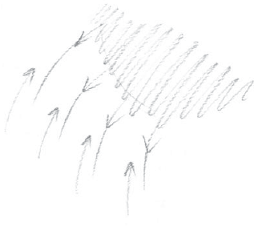
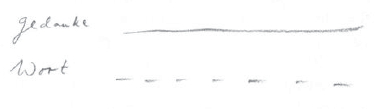
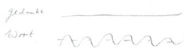
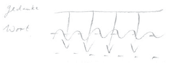
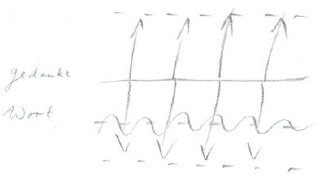

Meine lieben Freunde! Lassen Sie mich vorher noch einmal sagen, daß ich Sie besonders darum bitte, bei diesen Vorträgen nicht mitzuschreiben. Es ist so merkwürdig, wie gerade ein Wunsch nach dieser Richtung, wie es scheint, absolut kein Entgegenkommen findet. Aber bei diesen Vorträgen muß ich dringend darum bitten, [wirklich nicht mitzuschreiben], denn: Erstens sind die Tage, die wir jetzt durchleben, durchaus nicht geeignet, jemandem, der es mit der Menschheitsentwicklung ernst nimmt, die Möglichkeit zu bieten, solche Dinge, wie ich sie jetzt zusammenzufassen habe, zu wirklich abgerundeten Vorträgen zu gestalten, sondern höchstens zu einzelnen Bemerkungen. Und zweitens wissen wir ja hinlänglich, meine lieben Freunde, welche Mißverständnisse dadurch bewirkt worden sind, daß im Beginne unserer jetzt so schmerzlichen Zeit allerlei Einzelheiten aus meinen Vorträgen da und dort mitgeteilt worden sind, in alle Winde geschickt worden sind, zum Teil mit der löblichen, zum Teil aber auch mit der weniger löblichen Absicht, denen oder jenen zu sagen: Seht, der sagt doch nicht so schlimme Sachen über dies oder jenes —, oder auch sie erst recht in Harnisch zu bringen und sie dazu zu bringen, allerlei Rankünen zu fassen. ^1nhyfb

Einzelne herausgerissene Sätze, insbesondere aus einer Reihe von Vorträgen, besagen ja niemals etwas und lassen sich immer in dem einen oder andern Sinne deuten. Und mir ist es um nichts anderes zu tun als um das Suchen nach Wahrheit, und insbesondere in diesem jetzigen Fall, weil eine Anzahl unserer Freunde um Betrachtungen nach der Richtung, wie wir sie jetzt pflegen, eben wirklich ersucht haben und gewünscht haben, daß es geschehe. Mir ist es wirklich nicht darum zu tun, daß man in bezug auf das von mir Gesagte dem einen oder andern sagen kann: Seht, das ist doch nicht so schlimm -, sondern mir ist es um die Wahrheiten zu tun. Und um die Wahrheiten muß es eigentlich jedem zu tun sein, der es mit der Geistesforschung ernst nimmt und der namentlich die Aufgaben der Geistesforschung für die Entwicklung der Menschheit in unserer Zeit in Betracht zieht. ^eq9dr3

Meine lieben Freunde, ich möchte heute einige weitere Gesichtspunkte angeben, die für die Gegenwart die Grundlagen liefern, um ein sicheres Urteil zu gewinnen ist - nicht nur für die allernächsten Tage oder Wochen oder auch Jahre, sondern für die Gegenwart im weiteren Sinne. Halten wir uns doch, meine lieben Freunde, vor allen Dingen vor Augen, daß Geisteswissenschaft eine ernste Sache ist, und wenn man sie im richtigen Sinne erfassen will, so muß sie ernster sein als alle andern Dinge. Wenn man sie aber - wie es ja so vielfach geschieht, wo eine Gesellschaft als Instrument [für geistige Bestrebungen] vorliegt - anfaßt mit allen möglichen Vorurteilen und namentlich Vorempfindungen und in Rage kommt über das eine oder andere durch solche Vorempfindungen oder Vorurteile, so zeigt man ja einfach, daß man für Geisteswissenschaft eben nicht reif ist, obwohl man auf der andern Seite heute schon einsehen kann, daß einzig und allein Geisteswissenschaft dazu geeignet ist, wirklich jenen Ernst zu entwickeln, der in unseren so tragischen Tagen notwendig ist. ^vydp3a

Da muß dieser oder jener seine Vorliebe nach der einen oder anderen Richtung zurückstellen und muß versuchen, vorurteilslos die Dinge entgegenzunehmen; er braucht ja nicht einverstanden zu sein, aber er muß versuchen, vorurteilslos die Dinge entgegenzunehmen. Und manches läßt sich nicht sagen, ohne Dinge auszusprechen, die einigen unangenehm sind. Es gibt genügend Leute in unserer Gegenwart, die es schon als eine Sünde ansehen, wenn man diese oder jene Tatsachen nur erwähnt, weil sie glauben, durch das Erwähnen der einen oder anderen Tatsache werde Partei genommen in der einen oder anderen Beziehung, was eben durchaus nicht der Fall ist. Manchen Tatsachen muß man ruhig ins Auge sehen, weil man nur dann ein wirklich gültiges Urteil gewinnen kann. Gewiß, man braucht es ja nicht gewinnen zu wollen, aber man könnte es gewinnen, wenn man auf dem Boden der Geisteswissenschaft stehen will. ^398rqj

Ich werde nun eine Reihe von Bemerkungen machen, welche dazu führen können, daß ich Ihnen am Ende der heutigen Betrachtungen einiges vorbringe, was geeignet ist, Verständnis zu erwecken für die Art, wie sich gerade gewisse, sagen wir okkulte Erkenntnisse in die gegenwärtige Geistesentwicklung der Menschheit hereindrängen und wie sie durch die Evolution der Menschheit sich selber an die Oberfläche drücken, wie sie sich sozusagen selber darstellen, wie man sie nicht durch irgendeine Agitation in die Menschheitsentwicklung hineinzuversetzen braucht. Ich werde von Einzelheiten ausgehen, die ich Sie bitte ruhig als eine Grundlage anzunehmen, um den Hauptwert dann auf dasjenige zu legen, worin ich die Betrachtungen gipfeln lassen werde. ^5c2jb3

Sehen Sie, ich habe diese Betrachtungen damit begonnen, daß ich gesagt habe: Wenn man sich als guter Europäer alle mögliche Mühe gibt, wirklich alle mögliche Mühe gibt, die Tatsachen, die durch Jahrzehnte gewirkt haben und in den letzten Zeiten herausgekommen sind, durchzunehmen und sich vorurteilslos in sie zu vertiefen, und dann betrachtet, wie da von seiten der Peripherie landläufig - ich sage es mit vollem Bedacht -, wie da landläufig geurteilt wird, und zwar auch von solchen Menschen, welche in diesen den schmerzlichen Ereignissen vorangegangenen Zeiten mit Recht klingende Namen trugen, dann kommt man schließlich doch dazu einzusehen, wie gewisse Urteilsrichtungen nicht anders als so geartet sind, daß — was man auch immer sagen, was man auch immer vorbringen mag - die Antworten der Menschen schließlich doch nur darauf hinauslaufen: Tut nichts, der Deutsche wird verbrannt -, nach dem alten Rezepte: Tut nichts, der Jude wird verbrannt. - Denn in vielen, vielen Urteilen steckt ja nichts anderes drinnen als eine gewisse Aversion - über deren Berechtigung oder Nichtberechtigung man gewiß diskutieren kann -, eine gewisse Aversion gegen alles, was man in der Welt «deutsch» nennt - ich werde meine Worte ganz abgewogen gebrauchen! ^xan99n

Eine gewisse Aversion gegen alles, was man in der Welt «deutsch» nennt, hat sich in der letzten Zeit eben bis zu einem wirklich glühenden Haß gesteigert, der gar nicht geneigt ist, irgend etwas zu prüfen, irgend etwas Geprüftes auf sich wirken zu lassen, sondern der sich einfach berechtigt glaubt zu hassen. Aber diese Berechtigung wird nicht einfach offen in Anspruch genommen. Nicht wahr, wenn jemand sagt: Ich hasse - und er will das und zeigt es an, daß er es will-, was soll man dagegen haben? Jeder hat selbstverständlich das Recht, so viel zu hassen, wie er will; dagegen ist ja gar nichts einzuwenden. Aber darauf kommt es sehr vielen Menschen nicht an - im Gegenteil, es kommt ihnen in diesem Fall sehr darauf an, die Empfindung des Hasses nicht gestehen zu müssen, sondern sich über diesen Haß hinwegzubetäuben, indem man allerlei Dinge sagt, welche den Haß eben überdecken und dafür ein angeblich objektives, gerechtes Urteil setzen sollen. Dadurch werden alle Dinge in ein falsches Licht gerückt. Wenn jemand ehrlich gesteht: Ich hasse dies oder jenes -, dann läßt sich mit ihm reden oder selbstverständlich auch nicht, je nach dem Grade seines Hasses. Aber Wahrheit, wirkliche Wahrheit gegen sich und die Welt ist in allen Dingen notwendig, und wenn wir gerade dieses nicht fassen, meine lieben Freunde, daß Wahrheit in allen Dingen notwendig ist, so können wir auch nicht den Nerv dessen, was Geisteswissenschaft gerade jetzt für die Menschheit sein soll, zu dem innersten Impuls unseres eigenen Herzens und unserer eigenen Seele machen. Wir können uns zwar sagen: Gewiß, wir wollen nur einen Teil der Geisteswissenschaft, nur den, der sich nicht gerade mit unseren Sympathien oder Antipathien befaßt, der uns gerade wohltut, aber wenn uns irgend etwas nicht paßt, dann lehnen wir es ab. - Man kann diesen Standpunkt einnehmen, aber es ist nicht eigentlich der Standpunkt, der heute irgendwie für die Entwicklung der Menschheit heilsam ist. ^fvobty

Ich möchte von einzelnen Bemerkungen ausgehen, aber wirklich «sine ira»! Sehen Sie, es ist ja eine allbekannte Tatsache, daß sehr viele Menschen die Ereignisse von heute im Zusammenhang betrachten mit der Gründung des Deutschen Reiches, das in der Mitte von Europa liegt. Nun, es ist nicht meine Aufgabe, über die Politik des Deutschen Reiches oder über irgendeine andere Politik zu reden. Das werde ich auch nicht tun; ich will Ihnen nur einzelne auf Tatsachen beruhende Grundlagen geben. Nicht wahr, über die Ereignisse, welche zur Gründung dieses Deutschen Reiches geführt haben, kann man sich Anschauungen bilden. Man kann ja auch sogar die Anschauung haben - ob sie nun berechtigt ist oder nicht, darüber wollen wir jetzt nicht streiten —, man kann ja auch die Anschauung haben, daß es zum Unheil für die Menschheit ist, daß es überhaupt so etwas wie Deutsche gibt. Gewiß, auch über diese Dinge ließe sich ja diskutieren - warum denn nicht, wenn jemand wahrhaft und ehrlich eingesteht, daß er eine solche Anschauung hat? Aber darum soll es sich jetzt nicht handeln, sondern wir wollen einmal ins Auge fassen, daß dieses Deutschtum im letzten Drittel des 19. Jahrhunderts zur Gründung des Deutschen Reiches geführt hat. ^p88ws2

Nun, meine lieben Freunde, kann es viele Menschen geben, welche von ganz andern Gesichtspunkten aus die Gründung dieses Deutschen Reiches anfechten, die finden, daß es nicht gut war für die Menschheitsentwicklung, daß dieses Reich gegründet worden ist. Aber das Recht, ein solches Urteil zu fällen, haben diejenigen Menschen, welche sich auf den Standpunkt der westlichen Reiche stellen, nicht, denn das muß man durchaus ins Auge fassen, daß gerade die westlichen Völker außerordentlich an dem hängen, was man den Reichsgedanken, den Staatsgedanken, nennen kann. Das Denken der westlichen Völker hängt auch in bezug auf das Völkische mit den verschiedenen Staatsgedanken zusammen. Wer von vornherein Patriotismus und Staatsgedanken so zusammenbringt wie die westlichen Völker, hat kein Recht, mit seiner Kritik gleich bei der Berechtigung des Reichsgedankens überhaupt anzufangen, denn er stellt sich damit auf einen unlogischen Standpunkt; er stellt sich auf den Standpunkt, daß ein anderes Volk nicht das Recht habe, das gleiche zu tun, was sein eigenes Volk getan hat. Und man muß sich ja, wenn man über etwas diskutiert, auf einen Standpunkt stellen, der eine Diskussionsgrundlage abgibt, der eine Möglichkeit abgibt, logisch zu bleiben. Nicht wahr, es wäre durchaus möglich, zum Beispiel mit Bakunin zu diskutieren, ob ein Deutsches Reich in Mitteleuropa etwas Heilsames ist — das würde auf ganz andern Grundlagen beruhen. Aber man kann es nicht mit Leuten diskutieren - ich meine jetzt nicht einmal die Staatsmänner, sondern die meisten Volksangehörigen der westlichen Staaten —, die ganz von ihrem Staatsgedanken durchdrungen sind. Also, auf diesen Standpunkt müßte man sich schon stellen: daß man [den Reichsgedanken] gleichsam als etwas für alle zu Supponierendes, als eine Hypothese voraussetzt, daß man also sozusagen von Reich zu Reich spricht, sonst hat man keine Grundlage. Ganz vorurteilslose Urteile gibt es zwar auch - es gibt sie gerade in bezug auf die irdische Wirklichkeit -, aber man muß eben seine Voraussetzungen kennen, wenn man gültige Urteile fällen will. ^hyljjm

Nun denken ja heute die Menschen gar nicht mehr daran, aus welchen geschichtlichen Impulsen dieses Reich in Mitteleuropa hervorgegangen ist. Die Menschen denken zum Beispiel nicht mehr daran, daß der Boden, auf dem dieses Reich zum großen Teil begründet worden ist, durch viele Jahrhunderte zunächst eine Art Reservoir, eine Art Quelle war für das übrige Europa. Sehen Sie, ein Romanisches in dem Sinne, daß man sagen könnte, es sei eine Fortsetzung des alten Römischen, gibt es ja heute nicht mehr. Das Romanische hat sich durchaus, wenn ich den Ausdruck gebrauchen darf, verflüchtigt und ist nur in einzelnen Impulsen in andere völkische Elemente hineingezogen. Nehmen Sie den Boden Italiens. Nach Italien sind im ganzen Verlauf des Mittelalters fortwährend alle möglichen germanischen Elemente eingewandert — wenn ich diesen Ausdruck gebrauchen darf, ich werde vielleicht dazu kommen, ihn später noch etwas näher zu definieren —, alle möglichen germanischen Elemente. Und in dem, was heute italienische Bevölkerung genannt wird, fließt sogar blutsmäßig durchaus ungeheuer viel von dem, was man germanisch nennen kann. Das ist influenziert worden von dem romanischen Element, aber nicht so, daß man das heutige italienische Volk auch nur im entferntesten etwa als eine Fortsetzung des alten römischen Volkes ansehen könnte. Nun war es immer so, daß von Mitteleuropa aus als dem Völkerreservoir die verschiedenen Volksstämme nach der Peripherie hingezogen sind, bis nach Spanien hinein, bis nach Nordafrika hinüber, nach Italien, nach Frankreich, nach Britannien, überallhin [weiße Pfeile]. So möchte ich sagen: Indem sich das Völkische ausgebreitet hat, indem das Völkische [überallhin] ausstrahlte, kam ihm ein Unvölkisches entgegen, das Romanische [rote Pfeile]; in der Mitte befand sich gewissermaßen das Reservoir. ^r0rzuw

 ^nt5ner

Solch eine Erscheinung, wie ich sie Ihnen gestern im Zusammenhang mit Dante vorgeführt habe, ist nur ein charakteristischer Ausdruck für eine ganz allgemeine Erscheinung. Was sind denn die heutigen Franzosen? Doch nicht Nachkommen bloß des lateinischen Elementes! Franken, also ursprünglich germanische Stämme, haben sich über diesen Boden ausgedehnt, sind durchdrungen von dem, was nicht mehr volksmäßig ist, sondern was sich, ich möchte sagen auf dem Umwege durch den römischen Beamtenkörper und dergleichen - alle Einzelheiten kann ich ja nicht sagen - als romanisches Element mit dem altem keltischen Elemente vermischt hat. Und daraus ist etwas entstanden, in dem heute, mehr als man glaubt, germanische Impulse leben, wirklich drinnen leben. Und im neueren italienischen Elemente leben vor allen Dingen ungeheuer viele solche germanischen Impulselemente. Man würde, wenn man den Dingen nachginge, das Eindringen des langobardischen, also eines germanischen Elementes in Norditalien genau studieren können, das eben das andere, das romanische Element, gewissermaßen nur angenommen hat. Britannien wurde ursprünglich bewohnt von Elementen, die dann nach Wales und nach der Bretagne, sogar bis nach Kaledonien hin zurückgedrängt worden sind, nachdem sie vorher Kundschafter ausgesandt hatten, um die Jüten, Angeln und Sachsen auf die Insel einzuladen und dadurch die von Norden her kommenden räuberischen Pikten und Skoten zurückzudrängen. So hat sich ein Element herausgebildet, in dem nun das Germanische selbstverständlich ungeheuer überwiegt. ^8fafao

Also diese Ausstrahlung findet nach allen Seiten statt. Nur in der Mitte bleibt ein Reservoir, und mit dem hängt es auch zusammen — weil das Mittlere sich anders entwickeln mußte -, mit dem hängt es auch zusammen, daß das Mittlere gewissermaßen jenen Sprung machte, den ich nicht in eitler Weise als einen Sprung nach vorwärts bezeichnen will, sondern eben nur als einen Sprung, der sich ausdrückt in dem, was ich gestern als das Gesetz der Lautverschiebung angeführt habe. Das sind Gesetze, die durchaus nicht gemessen zu werden brauchen mit irgendwelchen Sympathien oder Antipathien, sondern es sind eben einfach Tatsachen. Und was nun diese Tatsachen für Folgen haben müssen, darüber kann sich ja jeder Vorstellungen bilden, aber er braucht diese Dinge nicht mit Sympathien oder Antipathien zu verfolgen. ^gds7sm

Die Sache ist dann so gekommen: Als die römischen Cäsaren ihre Kriegszüge gegen die Germanen führten, bildeten die zuerst besiegten Germanen eigentlich den allergrößten, den weitaus größten Teil der Heere, so daß die Römer die Germanen mit Germanen bekämpften. In der späteren Zeit kam es dann so, daß die an der Peripherie entstandenen Völkermassen gegen das, was in der Mitte war, zum Teil so hintendierten, daß die Notwendigkeit entstand, eben jene Art von Reich zu begründen, das dann in seiner letzten Phase zu dem Heiligen Römischen Reich [deutscher Nation] geführt hat - Sie kennen ja die Stelle in Goethes «Faust», wo die Studenten froh sind, daß sie nicht für das Heilige Römische Reich zu sorgen haben. Auf der anderen Seite hat es dazu geführt, daß gerade von den Peripherien her das mittlere Element in der furchtbarsten Weise bekriegt wurde, daß sich die Peripherie fortwährend auflehnte gegen das mittlere Element. Und wirklich, man muß ja in Betracht ziehen, daß vieles von dem, was in Mitteleuropa als Bewußtsein vorhanden ist, damit zusammenhängt, daß der Boden, auf dem dieses Reich in Mitteleuropa begründet worden ist, eigentlich der Ort war, der von allen Seiten her als der Kriegsschauplatz für die sich fortwährend streitenden Völkerschaften ausersehen war, was ja seinen besonderen Ausdruck fand im 17. Jahrhundert im Dreißigjährigen Krieg. In diesem Krieg hat dieser Boden, hat Mitteleuropa bis zu einem Drittel seiner Bewohner verloren durch die Schuld der umliegenden Völker, indem nicht bloß die Städte und Dörfer, sondern ganze Landstriche zerstört worden sind - die Völker Mitteleuropas sind wirklich zerfleischt worden von der Peripherie her. Dies sind Tatsachen, die man einfach als geschichtliche Tatsachen ins Auge fassen muß. ^ngltbm

Nun ist es ja nicht zu verwundern, daß in Mitteleuropa die Tendenz, der Impuls entstand, gewissermaßen das auch haben zu wollen, wonach die anderen Völker strebten, nämlich ein Reich. Nun steht aber die Bevölkerung dieses Bodens in ganz anderer Weise zum Reichsgedanken, [viel loser] als die Bevölkerung Westeuropas, welche sich in ganz besonderer Weise an den Reichsgedanken hält — ganz gleichgültig, meine lieben Freunde, ob man von Republik oder Königreich spricht. Nicht wahr, ob man nun Angehöriger einer Republik oder einer anderen Staatsform ist, darauf kommt es ja nicht an, sondern es kommt darauf an, in welcher Weise man sich zu dieser Zusammengehörigkeit stellt, ob man in dieser oder jener Weise Sinn hat für diese Zusammengehörigkeit. Nun, ich sagte, es ist nicht zu verwundern, daß in Mitteleuropa die Tendenz, der Impuls entstand, auch ein Reich zu haben - ein Reich, das auf der einen Seite etwas Schutz bietet gegen den jahrhundertealten Ansturm vom Westen her einen Ansturm, der wirklich Jahrhunderte hindurch währte - und auf der andern Seite die Möglichkeit, das, was von Osten her wirkt, was vom Osten her impulsiert wird, in einer Weise zu begrenzen, wie es selbstverständlich nicht für den Osten, wie es aber eben für Mitteleuropa doch notwendig ist. Ich meine, diese Dinge sind zu verstehen. ^gbh959

Nun steht die mitteleuropäische Bevölkerung in einer etwas andern Weise zu dem, was man den Staatsgedanken nennen kann, als die westeuropäische Bevölkerung, namentlich als etwa die französische Bevölkerung. In Mitteleuropa war durch Jahrhunderte ein solcher Staatsgedanke nicht so lebendig wie etwa in Frankreich; ein solcher Staatsgedanke, wie er in Frankreich vorhanden war, eignet sich nicht für das, was da in Mitteleuropa zurückgeblieben ist. Und man braucht sich nur zu erinnern, wie das, was sich in Mitteleuropa entwickelt hat, was da zurückgeblieben ist, um die Wende des 18. zum 19. Jahrhundert seine geistige Höhe erreicht hat, die schließlich ja wohl auch vom Westen, wenn einmal weniger Haß herrscht, wieder anerkannt werden wird. Es wird dann wieder anerkannt werden, daß da in diesem Mitteleuropa die größte geistige Höhe, deren Früchte noch lange nicht, auch nach Jahrhunderten nicht, für die Menschheit ausgekostet sein werden, erreicht wurde in einer Zeit, als durch die Verhältnisse in Mitteleuropa vom Westen her jede Möglichkeit genommen war, ein zusammengehöriges Staatsgebilde zu formen. Lessing, Goethe, Schiller, Herder und alles, was mit ihnen zusammenhängt, sind ja nicht in einem zusammengehörigen Staatsgebilde groß geworden; sie sind groß geworden, trotzdem ein solches Staatsgebilde nicht vorhanden war. Man kann sich, ich möchte fast sagen keine Vorstellung machen, was für einen Unterschied das ausmacht, daß Goethe nicht in einem solchen Staatsgefüge groß geworden ist, während Corneille, Racine eben gar nicht denkbar sind ohne den Hintergrund eines solchen Staatsgebildes, das seinen Glanz und seine Höhe durch Ludwig XIV. erlangt hat, den König, der von sich sagte: «L'etat, c'est moi.» Diese Dinge gehören zusammen. ^svd8lg

Aber nun entstand aus Impulsen heraus, die zunächst rein innerlich waren, bei den Bewohnern Mitteleuropas im Laufe des 19. Jahrhunderts die Tendenz, nun auch eine Art von einheitlichem Staat zu bilden. Und diese Tendenz bildete sich zunächst in einer ganz intensiv idealistischen Weise aus. Und wer die Entwicklung des 19. Jahrhunderts kennt, der weiß, daß der Staatsgedanke, von dem die Bewohner Mitteleuropas ergriffen wurden, zunächst vor allen Dingen verankert war in den Köpfen von lauter Idealisten, von Leuten, die vielleicht mehr idealistisch als praktisch waren, die eben durchaus unpraktischer waren in bezug auf den Staatsgedanken als die praktischen Westler. Und so sehen wir denn, wie sich die idealistischen Bestrebungen, wie sich die Bedingungen für ein Zusammenfassen der mitteleuropäisch-deutschen Völker zu einem geeinten Deutschen Reich, entwickeln. Wir sehen sie namentlich im Jahre 1848 bestimmte Formen annehmen, die aber durchaus ein idealistisches Gepräge haben. Aber weil nun einmal das 19. Jahrhundert das Zeitalter des Materialismus war, hat dasjenige, was ein ursprünglich idealistisches Gepräge hatte, kein besonderes Glück gehabt - nicht so sehr durch völkische Schuld als durch das, was eben im 19. Jahrhundert als Materialismus heraufgekommen war. Und nun handelte es sich darum, das, was auf idealistische Weise nicht zu erringen war, auf praktische Weise zu erringen, das heißt so zu erringen, wie es sonst auch errungen worden ist in der bisherigen europäischen Geschichte. Wodurch sind denn Staaten entstanden? Durch Kriege sind Staaten entstanden, und dadurch ist auch das Deutsche Reich in der Zeit von 1864 bis 1870 entstanden. ^2spl8p

Wer diese Zeiten miterlebt hat, meine lieben Freunde, der weiß, wieviel Schmerz in den Herzen derer war, welche dazumal, als das neue Deutsche Reich gegründet wurde, noch erfüllt waren mit den Ideen des Jahres 1848, wo man aus der Empfindung, aus dem Gefühl und aus dem Ideal heraus dieses Reich hatte gründen wollen. Es waren namentlich in den sechziger, in den siebziger Jahren zu bemerken die Leute, die zur sogenannten großdeutschen Partei gehörten, die Großdeutschen, denen dann die Kleindeutschen gegenüberstanden. Die großdeutsche Partei - das waren diejenigen, welche zu den alten idealistischen Prinzipien standen, die aus idealen Grundlagen und aus idealen Impulsen heraus eine solche Reichsgründung erlangen wollten. Diese Großdeutschen wollten nichts erobern, sondern sie wollten alles, was deutsch ist, in einem gemeinsamen Reichs- oder Staatengebilde zusammenfassen. Wer auch nur im entferntesten denkt, daß diese Großdeutschen das Allergeringste erobern wollten, der kennt einfach den Grad des völkischen Idealismus nicht, der in ihnen gelebt hat. Und sie waren enragierte Gegner, man möchte sagen unversöhnliche Gegner der Kleindeutschen, die dann unter Bismarck das gegenwärtige Deutsche Reich gegründet haben — das heißt das Deutsche Reich unter der Führung Preußens. Aber sie haben sich schließlich mit der neuen Lage versöhnt, weil sie zum Schluß einsahen, daß in Mitteleuropa die Dinge im 19. Jahrhundert nicht anders vor sich gehen konnten, als sie sonst immer vor sich gegangen sind. Man söhnte sich damit aus, indem man sich sagte: So wie Frankreich, so wie England gegründet worden sind, so muß eben auch Deutschland gegründet werden. - So haben sich die Großdeutschen allmählich mit dem, was ganz und gar gegen ihr Ideal war, ausgesöhnt. Diese Dinge muß man in Betracht ziehen. ^euiert

Und man kann nun über die Ereignisse, die sich zwischen 1866 und 1870 abgespielt haben, denken, wie man will - selbstverständlich kann ich ja hier weder in Einzelheiten mich verlieren noch Politik betreiben —, man mag über diese Ereignisse von 1866 bis 1870, 1871 welche Ansicht auch immer haben, man mag über Schuld oder Unschuld am Ausbruch des Siebziger Krieges denken [wie auch immer] — ich gebe selbstverständlich jedem das Recht, darüber zu denken, wie er will —, aber das eine darf nicht vergessen werden, weil es eine Tatsache ist - selbstverständlich kann so etwas auch dementiert werden, aber die Dinge sind trotzdem wahr, auch wenn sie dementiert werden. Wie auch die Ereignisse verlaufen sind, richtig ist, daß von französischer Seite aus - ich meine, wenn ich französische oder englische Seite sage, niemals das Völkische, sondern den Zusammenhalt derer, die in der betreffenden Zeit, wie man so sagt, am Ruder sind, die die Ereignisse, die äußeren Ereignisse, machen -, daß also bei denen, die die äußeren Ereignisse machen, vor allen Dingen der Wille vorhanden war, die deutsche Reichsgründung zu verhindern; man darf das nicht außer acht lassen, daß man die ganze Politik daraufhin anlegte, daß das Deutsche Reich nicht hätte gegründet werden können. Über die spanische Erbfolge, über eine französische oder deutsche Kriegspartei mögen die Leute denken, wie sie wollen, aber darüber dürfte eigentlich kein Streit sein, daß in Frankreich sich bestimmte Leute alle Mühe gaben, das Urteil, es sei mit der «gloire» des französischen Staates nicht vereinbar, daß in Mitteleuropa ein selbständiges Deutsches Reich entstehe, zur Wirklichkeit zu machen. Und was sich ausgelebt hat in der Absicht, diese Reichsentstehung zu verhindern, das gehört mit zu den Entstehungsursachen des Siebziger Krieges. Und als Gegenstoß hat sich dazumal entwickelt der Impuls über den man wieder denken kann, wie man will -, die Auffassung, daß man eben nur durch dieselben Mittel, durch die Frankreich sein Reich gegründet hat, auch das Deutsche Reich gründen kann, nämlich, indem man Krieg führt gegen den Nachbarstaat. Diese Dinge muß man eben nur ganz kaltblütig ins Auge fassen. ^wbnw9p

Nun wurde dieses Deutsche Reich gegründet auf jene Weise, die Ihnen ja bekannt ist, obwohl man heute nicht mehr geneigt ist, sich die geschichtlichen Tatsachen genau anzusehen. Aber die betreffenden Daten werden ja den meisten von Ihnen bekannt sein oder wenigstens das Gerippe der Tatsachen. Man kann also sagen: Dieses Deutsche Reich wurde, während zwischen Frankreich und Deutschland Krieg geführt wurde, gegründet, indem in diesem Kriege die Kräfte erzeugt wurden, die dieses Deutsche Reich herbeiführten. Nun wurde also das Deutsche Reich gegründet. Fassen wir einmal jenen Zeitpunkt ins Auge, in dem Paris noch nicht belagert war, aber durch die deutschen Erfolge schon die Aussichten vorhanden waren, das Deutsche Reich zu gründen. Da man Ursache hatte zu glauben, den Gegenwillen gegen dieses Deutsche Reich gebrochen zu haben, entstand in Mitteleuropa die Idee, die kleindeutsche Reichsgründung in Szene zu setzen. ^4u79p1

Also, fassen wir die Zeit so etwa vom Dezember des Jahres 1870 ins Auge. Indem wir dies tun, meine lieben Freunde, stehen wir vor der Tatsache, daß aus dem, was da in Deutschland geschah - Deutschland zu sagen, ist ja nur eine Unart derjenigen, die in der Peripherie leben, denn ein Deutschland gibt es heute noch immer nicht, ebenso wenig, wie es einen «Kaiser von Deutschland» gibt -, was also da im späteren Deutschen Reich geschah, sich in der Peripherie die Empfindung herausgebildet hat, [daß für Europa ein großer Schaden durch die Gründung dieses Deutschen Reiches entstanden sei]. Wie gesagt, es ist eigentlich eine Unart, von «Deutschland» zu sprechen; es gibt nur einzelne deutsche Staaten, und derjenige, welcher diese deutschen Staaten nach außen hin als Repräsentant zu vertreten hat, führt ausdrücklich aus gewissen Voraussetzungen des mitteleuropäischen Wesens heraus nicht den Titel «Kaiser von Deutschland», sondern den Titel «Deutscher Kaiser» - was ein Unterschied ist. Ich bemerke, daß man bei der Gründung des neueren rumänischen Staates sehr viel darüber diskutiert hat, ob der neue König heißen solle «König der Rumänen» oder «König von Rumänien». Diese Dinge machen sehr viel aus in dem Augenblicke, wo man auf die Wirklichkeiten sieht und nicht bloß auf die Illusionen. Der Titel «König von Rumänien» wurde schließlich aus ganz bestimmten historischen Voraussetzungen heraus gewählt - anstelle des Titels «Rumänischer König» oder «König der Rumänen», den man zuerst wählen wollte. Gerade auf solche Dinge kommt eben sehr viel an. ^0g7r4p

Nun, meine lieben Freunde, wenn man diese Urteile, die ja von langer Hand vorbereitet wurden und die sich in der neuesten Zeit manchmal bis zum Gipfel der Tollheit gesteigert haben, auf sich wirken läßt - wobei wiederum nicht diskutiert werden soll, ob im einzelnen etwas berechtigt ist, im einzelnen kann selbstverständlich immer alles berechtigt oder unberechtigt sein —, wenn man also diese Urteile zusammenfaßt, so könnte man sagen: Es hat sich herausgebildet eine Empfindung, daß durch diese Gründung des Deutschen Reiches für Europa ein großer Schaden entstanden sei, daß dieses Reichsgebilde in Mitteleuropa gewissermaßen ein Drohgebilde sei. ^wq56og

Um deutlich zu machen, was ich damit eigentlich meine, möchte ich Ihnen eine Sache vorlesen, welche zeigen wird, wie ich manches, worum es sich gerade jetzt handelt, meine. Das Urteil, das sich gebildet hat, das lautet so: Man sagte, ja, die Deutschen, Deutschland fühle sich in der einen oder anderen Weise bedroht, aber es sei eigentlich selbst eine Bedrohung für ganz Europa. Und da ist insbesondere - ich hoffe, daß ich es jetzt finden werde -, da ist insbesondere ein Urteil, das ich Ihnen jetzt anführen werde, von einer gewissen Bedeutung. Das Urteil steht im «Matin» vom 8. Oktober 1905. Nicht wahr, wenn man mit Realitäten rechnet, so muß man wissen, daß hinter einer Meinung immer das Urteil von unzählig vielen Menschen steht, und die Dinge, die da geschehen, gehen ja aus Realitäten hervor. Also, ich werde Ihnen jetzt ein Urteil vorlesen aus dem «Matin» vom 8. Oktober 1905. Da heißt es: ^uv7qq1

Und deshalb: ^o62tfd

Also 1905, im Oktober! ^9tyvvy

Nun fragt es sich: Wie steht es eigentlich mit diesem Urteil, daß dieses Deutsche Reich eine Bedrohung für ganz Europa geworden sei? Nun wird bei denjenigen, die sich heute im Westen äußern, kaum etwas anderes zu hören sein, als was so lautet: Wie hat es kommen können, daß Deutschland eine Bedrohung für ganz Europa geworden ist? - Und: Eigentlich hat nichts Schlimmeres passieren können, als daß dieses Volk, das früher so geglänzt hat durch seine Wissenschaft und durch seine ernste Bescheidenheit - wie hier so schön steht -, eine Bedrohung für ganz Europa geworden ist. - Denn daß es zu einer solchen Bedrohung geworden ist, das wird ja aus unzähligen Kehlen und namentlich aus Strömen von Druckerschwärze immer und immer wiederholt. ^lmak6y

Nun, man könnte also fragen: Wie steht es denn eigentlich mit diesem Urteil? Die Leute, die sagen sehr leicht - und man hört dieses Urteil vielfach -: Na ja, eigentlich nur aus germanischem Hochmut - das Wort «germanisch» wird in diesem Fall mißbraucht -, aus germanischem Hochmut heraus und durchaus nicht aus irgendeiner weltgeschichtlichen Notwendigkeit heraus ist dieses Reich entstanden. Und die Menschen, die innerhalb dieses Reiches wohnen, die können eigentlich nicht anders als fortwährend betonen: Der Deutsche ist der Welt voran, der Deutsche muß zum Heil der Welt dasein und so weiter. - Unzählige Male konnte man das Urteil hören: Die Deutschen sind hochmütige Leute geworden; sie betrachten sich als zur Herrschaft über die ganze Welt berufen; sie betrachten das Reich, das sie gegründet haben, wie etwas, was der neueren Zeit ganz besonders notwendig geworden ist und so weiter; gegenüber dem Stolz, dem Hochmut der Deutschen kann man es ja schon gar nicht mehr aushalten. - So ist das Urteil, das in der mannigfaltigsten Form immer wieder und wieder gefällt worden ist. ^5docxe

Ich will nicht irgend etwas beschönigen; ich möchte Ihnen nur ein solches Urteil vorlesen, das gefällt worden ist gleich bei der Gründung des Reiches, und zwar in der Zeit, die ich Ihnen skizziert habe. Ich sagte: Versetzen wir uns in den November 1870. Bei diesem Urteil, das ich Ihnen jetzt vorlesen werde, meine lieben Freunde, könnte vielleicht mancher heute - verzeihen Sie den trivialen Ausdruck - aus der Haut fahren und sagen: Nun, da sieht man, was für Vorstellungen sich die Menschen in bezug auf die Wichtigkeit dieses Deutschen Reiches machen! Man sieht gleich: Als es noch gar nicht entstanden war, es eben erst im Entstehen war, da wurde es schon so angesehen, da wurde es schon so hingestellt, als ob es nicht nur zum Heil der Deutschen, sondern von ganz Europa oder der ganzen Welt notwendig wäre, ja sogar zum Heil der Franzosen selber. Also, damit Sie sehen, daß ich nichts beschönige, meine lieben Freunde, will ich Ihnen ein Urteil gerade aus dem Jahre 1870 vorlesen. Da heißt es: ^ixtd4n

Und weiter: ^phfkk8

Aber: ^f7chps

Und einige Abschnitte weiter: ^61cgvn

Die Ausführungen schließen mit den Worten: ^u8lg21

Man könnte nun allerdings fragen: Ist das nicht [deutscher] Größenwahn? — Meine lieben Freunde, ich habe Ihnen da soeben [Auszüge aus einem Brief von Thomas Carlyle] vorgelesen, der im [November 1870] in der «Times» gestanden hat. [Und in der gleichen «Times» konnte man] in einem Leitartikel vom Dezember 1870 die folgenden Sätze lesen: ^m9zpzv

Ich lasse jetzt einen Satz aus - Sie werden gleich sehen, warum: ^2frd41

Nun, der Satz, den ich ausgelassen habe, lautet: ^81f36t

Sie sehen, meine lieben Freunde, es ist doch notwendig, daß man ein wenig die Dinge so ins Auge faßt, wie sie in der Wirklichkeit sind, denn wer die «Times» heute liest, sollte auch ein wenig das Urteil der «Times» vom Dezember 1870 ins Auge fassen. Und vielleicht würde man sogar sonderbare Anschauungen bekommen über die allergräßlichste Phrase, die jemals ausgesprochen wurde - die Phrase vom «deutschen Militarismus» -, wenn man sich nur ein wenig auf dieses Urteil besinnen würde, [das damals von englischer Seite kam]: ^5wmafe

Sie sehen, meine lieben Freunde, die Zeiten ändern sich - wie man so sagt —, aber die Menschen glauben immer, die Urteile absolut fassen zu können und sind so glücklich in ihren absoluten Urteilen. ^8lbb4q

Man braucht wahrhaftig nicht dem englischen Wesen, dem englischen Volkstum — demjenigen, was viele Engländer sind, die da glauben, gute Engländer zu sein - feindlich zu sein, wenn man ein vielleicht vielen Engländern unrichtig dünkendes Urteil abgibt, so wie ich es gestern abgegeben habe über Sir Edward Grey. Aber, meine lieben Freunde, ich bin nicht gewohnt, meine Urteile abzugeben, ohne sie irgendwie gestützt zu haben, und zwar gestützt zu haben von derjenigen Seite, wo man berechtigterweise gestützt wird. Sie können sagen: Derjenige, der dieses Urteil abgegeben hat, ist kein Engländer, er kennt auch Sir Edward Grey nicht aus der Nähe. - Nun will ich Ihnen ein Urteil vorlesen von einem Mann, der Engländer ist, der auch Sir Edward Grey aus der Nähe kennt, weil er ein Ministerkollege von ihm war. Dieser Mann also, der jedenfalls auch ein Engländer ist, hat über Sir Edward Grey folgendes Urteil abgegeben die Zeilen sind im Winter 1912/1913 geschrieben: ^4bl9do

Das ist ein Engländer, ein Ministerkollege des Sir Edward Grey, der das sagt! ^4nrmlb

Nun, meine lieben Freunde, es handelt sich doch darum, solche Dinge ein wenig ins Auge zu fassen, und zwar aus dem Grunde, damit man nicht glaubt, daß der Friede von Europa im Juli 1914 just in solchen Händen ganz besonders gut aufgehoben war. Mit einer Reihe von in allerlei Büchern verzeichneten Dokumenten kann man ja alles beweisen, aber es handelt sich bei diesen Dingen um die Frage, ob die Kräfte, auf die es ankommt, in richtiger Weise gehandhabt worden sind. ^xxva1e

Etwas, meine lieben Freunde, müssen Sie doch ins Auge fassen, nämlich daß historische Ereignisse auseinander hervorgehen, daß sie sich langsam herausbilden. Und das, was zuletzt zu den Ereignissen von 1914 geführt hat, hat sich schon lange vorbereitet, richtig lange vorbereitet. Nun ist allerlei gesagt worden über diese Vorbereitung, so zum Beispiel ist gesagt worden: Ja, eine Art «gemeinsames Einverständnis» des sogenannten Dreiverbandes, der «Entente cordiale», gegen Mitteleuropa gibt es nicht oder hat es nicht gegeben; es hat sich bei dieser Entente cordiale immer nur darum gehandelt, dafür zu sorgen, daß Europa den Frieden habe, richtig den Frieden habe. - Es sind mancherlei Tatsachen angeführt worden, welche als scheinbare Beweise für eine solche Supposition genommen worden sind. Nun, ich müßte Ihnen natürlich lange Geschichten erzählen, wenn ich dasjenige zum vollen Beweis erheben wollte, was ich zu sagen habe, aber immerhin, einzelne Anhaltspunkte möchte ich Ihnen doch geben. ^ov2k19

Ich möchte Ihnen zum Beispiel - weil das doch einmal in der Geschichte eine gewisse Rolle spielen wird - einiges vorlesen aus einer Rede, die im Oktober 1905 in Frankreich gehalten worden ist von Jaurès. Gewiß, solche Reden sind immer einseitig, aber wenn man alles zusammenhält - und hier ist mancherlei und Wichtiges zusammenzuhalten —, so ergibt sich schon ein Urteil. Ich kann gerade dieses Beispiel wählen, weil ich über Jaurès vor einigen Wochen einiges von ganz anderer Seite her gesagt habe. Jaurès war, wie Sie wissen, Demokrat, sogar Sozialdemokrat, und - wie man auch sonst über ihn urteilen mag - er war ein Mensch, dem es ernsthaft nicht nur darum zu tun war, Friede in Europa zu halten, wie es für Europa, wenigstens für Westeuropa, angesichts mancher anderer Verhältnisse so notwendig gewesen wäre, sondern dem es auch darum zu tun war, diejenigen Menschen zusammenzurufen aus der ganzen Welt, die wirklich ernsthaft Frieden halten wollten. Jaurès hatte in einer gewissen Weise schon ein Recht, so zu sprechen, [wie er es in seiner Rede getan hat]. Also, im Oktober 1905, kurz nachdem das französische demokratische Ministerium den Delcassé - verzeihen Sie den trivialen Ausdruck - «ausgeschifft» hatte, weil es sich bei einer Ministersitzung herausgestellt hatte, daß er imstande wäre, den europäischen Frieden in kurzer Zeit wirklich zu gefährden, sagte Jaurès dazumal mit Bezug auf dieses Ereignis: ^zejbmr

Vor allem wußte Jaurès Dinge, von denen diejenigen nichts wissen, die heute vielfach Urteile fällen, und zwar wußte er ganz wesentliche und wichtige Dinge. Und eines Tages gab er nicht mehr acht und sagte diese wichtigen und wesentlichen Dinge so, daß man daraus entnehmen konnte, daß er sie vielleicht in der Zukunft auch sagen werde. Den Okkultisten ist gut bekannt, meine lieben Freunde, wie im ersten Drittel des 19. Jahrhunderts ein Mitglied einer bestimmten Bruderschaft gewisse Dinge der Welt bekanntgegeben hat, die nach Meinung dieser Bruderschaft nicht hätten ausgetratscht werden dürfen. Aber nachdem der Betreffende diese Dinge gesagt hatte, verschwand er eines Tages; er wurde ermordet. Jaurès war zwar kein Okkultist, aber man wird ja neugierig sein dürfen, ob die Welt jemals die Zusammenhänge erfahren wird, welche am Vorabend des Krieges zu seinem Tode geführt haben. ^uhe74n

Sehen Sie, solche Dinge, wie sie Jaurès da gesagt hat, gehen schließlich zurück auf eine gewisse Ministerratssitzung — jene Ministerratssitzung, in welcher Delcassé, die Kreatur König Eduards VII. und anderer Kreaturen, die dahinterstanden, aus dem damaligen französischen Ministerium «ausgeschifft» worden ist, vielleicht nicht einmal so sehr aus dem Grunde, weil er zum Kriege die Wege ebnen wollte, sondern aus einem ganz andern Grunde - wir sind im Jahre 1905, meine lieben Freunde! Rußland ist eben noch nach Osten hinüber engagiert, und es ist nicht zu hoffen, daß es, wenn im Westen das Feuer, das Delcassé schürt, wirklich zum Brennen kommt, dann so abgeht, wie es später abgehen würde, wenn Rußland nicht mehr im Osten engagiert wäre — wir stehen im Jahre 1905! Aber Delcassé ist kein Mensch, der die Dinge so einfach hinnimmt. Als ihm die Leute, die dazumal zu diesem Zeitpunkt keinen Krieg in Europa wollten, sagten, er habe alle Anlage dazu, es ganz sicher zu einem Kriege zu treiben, da antwortete er, Frankreich sei von England verständigt worden, daß dieses bereit sei, den Kaiser-Wilhelm-Kanal zu besetzen und mit hunderttausend Mann in SchleswigHolstein anzugreifen; wenn Frankreich es wünsche, wolle England dieses Anerbieten schriftlich wiederholen. Diese Nachricht, die Delcassé dazumal seinen Ministerkollegen, die ihm den Stuhl vor die Türe setzten, überbrachte, war selbstverständlich das Ergebnis von Verhandlungen, die er hinter dem Rücken seiner Ministerkollegen geführt hatte und hinter denen im wesentlichen auch der damalige König Eduard VII. steckte. ^wsj2f6

Nun könnte ich Ihnen vieles anführen, was diese nicht nur im «Matin», sondern später auch in andern Journalen stehende Tatsache bewahrheiten würde, aber ich will nur darauf aufmerksam machen, daß dazumal sich immerhin jemand fand, der sich die Geschichte ein wenig näher anschaute und dem sie etwas bedenklich vorkam. Und das war eine Persönlichkeit, welche vielleicht manchen gerade in Frankreich nicht sympathisch sein kann, nämlich der klerikale Senator Gaudin de Villaine, der am 20. November 1906, als schon das Ministerium Clemenceau im Amt war, eine Interpellation einbrachte, wie es sich denn eigentlich verhielte mit den Beziehungen zwischen Frankreich und England, von denen man so viel redete. Da sagte Clemenceau, was den Revanchegedanken betreffe, so sei er entrüstet darüber, daß ein französischer Senator ihm habe eine Falle stellen und die Verpflichtung auferlegen wollen, entweder [die «guten» Franzosen] - das heißt die Brüder der «Groß-Orient»-Loge — zu enttäuschen oder eine Kriegserklärung abzugeben; er werde also nicht antworten. Das heißt: Clemenceau erwidert auf die Anfrage des Senators, ob irgend etwas bestehe, was durch eine Koalition zwischen Frankreich und England zu einem europäischen Kriege führen könnte, er werde nicht antworten, denn würde er antworten, so müßte er entweder die Brüder der «Groß-Orient»-Loge in bezug auf den Revanchegedanken enttäuschen oder eine kriegerische Erklärung abgeben. Also Sie sehen: Clemenceau hätte eine kriegerische Erklärung abgeben müssen, wenn er sich über die damaligen Beziehungen zwischen Frankreich und England hätte aussprechen wollen; nicht eine friedliche, eine kriegerische Erklärung hätte er abgeben müssen das hat er selbst gesagt. Das war also im Jahre 1906. ^nw8s28

Wir dürfen nun nicht vergessen, meine lieben Freunde, daß bei allen Dingen in der Welt das wirkt, was der eine von dem andern hört. Können Sie sich vorstellen, wie man in Mitteleuropa an die «friedlichen» Absichten Westeuropas hätte glauben sollen, wenn man nicht eine, sondern viele, viele solche Tatsachen von diesem Kaliber hören mußte? Nun, es kommt, wenn man diese Dinge beurteilen will, mancherlei in Betracht. Es kommt in Betracht, daß es, wenn man dieses Mitteleuropa im weiteren Sinn betrachtet, das Allerunsinnigste ist, so ohne weiteres von seinem Militarismus zu sprechen, denn dieser Militarismus ist für ein zwischen zwei Militärstaaten eingeschlossenes Land die selbstverständliche Folge, die historische Folge gewesen, um eben bestehen zu können zwischen den beiden Militärstaaten. ^j8ia35

Nun können gewisse Menschen, welche jeden Wirklichkeitssinnes bar sind, freilich fragen: Ja, aber sind denn nicht allerlei Abrüstungsvorschläge gemacht worden? - Man prüfe nur einmal diese Abrüstungsvorschläge! Nicht wahr, irgend etwas, was man erreichen will, braucht man ja nicht auf einem Wege zu erreichen, man kann es ja auf verschiedenen Wegen erreichen. Ganz selbstverständlich wäre es gewissen Leuten - ich sage nicht den Völkern -, es wäre gewissen Leuten in Westeuropa recht lieb gewesen, dasjenige, was sie erreichen wollten und wollen, nicht durch einen Krieg erreichen zu müssen, in dem von allen Seiten Hunderttausende und Hunderttausende ihr Blut vergießen müssen, [sondern sie wären auch zufrieden gewesen], es so erreichen zu können, daß sie sich nachher - verzeihen Sie den trivialen Ausdruck - die Finger hätten ablecken und sagen können: «Wir haben Frieden gemacht!» Also, meine lieben Freunde, wenn es sich darum handelt, irgend etwas zu erreichen, so kann man das mit verschiedenen Mitteln erreichen wollen. Eines der Mittel für die westeuropäischen Politiker von einem gewissen Schlage war der Abrüstungsvorschlag, der da in die Welt gesetzt worden ist, denn er war nur dazu da, um eben auf einem andern Wege das zu erreichen, was man erreichen wollte. Nachdem der Abrüstungsvorschlag nicht zur Wirklichkeit geworden war, [mußte auf anderem Wege erreicht werden], was man auf diese Weise nicht erreichen konnte. Selbstverständlich — hätte man Mitteleuropa ohne Krieg, durch Abrüsten, einschnüren können, so hätte man es lieber ohne Krieg getan, aber es war nur ein anderer Weg, um dasselbe zu erreichen. ^4kfdyv

Man darf sich nicht täuschen lassen durch Worte, man darf sich nicht täuschen lassen durch Illusionen, sondern man muß sich klar sein darüber, was die Leute wollen. Und da muß man immer wieder und wieder, meine lieben Freunde, die gesund denkenden Menschen, die Menschen, die wirklich das wollen, was sie sagen, in Schutz nehmen, wenn sie unter dem Einfluß von Haß und allerlei andern unguten Gefühlen identifiziert werden mit Menschen, die dies oder jenes [mit Absicht] herbeiführen. Man muß sie in Schutz nehmen und sich klar sein darüber, wie ungerecht es ist, zu sagen: Die Engländer haben dies oder jenes getan, die Engländer sind an diesem oder jenem schuld. - Das ist kein vernünftiges Urteil, aber es ist auch nicht vernünftig, wenn ein Engländer sich getroffen fühlt, wenn solche Dinge enthüllt werden, wie sie aus den Tatsachen heraus zum Beispiel eben jetzt angeführt worden sind. ^865wn8

Deshalb muß man schon darauf hinhören, wenn gerade aus der Vernunft heraus auf gewisse Dinge, die zu dem Ursachenkomplex gehören, ich möchte sagen mit Fingern hingewiesen wird. So finden wir am 13. Oktober 1905 in den «Daily News» eine Erklärung, in der von der damaligen britischen Regierung die Rede ist, also von jener britischen Regierung, die so ungeheuer viel Schuld hat an dem, was sich bis heute ereignet hat, denn der Vorgänger von Sir Edward Grey war keineswegs so weitgehend eine Null wie Sir Edward Grey selber. Sein Vorgänger, Lord Lansdowne, wußte schon viel mehr, worum es sich handelte und was er wollte, aber von einem gewissen Zeitpunkte an brauchten diejenigen, die hinter allem standen, eine Null, weil man mit dieser besser operieren konnte. Also dazumal lesen wir in den «Daily News» vom 13. Oktober 1905: ^zth8uy

Man muß die Dinge an den Stellen aufsuchen, um die es sich tatsächlich handelt. Nun muß man aber auch in Betracht ziehen, daß man nicht nur anhand von vielen Tatsachen, sondern eigentlich aus der Vernunft heraus schon beweisen könnte, daß die zwei mitteleuropäischen Staatsgebilde nicht die geringste Veranlassung hatten, einen Krieg heraufzubeschwören. Denn, nicht wahr, für denjenigen, der sich Gedanken machte - wie mußte ihm ein solcher Krieg vor Augen stehen? ^0b0rc5

Frankreich hätte sich sagen müssen, daß es bei einem Kriege, der unbedingt ein europäischer Krieg werden würde, wenn nicht gewisse Verhältnisse einträten, schwer zu leiden habe. Aber gut, in Frankreich glaubte man so etwas nicht, weil der Glaube an Frankreich, der durch Jahrhunderte Europa regiert hat, nun eben einmal vorhanden ist. Also, da in Frankreich glaubt man die Dinge nicht. In Italien sind ja ganz besondere Verhältnisse, von denen wir vielleicht, wenn wir Zeit haben, in anderem Zusammenhang noch reden werden, aber Italien konnte sich unter gewissen Voraussetzungen auch keine groRen Vorteile versprechen von einem kommenden Kriege, der alles in Europa durcheinanderwerfen würde. ^6yps1f

In Rußland sind die Verhältnisse ebenfalls ganz besondere. Wie sie sind, ja, das habe ich Ihnen schon charakterisiert, als ich Ihnen das Verhältnis Rußlands zu den slawischen Völkern, zum slawischen Volkstum charakterisierte, wobei ich noch einmal auf die «Tiefe» Sir Edward Greys aufmerksam machen möchte. Diese zeigte sich zum Beispiel darinnen: Als ihm einmal in seinen meditierenden Kopf - wie doch sein Kollege so schön sagte, er sei nur deshalb so konzentriert, weil er keinen eigenen Gedanken habe - ein Gedanke eingeflößt wurde von jener Seite, von der man ihm eben Gedanken einflößte, sagte er dann: Die russische Rasse hat eine große Zukunft und wird eine große Rolle in der Welt spielen. - Er hat dabei nur vergessen, daß man vom Slawentum gesprochen hat und es keine russische Rasse gibt und daß man Russizismus und Slawismus wirklich unterscheiden muß, wenn man von Realitäten spricht. Für Rußland sind die Verhältnisse ganz besondere, aber so, wie sie sich herausgebildet hatten, konnte man sich in Rußland einzig und allein bei denjenigen, die den Russizismus vertreten, etwas Großes versprechen von einem künftigen europäischen Krieg, nämlich wenigstens zu einem Teile das Testament Peters des Großen zu verwirklichen. Und zugleich konnte man sich viel Leid «versprechen», aber das ist ein Leid, auf das gerade der Russizismus nicht viel gibt. ^2a42km

Daß es am wenigsten etwas zu verlieren oder zu riskieren haben werde, das konnte sich England sagen, denn, nicht wahr, wir stehen jetzt schon viele Monate in diesen leidvollen Ereignissen drinnen, und wenn man abwägen würde, wer am wenigsten gelitten hat, so kann man schon sagen: Fast gar nicht gelitten hat — wenigstens in bezug auf das Urteil vor der Weltgeschichte - England. Ja, man muß sagen, [das Land, das am wenigsten gelitten hat], das ist England, und es wird noch lange Krieg führen können, ohne daß es in erheblichem Maße unter dem Kriege leidet. Aber im Gegensatz dazu konnten die sogenannten Mittelmächte durch einen solchen Krieg gewiß nichts gewinnen, und es konnte ihnen auf einen solchen Krieg nicht ankommen. Daher gab es bei ihnen immer zweierlei: erstens eine gewisse Sorglosigkeit, die nicht aus der Kenntnis der Verhältnisse stammt, sondern Charakteranlage ist - Sorglosigkeit ist ja insbesondere das Charakteristikum des Österreichers -, also auf der einen Seite Sorglosigkeit, und auf der andern Seite wurde immer wieder streng betont, daß man ja nichts wolle, als dasjenige, was man erreicht habe, zu behalten - alles andere wäre im Grunde genommen auch Unsinn gewesen. Und so wurde gar nicht als Möglichkeit gedacht, zum Beispiel irgend etwas von Serbien zu erobern, wenn der Krieg zwischen Österreich und Serbien hätte lokalisiert werden können. ^pkdiu1

Wenn zum Beispiel in England ein Staatsmann an der Spitze gewesen wäre, der nicht schon am 23. Juli gesagt hätte: Wenn Österreich gegen Serbien Krieg führt, so kann daraus ein europäischer Krieg werden -, sondern wenn es ein Staatsmann gewesen wäre, der gesagt hätte: Wir werden unter allen Umständen unseren Einfluß dahin geltend machen, daß der Krieg lokalisiert bleibt -, so wäre etwas ganz anderes herausgekommen. Aber dann hätte man sein Urteil nicht so hinsetzen müssen wie Sir Edward Grey, der von Anfang an unter dem hypnotischen Eindruck stand: Wenn Österreich Serbien bekriegt, so kommt ein europäischer Krieg heraus. Er hat nie gefragt: Ja, was hat denn eigentlich Rußland mit dem ganzen Krieg zwischen Österreich und Serbien zu tun? - Das fiel ihm gar nicht ein, das liegt auch nicht einmal versteckt in irgendeinem von ihm ausgesprochenen Satze, sondern ihm stand immer nur die Berechtigung des russischen Einflusses in Serbien vor Augen - die Berechtigung jenes Einflusses, der allerdings auf sonderbare Weise vorbereitet und auf sonderbaren Wogen getragen worden ist, wie ich Ihnen auseinandergesetzt habe. ^c0spau

Alles, was sich da abgespielt hat - einschließlich der zwischen den Jahren 1883 und 1887 erfolgten 364 Morde -, hat nichts zu tun mit irgendeinem Urteil über das serbische Volk, das sich tapfer geschlagen hat - selbst noch in seinem jetzigen Zustande - und dem ganz allein das Verdienst zukommt an dem einzigen Erfolge, den die Entente in den letzten Wochen dort unten gehabt hat. Kein Mensch wird, wenn er die Dinge durchschaut, das Urteil richten gegen irgendein Volk und insbesondere nicht gegen ein Volk, das bis in seine tragischsten Tage hinein gezeigt hat, daß es für dasjenige, was sein wirkliches Wesen ist, nicht nur eintreten will mit seinem Blute, sondern auch wirklich einzutreten versteht, und das in ernsten Augenblicken da ist, wenn es dasein darf. Aber es hat sich ja um eine ganz bestimmte Kampagne gehandelt - ich erinnere nur daran, daß das Attentat auf den Erzherzog Franz Ferdinand nur eine letzte große Unternehmung war und sich angeschlossen hat an eine ganze Reihe von Attentaten, welche innerhalb weniger Monate auf verschiedene österreichische Regierungsbeamte stattgefunden haben. Es handelte sich ja um eine ganz bestimmte Kampagne, die einmal da war und die mit Blick auf gewisse Leute auch ganz begreiflich ist, meine lieben Freunde. Erinnern Sie sich an das, was ich Ihnen in einigen Betrachtungen zuvor sagte über die okkulten Untergründe dieser Individualität des Erzherzogs Franz Ferdinand, erinnern Sie sich an diese okkulten Untergründe, erinnern Sie sich daran, daß es zwar eine Tatsache, aber doch eine paradoxe Tatsache ist, daß dieses Paar, das eigentlich doch im eminentesten Sinne slawenfreundlich war, scheinbar von slawischer Seite aus der Welt geschafft wurde - scheinbar! Ich möchte wissen, ob man nicht doch sogar aus einem gewissen Herzensverständnis heraus zeigen kann, wie recht man hat, wenn man da auf tiefere Zusammenhänge hinweist; aus einem gewissen Herzensverständnisse heraus kann man der Sache selbst nahekommen. Wir sehen einen Menschen, der im eminentesten Sinne slawenfreundlich ist, und seine Gattin getötet durch slawische Kugeln. Die Herzogin sieht im letzten Augenblick aus dem Wagen heraus auf eine in der Nähe stehende junge weibliche Person, die den Chor der Menge mit einem hellen «Nazdar!» - «Servus!» - übertönt. Die Herzogin, die dieser jungen Slawin ansichtig wird, lächelt noch wenige Augenblikke, bevor die Kugeln treffen. «Hörst Du?», ruft sie ihrem Gemahl zu, «da ist ja eine Slavka!» Dann treffen die Kugeln. Es deutet doch auf ein sonderbares Karma, daß die Herzogin, bevor die slawischen Kugeln sie treffen, noch entzückt ist, weil ihr Auge auf ihr geliebtes Slawenvolk fällt. ^z0xh5r

Aber sehen Sie, ich habe Ihnen ausgeführt, daß ein Zusammenhang bestand zwischen diesen Dingen und manchen wohlpräparierten Verhältnissen auf der apenninischen Halbinsel, der weit hinübergeht [nach Osten]. Und ich frage in diesem Zusammenhang wiederum, worauf ich schon einmal hingedeutet habe: Warum wurde denn, meine lieben Freunde, in einer wenn auch schlechten Pariser Zeitung im Januar 1913 von der Notwendigkeit gesprochen, daß zum Heile der Menschheit der Erzherzog Franz Ferdinand getötet werden sollte? Warum stand denn zweimal in jenem sogenannten okkulten Almanach, von dem ich Ihnen vorher gesprochen habe, daß er bald getötet werden würde? Ich meine, man muß die Dinge zusammenschauen. Man wird finden, daß die Alchemie der Kugeln, die dazumal diesem Attentat zugrunde lag, eine sehr komplizierte war und daß die Kugeln, wenn sie auch aus einem serbischen Arsenal stammten, noch von einer ganz andern Seite her «gesalbt» waren, wenn ich mich symbolisch ausdrücken darf - wirklich, sie waren noch von ganz anderer Seite her gesalbt. Aber das sind Dinge, die man zum Beispiel in Österreich vor sich hatte - man darf das nicht vergessen. ^b74qhj

Denken Sie sich einmal, daß die Schweiz umgeben wäre von lauter Hassern. Ich weiß nicht, ob das besonders beruhigend wirken würde, insbesondere wenn dieser Haß nicht nur in der Weise zum Ausdruck kommt, wie es zum Beispiel in Rumänien gegenüber Österreich zu einem Sprichwort geworden ist: «Jos cu Austria perfidă!», das heißt «Nieder mit dem heimtückischen Österreich!» - oder: «Lieber russisch als österreichisch!» und so weiter. Ich meine, wenn solche Dinge vorliegen, wenn man bedenkt, was alles in Italien geschrieben worden ist, ziemlich lange, bevor der Krieg gegen Österreich ausgebrochen ist, dann konnte man wirklich nicht besonders beruhigt sein. Und nun hat man eine ganz besonders organisierte Kampagne, die sich weithinein nach Österreich erstreckte, gebildet. Ich will kein Reich verteidigen, ich will Ihnen nur Tatsachen vorführen. ^mhpnnl

Ja, und da müssen Sie eben zwei Tatsachen einander gegenüberstellen. Als durch den bedeutenden Einfluß Lord Salisburys Österreich auf dem Berliner Kongreß beauftragt wurde, Bosnien und die Herzegovina zu okkupieren, als also England in den siebziger Jahren Österreich das Mandat gab, diese Balkanaktion «zum Heile Europas» vorzunehmen, da war in Österreich die heftigste Opposition gegen die Angliederung von Bosnien und der Herzegovina, weil die Deutschen in Österreich sagten: Slawen haben wir ohnedies schon genug, wir können unmöglich so viele Slawen konsumieren. - Wäre in Österreich die Idee aufgetaucht, irgendein Stück von Serbien durch den jetzigen Krieg zu erwerben, so hätte das, wohlverstanden, in Österreich die allerschärfste Opposition erfahren, denn man hätte keine größere Torheit begehen können, als irgendein Stück von serbischer Erde haben zu wollen; man wollte nur das Reich zusammenhalten, um der Kampagne zu begegnen. Das muß als aufrichtig genommen werden; wenn es auch vielleicht sorglos war, aber es war schon aufrichtig. Und man kann, wenn man die Dinge objektiv betrachtet, nicht anders als ausschließen, daß durch das Ultimatum von Österreich an Serbien dieser Krieg veranlaßt worden wäre, wenn nicht Rußland die Ihnen ja wohlbekannte Haltung eingenommen hätte, trotzdem es keinen Grund hatte zu denken, daß Österreich irgendwelche Eroberungen machen wollte. Aber man muß bei allen diesen Dingen auch an Stimmungen denken, meine lieben Freunde, vor allem an Stimmungen denken. Durch all das, was ich Ihnen erzählt habe, sind selbstverständlich nicht nur Stimmungen an der Peripherie, sondern auch in Mitteleuropa entstanden. ^qrbbop

Nun möchte ich Ihnen ein kleines Beispiel anführen für etwas, was Ihnen zeigen kann, wie man über solche Dinge doch zu einem Urteil kommen kann, wenn man ernsthaft darauf ausgeht, sich ein gültiges Urteil zu bilden. Nicht wahr, es ist interessant, nach gewissen Punkten gerade zu bestimmten Zeiten hinzuschauen, denn nur dadurch erkennt man etwas. Man kann also die Frage aufwerfen: Wie mußte es aussehen in der Seele von jemandem, der sich für Österreich verantwortlich fühlte, sagen wir in der Zeit, als der Thronfolger ermordet wurde, in der Zeit, die dann darauf folgte oder auch unmittelbar vorher? Nicht wahr, um zu einem gültigen Urteile zu kommen in bezug auf die Stimmung in Österreich bei ehrlichen Leuten, würde es das beste sein - damit man nicht durch das, was später das Attentat ausgelöst hat, beeinflußt ist -, wenn man jene Zeit nehmen würde, die dem Attentat unmittelbar vorangeht, denn da kann man am besten sehen, wie man dazumal dachte. Also Sie sehen, wie vorsichtig ich zu sein versuche. Ich nehme nicht die aufgeregten Gemüter nach dem Attentat, sondern ich sage: Schauen wir einmal hin, was in der Seele des ehrlichen Österreichers lebte unter all den Einflüssen, die sich geltend machten, seit Delcass£, seit der italienische Außenminister Tittoni an die Macht kamen - immer mit Rücksicht darauf, was Westeuropa im Zusammenhange mit Osteuropa, mit Rußland tat. Nun, ich kann Ihnen ein solches Urteil dadurch vor die Seele führen, indem ich Ihnen ein Stückchen aus einem Aufsatze vorlese, der gerade zu der Zeit geschrieben wurde, die ich jetzt meine. Er ist zwar nach dem Attentat erschienen, war aber schon in Druck, als das Attentat stattfand. Er rührt also aus den Wochen vor dem Attentat her und ist von einem Österreicher. Ein Stückchen will ich Ihnen daraus jetzt vorlesen, denn Sie haben da das Urteil eines gesund denkenden Menschen, der die Verhältnisse in Europa überschaute, bevor noch die letzte Ursache, das Attentat, eingetreten war. Sie haben da also einen Menschen, der die Verhältnisse klar überschaut und zu der Erkenntnis gelangt: ^0waqo4

- also da war noch kein Attentat gewesen — ^iw9acw

- also weder die italienische noch die rumänische — ^mwg6km

Es wußte jeder, daß Österreich durch den serbischen Balkanstaat auf Anstiften Rußlands zum Kriege gezwungen werden würde, daß das kommen würde. Daher wäre es das Richtige gewesen, wenn man den Krieg hätte vermeiden wollen, gerade an dieser Stelle anzusetzen und auf die Lokalisierung der Sache hinzuwirken, wozu ja die allerbesten Aussichten, auch äußerlich, vorhanden waren. Also, meine lieben Freunde, es handelt sich darum: Wenn man schon sein eigenes Gefühl mit Urteilen untermauern will, ist es notwendig, seinem Urteilen Tatsachen zugrunde zu legen, denn Urteile sind für uns Tatsachen; man muß sich bequemen, auf die Tatsachen zu sehen. Ich konnte Ihnen zur Erklärung dessen, was ich eigentlich meine, heute ja auch nur einzelne Tatsachen vorführen, aber ich führte sie Ihnen vor mit der Absicht, «Tatsachen» zu entwickeln und nichts anderes. Seien wir uns aber klar, was das Anführen solcher Tatsachen will: Es will, daß die Wahrheit gefördert werde, selbst wenn diese Wahrheit eine - verzeihen Sie den paradoxen Ausdruck — «schädliche» Wahrheit ist, aber eine solche Wahrheit kann niemals so schädlich sein wie der Irrtum. Wer die Tatsachen kennt, weiß, wie unendlich viel gelogen worden ist von dem Augenblicke an, wo man ungehindert lügen konnte, weil man ja die Möglichkeit hatte, ausschließlich die eigene Meinung zu verkünden, indem die Gegenpartei nicht gehört werden oder mindestens übertönt werden konnte durch die verschiedenen Mittel, die ja in einer so schmerzlichen Weise hervorgetreten sind. Aber, meine lieben Freunde, um das Suchen nach der Wahrheit handelt es sich, um das Eingeständnis der Wahrheit. Wenn die Leute sagen, von Mitteleuropa sei dieser Krieg angestiftet worden, so sagen sie eben wirklich nicht die Wahrheit. Sie können sie vielleicht nicht sagen, weil sie sie nicht wissen — nun ja, schön, das ist etwas anderes. Selbstverständlich, wenn so etwas geschieht wie dieser Krieg, so haben gewöhnlich beide Seiten schuld in irgendeiner Richtung, aber in verschiedener Art und Weise. Über die Schuldfrage rede ich gar nicht, aber über die Nichtsnutzigkeit der Urteile, die gefällt worden sind, rede ich - über jene Nichtsnutzigkeit der Urteile, denen es gar nicht darauf ankommt, irgendwie hinzuschauen auf dasjenige, worum es sich in Wirklichkeit handelt. Nun verlange ich nicht, meine lieben Freunde, daß diese Urteile nicht gefällt werden, denn ich weiß selbstverständlich, wie der Gang der Menschheitsevolution ist und daß insbesondere in unserer Zeit keine Neigung vorhanden ist, Urteile auf gültige Grundlagen zu stellen, denn vieles hindert die Menschen in unserer Zeit, ihre Urteile auf gültige Grundlagen zu stellen. Aber dann soll man dasjenige, worum es sich handelt, auch sagen, richtig sagen. ^x07aqo

Wenn heute irgend jemand, der verbunden ist mit gewissen Ursprungsstätten dieser schmerzlichen Weltereignisse, die man heute Krieg nennt - aus einer gewissen Nachlässigkeit der Gedanken heraus noch immer «Krieg» nennen will - und sich verbunden fühlt mit dem, was in der Peripherie geschieht, wenigstens von gewissen Zentren der Peripherie aus geschieht, der soll ruhig sagen: Ja, ich will dasselbe, was man von gewissen Zentren aus will, ich will, daß die Menschen Mitteleuropas zum Teil ausgerottet, zum Teil zu Heloten gemacht werden. - Sicher, gewisse Leute in jenen Zentren wollen nicht, daß das Geistesleben Mitteleuropas zugrunde gehe; sie reden von der schönen Wissenschaftlichkeit und Geistigkeit und von der ernsten Bescheidenheit, die früher vorhanden waren. Mit andern Worten, es würde ihnen gefallen, wenn sie Herr sein könnten über dieses Territorium der Geistigkeit und der Bescheidenheit, aber in der Art, wie es ungefähr die Römer mit den Griechen gemacht haben. Selbstverständlich war die griechische Kultur die höhere Kultur, so daß die Römer die griechische Kultur nicht vernichtet haben. Selbstverständlich will auch niemand in der Entente [die deutsche Kultur vernichten] - im Gegenteil, den Leuten wird es sehr recht sein, wenn die Deutschen ihre Kultur ja recht gut fortführen, aber sie möchten es in ähnlicher Art wie etwa das Verhältnis des Römischen zum Griechischen, das heißt dasjenige, was in Mitteleuropa existiert, zu einer Art von geistigem Helotendienst machen. Dann sage man es aber! Dann verbräme man es nicht mit etwas, was geradezu lächerlich ist, denn dasjenige, was deutscher Militarismus ist - der nicht geleugnet werden soll -, ist seinem wahren Ursprung nach französischer und russischer Militarismus, denn ohne den französischen und den russischen Militarismus gäbe es keinen deutschen Militarismus. ^rh2iyr

Dann sage man aber, man wolle die Helotisierung von Mitteleuropa! Man sage dann auch, daß man zufrieden sei, wenn man das erreicht habe. Dann gestehe man ruhig: Ich hasse es, daß da so ein Volk in der Mitte von Europa ist und es so machen will wie die andern Völker ringsherum. —- Wenn jemand das gesteht, wenn jemand sagt: Ich hasse alles Deutsche, ich will nicht, daß die Deutschen auch so etwas haben wie die andern Völker - gut, es läßt sich mit ihm reden oder auch nicht reden, wenn er nicht will, aber er sagt die Wahrheit. Wenn er aber sagt: Ich will den deutschen Militarismus vernichten, ich will, daß die Deutschen andere Völker nicht unterdrücken, ich will, daß die Deutschen das oder jenes tun — wie es heute und seit Jahren immerfort gesagt wird -, dann lügt er. Vielleicht weiß er nicht, daß er lügt, aber er lügt, er lügt tatsächlich; er lügt objektiv, wenn auch vielleicht nicht subjektiv. ^4eezlk

Dies, meine lieben Freunde, ist nötig: sich auf den Boden der Wahrheit zu stellen. Ich sage: Wenn diese Wahrheit auch vielleicht schädlich ist, wenn sie auch einem selber unangenehm ist, man gestehe sie sich ein, man betäube sich nicht mit Phrasen vom deutschen Militarismus, man gestehe es sich, trotzdem man es nicht möchte, daß man einen Haß hat, man gebe zu, trotzdem man es nicht möchte, daß man den Willen hat, deutschen Helotismus zu erzeugen. Man braucht vielleicht für das, was man will, eine Betäubung, aber darin liegt nicht die Wahrheit, und das ist sehr wichtig, daß man auf dem Boden der Wahrheit steht. Nun, sehen Sie, wenn man den Mut hat zur Wahrheit, dann kommt man schon immer um ein Stückchen weiter. Man muß aber diesen Mut zur Wahrheit haben. ^le169q

Es ist ja tatsächlich so, daß jedes Volk, auch als Volk, seine Mission, seine Sendung hat in der Gesamtevolution der Menschheit und daß diese verschiedenen Missionen, diese verschiedenen Sendungen zusammen ein Ganzes bilden: eben die Evolution der Menschheit. Aber es ist ebenso wahr, daß sich einzelne Menschen, insbesondere solche, welche mit der Mission der Menschheit bekannt werden, anmaßen, in einem beschränkten Gruppeninteresse dies oder jenes zu inszenieren und dazu das, was in der Menschheit ist, zu gebrauchen. ^ib2xh8

Nehmen wir das Beispiel des englischen Volkes. Wenn sich dasjenige realisiert, was sich für den fünften nachatlantischen Zeitraum notwendigerweise realisieren muß, gerade durch das englische Volk sich realisieren muß, dann kann aus der Eigentümlichkeit dieses englischen Volkstums niemals ein Krieg von England in Szene gesetzt werden, denn das, was das eigentliche Wesen des englischen Volkstums in seiner welthistorischen Bedeutung für die Menschheitsevolution ausmacht, das steht im Gegensatz zu jedem kriegerischen Impuls. Das englische Volkstum macht sein Volk zu dem unkriegerischsten, das es überhaupt geben kann. Und dennoch sind vielleicht seit Jahrhunderten niemals zehn Jahre hintereinander vergangen, ohne daß England nicht Kriege geführt hätte. Wir leben eben im Reiche der Maja. Aber deshalb ist die Wahrheit doch Wahrheit. ^gxid8u

Im Wesen des englischen Volkstums liegt das Ausschließen von jeglichem Kriege. So wie es einst — jetzt nicht mehr, jetzt muß es künstlich angestachelt werden -, durch Jahrhunderte im Wesen des französischen Volkstums gelegen hat, immer wieder Kriege zu führen, so liegt es gar nicht im Wesen des englischen Volkstums, Kriege zu führen, und zwar gerade aus dem Grunde, weil die eigentümliche Konfiguration des spezifischen englisch-völkischen Geistes dahingeht, das auszubilden, was der Bewußtseinsseele der fünften nachatlantischen Zeit einverleibt werden soll. Das aber wird errungen durch alle jene Verbindungen unter Menschen, die auf der einen Seite aus logisch-wissenschaftlichem Denken und auf der andern Seite aus kommerziell-industriellem Denken hervorgehen. Und als jener Brooks Adams die Ideen, die ich Ihnen angeführt habe, in die Welt setzte, da war das von Amerika aus ein Vorstoß, um hinzuweisen auf das, was veranlagt ist [im englischen Volkstum] durch sein tieferes Volkswesen - in dem nichts von Imagination und Kriegerischem liegt, wie es zum Beispiel ganz und gar im russischen Volkswesen vorhanden ist -, um hinzuweisen auf das, worin das englische Volkstum als solches seine Weltenmission sehen soll. Nun wird es davon abhängen, ob einmal dieses Wesen des englischen Volkstums auch im tieferen Sinne, im geisteswissenschaftlichen Sinne durchschaut wird. ^widda0

In äußerer Weise, meine lieben Freunde, haben es einzelne Menschen durchschaut, und wer Herbert Spencer gut kennt oder John Stuart Mill, der weiß, daß die erleuchtetsten Geister Englands dies — aber noch nicht vom geisteswissenschaftlichen, sondern von ihrem mehr materialistischen Standpunkt aus - schon voll durchschaut haben. Ich rate Ihnen daher, lesen Sie mit einer gewissen Inbrunst die politischen Aufsätze gerade von Herbert Spencer oder von John Stuart Mill; Sie können außerordentlich viel davon lernen. Und dieser Geist des Friedens, der insbesondere auch zu einem gewissen politischen Denken befähigt, wie ich schon ausgeführt habe, der ist tatsächlich von England aus auf Europa übergeflossen. Wer in dem europäischen Leben von so verschiedenen Gesichtspunkten aus drinnen gestanden hat, wie ich es wirklich von mir sagen darf, der weiß, daß zum Beispiel alle politischen Wissenschaften Mitteleuropas durchaus von England her influenziert worden sind und daß es kein Zufall ist, wenn zum Beispiel die Begründer des deutschen Sozialismus, Marx, Engels, von England her den deutschen Sozialismus begründet haben. [Und er weiß auch], meine lieben Freunde, wie leicht mitteleuropäisches Wesen mißverstanden wird. ^o6eavv

Wahres mitteleuropäisches Wesen wird wirklich jetzt noch fast immer mißverstanden in Westeuropa. Wie sollte das denn auch anders sein? Die Bildung Mitteleuropas war so sehr vom französischen Elemente durchdrungen, daß eines der größten, bedeutendsten Werke, die damals in der größten deutschen Zeit den Ton angegeben haben - Lessings «Laokoon» - das Schicksal gehabt hat, daß Lessing sich sogar überlegte, ob er das Buch in französischer oder deutscher Sprache schreiben solle. Und im Mitteleuropa des 18. Jahrhunderts haben die gebildetsten Leute schlecht deutsch und gut französisch geschrieben - das darf man nicht vergessen. Im 19. Jahrhundert stand Mitteleuropa vor der großen Gefahr, ganz zu «verengländern», ganz durchdrungen zu werden vom englischen Wesen. Es ist kein Wunder, wenn man dieses mitteleuropäische Wesen so schlecht kennt, da es ja immerfort - auch in geistiger Beziehung - von anderen Seiten her überflutet wird. Bedenken Sie nur, was Goethe als Evolutionstheorie der Tiere und Pflanzen geliefert hat - das ist wirklich eine Stufe höher als der materialistische Darwinismus, das ist eben wirklich eine Stufe höher, so wie in der Lautverschiebung das Deutsche um eine Stufe höher liegt als das Gotisch-Englische. Aber in Deutschland selber ist der materialistische Darwinismus vom Glück begünstigt gewesen, nicht aber das eigentlich Deutsche, das Goethe’sche. Es ist also gar nicht zu verwundern, daß man das deutsche Wesen schlecht versteht und daß man sich keine Mühe gibt, dieses deutsche Wesen auch wirklich so zu verstehen, wie es verstanden werden müßte, wenn man ihm gerecht werden will. ^luo0j5

Nun, wie gesagt, namentlich in den politischen Wissenschaften war alles beeinflußt von englischer Gedankenrichtung. Aber was notwendig wird, meine lieben Freunde, das ist eine gewisse Selbsterkenntnis der Volkstümer - die Selbsterkenntnis der Volkstümer ist dringend nötig. Und bevor es nicht zu dieser Selbsterkenntnis kommt, zu der nun Herbert Spencer und John Stuart Mill nicht ausreichen, sondern der die Geisteswissenschaft zugrunde liegen muß, das Empfinden dessen, was durch die Geisteswissenschaft gegeben ist, kann kein Heil erfolgen. Bedenken Sie nur, wie schwierig es ist, zum Beispiel das folgende zu erkennen, aber das, was damit gemeint ist, liegt dem Leben zugrunde - es ist keine trockene Theorie, sondern es liegt dem Leben zugrunde. Sehen Sie, es gibt ein gewisses Verhältnis in der Seele zwischen der Vorstellung und dem Worte. ^m362ew

Das, was ich Ihnen jetzt vorführe, sind durchaus Tatsachen. Nehmen wir an, im Seelengefüge läge das Wort [blau] gewissermaßen auf diesem Felde, der Gedanke [gelb] auf jenem Felde: ^cp5qc2

 ^4crp9k

Also, das Wort auf diesem unteren Felde, der Gedanke auf dem oberen Felde. Nun ist die Sache so, daß das französische Volkstum die Tendenz hat, den Gedanken bis zum Worte herunterzudrängen, das heißt, indem gesprochen wird, den Gedanken in das Gesprochene hineinzudrücken - daher so leicht gerade auf diesem Felde das SichBerauschen am Worte, das Sich-Berauschen an der Phrase, wobei ich «Phrase» durchaus im guten Sinne meine: ^u3thos

 ^czevlw

Das englische Volkstum hat eine andere Tendenz; es drückt den Gedanken unter das Wort herunter, so daß der Gedanke das Wort durchsetzt und jenseits des Wortes Realität sucht: ^3b9rrx

 ^p8ajg1

Das Deutsche hat die Eigentümlichkeit, nicht bis zum Worte zu gehen mit dem Gedanken. Und nur durch diese Tatsache, daß das Deutsche den Gedanken nicht bis zum Worte trägt, sondern den Gedanken im Gedanken erhält, sind Philosophen wie Fichte, Schelling, Hegel, die sonst nirgends in der Welt möglich gewesen wären, möglich geworden. Dadurch aber, meine lieben Freunde, werden sich die Menschen sehr leicht mißverstehen können, denn auch das Resultat wirklichen, richtigen Übersetzens ist ja immer nur Surrogat. Es gibt keine Möglichkeit, das, was Hegel gesagt hat, auch auf englisch oder auf französisch zu sagen. Das ist ganz ausgeschlossen; eine Übersetzung ist immer nur Surrogat. Eine gewisse Verständnismöglichkeit ist nur dadurch vorhanden, daß gewisse romanische Grundelemente noch durchgängig sind, denn ob man zum Beispiel das Wort «association» französisch oder englisch ausspricht, ist gleich — das geht alles zurück auf das Romanische. Mit solchen Dingen, [mit solchem Wissen] werden Brücken zwischen den Völkern gebaut. Aber jedes Volkstum hat seine besondere Mission, und man kann den Verschiedenheiten zwischen den Völkern nur beikommen durch die Sehnsucht nach einem wirklichen Verständnis der Mission der einzelnen Völker. ^fqmn4c

Das slawische Volkstum stößt den Gedanken in das Innere zurück und hat ihn hier: ^0mgvve

 ^yo7bev

Beim slawischen Volkstum liegt das Wort dem Gedanken vollständig fern, es schwebt wie abgesondert von ihm. Die stärkste Koinzidenz zwischen Gedanke und Wort, so daß der Gedanke verschwindet gegenüber dem Worte, ist im Französischen vorhanden. Das stärkste Selbst-Ausleben des Gedankens ist im Deutschen vorhanden, weshalb auch nur im Deutschen das Wort einen Sinn hat, das Hegel und die Hegelianer geprägt haben: das «Selbstbewußtsein des Gedankens». Was für einen Nichtdeutschen ein Abstraktum ist, ist für den Deutschen das größte Erlebnis, das er haben kann, wenn er es im lebendigen Sinne versteht. Was das Deutsche will, geht darauf hinaus, die Ehe zu begründen zwischen dem Spirituellen an sich und dem Spirituellen des Gedankens. Nirgends in der Welt, meine lieben Freunde, in keinem andern Volkstum kann das so erreicht werden außer im deutschen Volkstum. ^vk3jbp

Das hat nichts zu tun mit irgendeinem Reiche, aber es ist gefährdet für Jahrhunderte, wenn die Menschen sich ablehnend verhalten gegenüber demjenigen, was jetzt als Friedensgedanke durch die Welt geht, denn dann wird nicht bloß ein Reich in der Mitte gefährdet, sondern das ganze deutsche Wesen wird gefährdet. Daher sind diese jetzigen Tage wirkliche Schicksalstage für den, der die Dinge versteht. Und man darf, ja dürfte wenigstens hoffen, daß die Dinge anders beurteilt werden als damals, als das erste Mal gewissermaßen ein Schicksalsimpuls [in den Gang der Ereignisse] hineingeworfen wurde und man hätte nachdenken müssen, aber dann doch nicht nachgedacht hat. Damals hatte man sich in Österreich freiwillig bereit erklärt, Italien das Trentino zu geben, was dieses hätte abhalten können, von dem alten Neutralitätsgedanken abzukommen und dem Groß-Orient, dem «Grand Orient», zu folgen. Damals hat man in der Peripherie keinen Gedanken darauf verschwendet, was es eigentlich bedeutete, sich nicht zu kümmern um das, was Italien respektive die drei Leute - Salandra, Sonnino, Tittoni — da taten. Hoffentlich wird jetzt, wie die Dinge auch kommen werden, die Welt geneigter sein, diese Dinge etwas ernster zu nehmen. Aber das deutsche Element hat schon seine bestimmte Aufgabe - gerade durch die besondere Stellung des Gedankens. Und niemals wird es daher möglich sein, daß ohne das Mittun dieses in sich selbst lebenden Gedankens jene geistige Evolution sich vollziehen kann, die sich vollziehen muß. Sehen Sie, man muß die Dinge nur betrachten, wie sie sind. ^hewv1c

Das englische Volkstum macht es notwendig, daß das Spirituelle gewissermaßen etwas materialisiert wird. Damit ist ja nichts gegen das englische Volkstum gesagt, sondern einzig und allein eine Tatsache charakterisiert. Das Spirituelle muß innerhalb des englischen Volkstums bis zu einem gewissen Grade materialisiert werden. Daher wird man dort - nur aus der Breite des Volkstums, nicht aus dem einzelnen Menschenwesen heraus - immer mehr Verständnis haben für Mediales oder Mediumähnliches oder sonst irgendwie Altüberliefertes. Gerade dort, im Alten, ist ja immer der Ursprung von vielem. Die alten Rosenkreuzer, die alten Inder und so weiter - das muß dort [im englischen Volkstum] immer in einer gewissen Weise geheiligt sein, wie die [englische] Sprache selber ja auch auf der Stufe des Gotischen zurückgeblieben ist, wobei mit dem Wort «zurückgeblieben» kein moralisches oder durch Sympathie und Antipathie eingegebenes Urteil gemeint ist, sondern eben nur die andere Stelle auf der Skala bezeichnen soll; es ist gar nichts anderes gemeint als eine Systematik, nicht etwa ein Zurückgebliebensein in der Entwicklung oder so etwas. ^pgo0iv

Nun, nehmen wir wirklich die Dinge, wie sie sind. Selbstverständlich kann heute jedes Volk alles verstehen, aber sehen Sie, es ist doch wahr: Was von wirklich fruchtbarem Spiritualismus im besten Sinn des Wortes, was von Okkultismus in England lebt, stammt aus Mitteleuropa, ist von dort importiert worden - dort, in Mitteleuropa, ist die Ursprungsstätte, oder es ist von anderer Seite hergenommen. Und da man in England eine besonders entwickelte Intellektualität hat, so kann man es systematisieren, man kann es auch organisieren. Ein Geist wie Jakob Böhme wäre zum Beispiel in Frankreich unmöglich, aber nachdem Jakob Böhme so ganz herausgeboren war aus dem spirituellen Denken Mitteleuropas, hat er eine große Anhängerschaft gehabt durch Saint-Martin, den sogenannten «philosophe inconnu», den unbekannten Philosophen, der ein Anhänger Jakob Böhmes war. ^yk187p

So müssen diese Dinge zusammenwirken, und man kann in diesen Dingen nicht urteilen nach nationalen Gefühlen, sondern nur nach dem, was der Menschheit gesetzmäßig vorgegeben ist. Und in dem Augenblick, wo man sich überlegen würde, daß das Karma etwas Ernsthaftes ist, daß man also mit seinem Volkstum durch sein Karma in ähnlicher Weise zusammenhängt, wie ich es gestern charakterisiert habe, wenn man die Sache karmisch und nicht mit nationaler Passion betrachtet, wird man schon die richtige Einstellung finden. Und ich könnte mir denken, daß einmal eine Zeit kommt, wo ein in allen patriotischen Dingen so ausschließlich passionelles Volk wie die Franzosen auch begreifen lernen könnte, den Gedanken der Zugehörigkeit zum Volkstum mehr karmisch zu fassen. ^afju0u

Und ich könnte mir sogar denken, daß bei der großen Veranlagung des englischen Volkes für Spiritualität es einmal gerade bei diesem Volke aus einer gewissen spirituellen Wissenschaft heraus dahin kommen könnte, gewahr zu werden, daß es auch andere Völker gibt, bei denen man ein bißchen an Gleichberechtigung denken kann, wofür man jetzt in England noch nicht das allergeringste Verständnis hat. Das ist kein Vorwurf - das am allerwenigsten -, sondern das ist eben so in England. Nicht wahr, man weiß es ja gar nicht, daß man immerfort Dinge sagt, die man zwar selbst versteht, die den anderen aber geradezu kurios vorkommen. Übertönt wird dies nur noch von dem, was die Amerikaner sagen. Bei denen ist es natürlich noch paradoxer - selbstverständlich nur für den, der eben nicht auf demselben Standpunkt steht -, dieses vollständige Fehlen des Bewußtseins dafür, daß der andere auch die Absicht hat, sich gewissermaßen nach seiner Eigenheit zu entwickeln. Bei der großen Anlage, die nun gerade das englische Volkstum für Spiritualität hat, kann schon manches, gerade auf dem Umwege der Spiritualität, in dieses Volkstum hineinkommen, besonders wenn wir in Betracht ziehen, daß dort aus dem Volkstum heraus zugleich die allergrößte Anlage vorhanden ist für das rein logische, das heißt unspirituelle Denken, für das Systematisieren. Es gibt ja natürlich nichts, worin ein solches Organisationstalent besser zum Ausdruck kommt als zum Beispiel in Herbert Spencers Schriften. In bezug auf alles das, was wissenschaftlich ist, hat das englische Volkstum das größte Organisationstalent, daher systematisiert es auch alles mit der allergrößten Begabung über die ganze Welt hin. ^r34w9y

Und nur wer wiederum die Phrase liebt und nicht die Wirklichkeit, der redet davon, daß die Deutschen ein besonderes Organisationstalent haben, ungeachtet dessen, daß dieses Talent etwas ist, was dem eigentlichen deutschen Wesen am allerfernsten liegt. Man darf nicht vergessen, daß das, was scheinbar das Deutschtum sowohl territorial als auch kulturell nach gewissen Richtungen hin hervorgebracht hat in der letzten Zeit, unter dem Druck der Eingezwängtheit zwischen Osten und Westen hervorgebracht worden ist. Da sind allerdings Eigenschaften erzeugt worden im Laufe des 19. Jahrhunderts, die in einer präziseren Weise, möchte ich sagen, ausgebildet worden sind, als bei jenen Völkern, denen sie eigentlich zugehören. Aber gerade das kann man gut begreifen, meine lieben Freunde: Selbsterkenntnis ist noch nicht überall durchgedrungen, und da die Deutschen so assimilationsfähig sind, in bezug auf gewisse Dinge so viel anzunehmen und aufzunehmen vermögen, so haben namentlich die Völker des Westens - nicht die Völker des Ostens -, Gelegenheit, vieles von dem, was sie selber sind, dadurch zu sehen, daß die Deutschen es angenommen haben. An sich selbst findet man selbstverständlich die Sache immer sehr schön - begreiflicherweise! Wenn es einem aber bei einem andern entgegentritt, da merkt man erst, [was es in Wirklichkeit ist]. Man ahnt gar nicht, wieviel von dem, was so vom Westen aus an Mitteleuropa getadelt wird, bloß der Reflex von dem ist, was vom Westen nach Mitteleuropa hereingetragen worden ist. ^wiu2jd

Man ahnt gar nicht, was da eigentlich für ein Geheimnis verborgen liegt. Zum Beispiel ist es sehr merkwürdig, sobald man die Sache objektiv überschaut, wie insbesondere mancher Angehörige des französischen Volkes gar nicht in der Lage ist, an sich selber die Dinge zu sehen, die er so furchtbar scharf tadelt, wenn sie ihm bei einem andern, der sie unter seinem Einfluß angenommen hat, entgegentreten - vielleicht ist es ja auch nicht schön, wenn es einem imitiert entgegentritt. Aber wenn die Menschheit wirklich vorwärtskommen soll, so muß dieses Mitarbeiten des mitteleuropäischen Gedankens, den ich herausgearbeitet habe in meiner letzten Schrift «Vom Menschenrätsel», dieses Mitarbeiten des mitteleuropäischen Gedankens [an der Gesamtevolution], das muß stattfinden, meine lieben Freunde. Das ist notwendig, das kann nicht ausgeschaltet werden, das darf auch nicht brutal zerschmettert werden. ^43obss

Und nun steht die Menschheit gegenwärtig davor, ganz bestimmte Dinge, die da kommen, lösen zu müssen, vor allen Dingen etwas, worauf ich schon aufmerksam gemacht habe und was zusammenhängt mit der bewunderten modernen Technik, die ein Ergebnis der ja ebenso von der Geisteswissenschaft bewunderten Naturwissenschaft ist. Diese bewunderte moderne Technik gelangt in verhältnismäßig nicht zu ferner Zeit an ein Ende, wo sie sich in einer gewissen Weise selber aufheben wird. Dagegen wird etwas eintreten, was dahin gehen wird - ich habe die Sache hier schon angedeutet —, daß der Mensch die Möglichkeit haben wird, von jenen feinen Vibrationen, von jenen feinen Schwingungen, die in seinem Ätherleib sind, Gebrauch zu machen für die Impulsation von Mechanismen. Maschinen wird man haben, die an den Menschen gebunden sein werden, aber der Mensch wird seine eigenen Vibrationen auf die Maschine übertragen, und nur er wird imstande sein, unter dem Einfluß bestimmter von ihm erregter Schwingungen gewisse Maschinen in Bewegung zu setzen. Jene Leute, die heute die Praktiker sein wollen, werden sich in nicht gar zu ferner Zeit gegenübergestellt sehen einer vollständigen Umänderung dessen, was man Praxis nennt, wenn der Mensch mit seinem Willen eingeschaltet werden wird in das objektive Fühlen der Welt. Das ist das eine. ^yku29f

Das zweite ist, daß das, was man Entstehen und Vergehen nennt — die Kräfte des Entstehens und Vergehens, die Kräfte von Geburt und Tod -, bis zu einem gewissen Grade von den Menschen durchschaut werden wird. Dazu wird nur notwendig sein, daß die Menschen sich erst moralisch reif machen. Dazu wird aber auch gehören, daß man solche Dinge durchschaut, über die man heute nur Unsinn redet. Ich habe darauf aufmerksam gemacht, indem ich sagte: Da reden die Leute heute, wie man die Geburtenzahl verbessern kann da, wo die Geburten geringer werden. Und sie reden natürlich lauter Unsinn, weil sie über die Sache nichts wissen und weil man auf die Weise, wie man da die Sache erörtert, ganz gewiß das nicht erreichen kann, wovon man spricht. ^9x07p7

Das dritte ist, daß man einer vollständigen Umwälzung des ganzen Denkens über Krankheit und Gesundheit gewahr werden wird in nicht allzu ferner Zeit, weil gerade die Medizin durchdrungen werden wird von dem, was im Geiste begriffen werden kann, weil man lernen wird, die Krankheit als ein Ergebnis von geistigen Ursachen zu erkennen. Ich habe schon gesagt, daß man dem heutigen Geisteswissenschafter nicht sagen darf: Nun ja, auf dem Gebiete des Krankheitswesens könntest du deine Kunst doch zeigen! - Man muß ihm erst die Hände freimachen! Solange alles okkupiert ist von der materialistischen Medizin, ist es unmöglich, irgend etwas auch nur im einzelnen zu tun. Hier muß man wirklich christlich, das heißt paulinisch sein und wissen, daß die Sünde von dem Gesetz kommt und nicht umgekehrt das Gesetz von der Sünde. ^h39ha9

Aber alle diese Dinge, welche innerhalb des fünften nachatlantischen Zeitraumes über die Menschheit kommen müssen, meine lieben Freunde, alle diese Dinge werden nicht kommen, wenn man sich nicht bequemen wird, spirituelle Gedanken an der Menschheitsevolution mitarbeiten zu lassen. Diese spirituellen Gedanken braucht man. Dazu ist aber notwendig, daß zu einer allgemeinen Einsicht werde, was heute nur einzelne einsehen. Sehen Sie, es ist zum Beispiel notwendig, daß namentlich im englischen Volkstum eine gründliche Umkehr nach einer bestimmten Richtung geschieht. Und da will ich Ihnen, damit Sie sehen, daß das, was ich sage, fundiert ist, das Urteil von Lord Acton auf einem bestimmten Gebiete mitteilen, aus dem Sie sehr viel werden sehen können. Lord Acton sagte: Der Ausländer hat in seinem Staat kein mystisches Gebilde, kein «arcanum imperii». - Man sieht, wie in den neunziger Jahren dieser Lord Acton gesund denkt, indem er das Rationalistische des englischen Volkstums mit der Anlage für das Spirituelle - wenn er auch das Spirituelle noch nicht hat - sehr schön verbindet, indem er das mystische Element durchschaut, das im englischen Imperialismus liegt. Der Imperialismus ist ein Erzeugnis der letzten Zeit, aber sein Gepräge ist ihm gegeben worden durch das mystische Element, das gerade in der englischen Spielart des Imperialismus lebt. Und dieses Mystische - es scheint sonderbar, daß ich das «mystisch» nenne, aber es ist wirklich mit Recht so zu nennen -, dieses Mystische hat auch in den äußeren Ereignissen seinen Ausdruck gefunden. ^f46nnz

England war bis in die neunziger Jahre das Musterland des ehrlichen und aufrichtigen Parlamentarismus, indem es vom Parlament abhing, der äußeren Politik ihre Impulse zu geben; durch die verschiedenen Parlamentseinrichtungen war in England das Volk bis in die neunziger Jahre wirklich mittätig in der äußeren Politik. In der Zeit, in der sich die Dinge geltend machten, von denen wir in verschiedenen Andeutungen gesprochen haben, da mußte man in England eine besondere Einrichtung schaffen, denn man kann natürlich nicht alle mögliche Drahtzieherei haben, wenn man alles vor das Parlament bringen soll. Daher hat man die Führung der auswärtigen Angelegenheiten aus dem Parlament und auch aus dem Ministerium des Äußeren herausgenommen und in einen inneren Ausschuß verlegt, dem nur der Kabinettsrat angehört und eine gewisse Kanzlei des Ministeriums des Äußeren. Da in diesem Ausschuß drinnen geht ungeheuer viel mehr vor als in alledem, dem solch ein Grey vorsteht. Das Gremium, wo die Fäden zusammenlaufen, ist seit den neunziger Jahren von der auswärtigen Politik losgetrennt, die dann eigentlich nurmehr eine Schattenpolitik war, auf die es gar nicht mehr ankam, an der man eben nur noch sieht, wenn man sie am richtigen Punkt aufsucht, was da eigentlich spielt. Also, in dem Momente, wo man diese gekennzeichnete Drahtzicherei aufnehmen wollte, da verlegte man das Aktionsfeld von dem Äußeren in das Innere, in einen sogenannten Ausschuß für das Ministerium der äußeren Politik. Lord Acton sagte: ^8b4y2r

Und trotzdem ist England das Musterland des Parlamentarismus, das Musterland des politischen Lebens, weil man das alles nicht braucht, weil es mystisch sein kann, wenn man sich nur dem eigenen Volkstum übergibt, das aber verleugnet worden ist seit den neunziger Jahren. ^p9iqys

Daß dort in England eine ganz bestimmte Aufgabe vorhanden ist gegenüber der Bewußtseinsseele der fünften nachatlantischen Zeit, bedeutet auch, meine lieben Freunde, daß dort gewisse Denkweisen volkstümlich sind - sie brauchen nicht die Denkweisen der einzelnen Menschen zu sein, aber volkstümlich sind sie —, für die in Mitteleuropa überhaupt kein Raum sein kann, gar kein Raum sein kann. Ich will Ihnen dafür ein Beispiel geben. Ein großer Geist, einer der größten Geister aller Zeiten, ist Faraday. Nun, sehen Sie, Michael Faraday hat es ausgesprochen, wie er sich als Naturforscher verhält zu den Dingen der Religion - seine Sätze sind, ich möchte sagen geradezu monumentale Sätze: ^4xdeo8

Mit solch einer Gesinnung konnte zum Beispiel auch Darwin seinen materialistischen Darwinismus begründen und dabei ein frommer Mann bleiben in ganz bigottem Sinne, und Newton konnte der größte Dogmatiker und der bigotteste Mensch der Welt sein. Als der Darwinismus nach Mitteleuropa getragen wurde und von Haeckel aufgenommen wurde, da konnte er nicht mehr - durch seine Eigentümlichkeit des Denkens - getrennt bleiben vom religiösen Empfinden. Daher ist im Haeckelismus der Darwinismus zu einem Religionssystem geworden. Diese Dinge haben alle ihre tiefsten Gründe. Sie zeigen uns aber, wie die Menschen zusammenwirken können ohne Unterschied von Religionen, Nationalitäten und so weiter, wenn sie sich zu unterscheiden wissen als Individualitäten von den Missionen, die gerade den einzelnen Volkstümern zukommen. Und dies wird die Menschheit schon verstehen müssen, richtig verstehen müssen. Dann wird man auf der einen Seite den Volkstümern gerecht werden, und man wird nicht mehr jene traurigen Zeiten erleben müssen, in denen wir heute stehen, die nicht nur traurig sind durch das viele Blut, das vergossen wird, sondern die auch deshalb traurig sind, weil sie den Beweis geliefert haben, wie wenig Wahrheitssinn in der Menschheit vorhanden ist - ganz im allgemeinen, wie wenig Wahrheitssinn in der Menschheit vorhanden ist. Deshalb darf man hier schon reden, denn unsere Devise ist: «Die Weisheit ist nur in der Wahrheit.» Und insbesondere darf man in diesen ernsten Zeiten auch auf solche Dinge aufmerksam machen - in solchen Zeiten, in denen das Herz ganz besonders blutet, denn statt sich mit allerlei solchen Dingen die Zeit zu vertreiben, wie es die Leute unter dem Einflusse der Journalistik tun, wäre es nützlicher, vieles andere zu beginnen. ^l41pa8

Ein positiver Gedanke, um sich ein Urteil zu bilden, wäre es zum Beispiel zu beachten, wieviel Schreckliches eigentlich darinnen liegt, daß von der Peripherie aus dieser Krieg nicht nur geführt wird, sondern auch so geführt wird, daß er nicht bloß durch diese oder jene Umstände, sondern durch schuldhaftes Verhalten länger dauert, als er dauern müßte. Es ist doch geradezu etwas Unerhörtes [in der Haltung der Peripherie], wenn man bedenkt, wieviel darauf ankommt, daß der Krieg nicht zu lange dauert - wenn er denn schon überhaupt geführt werden muß. Von der Peripherie wird der Krieg eben so geführt, wie er niemals geführt werden könnte, wenn man sehen würde, daß man immer wieder und wieder unter dem Einfluß des eigenen Dilettantismus und des eigenen Unvermögens nichts macht und gerade durch das Nichtstun die Sache so ungeheuer in die Länge zieht. ^tbktmr

Doch, meine lieben Freunde, jetzt ist ja ein Zeitpunkt vorhanden, in dem diejenigen, auf die es ankommt - nicht die Völker, die werden ja nur zeigen, ob sie etwas gelernt haben in den vielen Kriegsmonaten oder nicht —, in dem also diejenigen, auf die es ankommt, Gelegenheit haben werden zu zeigen, ob sie noch ein Fünkchen von Recht haben, dem Scheine nach - der Wirklichkeit nach ist es ja etwas anderes -, davon zu reden, ja, daß sie auch so etwas haben wollen wie Frieden, denn kommt dieser jetzt nicht mit Beschleunigung, dann ist es ja für jedes Kind zu sehen, wo man den Frieden nicht will! ^gmhz29

Und für jedes Kind ist es auch zu sehen, wie lächerlich jene Dinge sind, die jetzt schon eingewendet werden — man kann sie alle hypothetisch voraussetzen. Man braucht ja nicht so weit zu gehen, auf solches zu sehen, was aus einem Entente-Staat [vor]gestern gemeldet worden ist - und die Meldung scheint wahr zu sein -, daß in einem Entente-Journal unter allerlei anderem sich auch der Satz findet: Zu all den Geschossen, die uns Deutschland geschickt hat, kommt jetzt auch noch das furchtbarste Geschoß, das Geschoß des Friedens. - Es braucht ja wirklich nicht bis zu derlei Exzessen des Wahnsinns zu kommen, meine lieben Freunde, daß der Friede als das schlimmste der Geschosse bezeichnet wird! Es kann ja dabei bleiben, daß man sagt, die Deutschen hätten diese oder jene Feinheiten dahinter, hätten diese oder jene Absicht - Briand, Lloyd George können sich ja allerlei Dinge noch ausdenken, was [die Deutschen] als Motive haben mögen -, aber auf alle diese Motive kommt es ja nicht an; man kann sogar voraussetzen, daß sie vorhanden sind. Wenn Sie sich die Mühe geben, jedes einzelne Motiv, das bis jetzt aufgetreten ist, zu analysieren, so werden Sie sich überall sagen können: Nun gut, nehmen wir an, es sei so, wie Herr Briand oder ein anderer annimmt, nehmen wir es an, es sei so, aber dann müßte gerade bei einem wirklichen Friedensfreund bei Vorhandensein solcher Motive die Sehnsucht auftauchen, den Frieden so schnell wie möglich zu ergreifen! ^kqhveb

Wenn man nur, meine lieben Freunde, wirklich nicht ein Urteil beeinflussen, aber soviel wie möglich den ungeheuren Schutt wegräumen könnte, der heute vor der Urteilsfähigkeit der Menschen sich auftürmt! Sie glauben ja gar nicht, wie dem, der die Dinge durchschaut, das Herz wehtut, wenn er sieht, daß die Leute ohne Entrüstung sind, daß sie ohne ehrliche, heilige Entrüstung imstande sind, solche Dinge anzuhören oder zu lesen, wie sie heute paradoxerweise geschrieben werden können. Mit dem bloßen Schimpfen auf den Journalismus kommt man auch nicht weit, denn hätten diese Dinge nicht ihre [tieferen] Wurzeln, so könnten sie ja nicht geschrieben werden. Es ist heute möglich, manchen Menschen, ich will nicht sagen Sand in die Augen zu streuen, aber einen Nebel vor das Seelenauge zu machen, wenn man ihnen sagt: Habe acht, man will Gift unter uns ausstreuen, [indem man Frieden will]. - Es ist so kinderleicht, sich zu überzeugen, wie unsinnig so etwas ist, denn setzen wir den Fall, man will den Frieden wirklich - man kann ja ruhig annehmen die Voraussetzung, man wolle den Frieden -, dann hindert einen ja nichts, auch wenn man all das, was bis jetzt aufgetreten ist, analysieren will, daß man zunächst das unternimmt, was zum Heile der Menschheit unternommen werden muß - nämlich aufzuhören mit dem Blutvergießen! ^1vk7pr

Ich könnte mir nur eine einzige Sorte von Menschen denken, meine lieben Freunde, die aus ihrer vollen Verblendung nicht zu so etwas kommen würden; das würden diejenigen sein, welche es auch in unserer Gegenwart gibt und die sagen: Wir wollen einen absolut dauerhaften Frieden haben, den ganz vollkommenen Frieden, und bevor wir den nicht haben, können wir den Krieg nicht einstellen. Nun, es gibt viele solche Menschen; sie nennen sich oftmals sogar Pazifisten. Gerade aus diesen Kreisen der Pazifisten aber haben einige in den letzten Tagen angefangen, sich zu schämen, ein solches Urteil abzugeben, und geben nun doch vernünftigere Urteile ab. Aber es konnte im Verlaufe dieser schmerzlichen Ereignisse wirklich geschehen, daß die Leute sagten: Wir kämpfen für einen dauerhaften Frieden - ohne zu merken, daß das eigentlich wirklich bloßes Blech ist, was sie sagen, aber man kann heute Blech reden, indem man den Anschein erweckt, das höchste Ideal zu vertreten. ^k4d4cj

Nein, meine lieben Freunde, was ein ewiges Friedensideal ist, das wird niemals durch auch nur ein Tröpfchen Blut erreicht, das hervorgerufen ist durch ein Kriegsinstrument; das ist auf ganz andere Weise in die Welt zu setzen! Und wer es auch immer sei, der da sagt, er kämpfe für den Frieden und er müsse deshalb Krieg führen - Krieg bis zur Vernichtung des Gegners -, um Frieden zu haben: der lügt, wenn er sich dessen auch nicht bewußt ist. Das sind Dinge, die heute gar nicht viel überlegt werden. Aber es müßte gerade für uns, meine lieben Freunde, Geisteswissenschaft schon auch eine Erzieherin sein zur Urteilsfähigkeit. Und deshalb scheue ich mich auch nicht, die Dinge zuweilen beim rechten Namen zu nennen - nach der Einsicht, die wahrhaftig in diesem Falle nicht leicht errungen ist, meine lieben Freunde. Aber ich denke, wir können heute nicht bis Mitternacht sprechen, und deshalb werden wir jetzt abschließen. ^cgc2sh

Wir treffen uns dann wieder hier - nachdem wir am Donnerstagabend in Basel sind - am nächsten Sonntag, um 5 Uhr. Sonnabend soll kein Vortrag sein: erstens, weil vielleicht mancher engagiert sein könnte nach einer anderen Richtung hin zu Weihnachten, und außRerdem, weil mir vorhin gesagt worden ist, daß in dieser Woche für Sonnabend etwas so furchtbar Schönes vorzubereiten ist, daß man auch noch die Proben am Nachmittag braucht. Also werden wir uns am nächsten Sonntag um 5 Uhr hier wieder treffen, wenn niemand etwas dagegen hat. Wenn jemand eine andere Zeit wünscht, dann bitte ich die Hand zu erheben. ^bw1ngz