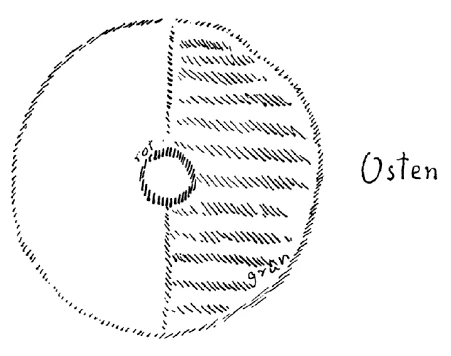

Ich darf Sie vielleicht zuerst auf einiges aufmerksam machen, das für Sie doch interessant sein könnte, zunächst auf einen Artikel in der «Schweizerischen Bauzeitung» vom 20. Januar 1917, wo über den Johannesbau in Dornach bei Basel gesprochen wird, und zwar auf Grundlage des Besuches, den vor kurzem die Schweizerischen Ingenieure und Architekten diesem Bau gemacht haben. Der Artikel ist sehr erfreulich und schön geschrieben, und es ist wirklich eine Oase, könnte man sagen, gegenüber manchem, was in der letzten Zeit gedruckt worden ist, auch jetzt wiederum gedruckt wird sonst über unsere Bestrebungen, gerade auch aus unserem Kreise heraus gedruckt wird. Es ist eine sehr erfreuliche Tatsache, daß von außenstehender, objektiver und namentlich fachmännischer Seite eine so erfreuliche und den Bau würdigende Auseinandersetzung erschienen ist. Also, der Artikel ist erschienen in der «Schweizerischen Bauzeitung» vom 20. Januar 1917; ich rate Ihnen, die Sache zu lesen. Eben wird mir von Herrn Englert, der dazumal die Führung mit übernommen hat der Schweizerischen Ingenieure und Architekten, die sich in so erfreulicher Weise für unseren Bau vom fachmännischen Standpunkte aus und vom allgemein ästhetischen Standpunkte aus interessiert haben, mitgeteilt, daß der Artikel auch im «Bulletin de technique», das in Genf in französischer Sprache erscheint, veröffentlicht werden wird. ^6muc70

Ferner möchte ich auf das eben erschienene Buch - Sie verzeihen, wenn ich in der Ursprache den Titel Ihnen nicht vorlesen kann - aufmerksam machen, das Buch, das eben erschienen ist von unserem Freunde Andrej Bjely, der in der bürgerlichen Sprache, in der er Ihnen bekannt ist, Bugajew heißt. Das Buch ist in russischer Sprache erschienen und setzt in sehr ausführlicher Weise und in sehr eingehender Weise viele Beziehungen der Geisteswissenschaft zur Goetheschen Weltanschauung auseinander. Insbesondere werden die Beziehungen der Goetheschen Weltanschauung zu demjenigen, was einmal in dem Berliner Vortragszyklus über die verschiedenen Weltanschauungsstandpunkte gesagt worden ist — der Vortragszyklus hieß «Der kosmische und der menschliche Gedanke» -, aber auch sonst über dasjenige auseinandergesetzt, was in der Geisteswissenschaft enthalten ist. Die Beziehungen zur Goetheschen Weltanschauung werden in eindringlicher und ausführlicher Weise auseinandergesetzt, und daher ist es sehr erfreulich, daß wie eine Manifestation unserer geisteswissenschaftlichen Weltanschauung dieses Buch in russischer Sprache von unserem Freunde Bugajew erschienen ist. ^h3spk0

Herr Meebold hat vor kurzem ein Buch erscheinen lassen, auf das ich auch hinweisen möchte, bei Piper&Co. in München ist das Buch erschienen. Es heißt: «Der Weg zum Geiste», eine Seelenbiographie, und es wird immerhin interessant sein für Sie aus dem Grunde, weil mancherlei Erfahrungen, die Herr Meebold machte mit der Theosophical Society, in diesem Buche beschrieben werden. ^pr42f2

Das sind die Oasen in der Wüste der Angriffe, von denen einer, der mir noch nicht zugekommen ist, der aber besonders unerhört sein soll, jetzt eben wiederum von einem unserer langjährigen älteren Mitglieder erschienen ist; aber ich habe den gedruckten Artikel noch nicht gelesen, nur Mitteilungen darüber. ^g9st2e

Es sind ja diejenigen Angriffe, die gerade aus dem Kreise der Mitglieder, namentlich älterer, langjähriger Mitglieder kommen, die sind ja besonders «erfreulich», weil man weiß, daß diese Mitglieder es anders wissen könnten. Aber wie gesagt, den Artikel selber habe ich noch nicht zu Gesicht bekommen, sondern nur Mitteilungen darüber. ^8twrdc

Wir haben gestern einiges besprochen in Anknüpfung an die Beziehungen des Menschen zur übersinnlichen Welt, insoferne in dieser übersinnlichen Welt auch unsere Toten, überhaupt die entkörperten, die durch die Pforte des Todes gegangenen Menschen gedacht werden müssen. Es ist in unserem jetzigen Zusammenhang von ganz besonderer Bedeutung, daß man sich klarmacht, wie innerhalb jener Welt, die der Mensch durchmacht zwischen dem Tode und einer neuen Geburt, ebenso eine Entwickelung, eine Evolution stattfindet wie hier auf dem physischen Plane. ^ofwhcx

Wir sprechen hier auf dem physischen Plan, wenn wir zunächst einen kurzen Zeitraum ins Auge fassen, zum Beispiel den der nachatlantischen Zeit, von der indischen, der persischen, der ägyptisch-chaldäischen, der griechisch-lateinischen Periode, Gegenwartsperiode und so weiter, und meinen, indem wir auf solche Perioden hinweisen, daß eine Evolution stattfindet, daß sich gewissermaßen die Seelen der Menschen und die Offenbarungen der Menschenseelen in diesen aufeinanderfolgenden Zeiträumen in charakteristischer Weise unterscheiden. ^dt015l

Ebenso könnte man, wenn man zugleich anschauliche Begriffe bekommen könnte dafür, von einer Evolution sprechen, die für solche Zeiträume stattfindet in dem Bereiche, welchen die Toten durchmachen; denn da findet auch eine Evolution statt. Und an den verschiedensten Stellen, wo das sein konnte, wurde ja auch auf diese Evolution hingewiesen, verschiedene Ausführungen wurden darüber gemacht. Allein, so leicht wie es ist, über die Evolution auf dem physischen Plane zu sprechen — und Sie wissen ja, das ist schon nicht so ganz leicht in unserer materialistischen Zeit -, so leicht dieses also ist für den physischen Plan, ist es natürlich für die geistige Welt nicht, denn für die geistige Welt haben wir keine ordentlich geprägten Begriffe. Die Sprache ist für den physischen Plan geschaffen, und es müssen allerlei Verbildlichungen, allerlei Umschreibungen stattfinden, wenn man auf die geistige Sphäre, in der die Toten sind, hinweisen will gerade mit Rücksicht auf die Evolution. ^0t3ta9

Insbesondere für uns bedeutsam ist natürlich, daß das Leben zwischen dem Tod und einer neuen Geburt in unserem fünften nachatlantischen Zeitraum auch entsprechend anders ist als vorher. Während auf der Erde hier die materialistische Kulturepoche sich abspielt, spielt sich auch allerlei in der geistigen Welt ab. Und da die Toten noch viel intensiver solche Dinge erleben, die zusammenhängen mit der Evolution, als die hier auf dem physischen Plane lebenden Menschen, so hängt schon in intensivster Weise das Schicksal der Toten von der Art und Weise ab, wie eine bestimmte Evolution in bestimmten Perioden abläuft. Die Toten reagieren noch viel intimer, noch viel feiner auf dasjenige, was in der Evolution lebt, als die Lebendigen — wenn wir diese Ausdrücke gebrauchen wollen -, und vielleicht sogar mehr als zu irgendeiner andern Zeit ist das bemerkbar in unserer materialistischen Zeit. ^imqnig

Nun möchte ich in diese Vorträge zum weiteren Verständnis von mancherlei, das wir besprechen wollen, gerade dieses einfügen, was sich einer sorgfältigen Beobachtung des Tatbestandes in bezug darauf ergeben hat. Ich muß allerdings mit Bezug darauf etwas weiter ausgreifen und heute allerlei Betrachtungen anstellen, die erst vorbereiten sollen zu dem, was eigentlich zu sagen ist. Ich habe ja schon darauf hingewiesen, daß der Mensch richtig betrachtet wird im Verhältnisse zum Weltenall, wenn wir seine einzelnen Wesensglieder getrennt betrachten. Für die geistige Betrachtung ist ja dasjenige, was hier auf dem physischen Plane ist, mehr eine Abbildung, eine Offenbarung. Und so können wir in Anlehnung an manches, was wir schon besprochen haben, den Menschen, so wie er uns als physisches Wesen zunächst entgegentritt, viergliedrig auffassen. ^aj3zjf

Zunächst haben wir das Haupt. Dieses ist, wie Sie aus früheren Betrachtungen wissen, in der Form, wie es auftritt in irgendeiner Inkarnation, eigentlich dazu bestimmt, in dieser Inkarnation seinen Abschluß zu finden. Das Haupt ist am meisten dem Tode ausgesetzt. Denn wie unser Haupt gebildet ist — erinnern Sie sich an frühere Betrachtungen -, wie unser Haupt organisiert ist, ist es im wesentlichen das Ergebnis unseres Lebens in der früheren Inkarnation. Wie dagegen unser nächstes Haupt, unser nächster Kopf gebildet sein wird in der folgenden Inkarnation, das ist ein Ergebnis unseres jetzigen Leibeslebens. Kurz habe ich das ausgedrückt vor einiger Zeit, indem ich sagte: Der Leib des Menschen, außer dem Haupte, wandelt sich um zum Haupt in der nächsten Inkarnation, und der nächste Leib wächst zu, während das jetzige Haupt, das wir tragen, der umgewandelte Leib der vorhergehenden Inkarnation ist, und uns unser übriger Leib jetzt aus den Vererbungsverhältnissen mehr oder weniger — das alles ist gradweise verschieden — zugewachsen ist. ^ocuk3s

Das ist die Metamorphose. Das Haupt fällt gleichsam ab in einer Inkarnation, es ist das Ergebnis des Leibes der vorhergehenden Inkarnation. Und der Leib gestaltet sich um, metamorphosiert sich, wie in der Goetheschen Metamorphosenlehre das Blatt zur Blüte, zum Haupte in der nächsten Inkarnation. Dadurch aber, daß das Haupt, der Kopf gebildet wird aus dem Erdenleib der vorhergehenden Inkarnation, hat die geistige Welt mit diesem Haupte zwischen dem Tod und einer neuen Geburt besonders viel zu tun, denn es muß die Urform, das Urbild des Hauptes aus der geistigen Welt gemäß dem Karma herausgearbeitet werden. Daher erscheint auch im Embryo das Haupt zuerst vollkommen ausgebildet, weil es aus dem Kosmos heraus am meisten beeinflußt ist. Durch die menschliche Organisation wird der übrige Leib eigentlich am meisten beeinflußt. Daher erscheint diese übrige Organisation im Embryo später ausgebildet als das Haupt. Das Haupt ist schon — natürlich nicht seiner physischen Gestaltung nach, der physische Stoff ist gewiß der Vererbung entnommen, aber in bezug auf seine Formung, in bezug auf sein Urbild — aus dem Kosmos herausgebildet, ist, wie man sagen kann, aus der Sphäre. Ihr Haupt ist nicht umsonst mehr oder weniger kugelförmig; es ist das Haupt ein Abbild der ganzen Weltensphäre, und die ganze Weltensphäre arbeitet mit an der Bildung des Hauptes. So daß wir sagen können: das Haupt ist aus der Sphäre gebildet. ^pdvo5n

Geradeso wie hier im Leben eine rege Tätigkeit ist, um Maschinen zu bauen, um merkantiles Wesen zu besorgen und dergleichen, so ist in der geistigen Welt der Mensch unter anderem, nicht ausschließlich, aber unter anderem damit beschäftigt, all die Technizismen zu entwickeln, die jetzt spirituelle Technizismen sind, um für die nächste Inkarnation aus der Sphäre, aus der ganzen Welt, aus dem ganzen Kosmos heraus sein Haupt zu bilden gemäß seinem Karma in früheren Inkarnationen. Da schauen wir in tiefe Mysterien des Werdens hinein. ^803dfb

Das zweite, was ins Auge gefaßt werden muß, wenn der Mensch wie eine Offenbarung des ganzen Weltenalls in Betracht kommt, ist alles das, was die Brustorgane betrifft mit Mittelpunkt Lunge und Herz. Wir betrachten sie am besten getrennt von dem Haupte. Das Haupt ist ein Abbild des ganzen kugelförmigen Kosmos. Nicht so die Brustorgane. Sie sind eine Offenbarung derjenigen Kräfte, welche von Osten herkommen. Sie sind herausgebildet aus der, wie man sagen könnte, Halbsphäre. Wenn Sie sich den Kosmos so vorstellen (siehe Zeichnung Seite 206), so können Sie sich das Haupt als ein Abbild des Kosmos vorstellen. Wenn Sie sich hier den Osten vorstellen, so können Sie sich die Brustorgane als ein Abbild desjenigen vorstellen, was von Osten hereinstrahlt, also der Halbsphäre, die ich hier grün schraffiere. An den Brustorganen arbeitet nur die Halbsphäre. Man könnte, wenn man paradox sprechen wollte halber Kopf. ^z7l52o

 ^zfmh6s

Das ist auch die Grundform. Dem Kopfe liegt die Kugelform zugrunde, den Brustorganen liegt zugrunde der Kreisteil, gewissermaßen der Halbkreis. Nur ist er verschiedentlich gebogen, und man kann es nicht mehr genau sehen. Sehen könnten Sie, daß Ihr Kopf wirklich eine Kugel ist, wenn auf den Menschen nie luziferische und ahrimanische Kräfte gewirkt hätten. Sehen würden Sie, daß die Brustorgane wirklich eine Halbsphäre sind, wenn eben diese Kräfte nicht gewirkt hätten. Und gewissermaßen die Richtung nach dem Mittelpunkte — aber man könnte sagen: für gewöhnliche irdische geometrische Verhältnisse nach dem unendlich fernen Mittelpunkte - ist nach dem Osten. Also Halbsphäre: nach dem Osten. ^drp8ew

Jetzt haben wir als drittes Glied alles dasjenige, was sich im Menschen findet als Teilorgane außer Kopf und Brustorganen: Unterleibsorgane mit den daranhängenden Gliedmaßen. Alles das will ich, obwohl die Benennung nicht besonders genau ist, Unterleibsorgane nennen. Dieses, was wir so als Unterleibsorgane zusammenfassen, können wir nun auch ebenso beziehen auf äußerlich organisierende Kräfte, die natürlich hier auf diesem Gebiete hauptsächlich auf dem Umwege durch die Embryologie auf den Menschen wirken, aber eben auf diesem Umwege doch so wirken, weil während der Schwangerschaft die Mutter abhängig ist von den Kräften, die da aufgesucht werden müssen zu der Gestaltung des Unterleibes, ebenso wie die Sphäre aufgesucht werden muß zur Gestaltung des Kopfes, der Osten, die Halbsphäre aufgesucht werden muß zur Gestaltung der Brustorgane. ^1e45gd

Was auf solche Weise auf die Organe des Unterleibes als Kräfte wirkt, das müssen Sie sich vorstellen so, daß es vom Mittelpunkte der Erde kommt, aber differenziert wird durch das Territorium, auf dem sich die Eltern beziehungsweise Voreltern aufhalten, durch das Territorium und alles, was damit zusammenhängt. Also wohlgemerkt, es kommen die Kräfte vom Mittelpunkte der Erde; aber ob ein Mensch in Nordamerika oder Australien oder Asien oder Europa zur Welt gekommen ist, es kommt aus dem Mittelpunkte der Erde, aber immer differenziert, einmal wie die Kraft wirkt durch das europäische Territorium differenziert, einmal durch das amerikanische Territorium differenziert, einmal durch das asiatische Territorium differenziert und so weiter. Also ich kann sagen: Die Unterleibsorgane werden bestimmt aus dem Mittelpunkte der Erde, in Differenzierung durch das Territorium. ^hlu4v9

Nun, wenn wir okkultistisch vollständig den Menschen betrachten wollen, so müssen wir noch ein Viertes betrachten. Da werden Sie sagen: Wir haben ja jetzt schon den ganzen Menschen. Gewiß, aber im Okkultismus kommt immer noch ein Viertes in Betracht, Jetzt haben wir drei Glieder des Menschen betrachtet; jetzt können wir noch den ganzen Menschen für sich betrachten. Das Ganze ist eben auch ein Glied. Also Kopf, Rumpf, Unterleib, aber jetzt alles zusammen, so daß wir als viertes Glied das Ganze haben, und dieses Ganze ist jetzt wiederum durch Kräfte gebildet. Aber es ist dieses Ganze gebildet durch Kräfte des ganzen Erdenumkreises. Also jetzt nicht differenziert durch das Territorium, sondern das Ganze des Menschen ist gebildet durch den ganzen Umkreis, also durch den Erdenumkreis. ^37y4ld

Jetzt habe ich Ihnen den physischen Menschen als ein Abbild dargestellt des Kosmos, wie er gewissermaßen Bild ist der aus dem Kosmos zusammenwirkenden Kräfte. Wir können auch andere Verhältnisse im Zusammenhange mit dem Kosmos betrachten. Da müssen wir dann den geistigen Kosmos in Beziehung zum Menschen denken, nicht bloß den physischen Kosmos. Was wir jetzt betrachtet haben, war der physische Mensch. Daher konnten wir auch stehenbleiben bei dem physischen Kosmos. Betrachten wir den Menschen als entkörpertes Wesen zwischen Tod und neuer Geburt, dann können wir nicht stehenbleiben bei dem, was sich im Raume erschöpft, denn der dreidimensionale Raum, wie wir ihn haben, ist allerdings maßgebend für den physischen Menschen, der zwischen Geburt und Tod lebt, er ist aber nicht maßgebend für den geistigen Menschen, der zwischen Tod und neuer Geburt lebt. Man muß sich dann klar sein, daß der Tote eine andere Welt noch zur Verfügung hat als diejenige, die in drei Dimensionen lebt. ^gdnw4n

Nun muß man, wenn man den entkörperten Menschen, den sogenannten toten Menschen ins Auge faßt, vielleicht eine etwas andere Betrachtungsweise anstellen. Man muß eine Betrachtungsweise anstellen, die mehr in dem Beweglichen lebt. Und gewiß, man kann da von verschiedenen Gesichtspunkten Betrachtungen anstellen, denn das Leben zwischen Tod und neuer Geburt ist ebenso kompliziert wie das Leben zwischen Geburt und Tod. Aber legen wir zunächst zugrunde die Beziehung des Menschen, der auf der Erde hier ist, zu dem Menschen, der in die geistige Welt durch den Tod eingetreten ist. ^0mx5ro

Da haben wir wiederum ein erstes Glied — aber es ist das jetzt mehr zeitlich zu fassen -, ein erstes Entwickelungsstadium, könnten wir auch sagen. Der Tote geht, so könnte ich mich ausdrücken, in einer gewissen Weise in die geistige Welt hinaus; aber er geht aus der physischen Welt in die geistige Welt hinaus, er verläßt die physische Welt und ist Ja insbesondere in den ersten Tagen noch mit der physischen Welt zusammenhängend. Und da ist es sehr bedeutungsvoll, daß der Tote aus der physischen Welt hinausgeht gar sehr angepaßt an die Konstellation, die sich für sein Leben aus der Stellung der Planeten ergibt. Solange namentlich der Tote noch mit seinem Ätherleib zusammenhängt, klingen und schwingen wunderbar nach die Planetenkräfte, die Konstellation der Planetenkräfte durch diesen Ätherleib. So wie im Embryowasser beim Entstehen des physischen Menschen außerordentlich stark mitschwingen die Erdenterritorialkräfte, so schwingen bei dem Toten, der noch in:seinem Ätherleib ist, in einer ganz auffälligen Weise die Kräfte mit, die mit den Sternkonstellationen zusammenhängen in dem Augenblicke, wo — das Ganze ist ja natürlich karmisch bedingt - der Tote die physische Welt verlassen hat. Und man könnte, wenn man nur mit der nötigen Ehrfurcht und Würde vorgeht, interessante Entdeckungen machen, wenn man eben solche Sorgfalt anwenden würde, wie man leider oftmals sogar aus egoistischen Gründen anwendet, um eine Untersuchung zu machen für die Sternkonstellation der Geburt. Viel selbstlosere, viel schönere Resultate würde man bekommen, wenn man gewissermaßen das Horoskop stellte, namentlich das planetarische Horoskop, die Stellung der Planeten für den Moment des Todes. Das ist außerordentlich aufschlußreich für das ganze Wesen des seelischen Menschen, und außerordentlich aufschlußreich für den Zusammenhang des Karma mit dem Eintreten des Todes gerade in einem gewissen Momente. ^inu4bi

Wer einmal Untersuchungen anstellen wird nach dieser Richtung — die Regeln sind ja dieselben wie für das Geburtshoroskop -, der wird zu allerlei interessanten Resultaten kommen, besonders wenn er die Menschen, für die er die Sache anstellt, im Leben mehr oder weniger gut gekannt hat. Denn der Tote trägt durch Tage hindurch mit seinem noch nicht abgegliederten Ätherleib etwas in sich, was Nachschwingen ist, namentlich aus der planetarischen Sternkonstellation. So daß wir sagen können: Erstes Entwickelungsstadium: Richtung in der Sternkonstellation. Das ist bedeutsam eben so lange, als der Mensch mit seinem Ätherleibe verbunden bleibt. ^twjc5l

Das zweite, was nun im Verhältnis des Menschen zum Kosmos in Betracht kommt, das ist, daß der Mensch wirklich in einer gewissen Richtung, könnte man sagen, die physische Welt verläßt, wenn er selbst geistig wird nach Ablegung des Ätherleibes. Da ist es, wo man zuletzt noch im richtigen Sinne, nicht bloß im bildlichen Sinne auf dasjenige, was der Tote tut, Begriffe anwenden kann, die der physischen Welt entnommen sind; denn nach diesem Stadium werden die Begriffe mehr oder weniger Bilder. ^jkiu26

Nun kann man sagen: Im zweiten Stadium wird — und jetzt gilt eben die Richtung noch physisch, obwohl es aus dem Physischen hinausgeht — die Richtung nach dem jeweiligen Osten eingeschlagen. Und durch den jeweiligen Osten wandelt in einem gewissen Zeitpunkte der Tote in die rein geistige Welt hinein. Das ist also die Richtung nach dem Osten. Es ist wichtig, dieses sich einmal zu vergegenwärtigen, weil ein altes Wort verschiedener Brüderschaften, das aus besseren Zeiten der okkulten Menschheitserkenntnis sich bewahrt hat, heute noch darauf aufmerksam macht. In allerlei Brüderschaften wird von demjenigen, der gestorben ist, so gesprochen, daß er «eingegangen ist in den ewigen Osten». Solche Dinge, insofern sie nicht später zugesetzter Firlefanz sind, entsprechen alten Wahrheiten. Geradeso wie wir hier davon sprechen mußten, daß die Brustorgane ihre Gliederung aus dem Osten haben, so müssen wir das Hingehen, den Hingang des Toten durch den Osten uns vorstellen. Indem aber der Tote durch den Osten gewissermaßen austritt aus der physischen Welt in die geistige hinein, gelangt er schon in das Gebiet der Sphäre, das heißt, er erlangt die Möglichkeit, an den Sphärenkräften teilzunehmen, die nun nicht, wie hier der Mensch, zentrifugal, sondern zentripetal nach dem Mittelpunkte der Erde hin wirken; er gelangt in die Sphäre hinein, in die Möglichkeit, nach der Erde zu wirken. ^chh4nz

So daß wir also als drittes Stadium: Übergang in die geistige Welt setzen können, und als viertes Stadium: Wirkungen oder arbeiten aus der geistigen Welt, arbeiten mit den Kräften aus der geistigen Welt. ^rmc601

Mit solchen Ideen treten wir intim heran an dasjenige, was den Menschen hier bindet an die geistigen Welten. Sie können sogar, wenn Sie dieses Schema in der richtigen Weise betrachten, ersehen, daß Nummer 4 schließt mit dem, was Nummer 1 hier beginnt, das ist: die Arbeit an dem Haupte aus der Sphäre heraus. Sie wird von dem Menschen selbst verrichtet, wenn er durch den Osten eingezogen ist in die geistige Welt. ^acs41g

Daß der Tote in der Richtung nach dem Osten die physische Welt verlassen muß, das ist beim Verkehren mit den Toten sehr stark wahrzunehmen. Sie befinden sich gewissermaßen in der Welt, die sie erreichen durch das Tor des Ostens. Sie sind jenseits des Tores des Ostens. Und mit Bezug auf solche Dinge sind gerade die Erfahrungen, die man jetzt im fünften nachatlantischen Zeitraum in der Entwickelungssphäre des Materialismus macht, bedeutsam. ^e5frxg

Sehen Sie, in diesem fünften nachatlantischen Zeitraum entbehren gewissermaßen die Toten durch die materialistische Erdenkultur sehr viel. Manches wird Ihnen schon aus dem gestern Gesagten klar sein. Lernt man das Leben der Toten in der Gegenwart mit den entsprechenden Mitteln kennen, dann ergibt sich, daß sie sehr starke Triebe haben, einzugreifen in die Dinge, welche die Menschen hier auf Erden tun. Aber in früheren Zeiten, in denen weniger Materialismus auf der Erde gelebt hat als jetzt, konnten die Toten leichter eingreifen in das, was auf der Erde geschah. Sie konnten leichter durch die Erdenmenschen, durch das, was die Erdenmenschen als Nachwirkungen der Toten fühlten und empfanden, hereinwirken in die Erdensphäre. Heute ist es sehr, sehr häufig zu erleben, und ich habe gesehen, daß es immer wieder überraschend gewirkt hat im konkreten Falle, daß Menschen, welche hier intensiv an gewissen Zeitereignissen beteiligt waren und gestorben sind und dann weiterleben nach dem Tode, kein Interesse haben können für die Zeitereignisse, die sich hier abspielen nach ihrem Tode, weil die Verbindung fehlt. Auch unter uns sind solche Seelen, die, während sie hier waren auf dem physischen Plane, großes Interesse hatten für die Zeitereignisse, drüben in der geistigen Welt aber den Zeitereignissen, die sich jetzt nach ihrem Tode abspielen, fremd gegenüberstehen. Das ist gerade oftmals bei vorzüglichen Seelen, die hier rege Interessen und große Begabungen hatten, der Fall. Das ist aber schon lange so. Es ist so, nur immer mehr zunehmend, für die ganze Zeit des fünften nachatlantischen Zeitraums, es ist so seit dem 15., 16. Jahrhundert schon, nur zunehmend. Man kann da die Erfahrung machen, daß die Toten, da sie weniger eingreifen können in dasjenige, was die Menschen tun, sich mehr beschäftigen — es tut einem so leid, daß man so triviale Begriffe gebrauchen muß, aber man muß eben die Begriffe gebrauchen, die man in der Sprache hat -, also daß die Toten mehr eingreifen müssen in dasjenige, was die Menschen als einzelne Persönlichkeiten sind. Und das sieht man, daß das Interesse der Toten und die Arbeit der Toten seit dem 15., 16. Jahrhundert mehr auf die einzelnen Persönlichkeiten geht als auf die großen Zusammenhänge unter den Menschen. Und nachdem ich viel mich gerade in dieser Richtung befaßt habe mit diesem Problem, konnte ich mir die Überzeugung verschaffen, daß damit, mit dem, was ich jetzt gesagt habe, eine ganz bestimmte Zeiterscheinung zusammenhängt, die dem, der sich für solche Dinge interessiert, besonders stark auffallen muß in unserer neueren Geschichte. Wir haben in der neueren Geschichte im Gegensatz zu früheren Zeiten die merkwürdige Erscheinung, daß Menschen geboren werden mit sehr bedeutenden Anlagen, die so im allgemeinen wirken mit großem Idealismus, mit vorzüglichem Streben, daß aber diese Menschen es nicht dazu bringen können, Überschau über das Leben zu gewinnen, große Horizonte zu gewinnen. Das drückt sich im Grunde genommen im ganzen Schrifttum seit langer Zeit schon aus. In einzelnen Ideen, Begriffen, Vorstellungen, Empfindungen, die die Leute zum Ausdruck bringen, sei es in der Literatur, in der Kunst, sogar in der Wissenschaft, finden sich manchmal starke Ansätze. Aber — und deshalb ist es ja gerade für die Leute so schwer, sich zu der Überschau, die man haben muß in der Geisteswissenschaft, aufzuschwingen — zu einer großen Überschau bringen es die Leute nicht. Das kommt zum großen Teil davon her, daß die Toten mehr an den einzelnen Menschen herankommen und bei ihm das ausarbeiten, was mehr in der Kindheitsperiode, in der Jugendperiode des Daseins veranlagt wird, während dasjenige, was dem Menschen Überschau verschafft in den Reifezeiten des Daseins, in unserer materialistischen Zeit mehr oder weniger getrennt ist von der Tätigkeit der Toten. Unvollendete, Torso bleibende Talente, nicht bloß in der großen Welt, sondern auch im einzelnen, sind heute aus diesem Grunde sehr häufig, weil die Toten mehr an die einzelnen Seelen heran können als an dasjenige, was so in der Menschheitsentwickelung heute sozial lebt. Die Toten haben einen starken Trieb, an dasjenige heranzukommen, was in der Menschheitsentwickelung sozial lebt, aber es ist eben in unserem fünften nachatlantischen Zeitraum außerordentlich schwierig für sie. ^qkr6x7

Dann ist es insbesondere für die Gegenwart von einer großen Bedeutung, sich mit einer andern Erscheinung bekanntzumachen. Sehen Sie, in unserer Zeit leben viele Begriffe, viele Vorstellungen, die außerordentlich bestimmt sein müssen, sonst kommt man mit diesen Vorstellungen nicht weiter. Insbesondere in dem modernen, mehr merkantilistischen Leben müssen rechnerisch stark umrissene Begriffe ausgebildet werden. Daran hat sich die Wissenschaft gewöhnt, daran hat sich aber auch die Kunst gewöhnt. Denken Sie nur, welche Entwickelung in dieser Beziehung die Kunst durchgemacht hat! Wir haben noch nicht lange jene Kunstperiode hinter uns, wo die Kunst auf die großen idealen Zusammenhänge gegangen ist, und — ich möchte sagen, Gott sei Dank — Begriffe nicht ausreichten, um in leichter Weise ein Kunstwerk zu interpretieren, wo die Kunstwerke vielsagend waren. Das ist heute nicht mehr in demselben Maße der Fall. Heute strebt man nach Naturalismus, und die Begriffe können leicht nachkommen, weil die Kunstwerke selber oftmals aus Begriffen nur hervorgegangen sind, nicht aus der elementar umspannenden Empfindung. Die Menschheit ist heute eben angefüllt mit bestimmten trivialisierten, naturalistischen Begriffen, welche dadurch bestimmt sind, daß sie ganz am physischen Plane ausgebildet sind, wo die Dinge eben auch bestimmt sind, individualisiert sind. ^qgy0sj

Nun ist es sehr bedeutsam, daß solche Begriffe von den sogenannten Toten nicht geliebt werden. Scharf umrissene Begriffe, die nicht beweglich sind, nicht leben, sie werden von den Toten nicht geliebt. Man kann da die merkwürdigsten Erfahrungen machen, Erfahrungen, die sehr interessant sind, wenn man eben solch einen trivial-banalen Ausdruck für diese ehrwürdigen Verhältnisse brauchen darf. Ich habe in der letzten Zeit mich hier bemüht, wie Sie wissen, denn wir haben ja das alles zusammen hier absolviert, auch allerlei Betrachtungen anzustellen über Kunstperioden in Anlehnung an unsere Lichtbilder. Ich habe mich bemüht, manche künstlerische Erscheinung in Begriffe zu bringen. Wenn man reden will, so muß man sie in Begriffe bringen. Allein ich hatte immer das Bedürfnis, die künstlerischen Zusammenhänge nicht in so stramme, festumrissene Begriffe zu kleiden. Wenn ich auch bei den Betrachtungen versucht habe, die Begriffe so weit als möglich zu schnüren: um sie in Worte zu prägen, muß man sie schon bestimmt fassen. Aber ich hatte während der Ausbildung der Begriffe in der Vorbereitung zu den Betrachtungen hier wirklich, ich möchte sagen, einen gewissen Widerwillen, wenn ich das Wort gebrauchen darf, die Zusammenhänge, auf die da hinzuweisen ist, mit so dürftigen Begriffen zu geben, wie sie eben gegeben werden müssen, wenn man sich aussprechen will. Und verstehen werden wir uns auf diesen Gebieten nur dann, wenn Sie gewissermaßen wieder zurückübersetzen dasjenige, was in engmaschigen Begriffen gesagt ist, in weitermaschige Begriffe. ^6byrwg

Wenn man nun zu gleicher Zeit solches erlebt und, ich möchte sagen, zu tun hat mit den entkörperten Seelen, so findet man, daß gerade dann, wenn man eine Erscheinung überblicken will, der gegenüber man so recht die Empfindung hat: Du bist eigentlich viel zu wenig verständig, um diese Erscheinung in Verstandesbegriffe zu fassen, du schaust die Erscheinung, aber der Verstand reicht eigentlich nicht aus, um das, was geschaut wird, wirklich in Begriffe zu schnüren —, wenn man dieses Erlebnis hat, und man kann dieses Erlebnis gerade bei der Betrachtung künstlerischer Erscheinungen auch haben, dann kann man sich ganz besonders intim mit den entkörperten Seelen, mit den toten Seelen finden; denn diese lieben Begriffe, die nicht scharf umrissen sind, die sich mehr beweglich durch die Erscheinungen hindurchtragen lassen. Durch scharf umrissene Begriffe, durch solche Begriffe, die ähnlich sind denen, die hier auf dem physischen Plan unter der Einwirkung der physisch-sinnlichen Verhältnisse gebildet werden, fühlen sich die Toten wie angenagelt an bestimmte Orte, während sie ein freies Bewegen für ihr Leben in der geistigen Welt brauchen. Daher ist die Beschäftigung mit der Geisteswissenschaft auch aus diesem Grunde bedeutsam, um in jene intimen Erlebenssphären hineinzukommen, wo nach dem gestern Angedeuteten der lebende Mensch hier sich mit dem Toten begegnen kann, weil die geisteswissenschaftlichen Begriffe schon nicht so bestimmt gehalten werden können wie diejenigen, die für den physischen Plan ausgearbeitet werden. ^3epkj7

Daher haben böswillige oder beschränkte Menschen es sehr leicht, in geisteswissenschaftlichen Begriffen Widersprüche zu entdecken, weil die Begriffe lebendig sind, und das Lebendige trägt in einem gewissen Sinne, wenn auch nicht den kontradiktorischen Widerspruch, so doch das Bewegliche in sich. Aber das kommt gerade durch die Beschäftigung mit dem Geistigen. Man muß da die Dinge von den verschiedensten Seiten beleuchten. Und dieses Beleuchten von den verschiedensten Seiten bringt einen nun wirklich der geistigen Welt nahe. Daher fühlen sich die Toten wohl, wenn sie hereinkommen können in die Sphäre von Menschenbegriffen, die nicht pedantisch umrissen sind, sondern die beweglich sind. Am unwohlsten fühlen sich die Toten, wenn sie hereinkommen sollen in die allerpedantischesten Begriffe, die für die übersinnliche Welt in der letzten Zeit geprägt worden sind für die Menschen, die nun ganz und gar nicht in der geistigen Welt leben wollen, sondern die auch für die geistige Welt Sinnliches haben wollen, die also spiritistische Experimente machen, um auch die geistigen Begriffe in die sinnliche Sphäre ganz fest hereinzubekommen. Das sind eigentlich die größten Materialisten. Diese Menschen suchen für den Verkehr mit den Toten gerade starre Begriffe auf. Daher martern sie die Toten am allermeisten, weil sie sie zwingen, wenn sie herankommen wollen, gerade in das Gebiet einzutreten, das der Tote seiner ganzen Organisation nach nicht lieben kann. Er liebt die beweglichen Begriffe, nicht die starren Begriffe. ^gz9q8f

Das sind, glaube ich, Erfahrungen, welche man ganz besonders machen kann in diesem Zeitalter der fünften nachatlantischen Periode, wo hier auf Erden der Materialismus herrscht und unter den Toten solche Eigentümlichkeiten, wie ich sie beschrieben habe. Denn es ist durchaus das gleiche, was hier auf der Erde den Materialismus bestimmt, und dafür ein ganz bestimmtes Leben auch in der geistigen Sphäre bestimmt. In der griechisch-lateinischen Zeit traten die Toten doch anders an die lebenden Menschen heran als in unserer Zeit. In der geistigen Sphäre ist, möchte ich sagen, heute in der fünften nachatlantischen Zeit mehr Irdisches — aber Sie müssen sich das natürlich imaginativ, bildlich vorstellen —, mehr irdische Zusammengesetztheit in der Substantialität der Toten als früher. Ein Toter erscheint einem heute in einer viel mehr den irdischen Verhältnissen nachgebildeten Gestalt als früher, menschenähnlicher, möchte ich sagen, ist der Tote heute, als er früher war. Und dadurch wirken die Toten heute auf die hier Lebenden mehr oder weniger paralysierend. Deshalb ist es so schwer heute, den Toten nahezukommen, weil man so sehr leicht betäubt wird durch sie. Hier auf der Erde herrschen die materialistischen Gedanken; in der geistigen Welt, als einem Karma daraus, herrscht gewissermaßen die materialistische Folge, die Verirdischung der spirituellen Leiblichkeit bei den Toten. Dadurch aber, daß die Toten, wenn ich den Ausdruck gebrauchen darf, überkräftig sind, dadurch wirken sie betäubend. Und man muß sich heute durch möglichst starke geisteswissenschaftliche Empfindungen erst die Kraft aneignen, um gegen diese Betäubung aufzukommen. Das ist die Schwierigkeit heute, eine der Schwierigkeiten, mit der geistigen Welt in Beziehung zu treten. ^p8csb4

Nun, für die irdische Sphäre, die man ja auch geistig ansehen kann, nehmen sich die Dinge, wenn man sie geistig ansieht, anders aus, als man oftmals urteilt, wenn man die Dinge nicht geistig ansieht. Wir sagen selbstverständlich mit Recht, und wir haben es oft auseinandergesetzt: wir leben in dem materialistischen Zeitalter. Warum? Weil die Menschen in diesem materialistischen Zeitalter — nicht die Verständigen, aber die Menschen im allgemeinen -, so paradox es klingt, zu geistig sind. Daher sind sie so leicht zugänglich reinen Geistigkeiten wie ahrimanischen und luziferischen Einflüssen. Die Menschen sind zu geistig. Und gerade durch die Geistigkeit werden die Menschen heute leicht materialistisch. Nicht wahr, das, was der Mensch glaubt und denkt, ist ja etwas ganz anderes, als er ist. Gerade die geistigsten Menschen sind heute leicht zugänglich für ahrimanische Einflüsterungen und werden dadurch materialistisch. ^8p4arz

So scharf man die materialistische Weltanschauung und die materialistischen Lebensgestaltungen bekämpfen muß, man darf nicht sagen, daß in den Kreisen dieser Materialisten die ungeistigsten Menschen sind. Wirklich, wenn ich da ein Persönliches einfügen darf: Ich habe viele geistige Menschen gefunden, nicht solche, die geistige Ansichten haben, sondern die geistige Menschen sind, in Monistenvereinen und dergleichen, dagegen grobe materialistische Naturen vorzugsweise in Spiritistenvereinen. Gerade da findet man, wenn auch dort vom Geiste geredet wird, die am gröbsten materialistischen Naturen. Und wirklich, abgesehen von dem, was er oftmals behauptet: Ein durchaus geistiger Mensch, der gerade aus Geistigkeit heraus zugänglich ist einer ahrimanischen Weltanschauung, ist zum Beispiel Haeckel. Haeckel ist ein geistiger Mensch, ein ganz durchgeistigter Mensch. Mir trat das einmal besonders deutlich vor Augen, als ich in Weimar in der dortigen alten «Künstlerschmiede» saß — ich habe die Sache schon einmal erzählt, vielleicht sogar mehrmals — und da war Haeckel am andern Ende des Tisches, mit seinen schönen geistigen blauen Augen und seinem schönen Kopfe. In meiner Nähe befand sich der berühmte Buchhändler Herz, der sehr viele Verdienste um den deutschen Buchhandel hat und der so im allgemeinen etwas von Haeckel wußte, aber nicht wußte, daß das der Haeckel ist, der da am andern Ende des Tisches saß. Als Haeckel einmal so herzlich lachte, fragte Herz: Wer ist denn der Mann, der da unten so lacht an dem Tische? — Da sagte ich: Das ist der Haeckel. — Das ist nicht möglich -, sagte er, böse Menschen können so nicht lachen! ^ecphdh

Daher sind auch die Begriffe der Materialisten der Gegenwart so dünn, möchte ich sagen, so dünn von Geistigkeit, daß sie nicht herankommen an die Offenbarungen der Geistigkeit im Materiellen, und ihnen das Geistige und das Materielle auseinanderfällt, das Geistige zu bloßen Begriffen wird. Jedenfalls findet man die klotzigsten Materialisten heute in den vielfach spiritualistisch sich nennenden Gesellschaften, Vereinigungen und dergleichen. Klotzigen Materialismus findet man da, der es manchmal sogar dazu gebracht hat, zu seiner eigenen Verherrlichung seine eigene Affenabstammung — von einem bestimmten Affen noch dazu — für die Menschheit besonders zu registrieren. Nicht einmal mit der allgemeinen Affenabstammung des Menschen war man zufrieden, sondern man führte sich auf ganz bestimmte Affenvorfahren zurück. Man hat ja in dieser Beziehung manches Groteske erlebt. Für diejenigen, die es nicht wissen sollten, erkläre ich, daß ja vor ein paar Jahren ein Buch erschienen ist, in dem Mrs. Besant und Mr. Leadbeater genau angegeben haben, von welchen Affen sie abstammen in uralten Zeiten, und sie haben ihren Stammbaum bis auf bestimmte Affen zurückgeführt, so daß man dort diesen Stammbaum von den Affen her lesen kann. Das sind Dinge, die immerhin in vielgelesenen Büchern im heutigen Zeitalter auch möglich sind. ^wmgcxb

Und diese Begriffe, die ich heute entwickelt habe, die brauchen wir schon, um nun in manche Stellen unseres gegenwärtig zu besprechenden Themas tiefer einzudringen. Denn diese Welt hier ist durchaus abhängig von der geistigen Welt, in welcher die Toten sind, und hängt zusammen mit der geistigen Welt. Daher versuchte ich, Ihnen heute solche Begriffe zu entwickeln, die sich auf die Beobachtungen der unmittelbaren Gegenwart beziehen. Es ist wirklich alles dasjenige, was hier in der physischen Welt geschieht, von einer gewissen Wirkung hinauf in die geistige Welt. Aber auch die geistige Welt mit den Taten der Toten zeigt sich entweder in dem, was die Toten tun können für die physische Welt, oder auch in dem, was sie nicht tun können gerade in dem gegenwärtigen materialistischen Zeitalter. Und wir haben dieses materialistische Zeitalter charakterisiert, insofern es sogar übermaterialisiert worden ist durch gewisse okkulte Brüderschaften, wie ich Ihnen gestern auseinandergesetzt habe. Es ist heute im hohen Grade gerade der Typ des Materialismus allen Weltereignissen zugrunde liegend, welchen man den merkantilistischen Typ nennen kann. Und wie ich Sie bitte, auf der einen Seite sich für morgen gut zu merken die Begriffe, die ich in bezug auf das Leben der Toten heute vor Ihre Seele hingestellt habe, so bitte ich Sie, auf der andern Seite auch ins Auge zu fassen, wie wenig selbstverständlich heute vieles genommen wird, was in weniger materialistischen Zeitaltern viel selbstverständlicher genommen wurde. Der Zusammenhang mit diesen Erscheinungen wird uns erst morgen ganz klar werden. Allein, es ist doch ganz charakteristisch für unsere Zeit, daß man immerhin gerade auf das Merkantilistische gewisse Begriffsbetrachtungen ausdehnt, die dem, der keine Aufmerksamkeit hat für solche Zeiterscheinungen, entgehen. Aber sie sollten einem nicht entgehen. Merkantilismus auf der einen Seite, gut; aber er muß ins richtige Licht gestellt werden, in dem er im sozialen Leben drinnensteht. Dazu ist es notwendig, daß man gewisse Maßstäbe hat für alles. Aber heute lebt man vielfach im Chaos der Begriffe. Und wenn im Chaos der Begriffe die Begriffe ganz bestimmt gemacht werden, wie es im materialistischen Zeitalter der Fall ist, wo gerade an den sinnlichen Vorstellungen die Begriffe ganz bestimmt gemacht werden, und dann doch wiederum ein Begriffschaos herauskommt, wie es beim heutigen Materialismus der Fall ist, dann ist dieses wirklich so, daß es den schärfsten Strich zieht zwischen der physischen Welt, in der die Menschen zwischen Geburt und Tod sind, und der übersinnlichen Welt, in der die Menschen zwischen Tod und neuer Geburt sind. ^ivv6le

Betrachten Sie in diesem Zusammenhange nur einmal die Tatsache, daß im Gegensatze zu andern Gebieten, wo man weniger philosophisch zu Werke geht, man gerade in Mitteleuropa auch mit dem merkantilistischen Wesen, trotzdem es in Mitteleuropa nicht so heimisch ist, gern philosophisch zu Werke geht. In Mitteleuropa macht man gern aus allem eine Philosophie. Man philosophiert auch über dasjenige, was im Materialismus unseres Zeitalters typisch ist. So gibt es ein interessantes Buch, interessant eben als Kulturerscheinung, das heißt: «Ideal und Geschäft», von Jaroslaw, lange vor dem Krieg erschienen. In diesem Buche sind einige Kapitel, die mich als kulturhistorisch bedeutsame besonders interessiert haben. Nicht das, was darin steht, hat mich interessiert, aber als kulturhistorisch interessant hat mich zum Beispiel besonders interessiert das Kapitel «Plato und das Detailgeschäft». Es ist also die Rede von allem, was den Kaufmannsstand, das Merkantilistische, betrifft. Da ist auch ein interessantes Kapitel «Das astrologische System der Pfefferpreise». Ein nicht uninteressantes Kapitel ist auch «Der Großhandel bei Cicero». Ein anderes Kapitel ist «Kaufmann-Porträts bei Holbein und bei Liebermann». Gar nicht uninteressant ist auch das Kapitel «Jakob Böhme und das Qualitätsproblem». Ganz interessant ist «Die Göttin Freia in der germanischen Mythologie und die freie Konkurrenz». Und besonders interessant «Der Wirtschaftsgeist, den Jesus lehrt». ^j3pmxd

Sie sehen, zusammengeworfen wird alles. Aber gerade dadurch, daß es so zusammengeworfen wird, gewinnen die Dinge denjenigen Charakter, der den Materialismus macht. Nehmen Sie dieses als eine Vorbereitung für andere Betrachtungen, die wir morgen anstellen werden, ^b4amwz