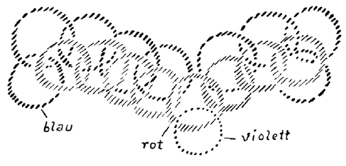
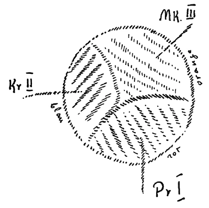
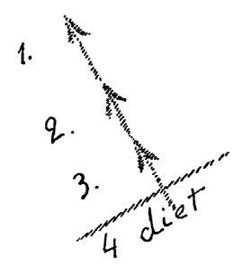

Wenn Sie sich an einzelne Ausführungen erinnern, die in dem Wiener Zyklus stehen über «Das innere Leben der Seele und dasLeben zwischen dem Tode und einer neuen Geburt», so werden Sie da Begriffe, oder besser gesagt, innere Seelenerlebnisse finden, die der Mensch machen kann, und durch die er sich nähern kann jenen Welten, von denen wir gestern gesprochen haben und die wir gemeinsam haben mit den entkörperten Menschenseelen, mit den Seelen, die durch des Todes Pforte geschritten sind und sich für ein neues Erdendasein vorbereiten. Sie werden vor allen Dingen einen Begriff lebendig machen können, der unentbehrlich ist, wenn man wirkliche Vorstellungen gewinnen will über die geistige Welt, das ist, daß vieles — ich betone ausdrücklich: vieles, nicht alles —, vom Gesichtspunkte der geistigen Welt angesehen, geradezu entgegengesetzt sich darstellt gegenüber den Offenbarungen der physischen Welt. Legen wir diese Vorstellungen zugrunde und betrachten wir einmal mit Hilfe dieser Vorstellungen das Hinüberleben und auch Hinüberschauen des Menschen in die geistige Welt. ^19vi10

Hier, indem wir wachend, also zwischen Aufwachen und Einschlafen, gebunden sind an unseren physischen Leib, daß wir diesen physischen Leib als Werkzeug benützen zu unserem Erleben in der Welt, hier fühlen wir gegenüber der geistigen Welt ein gewisses Unvermögen, sie gewissermaßen zu fassen, ihre Offenbarungen festzuhalten. Solange wir eingeschlossen im physischen Leibe sind, brauchen wir, um etwas wahrzunehmen, die groben Instrumente des physischen Leibes. Wir müssen diese benützen. Und wenn wir sie nicht benützen können, wie es der Fall ist zwischen Einschlafen und Aufwachen, da ist gewissermaßen unsere ja erst aus der Monden- und Erdenzeit stammende astralische und Ich-Wesenheit zu dünn, zu intim, um etwas zu erfassen. Die geistige Welt ist ja immer um uns, so wahr wie die Luft um uns ist. Und wären wir, ich möchte sagen, genügend dicht in unserem astralischen und Ich-Wesen, so würden wir dasjenige, was geistig in der geistigen Welt um uns herum ist, immer erfassen können, perzipieren können. Wir können es nicht, weil wir eben in unserem astralischen und IchWesen zu dünn sind, weil das noch keine ausgebildeten Instrumente sind wie die physischen Sinne oder wie das Gehirn, dessen sich das Vorstellungsvermögen bedient, um zunächst zu wachen Erlebnissen der Seele zu kommen. ^hspo7j

Wenn nun der Mensch durch die Pforte des Todes getreten ist, dann ist er ja, wie Sie wissen, im wesentlichen in jener Substantialität, in der wir sind während unseres schlafenden Zustandes, zunächst wenigstens für die nächsten Jahrzehnte. Diese Substantialität kann nicht so dünn bleiben, wie sie ist während unserer physischen Verkörperung, sonst würde zwischen dem Tod und einer neuen Geburt alles Erleben unbewußt bleiben. Und das bleibt es ja nicht, im Gegenteil, es tritt ein zwar andersartiges, aber viel helleres, viel gewaltigeres Bewußtsein zwischen dem Tod und einer neuen Geburt auf, als es vorhanden ist, während wir im physischen Leibe weilen. Wir müssen da fragen: Wie kommt diese Bewußtheit zustande, wenn wir weilen im astralischen Leibe und in der Ich-Wesenheit? ^59pnn8

Nun, hier im physischen Leben haben wir ja das physische Instrument, indem wir durchdrungen werden — man könnte auch sagen: umkleidet werden - von den Ingredienzien, welche die physische Welt, also das mineralische, das pflanzliche, das tierische Reich bilden. Das, was uns da zubereitet wird als physische Leiblichkeit, ist unser Instrument des wachen Lebens. In ähnlicher Art wird uns auch ein Instrument zubereitet zwischen dem Tod und einer neuen Geburt. Das erste, was gewissermaßen uns dadurch zubereitet wird nach dem Tode, daß wir überhaupt Menschen sind, was uns unbedingt zubereitet werden muß, schon wenn wir unseren Ätherleib abgelegt haben, das ist dasjenige, was von der Hierarchie der Angeloi kommt. Wir werden gewissermaßen durchsetzt mit der Substantialität der Hierarchie der Angeloi. Ein Wesen aus der Hierarchie der Angeloi gehört ja zu uns selbst, ist gewissermaßen die führende Wesenheit unserer menschlichen Individualität. Indem wir aber heraufwachsen in die geistige Welt, verbinden sich mit dieser Wesenheit aus der Hierarchie der Angeloi, der wir zunächst verbunden sind, andere Wesenheiten aus der Hierarchie der Angeloi, und es bildet sich gewissermaßen in uns oder besser gesagt für uns eine Art Angeloi-Organismus aus, der allerdings anders konstruiert ist als unser physischer Organismus. ^u8a6kh

Wollte man das, wovon ich hier spreche, sich einmal schematisch vor die Seele führen, so könnte man das in folgender Weise tun, man könnte sagen: Wir leben hinauf durch die Pforte des Todes in die geistige Welt. Das sei schematisch unsere eigene Individualität (siehe Zeichnung S$. 224, violett), und mit der ist verbunden diejenige Wesenheit, die wir aus der Hierarchie der Angeloi wie uns zugeteilt empfinden (rot). Aber indem wir unseren Ätherleib ablegen, tritt diese unsere Angeloiwesenheit mit andern Wesenheiten aus der Hierarchie der Angeloi in Beziehung, gliedert sich an, und wir fühlen in uns diese ganze Angeloiwelt. Die fühlen wir in uns, die erleben wir als innere Erfahrung, abgesehen natürlich von den äußeren Erlebnissen, die uns dadurch vermittelt werden. ^2875x7

Dieses Durchdrungenwerden mit der Welt der Angeloi macht es auch möglich, daß wir in Beziehungen treten zu entkörperten Menschen, zu andern Menschen, die vorher durch des Todes Pforte gegangen sind. Ich möchte sagen: So wie uns unsere Sinne hier die Außenwelt vermitteln, so vermittelt uns dieses Eingebettetsein in die Welt der Angeloi die Beziehung zu den Geistwesen, auch der Menschen, die wir in der geistigen Welt antreffen. So wie wir hier in der physischen Welt, abhängig von den Verhältnissen der physischen Welt, einen in der einen oder in der andern Art organisierten Organismus erhalten, so erhalten wir gewissermaßen einen Geistorganismus, der durch dieses Netz der Angeloi-Substanzen hervorgerufen wird. Wie sich dieses Netz der Angeloi-Substanzen gestaltet, das hängt aber sehr davon ab, wie wir in die geistige Welt uns hinaufarbeiten. Arbeiten wir uns hinauf in die geistige Welt so, daß wir wenig Empfindung haben können für die geistige Welt, daß wir zu viele, allzuviele Nachklänge haben an physische Genüsse, Begierden und Instinkte, an physische Sympathien und Antipathien, so wird die Gestaltung dieses Angeloi-Organismus schwierig. Und dazu ist ja gerade die Zeit des Verweilens in der Seelenwelt, wie wir sie genannt haben, da, um uns freizumachen von demjenigen, was uns in der angedeuteten Art durchdringt von der physischen Welt her, und was uns verhindert, diesen Angeloi-Organismus in entsprechender Weise auszubilden. Er wird während der Zeit, während wir weilen in der Seelenwelt, allmählich ausgebildet. Wir wachsen heran zu diesem AngeloiOrganismus. Aber gleichzeitig beginnt damit eine andere Notwendigkeit, die Notwendigkeit, sich nun nicht nur zu durchdringen mit diesem Angeloi-Organismus, sondern sich auch zu durchdringen mit einer weiteren Substantialität, nämlich mit einem Archangeloi-Organismus. Unser Bewußtsein in der geistigen Welt zwischen dem Tod und einer neuen Geburt würde sehr dumpf bleiben, wenn wir uns nicht durchdringen könnten mit dem Archangeloi-Organismus. Wir würden gewissermaßen, wenn wir nur durchdrungen würden mit dem AngeloiOrganismus, träumende Wesen bleiben in der geistigen Welt, ich möchte sagen, gewoben aus allerlei Imaginativstoff aus der geistigen Welt; aber wir würden unser Dasein zwischen dem Tod und einer neuen Geburt verträumen. Damit wir es nicht verträumen, damit eben ein starkes, helles Bewußtsein auftritt, müssen wir durchdrungen werden mit dem Archangeloi-Organismus (siehe Zeichnung, blau). ^o9momx

 ^jh0mah

Das macht unser Bewußtsein zu einem entsprechend hellen. Dadurch wachen wir gewissermaßen erst auf für die geistige Welt. In dem Maße aber, in dem wir da aufwachen für die geistige Welt, in dem Maße bekommen wir auch ein freies Verhältnis zu der physischen Welt hier. Und dieses freie Verhältnis zu der physischen Welt hier müssen wir haben. Man muß sich nämlich fragen: Wie ist das Verhältnis der physischen Welt zu den entkörperten Menschen, die durch die Pforte des Todes gegangen sind? Auch das können Sie aus jenen Wiener Vorträgen entnehmen. Hier in der physischen Welt wird es dem Menschen, so stark er auch die Sehnsucht haben mag, schwierig, sich emporzuheben mit seinen Gedanken und Empfindungen zu einer Wahrnehmung der geistigen Welt, der himmlischen Welt. Der Mensch lechzt nach Vorstellungen über die himmlische Welt, aber er entfaltet nicht leicht das starke Vorstellungsvermögen, um diese himmlische Welt in seine Sphäre hereinzubekommen. In gewissem Sinne ist das entgegengesetzt für den Aufenthalt in der geistigen Welt zwischen dem Tod und einer neuen Geburt. Dahinein geht uns zunächst nach, was in der physischen Welt erlebt wird; was in der physischen Welt Bedeutung hat, was hier wahrgenommen wird, das geht uns nach. Es geht uns sogar in einer sehr eigenartigen Weise nach. Beispiele, die ich Ihnen anführe, die werden Ihnen einen Begriff von der Kompliziertheit dieser Dinge geben. Für das physische Vorstellungsvermögen der Menschen sehen diese Beispiele zuweilen grotesk, paradox aus, aber man kann sich nicht konkret in die geistige Welt hineinleben, wenn man nicht eben auf solche Vorstellungen auch Rücksicht nimmt. ^dw2gpf

Die Wahrnehmung desjenigen, was im Mineralreich vorhanden ist, die geht eigentlich gleich verloren, wenn der Mensch durch die Pforte des Todes geschritten ist. Hier in der physischen Welt hat der Mensch dadurch, daß er Sinne hat, gerade für das Mineralreich das meiste Wahrnehmungsvermögen, man könnte fast sagen, das fast ausschließliche Wahrnehmungsvermögen. Denn der Mensch nimmt nicht viel anderes als das Mineralreich wahr, wenn er zunächst auf seine Sinne beschränkt ist. Sie sagen, wir nehmen auch Tiere wahr, wir nehmen auch Pflanzen wahr. Aber warum? Sehen Sie, wenn Sie hier eine Pflanze haben, so sind in dieser Pflanze mineralische Produkte. Das wissen Sie ja. Die ist ausgefüllt mit mineralischen Produkten. Und das, was mineralisch pulsiert, strömt, was mineralisch in der Pflanze enthalten ist, das nimmt man eigentlich in der Pflanze wahr — ebenso im Tier. So kann man schon sagen, fast ausschließlich nimmt der Mensch hier durch seine Sinne Mineralisches wahr. Also dieses Mineralreich, das da der Mensch wahrnimmt, das schwindet dahin. Nehmen wir ein bestimmtes Beispiel. Hier sehen Sie jeden Tag Kochsalz auf Ihrem Tische, Sie sehen es als äußeres mineralisches Produkt. Der entkörperte Mensch, der durch die Pforte des Todes geschritten ist, kann dieses Kochsalz im Salzfaß nicht sehen. Aber wenn Sie sich das Salz in die Suppe tun und es verschlucken, so bewirkt das einen Prozeß in Ihrem eigenen Inneren, und was da vorgeht in Ihrem eigenen Inneren, namentlich der Vorgang, der begleitet ist von der Empfindung des Salzigen, den nimmt der Tote wahr. Also von dem Augenblicke an, wo das Salz anfängt auf der Zunge einen Geschmack hervorzurufen, also einen Prozeß absolviert in Ihrem eigenen Inneren, von dem Augenblicke an kann der Tote das Salz in seiner Wirkungsweise wahrnehmen; so sind die Dinge. Aber wir können eben sagen: So wie das Mineralreich hier ist, erstarrt, ohne daß es noch seine Wirkungen auf einen menschlichen oder tierischen oder pflanzlichen Organismus ausübt, so kann der Tote, nachdem er durch die Pforte des Todes geschritten ist, das mineralische Reich nicht wahrnehmen. Daraus schon können Sie ersehen, daß dasjenige, was man nennen könnte die äußere Umgebung des Toten, eine ganz andere ist als diejenige, die der Mensch gewöhnt ist als seine Außenwelt zu bezeichnen hier zwischen der Geburt und dem Tode. ^zd7qwn

Eines bleibt aber für die Toten immer wahrnehmbar - und es ist wichtig, gerade darauf sein Augenmerk zu wenden -, das ist dasjenige, worin die menschlichen Gedanken und Empfindungen hineingeflossen sind; und zwar sind es die menschlichen Gedanken, die dann wahrnehmbar sind. Das Salz als ein Naturprodukt nimmt also der Tote nicht wahr, so wie es im Salzfasse ist. Das Salzfaß, das vielleicht aus Glas oder aus irgend etwas anderem Stofflichen ist, nimmt er auch nicht wahr; aber insofern in das Salzfaß bei seiner Verfertigung menschliche Gedanken sich hineingenistet haben, nimmt der Tote diese menschlichen Gedanken wahr. Wenn Sie sich vorstellen, wie in unserer Umgebung überall, wo wir hinschauen, zu dem, was nicht bloßes Naturprodukt ist, menschliche Gedanken gewissermaßen die Signaturen abzugeben haben, nach denen sich diese Dinge anordnen, so bekommen Sie die Vorstellung von dem, was der Tote wahrnehmen kann. Der Tote nimmt auch alle Beziehungen zwischen den Wesen wahr, also die Beziehungen zwischen den Menschen und so weiter; das alles ist für ihn lebendig. ^7evh7l

Nun aber handelt es sich darum, daß für gewisse Dinge hier in der physischen Welt der’Iote ebenso dasBestreben hat,sie loszubekommen aus seinen Vorstellungen, aus seinen Seelenerlebnissen, sie loszubekommen, sie wegzuwischen gleichsam, wie der physische Mensch hier die Sehnsucht hat, gewisse Vorstellungen über die jenseitige Welt zu bekommen. Hier hat man dieSehnsucht, Vorstellungen über das Jenseits zu bekommen. Nach dem Tode hat man für gewisse menschliche Dinge hier auf Erden - und diese Erde ist dann das Jenseits für die Toten -, die Sehnsucht, diese Dinge auszulöschen, wegzuwischen. Dazu aber ist es notwendig, eben durchdrungen zu werden von den Substantialitäten dieser höheren Hierarchien der Angeloi, Archangeloi. Denn dadurch, daß man von deren Substantialitäten durchdrungen wird, kann man auslöschen aus dem Bewußtsein dasjenige, was ausgelöscht werden muß. Damit bekommen Sie eine Vorstellung von dem Hineinwachsen in die geistige Welt, von der Art und Weise, wie der Mensch in die geistige Welt hineinwächst, indem er gewissermaßen seine eigene Individualität durchdringt mit den Substantialitäten der Wesenheiten der höheren Hierarchie. Nun ist es sehr wichtig, folgendes einzusehen: Um zunächst alles dasjenige, was mit den Menschen mehr oder weniger persönlich zusammenhängt — und das sind ja alle die Kunstprodukte, die wir zum Gebrauche haben, von denen ich Ihnen sagte: weil sie menschliche Gedanken verkörpern, sieht sie der Tote -, um das wegzuschaffen, aus dem Bewußtsein zu entfernen, dazu ist vor allen Dingen nötig, daß der Mensch in gehöriger Weise durchsetzt wird von der Substanz der Angeloi. Aber auch anderes muß abgestreift werden, anderes muß gewissermaßen abgedämpft werden, damit der Mensch in der richtigen Weise seinen Aufenthalt finden kann in der geistigen Welt. ^l6fj8y

Nun, so sonderbar Ihnen das vielleicht vom Erdenstandpunkte aus klingen mag, so ist es doch wahr, daß ein Hemmnis besteht, ein Hindernis für das Hineinwachsen gerade in dasjenige, was uns das klare, helle Bewußtsein gibt in der geistigen Welt, und dieses Hemmnis, was uns verhindert, leicht in die geistige Welt hineinzuwachsen, das ist, so sonderbar es eben klingt, die menschliche Sprache, die Sprache, deren wir uns hier auf Erden für die physische Verständigung von Mensch zu Mensch bedienen. Der Tote muß allmählich der Sprache entwachsen, sonst würde das Verbleiben in den Affinitäten, die ihn an die Sprache binden, ihn verhindern, in das Reich der Archangeloi hineinzuwachsen. Die Sprache ist wirklich nur für irdische Verhältnisse da, aber der Mensch ist innerhalb der irdischen Verhältnisse seelisch sehr zusammengewachsen mit der Sprache. Für viele Menschen ist ja das Denken gewissermaßen in der Sprache gerade heute im materialistischen Zeitalter geradezu enthalten. Die Menschen denken heute im materialistischen Zeitalter fast gar nicht in Gedanken, sondern ungeheuer stark in der Sprache, in Worten. Daher sind sie so zufrieden, wenn sie für irgend etwas einen Ausdruck gefunden haben. Aber solche Ausdrücke, solche Wortbezeichnungen taugen eigentlich nur hier für das physische Leben, und nach dem Tode ist es die Aufgabe, sich loszumachen von den Wortbezeichnungen. ^h0t3y3

Auch in bezug auf solche Dinge gibt die geisteswissenschaftliche Betrachtung eine gewisse Möglichkeit, in das Reich des Übersinnlichen sich hineinzuleben. Denn wie oft sage ich Ihnen, man kann nur annähernd, indem man um die Sache, um die Worte gleichsam einen Kreis herumzieht, zu dem wirklichen Begriff kommen. Wie oft zeigte ich Ihnen, wie man versuchen muß, durch Beleuchtung von allen Seiten, durch den Gebrauch der verschiedenartigsten Worte gerade vom Worte freizukommen, um zum Begriff zu kommen. Geisteswissenschaft emanzipiert uns in gewissem Sinne von der Sprache. Das tut sie in vollstem Maße. Daher bringt sie uns in diejenige Sphäre hinein, die wir gemeinschaftlich haben mit den Toten. ^x05sms

Also die Emanzipation von der Sprache, die hängt innig zusammen mit dem Hineinwachsen in die Substantialität der Archangeloi. Dadurch wird eine Brücke geschaffen zwischen hier und der geistigen Welt, daß wir uns gerade geisteswissenschaftlich wiederum emanzipieren von der Sprache, daß wir geisteswissenschaftlich Begriffe schaffen, die mehr oder weniger unabhängig von der Sprache sind. ^gqq637

Nun fassen Sie das, was ich eben gesagt habe, recht scharf ins Auge, dann haben Sie eine wichtige Beziehung zwischen hier und der geistigen Welt ins Auge gefaßt, und Sie werden, wenn Sie den Gedanken lebendig durchdenken, eine wichtige Handhabe gewinnen für das Verständnis mancher Impulse, die von jenen Brüderschaften ausgehen, von denen ich Ihnen in diesen Wochen mehrfach gesprochen habe. Diese Brüderschaften machen es sich — das können Sie aus manchen Auseinandersetzungen, die ich gegeben habe, entnehmen — mehr oder weniger zur Aufgabe, gerade den Menschen im materiellen Felde zu erhalten. Und wir haben ja in diesen Tagen gesehen, daß es diesen Brüderschaften sogar darum zu tun ist, den Materialismus noch zu übermaterialisieren, gewissermaßen, wie ich es genannt habe, eine ahrimanische Unsterblichkeit für die Teilnehmer solcher Brüderschaften zu schaffen. Das können sie am allermeisten dadurch, daß sie Gruppeninteressen, Gruppenegoismen vertreten, und das tun sie ja im eminentesten Maße. Und schon darin liegt das Bestreben, ein Gruppeninteresse zu vertreten, daß gewissermaßen die einflußreichsten dieser Brüderschaften von dem Gesichtspunkte ausgehen, den ich Ihnen angeführt habe: die fünfte nachatlantische Kulturperiode ganz zu durchtränken mit alldem, was englisch spricht. Denn das ist ja für diese Brüderschaften die Definition der fünften nachatlantischen Periode: Alles dasjenige gehört zu den Menschen der fünften nachatlantischen Periode, was englisch spricht, die englisch sprechenden Menschen. Damit liegt schon in dem allerersten Grundsatze die Einengung auf ein egoistisches Gruppeninteresse. ^zhilhh

Damit ist geistig etwas ungeheuer Bedeutungsvolles gemeint. Nichts Geringeres ist damit gemeint, als eine Wirkung nicht nur auf die menschlichen Individualitäten auszuüben, insofern diese zwischen Geburt und Tod im physischen Leibe verkörpert sind, sondern auf die ganzen menschlichen Individualitäten, auch insofern sie zwischen dem Tod und einer neuen Geburt leben. Denn durch das, was da angestrebt wird, wird erreicht, daß die menschliche Individualität sich hineinlebt in die geistige Welt, durchdrungen wird von der Hierarchie der Angeloi, aber nicht hinaufsteigt zu der Hierarchie der Archangeloi. Es wird gewissermaßen angestrebt, abzusetzen von der menschlichen Entwickelung die Hierarchie der Archangeloi! ^dloudu

Wenn Sie recht aufmerksam sind auf mancherlei, was Ihnen hat kund werden können, vielleicht nicht den Jüngeren - ich meine in Mitgliedschaft jüngeren —, aber den älteren unter unseren Mitgliedern, so werden Sie selbst aus der Theosophical Society heraus deutliche Anzeichen vernehmen für diese Dinge. Es werden sich gewiß solche, welche noch das Leben der Theosophical Society mitgemacht haben, erinnern, daß von einzelnen tonangebenden Mitgliedern dieser Theosophical Society, vor allen Dingen von dem berüchtigten Mr. Leadbeater, geradezu gesagt worden ist, daß in vieler Beziehung das Leben zwischen dem Tod und einer neuen Geburt eine Art Traumleben sei. Gerade diejenigen, die ältere Mitglieder waren in der 'Theosophical Society, die wissen, daß diese Dinge verbreitet worden sind. ^0rfk3b

Es ist nun nicht wunderbar, daß so etwas behauptet wird, denn für gewisse Seelen, bei denen so etwas zum Teil schon gelungen war, und die dann jener Leadbeater fand in der geistigen Welt, traf das ja wirklich zu. Es war für gewisse Seelen wirklich schon gelungen, sie abzuschließen von der Welt der Archangeloi, und daher mangelte ihnen das helle, starke Bewußtsein. Leadbeater beobachtete also in seiner Art eben schon den Machinationen solcher Brüderschaften verfallene Seelen. Nur kam er nicht so weit, dasjenige zu beobachten, was nach einer gewissen Zeit aus diesen Seelen wird, denn diese Seelen können keineswegs die ganze Zeit zwischen dem Tode und einer neuen Geburt ohne jene Ingredienzien bleiben, die bei normalen Leben herkommen von der Welt der Archangeloi, sondern sie müssen etwas anderes erhalten. Und sie erhalten wirklich ein Äquivalent, sie werden auch durchsetzt von etwas, aber jetzt wovon? Sie werden durchsetzt von etwas, was von den auf der Archangeloistufe zurückgebliebenen Archai kommt. Also statt daß sie normalerweise durchsetzt würden von der Substantialität der richtigen Archangeloi, werden sie durchsetzt von Archai, von Zeitgeistern, aber solchen, die nicht aufgestiegen sind bis zum Zeitgeist, sondern zurückgeblieben sind auf der Archangeloistufe. Sie hätten Archai werden sollen im normalen Entwickelungsgange, sind aber auf der Archangeloistufe zurückgeblieben. Das heißt, sie werden im eminentesten Sinne ahrimanisch durchsetzt. Man muß schon ganz richtige Vorstellungen haben von der geistigen Welt, um die volle Bedeutung einer solchen Tatsache ins Auge zu fassen. Wenn mit okkulten Mitteln angestrebt wird, einem einzelnen Volksgeiste die Weltherrschaft zu sichern, dann bedeutet das, daß Wirkungen bis hinein in die geistige Welt erzielt werden sollen, es bedeutet, daß man an die Stelle der berechtigten Herrschaft der Archangeloi über die Toten setzt die unberechtigte Herrschaft der Archangeloi gebliebenen Archai, der unberechtigten Zeitgeister. Und mit diesen hat man erreicht eine ahrimanische Unsterblichkeit. ^r0qojv

Sie können ja allerdings sagen: Wie können Menschen so töricht sein, geradezu programmäßig sich loszuschnüren von der normalen Entwickelung und in eine ganz andere geistige Entwickelung hineinzudringen? — Aber das ist ein sehr kurzsinniges Urteil, ein Urteil, welches gar nicht denkt, daß aus gewissen Impulsen heraus die Menschen allerdings die Sehnsucht bekommen können, in anderen Welten ihre Unsterblichkeit zu suchen als in denen, die wir als die normalen bezeichnen. Ich möchte sagen: daß Sie kein Verlangen danach haben, teilzunehmen an dieser ahrimanischen Unsterblichkeit — nun, es ist ja recht gut! Aber geradeso wie manches andere unbegreiflich ist für die allernächsten Begriffe, so müssen Sie schon zugeben, daß das etwas Unbegreifliches haben darf, wenn Menschen aus der Welt, die wir als die normale bezeichnen, einschließlich jetzt des Lebens zwischen dem Tod und einer neuen Geburt, heraus wollen und gewissermaßen sich sagen: Wir wollen nicht weiter Christus als den Führer haben, der ja der Führer ist durch diese normale Welt, wir wollen einen andern Führer haben, wir wollen gerade in Opposition treten zu dieser normalen Welt. - Sie bekommen durch die Vorbereitungen, die sie durchmachen — ich habe Ihnen ja von diesen Vorbereitungen gesprochen -, die durch die zeremonielle Magie bewirkt werden, die Vorstellung, daß eigentlich diese Welt der ahrimanischen Mächte eine viel stärkere geistige Welt ist, daß sie da vor allen Dingen fortsetzen können dasjenige, was sie hier im physischen Leben sich angeeignet haben, daß sie unsterblich machen können die materiellen Erlebnisse des physischen Lebens. ^7vnk43

Es ist heute schon einmal die Zeit, in diese Dinge hineinzuschauen. Denn wer diese Dinge nicht weiß, wer nicht weiß, daß solche Dinge heute angestrebt werden, der ist nicht in der Lage, zu durchschauen dasjenige, was in unserer Gegenwart geschieht; denn hinter allem physisch Sichtbaren, hinter allem physisch Wahrnehmbaren liegt das Überphysische, liegt das physisch Nichtwahrnehmbare. Und es gibt eben nicht wenige Menschen, die heute, entweder im guten oder im schlimmen Sinne, mit Mitteln arbeiten, welche Impulse sind, die hinter dem Sinnlichen stehen. Die Mittel, um von dieser Welt loszukommen, von der wir sagen können, daß sie ihre richtige Entwickelung erlangen kann, wenn sich die Menschen in den Dienst Christi stellen, die Mittel sind ja sehr mannigfaltige, und über manche sogar naheliegende Mittel ist nicht leicht zu sprechen, weil man recht Naheliegendes berührt, von dem die Menschen keine Ahnung haben, daß es, indem es sich in Menschengemütern verbreitet, zu gleicher Zeit ein ungeheuer stark wirkender okkulter Impuls ist. ^b4x8d6

Sie wissen -— um etwas Naheliegendes zu erwähnen -, in einem bestimmten Zeitpunkt wurde fixiert das Dogma der sogenannten Infallibilität. Dieses Dogma der Infallibilität — das ist nun das Wichtige — wird von vielen Menschen akzeptiert, angenommen. Derjenige, der nun ein wirklicher Christ ist, kann sich überlegen: Wie ist es mit diesem Dogma der Infallibilität? - Er kann sich zum Beispiel die Frage vorlegen: Was würden die ersten Kirchenväter, die noch näher dem ursprünglichen Sinne des Christentums gestanden haben, zu dem Dogma der Infallibilität gesagt haben? — Sie würden es eine Gotteslästerung genannt haben! Und damit würde man im christlichen Sinne wohl auch die Sache treffen können. Damit würde man aber hingedeutet haben auf ein außerordentlich wirksames okkultes Mittel, nämlich durch etwas im eminentesten Sinne Widerchristliches Glauben zu erwecken. Aber dieser Glaube ist ein wichtiger okkulter Impuls nach einer bestimmten Seite hin, um loszukommen von der normalen christlichen Entwickelung. Sie sehen, man kann an Nächstes rühren, und man findet überall in der Welt okkulte Impulse. ^pvuem3

Ebenso war es ein mächtiger okkulter Impuls, der nur mißglückt ist, der angestrebt wurde von Mrs. Besant, indem sie den AlcyoneRummel veranstaltete. Hätte dieser Glaube an den verkörperten Jesus in Alcyone weiteren Glauben gefunden, so wäre das ein starker okkulter Impuls gewesen. Nun, Sie sehen, daß schon in der Verbreitung gewisser Begriffe, in der Verbreitung gewisser Vorstellungen starke okkulte Impulse liegen. Und da jene Brüderschaften, von denen ich sprach, sich zur Aufgabe machen, die fünfte nachatlantische Periode im egoistischen Gruppeninteresse zum Gesamtimpuls der Erdenentwickelung zu machen und auszuschalten von der Erdenentwickelung das, was kommen soll im sechsten und siebenten nachatlantischen Zeitraum, so wird es Ihnen begreiflich erscheinen, daß die Dinge von diesen Brüderschaften ausgehen, die ich als von ihnen ausgehend bezeichnet habe. Zu diesen Dingen müssen eben Impulse geschaffen werden, die nicht bloß für die verkörperten Menschen, sondern auch für die entkörperten Menschen eine Bedeutung haben. Und es ist einmal die Zeit gekommen, in der wenigstens einzelne Menschen in solche Dinge hineinsehen müssen, damit sie eine Vorstellung haben von dem, was eigentlich geschieht, was eigentlich sich vollzieht. ^gksgs6

Das aber muß in Verbindung sein damit, daß immer richtigere und richtigere Begriffe sich bilden über das Leben der Menschen auf der Erde. Es ist unmöglich, daß jene Begriffe fortleben, welche gerade in unserer Zeit so ungeheuer viel Unheil anrichten. Denn je mehr Menschen es geben wird, welche über gewisse Dinge richtige Vorstellungen bekommen, desto unmöglicher wird es gewissen Okkultismen sein, im trüben zu fischen. Solange allerdings in Europa so gesprochen werden kann über das Verhältnis der Völker, wie man jetzt spricht, wie man jetzt absichtlich mit aller Verzerrung der Wahrheit spricht, so lange sind viele okkulte Impulse vorhanden, um die Erdenentwickelung herauszuwerfen aus dem sechsten nachatlantischen Zeitraum. Denn für diesen sechsten nachatlantischen Zeitraum steht ja Gewichtiges bevor. Ich habe es betont, stark betont: Der Christus ist für die individuellen Menschen gestorben. Das müssen wir als etwas ganz wesentlich zum Mysterium von Golgatha Gehöriges betrachten. Der Christus hat eine wichtige Tat im fünften - davon wollen wir zunächst absehen -, aber auch im sechsten nachatlantischen Zeitraum zu tun: nämlich hier für die Erde ein Helfer zu werden zur Überwindung, zur letztlichen Überwindung alles desjenigen, was aus dem Nationalprinzip kommt. Daß aber dies nicht eintreten könne, daß zur rechten Zeit Vorsorge getroffen werde, daß der Christus keinen Einfluß hat im sechsten nachatlantischen Zeitraum, dazu dienen die Impulse jener Brüderschaften, die den fünften nachatlantischen Zeitraum konservieren wollen in der Weise, wie ich es Ihnen angedeutet und ausgedeutet habe. ^l0nu14

Dem kann nur entgegengearbeitet werden, wenn man sich richtige Begriffe verschafft, die allmählich lebendig und immer lebendiger werden. Denn lebendig müssen diese richtigen Begriffe werden. Die Völker könnten so friedlich miteinander zusammenleben, wenn sie sich bestreben würden, ihr Verhältnis in richtigen Begriffen und Vorstellungen zu schauen. Nicht durch Programme, nicht durch allerlei abstrakte Ideen — das habe ich schon besprochen — kommt man zu dem, was eintreten muß, sondern allein durch konkrete, richtige Begriffe. So schwer das auch wird gegenüber den heute landläufigen Vorstellungen, von denen ja auch unsere Freunde selbstverständlich hinlänglich infiziert sind, muß doch schon aufmerksam gemacht werden auf manches, was zu richtigen Begriffen führt. Schließlich haben Sie ja alle die Materialien zu diesen richtigen Begriffen, diese Materialien werden nur schlecht beleuchtet. Sobald man sie richtig beleuchtet, bekommt man schon die richtigen, konkreten Vorstellungen. ^afzcd5

Nehmen wir einmal jetzt etwas wieder auf, was wir schon von einem gewissen Gesichtspunkte aus besprochen haben. Hier auf unserem Erdenrund, in unserer europäischen Welt wird heute über die Beziehungen der Nationen gesprochen so, daß die Toten durch dieses Sprechen wahre Qualen erleben, weil alle Vorstellungen, alle Begriffe, die man sich bildet, hergenommen sind von den Eigentümlichkeiten der Sprache. Und indem sich die Menschen Begriffe bilden über die Nationalitäten aus den Eigentümlichkeiten der Sprache, quälen sie fortwährend die Toten. Wie man die Toten quälen kann, wie man gegen die Toten lieblos sein kann, davon kann man sich ja besonders überzeugen durch die Teilnahme an spiritistischen Sitzungen. Da werden die Toten geradezu gezwungen, sich in einer bestimmten Sprache zu manifestieren. Der Tote soll in einer bestimmten Sprache sprechen, denn selbst beim Tischklopfen soll die Manifestation ja in einer bestimmten Sprache sein. Sie können dasjenige, was Sie dem Toten antun, indem Sie ihn zwingen, in einer bestimmten Sprache sich zu äußern, ganz richtig vergleichen damit, daß Sie glühende Zangen nehmen und ein hier im Fleische lebendes Wesen mit glühenden Zangen fortwährend zwicken. So wehe tun spiritistische Sitzungen, die darauf ausgehen, daß der Tote in einer bestimmten Sprache sich äußert, diesem Toten. Denn sein normales Leben geht darauf aus, sich aus der Differenzierung in den Sprachen freizumachen. ^re94jz

Schon dadurch, daß man sich über die Beziehungen der europäischen Menschen Vorstellungen nach Maßgabe der Sprache macht, tut man etwas, worüber es kaum eine Verständigung mit den Toten gibt. Daher könnte ich auch sagen: Es ist heute vonnöten, oder es beginnt wenigstens vonnöten zu werden, sich solche Vorstellungen zu bilden, die man auch mit den Toten besprechen, über die man sich mit den Toten verständigen kann. — Selbstverständlich geht das nicht darauf aus, eine Volapük-Sprache, oder wie die schönen Dinge alle heißen, über die Erde auszugießen, denn wenn es auch richtig ist, daß alle Menschen sich Kleider anziehen, so brauchen nicht alle die gleichen Kleider zu tragen. Aber ebensowenig kann es ein Erfordernis sein, daß wir die Kleider zu uns selber rechnen. Und so können wir auch nicht dasjenige, was für die physische Welt notwendig ist, die Differenzierung der Sprachen, die uns das Geistige für die physische Welt schon vermitteln, als zu unserem ureigensten Wesen gehörig betrachten; darüber muß man sich nur ganz klar sein. ^7nwgtl

Nun, wie kann man Begriffe gewinnen, die sich allmählich erheben über jene Ethnographie, die sich fast einzig und allein auf die Sprache beschränkt? Auch in dieser Beziehung muß Anthroposophie herauswachsen aus der bloßen Anthropologie, die ja im Grunde genommen kein anderes Mittel hat, um dieser Frage durch eine Antwort näherzukommen, als die Differenzierung, die im Sinne der Sprachen gegeben ist, ins Auge zu fassen. ^701mb9

Ich sagte, die europäischen Völker könnten gut in Frieden leben, wenn sie entsprechende Begriffe finden würden, lebendige Begriffe. Ich möchte sagen, einen Schritt sind wir schon gegangen, um zu solchen lebendigen Begriffen zu kommen damals, als wir hingewiesen haben auf das sogenannte Gesetz der Lautverschiebung. Ich habe Ihnen gezeigt, wie gewisse Sprachen auf früheren Stufen stehengeblieben sind. Wir haben aufeinanderfolgende Stufen: Gotisch, angelsächsisch — heutiges englisch - und dann hochdeutsch. Das Hochdeutsche hat sich gewissermaßen herausgebildet, das Englische ist auf einer gewissen Stufe stehengeblieben. Das bedeutet kein Werturteil, ist aber eine Tatsache, die man objektiv ebenso wie ein Naturgesetz ins Auge fassen muß. Im Englischen haben wir ein d, wo wir im Hochdeutschen ein t haben, und wir haben gesehen, daß das einem ganz bestimmten Gesetze, dem Gesetze der sogenannten Lautverschiebung entspricht. Dieses Gesetz der Lautverschiebung ist aber auf einem bestimmten Gebiete der Ausdruck für tiefere Verhältnisse, die im ganzen europäischen Leben sind. Und da ist es sehr merkwürdig, daß gewisse Begriffe und Vorstellungen geradezu mit unbewußter Lust darauf hinarbeiten, Mißverständnisse hervorzurufen. Nehmen Sie diese Dinge auch mit völliger Objektivität auf. ^ge6v38

Sich stützend auf dasjenige, was wir ja schon ausgeführt haben, könnte man sagen: In Mitteleuropa ist gewissermaßen der Urbrei gewesen für dasjenige, was nach der Peripherie ausgestrahlt hat, namentlich nach dem Westen hinüber. Fassen wir diesen Urbrei ins Auge (siehe Zeichnung Seite 239). Es ist üblich geworden seit langer Zeit, daß das repräsentative Volk dieses Urbreis sich das deutsche Volk genannt hat. Die Völker des Westens haben sich gewissermaßen schon dadurch an diesem Volke gerächt, daß sie es durchaus nicht bezeichnen wollen mit dem Ausdrucke, mit dem es sich selbst bezeichnet und der einen tiefen Instinkt bedeutet: Man nennt sie Teutonen, Allemands, Germans, alles mögliche, nur dazu will man sich nicht bequemen, wenn man in einer Sprache des Westens spricht, «Deutsche» zu sagen, während gerade diese Bezeichnung tief zusammenhängt mit dem Wesen dieses Volkes. Es ist gewissermaßen, man könnte sagen, der Urbrei. Nach Süden hinunter ist der eine Strahl gegangen. Wir haben ihn charakterisiert, indem wir aufmerksam gemacht haben auf das Kultisch-Päpstlich-Hierarchische. Nach Westen hinüber ist der andere Strahl gegangen. Wir haben ihn charakterisiert, indem wir auf das Diplomatisch-Politische hingedeutet haben. Nach Nordwesten ist der dritte Strahl gegangen. Wir haben ihn charakterisiert, indem wir auf das Merkantilistische hingedeutet haben. In der Mitte ist geblieben dasjenige, was sich in der Tat eine flüssige Entwickelung bewahrt hat, denn Sie brauchen nur daran zu denken, daß die Sprache selbst in den Lauten in der Peripherie stehengeblieben ist, während das mitteleuropäische Deutsche sich in der Lautverschiebung die Möglichkeit bewahrt hat, hinauszuwachsen über die Laute und aufzusteigen zu der nächsten Stufe der Laute. ^p4r6vr

Was liegt da eigentlich zugrunde? Nun, die Sache ist diese: Der Urbrei ist gewissermaßen noch undifferenziert und hatte in sich alle die Elemente, die da ausgestrahlt sind. Sie sind ja wirklich ausgestrahlt. Durch ganz Italien hinunter zogen die Völkerschaften, und diejenigen, die heute Italiener sind, sind ja nicht etwa Nachkommen der alten Römer, sondern alles dessen, was sich ergeben hat durch die Mischung der hinunterziehenden germanischen Völkerschaften. Der ganze Prozeß hat ja damit begonnen, daß schon als die Römer Kriege führten gegen die Deutschen, sie diese Kriege führten mit Menschen, die selbst Deutsche waren und von ihnen aufgenommen waren; das waren ja gerade ihre besten Krieger. Und dann ging es eben so weiter, wie Sie es aus der Geschichte kennen. Und so zogen die Franken nach Westen hinüber, die Angelsachsen nach Nordwesten. Wie kommen wir zu richtigen Begriffen von dem, was da eigentlich ausgezogen ist? ^bx4js2

Sehen Sie, das Undifferenzierte enthält auch eine gewisse Gliederung der Menschheit, wenn es auch undifferenziert ist. Und man hat eine richtige Vorstellung, wenn man unterscheidet zwischen diesem Undifferenzierten und dem späteren Differenzierten. In diesem Urbrei ist allerdings enthalten dasjenige, was da nach Süden hinuntergezogen ist; aber es ist als ein Glied, als ein Teil enthalten. Dieser eine Teil, der da enthalten ist (rot), der ist nach dem Süden hinuntergezogen in seiner Einseitigkeit. Wenn man wiederum zurückgeht auf die ja von den Menschen gewußten uralten Kasteneinteilungen, so kann man sagen: Nach diesem Süden ist die eine Kaste hinuntergezogen, die mit der Anlage zum Priesterlichen, die Priesterkaste. Das Priesterliche ging daher immer von jenem Teil der Peripherie aus, in welcher Form es auch auftrat, denn selbst die neueste Phase dieses Ausgehens hat ja, wenn auch in einem merkwürdigen Sinne, einen durchaus priesterlichen Charakter gehabt. Nicht nur, daß der Impuls der «heilige» Egoismus, Sacro egoismo ist, sondern wie könnte man überhaupt priesterlichere Worte gebrauchen, als sie der berühmte d’Annunzio gebraucht hat? Bis zu den umgeformten Seligpreisungen zog dasjenige, was da heraufkam, in priesterliches Gewand gekleidet daher. Im Guten und im Schlimmen: Priesterliches. Dasjenige, was zurückgeblieben ist, ist zur Opposition geworden, wie ich es Ihnen ausgeführt habe. Was dann in der Reformation zutage getreten ist, das ist das im Urbrei zurückgebliebene Element, das opponiert hat dem einseitig ausgebildeten priesterlichen Elemente. Daß heute von diesem priesterlichen Elemente nichts wahrnehmbar ist, oder eben nur wahrnehmbar ist, was eben da ist, das rührt einfach von der Aushöhlung her, über die ich ja gesprochen habe. ^q8x875

Nach Westen hinüber ist das zweite gezogen: Kriegerkaste, königliche Kaste, das Königtum.Wir haben ja auch darüber schon gesprochen. Dieser Westen ist ja nur durch eine Anomalie in den Republikanismus verfallen. In Wahrheit ist er durch und durch kriegerisch, königlich organisiert und wird schon immer wiederum zurückfallen ins Kriegerisch-Königliche. Allerdings, es ist wieder eine Ausstrahlung, so daß das eine Element, das nach dem Westen herübergezogen ist, auch hier im Urbrei enthalten ist und wiederum die Opposition gegen den Westen bilden muß (blau). ^8xjdyq

Und nach Nordwesten: das merkantilistische Element. Es ist selbstverständlich wiederum als ein Glied enthalten (orange) und steht in Opposition gegen dasjenige, was sich einseitig ausgebildet hat. - Damit werden keine Werturteile gefällt, denn niemand soll glauben, daß ich irgendwie mich jenen Meinungen anschließe, die man so häufig hat, als ob das Merkantilistische etwas Verachtungswürdiges sei gegenüber dem Priesterlichen. Da muß uns alles gelten als zwar anderes, aber nicht als dasjenige, das man mit gewissen Wertbezeichnungen behängt. Für den fünften nachatlantischen Zeitraum ist, wie wir ausgeführt haben, das merkantilistische Element sogar ein ganz wesentliches Element. Aber sehen muß man die Wirklichkeiten, die da sind; die muß man durchaus sehen. Und wenn die Menschen sie heute noch nicht sehen, sie werden sie in der Zukunft schon sehen. ^dlyizu

 ^wkaixu

Geradeso wie nun von der einen Seite viele okkulte Impulse ausgegangen sind, welche für Gruppeninteressen benützten das priesterliche Wesen, von der andern Seite okkulte Impulse ausgegangen sind, die das kriegerische Wesen benützten, gehen eben heute in der angedeuteten Weise von der dritten Seite okkulte Impulse aus, welche vorzugsweise das merkantilistische Wesen als Mittel benützen. Sie werden stärker sein, denn 1 und 2 sind ja nur Wiederholungen des dritten beziehungsweise vierten nachatlantischen Zeitraums, 3 ist aber das dem fünften nachatlantischen Zeitraum Angemessene. Daher werden stärker sein als alle Impulse, die von der Seite 1 und 2 kommen, die Impulse, die von der Seite 3 kommen, sie werden die stärksten sein, weil sie zusammenfallen mit dem Grundcharakter des fünften nachatlantischen Zeitraums. Sie werden so stark sein, wie gewisse Impulse der ägyptischen Kultur es waren im dritten nachatlantischen Zeitraum, und gewisse Impulse, die namentlich von Vorderasien ausgegangen sind, durch Griechenland und Rom sich verpflanzt haben, im vierten nachatlantischen Zeitraum waren. Die Zauberei der alten Ägypter und der Blutopferdienst, das sind die Vorboten desjenigen, was ausgeht von diesen okkulten Brüderschaften, um die es sich hier handelt, aber es wird nicht das Gleiche sein. Es wird alles einen, ich möchte sagen, mehr trivialen Charakter haben, im gewöhnlichen menschlichen Sinne gesprochen, weil es benützt das merkantilistische Wesen. ^myh0qg

Über diese Dinge muß man sich schon völlig klar sein. Nur dadurch, daß der Mensch sich lebendig hineingestellt fühlt in dasjenige, was ist, kann Heil in die Evolution kommen. Und dadurch allein kann man auch innerhalb dessen, was geschieht, das Wahre von dem Unwahren unterscheiden lernen, und wir haben ja gehört, wie notwendig es ist, unterscheiden zu lernen das Wahre von dem Unwahren, von jenem Unwahren, das heute eine so ungeheure Welle schlägt in all den Impulsen, die jetzt durch die Welt gehen. In vielen Vorstellungen, die unwahr sind, liegt, indem die Menschen sie glauben, eine starke okkulte Kraft. ^t3qnwq

Und so wie früher andere Medien gedient haben demjenigen, was als Impulse wirken sollte, so dient in unserem fünften nachatlantischen Zeitraum namentlich die Buchdruckerkunst und alles dasjenige, was mit dem merkantilistischen Wesen zusammenhängt. Von dem Schlimmen, was kommen wird, haben wir ja einen Vorgeschmack schon in der starken Abhängigkeit desjenigen, was durch die Buchdruckerkunst hervorgebracht wird als Presse heute von merkantilistischen Gruppen, von Menschen, die alles andere wollen als dasjenige, was sie in ihren Blättern sagen. Sie wollen Geschäfte machen oder durch Geschäfte dies oder jenes erreichen und haben dafür das Mittel, Ansichten verbreiten zu lassen, auf deren Wahrheit es nicht ankommt, sondern die der Entrierung gewisser Geschäfte und dergleichen dienen. Heute ist es ja gut, wenn man bei vielem, was gedruckt in der Welt herumgesendet wird, nicht frägt: Was meint der Betreffende? — sondern: In wessen Dienst steht er? Wer bezahlt die eine oder andere Meinung? — Das ist dasjenige, worauf es heute vielfach ankommt. Dies nicht etwa zu unterdrücken, sondern als ein wichtiges okkultes Mittel zu fördern, das ist gerade dasjenige, was jene okkulten Brüderschaften wollen, weil das ihnen dient. Und wenn es immer weniger darauf ankommt, was gesagt wird, sondern nur darauf, daß das nach einer gewissen Richtung hin im Dienste von Gruppen Stehende auf Menschen wirkt, dann ist für solche okkulten Brüderschaften ein wichtiges Ziel erreicht. ^5jb6ng

Diese Dinge so klar wie möglich, so trocken wie möglich ins Auge zu fassen, darauf kommt es an. Und man bekommt eigentlich über diese Dinge nur dann genügend, ich möchte sagen, schattierte Begriffe, wenn man sie richtig im Zusammenhang mit den geistigen Welten betrachtet. Dadurch wird man auch hingewiesen auf die Symptome, und auf «Symptomatische Geschichte», sagte ich Ihnen, kommt es an. Natürlich müssen Sie nicht bei allem gleich schwarze Magie vermuten. Aber die Dinge, die einmal da sind, werden in den Dienst grauer oder schwarzer Magie gestellt. Sie müssen auch nicht alle Dinge mit einem moralischen Urteil belegen, sondern sie nur im richtigen Lichte sehen. So wird es für denjenigen, der die Dinge in der richtigen Weise sehen will, gewiß unvergeßlich, und nicht nur unvergeßlich, sondern noch etwas anderes sein, wenn man in jener großen Rede, mit der von Sir Edward Grey Englands Teilnahme an diesem europäischen Kriege eingeleitet worden ist, unter manchem weniger Wichtigen — wenn es auch wichtig war, es zu sagen, damit die Menschen es glauben -, auf gewisse Worte stößt, welche nun gerade von dem Blute des fünften nachatlantischen Zeitraums — ich meine dem seelischen Blute — durchsetzt sind. Denn diese Worte sind nicht nur wahr, sondern von tragender Wahrheit, von Wahrheit, die herausgenommen ist aus dem, was im fünften nachatlantischen Zeitraum materialistisch lebt. «Wir werden», so sagte Grey, «fürchte ich, von diesem Kriege schwer zu leiden haben, ob wir darein verwickelt werden oder nicht. Der Handel mit dem Auslande wird aufhören, nicht weil die Verbindungswege unterbrochen werden, sondern weil an ihrem andern Ende die Geschäfte ganz stilliegen. Die kontinentalen Nationen, die mit ihren gesamten Bevölkerungen, mit allen ihren Kräften, mit ihrem ganzen Reichtum in einen verzweifelten Kampf verwickelt sind, können ihren Handel mit uns nicht in der Weise weitertreiben, wie sie es im Frieden getan haben, mögen wir Teilnehmer an diesem Kriege sein oder nicht» und so weiter. ^15mpgu

Ganz Westeuropa steht heute unter der Herrschaft einer einzigen Machtfrage. Dieses Sprechen von Geschäften und daß es vor allen Dingen darauf ankommt, aus merkantilistischen Rücksichten von dem Kriege nicht fernzubleiben, sondern an ihm teilzunehmen, das ist von einer tieferen Wahrheit als alles dasjenige, was sonst in dieser Rede steht und was nur wichtig war zu sagen, damit es geglaubt werde. Aber es kommt heute nicht darauf an, was die Menschen sagen, damit es geglaubt werde. Sie können ja das unbewußt sagen. Es soll auch nicht über irgend jemanden ein moralisches Urteil gefällt werden, sondern darauf kommt es an, aus der inneren Wahrheit der Menschheitsevolution zu erkennen, wo die Wahrheit ausgesprochen wird. Und hier wurde die Wahrheit im eminentesten Sinne ausgesprochen. Und es sind dieselben Tatsachen hier in Wahrheit ausgesprochen, es sind dieselben Impulse in Wahrheit ausgesprochen, die dann, entsprechend ausgebildet von jenen Brüderschaften, auf die ich gedeutet habe, eben dazu führen, daß man die merkantilistischen Strömungen durchsetzt mit okkultistischen Impulsen. ^ubl23e

Diese Sache muß die Menschheit einmal erfahren, muß die Menschheit einmal erleben. Denn würde sie sie nicht erleben, so würde sie nicht stark genug werden. Sie muß sich stählen durch Widerstand gegenüber dem, was in den Impulsen, die charakterisiert worden sind, liegt. Früher war eine Tyrannis dadurch da, daß gewisse Menschen eine Zeitlang verpflichtet waren, nur dasjenige für wahr zu halten, was Rom anerkannte. Die Tyrannis wird viel größer sein, wenn die Zeit kommen wird, wo nicht dasjenige, was der Philosoph entscheidet, nicht dasjenige, was der Wissenschafter entscheidet, Grundlage des Glaubens sein wird, sondern dasjenige, was die Organe jener okkulten Brüderschaften zu glauben erlauben werden: daß in keines Menschen Seele etwas anderes geglaubt werde, als was von jener Seite vorgeschrieben wird zu glauben, daß von keiner Seite andere Usancen in der Welt eingeführt werden, als was von jener Seite vorgeschrieben wird. Das streben jene Brüderschaften an. Und es ist ein naiver Glaube mancher Idealisten - womit nichts gegen die Idealisten gesagt werden soll, Idealismus ist in jedem Fall eine gute Eigenschaft —, wenn gemeint wird, die Dinge seien nur vorübergehend, die da angestrebt werden, und würden wieder aufhören, wenn der Krieg aufgehört hat. Der Krieg ist nur ein Anfang von alledem, wozu, wie es charakterisiert worden ist, die Dinge hintendieren. Und die Möglichkeit, über diese Dinge hinauszukommen, liegt doch nur im klaren, richtigen Verstehen desjenigen, was ist; alles übrige taugt nicht. Daher wird es schon, wenn man es auch von gewisser Seite her nicht gern hören und sehen wird und seine Maßregeln dagegen ergreifen wird, immer Menschen geben müssen, welche auf die ganze, volle Intensität desjenigen, was geschieht, wirklich hinweisen, welche sich nicht abschrecken lassen, hinzuweisen auf die ganze, volle Intensität desjenigen, was geschieht. ^fqc6u4

Ich sagte, um diese Betrachtungen einzuleiten, die Deutschen haben sich «Deutsche» genannt. Sie haben ja kein Entgegenkommen gefunden mit dieser Benennung, man nennt sie «Germans» und so weiter, was sie in ihrem Sinne unmöglich sein können, denn der Deutsche selbst bezeichnet als germanisch alles dasjenige, was sprachgeschichtlich zusammenhängt auf einer Stufe, die nicht das neue Hochdeutsche oder das Deutsche überhaupt ist. Also die Skandinavier, die Angelsachsen, die Holländer gehören durchaus zu den «Germans», womit nichts anderes als eine unter der Oberfläche liegende Sprachverwandtschaft gemeint ist. «Germans» heißt also eigentlich gar nichts Besonderes im deutschen Sinne, weil es keine heutige Wirklichkeit mehr bedeutet. Und wenn man außerhalb Deutschlands den Ausdruck «pangermanisch» prägt, so ist das etwas, womit der Deutsche überhaupt gar nichts anfangen kann, aus dem einfachen Grunde, weil für den Deutschen das Germanische keine reale substantielle Sache mehr sein kann. Es haben sich andere Volksgebilde abdifferenziert, und würde man dann rein theoretisch den Ausdruck «pangermanisch» betrachten, so würde man einfach auf eine ältere Zeitenstufe zurückweisen, würde gar nichts bezeichnen können, was mit irgendeiner Zukunft oder Gegenwart irgend etwas zu tun hat. Aber ein tiefer Instinkt liegt in der Bezeichnung «deutsch». ^n2fmrp

Es sind gewissermaßen die drei Kasten, die erste, zweite, dritte Kaste, die sich herausdifferenziert haben aus dem, was ich den Urbrei genannt habe, ausgezogen, haben sich entwickelt. Die vierte Kaste, ich habe sie vor einiger Zeit schon bezeichnet als diejenige, die eigentlich nur Menschen sein wollen, weiter nichts, nicht differenziert sein wollen, die sind immer zurückgeblieben, haben daher auch eine so eigentümliche, für die andern groteske Entwickelung durchgemacht wie diejenige, die sich ergeben hat aus der ersten sakramentalen Stufe der Alliteration, mit der Fortbildung in der Lautverschiebung. Das ist außerordentlich interessant, weil es ein Glied ist innerhalb vieler anderer. Man kann daher sagen: Ausgezogen sind gewisse Differenzierungen des Volkes; zurückgeblieben ist «das Volk», «diet». Dietrich heißt zum Beispiel der Volkreiche, «diet» ist dann später geworden zu deutsch, und deutsch sein heißt nichts anderes als «Volk sein». Das Volk, das zurückgeblieben ist, ist das vierte. Die drei andern sind ausgezogen, das Volk ist zurückgeblieben. ^zxweci

 ^ggcbuh

Das ist der Instinkt, der in der Sache liegt; das vierte ist einfach das Menschliche. Daher ist dasjenige, was zurückgeblieben ist innerhalb des «Volkes», auch dazu veranlagt, nicht als ein Organisches empfunden zu werden, sondern es ist die Entwickelung flüssig geblieben, so daß über alle die Einzelheiten wirklich hinausgekommen wird. Gewiß, das priesterliche Element ist auch darinnen, aber es ist die Anlage vorhanden, hinauszukommen über das priesterliche Element. Das kriegerische Element ist auch darinnen, aber die Anlage ist vorhanden, hinauszukommen aus dem kriegerischen Element. Das merkantilistische Element ist auch darinnen, aber die Anlage ist vorhanden, hinauszukommen über das merkantilistische Element, geradeso wie in der älteren Sprachform die Anlage vorhanden war, die dann übergegangen ist auf die andern Sprachen, aber auch die Möglichkeit, darüber hinauszukommen. ^0hrzo7

Damit hängt allerdings eine Erscheinung zusammen, die in begreiflicher Weise unendlich viele Mißverständnisse hervorruft. Im tieferen Sinne betrachtet sind es traurige Mißverständnisse, aber sie werden eben hervorgerufen, weil selbstverständlich in diesem Urbrei vieles enthalten ist, was die Anlage enthält zu dem, was dann in der Peripherie wieder hervortritt. Aber während es bei der Peripherie charakteristisch ist und man es angemessen findet, findet man es gerade bei dem Urbrei höchst abnorm. So zum Beispiel nehmen wir den Militarismus. Er ist dem deutschen Wesen durchaus nicht angemessen, sondern er ist gerade dem französischen Wesen angemessen. Aber dort wird man ihn nicht tadeln, weil er sich organisch entwickelt hat. Beim Deutschen betrachtet man ihn gerade als nicht angemessen, er soll nicht da sein. Daher tadelt man, wenn er aus irgendeiner Notlage, die ich ja genügend charakterisiert habe, nämlich aus der geographischen Lage vorhanden ist. Dasjenige, was man gefunden hat bei gewissen Leuten als Junkerliches und dergleichen, das ist ja in Mitteleuropa nichts anderes als gerade dasjenige, woraus sich entwickelt hat dasjenige, was im Britischen Reiche gang und gäbe ist, das Selbstverständliche ist. Nur indem es in Mitteleuropa in seiner Art sich entwickelt hat, fällt es da wiederum besonders auf, und man findet es hervorstechend, herausfordernd. Dadurch entstehen unendliche Mißverständnisse, wie ja die Welt heute überhaupt voll ist von Mißverständlichem und unobjektivem Auffassen der Wirklichkeit. Man kann da oder dort heute anfassen, man findet lauter Vorstellungen, die eigentlich zerbrechen, wenn man sie anfaßt, Vorstellungen, die durch ihre innere Natur zerbrechen. Derjenige, der die Dinge wirklich versteht, kann mit all diesen Dingen nichts anfangen, wer aus der Wirklichkeit heraus denkt, kann nichts anfangen damit, und dennoch spielen diese Dinge eine Rolle als Impulse, denn sie wirken in der öffentlichen Meinung wie Dynamit. Sie setzen sich hinein in diese öffentliche Meinung. Manche Dinge wären ja unendlich komisch, wenn sie nicht so unendlich traurig wären. ^stwaos

Nehmen Sie zum Beispiel eine Erscheinung wie diese: Treitschke wird angeführt von den Menschen der Entente als ein Ungeheuer, als ein Mensch, dessen Ansichten schrecklich seien für Europa, und er wird als ein Bestandteil jener Ansichten Mitteleuropas hingestellt, durch welche Mitteleuropa jenes Schicksal, das wir charakterisiert haben, erfahren muß. Nun kann man sich auf einzelne Ansichten dieses Treitschke einlassen; greifen wir zum Beispiel eine Ansicht heraus, die Treitschke hat über die Türken. Treitschke hatte die Ansicht über die Türken, daß sie aus Europa verschwinden müssen, daß sie nicht in Europa leben sollen, daß sie sich über Asien verteilen sollen. Was wir heute in der Note an Wilson lesen, ist genau die Treitschkesche Ansicht! Treitschke wird also gescholten, aber die Ansicht, die er hatte in diesem einen Punkte — und ich könnte Ihnen unzählige anführen -, wird aufgenommen und gerade vertreten. Man hätte einfach die Treitschkeschen Ansichten über die Türkei abschreiben und sie in Wilsons Note setzen können, denn es ist genau dieselbe Ansicht. — Das nenne ich einen zerbrechlichen Begriff, denn faßt man ihn an mit Wissen, mit Erkenntnis, so zerbricht er. Und so zerbrechen andere Begriffe, man braucht nur ein bißchen Kenntnisse zu haben. Aber heute redet alles ohne Kenntnisse, und das ist ein Glück für diejenigen, die eben ihre Begriffe, die wirksam sein sollen, im trüben verbreiten wollen. Wie oft wird heute geredet davon, daß es ja ganz «human» sei, Mitteleuropa einzukreisen und auszuhungern. Unter den mancherlei Begründungen, um diese humanste Art, Krieg zu führen, zu rechtfertigen, beruft man sich darauf, daß die Deutschen es 1870 auch nicht anders gemacht haben, daß sie es im Jahre 1870 auch «human» gefunden haben, Paris einzuschließen und auszuhungern, und auf die Größe des Territoriums komme es ja schließlich nicht an, das sei ein und dasselbe. - So aber kann schließlich nur derjenige reden, der nichts von der Geschichte weiß - selbstverständlich meine ich nicht die Geschichte, die in den Zeitungen steht. Aber wie waren denn eigentlich die Tatsachen? ^tnxpwe

Im Jahre 1870/71 war Bismarck, der verantwortlich war für diese Sache, absolut dagegen, Paris mit Hunger beizukommen, und wenn man Bismarck liest, sieht man, wie der sich dazumal aufregte, daß auf dem Umwege durch die spätere Kaiserin Friedrich von England aus der Impuls gekommen ist, Paris nicht auf eine andere Weise, sondern durch Hunger zu überwinden. Er schreibt: Leider müssen wir uns durch die Engländerin zwingen lassen, «diese humane Art» auf Paris anzuwenden -, er spricht also von dieser humanen englischen Art. ^p3xxvb

Da sehen Sie den historischen Zusammenhang. Aber man muß das eben wissen, wenn man die Dinge beurteilen will, damit man nicht zerbrechliche Begriffe faßt. Es schaut so ungeheuer wahr aus, wenn man das eine mit dem andern vergleicht; aber das eine ist oftmals nicht das andere, wenn man es vergleicht mit Rücksicht auf alles dasjenige, was der Sache zugrunde liegt. Denn auch in bezug auf die Aushungerung von Paris ist die «Humanität», auszuhungern, schon durchaus eine englische Erfindung für die neuere Geschichte. Also diesen Einwand, den dürfte man nicht machen, wenn man mit Wirklichkeiten arbeitet, und darum handelt es sich, mit Wirklichkeiten zu arbeiten, und nichts anderes kann zum Heile führen, als aus der Wirklichkeit heraus die Dinge zu begreifen. ^gvydoq

Deshalb mußten ja hier, anknüpfend an die Betrachtungen, die wir sonst für andere Gebiete pflegen, und im Zusammenhange mit dem Wunsche vieler unserer Freunde, auch einzelne Betrachtungen angestellt werden über die Zeitereignisse, damit der Ernst uns vor die Seele tritt, der darinnen liegen muß, die Dinge ihrer Wirklichkeit gemäß ins Auge zu fassen. Wenn sich nur einige Menschen finden, welche sich entschließen können, die Dinge ihrer Wirklichkeit gemäß ins Auge zu fassen, dann werden nach den trüben Zeiten, denen wir jetzt entgegengehen, auch wiederum Zeiten des Heiles kommen. Die Saaten müssen ja reifen. Aber richtige, reifbare Saaten sind es, wenn Sie Gedanken der Wirklichkeit heute in Ihre Seele aufnehmen, und wir können geradezu sagen: solche Gedanken, über die man in Übereinstimmung sein kann auch mit den Toten. Denn das ist oftmals jetzt ein so schmerzliches Wort, daß von allen Seiten gesagt wird, wir seien «den Toten dies oder jenes schuldig». Da, wo man dieses Ereignis, das man heute noch immer aus Bequemlichkeit «Krieg» nennt, das schon ganz etwas anderes geworden ist, wo man dieses Ereignis fortsetzen will, was deklamiert man alles darüber, was man den Gefallenen, den Toten schuldig seil Wenn die Menschen wüßten, welche Gotteslästerung sie damit aussprechen, daß sie behaupten, die Fortsetzung der blutigen Ereignisse den Toten schuldig zu sein, wenn die Menschen wüßten, wie die Toten sich dazu verhalten, dann würden sie von dieser Gotteslästerung wenigstens abstehen! ^e8m6rq

Und so sehen Sie, meine lieben Freunde, aus den Einzelheiten dessen, was von Menschen ausgeht, wie nötig es ist, daß die Brücke geschlagen werde zwischen den Lebenden und den Toten. Und Geisteswissenschaft wird diese Brücke schlagen, sie wird die Möglichkeit einer Verständigung herbeiführen auch mit denjenigen, die durch des Todes Pforte gegangen sind. Ein gemeinsames Leben wird sich schlingen um die Menschenseelen, um diejenigen, die im Leibe sind und diejenigen, die in dem Leben sind zwischen dem 'Tod und einer neuen Geburt, wenn man das menschliche Wesen verstehen wird in seinen Grundlagen, für die Leben im Leibe oder Leben ohneLeib nur zwei verschiedene Formen eines und desselben umfassenden Lebens sind. Aber in dieser Erkenntnis, daß der Mensch zwei verschiedene Lebensformen hat, sei es im Körper, sei es ohne Körper, in dieser Erkenntnis, konkret aufgefaßt, liegt auch das Heil der Zukunft, aber nur dann, wenn sich die Menschen mit den Ideen davon wirklich lebendig durchdringen. ^qfdvxj