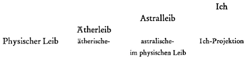
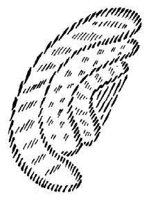

Wenn Sie sich besinnen auf dasjenige, was gestern gesagt worden ist mit Bezug auf die sogenannten Giftsubstanzen, werden Sie, ich möchte sagen, sich stark auf das Relative in allen Daseinsimpulsen hingewiesen fühlen. Sie werden bemerken, daß irgend etwas Substantielles als Gift bezeichnet werden kann, daß aber auf der andern Seite gerade die höhere menschliche Natur mit diesem Giftwesen innig verwandt ist, und daß eigentlich diese höhere menschliche Natur gar nicht möglich ist ohne Giftwirkungen. Man berührt damit allerdings ein für die Erkenntnis sehr bedeutungsvolles Gebiet, das viele Verzweigungen hat, und ohne dessen Kenntnis man manches Geheimnis des Lebens und Daseins überhaupt nicht einsehen kann. ^csiv08

Wenn wir den menschlichen physischen Leib betrachten, so müssen wir sagen: Wäre dieser physische Leib nicht ausgefüllt von den höheren Wesenheiten oder Wesensgliedern des Daseins, dem Ätherleib, astralischen Leib, Ich, könnte er nicht der physische Leib sein, der er ist. In dem Augenblicke, wo der Mensch durch die Pforte des Todes geht, seinen physischen Leib verläßt, das heißt, wenn die höheren Glieder sich aus dem physischen Leibe zurückziehen, so folgt dieser ganz andern Gesetzen als während der Zeit, wo die höheren Glieder in ihm sind. Man sagt, er löst sich auf; das heißt, er folgt, wenn er stirbt, den physischen und chemischen Kräften und Gesetzen der Erde. ^t6155q

So wie der physische Leib des Menschen vor uns steht, kann er nicht gemäß den gewöhnlichen Erdengesetzen aufgebaut sein, denn die Erdengesetze zerstören ihn ja. Nur dadurch, daß das, was am Menschen nicht irdisch ist — seine höheren seelisch-geistigen Glieder -, in seinem Leibe wirksam ist, ist der Leib dasjenige, was er eben ist. Nichts im ganzen Bereich der physischen und chemischen Gesetze rechtfertigt das Vorhandensein eines solchen Leibes auf der Erde, wie es der Menschenleib ist. ^iiyuac

Wir können daher sagen: Nach physisch-irdischen Gesetzen ist der Menschenleib ein unmögliches Wesen; er wird nur zusammengehalten durch seine höheren Wesensglieder. Hieraus ergibt sich als notwendige Ergänzung, daß, sobald die höheren Wesensglieder — das Ich, der astralische Leib, der Ätherleib - den menschlichen Leib verlassen, er Leichnam wird. ^ir545d

Nun wissen Sie ja aus mancherlei früheren Betrachtungen, daß das, was man so mit Recht als schematische Einteilung des Menschen gibt, nicht so einfach ist, wie es mancher gern haben würde. Wir gliedern den Menschen zunächst in physischen, ätherischen, astralischen Leib und Ich. Ich habe schon früher darauf hingewiesen, daß dies alles eine weitere Komplikation bedingt. Der physische Leib steht allerdings für sich, er ist eben physischer Leib. Aber der ätherische Leib als solcher, als ätherischer Leib, ist ein Übersinnliches, ein Unsichtbares, ein nicht sinnlich Wahrnehmbares. Als solches nicht sinnlich Wahrnehmbares ist er in der menschlichen Wesenheit. Aber er hat auch gewissermaßen sein physisches Korrelat, er drückt sich ab im physischen Leib. Wir haben im physischen Leib nicht nur den eigentlichen physischen Leib, sondern auch einen Abdruck des Ätherleibes. Der Ätherleib projiziert sich im physischen Leibe; wir können also von der ätherischen Projektion im physischen Leibe sprechen. ^mshtkq

Das ist ebenso der Fali für den astralischen Leib: wir können von der astralischen Projektion im physischen Leibe sprechen. Sie wissen ja für einzelnes schon Bescheid. Sie wissen, daß Sie die Ich-Projektion im physischen Leibe in gewissen Eigentümlichkeiten der Blutzirkulation zu suchen haben, da projiziert sich das Ich ins Blut hinein. In ähnlicher Weise projizieren sich die andern Glieder in den physischen Leib hinein. Der physische Leib selber, insoferne er physisch ist, ist also ein kompliziertes Wesen, er ist für sich schon viergliedrig. Und so wie das Hauptsächliche im physischen Leibe nicht bestehen kann, wenn das Ich und der astralische Leib nicht darinnen sind, wie das dann zum Leichnam wird, so ist es auch in einer gewissen Beziehung mit diesen Projektionen, denn das sind ja alles substantielle Dinge: Ohne das Ich kann es kein Menschenblut geben, ohne den Astralleib kann es kein menschliches Gesamtnervensystem geben. Diese Dinge haben wir gewissermaßen als die Korrelate der höheren Gliedwesen des Menschen in uns. ^quw4a0

Wie es nun überhaupt kein rechtes Leben, sondern nur ein Leichnamsein des physischen Leibes geben kann, wenn das Ich — sagen wir «herausgehoben» — durch die Pforte des Todes gegangen ist, so kann unter gewissen Bedingungen auch das, was diese Projektionen sind, nicht in rechter Weise leben. ^ds7639

 ^5n6m0o

Es kann zum Beispiel die Ich-Projektion — also eine gewisse Beschaffenheit des Blutes - in einer nicht richtigen Weise im menschlichen Organismus vorhanden sein, wenn das Ich nicht richtig gepflegt wird. Um den physischen Leib zum Leichnam zu machen, dazu ist schon notwendig, daß wirklich, reell, möchte ich sagen, das Ich diesen physischen Leib verläßt. Aber Sie können das Blut gewissermaßen zum Viertelsleichnam machen, indem Sie es nicht durchsetzt sein lassen von dem, was ordnungsgemäß im Ich leben muß, damit das Seelisch-Geistige in der richtigen Weise auf das Blut wirkt. Daraus ersehen Sie, daß die Möglichkeit vorliegt, die Seele des Menschen so in Unordnung zu bringen, daß im Blutwesen, im Blutsubstantiellen nicht die richtigen Wirkungen sein können. Das ist der Moment, wo — wenn auch nicht ganz, sonst würde ja der Mensch daran sterben müssen, aber wenigstens zum Teil — das Blut in Giftsubstantialität übergehen kann. So wie der menschliche physische Leib gewissermaßen der Zerstörung anheimgegeben ist, wenn das Ich draußen ist, so wird das Blut der Ungesundheit, wenn man sie auch nicht so ohne weiteres bemerken kann, anheimgegeben, wenn das Ich nicht in der richtigen Weise gepflegt und durchsetzt wird. ^k5b36x

Wann ist nun das Ich nicht in der richtigen Weise gepflegt und durchsetzt? Das ist unter ganz bestimmten Bedingungen der Fall. Wenn wir zunächst nur auf die nachatlantische Zeit sehen, so erfolgt die Evolution des Menschen so, daß in den aufeinanderfolgenden Kulturperioden der nachatlantischen Zeit bestimmte Fähigkeiten, bestimmte Impulse sich ausbilden. Sie können sich nicht denken, daß Menschen, die in bezug auf die seelische Entwickelung wie wir sind, in der urindischen Zeit gelebt hätten. Von Epoche zu Epoche, indem der Mensch durch die wiederholten Erdeninkarnationen hindurchgeht, sind andere Impulse für die menschliche Seele notwendig. ^xch94g

Ich will schematisch aufzeichnen, was da vorliegt. Denken Sie sich den hauptsächlichsten, den eigentlichen physischen Leib hier; das würde also derjenige sein, welcher von allen höheren Gliedern der menschlichen Natur ausgefüllt sein muß, damit er überhaupt dieser physische Leib ist. ^n724rj

 ^9pilds

Ich will von all diesen höheren Gliedern der menschlichen Natur nur das Ich berücksichtigen; ich könnte ebensogut alle drei berücksichtigen, will nur dadurch, daß ich schraffiere, andeuten, daß dieser physische Leib Ich-durchdrungen ist. So müssen die andern Projektionen auch in einer gewissen Weise durchdrungen sein. Ich will die Projektion des Ätherleibes, die ja im wesentlichen verankert ist im menschlichen Drüsensystem, so andeuten; das muß nun wiederum in einer gewissen Weise durchzogen und durchsetzt sein. Ich will als drittes andeuten, was hauptsächlich im Nervensystem verankert ist; das muß wiederum in einer bestimmten Weise von einer gewissen Auswirkung des Ich durchsetzt sein. Und der Ich-Leib selber muß nun auch in einer entsprechenden Weise durchsetzt sein. ^1gc6tb

Nun haben wir eben gesagt, daß der Mensch, indem er die aufeinanderfolgenden Evolutionsperioden durchläuft, in jeder Evolutionsperiode in andere Entwickelungsimpulse eintreten muß. Er muß gewissermaßen dasjenige annehmen, was seine Zeit von ihm verlangt. In der ersten nachatlantischen Zeit, in der urindischen Zeit, mußten die Menschen seelisch-geistige Impulse in sich aufnehmen, die möglich machten, daß dazumal besonders der Ätherleib seine Ausbildung erhielt, in der darauffolgenden Periode, der urpersischen Zeit, wurde der astralische Leib ausgebildet, in der ägyptisch-chaldäischen Zeit die Empfindungsseele, in der griechisch-lateinischen Zeit die Verstandesoder Gemütsseele, in unserer Zeit die Bewußtseinsseele. Nun hängt es davon, daß der Mensch in richtiger Weise das seinem jeweiligen Zeitalter Angemessene aufnimmt, ab, ob er in rechter Weise diese seine Leibesglieder so durchdringt, daß sie von dem, was das Zeitalter verlangt, so durchsetzt werden, wie auch der physische Leib von den höheren Gliedern durchsetzt ist. Nehmen Sie einmal an, ein Mensch würde sich ganz dagegen sträuben, in der fünften nachatlantischen Zeit irgend etwas aufzunehmen, was dieser fünften nachatlantischen Zeit notwendig ist, er wiese alles ab, was seine Seele so kultivieren würde, wie es die fünfte nachatlantische Zeit verlangt. Was würde die Folge sein? ^0tn0oe

Nun, sein Leibliches läßt sich ja nicht zurückschrauben, wenn es einem Teile der Menschheit angehört, der zunächst berufen ist, die Impulse der fünften nachatlantischen Zeit in sich aufzunehmen. Es sind ja nicht alle zugleich berufen; aber alle weißen Rassen sind jetzt dazu berufen, die Kultur der fünften nachatlantischen Zeit in sich aufzunehmen. Nehmen wir nun an, Menschen würden sich dagegen sträuben. Dann bliebe ein bestimmtes Glied ihrer Leiblichkeit, vor allem das Blut, ohne dasjenige, was hineinkommen würde, wenn sie sich nicht sträuben würden. Es fehlt dann diesem Gliede der Leiblichkeit das, was die entsprechende Substanz und ihre Kräfte in der rechten Weise durchsetzen würde. Dadurch aber werden diese Substanz und die ihr innewohnenden Kräfte, wenn auch nicht in so hohem Grade, wie wenn der Menschenleib Leichnam wird und das Ich heraustritt, in ihren Lebenskräften krank, herabgestimmt, und der Mensch trägt sie gewissermaßen als Gift in sich. Das Zurückbleiben hinter der Evolution bedeutet also, daß der Mensch sich gewissermaßen mit einem Formphantom, das giftig ist, imprägniert. Würde er aufnehmen, was seinen Kulturimpulsen entsprechend ist, so würde er durch diese Seelenart dieses Giftphantom, das er in sich trägt, auflösen. So aber läßt er es in den Leib hinein koagulieren. ^3crdmr

Daher kommen die Kulturkrankheiten, Kulturdekadenzen, alle die seelischen Leerheiten, Hypochondrien, Verschrobenheiten, Unbefriedigtheiten, Schrullenhaftigkeiten und so weiter, auch alle die Kultur attackierenden, aggressiven, gegen die Kultur sich auflehnenden Instinkte. Denn entweder nimmt man die Kultur eines Zeitalters an, paßt sich an, oder man entwickelt das entsprechende Gift, das sich absetzt und das sich nur auflösen würde durch die Annahme der Kultur. Dadurch aber, daß man dieses Gift absetzt, entwickelt man Instinkte gegen die betreffende Kultur. Giftwirkungen sind immer zugleich aggressive Instinkte. In der Volkssprache Mitteleuropas ist das deutlich durchgefühlt: viele Dialekte sagen nicht, ein Mensch sei zornig, sondern er sei giftig, was einem tiefen Empfinden der wirklichen Tatsache entspricht. Von einem Jähzornigen sagt man zum Beispiel in Österreich, er sei «gachgiftig», das heißt schnell giftig, er wird schnell zornig. Und daß dies wieder gradweise differenziert ist, können Sie am Schlangengift bemerken, das eben einen höheren Grad von Giftigkeit hat und das das Aggressive wohl in sich trägt. Aber in einem minderen Grade legt der Mensch solches Giftige, das sich sogar sehr konzentriert, in sich an, wenn er sich weigert, dasjenige anzunehmen, was das Gift auflösen würde. Gerade in unserem Zeitalter weigern sich zahlreiche Menschen, die unserem Zeitalter entsprechende Form des geistigen Lebens, die wir uns ja seit langem zu charakterisieren bemühen und die wir jetzt auch öffentlich charakterisiert haben, anzunehmen. ^h95p8f

Nun ist es so, daß gerade diese Lotusblume hier [auf der Stirne] an solchen Menschen dasjenige, was da entsteht, sehr sichtbar macht; denn das geht bis zur Wärmewirkung, und solche Menschen züngeln gewissermaßen gegen die Verhältnisse der Außenwelt an, wenn diese etwas von dem zeigen, was für das Zeitalter heilsam wäre. Wir haben gewiß Mephistopheles, das heißt den Teufel, unter uns wandelnd; aber so ein kleiner Anfang, etwas Züngelndes zu entwickeln, geschieht schon dadurch, daß man sich weigert, dasjenige aufzunehmen, was der Kultur des Zeitalters angemessen ist, daß man also das Gift nicht auflöst, sondern es zum Partialleichnam macht, es gewissermaßen im Organismus zum Formphantom koagulieren läßt. ^zpmbbi

Sie werden, wenn Sie dies durchdenken, sich aufklären können über die Veranlassung mancherlei Unbefriedigtheiten im Leben. Denn solch ein Giftphantom in sich zu tragen, macht den Menschen unglücklich. In unserer Zeit nennt man ihn dann nervös oder neurasthenisch; es kann ihn aber auch grausam, zänkisch, monistisch, materialistisch machen, denn diese Eigenschaften hängen oft, viel mehr als man glaubt, mit diesem physiologischen Grunde zusammen, daß das Gift, statt aufgesogen zu werden, im menschlichen Organismus abgelagert wird. ^nrb63c

Aus alldem ersehen Sie, daß zu dem Gesamtbestand, zu der Gesamtkonstitution der Welt, in die wir eingebettet sind, wirklich eine Art labilen Gleichgewichts gehört zwischen dem Guten, Richtigen, und seinem Gegenbilde, den Giftwirkungen. Damit auf der einen Seite das Gute, das Richtige entstehen kann, muß die Möglichkeit gegeben sein, daß vom Richtigen abgeirrt wird, daß die Giftwirkung entsteht. ^ia09o5

Wenden wir das auf Umfänglicheres an, so werden Sie sich sagen: Es muß heute in der Welt die Möglichkeit geben, daß die Menschen zu einem gewissen spirituellen Leben kommen, daß sie Impulse für ein freies, inneres, spirituelles Leben in sich entwickeln. — Damit der einzelne zu dem spirituellen Leben kommen kann, muß das Gegenbild vorhanden sein: die entsprechende Möglichkeit, auf grau- oder schwarzmagische Weise davon abzuirren. Ohne das geht es nicht. Geradeso, wie Sie sich als Mensch nicht halten können, wenn Sie nicht unter sich die Erde haben, die Ihnen einen festen Boden gibt, so kann es dasjenige, was Verfolgen des lichten, spirituellen Lebens ist, nicht geben ohne den Widerstand, der zugelassen werden muß, und der für die höheren Gebiete des Lebens unausbleiblich ist. ^gj0rct

Wir haben auf das ja ganz Widerspruchsvolle, aber deshalb nicht minder Bedeutsame hingewiesen, daß jemand auf die Frage: Wem verdanken wir das Mysterium von Golgatha? — antworten könnte: Dem Judas; denn hätte Judas den Christus Jesus nicht verraten, so hätte das Mysterium von Golgatha nicht stattgefunden, daher müßte man dem Judas dankbar sein, denn von ihm rührt eigentlich das Christentum, das heißt, das Mysterium von Golgatha her. — Aber das kann man eben doch wiederum nicht, dem Judas dankbar sein und ihn etwa als den Begründer des Christentums anerkennen! Überall, wo man sich in höhere Gebiete erhebt, muß man mit lebendiger, nicht mit toter Wahrheit rechnen, und die lebendige Wahrheit trägt ihr eigenes Gegenbild in sich, so wie im physischen Dasein das Leben den Tod in sich trägt. ^cia94i

Nehmen Sie das als etwas, das ich heute gerne in Ihre Seele senken möchte, weil sich daraus vieles begreifen läßt. Es muß die Möglichkeit bestehen, neben dem Spirituellen das polarisch entgegengesetzte Gift abzusetzen. Dann kann es aber, wenn es abgesetzt werden kann, auch benützt werden, und auf allen Gebieten kann es benützt werden. ^lk3n0y

An das Gesagte können sich viele Fragen angliedern. Aber wir wollen vorerst für heute nur diese Frage berühren: Wie kommt man da zurecht? Ist man nicht der großen Gefahr ausgesetzt, daß, wenn man an irgend etwas in der Welt herantritt, das Entgegengesetzte, das Giftmäßige darin enthalten ist, oder wenigstens, daß es irgend jemand zum Giftmäßigen ausbilden könnte? Diese Möglichkeit ist natürlich immer vorhanden. Alles das, was sehr gut sein kann in der Welt, kann in sein Gegenteil verkehrt werden. Aber das muß so sein, damit die Menschheitsentwickelung sich in Freiheit vollziehen kann gemäß unserem Kulturzeitalter. Und gerade die schönsten Entwickelungsimpulse unseres Zeitalters können am meisten Veranlassung geben, in ihr Gegenteil verkehrt zu werden. ^b6sxwu

Ebenso wie für den menschlichen Organismus gilt das für das soziale Leben. Aus früheren hier gehaltenen Vorträgen haben wir gesehen, daß in unserem Zeitalter sich zunächst im Keime die Anlage zu entwickeln beginnt, imaginatives Leben zu entfalten, frei aufsteigende Gedanken zu bilden, die allerdings die materialistisch gesinnten Menschen noch abweisen. Aber es liegt einmal in der Natur unseres Zeitalters, daß nach und nach das imaginative Leben sich entwickeln muß. Was ist das Gegenbild des imaginativen Lebens? Das Gegenbild des imaginativen Lebens ist die Erdichtung, die Erdichtung in bezug auf Wirklichkeiten und der damit verknüpfte Leichtsinn im Behaupten dieser oder jener Dinge. Es ist das gleiche, was ich oftmals in diesen Betrachtungen geschildert habe als die Unaufmerksamkeit gegenüber der Wahrheit, gegenüber dem Reellen, dem Wirklichen. Das Schönste, was der Menschheit im fünften nachatlantischen Zeitraum vorgesetzt ist, das allmähliche Aufsteigen aus dem bloßen einseitigen intellektuellen Leben in das imaginative Leben, das die erste Stufe in die geistige Welt ist, kann abirren in die Unwahrhaftigkeit, in die Erdichtung in bezug auf Wirklichkeiten. Ich sage selbstverständlich nicht: in die «Dichtung» -, denn die ist berechtigt, aber in die «Erdichtung» in bezug auf die Wirklichkeit. ^wfq4pi

Weiter muß in unserem Zeitalter erstehen — das haben wir auch aus unseren Betrachtungen kennengelernt —, ein besonders gewissenhaftes, seiner Verantwortlichkeit bewußtes Denken. Wenn Sie ins Auge fassen, was in der anthroposophisch orientierten Geisteswissenschaft geboten wird, so werden Sie sich sagen: Man muß, wenn man wirklich verstehen will, was die anthroposophisch orientierte Geisteswissenschaft gibt, scharf gezeichnete Gedanken haben, in denen der Wille lebt, sachgemäß die Wirklichkeit zu verfolgen. Scharfes Denken ist schon notwendig, um unsere Lehre, wenn wir sie so nennen dürfen, aufzunehmen, und vor allen Dingen ein gewisses Ruhen auf dem Gedanken, nicht ein flüchtiges Denken. Wir müssen nun hinarbeiten auf ein solches Denken. Wir müssen uns unablässig bemühen, Gedanken mit scharfen Konturen von uns zu fordern, und uns nicht blind den Sympathien und Antipathien hinzugeben, wenn wir für uns und andere etwas behaupten. Wir müssen nach Begründung, nach Fundierung dessen suchen, was wir behaupten, sonst werden wir niemals in der richtigen Weise in das geisteswissenschaftliche Gebiet eindringen können. Das müssen wir fordern. Und wir erfüllen unsere Aufgabe, wenn wir diese Forderung an uns selbst stellen. Und wenn gefragt wird: Was müssen wir tun in unserer jetzigen schweren Zeit? — so müssen wir uns die Antwort aus dem eben Gesagten heraus formen. Wir müssen uns klar bewußt sein, daß in der Gegenwart jeder Mensch, der will, daß die Evolution der Erde in heilsamer Weise weitergeht, gewissenhaft und ehrlich nach Gedankenobjektivität in der eben geschilderten Weise suchen muß. Das ist eben die Aufgabe der Menschenseele in der gegenwärtigen Zeit. Und weil das so ist, so kann sich auch das korrelative Gift entwickeln: Das vollständige Verlassensein von klaren Gedanken, von Gedanken, die sich mit der Realität verbinden und nichts erdichten, sondern das, was ist, einfach verzeichnen wollen. Das Verlassensein von dieser Sehnsucht nach Objektivität ist im Laufe des 19. Jahrhunderts immer intensiver und intensiver geworden. Das Abgetrenntsein des Gewissens von dem, was wir jetzt immer als Wahrheit charakterisiert haben, hat im 20. Jahrhundert gegenüber allem Bisherigen einen gewissen Höhepunkt erlangt. Die Wirkung ist dann am schlimmsten, wenn die Leute es so ganz und gar nicht merken; aber gerade das ist ein Charakteristikum unserer Zeit. ^0t36jq

Ich will Ihnen ein paar Beispiele geben, damit Sie sehen, was ich meine. Ich will wirklich solche Beispiele sine ira — ohne Sympathien und Antipathien - vorbringen. Da ist ein Mann, den ich sehr gut kenne, der das ist, was man einen lieben, netten Menschen nennt. Er steht im öffentlichen Leben, nimmt mit Recht eine sehr ehrenwerte Stellung darin ein und würde sich nicht erlauben, auch nur im Allergeringsten von dem abzuirren, was man Gesinnungstüchtigkeit im öffentlichen Auftreten nennt. Der betreffende Mann hat aber doch vor kurzem einmal das Folgende sehr Charakteristische schreiben können: «Es soll zum Schlusse», das sagt er am Schlusse eines Aufsatzes, «einer, wenn auch nur kurzen Erörterung einer Frage nicht ausgewichen werden...» [Lücke] ^7c4r1s

Es ist begreiflich, daß in unserer Zeit so etwas gesagt wird, und ich führe es an, weil es von einem wirklich ernsten Menschen von echter Gesinnungstüchtigkeit gesagt worden ist. Aber es ist, wenn man es näher betrachtet, so verlogen, wie nur irgend etwas verlogen sein kann; denn man kann nichts Verlogeneres sagen, als: «Ich werde mitsingen: «Wir treten zum Beten vor Gott den Gerechtem, «Ein feste Burg ist unser Gott> » und so weiter, mit der Stimmung, daß es eben ein Gebet, ein gesungenes Gebet ist, wenn man überhaupt nur diesen Glauben hat, den der Betreffende hier charakterisiert. Es ist geradezu eine Lobrede auf die Verlogenheit. Solche Lobreden auf die Verlogenheit finden Sie heute auf Schritt und Tritt, und sie sind, ich möchte sagen, im guten Glauben gehalten; sie sind das Korrelativgift zu dem, was sich als imaginatives, spirituelles Leben entwickeln muß. Und gerade bei den besten Menschen kann mehr oder weniger im Unbewußten solche Giftwirkung vorhanden sein. Wenn man allerdings weiß, daß so etwas, indem es im sozialen Leben pulsiert, genau so ist, wie wenn man einem menschlichen Organismus einen Tropfen Gift einflößen würde, dann kann man alle diese Dinge in der richtigen Weise beurteilen. Wenn man das aber weiß, dann wird man sich auch verpflichtet fühlen, etwas im Leben zu verwirklichen, was jetzt öfters charakterisiert worden ist: Man wird sich bemühen, ein offenes Auge für die Tatsachen, ein gesundes Beobachten des Lebens zu entwickeln; ohne das kommt man heute nicht aus. Und das Karma, von dem ich gesprochen habe, das sich erfüllt, und das nun nicht das Karma eines einzelnen Volkes, sondern eben der ganzen europäisch-amerikanischen Menschheit des 19. Jahrhunderts ist, das ist schon das Karma dieser Unwahrhaftigkeit, das schleichende Gift der Unwahrhaftigkeit. ^votuuu

Man kann diese Unwahrhaftigkeit ja ganz besonders in Bewegungen besonders erhabener Natur erleben. Ich habe auf meinem Lebensweg da oder dort viel vernommen, was gelogen war; aber ich muß sagen, ich habe nicht gefunden, daß irgendwo anders so grandios gelogen wurde wie da, wo der Grundsatz ausgesprochen ist: Keine Religion ist höher als die Wahrheit. — Ich möchte sagen, mit solcher Intensität wurde doch eigentlich nur da gelogen, wo man zu gleicher Zeit das tiefste Bewußtsein hatte, daß man nur die Wahrheit und nichts anderes als die Wahrheit anstrebe! Gerade da, wo ein Höchstes erstrebt wird, muß am schärfsten achtgegeben werden. Denn dies muß einmal ins Auge gefaßt werden: In früheren Kulturepochen waren andere Möglichkeiten des Abirrens da, in unserer Zeit ist das Abirren in eine Unwahrhaftigkeit, die durch ein Nichtleben mit der Wirklichkeit zustande kommt, die große Gefahr. Ein Nichtleben mit der Wirklichkeit! Bei Menschen, die so gesinnungstüchtig sind wie die Persönlichkeit in dem Beispiel, das ich angeführt habe — der Mensch, der solche Verlogenheit hier geschrieben hat, würde sich eher die Zunge durchschneiden lassen, als bewußt eine Unwahrheit sagen —, wirken die Dinge eben, indem sie in den sozialen Organismus träufeln und soziales Gift werden. Aber natürlich können sie, da sie nun vorhanden sein müssen, auch nach der entgegengesetzten Seite abirren: Sie können auch von dem menschlichen Bewußtsein aufgegriffen werden und zu allerlei Unfug verwendet werden, um nicht ein stärkeres Wort zu gebrauchen. ^niizfd

Vielleicht erinnern sich manche von Ihnen, wie merkwürdig es berührt hat, als ich in München vor Jahren zum ersten Mal auf diese Verhältnisse, sogar in einem öffentlichen Vortrage, radikal hingewiesen habe. Ich sagte damals: Im Verlaufe der menschlichen Evolution entwickeln sich auf dem physischen Plane die Impulse des Guten und des Bösen. Wodurch entwickeln sich diese Impulse? Dadurch, daß gewisse Kräfte, die eigentlich in die höhere geistige Welt gehören, hier unten in der physischen Welt mißbraucht werden. Würden die Diebe ihre Diebsinstinkte, die Mörder ihre Mordinstinkte, die Lügner ihre Lügeninstinkte, statt sie auf dem physischen Plane auszuleben, dazu verwenden, höhere Kräfte zu entwickeln, so würden sie sehr bedeutende höhere Kräfte ausbilden. Der Fehler besteht nur darin, daß sie die Kräfte, die sie entwickeln, nicht auf dem richtigen Plane entwickeln. Das Böse, sagte ich, ist ein von einem andern Plane herunterversetztes Gutes. Dadurch wird der Mensch, der ein Dieb oder ein Mörder oder ein Lügner ist, selbstverständlich nicht besser: Aber begreifen muß man die Dinge, sonst kommt man nicht dahinter und verfällt unbewußt diesen Gefahren. ^eibeij

Es ist kein Wunder, daß es in unserer Zeit viele Menschen gibt, die einfach nicht fassen, daß es jetzt Aufgabe zu werden beginnt, sich mit spirituellen Angelegenheiten zu befassen. Daher tun sie es auch nicht, sondern sie überlassen sich den materialistischen Instinkten. Aber sie entwickeln in sich die Gifte, die durch Spirituelles aufgelöst werden sollten. Was ist die Folge? Die Gifte entwickeln sich und werden in Menschen, die das Spirituelle abweisen, zu Kräften, welche sie zu richtigen Lügnern machen, ob bewußt oder unbewußt ist mehr eine Gradfrage. Die gleichen Kräfte könnten aber angewendet werden, um sehr schön die spirituelle Wissenschaft zu begreifen. ^ak61m6

Bedenken Sie, was wir da im Grunde für eine gewichtige Erkenntnis vor uns haben, und wie wir durch ein Erfassen einer so gewichtigen Erkenntnis einen Hauptnerv im Karma unserer Zeit begreifen können, wenn wir nur dazunehmen, was ich gestern sagte: Eine Einzelheit läßt sich nicht aus der Gesamtmenschheit herausreißen. Die Menschheit ist ein Ganzes. — Gerade als das Gegenbild des spirituellen Strebens muß in unserer Zeit ein scharfes Übel vorhanden sein. Und dieses Übel wirklich in seiner Wesenheit zu erkennen, damit man es auch dann erkennt, wenn es einem im Leben entgegentritt und man es in der richtigen Weise bekämpfen kann, das gehört schon zu den Aufgaben des Menschen unserer Zeit. ^v5hiqk

Indem wir über diese Dinge sprechen, bringen wir die großen Gesichtspunkte, die mit dem Karma unserer Zeit zusammenhängen, unmittelbar in Verhältnis zu dem, was in unserer Zeit lebt und im weitesten Umkreise viel, viel Schlimmes bewirkt. An der Oberfläche sehen wir, wie in mächtigen Wogen, die viel mehr verschlingen als man denkt, die Lüge heute durch die Welt pulst. Die Lüge hat ja ein ungeheuer starkes Leben. Aber an solchen Betrachtungen, wie wir sie heute angestellt haben, sehen Sie, wie die Lüge nur das korrelative Gegenbild ist des seinsollenden aber nicht vorhandenen spirituellen Strebens. Ich möchte sagen, die göttlich-geistige Weisheit der Welt hat den Menschen die Möglichkeit gegeben, spirituell zu streben. Wir haben das Gift in uns, das wir auflösen können; aber wir müssen es auch auflösen, sonst bleibt es in uns wie eine Art Partialleichnam. ^h2yy6o

Lassen Sie mich für solche Dinge Beispiele aus dem Tagesleben geben, wobei wir ja gleichzeitig das Ziel verfolgen können, gewisse Dinge, die uns heute auf Schritt und Tritt entgegenkommen, die mit dem Leben, mit allem Übel und Leiden der Gegenwart zusammenhängen, besser zu verstehen. Denn nach und nach zu einem Verständnis der schmerzlichen Ereignisse der Gegenwart zu kommen, das ist ja auch dasjenige, was wir in diesen Betrachtungen, soweit sie uns nun gegönnt sind, anstreben. Solche Dinge sage ich wirklich nur, um gewissermaßen im Formellen die Art und Weise, wie die Impulse wirken, zu charakterisieren, nicht um einen Menschen zu charakterisieren, sondern um Tatsachen zu charakterisieren an Beispielen. ^qylyle

Da treibt sich hier in der Schweiz ein Mensch herum, der vor vielen Jahren in Berlin Advokat war, ein Winkeldichter, der durch allerlei Dinge, die er angerichtet hat, veranlaßt worden ist, es im Auslande zu versuchen. Seit Jahren treibt er sich im Auslande herum, und jetzt, da der Krieg ausgebrochen ist, schrieb er das in der ganzen Peripherie Aufsehen machende Buch «J’accuse». Man kann sagen, daß diese ganze « J accuse»- Angelegenheit zu den allertraurigsten Begleiterscheinungen unserer Zeit gehört, weil sie ein so charakteristisches Symptom ist. «J accuse» ist ein dickes Buch, und gewisse Leute, die es wissen können, behaupten, um nur ein Beispiel anzuführen, daß es keine norwegische Hütte gibt, in der dieses Buch nicht zu finden wäre. Es gehört also zu den allerverbreitetsten Büchern. Im Frühling las ich in Berlin einen Artikel über dieses Buch, von jemandem geschrieben, der etwas gilt. Dieser sagt, «J’accuse» wäre ihm empfohlen worden von einem Menschen, den er außerordentlich schätzt. Aus der Art der Darstellung kann man entnehmen, wer dieser von ihm geschätzte Mensch ist: es ist jemand, der in Holland als ein großes Licht gilt, der aber nicht einmal imstande war, das ganze Hintertreppenartige des « J’accuse»-Buches — wenn man nur auf das Formale sieht — zu beurteilen. Man kann eben heute als ein großer Mann gelten und in solchen Dingen durchaus urteilslos sein. ^hetbzg

Nun hat sich jetzt eben wieder dieser bekannt-unbekannte Verfasser von «J’accuse» in der Zeitung «Humanite» mit folgender Gedankenform vernehmen lassen — wie gesagt, kommt es mir nicht auf das Persönliche, sondern darauf an, zu charakterisieren, was in unserer Zeit alles möglich ist: ^hq4qpy

Ein sozialdemokratischer Abgeordneter hält im Berliner Reichstag eine Rede, in der er seine Ansichten über verschiedene Zusammenhänge in der Vorgeschichte des Krieges entwickelt. Man mag einverstanden sein oder nicht, darauf kommt es jetzt nicht an; ich will Ihnen das Formale darbieten. In seiner Rede beruft sich der Abgeordnete auf ein Wort, das Sir Edward Grey am 30. Juli 1914 gesagt hat, und welches dem Sinne nach ungefähr lautet, daß wenn die Österreicher sich darauf beschränken würden, bis Belgrad zu marschieren, sich mit der Besetzung Belgrads begnügen und dann abwarten würden, was eventuell durch einen europäischen Kongreß mit Bezug auf das Verhältnis zwischen Österreich und Serbien eingerichtet werden könnte, so ließe sich der Frieden vielleicht noch wahren. Dieser Ausspruch von Sir Edward Grey ist gut gedeckt, denn Grey hat dies zu dem deutschen Botschafter gesagt und es außerdem noch an den englischen Botschafter in Petersburg geschrieben. Die Sache ist also vollständig gedeckt, so daß gar kein Zweifel sein kann, daß Sir Edward Grey dies gesagt hat. Der sozialdemokratische Abgeordnete hat aber dadurch, daß er dies jetzt wieder im Deutschen Reichstag vorgebracht hat, den Zorn des Verfassers von « J’accuse» erregt. Was tut nun der Verfasser von «J’accuse»? Er schreibt einen wirklich im eminentesten Sinne verleumderischen Artikel in der «Humanite», in dem er jenem sozialdemokratischen Abgeordneten geradezu Lügenhaftigkeit vorwirft, falsche Zitiererei und so weiter. Nun ist aber die Sache sehr gut gedeckt, und der Betreffende hat nichts gesagt, als was belegt ist durch die verschiedenen Bücher, auch durch den Brief von Sir Edward Grey, der es dem englischen Gesandten in Petersburg geschrieben hat. Wie kann also da der Verfasser von «Jaccuse» Lügenhaftigkeit konstatieren? Nun, er macht das so, er sagt: Das, was der sozialdemokratische Abgeordnete gesagt hat, kann sich nicht auf einen Ausspruch des Sir Edward Grey vom 30. Juli, sondern nur auf einen Ausspruch von Sasonow vom 31. Dezember beziehen; der Ausspruch von Sasonow, nicht von Grey, lautet aber folgendermaßen, den zitiere ich. Also hat der Abgeordnete den Sasonow schlecht zitiert, denn der Ausspruch von Sasonow ist so, und außerdem behauptet er noch dazu, daß dieser Ausspruch, den Sasonow getan hat, Sir Edward Grey getan hätte. ^9yuo07

Die Tatsache liegt also vor, daß sich der betreffende Redner auf einen Ausspruch von Grey bezieht. «J’accuse» will ihn bekämpfen und sagt daher: Was der gesagt hat, bezieht sich nicht auf einen Ausspruch von Grey, sondern von Sasonow, der jedoch falsch zitiert ist. Sasonow hat folgendes gesagt... . ; also ist das falsch, was der im Berliner Reichstag gesagt hat. Er begeht also eine doppelte Fälschung: erstens zitiert er etwas Falsches, und zweitens verlegt er es nach London, während es in Petersburg geschehen ist. Also ist der Abgeordnete ein Lügner. ^jkxyfc

Von diesem Kaliber ungefähr ist das ganze Buch «J’accuse»; so ist dort die Beweisführung überhaupt. Aber Sie sehen, wie verschränkt, wie verworren und wie gewissenlos das Denken eines Menschen ist, der zu solchem imstande ist. Aber was erreicht man damit? Die zahlreichen Menschen, die nun in der «FHumanite» lesen, was der bekannt-unbekannte Verfasser von « J’accuse» geschrieben hat, prüfen selbstverständlich nicht nach, sondern sie haben vor sich und glauben, was der Verfasser von «J’accuse» ihnen erzählt. Auf diese Weise kann man nicht nur beweisen, daß der sozialdemokratische Abgeordnete gelogen hat, sondern man kann auch zeigen — das entsteht nämlich nebenbei als Beweis, das kriegt der «J’accuse» wirklich fertig —, daß die Mittelmächte nicht geantwortet haben auf dasjenige, was von den Peripheriemächten als Anregung gegeben worden ist. Denn, sagt « J’accuse», dieser Abgeordnete behauptet, die Mittelmächte hätten auf dasjenige reagiert, was von der Peripherie gekommen ist; aber man sehe sich das einmal an bei Sasonow! Der zitiert ja einen Ausspruch von Sasonow! Die Mittelmächte haben gar nicht darauf reagiert, also sieht man, wie die Mittelmächte es getrieben haben; sie haben nicht einmal geantwortet auf diese wichtige Sache. ^t9pq5w

Nun bezieht sich aber dasjenige, was der Abgeordnete wirklich zitiert hat, auf eine Anregung von Grey, die Grey seinem Botschafter telegraphierte, bevor der Botschafter es dem Sasonow sagte. Sasonow hat die ganze Geschichte, die der Grey dazumal angegeben hat und die nicht einmal so schlecht gewesen wäre, geradezu in ihr Gegenteil verkehrt. Der Verfasser von « J’accuse» verlangt, daß dieses von Sasonow ins Gegenteil Verkehrte hätte berücksichtigt werden müssen, nachdem Sasonow selbst es nicht berücksichtigt hatte. Nun aber kann man nachweisen, daß der Grey seinem Botschafter nach Petersburg telegraphierte, dies dem Sasonow vorgelegt worden ist, aber nicht berücksichtigt worden ist. Zu gleicher Zeit schickte aber Grey diesen Vorschlag nach Berlin und von Berlin wurde er nach Wien geschickt. Man kann nachweisen, daß zwischen Wien und Berlin Verhandlungen gepflogen worden sind, um Österreich zu veranlassen, wirklich in Belgrad zu halten und dann irgendeine europäische Verhandlung abzuwarten. Das geht aus einem Brief hervor, den der König von England selber an den Prinzen Heinrich telegraphierte. Also auf den Greyschen Vorschlag sind die Mittelmächte eingegangen. Der Sasonow ist nicht eingegangen auf diesen Greyschen Vorschlag! Dennoch konstatiert « J’accuse»: Die Mittelmächte haben nichts geantwortet und haben dadurch diese furchtbaren Dinge auf sich geladen. ^u5fno6

Die Sache ist nicht so unbedeutend, denn in dem schmerzlichen Dokument von gestern steht derselbe Satz darinnen. Da ist also eine merkwürdige, ich möchte sagen, Sippenverwandtschaft, Familienverwandtschaft zwischen einem welthistorischen schmerzlichen Dokument und einem Menschen, der sich, weil ihm der Boden unter den Füßen vor Jahren zu heiß geworden ist, herumtreibt, um in dieser Weise unter dem prangenden Titel «J’accuse, von einem Deutschen» allerlei Zeug zu schreiben, was aber auf diese Weise geschützt ist, wie durch die neueste Leistung in der «Humanite». ^i1bx2k

Man kann sich dann nicht wundern, wenn sich die Leute so wehren, wie sich nun dieser deutsche Abgeordnete gewehrt hat, der von «J’accuse» als ein Verleumder, ein Heuchler, ein Lügner hingestellt worden ist. Der Abgeordnete sagte: Im Grunde genommen liegt die Sache nicht anders wie bei dem Dienstmädchen, das zu Müller in der Langegasse 35 geschickt wurde, in zwei Stunden hätte zurück sein sollen, jedoch erst sehr spät zurückkommt, obwohl es nur einen kleinen Gang machen sollte. Als es zurückkam, sagte es: Ich habe es nicht finden können! — Wieso nicht? — Ja, ich bin nicht in die Langegasse 35 gegangen, sondern in die Kurzestraße 85, und da wohnt kein Tischler Müller, sondern Schulz, nicht der Tischler Müller, sondern eine Waschfrau. — So ungefähr ist der wirkliche Zusammenhang — meinte dieser deutsche Abgeordnete -- auch zwischen dem, was der « J’accuse» sagt, und dem, was wirklich zugrunde liegt. ^0aeb13

Dieser Verfasser von «J’accuse» ist natürlich ein besonders schlimmes Beispiel. Aber diese Art, mit der Wirklichkeit umzugehen, das ist es, was heute als die Kehrseite, das korrelative Gegengebilde des spirituellen Strebens und als richtiges Gift in den sozialen Adern rinnt anstelle dessen, was angestrebt werden muß: spirituelles Erkennen, das Sich-Durchdringen mit Spirituellem. Wir können solche Dinge - ich habe ein Beispiel angeführt, wo eine Verlogenheit bei einem Menschen auftritt, den ich sehr gut kenne — überall finden, und zwar in den mannigfaltigsten Variationen. Überall werden wir sehen, daß solches in gewisser Weise als das Gegenbild zu dem in unserer Zeit Notwendigen auftritt. Wenn man überhaupt etwas Richtiges erkennen will, so muß man spirituell erkennen, denn alles andere Erkennen ist heute eigentlich ein Zurückbleiben hinter der Entwickelung. Und deshalb muß schon auch, soll mit Bezug auf die Völker untereinander friedliche Gesinnung in Europa eintreten, spirituelles Fühlen über die Völker entwickelt werden, wie es geschehen kann, wenn man die Völker so auffaßt, wie das in meinem lange vor dem Kriege in Kristiania gehaltenen Vortragszyklus über die Völkergeister der Fall ist. Man muß sich entschließen, sich in dieser Weise spirituell dem Völkergeiste zu nähern; nur dadurch ist es möglich, heute den Geist des Menschen so aktiv zu machen, daß er wirklich eine Gruppenhaftigkeit, wie ein Volk, in ein gültiges Urteil fassen kann. Denken Sie doch, wie heute über Völker geurteilt werden könnte, wenn genügende spirituelle Vorbereitung dazu da wäre! Aber das, was wir nach der einen oder andern Seite radikal abirrend hervortreten sehen, das lebt nicht bloß bei den Schlechtesten, es lebt auch bei den Besten. Es soll ja hier nicht alles getadelt werden, was charakterisiert wird. Es ist einfach ein Mangel da, weil man nicht die spirituellen Bedingungen schaffen will, um große Volkszusammen‚hänge zu beurteilen. Man beurteilt sie nach Sympathien und Antipathien, nicht nach wirklichen Einsichten. ^9bqtfh

Ein sehr charakteristisches Beispiel dafür ist in einem berühmten Romane der Gegenwart gegeben, wo durchaus ehrlich versucht wird, in einem Romanzusammenhang ein Volk, in diesem Falle das deutsche, in seinen verschiedenen Repräsentanten zu charakterisieren. Es geschieht dies jedoch in eben dieser fehlerhaften Weise, die wegen Mangels an Spiritualität gar nicht zu einem Wirklichkeitsurteil kommen kann. Einen richtigen Roman würde ich hier nicht anführen können, weil bei einem wirklichen Kunstwerk so etwas nicht in Betracht kommt. Aber wenn ein Roman etwas Tendenziöses ist, wenn die Darstellung selber tendenziös ist, dann kann man ihn in einem solchen Zusammenhang anführen. Was ich meine, will ich im besonderen noch so charakterisieren: Wenn ein Roman gut ist, so wird man niemals die Person des Verfassers durchhören, sondern die Personen werden zum Ausdruck bringen, was für ein Volk, einen Stand, eine Klasse und so weiter charakteristisch ist. Und wenn in einem Roman Hans Müller oder Joachim Eikelhahn irgend etwas über die Deutschen, Franzosen oder Engländer sagen, dann bedeutet das nicht, daß man da irgendwie einhaken könnte. Aber so ist es nicht bei dem Roman, den ich jetzt meine; sondern da sieht man, daß immer der Verfasser gewissermaßen vor den Vorhang tritt und seine Meinung abgibt, und daß er, indem er Personen charakterisiert, stets seine, des Verfassers Meinung über die Deutschen abgeben will. Wir sehen das gleich, wenn über die Familie eines Helden folgendes gesagt wird: ^14vjxf

Nicht wahr, dieses ist nicht gerade geeignet, ein objektives Urteil zu entwickeln, wenn es auch für den einzelnen Fall so und so oft gelten mag. Ein Kammermusikorchester in Deutschland wird in der folgenden Weise charakterisiert: ^ozb4wo

Eine andere Charakteristik über den Onkel des Helden. Da wird gesagt: ^8tnu4m

Von demselben Manne wird gesagt: ^8p48wp

Weiter wird nun bei einer solchen Gelegenheit, wo der Verfasser gewissermaßen vor die Rampe tritt und man seine eigene Sache hört, folgendes gesagt: ^53wuxh

Der Herr hat sonderbare Begriffe von der Geschichte der Philosophie; wer sich darin wirklich auskennt, der weiß, daß die Prinzipien der Hegelschen Philosophie von der Phänomenologie des Bewußtseins niedergeschrieben worden sind in Jena, 1806, unter dem Kanonendonner, mitten aus dem Kanonendonner heraus, als Napoleon heranzog; das aber wird mit einem gewissen «Wahrheitssinn» so charakterisiert, daß Hegel die Schlacht von Leipzig abgewartet hätte, um sich dem preußischen Staat anzupassen. ^lof0gm

Das ist allerdings ein feiner Satz! ^mdr6pa

Man sieht, aus diesem Satze hätten nunmehr, nachdem der Krieg gekommen ist, viele Leitartikel in der Peripherie geformt werden können. Die Sätze sind lange vor dem Krieg erschienen. ^m4aqhh

Da ist ein Satz, der angeführt ist, ausgefallen. Sie wissen, es ist jetzt nicht leicht, die Dinge über die Grenze zu bekommen, und das Buch habe ich in Berlin. ^a01nne

Aber ich will noch einiges aus demselben Buche anführen, wo der Verfasser auch gewissermaßen vor die Rampe tritt: ^3gn2xx

Nun, diese Nase und dieses Gesicht wird nämlich als ganz besonders häßlich beschrieben. Das muß dazu bemerkt werden. Über Schumann wird gesagt: ^zmrvpj

Dann wird mit einer gewissen Behaglichkeit erinnert an einen Ausspruch von Frau von Stadl: ^b5wrqe

Der Verfasser des betreffenden Romanes fügt hinzu: Sein Held «fand dieses Gefühl» — also daß sie parieren, Respekt haben, Furcht haben — ^8objq3

Diese Sache ist in verschiedener Beziehung interessant. Ich bringe diese Dinge ja nicht aus irgendwelchen persönlichen Gründen vor oder um irgend jemanden zu charakterisieren. Aber nachdem dieser Roman geschrieben war und großes Aufsehen gemacht hatte, fanden sich selbstverständlich Leute, die ihn als das größte Kunstwerk der Welt priesen. Das ist ja immer so. Ganz niedlich ist doch das Urteil eines angesehenen österreichischen Kritikers — «angesehen» sage ich aber in Gänsefüßchen -, der schrieb: «Dieser Roman ist das Wichtigste, was seit 1871 geschehen ist, um Frankreich und Deutschland einander wieder zu nähern.» ^vot3uk

Sie sehen, wieviel Wahrheit in diesen Dingen steckt! Und dabei haben wir es zu tun mit einem Mann, der jetzt viel gerühmt wird, und gegen dessen äußere Tätigkeit während der Kriegszeit selbstverständlich nicht das geringste eingewendet werden soll. Aber man kann das, was in diesem «weltberühmten» Roman steht, just in der Peripherie jetzt zu Schlagworten, zu Leitartikeln verwenden; denn was ich Ihnen vorgelesen habe, können Sie wahrhaftig — mit schuldigstem Respekt vor dem Peripheriegeschreibsel — jederzeit in Leitartikeln bewundern. Diese Dinge sind lange vor dem Krieg — wie der österreichische Kritiker sagt: zur «Annäherung Frankreichs und Deutschlands» — geschrieben worden und stehen in dem Romane «Jean-Christophe» von Romain Rolland. ^4xcnas

Da haben Sie ein Beispiel dafür, wie einer, der das Spirituelle ausschließt, es nicht haben will, das Wesentliche nicht zu sehen vermag, wenn er an Verhältnisse der Gegenwart herantritt. Denn was kann schließlich ein Mensch vom deutschen Wesen wissen, der so darüber schreibt? Wie gesagt, man hat ein Recht, so zu sprechen, weil hier subjektive Urteile des Verfassers in eine schlechte Romandarstellung eingekleidet sind. Das ist aber mein Privaturteil, daß der Roman einer der schlechtesten ist; er wurde für einen der besten gehalten, was Sie schon aus dem Urteil des Wiener Kritikers ersehen. Auch in der internationalen Kritik wurde er als einer der besten bezeichnet, und wenn man nicht gerade auf dem Standpunkte steht, der ja in einer gewissen Beziehung heute nicht einmal so unberechtigt ist, daß das, was die Kritik heute lobt, jedenfalls etwas Schundiges sein muß, so kann man ja einen gewissen Respekt haben vor etwas, was von der zeitgenössischen Kritik als eine erste, größte Leistung der Zeit hingestellt wird. Kulturhistorisch sehen wir aber jedenfalls gerade an einer solchen Sache, wie unmöglich es den Menschen der Gegenwart ist, an dasjenige heranzukommen, was dieser fünfte nachatlantische Zeitraum der Menschheit als Aufgabe stellt. Deshalb muß sich das Karma schon erfüllen. Unsere Aufgabe aber ist es, über diese Dinge unbefangen nachzudenken. Vor allen Dingen sollten wir nicht das, was in der materialistischen Welt draußen gesprochen wird, ohne Kritik aufnehmen und nachsprechen, sondern versuchen, über die Dinge zu einem eigenen Urteil zu kommen. ^oh65cw

Was ich Ihnen vorgelesen habe, wurde vor vielen Jahren geschrieben und hat in der letzten Zeit die wunderbarsten Schlagworte für Leitartikel in der Ententepresse geben können. Es ist der ganzen Tendenz nach ein furchtbar antideutsches Buch, aber darauf kommt es nicht an, jeden Standpunkt kann man begreifen. Nur heißt es doch wohl das Urteil sonderbar fälschen, wenn man ein Buch, das vor Jahren geschrieben ist, als ein eben jetzt erschienenes anpreist, auch wenn die letzten Bände erst kürzlich erschienen sind. Man macht da eigentümliche Erfahrungen, zum Beispiel auch in bezug auf das, was man immer wieder zitiert findet als Aussprüche von Nietzsche, von Treitschke und anderen. Bei Treitschke sucht man sie ziemlich vergeblich, bei Nietzsche haben sie eine ganz andere Bedeutung, sie bedeuten das Entgegengesetzte von dem, was heute in der Ententepresse darüber gesagt wird. ^ik7oqt

Als ich mit dem Nietzsche-Herausgeber befreundet war und mit diesem manches besprochen habe, schrieb ein Mann, der den ganzen Nietzsche ins Französische übersetzt hat, jenem Herausgeber alle paar Tage von Paris einen Brief; dazumal sah er geradezu einen Gott in Nietzsche. Heute schimpft er klotzig über ihn. Mit solchen Dingen macht man ja die wunderbarsten Erfahrungen. Man würde bei Treitschke, bei Nietzsche das in jenem Buche Angeführte vergeblich suchen, wenn man die Dinge nicht aus dem Zusammenhange gerissen hätte; aber nicht nur muß man sie aus dem Zusammenhange reißen, sondern auch noch, wie man es jetzt macht, die Mitte herausreißen, das heißt, den Anfang eines Satzes zitieren, die Mitte weglassen und dann den Nachsatz wieder zitieren. Nur wenn man es so macht, kann man allenfalls die genannten Schriftsteller zitieren. ^m27bmd

Aber Romain Rolland kann man zitieren. Ich habe Ihnen nur kleine Proben aus seinem Roman vorgelesen. Sie brauchen diesen darum nicht den Proben nach zu beurteilen, die noch durch unzählige andere vermehrt werden können. Besonders können Sie ihn beurteilen nach dem, was er zum Schluß ausspricht, wo Sie sehen werden, daß der ganze Roman von dem Geiste, den diese Zitate zeigen, durchdrungen ist. Das soll durchaus nicht eine Verurteilung dieser Persönlichkeit sein; aber es muß eben scharf auf dasjenige hingewiesen werden, was als Gift durch unser gegenwärtiges Leben träufelt. ^woxyx4