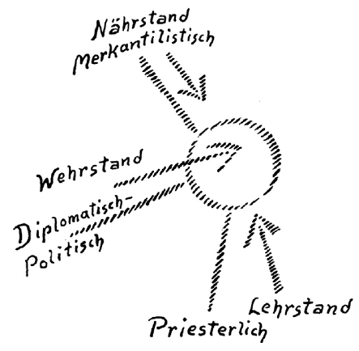

Es scheint mir richtig zu sein, heute einiges an Gedanken vorzubringen über die Bedeutung und das Wesen unserer geistigen Bewegung, der anthroposophisch orientierten Geisteswissenschaft, wie wir sagen. Nun wird es notwendig sein, anzuknüpfen an die eine oder die andere Erscheinung, die im Laufe der Zeit aufgetreten ist, in welcher sich diese Bewegung teils vorbereitet, teils entfaltet hat. Wenn dabei — was ja auch nur scheinbar sein soll — die eine oder die andere Bemerkung persönlicher Art fällt, so geschieht das nicht aus persönlichen Gründen, sondern darum, weil ja das Persönliche der Haltepunkt gleichsam sein soll für das, was sich objektiv ausspricht. Daß in einer geistigen Bewegung, welche gewissermaßen die Menschheit tiefer mit den Quellen des Seins, namentlich des menschlichen Seins selber bekanntmacht, eine gewisse Notwendigkeit liegt, dürfte ja einfach daraus für jeden ersichtlich sein, daß die Kultur der Gegenwart, wie sie sich entwickelt hat, in einer gewissen Weise sich eigentlich ad absurdum geführt hat. Denn es wird ja doch bei tieferem Nachdenken niemandem beifallen können, die Ereignisse, wie sie sich heute abspielen, als etwas anderes zu bezeichnen denn als eine Art Ad-absurdum-Führen desjenigen, was an Impulsen in der neueren Entwickelung gelebt hat. ^1an2or

Nun werden Sie aus dem, was Ihnen bekanntgeworden ist in der Geisteswissenschaft, wohl erfühlt haben, wie alles dasjenige, was sich auch scheinbar noch so äußerlich abspielt, zuletzt auf den Vorstellungen, auf den Gedanken der Menschen beruht. Was an Taten geschieht, was sich im materiellen Leben abwickelt, es ist ja durchaus, man kann sagen, ein Ergebnis desjenigen, was die Menschen vorstellen. Und die Anschauung der äußeren Welt, wie sie sich innerhalb der Menschheit heute gestaltet, gibt wohl ein Bild, das auf unzulängliche Gedankenkräfte ganz stark hinweist. Ich habe schon einmal das Wort gebraucht: Die Ereignisse sind eigentlich den Menschen über den Kopf gewachsen, weil das Denken dünn geworden ist und nicht mehr ausreicht, in die Wirklichkeit einzugreifen. Worte, wie das von der Maja, von dem äußeren Scheine, dem die Dinge auf dem physischen Plane unterliegen, die müßten viel ernster genommen werden von denjenigen, die sie schon kennen, als sie oftmals genommen werden. Und sie müßten sich tief, tief einprägen in das gesamte Zeitbewußtsein. Darinnen kann allein die Heilung von den Schäden liegen, die mit einer gewissen Notwendigkeit über die Menschen heraufgezogen sind. Wer versucht, verständig in das Triebwerk der Taten, also in das Triebwerk der Abbilder der Gedanken heute hineinzublicken, der wird schon die Notwendigkeit, die innere Notwendigkeit eines Erfassens der menschlichen Seele durch kräftigere, wirklichkeitsfreundlichere Gedanken erkennen. ^1fp5yp

Nun, im Grunde liegt unserer ganzen Bewegung dies zugrunde, den Menschenseelen wirklichkeitsfreundlichere Gedanken zu geben, von Wirklichkeit mehr durchtränkte Gedanken, als die abstrakten Begriffsschablonen der Gegenwart sind. Aber man kann nicht oft genug hinweisen darauf, wie sehr die Menschheit heute das Abstrakte liebt und gar kein Bewußtsein entwickeln will, daß das begreiflich Schattenhafte nicht wirklich in das Gewebe des Seins eingreifen kann. Das drückte sich ja insbesondere in der vierzehn-, fünfzehnjährigen Geschichte unserer anthroposophischen Bewegung aus. Es wird immer mehr notwendig sein, daß sich unsere Freunde durchdringen mit dem Spezifischen, was gerade diese anthroposophische Bewegung hatte. Sie wissen ja, wie oft betont worden ist, daß man es gern gehabt hätte, das schöne Wort «Theosophie» vollständig zu Ehren zu bringen, daß man sich lange gewehrt hat, dieses Wort als Kennwort der Bewegung aufzugeben. Aber Sie kennen ja auch alle die Verhältnisse, durch die dieses notwendig geworden ist. Und es ist schon gut, die Sache sich möglichst genau vor die Seele zu führen. Sie wissen ja, daß mit allem guten Willen — denn dieser gute Wille war ja in vielen von Ihnen selbst verankert - angeknüpft worden ist an die sogenannte ’Theosophische Bewegung, wie sie begründet worden ist durch die Blavatsky, wie sie dann ihre Fortsetzung gefunden hat in den Sinnettschen, Besantschen Bestrebungen und so weiter. Es ist wirklich nicht unnötig, daß gerade den vielen böswilligen Entstellungen gegenüber, die von auswärts kommen, unsere Mitglieder immer wieder betonen, daß die anthroposophisch gewordene Bewegung von einem selbständigen Zentrum ausgegangen ist, daß zunächst das, was wir jetzt haben, wirklich seine Keime hatte in den Vorträgen, die von mir in Berlin gehalten worden sind und die dann in der Schrift über die Mystik des Mittelalters niedergelegt sind. Und es muß immer wieder betont werden, daß durch diese Schrift die damals bestehende theosophische Bewegung sich uns, nicht wir ihr, genähert hat. Diese theosophische Bewegung nun, in deren Fahrwasser man die ersten Jahre zu sein hatte, sie steht ja, stand ja nicht ohne Zusammenhang mit andern okkulten Bestrebungen des 19. Jahrhunderts, und ich habe ja in Vorträgen, die hier gehalten worden sind, auf diesen Zusammenhang hingewiesen. Aber man muß auf das Charakteristische dieser Bewegung selbst sehen. ^xomge5

Wenn ich ein recht charakteristisches Merkmal, ich möchte sagen tatsachengemäß, hervorheben soll, so muß es dasjenige sein, auf das ich oftmals oder wenigstens öfters angespielt habe, als ich in der Zeitschrift «Lucifer-Gnosis» zunächst dasjenige veröffentlichte, was dann den Titel bekommen hat «Aus der Akasha-Chronik». Einer der Vertreter der Theosophischen Gesellschaft, der dieses las, fragte, auf welchem Wege die Dinge eigentlich aus der geistigen Welt herausgeholt werden. Und aus dem weiteren Gespräche mit ihm war es sehr ersichtlich, daß es sich darum handelte, zu erfahren, auf welchem mehr oder weniger medialen Wege diese Dinge gewonnen werden. Man konnte sich dort gar nicht denken, daß durch andere Mittel als dadurch, daß irgendein Mensch von medialer Veranlagung, der sein Bewußtsein herabgestimmt erhält und dann etwas aus der Unterbewußtheit heraus vorbringt, was dann aufgezeichnet wird, daß anders als auf diesem Wege diese Dinge zustande kommen. Was liegt denn da eigentlich zugrunde? Dem Manne, der so sprach, lag es völlig fern, sich vorzustellen, daß diese Dinge untersucht werden können bei völliger Aufrechterhaltung des wachen Bewußtseins, trotzdem er ein sehr geschulter und außerordentlich gebildeter Vertreter der theosophischen Bewegung ist. Es lag das vielen Mitgliedern dieser Bewegung aus dem Grunde fern, weil eben diesen vielen etwas eigen ist, was im modernen Geistesleben überhaupt im höchsten Maße vorhanden ist: ein gewisses Mißtrauen in die Eigenkraft des menschlichen Erkenntnisvermögens. Man traut dem menschlichen Erkenntnisvermögen nicht zu, daß es die Kraft in sich aufbringen könne, in das Innere der Dinge wirklich einzudringen. Man findet, das menschliche Erkenntnisvermögen sei doch begrenzt, eigentlich störe der Verstand nur - so findet man -—, wenn man mit ihm in das Wesen der Dinge eindringen will; daher muß man ihn abdämpfen. Man müsse, ohne daß der menschliche Verstand dabei tätig ist, in das Wesen der Dinge eindringen. — Beim Medium ist das ja der Fall, da wird das Mißtrauen in den menschlichen Verstand zu einem maßgebenden Impuls gemacht. Da wird wirklich mit Ausschluß der verständigen Erkenntnistätigkeit rein experimentell versucht, den Geist sprechen zu lassen. ^5dd4ai

Man kann sagen, daß in einer gewissen Art diese Stimmung die theosophische Bewegung, wie sie auch noch im Anfange unseres Jahrhunderts war, gar sehr durchsetzt hatte; diese Stimmung war da vielfach zu Hause. Und man konnte diese Stimmung empfinden, wenn man mit Einsicht gewisse Dinge verfolgte, die sich als Meinungen, als Anschauungen, als Ansichten in der theosophischen Bewegung abgesetzt hatten. Sie wissen ja, daß in den neunziger Jahren des 19. Jahrhunderts und dann im 20. Jahrhundert Mrs. Besant eine große Rolle spielte in der theosophischen Bewegung. Auf dasjenige, was sie zu sagen hatte, hörte man. Ihre Vorträge standen im Mittelpunkte des theosophischen Wirkens in London und auch in Indien. Dennoch war es merkwürdig, die Persönlichkeiten aus der Umgebung von Mrs. Besant über Mrs. Besant sprechen zu hören. 1902 trat mir das schon sehr bedeutsam entgegen. Mrs. Besant galt in vieler Beziehung, namentlich den gelehrten Männern ihrer Umgebung, als eine durchaus ungelehrte Frau; aber während man auf der einen Seite das stark betonte, daß man es mit einer ungelehrten Frau zu tun hat, sah man doch auf der andern Seite in der, ich möchte sagen, nicht durch wissenschaftliche Vorstellungen getrübten, halb medialen Art des Wirkens, die man bei ihr rühmte, ein Hilfsmittel, zu Erkenntnissen zu kommen. Ich möchte sagen, die Leute trauten sich nicht zu, selbst zu Erkenntnissen zu kommen. Sie trauten natürlich auch dem wachen Bewußtsein von Mrs. Besant nicht zu, zu Erkenntnissen zu kommen. Aber weil sie nicht zur völligen Wachheit gekommen war durch eine wissenschaftliche Durchbildung, so betrachtete man sie gewissermaßen als ein Mittel, durch welches Kundgebungen aus der geistigen Welt ins Physische hereinkommen können. Das war doch bei der nächsten Umgebung außerordentlich ausgebildet. Und man kann schon sagen: Die Art, wie gesprochen wurde, die machte den Eindruck, als ob man Mrs. Besant am Anfang des 20. Jahrhunderts ansah wie eine Art moderner Sibylle. Man konnte nach dieser Richtung gerade bei der nächsten Umgebung abfällige Urteile über die wissenschaftliche Begabung von Mrs. Besant hören, man konnte hören, wie man ihr gar keine Kritik über ihre inneren Erlebnisse zutraute. Das war durchaus die Stimmung, die ja natürlich sorgfältig verborgengehalten wurde - ich will nicht sagen, geheimgehalten wurde — vor dem größeren Kreise der theosophischen Leiter. ^2e05ha

Außer diesem, was da durch das Sibyllenhafte von Mrs. Besant zutage trat, war ja Ende des 19. Jahrhunderts neben der «Geheimlehre» der Blavatsky insbesondere eine Art Bibel der theosophischen Bewegung das Buch von Sinnett, vielleicht besser gesagt die Bücher von Sinnett. Nun, wie man erst über die Bücher von Sinnett reden hörte im engeren Kreise, das war ebensowenig etwas, was man nennen könnte einen Appell an die eigene Erkenntniskraft des Menschen. Denn man legte einen großen Wert darauf im engsten Kreise, daß Sinnett ja nicht zu dem, was er veröffentlicht hat, irgend etwas aus seinen eigenen Erfahrungen hinzugebracht hat. Man sah den Wert eines solchen Buches wie des «Esoterischen Buddhismus» von Sinnett gerade darinnen, daß der Inhalt ganz und gar zustande gekommen ist durch «magische Briefe», durch Briefe, welche präzipitiert waren, die also von unbekannt woher in den physischen Plan hereingeschickt worden waren, man kann sagen, geworfen worden waren, und deren Inhalt dann einfach zu diesem Buche «Esoterischer Buddhismus» verarbeitet wurde. ^yzxden

Durch alle diese Dinge war zwar in den weiteren Kreisen der theosophischen Leiter eine Stimmung vorhanden, die sentimental-anbetend im höchsten Grade war. Man sah gewissermaßen zu einer Weisheit hinauf, die vom Himmel gefallen war, und übertrug, wie das ja menschlich begreiflich ist, die Verehrung auf Persönlichkeiten. Aber es lag darinnen der Antrieb zu einer starken Unaufrichtigkeit, die in den einzelnen Erscheinungen sehr gut verfolgt werden konnte. ^qk3yb6

So konnte ich zum Beispiel schon 1902 hören, wie in den engsten Kreisen in London davon gesprochen wurde, daß Sinnett eigentlich ein untergeordneter Geist sei. Es sagte mir dazumal eine der führenden Persönlichkeiten: Ja, der Sinnett, man kann ihn vergleichen mit einem Journalisten etwa der «Frankfurter Zeitung», nach Indien versetzt, ein journalistischer Geist, der einfach das Glück gehabt hat, die Meisterbriefe zu empfangen und sie journalistisch in einer Weise, wie es für die Menschheit der neueren Zeit ansprechend ist, in dem Buche «Esoterischer Buddhismus» zu verwerten! — Sie wissen aber auch, daß all dieses doch in einer breiten Literatur drinnen stand, in einem breiten Schrifttum. Denn es ist ja wirklich, ich will nicht sagen eine Sündf£lut, aber eine Flut von Schriften erschienen in den letzten Jahrzehnten des 19. Jahrhunderts und in den ersten Jahrzehnten des 20. Jahrhunderts, welche bestimmt waren, irgendwie die Menschen hinzuführen zur spirituellen Welt. Unter diesen Schriften waren solche, die in unmittelbarer Anknüpfung standen an alte Traditionen, wie sie sich bewahrt haben in den verschiedensten okkulten Brüderschaften. Es ist im Grunde genommen interessant, die Entwickelung dieser Traditionen zu verfolgen. ^q4o7c1

Ich habe öfter schon darauf hingewiesen, wie in der zweiten Hälfte des 18. Jahrhunderts in dem Kreise, dessen Führer Saint-Martin, der «Unbekannte Philosoph» war, sich in entsprechender Weise alte Traditionen ausgelebt haben. Und wenn man die Schriften, namentlich «Wahrheit und Irrtümer» von Saint-Martin heute sich vornimmt, so findet man darinnen doch sehr, sehr viel von einer letzten Gestalt, die alte okkulte Traditionen angenommen haben. Verfolgt man diese Traditionen weiter zurück, dann gelangt man durchaus noch zu Vorstellungen, welche das Konkrete beherrschen, welche eingreifen in die Wirklichkeiten. Bei Saint-Martin sind die Begriffe schon sehr schattenhaft geworden, aber es sind doch die Schatten von Begriffen, die einstmals voll lebendig waren, es lebten eben zum letzten Mal in schattenhafter Weise alte Traditionen auf. Und so findet man bei Saint-Martin die gesündesten Begriffe, aber in einer Form, die ein letztes Aufflackern ist. Da ist es ja insbesondere interessant, zu sehen, wie Saint-Martin kämpft gegen den damals schon aufgekommenen Begriff der Materie. Wozu ist denn dieser Begriff der Materie nach und nach geworden? Dazu ist er geworden, daß man die ganze Welt ansieht als einen Nebel von Atomen, die in irgendeiner Weise sich bewegen und stoßen, und die durch ihre Konfiguration all das hervorrufen, was als Welt um den Menschen herum sich ausbildet. Theoretisch hat ja der eigentliche Materialismus seinen Höhepunkt dadurch erfahren, daß man dann alles übrige geleugnet hat außer dieser Atomwelt. Saint-Martin stand noch auf dem Standpunkt, daß die ganze Atomistik, überhaupt der Glaube, daß Materie etwas Wirkliches sei, ein Unsinn ist, wie es ja auch tatsächlich der Fall ist. Wenn man den Dingen zu Leibe geht, die uns umgeben chemisch, physisch, so kommt man zuletzt nicht auf Atome, nicht auf Materielles, sondern auf geistige Wesenkeiten. Der Begriff der Materie ist ein Hilfsbegriff; er entspricht nichts Wirklichem. Denn da, wo, um diesen Ausdruck Da Bois-Reymonds zu gebrauchen, «Materie im Raume spukt», da ist wirklich Geist vorhanden, und wenn man von einem Atom reden will, so könnte man höchstens so von dem Atom reden, daß es ein kleiner Stoß des Geistes ist, allerdings Ahrimans. Das war ein gesunder Begriff von Saint-Martin, sein Bekämpfen des Begriffes der Materie. ^02tqbk

Ebenso war ein ungeheuer gesunder Begriff bei Saint-Martin, daß er noch hinwies in lebendiger Art auf die Tatsache, daß menschlichen, konkreten, einzelnen Sprachen eine Universalsprache zugrunde liegt. Und das konnte man in der damaligen Zeit aus dem Grunde besser als später, weil man derjenigen Sprache, welche unter den gegenwärtigen am ehesten nahesteht der ursprünglichen Universalsprache, der hebräischen Sprache, noch lebendiger gegenüberstand, weil man noch in den Worten der hebräischen Sprache etwas vom Fließen des Geistes und dadurch in den Worten selber etwas Geistig-Ideelles, etwas wirklich Geistiges verspüren konnte. Bei Saint-Martin finden Sie daher noch den konkret-spirituellen Hinweis auf das, was das Wort «Hebräer» selber bedeutet. Und in der ganzen Art und Weise, wie er das auffaßt, sieht man, wie noch das lebendige Bewußtsein vorhanden war von einer Beziehung des Menschen zur geistigen Welt. Denn das Wort «Hebräer» hängt zusammen mit «reisen»: wer ein Hebräer ist, ist derjenige, der eine Lebensreise macht, der auf einer Reise erfährt, erlebt. Dieses lebendige Drinnenstehen in der Welt liegt in diesem Wort, liegt aber allen andern Worten der hebräischen Sprache zugrunde, wenn sie real erfühlt werden. ^ryzi8s

Nun konnte jaSaint-Martin zu seiner Zeit nicht mehr Vorstellungen finden — diese müssen erst wiederum durch Geisteswissenschaft gewonnen werden -, welche präziser, stärker auf das Ursprachliche hinweisen. Aber als eine Ahnung stand die Ursprache vor seiner Seele. Damit aber hatte er nicht einen so abstrakten Begriff von der Einheitlichkeit des Menschengeschlechtes, wie ihn dann das 19. Jahrhundert ausbildete, sondern er hatte einen konkreten Begriff davon. Dieser konkrete Begriff von der Einheitlichkeit des Menschengeschlechtes führte ihn aber auch dahin, gewisse geistige Wahrheiten wenigstens in seinem Kreise noch voll lebendig zu machen, zum Beispiel die Wahrheit, daß der Mensch, wenn er nur will, wirklich mit geistigen Wesen höherer Hierarchien in Beziehungen treten kann. Das ist ein Kardinalsatz bei Saint-Martin, daß jeder Mensch mit geistigen Wesenheiten höherer Hierarchien in Beziehungen treten kann. Aber dadurch lebte in ihm gewissermaßen etwas noch von jener alten, echten mystischen Stimmung, welche wußte, daß das Wissen nicht bloß in Begriffen aufgenommen werden kann, wenn es wirkliches Wissen sein soll, sondern in einer gewissen Seelenverfassung aufgenommen werden muß, das heißt nach einer gewissen Vorbereitung der Seele. Dann wird es zum spirituellen Leben der Seele. Damit aber war verknüpft eine gewisse Summe von Forderungen, von Evolutionsforderungen an die menschlichen Seelen, die überhaupt Anspruch machen wollten, an der Evolution irgendwie teilzunehmen. Und von diesem Gesichtspunkte aus ist es so interessant, wenn dann Saint-Martin überleitet dasjenige, was er aus dem Erkennen, aus der Wissenschaft heraus — die aber spirituell bei ihm ist — gewinnt, zur Politik, wenn er also zu den politischen Begriffen kommt. Denn da hat er ja die präzise Forderung: Jeder Regierende müsse eine Art Melchisedek sein, eine Art Priesterregent. ^41lu5h

Und denken Sie sich, wenn diese Forderung, die geltend gemacht worden ist in verhältnsmäßig kleinem Kreise, bevor die Französische Revolution hereinbrach, wenn diese Forderung nicht Abendröte, sondern Morgenröte geworden wäre, wenn etwas davon ins Zeitbewußtsein übergegangen wäre von dem melchisedekartigen Grundcharakter derjenigen, die mit ihren Vorstellungen und Kräften einzugreifen haben in die menschlichen Geschicke, was alles anders hätte werden müssen im 19. Jahrhundert, als es geworden ist! Denn das 19. Jahrhundert stand wahrhaftig dann so fern als möglich dieser Auffassung, die eben charakterisiert worden ist. Man hätte ja die Anforderung, daß Politiker durch die Schule Melchisedeks durchzugehen haben, selbstverständlich nur mit einem Lächeln abgefertigt. ^bxhmag

Man muß auf Saint-Martin hinweisen, weil in ihm etwas vorliegt wie eben ein letztes Abglimmen der Weisheiten, die sich heraufentwickelt haben aus dem fernen Altertum. Das mußte ja auch abglimmen, denn die Menschheit der Zukunft muß auf andere Art zu dem spirituellen Leben aufsteigen. Sie muß auf andere Art aufsteigen, weil niemals das bloße Bewahren, das bloße traditionelle Fortpflanzen der alten Vorstellungen den keimenden Kräften der menschlichen Seele entsprochen hätte. Diese noch unentwickelten Kräfte der menschlichen Seele, sie tendieren ja darauf hin, daß im Laufe des 20. Jahrhunderts noch bei einer größeren Anzahl von Menschen — das ist oft betont worden — wirklich ein Hineinsehen in die ätherischen Vorgänge stattfindet. Und man kann den Ablauf des ersten Drittels des 20. Jahrhunderts geradezu als die kritische Zeit bezeichnen, wo eine größere Anzahl von Menschen aufmerksam darauf werden müssen, wie im Äther, der ebenso wie die Luft in unserer Umgebung lebt, die Ereignisse geschaut werden müssen. Wir haben ja insbesondere scharf auf ein Ereignis hingewiesen, das im Äther zu schauen sein muß, wenn die Menschheit nicht in die Dekadenz verfallen will: wir haben auf das Schauen des ätherischen Christus hingewiesen. Diese Notwendigkeit muß eintreten. Und die Menschheit muß sich darauf vorbereiten, diese Kräfte, die schon keimen, wirklich nicht abdorren zu lassen. Die Kräfte dürfen nicht abdorren, denn setzen wir einmal den Fall, die Kräfte sollten abdorren, was würde denn dann geschehen? Dann würde in den vierziger, fünfziger Jahren des 20. Jahrhunderts das menschliche Gemüt in weitesten Kreisen ganz absonderliche Formen annehmen. Es würden im Gemüte Begriffe aufsteigen, die wie beklemmend wirken würden. Würde nur der Materialismus sich fortpflanzen, so würden solche Begriffe aufsteigen, die zwar da wären im menschlichen Gemüte, die aber durchaus aus dem Unterbewußtsein neraufsteigen, und bei denen man den Grund nicht kennt, warum man sie eigentlich hat. Ein Alpdrücken während des Wachens würde als eine allgemeine neurasthenische Erscheinung bei einer großen Anzahl von Menschen auftreten. Die Menschen würden sich sagen: Ja, da muß ich das denken, aber ich weiß nicht warum; da muß ich jenes denken, ich weiß nicht warum. ^t00xma

Dem kann nur entgegengearbeitet werden dadurch, daß in den menschlichen Gemütern Begriffe eingepflanzt werden, die aus der geistigen Wissenschaft kommen. Sonst werden die Kräfte der Einsicht in die Begriffe, die aufsteigen, in die Ideen, die kommen, erlahmen. Und nicht nur der Christus, sondern auch andere Erscheinungen des ätherischen Geschehens, die der Mensch sehen müßte, werden sich dem Menschen entziehen, werden an ihm vorbeigehen. Er wird aber nicht nur einen Verlust dadurch haben, sondern er wird die Kräfte entwikkeln müssen, welche krankhafte Ersatzkräfte für diejenigen sind, die sich als gesunde entwickeln sollten. ^nwefg4

Aus einem instinktiven Bedürfnis weiterer Menschheitskreise ging das Bestreben hervor, das sich eben dann ausdrückte in der Flut von Literatur und Schrifttum, von der ich gesprochen habe. Nun, sehen Sie, sowohl demjenigen, was in der eigentlichen theosophischen Bewegung, namentlich in der Theosophical Society zutage trat, wie auch der andern Flut von allerlei zum Spirituellen hinarbeitenden Schriften, stand man mit der mitteleuropäischen anthroposophischen Bewegung eigentümlich gegenüber, weil eine eigentümliche Erscheinung vorlag. Es war möglich durch die Evolutionsbedingungen des 19. und beginnenden 20. Jahrhunderts, daß eine große Anzahl von Menschen geistige Nahrung fand in der Literatur, die also zutage trat, es war möglich, daß eine große Anzahl von Menschen auch furchtbar anstaunte dasjenige, was durch Sinnett und die Blavatsky zutage getreten ist. Aber mit dem mitteleuropäischen Bewußtsein stimmte das nicht ganz gut zusammen. Denn für denjenigen, der die mitteleuropäische Literatur kennt, gibt es gar keinen Zweifel, daß man zum Beispiel nicht ohne weiteres im Fahrwasser dieser mitteleuropäischen Literatur stehen und sich ganz gleich wie viele andere zu dem verhalten kann, was da als eine Flut heraufkam, einfach, weil die mitteleuropäische Literatur unendlich vieles in sich hat — nur durch eine eigentümliche Sprache, auf die sich viele Menschen nicht einlassen wollen, verborgen -, was die spirituell Suchenden haben wollen. ^k6tzu5

Wir haben ja öfters von einem der Geister gesprochen, die so recht ein Beweis sein können, wie einfach in der künstlerischen Literatur, in der schöngeistigen Literatur das spirituelle Leben waltet und webt: Novalis. Wir hätten ebensogut, wenn wir für prosaischere Stimmungen hätten sorgen wollen, Friedrich Schlegel anführen können, der über die Weisheit der Inder so geschrieben hat, wie eben jemand schreibt, der nicht nur die Weisheit der Inder wiedergibt, sondern der sie aus dem westlichen Geiste heraus wiedergebiert. Wir hätten auf vieles verweisen können, was mit der Flut, von der ich gesprochen habe, nichts zu tun hat und was dann, ich möchte sagen, historisch im Abrisse von mir charakterisiert worden ist in meinem Buche «Vom Menschenrätsel». Bei Leuten wie Steffens, wie Schubert, wie Troxler findet man ja alles vielfach präziser, viel mehr auf moderner Höhe stehend vor als in der Flut von Literatur, die da plötzlich in den letzten Jahrzehnten des 19. und im Beginne des 20. Jahrhunderts hereingebrochen ist. Man muß sagen, gegenüber der Tiefe, die in Goethe, Schlegel, Schelling liegt, sind wahrhaftig die Dinge, die angestaunt wurden als hohe Weisheit, trivial, richtig trivial. Denn schließlich gilt es ja doch, daß für jemanden, der den Geist Goethes in sich aufgenommen hat, selbst so etwas wie «Licht auf den Weg» etwas Triviales ist. Ich meine, dieses soll man nicht vergessen. Wer den hohen Schwung von Novalis oder Friedrich Schlegel aufgenommen hat, oder sich erfreut hat an Schellings «Bruno», für den gilt diese ganze theosophische Literatur, wie sie aufgetreten ist, dennoch nur als etwas Vulgär-Triviales. Daher stand man vor der eigentümlichen Erscheinung, daß viele Menschen da waren, welche den ernsten, aufrichtigen Willen hatten, zum spirituellen Leben hinzukommen, die aber schließlich durch ihre geistige Artung eine gewisse Befriedigung finden konnten gerade an der charakterisierten TrivialLiteratur. ^wk3mvc

Und auf der andern Seite hatte die Entwickelung des 19. Jahrhunderts allmählich den Charakter angenommen, daß die wissenschaftlich gebildeten Leute aus Gründen, die ich oft erörtert habe, materialistische Denker geworden waren, mit denen nichts anzufangen war. Will man aber so recht feststehend das verarbeiten, was um die Wende des 18. zum 19. Jahrhundert durch Schelling, Schlegel, Fichte und andere zutage getreten ist, dann braucht man schon wenigstens einige wissenschaftliche Begriffe. Man kann ohne die nicht auskommen. Daher stand man vor einer sehr eigentümlichen Erscheinung. Es war nicht möglich, zur rechten Zeit etwas herbeizuführen, was hätte wünschenswert erscheinen können, nämlich, daß eine Anzahl, wenn auch eine kleine Anzahl von wissenschaftlich gebildeten Persönlichkeiten in die Lage gekommen wäre, ihre wissenschaftlichen Begriffe so auszubilden, daß sie den Anschluß gefunden hätten an die spirituelle Wissenschaft. Diese Leute waren überhaupt gar nicht zu finden, die waren gar nicht da. Das ist ja überhaupt eine Schwierigkeit, die vorliegt, und diese Schwierigkeit muß man sich klar vor Augen führen. ^ri80e4

Nehmen Sie an, man wende sich mit der Anthroposophie an die durch die heutige wissenschaftliche Bildung Gegangenen. Nun, wenn die Leute durch die wissenschaftliche Bildung gegangen sind, Juristen, Mediziner, Philologen geworden sind — von den Theologen gar nicht zu reden -, dann sind sie bei einem bestimmten Lebensalter angekommen, das es notwendig macht, dasjenige, was sie, ich will nicht sagen gelernt haben, aber was sie aufgenommen haben, nun auch wirklich im Leben zu verwerten, so wie das Leben es verlangt. Dann haben sie nicht mehr die Neigung und nicht mehr die Elastizität, aus ihren Begriffen sich herauszuarbeiten nach irgend etwas anderem hin. Und daher, gerade wenn man sich an wissenschaftlich gebildete Menschen wendet mit der Anthroposophie, wird man am allermeisten zurückgestoßen, trotzdem es nur ein weniges bedürfte für den heutigen Wissenschafter, die Brücke zu schlagen. Aber er will diese Brücke nicht schlagen. Es beirrt ihn, Wozu braucht er das? Er hat das gelernt, was das Leben von ihm fordert, und etwas anderes will er nicht haben, weil es ihn beirrt, weil es ihn unsicher macht, wie er glaubt. Und deshalb wird es schon noch einige Zeit dauern, bis Männer, die die Bildung ihrer Zeit - so wie man das definiert - in sich aufgenommen haben, die Brücke schlagen, wenigstens eine größere Anzahl von Männern. Da muß man durchaus Geduld haben. Das wird sich nicht so leicht machen lassen, insbesondere auf gewissen Gebieten nicht. Bevor aber auf gewissen Gebieten ernsthaftig in Angriff genommen wird dieses Brückenschlagen, werden immer große Hindernisse und Hemmungen eintreten. Vor allen Dingen wird es notwendig sein, auf den Gebieten, die heute den Umkreis der verschiedenen Fakultäten darstellen, mit Ausnahme der Theologie, diese Brücke zu schlagen. ^s7cvq6

Die Jurisprudenz arbeitet sich immer mehr und mehr hinaus zu bloßen Begriffsschablonen, die ganz und gar ungeeignet sind, das Leben zu beherrschen. Sie beherrschen trotzdem das Leben, weil das Leben auf dem physischen Plane Maja ist — wäre es nicht Maja, so könnten sie es nicht beherrschen -, aber indem sie angewendet werden, bringen sie die Welt immer mehr und mehr durcheinander. Es ist eigentlich die Anwendung der gegenwärtigen Jurisprudenz, namentlich im Zivilrecht, ein bloßes Durcheinanderbringen der Verhältnisse. Man sieht das nur nicht klar. Wie sollte man es auch sehen? Man verfolgt ja nicht dasjenige, was entsteht aus der Anwendung der juristischen Schablonenbegriffe auf die Wirklichkeit, sondern man studiert Jurisprudenz, das heißt, man wird Advokat oder Richter, man nimmt die Begriffe auf und wendet sie an. Was aus der Anwendung wird, das kümmert einen nicht weiter. Oder aber man sieht, wie das Leben ist, trotzdem es eine Jurisprudenz gibt, die sehr schwer zu lernen ist, nicht nur aus dem Grunde schwer zu lernen ist, weil gerade die Juristen gewöhnlich die ersten Semester verbummeln, sondern auch aus andern Gründen schwer zu lernen ist. Man sieht dieses Leben, und sieht, daß es verworren wird und schimpft höchstens. ^61d72d

In der Medizin, da liegt die Sache ja ernster. Die Medizin wird sich wirklich, wenn sie sich so weiterentwickelt im materialistischen Fahrwasser, wie sie seit dem zweiten Drittel des 19. Jahrhunderts sich anläßt, völlig ad absurdum führen; sie wird schließlich in absoluten medizinischen Spezialismus auslaufen. Aber da liegen die Dinge doch insofern ernster, als es notwendig war, daß diese Strömung heraufkam, denn diese Strömung hat ihr Gutes gehabt, nur muß sie jetzt wiederum überwunden werden. Die materialistische Richtung der Medizin hat die Chirurgie bis zu einer gewissen Höhe gebracht, und nur durch die Einseitigkeit der Medizin konnte die Chirurgie jene Vollkommenheit erlangen, die sie erlangt hat. Aber die eigentliche Medizin hat darunter gelitten und muß nun durch einen Umschwung gerade zu einer Vergeistigung getrieben werden, wogegen man sich heute ungeheuer stark wehrt. - Am meisten hat spirituelle Durchsetzung alles dasjenige nötig, was mit der Pädagogik zusammenhängt. Nun, darüber haben wir ja mehrfach geredet. Da muß überall die Brücke geschlagen werden. ^7imhdn

Vor allem, trotzdem es scheinbar am fernsten liegt, ist es aber vonnöten, daß gerade von der Technik, von der unmittelbaren Lebenspraxis die Brücke geschlagen wird zum spirituellen Leben. Denn der fünfte nachatlantische Zeitraum hat es zu tun mit der Entwickelung der materiellen Welt, und wenn der Mensch nicht vollständig degenerieren soil, das heißt, zum bloßen Handlanger der Maschine werden soll, wodurch er nichts weiter wird als ein Tier, so muß gerade der Weg von der Maschine zum spirituellen Leben gefunden werden. Für den technischen Praktiker ist es vor allen Dingen zuerst notwendig, daß er spirituelle Impulse in sein Seelenleben aufnimmt. Dies wird in dem Momente geschehen, wenn ein klein wenig mehr, als es jetzt der Fall ist, die technischen Studenten zum Denken angehalten werden, so daß sie die einzelnen Dinge, die ihnen beigebracht werden, miteinander verbinden. Das tun sie heute noch nicht. Sie hören Mathematik, sie hören Darstellende Geometrie, sie hören auch Geometrie der Lage zuweilen; sie hören reine Mechanik, analytische Mechanik, technische Mechanik, ‚sie hören dann die verschiedenen einzelnen, mehr in die Praxis hineingehenden Zweige, aber eine eigentliche Verbindung zwischen den einzelnen Dingen wird überhaupt gar nicht gesucht. In dem Augenblicke, wo die Leute, ich möchte sagen, dazu getrieben werden, so recht den gesunden Menschenverstand auf die Dinge anzuwenden, da werden sie — einfach durch das Entwickelungsstadium, in dem diese einzelnen Zweige stehen, von denen ich gesprochen habe — dazu getrieben werden, in das Wesen der Dinge und dann in das Spirituelle einzudringen. Wirklich, gerade von der Maschine aus wird man den Weg finden müssen in die spirituelle Welt hinein. ^f4n0l6

Nun, das alles sage ich, um die Schwierigkeit anzudeuten, welche die geisteswissenschaftliche Bewegung heute hat, weil sie gewissermaßen noch nicht diejenigen finden kann, welche geeignet wären, die Aura des Ernstgenommenwerdens zu erzeugen. Darunter leidet ja diese Bewegung am allermeisten, daß sie nicht ernst genommen wird. Und es ist merkwürdig, wie in allen Einzelheiten das zutage tritt. Hätte man manches erscheinen lassen, was erschienen ist, ohne daß die Leute gewußt hätten: Das ist von jemandem geschrieben, der in der theosophischen Bewegung steht —, so wäre es ernst genommen worden, wäre es ganz anders aufgefaßt worden. Aber einfach weil der Betreffende in der theosophischen Bewegung stand, war die Sache mit einer Marke versehen, die bewirkte, daß man sie nicht ernst nahm. Es ist sehr wichtig, dies ins Auge zu fassen. An Kleinigkeiten kann einem das entgegentreten, an richtigen Kleinigkeiten. Ich will zum Beispiel eine Kleinigkeit erwähnen, weil sie mir gerade in den letzten Tagen entgegengetreten ist, wirklich nicht aus einer albernen Eitelkeit heraus, sondern einfach, um Sie aufmerksam zu machen, wie die Dinge liegen. ^i31xc4

Ich habe in meinem Buche «Vom Menschenrätsel» als einem derjenigen Geister, die aus gewissen Grundlagen heraus zum Spirituellen hingearbeitet haben, wenn auch noch in einer abstrakten Form, den Karl Christian Planck behandelt. Ich habe über Karl Christian Planck nicht nur in diesem Buche geschrieben, sondern in einer ganzen Anzahl von Städten in den letzten Wintern ziemlich ausführlich über Karl Christian Planck gesprochen, auch hingewiesen darauf, wie er verkannt worden ist, wie er mißverstanden worden ist, hingewiesen vor allen Dingen auf einen Umstand. Auf den Umstand habe ich scharf hingewiesen, daß dieser Mann in den achtziger, siebziger, sechziger, fünfziger Jahren in bezug auf die Zusammenhänge des industriellen und sozialen Lebens Dinge gedacht hat, die notwendig waren durchzuführen. Wenn dazumal irgend jemand sich gefunden hätte, der mit Verständnis dasjenige in die Praxis des sozialen Lebens umgesetzt hätte, was der Mann Großes an Ideen, an wirklichkeitsfreundlichen Ideen geleistet hat, dann - ich sage nicht zuviel — wären wahrscheinlich diese Leiden, die jetzt die Menschheit trägt, nicht über die Menschheit gekommen, die ja doch zum großen Teile damit zusammenhängen, daß die Menschheit in einer ganz falschen sozialen Struktur drinnenlebt. Ich habe darauf hingewiesen, wie es eine Pflicht ist, die Menschen nicht dahin kommen zu lassen, wo Karl Christian Planck hingekommen ist, der zuletzt ganz und gar entfremdet war aller Liebe zur Welt der äußeren physischen Wirklichkeit. Planck war Schwabe und hat in Stuttgart gelebt, ist in Tübingen zurückgewiesen worden von der Philosophie-Dozentur, die ihm die Möglichkeit geboten hätte, ein wenig zu wirken, und ich habe mit voller Absicht darauf hingewiesen, daß der Mann schließlich in seinem «Testament eines Deutschen» dazu gekommen ist, in der Vorrede zu sagen: «Nicht einmal meine Gebeine sollen in dem undankbaren Vaterlande liegen.» Es war das ein scharfes Wort. Es ist eben ein Wort, zu dem Leute in der Gegenwart kommen können gegenüber dem Stumpfsinn der Menschen, die gerade das nicht einsehen wollen, was wirklichkeitsfreundlich ist. Ich habe es absichtlich in Stuttgart zitiert, dieses Wort von den Gebeinen, denn das ist ja das engere Vaterland Plancks gewesen. Es war im wesentlichen damals auch nicht viel Reaktion da, trotzdem schon die Ereignisse da waren, die zeigten, wie sehr man Grund gehabt hätte, die Dinge zu verstehen. ^98zs28

Jetzt dagegen, nach etwa anderthalb Jahren, geht folgende Notiz durch die schwäbischen Zeitungen: ^7edmxm

Ich habe dazumal gesagt: So genau hat Karl Christian Planck diesen Weltkrieg vorausgesehen, daß er sogar ausdrücklich darauf hingewiesen hat, daß Italien nicht auf der Seite der Mittelmächte stehen wird, trotzdem damals das Bündnis noch nicht geschlossen war, sondern man erst hinsteuerte darauf, als er den Ausspruch getan hatte. ^1qvwtm

Das ist wirklich so! ^s7fc51

Das ist das Wichtige! Nur hat keiner gehört! ^g3bhvl

Nur ist er bis zu einem solchen Ausspruch gekommen, wie ich ihn zitiert habe! ^3d7wi3

Es ist interessant, daß nunmehr die Tochter des Philosophen auftritt nach anderthalb Jahren. Diese Notiz ist in einer Stuttgarter Zeitung erschienen. Dazumal, als von meiner Seite auf den Philosophen Karl Christian Planck in Stuttgart möglichst deutlich hingewiesen worden ist, hat überhaupt niemand Notiz genommen, hat sich auch niemand gedrängt gefühlt, das irgendwie bekanntzumachen. Anderthalb Jahre danach tritt die Tochter auf, die vermutlich bei dem Tode ihres Vaters, der 1880 erfolgt ist, auch schon gelebt hat, die also bis jetzt gewartet hat, um in öffentlichen Vorträgen für ihn einzutreten. ^x7fk7l

Das ist ein Beispiel, das man nicht verzehn-, sondern verhundertfachen kann, und aus dem immer wieder gezeigt wird, wie es schwierig ist, zugleich das Umfassende der Geisteswissenschaft und das einzelne Praktisch-Konkrete zur Geltung zu bringen, trotzdem natürlich eine absolute Notwendigkeit dafür vorliegt. Denn nur durch das Umfassende der Geisteswissenschaft — das muß verstanden werden - ist eine Heilung möglich für dasjenige, was in der Kultur unserer Zeit lebt. ^6392ph

Und so war es notwendig, das,was wir anthroposophisch orientierte Geisteswissenschaft nennen, doch in irgendeiner Weise in dem ernsten Fahrwasser zu halten, von dem die theosophische Bewegung immer mehr und mehr abgegangen ist. Es mußte der Geist, der erfaßt worden ist in der griechischen Philosophenzeit, schon die Dinge durchdringen, wenn auch dadurch die Meinung entstand, die Schriften seien schwer zu lesen. Und das war zuweilen nicht leicht. Denn gerade innerhalb der Bewegung stieß das auf größte Schwierigkeiten. Und eine der allergrößten Schwierigkeiten war die, daß es wirklich reichlich mehr als ein Jahrzehnt gebraucht hat, über eine Grundabstraktion hinwegzukommen. Man mußte langsam und geduldig arbeiten, um über eine Grundabstraktion hinwegzukommen, die zu dem Allerschädlichsten gehörte in unserer Bewegung. Diese Grundabstraktion bestand einfach darinnen, daß man an dem Worte «Theosophie» festhielt, ganz gleichgültig, wenn etwas «theosophisch» sich nannte, ob es nun wirklich durchdrungen war von der Geistigkeit des modernen Lebens oder ob es Rohmsches oder sonstiges Zeug war. Wenn es «theosophisch» genannt wurde, dann war es gleichberechtigt, denn das forderte die «theosophische Toleranz». Nur ganz langsam und allmählich war es möglich, gegen diese Dinge aufzukommen, denn ganz sagen konnte man das ja nicht gleich von Anfang, sonst wäre es ja als Anmaßung erschienen, und ein Gefühl davon hervorzurufen, daß doch ein Unterschied besteht zwischen den Dingen, und daß Toleranz, in diesem Sinne gebraucht, nichts anderes ausdrückt als die absoluteste Charakterlosigkeit im Urteilen. Das, worauf es eben ankommt, ist gerade das Hinarbeiten auf ein solches Wissen, auf eine solche Erkenntnis, die der Wirklichkeit gewachsen ist, die es aufnehmen kann mit den Forderungen der Wirklichkeit. Es mit den Forderungen der Wirklichkeit aufnehmen kann nur eine Geisteswissenschaft, welche mit den Begriffen unserer Zeit arbeitet. Und nicht nur das Leben in angenehmen theosophischen Vorstellungen, sondern das Ringen nach geistiger Wirklichkeit, das ist es, worauf hingestrebt werden muß. ^4fo11y

Manche Menschen haben heute gar keinen Begriff, was es eigentlich heißt, nach der Wirklichkeit hin sich durchzuringen, weil man noch nicht volle Klarheit sich erringen will von der Abgebrauchtheit der Begriffe, mit denen heute gearbeitet wird. Nur eine kleine Probe aus einem scheinbar entlegenen Gebiete, von einem Ringen nach Wirklichkeit in Vorstellungen, lassen Sie mich vorbringen. Dulden Sie es, daß ich dies etwas Abgezogenere vorbringe, es soll ja nur kurz gemacht werden. ^dr4v9x

Einzelne waren ja im 19. Jahrhundert immer da, welche esaufgenommen haben mit der Wirklichkeit, wie sie hereinbrechen sollte in ganz neuen Lebensvorstellungen, Lebensvorstellungen nicht nur im trivialen Sinne, sondern Lebensvorstellungen, wie man sie braucht gerade im praktischen Leben. So war in einer bestimmten Zeit im 19. Jahrhundert der Parallelbegriff brüchig geworden, der seit dem alten Euklid gegolten hat. Wann sind zwei Linien parallel? Nun, wer wäre sich denn nicht klar darüber, daß zwei Linien parallel dann sind, wenn sie noch so weit verlängert, sich nicht schneiden! Das ist ja auch die Definition: Zwei Gerade sind dann parallel, wenn sie, noch so weit verlängert, sich nicht schneiden. Es hat Leute im 19. Jahrhundert gegeben, die ihr ganzes Leben darauf verwendet haben, über diesen Begriff zur Klarheit zu kommen, weil er vor einem genauen Denken doch nicht standhält. Und ich will Ihnen einen Brief vorlesen, den einer der beiden Bolyai, Wolfgang Bolyai, geschrieben hat, um Ihnen zu zeigen, was Ringen in Vorstellungen heißt. Der Mathematiker Gauf hat ja begonnen, nachzudenken darüber, daß die Definition: Zwei Gerade sind parallel, wenn sie sich in unendlicher Entfernung oder gar nicht schneiden - eigentlich gar nichts sagt, bloß eine Rederei ist. Und der ältere Bolyai, der Vater, war Freund und Schüler von Gauß, aber er hat auch seinen Sohn, den jüngeren Bolyai angeregt. Und der Vater schrieb an den Sohn: ^y7knvr

Dennoch ist auch der jüngere Bolyai weitergegangen auf diesem Weg und hat sein ganzes Leben noch mehr als der Vater darauf verwendet, um auf einem Gebiete, wo man einen ganz realen Begriff zu haben scheint, der aber doch nur eine Rederei ist, zu einem konkreten Begriff zu kommen, Er wollte herausfinden, ob es denn wirklich so etwas gibt wie zwei Geraden, die sich auch in unendlicher Entfernung nicht schneiden; denn nachgelaufen ist ja noch niemand dieser unendlichen Entfernung, weil das eine unendliche Zeit erfordert, und die ist ja noch nicht abgelaufen. Es ist ja eine bloße Rederei. In den weitesten Begriffsverzweigungen stecken diese bloßen Redereien, stecken die bloßen Begriffsschatten. Ich wollte Sie nur auf etwas aufmerksam machen, was abgezogen wird, damit Sie sehen, wie gründlichere Geister des 19. Jahrhunderts an der Abstraktheit der Begriffe gelitten haben! Es ist interessant zu sehen, daß, während in allen Schulen gelehrt wird: Parallele Linien sind diejenigen, die sich nicht schneiden, wenn man sie noch so lange verlängert -, es einzelne Geister gegeben hat, denen das Arbeiten in dieser Vorstellung zur Hölle geworden ist, weil sie versuchten, durchzudringen zu einem wirklichen Begriff, nicht zu einer Begriffsschablone. ^eh9s9n

Ja, das Ringen mit der Wirklichkeit, das ist es, worauf es ankommt, was die Leute in unserer Zeit doch mehr oder weniger fliehen, nicht wollen, weil sie ja «einsehen», wenigstens einzusehen glauben, daß sie «hohe Ideale» haben! Ja, auf die Ideale kommt es nicht an, sondern auf die Impulse, die mit der Wirklichkeit arbeiten. Denken Sie sich, es stelle sich einer hin und sagt das schöne Wort: Es muß nun endlich eine Zeit kommen, in welcher der Tüchtigste seine gebührende Berücksichtigung im Leben findet. — Das ist ein sehr schönes Programm! Man kann sogar Gesellschaften begründen mit dem Programm, die Gesellschaft so zu reformieren, daß der Tüchtigste zu seinem gebührenden Platz kommt; man könnte sogar Staatswissenschaften auf diesem Satz begründen. Aber auf den Satz kommt es nicht an, sondern auf das Wirklichkeitsdurchtränktsein. Denn, was nützt es denn, wenn dieser Satz noch so sehr gilt, wenn er von noch so vielen Gesellschaften als erster Programmpunkt selbst vertreten würde, aber die Menschen, die die Macht dazu haben, als den Tüchtigsten eben doch ihren Neffen ansehen! Es kommt ja nicht darauf an, den abstrakten Satz geltend zu machen, daß der Tüchtigste an den richtigen Platz gestellt werde, sondern daß man die Fähigkeit hat, den Tüchtigsten wirklich zu finden, nicht den Neffen zu finden! Man muß verstehen, wie abstrakte Begriffe überall in den Klunsen des Lebens, das heißt in den Spalten des Lebens durchfallen, wie sie nirgends etwas bedeuten, und wie unsere ganze Zeit angefüllt ist von lauter schönen Begriffen, gegen die ja auch nichts eingewendet werden soll in ihrer Begriffsschönheit; aber auf Wirklichkeitserfassung, auf Wirklichkeitserkenntnis kommt es an. ^calv0e

Stellen wir uns einmal vor, der Löwe wollte eine Weltenordnung für die Tiere begründen, wollte das Reich der Erde so einteilen, daß es gerecht ist. Was wird der Löwe tun? Ich glaube nicht, daß es dem Löwen einfallen wird, darauf zu drängen, daß in der Wüste die kleinen Tiere, die der Löwe sonst frißt, die Möglichkeit haben, nicht vom Löwen gefressen zu werden! Ich glaube es nicht, sondern er wird es als sein Löwenrecht betrachten, die kleinen Tiere eben zu fressen, die ihm begegnen. Dagegen könnte es dem Löwen schon einfallen, für das Meer zum Beispiel als eine gerechte Maßregel aufzustellen, daß die Haifische keine kleinen Fische fressen. Das könnte schon passieren, und es könnte sogar passieren, daß der Löwe eine furchtbar gute Tierordnung aufstellte, so daß im Meere und auf dem Nordpol und sonst, wo gerade der Löwe nicht zu Hause ist, es allen Tieren freiheitsgemäß außerordentlich gut geht. Aber ob es ihm gefallen würde, im Löwengebiete genau dieselbe Ordnung einzuführen, das frägt sich sehr. Der Löwe weiß nämlich ganz gut, was eine gerechte Weltenordnung ist, und er wird sie bei den Haifischen sehr gut anwenden. ^v1g702

Nun, sprechen wir nicht vom Löwen, sondern sprechen wir vom Hungaricus. Ich habe Ihnen neulich gesagt, daß eine kleine Broschüre erschienen ist: «Conditions de Paix de l’Allemagne.» Diese Broschüre segelt nun ganz im Fahrwasser jener europäischen Landkarte, welche schon ihre erste Ankündigung in der berühmten Note der Entente an Wilson gefunden hat für die Zerstückelung Österreichs. Wir haben ja davon gesprochen. Hungaricus ist im Grunde genommen, mit Ausnahme der Schweiz, mit dieser Karte ganz einverstanden. Er redet zuerst sehr weise — wie ja jetzt die meisten Menschen weise reden — über das Recht der Nationen, auch über das Recht der kleinen Nationen, über das Recht, daß der Staat zusammenfallen muß mit der Kraft der Nation und so weiter. Das alles ist selbstverständlich sehr schön, so wie der Satz, daß der Tüchtigste auf seinen rechten Platz kommen muß, auch sehr schön ist. Solange man bei diesen Begriffsschatten bleibt, kann man sich ja die Finger ablecken, wenn man abstrakter Idealist ist und den Hungaricus liest. Für Schweizer ist ja der Hungaricus angenehmer zu lesen als die Karte, die ich vorgeführt habe, aus dem Grunde, weil der Hungariicus die Schweiz nicht auslöscht, sondern sie sogar vergrößert; er schreibt ihr nämlich Vorarlberg zu und Tirol. Deshalb rate ich gerade den Schweizern, den Hungaricus zu lesen, statt sich an jene Karte zu halten. Aber nun teilt er auch die Welt ein. Man kann sagen, er läßt allen, allen Völkern, selbst den kleinsten, in seiner Art absolutestes Recht freier Entwickelung -, wenn er nicht glaubt, daß er mit irgend etwas bei der Entente Anstoß erregt. Da verbrämt er das Wort so ein bißchen: bei Böhmen sagt er Selbständigkeit, bei Irland sagt er selbstverständlich Autonomie. Nun ja, das tut man so, nicht wahr! Frisieren kann man ja die Sache. Und so wird die Welt zurechtgeschnitten, die Welt Europas recht hübsch aufgeteilt, so daß mit Ausnahme eben der Dinge, auf die ich gerade hingewiesen habe — damit nicht Anstoß erregt werde -, wirklich versucht worden ist, die kleinsten Nationalitäten denjenigen Staaten zuzuteilen, von welchen die Vertreter der Entente glauben, daß die betreffenden Nationalitäten dieser kleinen Gebiete dort daheim sind. Es kommt ja dann sogar weniger darauf an, ob diese kleinen Gebiete wirklich diese Nationalitäten haben, sondern es kommt eben darauf an, daß man auf jener Seite glaubt, daß sie diesen Nationalitäten angehören. Also er bemüht sich recht schön, die Welt einzuteilen: die Welt, die außerhalb der Wüste — ah pardon -, außerhalb Ungarns liegt, denn in Ungarn übt er sein Löwenrecht! Für die Haifische, da gründet er die vollständige Freiheit! Aber die magyarische Nation ist seine Nation, und die muß umfassen nicht nur das, was sie heute schon umfaßt — obwohl sie ohnedies nur eine Minorität Magyaren umfaßt, und die Majorität eine andere Bevölkerung ist -, sondern das muß noch größer werden. Also da ist er ganz und gar der Löwe. ^i1e209

Da sieht man, wie heute Begriffe gemacht werden, wie heute gedacht wird. Man muß daran schon studieren, wie notwendig es ist, den Übergang zu wirklichkeitsdurchtränktem Denken zu finden. Dazu sind solche Begriffe notwendig, wie ich sie Ihnen hier vorführe. Und ich will einmal auch zeigen und muß zeigen, wie spirituelles Denken eben zu wirklichkeitsgemäßen Ideen führt. Es kommt überall darauf an, den richtigen Gedanken zu verbinden mit einer Sache; dann erkennt man, ob die Sache der Wirklichkeit entspricht oder nicht. ^yk2e0x

Nehmen Sie zum Beispiel die jetzige Wilson-Note an den Senat. Was das Musterbeispiel ist, kann ja sogar in gewisser Beziehung wirksam sein; aber darauf kommt es nicht an, sondern darauf kommt es an, daß sie «Begriffsschatten» enthält. Wenn sie wirksam ist, so ist es durch die Vertracktheit der Zeit, auf die gerade das Vertrackte einigen Einfluß haben kann. Nehmen Sie die Sache ganz objektiv, versuchen Sie sich aber einmal einen Begriff zu bilden, an dem Sie die Wirklichkeit, den Wirklichkeitsgehalt, der mit diesen Begriffsschatten etwa verbunden werden könnte, messen können. Sie brauchen sich nur eine einzige Frage zu stellen: Hätte denn nicht dieselbe Note auch im Jahre 1913 geschrieben werden können? Diese Idealismen, die dadrinnen stehen, hätten alle im Jahre 1913 ganz genau so, wie sie heute da stehen, geschrieben werden können! Sehen Sie, das ist ein unwirklichkeitsgemäßes Denken, das da glaubt an Absolutheit. Daß jederzeit «absolut» das herauskommt, ist unwirklichkeitsgemäßes Denken. Und dafür besteht in der Gegenwart so wenig Talent, dieses unwirklichkeitsgemäße Denken einzusehen, weil man nur auf das «Richtige» geht, während es auf das Wirklichkeitsgemäße eben auch ankommt. ^29jcf4

Deshalb habe ich in meinem Buche «Vom Menschenrätsel» so stark hervorgehoben, daß nicht nur das Logische in Betracht kommt, sondern das Wirklichkeitsgemäße. Nur ein Entschluß, der mit einer Tatsache der Gegenwart, der unmittelbaren Gegenwart rechnet, wäre mehr wert als die ganze Phraseologie. Gerade vielleicht an historischen Dokumenten kann man einsehen, daß dasjenige, was hier geredet wird, schon mit den Realitäten zusammenhängt, denn nach und nach sind jene Menschen an die Oberfläche gebracht worden, die nurmehr die Welt regieren wollen mit Abstraktionen, und das hat zu dem heutigen Zustande geführt, während ein wirkliches Denken, das auf die Dinge eingeht, überall auch Wirklichkeiten findet. Sie liegen, ich möchte sagen, so nahe, diese Wirklichkeiten! Nun denken Sie doch nur einmal: Nehmen Sie diesen realen Begriff, diesen Wirklichkeitsbegriff, den ich schon von einem andern Gesichtspunkte aus angeführt habe in den letzten Tagen, als ich Ihnen zeigte, wie von Süden herauf, das dann zu Italien geworden ist, das Priesterliche, Kultusmäßige dringt, das sich die Opposition geschaffen hat in dem mitteleuropäischen Protestantentum, wie vom Westen das Diplomatisch-Politische sich gebildet hat, das sich wieder die Opposition geschaffen hat, wie vom Nordwesten sich das Merkantilistische bildet, das sich wieder die Opposition geschaffen hat, und wie in Mitteleuropa eine Opposition aus dem Allgemein-Menschlichen heraus notwendig bestehen muß. Stellen wir noch einmal diese Ausstrahlung vor uns hin. ^fkh9qs

 ^x9s2kq

Schon im vierten nachatlantischen Zeitraum hat man angefangen — im Fortschritt gegenüber der alten Viergliedrigkeit, wo man von Kasten gesprochen hat -, diese Gliederung der Menschen etwas anders zu bezeichnen. Plato hat gesprochen vom «Lehrstand»; der Lehrstand ist derjenige, für den Rom, das priesterliche, das päpstliche Rom das Monopol genommen hat. Der Lehrstand hat es dahin gebracht, einzig und allein für sich die dogmatische Fixierung der Wahrheit aufzustellen und niemandem zu gestatten, von sich aus Wahrheiten aufzustellen. Es sollte nur von hier aus die Versorgung mit der Lehre, mit der Lehre sogar in den höchsten Dingen, ausgehen. ^4aydn9

Das Politisch-Diplomatische ist auf einem andern Gebiete nichts anderes als der Platonsche Wehrstand. Ich habe es Ihnen ja ausgeführt, wie trotz des sogenannten preußischen Militarismus der Wehrstand gerade von Frankreich aus sich gebildet hat, nachdem seine Grundlage sogar in der Schweiz geschaffen worden ist. Der Wehrstand geht von da aus, schafft sich natürlich dadurch seine Opposition, daß er vorenthalten möchte den anderen dasjenige, was er für sich in Anspruch nimmt. Er will allein soldatenmäßig die Welt beherrschen, und wenn ihm von woanders her Soldatenhaftes entgegentritt, so findet er es unberechtigt, geradeso wie Rom es unberechtigt findet, wenn ihm von anderer Seite her irgend etwas über die Wahrheiten in der Welt entgegentritt. Und hier könnten wir ebensogut statt des Merkantilistischen schreiben den «Nährstand». Was wirklich im tiefsten Inneren — denken Sie nur darüber nach, meditieren Sie nur — diesem dritten Faktor entspricht, das ist der Nährstand. Was wird denn da vorenthalten? Selbstverständlich die Nahrungsmittel! ^e0eqlp

Und wenn Sie die platonischen Begriffe richtig anwenden, wirklichkeitsgemäß anwenden, dann finden Sie überall die Wirklichkeit. Dann sind nämlich Ihre Begriffe so geartet, daß Sie mit den Begriffen in die Wirklichkeit untertauchen. Sie müssen vom Begriffe aus den Weg hineinfinden in die Wirklichkeit, und bis in das Konkreteste der Wirklichkeit wird der Begriff sich hineinfinden. Die Begriffsschatten finden nirgends die Wirklichkeit, aber mit Begriffsschatten läßt sich sehr schön herumplaudern, auch herumidealisieren, während Sie, wenn Sie mit wirklichen Begriffen arbeiten, bis in solche Einzelheiten hinein die Dinge verstehen werden. ^3hwclc

Und hier sehen Sie die Aufgabe der Geisteswissenschaft: Sie führt zu solchen Begriffen, durch die Sie das Leben, das ja nur eine Schöpfung des Geistes ist, wirklich auffinden können, durch die Sie aber auch sich hindurchringen werden, um am Leben in einer realen Weise mitzuarbeiten. ^mjqnoq

In bezug auf einen Begriff ist es besonders heute, wo die Menschheit vom Schicksal so furchtbar niedergedrückt ist, notwendig, realistisch, wirklichkeitsgemäß zu denken; denn der unwirkliche Begriff liegt auf diesem Gebiete ganz besonders nahe. Am unwirklichsten reden ja heute die Pastoren, wenn sie irgendwo auf irgendeinem Gebiete reden. Die reden natürlich auch am unwirklichsten über diesen Krieg, denn wenn sie schildern, wie in diesem Kriege das Christentum oder das Gottesbewußtsein sich ausdrückt — ja, das ist, nicht wahr, zum An-die-Wände-Heraufkriechen, wie man sagt. Da wird etwas Furchtbares daraus. Es wird ja aus andern Dingen oft auch etwas Furchtbares von dieser Seite her, aber es zeigt sich gerade auf diesem Gebiete das Absurde. ^8di882

Nehmen Sie nur einmal Schriften über den Krieg in die Hand, die jetzt gerade von dieser Seite her als Predigten oder dergleichen erscheinen, und sehen Sie sie einmal an mit gesundem Menschenverstande. Es ist ja natürlich auch naheliegend, daß das gesagt wird: Ja, muß denn die Menschheit dem schweren, schmerzlichen Geschicke ausgesetzt sein? Können nicht zum Heile der Menschheit die göttlich-geistigen Kräfte unmittelbar eingreifen, um das Heil herbeizuführen? Und hier muß gesagt werden: Mit einem hohen Scheine des Rechtes spricht man so, aber es ist kein wirklichkeitsgemäßer Begriff da, weil man nicht dasjenige trifft, was von diesem Gesichtspunkte aus in der Wirklichkeit begründet ist. —- Ich will Ihnen das, worauf es ankommt, durch einen Vergleich klarmachen. ^j1kff4

Der Mensch ist in einer gewissen Weise organisiert. Er nimmt Nahrungsmittel auf; die Nahrungsmittel sind so organisiert oder gestaltet, daß er sein Leben fortfristen kann. Denken Sie sich, wenn er sich weigerte, Nahrung aufzunehmen, er würde mager, krank, verhungert zuletzt. Ist es nun natürlich zu sagen, es sei eine Schwäche oder etwas Böses von der Gottheit, den Menschen verhungern zu lassen, wenn er durchaus nicht essen will? Das ist keine Schwäche der Gottheit. Die Gottheit hat die Nahrungsmittel geschaffen, der Mensch braucht nur zu essen. Die Weisheit des Gottes zeigt sich darin, daß die Nahrungsmittel den Menschen unterhalten; wenn er sich weigert, sie zu sich zu nehmen, so kann er den Gott nicht anklagen, daß er ihn verhungern läßt. ^cecdq2

Nun, übertragen Sie per Analogie dieses auf das andere: Die Menschheit muß das geistige Leben wie ein Nahrungsmittel betrachten. Es ist von den Göttern her da, aber es muß zu sich genommen werden. Und zu sagen: Die Götter müssen unmittelbar eingreifen -, das bedeutet nichts anderes, als zu sagen: Wenn ich nicht essen will, soll mich der Herrgott auf eine andere Weise satt machen. — Es ist durch die weisheitsvolle Weltenordnung immer dasjenige da, was zum Heile führen kann, aber es muß der Mensch sich in ein Verhältnis dazu setzen. Daher wird auch das für das 20. Jahrhundert notwendige spirituelle Leben nicht von selbst kommen, sondern die Menschen müssen es sich erringen, sie müssen es aufnehmen. Wenn sie es nicht aufnehmen, so werden immer trübere und trübere Zeiten kommen. Und dasjenige, was äußerlich geschieht, wird nur Maja sein, denn der innere Zusammenhang ist doch der, daß gegenwärtig eine alte Zeit mit einer neuen ringt. Gegenwärtig ringt sich überallempor das Allgemein-Menschliche gegenüber dem Einzelständlichen. Und wenn man heute glaubt, daß Nationen miteinander kämpfen, so ist das Maja - ich habe ja auch schon von andern Gesichtspunkten auf diese Maja hingewiesen -, das ist nur, weil sich die Dinge in der einen oder in der andern Weise gruppieren, was nicht genau dem inneren Gang entspricht: in Wahrheit liegen ganz andere Gegensätze vor. Es liegt der Gegensatz von Altem und Neuem vor. Es ringen sich ganz andere Gesetze empor, als diejenigen sind, die traditionell über die Welt geherrscht haben. ^xpmf6d

Und wiederum war es Maja — das heißt etwas, was in einer falschen Gestalt auftritt -, wie sich diese andern Gesetze für Sozialistisches emporgerungen haben. Der Sozialismus ist nicht dasjenige, was mit der Wahrheit verbunden ist, vor allen Dingen ist er nicht mit dem Spirituellen verbunden, sondern er ist etwas, was sich gerade mit dem Materialismus verbinden will. Was sich eigentlich durchringen will, das ist die allseitig harmonische Menschlichkeit gegenüber den Einseitigkeiten von Lehr-, Wehr- und Nährstand. Der Kampf wird allerdings lange dauern, aber er kann ja auf verschiedenste Weise geführt werden. Hätte man im Planckschen Sinne im 19. Jahrhundert einer gesunden Lebenspraxis sich zugewendet, so wäre die blutige Praxis des ersten Drittels des 20. Jahrhunderts zum mindesten gemildert worden. Mit Idealismen kann man die Dinge nicht mildern, sondern dadurch, daß man realistisch denkt, und realistisch denken bedeutet immer auch, spirituell denken. ^5s0kok

Ebenso kann man sagen: Dasjenige, was geschehen muß, das muß schon geschehen. Dasjenige, was sich emporringt, muß alles das durchmachen, um es dahin zu bringen, Spiritualität mit der Seele zu vereinen, im Spirituellen aufzuwachsen. Das tragische Schicksal der Menschheit besteht darinnen, daß die sich emporringenden Menschen nicht im Zeichen des Spirituellen, sondern im Zeichen des Materiellen sich emporringen wollen. Das brachte sie zunächst in Konflikt mit denjenigen Brüderschaften, welche im Großen die Impulse des merkantilistischen Wesens, des industriell-kommerziellen Wesens materialistisch entwickeln wollen. Denn das ist der Hauptzusammenstoß der Gegenwart; das andere ist nur Begleiterscheinung, oftmals furchtbare Begleiterscheinung. Gerade da sieht man in eine furchtbare Maja hinein. Aber es ist schon möglich, daß die Dinge auf verschiedene Art angestrebt werden. So wäre es nötig gewesen, daß statt der Agenten der Brüderschaften, von denen ich gesprochen habe, herrschend gewesen wären andere Menschen. Denn dann würden wir heute in Friedensverhandlungen drinnenstecken, dann würde nicht bebrüllt worden sein der Weihnachtsruf um Frieden! ^51jbew

Nun, es wird ja außerordentlich schwer sein, in bezug auf gewisse Dinge klare und wirklichkeitstragende Begriffe und Ideen zu finden; aber jeder muß sie auf seinem Gebiete versuchen zu finden. Und wer ein wenig in den Sinn der Geisteswissenschaft eindringt und vergleicht diesen Sinn der Geisteswissenschaft mit anderem, was in der Gegenwart auftritt, der wird schon sehen, wie diese Geisteswissenschaft der einzige Weg ist, zu wirklichkeitserfüllten Begriffen zu kommen. ^av7o9t

Dies wollte ich als ein ernstes Wort in dieser Zeit noch an Sie richten, gewissermaßen zeigen — trotzdem die Aufgabe der Geisteswissenschaft nur aus dem Geiste selbst heraus aufgefaßt werden kann, nicht in Rücksicht darauf, was heute erörtert worden ist, sondern nur aus der Erkenntnis, aus dem Geiste selbst —, welches die Bedeutung, das Wesen der Geisteswissenschaft für die Gegenwart aber ist, und wie vonnöten es wäre, daß alles dasjenige, was nun geschehen kann zum Bekanntmachen der Geisteswissenschaft, wirklich geschähe. Es ist schon notwendig, daß in dieser schweren Zeit wir Geisteswissenschaft nicht nur aufnehmen in unsere Köpfe, sondern daß wir sie wirklich in warme Herzen aufnehmen. Denn nur, wenn wir sie in unsere Herzenswärme aufnehmen, werden wir in der Lage sein, Kraft zu entwickeln, welche die Gegenwart braucht. Und dann darf keiner an sich so denken, als ob er an seinem Orte nicht geeignet wäre oder nicht kraftvoll genug wäre, dasjenige zu tun, worauf es ankommt. Ein jeder wird durch sein Karma an seinem Orte schon die Möglichkeit finden, zur rechten Zeit an das Schicksal die entsprechenden Fragen zu stellen. Wenn diese rechte Zeit vielleicht auch noch nicht heute oder morgen ist, kommen wird sie in irgendeiner Weise. Darum kommt es darauf an, fest und sicher in den Impulsen dieser geistigen Bewegung drinnenzustehen, wenn man sie einmal verstanden hat. Insbesondere heute ist es notwendig, diese Festigkeit und Sicherheit sich als Ziel zu setzen. Denn entweder muß Bedeutungsvolles von irgendeiner Seite — was ja sein könnte, worauf aber nicht gerechnet werden darf — in der nächsten Zeit geschehen, oder alle Lebensverhältnisse gehen großen Schwierigkeiten entgegen. Und es wäre nur eine Gedankenlosigkeit, wenn man sich das nicht klarmachen wollte. Zweieinhalb Jahre konnte dasjenige, was man jetzt Krieg nannte, dauern, und die Verhältnisse blieben so erträglich, wie sie bis jetzt sind; nun aber geht es nicht noch ein weiteres Jahr. Und da werden schon auch solche Bewegungen wie die unsere die Probe durchzumachen haben. Da wird man nicht sagen können: Wann kommen wir wiederum zusammen? — oder: Warum kommen wir nicht zusammen? — oder: Warum erscheint dieses oder jenes nicht? —, sondern man wird in seinem Herzen tragen müssen, selbst über gefährdete Zeitperioden hindurch, das sichere Gefühl der Zugehörigkeit. ^qbzqxx

Gerade jetzt wollte ich solch ein Wort an Sie richten, weil es ja immerhin möglich ist, daß in gar nicht zu ferner Zeit nicht einmal eine Verkehrsmöglichkeit besteht, damit wir wieder zusammenkommen; ich meine nicht nur eine Erlaubnismöglichkeit, sondern eine Verkehrsmöglichkeit. Denn es können die Dinge nicht aufrechterhalten werden auf die Dauer, welche das ganze moderne Kulturleben ausmachen, wenn etwas hereinbricht in dieses moderne Kulturleben, das zwar aus ihm hervorgegangen ist, aber ihm im eminentesten Sinne widerspricht. Dadurch besteht aber gerade das Absurde, daß Dinge hervorgebracht werden aus dem Leben selber, die dann ihm selber widersprechen. So müssen wir darauf gefaßt sein, daß auch für unsere Bewegung schwere Zeiten kommen können. Aber sie werden uns nicht beirren, wenn wir die innere Sicherheit, Klarheit und das rechte Gefühl von der Bedeutung und dem Wesen der Bewegung in uns aufgenommen haben, wenn wir hinwegsehen können in so ernster Zeit über das Einzelpersönliche. Das gerade soll unsere Bewegung leisten: uns über das einzelne Persönliche auch schon im Blicke hinwegzuheben, unseren Blick zu richten auf die großen Angelegenheiten der Menschheit, die auf dem Spiele stehen. Und die größte ist doch diese: Verständnis zu bekommen für wirklichkeitsgemäßes Denken. — Auf Schritt und Tritt, überall findet man die Unmöglichkeit, wirklichkeitsgemäßes Denken zu finden. Man muß mit seinem Herzen bei einer solchen Sache dabei sein, dann wird man im einzelnen nicht durch allerlei Egoismus abirren können. ^icavb2

Das ist es, was ich Ihnen wie eine Art Lebewohl heute, wo wir für einige Zeit Abschied nehmen müssen, zurufen möchte. Machen Sie sich so stark — auch für den Fall, daß es nicht notwendig sein sollte -, daß Ihr Herz durchtragen kann selbst in Seeleneinsamkeit dasjenige, was in der Geisteswissenschaft pulsiert, und womit wir uns ja doch hier befassen wollen. Schon der Gedanke, daß wir sicher sein wollen, wird vieles, vieles helfen; denn Gedanken sind Wirklichkeiten. Manches Schwierige, das in Aussicht steht, kann noch dadurch hinweggeräumt werden, daß wir aufrichtiges, ernstes Suchen in der Richtung haben, die jetzt öfter hier besprochen worden ist. ^g1fjoa

An uns, die jetzt für eine Weile von hier fern sein müssen, wird es nicht liegen; wir werden schon Sorge tragen, wenn es sein kann, wieder zu kommen. Aber selbst, wenn es längere Zeit dauern sollte und an anderem liegen sollte, dann wollen wir hier doch den Gedanken niemals aus unserem Herzen, aus unserer Seele schwinden lassen, daß gerade an dieser Stätte, wo es unsere Bewegung bis zum sichtbaren Bau gebracht hat, die allerintensivste Anforderung besteht, diese Bewegung so positiv, so konkret, so energisch zu fassen, daß wir sie wirklich gemeinsam durchtragen, was auch kommen mag. Daher, wo wir auch sein werden, wollen wir in Gedanken treu, energisch und herzlich zusammenstehen und uns hören, auch wenn dies nicht mit physischen Ohren geschehen kann. Aber wir werden uns nur recht hören, wenn wir in starken Gedanken dieses Hören suchen, und nicht in Sentimentalitäten. Für Sentimentalitäten ist unsere Zeit wenig geeignet. ^s4xzmi

In diesem Sinne sage ich Ihnen dieses Abschiedswort, das für viele ein Begrüßungswort ist für ein nunmehr sich anschließendes Zusammenleben mehr im Geiste, als es hier sein konnte auf dem physischen Plan. Hoffentlich kann auch das letztere in nicht ferner Zeit wieder einmal da sein. ^3wv0cg