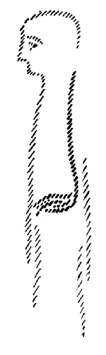
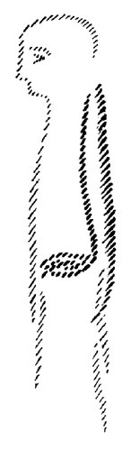
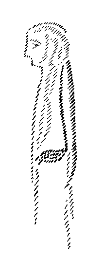

Die menschliche Natur ist kompliziert, und gar vieles geht in dem Menschen vor, das in seinem eigentlichen Geschehen mehr oder weniger unter der Schwelle des Bewußtseins bleibt, und von dem einzig Wirkungen heraufkommen in das Bewußtsein. Wirkliche Selbsterkenntnis kann man nicht gewinnen, ohne sich einen Einblick zu verschaffen in dieses Wirken der unterbewußten, unter der Oberfläche des Bewußtseins wirkenden Seelenimpulse, die, wie man vergleichsweise sagen könnte, im tiefen Meere des Bewußtseins vor sich gehen und nur in den von ihnen aufgeworfenen Wellenschlägen an die Oberfläche treten. Für das gewöhnliche Bewußtsein sind nur diese heraufkommenden Wellenschläge wahrnehmbar, und man weiß sie in sich selber zumeist nicht zu deuten, so daß eine wirkliche Selbsterkenntnis nicht möglich ist. Durch ein bloßes Nachsinnen über das, was so in das Bewußtsein heraufschlägt, ist eine Selbsterkenntnis nicht möglich; denn die Dinge sind oftmals ganz anders in den Tiefen der Seele, als sie oben im gewöhnlichen, im alltäglichen Bewußtsein sind. Nun wollen wir heute zunächst ein wenig hineinschauen in diese menschliche Natur, um uns wieder von einem gewissen Gesichtspunkte aus eine Vorstellung davon zu bilden,wie das Wirken der unterbewußten Seelenimpulse im menschlichen Wesen eigentlich ist. ^z4qeca

Natürlich kann man in solchen Dingen immer nur mehr oder weniger bildhaft vorgehen. Aber wenn Sie vieles zusammennehmen, was bis jetzt innerhalb unserer anthroposophischen Bewegung besprochen worden ist, so werden Sie verstehen, was für Realitäten in den Bildern sich aussprechen wollen. Wir können sagen: Die unsichtbare Natur des Menschen, sein Ich, sein astralischer Leib, sein Ätherleib, sie wirken durch seine sichtbare Natur, und Unoffenbares, könnte man auch sagen, wirkt durch das Offenbare. — Nun ist es allerdings sehr kompliziert, wie das Unoffenbare durch das Offenbare wirkt. Aber wenn man nach und nach die einzelnen Teile dieses komplizierten Prozesses studiert, so kommt man, indem man sie zusammenhält, zu einer Gesamtansicht vom Wesen des Menschen. Auch diese wird ja natürlich immer unvollständig bleiben, denn des Menschen Wesenheit ist unendlich verzweigt. Aber zu einer gewissen für eine Selbsterkenntnis tauglichen Grundlage des menschlichen Wesens kann man so doch kommen. ^m7566k

Nun wollen wir uns heute einmal vor Augen stellen, wie die einzelnen Glieder der menschlichen Natur sich in einer gewissen Weise mehr oder weniger bildhaft-schematisch durch das physische Leben zum Ausdruck bringen. Nehmen wir an, wir hätten hier den Menschen. Ich will nun, um die Sache zu veranschaulichen, ausgehen von dem, was wir als die uns für die Erdenmenschheit bewußt angehende Wesenheit des Menschen anerkennen: von dem Ich. Ich bemerke ausdrücklich: Bei bildhaften Darstellungen kann man sehr leicht zu Mißverständnissen kommen, indem man früher Gesagtes in scheinbarem Widerspruch findet mit später Gesagtem. Wer die Dinge genauer ansieht, wird schon bemerken, daß solche Widersprüche in Wahrheit nicht vorhanden sind. ^qqda7o

 ^o82tmn

Nehmen wir also zunächst an, wir hätten es zu tun mit der Ich-Natur des Menschen, mit jenem Gliede der menschlichen Wesenheit, das wir als Ich bezeichnen. Diese Ich-Natur ist selbstverständlich ganz übersinnlich; sie ist ja das Übersinnlichste, was wir zunächst haben, aber sie wirkt durch das Sinnliche. Dasjenige, wodurch das Ich sich hauptsächlich im intellektualistischen Sinne in der menschlichen physischen Natur auswirkt, ist das als das Gangliensystem bezeichnete Nervensystem, das Nervensystem, das vom Sonnengeflecht ausgeht. Schematisch können wir dieses Nervensystem, dieses Gangliensystem, dieses Sonnengeflechtsystem so (siehe Zeichnung, schwarz) andeuten. Das entfaltet eine Tätigkeit, die ja zunächst mit dem, was man im materialistischen Sinne Nervenleben nennen könnte, nichts besonderes zu tun zu haben scheint. Dennoch ist es der eigentliche Angriffspunkt für die wirkliche Ich-Tätigkeit. Daß der Mensch, wenn er beginnt, okkult sich selbst zu schauen, das Zentrum des Ich im Haupte zu empfinden hat, das widerspricht dem nicht, da wir es ja bei dem Ich-Gliede des Menschen zu tun haben mit etwas Übersinnlichem, und der Punkt, in dem der Mensch das Ich erlebt, ein anderer ist als der Angriffspunkt, durch den das Ich im Menschen vorzugsweise wirkt. ^aeeei9

Die Bedeutung des Wortes: Das Ich wirkt durch den Angriffspunkt des Sonnengeflechtes - muß man sich völlig klarmachen. Diese Bedeutung liegt in folgendem: Das Ich des Menschen selbst ist eigentlich mit einem sehr dumpfen Bewußtsein ausgestattet. Der Ich-Gedanke ist etwas anderes als das Ich. Der Ich-Gedanke ist gewissermaßen dasjenige, was als eine Welle heraufschlägt ins Bewußtsein, aber der IchGedanke ist nicht das wirkliche Ich. Das wirkliche Ich greift als bildsame Kraft durch das Sonnengeflecht in die ganze Organisation des Menschen ein. ^913ksz

Gewiß kann man sagen, das Ich verteilt sich über den ganzen Leib. Aber sein Hauptangriffspunkt, wo es besonders in die menschliche Bildsamkeit, in die menschliche Organisation eingreift, ist das Sonnengeflecht, oder besser gesagt, weil alle die Zweigungen dazugehören, das Gangliensystem, dieser im Unterbewußtsein lebende Nervenprozeß, der sich im Gangliensystem abspielt. Da das Gangliensystem die ganze Zirkulation des Blutes mitbedingt, so widerspricht das auch nicht der Tatsache, daß das Ich im Blute seinen Ausdruck hat. In diesen Dingen muß man das Gesagte eben ganz genau nehmen. Es ist etwas anderes, wenn gesagt wird: Das Ich greift durch das Gangliensystem in die Bildungskräfte und in die ganzen Lebensverhältnisse des Organismus ein, als wenn davon gesprochen wird, daß das Blut mit seiner Zirkulation der Ausdruck für das Ich im Menschen ist. Die menschliche Natur ist eben kompliziert. ^jt9ei0

Um nun die Bedeutung dessen, was da gesagt wird, voll vor die Seele zu rücken, ist es gut, sich die folgende Frage zu beantworten: Wie ist denn eigentlich das Verhältnis des Ich zu diesem Gangliensystem und allem, was damit zusammenhängt? Wie ist denn dieses Ich gewissermaßen in den Unterleibsorganen des Menschen verankert? Es ist so, daß, wenn der Mensch im normal-gesunden Zustande lebt, dieses Ich wie gefesselt ist im Sonnengeflechte und allem, was damit zusammenhängt. Es ist gebunden durch dieses Sonnengeflecht. Was heißt das? Dieses menschliche Ich, das dem Menschen im Verlaufe der Erdenevolution als eine Gabe der Geister der Form zugekommen ist, war ja, wie wir wissen, der luziferischen Versuchung ausgesetzt. So wie der Mensch dieses Ich hat, würde es eigentlich, da es infiziert ist von luziferischen Kräften, der Träger böser Kräfte sein. Das muß unbedingt wahrheitsgemäß erkannt werden. Nicht durch seine Natur ist das Ich der Träger böser Kräfte; aber dadurch, daß das Ich durch die luziferische Verführung mit luziferischen Kräften infiziert ist, ist es an sich der Träger von wirklich bösen Kräften, von Kräften, welche durch die luziferische Infektion geneigt sind, dasjenige, was das Gedankenleben des Ich bedeutet, ins Böse zu verzerren. Der Mensch kann, seit er ein Ich erhalten hat, denken. Wenn es keine luziferische Versuchung gegeben hätte, würde er über alle Dinge gut denken. Da es aber die luziferische Versuchung gegeben hat, denkt das Ich nicht gut, sondern luziferisch infiziert, so wie es nun einmal in der Erdenevolution ist: tückisch, heimtückisch. Es denkt so, daß es überall sich selbst ins Licht und alles andere in den Schatten stellen möchte. Es ist infiziert mit allen möglichen Egoismen. So ist das Ich nun einmal, da es luziferisch infiziert ist. Was nun als Gangliensystem, als Sonnengeflecht im Menschen lebt, ist schon von der Mondenentwickelung herübergekommen und stellt gewissermaßen das Haus für das Ich dar; da paßt das Ich in einer gewissen Weise hinein. Es kann daher darin gebunden, gefesselt werden. Und so liegt folgende Tatsache vor: Das Ich hat durch seine luziferische Infektion fortwährend die Tendenz, sich tückisch, lügenhaft zu gebärden, sich selbst ins Licht, das andere in den Schatten zu stellen; aber es wird gefesselt durch das Nervensystem des Unterleibes. Da muß es parieren. Durch das Nervensystem des Unterleibes zwingen die regelrecht fortschreitenden Mächte, die durch Saturn-, Sonnen- und Mondenentwickelung heraufgekommen sind, das Ich, nicht ein Dämon im bösen Sinne des Wortes zu sein. So daß wir also unser Ich so in uns tragen, daß es gefesselt ist an die Unterleibsorgane. ^niedd2

Nun denken Sie einmal, daß die Unterleibsorgane in irgendeiner Weise ungesund wären, daß sie nicht im normalen Zustande wären. Nicht im normalen Zustande sein, heißt, nicht voll in sich aufnehmen wollen dasjenige, was geistig in sie hineinpaßt, was geistig zu ihnen gehört. Das Ich kann in einer gewissen Weise frei werden in seiner Tätigkeit, wenn die Unterleibsorgane nicht ganz gesund sind. Dann kann, wenn dieses Freiwerden durch eine besondere physische Übertätigkeit herbeigeführt wird, die menschliche Natur sich so äußern, daß das Ich gewissermaßen losgelassen wird auf die äußere Welt, während es sonst gefesselt ist. Und wir haben, wenn das Ich sich dann frei benimmt, einen Fall, wo der Mensch psychisch krank auftritt, indem er die Eigenschaften des luziferisch infizierten Ich entfaltet: dann kommen sie heraus, die Eigenschaften des Ich, von denen ich gesprochen habe. Man braucht wahrhaftig deshalb nicht Materialist zu werden, weil man die Gebundenheit des Geistigen, also hier des Ich, an die physischen Organe in dem Leben zwischen Geburt und Tod — aber in einem höheren Sinne, als der Materialist es sich vorstellt - voll einsieht, und wenn man auch einsieht, daß gewissermaßen der Teufel los werden kann, seiner Fesseln ledig werden kann. Da haben wir den einen Fall von psychischer Ungesundheit. ^3jnyyd

Es muß nicht unbedingt psychische Ungesundheit sein, wenn die Freiheit des Ich eintritt, sondern es kann auch anderes der Fall sein. Dann handelt es sich aber nicht um eine wirkliche Erkrankung des Unterleibes, sondern gewissermaßen um eine Ausschaltung seiner regulären Tätigkeit. Das ist bei weitaus den meisten Fällen des Somnambulismus der Fall. Da wird das Gangliensystem mit seiner Funktion im Unterleibe so präpariert, sei es durch die Natur selber, sei es durch allerlei Einflüsse magnetischer Art, daß es das Ich nicht voll in seiner Gewalt halten kann. Dann kommt das Ich dazu, in freierer Weise mit der Umgebung zu korrespondieren. Es ist dann nicht eingelagert in das Gangliensystem und kann daher jene Verbindungskanäle mit der Welt benützen, die es ihm möglich machen, im Raume und in der Zeit allerlei von ferne zu sehen, was normalerweise in das Ich, in das Gangliensystem eingebettet ist, wodurch diese Prozesse nicht wahrgenommen werden können. Es ist also wichtig zu wissen: Es besteht eine gewisse Verwandtschaft zwischen dem Somnambulismus, der nur eben, ich möchte sagen, in einer milden Form die gewöhnliche Tätigkeit der wachend an das Gangliensystem gebundenen Prozesse ausschaltet, und gewissen Formen des Wahnsinnes, der hervorgerufen wird, wenn die Ausschaltung durch Deformierung, durch Erkrankung gewisser Organe des Unterleibes stattfindet. Es ist also immer eine solche krankhafte Anwandlung damit verbunden, daß das Ich gewissermaßen frei wird, sich sozusagen seiner Fesseln ledig fühlt und sich verbunden fühlt nun nicht mit seinem Leibe, sondern mit den geistigen Kräften seiner Umgebung, wie es auch im Wahnsinn der Fall ist. Deshalb aber treten bei gewissen Formen des Wahnsinns gerade die Eigenschaften der Tücke, der Lügenhaftigkeit, der Verschmitztheit, der Listigkeit auf, alles, was von luziferischen Infektionen kommt — das Bedürfnis, sich selbst ins Licht und alles andere in den Schatten zu stellen und dergleichen. ^s1i65e

Nun werden Sie begreifen, daß von der ganzen Beschaffenheit des Gehäuses, durch welches das Ich gefesselt ist, die psychische Konstitution abhängt. Vergleichen wir, um nicht auf den Menschen gleich zu exemplifizieren und um weniger beleidigend für das menschliche Gemüt zu sein, einmal den Löwen als einen wütenden Fleischfresser mit dem Stier oder dem Ochsen. Da ist ein Unterschied, obwohl es sich ja bei dem Löwen um ein Gruppen-Ich handelt und beim Menschen um ein individuelles Ich; aber wir können doch den Vergleich brauchen. Welches ist der Unterschied zwischen der Löwennatur und der Ochsennatur? Der Löwe ist ausgesprochen Fleischfresser, der Ochse im wesentlichen, wie Sie wissen, Vegetarier. Nun, der Unterschied ist der, daß beim Löwen dasjenige, was bei ihm dem Gruppen-Ich entspricht, weniger gefesselt ist, daß gewissermaßen durch die vehemente Tätigkeit dessen, was den Unterleibsorganen entspricht, das Gruppen-Ich freier ist, mehr losgelassen ist auf die Umgebung, während bei dem vegetarischen Ochsen das Gruppen-Ich mehr an die Unterleibsorgane gefesselt ist. Der Ochse lebt daher mehr in sich. ^8jeqsg

Sie sehen jetzt auch, daß es einen guten Sinn hat für den Menschen, Vegetarier zu werden - selbstverständlich nur, wenn er will. Denn was wird dadurch bewirkt? Gerade durch die vegetarische Ernährung wird der Unterleib noch geeigneter gemacht, das Ich zu fesseln, und der Mensch wird dadurch, wenn ich mich paradox ausdrücken soll, etwas sanfter. Sein böser Dämon geht mehr in ihn selbst hinein und lebt sich weniger gegenüber der Umgebung aus. Nur soll sich niemand einreden, daß er diesen bösen Dämon deshalb nicht hat. Er hat ihn, nur eingesperrt in sein Inneres. Und ein Kreuzexperiment, ein Experimentum crucis, könnte sehr leicht gemacht werden, indem man einmal vergleicht, wie sich in einem gegebenen Falle hungrige Fleischesser und hungrige Vegetarier verhalten. Man wird, wenn man hungrig ist, im allgemeinen etwas mehr den Gefesselten loslassen; und es könnte sehr leicht sein, daß gerade hungrige Vegetarier, weil sie sich gewöhnt haben, den Gefesselten durch die vegetarische Ernährung besonders gefesselt zu haben, ihn dann mit einer gewissen Wütigkeit loslassen. Denn der Hunger besteht darin, daß die Unterleibsorgane ihre Tätigkeit verändern und dadurch nicht in demselben Maße das Ich fesseln können wie im gesättigten Zustand. Ich will damit nicht behaupten, daß das, was ich sagte, absolut gilt, weil ja beim Fleischessenden schon an sich der Gefesselte nicht so stark gefesselt ist wie beim Vegetarier; aber ich sagte: vergleichsweise wird der hungrige Vegetarier im Verhältnis zu seinem gesättigten Zustande unter Umständen ein viel wütigeres Wesen haben können als der hungrige Fleischesser im Verhältnis zu seinem gesättigten Zustande. Die menschliche Natur ist eben sehr kompliziert, und gerade wenn man das Verhältnis des Geistigen zum Leiblichen ins Auge faßt, dann kommt man zu gewissen Erkenntnissen, die Grundlagen sein können für eine wahre, reale Selbsterkenntnis im Leben. Jedenfalls muß gesagt werden, daß der Vegetarier dafür sorgen sollte, sich nicht zu stark unterernährt zu machen. Denn wenn er sich unterernährt, so wird er sich dadurch schädigen, daß er seinen Fesseler, das Gefängnis für seinen Teufel, für den, der mit Tücke, Lüge und so weiter auftritt, schwächt, und er wird dann entweder den Ungefesselten auf die Umgebung loslassen, und die Umgebung wird ihr, im österreichischen sagt man «G’frett», ihre Mühe mit ihm haben, oder aber er wird mit sich selber Mühe haben, mit sich nicht fertig werden, weil er einerseits immerfort die Sucht hat, die verschiedenen schlechten Eigenschaften des Ich auszuleben, andererseits aber,wenn er erzogen ist, den Drang, das bei sich zu behalten, und so kann es kommen, daß er vielleicht mit sich selber nicht fertig wird. Dadurch entstehen alle möglichen unbefriedigten Zustände der Seele. Das ist wichtig, daß man das ins Auge faßt. ^fa8nc7

 ^l7p5e9

Geradeso wie das Ich seinen Angriffspunkt hat im Gangliensystem, so hat der astralische Leib seinen Angriffspunkt in all den Prozessen, die mit dem Rückenmarksnervensystem zusammenhängen. Natürlich gehen die Nerven durch die ganze Körperlichkeit; aber wir haben hier einen zweiten Angriffspunkt. Dazu gehören natürlich wieder alle Prozesse, welche mit diesem Nervensystem zusammenhängen. Das ist noch nicht das Gehirnnervensystem, sondern das Rückenmarkssystem, das zum Beispiel mit unseren Reflexbewegungen zusammenhängt, und das ein Regulator ist für sehr vieles im menschlichen Leib. Und wenn man so spricht, wie ich jetzt spreche, so muß man immer im Auge behalten, daß alle Prozesse, die durch dieses Nervensystem geregelt werden, dazu gehören. Nun kann die Sache wiederum nur so aufgefaßt werden, daß der astralische Leib entweder gefesselt ist an alles, was mit dem Rückenmarkssystem zusammenhängt, oder daß er durch Erkrankung oder teilweise Einschläferung der Prozesse — durch Magnetismus oder dergleichen — frei werden kann. Da haben Sie einen andern Gefesselten, der seine luziferischen Eigenschaften, die ein wenig gemischt sind mit ahrimanischen Eigenschaften, schon während der alten Mondenzeit erhalten hat. Sie sind daher schwächer als die luziferischen Eigenschaften des Ich, aber auch im astralischen Leib sind luziferische Eigenschaften enthalten. Wenn Sie den Prozeß, durch den sich diese luziferische Infektion in den astralischen Leib hineingeschlichen hat, vor ihre Seele rücken wollen, dann müssen Sie studieren, was in meiner «Geheimwissenschaft im Umriß» geschildert ist als Abtrennen des Mondes von der ganzen Evolution. Während der Mondenentwickelung ist diese Infektion hineingekommen. Da haben Sie noch einen Grund, durch welchen der Mensch zu somnambulen Eigenschaften kommt, zu höheren somnambulen Eigenschaften, die vorzugsweise an die Brustorgane gebunden sind, und die schon Höheres vermitteln als die Unterleibsorgane; aber Sie haben zu gleicher Zeit die Möglichkeit, einzusehen, daß wenn da etwas nicht in Ordnung ist, so daß der astralische Leib nicht gefesselt gehalten werden kann, wiederum etwas eintritt, was als psychische Erkrankung, als psychische Störung anzusehen ist. Es kann also sowohl das Ich entfesselt werden und zu Wahnsinnserscheinungen führen wie auch der astralische Leib, was ebenfalls Wahnsinnserscheinungen hervorruft. ^eroi5y

Wenn das Ich entfesselt wird, so entwickelt es, wie ich Ihnen gesagt habe, Eigenschaften wie Heimtücke, Verschmitztheit, Listigkeit, Übervorteilung,Sich-ins-Licht-Stellen, Alles-andere-in-den-Schatten-Stellen und so weiter. Wenn der astralische Leib entfesselt wird, so entwickelt er Ideenflüchtigkeit, diskontinuierliche Logik, manieartige Zustände oder aber Weltflüchtigkeit, Melancholie, Hypochondrie. Und wiederum besteht eine Verwandtschaft solcher krankhafter Erscheinungen mit den entsprechenden somnambulen Erscheinungen. Nur daß beim Somnambulen die Organe nicht krank, sondern nur in ihren normalen physischen Funktionen unterdrückt sind, was erreicht werden kann durch den Einfluß von Hypnotiseuren, Magnetiseuren und dergleichen. ^zv3jcx

In unserer menschlichen Natur muß vieles gefesselt sein. Wir sind schon in einer gewissen Weise des Teufels, und nur dadurch, daß wir durch die Anordnungen der regulär durch Saturn-, Sonnen- und Mondenentwickelung sich fortentfaltenden göttlich-geistigen Mächte die Teufel in uns gefesselt haben, nur dadurch sind wir halbwegs anständige Menschen, wozu wir infolge der verschiedenen Versuchungen gar nicht einmal eine so große Anlage haben. Und gewisse Verstimmungen, gewisse Stimmungen auch des seelischen Lebens hängen damit zusammen, daß der Mensch auf das kommt, was an Dämonischem in ihm lebt. All dies Dämonische beruht darauf, daß das, was in ihm gefesselt ist, entfesselt werden kann. Wir werden bei einer andern Gelegenheit noch darüber zu sprechen haben, wodurch dieses, was während des Lebens zwischen Geburt und Tod eigentlich durch unsere physische Natur gefesselt ist, dann zwischen dem Tod und einer neuen Geburt gefesselt ist. Denn Sie können ja wohl einsehen, daß wir der Weltenordnung sehr dankbar sein dürfen, hier zwischen Geburt und Tod unseren physischen Organismus zu besitzen; denn sonst hätten wir diesen für unsere höheren Glieder notwendigen Kerker nicht. -— Wenn dann die höheren Glieder nach Ablegen des physischen Leibes losgelassen sind, so treten andere Verhältnisse ein, die wir bei andern Gelegenheiten besprechen werden. Ungefesselt sind sie dann auch nicht. ^5tbdao

Nun, ebenso wie der astralische Leib auf diese Weise durch das Rückenmarkssystem und alle Prozesse im organischen Leben, die damit zusammenhängen, gefesselt ist, so ist der ätherische Leib durch das Gehirnsystem mit allem, was dazu gehört, gefesselt. Der ätherische Leib hat seinen Angriffspunkt also durch das Gehirnsystem. Und auch da könnte wiederum Ähnliches gesagt werden. In unserem Haupte ist der Kerker für unseren ätherischen Leib. Wahnsinns- oder somnambule Zustände treten ein, wenn der Körper nicht ganz in Ordnung ist und der ätherische Leib entfesselt wird. Der ätherische Leib hat nun vorzugsweise die Neigung, wenn er sich selbst überlassen, also nicht in den Kerker des Hauptes eingeschlossen ist, sich zu vervielfältigen, dadurch sich selbst fremd zu werden, gewissermaßen überzugehen in die Welt, in anderes sich hineinzuleben. Damit sind jene Zustände gekennzeichnet, die eintreten, wenn der Kerkermeister den ätherischen Leib losläßt. ^r4fs47

 ^du5hwf

Sie haben also damit die dreifache Möglichkeit psychischer Erkrankung, die dreifache Möglichkeit auch, loszukommen vom physischen Leibe. Diese dreifache Möglichkeit muß durchaus zu Rate gezogen werden - aber dann in einer ganz andern Weise -, wenn der Mensch durch die Initiation von seinem physischen Leibe frei werden soll. Das, wovon wir gesprochen haben, ist ein krankhaftes Freiwerden in der Weise, daß die Organe des physischen Leibes nicht gesund bleiben und dadurch der physische Leib nicht imstande ist, die höheren Glieder zu halten. Der Gehirnsomnambulismus würde nur ein Einschläfern der Gehirntätigkeit zur Voraussetzung haben; dadurch wird der Ätherleib frei und es entstehen somnambule Zustände. Bei Defekten des Gehirns aber kann der Kerker den Gefesselten, das heißt den Ätherleib nicht mehr halten, dann geht dieser auf eigene Abenteuer aus und versucht im Aufgehen in der Welt sein ungeordnetes, wirres Leben auszuleben und auszugestalten. Sie sehen klar, daß die psychische Erkrankung im wesentlichen doch ihre Grundlage hat in einer Art Freiwerden von denjenigen physischen Grundlagen, zu denen die betreffenden höheren Glieder des Menschen in dem Leben zwischen Geburt und Tod gehören. ^hfpo5i

Der Ätherleib hat, wenn er befreit wird, vorzugsweise ahrimanische Eigenschaften. Es werden sich in diesem Falle Neid, Mißgunst, Geiz und dergleichen mehr in krankhafter Weise gesteigert ausleben; aber das alles im Zusammenhange mit einer Art Sich-Ausleben in der Umgebung, mit einem Aufgehen in der Umgebung. Dieses ist nun aber durchaus so zu verstehen, daß zwar das Ich mehr oder weniger seinen alleinigen Anziehungspunkt hat im Gangliensystem und dem, was damit zusammenhängt, der astralische Leib im Rückenmarkssystem, aber mit dem Gangliensystem zusammen, der Ätherleib im Gehirnsystem, aber mit dem Rückenmarkssystem und dem Gangliensystem zusammen. Insofern hat zum Beispiel das Gangliensystem, weil es ja alles Unterbewußt-Organische versorgt, auch mit dem Gehirn zu tun. Wenn das Gangliensystem einen Krankheitsprozeß bewirkt, der sich im Gehirn auslebt, dann kann allerdings auch gerade der Ätherleib frei werden. Aber die Ursache liegt trotzdem im Gangliensystem. Die Dinge sind eben durchaus kompliziert. ^8x4mh3

Die heutige Psychiatrie hat noch gar keine Handhabe, diese drei Formen der Seelenerkrankung voneinander zu sondern. Erst dann wird die Psychiatrie zu einiger Vollkommenheit gelangen können, wenn man unterscheiden wird psychische Abnormitäten, die herbeigeführt werden dadurch, daß entweder der gefesselte Ätherleib oder der gefesselte Astralleib oder das gefesselte Ich losgelassen wird. In einer ganz bedeutsamen Weise wird man dann die Symptome der psychischen Abnormitäten unterscheiden und ordnen können, und es wird wichtig sein, sie dergestalt ordnen zu können. ^25o85b

Sie sehen daraus auch, wie Selbsterkenntnis nur gestützt werden kann auf ein durchdringendes Betrachten der komplizierten Natur der menschlichen Wesenheit. Erkenntnis kann schon auch ihre unangenehmen Seiten haben. Aber die Erkenntnis soll kein Spielzeug sein, die Erkenntnis ist die ernsthafteste Angelegenheit des menschlichen Lebens. Und derjenige, der alle die Dinge weiß, um die es sich bei der menschlichen Natur handelt und nur ein wenig den Willen hat, diese Dinge nicht im egoistischen Sinne zu nehmen, sondern sie objektiv zu denken und zu empfinden, der hat in der Erkenntnis zugleich ein wichtiges Heilungsmoment. Gewiß, man kann schwächer sein als das Heilungsmoment; aber man hat in der Erkenntnis ein wichtiges Heilungsmoment. Man hat es nur dann nicht, wenn man ganz in seiner subjektiven Natur steckenbleiben, wenn man aus ihr nicht herauskommen will. ^5pryxu

Das ist die große Schwierigkeit solcher Bewegungen wie der unsrigen, daß es auf der einen Seite notwendig ist, in ernster Weise nach den höchsten Erkenntnissen zu streben, und daß andererseits nicht jeder, der sich zu einer solchen Bewegung dazuschlägt, auch geneigt ist, ganz objektiv solche Erkenntnisse aufzufassen, sie in vollem Sinne ernst zu nehmen. Denn gerade dadurch wirken sie gesundend auf das Persönliche, daß man nicht bei jeder Gelegenheit auf seine Persönlichkeit reflektiert, daß man nicht immer nur nachdenkt darüber: was fühle ich, was empfinde ich, wie geht es mir in der Welt, was lebt da in meiner Seele und so weiter, sondern daß man von sich loskommt und über die allgemein-menschlichen Angelegenheiten, die jeden Menschen berühren, seine Betrachtungen anstellt. Eine Schwierigkeit tritt nur dann ein, wenn man sich eben nur auf sich beschränken will, wenn man nicht von sich loskommt. Je mehr man in der Lage ist, von sich abzusehen und das Allgemein-Weltliche, das Allgemein-Menschliche zu verstehen sucht, desto mehr hat man auch ein Heilmittel an der Erkenntnis. Man möchte so gerne, daß einem gerade dies geglaubt würde. Sie werden eine gute Gelegenheit haben, den entgegengesetzten Pol von dem, was ich gesagt habe, gerade in einer solchen Bewegung, wie die unsrige ist, zu beobachten. Es ist ganz natürlich und auch gerechtfertigt, daß Menschen, die nicht leicht von sich loskommen, auch Trost und Hoffnung und Zuversicht in unserer Bewegung suchen. Aber wenn sie nicht das ehrliche Bestreben haben, von sich loszukommen, wenn sie sich immer beschäftigen mit ihrem eigenen Kopf, mit ihrem eigenen Herzen - von anderem gar nicht zu reden, womit sich aber reichlich viele Menschen in unserer Bewegung beschäftigen -, dann kann die Erkenntnis für sie nicht das sein, was sie in Wirklichkeit ist. Man kann sich für Erkenntnis so interessieren, daß sie einem nicht nur eine persönliche, sondern eine allgemein-menschliche Angelegenheit ist. Je mehr Persönliches mitspielt, desto mehr kommt man ab von demjenigen, was gerade an der Erkenntnis der tieferen Gründe der Welt das Heilsame ist. Nun muß man sich gerade von den Gesichtspunkten aus, die da gewonnen worden sind, klar sein darüber, wie gewisse Impulse in der menschlichen Natur verbunden sind mit dem Freiwerden des Psychischen, des Geistigen, sei es im Somnambulisrnus, sei es im Wahnsinn. — Denn es ist immer ein Freiwerden verbunden mit einem Aufgehen im Geistigen. Das aber ist verbunden mit einer gewissen Wollüstigkeit, mit einer richtigen Wollüstigkeit, direkt und indirekt. Denn das Freigewordene, sei es ätherischer, astralischer Leib oder Ich, ergießt sich gewissermaßen in die geistige Welt hinein. Und dieses Ergießen ist durchaus mit inneren Beseligungsgefühlen verbunden. Gerade der psychisch Abnorme fühlt gewisse Befriedigungen in seiner abnormen Seelentätigkeit und verläßt sie daher so ungern. Und man kann die Erfahrung machen, die durch alle Zeiten gerade von solchen Leuten gemacht worden ist, die sich bemüht haben, psychisch Abnorme zu heilen: Wenn diese von einsichtigen Ärzten behandelt wurden, dann kam es sehr häufig vor, daß, wenn die Heilung heranrückte, die Kranken nicht mehr dieses Freisein und Aufgehen in der geistigen Umgebung verspürten, eine gewisse Wollüstigkeit und Beseligung ging ihnen verloren, und sie fingen an, denjenigen zu hassen, der ihnen die Wollust nahm. Während man bei anderr, nicht psychisch Kranken, doch die Erfahrung machen kann, daß dem heilenden Arzt Dankbarkeit entgegengebracht wird, ist bei den Bemühungen, die auf psychisch Kranke verwendet werden, das Gegenteil der Fall. Das ist eine Erfahrung, die Sie in der Literatur verzeichnet finden, denn die Ärzte haben es immer wiederum festgestellt, daß, wenn Heilung eintritt, oder nur der Versuch gemacht wird, den Zustand zu überwinden, daß dann die Wollust zurückgeht und die Leute beginnen, gerade den Heiler widerwärtig zu finden: Er nimmt ihnen dasjenige, was sie eigentlich gern haben, was auch im Unterbewußten gern gehabt wird, während man es sich im Oberbewußten ausredet. ^aqsmii

Sie sehen da in tiefe Geheimnisse der waltenden Menschenseelennatur hinein, wenn Sie diese Dinge ins Auge fassen. Auf der andern Seite werden Sie aber begreifen, daß wenn das Ich oder der Ätherleib oder der Astralleib zunächst sich bemüht haben, mit Hilfe ihrer physischen Werkzeuge zu arbeiten, und wenn sie dann frei werden und noch stark sind, noch die Formeindrücke haben, die sie im Physischen hatten, daß sie dann gewisse Kräfte leichter entfalten können, als sie in den kranken Organen entfaltet werden können. Daher solche Kranke, welche periodisch — denn es gibt zyklische, periodisch abnorme Zustände der Seele — aus ihrem Organismus herauskommen, sehr häufig verspüren, daß sie Fähigkeiten haben, die sie sonst nicht haben. Das bewirkt wiederum eine große Befriedigung, und wenn sie dann in den physischen Leib zurückgehen und ihnen ein gewisses Bewußtsein bleibt von dem, was mit ihnen geschehen ist, dann können sie über diese Dinge sogar ein sehr klares Selbstbewußtsein haben. In der ersten Hälfte des 19. Jahrhunderts hatte ein berühmter Arzt, Willis, einen Wahnsinnigen geheilt, das heißt ihn dazu gebracht, daß er wiederum vernünftig über sich denken konnte. Und dieser geheilte Wahnsinnige, der intelligent war, schrieb folgendes auf wie eine Rückschau auf seinen Wahnsinnszustand. Sie werden jetzt das, was dieser intellektuelle Wahnsinnige aufschrieb, gut verstehen, wenn Sie das von mir Gesagte berücksichtigen. Es ist ein Wahnsinniger mit einer Erkrankung, bei der gewissermaßen alle drei höheren Glieder entfesselt wurden. Der Kranke schreibt: «Ich erwartete meine Anfälle mit Ungeduld.... Seligkeit» -, also denken Sie, dieses Herausgehen aus dem Leibe erwartet er mit Ungeduld, weil er wußte, da genießt er eine gewisse Seligkeit. ^d2023t

Derjenige, der die Dinge durchschaut, weiß, daß er sonst an Obstipationen des Unterleibes gelitten haben muß und daß dadurch sein Gedächtnis getrübt gewesen ist. In dem Augenblicke, wo sein Ich losgerissen war, war sein Gedächtnis intakt. ^ye6dfm

Sie sehen, der Mann beschrieb sich sehr genau, und man kann verstehen, daß er in einer gewissen Weise den abnormen Zustand herbeizuführen versuchte. Man kann es ja nicht willkürlich, aber er war froh, wenn der Zustand kam, denn er befand sich sehr wollüstig darin. ^ksksj5

Das ist überhaupt die Schwierigkeit gegenüber psychisch Abnormen, daß man sie durch die Behandlung subjektiv nicht zu einer glücklichen, sondern zu einer für sie unglücklichen Stimmung führen muß, und daß sie daher darüber in Wirklichkeit betrübt sind. Im Oberbewußtsein ist das natürlich anders, aber in Wirklichkeit, im Unterbewußtsein sind sie betrübt darüber, wenn sie geheilt werden. Selbstverständlich kommen sie zum Arzt und sagen, sie wollen geheilt werden; aber im Unterbewußten wollen sie in Wirklichkeit nicht geheilt werden. Das ist die Schwierigkeit. Der Entfesselte oder die Entfesselten wehren sich mit aller Macht dagegen, herausgerissen zu werden aus der Seligkeit, in die sie verpflanzt sind bei ihrer Entfesselung. Sie sehen, auf diesem Wege wird man dem gerecht, was materielle Grundlage unseres physischen Daseins ist; aber man wird kein Materialist. ^f1xy97

Nehmen Sie zum Beispiel an, jemand sei in einem höheren Grade, als man es ihm im äußeren Leben ansieht, dumm; solche Menschen gibt es. Nun, Dummheit ist ja nur eine Stufe auf dem Wege zu einer gewissen Seelenabnormität, nämlich dem Blödsinn. Das kann damit zusammenhängen, daß der sonst gefesselte Ätherleib frei ist, weil gewissermaßen das Gehirn zu kompakt ist, nicht labil genug arbeitet. Nehmen wir an, ein solcher Mensch schieße sich eine Kugel in den Kopf, die ihn aber nicht tödlich trifft. Unter Umständen kann nun für den, der die Dinge durchschaut, das ganz nützlich erscheinen, sofern es ihm sonst nichts geschadet hat; denn vielleicht wird er durch die nun eingetretene Lockerung seines kompakten Gehirns gescheit. Solche Fälle sind durchaus vorgekommen, daß durch Kopfverwundungen die Leute aufgeweckt worden sind gegenüber ihrem früheren Zustand. ^q3rrm0

Es gibt wirklich im Bereich des physisch Wahrnehmbaren nichts, was so kompliziert ist wie die menschliche Natur; sie ist das Allerkomplizierteste, was sich überhaupt in der Welt findet. Man muß den Menschen aber wirklich so, wie ich es jetzt auseinandergesetzt habe, betrachten, wenn man ihn in seiner Ganzheit betrachten will. Denn wir haben jetzt gesehen, daß, so wie der Mensch mit seinem Haupte vor uns steht, die Hauptestätigkeit in einer gewissen Beziehung darauf beruht, daß der Ätherleib in richtiger Weise gerade ins Haupt eingeschaltet ist. Die abnorme Tätigkeit entsteht, wenn der Ätherleib frei wird, wenn er entfesselt wird. Dadurch, daß der Mensch überhaupt normal organisiert ist, seine Sinnesorgane, seine Gehirnnerven hat, kann der Ätherleib normale Beziehungen haben zu der gewöhnlichen Umgebung. Was der Mensch durch seine besondere Verbindung von Ätherleib und Haupt ist, das ist er als Mensch im allgemeinen, wie er zwischen Geburt und Tod in der physischen Welt vorhanden ist. Würden wir nichts anderes an uns tragen als die normale Einschaltung des Ätherleibes in das Haupt, so würden alle Menschen gleich sein, auch würde der Mensch keinen Zusammenhang empfinden können mit demjenigen Teil seines Wesens, der unsterblich ist; denn das Haupt vermittelt uns die Erlebnisse und Erfahrungen, die wir in dem Leben zwischen Geburt und Tod durch die Sinne, durch die Gehirnnerven machen können. ^riqjx4

Betrachten Sie das nun im Zusammenhange mit dem, was ich über den Verlust des Hauptes im Verlaufe der Reinkarnation gesagt habe: Was jetzt Haupt ist, war in der früheren Inkarnation Leib, was jetzt Leib ist, wird Haupt in der nächsten Inkarnation. Aber der Mensch weiß von seinem Zusammenhange mit seinem Unsterblichen, das durch Geburten und Tode geht, wenn dieses Wissen ohne geisteswissenschaftliche Erkenntnis auch nur Glauben ist. Verstehen kann er diesen Zusammenhang durch das Haupt, aber haben kann er dieses Wissen nur dadurch, daß er sein Rückenmarksnervensystem als Organ des astralischen Leibes hat. Da werden jene Vorstellungen und Empfindungen bewirkt, die den Menschen mit seinem Unsterblichen, mit seinem Überpersönlichen in ein gegenseitiges Verhältnis bringen. Alles das, was wir nur für das Leben zwischen Geburt und Tod haben, haben wir dadurch, daß wir in unserem Organismus erdiges Element, Festes haben. Ich habe bei anderer Gelegenheit erwähnt, daß wir nicht gar so viel Festes in uns haben, daß wir zu fünfundneunzig Prozent eine Flüssigkeitssäule sind. Das Feste in uns ist außerordentlich wenig - nur fünf Prozent sind eingegliedert —, der Mensch ist eine Wassersäule. Aber Träger der gewöhnlichen Gedanken für das physische Leben kann nur dieses Feste sein, und nur insofern wir von dem Flüssigen und seiner Pulsation durchsetzt sind, wissen wir von unserem Überpersönlichen. Und dieses Flüssige und seine Pulsation steht wiederum im Zusammenhang mit dem Rückenmarkssystem, welches das Flüssige und die Pulsation vorzugsweise regelt. Wie das alles zusammenhängt mit gewissen Dingen, die ich schon früher ausgeführt habe, mit dem Auf-und-ab-Pulsieren der Flüssigkeit zwischen Unterleib und Gehirn, das will ich, weil es uns heute zu weit von unserem eigentlichen Thema ablenken würde, dann morgen ausführen. Der Mensch wird aber dadurch, daß er das Flüssigkeitselement in sich hat, nicht nur in Zusammenhang gebracht mit seinem Überpersönlichen, sondern er wird dadurch auch gewissermaßen in seiner Persönlichkeit spezifiziert. Wenn wir nur Kopfmenschen wären, würden wir alle dasselbe denken, dasselbe empfinden. Dadurch, daß wir Herzensmenschen sind, daß wir das flüssige Element, das Blut und andere Säfte in uns haben, sind wir in einer gewissen Weise schon spezifiziert; denn dadurch hat die Hierarchie der Angeloi an unserem Wesen Anteil. Die Hierarchie der Angeloi kann in uns eingreifen auf dem Umwege durch das flüssige Element. ^z9e602

Eine dritte Möglichkeit, in unser Wesen einzugreifen, ist dadurch herbeigeführt, daß bei normalem Zusammenwirken der höheren Glieder mit dem Gangliensystem die Möglichkeit vorhanden ist, daß das Luftförmige und alles damit Zusammenhängende auf uns wirkt. Dies geschieht durch den Atmungsprozeß. Aber dieser ist sehr kompliziert. Es ist nicht einerlei, ob wir da oder dort atmen, ob die Atmungsluft viel oder wenig Sauerstoff, ob sie viel oder wenig Feuchtigkeit, viel oder wenig Sonnenwärme enthält und dergleichen. Dadurch, daß wir diese Möglichkeit in uns tragen, daß auf dem Umwege des luftförmigen Elementes auf uns gewirkt wird, dadurch hat die Hierarchie der Archangeloi, der Erzengel, die Möglichkeit, auf uns zu wirken. Alles was in unser Wesen hereinwirkt von der Hierarchie der Erzengel, seien es normal fortgeschrittene oder zurückgebliebene, wirkt auf dem Umwege durch unser Gangliensystem. Und auf diesem Umwege wirkt auch, was von den sogenannten Volksgeistern ausgeht, die ja auch zu der Hierarchie der Archangeloi gehören. Was von den Volksgeistern ausgehend auf die Menschen wirkt, das wirkt auf die Organe, die mit dem Gangliensystem in Zusammenhang stehen. Daher ist das Volkstum etwas dem Bewußtsein so Entzogenes, etwas so dämonisch Wirkendes. Und es hängt aus den Gründen, die ich angedeutet habe, deshalb so stark zusammen mit all dem, was die Örtlichkeit ist; denn viel mehr als man glaubt, ist die Ortlichkeit, das Klima, verknüpft mit dem Wirken der Hierarchie der Archangeloi. Klima ist ja nichts anderes als dasjenige, was auf dem Umwege der Luft auf den Menschen wirkt. ^68elji

Sie sehen, wie man, indem man auf das Gangliensystem verweist, zeigt, wie im Unbewußten des Menschen die Impulse der Volksseelenhaftigkeit walten. Jetzt werden Sie auch begreifen, daß mehr, als man gewöhnlich denkt, gerade die Zugehörigkeit zum Volkstum mit gewissen Eigenschaften des Menschen zusammenhängt, die an sein Gangliensystem gebunden sind. Mehr als man glaubt, ist nämlich das Problem des Volkstums in Beziehung zu setzen mit dem sexuellen Problem. Denn die Zugehörigkeit zum Volkstum beruht auf der gleichen Organgrundlage - dem Gangliensystem -, dem auch das Sexuelle zugrunde liegt. Das ist ja äußerlich schon dadurch zu verstehen, daß man seinem Volkstum durch die Geburt angehört, insoferne als man in der Mutter eines bestimmten Volkes gereift wird; insoferne ist ja schon die Vermittlung da. Da sehen Sie, durch welche, ich möchte sagen, seelenunterirdischen Untergründe gerade das Nationalproblem schon mit dem Sexualproblem zusammenhängt. Und daher ist in der Erscheinung so viel Verwandtes zwischen diesen beiden Impulsen im Leben. Wer nur offene Augen für das Leben hat, der wird ungeheuer viel Verwandtes finden zwischen der Art und Weise, wie sich der Mensch betätigt aus dem Erotischen heraus, und wie er sich betätigt in seiner Zugehörigkeit zum Volkstume. Es ist natürlich damit weder pro noch kontra in bezug auf das eine oder andere etwas gesagt; aber. die Tatsachen liegen so, wie ich das charakterisiert habe. Die Erregungen nationaler Art, die insbesondere stark unbewußt wirken, wenn sie nicht ins Ich-Bewußtsein heraufgeholt werden, indem man die Frage zu einer Karmafrage macht, so wie ich das neulich charakterisiert habe, sind sehr verwandt den sexuellen Erregungen. Man darf über solche Dinge nicht dadurch hinweggehen, daß man aus gewissen Täuschungen und Sehnsuchten heraus eine emotionelle Art des Nationalempfindens zu einer recht vornehmen Empfindung machen möchte, und die Sexualempfindung zu einer recht wenig vornehmen; denn die Tatsachen liegen schon so, wie ich es Ihnen entwickelt habe. ^pw3y39

Daraus aber werden Sie jetzt auch ersehen, daß die Menschen zu einer gewissen Übereinstimmung zu bringen sind, wenn es sich darum handelt, Kopfangelegenheiten zu verhandeln. Da sind sie ja gleich. Wären wir nur Köpfe, so würden wir uns sehr leicht verständigen können. Es ist paradox zu sagen: Wären wir nur Köpfe. — Aber wenn einen das Leben mit mannigfaltigen Leuten zusammengebracht hat, so gewöhnt man sich daran, in solchen paradoxen Ausdrücken zu sprechen. So lernte ich einmal — es sei das in Parenthese eingefügt — einen ganz bedeutenden österreichischen Dichter kennen, der auch philosophisch dachte und der eine furchtbare Angst hatte vor dem immer Intellektueller- und Intellektuellerwerden der Menschen. Er sagte: Die Menschen entwickeln sich ja so, daß sie immer intellektueller und intellektueller werden, zuletzt werden sie ganz klein in bezug auf den übrigen Körper, der ganz verkümmern wird, und nur noch wandelnde Köpfe sein. — Er sagte das ganz im Ernste. ^w4rgd7

Wären wir, wie gesagt, Köpfe, wir könnten uns über manches leicht verständigen. Über das aber, was begriffen werden muß durch das Werkzeug des Rückenmarkssystems, verständigen sich die Menschen schon schwerer. Daher bekämpfen sie sich in bezug auf Weltanschauung, auf Religionsverhältnisse, auf alles, was sie mit ihrem Überpersönlichen verbinden. Und daß sie sich in bezug auf dasjenige, dessen Organ das Gangliensystem ist, bekämpfen, das wird man ja insbesondere in der Gegenwart nicht bezweifeln, wobei ich nicht den äußeren Krieg meine, sondern jenen Krieg, in dem Haß gegen Haß spricht; denn der äußere Krieg brauchte ja gar nichts zu tun zu haben mit dem, was in so furchtbarer Weise als Haß gegen Haß sich entfaltet. ^uhdbdd

Diese Dinge müssen den Menschen wiederum zum Bewußtsein kommen. Denn nur dadurch, daß die Menschen wiederum die menschliche Natur durchschauen, wird ein Weg aus jenem Chaos gefunden werden können, in das die Menschheit eingetreten ist. Wir wollen morgen gerade über dieses Chaos noch weiter sprechen. Aber seien wir uns nur darüber klar: Das Wissen, die Erkenntnis, die erworben wird über die komplizierte Natur des Menschen, sie muß so aufgefaßt, von solcher Stimmung durchdrungen werden, wie ich es vorhin charakterisiert habe: von unpersönlicher Stimmung. ^ysbmak

Nun habe ich zunächst harmlose persönliche Stimmungen charakterisiert: die Menschen, die mit sich selber nicht fertig werden, die immer von ihrem Herzen, von dem oder jenem reden. Aber in der Welt treffen wir ja auch eine weniger harmlose, persönliche oder gruppenegoistische Stimmung an. Es wird das okkulte Wissen nicht immer in einer selbstlosen Weise verwertet, das haben Sie gesehen durch die Betrachtungen, die wir im Laufe dieser Wochen angestellt haben. Und man sieht schon tiefer hinein in die Impulsationen, die da walten im menschlichen Geschehen, wenn man überhaupt die menschliche Natur in ihrer Kompliziertheit ins Auge fassen kann. Denn das, was man über den einzelnen Menschen erkennen kann, hängt ja wiederum zusammen mit alledem, was unter Menschen geschieht, sowohl vom Einzelnen zum Einzelnen hin als auch zu dem, was innerhalb der Gruppierungen und der Verhältnisse geschieht, die sich bei der menschlichen Entwickelung zwischen den Gruppierungen ergeben. ^feonm1

Nun habe ich Sie darauf hingewiesen, daß okkultes Wissen verwendet worden ist in gewissen okkulten Brüderschaften, um eine Richtung zu geben, die dann in einer Weise verwertet worden ist, daß eben nicht allgemeinmenschliche Ziele, sondern gruppenegoistische Ziele mit okkulten Impulsen erreicht werden sollen. Ich habe Ihnen davon gesprochen, daß in gewissen okkulten Verbrüderungen Ansichten vorhanden waren, wie sich Europa gestalten solle, wie man die Gestaltung Europas herbeiführen wollte. Wenn ich zu dem, was ja jetzt schon herausgekommen ist, heute etwas anderes hinzufüge, was noch nicht herausgekommen ist, so tue ich es aus dem Grunde, weil mir scheint, daß es gut ist, daß einmal wenigstens irgendwo, wenn auch in einem noch so kleinen Kreise, dasjenige gesagt wird, was in der Zukunft schon ebenso erscheinen wird, wie in der Antwortnote an den Präsidenten Wilson die Aufteilung Österreichs erschienen ist. Denn wer die Dinge kennt, der hätte diese Aufteilung Österreichs schon in den neunziger Jahren — ich will nicht weiter zurückgehen — auf Grund jener erwähnten Karten aufzeichnen können. ^qhcsma

Nun, das, was immer veröffentlicht wird, sind Teilstücke; es fließt in die äußeren, exoterischen Dinge zu der Zeit, wo man eben glaubt, daß man damit wirken kann; das andere hält man zurück. Wirklich nicht, um im geringsten agitatorisch oder politisch zu wirken, sondern nur um Ihnen Erkenntnistatsachen mitzuteilen, spreche ich von dem, wovon ich jetzt sprechen will. Es ist eben vorhanden in der Welt. Und wirklich, ich bin ganz weit davon entfernt, irgend jemandem Angst machen zu wollen, oder auf irgend jemanden so wirken zu wollen, daß er dies oder jenes glaubt, oder in dieser oder jener Richtung ängstlich wird; sondern nur um Erkenntnisse soll es sich hier handeln. Und da möchte ich Ihnen etwas von jener Zukunftskarte Europas aufzeichnen, die es in gewissen okkulten Gemeinschaften annähernd so, wie ich es Ihnen beschreiben werde, gegeben hat. Es soll alles nur, damit es schneller geht, annähernd gezeichnet werden. Wie gesagt, es handelt sich darum, wie man sich in solchen okkulten Gemeinschaften in einer fernen Zukunft Europa gestaltet dachte (es wird gezeichnet). ^vqlirf

Das erste, was man fest ins Auge faßte, war die südeuropäische, die Balkan-Konföderation; die sollte gewissermaßen eine Art Vorlagerung, eine Art Wall gegen den Russizismus sein. Denn selbstverständlich, den Russizismus betrachtete man im Westen als den andern Pol, jedenfalls nicht als etwas, womit man sich ewig verbinden wollte, sondern das, was in einer gewissen Weise immer etwas sein muß, was man auch bekämpfen will. Diese Konföderation würde, da man das heutige Königtum Italien mit dem Balkanslawentum und dem heute zu Österreich gehörenden Südslawentum zusammenschweißen will, einen großen Teil der appenninischen Halbinsel, die italienisch sprechenden Teile der Schweiz, die südlichen Teile von Österreich, Kroatien, Slawonien, Dalmatien umfassen. Dazu wird dann ein Teil von Griechenland kommen, aber nur der nördliche. Die Konföderation würde auch Ungarn umfassen und die Donaumündungen. Dieses würde die Balkan-Konföderation sein. — Daran hätte sich zu gliedern gegen Osten hin alles das, was man sich als Rußland umfassend vorstellen würde. In diesem Kartenprogramm — das betone ich ausdrücklich — wurde immer, und zwar scharf betont: Wie sich auch Polen benehmen mag, die weltgeschichtliche Notwendigkeit sei, daß dieses Land unter allen Umständen in seiner Gänze zuletzt wiederum ins russische Reich einbezogen werden müsse. Also das war von vornherein Programm, daß Polen, einschließlich der heute zu Preußen gehörenden Teile, wiederum in das russische Reich einzuschließen sei. So daß also das russische Reich nach diesem Programm das heutige Polen, auch Galizien über die Slowaken herüber zu umfassen hätte. Wie eine sich hereinsenkende Halbinsel würde all das sein, was ich hier schraffiere. Dieses würde die Bukowina sein (es wird gezeichnet). ^xsekbj

Dann würde Frankreich kommen, das mit Ausschluß der Rheinmündungen das Gebiet bis zum Rhein herüber und den heutigen französisch sprechenden Teil der Schweiz umfassen würde, und das hier durch die Pyrenäen und hier etwa in dieser Weise begrenzt sein würde. Über die skandinavischen Völker ist nichts besonderes gesagt worden; denen wird man wohl eine recht lange Gnadenfrist gestatten wollen. ^bozrez

Das übrige würde sein: Die deutschsprechende Schweiz mit Deutschland und die deutschen Gebiete Österreichs; die würden also hier dieses Gebiet zu umfassen haben. Und was jetzt hier mit Farbe überzogen ist, würde mehr oder weniger in die so oder so gestaltete Einflußsphäre des Britischen Reiches zu fallen haben: Holland, Belgien, die Küste, Portugal, Spanien, der untere Teil von Italien — über die Inseln kann ja ein anderes Mal gesprochen werden -, der südliche Teil von Griechenland. ^sse4ke

Hier haben wir eine Karte, welche deutlich zeigt, daß das, was wir gestern auf der Tafel zu fixieren versuchten, schon eine Art Abschlagszahlung für diese Karte ist, denn für Mitteleuropa kommt annähernd dasselbe heraus, wenn Sie diese Karte vergleichen mit dem, was nun schon in der Ententenote an Wilson steht. Das ist dasjenige, was als eine ideale Verteilung von Europa gegolten hat. Damit nicht ein Unrecht geschieht: Rom würde hier liegen, es würde selbstverständlich bei Italien bleiben. — Das ist nun nicht irgend etwas, womit ich im geringsten, ich sage es noch einmal, jemanden beeinflussen will, sondern womit ich nur sagen will, daß dies als eine Art Gestaltung Europas, für mich deutlich zurückführbar bis in die neunziger, achtziger Jahre, in gewissen okkulten Gemeinschaften gelehrt worden ist. ^miv0is

Warum man dort die künftige Gestaltung Europas so ansah, welche Gründe man dafür hatte, auch das wurde immer ausgeführt. Gewissermaßen wurde ausgeführt, in welcher Weise und auf welchem Wege selbstverständlich galten vernünftige Gründe — man für Europa eine solche Gestaltung wünschte. Davon wollen wir dann morgen sprechen. Ich will nur noch erwähnen, daß ich Ihnen nichts irgendwie Ausgedachtes bringe, sondern etwas weitergebe, was in vielen Köpfen als wirksamer Impuls lebte, als etwas, das man herbeiführen müsse, zu dessen Herbeiführung man alles tun müsse. ^i7ruik

Ich weiß sehr wohl, daß böser Wille sehr leicht sagen könnte, es sei unschicklich, mit Rücksicht auf einen gewissen Punkt, gerade hier an diesem Orte solche Dinge zu sagen. Aber ich will ja nicht agitieren, will weder für kriegführende noch für neutrale Staaten dies oder jenes Zukunftsbild hinstellen. Ich habe gar nichts mit diesen Dingen zu tun, sondern soweit ich sie jetzt vorbringe, sind sie eben nur aus den Impulsen heraus vorgebracht, welche in jenen Kreisen bestanden. Und wir haben dadurch ein Zukunftsbild, entsprungen aus dem Bestreben, gewisse Impulse im gruppenegoistischen Interesse zu verwenden. Derjenige, der etwa erschreckt sein sollte darüber, was da alles verschwinden würde, der mag sich ja sagen, daß es sich darum handelt, allgemeinmenschliche Aufgaben ins Auge zu fassen. Man kann es den Dingen ansehen, wenn sie ein Ausfluß gruppenegoistischer Interessen sind und braucht sie nicht als ein Fatum, ein Verhängnis anzusehen. Am verhängnisvollsten scheint mir aber der Standpunkt zu sein, den ich gewissermaßen als eine Art Vogel-Strauß-Standpunkt charakterisieren möchte, der sich einfach verschließen möchte gegen solche Erkenntnisse, weil sie unangenehm sind, und weil man ja da oder dort solche Dinge eigentlich gar nicht denken dürfe, denn das beunruhige die Menschen. Ich weiß selbstverständlich, daß man auch hier sagen könnte: Man solle doch über solche Dinge nicht sprechen, denn das kann die Menschen, die hier ehrlich neutral sein wollen, beunruhigen. — Aber über solche Beunruhigung sollten wir auf unserem Boden doch schon hinaus sein. Wir sollten doch vertragen, die Dinge anzusehen, wie sie nun einmal in der Welt sich entwickeln. Und wenn ich diese Dinge sage, so tue ich es in der Voraussetzung, daß Sie vernünftig genug sind, diese Dinge auch in der richtigen Weise aufzunehmen. ^5rlxi0