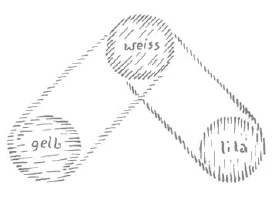
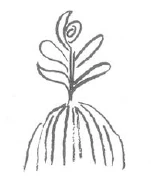
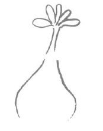

Man kann nicht sagen, daß die Gegenwart keine Ideale hätte. Im Gegenteil, sie hat sehr, sehr viele Ideale. Aber diese Ideale sind nicht wirksam. Warum sind sie nicht wirksam? Denken Sie sich einmal verzeihen Sie das etwas merkwürdige Bild, aber es entspricht doch der Sache -, denken Sie sich einmal, ein Huhn wäre bereit, ein Ei auszubrüten, man würde dieses Ei aber nehmen und durch Wärme ausbrüten lassen, das Kückelchen aus dem Ei herauskommen lassen. All das wäre ja denkbar, aber wenn man das zum Beispiel unter dem Rezipienten einer Luftpumpe machen würde, im luftleeren Raume, meinen Sie, daß das Huhn, das aus dem Ei ausschlüpft, gedeihen würde? Da sind gewissermaßen alle in der Evolution gegebenen Entwickelungsmomente da, aber eines ist nicht da: wo hinein man das betreffende Kückelchen setzen soll, damit es seine Lebensbedingungen habe. ^538s5p

So ungefähr geht es mit all den schönen Idealen, von denen man in der Gegenwart so sehr häufig spricht. Sie klingen nicht nur schön, sie sind in der Tat wertvolle Ideale. Aber die Gegenwart läßt sich nicht angelegen sein, die wirklichen, die realen Bedingungen der Evolution kennenzulernen, so wie man sie einmal nach den Bedingungen der Gegenwart erkennen muß. Und so kommt es, daß man in den merkwürdigsten Gesellschaften alle möglichen Ideale prägen, vertreten, fordern kann, und es kommt nichts dabei heraus. Denn schließlich, Gesellschaften mit Idealen hat es wahrhaftig im Beginne des 20. Jahrhunderts genügend gegeben. Daß aber die letzten drei Jahre just eine Erfüllung dieser Ideale waren, das kann man nicht sagen. Nur müßte man aus einer solchen Tatsache etwas lernen, wie es ja gerade in diesen Betrachtungen öfter erwähnt worden ist. ^wyjhvz

Ich habe Ihnen nun vorigen Sonntag hier mit einigen Strichen ein Bild gegeben der geistigen Entwickelung der letzten Jahrzehnte. Ich habe Sie gebeten, darauf Rücksicht zu nehmen, daß dasjenige, was auf dem physischen Plane geschieht, längere Zeit vorbereitet ist in der geistigen Welt. Ich habe da auf ganz Konkretes hingewiesen. Ich habe darauf hingewiesen, wie in den vierziger Jahren in der unmittelbar an die unsrige nach oben angrenzenden geistigen Welt ein Kampf begonnen hat, eine Metamorphose jener Kämpfe, die man mit dem alten Symbolum bezeichnet als den Kampf des heiligen Michael mit dem Drachen. Und ich habe Ihnen angeführt, wie dieser Kampf in der geistigen Welt sich bis zum November 1879 abgespielt hat, wie man es also da in der geistigen Welt mit einem Kampf zu tun hatte, mit einem Kampf Michaels mit dem Drachen - wir wissen ja, was unter diesem Bilde zu verstehen ist -, wie dann nach dem November 1879 in der geistigen Welt der Sieg erfochten worden ist von seiten Michaels, und der Drache, das heißt die ahrimanischen Gewalten, heruntergestoßen worden sind in die Sphäre der Menschen. Wo sind sie jetzt? ^h8wnke

Also bedenken wir wohl: Diejenigen Mächte von der Schule Ahrimans, die vom Jahre 1841 bis 1879 einen entscheidungsvollen Kampf ausgeführt haben in der geistigen Welt, sie sind 1879 gestürzt worden aus der geistigen Welt herunter in das Reich des Menschen. Und seit jener Zeit haben sie ihre Festung, haben sie das Feld ihres Wirkens - und zwar speziell in derjenigen Epoche, in der wir jetzt leben - in dem Denken, in dem Empfinden, in den Willensimpulsen der Menschen. ^qp99n9

Vergegenwärtigen Sie sich daraus, wie unendlich viel in dem, was die Menschen denken, in dem, was die Menschen wollen und empfinden, in dieser unserer Zeit von ahrimanischen Mächten durchsetzt ist. Solche Ereignisse im Zusammenhange zwischen der geistigen und der physischen Welt liegen im Plane unserer ganzen Weltenordnung, und man muß mit diesen konkreten Tatsachen rechnen. Was nützt es, wenn man immerfort im Abstrakten stekkenbleibt und als ein richtiger Abstraktling sagt: Der Mensch muß Ahriman bekämpfen. — Es kommt ja nichts dabei heraus bei einer solchen abstrakten Formel. Die Menschen der Gegenwart ahnen zuweilen gar nicht, in welcher Geisteratmosphäre sie eigentlich stehen. Man muß diese Tatsache in ihrer ganzen schwerwiegenden Bedeutung ins Auge fassen. ^c4a8vq

Nehmen Sie nur einmal dieses: daß Sie als Mitglied der Anthroposophischen Gesellschaft berufen sind, von diesen Dingen zu hören, sich in Ihren Gedanken, in Ihren Empfindungen mit diesen Dingen zu beschäftigen. Dann wird Ihnen der ganze Ernst der Sache vor die Seele treten, dann wird Ihnen schon vor die Seele treten, daß Sie mit dem Besten, was Sie fühlen und empfinden können, eine Aufgabe haben, je nach dem Platz, an dem Sie stehen in dieser so rätselvollen, so fragwürdigen, so verworrenen Gegenwart. Nehmen Sie etwa das folgende an: Irgendwo wären nur ein paar Menschen, die sich auf eine naturgemäße Weise zusammengetan hätten zu einer Art freundschaftlichem Verkehr, und dieser Kreis von Menschen, der wüßte von solchen und ähnlichen geistigen Zusammenhängen, wie ich sie Ihnen eben geschildert habe, und große Mengen von Menschen wüßten nichts davon. Seien Sie überzeugt, wenn dieser Kreis von Menschen, den ich jetzt hypothetisch vor Ihre Seele hingestellt habe, den Entschluß fassen würde, aus irgendwelchen Untergründen heraus, dasjenige, was er an Kraft gewinnen kann durch solches Wissen, in irgendeinen Dienst zu stellen, dann ist dieser geringe Kreis mit der Anhängerschaft, die er sich macht, oftmals ohne daß es dieser Anhängerschaft bewußt wird, sehr mächtig und am mächtigsten den Ahnungslosen gegenüber, die nichts wissen wollen von diesen Dingen. ^gjri7q

Es war schon im 18. Jahrhundert ein gewisser Kreis von Menschen da, der ganz von dieser Art war. Der hat heute auch seine Fortsetzung. Ein gewisser Kreis von Menschen wußte von solchen Tatsachen, von denen ich Ihnen gesprochen habe, wußte davon, daß solches im 19. und bis ins 20. Jahrhundert hinein geschehen werde, wie ich es Ihnen geschildert habe. Dieser Kreis von Menschen nahm sich aber vor - schon im 18. Jahrhundert -, gewisse, man kann sagen für diesen Kreis selbstsüchtige Absichten zu vollziehen, gewisse Impulse anzustreben. Dazu hat er dann ganz systematisch gearbeitet. ^meydho

Die Menschen leben ja heute in großen Massen wie schlafend, gedankenlos dahin, achten auch gar nicht darauf, was manchmal in ganz großen Kreisen, die neben ihnen leben, eigentlich vorgeht. In dieser Beziehung gibt man sich ja gerade heute vielen Illusionen hin. Denken Sie nur einmal, daß natürlich die Menschen heute sagen: Ach, wie wirkt doch unser Verkehr, wie bringt er die Menschen zueinander! Wie erfährt jeder vom andern! Wie ist das doch ganz anders als in früheren Zeiten! - Erinnern Sie sich an alles das, was nach dieser Richtung gesagt wird. Man braucht nur einzelne Tatsachen sinngemäß und vernunftgemäß zu betrachten, dann findet man, daß in dieser Beziehung die Gegenwart ganz merkwürdige Dinge aufweist. Wer glaubt zum Beispiel - ich will das alles nur zum Exempel, nur zum Beleg anführen -, daß literarische Erscheinungen heute nicht durch die Presse, die alles versteht und über alles sich ergeht, in weitesten Kreisen bekannt werden kann? Wer glaubt im Ernste, daß heute bedeutungsvolle, tief eingreifende, epochemachende literarische Erscheinungen unbekannt bleiben können? Man muß doch auf irgendeine Weise etwas davon erfahren. Das Merkwürdige ist, daß dasjenige, was man heute mit Respekt zu vermelden die Presse nennt, seinen Aufschwung erst im letzten Drittel des 19. Jahrhunderts begonnen hat; einen Ansatz dazu hat die Presse ja schon vorher gemacht, wenn sie auch noch nicht so war wie heute. Und trotzdem [die Presse nichts darüber geschrieben hat], konnte damals über ganz Mitteleuropa hin eine literarische Erscheinung epochemachend sein, epochemachender als all die bekannten Schriftsteller wie Spielhagen, Gustav Freytag, Paul Heyse und was ich noch für Leute mit vielen, vielen Auflagen nennen könnte, eine literarische Erscheinung, die weiter verbreitet war und viel stärker gewirkt hat als all das, wovon man etwas weiß: Denn kein Werk hat eigentlich einen so breiten Leserkreis gehabt in diesem letzten Drittel des 19. Jahrhunderts wie «Dreizehnlinden» von Wilhelm Weber. Nun frage ich Sie: Wieviele Menschen werden hier sitzen, die nicht einmal wissen, daß es ein «Dreizehnlinden» von Weber gibt? — So leben die Menschen heute nebeneinander, trotz der Presse. In diesen «Dreizehnlinden» sind, in einer schönen dichterischen Sprache, Ideen verkörpert, die tief einschneidend waren. Ja, die leben heute in Tausenden und Abertausenden von Gemütern. ^otoyt6

Ich habe das angeführt, um zu exemplifizieren, daß es tatsächlich möglich ist, daß die Masse der Menschen nichts weiß von Dingen, die immerhin einschneidend sind und sich neben ihnen abspielen. Ja, Sie können sicher sein, wenn sich hier jemand finden sollte, der das Buch «Dreizehnlinden» nicht gelesen hat - und ich vermute, daß es solche unter den Freunden gibt -, Sie können ganz sicher sein: Sie waren schon in Ihrem Leben mit drei, vier Menschen zusammen, die «Dreizehnlinden» gelesen haben. Es sind eben solche Scheidewände zwischen den Menschen, daß oftmals über die wichtigsten Sachen zwischen Nahestehenden überhaupt nicht gesprochen wird. Man spricht sich nicht aus. Selbst Nahestehende sprechen sich über die wichtigsten Sachen nicht aus. Und so wie es in einer solchen Kleinigkeit ist - denn selbstverständlich ist das, was ich hier angeführt habe, für die weltgeschichtliche Entwickelung eine Kleinigkeit-, ist es ja dann im Großen. Es gehen eben in der Welt Dinge vor, die sich ein großer Teil der Menschheit nicht klarmacht. ^unwddg

Und so etwas ging auch vor, als im 18. Jahrhundert eine Gesellschaft vorbereitete gewisse Gedanken, gewisse Anschauungen, welche sich einnisten in die Gemüter der Menschen und wirksame Kräfte werden, wirksame Kräfte im Gebiete dessen, was solche Gesellschaften wollen, und die dann ins soziale Leben übergehen, die dann bestimmen, wie die Menschen zueinander sich verhalten. Die Menschen wissen nicht, woher die Dinge kommen, die in ihren Emotionen, in ihren Empfindungen und in ihren Willensimpulsen leben. Aber diejenigen, die den Zusammenhang der Entwickelung kennen, wissen, wie man die Impulse, die Emotionen hervortreibt. So war es auch mit einem Buche - vielleicht nicht gerade mit dem Buch, aber mit dem, was an Ideen diesem Buch zugrundeliegt, das von einer solchen Gesellschaft im 18. Jahrhundert ausgegangen ist, wo dargestellt ist, welchen Anteil die ahrimanische Wesenheit an den verschiedenen Tieren hat. Natürlich nannte man die ahrimanische Wesenheit da Teufel, und man stellte dar, welche verschiedenen Ausprägungen des Teuflischen in den einzelnen Tierarten enthalten seien. Im 18. Jahrhundert hat ja das Zeitalter der Aufklärung besonders geblüht. Auch heute blüht noch die Aufklärung. Die ganz gescheiten Leute, die ja hauptsächlich auch den Stamm «Pressemenschen» stellen, die finden sich mit einem Witz ab, die sagen: Da hat wieder einmal so ein ... — jetzt mache ich Punkte - ein Buch geschrieben, daß die Tiere Teufel seien! — Ja, aber solche Ideen im 18. Jahrhundert so propagandieren, daß sie sich in vielen menschlichen Gemütern einnisten, derart propagandieren, daß man dabei die realen Entwickelungsgesetze der Menschheit beobachtet, das bewirkt etwas, das bewirkt wirklich etwas. Denn es ist wichtig, wenn im 19. Jahrhundert der Darwinismus auftaucht, wenn im 19. Jahrhundert bei einer großen Anzahl von Menschen die Idee auftaucht, daß die Menschen sich allmählich von den Tieren herauf entwickelt haben, und wenn dann bei einer andern großen Anzahl in den Gemütern die Idee sitzt, die Tiere seien Teufel. Das gibt einen merkwürdigen Zusammenklang. Das alles ist da, das alles ist real vorhanden! Aber die Menschen schreiben Geschichten, in diesen Geschichten ist alles mögliche enthalten; nur die wirklichen, wirksamen Kräfte sind nicht darin enthalten. ^1zgbwb

Was man berücksichtigen muß, das ist das folgende: Wie das Tier nur in der Luft gedeiht, nicht unter dem ausgepumpten Rezipienten der Luftpumpe, so können Ideen und Ideale nur gedeihen, wenn die Menschen eintauchen in die reale Atmosphäre des geistigen Lebens. Dazu muß aber dieses geistige Leben einem wirklich auch in seiner Realität entgegentreten. Heute jedoch liebt man Allgemeinheiten, richtige Allgemeinheiten; die liebt man ganz besonders. Und so wird man leicht unbeachtet lassen - was aber eine Tatsache ist -, daß ahrimanische Mächte seit dem Jahre 1879 heruntersteigen mußten von der geistigen Welt in das Reich der Menschen, daß sie durchsetzen mußten die menschliche Intellekrualität, das menschliche Denken und Empfinden und Anschauen. Und auch damit stellt man sich nicht in das rechte Verhältnis zu diesen Mächten, daß man einfach die abstrakte Formel hinstellt: Man muß diese Mächte bekämpfen. — Ja, was tun denn die Leute dazu, um sie zu bekämpfen? Sie tun eben nichts anderes als derjenige, der den Ofen ermahnt, er möge recht warm sein, ohne daß er Holz hineintut und Feuer macht. Man muß vor allen Dingen wissen, daß man jetzt, nachdem diese Mächte einmal auf die Erde heruntergegangen sind, mit ihnen leben muß, daß sie da sind, daß man nicht die Augen vor ihnen verschließen darf und daß sie am mächtigsten werden, wenn man die Augen vor ihnen verschließt. Das ist es gerade, daß diese ahrimanischen Gewalten, die den menschlichen Intellekt ergriffen haben, am mächtigsten werden, wenn man nichts von ihnen wissen, nichts von ihnen erfahren will. ^mx88p9

Wenn das Ideal so mancher Menschen erreicht werden könnte, nur Naturwissenschaft zu studieren und aus den naturwissenschaftlichen Gesetzen auch soziale Gesetze zu machen, nur alles Reale, wie man sagt — wobei man aber das Sinnliche meint - ins Auge zu fassen, gar nicht daran zu denken, das Geistige zu pflegen, wenn dieses Ideal gelingen würde im weitesten Umkreise, dann hätten die ahrimanischen Mächte das allergewonnenste Spiel, denn dann wüßte man nichts von ihnen. Dann würde man eine monistische Religion im Haeckelschen Sinne gründen, und sie hätten das beste Arbeitsfeld. Denn das wäre ihnen gerade recht, wenn die Menschen nichts von ihnen wüßten und sie im Unterbewußtsein der Menschen arbeiten könnten. ^mzwrmk

Also Hilfe können die ahrimanischen Mächte dadurch erlangen, daß man eine ganz naturalistische Religion bringt. Hätte David Friedrich Strauß sein Ideal vollständig erreichen können, diese Philisterreligion zu begründen, um derentwillen Nietzsche das Buch geschrieben hat «David Friedrich Strauß, der Bekenner und Schriftsteller», dann würden sich die ahrimanischen Mächte heute noch viel wohler fühlen, als sie sich fühlen. Aber das ist nur das eine; die ahrimanischen Mächte können noch auf eine andere Weise sehr gut gedeihen. Sie können dadurch gedeihen, daß man diejenigen Elemente pflegt, die sie gerade so recht unter den Menschen der Gegenwart verbreiten möchten: Vorurteil, Unwissenheit und Furcht vor dem geistigen Leben. Durch nichts fördert man so sehr die ahrimanischen Mächte als durch Vorurteil, durch Unwissenheit und durch die Furcht vor dem geistigen Leben. ^t457k8

Nun aber überschauen Sie, wie viele Menschen es sich heute geradezu zur Aufgabe machen, Vorurteile, Unwissenheit und Furcht vor den geistigen Mächten zu pflegen. Ich habe gestern im öffentlichen Vortrage gesagt: 1835 wurden erst die Dekrete gegen Kopernikus, Galilei, Kepler und so weiter aufgehoben. Die Katholiken durften also bis 1835 nichts studieren von kopernikanischer Weltanschauung oder dergleichen. Die Unwissenheit in bezug darauf wurde geradezu gefördert. Das war eine mächtige Beförderung der ahrimanischen Gewalten. Es war ein guter Dienst, den man den ahrimanischen Gewalten geleistet hat; sie konnten sich gut vorbereiten für ihre Kampagne, die dann folgen sollte vom Jahre 1841 an. ^acevz5

Zu diesem Satze, den ich jetzt eben ausgesprochen habe, müßte ich eigentlich noch einen andern dazu sagen, damit er vollständig wäre. Allein diesen andern Satz kann heute noch keiner sagen, der in diese Dinge wirklich eingeweiht ist. Aber wenn Sie erfühlen, was in den Untergründen eines solchen Satzes enthalten ist, so werden Sie vielleicht selber eine Ahnung bekommen von dem, was ich meine. ^kegttj

Die naturwissenschaftliche Weltanschauung ist eine rein ahrimanische Sache; aber nicht dadurch bekämpft man sie, daß man nichts von ihr wissen will, sondern indem man sie - wo immer möglich in das Bewußtsein heraufbefördert, sie möglichst gut kennenlernt. Man kann Ahriman keinen größeren Dienst leisten, als die naturwissenschaftlichen Anschauungen zu ignorieren oder unverständig zu bekämpfen. Wer unverständige Kritik an den naturwissenschaftlichen Anschauungen übt, der bekämpft nicht, sondern der fördert Ahriman, weil er Täuschung, Trübnis ausbreitet über ein Feld, über das gerade Licht ausgebreitet werden sollte. ^56v34n

Die Menschen müssen sich nach und nach dazu erheben einzusehen, wie ein jegliches Ding schon einmal zwei Seiten hat. Die heutigen Menschen sind ja sehr gescheit, nicht wahr, grenzenlos gescheit, und so finden diese gescheiten Menschen der Gegenwart: In der vierten nachatlantischen Zeit, im griechisch-lateinischen Zeitalter, da hatte man noch den «Aberglauben», daß man aus dem Fluge der Vögel, aus den Eingeweiden der Tiere und mancherlei anderem die Zukunft erkennen könne. Nun, die Menschen, die das getan haben, waren natürlich «Dummköpfe». - Zwar weiß kein Mensch der Gegenwart, der heute die Sache abkanzelt, wie das eigentlich gemacht worden ist. Kein Mensch der Gegenwart redet auch anders als nach dem Beispiel, das ich Ihnen neulich einmal vorgeführt habe, wo der Betreffende zugeben mußte, daß eine Prophetie aus einem Traum heraus eingetroffen war, aber dann sagte: Nun ja, das hat eben der Zufall gewollt! — Aber nach den Grundbedingungen des vierten nachatlantischen Zeitraums gab es wirklich eine solche Wissenschaft, die etwas mit der Zukunft zu tun hatte. Man hat in dieser Zeit nicht den Glauben gehabt, daß man mit solchen Grundsätzen, wie man sie heute anwendet, im sozialen Werden etwas ausmachen kann. Sonst würde man ja auch dazumal nicht - man mag damit einverstanden sein oder nicht, darauf kommt es nicht an - weit über die Zeiten hinausgehende große Perspektiven sozialer Natur gefunden haben, wenn man nicht eine gewisse Wissenschaft der Zukunft gehabt hätte. Glauben Sie, heute zehren die Menschen in dem, was sie auf dem Felde des sozialen Lebens und der Politik zustandebringen, noch immer von dem, was aus der alten Zukunftswissenschaft hervorgegangen ist. Diese Zukunftswissenschaft kann man aber nie durch Beobachtung dessen gewinnen, was äußerlich vor den Sinnen da ist. Niemals kann man sie nach dem Muster der Naturwissenschaft gewinnen, denn was man äußerlich sinnlich beobachten kann, das ist Vergangenheitswissenschaft. Und jetzt verrate ich Ihnen ein sehr wichtiges, sehr wesenhaftes Gesetz des Weltenalls: Wenn Sie die Welt bloß sinnlich beobachten, so wie das moderne naturwissenschaftliche Anschauen die Welt beobachtet, dann beobachten Sie bloß vergangene Gesetze, die sich noch fortpflanzen; Sie beobachten eigentlich bloß den Weltenleichnam der Vergangenheit. Das gestorbene Leben betrachtet die Naturwissenschaft. ^ie68vb

Denken Sie sich einmal, dieses wäre, schematisch dargestellt, unser Beobachtungsfeld (siehe Zeichnung, weiß), dasjenige, was vor unseren Augen, unseren Ohren, vor den andern Sinnen sich ausbreitet. Denken Sie sich, das hier (siehe Zeichnung, gelb) wären die sämtlichen naturwissenschaftlichen Gesetze, die man finden kann. Dann geben diese sämtlichen naturwissenschaftlichen Gesetze gar nicht mehr das, was da drinnen ist, sondern das, was schon drinnen war, was darinnen vergangen ist und nur als ein Erstarrtes zurückgeblieben ist. Sie müssen außer diesen Gesetzen vielmehr dasjenige finden, was nicht Augen beobachten können, was nicht physische Ohren hören können: eine zweite Welt von Gesetzen (siehe Zeichnung, lila). In der Wirklichkeit ist sie drinnen, aber sie weist nach der Zukunft hin. ^yuao97

 ^s01vh8

Es ist ja mit der Welt gerade so, wie wenn Sie eine Pflanze nehmen (es wird gezeichnet). So, wie heute eine Pflanze aussieht, ist sie ja nicht in Wahrheit; denn geheimnisvoll in ihr ist etwas, was Sie noch nicht sehen, was erst im nächsten Jahr so sein wird, daß es Augen sehen: die Keimanlage. Die ist aber schon drinnen, die ist unsichtbar drinnen. So ist in der Welt, die uns vorliegt, unsichtbar die Zukunft darinnen, die ganze Zukunft. Aber das Vergangene ist so darinnen, daß es schon verdorrt ist, vertrocknet, tot, Leichnam ist. Die ganze Naturbetrachtung gibt nur das Bild des Leichnams, nur Vergangenes. Gewiß, es fehlt einem dieses Vergangene, wenn man bloß auf das Geistige schaut; das ist wahr, aber zur totalen Wirklichkeit muß man das Unsichtbare dazu haben. ^lt0yox

 ^25ynl7

Wie kommt es, daß Leute auf der einen Seite eine Kant-Laplacesche Theorie aufstellen, auf der andern Seite über das Weltenende so reden wie der Professor Dewar — wie ich gestern im öffentlichen Vortrage erzählt habe -, der ein Erdenende konstruiert, wo die Leute Zeitungen lesen werden bei mehreren hundert Grad Kälte, mit Wänden, die mit leuchtendem Eiweiß angestrichen sind; Milch wird fest sein. Ich möchte bloß wissen, wie man sie melken wird, wenn sie fest wird! Das sind lauter unmögliche Vorstellungen, wie auch die ganze Kant-Laplacesche Theorie eine unmögliche Vorstellung ist. Sobald man mit diesen Theorien hinauskommt über das unmittelbare Beobachtungsfeld, versagen sie. Warum? Weil sie Theorien von Leichnamen, Theorien vom Toten sind. ^yz7qys

Heute sagen die gescheiten Leute: Die griechischen, die römischen Opferpriester waren entweder Schurken und Schwindler oder Abergläubische, denn man kann ja natürlich als vernünftiger Mensch nicht glauben, daß man aus dem Flug der Vögel, aus den Opfertieren irgend etwas über die Zukunft herausfinden kann. — Die Menschen in der Zukunft, die werden aber auf die Vorstellungen der Gegenwart, auf die die Menschen heute so stolz sind, geradeso herabsehen können, wenn sie sich ebenso gescheit fühlen wie die heutige Generation gegenüber den römischen Opferpriestern. Und die werden sagen: Kant-Laplacesche Theorie! Dewar! Die haben merkwürdig abergläubische Vorstellungen gehabt! Die haben ein paar Jahrtausende der Erdenentwickelung beobachtet und dann Schlüsse gezogen auf Anfangs- und Endzustand der Erde. Welch törichter Aberglaube war das dazumal! Da hat es solche sonderbare, abergläubische Menschen gegeben, die geschildert haben, daß aus einem Urnebel sich Sonne und Planeten abgespalten haben, die dann ins Rotieren gekommen sind. Man wird noch viel schlimmere Dinge reden können über diese Vorstellungen der Kant-Laplacesche Theorie und über diese Vorstellungen vom Erdenende, als die heutigen Menschen reden über die Erforschung der Zukunft aus den Opfertieren oder aus dem Flug der Vögel und dergleichen. ^w2rb7f

Wie erhaben sind diese Menschen heute, die so recht den Geist und die Gesinnung des naturwissenschaftlichen Denkens aufgenommen haben, wie schauen sie herab auf die alten Mythen, auf die Märchen: kindliches Zeitalter der Menschheit, wo sich die Menschen Träume hingestellt haben! Wie weit sind wir dagegen gediehen: wir wissen heute, wie alles von einem gewissen Kausalgesetz beherrscht wird, wir haben es eben herrlich weit gebracht. — Aber alle, die so urteilen, wissen eines nicht: daß diese ganze Wissenschaft von heute nicht da wäre, gerade da, wo sie berechtigt ist, wenn das mythische Denken nicht vorangegangen wäre. Ja, die heutige Wissenschaft, ohne daß die Mythe vorangegangen ist, ohne daß sie aus der Mythe herausgewachsen ist, können Sie geradeso haben, wie Sie eine Pflanze haben können, die nur Stengel, Blätter und Blüten hat und da drunten keine Wurzel, die braucht man nicht. ^zmdqe6

 ^measm1

Wer von der heutigen Wissenschaft als einem in sich selbst absolut Ruhenden spricht, der redet eben so, als wenn er die Pflanze bloß ihrem oberen Teile nach gedeihen lassen wollte. Alles, was heutige Wissenschaft ist, ist aus der Mythe herausgewachsen, die Mythe ist die Wurzel. Und es verursacht eben bei gewissen Elementargeistern, die solche Dinge von den andern Welten aus beobachten, ein wahres Hohngelächter der Hölle, wenn die ganz gescheiten Professorengemüter von heute heruntersehen auf die alten Mythologien, auf die alten Mythen, auf alle die Mittel des alten Aberglaubens, und keine Ahnung haben, daß sie mit all ihrer Gescheitheit herausgewachsen sind aus diesen Mythen, daß sie keinen einzigen berechtigten Gedanken der Gegenwart haben könnten, ohne daß diese Mythen dagewesen wären. Und ein anderes verursacht bei denselben Elementargeistern ein wahres Hohngelächter der Hölle - hier kann man sogar im eigentlichen Sinne sagen ein Hohngelächter der Hölle, denn den ahrimanischen Mächten ist das gerade recht, daß ihnen Gelegenheit zu einem solchen Hohngelächter gegeben wird -, nämlich wenn diese Leute glauben, nun haben sie die kopernikanische Theorie, nun haben sie den Galileismus, nun haben sie dieses gloriose Gesetz von der Erhaltung der Kraft. Das wird sich nie ändern, das wird nun in alle Zeiten hinein bleiben. — Ein kurzsichtiges Urteil! Geradeso, wie sich der Mythus zu unseren Vorstellungen verhält, so verhalten sich die Vorstellungen der Wissenschaft des 19. und 20. Jahrhunderts zu dem, was wiederum ein paar Jahrhunderte später kommen wird. Das wird geradeso überwunden werden, wie der Mythus überwunden wurde. Glauben Sie, daß die Menschen im Jahre 2900 über das Sonnensystem ebenso denken werden, wie die heutigen Menschen denken? Das wäre Professorenaberglaube, das dürfte niemals Anthroposophenglaube sein. ^gh85o9

Das, was die Menschen heute berechtigt denken können, was sie wirklich mit einer gewissen Größe hineinstellen in die gegenwärtige Zeit, das verdanken sie gerade dem Umstande, daß sich während der Griechenzeit so etwas ausgebildet hat wie die griechische Mythologie. Es würde ja natürlich nichts Entzückenderes geben für einen aufgeklärten Menschen der Gegenwart, als wenn er denken könnte: Ach, wären doch diese Griechen auch schon so glücklich gewesen, daß sie unsere heutige Wissenschaft gehabt hätten! - Aber hätten die Griechen unsere heutige Wissenschaft gehabt, wäre das nicht dagewesen, was gerade die Griechen gehabt haben, die Kunde von den griechischen Göttern, die Welt des Homer, Sophokles, Aischylos, Plato, Aristoteles, wäre das nicht dagewesen: Wagner wäre ein Faust gegen die Wagners, die dann heute herumgehen würden! Vertrocknet, verkommen wäre das menschliche Denken, öde wäre all unser Denken, denn was an Lebenskraft in unserem Denken ist, das kommt davon her, daß es wurzelt im griechischen Mythus, im Mythus der vierten nachatlantischen Zeit überhaupt. Und wer da glaubt, daß der Mythus eben falsch war und das heutige Denken richtig ist, der gleicht einem Menschen, der es unnötig findet, daß man Rosen erst vom Rosenstock abschneiden muß, wenn man ein Rosenbouquet haben will. Warum sollen denn die Rosen nicht direkt entstehen können? ^25ahg0

Es sind eben alles unwirkliche Vorstellungen, in denen die Menschen leben, die gerade heute zu den Aufgeklärtesten zu gehören glauben. Dieser vierte nachatlantische Zeitraum mit seiner Ausbildung des Mythus, mit seiner Ausbildung von Vorstellungen, die für den heutigen Menschen eher Träumen ähnlich sind als den scharf umrissenen naturwissenschaftlichen Vorstellungen, diese ganze Denkweise des vierten nachatlantischen Zeitraums, die ist die Grundlage für das, was wir heute sind. Das aber, was wir heute denken, was wir heute ausbilden können, das wiederum muß die Grundlage sein für den nächsten Zeitraum. Das kann es aber nur sein, wenn es nicht bloß nach der Seite des Verdorrens sich entwikkelt, sondern wenn es sich nach der Seite des Lebens entwickeln will. Leben aber wird eingehaucht demjenigen, was heute ist, wenn man versucht, das, was einmal war, ins Bewußtsein heraufzuheben und das zu erkennen, was einem ein waches Bewußtsein gibt, was einen zu einer wachen Persönlichkeit macht. ^25n9i5

Seit dem Jahre 1879 ist es so: Wenn einer in die Schule geht, dort naturwissenschaftliche Gesinnung und Denkart aufnimmt, sich dann eine Weltanschauung aneignet im Sinne dieser naturwissenschaftlichen Denkart und nun den Glauben hat, nur das, was sich in der Sinnenwelt ausbreitet, das kann man wirklich nennen, alles andere ist ja doch nur Phantasieprodukt -, wenn einer so denkt - und wie viele Leute denken heute so -, dann hat Ahriman sein gutes Spiel, dann geht es den ahrimanischen Mächten gut. Denn diese ahrimanischen Mächte, die sich seit dem Jahre 1879 in den menschlichen Gemütern sozusagen ihre Festungen begründet haben, was sind sie denn eigentlich? Menschen sind sie nicht; Engel sind sie, aber zurückgebliebene Engel - Engel, die aus ihrer Entwickelungsbahn herausgekommen sind, die es verlernt haben, in der nächstangrenzenden geistigen Welt ihre Aufgabe zu verrichten. Würden sie das können, dann wären sie nicht im Jahre 1879 gestürzt worden. Sie sind heruntergestürzt, weil sie oben ihre Aufgabe nicht erfüllen können. Jetzt wollen sie ihre Aufgabe mit Hilfe der Köpfe, der Gehirne der Menschen erfüllen. In den Gehirnen der Menschen sind sie um einen Plan tiefer, als wo sie eigentlich hingehören. Was man heute monistisch denken nennt, das tun ja gar nicht in Wirklichkeit die Menschen. Was man heute nationalökonomische Wissenschaft nennt, das ist vielfach von der Art, wie ich es gestern wiederum hingestellt habe. Wenn man das ausspricht, was daam Anfang des Krieges geschrieben wurde, der Krieg müsse in vier Monaten aus sein — ich meine als Wissenschafter ausspricht; wenn man es bloß nachspricht, kommt es nicht so darauf an -: Was geht denn da in den Köpfen der Menschen vor? All das sind ja Engelsgedanken, die in den Köpfen der Menschen nisten, Gedanken von zurückgebliebenen Engeln. Ja, der menschliche Verstand soll eben immer mehr und mehr in Anspruch genommen werden von solchen Mächten, die sich seiner bemächtigen wollen, damit sie ihr Leben ausleben können. Gegen das kommt man nicht auf, wenn man den Kopf in den Sand steckt und Vogel-Strauß-Politik spielt, sondern nur, wenn man bewußt mitlebt. Nicht, wenn man nicht weiß, was zum Beispiel die Monisten denken, kommt man dagegen auf, sondern wenn man es weiß, aber wenn man auch weiß, daß es Ahrimanwissenschaft ist, daß es die Wissenschaft von zurückgebliebenen Engeln ist, die in den Köpfen der Menschen nistet, wenn man Bescheid weiß von der Wahrheit, von der Wirklichkeit. ^hsjoij

Natürlich, wir sprechen das hier so aus, daß wir uns der entsprechenden Ausdrücke bedienen - ahrimanische Mächte -, weil wir diese Dinge ernstnehmen. Sie wissen, so können Sie nicht sprechen, wenn Sie draußen zu den Menschen sprechen, die heute ganz unvorbereitet sind. Denn da ist eben eine der Scheidewände. Da kommt man nicht heran an die Menschen; aber man kann natürlich Mittel und Wege finden, um zu den andern Menschen so zu sprechen, daß dasjenige, was einmal Wahrheit ist, einfließt. Dahingegen, wenn es gar keine Stätte gäbe, wo die Wahrheit gesagt werden könnte, dann würde man ja auch keine Möglichkeit haben, sie einfließen zu lassen in die äußere, profane Wissenschaft. Es muß ja mindestens einzelne Stätten geben, wo die Wahrheit in einer ursprünglichen, echten Form ausgesprochen werden kann. Nur müssen wir niemals vergessen, daß es den heutigen Menschen oftmals unüberwindliche Schwierigkeiten macht, wenn sie selbst auch schon wirklich den Anschluß finden an die spirituelle Wissenschaft, die Brücke zu schlagen hinüber ins Reich der ahrimanischen Wissenschaft. Ich habe manche Menschen gefunden, die sehr gut Bescheid wußten auf diesem oder jenem Gebiet der ahrimanischen Wissenschaft, die entweder gute Naturwissenschafter oder gute Orientalisten waren und so weiter, die dann auch den Anschluß gefunden haben an unsere spirituelle Forschung. Oh, ich habe mir viele Mühe gegeben, um solche Menschen zu veranlassen, nun die Brücke zu schlagen. Was wäre geschehen, wenn ein Physiologe, ein Biologe mit all dem Spezialwissen, das man auf diesen Gebieten heute gewinnen kann, die Physiologie, die Biologie spirituell durchgearbeitet hätte, so daß man nicht gerade unsere Ausdrücke gebraucht hätte, aber in unserem Geist diese einzelnen Wissenschaften bearbeitet hätte! Ich habe es bei Orientalisten versucht. Gewiß, die Menschen können auf der einen Seite gute Anhänger der Anthroposophie sein, auf der andern Seite sind sie Orientalisten und machen die Sache so, wie es Orientalisten machen. Aber die Brücke von dem einen zu dem andern wollen sie nicht schlagen. Das ist es aber gerade, was die Gegenwart so notwendig braucht, was so intensiv notwendig ist, denn, wie gesagt, da befinden sich die ahrimanischen Mächte sehr wohl, wenn man Naturwissenschaft so betreibt, als ob das ein Abbild der äußeren Welt wäre. Aber wenn man mit spiritueller Wissenschaft und mit der Gesinnung kommt, die aus der spirituellen Wissenschaft fließt, da befinden sich die ahrimanischen Mächte weniger gut. Diese spirituelle Wissenschaft ergreift ja den ganzen Menschen. Man wird ein anderer Mensch dadurch, man lernt anders fühlen und anders wollen, man lernt, sich anders in die Welt hineinzustellen. ^inng9j

Es ist wahr, was immer von Eingeweihten gesagt wurde: Wenn das den Menschen durchströmt, was von spiritueller Weisheit kommt, dann ist es für die ahrimanischen Mächte ein großer Schrekken der Finsternis und ein verzehrend Feuer. Wohl ist es den ahrimanischen Engeln, in den Köpfen zu wohnen, die heute mit ahrimanischer Wissenschaft erfüllt sind; aber wie verzehrend Feuer, wie ein großer Schrecken der Finsternis werden diejenigen Köpfe von den ahrimanischen Engeln empfunden, die mit spiritueller Weisheit durchsetzt sind. Nehmen wir solch eine Sache in ihrem vollen Ernste, fühlen wir das: Wenn wir uns mit spiritueller Weisheit durchsetzen, dann gehen wir so durch die Welt, daß wir ein rechtes Verhältnis begründen zu den ahrimanischen Mächten, daß wir selber durch das, was wir tun, das aufrichten, was da sein muß, daß wir zum Heile der Welt aufrichten die Stätte des verzehrenden Opferfeuers, die Stätte, wo der Schrecken der Finsternis strahlt über das schädliche Ahrimanische. ^p8ouho

Durchdringen Sie sich mit solchen Ideen, durchdringen Sie sich mit solchen Empfindungen! Dann werden Sie wach und schauen die Dinge an, die draußen in der Welt vorgehen, schauen an, was draußen in der Welt geschieht. Im 18. Jahrhundert sind eigentlich die letzten Reste der alten atavistischen Wissenschaft erstorben. Die Anhänger des «unbekannten Philosophen» Saint-Martin, des Schülers von Jakob Böhme, hatten manches von der alten atavistischen Weisheit, sie hatten dafür aber auch vieles von einem Vorauswissen dessen, was kommen werde, was in unserer Zeit aber schon gekommen ist. Und oftmals wurde in diesen Kreisen davon gesprochen, daß von dem letzten Drittel des 19. Jahrhunderts und von der ersten Hälfte des 20. Jahrhunderts ein Wissen ausstrahlen werde, das da wurzelt in denselben Quellen, in demselben Boden, wo bestimmte menschliche Krankheiten wurzeln - ich habe letzten Sonntag davon gesprochen -, wo Anschauungen herrschen werden, die da wurzeln in der Lüge, wo Empfindungen herrschen werden, die da wurzeln in der Selbstsucht. ^lhgah7

Verfolgen Sie mit sehendem Auge, mit dem Auge, das sehend wird durch die Empfindungen, von denen wir heute gesprochen haben, was durch die Gegenwart wallt und west! Vielleicht wird von manchem, was Sie erfahren, Ihr Herz wund werden. Das aber schadet nichts, denn klare Erkenntnis, auch wenn sie schmerzt, wird heute gute Früchte tragen von der Art, wie sie gebraucht werden, um herauszukommen aus dem Chaos, in das sich die Menschheit hineinbegeben hat. ^61pi2j

Das erste oder eines von den ersten Dingen wird sein müssen die Erziehungswissenschaft. Und auf dem Gebiete der Erziehungswissenschaft wird wiederum einer der ersten Grundsätze ein solcher sein müssen, gegen den heute am allermeisten gesündigt wird. Wichtiger als alles, was Sie einem Knaben oder Mädchen oder einem jungen Mann oder einer Jungfrau lehren und bewußt anerziehen können, wichtiger ist dasjenige, was unbewußt während der Erziehungszeit in die Seelen der Menschen hineinfließt. Ich habe erst im vorigen öffentlichen Vortrage davon gesprochen, daß das Gedächtnis etwas ist, was sich wie im Unterbewußtsein als Parallelerscheinung des bewußten Seelenlebens ausbildet. Darauf muß gerade bei der Erziehung Rücksicht genommen werden. Nicht nur, was das Kind versteht, muß der Erzieher der Seele beibringen, sondern auch dasjenige, was das Kind noch nicht versteht, was sich in geheimnisvoller Weise hineinerstreckt in des Kindes Seele und was - das ist wichtig - dann im späteren Leben herausgeholt wird. ^0dwh8s

Wir nähern uns immer mehr der Zeit, in der die Menschen während ihres ganzen Lebens immer mehr und mehr Erinnerungen an ihre Jugendzeit brauchen werden, Erinnerungen, die sie gerne haben, Erinnerungen, die sie glücklich machen. Das muß die Erziehung lernen, systematisch zu leisten. Gift wird es sein für die Erziehung der Zukunft, wenn die Menschen im späteren Leben zurückdenken müssen, wie sie sich geplagt haben während der Schulzeit, während der Erziehungszeit, wenn sie sich ungern erinnern an ihre Schul- und Erziehungszeit, wenn ihnen die Schul- und Erziehungszeit nicht ein Quell ist, aus dem sie immer von neuem lernen, lernen, lernen können. Wenn man aber schon alles gelernt hat als Kind, was man vom Lehrstoff lernen kann, bleibt ja nichts mehr für später. ^9sfye6

Wenn Sie dies wiederum bedenken, dann werden Sie sehen, wie anders ganz gewichtige Grundsätze in der Zukunft Lebensdirektiven werden müssen gegenüber dem, was man heute für das Richtige ansieht. Gut wäre es für die Menschheit, wenn die traurigen Erfahrungen der Gegenwart nicht von so vielen verschlafen würden, sondern wenn die Menschen diese traurigen Erfahrungen der Gegenwart benützen würden, um sich möglichst vertraut zu machen mit dem Gedanken: Vieles, vieles muß anders werden! Zu selbstgefällig ist die Menschheit der letzten Zeiten geworden, um diesen Gedanken in seiner vollen Tiefe und vor allen Dingen in seiner vollen Intensität zu ermessen. ^2io6x0