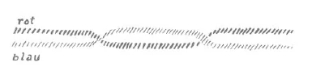
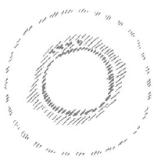
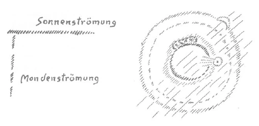

Meine lieben Freunde! Es werden voraussichtlich in Zürich von mir Vorträge gehalten werden. Es steht noch nicht ganz fest, weil jetzt die Säle so außerordentlich besetzt sind und nur wenige Säle zur Verfügung stehen, aber wenn der Saal zu haben ist, werden wahr scheinlich vier Vorträge stattfinden, die zusammenhängend sein werden, und zwar am 30. Oktober und 1. November und am 6. und 8. November. Dazwischen wird dann immer ein Zweigvortrag sein. Also zweimal an drei Tagen in Zürich: am ersten und dritten Tag jeweils ein öffentlicher Vortrag und dazwischen ein Zweigvortrag. Es ist in Aussicht genommen, daß diese öffentlichen Vorträge so eingerichtet werden, daß sie ein Bild geben des Verhältnisses von Anthroposophie zu den verschiedenen Wissenschaften. Es wird sich zeigen, ob gerade in dieser für wissenschaftliche und Kulturbestrebungen so vielfach zentral gelegenen Stadt Zürich dadurch etwas zu erreichen ist, daß man vier solche zusammengehörige Vorträge hält. Sie sollen, wie ich eben mit Herrn Professor Gysi besprochen habe, folgende Themen haben: ^1lulw0

1. Anthroposophie und Seelenwissenschaft. Geisteswissenschaftliche Ergebnisse über die menschlichen Seelenfragen. ^hortl5

2. Anthroposophie und Geschichtswissenschaft. Geisteswissenschaftliche Ergebnisse über die Menschheit und ihre Kulturformen. ^xulxkn

3. Anthroposophie und Naturwissenschaft. Geisteswissenschaftliche Ergebnisse über die Natur und den Menschen als Naturwesen. ^5jl3gk

4. Anthroposophie und Sozialwissenschaft. Geisteswissenschaftliche Ergebnisse über Recht, Moral und soziale Lebensform. ^ihfd40

Nun ist Jetzt eine große Schwierigkeit vorhanden, die darin besteht, daß man in Zürich sehr schwer unterkommt. Frieren muß man ja doch jedenfalls. Aber es kann sein, daß man nicht einmal eine Stätte für das Frieren bekommt, da Zürich außerordentlich übervölkert ist. Daher wird es notwendig sein, daß diejenigen Freunde, die von auswärts nach Zürich kommen, sich beizeiten darum kümmern, daß sie dort, wenn auch frierend, unterkommen können. Das andere ist, daß Herr Professor Gysi genötigt ist - oder überhaupt unsere Zürcher Freunde -, für die Zweigvorträge für ein Lokal zu sorgen, wenn der Besuch von auswärts ein reger ist. Diejenigen Freunde, die jetzt schon sagen können, daß sie mitkommen nach Zürich, wenn diese Veranstaltungen sein werden, die werden gebeten, die Hand zu erheben, damit Herr Professor Gysi sich ein Bild machen kann, ob in dem jetzt zur Verfügung stehenden Zweiglokal die Zweigvorträge stattfinden können oder ob es zu klein ist. ^vg47jo

Mein Bestreben war in diesen Betrachtungen und muß es auch weiterhin sein, nach den verschiedensten Seiten verständlich zu machen, inwiefern der Mensch in der Gegenwart und in der nächsten Zukunft sich in eine Kulturepoche hineinlebt, die besondere Anforderungen an die verschiedenen Zweige des Lebens stellen wird. Ich habe versucht, aus Vorgängen, die in den Tiefen des geistigen Lebens liegen, verständlich zu machen, was eigentlich übersinnlich, aber deshalb nicht minder wirksam - ja gerade für unsere Zeit sehr wirksam - sich vollzieht und was immer deutlicher eingreifen wird in alles Leben, in alle Kulturformen, in alles soziale Zusammensein der Menschen. Wir haben entgegennehmen können aus diesen Betrachtungen, daß eine gewisse Verinnerlichung der menschlichen Seelennatur stattfinden wird. ^zlhe91

Wenn man dieses ausspricht, eine Verinnerlichung der menschlichen Seelennatur werde Platz greifen, so darf nicht verkannt werden, daß diese Verinnerlichung, in gewissem Sinne durch all die schon betrachteten und noch zu betrachtenden Verhältnisse bedingt, vielfach parallelgehen wird mit einer Veräußerlichung auf intellektuellem Gebiete, auf dem Gebiet äußerer Wissenschaft und so weiter. Wir müssen eben durchaus in Betracht ziehen, daß in der Wirklichkeit niemals die Entwickelung so einförmig geschieht, wie es sich die moderne naturwissenschaftliche Evolutionslehre gern vorstellen möchte. Ihre Vorstellung ist ja nicht unrichtig; aber Vorstellungen, die richtig, aber einseitig sind, rufen oftmals größere Verwirrung hervor als direkt unrichtige Vorstellungen. Diese Vorstellung geht dahin, einfach eine gradlinige Entwickelung vom unvollkommenen Wesen bis herauf zum Menschen anzunehmen. So ist es aber nicht, sondern die Entwickelung der Menschheit und auch die Entwickelung der außermenschlichen Welt, sie sind so, daß immer einer mehr äußerlichen Strömung eine innerliche entspricht, so daß man sagen kann: Wenn eine Zeitlang äußerlich vielleicht eine Strömung vorhanden ist, so geht parallel dieser äußerlichen Strömung eine innerliche Strömung (siehe Zeichnung). Äußerlich ist vielleicht diese Strömung mehr materiell oder materialistisch, innerlich ist sie mehr spirituell oder spiritualistisch. Dann wiederum tritt mehr eine spiritualistische an der Oberfläche auf, und die materialistische oder materielle geht in den verborgenen Tiefen des Menschenwesens vor sich. Dann wiederum kehrt sich die Sache um: Es tritt dann in das Innere die spirituellere Richtung und an die Oberfläche die materielle oder materialistische. ^7b5r33

 ^mpudyn

Also gerade in dieser Zeit, die uns bevorsteht, wo das äußere Leben recht sehr verlaufen wird im Sinne der roten Linie hier (siehe Zeichnung), im Sinne materiellen Geschehens und materieller Empfindungen und Auffassungen, wird in den Tiefen der Menschenseele eine Vergeistigung stattfinden. Und das kann so sein, daß die Menschen vielleicht gar nichts wissen wollen von dieser Vergeistigung, aber stattfinden wird sie doch. ^9459qg

Wenn Sie so recht diese Sache vor Ihre Seele stellen, dann bekommen Sie die Möglichkeit, zwei Dinge gehörig zu betrachten, die außerordentlich wichtig für die Zukunft sein werden. Bedenken Sie, daß wir gestern gesagt haben: Mit dem Jahre 1879 sind ahrimanische Mächte besonderer Art aus den geistigen Höhen in das Reich der menschlichen Entwickelung hinuntergestiegen, namentlich der menschlichen Geistes- und Seelenentwickelung. Diese Mächte sind einmal da, die leben zwischen uns. Sie haben vorzugsweise, wie wir gehört haben, das Bestreben, sich unserer Köpfe zu bemächtigen, sich desjenigen zu bemächtigen, was wir denken, was wir empfinden. Es sind engelartige Wesen, sagte ich, die ihre Entwickelung nicht mehr in der geistigen Welt finden können und die die Menschenköpfe benützen wollen, um ihre Entwickelung in der nächsten Zeit fortzusetzen. Da wird es ganz besonders notwendig sein, daß diese (siehe Zeichnung, blaue Linie) geheime, diese okkulte Seelenentwickelung, die vielleicht manche Menschen gar nicht bewußt ins Auge fassen wollen, bei der es ihnen am liebsten wäre, wenn sie unten bliebe und sie sich nur mit materiellen Dingen zu beschäftigen brauchten, daß diese okkulte Seelenentwickelung ja ins Auge gefaßt werde. Denn wird sie nicht ins Auge gefaßt, dann bemächtigen sich gerade dieser Verinnerlichung des Menschen die ahrimanischen Mächte, um die es sich handelt. Das ist das eine, was berücksichtigt werden muß. Wir müssen gefaßt sein auf die Gefahr der nächsten Kulturentwickelung, daß gerade in dem, was unser heiligstes inneres Menschliches sein muß, Wache gehalten werden muß gegenüber den Einflüssen ahrimanischer Mächte. ^cdf2ai

In der nächsten Zeit werden die Erziehungsfragen ganz besonders wesentlich und bedeutungsvoll werden. In keinem andern Menschenalter als in dem der Kindheit und Jugend wird das Verinnerlichte der menschlichen Seele so bedeutungsvoll werden, wie das in der nächsten Zeit eben sein kann. Man kann es vielleicht heute gar noch nicht glauben, aber es hat schon längst die Zeit begonnen, von der man sagen kann: Kinder und jugendliche Menschen stehen uns so gegenüber, daß dasjenige, was sie äußerlich zeigen, was sie darleben, nicht das Wesentliche ist. Es ist das Rote hier (siehe Zeichnung), aber neben diesem Roten verläuft das Blaue, verläuft ein verborgenes Inneres, und dieses verborgene Innere, das müssen wir gar sehr ins Auge fassen. Das darf der Erzieher nicht aus dem Auge lassen, wenn er es nicht an die ahrimanischen Mächte abgeben will. In vieler Beziehung wird Erziehung und Unterricht in der nächsten Zeit etwas ganz anderes werden müssen, als man es sich heute vorstellt. Denn woraus sind denn eigentlich die Grundsätze unseres gegenwärtigen Erziehungs- und Unterrichtswesens geflossen? ^bfasen

Gewisse Dinge hinken immer nach in der Weltenordnung. Im 18. Jahrhundert griff ganz besonders Platz, was man die Aufklärung nannte. Man wollte im 18. Jahrhundert sogar eine Art Vernunftreligion begründen, eine Religion, die bloß auf das menschliche Nachdenken, auf den «Hungerleider» unter den Wissenschaften sich stützt, darauf Rücksicht nimmt, wie ich es in den öffentlichen Vorträgen in Basel ausgeführt habe. Und die Art, wie man sich dem heranwachsenden Menschen gegenüber in Erziehung und Unterricht benehmen will, ist ganz aus dieser Vernunftströmung heraus aufgebaut: nur ja alles so machen, daß das Kind es gleich versteht, daß das Kind nirgends etwas Tieferes in dem erlebt, als es schon verstehen kann. ^arwqog

Man wird einsehen müssen, daß man damit am allerwenigsten für das Leben eines Menschen sorgt. Dadurch kommt man nämlich in ein sehr verhängnisvolles Extrem des menschlichen Lebens hinein. Denken Sie doch nur einmal: Wenn man sich nun so recht bemüht, an das Kind nichts anderes heranzubringen, als was seinem kindlichen Verständnis entspricht, was es fassen kann, dann gibt man ihm keine Wegzehrung für das spätere Leben mit, denn später soll es ja ein tieferes Verständnis haben. Man sorgt gewissermaßen dafür, daß es sein ganzes Leben nichts anderes hat als ein kindliches Verständnis, wenn man sich nur an das kindliche Verständnis im Kindheitsalter wendet. Es hat das auch schon seine Früchte getragen, und sie sind auch danach! Ein großer Teil unseres heutigen Denkens der sich so sehr weise und aufgeklärt dünkenden Kulturmenschheit beruht darauf, daß dieses Denken kindsköpfig geblieben ist. Man wird selbstverständlich auf dem Gebiete unseres Zeitungswesens nicht zugeben, daß da zum größten Teil kindsköpfisches Denken waltet, aber es ist doch so. Und das hängt im wesentlichen damit zusammen, daß man sich nur an das kindliche Verständnis wendet. Dann bleibt dieses kindliche Verständnis das ganze Leben hindurch. Ein ganz anderes muß Platz greifen: Erfüllen müssen wir unsere Seelen, namentlich als Erzieher, mit der Empfindung, mit dem Bewußtsein, daß in dem Kinde ein geheimnisvoll Verinnerlichtes waltet und daß man heranbringen muß an das kindliche Gemüt vieles von dem, was erst im späteren Leben, nicht schon im kindlichen Alter, verständlich ist, was man dann im späteren Leben herausholt aus der Erinnerung und sich sagt: Das hast du dort gehört, das hast du da aufgenommen; jetzt bist du erst so gescheit, manches zu verstehen. Durch nichts wird in der Zukunft das Leben der Menschen gesünder werden als dadurch, daß sie viel aus den Mitteilungen, aus den Offenbarungen des Kindheitslebens herausholen können in der Erinnerung und es dann erst verstehen können. ^2ahuc8

Wenn sie so mit sich leben können, die Menschen, daß sie heraufholen aus der Erinnerung, was sie damals noch nicht verstehen konnten, dann wird das eine Quelle gesunden inneren Lebens werden. Jene Verödung wird von den Menschen fern bleiben, die heute so vielfach die Gemüter ergreift und sie leer macht und in die Sanatorien leitet, damit sie dort von außen irgend etwas in die Seelen hineinbekommen, die von innen leer geblieben sind, weil gerade die Erziehung es daran hat fehlen lassen, irgend etwas in diese Seelen hineinzubringen, an das später erinnert werden kann. ^1v793c

Diese Betrachtungen muß man eigentlich im Zusammenhang mit einer andern ins Auge fassen. Unsere Gegenwart hat durch all diese Umstände, die ich dargelegt habe in der letzten Zeit, eigentlich ganz das Bewußtsein davon verloren, daß zwischen den Menschen und dem Weltenall ein Zusammenhang, ein inniger Zusammenhang ist. Der Mensch glaubt heute, daß er über die Erde hingeht oder im Eisenbahnzug über die Erde hinfährt als dieses Stück Fleisch, das er einmal ist. Gewiß, er wird es nicht immer zugeben, aber der reale Inhalt seiner Gedanken ist nicht viel anders. Das ist aber nicht so. Der Mensch steht mit dem ganzen Weltenall in inniger Verbindung. Und es ist gut, sich das einmal durch eine Erwägung klarzumachen. ^u1q2yu

Betrachten Sie einmal die Erde. Um die Erde herum bewegt sich der Mond; das sei die Mondbahn (punktierter Kreis). Die Erde ist wahrhaftig nicht dieses abstrakte mineralische Wesen, von dem unsere heutige Mineralogie, Geologie, Physik träumt. Sie ist ein sehr lebendiges Wesen, und wir könnten viele Lebensformen mit Bezug auf die Erde betrachten. Wir wollen jetzt nur ins Auge fassen, daß um die Erde herum fortwährend Strömungen gehen. Diese Strömungen gehen nach allen möglichen Richtungen um die Erde herum. Sie sind ätherisch-geistiger Art, und sie haben einen realen, substantiellen Wirkensfaktor in sich. Da ist etwas in diesen Strömungen fortwährend darinnen (es werden Punkte hineingezeichnet). ^emndp1

 ^hlryel

Nun ist es gut, ins Auge zu fassen, woher diese Strömungen rühren. Wir werden diese Dinge im Laufe der Zeit noch näher betrachten; ich will heute nur einiges präliminarisch angeben. Wenn Sie meine «Geheimwissenschaft im Umriß» studieren, so werden Sie dort finden, daß in sehr alten Zeiten die Erde mit der Sonne ein Körper war. Das, was heute unsere Erde ist, ist ja nur herausgeschieden aus der Sonne. Diese Strömungen sind aus dem Sonnenleben zurückgeblieben; das ist noch Sonnenleben in der Erde. Die Erde wird also noch durchströmt vom Sonnenleben. Aber auch der Mond war mit der Erde ein Körper. Und was heute als Mond die Erde umkreist, das hat auch Strömungen in sich. Das sind wiederum diejenigen Strömungen, die aus einer späteren Zeit, aus der Mondenentwickelung, geblieben sind. Da haben wir zweierlei Strömungen, die wir bezeichnen als Sonnenströmungen und als Mondenströmungen. Dies sind zwei ganz verschieden voneinander verlaufende Strömungen; sie sind da als lebendige Wirklichkeit. ^aeunv8

Denken Sie sich einmal ein Wesen, das auf der Erde herumwandelt, das durchströmt ist von diesen Wesenheiten, von diesen Strömungen (es wird gezeichnet). Nehmen wir an, ein Wesen, das in einer bestimmten Weise über die Erde wandelt, sei durchströmt von solchen Strömungen des Sonnenlebens. Die Strömungen des Sonnenlebens, die heute noch da sind, können leicht durch dieses Wesen hindurch. Nehmen wir an, ein anderes Wesen wäre aber anders konstruiert; es wäre so konstruiert, daß diese Sonnenströmungen von der einen Seite her durch dieses Wesen gehen, von der andern Seite her aber die Mondenströmungen. Die Sonnenströmung geht eigentlich, weil sie nicht an den Ort beschränkt ist, durch alles hindurch und kann dieses Wesen nach der einen Richtung durchströmen (es wird gezeichnet). Es kann also Wesen auf der Erde geben, die nur nach der einen Richtung, von der Sonnenströmung, durchströmt sind, und es kann Wesen auf der Erde geben, die nach der einen Richtung von der Sonnenströmung, nach der andern Richtung von der Mondenströmung durchströmt sind (es wird gezeichnet). ^phy13p

 ^atd2rz

Wesen, die nur von der Sonnenströmung durchströmt werden können, das sind die Tiere. Stellen Sie sich ein vierfüßiges Tier vor: das geht über die Erde so, daß sein Rückgrat im wesentlichen parallel der Erdenoberfläche ist. Da kann immerfort die Sonnenströmung, die jetzt Erdenströmung geworden ist, durch dieses Rückgrat ziehen. Dieses Wesen ist also erdenverwandt. ^adib0x

Beim Menschen ist das anders. Der Mensch hat innerhalb seiner Leiblichkeit diejenige Lage, die das Tier hat, nur mit Bezug auf sein Haupt. Wenn Sie sich die Linie denken vom Hinterkopf nach der Stirne, dann ist diese Linie in der Richtung, in der das Tier sein Rückgrat hat; da geht dieselbe Sonnenströmung durch das Haupt hindurch. Dagegen ist das menschliche Rückgrat herausgehoben von den Strömungen, die parallel zur Erde gehen, von der ErdenSonnenströmung. Dadurch, daß es herausgehoben ist, kommt der Mensch in die Lage — das hängt natürlich sehr von der geographischen Breite und so weiter ab, aber dadurch sind die Menschen auch verschieden -, daß unter bestimmten Verhältnissen die Mondenströmung durch ihn hindurchgeht, jetzt aber nicht durch seinen Kopf, sondern durch sein Rückgrat. Das ist ein gewaltiger Unterschied zwischen dem Tier und dem Menschen. Was bei dem Tiere vom Kosmos durchs Rückgrat geht, geht beim Menschen durch den Kopf; was bei dem Tier, so wie die Tiere heute sind, überhaupt zunächst keinen Angriffspunkt hat, die alte Mondenströmung, das geht bei dem Menschen durchs Rückgrat. Daß eine Verwandtschaft ist zwischen dem menschlichen Rückgrat, sogar in seinem Bau, und der Mondenströmung, das möge Ihnen daraus hervorgehen, daß der Mensch ungefähr - warum das nur ungefähr ist, darauf werden wir auch in der späteren Zeit einmal zurückkommen -, so viele Rückenwirbel hat als der Monat Tage: achtundzwanzig bis einunddreißig Rückenwirbel hat er. Das gesamte Rückenmarksleben, überhaupt das Brustleben des Menschen, hängt mit dem Mondenleben innig zusammen. Und unter dem Sonnenleben, das in Schlafen und Wachen abläuft, vierundzwanzigstündig, liegt verborgen das rhythmische Mondenleben für den Menschen. ^04uiiy

Das ist eine elementarische Betrachtung des Zusammenhanges zwischen dem Menschen und dem gesamten Weltenall. Denn geradeso wie die Strömungen, die durch das menschliche Rückgrat gehen, in der Strömung verlaufen, die mit dem Mondenleben zu tun hat, so verlaufen wiederum andere Strömungen in dem Menschen, die mit den andern Planeten unseres Sonnensystems zu tun haben. Das alles sind höchst reale Dinge. Aber die heutige naturwissenschaftliche Weltanschauung ist ganz von diesen Dingen abgekommen, kommt gar nicht mehr darauf, diese Zusammenhänge zu betrachten. Daher hat sie auch kein Gefühl dafür, wie beim Menschen ein Wesentliches gerade darinnen besteht, daß zu dem äußerlichen, bewußten Erdenleben ein unterbewußtes Leben hinzukommt, das zusammenhängt mit seinem Brustleben, das aus geheimnisvollen Seelentiefen heraufkommt, das aber besonders berücksichtigt werden muß in solchen Zeiten, wie diejenige ist, die jetzt kommt, und das besonders berücksichtigt werden muß im Erziehungswesen aus dem Grunde, weil sonst eben die gegnerischen, die ahrimanischen Mächte sich dieses Lebens bemächtigen. Und es wäre sehr verhängnisvoll, wenn der Mensch nicht achtgeben würde darauf, daß sich ein Teil seines Seelenlebens, das sich gerade verinnerlichende, das «blaue» Leben, um es nach dem Bilde (siehe «blaue» Zeichnung auf $. 195) zu sagen, in der Gefahr befindet, den ahrimanischen Mächten zu verfallen, wenn es nicht vollbewußt aufgenommen und durch solche geisteswissenschaftliche Erkenntnisse vertieft wird, die es gewagt haben, auch über dasjenige etwas zu sagen, was der äußeren Wissenschaft verborgen bleiben muß. ^fhu4o6

Das aber muß in ganz konkreten Verhältnissen berücksichtigt werden. Nehmen Sie die äußere Wissenschaft - welchen Weg nimmt sie? Sie nimmt immer mehr den Weg nach allerlei Abstraktionen hin, sie wird sogar am nützlichsten dadurch, daß sie den Weg nach allerlei Abstraktionen hin nimmt. Diese Naturwissenschaft werden die Menschen brauchen zu dem «roten», äußeren Leben; sie muß übergehen in die menschliche Kultur. Sie so, wie sie nun ist als äußere naturwissenschaftliche Kultur, für die Erziehung zu verwenden, wird in der nächsten Zeit von ganz besonderem Nachteil sein. Kindern beizubringen, was die Menschen vom Naturleben und an Naturgesetzen und an Gesetzen der abstrakten Naturwissenschaft wissen müssen, das wird eine Absurdität in der nächsten Zeit werden. Dagegen wird wichtig werden - ich kann überall nur Beispiele anführen -, daß eine Art liebevoller Betrachtung gegeben wird über das Leben der Tiere, über besondere Lebensverhältnisse der Tiere, zum Beispiel recht bildlich zu schildern, wie sich die Ameisen benehmen in ihrem Zusammenhang, wie diese Ameisen zusammenleben und so weiter. Sie wissen ja, in solchen Werken wie in Brehms «Tierleben» sind Ansätze zu diesen Dingen vorhanden, aber sie werden nicht ausgebaut. Sie müssen immer mehr und mehr ausgebaut werden, diese symbolisierten Erzählungen von Geschichten, die sich im Tierleben abspielen. Recht sinniges Erzählen von einzelnen individuellen Geschichten, das wird Platz greifen müssen, und das werden wir den Kindern beibringen müssen. Statt jener schauderhaften Art, wie elementare Zoologie an die Kinder verzapft wird, werden wir ihnen erzählen müssen von besonderen Taten des Löwen, des Fuchses, der Ameise, des Sonnenkäferchens und so weiter. Ob die Dinge geschehen oder nicht, das ist im einzelnen ganz gleichgültig; daß sie sinnig sind, darauf kommt es an. Und was man heute den Kindern eintrichtert, was ja ein Extrakt ist aus der Naturwissenschaft, das soll erst in späteren Jahren kommen, wenn die Kinder sich erbaut haben an solchen Erzählungen, die von dem Individuellen im Tierleben handeln. ^ix3bmv

Besonders wichtig wird es sein, daß man auch das Pflanzenleben in einer solchen Weise betrachtet, daß man viel zu erzählen weiß über das Verhältnis der Rose zum Veilchen, über das Verhältnis der Sträucher zu den Unkräutern, die um sie herum wachsen, daß man ganze lange Geschichten zu erzählen weiß über dasjenige, was da vorgeht in den springenden Geistern über die Blumen hin, wenn man über eine Wiese geht, und dergleichen. Das muß als Botanik den Kindern erzählt werden. Und erzählt werden muß den Kindern, wie da gewisse Kristalle mit grüner Farbe, die in der Erde wohnen, sich zu farblosen Kristallen verhalten, wie sich ein Kristall, der würfelförmig ist, zu einem verhält, der in Oktaedern kristallisiert. Statt einer abstrakten Kristallographie, wie man sie heute schon in sehr früher Jugend zum Unheil der Jugend verzapft, wird man haben müssen eine symbolistische Darstellung des Lebens der Kristalle im Innern der Erde. Man wird seine Anschauungen über dasjenige, was im Innern der Erde vorgeht, nur dann befruchten können, wenn man sie eben befruchtet mit dem, was Sie in unseren Schriften finden an Schilderungen über das Innere der Erde und so weiter. Das bloße Aufzählen wird nicht genügen, sondern darauf kommt es an, daß diese Dinge anregen, daß sie solche Vorstellungen geben, daß man viel zu erzählen vermag über das gegenseitige Leben der Diamanten und Saphire und so weiter. Sie werden, wenn Sie darüber nachdenken, verstehen, was ich eigentlich meine. ^xa312w

Ähnlich wird es sich darum handeln, nicht jene schauderhaften Abstraktionen, die heute als Geschichte den Kindern beigebracht werden, an die Kinder zu verzapfen, sondern das lebendige Leben wiederum hineinzustellen in das menschliche geschichtliche Werden, Sinn zu erwecken für das, was das Menschengemüt erlebt im Verlaufe des Menschenwerdens. Erfunden werden müssen Gespräche, die sich gar nicht abspielen in der sinnlichen Welt, Gespräche zum Beispiel zwischen einem alten Griechen und einem Menschen der fünften nachatlantischen Zeit. Das wird viel nützlicher sein, wenn man so die lebendigen Gestalten vor die Seele der Kinder hinzaubert, als das, was man ihnen heute an historischen Abstraktionen beibringt. ^go4to4

Sie sehen, worauf das hinausläuft. Es läuft darauf hinaus, die Seele des Kindes wirklich mit lebendigen Inhalten zu erfüllen, so daß dasjenige, was okkult geheimnisvoll als Unterströmung verläuft im Kinde, wirklich erfaßt werden kann. Und Sie sollen sehen, wie der Mensch weniger dürr werden wird in seinem Seelenleben, wie er weniger nervös werden wird, wenn er solche im Sinne der Weltengesetze gehaltene Erzählungen in seinem späteren Lebensalter herausholen kann. Dann hat er auch die Naturgesetze kennengelernt, dann kann er einen Einklang schaffen zwischen dem, was ihm in lebendigen Lebensformen vorgeführt wurde, und den Naturgesetzen, während sein Geist nur verödet, wenn er die abstrakten Naturgesetze empfängt. Das ist dasjenige, was ich als ein paar Gedanken, wie gerade das Erziehungswesen befruchtet werden muß, anführen will. ^mo675z

Natürlich ist es bequemer, wenn man sich heute in allerlei Vereinen zusammenfindet und immer wieder deklamiert: Die Erziehung muß individualisiert werden -, und wie die abstrakten Formeln alle heißen. Natürlich ist es bequemer, als wenn nun verlangt wird, daß Leute, die sich für das Erziehungswesen interessieren, sich bekanntmachen sollen mit dem Geiste des menschlichen und des natürlichen Werdens und imaginative Erzählungen finden sollen, damit im Konkreten das geistige Leben gerade in der Form erfaßt werde, die es annehmen wird in der nächsten Zeit. ^ldbphm

Aber man wird zu solchen Dingen überall, auf allen Gebieten die Anregung der Geisteswissenschaft brauchen. Sie allein wird aus den ersterbenden Formen des gegenwärtigen Geisteslebens wiederum Neues gebären können, das in dieser Weise, wie ich es geschildert habe, anregend wirken kann, namentlich auf das kindliche Gemüt. Ohne die Anregung der Geisteswissenschaft wird man ein vertrockneter Schulmeister werden, der die Kinder auch vertrocknet. Und als Schlimmstes wird immer mehr und mehr entstehen, daß sich die Menschen namentlich von dem Jugendunterricht die Vorstellung machen: Das ist ja doch am besten, wenn man alles, was man da lernt, so schnell wie möglich wieder vergißt. - Wenn man in der späteren Zeit nichts, auch nicht das Allergeringste missen möchte von dem, was man in der Kindheit empfangen hat, dann ist das nicht nur eine Freude, sondern dann ist das ein Quell, ein wirklicher Quell des menschlichen Lebens. Das bitte ich Sie zu berücksichtigen. ^6l5n1s

Aber die Wissenschaft selber braucht auch ihre Anregungen. Ich habe gestern erwähnt, wie schwer es wird, die Brücke zu schaffen zwischen der Geisteswissenschaft im allgemeinen und den Spezialbetätigungen im wissenschaftlichen Leben. Gerade das aber wird zu dem Allerallernotwendigsten der Zukunft gehören. Es muß Ihnen aus mancherlei Betrachtungen, die auch hier angestellt worden sind, hervorgehen, daß die Verarmung an Begriffen und namentlich die Verarmung in den Begriffen solche Verhältnisse herbeigeführt haben, wie sie eben heute eingetreten sind. ^qdhjxp

Ich habe es im öffentlichen Vortrag in Basel gesagt und ich habe es schon wiederholt, daß Leute, die sich kompetent deuchten, geglaubt haben, als dieser Krieg begann, er könne nicht länger als vier Monate dauern. Diese Leute glaubten, die sozialwissenschaftliche, die wirtschaftliche Struktur studiert zu haben; daraus bildeten sie sich dann diese Vorstellung. Solche Vorstellungen sind nicht mit der Wirklichkeit verbunden gewesen, denn die Wirklichkeit hat diese Vorstellungen widerlegt. Es ist sehr merkwürdig, wie wenig die Menschen eigentlich geneigt sind, von den Ereignissen zu lernen. Wenn jemand aus seinen eigenen wissenschaftlichen Vorstellungen heraus so etwas geglaubt hat, so müßte sich der jetzt doch sagen: Aus welch ungenügenden Voraussetzungen heraus habe ich meine Schlüsse gezogen! — Er müßte also doch wirklich geneigt werden, etwas zu lernen. Er bleibt aber schlafend, indem er doch nur aus denselben Voraussetzungen heraus andere Schlüsse zieht — die nur wieder ein bißchen mehr der nötigen Erfahrung entsprechen -, weil er nicht eingehen will auf die inneren Zusammenhänge. Allerdings, wenn man auf die inneren Zusammenhänge des Lebens eingeht, dann muß man jene Unbequemlichkeit überwinden, die heute am schwersten gerade von denen überwunden wird, die sich mit wissenschaftlichen Fragen beschäftigen. Diese Leute wollen ja hauptsächlich nicht gestört werden in dem kleinen Felde, das sie bebauen, nicht die Fäden ziehen zu verwandten Gebieten. ^sdpqgx

Dieses Spezialistentum war eine Zeitlang ganz gut. Wenn es fortdauernd weiternistet und wenn namentlich unsere Hochschuljugend fortdauernd weiter mit diesen Einseitigkeiten, die aus dem Spezialistentum hervorgehen, verdorben wird, dann werden die Kalamitäten, die aus dem erfolgen, daß die Menschen wirklichkeitsfremde Begriffe haben, immer größer werden. Wir werden überall in den Stadt-, Land-, Staatsvertretungen Menschen sitzen haben, die durchaus nicht dasjenige umfassen, was sie mit Gesetzen lenken oder verwalten wollen, weil diese Begriffe zu arm sind, um die Wirklichkeit zu umspannen. Die Menschen haben gar keine Ahnung davon, daß diese Begriffe zu arm sind. Die Wirklichkeit ist eben viel reicher als diese Begriffe. ^za1l8k

Dann wird vor allen Dingen es sich darum handeln, daß nicht die Geneigtheit entsteht, die Spezialwissenschaft möglichst sogenannten Fachmännern zu überlassen, und auf der andern Seite die subjektiven, egoistischen Bedürfnisse zu befriedigen in der Anthroposophie, sondern es wird sich darum handeln, daß man diese beiden Pole richtig zu verbinden weiß, daß man wirklich das eine durch das andere zu befruchten versteht. ^ire8s6

Wir machen ja immer wiederum die Erfahrung - Sie könnten sie auch machen, wenn Sie die Dinge ordentlich ins Auge fassen würden -: Redet man über reine Spezialgebiete zu denen, die sich ehrlich zur Anthroposophie bekennen, so wird ihnen die Sache eigentlich doch recht langweilig! Man soll immer nur über die Zentralfragen sprechen: Seele, Unsterblichkeit, Gott und so weiter. Dadurch kann man allerdings zunächst die egoistischen religiösen Bedürfnisse befriedigen, aber man kann nicht dazu kommen, den Seelen das zu geben, was sie für die nächste Zeit so notwendig brauchen: daß sie sich wirklichkeitsgemäß hineinstellen in dieses wirkliche Leben. Deshalb müssen wir so aufmerksam sein, wenn eine wirkliche Verbindung versucht wird zwischen den aus der geisteswissenschaftlichen Betrachtung herausfließenden Betrachtungsimpulsen und den Spezialgebieten. ^sdynaw

Ich habe schon einmal hier hingewiesen auf die sehr wichtige Arbeit unseres Freundes Dr. Boos über den Gesamtarbeitsvertrag. Nachdem das Buch jetzt überall zu haben ist, möchte ich noch einmal darauf aufmerksam machen, weil dieses Buch gerade für das Brückenbauen zwischen den allgemeinen Betrachtungsimpulsen der Anthroposophie und einem vollständigen Spezialgebiete, dem Rechtsgebiete, mustergültig ist: «Der Gesamtarbeitsvertrag nach Schweizerischem Recht», von Dr. Roman Boos. - Aber wichtig ist es gerade, ins Auge zu fassen, daß unsere Freunde solche Spezialuntersuchungen nicht als außerhalb ihres Feldes betrachten möchten, sondern daß sie darauf eingehen, weil das Leben eben für die nächste Zeit in den Dienst der anthroposophischen Betrachtung gestellt werden muß. Sie werden finden, wenn Sie dieses Buch aufmerksam lesen und durcharbeiten, daß in einer lebendigen Weise Dinge des alltäglichen Lebens erfaßt werden, aber so, daß man sieht, daß in dieses alltägliche Leben hereinspielen erstens die umfassendsten Betrachtungsimpulse, die überhaupt Weltengesetzen entsprechen, dann aber auch große historische Perspektiven. Und unendlich fruchtbar werden Sie finden, den Unterschied zwischen romanischem Vertragswesen und germanischem Zusammenhaltswesen, sozialem Wesen zu verstehen. In einer tiefgründigen Weise auf einem Spezialgebiete dargestellt erscheint die Beziehung romanischen Menschenwesens zu germanischem Menschenwesen. Gerade an diesem Buche von Dr. Roman Boos, gerade an einem solchen Spezialwerke ist es wichtig, sich hinaufzuranken zu dem, was von diesem Gesichtspunkte aus geisteswissenschaftlich wichtig ist für die nächste Zukunft: die Brücke zu schlagen zwischen dem Leben, das vor unseren Sinnen sich abspielt und in dem wir unsere sozialen Verhältnisse begründen, und dem Leben, das aus der geistigen Welt hereinströmt und unsere Lebensformen vergeistigt und durchpulst. ^rrjnbr

Ich empfehle Ihnen auch, nicht ungelesen zu lassen das letzte Heft von «Wissen und Leben», worin Dr. Boos geschrieben hat über «Die Kernfragen der Schweizer Politik». Da werden Sie sehen, daß schon von einem andern Gesichtspunkt aus ins Auge gefaßt werden können die Fragen der zeitgenössischen Politik, als sie ins Auge gefaßt werden von der - mit Respekt zu vermelden - alltäglichen Journalistik. Das Bewußtsein von dem Zusammenhang der verschiedenen Kulturformen, Kunstformen zum Beispiel, mit politischen Formen wird in schöner Weise gerade in diesem Aufsatz hervorgehoben: «Die Kernfragen der Schweizer Politik» von Roman Boos, in dem Hefte «Wissen und Leben» vom 15. Oktober 1917. ^1fko85

Sie können ja, wenn Sie die ernste und wirklich im geisteswissenschaftlichen Sinne gehaltene Betrachtung dieser «Kernfragen der Schweizer-Politik» ins Auge gefaßt haben, dann auch einen Blick werfen auf den ersten Aufsatz dieses Heftes, «Der Sinn der Reformation» von Adolf Keller. Ja, das ist nun richtig wiederum so ein Aufsatz im alten Stil, der selbstverständlich glaubt, in sehr neuem Stil zu sein. So daß Sie in diesem Hefte wirklich nebeneinander berechtigstes Modernes und zöpfischstes Altes finden können. Selbstverständlich glaubt dieses zöpfische Alte, daß es ganz gescheit, ganz besonders gescheit ist, daß es ausgebildet hat eine ganz besonders gescheite Logik und ein durchdringendes Denken. Von Gesichtspunkten wird da der Sinn der Reformation geschildert in hochtrabenden Worten, die aber nichts anderes sind als schale, inhaltsleere Abstraktionen. ^12fq2j

Wenn man den Aufsatz «Der Sinn der Reformation» von Adolf Keller durchgelesen hat - er ist gut und brav gemeint und gehört zu den besten Arbeiten der Gegenwart auf diesem Gebiet -, dann ist man müde durch das Herumgekugelt- und Herumgekollertwerden immer in denselben Abstraktionen: Reformation erzeugt im Gemüte die Freiheit der Initiative; die Freiheit der Initiative kommt aus der Reformation; als die Reformation gewirkt hatte, wurde die Freiheit der Initiative belebt -, und so kugelt und kollert man herum nach dem Muster aller Abstraktlinge, die nichts anderes zustandebringen als zu schwelgen in ein paar armen, armseligen Begriffen, die nichts zu tun haben mit der Wirklichkeitswelt. Das ist ja das Charakteristische überhaupt desjenigen, was überwunden werden muß: dieses abstrakte Treiben, dieses Leben in gedankenarmen Vorstellungen, bei denen man sich besonders die Finger ableckt vor Wohlgefühl, weil man glaubt, etwas besonders Hohes zu sagen, wenn man etwas besonders Abstraktes sagt. ^dvbrj6

In den letzten Tagen kriegte ich eine Abhandlung, die handelte von tiefsinnigen theosophischen Dingen, aber eigentlich war sie nur eine Abhandlung über das «Etwas», und es war nur über das «Etwas» darinnen die Rede, von dem «unverbesserten Etwas» und von dem «verbesserten Etwas», und wie das verbesserte das unverbesserte Etwas ergreift, und sich das verbesserte Etwas über das unverbesserte Etwas stellt. Und so: bewußtes und unbewußtes Etwas, verbessertes und unverbessertes Etwas, das rollt herum, rollt, rollt, rollt - ist schließlich, auf das geistige Gebiet übertragen, auch nichts anderes als diese sonderbare Art des abstrakten Arbeitens in der Gegenwart, das sich in diesem Abstrakten ganz besonders gefällt und eigentlich Wirklichkeitstlucht ist, das gar nichts mehr zu tun hat mit irgendeiner Wirklichkeit. Das kommt dann allerdings zu ganz besonderen Konsequenzen. Weil die Leute in Begriffen verarmen, können sie sich mit ihren Begriffen auch nicht durch den Strom des Daseins hindurchwinden. Ihre Begriffe reichen nicht aus, das Leben zu erfassen. Und dann kommt es vor, daß man solche Dinge liest wie zum Beispiel in dem Aufsatz von Adolf Keller auf Seite 51: «Aber obschon in diesem Erlebnis die tiefsten Quellen des Gemütes zum Fließen kommen, ist es doch nicht bloß eine Aufwallung des Gefühls in uns. Es wird dabei nichts Göttliches und Menschliches durcheinandergemischt. Dafür sorgt das Gewissen. Es wahrt den Abstand und die Ehrfurcht. Der Mensch bleibt der Mensch, und Gott bleibt Gott. Hat die Reformation mit der Mystik gemein, daß das Gottesverhältnis durch ein persönliches Erlebnis hergestellt wird, so scheidet das sie voneinander, daß das reformatorische Erlebnis sich nicht wie in der Mystik im gefühlsmäßigen Wallen und Sieden des Seelengrundes vollzieht, sondern in der Not und sittlichen Erhebung des Gewissens. Die stärkste Macht der Innerlichkeit ist ein Sollen, eine absolute Forderung. Der Mensch kann sich ihrer nur erwehren durch eine göttliche, innerlich erlebte Hilfe.» Lauter Abstraktionen, man kollert so von einer zur andern. Dann kommt: «Dieses ist das Evangelium, Jesus Christus.» ^fogelp

Also selbst bis zu dieser Abstraktion hat es dieser Herr gebracht, daß er die Botschaft des Jesus Christus mit dem Jesus Christus identifiziert. Dazu kommt man eben durch äußerste Abstraktionen. Dann aber ist es sehr merkwürdig: also die Mystik hat er abgewiesen. Mit seinen armen Begriffen sagt er: Die Reformation hat nichts zu tun mit der Mystik, sondern die Reformation erzeugt ein gesundes Leben. - Als ob die Mystik nicht gerade das Erleben wäre. Nicht wahr, aber weil die Begriffe so arm sind, können sie die Wirklichkeit nicht umspannen, nicht umfassen. Daher sagen sie für die entgegengesetztesten Dinge immer dasselbe. Also denken Sie: Das «Wallen und Sieden» hat er abgelehnt, das darf der richtige Reformationsanhänger nicht haben, denn sonst wäre er ein Mystiker, wenn er ein Wallen und Sieden hätte. ^q6ekdl

Adolf Keller fährt fort: «Diese Hilfe wird aber nicht nur äußerlich, historisch oder sakramental vor den Menschen hingestellt. Auch sie kann nur kräftig werden durch innere persönliche Aneignung. Sie wirkt nicht von außen, magisch, sondern nur soweit sie gefühls- und willensmäßig sich in uns verinnerlichen und die Seele durchglühen kann.» ^c4i4vl

Also die Reformation darf kein «Wallen und Sieden» im Grunde sein, aber diese Reformation wirkt wiederum nur in der Seele, wenn sie die Seele durchglühen kann, also die Seele wallend und siedend machen kann. So könnte man den ganzen Aufsatz durchnehmen auf seine armselige Geistigkeit hin, die nirgends dem gewachsen ist, in die Wirklichkeit unterzutauchen. Aber solche Dinge werden heute mit besonderer Passion gelesen. Man findet das sehr geistreich. Man merkt nicht, daß, wenn man zwei, drei Zeilen weiterliest, man sogleich mit den Begriffen stolpert, weil man natürlich die verschiedensten Dinge mit denselben Begriffen belegen muß, denn an Begriffen ist man arm. ^0cwbsr

So können Sie, wenn Sie auf der einen Seite studieren den schönen Aufsatz über «Die Kernfragen der Schweizer Politik» von Roman Boos - den ich Ihnen sehr empfehle, weil er Ihnen zeigen wird, wie man Fäden ziehen kann zwischen dem politischen Leben und andern Formen des Kulturlebens und wie man wirklich die Begriffe in Fluß bringen kann, wenn man sein Begriffsleben bereichert, wie Sie ein Muster finden können über die Schweizer Politik in bezug auf eine Zukunftsbetrachtung -, so können Sie das vergleichen mit der öden Rederei des ersten Aufsatzes in diesem Heft «Wissen und Leben» vom 15. Oktober 1917, «Der Sinn der Reformation» von Adolf Keller, und Sie haben so, indem Sie ein geringes Geld einmal ausgeben, die Möglichkeit, Altes und Neues hier unmittelbar nebeneinander zu finden und sich recht sehr gut über diese Sache unterrichten zu können. ^yreo4i

Ich muß schon manchmal auf das allerentgegengesetzteste Aktuelle Rücksicht nehmen, denn Anthroposophie ist nicht dazu da, um in den höchsten Höhen zu schwelgen, sondern sie soll da sein, gerade diese Betrachtungen anzulegen, die wirklich in die Gegenwart, in die Intentionen der Gegenwart hineinführen. ^e0talq