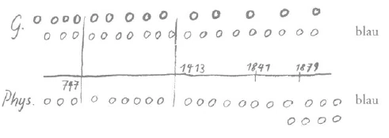
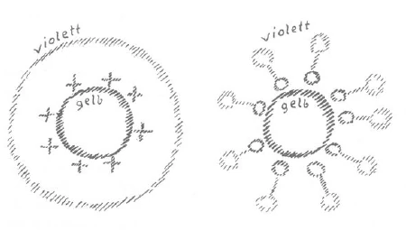

Meine lieben Freunde! Ich muß zuerst verkündigen, daß die Vorträge in Zürich verschoben worden sind. Es ist Ja jetzt außerordentlich schwierig, einen Saal zu bekommen. Die ersten öffentlichen Vorträge werden also stattfinden erst am Montag, den 5. November, und am Mittwoch, den 7. November, in der Hirschgraben-Schulaula. Dazwischen am Dienstag dann der Zweigabend, und in der nächsten Woche an denselben Tagen die anderen Vorträge. ^ckm2p3

Das Ereignis, auf das ich hingedeutet habe in den bisherigen Betrachtungen, die Herabstoßung gewisser Geister der Finsternis aus dem geistigen Reiche in das Reich der Menschen im Herbste des Jahres 1879, das ist ein bedeutsames Ereignis. Man muß sich immer wieder und wiederum vor die Seele rücken, was es eigentlich heißt: In den geistigen Reichen hat ein jahrzehntelanger Kampf stattgefunden. Dieser Kampf, der im Beginne der vierziger Jahre seinen Anfang nahm, hat damit geendet, daß gewisse geistige Wesenheiten, die wie Rebellen in der geistigen Welt sich während dieser Jahrzehnte betätigt haben, besiegt worden sind und als finstere Geister im Herbste 1879 in den Bereich der Menschenentwickelung gestoßen worden sind. Sie leben also jetzt unter uns, und sie leben so unter uns, daß sie ihre Impulse in unsere Weltauffassung, aber nicht bloß in die gedankliche Weltauffassung, sondern in unser Empfinden, in unsere Willensimpulse, auch in unsere Temperamente hereinsenden. Und nicht früher werden die Menschen die bedeutungsvollen Ereignisse der Gegenwart und auch der nächsten Zukunft nur einigermaßen verstehen, als bis sie sich darauf einlassen, wiederum die physisch-sinnliche Welt im Zusammenhang zu erkennen mit der geistigen Welt, und solch ein bedeutsames Ereignis ebenso in Betracht zu ziehen wie eine Naturerscheinung. Man ist in der Gegenwart gewöhnt, nur Naturerscheinungen, Erscheinungen des physischen Planes im geschichtlichen Werden gelten zu lassen. Man wird wiederum geistige Ereignisse, die man durch Geisteswissenschaft erkennen kann, gelten lassen müssen, um die Ereignisse, die sich so abspielen, daß wir Menschen in sie hineinverflochten sind, zu verstehen. ^bkuuyd

Nun kann man, gerade wenn man dieses bedeutsame Ereignis ins Auge faßt, ich möchte sagen, Studien darüber machen, wie der Mensch gar sehr irrt, wenn er in seiner Weltbetrachtung nur von Begriffen ausgeht, von Definitionen, nicht von der unmittelbaren Betrachtung des Wirklichen. Man hat so sehr heute das Gefühl, daß man von definierten Begriffen ausgehen soll: Was ist Ahriman, was ist Luzifer, was sind diese oder jene Geister dieser oder jener Hierarchien? - so fragt man, und wenn man Definitionen gewonnen hat, so glaubt man, daß man damit schon irgend etwas über die Wirkungsweise begriffen hat. Ich habe öfter das Ungenügende des Definitionswesens an einem krassen Beispiele gezeigt, das man schon im alten Griechenland kannte. Es ist ja natürlich nicht das Muster einer Definition, diese Definition, die in einer Schule in Griechenland über den Menschen gegeben wurde, aber es ist eine Definition, die stimmt: Ein Mensch ist ein Wesen, das auf zwei Beinen geht und keine Federn hat. Als dann der Schüler das nächste Mal wiederkam, hatte er einen Hahn mitgebracht, den er gerupft hatte: das war ein Wesen, das auf zwei Beinen geht und keine Federn hat. Das ist ein Mensch, so sagte er, nach dieser Definition. ^unpc09

Es sind ja wirklich viele Definitionen, die man gelten läßt, nach diesem Muster aufgebaut, und viele unserer sogenannten wissenschaftlichen Definitionen treffen ungefähr so die Wirklichkeit. Aber wir dürfen nicht in der Anthroposophie von solchem Definierungswesen ausgehen. Das schlechteste Erkennen ergibt sich, wenn man von Begriffen, von Abstraktionen ausgeht. Gewif, man kann den Begriff der Geister der Finsternisse, der ahrimanisch-luziferischen Wesen definieren, aber damit hat man nicht viel gewonnen. Es sind Geister der Finsternisse, die im Jahre 1879, wenn wir den Ausdruck gebrauchen dürfen, vom Himmel auf die Erde geworfen worden sind. Aber wenn wir so einen allgemeinen Begriff gewinnen über die Geister der Finsternisse, dann haben wir für das Verständnis der Sache, um die es sich handelt, nicht viel gewonnen. Denn diese Geister der Finsternisse, die jetzt unter uns wandeln, die sind von derselben Art wie jene Geister der Finsternisse, welche in alten Zeiten ebenfalls schon aus der geistigen Welt, also vom Himmel auf die Erde geworfen worden sind, welche dazumal bestimmte Aufgaben hatten, und zwar bis in die griechisch-lateinische Zeit hinein. Sie hatten diese Aufgaben das ganze atlantische Zeitalter hindurch; sie hatten sie aber auch bis in die griechisch-lateinische Zeit herein. ^9y8n6w

Nun wollen wir einmal versuchen, aus den verschiedenen Erkenntnissen heraus, die wir gewonnen haben, uns klarzumachen, was für eine Aufgabe diese Geister der Finsternisse hatten, Jahrtausende und Jahrtausende hindurch, die ganze atlantische Zeit hindurch; bis herein in das griechisch-lateinische Zeitalter. Man muß sich immer gegenwärtig halten, daß die Weltenordnung nur dadurch vor sich gehen kann, daß höhere geistige Wesenheiten, welche die normale Entwickelung der Menschheit zu leiten haben, sich solcher Geister bedienen, solche Geister gewissermaßen an die rechte Stelle hinstellen, damit sie an ihrem Ort das Rechte wirken. Wir haben es ja öfter betont, daß das Hereinspielen der sogenannten luziferischen Versuchung in alten Zeiten für die Menschheitsentwickelung eine große Bedeutung hatte. Die luziferische Versuchung ging zunächst allerdings aus einem Streben Luzifers hervor. Aber aus diesem Streben Luzifers - und später, von der atlantischen Zeit ab, war Luzifer im Bunde mit Ahriman -, aus diesem Streben ging ein Gegenstreben der Geister des Lichtes hervor, nennen wir sie die guten Geister. Im Grunde genommen wollten die Geister der Finsternis in jenen alten Zeiten in ihrer Art auch wiederum das Beste der Menschen, sie wollten die Menschen zur absoluten Freiheit prägen, wozu die Menschen in dieser Zeit allerdings noch nicht reif waren. Sie wollten die Menschen ausstatten mit jenen Impulsen, durch die jeder Einzelmensch individuell auf sich selbst gestellt werde. Das sollte aber nicht sein, weil die Menschheit dazu noch nicht reif war. ^owltii

Es mußte eine Gegenkraft entgegengesetzt werden von den Geistern des Lichtes; und diese Gegenkraft bestand darin, daß dazumal der Mensch aus geistigen Höhen auf die Erde versetzt wurde, was als die Austreibung aus dem Paradies symbolisch geschildert wird. In Wirklichkeit war dieses Herunterstoßen des Menschen vom Himmel auf die Erde das Einspinnen des Menschen in die Strömung der vererbten oder vererbbaren Eigenschaften. Luzifer und die ahrimanischen Mächte wollten, daß jeder Mensch als Individualität auf sich selbst gestellt sei. Dadurch wäre der Mensch in unreifem Zustande schnell vergeistigt worden. Das sollte nicht geschehen. Der Mensch sollte auf der Erde erzogen werden, sollte durch die Kräfte der Erde ausgebildet werden. Das geschah dadurch, daß der Mensch eingesponnen wurde in die Vererbungsströmung, so daß einer von dem andern physisch abstammte. Nicht mehr auf sich selbst gestellt war jetzt der Mensch, sondern er erbte gewisse Eigenschaften von seinen Vorfahren. Er war dadurch belastet mit irdischen Eigenschaften, die Luzifer nicht über ihn hat kommen lassen wollen. Alles, was in der physischen Vererbungslinie liegt, ist von den Geistern des Lichtes als Gegenströmung gegen die Strömung Luzifers den Menschen aufgeprägt worden. Dem Menschen ist gewissermaßen ein Gewicht angehängt worden, durch das er verbunden wurde mit dem Erdendasein, so daß wir mit alle dem, was in Verbindung steht mit Vererbung, mit Zeugung, mit Fortpflanzung, mit der Liebe auf dem irdischen Felde, uns verbunden denken müssen jene geistigen Wesenheiten, deren Führerschaft als Jahve oder Jehova bezeichnet wird. ^k4cjfa

Wenn wir daher in die alten Religionen zurückgehen, so finden wir auch aus diesem Grunde überall die Symbole der Zeugung, die Symbole der irdischen Vererbung. Und sogar an der Gesetzgebung des Judentums, die das Christentum vorbereiten sollte, und an den andern, den heidnischen Religionen, überall ist es zu bemerken, daß großer Wert darauf gelegt wird zu regeln, zu ordnen im irdischen Felde dasjenige, was in dem Gesetze der Vererbung steht. Die Menschen sollten lernen, zusammenzuwohnen nach Stämmen, nach Völkern, nach Rassen. Die Blutsverwandtschaft sollte die Signatur geben für die irdischen Ordnungen. ^24jij2

Das hatte sich vorbereitet während der atlantischen Zeit, das hatte sich dann im wesentlichen wiederholt, namentlich durch all die Maßnahmen, die getroffen worden sind in der dritten, der ägyptisch-chaldäischen Kulturperiode, in der vierten, in der griechischlateinischen Kulturperiode. Wir sehen, daß gerade in diesen Zeiten, die das lemurische, das atlantische Zeitalter wiederholen sollten, daß da in allen menschlichen Ordnungen überall Rücksicht genommen wurde auf Rassen, Völker, Stammeszusammenhänge, kurz, auf jene vererbbaren Eigenschaften, welche auf dem Zusammenhang des Blutes beruhten. Die Mysterienpriester, von denen ja im wesentlichen alle Ordnung - heute würde man sagen staatliche Ordnung — ausgegangen ist, die Mysterienpriester haben es sich angelegen sein lassen, überall zu beobachten, wie sich da und dort die Sitten, die Neigungen, die Gewohnheiten der Menschen ausbilden mußten nach den Blutsverwandtschaften, nach den Volks- und Stammeszusammengehörigkeiten. Danach haben sie ihre Gesetze gegeben. Und man kann das, was von den Mysterien des dritten und vierten nachatlantischen Kulturzeitraums ausgegangen ist, nicht verstehen, wenn man nicht zugrunde legt das sorgfältige Studium der Rassen-, Völker- und Stammeszusammenhänge, das durch Mysterienpriester getrieben worden ist, von denen eben die Gesetzgebungen für die einzelnen Gebiete der Erde ausgegangen sind. Und für diese einzelnen Gebiete der Erde war im Grunde genommen nichts anderes geltend als das In-Ordnung-Bringen der Blutsbande. ^fumgps

In diesen Zeiten, in denen also sozusagen die Geister des Lichtes sich haben angelegen sein lassen, die Menschenzusammenhänge nach den Blutsbanden zu ordnen, haben es sich die mit den Menschen vom Himmel zur Erde verstoßenen Geister der Finsternis angelegen sein lassen, gegen alles, was Blutsvererbung ist, zu arbeiten. Und alles, was wir in diesen charakterisierten Zeitaltern finden an rebellischer Auflehnung gegen die Blutsverwandtschafts-Ordnungen, alles, was wir in diesen Zeiten finden an Lehren, die natürlich durch die Menschen kommen, aber inspiriert von den Geistern der Finsternis, alles, was an solchen Rebellenlehren kommt, was sich auflehnt gegen die Vererbung, gegen die Stammes-, gegen die Rassenzusammenhänge, was da pocht auf die individuelle Freiheit, was Gesetze geben will aus der individuellen Freiheit des Menschen heraus, das rührt eben von den herabgestoßenen Geistern her. Diese Zeiten ragen bis ins 15. Jahrhundert herein. Nachklänge sind natürlich immer vorhanden, denn die Ordnungen hören nicht gleich auf, wenn der scharfe Einschnitt in der Entwickelung gemacht ist. Aber namentlich bis zum 15. Jahrhundert sehen wir überall Lehren ersprießen, die sich gegen die bloß natürlichen Bande auflehnen, gegen die Verwandtschaftsbande, Familienbande, Volkszusammengehörigkeiten und so weiter auflehnen. ^5fc4ne

So sehen wir die zwei Strömungen: die eine Strömung, welche wenn ich mich so ausdrücken darf - protegiert alles, was Blutsbande sind, die Strömung des Lichtes; auf der andern Seite die Strömung der Finsternis, die alles dasjenige protegiert, was aus den Blutszusammenhängen heraus will, was den Menschen dahin bringen will, sich freizumachen von Familien- und Vererbungsbanden. Gewiß, es hört nicht alles mit einem Schlage auf, geradeso, wie in der Natur nicht alles mit einem Schlage aufhört. So hat im Jahre 1413, das das Einschnittsjahr ist, wo die Grenze ist zwischen dem vierten und fünften nachatlantischen Zeitraum, nicht alles gleich aufgehört. Und wir sehen bis in die heutige Zeit herein diese zwei Strömungen nachwirken. Denn seit dem 19. Jahrhundert, seit diesen bedeutsamen Ereignissen, die ich Ihnen geschildert habe, sehen wir etwas ganz anderes aufkommen - ich habe es ja schon angedeutet -: Engelartige Wesen, Wesen aus der Hierarchie der Angelo: sind es, die seit dem Jahre 1879 unter uns wirken, Nachzügler der alten Geister der Finsternis, verwandt mit ihnen, gleicher Art mit ihnen, aber erst durch das Ereignis von 1879 sind sie vom Himmel auf die Erde gestoßen worden. Bis dahin haben sie ihre Aufgabe oben verrichtet, während ihre Verwandten, die das getan haben, was ich eben charakterisiert habe, schon seit dem lemurischen, seit dem atlantischen Zeitalter unter den Menschen waren. ^8me5oe

 ^fjkhmp

So daß wir also sagen können (es wird an die Tafel gezeichnet): Wenn wir dies als Grenzlinie gelten lassen wollen zwischen dem geistigen Reich und dem physischen Reich und wenn wir die fortlaufende Linie der Geister des Lichtes schematisch durch die kleinen Kreise bezeichnen (Kreise oben), so haben wir hier einen Einschnitt: 747 vor dem Mysterium von Golgatha, und hier haben wir einen Einschnitt: 1413 nach dem Mysterium von Golgatha. Und hier weiter (ganz rechts) bezeichnen wir den Einschnitt, den wir jetzt besonders brauchen - auf Entfernungen brauchen wir uns dabei nicht einzulassen -: 1879. Wir haben in dieser ganzen Zeit Geister der Finsternis wirksam hier unten (blaue Kreise unten), während gewisse andere Geister der Finsternis noch oben sind in dieser ganzen Zeit (blaue Kreise oben); sie sind verwandt mit den unteren, aber sie sind noch oben. Vom Jahr 1841 an ist jener mächtige Kampf, von dem ich Ihnen gesprochen habe. Diese Geister, die also verwandt sind mit den andern, kommen zu den unteren hinzu, steigen herunter und sind jetzt unter den andern. Aber die Kraft der alten Rebellen, die Kraft also der sich fortpflanzenden Strömung der Geister der Finsternisse, die ihre Aufgabe hatten in dem chaldäisch-ägyptischen Zeitalter, in dem griechisch-lateinischen Zeitalter, die ihre Aufgabe seit der atlantischen und lemurischen Zeit her haben, diese Kraft erlischt allmählich, und es beginnen eben die Kräfte der erst 1879 heruntergestoßenen Geister zu wirken. Während gewissermaßen ihre Brüder aufhören, Macht zu haben, beginnen diese Geister zu wirken, so daß wir seit diesem letzten Drittel des 19. Jahrhunderts eigentlich eine vollständige Umkehrung aller Verhältnisse haben. Die regelrecht fortwirkenden Geister des Lichtes haben genug getan in der Festlegung der Blutsbande, der Stammes-, der Rassenbande und so weiter, denn in der Entwickelung hat alles seine bestimmte Zeit. Dasjenige, was gefestigt worden ist in der Menschheit durch die Blutsbande, dem ist genug geschehen in der allgemeinen gerechten Weltenordnung. So daß seit dieser neueren Zeit die Geister des Lichtes sich so wandeln, daß sie jetzt den Menschen inspirieren, freie Ideen, Empfindungen, Impulse der Freiheit zu entwickeln, daß sie es sind, die den Menschen auf die Grundlage seiner Individualität stellen wollen. Und die den alten Geistern der Finsternis verwandten Geister, die bekommen jetzt nach und nach die Aufgabe, in den Blutsbanden zu wirken. ^wxlot6

Das, was gut war in alten Zeiten, oder besser gesagt, was in der Sphäre der guten Geister des Lichtes war, das wird abgegeben im letzten Drittel des 19. Jahrhunderts an die Geister der Finsternis. So daß von da ab die alten Impulse, die sich auf Rassen-, Stammes- und Volkszusammenhänge, auf das Blut gründen, übergehen in die Regierung der Geister der Finsternis, daß von da ab die Geister der Finsternis, die früher die Rebellen der Freiheit waren, den Menschen einzuimpfen beginnen, die Ordnungen auf Stammeszusammengehörigkeiten, auf Blutsbande zu begründen. ^3dk3d7

Sie sehen, definieren kann man nicht. Denn definiert man die Geister der Finsternis nach ihrer Aufgabe in alten Zeiten, so bekommt man gerade das Gegenteil von dem heraus, was die Geister der Finsternis in neuen Zeiten, seit dem letzten Drittel des 19. Jahrhunderts, als Aufgabe haben. In alten Zeiten hatten die Geister der Finsternis die Aufgabe, entgegenzuarbeiten den vererbten Merkmalen der Menschen; seit dem letzten Drittel des 19. Jahrhunderts bleiben sie zurück, wollen zurückbleiben, wollen die Menschen immer wieder und wiederum hinweisen, auf ihre Stammes- und Bluts- und Vererbungszusammenhänge zu pochen. ^0qmt6j

Diese Dinge sind einfach eine Wiedergabe der Wahrheit, aber einer Wahrheit, die den Menschen heute im höchsten Grade unbequem ist, die die Menschen heute nicht hören wollen, denn sie haben sich durch Jahrtausende das Pochen auf die Blutsbande eingeimpft. Und diese Gewohnheit lassen sie aus Bequemlichkeit übergehen in die Führung der Geister der Finsternisse. Und so sehen wir, daß gerade im 19. Jahrhundert ein Pochen auf Stammes- und Volks- und Rassenzusammenhänge beginnt und daß man von diesem Pochen als einem idealistischen spricht, während es in Wahrheit der Anfang ist einer Niedergangserscheinung der Menschen, der Menschheit. Denn während alles dasjenige, was auf die Herrschaft des Blutes gebaut war, Fortschritt bedeutete, solange das Blut unter der Herrschaft der Geister des Lichts war, bedeutet es unter der Herrschaft der Geister der Finsternisse Niedergangserscheinung. Im stärksten Maße werden sich die Geister der Finsternis anstrengen. Wie sie sich früher angestrengt haben, den rebellischen Sinn für die Freiheit in die Menschen zu pflanzen, als die Vererbungsmerkmale im guten Sinne von den fortschrittlichen Geistern vererbt wurden, so werden sie sich im äußersten Maße anstrengen in den drei folgenden Zeiten der Menschheitsentwickelung bis zu der großen Katastrophe, durch die Konservierung der alten Vererbungsmerkmale und der aus der Konservierung dieser Vererbungsmerkmale folgenden Gesinnung die notwendigen Niedergangsmerkmale in die Menschheit zu bringen. ^6vmahq

Da ist wiederum ein Punkt, an dem man wachsam sein muß. Und insbesondere kann man den gegenwärtigen Zeitpunkt nicht verstehen, wenn man nicht weiß, was für ein Austausch von Funktionen gerade im letzten Drittel des 19. Jahrhunderts sich vollzogen hat. Ein Mensch noch des 14. Jahrhunderts, der gesprochen hat von dem Ideal der Rassen, von dem Ideal der Nationen, der hat gesprochen aus den fortschreitenden Eigenschaften der menschlichen Entwickelung heraus; ein Mensch, der heute von dem Ideal von Rassen und Nationen und Stammeszusammengehörigkeiten spricht, der spricht von Niedergangsimpulsen der Menschheit. Und wenn er in diesen sogenannten Idealen glaubt, fortschrittliche Ideale vor die Menschheit hinzustellen, so ist das die Unwahrheit, denn durch nichts wird sich die Menschheit mehr in den Niedergang hineinbringen, als wenn sich die Rassen-, Volks- und Blutsideale fortpflanzen. Durch nichts wird der wirkliche Fortschritt der Menschheit mehr aufgehalten als dadurch, daß aus früheren Jahrhunderten stammende, von luziferisch-ahrimanischen Mächten fortkonservierte Deklamationen herrschen werden über die Ideale der Völker, während das wirkliche Ideal dasjenige werden müßte, was in der rein geistigen Welt, nicht aus dem Blute heraus gefunden werden kann. ^yydy3d

Der Christus, der im Laufe des 20. Jahrhunderts erscheinen soll, in besonderer Form erscheinen soll, der wird nichts wissen von jenen sogenannten Idealen, von denen heute die Menschen deklamieren. Denn so wie da das Wesen aus der Hierarchie der Archangeloi, das wir als Michael bezeichnen, gewissermaßen der Statthalter Jahves in früheren Zeiten war, wird er sein durch jene Funktionen, die er 1879 übertragen erhalten hat, der Statthalter des Christus, des Christus-Impulses, der darauf hinausläuft, an die Stelle der bloß natürlichen Blutsbande geistige Bande unter den Menschen zu schaffen, denn nur durch geistige Zusammengehörigkeitsbande wird in das Niedergehende, das ganz naturgemäß ist, Fortschreitendes hineinkommen. Ich sage: das Niedergehende ist naturgemäß. Denn geradeso wie der Mensch, wenn er ins Alter kommt, nicht ein Kind bleiben kann, sondern mit seinem Leib in eine absteigende Entwickelung eintritt, so trat auch die ganze Menschheit in eine absteigende Entwickelung ein. Wir haben den vierten Zeitraum überschritten, wir sind im fünften darinnen; der sechste und der siebente werden mit dem fünften zusammen das Alter der gegenwärtigen Weltentwickelung sein. Zu glauben, daß die alten Ideale fortleben können, ist geradeso gescheit, wie zu glauben, daß der Mensch sein ganzes Leben hindurch buchstabieren lernen soll, weil es dem Kinde gut ist, buchstabieren zu lernen. Ebenso gescheit wäre es, wenn man in der Zukunft davon reden wollte, daß über die Erde hin eine soziale Struktur sich ausbreiten soll auf Grundlage der Blutszusammengehörigkeit der Völker. Das ist zwar Wilsonianismus, das ist aber zu gleicher Zeit Ahrimanismus, das ist Geist der Finsternis. ^ezrigw

Es ist gewiß unbequem, solch eine Wahrheit anzuerkennen; es ist bequemer heute, in die Phraseologien, die über die ganze Erde hingehen, einzustimmen. Aber der Gang der Wirklichkeit geht nicht nach Phrasen, der Gang der Wirklichkeit geht nach den wahren Impulsen. Und man wird nicht im Sinne der Wahrheit umstempeln können dasjenige, was für die fünfte, sechste und siebente Periode nicht mehr gültig ist, auch wenn man es in einer heute für die bequeme Menschheit noch überzeugungsfähigen Form, in Wilsonsche Weltenprogramme hineingießt. ^40epfe

Es gibt noch genügend Menschen heute, die durchaus nicht soweit kommen wollen, unabhängig von allen Blutsbanden solche allgemein-menschlichen Wahrheiten aufzunehmen. Allgemeinmenschliche Wahrheiten sind sie, weil sie nicht von der Erde gekommen sind, sondern weil sie heruntergeholt sind aus den geistigen Welten. Wie furchtbar ist die Reaktion, die heute sich schon vollzieht dadurch, daß eine ganze Welt fast sich auflehnt gegen den wirklichen Fortschritt der Menschen, indem man in die Phrase der Befreiung der Völker einkleidet, was gegen den Strom der Entwickelung geht. Das war immer das Schicksal der Mysterienwahrheiten, daß sie gegen den Strom der Bequemlichkeit, aber mit dem Strom der Entwickelung gehen mußten. Und es wird sich zeigen, ob wenigstens ein kleiner Kreis von Menschen sich findet, der sich unabhängig von allen Blutsvorurteilen aufschwingen kann zu der Erkenntnis von der Phraseologie, die heute über die Erde geht und die nichts anderes bedeutet als ein Aufschießen hinauf an die Oberfläche dessen, was geistig sich darstellt als das Ereignis vom November 1879. ^rkmhsd

Die Ereignisse der Gegenwart, sie wurden von den eingeweihten Geistern aller Nationen vorausgesehen. Sie wurden vorausgesehen und vorausgesagt, und hingewiesen wurde darauf, wie aus dem Blute der Menschen emporsprudeln wird reaktionärste Gesinnung, weil der Glaube herrschen wird, daß diese reaktionäre Gesinnung gerade das Idealste ist. Man muß derlei Dinge im großen und im kleinen beobachten können, man muß sich nicht stören lassen von dem, was heute als Phrasenurteil durch die Welt geht. Man muß sich schon ein wenig aufschwingen können zum Verständnis der Zeichen der Zeit. Gewiß, man kann ja den andern Weg wählen, man kann den Weg wählen des Drinnen-Stehenbleibens in den Blutsvorurteilen; dann wird man eben sich den abwärtsgehenden Strömungen anschließen. Die kommen schon. Aber man muß ihnen gegenüber nur in der richtigen Weise wachsam sein und ihnen entgegenstellen können, was aufwärtsstrebend ist, denn das Abwärtsstrebende kommt von selber. ^7ixuee

Fühlen muß man, wo das Leben aufsteigt, wo das Leben absteigt. Nicht in das törichte Vorurteil soll man verfallen, das Absteigeleben zu fliehen: Ich will nichts zu tun haben mit Luzifer, ich will nichts zu tun haben mit Ahriman. - Ich habe oftmals dieses törichte Vorurteil gerügt in unseren Betrachtungen, denn selbstverständlich muß man mit diesen Geistern, die in dem Dienste der Weltenordnung stehen, rechnen. Berücksichtigt man sie nicht, verhält man sich so, daß sie außerhalb des Bewußtseins bleiben, so haben sie eine um so stärkere Macht. Aber das, was in der Menschheit auftritt, wird man nur dann in der richtigen Weise beurteilen können, wenn man die großen Gesichtspunkte hat über die Impulse des auf- und absteigenden Lebens. Man muß sich da nur von Sympathien und Antipathien freihalten. ^8p79w0

Wir haben auf dem Gebiete der Naturwissenschaft der neueren Zeit zwei Strömungen heraufkommend, von denen ich die eine bezeichnete als Goetheanismus, die andere als Darwinismus. Verfolgen Sie meine Schriften ganz von Anfang an: Sie werden sehen, daß ich niemals die ganze tiefgehende Bedeutung des Darwinismus verkannt habe. Törichte Menschen haben sogar gefunden, wenn ich pro Darwin geschrieben habe, daß ich selber dem Materialismus verfallen gewesen wäre und dergleichen. Nun, wir wissen ja, daß diese Dinge nicht aus Überzeugungen herausstammen, sondern aus ganz andern Untergründen; und diejenigen, die solche Dinge vorbringen, wissen am allerbesten, wenn sie darüber nachdenken, daß sie nicht wahr sind. Aber wenn Sie wirklich meine Schriften verfolgen, so werden Sie sehen, daß ich dem Darwinismus immer gerecht geworden bin, aber eben gerade dadurch gerecht werden konnte, daß ich ihm entgegengestellt habe den Goetheanismus, die Auffassung von der Entwickelung des Lebens. Das, was man Deszendenztheorie nennt, auf der einen Seite im Sinne des Darwinismus, auf der andern Seite im Sinne des Goetheanismus, diese Dinge versuchte ich immer miteinander zu verbinden. Warum? Weil im Goetheanismus die aufsteigende Linie lebt, das Herausheben der organischen Entwickelung aus dem bloß physikalischen, physischen Dasein. ^1g5xcy

Wie oft habe ich auf das Gespräch zwischen Goethe und Schiller hingewiesen, wo Schiller, als Goethe seine Urpflanze aufzeichnete, sagte: Das ist keine Empirie, das ist keine Erfahrung, das ist eine Idee. —- Da sagte Goethe: Dann habe ich meine Idee vor Augen! -, weil er überall das Geistige sah. Da haben wir eine Entwickelungslehre bei Goethe veranlagt, die den Keim in sich trägt, zu den höchsten Sphären heraufgehoben zu werden, angewendet zu werden für Seele und Geist. Wenn Goethe auch nur für die organische Entwikkelung in der Metamorphosenlehre den Anfang gemacht hat, wir haben die Evolution des Geistes, zu der die Menschheit von diesem fünften nachatlantischen Zeitraum an kommen muß, weil der Mensch sich verinnerlicht, wie ich es in diesen Betrachtungen dargestellt habe. Goetheanismus kann eine große Zukunft haben, denn die ganze Anthroposophie liegt in seiner Linie. Darwinismus betrachtet die physische Entwickelung von der physischen Seite her: äußere Impulse, Kampf ums Dasein, Selektion und so weiter und stellt damit die absterbende Entwickelung dar, alles dasjenige, was man finden kann über das organische Leben, wenn man sich den Impulsen überläßt, die in früheren Zeiten groß geworden sind. Will man Darwin verstehen, so muß man nur synthetisch zusammenfassen alle Gesetze, die früher aufgefunden worden sind. Will man Goethe verstehen, muß man sich aufschwingen zu neuen und immer neuen Gesetzmäßigkeiten im Dasein. Beides ist notwendig. Der Fehler besteht nicht darin, daß es einen Darwinismus gibt oder daß es einen Goetheanismus gibt, sondern darin, daß die Menschen dem einen oder dem andern und nicht dem einen und dem andern anhängen wollen. Das ist es, worauf es ankommt. ^163rg3

Daß der Mensch immer jünger und Jünger werde, je älter er wird, wenn er seine Seele gut entwickelt, wird in der Zukunft nur möglich sein, wenn er geistige Impulse in sich aufnimmt. Nimmt er geistige Impulse in sich auf, dann kann er graue Haare bekommen und Runzeln und alle möglichen Gebresten: er wird jünger und immer jünger, weil er in der Seele jene Impulse aufnimmt, die er durch die Pforte des Todes trägt. Aber wenn man nur mit dem Leibe geht, kann man nicht jünger werden. Dann erlebt man auch in der Seele alles mit, was der Leib lebt. Selbstverständlich kann man sich nicht abgewöhnen, grau zu werden, aber man kann sich eine junge Seele holen aus den Quellen des spirituellen Lebens für den ergrauten Kopf. So wird die Entwickelung der Menschheit im fünften, sechsten, siebenten Zeitraum im Sinne der - verzeihen Sie die merkwürdige Ausdrucksweise — grauhaarigen Darwinschen Theorie vor sich gehen. Aber die Menschen werden sich holen müssen, damit sie durchgehen können durch jene Katastrophe, die man mit dem Erdentode vergleichen kann - die Katastrophe der Zukunft -, sie werden sich holen müssen die Jugendkraft der Metamorphosenlehre, der geistigen, der spirituellen Evolutionslehre, die im Goetheanismus liegt. Die muß durch die Zukunftskatastrophe durchgetragen werden, so wie die verjüngte Seele durch die Pforte des Todes beim individuellen Menschen getragen wird. ^l60tpj

Dadurch, daß der Mensch - wenn wir die Ausdrücke gebrauchen dürfen - vom Himmel auf die Erde gekommen ist und mit ihm jene Geister der Finsternis, die ihm einen genügenden Fonds eingeprägt haben zu seiner Befreiung während der Zeit, in welcher die Gesetze der Vererbung herrschten, die Gesetze der Nationalität, das Rassenhaftige herrschten, dadurch hat der Mensch die Möglichkeit gefunden, sich mit der Erde zu verbinden. Die Tat des Luzifer und Ahriman, sie ist zum Guten gewendet worden dadurch, daß der Mensch durch sie die Möglichkeit gefunden hat, sich mit der Erde zu verbinden. Wollen wir dafür eine schematische Zeichnung entwerfen, so können wir sagen: Der Mensch war verbunden mit dem ganzen Kosmos einschließlich der Erde (Zeichnung links, violetter Kreis) vor der luziferischen Tat; er hat sich verbunden mit der Erde (gelb) dadurch, daß ihm die Vererbungseigenschaften — die Erbsünden, wie man biblisch spricht, die Vererbungseigenschaften, wie man naturwissenschaftlich spricht - eingepflanzt worden sind. Dadurch ist der Mensch, den ich hier in Kreuzesform zeichne, zu einem Gliede der Erde geworden. Sie sehen, Luzifer und Ahriman sind die Diener der fortschreitenden Mächte. ^ig01t0

 ^mxsxr1

Nun geht die Entwickelung weiter. Wir leben in der Zeit, in welcher der Mensch auf der Erde lebt, verbunden mit der Erde. Luziferisch-ahrimanische Geister, Geister der Finsternisse, sind vom Himmel auf die Erde gestoßen worden. Dadurch muß der Mensch wiederum befreit werden von der Erde, losgerissen von der Erde, indem ein Teil seines Wesens wiederum zurückgebracht wird in die geistige Welt (Zeichnung rechts). Ein Bewußtsein muß sich in der Menschheit entwickeln, daß wir nicht von dieser Erde sind, und immer stärker und stärker muß dieses Bewußtsein werden. In der Zukunft muß der Mensch über die Erde schreiten, indem er sich sagt: Gewiß, ich ziehe ein mit meiner Geburt in einen physischen Leib, aber das ist ein Durchgangsstadium. Ich bleibe eigentlich in der geistigen Welt, ich bin mir bewußt, daß nur ein Teil meines Wesens an die Erde gebunden ist, daß ich mit meinem ganzen Wesen nicht heraustrete aus der Welt, in der ich zwischen Tod und neuer Geburt bin. Dieses Zusammengehörigkeitsgefühl mit der geistigen Welt, das muß sich entwickeln. ^e13eal

In früheren Jahrhunderten hat das nur einen falschen Schatten vorausgeworfen, indem man das physische Leben nicht verstehen wollte und eine falsche Askese getrieben hat, geglaubt hat, durch allerlei Abtötungsmaßregeln des physischen Leibes könnte man das erlangen. Das muß aber verstanden werden, daß der Mensch nicht durch solche falsche Askese, sondern durch das Verbinden mit Geistigem, Substantiell-Wesenhaftem gewahr wird: Es ist in Wirklichkeit dieser Mensch kein bloßes Erdenwesen, sondern ein Wesen, das dem ganzen Kosmos angehört. Die physische Wissenschaft hat nur Vorbereitungen dazu getroffen. Denken Sie sich, wie abhängig der Mensch gerade bis ins 15. Jahrhundert herein, bis zum Ablauf der griechisch-lateinischen Zeit, von dem Boden war, auf dem er gewissermaßen gewachsen ist, wie sehr sich der Mensch im Zusammenhange mit dem Boden entwickelte. Das war gut, das darf aber nicht die Hauptsache bleiben. ^lrrgh5

Ja, das seelische Bewußtsein muß losgerissen werden von der Erde, wie die physische Wissenschaft nur im Physischen, im Kopernikanismus, den Menschen losgerissen hat von der Erde. Die Erde ist ein kleiner Körper im Weltenraum geworden; aber zunächst ist das bloß räumlich. Schon durch den Kopernikanismus ist der Mensch gewissermaßen, wenn auch noch ganz abstrakt, in die kosmische Sphäre hinausversetzt worden. Das muß weitergehen. Man soll das aber nicht in falscher Weise auf das physische Leben übertragen. Das Physische geht schon seinen Gang. Nehmen Sie Amerika, das heißt, nicht die Bevölkerung, die es aus seinem Boden heraus seit Jahrhunderten hatte. Sie wissen, da ist eine neue Bevölkerung gekommen in der neueren Zeit, die ganz von Europäern gebildet ist. Wer diese Bevölkerung feiner beobachtet, dem zeigt sich, daß das physische Leben sich nicht freimacht von dem Gebundensein an den physischen Erdboden: Die Amerikaner, die eigentlich Europäer sind, aber nach Amerika verpflanzt sind, sie bekommen allmählich Eigenschaften, die an die alten Indianer erinnern - wenn das auch heute noch nicht sehr weit fortgeschritten ist, so ist es doch wahr -, die Arme bekommen eine andere Länge, als sie in Europa hatten, dadurch, daß der Mensch nach Amerika verpflanzt ist. Der physische Mensch paßt sich dem Boden schon an. Das geht sogar so weit, daß ein beträchtlicher Unterschied ist in der physischen Gestaltung zwischen den West- und Ostamerikanern. Wir können daraus sehen, wie stark der Einfluß des Bodens ist. Äußerlich, physisch «indianisiert» sich der Europäer in Amerika. Wenn die Seele nun mitgeht mit diesem physischen Prozeß, wie das in früherer Zeit der Fall war, dann würde ein Wiederaufleben der Indianerkultur kommen - nur mit europäischen Phrasen. Das ist etwas paradox gesprochen, aber es ist doch so. Die Menschheit kann eben in der Zukunft nicht mehr gebunden sein an dasjenige, was sie mit dem Erdboden verbindet; freiwerden muß die Seele. Dann kann der Mensch über die Erde hin die physischen Eigenschaften seines Bodens annehmen, dann kann der Körper der Europäer, wenn er nach Amerika kommt, «verindianisieren», aber der Mensch reißt sich mit seiner Seele los von dem Physisch-Irdischen und wird ein Bürger der geistigen Welten. Und in den geistigen Welten gibt es nicht Rassen und nicht Nationen, sondern andere Zusammenhänge. ^vrgqlc

Es sind das schon Dinge, die man heute gegenüber den großen, gewaltigen Ereignissen, die über die Erde gehen, verstehen muß, wenn man nicht - verzeihen Sie den Ausdruck - ein Bock sein will, der die altgewohnten Vorurteile als die neuen Ideale aufweisen wird. ^3ygkpz