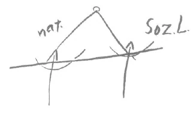

Heute möchte ich einiges mehr zur Vorbereitung für das Bild geben, das ich dann morgen in einem umfassenderen Sinne zum Abschluß bringen werde. ^9ozb63

Die Gegenwart ist eine Zeit - Sie werden es wiederum aus dem Inhalt der gestrigen Betrachtungen gefühlt haben -, von der man sagen kann, daß sich viel wird ändern müssen im Denken, im Fühlen, im Wollen der Menschen. Die Seelenrichtungen werden andere werden müssen. Gerade mit Bezug auf das innerste Seelenleben werden alte, vererbte, anerzogene Gewohnheiten schwinden müssen, und eine neue Form des Denkens und Fühlens wird auftreten müssen. Das wird die Zeit fordern. Ich denke, es kann auf jeden einen bedeutsamen und tief in die Seele gehenden Eindruck machen, wenn er die Wahrheit, die gestern besprochen worden ist, auf seine Seele wirken läßt, die Wahrheit, trivial gesprochen, von der Austauschbarkeit zerstörender Vorgänge hier auf dem physischen Plan und der Spiritualisierung der Menschheit. Denn bedenken wir nur einmal, daß wir unter dem Eindruck einer solchen Wahrheit genötigt sind, uns mit den Toten, mit den Hinweggegangenen als eine, sagen wir soziale Einheit zu fühlen. Man kann gewiß mit tiefem Schmerze empfinden, was hier auf dem physischen Plane geschieht, und man soll es; aber man darf auf der andern Seite nicht vergessen, daß die Seelen, die nicht zu den wenigen gehören, die in den letzten Jahrzehnten spirituelles Leben aufgenommen haben, dürsten nach zerstörenden Vorgängen hier auf dem physischen Plan, weil sie aus diesen zerstörenden Vorgängen Kräfte für das geistig-seelische Leben nach dem Tode schöpfen. Und wir bekommen daraus die praktische Aufforderung, alles, was an uns ist, zu tun, um das einzige, was in der Zukunft von der Menschheit die zerstörenden Kräfte wird hinwegnehmen können - das spirituelle Leben -, zu fördern. Wir müssen es uns nur ganz klarmachen, daß für vergangene Zeiten es anders war, daß da noch nicht in solchem Ausmaße galt, daß jedes materialistische Zeitalter ein Zeitalter der Kriege, der Verwüstungen hervorrufen muß. Aber in der Zukunft wird es so sein. ^uj4nwg

Die Menschheit leidet ja unter vielen von alters her gekommenen Illusionen. Diese Illusionen waren bisher nicht so schlimm, wie sie in der künftigen Entwickelung der Menschheit sein werden. Nun kann man ja im allgemeinen sagen, daß die Seelen der zeitgenössischen Menschen noch recht sehr schlafen und vieles von dem nicht bemerken, was sich in unserer Gegenwart so gewaltig ändert. Aber manchmal kommt dies oder jenes doch instinktiv durch. Mancher empfindet dann die großen Rätsel der Gegenwart. Nur sind viele noch nicht veranlagt dazu, sie in aller Tiefe, mit aller Energie zu empfinden. ^kij6qp

Ein solches Rätsel wird jetzt unter dem Eindrucke der stürmischen, zerstörerischen Ereignisse von einigen Menschen bemerkt. Aber in vieler Beziehung sind diese Menschen hilflos, sich Antwort zu geben auf solche Rätsel. Das Rätsel, das ich meine, ist die in der Menschheitsentwickelung vorhandene Diskrepanz zwischen der intellektuellen Entwickelung und der moralischen Entwickelung. Zum ersten Mal ist dieses ja auch in der neueren Zeit, der Zeit der materialistischen Vorstellungen, wiederum gerade den Darwinisten aufgegangen; auch Haeckel hat eine ähnliche, dahingehende Bemerkung in seinen «Welträtseln» gemacht. Aber jetzt während dieser Kriegszeit merkt man immer mehr und mehr, wie diese Disharmonie zwischen dem intellektuellen und dem moralischen Leben der Menschheit in ihrer Entwickelung für gewisse Seelen ein Rätsel wird. Die Leute sagen sich mit Recht: Welche ungeheuren Fortschritte hat das intellektuelle, das Verstandesleben gemacht, dasjenige Leben, welches heute viele Menschen wissenschaftliches Leben nennen, worauf sie die heutige materialistische Weltanschauung bauen, welche ungeheuren Fortschritte hat der Verstand des Menschen gemacht, die Durchdringung der Naturgesetze; die Beherrschung der Naturgesetze, um allerlei Instrumente - in der neueren Zeit insbesondere Mordinstrumente - zu bauen! Über anderes werden die Menschen noch aus dieser ihrer Wissenschaft heraus nachdenken; sie werden zum Beispiel analysieren, woraus die Nahrungsmittel bestehen und werden chemische Nahrungsmittel fabrizieren, ohne Ahnung davon, daß chemische Nahrungsmittel nicht in demselben Sinne Nahrungsmittel sind wie diejenigen, welche die Natur liefert, trotzdem sie aus demselben Stoff bestehen können. ^xy963z

Die intellektualistische, die, wenn wir so sagen wollen wissenschaftliche Entwickelung ist in aufsteigender Linie verlaufen. Nicht in demselben Maße hat sich das Moralische der Menschen entwikkelt. Wie hätte die gegenwärtige Weltkatastrophe hereinbrechen können, wie hätte sie verlaufen können in der Weise, wie sie heute verläuft, wenn die moralische Entwickelung der Menschen in gleichem Maße fortgeschritten wäre wie die intellektuelle! Ja man kann sagen: Gerade dadurch, daß die moralische Entwickelung der Menschen nicht fortgeschritten ist, hat die intellektuelle Entwickelung eine gewisse unmoralische Signatur angenommen, ist geradezu in vieler Beziehung zu einem Zerstörerischen fortgeschritten. — Das bemerken heute schon viele Menschen, daß eine Diskrepanz, eine Disharmonie vorhanden ist zwischen der moralischen und der intellektuellen Entwickelung der Menschen. Nur fordert es die heutige Zeit nicht, daß solche Fragen, wenn sie der wirklichen Evolution der Menschheit nützen sollen, tief genug angefaßt werden, daß sie da angefaßt werden, wo man wirklich sieht: Der heutige Mensch kann sich ja über die tieferen Untergründe des menschlichen Denkens und Handelns gar nicht unterrichten, weil ihm sich alles vermischt, was im Menschen getrennt und ganz verschiedenen Gebieten des Weltenalls zugeordnet ist. ^ihzk53

Die heutige Wissenschaft hat den Menschen vor sich - physischer Leib, Bildekräfte- oder Ätherleib, astralischer Leib, Ich -, aber das alles durcheinandergemischt. Die Wissenschaft unterscheidet das nicht. Aber wie kann es denn zu einer Wissenschaft, die ausreichend ist, um die Dinge zu begreifen, überhaupt kommen, wenn man alles durcheinandermischt, da doch diese verschiedenen Glieder der Menschennatur ganz verschiedenen Gebieten des Weltenalls zugeteilt sind, mit ganz verschiedenen Sphären des Weltenalls zusammenhängen? Mit unserem physischen Leib und unseren Bildekräften sind wir hier in der physischen Welt; mit unserem astralischen Leib und unserem Ich gehen wir jede Nacht in eine ganz andere Welt hinein, in eine Welt, die zunächst außerordentlich wenig zu tun hat mit der Welt, in der wir das Tagwachen zubringen. Die beiden Welten wirken eigentlich nur dadurch zusammen, daß sie eben in der menschlichen Natur zusammenkommen. ^dp6rwr

Und dann bedenken Sie, um wieviel jünger das menschliche Ich und der menschliche astralische Leib sind als der physische Leib und der Ätherleib! Die erste Anlage zu unserem physischen Leib, wir haben sie erhalten während der alten Saturnzeit. Sie hat vier Stadien durchgemacht: durch die Saturn-, Sonnen-, Monden-, Erdenzeit bis zur heutigen Erdenentwickelung. Drei Stadien hat der Ätherleib, zwei Stadien hat der Astralleib durchgemacht. Das Ich ist erst während der Erdenzeit dazugekommen, das ist jung; das gehört also einem ganz andern kosmischen Zeitalter an. Nun ist aber der Apparat für unsere Intellektualität, dasjenige, was als Werkzeug dient unserer Intellektualität, innig zusammenhängend mit unserem physischen Leib. Nur dadurch, daß unser physischer Leib eine so umfassende Entwickelung durch die Saturn-, Sonnen-, Monden-, Erdenzeit durchgemacht hat, nur dadurch ist er dieses vollkommene Instrument geworden, welches wir erkennen in der Nervenentwikkelung, in der Gehirnentwickelung, in der Blutentwickelung. Dieses vollkommene Instrument benützen wir, wenn wir intellektualistisch tätig sind. ^l3ao90

Nun habe ich einmal gerade hier an diesem Orte angedeutet, wie ja der Mensch viel komplizierter ist, als man eigentlich denkt. Wenn wir so sagen: «physischer Leib» - so ist das wiederum nicht ein Einfaches. Dieser physische Leib trägt nämlich in sich die vom Saturn herübergebrachten Anlagen. Dann kam der Ätherleib dazu. Aber dieser Ätherleib hat sich wiederum ein Glied im physischen Leib errichtet, der Astralleib wieder ein Glied im physischen Leib, das Ich wieder ein Glied im physischen Leib. So daß dieser physische Leib eigentlich für sich viergliedrig ist: Ein Teil des physischen Leibes ist sich selber zugeordnet, ein Teil dem ätherischen Leib, ein Teil dem Astralleib, ein Teil dem Ich. Sehen wir einmal ab vom Ätherleib, der ja wiederum dreiteilig ist, weil ein Glied des Ätherleibes sich selbst zugeteilt ist, ein Glied dem Astralleib, ein Glied dem Ich, bleiben wir beim physischen Leib. Da zeigt sich uns, daß in der Nacht, wenn wir schlafen, dasjenige im physischen Leibe, was sich selbst zugeteilt ist, selbstverständlich sein Leben fortsetzt; das, was dem Ätherleib zugeteilt ist, kann auch sein Leben fortsetzen, denn der Ätherleib ist beim physischen Leib dabei. Aber wie ist es denn in der Nacht bei demjenigen Teil des physischen Leibes, der dem astralischen Leib zugeteilt ist, der darauf hinorganisiert ist, daß der astralische Leib hinaus will - der astralische Leib ist ja heraußen in der Nacht -, und wie ist es bei demjenigen Teile, der dem Ich zugeteilt ist? Das Ich ist auch heraußen. Diese zwei Glieder — nennen wir sie astral-physischen Leib und das andere Ich-physischen Leib -, diese zwei Glieder sind in der Nacht von dem, was sie eigentlich durchorganisiert, verlassen. Wir sind ja mit unserem Ich und mit unserem Astralleib heraus aus dem, wozu sie im physischen Leib gehören. Wir lassen also eigentlich im Bette etwas zurückliegen, solange wir da zwischen Geburt und Tod leben, das unversorgt bleibt, unversorgt von demjenigen Teil, dem es zugeordnet ist. Das muß anders wirken im Schlafe, als es während des Tageslebens wirkt; das können Sie ja einsehen. Denn während des Tageslebens wird es durchströmt und durchglüht vom astralischen Leib und vom Ich, während der Nacht, während des Schlafes nicht. Heute frägt der Mensch nicht, wie das ist, weil, wie gesagt, ihm alles durcheinanderschwimmt und durcheinandergemischt ist, weil er nicht unterscheidet diese voneinander sehr deutlich zu unterscheidenden Glieder seiner Leiblichkeit. ^vs2lgl

Dasjenige im menschlichen physischen Leib, das man das AstralPhysische nennen könnte, das wirkt während des Schlafens in der Nacht mit Kräften, die sehr ähnlich sind den Kräften des Merkur, den Merkurialkräften, den Kräften, die das Merkur flüssig machen und so weiter. Dagegen das, was im physischen Leib zugeteilt ist dem Ich, das wirkt während des Schlafens wie Salz, so daß der Mensch eigentlich während des Schlafens durchwogt ist von Salz und Merkur. Solche Dinge haben die ernstzunehmenden Alchimisten vor dem 14. Jahrhundert noch gewußt. Nachher erst ist die alchimistische Sektiererei gekommen und auch die Bücher, die man heute gewöhnlich liest. Nachgewirkt haben allerdings solche Erkenntnisse bei Jakob Böhme, der von Salz, Merkur, Schwefel spricht. ^44h6z9

Das sind gewisse Geheimnisse der Menschennatur. Und dasjenige, wovon wir eben gesprochen haben, könnten wir so bezeichnen, daß wir sagen: Wir sehen hinunter, wenn wir schlafen, auf einen merkurial-salzig gewordenen Leib. Daß der Leib merkurialisch wird, das hat sehr bedeutsame Folgen, von denen wir vielleicht im Laufe dieser Wochen sprechen werden. Daß der Leib salzig wird, ich meine, das wäre gar nicht einmal so schwierig für den Menschen selbst zu bemerken, wenn er des Morgens aufsteht. ^1sv0lz

Was bedeutet das aber? Gewissermaßen in das, was salzig, also mineralisch geworden ist, was in dem Menschen eingeschlossen ist, und in dasjenige, was merkurialisch ist, was wiederum in dem Menschen wie Belebendes ihn durchströmt — denn das Merkurialische ist in Wirklichkeit ein Belebendes -, in das fährt beim Aufwachen hinein das Ich und der astralische Leib, welche während des Nachtschlafes in der geistigen Welt gewesen sind. Es treffen also Dinge zusammen, die während des Nachtschlafes nicht beieinander sind. In diesem Aufeinanderwirken gibt es die Möglichkeit, das herauszutragen, was man sich in der geistigen Welt aneignet. Merkur, Salz haben geruht; jetzt kommt Ich und astralischer Leib hinein, durchdringen sie mit dem, was sie erlebt haben in der geistigen Welt. Dadurch wird das Instrument des physischen Leibes, das seit dem Saturn sich entwickelt hat, sogar noch bereichert. Haben wir auf der einen Seite im physischen Leibe ein Instrument, dessen wir uns ja bedienen bei unserer intellektuellen Tätigkeit, das so altehrwürdig und gut ausgebildet ist, weil es so lange Zeiträume der Entwickelung hinter sich hat, so kann außerdem durch den Vorgang, den ich Ihnen eben beschrieben habe, ein Einfluß aus der geistigen Welt in der Gegenwart hinzutreten. Daher kommt es, daß die Menschen heute auf das Werkzeug der Intellektualität aus der geistigen Welt heraus wirken können und daß die Intellektualität so bedeutsam sein kann in der Gegenwart. ^crn9xs

Aber die Welt, in der wir sind vom Einschlafen bis zum Aufwachen, sie hat eine bestimmte Eigentümlichkeit: sie hat nichts in sich von moralischen Gesetzen. So sonderbar Ihnen das scheinen kann, vom Einschlafen bis zum Aufwachen sind Sie in einer Welt, die nichts von moralischen Gesetzen in sich hat. Es ist eine Welt, welche, man könnte auch sagen, noch nicht moralisch ist. Heraus bringen wir, wenn wir aufwachen, aus dieser Welt zwar Impulse, die dann den physischen Leib, den Ätherleib ergreifen können nach der Richtung der Intellektualität, die ihn aber nicht ergreifen können aus dieser geistigen Welt heraus in der Richtung der Moralität. Das ist ganz ausgeschlossen, denn in der Welt, in der wir vom Einschlafen bis zum Aufwachen sind, gibt es keine moralischen Gesetze. Diejenigen Menschen, die da glauben, daß es gescheiter wäre, wenn die Götter die Sache so angeordnet hätten, daß der Mensch nicht auf dem physischen Plan zu leben brauchte, diese Menschen irren gar sehr, denn der Mensch könnte dann nie moralisch werden. Das Moralische eignet sich der Mensch nämlich gerade durch sein Leben hier auf dem physischen Plane an. Moralisch können die Menschen nur auf dem physischen Plan werden. Also wir tragen aus der geistigen Welt wohl Weisheit hinein in den physischen Leib, wir tragen aber nicht Moralität hinein. ^v0oei4

Das ist ein sehr Wichtiges, Bedeutsames, das uns nun aufklärt darüber, warum die Menschen in bezug auf das Moralische zurückgeblieben sein müssen, während die Götter sehr gut vorgesorgt haben für die Intellektualität der Menschen, die sie den Menschen nicht nur zugeleitet haben durch das Werkzeug von Saturn-, Sonnen-, Monden- und Erdenzeit, sondern für die sie ihnen auch noch Zehrgelder geben, indem sie sie in der Welt mit Weisheit durchdringen, in die der Mensch eingeht während des Schlafens. Ähnliche Zustände, wo man während des Schlafens mit einer moralischen Welt in Zusammenhang kommt, werden wir erst in späteren Zeiträumen, in der zweiten Hälfte der Venusentwickelung erleben. Das ist eine Tatsache, die uns zeigt, von welch unendlicher Bedeutung es ist, darauf zu sehen, daß unser soziales Leben von Moralität durchdrungen werde. ^1uudql

Diese Dinge sind es, an welche die gegenwärtige Menschheit nicht heran will. Die Rätsel werden zuweilen empfunden, wie ich Ihnen sagte; aber an die tieferen Gründe wollen die Menschen nicht heran, weil ihnen das unbequem ist, weil sie den Menschen nehmen wollen so, wie er dasteht, und nicht bedenken, daß dieses Menschenwesen Zusammenhänge in sich schließt, die in die Welten des Kosmos hinausgehen, über den Raum und über die Zeit hinaus, und daß der Mensch gar nicht erklärlich ist in seinem gewöhnlichen SichAusleben, wenn man diese Zusammenhänge nicht berücksichtigt. Das ist die großartige, gewaltige Tatsache, daß uns der Schlaf wohl für die Intellektualität, ja sogar für das Genie nützt - denn auch das Genie bringt aus dem Schlafe das mit, womit es seinen merkurialen Bestandteil und seinen Salzbestandteil durchdringt, und darauf beruht sogar die Ausbildung des Genies -, daß aber für die Moralität nur gesorgt werden kann, indem der Mensch nach und nach hier auf dem physischen Plan sich durchdringt mit dem, was eben Moralität darstellt. ^oj9p8s

Der Mittelpunkt des moralischen Lebens ist doch für die Erdenmenschheit der Christus-Impuls. Daher ist es von solcher Bedeutung — ich habe das öfter von andern Gesichtspunkten aus hervorgehoben -, daß der Mensch gerade hier auf dem physischen Plan mit dem Christus-Impuls zusammenkommt. Das ist etwas, was erfaßt werden muß von den verschiedensten Gesichtspunkten aus. Daher wird es begreiflich erscheinen, daß, wenn jemand noch so sehr durch Instinkt Weisheitsimpulse hat - denn im Schlafe teilen sich Weisheitsimpulse mit -, so daß er die kompliziertesten Maschinen erfinden kann, teilnehmen kann an dem wissenschaftlich-technischen Fortschritt, daß dies gar nicht mit der Moralität zusammenzuhängen braucht, weil die Moralität eigentlich in einer ganz andern Sphäre liegt. ^jewc2v

Solche Dinge sind heute den Menschen unbequem zu erfahren und unbequem zu wissen. Und dennoch müssen sie bekannt werden, wenn wir aus dem Chaos, in das die Welt geraten ist, herauskommen wollen. Und es ist außerordentlich ernst mit diesen Wahrheiten. Es geht die Entwickelung der Menschheit nicht weiter, wenn diese Wahrheiten nicht Fuß fassen im Erdenleben, denn die Götter haben die Menschen nicht zu Automaten machen wollen, um gewissermaßen automatisch auf sie zu wirken, sondern sie haben sie zu freien Wesen machen wollen, die erkennen können, wodurch sie vorwärtsgebracht werden. Der Einwand: Warum greifen die Götter nicht ein? - gilt nicht. Ansätze müssen gemacht werden; aber wenn ein solcher Ansatz zur spirituellen Erkenntnis einmal nicht glückt, so darf kein falscher Schluß daraus gezogen werden, sondern die Späterkommenden müssen daraus um so mehr den Impuls fassen, in dem Sinne zu wirken, der solchem Ansatz für spirituelle Weiterentwickelung entgegenkommt. ^eu6a3u

Ich habe mich in der letzten Zeit viel mit einem bedeutsamen Ansatz beschäftigen müssen, der gemacht worden ist und der dazumal nicht in umfänglicher Art geglückt ist. Es war, als ich für die Zeitschrift «Das Reich» den ersten Teil meines Aufsatzes — der aber weiter fortgesetzt werden wird - über «Die Chymische Hochzeit des Christian Rosenkreutz anno 1459» geschrieben habe. Diese «Chymische Hochzeit des Christian Rosenkreutz anno 1459» ist geschrieben im Anfang des 17. Jahrhunderts. 1603 haben sie schon Leute zu lesen bekommen; 1616 ist sie erschienen. Johann Valentin Andreae hieß der Verfasser, aber Andreae hat auch andere Schriften geschrieben: die sogenannte «Fama fraternitatis» und die «Confess10» -— merkwürdige Schriften, über welche die Leute alle möglichen gereimten, aber meistens ungereimten Meinungen geäußert haben. Ich will heute nichts anderes über diese Schriften andeuten, als daß sie, trotzdem sie zunächst den Eindruck von Satiren machen können, doch einen großen Impuls hatten, den Impuls, zu vertiefen die Naturerkenntnis im Geistigen — man könnte sagen: die GeistErkenntnis der Natur — bis zu jenem Punkt, wo man durch eine tiefere Erfassung der Naturgesetze auch die Gesetze des sozialen Menschenlebens entdeckt, die Gesetze des menschlichen Zusammenlebens findet. ^p7ef0o

Auf diesem Gebiete wird es ja den Menschen ganz besonders schwer, die Maja, die Täuschung, von der Wirklichkeit zu unterscheiden. Diejenigen Motive, die wir uns bei unserem Handeln oftmals zuschreiben oder die uns andere zuschreiben, sind ja nicht die wahren. Das schmerzt den Menschen, daß es so ist, aber - ich habe ja das öfter auseinandergesetzt — es sind nicht die wahren. Und diejenigen Positionen im äußeren sozialen Leben, die die Menschen einnehmen, sind auch nicht die wahren. Der innere Mensch ist doch in den meisten Fällen ein ganz anderer als der äußere Mensch im sozialen Dasein und als er sich vor sich selbst erscheint. Wie stark glauben die Menschen, wenn sie dies oder jenes tun, sie handeln aus diesem oder jenem Motiv heraus! Mancher meint, recht selbstlose Motive zu haben, während seine wirklichen Motive nichts anderes als brutalste Selbstsucht sind. Aber das weiß er nicht, weil man über sich selber und über seine sozialen Zusammenhänge in der Maja lebt. Und über die Wirklichkeit kann man sich auch auf diesem Gebiete nur aufklären, wenn man tiefer in der Wesen Zusammenhänge hineinsieht. ^zk8q5h

Unter anderem war auch Johann Valentin Andreae einer, der tiefer hineinsehen wollte in diese Zusammenhänge. Hineinzuschauen in die Wirklichkeit, über die Maja hinaus: darauf kam es unter anderem auch Johann Valentin Andreae an. Aber er war natürlich kein solcher Trivialling, der da glaubte, das könne man mit all den Tiraden machen, mit denen die heutigen tiefen Pädagogen und dergleichen die Welt reformieren wollen, sondern er war sich klar darüber, daß man zuerst tiefere Blicke hineintun muß in die Zusammenhänge der Natur, um in der Natur den Geist zu finden. Dann findet man auch die Fäden, durch die der Mensch wirklich mit dem Geistigen zusammenhängt. Dann kann man aber auch erst wissen, welche wirklichen sozialen Gesetze man braucht. Man kann nicht über soziale Zusammenhänge nachdenken, wenn man ein naturforscherisch denkender Mensch im heutigen Sinne ist, weil man da die Natur an der Oberfläche und das soziale Leben an der Oberfläche hat. Johann Valentin Andreae suchte die Natur in den Tiefen und das soziale Leben in den Tiefen. Da kommen sie erst zusammen. In Wirklichkeit ist es so: Wenn Sie sich die Grenze zwischen der Maja und der Wirklichkeit denken, so haben Sie auf der einen Seite ein Guckloch für die Natur und auf der andern Seite ein Guckloch für das soziale Leben. Und nur dann, wenn man tiefer hineinsieht, sieht man: Da treffen sie sich rückwärts. ^e3as8o

 ^biy7v9

Aber dahin werden die Menschen nicht kommen; sie werden dabei stehenbleiben, einige Naturgesetze an der Oberfläche zu beobachten, und werden dann alles mögliche aus ihrem Empfinden, aus ihrer Oberflächlichkeit heraus über das soziale Leben reden. Da wird man aber kein Erkenner des Zusammenhanges, wie es bei Johann Valentin Andreae angestrebt wurde; da wird man höchstens - verzeihen Sie, man muß manchmal die Dinge beim rechten Namen nennen -, da wird man höchstens ein Woodrow Wilson; da bleiben die Dinge ohne Zusammenhang. Johann Valentin Andreae wollte den Zusammenhang. Dieses Streben durchpulst solche Werke wie seine «Fama fraternitatis», seine «Confessio fraternitatis». Es war eine Adresse an die Staatsoberhäupter, an die Staatsmänner seiner Zeit, es war ein Versuch, eine soziale Ordnung zu begründen, die dem wahren, nicht dem Majawesen entsprechen sollte. 1614 erschien die «Fama fraternitatis», 1615 die «Confessio», 1616 die schon 1603 geschriebene «Chymische Hochzeit Christiani Rosencreutz». 1618 kam der Dreißigjährige Krieg, der durch seine Verhältnisse hinwegfegend war für Edelstes, das angestrebt war durch die «Fama fraternitatis», durch die «Confessio». ^q3nrnh

Wir leben heute in einem Zeitalter, in dem ein Jahr Krieg durch sein Zerstörerisches reichlich so viel bedeutet wie dazumal zehn Jahre. Wir haben schon reichlich einen Dreißigjährigen Krieg, an dem Maßstab der damaligen Zeit gemessen, hinter uns. Dies, meine lieben Freunde, versuchen Sie zu erfassen als einen Gedanken, der Sie hineinführen kann in das Wollen und Streben, das in einer ähnlichen Weise im 17. Jahrhundert aufgetreten ist, aber durch die Tatsachen des Dreißigjährigen Krieges unterbrochen worden ist. Und ich sagte schon: Wenn solche Dinge als Ansatz da sind, muß man sich später nicht abhalten lassen, sondern im Gegenteil sich zu umso stärkerer Tätigkeit anspornen lassen, damit ein folgender Versuch nicht wiederum mißglückt. Aber dazu ist es notwendig, das Leben wirklich kennenzulernen. ^rhes1j

Nun will ich diese Betrachtungen anknüpfen an Betrachtungen, die ich im vorigen Jahr und im Beginne dieses Jahres hier gepflogen habe. Ich habe Sie aufmerksam gemacht auf einen merkwürdigen Verlauf des gesamten Menschenlebens, der gesamten Menschheitsevolution. Ich habe Sie aufmerksam darauf gemacht, daß, während der einzelne Mensch, der individuelle Mensch, an Jahren zunimmt, also 1, 2, 3, 4, später 30, 35, 40 und so weiter Jahre alt wird, es bei der Menschheit als Gesamtheit umgekehrt ist. Die Menschheit als Gesamtheit war erst alt und wird immer jünger und jünger. Wenn wir in der Zeit zurückgehen — wir brauchen für diese Betrachtungen nur bis zur Grenze zwischen dem atlantischen Leben und dem nachatlantischen Leben, bis zur atlantischen Katastrophe zurückzugehen -, da kommen wir zuerst in die altindische, in die urindische Epoche zurück. Da waren die Verhältnisse im äußeren Leben ganz anders; da war die Menschheit als Ganzes so, daß sie entwickelungsfähig blieb bis über die Fünfzigerjahre hinaus. Wir sind heute nur in den Kindheitsjahren bis zu einem bestimmten Jugendjahre so entwickelungsfähig, daß die körperliche Entwickelung zusammenhängt mit der seelisch-geistigen. Wenn wir Kind sind und dann heranwachsen als Jüngling oder Jungfrau, da geht die physische Entwickelung der seelisch-geistigen Entwickelung parallel. Dann hört das aber auf. - So ging es nun fort, daß also in der altindischen Zeit die Menschen in der seelisch-geistigen Entwickelung abhängig blieben von ihrer körperlichen Entwickelung bis in die Fünfzigerjahre hinauf. Man entwickelte sich immer hinauf so wie ein Kind, und das war erst dann abgeschlossen, wenn man ein Greis war. Daher gab es dazumal jenes unbedingte, demutvolle Hinaufsehen zu alten Menschen. ^lqj924

Dann kam die urpersische Zeit. Da waren die Menschen nicht mehr so hoch hinauf entwickelungsfähig, sondern nur bis in die Vierziger- und Fünfzigerjahre, anfangs der Fünfzigerjahre; dann in der ägyptisch-chaldäischen Zeit nur bis in die Vierzigerjahre. Dann kam die griechisch-lateinische Entwickelung; da blieben die Menschen nur bis zum 35. Jahre entwickelungsfähig. Und dann kam die Zeit — Sie wissen ja, die griechisch-lateinische Zeit beginnt im 8. Jahrhundert vor dem Mysterium von Golgatha -, in welcher die Menschheit nur bis zum 33. Jahre entwickelungsfähig blieb. Das war die Zeit, in der das Mysterium von Golgatha stattfand. Die Menschheit begegnete sich in ihrem Alter mit dem Alter, in dem der Christus durch das Mysterium von Golgatha ging. ^8fk4ap

Aber dann wurde die Menschheit immer jünger und jünger. Nachdem beim Aufgange des fünften nachatlantischen Zeitraumes, im 15. Jahrhundert, die Menschheit nur noch bis 28 Jahre entwickelungsfähig war und dann stehenblieb, sind wir heute bereits dahingekommen, daß die Menschen, durch die Natur sich selbst überlassen, überhaupt nur 27 Jahre alt werden. Während in alten Zeiten die Menschen bis ins hohe Alter hinauf von selber entwickelungsfähig blieben, muß heute ein Mensch seine Entwickelung, die von selber kommt, die an seine Körperlichkeit gebunden ist, mit 27 Jahren abschließen, wenn er nicht einen inneren, seelischen Impuls spirituell aufnimmt und von innen sich weitertreibt. Diejenigen, bei denen das nicht der Fall ist, die sich nicht von innen weitertreiben, die nicht Spirituelles aufnehmen, die bleiben heute 27 Jahre alt, und wenn sie 100 Jahre alt werden. Das heißt, sie tragen die Charakteristiken, die Merkmale des Siebenundzwanzigjährigen an sich. Daher haben wir heute, weil die Menschen es ablehnen, innerliche, spirituelle Impulse zu suchen, eine Kultur, ein soziales Leben, das siebenundzwanzigjährig ist. Wir wachsen nicht hinaus im äußeren sozialen Leben über das Siebenundzwanzigjährige. Das Siebenundzwanzigjährige beherrscht die Menschheit. Wenn es noch so weitergeht, wird die Menschheit bis 26, 25, 24 Jahre herabkommen, im sechsten nachatlantischen Zeitalter nur bis zum 21. Jahre und später bis zum 14. Jahre. ^cf4294

In alle diese Dinge muß hineingeschaut werden, und alle diese Dinge müssen nicht pessimistisch aufgenommen werden, sondern so, daß sie in uns den Impuls bilden, zum spirituellen Leben zu gehen und das, was uns die Natur nicht mehr geben kann, von innen heraus zu suchen. ^iqsq2t

Das zeigt von einer andern Seite, wie notwendig spirituelle Impulse in der Kultur sind. Die charakteristischsten Menschen, die führenden Menschen der Gegenwart sind heute solche, die nicht über das 27. Jahr hinauswachsen. Sie sind tonangebend. Was wäre denn ganz besonders tonangebend? Nun, sagen wir, wenn heute ein Mensch mit einem regen Leben geboren würde und nicht viel Traditionelles, sondern gerade das, was die Natur hergibt, ohne viel Einflüsse von außen in sich aufnehmen würde, dann würde er sozusagen das, was von selber kommt, so recht charakteristisch in sich tragen. Bei vielen färbt und nuanciert das die Erziehung. Aber nehmen wir einen ganz charakteristischen Menschen, der so recht nur die Merkmale der Gegenwart an sich trüge, der vielleicht in ärmlichen Verhältnissen geboren wäre und nicht eine Erziehung aufnehmen würde, die viel auf Tradition baut, sondern der nur das auf sich wirken ließe, was gerade aus den Verhältnissen in ihn hineinfließen kann: Da würde er aufwachsen, würde zunächst recht rege werden, weil das der heutigen Zeit angemessen ist, daß man bis zum 7., 14., 21. Jahre rege wird, und würde vielleicht ein sehr energischer Mensch werden bis zum 21. Jahre hin. Aber wenn er nicht spirituell sich entwickeln kann, wenn er so ein recht repräsentativer Mensch der Gegenwart ist, dann wird er gerade mit 27 Jahren stehenbleiben. Würde er ein ganz repräsentativer Mensch für die Gegenwart sein, dann würde etwa das folgende geschehen müssen: Er würde mit diesen 27 Jahren einen markanten Einschnitt in sein Leben machen, einen so markanten Einschnitt, daß gewissermaßen die Verhältnisse, in die er sich mit 27 Jahren bringt, ihn dann nicht mehr weiterkommen lassen, weil er sich engagiert für das Leben. Das würde unter den heutigen Verhältnissen etwa dadurch eintreten können, daß ein solcher Mensch, nachdem er eine Art Selfmademan mit großer Energie, mit allen möglichen Impulsen, welche die Zeit von selber hergibt, geworden ist, just mit 27 Jahren in ein Parlament gewählt würde. Wenn man in ein Parlament gewählt wird, so hat man sich engagiert, dann kann man nicht mehr von gewissen Dingen zurück, dann bleibt man so — das kommt gerade von dieser Entwickelung der heutigen Zeit -, dann ist man so recht repräsentativ für diese Entwickelung der heutigen Zeit. Und da das Parlament das Ideal der gegenwärtigen Zeit ist, so würde das gerade ein markanter Einschnitt sein können für einen Menschen, der alles ablehnt, was in die Zukunft hineinwachsen soll, der so ganz hineingewachsen ist in die äußeren Verhältnisse, der mit einem Worte siebenundzwanzigjährig bleibt. Ein solcher Mensch würde also mit 27 Jahren als ein starker, kräftiger Mensch, der die Impulse der Zeit an sich trägt, ins Parlament eintreten. Nach einiger Zeit würde er sogar als Minister aus dem Parlament hervorgehen. Man kommt dann weiter; man wird ein tonangebender Mensch der Gegenwart. Aber man wird ein Mensch rur der Gegenwart, ein charakteristischer siebenundzwanzigjähriger Mensch. ^xcaikg

Es gibt einen solchen Menschen. Es gibt einen Menschen, der so in Verhältnisse hineingeboren ist, daß er nur dasjenige aufgenommen hat, was ihm die Verhältnisse selbst hergaben, nichts Traditionelles, der ein starker, kräftiger Mensch geworden ist aus diesen Verhältnissen heraus, ein Mensch, der durch dick und dünn geht für dasjenige, was man in den ersten 27 Jahren seines Lebens aufnimmt, und der gerade mit 27 Jahren ins Parlament gewählt wurde, sogar im Parlament unbequem wurde zunächst als einer, der Opposition machte, dann aber rasch weiter aufgestiegen ist und gewissermaßen zu einer Art Drehungsachse der Gegenwart geworden ist: das ist Lloyd George. Es gibt keinen charakteristischeren Menschen für die gegenwärtige Zeit als Lloyd George. Und die einfache Tatsache, daß dieser «Aussichselbstmann» just auf die Woche hin in seinem 27. Lebensjahr sich engagierte für das Leben, indem er ins Parlament gewählt wurde, und dann auch sein ganzer Lebensgang, das weist darauf hin, wie er repräsentativ, charakteristisch für das Leben der Gegenwart ist, für jenes Leben der Gegenwart, mit dem gebrochen werden muß und an dessen Stelle im 27. Lebensjahre die spirituellen Impulse hätten treten müssen. ^2wjr1x

So blickt man hinein, wenn man das Leben innerlich durchschauen kann, erblickt in denjenigen Tatsachen, welche die andern Menschen verschlafen, die wichtigsten Ereignisse der Gegenwart. Für den, der die Zusammenhänge kennt, bedeutet das etwas ungeheuer Bedeutsames, daß ein solcher Selfmademan gerade mit 27 Jahren ins Parlament hineingewählt worden ist und sich da engagiert hat. ^2bj9ov

Das sind Tatsachen, die die Menschen allmählich beobachten und beachten müssen, aus denen sie kennenlernen müssen die tieferen Zusammenhänge, die im Leben vorhanden sind und an denen die Menschen heute so gern vorbei möchten, weil sie unbequem sind. Unbequem, weil die Menschen ihre Leidenschaften, ihre Emotionen, die sie sich selbst in der äußeren Welt ausbilden, lieber instiinktiv ausleben, als daß sie zur Erkenntnis greifen, weil sie von diesen Emotionen aus die Welt ausleben wollen und nicht aus sich selber heraus. ^0r0354

Davon wollen wir dann morgen weiter reden. ^zpkkpx