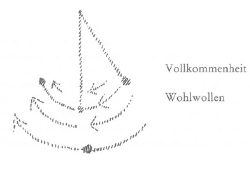

Ich sagte in den vorangegangenen Betrachtungen, daß es der Menschheit von unserer Zeit an notwendig wird, gewisse Wahrheiten über spirituelle Hintergründe der äußeren Welt kennenzulernen. Werden sich die Menschen nicht dazu herbeilassen, diese Wahrheiten, man möchte sagen gutwillig entgegenzunehmen, so werden sie eben durch die Gewalt der fürchterlichen Ereignisse im Laufe der Zeiten gezwungen werden, aus diesen Ereignissen selbst zu lernen. ^ww360i

Nun kann die Frage entstehen: Warum wird es denn von der Gegenwart ab der Menschheit notwendig, sich mit solchen zum Teil erschütternden Wahrheiten bekanntzumachen, da ja diese Wahrheiten selbstverständlich seit alten Zeiten bestanden haben und die Menschheit in ihrem weiteren Umkreise davor behütet worden ist, diese Wahrheiten entgegenzunehmen? In den Mysterien wurden ja viele solche Wahrheiten in der Ihnen bekannten Art sorgsam behütet, weil die Menschen im weiteren Umkreise nicht dem Erschütternden dieser Wahrheiten ausgesetzt werden konnten. Nun haben wir ja oftmals gesagt: Die Furcht vor den großen Wahrheiten ist es, die die Menschen heute davon abhält, sie entgegenzunehmen. - Diejenigen, die in der Gegenwart diese Furcht haben - und die sind sehr zahlreich -, könnten natürlich sagen: Warum soll denn die Menschheit nicht weiter gewissermaßen in einer Art von Schlafzustand erhalten werden gegenüber diesen Wahrheiten? Warum soll denn gerade diese im Lauf der letzten Zeit so nervös gewordene Menschheit den großen, erschütternden Wahrheiten ausgesetzt werden? ^jba31x

Wir wollen uns gerade mit dieser Frage ein wenig befassen, wollen zunächst einmal das Augenmerk darauf lenken, wie es denn kommt, daß von jetzt ab die Menschheit aus der geistigen Welt heraus gewissermaßen anders behandelt werden muß als im bisherigen Verlauf der nachatlantischen Zeit. ^op8h4u

Ich habe in den vorangehenden Betrachtungen schon gesprochen von dem Grenzgebiet, von derjenigen geistigen Welt nämlich, die unmittelbar angrenzt an unsere physisch-sinnliche Welt. Diese geistige Welt, die ist es hauptsächlich, von welcher der Menschheit Kenntnis werden muß in der allernächsten Zeit. Nun, sobald man die Gebiete einer geistigen Welt betritt, sieht es ja da anders aus als hier in der physisch-sinnlichen Welt. Man macht Bekanntschaft mit gewissen Wesenheiten, vor allen Dingen mit Wesenheiten, deren Anblick der schwachen Menschheit entzogen wird - ich meine jenen Anblick auch, der in Erkenntnissen, in Begriffen vermittelt wird. Warum wurde denn der Blick der Menschen in der nachatlantischen Zeit auch von dieser nächsten Welt bisher abgelenkt? ^od70zh

Das ist aus dem Grunde, weil schon in diesem Grenzlande, jenseits dessen dann die andern höheren geistigen Welten liegen, sich Wesen finden, welche bisher nur unter gewissen Bedingungen eigentlich den Menschen bekanntgemacht werden durften - Wesen, welche eine bestimmte Aufgabe haben im gesamten Weltenall, welche namentlich bei der Entwickelung des Menschen selber eine Aufgabe haben. Es gibt da die verschiedensten Grenzwesenheiten. ^8m5894

Ich will heute von einer Klasse dieser Wesenheiten zu Ihnen sprechen, und zwar von derjenigen Klasse, welche im Weltenzusammenhange ihre Aufgabe hat bei der Geburt und bei dem Tode des Menschen. Man soll nur ja nicht glauben, daß Geburt und Tod des Menschen das sind, als was sie sich der äußeren sinnlichen Beobachtung darstellen. Wenn der Mensch hereintritt aus der geistigen Welt in diese physische Welt und wenn er wiederum heraustritt aus dieser physischen Welt in die geistige Welt, dann wirken bei diesen Vorgängen geistige Wesenheiten mit. Nennen wir sie heute, um Namen zu haben, die Elementargeister der Geburt und des Todes. Es war wirklich so, daß diejenigen Persönlichkeiten, die bisher in die Mysterien eingeweiht waren, es als ihre strengste Aufgabe betrachtet haben, in weiterem Umkreise den Menschen gerade von diesen Elementarwesen der Geburt und des Todes nicht zu sprechen. Denn spricht man von ihnen, von der ganzen Art und Weise, wie diese Elementargeister der Geburt und des Todes leben, dann spricht man von einem Gebiete, das dem Menschen, so wie er sich nun einmal geistig-seelisch entwickelt hat bisher in der nachatlantischen Zeit, doch vorkommt wie glühende Kohle. Man könnte auch einen andern Vergleich wählen. Lernt der Mensch genauer und mit vollem Bewußtsein das Wesen dieser Elementargeister der Geburt und des Todes kennen, so lernt er eigentlich Kräfte kennen in diesen Wesen, die dem Leben hier auf dem physischen Plan feindlich sind. Schon das muß für eine einigermaßen normal empfindende Seele eine erschütternde Wahrheit sein, wenn sie hört, daß die die Weltengeschikke lenkenden göttlich-geistigen Wesenheiten, um Geburt und Tod des Menschen in der physischen Welt zustandezubringen, sich solcher Elementargeister bedienen müssen, die eigentlich feindlich gesinnt sind allem, was hier auf dem physischen Plan der Mensch als sein Wohlergehen, als seine Wohlfahrt sucht und begehrt. Würde nur alles das bewirkt werden, was der Mensch gerne mag: daß es ihm hier bequem gehe auf dem physischen Plan, daß er gesund wachen und schlafen, gesund seine Arbeit verrichten kann, würde es nur Wesen geben, die diesem bequemen Verlauf des Lebens vorstehen, so würden Geburt und Tod nicht zustandekommen können. Die Götter brauchen schon einmal, um Geburt und Tod zustandezubringen, solche Wesenheiten, die eigentlich in ihrer ganzen Gesinnung und ihrer ganzen Weltauffassung einen Drang haben, dasjenige zu zerstören, zu verwüsten, was dem Menschen seine Wohlfahrt hier auf dem physischen Plan bewirkt. ^0x54l0

Man muß sich schon mit der Idee bekanntmachen, daß die Welt nicht so eingerichtet ist, wie sie die Menschen gern haben möchten, sondern daß es in der Welt das gibt, was in den ägyptischen Mysterien die eherne Notwendigkeit genannt wurde. Und zu dieser ehernen Notwendigkeit gehört es, daß die Götter sich solcher, dem physischen Weltengange feindlicher Wesenheiten bedienen, damit Geburt und Tod des Menschen zustandekommen können. Da blicken wir hin auf eine Welt, die unmittelbar an die unsere angrenzt, die auch täglich, stündlich mit der unsrigen zu tun hat, denn auf der Erde geschehen täglich, stündlich die Vorgänge der Geburt und des Todes. Und in dem Augenblick, wo der Mensch die Schwelle überschreitet zu dieser Welt, da kommt er in eine Regsamkeit, in ein Leben von Wesen hinein, die zerstörerisch für das gewöhnliche physische Leben des Menschen in ihrem ganzen Gebaren, in ihrem Begehren und in ihrer Weltanschauung sind. Hätte man bisher außerhalb der Mysterien die Menschen im weitesten Umfange bekanntgemacht damit, daß es solche Wesenheiten gibt, hätte man dem Menschen Begriffe beigebracht von diesen Wesenhetten, es würde ganz gewiß das folgende geschehen sein. Die Menschen, die durchaus nicht zurechtkommen mit ihren Instinkten und ihren Trieben, mit ihren Leidenschaften, die würden, wenn sie gewußt hätten: fortwährend sind um uns zerstörerische Wesenheiten -, die würden sich der Kräfte dieser zerstörerischen Wesenheiten bedient haben — nun nicht wie die Götter sich ihrer bedienen bei Geburt und Tod, sondern innerhalb des physischen Lebens. Wenn die Menschen Lust gehabt hätten, auf diesem oder jenem Gebiete zerstörerisch zu wirken, wäre ihnen reichlich Gelegenheit geboten gewesen, diese Wesenheiten zu ihren Dienern zu nehmen, denn man kann leicht diese Wesenheiten zu seinen Dienern nehmen. Damit das gewöhnliche Leben bewahrt bleibt vor den zerstörerischen Wesen der Elementargeister der Geburt und des Todes, wurde geschwiegen von dieser Weisheit. ^t7jf18

Nun ist die Frage: Soll denn nicht vielleicht auch weiter davon geschwiegen werden? — Das geht nicht, das geht aus gewissen Gründen nicht. Es geht aus einem Grunde nicht, der mit einem großen, bedeutsamen Weltengesetz zusammenhängt. Besser als durch eine allgemeine Formel kann ich Ihnen dieses Weltengesetz durch seine konkrete Erscheinungsform in unserer Zeit und in der nächsten Zukunft klarmachen. Sie wissen: Seit gar nicht langer Zeit sind in die Menschheitsentwickelung immer mehr und mehr Kulturimpulse hereingezogen, die früher nicht da waren, die aber gerade für die Kultur der Gegenwart charakteristisch sind. Versuchen Sie nur einmal, sich in Gedanken zurückzuversetzen in Zeiten, die verhältnismäßig noch gar nicht weit hinter uns liegen. Da werden Sie Zeiten finden, in denen noch keine Dampflokomotiven gefahren sind, Zeiten, in denen man noch nicht sich der Elektrizität bedient hat wie in unserer Zeit, Zeiten, in denen höchstens Denker wie Leonardo da Vinci im Gedanken und im Experiment sich Vorstellungen gemacht haben, wie man durch menschliche Instrumente in die Luft fliegen kann. Das alles ist in verhältnismäßig kurzer Zeit realisiert worden. Bedenken Sie, wieviel heute abhängt von der Verwendung des Dampfes, von der Verwendung der Elektrizität, von der Verwendung jener Luftdichtigkeitsverteilung, die zu der Luftschiffahrt geführt hat oder zu jener Statik, die zum Fliegerwesen geführt hat. Denken wir einmal an all das, was da in der letzten Zeit in die Menschheitsentwickelung eingezogen ist. Denken Sie an so zerstörerische Kräfte wie das Dynamit und so weiter, und Sie werden sich leicht ausmalen können, nach der Schnelligkeit, mit der das alles gegangen ist, daß für die Zukunft noch ganz andere fabelhafte Dinge nach dieser Richtung von der Menschheit erstrebt werden. Sie werden sich leicht ein Bild davon machen können, daß es nicht dem Ideal der Menschheit für die nächste Zukunft entspricht, daß die Goethes immer häufiger werden, dagegen entspricht es dem Ideal, daß die Edisons immer häufiger werden. Das ist nun schon einmal das Ideal der gegenwärtigen Menschheit. ^v7qqrp

Nun glaubt ja allerdings der Gegenwartsmensch, daß sich das alles — Telegraph, Telephon, Dampfkraftverwendung und so weiter ohne das Mittun von geistigen Wesenheiten vollzieht. Das ist aber nicht der Fall. Die Fortentwickelung der Menschheitskultur, auch wenn der Mensch nichts davon weiß, geschieht auch unter dem Mittun von Elementargeistern. Und es ist nicht etwa — wie es sich die moderne materialistische Menschheit vorstellt — bloß das, was der Mensch als Gedanke von seinem Gehirn ausgeschwitzt hat, was ihn dazu geführt hat, Telefon und Telegraf zu konstruieren, Dampfmaschinen über die Erde zu treiben und über den Acker, sondern all das, was der Mensch in dieser Weise tut, steht unter dem Einfluß von elementargeistigen Wesenheiten. Die wirken und helfen überall mit. Auf diesem Gebiete führt der Mensch nicht allein, sondern er wird geführt. In den Laboratorien, in den Werkstätten, namentlich überall da, wo erfinderischer Geist waltet, da sind die Inspiratoren gewisse elementargeistige Wesenheiten. ^j8f5l2

Nun sind diejenigen Elementargeister, welche seit dem 18. Jahrhundert unserer Kultur die Impulse geben, von derselben Art wie die, welcher sich die Götter bedienen, um Geburt und Tod herbeizuführen. Das ist eines der Geheimnisse, mit denen sich der Mensch in der Gegenwart bekanntmachen muß. Und das weltgeschichtliche Gesetz, wie ich es genannt habe, besteht darin, daß die Entwickelung so vor sich geht, daß immer auf einem gewissen Gebiete von elementargeistigen Wesenheiten zuerst die Götter herrschend sind, und nachher kommen die Menschen selbst in dieses Gebiet hinein und bedienen sich dieser elementargeistigen Wesenheiten. Während also in älteren Zeiten die Elementargeister der Geburt und des Todes im wesentlichen Diener der göttlich-geistigen Weltenlenker waren, werden von unserer Zeit an — es ist ja schon einige Zeit her, daß das im Gange ist - diese Elementargeister der Geburt und des Todes die Diener von Technik, Industrie, von kommerziellem Menschenwesen. Das ist wichtig, daß wir diese erschütternde Wahrheit in aller Stärke und Intensität auf unsere Seele wirken lassen. ^xmbapa

Da spielt sich etwas ab, von der Zeit der fünften nachatlantischen Kulturperiode an, in der wir drinnenstehen, was ähnlich ist einer Sache, auf die ich öfter aufmerksam gemacht habe, die sich während der atlantischen Zeit abspielte; nur spielte sie sich damals während der vierten atlantischen Kulturperiode ab. Damals nämlich, in der atlantischen Zeit, bedienten sich die göttlich-geistigen Wesen, welche die Menschheitsentwickelung lenkten, bis zur vierten atlantischen Kulturepoche gewisser Elementarwesen. Dieser Elementarwesen mußten sie sich bedienen, weil damals nicht nur so wie jetzt Geburt und Tod gelenkt werden mußten, sondern weil damals, ich möchte sagen der Erde näher, etwas anderes noch gelenkt werden mußte. Erinnern Sie sich an manche Schilderungen, die ich in bezug auf die atlantische Zeit gegeben habe, wie da der Mensch noch beweglich war in seinem ganzen materiellen Wesen, wie er durch die Seele groß wachsen konnte und ein Zwerg bleiben konnte, wie sich das Äußere richtete nach dem Seelenwesen. Erinnern Sie sich an das alles. Während heute nach außen hin der Dienst, den gewisse Elementarwesen bei Geburt und Tod den göttlich-geistigen Wesen leisten, deutlich sichtbar ist, war es dazumal so, daß auch durch das menschliche Leben hindurch, wenn sich so das Äußere dem Inneren konform gestaltete, gewisse Elementarwesenheiten den Göttern dienten. Als nun die atlantische Zeit in ihre vierte Kulturperiode getreten war, da wurden gewissermaßen die Menschen wieder Herrscher über diese selben Elementarwesenheiten, welche die Götter früher gebraucht haben zum Wachstum und zur physiognomischen Ausgestaltung der Menschen im großen. Die Menschen wurden Herrscher über gewisse Götterkräfte, und sie bedienten sich dieser Götterkräfte. Die Folge davon war, daß von einem gewissen Zeitpunkt der atlantischen Zeit ab - so in der Mitte der atlantischen Zeit etwa - es im Begehren des einzelnen Menschen liegen konnte, seine Mitmenschen dadurch zu schädigen, daß er ihnen allerlei anschuf: daß er sie während des Wachstums in der Zwerghaftigkeit hielt oder zu Riesen machte, daß er den physischen Organismus sich so entwickeln ließ, daß der Betreffende ein gescheiter Mensch oder ein Idiot wurde. Das ergab in der Mitte der atlantischen Zeit etwas, was eine furchtbare Macht in den Händen der Menschen war. Und Sie wissen, ich habe darauf aufmerksam gemacht, es wurde dieses Geheimnis nicht gehütet. Aber das liegt nicht daran, daß etwa durch eine Schlechtigkeit dieses Geheimnis nicht gehütet worden ist, sondern es mußte eben nach einem gewissen welthistorischen Gesetz dasjenige, was vorher bloße Götterarbeit war, Menschenarbeit werden. Das alles aber hat innerhalb der atlantischen Zeit zu jenem großen Unfug geführt - zu allen möglichen Gewalttätigkeiten hat das geführt; Sie brauchen sich jetzt nur zu erinnern an das, was ja in der atlantischen Zeit eintrat und was hier öfter geschildert worden ist —, zu jenem Unfug, der notwendig machte, die ganze atlantische Kultur im Verlaufe der letzten vier beziehungsweise drei atlantischen Kulturperioden dem Untergang entgegenzuführen. Und von der Atlantis her ist unsere Kultur so gerettet worden, so herübergebracht worden, wie das öfter dargestellt worden ist. ^8c7o8s

In einer ähnlichen Weise wird Götterdienst der Menschheit überwiesen von unserer fünften nachatlantischen Zeit ab für die drei beziehungsweise zwei letzten Kulturperioden der nachatlantischen Kultur der fünften Erdenentwickelungswelt. Wir stehen erst am Anfange jener Tätigkeit der Technik, der Industrie, des Kommerziums, in die hinein die Elementargeister der Geburt und des Todes ihre Wirkung treiben. Das wird immer stärker und stärker werden, das wird immer einschneidender sein. Davor kann man die Menschheit nicht behüten, denn die Kultur muß fortschreiten. Und die Kultur unseres Zeitalters und der Zukunft muß eine solche sein, daß die Elementargeister der Geburt und des Todes, während sie bis zu einem gewissen Zeitpunkt, bisher eben nur beim physischen Entstehen und Vergehen des Menschen gewirkt haben unter der Direktion der Götter, daß diese Elementargeister mit denselben Kräften, mit denen sie bei Geburt und Tod wirken, innerhalb von Technik, Industrie, Kommerzium und so weiter wirken. Damit ist aber etwas ganz Bestimmtes verknüpft. ^hj0u23

Ich habe Ihnen ja geschildert, diese Elementargeister sind solche, die eigentlich der Wohlfahrt der Menschheit feindlich, zerstörerisch gesinnt sind. Also fassen wir die Sache nur im richtigen Sinne auf, geben wir uns, wenn wir sie im richtigen Sinne auffassen, keiner Täuschung hin über das Bedeutsame, tief Einschneidende, das da eigentlich vorliegt. Die Kultur muß vorwärtsschreiten im technischen, industriellen und kommerziellen Sinne. Aber die Kultur, die auf diese Weise vorwärtsschreitet, kann ihrem Wesen nach nicht zur Wohlfahrt der Menschen auf dem physischen Plane dienen, sondern sie kann ihrem Wesen nach nur etwas Zerstörerisches für diese Wohlfahrt in sich schließen. ^7ub08j

Solch eine Wahrheit ist unbequem für diejenigen Menschen, welche nicht müde werden, immer in Deklamationen zu verfallen, wenn sie über die großen, gewaltigen Fortschritte der Kultur reden, weil sie Abstraktlinge sind und nichts wissen vom auf- und absteigenden Gang der Menschheitsentwickelung. Und geradeso wie das, was ich Ihnen angedeutet habe in bezug auf die atlantische Zeit, zum Untergang der atlantischen Zeit führte, damit eine andere Menschheit kommen konnte, so enthält dasjenige, was sich jetzt inauguriert als kaufmännische, industrielle, technische Kultur, die Elemente, welche zum Untergang der fünften Erdperiode führen. Und nur derjenige sieht klar, nur der sieht die Dinge, wie sie sind, der sich gesteht: Damit beginnen wir an dem zu arbeiten, was die Katastrophe herbeiführen muß. ^yhaw1l

Das ist das Sich-Hineinversetzen in die ehernen Notwendigkeiten. Menschliche Bequemlichkeit könnte sagen: Also fahre ich nicht auf einer elektrischen Bahn -, könnte eventuell noch so weit gehen, obwohl so weit sich nicht einmal die Mitglieder der Anthroposophischen Gesellschaft versteigen werden, nicht Eisenbahnen zu besteigen und so weiter. Aber das alles wäre Unsinn, wäre richtiger Unsinn. Denn es handelt sich nicht darum, irgend etwas zu meiden, sondern sich Klarheit, Einsicht in die ehernen Notwendigkeiten des Menschheitsganges zu verschaffen. Die Kultur kann nicht in einer stetig aufsteigenden Linie verlaufen, sondern sie kann nur in immer wieder auf- und absteigenden Wogen verlaufen. ^98kj8l

Aber etwas anderes kann eintreten, etwas, wovon allerdings die Menschheit der Gegenwart auch noch nicht viel wissen will, aber worin eben gerade dasjenige besteht, womit sich die Menschheit der Gegenwart bekanntmachen muß: Einsicht, klares Hineinschauen in das, was eben notwendig ist — das ist es, was sich über die Menschengemüter ausbreiten muß. Dazu wird aber notwendig sein vieles, was die Gemütsverfassung, die Weltanschauungsverfassung der Seelen wesentlich ändert. Mit inneren Impulsen wird sich die Menschheit durchdringen müssen, die man heute noch gern abweist, weghaben will vom behaglichen Leben. Solche Begriffe, solche inneren Impulse, die man gern weghaben will vom behaglichen Leben, können ja viele angeführt werden. Lassen Sie mich nur ein Beispiel dafür anführen. ^3wx8xv

Der Mensch der Gegenwart, gerade wenn er ein recht guter Mensch sein will, ein Mensch, der nichts für sich will, sondern immer nur selbstlos für andere will, der strebt selbstverständlich nach gewissen Tugenden. Das sind auch eherne Notwendigkeiten. Nun wird hier selbstverständlich nicht etwa gegen das Streben nach der Tugend gesprochen, aber die Menschen streben eben nicht bloß nach der Tugend. Nach der Tugend streben ist ja schon ganz gut, aber die Menschen streben nicht bloß nach der Tugend; und für die Gegenwart ist die Sache noch meistens so, daß das eigentliche Streben nach der Tugend den Menschen ziemlich einerlei ist, wenn man auf die tieferen Untergründe, auf die unterbewußten Untergründe des Gemütes eingeht. Viel wichtiger ist den Menschen das Gefühl, tugendhaft zu sein, sich so recht hineinzuleben in die Stimmung: Ich bin ein selbstloser Mensch, wie tue ich alles nicht um meinetwillen! Ich bin ein vollkommener Mensch, ein wohlwollender Mensch, ich bin ein Mensch, der an keine Autorität glaubt. — Nachher rennt er allerdings allen möglichen Autoritäten nach. Aber sich gewissermaßen so recht wohlig zu ergehen in dem Bewußtsein, man habe diese oder jene Tugend, das ist für die Menschen heute unendlich wichtiger, als die Tugend wirklich eigentlich zu haben. Die Wollust, sich mit der Tugend ausgestattet zu wissen, das ist es, worauf es den Menschen viel mehr ankommt, als diese Tugend zu üben. ^gd0ld1

Das hält dann die Menschen ab von gewissen Geheimnissen, die mit den Tugenden zusammenhängen. Von diesen Geheimnissen wollen die Menschen instinktiv nicht viel wissen, insbesondere dann nicht, wenn sie so recht aus dieser eben geschilderten Wollust heraus Idealisten der Gegenwart sind. Alle möglichen Ideale werden ja heute gesellschaftsmäßig vertreten. Man macht Programme und so weiter, stellt Gesellschaftsprinzipien auf, daß man dies oder jenes erstrebt. Alle diese Dinge, die man da erstrebt, mögen recht schön sein. Aber mit dem abstrakten Schönfinden ist es nicht getan. Die Menschen müssen lernen, wirklichkeitsgemäß zu denken. Und da kann man auch mit Bezug auf die Tugendhaftigkeit einmal auf das Wirklichkeitsgemäße aufmerksam machen. Vollkommenheit, Wohlwollen, schöne Tugenden, Recht: das alles ist etwas Schönes für das äußere menschliche Zusammenleben. Aber wenn jemand sagt: Wir streben programmäßig diese oder jene Vollkommenheit an, diese oder jene Richtung des Wohlwollens an, wir versuchen dieses oder jenes Recht zu realisieren -, so sagt er das in der Regel mit der Idee, daß dies etwas Absolutes ist und daß dies nun als etwas Absolutes realisiert werden könne. Nun ja, warum sollte das denn nicht auch schön sein - sagt der Mensch der Gegenwart -, immer vollkommener und vollkommener zu werden! — Und was könnte es denn Idealeres geben, als sich zum Programm zu machen, immer vollkommener und vollkommener zu werden! Aber mit dem Gesetz der Wirklichkeit stimmt das nicht. Es ist ja richtig und gut, immer vollkommener zu werden oder wenigstens werden zu wollen, aber wenn man konkret nach einer bestimmten Richtung der Vollkommenheit strebt, so schlägt nach einiger Zeit dieses Vollkommenheitsstreben um und wird zur Unvollkommenheitswirklichkeit. Das Vollkommenheitsstreben wird nach einiger Zeit durch Umschlag zur Schwäche. Wohlwollen wird nach einiger Zeit zum vorurteilsvollen Verhalten. Und realisieren Sie, welches Recht Sie wollen, es kann noch so gut sein: im Laufe der Zeit wird es zum Unrecht. Es gibt nichts Absolutes auf dieser Welt. Das ist die Realität. Man strebe irgendein Gutes an - durch den Gang der Welt wird es ein Schlechtes. Daher muß immer neu und neu gestrebt werden, in immer neuen Gestaltungen gestrebt werden. Das ist es, worauf es ankommt. In bezug auf solches Streben der Menschen besteht eine Oszillation, ein Hin- und Herpendeln. Und nichts ist der Menschheit schädlicher als der Glaube an absolute Ideale, weil die dem realen Gang der Weltenentwickelung widersprechen. ^1hjzhx

Man gebraucht gerne, wenn man so etwas darlegen will, nicht um etwas zu beweisen, sondern nur um es zu veranschaulichen, gewisse Begriffe. In gewisser Beziehung können naturwissenschaftliche Begriffe symbolisch auch geistige Begriffe veranschaulichen. Denken Sie sich: Wir haben hier ein Pendel befestigt (es wird gezeichnet). Nicht wahr, wenn dieses Pendel hier herausgeht, so daß es hier ist nach der einen Seite ausschlagend -, und man läßt es dann herunterfallen, so kommt es hier in seine Gleichgewichtslage. Es macht diesen Weg durch. ^hpkz12

 ^6kr25o

Warum macht das Pendel diesen Weg durch? Weil die Schwerkraft auf das Pendel wirkt - so sagt man. Es fällt herunter, aber wenn es da unten angekommen ist, da bleibt es nicht stehen. Es hat durch das Herunterfallen ein gewisses Beharrungsvermögen in sich aufgenommen, und es schlägt dadurch gerade nach der entgegengesetzten Richtung aus. Dann fällt es wieder herunter. Das heißt, während das Pendel diesen Weg durchmacht, nimmt es so viel Kraft auf durch das Herunterfallen, daß es durch diese seine eigene Kraft nach der andern Seite hin ausschlägt, geradeso hoch wie es vorher war. Um nachträglich dies oder jenes zu verdeutlichen, braucht man solch einen Vergleich. Man kann sagen: Irgendeine Tugend - Vollkommenheit, Wohlwollen — macht ganz richtig diesen Weg, aber schlägt dann nach der andern Seite aus. Vollkommenheit wird Schwäche, Wohlwollen wird vorurteilsvolle Afterliebe, Recht wird Unrecht im Verlaufe der Entwickelung. ^jvhuft

Mit solchen Begriffen will sich die Menschheit heute nicht gern tragen. Denn denken Sie doch nur einmal, wenn man dem biederen Spießbürger der Gegenwart, der seinen Verein gründet auf gewisse Ideale hin, klarmachen wollte: Mit dem, was du jetzt als Ideal aufstellst, wirst du, wenn du es dem Gang der Entwickelung einfügst, nach verhältnismäßig gar nicht so langer Zeit das Gegenteil bewirken -, ja, der würde glauben, man wäre nicht nur kein Idealist, sondern ein richtiger Teufel. Denn wie soll das Streben nach Vollkommenheit nicht immer weiter ins Vollkommene hinsteuern und Recht nicht immer weiter und weiter Recht bleiben! An die Stelle der einseitigen, abstrakten Begriffe die Begriffe der Wirklichkeit zu setzen, das wird der gegenwärtigen Menschheit ganz besonders schwer. Das muß aber die gegenwärtige Menschheit lernen, sonst wird sie nicht weiterkommen. Und so muß sie sich auch damit bekanntmachen, daß die Kulturentwickelung selber das Hantieren mit den Elementargeistern der Geburt und des Todes nach und nach notwendig macht. Und damit muß die Menschheit die Einfügung eines zerstörerischen Elementes in die Menschheitsentwickelung kennenlernen. ^oif1s2

An einzelnen Stellen kommen instinktiv auf diese Dinge auch solche Menschen, die es ablehnen, sich in weiterem Umfang mit der Geisteswissenschaft bekanntzumachen, die ja das einzige Mittel ist, zu diesen Dingen die rechte Stellung zu finden. Was bedeutet denn eigentlich dasjenige, was ich Ihnen jetzt gesagt habe? Es sind natürlich Sendboten des Ahriman, diese Elementargeister der Geburt und des Todes. Die Götter müssen sich, aus der ehernen Notwendigkeit der Weltenentwickelung heraus, der Sendboten des Ahriman bedienen, um Geburt und Tod zu regeln. Sie lassen für ihre Taten die Kräfte dieser Sendboten nicht herein auf den physischen Plan. Aber in der absteigenden Kulturentwickelung, von der fünften nachatlantischen Periode ab, muß wiederum, damit die Katastrophe kommen kann, gerade in die Kulturentwickelung das hereinkommen. Der Mensch selbst muß mit diesen Kräften hantieren. Sendboten des Ahriman also sind notwendig, ehern notwendig, um jene Zerstörung hervorzurufen, die der nächste Kulturfortschritt sein wird. Das ist eine furchtbare Wahrheit, aber es ist so. Und es hilft gegenüber dieser Wahrheit nichts anderes, als sich mit ihr bekanntzumachen, klar in sie hineinzuschauen. Wir werden schon weiter davon sprechen. Sie werden schon sehen, was alles die richtige Stellung zu diesen Wahrheiten erfordert. ^f8noos

Instinktiv, sage ich, kommen manche Menschen darauf, daß so etwas notwendig ist. Instinktiv ist zum Beispiel darauf gekommen eine Persönlichkeit, die manches gute Buch in der Gegenwart geschrieben hat - allerdings kein Buch, das irgendwie an Geisteswissenschaft ernsthaft anklingt —, ich meine Ricarda Huch. Und ganz bemerkenswert ist wegen des Instinktes, nicht wegen der Einsicht, aber wegen des Instinktes, der in diesem Buch waltet, das neueste Buch über «Luthers Glaube». Wenn Sie die ersten Kapitel dieses Buches lesen, so finden Sie darin einen merkwürdigen Schrei — könnte man sagen -, den Schrei danach, daß die Menschheit wiederum etwas kennenlernen müßte, was eigentlich seit Luthers Zeiten, bis zu welchen noch atavistisches Hellsehen auf diesem Gebiete gereicht hat, der Menschheit verlorengegangen ist. Ricarda Huch sagt, daß eigentlich das Notwendigste für die gegenwärtige Menschheit sei, den Teufel kennenzulernen. Sie betrachtet es nicht als so notwendig, sich mit Gott bekanntzumachen; als viel notwendiger betrachtet sie es für die gegenwärtige Menschheit, sich mit dem Teufel bekanntzumachen. ^fj751m

Warum das notwendig ist, weiß natürlich Ricarda Huch nicht. Aber instinktiv fühlt sie, daß es notwendig ist. Daher dieser eindringliche Schrei nach der Erkenntnis des Teufels in den ersten Kapiteln dieses Buches, der sehr symptomatisch, bedeutsam ist für die Gegenwart. Sie denkt sich: Mit Gott werden die Menschen schon wieder bekanntwerden, wenn sie nur wissen, daß der Teufel um sie herum umgeht. - Natürlich, solche Menschen, die doch nicht an die Geisteswissenschaft heran wollen, die finden dann immer, suchen immer Entschuldigungsgründe für so etwas. Daß der Teufel als reales Wesen wiederum von den Menschen erkannt werden soll, das fühlt Ricarda Huch; aber sie entschuldigt es gleich damit, daß das doch selbstverständlich nicht so ist, daß man sich vorstellen soll, daß er mit Schwanz und Hörnern auf der Straße herumlaufe. - Nun, er läuft schon herum! «Den Teufel merkt das Völkchen nie, und wenn er es auch schon am Kragen hätte.» Der Abstraktling der Gegenwart braucht eben gleich eine Entschuldigung, wenn er auch instinktiv das, was dringend notwendig ist, einsieht. Aber ein guter, ein richtiger Instinkt für die Gegenwart liegt diesem Schrei nach dem Teufel zugrunde. Die Menschen sollen nicht einfach blind, schlafend hineinwachsen in dasjenige, was eine eherne Notwendigkeit für die nächste Zeit von ihnen verlangt: sich im Laboratorium, in der Werkstätte, in der Bank, überall mit den Sendlingen des Teufels zu tun zu machen. Das müssen die Menschen zum Kulturfortschritt tun; aber kennen müssen sie den Teufel, wissen müssen sie, daß in dem Augenblicke, wo sie, sagen wir, die Stahlkammern aufschließen, in der Kraft des Schlüssels die Kraft des Teufels steckt. Das ahnt instinktiv Ricarda Huch. Das müssen die Menschen wissen, denn allein das Wissen führt in der richtigen Weise in die Zukunft hinein. Und schon das ist von ungeheuer großer Bedeutung, daß sich Menschen finden, die instinktiv die Notwendigkeit betonen, daß die Menschen nicht schlafend an dem immer mächtiger werdenden Teufel vorbeigehen. ^7v65oe

Vielleicht ist auch das charakteristisch — das sage ich nur in Parenthese: Im Paradiese war es ja auch eine Frau, welche die Funktionen des Teufels instinktiv hereingeführt hat in dieses Paradies. Es ist, wie ich glaube, in der äußeren Kultur ja kein besonderes Renommee für die Männer, daß sie diesen Aberglauben noch weit abweisen und es vorläufig wiederum der Frau überlassen haben; es ist vielleicht charakteristisch, daß Ricarda Huch als Frau nach dem Teufel ruft, wie einstmals die Eva im Paradies den Teufel hereingelassen hat. Doch das sage ich nur in Parenthese. ^y8amy0

Aber dieser Teufel ist schon dasjenige Wesen, das der Träger der Kultur der Zukunft sein wird und sein muß. Es ist eine herbe, aber eine wichtige Wahrheit. Diese Wahrheit hängt innig zusammen damit, daß sich in diesen Kulturgang in die Zukunft hinein zerstörerische Kräfte mischen müssen. Insbesondere - und davon werde ich morgen reden — müssen sich zerstörerische Kräfte, wenn die Sache nicht in weiser Art geleitet wird, in alles Erziehungswesen, namentlich in die Kindererziehung mischen. Aber auch in das ganze soziale Zusammenleben der Menschen werden sich immer mehr und mehr wegen der allgemeinen Kultur, wegen der Usancen, wegen der Emotionen der Menschen zerstörende Kräfte mischen, Kräfte, welche vor allen Dingen die Verhältnisse unter den Menschen selber immer mehr zerstören werden. ^6ofgjx

Streben soll der Mensch danach, das Wort Christi zu realisieren: «Wo zwei in meinem Namen vereint sind, bin ich mitten unter ihnen.» Aber die technische, die kommerzielle Kultur macht nicht dieses zur Wahrheit, sondern das andere: Wo zwei oder mehrere in meinem Namen sich zanken und streiten und bekämpfen wollen, da bin ich mitten unter ihnen. — Und das wird immer mehr in das soziale Menschenleben hineinkommen. Das führt aber dazu, daß überhaupt die Schwierigkeit besteht, heute in die Menschheit verbindende Wahrheiten hineinzuführen. ^xbfw0r

Und machen wir uns jetzt zum Schlusse wenigstens vorläufig klar - wir werden morgen und übermorgen über die Dinge weiter reden -, wie die Gemütsverfassung der Menschen in bezug auf das Entgegennehmen von Wahrheiten überhaupt ist. Der Mensch nimmt heute nicht gern Wahrheiten entgegen, weil er gar nicht glaubt, daß Wahrheiten etwas sein könnten, was unmittelbar aus der geistigen Welt hereintritt und an die Menschen herankommt. Der Mensch der Gegenwart glaubt, Wahrheit kann nur etwas sein, was absolut auf seinem Grund und Boden wächst. Wenn man heute so in den Zwanzigerjahren ist, dann hat man seinen Standpunkt, dann braucht man nicht erst von der Wahrheit überzeugt zu werden, dann braucht einem die Wahrheit nicht erst geoffenbart zu werden, dann hat man seinen Standpunkt. Und es kann jemand kommen, der mit all seinem Eifer um die Wahrheit gerungen hat — der vierundzwanzigjährige Dachs, der eben die Universität absolviert und vielleicht noch Vorlesungen gehört hat über die Philosophie, der hat seinen Standpunkt, über den er dann diskutiert mit dem andern, der mit allem Eifer um die Wahrheit gerungen hat. Heute hat jeder seinen Standpunkt, und jeder glaubt, daß auch auf dem unvorbereiteten Boden die absolute, allein sichere Wahrheit wächst. Die Menschen sind nicht geneigt, Wahrheiten entgegenzunehmen, sondern sie ernennen sich zum Besitzer der Wahrheit. Das ist ja das Charakteristikon der Gegenwart. ^qjyq3u

Auch darüber hat Ricarda Huch ein sehr schönes Wort gesprochen. Sie hat darauf aufmerksam gemacht, wie unserer jetzigen Weltauffassung — oder wie man es nennen will -, die überall im Chauvinismus schwimmt, vorangegangen ist bei den aufgeklärten Europäern der Nietzscheanismus, der über alle Vaterländer und über allen Chauvinismus weit erhaben war. Die Menschen sind Anhänger Nietzsches geworden. Wie viele sind Anhänger Nietzsches geworden! Nietzsche hat das Ideal der «blonden Bestie» aufgestellt. Verstanden haben die Menschen wenig davon. Aber Ricarda Huch sagt: Ein jeder, der nicht einmal die Anlage hat, ein respektables Meerschweinchen zu werden, hat sich eingebildet, selber nun die «blonde Bestie» zu sein im Sinne Nietzsches. —- Ja, das ist nämlich heute der Standpunkt des Spießbürgertums. Man hat wirklich nicht die Anlage, ein respektables Meerschweinchen zu sein, aber wenn irgendwo ein noch so hohes Ideal aufgestellt wird, da ist man es! Man ist es einfach, weil man findet, man ist es, ohne daß man irgend etwas dazu tut, weil man ja nicht anstrebt, sich zu entwickeln, weil man es nicht erträgt, erst etwas zu werden, weil man nur etwas sein will. Das aber zerspaltet die Menschen in Menschheitsatome. Ein jeder hat seinen Standpunkt. Keiner kann mehr den andern verstehen. ^wac5r9

Da sehen Sie — gerade in dieser Stimmung, daß keiner mehr den andern verstehen kann - das Walten der zerstörerischen Kräfte in der menschlichen Gesellschaftsordnung selber. Das treibt die Menschen auseinander. Es war schon der Teufel, der den Menschen die Versuchung eingegeben hat, als Nietzsche- Anhänger selber «blonde Bestien» zu sein. Sie sind es nicht geworden. Aber wenn die Menschen auch keine «blonden Bestien» im Sinne Nietzsches geworden sind - es ist doch schon etwas geworden aus diesen die Sozialität zerstörenden Impulsen des 19. Jahrhunderts in diesem 20. Jahrhundert. Das wollen wir dann morgen weiter besprechen. ^nocjtn