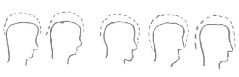

Vor dem Vortrag sprach Rudolf Steiner einleitend Gedenkworte für die verstorbenen Mitglieder Heinrich Mitscher und Olga von Sivers. Diese Gedenkworte sind abgedruckt in «Unsere Toten», GA 261. ^2d84s6

Es ist bedingt durch die geistige Konstitution der Gegenwart, daß wir uns bekanntmachen mit, wie Sie ja schon gesehen haben, schwerwiegenden Einsichten und mit schwerwiegenden Wahrheiten der geistigen Welt. Denn ich mußte ja betonen: Mit solchen Einsichten, wie sie die Menschheit nach den Gegenwartsgewohnheiten bequem findet, reicht man für die Zukunft nicht aus. Aber man muß die Gründe kennen, warum man nicht ausreicht. Nur dann kann man in vollem Ernst und in voller Würde sich verbinden mit diesen Impulsen, die für die Entwickelung der Menschheit nun einmal in der Gegenwart gegeben werden müssen. Das, was ich heute sagen will, wird vielleicht am besten verständlich sein, wenn ich den Ausgangspunkt nehme von der Tatsache, daß innerhalb der vierten nachatlantischen Kulturperiode, die, wie Sie wissen, im 8. Jahrhundert vor dem Mysterium von Golgatha begonnen hat und im 15. Jahrhundert nach dem Mysterium von Golgatha zu Ende gegangen ist, im wesentlichen der Mensch zu der Umwelt, zu der Außenwelt in ganz anderem Verhältnis stand, als er jetzt in der fünften nachatlantischen Kulturperiode stehen muß. Ich habe ja oftmals betont: Man muß die Entwickelung der Menschheit ernstnehmen. Die Seelen ändern sich viel mehr, als man glaubt, und es ist nur eine bequeme Gegenwartsvorstellung, wenn man der Meinung ist: In den Seelen der Menschen war alles so beschaffen - meinetwillen zur Griechenzeit - wie heute. Aber ich will von dieser Seelenbeschaffenheit heute nur ins Auge fassen das Verhältnis der Seelen zur umliegenden Welt. ^h9t5dk

Da wird der Bequemling sagen: Die Griechen, die Römer haben die Sinnenwelt um sich herum wahrgenommen, wir nehmen auch die Sinnenwelt um uns herum wahr; also ist kein so beträchtlicher Unterschied vorhanden. — Aber ein solcher beträchtlicher Unterschied ist da. Man kann geradezu sagen: Der heutige Mensch, der erst im Anfang der fünften nachatlantischen Kulturperiode steht, nimmt diese Umwelt, auch die sinnliche Umwelt, ganz anders wahr als zum Beispiel der Grieche. Farben sah der Grieche auch, Töne hörte der Grieche auch, aber er sah durch die Farben noch geistige Wesenheiten. Er dachte nicht bloß geistige Wesenheiten, es kündeten sich ihm durch das, was die Farbe war, noch geistige Wesenheiten an. ^lqlb9d

Ich habe versucht, gerade diese Eigentümlichkeit der griechischen Anschauung wie einen roten Faden durchzuspinnen durch meine Darstellungen in «Die Rätsel der Philosophie». Der neuzeitliche Mensch denkt Gedanken. Der Grieche dachte nicht in dem Maße wie der neuzeitliche Mensch Gedanken, denn er sah Gedanken. Sie kamen ihm entgegen aus dem, was er in der Umwelt wahrnahm. Die Umwelt selber war nicht bloß blau und rot, sondern das Blaue und das Rote sagten ihm die Gedanken, die er dann dachte. Das gibt ein intimes Verhältnis zur Umwelt. Das gibt auch noch ein Gefühl, ein intensives Gefühl davon, daß man mit der Umwelt als mit etwas Geistigem in Zusammenhang steht. Und das hängt wiiederum zusammen mit der ganzen Art und Weise, wie die menschliche Konstitution im allgemeinen in diesem vierten nachatlantischen Zeitraum war. ^4ufdxc

Wir müssen ja unterscheiden in unserer Erdenentwickelung - Sie wissen das aus der allgemeinen Darstellung der «Geheimwissenschaft im Umriß» — große Perioden: erste, zweite Zeit, lemurische Zeit, atlantische Zeit, unsere Zeit, die nachatlantische, und zwei darauf folgende. Man kann sagen, während der atlantischen Zeit ist sowohl die Erde wie auch der Mensch innerhalb der Erdenentwikkelung in der Mitte angelangt gewesen. Bis dahin war alles, man möchte sagen, Wachstumsentwickelung. In einer gewissen Beziehung ist das seit der atlantischen Zeit nicht mehr der Fall. Es ist schon bei der Erde nicht mehr der Fall. Wenn wir heute über die Erdschollen gehen - ich habe das öfter schon angedeutet -, dann gehen wir über etwas Sich-Zerbröckelndes, über etwas, was sich gegenüber dem Wachstumsverhältnis der Vorzeit nicht wie ein Fortwachsendes verhält, sondern wie ein Abbröckelndes. Die Erde war viel mehr ein wachsender, sprossender Organismus vor der atlantischen Zeit, bis zur Mitte der atlantischen Zeit. Dann fing sie an, ich möchte sagen, Risse und Sprünge zu bekommen, und dann erst entstanden diese mit Rissen und Sprüngen versehenen Gesteinsarten der Gegenwart. Das weiß heute nicht nur die Geisteswissenschaft. Daß unsere Gegenwartserde eine reißende, zerspringende ist, eine solche, die ihrer Auflösung entgegengeht, das finden Sie von der äußeren Wissenschaft schön dargestellt in dem großen, bedeutungsvollen Werk von Sueß, «Das Antlitz der Erde.» Diese einschneidende Schrift von Sueß faßt in großen Linien zusammen, was aus der gegenwärtigen Beschaffenheit der Gesteine, der Felsarten, der verschiedenen Formationen auf und in der Erde, der organischen Wesen innerhalb des Erdenseins, über den Bau der Erde nach außen hin, also gewissermaßen über das Antlitz der Erde, zu sagen ist. Und wie gesagt, ganz nur von den Tatsachen der äußeren Wissenschaft ausgehend, kommt Sueß zu der Erkenntnis, daß wir es jetzt mit einer verendenden, mit einer zerbröckelnden Welt zu tun haben. So ist es aber auch mit allen Geschöpfen, insofern sie als physische Geschöpfe diese Erde bewohnen. Sie sind in absteigender Entwickelung, und sie sind es im Grunde genommen seit der Mitte der atlantischen Zeit. Nur geht alles in einer gewissen Wellenbewegung innerhalb der Entwickelung vor sich. Man kann sagen: In der vierten nachatlantischen Periode, in der griechisch-lateinischen Zeit, war gewissermaßen eine Art Wiederholung desjenigen da, was in der atlantischen Zeit war, so daß man bis zum Griechentum hin noch nicht am Menschen in so entschiedener Weise bemerken konnte, daß er in absteigender Entwickelung ist. Das Griechentum - das habe ich öfter betont - hat noch die Eigentümlichkeit, daß das Seelische in einer völligen Harmonie mit dem Leiblichen steht. Die Harmonie war natürlich am größten in der Mitte der atlantischen Zeit. Aber im Griechentum wiederholt sich diese Harmonie. Von der gesamtmenschlichen Konstitution, die der Grieche hatte, haben wir ja bei verschiedenen Gelegenheiten, namentlich bei der Charakterisierung der griechischen Kunst, gesprochen, von der wir wissen, daß sie aus ganz andern Impulsen hervorgegangen ist als die Kunst späterer Völker. Der Grieche fühlte zum Beispiel in sich noch das Ätherisch-Formhafte, Gestalthafte des Menschen, brauchte nicht wie der heutige Mensch Modelle, weil er in sich die Form fühlte. So daß man sagen kann: Bis in die Griechenzeit hinein war in gewisser Beziehung das Menschlich-Leibliche durch die unmittelbar räumliche Aufßenwelt bedingt und gehalten. Es war ein intimes Verhältnis zwischen dem Menschen und seiner räumlichen Umgebung. Das ist mit dem Beginn der fünften nachatlantischen Zeit anders. So sonderbar es Ihnen klingen wird, es ist doch wahr: Wir sind eigentlich heute gar nicht mehr auf der Welt, um für unsere eigene Organisation zu sorgen. Wir verkörpern uns zwar noch, aber das hat nicht mehr den Sinn, für die eigene Organisation zu sorgen, denn diese eigene Organisation war in einer aufsteigenden Entwickelung bis in die Mitte der atlantischen Zeit oder bis zum Griechentum. Da waren die Körper der Menschen so vollkommen, wie sie während der Erdenzeit sein können. Eine höhere Vollkommenheitsstufe als Körperlichkeit wird die Menschheit erst wiederum während der Jupiterepoche erfahren. Wir sind eigentlich dazu da, um einer abklingenden Entwickelung nunmehr anzugehören, um uns so zu verkörpern, daß wir allerlei erleben, erfahren dadurch, daß wir in absterbenden, in immer mehr und mehr abbröckelnden, verdorrenden Leibern sind. Die Ausdrücke sind natürlich sehr radikal. Aber das, was wir seelenhaft entwickeln, was wir innerlich sind, das geht nicht mehr in demselben Maße wie früher in die äußere Leiblichkeit über. Das aber wird mancherlei Veränderungen bedingen in der Entwickelung. Im März dieses Jahres ist in Zürich ein sehr bedeutender Mensch gestorben: Franz Brentano. Sie werden einen Nachruf für Franz Brentano in meinem demnächst erscheinenden Buche «Von Seelenrätseln» finden. Das Buch wird in drei Teile und einen Anhang zerfallen: in dem ersten werde ich die Beziehung erörtern zwischen Anthropologie und Anthroposophie; im zweiten Teil werde ich an einem Beispiel zeigen, wie die gegenwärtige sogenannte Gelehrsamkeit der Anthroposophie entgegenkommt, an dem Beispiel des Individuums Dessoir; und im dritten werde ich zeigen, wie ein feiner Geist wie Franz Brentano zwar in den Fesseln der gegenwärtigen Wissenschaft gehalten worden ist, aber so nahe wie möglich an Anthroposophie mit seiner Psychologie herankommt. Dazu werde ich dann einen Anhang geben, der manches von dem kurz bringt, was jetzt unter den gegenwärtigen Verhältnissen eigentlich nur kurz gebracht werden kann, was aber vielleicht sogar Gegenstand mehrerer Bücher sein könnte. Ich habe es in einzelnen, kurzen Kapiteln in dieser neueren Schrift zusammengefaßt, weil eben die Verhältnisse in unserer immer schwerer und schwerer werdenden Zeit einem nicht gestatten, daß es in längerer Weise ausgeführt wird. Man hat schon bei manchem, was in dieser Art für die Gegenwart geschrieben wird, das Gefühl, man schreibe in gewisser Beziehung etwas Testamentarisches. Wer das ganze Gewicht der gegenwärtigen Ereignisse in sich verspürt, der wird solches schon nachfühlen können. ^y8jah2

Franz Brentano hat unter dem vielen, das er aus feinsinnigem Geiste heraus gesprochen hat, auch eine Abhandlung geschrieben über das Genie. Das Eigentümliche dieser Abhandlung liegt darin, daß Brentano eigentlich den Begriff des Genies hinwegdiskutiert, daß er überall zeigt, wie das Genie nicht andere Seelenqualitäten und Seelenimpulse hat als andere Menschen auch, wie das Gedächtnis beim Genie, die Kombinationsfähigkeit nur beweglicher, umfassender ist und so weiter. Franz Brentano zeichnet einen Begriff des Genies, der sich sehr unterscheidet von dem Begriff, den man sehr häufig hat. Aber dieser Begriff vom Genie, den man gewöhnlich hat, der enthält ja, wie die begriffsbequemen Schablonen der Gegenwart überhaupt, ohnedies viel Nebuloses. Man kann im allgemeinen sagen: Wie Brentano das Genie charakterisiert, so stimmt das nicht mit dem, was das Genie bisher war, aber es stimmt mit dem, was das Genie werden wird! In dem Sinne, wie das Genie bisher bestanden hat, wird es nicht in die Zukunft hinein sich fortpflanzen. Denn worauf beruhten die Genies der Vergangenheit? Sie beruhten darauf, daß eben die Seelen noch die Gewalt hatten, aus der Vererbung heraus oder durch die Erziehungskräfte Impulse in die Körperlichkeit hineinzusenden, so daß aus dem Körperlichen heraus die Intuitionen, die Inspirationen, die Imaginationen des Genies in unbewußter Art kamen. Mit der aufsteigenden Körperlichkeit war geniale Kraft vorhanden. Mit der abbröckelnden Körperlichkeit der Zukunft wird das nicht der Fall sein. Wo etwas dem Genie Ähnliches in der Zukunft auftreten wird, wird es darauf beruhen, daß die betreffenden Seelen, die man ja auch dann genial nennen mag, eben tiefer hineinsehen in das Leben der geistigen Umgebung, daß also nicht aus dem unbewußten Körperlichen die Impulse heraufsteigen, sondern daß die Betreffenden tiefer hineinsehen in die geistige Welt. Gerade an so etwas wie der Umwandelung des Genies sehen wir den tiefen Einschnitt, der da ist zwischen dem, was Entwickelung in der Vorzeit war und was Entwickelung in der Zukunft sein wird. Man möchte sagen: Aus der Körperlichkeit kam das Genie der Vorzeit, aus dem Hineinschauen der Seele in die Geistigkeit wird das kommen, was an die Stelle des Genies in der Zukunft treten wird. Das fühlt nun solch ein Geist, der mit der Entwickelung der Gegenwart empfindet, wie Brentano, geradeso wie Sueß der Erde es abgesehen hat, daß sie in einer Art Ersterben ist. ^m5e763

Aber worauf beruht denn das Ganze? Es beruht darauf, daß eben das Verhältnis des Menschen zu seiner Umwelt gegenüber früher ein anderes geworden ist. Die räumliche Umwelt spricht heute nicht mehr zum Menschen, so wie sie gesprochen hat, als sein Körper, sagen wir, frisch war. Sie gibt nicht mehr mit ihrem Räumlichen auch das Geistige her. Farben sprechen nicht mehr als geisterfüllte Elemente, Töne tönen nicht mehr als geisterfüllte Elemente; sie tönen als Materialien. Dasjenige, was im Menschen ist, ist innerlicher geworden. Das ist ein merkwürdiger Satz, nicht wahr, daß man sagen muß: Der oberflächliche Mensch der Gegenwart ist eigentlich innerlicher geworden. Aber er :st innerlicher geworden. Es ist das schon das Eigentümliche, daß man dem Oberflächling der Gegenwart gegenüber sagen kann: Er ist deshalb so oberflächlich, weil er, so wie er in der Verkörperung da ist, gar nicht vordringen kann zu seinem eigentlichen Innenwesen. Er wird gar nicht aufmerksam auf sein eigentliches Innenwesen, er entwickelt nicht die Kraft, sich selbst zu kennen, er kommt nicht darauf, was er eigentlich ist. ^w07v4o

So sieht derjenige, der geistig die Welt anschaut, gar manche Menschen herumgehen, die eigentlich gar nicht sie selbst sind. Das ist wieder radikal gesprochen. Es sind wandelnde Leiber, und die Seele ist nicht ganz darinnen. Warum? Ja, weil diese Seele eben nicht mehr die Aufgabe hat, ganz den Körper zu durchdringen, der schon abbröckelt, sondern weil sie die Aufgabe hat, sich vorzubereiten für das, was auf dem Jupiter vorgehen wird. Unsere Seele ist schon eine für die Zukunft Vorbereitungen treffende. ^7sx67s

Und in diese Situation muß man sich nur hinein-erkennen und hinein-wissen. Wir sind ganz dazu veranlagt, daß ein umfassendes Wesen zu uns spricht: «Mein Reich ist nicht von dieser Welt.» Nur werden sich die Menschen zum Verständnis dieser Wahrheit nur langsam und allmählich entschließen. Wir sind wirklich, trotz der äußeren Oberflächlichkeit, immer weniger und weniger von dieser Welt, was man aber nicht verwechseln darf mit etwas anderem. Wenn man jetzt glauben würde, man kann nun herumgehen, wie die Anhänger Nietzsches, die sich «blonde Bestien» genannt haben, und kann sagen: Wir sind eben in der geistigen Welt, wir gehören nicht der physischen Welt an -, so müßte erwidert werden: Ja, dasjenige, wovon du selber weißt von dir, das gehört schon der physischen Welt an; das andere ist ein Okkultes, ein Verborgenes. - Aber wir haben doch die Aufgabe, mit aller Einsicht, mit aller innerlichen Stärke dieses in uns befindliche Wesenhafte gewahr zu werden, das nicht mehr ganz in dem Körper aufgehen kann, das nicht mehr ganz den Körper durchdringen kann. Wir haben uns zu fühlen als die Kandidaten der Jupiterzeit. Aber das geschieht langsam und allmählich. Die Menschen verbleiben vorderhand noch in dem, was ihnen die Umwelt gibt, das heißt, sie verbleiben in dem, was unter ihnen ist. Aber mit jeder Inkarnation ziehen wir uns eigentlich mehr aus der Körperlichkeit heraus und schweben mehr über der Körperlichkeit drüber. ^b5esgj

Wenn das nicht so wäre, so würde es ohnedies um die Fortentwickelung der Menschheit schlimm stehen. Wenn der Mensch ganz darauf angewiesen bliebe, das nur zu sein, was die Griechen waren, dann würde es schlecht stehen um die Menschheitsentwickelung. Denn, so sonderbar das heute klingt, eine gewissenhafte okkulte Forschung, die versucht, die Entwickelungsgesetze des Menschengeschlechts zu durchdringen, die zeigt uns eine vielleicht zunächst bestürzend wirkende Wahrheit, zeigt uns, daß in gar nicht so ferner Zeit, vielleicht schon im 7. Jahrtausend, sämtliche Erdenfrauen unfruchtbar werden. So weit geht es mit der Vertrocknung, mit der Zerbröckelung der Leiber: Im 7. Jahrtausend werden die Erdenfrauen unfruchtbar! Denken Sie sich, wenn nun die Beziehungen bleiben sollten, die sich nur zwischen dem Menschlich-Seelischen und den menschlichen physischen Leibern ausleben können, dann könnten ja nachher die Menschen überhaupt sich nichts mehr zu tun machen auf der Erde. Es werden noch nicht alle Erdenperioden abgelaufen sein, wenn die Menschenfrauen keine Kinder mehr bekommen können. Da muß denn der Mensch ein anderes Verhältnis finden zu dem Erdendasein. Die letzten Epochen der Erdenentwickelung werden den Menschen in die Notwendigkeit versetzen, überhaupt auf eine physische Leiblichkeit zu verzichten und dennoch auf der Erde anwesend zu sein. Das Dasein ist eben doch geheimnisvoller, als man nach den plumpen naturwissenschaftlichen Begriffen der Gegenwart gern annehmen möchte. ^3l5rnz

Auch diese Sache ist instinktiv gefühlt, empfunden worden in der Abend- und in der Morgendämmerung des vierten beziehungsweise fünften nachatlantischen Zeitalters. Manche Leute haben da Dinge gesagt, die schon zusammenhängen mit der Entwickelung dieses unseres Zeitalters. Aber sie konnten nicht richtig verstanden werden; sie haben sich oftmals selbst nicht richtig verstanden. Denken Sie doch einmal an solche grausam erscheinende Lehren wie die des Augustinus, sogar die des Calvin: daß von vornherein der eine Teil der Menschen bestimmt wäre zum Seligwerden, die andern zum Verdammtwerden, die einen zum Guten, die andern zum Bösen. Solche Lehren hat es gegeben. Sie erscheinen grausam. Und dennoch: für eine richtige Einsicht erscheinen diese Lehren nicht ganz unrichtig, wie überhaupt manches, was unrichtig erscheint, eine gewisse relative Richtigkeit hat. Was im Zeitalter des Augustinus und den nachfolgenden Jahrhunderten über den Menschen gewußt werden konnte, bezieht sich eigentlich gar nicht richtig auf die Menschenseelen und auf den Menschengeist — Sie wissen ja, der Menschengeist wurde sogar auf dem Konzil in Konstantinopel abgeschafft -, sondern es bezieht sich auf den auf der Erde herumwandelnden Menschen. Ich will versuchen, möglichst deutlich zu sprechen über das, worauf es ankommt. ^yyylgu

Es kann Ihnen ein Mensch begegnen und ein anderer, und im Sinne der Augustinischen Lehre könnte man sagen: Der ist zum Guten, der ist zum Bösen bestimmt, aber nur seine äußere Körperlichkeit, nicht die Individualität! - Über die wirkliche Individualität hat das Augustinische Zeitalter überhaupt nicht gesprochen. Wenn man nun eine Anzahl von Menschen vor sich hat, so kann man sagen — aber das hat erst einen Sinn von der neueren Zeit an, bei den Griechen hätte es keinen Sinn gehabt -: Da sind die Menschenseelen; die sind natürlich die Schmiede ihres eigenen Schicksals. Da gibt es keine Prädestinationsimpulse. Aber die wohnen in Leibern, die zum Guten oder zum Bösen bestimmt sind. - Und immer weniger werden in der Erdenentwickelung die Menschen in der Lage sein, ihre Seelenentwickelung ganz parallel der Leibesentwickelung zu nehmen. Warum sollte es nicht sein können, daß eine Individualität sich verleiblicht in einem Körper, der nach seiner ganzen Konstitution zum Bösen bestimmt ist? Der Mensch kann ja trotzdem drinnen gut sein, weil die Individualität nicht mehr in einem intimen Zusammenhang mit der Körperlichkeit ist. Das ist wieder keine bequeme Wahrheit, aber eine Wahrheit, mit der man sich bekanntmachen muß. ^9npgg1

Kurz, die Verinnerlichung des Menschen nimmt immer mehr und mehr zu. Immer mehr müssen wir Rücksicht nehmen bei dem, was für den Menschen in Betracht kommt, daß sich der Mensch zurückzieht von der äußeren Leiblichkeit in den letzten Epochen der Erdenentwickelung. Die Menschen können sich aber nur langsam und allmählich - wie ich schon öfter betonte — durch die Gewalt der Tatsachen an diese Dinge gewöhnen. Aber die Tatsachen werden die Erkenntnis dieser Dinge aufdrängen. Wenn man heute die Menschen betrachtet nach dem, wie sie äußerlich sind, hat man ein Bild. Wenn man die Menschen nach dem betrachtet, was sie nicht unmittelbar äußerlich sind, hat man das andere Bild. Diese Bilder stimmen heute schon nicht miteinander überein und werden immer weniger miteinander übereinstimmen. Dem Menschen von heute ist es daher schon durchaus notwendig, sich nicht bloß auf das zu verlassen, was die äußere Welt hergibt, wenn er sich Begriffe bilden will, sondern sich Begriffe zu bilden nach Maßgabe desjenigen, was nur aus dem Geiste auf den Menschen wirken kann. ^gua4hr

Insbesondere werden solche Begriffe für die Zukunft in all dem notwendig sein, was Politik und Sozialistik ist und so weiter, und namentlich auch im Erziehungswesen. Die Begriffe, die die Umgebung hergibt, die nicht aus dem Spirituellen kommen, reichen nicht mehr aus für das, was der Mensch braucht. Daher die ungenügenden politischen und sozialistischen Theorien der Gegenwart. Die Menschen wollen da nur nach dem urteilen, was in der Umgebung ist, wollen sich nicht inspirieren lassen von etwas Geistigem. Daher sind diese Theorien und auch die politischen Programme so ungenügend. Wir leben nicht mehr in der Zeit, wo man solche Programme machen kann, wie Woodrow Wilson sie jetzt macht, sondern unsere Zeit erfordert, daß aus andern Tiefen heraus Weltenprogramme gemacht werden. Der Geist muß schon Beistand leisten, wenn heute Weltenprogramme gemacht werden. ^p0rhgf

Aber die Menschen sind noch nicht dazu gelangt, die innere Wahrheit all dessen, was ich Ihnen jetzt auseinandergesetzt habe, wirklich zu ihrem Bewußtsein zu bringen. Sie tapsen nach. Sie sind längst Menschen der fünften nachatlantischen Periode geworden und wollen immer noch urteilen wie die Menschen der vierten nachatlantischen Periode. Ja, damals in der Griechenzeit war das richtig, war das etwas Großes, etwas Harmonisches. Heute zu urteilen wie ein Grieche, ist ein Unding, weil dem Griechen eben die Umgebung alles gegeben hat, was er gebraucht hat. Heute gibt es diese Umgebung nicht mehr. Zunächst macht sich in vielen Beziehungen, ich möchte sagen, ein gewisser Haß fühlbar, eine Abneigung — was nur eine andere Seite der Furcht ist - vor dem innerlichen Betrachten des Menschen. Man will beim Äußerlichen stehenbleiben. Und so treten Reminiszenzen auf, die eben nur Reminiszenzen sind, wo sich die Menschen nicht voll in ihrer Gewalt haben. ^qx1a34

Eine sehr interessante Erscheinung, die ich Sie nur bitte, ganz gehörig ins Auge zu fassen, ist diese: Nehmen Sie einmal an, wir hätten es hier zu tun mit einer Anzahl von Köpfen, die vielleicht eine Versammlung bilden - erleuchtete Versammlungen gibt es ja heute überall. Ja, das eigentliche Geistige hat sich schon gelöst, das ist eigentlich nicht mehr so recht bei den Köpfen der Menschen, das ist verinnerlicht. Selbst wenn Oberflächlinge bei einer Versammlung sind, so sind eigentlich die andern, die richtigen, die eigentlich geistigen Köpfe, verborgen da; aber jene, die dasitzen, wissen nichts davon. So kann es sein, daß Versammlungen sind oder auch einzelne Menschen, in denen, wie in einem Uhrräderwerk, alte Ideen ablaufen: In den sichtbaren, in den physischen Köpfen, da rumort es drin von alten Ideen, da rollen alte Ideen ab. Von dem, was zeitgemäß ist, von dem wissen diese Menschen nichts. Diese automatisch wirkenden Gehirne können allerlei nachklingen lassen. Das ist interessant, daß gerade solche Dinge zuweilen auftreten. ^lndflv

 ^w195bp

Da hat es einen Kongreß gegeben, der im Jahre 1912 in London stattgefunden hat über eine ganz neue Wissenschaft: Eugenetik. Man hat ja gewöhnlich hochtrabende Namen gerade für das, was an sich am dümmsten ist. Die Ideen dieser Eugenetik, die gingen eigentlich aus den Gehirnen, nicht aus den Seelen der Menschen hervor. Was will diese Eugenetik? Sie will Einrichtungen treffen, so daß künftighin nur ein gesundes menschliches Geschlecht gezeugt wird, daß nicht minderwertige Individuen gezeugt werden; sie will nach und nach durch die Verbindung von Nationalökonomie und Anthropologie Gesetze finden, um Männer und Frauen durch Gesetze so zusammenzubringen, daß ein möglichst starkes Geschlecht zustandekommt. ^sy1zh7

Ja, über diese Dinge fängt man schon an durchaus nachzudenken. Das Ideal dieses Kongresses, dem der Sohn Darwins vorgesessen hat, bestand darin, verschiedene Gesellschaftsklassen daraufhin zu untersuchen, wie groß der Schädel ist bei den Reichen, wie groß der Schädel ist bei den Armen, die weniger lernen können, wie groß die Empfindungsfähigkeit bei den Reichen, wie groß die Empfindungsfähigkeit bei den Armen ist, wie stark der Widerstand ist, den die Reichen der Ermüdung entgegenbringen können, wie stark der Widerstand ist, den die Armen der Ermüdung entgegenbringen können und dergleichen mehr. Und nun versucht man, auf diese Weise Ansichten zu gewinnen über die menschliche Körperlichkeit, die vielleicht einmal in der Zukunft dazu führen können, daß man genau aufstellt: so muß er aussehen, so muß sie aussehen, wenn es einen richtigen Zukunftsmenschen geben soll; solch einen Grad von Ermüdungsfähigkeit muß er haben, solch einen Grad von Ermüdungsfähigkeit muß sie haben, solch eine Schädelgröße bei ihm, dazu eine passende Schädelgröße bei ihr und so weiter. ^efdtmv

Das ist ein Rumoren, ein natürliches Rumoren in den von den Seelen leer gewordenen Gehirnen, ein Rumoren derjenigen Ideen, die eine Realität in der atlantischen Zeit hatten. Da war es wirklich so, daß es gewisse Gesetze gab, durch welche die Menschen Größe, Wachstum und alles mögliche durch Kreuzen, Überkreuzen und dergleichen bewirken konnten. Das war dazumal eine Art von Wissenschaft, eine ausgebreitete Wissenschaft, die - wie ich Ihnen gestern wieder angedeutet habe - gerade im atlantischen Zeitalter so sehr mißbraucht worden ist. Diese Wissenschaft, die aus der Verwandtschaft der Körperlichkeit heraus arbeitete, wußte: Wenn man solch einen Mann mit solch einer Frau —- und Mann und Frau waren in der damaligen Zeit wesentlich verschiedener als heute - zusammenbringt, entsteht ein solches Wesen, und dann kann man wiederum, so wie es heute der Pflanzer macht, variieren. Die Mysterien haben dann aus diesem Sich-Kreuzen, aus diesem Zusammenbringen des Verwandten und Verschiedenen Ordnung gemacht; sie haben Gruppen gebildet und der Menschheit entzogen, was ihr entzogen werden mußte. Es entstand aber wirklich schwärzest-magischer Unfug durch das, was da im atlantischen Zeitalter getrieben worden ist, und Ordnung ist erst dadurch eingetreten, daß man Klassen gebildet hat, daß man diese Dinge den Menschen entzogen hat. Und auf diese Weise sind die Nationen entstanden, die heutigen Rassen entstanden. Das hat mitgewirkt bei der Bildung der heutigen Rassen. Und auch die Nationenfrage rumort wieder im gegenwärtigen Zeitalter als Nachklang der seelenlosen Gehirne aus der atlantischen Zeit. Wieviel spricht man heute von Nationenfragen. Aber es spricht nur die Körperlichkeit. Die zurückgezogene Geistigkeit gehört heute schon einer ganz andern Welt an. Das ist die Diskrepanz zwischen der Wirklichkeit und all den Deklamationen, die sich heute auf das sogenannte Nationalprinzip beziehen. Das kann niemals deshalb zu einem Heil führen, sondern muß immer und immer wieder in das Chaos hineinführen, wenn man die Politik auf die Nationenfragen stellen will, die nicht mehr Fragen der Gegenwart sind, weil die Seele ganz andern Ordnungen und ganz andern Zusammenhängen angehört, als diejenigen sind, die sich im leiblichen Wesen ausdrücken. Das sind alles Dinge, die gewußt werden müssen, die aber nur durch die Geisteswissenschaft gewußt werden können. Dieses Rumoren in den von den Seelen leer gewordenen Gehirnen, das ist die Ursache davon, daß in der heutigen Zeit solche Bestrebungen auftauchen, die den Menschen nach gewissen Gesetzen gestalten wollen. ^b9daj1

Und noch in etwas anderem spricht sich solch ein Rumoren verbrauchter Ideen aus, die wohl noch in den vertrocknenden Gehirnen wirken können, aber nicht mehr aus der Seele kommen. Die Seele muß erkraftet werden, so daß die Geisteswissenschaft in sie dringen kann. Dann wird wiederum aus der Individualität der Menschen gesprochen. Sie haben ja gewiß auch schon Bekanntschaft gemacht mit all dem Zeug, das heute nach der Richtung erscheint, daß die verschiedensten Menschen vom Standpunkt der Psychopathologie erklärt werden. Eigentlich darf heute einer nur ein gutes Gedicht schreiben, dann kommt sofort der Arzt und erklärt, welche Krankheit er hat. So haben wir ja die verschiedensten Abhandlungen: Viktor Scheffel vom psychiatrischen Standpunkt, Nietzsche vom psychiatrischen Standpunkt, Goethe vom psychiatrischen Standpunkt, Conrad Ferdinand Meyer vom psychiatrischen Standpunkt. Man kann es all diesen Schriften, wenn man zwischen den Zeilen lesen will, anfühlen, daß eigentlich ihre Autoren gesagt haben: Schade, daß er nicht zur rechten Zeit kuriert worden ist. Wäre er zur rechten Zeit kuriert worden, dann hätte er nicht solche Dinge geschrieben wie zum Beispiel Conrad Ferdinand Meyer, die nur aus dem Kranksein heraus geschrieben werden. -— Das ist aber etwas durchaus in diesem Sinne Zeitgemäßes, daß eben nicht geachtet wird auf die Verinnerlichung des Menschen, die manchmal gerade bei solchen Menschen wie Conrad Ferdinand Meyer so wirken muß, daß ihr äußeres Körperliches diese oder jene Krankheitserscheinung aufweisen muß, damit das Innerliche, unabhängig vom Körperlichen, künstlerisch zu höchster Geistigkeit kommen kann. ^4mdwe9

Diese Dinge werden hier nicht in dem Sinne besprochen, um Stellung dagegen zu nehmen. Vom rein medizinischen Standpunkt aus sind die Sachen selbstverständlich richtig; es ist gar nichts dagegen einzuwenden. Vom rein medizinischen Standpunkt aus kann man ja auch noch etwas anderes machen, was auch gemacht worden ist: Man kann die Evangelien durchnehmen und kann aus verschiedenen Dingen in den Evangelien zeigen, wie durch den Zusammenfluß ganz besonderer Krankheitsursachen dieses merkwürdige Individuum Christus Jesus entstanden ist. Solch ein Buch ist auch geschrieben worden und kann von jedem gelesen werden: «Jesus Christus vom Standpunkte des Psychiaters.» Es gibt also auch ein Buch, wo gezeigt wird, daß all das, was von der Person Jesu ausgeht, nur dadurch von ihr ausgehen konnte, daß eben diese Person so und so krank war. ^yj6zzj

Alle diese Dinge muß man verstehen, muß man durchdringen, wenn man sich mit Verständnis in die gegenwärtige Entwickelung hineinstellen will. Ich werde in diesem Zusammenhang insbesondere auch noch das Erziehungsproblem gerade besprechen, um Ihnen zu zeigen, wie die Gegenwart das heranwachsende Kind nicht mehr so betrachten darf, als würde man nur auf das zu sehen haben, was sich äußerlich heute ausleben kann. Da würde man ja manchmal daneben vorbeierziehen an dem, was sich gerade in das Innerlichste heute zurückzieht. Weil man auf solche Dinge nicht achtet, gibt es heute so wenig Menschenkenntnis und so viel Philisterei. In gewisser Beziehung ist ja das Philistertum der Gegensatz einer wirklichen Menschenkenntnis, denn der Philister mag gern irgendwie das Bild eines Normalmenschen vor seiner Seele haben. Was davon abweicht, ist eben unnormal. Aber mit solchem Grundsatz kommt man zu keinem Verstehen der Umwelt, vor allen Dingen nicht zu einem Verstehen des Menschen. Es gehört schon zu den Dingen, die gepflegt werden sollten innerhalb einer solchen Gesellschaft, wie es die Anthroposophische ist, daß man Menschenverständnis lernt, um eingehen zu können auf die Individualität des Menschen; denn die einzelnen Individualitäten sind viel verschiedener als man denkt, weil dadurch, daß der Mensch nicht mehr ganz zusammenstimmt in seinem Seelischen mit seinem äußerlich Leiblichen, ja wirklich der Mensch heute etwas Kompliziertes ist. ^8fu7uj

Aber damit ist natürlich anderes im Gefolge, das allerdings heute seiner Natur nach nur mit plumpen Händen angefaßt wird, aber wovon man hoffen kann, daß Geisteswissenschaft es dazu bringt, daß die Menschen es nicht mehr mit so plumpen Händen anfassen. Denken Sie nur einmal, daß, wenn wir ins Griechentum zurückgehen, man möchte sagen, der volle Leib ja von der vollen Menschenseele ausgefüllt wird, daß das eine sich mit dem andern vollständig deckt und daß das heute nicht mehr der Fall ist. Es bleiben die Leiber bis zu einem gewissen Grade leer. Ich will nicht im abträglichen Sinne von den leeren Köpfen sprechen; die bleiben leer, das ist einmal so in der Entwickelung. Aber leer bleibt in Wirklichkeit nichts in der Welt. Es bleibt etwas nur leer von einem gewissen Etwas, das in anderer Zeit zur Ausfüllung bestimmt war. Ganz leer bleibt eigentlich nichts. Und indem der Mensch immer mehr und mehr seine Seele von dem Leiblichen zurückzieht, wird dieses Leibliche immer mehr und mehr der Gefahr ausgesetzt, von anderem angefüllt zu werden. Und wenn sich die Seelen nicht dazu bequemen wollen, Impulse aufzunehmen, die nur aus dem spirituellen Wissen kommen können, dann wird der Leib angefüllt von dämonischen Gewalten. Diesem Schicksal geht die Menschheit entgegen, daß die Leiber angefüllt werden können von dämonischen Gewalten, von ahriimanisch-dämonischen Gewalten. Denken Sie, daß zu dem, was ich gestern über die Zukunftsentwickelung gesagt habe, hinzukommt, daß man in der Zukunft Menschen wird erleben können: sie sind der Hans Kunz äußerlich im bürgerlichen Leben, weil die sozialen Zusammenhänge es so ergeben, aber der Leib ist so weit leer, daß ein starkes ahrimanisches Wesen drinnen wohnen kann. Man wird begegnen können ahrimanisch-dämonischen Wesenheiten. Der Mensch wird nur scheinbar der Mensch sein, der er ist. Die Individualität, die ist sehr, sehr innerlich, und äußerlich tritt einem ein ganz anderes Bild entgegen. ^5irqfy

So kompliziert wird in der Zukunft das Leben. Man kann schon sagen: Es wird in der Zukunft Verhältnisse geben, bei denen man nicht recht wissen wird, mit wem man es zu tun hat. Und daß Ricarda Huch solche Sehnsucht nach dem Teufel empfindet, das hängt wirklich zusammen mit dem, was da herankommt. Die Institutionen, die Begriffe, die sozialen Ideen, die sich die Menschen heute machen, sind abstrakt und roh, sind plump gegenüber dem, was an komplizierten Verhältnissen herankommt. Und weil die Menschen nicht imstande sind, das, was in der Wirklichkeit da ist, mit ihren Begriffen, mit ihren Vorstellungen zu umfassen, geschieht es, daß sie immer mehr und mehr ins Chaos hineinkommen, wie es sich ja durch diese Kriegsereignisse schon hinlänglich anzeigt. Dieses Chaos kommt eben davon, daß die Wirklichkeit eine andere ist, eine reicher werdende ist, als das, was die Menschen erdenken können, was die Menschen sich ausbilden können in ihren Köpfen. Und man wird sich klarmachen müssen, daß man vor die Wahl gestellt ist: Entweder, weil man die Welt nicht zu ordnen versteht, weiterzumachen mit dem Zusammenhauen, mit dem gegenwärtigen Aufeinanderschießen, oder zu beginnen mit dem Ausbilden solcher Begriffe, solcher Vorstellungen, die den komplizierten Verhältnissen gewachsen sind. Es muß eine geistige Strömung in der Menschheit geben, welche darauf ausgeht, Begriffe auszubilden, die den realen Verhältnissen gewachsen sind. Denn diejenigen, die kleben bleiben wollen an dem, was von alter Zeit weiterrumort, die werden sehr zahlreich sein — heute sind sie ja noch in der Minderzahl -, und die werden aus der äußerlichen Betrachtung heraus und schon auch dadurch, daß die Leiber ausgefüllt werden von ahrimanischer Geistigkeit, welche darauf ausgeht, aus der äußeren Räumlichkeit heraus Begriffe und Vorstellungen und Taten zu prägen, die werden aus dem Äußeren heraus Begriffe und Vorstellungen prägen. Man soll sich nur nichts vormachen. Man steht vor einer ganz bestimmten Bewegung. Wie damals auf jenem Konzil in Konstantinopel der Geist abgeschafft worden ist, das heißt wie man dogmatisch bestimmt hat: Der Mensch besteht nur aus Leib und Seele, von einem Geist zu sprechen ist ketzerisch -, so wird man in einer andern Form anstreben, die Seele abzuschaffen, das Seelenleben. Und die Zeit wird kommen, vielleicht gar nicht in so ferner Zukunft, wo sich auf solch einem Kongreß wie dem, welcher 1912 stattgefunden hat, noch ganz anderes entwickeln wird, wo noch ganz andere Tendenzen auftreten werden, wo man sagen wird: Es ist schon krankhaft beim Menschen, wenn er überhaupt an Geist und Seele denkt. Gesund sind nur diejenigen Menschen, die überhaupt nur vom Leibe reden. - Man wird es als ein Krankheitssymptom ansehen, wenn der Mensch sich so entwickelt, daß er auf den Begriff kommen kann: Es gibt einen Geist oder eine Seele. - Das werden kranke Menschen sein. Und man wird finden — da können Sie ganz sicher sein — das entsprechende Arzneimittel, durch das man wirken wird. Damals schaffte man den Geist ab. Die Seele wird man abschaffen durch ein Arzneimittel. Man wird aus einer «gesunden Anschauung» heraus einen Impfstoff finden, durch den der Organismus so bearbeitet wird in möglichst früher Jugend, möglichst gleich bei der Geburt, daß dieser menschliche Leib nicht zu dem Gedanken kommt: Es gibt eine Seele und einen Geist. — So scharf werden sich die beiden Weltanschauungsströmungen gegenübertreten. Die eine wird nachzudenken haben, wie Begriffe und Vorstellungen auszubilden sind, damit sie der realen Wirklichkeit, der Geist- und Seelenwirklichkeit gewachsen sind. Die andern, die Nachfolger der heutigen Materialisten, werden den Impfstoff suchen, der den Körper «gesund» macht, das heißt so macht, daß dieser Körper durch seine Konstitution nicht mehr von solch albernen Dingen redet wie von Seele und Geist, sondern «gesund» redet von den Kräften, die in Maschinen und Chemie leben, die im Weltennebel Planeten und Sonnen konstituieren. Das wird man durch körperliche Prozeduren herbeiführen. Den materialistischen Medizinern wird man es übergeben, die Seelen auszutreiben aus der Menschheit. ^58yptt

Ja, diejenigen, die glauben, daß man mit spielerischen Begriffen in die Zukunft sehen kann, die irren gar sehr. Mit ernsten, gründlichen, tiefen Begriffen muß man in die Zukunft sehen. Geisteswissenschaft ist nicht eine Spielerei, ist nicht bloß eine Theorie, sondern Geisteswissenschaft ist gegenüber der Entwickelung der Menschheit eine wirkliche Pflicht. ^42w9h6

Davon wollen wir dann morgen weiter sprechen. ^sa9p7j