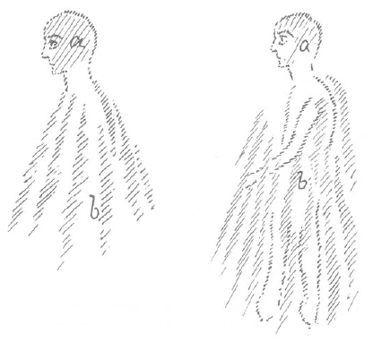

Heute müssen wir, wenn wir in der richtigen Art in diesen Betrachtungen fortfahren wollen, etwas vom Wesen des Menschen und seinem Hineingestelltsein in die geschichtliche Entwickelung ins Auge fassen. Zuerst lenken wir unseren Blick darauf, daß der Mensch eine intellektuelle Kraft in sich hat, eine intellektuelle Begabung. Worin besteht diese intellektuelle Begabung? Nun, darin, daß wir Gedanken fassen können. Wir brauchen zunächst nicht darüber nachzusinnen, woher diese Gedanken kommen, wenn wir dies oder jenes uns vorstellungsgemäß zurechtlegen. Dieses Gedankenleben begleitet uns ja während des ganzen wachen Bewußtseins; und wir haben zum Beispiel auch das Gefühl, wenn wir gehen, stehen oder irgend etwas anderes ausführen, daß unsere Gedanken es sind, die uns leiten, daß wir dem folgen, was zuerst in unseren Gedanken vorliegt. Nun, ob das wirklich so ist, darüber wollen wir im Verlauf dieser Vorträge dann noch sprechen. Ich will jetzt nur konstatieren, was wir so im gewöhnlichen, alltäglichen Bewußtsein haben: Das sind unsere Gedanken. Aber mit der Gedankenwelt als solcher ist es doch noch etwas ganz anderes. Und man versteht auch des Menschen Verhältnis zu seinen Gedanken nicht, wenn man nicht ins Auge faßt, was es mit der Gedankenwelt als solcher eigentlich auf sich hat. ^l1japc

Wir sind nämlich in Wirklichkeit überall, wo wir stehen, gehen und liegen, nicht nur in der Welt von Luft und Licht und so weiter, sondern wir sind immer in einer flutenden Gedankenwelt. Sie können sich das am besten vorstellen, indem Sie sich die Sache so zurechtlegen: Wenn Sie durch den Raum gehen als gewöhnlicher, physischer Mensch, gehen Sie atmend hindurch, Sie gehen durch den lufterfüllten Raum. So aber bewegen Sie sich gewissermaßen auch durch den gedankenerfüllten Raum. Die Gedankensubstanz, die erfüllt den Raum um Sie herum. Und diese Gedankensubstanz ist nicht ein unbestimmtes Gedankenmeer. Das ist nicht so etwas wie ein nebuloser Äther, wie man es sich zuweilen gern vorstellen möchte, sondern diese Gedankensubstanz ist eigentlich das, was wir die elementarische Welt nennen. Wenn wir von Wesen der elementarischen Welt sprechen im weitesten Sinne des Wortes, dann bestehen diese Wesen der elementarischen Welt aus dieser Gedankensubstanz, richtig aus dieser Gedankensubstanz. Es ist nur ein gewisser Unterschied zwischen den Gedanken, die da draußen herumschwirren, die eigentlich lebendige Wesen sind, und den Gedanken, die wir in uns haben. Ich habe hier schon öfter darauf hingewiesen, was da für ein Unterschied ist. In meinem demnächst erscheinenden Buch, das ich gestern schon erwähnt habe, werden Sie wiederum Hinweise finden auf diesen Unterschied. ^t5m1i5

Sie können sich nämlich die Frage vorlegen: Wenn wir da draußen im Gedankenraum irgendsoein Wesen, ein elementarisches Wesen haben und in mir ich doch auch Gedanken habe - wie verhalten sich meine Gedanken zu den Gedankenwesen, die da draußen im Gedankenraum sind? Sie bekommen eine richtige Vorstellung von diesem Verhältnis der eigenen Gedanken zu den Gedankenwesen draußen im Raum, wenn Sie sich das Verhältnis vorstellen eines menschlichen Leichnams, der, nachdem der Mensch gestorben ist, zurückgeblieben ist, zu dem lebendigen Menschen, der herumwandelt. Dabei müssen Sie allerdings solche Gedanken ins Auge fassen, die Sie an der äußeren Sinneswelt im wachen Bewußtsein gewinnen. Unsere Gedanken sind nämlich Gedankenleichen. Das ist das Wesentliche. Die Gedanken, die wir von der äußeren Sinneswelt so durch das wache Bewußtsein mit uns schleppen, das sind eigentlich Gedankenleichen, sind abgelähmte, abgetötete Gedanken; draußen sind sie lebendig. Das ist der Unterschied. ^1n38w8

Nun sind wir also eigentlich dadurch in die Gedankenelementarwelt eingespannt, daß wir, indem wir aus der Umwelt unsere Wahrnehmungen aufnehmen und diese Wahrnehmungen zu Gedanken verarbeiten, die lebendigen Gedanken töten. Und indem wir sie dann in uns haben, diese Gedankenleichen, denken wir. Daher sind unsere Gedanken abstrakt. Unsere Gedanken bleiben gerade aus dem Grunde abstrakt, weil wir die lebendigen Gedanken töten. Wir gehen wirklich mit unserem Bewußtsein eigentlich so herum, daß wir Gedankenleichen in uns tragen und diese Gedankenleichen unsere Gedanken, unsere Vorstellungen nennen. So ist es in der Wirklichkeit. ^oofkit

Diese lebendigen Gedanken aber, die draußen sind, die sind nun durchaus nicht ohne Verhältnis, ohne Beziehung zu uns; sie haben eine lebendige Beziehung zu uns. Das kann ich Ihnen gleich klarmachen. Aber Sie müssen nicht erschrecken vor dem Grotesken dieser ungewohnten Vorstellung. Denken Sie sich, Sie liegen morgens im Bett; Sie können auf zweierlei Arten aufstehen. Im gewöhnlichen Leben merken Sie den Unterschied zwischen diesen beiden Arten des Aufstehens nicht, weil Sie die beiden Arten meist durcheinandermischen und weil Sie überhaupt nicht achtgeben gerade auf den Moment des Aufstehens. Aber Sie können auf zweierlei Arten aufstehen. Sie können so aufstehen, daß Sie eigentlich gar nicht darüber nachdenken, sondern aus Gewohnheit aufstehen oder indem Sie sich genau den Gedanken bilden: Ich werde jetzt aufstehen. - Ich sage, Sie mischen das durcheinander; «halb zog es ihn, halb sank er hin». Es geschieht bei manchem Menschen im gewöhnlichen Leben eben doch so, daß er, der Gewohnheit, der Notwendigkeit folgend, sich aufstehen läßt, und dann auch leise anklingend den Gedanken hat: Ich werde jetzt aufstehen. — Wie gesagt, mancher mischt das durcheinander, aber man kann es in abstracto unterscheiden. Das sind die extremen Fälle, welche man unterscheiden kann. Gedankenlos, ganz gedankenlos, ohne daß Sie selbst etwas dazu denken, können Sie aufstehen oder aber vollbewußt. Zwischen diesen zwei Arten des Aufstehens ist ein großer Unterschied. Wenn Sie ganz gedankenlos aufstehen, bloß der anerzogenen Gewohnheit nach, dann folgen Sie den Impulsen der Geister der Form, der Elohim, so wie diese im Beginne des Erdenwerdens den Menschen als Erdenmenschen gebildet haben. Also denken Sie sich, Sie würden Ihr eigenes Denken ausschalten und immer so aufstehen wie eine Maschine, dann stehen Sie nicht ohne Gedanken auf, nur ohne Ihre eigenen Gedanken. Aber daß Sie aufstehen können, in dieser ganzen Bewegungsform, darin liegen Gedanken, objektive, nicht subjektive, innere Gedanken; und diese Gedanken sind nicht Ihre Gedanken, sondern die Gedanken der Geister der Form. ^xcd2ae

Wenn Sie ganz entsetzlich faul wären und eigentlich gar nicht aufstehen möchten, wenn es gar nicht in Ihrer Natur läge aufzustehen und Sie nur aus Überlegung aufstehen würden, wenn Sie aufstehen würden gegen Ihre Natur, aus dem bloßen subjektiven Gedanken heraus, dann würden Sie ahrimanischer Geistigkeit folgen, Sie würden nur Ihrem Kopf folgen; Sie würden in diesem Falle Ahriman folgen. Im gewöhnlichen Leben mischt man, wie gesagt, die Dinge durcheinander. Wie es da beim Aufstehen ist, so ist es eigentlich bei allem, was der Mensch tut. Denn der Mensch besteht wirklich aus diesen zwei Wesenheiten, die äußerlich, physisch sich unterscheiden nach dem Kopf und der andern Körperlichkeit. Der Kopf des Menschen ist ja ein außerordentlich bedeutungsvolles, weit älteres Instrument als die übrige Körperlichkeit. So wie der Kopf des Menschen konstruiert ist — ich habe darüber schon im vorigen Jahre gesprochen -, ist er eigentlich in seiner Grundform schon das Ergebnis der Mondenentwickelung. Er ist da schon herübergekommen von der Saturn-, Sonnen- und Mondenentwickelung. Aber wenn der Mensch so sich auf der Erde ausgebildet hätte, wie er von der Mondenentwickelung herübergekommen ist, dann wäre er nicht so geworden, wie er jetzt ist, da würde der Mensch anders ausschauen. Wenn die Menschen einander sehen würden, so würden sie einander anders sehen, als sie sich jetzt sehen. ^l6o2vs

Schematisch könnte man sagen (es wird gezeichnet, Zeichnung links): Der Mensch wäre eine Art Gespenst, aus dem nur etwas deutlicher die Kopfesform herausragen würde. Dazu war eigentlich der Mensch bestimmt. Die übrige Körperlichkeit sollte gar nicht so sichtbar sein, wie sie jetzt sichtbar ist. Man muß diese Dinge einmal ins Auge fassen, weil man sonst eigentlich die Entwickelung des Menschen auf der Erde nicht versteht. Die übrige Körperlichkeit würde elementarische Wesenheit sein, bloße elementarische Wesenheit; und es würde dann wirksam sein in seinem Haupte alles dasjenige - ich nenne es «a» -, was Erbstück ist des von der Erde verwandelten Mondenseins. Also das, was ich da «a» nenne, das Erbstück des von der Erde verwandelten Mondenseins, das ist eigentlich der Mensch. Der Mensch in Wirklichkeit ist eigentlich das Haupt mit nur einem ganz geringen Ansatz. ^jyd4k4

Das andere, was der Mensch noch hat - nennen wir es «b» und betrachten wir es zunächst jetzt nur als dieses elementare, luftartige Wesen -, ist nicht in Wirklichkeit der Mensch, sondern dieses andere, «b», ist die Erscheinung der Geister der höheren Hierarchien, von den Geistern der Form nach abwärts. «b» können wir nennen: die Gestaltung der kosmischen Hierarchien. Richtig stellen Sie sich den Menschen vor, wenn Sie sich ihn so vorstellen, daß die kosmischen Hierarchien das geschaffen haben, was ich hier als «b» zusammengefaßt habe. Und wie aus dem Schoße der kosmischen Hierarchien ragt der Mensch, dasjenige, was von ihm seit der Saturnzeit geworden ist, heraus. Wenn Sie sich also die außerkopfliche Natur des Menschen vergeistigt denken — aber Sie müssen sie sich vergeistigt denken, wenigstens verluftigt -, haben Sie eigentlich den Körper kosmischer Hierarchien. ^7kdnzh

 ^ebwjti

Nun kam in diese ganze Entwickelung hinein die luziferische Verführung (es wird weiter gezeichnet, Zeichnung rechts), die bewirkte, daß diese ganze mehr elementarische Leiblichkeit verdichtet wurde zum übrigen Menschenkörper. Das hat natürlich auch seine Wirkung für das Haupt gehabt. Daraus bekommen Sie eine Vorstellung, was der Mensch eigentlich in Wirklichkeit ist. Der Mensch, wenn wir von seinem Haupte absehen, das sein Eigentum aus der früheren Entwickelung ist, der Mensch wäre eigentlich, wenn sein Körper nicht ins sinnliche Fleisch geschossen wäre, die äußere Erscheinung der Elohim. Und nur durch die luziferische Versuchung hat sich hineinverdichtet in diese äußere Erscheinung der Elohim seine Fleischlichkeit. ^5757di

Dadurch ist aber etwas sehr Merkwürdiges zustandegekommen worauf ich öfter als ein wichtiges Geheimnis hingedeutet habe -, dadurch ist zustande gekommen, daß der Mensch gerade in den Organen, die man gewöhnlich die Organe seiner niederen Natur nennt, das Ebenbild der Götter ist. Nur ist dieses Ebenbild der Götter, so wie der Mensch auf der Erde ist, verdorben. Gerade das, was das Höhere ist am Menschen, was geistig sein sollte vom Kosmos aus, gerade das ist seine niedere Natur geworden. Bitte vergessen Sie nicht, daß das ein wichtiges Geheimnis der menschlichen Natur ist. Dasjenige, was des Menschen niedere Natur jetzt ist, ist niedrig durch den luziferischen Einschlag; es ist eigentlich bestimmt, seine höhere Natur zu sein. Das ist das Widerspruchsvolle im Wesen des Menschen. Das ist etwas, das unzählige Welten- und Lebensrätsel löst, wenn man es in der richtigen Weise erfaßt. ^lpchre

Man kann also sagen: Die Entwickelung des Menschen ging so vor sich, daß der Mensch durch den luziferischen Einschlag dasjenige, was ihm fortwährend auftauchen sollte aus dem Kosmos, zu seiner niederen Natur gemacht hat. Sogar viele geschichtliche Erscheinungen werden Ihnen erklärlich sein, wenn Sie das ins Auge fassen, was die Leiter der alten Mysterien gewußt haben, die noch nicht so frivol, so zynisch und so philiströs waren wie die heutigen Menschen. Gewisse Symbole der alten Völker, die man heute nur im sexuellen Sinne auffaßt, Symbole, die von der niederen Natur genommen sind, die werden erklärlich dadurch, daß diejenigen alten Mysterienpriester, die sie eingesetzt haben, eigentlich in diesen Symbolen das Höhere der niederen Natur des Menschen zum Ausdruck bringen wollten. ^c03hk5

Sie sehen, wie fein diese Dinge angefaßt werden müssen, die in den Symbolen enthalten sind, wenn man nicht ins Frivole verfallen will, in das natürlich der heutige Mensch leicht verfällt, denn der kann sich ja gar nicht denken, daß am Menschen noch etwas anderes ist als die Versinnlichung, die aber eigentlich das Luziferische der höheren Natur ist. Daher kann es ihm sehr leicht passieren, daß er auf diesem Gebiete die historischen Symbole ganz falsch deutet. Es gehört ein gewisser vornehmer Sinn dazu, die alten Symbole nicht in niederem Sinne zu deuten, trotzdem sie häufig so gedeutet werden können. Dadurch aber wird Ihnen auch klar, daß, wenn Gedanken aus der Elementarwelt, also die lebendigen, nicht die abstrakten, toten Gedanken, die im Kopfe entstehen, sondern wenn lebendige Gedanken dem Menschen kommen, dann diese lebendigen Gedanken aus dem ganzen Menschen kommen müssen. Und das geschieht nicht durch bloßes Nachdenken. Heute glaubt man: Man kann überhaupt durch bloßes Nachdenken immer zu Gedanken kommen. Heute glaubt man: Wenn der Mensch nur nachdenkt, dann kann er über alles denken, wenn ihm nur die Dinge zugänglich sind, über die er denken will. Das ist aber ein Unsinn. Die Wahrheit ist vielmehr, daß das Menschengeschlecht in einer Entwickelung ist und daß zum Beispiel die Gedanken, die Kopernikus gefaßt hat, die Galilei gefaßt hat in einer bestimmten Zeit, vorher nicht durch bloßes Nachdenken gefunden werden konnten. Warum? Weil durch Nachdenken der Mensch die Gedanken fabriziert, die im Kopfe walten. Wenn aber solch ein Gedanke weltgeschichtlich auftaucht, wenn er so auftaucht, daß er als Einschlag kommt in die ganze menschliche Entwickelung hinein, dann wird er von den Göttern gegeben durch den ganzen Menschen hindurch. Dann wallt er zuerst, indem er das Luziferische überwindet, durch den ganzen Menschen und vom ganzen Menschen aus erst in den Kopf. Ich glaube, es ist das schon zu verstehen. Daher können bestimmte Gedanken in bestimmten Zeitaltern nur erwartet werden, wenn nicht der Mensch bloß nachdenkt, wenn dem Menschen nicht bloß durch seine Augen, seine Ohren etwas vermittelt wird, sondern wenn ihm durch sein ganzes Wesen, das ein Abbild der Hierarchien ist, etwas hereininspiriert wird aus der hierarchischen Welt. ^xublpt

Wenn Sie dies bedenken, dann werden Sie auch finden, daß viel gesagt ist mit dem, was gestern angedeutet worden ist. Wir leben in diesem Zeitalter, von der fünften nachatlantischen Zeit an, eben viel mehr innerlich als früher, als zum Beispiel im griechischen Zeitalter, wo die äußere Umwelt viel mehr Spirituelles hergab. Das innerliche Leben bezieht sich auf dieses Heraufkommen der Gedanken durch den ganzen Menschen. Der Umgang des Menschen mit den Göttern war in früheren Zeiten, im vierten nachatlantischen Zeitalter, viel äußerlicher, als er jetzt ist. Er ist jetzt viel intimer geworden. Der Mensch geht immer mit den Göttern um; nur sein Kopf weiß in der Regel nichts davon, weil der Kopf eben nur die menschlichen Gedanken faßt, eigentlich nur die Gedankenleichen. Als ganzer Mensch pflegt der Mensch immer den Umgang mit den Göttern. Aber dieser Umgang ist intimer geworden in der neueren Zeit. Daher ist sogar die Natur des Hellsehens heute von einer andern Beziehung zu den Göttern und zu den entkörperten Geistern überhaupt, als das früher der Fall war. Wenn heute die Menschenseele mit Geistern oder mit Toten verkehrt, so ist der Verkehr ein sehr subtiler. Man verkehrt mit geistigen Wesenheiten etwa so, ich möchte sagen, wie der eigene Gedanke mit dem eigenen Willen in der Seele verkehrt. Das ist sehr intim. Und diese Intimität entspricht der heutigen Zeit. Sie entspricht sowohl dem Wesen des Menschen hier auf der Erde wie auch dem Wesen der Toten, die heute durch die Pforte des Todes in die geistige Welt gehen. Damit dieser intime Verkehr eintreten konnte, mußten gewisse Beziehungen des Menschen zum Kosmos eine andere Gestalt annehmen, als sie früher hatten. Jetzt gibt es Menschen, welche ein Verhältnis haben zur geistigen Welt, das sich in viel intimerer Weise heute ausdrückt, wenn es bewußt wird, als es sich früher ausgedrückt hat. Gewisse Fähigkeiten mußten verlorengehen, damit dieser intimere Verkehr mit den Göttern sich entwickle. Daher kam es, daß während der griechisch-lateinischen Epoche und sogar noch tief ins Mittelalter herein die Menschen, wie gesagt, noch aus der äußeren Umwelt unmittelbar Spirituelles wahrnahmen, nicht bloß wie wir heute materielle Farben sehen, materielle Töne hören, sondern in Farben und Tönen noch Spirituelles wahrnahmen. Und es war ihnen auch noch die Möglichkeit gegeben, das, was heute zum chaotischen Traum geworden ist, als Mittel zu benutzen, um in einer viel weniger subtilen Weise in die geistige Welt hineinzukommen, als das heute der Fall ist. Ich möchte sagen: Der Verkehr mit der geistigen Welt war in früheren Zeiten ein gröberer als heute; heute ist er ein feinerer geworden. Früher war verhältnismäßig leicht heranzukommen an die Geister und an die Toten. Heute haben die gewöhnlichen Träume nicht mehr denselben Wert; aber sie hatten ihn noch bis tief ins Mittelalter hinein. Manche Menschen bewahrten sich die Fähigkeit noch lange fort. Auch alles Geschehen ringsumher in der Ihnen geschilderten gedanklichen Elementarwelt nahmen daher die früheren Menschen traumhaft wahr. Der Mensch war nicht so abgeschlossen von der umliegenden geistigen Welt, sondern er ragte noch mit seinem Wesen hinein. Und er war sich dessen bewußt und handelte danach, verhielt sich danach. ^n2gid6

Jetzt glaubt man natürlich an diese Dinge nur in dem Sinne, daß man sie als einen alten Aberglauben betrachtet. Aber wenn innerhalb dieses «alten Aberglaubens» etwas Bedeutsames auftritt, dann kommt die heutige Wissenschaft mit der Sache nicht mehr zurecht. Ich will nur ein Beispiel dafür anführen: Die bekannte historische Persönlichkeit Kimon hatte einen Freund Astyphilos; Astyphilos war einer, der sich auf die Deutung, auf die richtige intellektuelle Deutung von Träumen verstand, und er verkündigte dem Kimon, der vor dem ägyptischen Feldzuge von einem bösen, kläffenden Hunde geträumt hatte, seinen Tod, indem er sagte: Du hast von einem bösen, kläffenden Hund geträumt, du wirst bei diesem Feldzug den Tod erleiden. - Das erzählt Horaz. ^8bckhe

Ein weiser Mensch der Gegenwart, der über Träume geschrieben hat, aber im materialistischen Sinn, der glaubt natürlich: Das war ein gewöhnlicher Traum des Kimon, und Astyphilos war ein Gaukler, der Träume gedeutet hat. — Aber dieser moderne Gelehrte macht allerdings den merkwürdigen Zusatz: Und der Zufall hat es gewollt, daß seine Prophezeiung eintrat. — Ich könnte Ihnen Bücher vorweisen, aus denen unwiderlegbar hervorgeht, daß die Prophezerungen eingetroffen sind. Dann sagt man: Der Zufall hat es gewollt. — Das ist nur ein Beispiel für viele. Die Menschen denken heute eben, daß die Seelen immer so waren, wie sie heute sind, und daß eigentlich eine wirkliche Entwickelung der Seelen gar nicht vorhanden sei. ^m7cfy9

Wie also die äußere Sinnesanschauung noch spiritueller war, so war gewissermaßen auch der Zusammenhang mit der umliegenden Gedankenelementarwelt noch imaginativer. Die Träume hatten noch den Wert von Imaginationen, die in die Zukunft verweisen. So wie das Gedächtnis auf die Vergangenheit verweist, so verwiesen die Imaginationen auf die Zukunft, natürlich nicht in derselben Weise. Wir müssen uns also die Konstitution der Seelen in früheren Zeiten ganz anders denken: Gewissermaßen durchsetzt war das gewöhnliche sinnliche Anschauen des Tagwachens von verschwimmenden Traumgebilden, die aber auf Realitäten im Gang der elementaren Welt hinwiesen. Man möchte sagen: Die materielle Welt der Sinneswahrnehmungen war noch nicht so fest mineralisch verdichtet. Da sprühte noch überall aus Farben und Tönen Spirituelles heraus. Dafür war aber auch noch die menschliche Fähigkeit vorhanden, gewissermaßen wachend zu träumen, und dieses wachende Träumen war Realität in der elementaren, objektiven Gedankenwelt. Zur Begründung und zur Erkräftigung der Freiheit des Menschen wurde cben der Mensch aus diesem Zusammenhang mit der äußeren Welt herausgesetzt, und es wurde sein inneres Leben intimer, so wie ich es Ihnen charakterisiert habe. ^mm3a5l

Nun aber müssen wir eines ins Auge fassen, das sehr wichtig ist. Man kann über die Naturerscheinungen mit Hilfe der gewöhnlichen Intellektualität nachdenken, aber man kann nicht über soziale Erscheinungen mit Hilfe der gewöhnlichen Intellektualität nachdenken; das kann man nicht. Heute glaubt der Mensch: Das Denken, das ihn befähigt, über den äußeren Verlauf der Sinnenwelt nachzudenken, das kann er auch anwenden, um soziale Gesetze, um politische Impulse zu finden. Er tut es auch vorläufig, aber sie sind auch danach. So etwas, wie Sie es noch in der römischen Geschichte lesen und Sie könnten solche Dinge später auch noch verfolgen, wenn die Geschichte nicht gar zu sehr zu einer Legende gemacht worden wäre -, daß Numa Pompilius sich von der Nymphe Egeria zu seiner Staatseinrichtung inspirieren ließ, weist Sie darauf hin, daß man dazumal, wenn man Staatseinrichtungen machen wollte, an die Götter appellierte. Bloß durch Nachdenken politische Strukturen auszubilden, das hielt man nicht für möglich. Heute meint man, daß der einzelne allerdings nicht fähig ist, politische Strukturen auszudenken, aber wenn man den einzelnen soundso viel mal multiplizieren würde, dann würde er schon fähig. Wenn also die erleuchteten Parlamente zusammenkommen in den modernen Demokratien, dann wären dreihundert Köpfe durch Nachdenken zu dem fähig, zu dem natürlich einer nicht fähig ist. Es widerspricht das zwar einem Satz von Rosegger, den ich schon öfter angeführt habe: «Oaner is a Mensch, mehre san Leut, un viele san Viecher!», aber praktisch wird man so etwas doch nicht anwenden, nicht wahr! Und denken Sie sich einmal, was die moderne, aufgeklärte Welt ungefähr dazu sagen würde, wenn - nicht in der alten, aber in einer neuen Form —- etwa die Mitteilung eines Tages durch die Welt ginge, daß Woodrow Wilson sich von einer Nymphe zu irgendeinem Ukas hätte inspirieren lassen. ^xivm1i

Also diese Dinge sind zunächst anders, wenn auch nicht gerade gescheiter geworden. Es wird das allerdings schwer zu verstehen sein, aber man muß sich bekanntmachen damit, daß wirkliche, richtige Gedanken für soziale Strukturen erst dann wiederum herauskommen, wenn die Menschen an den Geist appellieren. Es braucht das nicht in der alten Form zu sein, und es wird auch nicht in der alten Form sein, aber dieses Appellieren an den Geist muß wieder stattfinden, sonst werden die Menschen an politischen Grundsätzen, an sozialen Strukturen und Ideen bloß Nichtiges zutagefördern. Es muß das lebendige Bewußtsein entstehen, daß man in der gedankenelementaren Welt darinnen lebt und aus dieser heraus sich inspirieren lassen muß. ^om8nb5

Heute kann man noch über diese Dinge lachen. Aber die Menschheit wird sich in Schmerzen und Leiden das Bewußtsein erringen müssen von der Inspiration auf dem schöpferischen Gebiete der sozialen Ordnung. Und damit deuten wir in einer noch intimeren Weise auf etwas hin, was von heute ab immer mehr und mehr der Menschheit notwendig sein wird. ^9t0lpb

Wenn der Mensch einsehen wird, daß er sich jetzt vorzubereiten hat, wiederum einen Anschluß zu suchen an die geistige Welt, um in das Reich von dieser Welt ein Reich hineinzubringen, das nicht von dieser Welt ist, das aber das Reich von dieser Welt überall durchdringt, dann erst wird Heil in die chaotische soziale Menschheitsstruktur hineinkommen. ^bywu6l

Dazu wird allerdings notwendig sein, daß der Mensch die Unbequemlichkeit überwindet, sich mit dem intimen Verhältnis des Menschen zur umliegenden Welt zu befassen. Für die bedeutungsvolleren Zweige des Menschenwirkens wird eintreten müssen eine Vertiefung in die Art, wie das menschliche Verhältnis zur Umwelt war im vierten nachatlantischen Zeitraum, um sich daran zu orientieren, um wirklich zu erkennen, daß der Mensch einmal anders zu der Umwelt stand, als er jetzt steht. Man kann das noch studieren. Es muß nur diese Legende — im schlechten Sinne Legende - einmal überwunden werden, die man heute Geschichtswissenschaft nennt. Man muß in die historische Wirklichkeit, wenigstens bis zum Mysterium von Golgatha zurückgehen. Das kann dann geschehen, wenn die äußere geschichtliche Forschung befruchtet wird von der geisteswissenschaftlichen Forschung. Da müssen sich aber die Menschen eben bequemen, sich in die geisteswissenschaftliche Forschung etwas einzuleben. Nur sind die Begriffe heute so, daß es dem Menschen manchmal ganz grotesk erscheint, wenn er anfängt, in die geistige Welt hineinzukommen, weil er eigentlich die instinktive Vorstellung hat, in der geistigen Welt müsse es geradeso aussehen wie in der sinnlichen Welt. Er will ja gar nichts anderes, als da nur eine verfeinerte sinnliche Welt finden. Daß ihm da etwas ganz anderes entgegentritt, was ihn selbst bei den kleinsten Einzelheiten überrascht, das kann der Mensch heute nicht begreifen. Ich sage Ihnen eine ganz wahre Sache, meine lieben Freunde. Aber denken Sie einmal, wie wenig glaubhaft dies der heute nur an den physischen Plan gewöhnte Philosoph finden wird. ^hecozw

Nehmen wir an, ein heutiger Philosoph, so ein normaler Universitätsprofessor, würde - es wäre ja ein kleines Wunder, aber nehmen wir an, daß das Wunder geschehen würde - fünf Minuten durch irgendeine Inspiration dazu kommen, an die geistige Welt die Frage zu stellen, ob er ein wirklicher Philosoph durch inneren Beruf sei. Was glauben Sie, wie diese Antwort ungefähr aussehen würde? Er würde eine Imagination haben, und diese Imagination würde die richtige Antwort sein, nur muß man Imaginationen im richtigen Sinne deuten. Wirklich, ich erzähle Ihnen nichts, was nicht in unzähligen Fällen da war. Solch ein Philosoph würde nämlich die Antwort dadurch bekommen, daß ihm Eselsohren aufgesetzt würden. Und aus dieser Imagination würde er sich zu deuten haben: Also bin ich ein richtiger Philosoph. — Das ist kein Scherz, sondern das beruht darauf, daß gewisse Vorstellungen, die auf diesem physischen Plane so und so beschaffen sind, auf dem geistigen Plane die gerade entgegengesetzten sind. Eselsohren zu haben, ist auf dem physischen Plan keine Auszeichnung; in der geistigen Welt ist Eselsohren zu haben als Imagination viel mehr wert als der höchste Orden auf dem physischen Plan für irgendeinen Philosophieprofessor. ^qrsm41

Aber nun denken Sie sich jemand, der nur an den physischen Plan gewöhnt ist und der plötzlich - wie gesagt, durch ein Wunder - hellsichtig würde und sich mit Eselsohren sähe: er würde glauben, daß er verhöhnt würde, er würde glauben, daß er getäuscht würde. Schon deshalb würde er das für eine bloße Illusion erklären. Selbst in Einzelheiten sieht es eben ganz anders aus in der geistigen Welt als hier in der physischen Welt, und man hat schon nötig, das, was man in der geistigen Welt erlebt, sich zu übersetzen, wenn man das Entsprechende in der physischen Welt richtig deuten will. Ich wollte mit den Eselsohren nicht bloß einen Witz machen. Lesen Sie in alten Schriften nach, so werden Sie finden: Dort sind diese Träume, die die Philosophen gehabt haben, um sich von ihrem inneren philosophischen Beruf zu überzeugen, angeführt. Das ist eine typische Darstellung, ein typischer Traum, den ich Ihnen angeführt habe. Die Philosophen haben sich dadurch, daß sie sich selber mit Eselsohren gesehen haben, davon überzeugt, daß sie wirklich den philosophischen Beruf haben. ^xxwe4a

Einiges Überraschende, Frappierende werden die Menschen daher schon erleben müssen, wenn sie wiederum mit den Eigentümlichkeiten der geistigen Welt bekannt werden wollen. Wenn Sie «Die Chymische Hochzeit des Christian Rosenkreutz anno 1459» lesen, so werden Sie auch manchmal das Gefühl haben: Über die grotesken Dinge darin müßten Sie lachen. - Dennoch sind sie sehr tief bedeutsam, weil der Weg, der dort angedeutet wird, eben nicht bloß mit sentimentalem Gesicht aufgefaßt werden muß, sondern mit einem gewissen überlegenen Humor. ^ogh4aq

Ich sagte, man könne auch in späteren Zeiten Analoges finden für das, was in der römischen Geschichte von der Belehrung des Numa Pompilius durch die Nymphe Egeria erzählt wurde. Die Dinge werden heute den Menschen nicht mehr mitgeteilt; aber deshalb kennt man ja auch Geschichte wirklich nur als eine Fable convenue. Bedenken Sie, daß am Ende des 16., am Beginn des 17. Jahrhunderts Jakob Böhme noch mit seinen tiefen Intuitionen auftaucht, die wirklich in großen, gewaltigen Überschauungen Intuitionen einer älteren Zeit hereinragen lassen. Zu den Schülern des Jakob Böhme gehörten viele Menschen der späteren Zeit; und einer der letzten bewußten Schüler Jakob Böhmes war Saint-Martin. Saint Martin, insbesondere in seinem Buche «Des erreurs et de la vérité», fußt ja ganz auf Jakob Böhme, nur ist es schon ein etwas verflüchtigter Jakob Böhme. Aber so viel hat er noch von dem, was aus früheren Zeiten herüberragt, daß er weiß: Will man Gedanken haben über soziale Strukturen, will man wirkliche, wirksame politische Gedanken haben, dann darf man sie nicht bloß ausdenken, dann müssen diese Gedanken aus der spirituellen Welt hereingeflossen sein. - Und Saint-Martin gibt ja in seinem Buche «Des erreurs et de la vérité» nicht bloß Gedanken über die äußere Natur und ihren Verlauf, über die Historie und ihren Verlauf, sondern er gibt auch politische Ideen, ganz bestimmte politische Ideen. Heute, wo die Staaten die einzige politische Struktur sind, würde man sie Staatsideen nennen. Aber innerhalb dieser Auseinandersetzungen findet sich eine ganz bestimmte, bedeutungsvolle Vorstellung, und es ist bezeichnend, daß sich solch eine Vorstellung gerade an der Spitze der Politik des Saint-Martin befindet. Da spricht er von dem «ursprünglichen menschlichen Ehebruch». Dieser Ehebruch habe einmal stattgefunden in der Zeit, in welcher ein Verkehr zwischen Mann und Weib in sexueller Beziehung auf der Erde noch nicht stattgefunden hat. Also einen gewöhnlichen Ehebruch meint er nicht; er meint etwas ganz anderes, er meint etwas, worüber er einen sehr starken, dichten Schleier webt, etwas, worauf etwa die Bibel deutet, indem sie sagt: «Und die Söhne der Götter fanden, daß die Töchter der Menschen schön waren, und verbanden sich mit ihnen.» Es ist ja dasjenige Ereignis, durch das dann die ganze Verwirrung in der atlantischen Welt stattfindet, das auch in einem geheimnisvollen Zusammenhang steht damit, daß der Mensch seine elementargeistige Natur versinnlicht hat. Man kann dieses Ereignis, das Saint-Martin «den ursprünglichen Ehebruch» nennt, eben nur andeuten; er deutet es auch nur an. ^7rm4bu

Aber das sieht man bei Saint-Martin, daß er die Notwendigkeit ins Auge faßt: Will man über Politik nachdenken, so darf man nicht bloß die äußeren Menschenzusammenhänge ins Auge fassen, wie man es heute tut, sondern da muß man in die Lage kommen, zurückzugehen bis in jene Zeiten, wo man über den Menschen nur etwas wissen kann, wenn man über die Sinnenwelt hinaus in die spirituelle Welt geht. Man muß eben von der spirituellen Welt aus die Grundlagen politischen Nachdenkens hinstellen. Das hat noch Saint-Martin am Ende des 18. Jahrhunderts gewußt - denn er ist ja erst 1804 gestorben -, und was er in «Des erreurs et de la vérité» sagt, ist auch schon ins Deutsche übersetzt worden. Das Buch gibt es auch im Deutschen. Es ist ja nicht uninteressant, das zu sagen, weil ein gewisser Pfarrer gegen uns, die wir wiederum das spirituelle Leben hier pflegen wollen, ganz in der Nähe hier gesagt hat, gegen diese Tollheiten müsse man sich erinnern an den einfachen, biederen Matthias Claudius. Und dann hat er eine Strophe von Matthias Claudius zitiert, um uns zu widerlegen. Nun ist es aber just Matthias Claudius, der das Buch von Saint-Martin «Des erreurs et de la vérité» übersetzt hat, um dasjenige, was der spirituellen Wissenschaft in der damaligen Zeit entsprach, auch seinem Volke zugänglich zu machen. Der betreffende Herr bezeugte also damit nur seine kolossale Ignoranz über Matthias Claudius, abgesehen davon, daß er nur eine Strophe des Gedichts zitiert hat, denn wenn er die vorhergehende Strophe zitiert hätte, dann hätte er sich gleich selber widerlegt, aber es genügte ihm die eine Strophe, von der er glaubte, daß sie paßte, um sie gegen die Anthroposophie zu zitieren. ^96qy4c

Also Saint-Martin weiß noch im 18. Jahrhundert, daß eine Brücke da sein muß zwischen den Gedanken der Menschen und dem spirituellen Wissen, den spirituellen Einwirkungen von höheren Welten, wenn man fruchtbare politische Gedanken haben will. So gottverlassen wie das 19. Jahrhundert, wie der Beginn des 20. Jahrhunderts, war eigentlich kein früheres Jahrhundert. Es ist wichtig, daß man das ins Auge faßt. Aber auch so eitel auf seine Gottverlassenheit war kein früheres Jahrhundert. Allerdings wenn die Menschen heute die Staatskunst, die Saint-Martin vertritt, lesen würden - ich glaube, allen, die jetzt als die Gescheiten zusammensitzen und die Geschicke der Welt lenken wollen, würde sich der Magen umdrehen. Denn es besteht einmal heute die Tendenz, sich möglichst wenig bekanntzumachen mit dem, was rings um uns herum wirklich ist. Nun kann man allerdings aus dem Bewußtsein die spirituell-lebendigen Gedanken streichen, man kann beschließen, nur mit Gedankenleichen zu operieren, aber das Tun der Menschen richtet sich nicht danach. Das, was die Menschen tun, das wird eingesponnen in die lebendigen Gedanken. Und wenn dann die Menschen mit ihren Gedankenleichen den lebendigen Gedanken gar nicht nachleben wollen, dann kommt eben das Chaos heraus. Dieses Chaos muß überwunden werden. Dazu sind jene klaren Einsichten notwendig, von denen ich jetzt auch in diesen Vorträgen wiederholt gesprochen habe. Dazu ist aber in mancher Beziehung eine völlige Umkehr nötig von dem, was gerade heute als das Richtige, als das Idealste angesehen wird. ^s1y8ds

Vor allen Dingen wird eine solche Umkehr recht bald notwendig sein, jaam besten wäre es, wenn diese Umkehr in der unmittelbaren Gegenwart im weitesten Umkreise da eintreten würde, wo es sich darum handelt, die Erzieher der Menschen - für die jüngsten und auch für die älteren Menschen - zu bestimmen. Denn auf keinem Gebiete ist die Menschheit so materialistisch geworden wie gerade auf dem Gebiete des Erziehungswesens. ^oeoyho

Lassen Sie mich zum Schluß den Gedanken hinstellen, der uns in der nächsten Zeit beschäftigen wird, denn er ist für alle Menschen sehr interessant und sehr wichtig. Lassen Sie mich aber ihn so hinstellen, daß Sie ihn zunächst einmal ein paar Tage, ich möchte sagen, in Ihrer eigenen Seele umwenden können, damit Sie dann besser vorbereitet zu der Betrachtung dieses Gedankens sind. ^ihsu4y

Die Kinder, wie sie heute ins Leben treten, wir müssen sie Ja so betrachten, daß wir eigentlich wissen: Es ist ein vertrocknendes, ein sich zersplitterndes Äußeres, wie ich es in diesen Tagen auseinandergesetzt habe; aber tief im Innern ist etwas, was erst der wahre Mensch ist, was sich nicht mehr so wie bis ins 15. Jahrhundert herein im Äußeren zum Ausdruck bringt. Bekanntmachen wird man sich immer mehr und mehr müssen damit, daß gerade beim Kinde aus der Art, wie es sich darlebt, aus der Art, wie es denkt und spricht und Gesten macht, nicht voll der innere Mensch äußerlich erschlossen werden kann. Es kommt eben nicht mehr der innere Mensch im Äußeren ganz zum Ausdruck, und am ersten zeigt sich das am Kinde. Das Kind ist vielfach heute schon etwas ganz anderes, als was es äußerlich zum Ausdruck bringt. Man hat sogar schon extreme Fälle. Kinder können äußerlich aussehen wie die ungezogensten Rangen, und in ihnen kann ein so guter Kern stecken, daß sie die wertvollsten Menschen später werden, während man zahlreiche brave Kinder finden kann, die nicht ein bißchen ungezogen sind, die nicht einen Finger in den Mund stecken und auch nicht lange Nasen machen, die auch gut lernen, die vielleicht einmal gute Bankdirektoren werden, gute Schullehrer nach heutigen Begriffen, namentlich auch gute Juristen, die aber halt keine brauchbaren Menschen werden - verzeihen Sie das harte Wort -, weil sie nicht die innere Harmonie mit sich selber und der umgebenden wahren Welt finden. Gerade auf pädagogisch-erzieherischem Gebiete muß zuerst der Grundsatz Platz greifen, daß der Mensch heute innerlich etwas wesentlich anderes ist, als was äußerlich zum Ausdruck kommt. Das aber bedingt, daß man zukünftig die Pädagogen, die Erzieher nicht so bestimmt, wie man sie jetzt bestimmt, sondern nach ganz andern Grundsätzen, denn das Hineinsehen in ein Inneres, das sich nicht im Äußeren ausdrückt, erfordert ja etwas prophetische Gabe. Also wird es notwendig sein, die Examina für die Pädagogen so einzurichten, daß man diejenigen Menschen, die intuitive, prophetische Gaben haben, besonders gut durchkommen läßt und diejenigen, die nicht solche intuitive, prophetische Gaben haben, durchplumpsen läßt durchs Examen, so viel sie auch sonst wissen. ^p8apg3

Man ist heute weit davon entfernt, auf die prophetischen Gaben der Menschen zu sehen, wenn man sie für den Erzieherberuf erzieht. Aber man ist eben von vielem, das eintreten muß, heute recht weit entfernt. Dennoch wird man sich durch den Zwang der Menschheitsentwickelung dazu entschließen müssen, solchen Grundsätzen allmählich zu huldigen. Allerdings mancher materialistisch Denkende der heutigen Zeit würde es als einen ganz verrückten Gedanken betrachten, wenn gesagt wird: Die Pädagogen sollen Propheten werden. - Aber es wird nicht immer so bleiben. Die Menschen werden gezwungen werden, gerade solche Dinge anzuerkennen. ^0ghevx

Dann wollen wir das nächste Mal, von diesem Punkte ausgehend, die Verhältnisse weiter beleuchten. ^qn0rsu

Von unseren Zürcher Freunden bin ich gebeten worden, damit diese besser zurechtkommen, nicht am Sonnabend, Sonntag und Montag zu sprechen, sondern Freitag, Sonnabend und Sonntag. Wir werden uns also am Freitag um 7 Uhr, Sonnabend um 7 Uhr und Sonntag um 4 Uhr wieder treffen. Den Vortrag künstlerischer Art werde ich dann am Montag halten; der steht ja für sich da. ^tmiboo