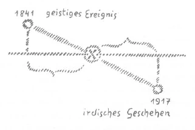

Es ist notwendig, daß man gewisse Grundwahrheiten der geistigen Entwickelung immer wiederum vor seine Seele treten läßt, wenn man von neuem einiges, ich möchte sagen, Material an Kenntnissen und dergleichen aufgenommen hat, um diese Grundwahrheiten besser zu durchdringen. Wir haben uns ja bei den letzten Betrachtungen bekanntgemacht mit allerlei Vorstellungen, welche die Ereignisse der Gegenwart, die Gründe für diese Ereignisse erklären können, selbstverständlich alles bis zu einem gewissen Grade. Wir haben uns damit eben eine Reihe von Vorstellungen über die Entwickelung der Gegenwart angeeignet. Mit diesen Vorstellungen können wir herantreten an Grundwahrheiten, die wir von gewissen Gesichtspunkten aus schon kennen, die aber immer besser noch durchdrungen werden können, wenn man mit neuer Vorbereitung darangeht. ^0tyvh1

Ich habe ja öfter darauf hingedeutet, wie die Mitte des 19. Jahrhunderts, besonders die vierziger Jahre, ein bedeutungsvoller Einschnitt in der geistigen Entwickelung der europäischen und der amerikanischen Menschheit ist. Ich habe darauf hingewiesen, wie damals gewissermaßen der Höhepunkt war der materialistischen Verstandesentwickelung auf der Erde, der Höhepunkt für die Ausbildung desjenigen, was man nennen könnte ein Verstandesbegreifen der äußeren, toten Tatsachen, das nicht herangehen will an das Lebendige. ^pej3fb

Solche Ereignisse - und wir stehen ja heute durchaus unter den äußeren Nachwirkungen dieser Ereignisse und werden noch lange unter diesen Nachwirkungen stehen -, solche Ereignisse haben ihre tiefere Grundlage in Vorgängen der geistigen Welt. Und wenn wir nach den Vorgängen der geistigen Welt forschen, welche den äußeren irdischen Ausdruck fanden in dem eben Gesagten, so müssen wir hinweisen auf einen Kampf, geradezu auf eine Art von Krieg in der geistigen Welt, der dazumal begonnen hat und der für die geistige Welt in gewissem Sinne eine Art Abschluß gefunden hat in dem Zeitpunkte, von dem ich ja auch schon öfters gesprochen habe, der in den Herbst des Jahres 1879 fällt. Sie werden sich also über diese Dinge eine richtige Vorstellung verschaffen, wenn Sie sich einen Kampf denken in den geistigen Welten, der Jahrzehnte hindurch gedauert hat, von den vierziger Jahren bis in den Herbst des Jahres 1879. ^k53du3

Der Kampf, der da stattgefunden hat, kann bezeichnet werden als ein Kampf der geistigen Wesenheiten, welche zu der Gefolgschaft jenes Wesens aus der Hierarchie der Archangeloi gehören, das man bezeichnen kann als Michael, als Kampf also Michaels und seiner Gefolgschaft gegen gewisse ahrimanische Mächte. Also bitte, stellen Sie sich zunächst diesen Kampf vor als einen Kampf in der geistigen Welt. Und alles das, was ich zunächst meine, bezieht sich auf diesen Kampf zwischen Michael und seiner Gefolgschaft und gewissen ahrimanischen Mächten. Sie werden diese Vorstellung namentlich dann, wenn Sie von ihr eine fruchtbare Anwendung machen wollen für das Leben in der Gegenwart, gut verstärken, wenn Sie sich vor das Seelenauge führen, daß diejenigen Menschenseelen, die gerade in dem Jahrzehnt der vierziger Jahre des 19. Jahrhunderts geboren sind, die ersten Phasen dieses Kampfes zwischen der Michael-Gefolgschaft und den ahrimanischen Mächten noch in der geistigen Welt mitgemacht haben. Also diejenigen Menschen, die in den vierziger Jahren des 19. Jahrhunderts geboren sind, haben gewissermaßen als Seelen vor ihrer Geburt den Anfang dieses Geisterkampfes mitangesehen. Wenn man das bedenkt, wird man viel Verständnis haben können für die äußeren und inneren Schicksalserlebnisse solcher Menschen, namentlich für die Seelenverfassungen solcher Menschen. Dieser Kampf hat also stattgefunden in den vierziger, fünfziger, sechziger, siebziger Jahren und hat im Herbst 1879 damit seinen Abschluß gefunden, daß Michael und seine Gefolgschaft einen Sieg davongetragen haben über gewisse ahrimanische Mächte. ^3r1cvb

Was bedeutet das nun? Man kann, wenn man so etwas in der richtigen Art verstehen will, immer wiederum sich behelfen mit dem Bilde, das ja durch die Entwickelung der Menschheit durchgehalten worden ist: mit dem Bilde des Kampfes Michaels mit dem Drachen. Natürlich tritt der Kampf Michaels mit dem Drachen an den verschiedensten Stellen der Entwickelung auf. Man hat es oftmals in der Entwickelung mit einem Kampf des Michael mit dem Drachen zu tun. Man kann das so charakterisieren, daß jedesmal, wenn solch ein Kampf des Michael mit dem Drachen auftritt, dieser Kampf in ähnlicher Weise sich abspielt wie in den vierziger Jahren des vorigen Jahrhunderts, aber um andere Güter und Ungüter, Schäden, Nachteile, man kann sagen, daß gewisse ahrimanische Scharen immer von neuem bald dies, bald jenes der Weltenentwickelung einverleiben möchten und daß sie immer wiederum besiegt werden. So sind sie besiegt worden - aber, wie gesagt, innerhalb der geistigen Welt - im Herbst 1879. ^s6r3rs

Aber was bedeutet es denn, daß nun die Mächte des Drachen, diese ahrimanischen Scharen, in die Reiche der Menschen, gewissermaßen vom Himmel auf die Erde gestoßen sind? Der Verlust dieses Kampfes bedeutet, daß sie nun nicht mehr, biblisch gesprochen, in den Himmeln zu finden sind. Dafür sind sie zu finden in den Reichen der Menschen, und das heißt: das Ende der siebziger Jahre war vorzugsweise diejenige Zeit, in welcher die menschlichen Seelen mit Bezug auf gewisse Erkenntniskräfte von ahrimanischen Impulsen ergriffen wurden. Weil diese ahrimanischen Impulse früher sich in den geistigen Reichen betätigen konnten, haben sie die Menschen mehr in Ruhe gelassen; weil sie heruntergestoßen worden sind aus den geistigen Reichen, sind sie über die Menschen gekommen. Und wenn wir uns fragen: Was ist eigentlich dazumal von den geistigen Reichen aus in die Menschen gefahren als ahrimanische Mächte? so ist es eben die persönlich gefärbte, wohlgemerkt die persönlich gefärbte ahrimanische, materialistische Weltauffassung. ^5b8tn2

Gewiß, der Höhepunkt des Materialismus war in den vierziger Jahren vorhanden. Aber er hatte dazumal seine Impulse mehr instinktiv in die Menschen hineingeschickt. Die ahrimanischen Scharen haben dazumal noch von der geistigen Welt aus in die menschlichen Instinkte hinein ihre Impulse geschickt. Persönliches Eigentum der Menschen wurden diese ahrimanischen Impulse, namentlich Erkenntniskräfte und Willenskräfte, seit dem Herbst 1879. Was vorher mehr Allgemeingut war, wurde damit verpflanzt in das Eigentum der Menschen. Und so können wir sagen, daß seit dem Jahre 1879 durch die Anwesenheit dieser ahrimanischen Mächte im Reiche der Menschen persönliche Ambition, persönliche Tendenz vorhanden ist, die Welt materialistisch zu deuten. Und wenn Sie mancherlei verfolgen, was seit jener Zeit geschehen ist aus den persönlichen Tendenzen der Menschen heraus, dann werden Sie es verstehen aus dem Herabstoßen des Drachen, das heißt der ahrimanischen Scharen durch den Erzengel Michael von den Reichen des Geistes, von den Himmeln auf die Erde. ^1uhqbf

Es ist dies ein Vorgang von ungeheurer Bedeutung, von ganz tiefgehender Bedeutung. Das 19. Jahrhundert und auch noch unsere Zeit haben ja allerdings nicht die Geneigtheit, auf solche Vorgänge in der geistigen Welt und ihren Zusammenhang mit der physischen Welt zu achten. Aber die letzten Gründe, die letzten Impulse für die Ereignisse auf der Erde findet man eben nur, wenn man diese spirituellen Hintergründe kennt. Man muß sagen, daß schon ein gehöriges Quantum von Materialismus, der sich allerdings idealistisch färbt, dazugehört zu sagen: Was bedeutet es denn gegenüber der Ewigkeit, wenn so und so viel Tonnen organischer Substanz durch die Verlängerung des Krieges mehr zugrundegehen! - Man muß fühlen, wie stark im Ahrimanismus eine solche Auffassung wurzelt, denn sie wurzelt ja in den Empfindungswelten. Diese Philosophie von den «Tonnen organischer Substanz», diese Philosophie des Philosophen Lichtenberger ist im wesentlichen eines der zahlreichen Beispiele, die man anführen kann für besondere Ausprägungen ahrimanischer Denkungsweise. ^1k8wp5

Also dasjenige, was als tiefster Impuls lebt in den Seelen vieler Menschen seit dem Jahre 1879, das ist heruntergeworfen worden in die Reiche der Menschen, das lebte vorher als ahrimanische Macht in der geistigen Welt. Es ist von Vorteil, wenn man noch andere Vorstellungen sucht, welche diese Vorstellungen verstärken können, und da ist es gut, wenn man — aber mehr als imaginativ-symbolische Vorstellungen — Vorstellungen aus der materiellen Welt zu Hilfe ruft. Denn dasjenige, was heute mehr geistig geschieht, seelisch geschieht, das hat alles in Urzeiten eine Färbung gehabt, die sich mehr auf materiellen Gebieten auslebte. Das Materielle ist ja auch geistig, es ist nur eine andere Form des Geistigen. ^l2wg62

Wenn Sie in sehr, sehr alte Entwickelungszeiten zurückgehen würden, dann würden Sie nämlich finden, daß ein ähnlicher Kampf stattgefunden hat zwischen Michael und dem Drachen wie der, den ich Ihnen jetzt für das 19. Jahrhundert geschildert habe. Ich deutete ja schon an, wie solche Kämpfe immer wieder sich wiederholt haben, nur ging es immer um andere Dinge. In alten Zeiten hatten auch einmal die ahrimanischen Scharen einen solchen Kampf verloren, und sie wurden auch dazumal heruntergeworfen von den geistigen Welten in den irdischen Bereich. Sie machten eben ihre Anstürme immer von neuem. Da gab es zum Beispiel einen solchen Kampf, durch den diese ahrimanischen Scharen, nachdem sie heruntergeworfen waren auf die Erde, alle diejenige Bevölkerung der Erde in den Bereich der Erde hereingebracht haben, die man heute im ärztlichen Leben als die Bazillen bezeichnet. All das, was man als Bazillenkräfte aufweist, woran Bazillen einen Anteil haben, ist ebenso eine Folge davon, daß einmal ahrimanische Scharen vom Himmel auf die Erde geworfen worden sind, daß der Drache besiegt worden ist, wie es eine Folge eines solchen Sieges ist, daß die ahrimanisch-mephistophelische Denkungsweise seit dem Ende der siebziger Jahre Platz gegriffen hat. So daß man sagen kann: auf materiellem Gebiete haben die Tuberkel- und Bazillenkrankheiten einen ähnlichen Ursprung wie der gerade jetzt vorhandene Verstandesmaterialismus auf geistig-seelischem Gebiete; die zwei Dinge gleichen sich im höheren Sinne durchaus. ^d2am9u

Wir können noch mit etwas anderem diese Vorgänge des letzten Jahrhunderts vergleichen. Wir können hinweisen auf etwas, was Sie ja aus der «Geheimwissenschaft im Umriß» auch kennen: das Hinausziehen des Mondes aus dem Bereich der ErdenentwickeJung. Der Mond hat zur Erde gehört; er ist einmal aus der Erde herausgeworfen worden. Dieses Herauswerfen des Mondes aus dem Erdenbereich, das bedeutet das Platzgreifen gewisser Mondeneinflüsse. Diese sind auch über die Erde gekommen infolge eines solchen Sieges des Michael über den Drachen. So daß man wiederum sagen kann: Alles dasjenige, was zusammenhängt mit gewissen Wirkungen, die parallel gehen den Mondenphasen, überhaupt den Impulsen, die vom Mond auf die Erde ausgehen, all das hat in einem ähnlichen Kampf Michaels mit dem Drachen seinen Ursprung. ^yff428

Gewissermaßen gehören diese Dinge auch wirklich zusammen, und es ist außerordentlich gut, sich einmal diese Zusammengehörigkeit vor Augen zu führen, denn sie hat eine sehr tiefe Bedeutung. Gewisse Menschen entwickeln nämlich gerade dadurch einen unwiderstehlichen Hang nach dem verstandesmäßigen Materialismus, weil dieser Hang von ihrem persönlichen Bündnis mit dem gestürzten Ahriman ausgeht. Sie beginnen nach und nach, die Impulse, die Ahriman in ihrer Seele aufrichtet, zu lieben, sie sogar als etwas besonders Erhabenes, besonders Hohes in der Denkweise zu bezeichnen. Man muß über diese Dinge wiederum ein vollständig klares Bewußtsein haben. Denn ohne Bewußtsein findet man sich in den Ereignissen nicht zurecht. Nur durch ein klares Hineinschauen in diese Verhältnisse findet man sich mit diesen Dingen, mit diesen Ereignissen zurecht. ^0ly464

Die Gefahr, die aus alldem hervorgeht, muß man gewissermaßen kalten Auges und auch kalten Herzens ansehen. Man muß der Sache ruhig ins Gesicht sehen. Das tut man aber nur, wenn man sich klarmacht, daß eben eine ganz bestimmte Art Gefahr von jener Seite den Menschen droht. Und diese Gefahr besteht darin, daß konserviert wird dasjenige, was nicht konserviert werden sollte. Alles, was in der Weltenordnung geschieht, meine lieben Freunde, hat nämlich auch sein Gutes. Wir erobern uns, dadurch, daß die ahrimanischen Kräfte durch den Sieg Michaels in uns gefahren sind, wiederum ein Stück der menschlichen Freiheit. Alles hängt ja damit zusammen: Wir erobern uns ein Stück der menschlichen Freiheit - in uns sind ja diese Scharen des Ahriman gefahren -, wir erobern uns ein Stück der menschlichen Freiheit, aber wir müssen uns dessen bewußt sein. Wir müssen gewissermaßen den ahrimanischen Mächten nicht die Oberhand über uns gestatten, müssen uns nicht verlieben in diese ahrimanischen Mächte. ^s7hh22

Das ist sehr wichtig. Diese Gefahr ist durchaus vorhanden. Die Gefahr ist vorhanden, daß die Menschen verharren im Materialismus, festhalten die materialistisch-ahrimanische Denkweise und hinaustragen diese ahrimanische Denkweise in Zeiten, in denen ihr eigentlich bestimmt ist, überwunden zu sein. Dann würden diejenigen Menschen, die sich nicht von der ahrimanisch-materialistischen Denkweise abwenden, sondern bei ihr verbleiben wollten, ein Bündnis eingehen auf der Erde mit all dem, was in ähnlicher Weise durch den Sieg des Michael über den Drachen entstanden ist. Das heißt, sie würden sich nicht mit dem geistigen Fortschritt der Erdenentwickelung verbinden, sondern mit dem materiellen Fortschritt. Sie würden in einem gewissen Zeitraume der sechsten nachatlantischen Zeit ausschließlich Gefallen daran finden, in dem zu leben, was dann kommen wird durch Bazillen, durch die kleinen mikroskopischen Feinde der Menschen. ^7a5xxg

Wir müssen zu solchen Dingen noch ein anderes hinzufügen, das wir auch verstehen müssen. Die naturwissenschaftliche Denkweise ist in starker Gefahr, durch ihre eigene Konsequenz, ja geradezu durch ihre Größe, auch in diese ahrimanische Denkweise hineinzusegeln. Nicht nur die moralische Denkweise, sondern auch die naturwissenschaftliche Denkweise ist sehr stark in der Gefahr, in diese ahrimanische, materialistische Denkweise hineinzusegeln. Denken Sie einmal, wie gewisse Naturforscher zum Beispiel auf dem Gebiete der Geologie heute denken. Man verfolgt die Gestaltung der Erdoberfläche, verfolgt aus den Überresten und so weiter, wie in den einzelnen Schichten gewisse Tiere leben oder gelebt haben. Man findet Erfahrungstatsachen für bestimmte Zeiträume. Dadurch bilden sich dann die Naturforscher die Ansichten, wie es vor so und so viel Tausenden und Millionen von Jahren ausgesehen hat, und bilden dann die Kant-Laplacesche Theorie vom Urnebel. Es bilden sich auch Naturforscher gewisse Vorstellungen, die nach physikalischen Anschauungen ganz richtig sind, Vorstellungen über die späteren Zustände der Erdenentwickelung, die da kommen sollen. Solche Vorstellungen sind manchmal ungemein geistreich, sehr, sehr geistreich. Aber worauf beruhen solche Vorstellungen? Nicht wahr, sie beruhen darauf, daß man eine Zeit hindurch die Entwickelung der Erde beobachtet und dann Schlüsse zieht: Millionen Jahre vorher, Millionen Jahre nachher. ^54wfbi

Was macht man denn da aber eigentlich? Man macht dasselbe, was man machen würde, wenn man ein Kind von sieben, acht, neun Jahren beobachten würde, wie sich die Organe allmählich verändern oder teilweise verändern, und man würde danach ausrechnen, wie sich solche Menschenorgane im Verlauf von zwei, drei Jahren verändern. Dann multipliziert man das, und dann kommt man darauf, wie diese Organe, die beim Kinde von sieben, acht, neun Jahren sich verändert haben, sich im Verlaufe von Jahrhunderten verändern. Man kann also ausrechnen, wie dieses Kind ausgeschaut hat vor hundert Jahren, und man kann dann auch ausrechnen, wenn man nach der andern Seite multipliziert, wie das Kind ausschauen wird nach hundertfünfzig Jahren. Es ist eine Methode, die ganz geistreich sein kann. Es ist dies genau dieselbe Methode, welche die Geologen heute anwenden, um die Urzeiten der Erde zu berechnen, und die man angewendet hat, um die Kant-Laplacesche Theorie ins Leben zu rufen. Es ist genau dieselbe Methode, die man anwendet, wenn man sich ausmalt, was aus der Erde werden soll nach den physikalischen Gesetzen, die man jetzt beobachtet. Aber Sie werden alle zugeben: diese Gesetze wollen beim Menschen zum Beispiel nicht viel besagen, denn das Kind vor hundert Jahren war eben noch nicht da als physisches Menschenwesen und wird nach hundertfünfzig Jahren wieder nicht als physisches Menschenwesen da sein. ^w26ubf

So ist es aber auch mit der Erde für die Zeiten, die die Geologie berechnet. Die Erde ist eben später entstanden als in jenen Zeiten, mit denen Tyndall oder Huxley, Haeckel oder andere rechnen, und die Erde wird, bevor die Zeit eintritt, wo man einfach Eiweiß an die Wand streichen kann, um dabei zu lesen, nur noch Leichnam sein. Das kann man ja sehr gut ausrechnen, daß man dereinst durch physikalische Mittel einfach Eiweiß an die Wand streichen wird und dann, weil das Eiweiß glänzen wird wie elektrisches Licht, man Zeitungen dabei wird lesen können. Das wird einmal durch die physikalischen Veränderungen eintreten, nicht wahr. Aber die Zeit wird niemals kommen, geradesowenig wie die Zeit kommen wird, wo ein Kind nach hundertfünfzig Jahren die entsprechenden Veränderungen haben wird, die man aus den sukzessiven Veränderungen seines Magens und seiner Leber in zwei, drei Jahren zwischen dem siebenten und neunten Jahre berechnet. ^gvnmls

Da sehen Sie in ganz merkwürdige Dinge der Gegenwart hinein. Sie sehen, wie die Gegensätze aneinanderstoßen. Denken Sie sich so einen richtigen Naturforscher, der sich das anhört, was ich eben jetzt gesagt habe. Der wird sagen: Das ist eine Narrheit, die reinste Narrheit! — Aber denken Sie sich einen Geistesforscher, der die Sache durchschaut. Der findet: Das, was der Naturforscher sagt, das ist die reinste Narrheit. - Denn all die Hypothesen über Anfang und Ende der Erde sind wirkliche Narrheiten, sind nichts anderes als Narrheiten, trotzdem sie außerordentlich geistreich gefunden sind. ^qq00vg

Sie sehen daraus, wie unbewußt eigentlich im Grunde die Menschen geführt werden. Aber wir sind eben in der Zeit, wo solche Dinge eingesehen werden müssen, wo man solche Dinge durchschauen muß. Also notwendig ist es, daß wir solch eine Vorstellung mit den andern Vorstellungen, die wir heute charakterisiert haben, verbinden. Die Erde wird längst ein Leichnam geworden sein, wenn die Zeit eintreten wird, in welcher wir so weit die materialistischen Vorstellungen umgewandelt haben müssen, daß wir hinauf können in ein mehr geistiges Dasein. Es werden auf einer uns nicht mehr tragenden Erde auch keine solchen fleischlichen Inkarnationen mehr gesucht, wie wir sie gegenwärtig, heute suchen. Aber diejenigen Menschen, die sich mit dem materialistischen Verstande so verbunden haben, daß sie ihn nicht loslassen wollen, die werden in der zukünftigen Gestalt noch immer auf diese Erde herunterkriechen und ihre Beschäftigung sich verschaffen in dem, was dann ganz besonders auf dieser Erde sich entwickelt in den Taten der Bazillen, der Tuberkel und so weiter, denn diese Wesenheiten werden dann gerade den Leichnam der Erde gehörig durchwühlen. Sie sind jetzt nur, man möchte sagen, Propheten dessen, was der ganzen Erde in der Zukunft passieren wird. Und dann wird eine Zeit kommen, wo sich diejenigen, die sich so an den materialistischen Verstand halten, mit den Mondenmächten verbinden und die Erde, wenn sie Schlakke, Leichnam geworden ist, mit dem Monde zusammen umgeben. Denn diese Wesen, diese Menschen, die sich mit dem materialistischen Verstand durchaus verbinden wollen, die wollen ja nichts anderes, als das Leben der Erde festhalten, verbunden bleiben mit dem Leben der Erde, nicht in der richtigen Weise aufsteigen vom Leichnam der Erde zu dem, was dann das Seelisch-Geistige der Erde wird. ^z2udup

Alle diese Dinge aber sind insbesondere in unserer Zeit wirksam in vielem, was man heute besonders bewundert als geistvolle Vorstellungen, als moralische Impulse — die Menschen taufen ja heute alles «moralische Impulse» -, in dem leben diese ahrimanisch-materialistischen Kräfte, von denen ich gesprochen habe; die können sich auswachsen zu den Impulsen, die in der Zukunft den Menschen aus seinem eigenen Willen heraus mit allen Klammern an die Erde heften werden. Es ist daher notwendig, auf diese Dinge die Aufmerksamkeit zu richten. Und wirklich recht notwendig ist es, sehr achtzugeben auf dasjenige, was in der Gegenwart wie selbstverständlich verehrt wird. Gewisse Naturgesetze gelten heute einfach als selbstverständlich. Man schilt jeden einen Dilettanten und Narren, der sie nicht anerkennt. Gewisse moral-politische Aspirationen gelten als selbstverständlich. Man deklamiert über sie breite Wilsoniaden. Alle diese Dinge haben die Anlage in sich, sich auszuwachsen zu dem, was man so, wie ich es getan habe, charakterisieren kann. ^xmj2bk

Ich habe nicht umsonst gesagt, daß unter ganz besonderen Verhältnissen diejenigen Menschen gestanden haben, welche den Ausgangspunkt des Kampfes in den vierziger Jahren mitgemacht haben. Sie sind dann auf die Erde herein versetzt worden. Und man versteht viel von dem Seelenleben solcher Menschen, besonders wenn sie geistig strebsame Menschen waren, von ihren Zweifeln, von ihren Kämpfen, wenn man in Erwägung zieht, was sie als Impuls mitgenommen haben aus dem geistigen Leben der vierziger Jahre in die zweite Hälfte des 19. Jahrhunderts, in den Beginn des 20. Jahrhunderts herein. ^fkzk2j

Noch eine andere Erscheinung hängt damit zusammen, eine Erscheinung, die heute nicht übersehen werden sollte, aber sehr viel übersehen wird. Man glaubt heute, geistige Wesen und ihre Wirkungen hätten keinen Anteil an der menschlichen Ordnung. Man liebt es nicht, von geistigen Ursachen in unserem Menschheitsgeschehen zu reden. Derjenige aber, der bekannt ist mit den wirklichen Vorgängen, die sich heute abspielen, der weiß, daß psychische Einwirkungen, geistige, spirituelle Wirkungen von der geistigen Welt aus auf die Menschen hier auf dem physischen Plan heute eigentlich in ganz besonders starkem Umfange ausgeübt werden. Die Menschen sind heute gar nicht selten, welche Ihnen erzählen können - sie verstehen nur gewöhnlich die betreffenden Vorgänge nicht -, daß sie durch einen Traum oder Traumähnliches —- es ist aber immer eine geistige Erscheinung - zu der oder jener Tätigkeit, zu dem oder jenem Vorgang getrieben worden sind. Viel mehr als die materialistische Meinung glaubt, werden heute die Menschen durch solche psychischen Einwirkungen getrieben. Wer Gelegenheit hat, diesen Dingen nachzugehen, findet auf Schritt und Tritt solche Dinge. Wenn Sie die Gedichtliteratur der besseren Dichter heute nehmen und eine Statistik aufstellen würden, wieviele Gedichte entstanden sind auf rationalistischem Wege, auf einem Wege, der rationalistisch zu erklären ist, und wieviele Gedichte entstanden sind durch eine Eingebung, durch einen deutlichen spirituellen Einfluß aus der geistigen Welt, den der Betreffende als einen Traum oder etwas Ähnliches erlebt hat — Sie würden staunen, welch großen Prozentsatz Sie erleben würden als direkten Einfluß aus der geistigen Welt. Viel mehr, als die Leute heute zugeben, stehen sie nämlich unter dem Einfluß der geistigen Welt. Und gerade bedeutsame Geschehnisse, die durch Menschen vollzogen werden, geschehen unter dem Einfluß der geistigen Welt. ^l1465a

Da und dort fragt man: Warum ist die oder jene Zeitung begründet worden? - Der Betreffende hat sie begründet, weil er diesen oder jenen Impuls aus der geistigen Welt gehabt hat. Wenn er das Vertrauen hat, wirklich unbefangen über seine Impulse zu Ihnen zu sprechen, so erzählt er eine Traumerscheinung, wenn Sie ihn über den eigentlichen Ursprung fragen. Deshalb mußte ich hier vor einiger Zeit sagen: Wenn die Geschichtsschreibung einmal über den Ausbruch dieses Krieges sprechen wird und in der Art der alten Rankeschen oder sonstigen Dokumentengeschichte diese Kulturdokumente verwerten wird, so wird sie gerade das Wichtigste nicht schreiben, weil das Wichtigste im Jahre 1914 geschehen ist durch den Einfluß der geistigen Welt. ^96rihz

Die Dinge geschehen zyklisch, das heißt periodenweise. Und was hier auf dem physischen Plan geschieht, das ist eigentlich immer eine Art Projektion, eine Art Abschattung dessen, was in der geistigen Welt geschieht. Nur geschieht das, was in der geistigen Welt geschieht, früher. Nehmen Sie einmal an, hier diese Linie (siehe Zeichnung) stellte dar die Schwelle, also die Grenzlinie, Grenzebene zwischen der geistigen Welt und der physischen Welt, so würde das, was ich jetzt eben gesagt habe, in der folgenden Weise zu charakterisieren sein: Nehmen wir an, irgend etwas, was als geistiges Ereignis zu bezeichnen ist - der Kampf Michaels mit dem Drachen -, geschieht zunächst als ein Ereignis in der geistigen Welt. Es entladet sich zuletzt dadurch, daß der Drache vom Himmel auf die Erde geworfen wird. Dann zeigt es sich auf der Erde so, daß ein Zyklus voll wird, das heißt ungefähr an demselben Zeitpunkt nach dem Ereignis, durch das der Drache auf die Erde heruntergeworfen worden ist, zeitlich so weit entfernt, wie dieser Zeitpunkt liegt nach dem Beginne des geistigen Ereignisses. ^4216wl

 ^1r3293

Man möchte sagen: Die Morgenröte, der erste Anfang, der erste Anstoß zu diesem Kampfe des Michael mit dem Drachen im 19. Jahrhundert war 1841. Besonders lebhaft ging es dann zu im Jahre 1845. Von 1845 bis 1879 verlaufen 34 Jahre, von 1879 weitergezählt 34 Jahre würde das Spiegelereignis sein: Sie haben das Jahr 1913, das 1914 eben vorangegangen ist. Sie sehen, auf dem physischen Plane ist das Spiegelbild der entscheidenden Ursachen des geistigen Kampfes dasjenige, was von 1913 an beginnt. Und nehmen Sie gar 1841 bis 1879 und 1879 bis 1917: Das Entscheidungsjahr des 19. Jahrhunderts war 1841, sein Spiegelbild ist 1917. Und niemand braucht sich sehr zu wundern über mancherlei, was geschieht, wenn er ins Auge faßt, daß jene Anstrengungen, die 1841 droben in der geistigen Welt durch die ahrimanischen Scharen begonnen haben, als der Drache mit dem Michael seinen Kampf begann, sich gerade 1917 spiegeln. Man versteht die Ereignisse des physischen Planes wirklich nur, wenn man weiß, wie sie sich vorbereiten in den geistigen Welten. ^p9vhpe

Diese Dinge sollen nicht etwa dazu beitragen, die Menschen zu beunruhigen, den Menschen allerlei Mucken in den Kopf zu setzen; diese Dinge sollen eine Aufforderung sein, klar sehen zu wollen, wirklich hineinsehen zu wollen in die geistige Welt, nicht zu verschlafen die Ereignisse. Deshalb ist es gerade in diesem Jahr so notwendig geworden auf dem Gebiete unserer anthroposophischen Entwickelung, immer wieder und wiederum die Worte zu sprechen, daß Wachsamkeit notwendig ist, Achtsamkeit auf dasjenige, was geschieht, daß man nicht schlafend die Ereignisse an sich vorübergehen lassen soll. ^yuxfj6

Man kann solche Dinge, die man damit eigentlich meint, manchmal nur vergleichsweise ausdrücken. Ich habe gestern darauf aufmerksam gemacht, in welcher Weise im Osten Europas Konsequenzen gezogen worden sind aus solchen Vorgängen. Wenn man hier im Westen einigermaßen aus äußeren Dingen kennenlernen will, was eigentlich in der osteuropäischen Seele lebt, dann ist das beste Mittel, aus den Schriften des Philosophen Solowjow sich einen Einblick in die Seele des Ostens zu verschaffen; aber es wird dieser Einblick auch nur sehr mangelhaft sein. Den wirklichen Einblick kann man nur gewinnen durch diejenigen Erkenntnisse, die im Laufe der Jahre und Jahrzehnte innerhalb unserer anthroposophischen Bewegung in den Zyklen und Vorträgen zutagegetreten sind über die Bestimmung des russischen Volksgeistes, über das Wesen des russischen Volksgeistes. Aber wenn man den Blick auf den Philosophen Solowjow richtet, dann kann man vergleichsweise ausdrücken, was man mit Bezug auf solche Dinge eigentlich sagen will. Sie wissen, Solowjow ist ja an der Wende des 19. zum 20. Jahrhundert gestorben, ist also längst tot. Die westlichen Menschen haben sich ja nicht viel gekümmert um die Philosophie des Solowjow. Es war nicht viel Gelegenheit, sich mit ihr bekanntzumachen, und die westlichen Menschen haben ja nicht viel danach gesucht, Solowjow als einen Vermittler des europäischen Ostens kennenzulernen. Höchstens daß ein Professor, wie ja bekannt ist, vor einigen Jahren einmal darauf gekommen ist, daß es doch nicht gut sei, über Solowjow gar nichts zu wissen, wenn man Philosophieprofessor an einer Universität ist. Nun, da hat er eine Dissertation darüber machen lassen von einem Doktoranden, und sich gedacht: Der Doktorand kann dann die Sachen des Solowiew studieren, und er liest dann die Dissertation! ^th3eq5

Aber ich möchte die Sache, um die es sich handelt, nur zu einem Vergleich heranziehen, ich möchte sagen: Wenn wir uns hypothetisch vorstellen, Solowjow lebte heute noch, hätte diesen Krieg miterlebt, hätte die russischen Geschehnisse miterlebt - was würde er gerade als Russe dann getan haben? Man kann solche Dinge natürlich nur hypothetisch beantworten; aber man kann ruhig sagen, man könne den Glauben haben: Solowjow würde als Russe alle seine Werke, die er vor dem Kriege geschrieben hat, wahrscheinlich irgendwie aus der Welt geschafft haben und alle seine Sachen neu geschrieben haben, denn er würde die Notwendigkeit eingesehen haben, gerade seine Ansichten alle zu revidieren. Seine Ansichten wurzelten in der Zeit. Deshalb auch würde er den Drang verspürt haben, alle Werke umzuschreiben. Er würde nur eine Konsequenz für sich gezogen haben, die der ganze europäische Osten gezogen hat. ^fcg8qy

Es sieht das paradox aus, wenn man so etwas sagt. Dennoch, wer heute Solowjow liest, liest ihn am besten so, daß er sich klarmacht, daß Solowjow zu wenigem mehr so unbedingt ja sagen würde, zu dem er dazumal ja gesagt hat. Aber das alles würde ein Zeichen sein für das Wachen, das sich ausdrücken könnte in einer Grundrevision gerade der gewichtigsten Vorstellungen, die ihre Absurdität erfahren haben in den letzten Jahren, die sich selbst ad absurdum geführt haben. Gewiß, 2 x 2 ist 4, und es wird ja auch 2 x 2 gleich 4 bleiben, aber andere Dinge müssen entschieden revidiert werden. Nur wenn man das Bewußtsein von der Notwendigkeit dieser Revision hat, lebt man wachend in der Zeit. ^nx2636

Der Menschheit ist gerade 1917 — achtunddreißig Jahre nach 1879, weil 1879 achtunddreißig Jahre nach 1841 ist - etwas Wichtiges aufgegeben. Denn das Wichtige in den gegenwärtigen Ereignissen ist ja nicht dasjenige, was die Menschen 1914 gemacht haben, sondern das Wichtige ist, daß sie wieder da herauskommen. Das Problem, wie wieder herauskommen, das ist es, was unsere Zeit eigentlich betrifft. Und wenn man nicht einsehen will, daß man mit alten Vorstellungen nicht herauskommt, daß man dazu neue Vorstellungen braucht, wird man durchaus fehlgehen. Alle diejenigen sind auf dem Holzwege, welche glauben, daß man mit alten Vorstellungen, wie sie vorher waren, aus den Dingen herauskommen könne. Man muß sich bequemen zu neuen Vorstellungen, die man nur aus einer Erfassung der geistigen Welt gewinnt. ^qbol81

Ich wollte Ihnen heute gewissermaßen den Hintergrund geben für vieles von dem, was ich in den letzten Tagen gesagt habe. Sie sehen, ergreift man das geistige Leben konkret, dann reicht man nicht aus mit dem allgemeinen Gefasel, das der Pantheismus und ähnliche Weltanschauungen so sehr lieben: daß es eine geistige Welt gibt, daß hinter allem Physischen der Geist ist. Das allgemeine, nebulose Herumreden von Geist führt zu nichts. Man muß die bestimmten geistigen Ereignisse und geistigen Wesenheiten, die hinter der Schwelle liegen, ins Auge fassen, denn wie die Ereignisse hier nicht bloß allgemeine, sondern ganz bestimmte Ereignisse sind, so sind sie auch in der geistigen Welt konkret und bestimmt. Ich glaube nicht, daß es vielen Leuten bloß einfallen wird, wenn sie morgens aufstehen, zu sagen: Ich gehe jetzt vor meine Haustüre hinaus, da komme ich in die Welt -; das werden sie nicht sagen, sondern sie werden Vorstellungen haben über das Bestimmte, das sie antreffen. Ebenso kommt man nur mit den tieferen Gründen der Menschheits- und Weltentwickelung zurecht, wenn man sich auch die Dinge jenseits der Schwelle in bestimmter, konkreter Art vorzustellen vermag, nicht auf ein allgemein Geistiges bloß hinweisend - All, Vorsehung und dergleichen -, sondern auf diese bestimmten Dinge. ^o9ykx2

Wir können viel, viel empfinden, wenn wir uns in der Zeichnung die Zahlen anschauen 1841 und 1917. Aber solches Empfinden muß in uns Leben werden, wenn wir verstehen wollen, was eigentlich geschieht. ^82aeb3