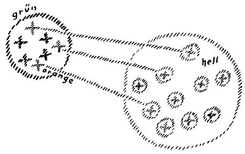
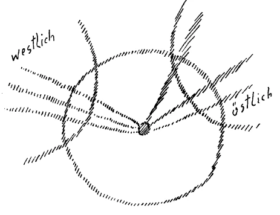

Sie erinnern sich an die Betrachtungen, die wir anzuknüpfen versuchten an verschiedene Behauptungen und Aufstellungen der gegenwärtigen Psychoanalytiker. Es kam mir bei jenen Betrachtungen darauf an, Klarheit anzuregen darüber, daß der Begriff des Unbewußten eigentlich so, wie er in der Psychoanalyse herrscht, ein unbegründeter ist. Und solange man nicht über diesen Begriff des Unbewußten einen rein negativen Begriff — hinauskommen wird, wird man nicht anders sagen können, als daß diese Psychoanalyse mit unzulänglichen Erkenntnismitteln an einem von der Gegenwart ganz besonders geforderten Phänomen arbeitet. Und weil die Psychoanalytiker auf der einen Seite sich bestreben, das Geistig-Seelische zu erforschen und, wie wir gesehen haben, dieses Geistig-Seelische auch im sozialen Leben verfolgen, so muß man sagen, daß hier ein Ansatz ist, der immerhin mehr bedeutet als dasjenige, was die offizielle Universitätswissenschaft gerade auf diesem Gebiete liefern kann. Aber auf der andern Seite, weil die analytische Psychologie versucht, durch das Pädagogische, durch das Therapeutische und wahrscheinlich demnächst auch durch das Sozialpolitische in das Leben einzugreifen, sind die Gefahren, die mit einer solchen Sache doch verbunden sind, immerhin als sehr ernstliche anzusehen. ^awywkx

Nun entsteht die Frage: Was ist es denn eigentlich, woran die Forscher der Gegenwart so ganz und gar nicht herankommen können und nicht kommen wollen? Sie erkennen an, daß ein Seelisches außerhalb des Bewußtseins vorhanden ist; sie suchen ein Seelisches außerhalb des Bewußtseins; aber sie können sich nicht aufschwingen zu der Erkenntnis des Geistes selbst. Geist kann niemals durch den Begriff des Unbewußten irgendwie erfaßt werden; denn ein unbewußter Geist ist wie ein Mensch ohne Kopf. Nun habe ich Sie ja darauf aufmerksam gemacht, daß aus gewissen hysterischen Zuständen heraus es sogar Menschen gibt, die auf der Straße herumgehen und bei andern Menschen nur die Körper, nicht die Köpfe schen. Das ist eine bestimmte Krankheitsform, wenn man von niemandem den Kopf sieht. So gibt es unter den heutigen Forschern auch Menschen, welche glauben, den ganzen Geist zu sehen; aber indem sie ihn als unbewußt hinstellen, zeigen sie zugleich, daß sie selbst von der Wahnvorstellung befallen sind, als ob es einen unbewußten Geist, einen Geist ohne Bewußtsein geben würde, wenn wir die Schwelle des Bewußtseins überschreiten, sei es in richtigem Sinne, wie wir das immer auf Grund geisteswissenschaftlicher Forschung beschrieben haben, sei es in krankhaft abnormer Weise, wie ja in den Fällen immer, die den Psychoanalytikern vorliegen. ^yrb82f

Wenn man die Schwelle des Bewußtseins überschreitet, so kommt man immer in geistiges Gebiet hinein; ganz gleichgültig, ob man ins Unterbewußte oder ins Überbewußte kommt, man kommt immer in geistiges Gebiet hinein, aber in ein Gebiet, in dem der Geist in einer gewissen Weise bewußt ist, irgendeine Form des Bewußtseins entwickelt. Wo Geist ist, ist auch Bewußtsein. Man muß nur aufsuchen die Bedingungen, unter denen das betreffende Bewußtsein steht; man muß eben gerade durch Geisteswissenschaft die Möglichkeit haben, zu erkennen, welche Art von Bewußtsein eine bestimmte Geistigkeit hat. Wenn wir also hier vor acht Tagen den Fall jener Dame angeführt haben, welche aus einer Gesellschaft herausgeht, dann vor den Pferden einherläuft, abgehalten wird in einen Fluß zu springen, dann zurückgetragen wird in das Haus, von dem sie gekommen ist, um dort mit dem Hausherrn zusammengebracht zu werden, weil sie den Hausherrn in irgendeiner ihr unklaren, unterbewußten Weise liebt, dann darf nicht gesagt werden, daß der Geist, der nicht dem Bewußtsein dieser Dame angehört, der sie drängt und führt, ein unbewußter Geist sei, oder daß er ein unbewußtes Seelisches sei: der ist etwas sehr Bewußtes. Die Bewußtheit dieses dämonischen Geistes, der diese Dame wiederum zurückführt zu dem unrechtmäßig Geliebten, dieser Dämon ist sogar viel gescheiter in seinem Bewußtsein als die Dame in ihrem Oberstübchen — wollte sagen: Bewußtsein — eigentlich ist. Und diese Geister, wenn der Mensch in irgendeiner Weise die Schwelle seines Bewußtseins überschreitet, diese Geister, die da regsam, wirksam werden, das sind nicht unbewußte Geister, das sind solche Geister, die sehr gut für sich bewußt regsam, wirksam werden. Das Wort unbewußter Geist, wie es die Psychoanalytiker brauchen, hat gar keinen Sinn; denn ebensogut könnte ich, wenn ich bloß von mir aus sprechen würde, von der ganzen erlauchten Versammlung, die hier sitzt, sagen, sie ist mein Unbewußtes, wenn ich nichts davon weiß. Ebensowenig darf man die geistigen Wesenheiten, die um uns sind und die in einem solchen Falle erfassen die Persönlichkeit, wie in dem Fall, den ich Ihnen vor acht Tagen erzählte, ebensowenig dürfen wir diese unbewußte Geister nennen. Sie sind unterbewußt; sie sind nicht erfaßt von dem Bewußtsein, das in uns gerade lebt; aber für sich sind sie vollständig bewußt. ^eu7987

Dies ist — gerade für die Aufgabe der Geisteswissenschaft in unserer Zeit — außerordentlich wichtig zu wissen, aus dem Grunde, weil das Wissen von dem jenseits der Schwelle gelegenen Geistgebiet, das Wissen von wirklichen, ihrer selbst bewußten Individualitäten nicht bloß eine Errungenschaft etwa der heutigen Geisteswissenschaft ist, sondern weil dies tatsächlich ein uraltes Wissen ist. Früher hat man es eben gewußt im Sinne der alten atavistischen Hellseherkunst. Heute weiß man es mit andern Mitteln, lernt es allmählich wissen. Aber das Wissen von wirklichen, außerhalb des menschlichen Bewußtseins befindlichen Geistern, die unter andern Bedingungen leben als die Menschen, die aber in fortwährendem Verhältnisse stehen zu den Menschen, von denen auch der Mensch ergriffen werden kann in seinem Denken, Fühlen und Wollen, dieses Wissen war immer da. Und dieses Wissen, das wurde immer betrachtet als ein Geheimgut bestimmter Brüderschaften, die dieses Wissen in ihrem Kreise als ein streng Esoterisches behandelten. Warum behandelten sie es als streng esoterisch ? Diese Frage zu erörtern, das würde in diesem Augenblick etwas zu weit führen; aber das soll gesagt werden, daß einzelne Brüderschaften von der ehrlichen Überzeugung immer durchdrungen waren, daß eben die Mehrzahl der Menschen nicht reif sei für dieses Wissen. Nun, das war ja auch bis zu einem hohen Grade der Fall. Aber viele andere Brüderschaften, die man Brüderschaften der Linken nennt, waren bestrebt, dieses Wissen für sich auch aus dem Grunde zu behalten, weil solches Wissen, von einer kleinen Gruppe in Besitz genommen, eine Macht gibt über die andern, die dieses Wissen nicht haben. Und immer hat es Bestrebungen gegeben, die darauf ausgingen, gewissen Gruppen Macht zu sichern über andere. Das konnte man dadurch herbeiführen, daß man ein gewisses Wissen betrachtete als ein esoterisches Gut, aber es ausnutzte, um die Macht über irgend etwas anderes auszudehnen. ^s7j3ne

In der heutigen Zeit ist es ganz besonders notwendig, über diese Dinge sich wirklich aufzuklären. Denn Sie wissen, seit 1879 — ich habe das gerade in den letzten Vorträgen ausgeführt - lebt die Menschheit in einer ganz besonderen spirituellen Situation. Ganz besonders wirksame Geister der Finsternis sind seit 1879 aus der geistigen Welt in das Reich der Menschen versetzt, und diejenigen, welche die Geheimnisse, die zusammenhängen mit dieser Tatsache, in unberechtigter Weise innerhalb von kleinen Gruppen halten, die können alles mögliche anrichten mit diesen Dingen. Nun werde ich Ihnen zunächst heute zeigen, wie gerade gewisse Geheimnisse, welche die Entwickelung der Gegenwart betreffen, in unrichtiger Weise ausgenutzt werden können. Sie müssen nur dann gut zusammenhalten dasjenige, was ich heute sagen werde, was mehr historischer Art sein wird, und dasjenige, was ich morgen dazu sagen werde. ^o9eb01

Sie wissen alle: seit längerer Zeit wird innerhalb unserer anthroposophischen geisteswissenschaftlichen Strömung aufmerksam darauf gemacht, wie dieses 20. Jahrhundert dasjenige ist, welches ein besonderes Verhältnis der Menschheitsentwickelung zu dem Christus bringen soll, zu dem Christus insoferne, als im Laufe des 20. Jahrhunderts - schon in der ersten Hälfte, wie Sie wissen — dieses Ereignis eintreten soll, das ja auch in dem ersten meiner Mysteriendramen angedeutet ist, daß für eine genügend große Anzahl von Menschen im Ätherischen der Christus eine wirklich daseiende Wesenheit sein soll. ^8bcrfx

Nun wissen wir, wir leben eigentlich in der Zeit des Materialismus. Wir wissen, daß seit der Mitte des 19. Jahrhunderts dieser Materialismus auf seinen Höhepunkt gelangt ist. Aber in der Wirklichkeit müssen Gegensätze zusammenfallen. Gerade der Höhepunkt des Materialismus in der Menschheitsentwickelung muß auf der andern Seite zusammenfallen mit jener Verinnerlichung der Menschheitsentwickelung, die dazu führt, daß der Christus wirklich ätherisch geschaut wird. Man kann begreifen, daß gerade die Bekanntmachung dieses Geheimnisses von dem Schauen des Christus, von diesem neuen Verhältnis, das der Christus mit der Menschheit eingehen soll, Mißstimmung und Widerwillen hervorruft bei jenen Menschen, welche als Angehörige gewisser Brüderschaften dieses Ereignis vom 20. Jahrhundert, dieses Ereignis der Erscheinung des ätherischen Christus ausnutzen wollen in ihrem Sinne und es nicht zu einem Gemeingut der allgemeinen menschlichen Erkenntnis machen wollen. Es gibt Brüderschaften - und Brüderschaften beeinflussen immer die öffentlichen Meinungen, indem sie dies oder jenes zum Beispiel gerade durch solche Mittel verbreiten lassen, durch die es am wenigsten den Menschen auffällt -, es gibt gewisse okkulte Brüderschaften, die lassen verbreiten, daß die Zeit des Materialismus bald abgelaufen sein werde, ja, daß sie in einer gewissen Weise schon abgelaufen sei. Die armen, bemitleidenswerten «gescheiten Leute» — das «gescheite Leute» ist jetzt selbstverständlich in Gänsefüßchen gestellt —, die heute in so zahlreichen Versammlungen und Büchern und Vereinen die Lehre verbreiten, daß der Materialismus abgewirtschaftet habe, daß man schon wiederum etwas vom Geiste begreife, aber die den Leuten nicht mehr geben können als das Wort Geist und einzelne Phrasen, diese Leute stehen mehr oder weniger im Dienste derjenigen, die ein Interesse daran haben, zu sagen, was nicht wahr ist, zu sagen, der Materialismus habe abgewirtschaftet; denn wahr ist dieses nicht, sondern im Gegenteil, die materialistische Gesinnung ist in Zunahme begriffen, und sie wird am besten gedeihen, wenn sich die Leute einbilden werden, daß sie nicht mehr Materialisten seien. Die materialistische Gesinnung ist im Zunehmen begriffen und wird noch im Zunehmen sein durch etwa vier bis fünf Jahrhunderte. ^r4pb13

Was notwendig ist, das ist das hier oftmals Betonte: in klarem Bewußtsein zu erfassen diese Tatsache, zu wissen, daß das so ist. Dann wird die Menschheit schon zum Heile kommen, wenn man das ordentlich weiß, wenn man so arbeitet im Geistesleben, daß man weiß: die fünfte nachatlantische Epoche ist dazu da, materialistisches Wesen herauszugestalten aus der allgemeinen Menschheitsentwickelung. Aber es muß um so mehr spirituelles Wesen dem entgegengestellt werden. Ich habe in den vorangehenden Vorträgen gesagt, was die Menschen des fünften nachatlantischen Zeitraums kennenlernen müssen, das ist: den vollbewußten Kampf gegen das in der Menschheitsentwickelung auftretende Böse, So wie in der vierten nachatlantischen Kulturperiode der Kampf stattfand um die Auseinandersetzung mit Geburt und Tod, so findet jetzt statt die Auseinandersetzung mit dem Bösen. Also auf das vollbewußte Erfassen der geistigen Lehre, darauf kommt es jetzt an, nicht darauf, Sand in die Augen zu streuen den Zeitgenossen, als ob der 'Treufel des Materialismus nicht da sei. Er wird noch immer mehr und mehr zunehmen. Diejenigen, die in einer nicht richtigen Weise diese Dinge behandeln, die wissen von dem Ereignis der Christus-Erscheinung gerade so gut wie ich; aber sie behandeln dieses Ereignis der Christus-Erscheinung in einer andern Weise. Und um das zu verstehen, muß man folgendes ins Auge fassen. ^vyrfqp

Wie jetzt die Menschheit geworden ist in dieser fünften nachatlantischen Zeit, da ist ganz unberechtigt der Satz, den viele in ihrer Bequemlichkeit sprechen: Nun ja, während wir hier zwischen Geburt und Tod leben, da kommt es darauf an, sich dem Leben zu übergeben; ob dann, wenn wir durch den Tod gegangen sind, wir in eine geistige Welt eintreten, das wird sich schon zeigen, das können wir ja abwarten. Hier genießen wir unser Leben, wie wenn es nur eine materielle Welt gäbe; wenn man durch den Tod in die geistige Welt eintritt, nun ja, dann wird sich schon zeigen, ob eine geistige Welt da ist! — Es ist das ungefähr ebenso gescheit wie der Schwur, den einer ablegt, der da sagt: So wahr ein Gott im Himmel ist, bin ich ein Atheist! — Es ist ungefähr ebenso gescheit wie dieses; aber es ist die Gesinnung sehr vieler, die da sagen: Es wird sich zeigen nach dem Tode, wie es da ist, bis dahin braucht man sich gar nicht mit irgendwelcher spirituellen Wissenschaft zu befassen. ^du3roj

Es war zu allen Zeiten eine solche Gesinnung höchst anfechtbar, aber verhängnisvoll wird sie insbesondere in dieser fünften nachatlantischen Zeit, in der wir leben, weil sie durch die Herrschaft des Bösen gerade besonders nahegelegt wird dem Menschen. Indem der Mensch unter den gegenwärtigen Entwickelungsbedingungen durch die Pforte des Todes tritt, nimmt er die Bewußtseinsbedingungen mit, welche er sich selbst hergestellt hat zwischen der Geburt und dem Tode. Derjenige Mensch, welcher unter den gegenwärtigen Verhältnissen ganz und gar sich nur beschäftigt hat mit Vorstellungen und Begriffen und Empfindungen über die materielle, über die Sinneswelt, der verurteilt sich unter den gegenwärtigen Verhältnissen dazu, daß er nach dem Tode nur in einer Umgebung lebt, auf welche die während des leiblichen Lebens ausgeprägten Begriffe Bezug haben. Während der, welcher spirituelle Vorstellungen aufnimmt, rechtmäßig in die geistige Welt einzieht, muß derjenige, der es ablehnt, geistige Vorstellungen aufzunehmen, in gewissem Sinne in irdischen Verhältnissen verbleiben, bis er - und das dauert eine lange Zeit — gelernt hat, drüben so viel geistige Begriffe aufzunehmen, daß er durch sie in die geistige Welt getragen werden kann. Also, ob wir hier geistige Begriffe aufnehmen oder nicht, das bestimmt unsere Umgebung drüben. Viele von denen, die - man kann es nur mit Mitleid sagen — sich gesträubt haben oder verhindert waren, geistige Begriffe hier im Leben aufzunehmen, die wandeln auch noch als Tote auf Erden umher, bleiben mit der Erdensphäre in Verbindung. Und da wird dann die Seele des Menschen, wenn sie nicht mehr abgeschlossen ist von der Umgebung durch den Leib, der nun nicht mehr verhindert, daß sie zetstörerisch wirkt, da wird die Seele des Menschen, wenn sie in der Erdensphäre lebt, zum zerstörenden Zentrum. ^ghrttp

Also betrachten wir diesen, ich möchte sagen, mehr normalen Fall, daß unter den gegenwärtigen Verhältnissen Seelen nach dem Tode in die geistige Welt hinüberkommen, die ganz und gar nichts wissen wollten von spirituellen Begriffen und Empfindungen: sie werden zu zerstörerischen Zentren, weil sie in der Erdensphäre aufgehalten werden. Nur Seelen, welche schon hier durchdrungen sind von einem gewissen Zusammenhang mit der geistigen Welt, gehen durch die Pforte des Todes so, daß sie in der richtigen Weise in die geistige Welt aufgenommen, der Erdensphäre entrückt werden und jene Fäden spinnen können auch zu den hier Zurückgebliebenen, welche fortwährend gesponnen werden. Denn darüber müssen wir uns nur klar sein: die geistigen Fäden zwischen den toten Seelen und uns selber, die mit ihnen verbunden waren, die werden durch den Tod nicht abgerissen, die bleiben, sind sogar viel inniger nach dem Tode, als sie hier gewesen sind. Aber das, was ich gesagt habe, das muß man als eine ernste, bedeutungsvolle Wahrheit aufnehmen. ^u4dyws

Wiederum ist das etwas, was ich nicht etwa allein weiß, was andere auch wissen, daß dies in der Gegenwart so ist. Aber es gibt viele, welche gerade in recht schlimmem Sinne diese Wahrheit ausnutzen. Es gibt heute verführte Materialisten, die glauben, daß das materielle Leben das einzige sei; aber es gibt auch Eingeweihte, die Materialisten sind und die durch Brüderschaften materialistische Lehren verbreiten lassen. Von diesen Eingeweihten dürfen Sie nicht glauben, daß sie etwa auf dem albernen Standpunkte stehen, daß es keinen Geist gibt, oder daß der Mensch nicht eine Seele hat, die von dem Leibe unabhängig sein kann und ohne ihn leben kann. Sie können getrost annehmen, daß derjenige, der in die geistige Welt wirklich eingeweiht ist, sich nie der Albernheit hingibt, an die bloße Materie zu glauben. Aber es gibt viele, welche in einer gewissen Weise ein Interesse daran haben, den Materialismus verbreiten zu lassen, und die allerlei Veranstaltungen treffen, damit ein großer Teil der Menschen an den Materialismus allein glaubt und ganz und gar unter dem Einfluß des Materialismus steht. Nun gibt es Brüderschaften, welche an ihrer Spitze Eingeweihte haben, die eben ein solches Interesse haben, den Materialismus zu pflegen, zu verbreiten. Diesen Materialisten dient es sehr gut, wenn immerfort davon geredet wird, daß der Materialismus eigentlich schon überwunden sei. Denn man kann auch irgendeine Sache mit den entgegengesetzten Worten anstreben; die Verfahrungsweisen sind oftmals recht komplizierte. ^siao9d

Was wollen nun solche Eingeweihte, welche eigentlich ganz gut wissen, daß die Menschenseele ein rein: spirituelles Wesen ist, ein spirituelles Wesen, ganz selbständig gegenüber der Leiblichkeit, und die dennoch die materialistische Gesinnung der Menschen hegen und pflegen? Diese Eingeweihten wollen, daß möglichst viele Seelen da seien, welche hier zwischen Geburt und Tod nur materialistische Begriffe aufnehmen. Dadurch werden diese Seelen präpariert, in der Erdensphäre zu bleiben. Sie werden gewissermaßen in der Erdensphäre gehalten. Und nun denken Sie sich, daß Brüderschaften eingerichtet werden, die das genau wissen, die jene Verhältnisse gut kennen. Diese Brüderschaften präparieren dadurch gewisse Menschenseelen so, daß diese Menschenseelen nach dem T'oode im Reiche des Materiellen verbleiben. Wenn diese Brüderschaften dann — was möglicherweise in ihrer verruchten Macht liegt — die Veranstaltung treffen, daß diese Seelen nach dem Tode in den Bereich der Machtsphäre ihrer Brüderschaft kommen, dann wächst dieser Brüderschaft dadurch eine ungeheure Macht zu. Also diese Materialisten sind nicht Materialisten, weil sie nicht an den Geist glauben, so töricht sind diese Eingeweihten-Materialisten nicht, die wissen ganz gut, wie es um den Geist steht; aber sie veranlassen die Seelen, bei der Materie auch nach dem Tode zu bleiben, um sich solcher Seelen zu ihrem Zwecke bedienen zu können. Also wird von solchen Brüderschaften eine Klientel geschaffen von Totenseelen, die im Bereiche der Erde verbleiben. Diese Totenseelen, die haben in sich Kräfte, die in der verschiedensten Weise gelenkt werden können, mit denen man Verschiedenes bewirken kann, wodurch man gegenüber denen, die in diese Dinge nicht eingeweiht sind, zu ganz besonderen Machtentfaltungen kommen kann. ^8zb16d

Das ist einfach eine Veranstaltung gewisser Brüderschaften. Und in dieser Sache sieht nur derjenige klar, der sich keine Finsternis und nichts Nebuloses vormachen läßt; der sich nicht vormachen läßt, daß es solche Brüderschaften entweder gar nicht gibt, oder daß ihre Dinge harmlos sind. Sie sind ganz und gar nicht harmlos, sie sind sehr harmvoll; die Menschen sollen im Materialismus noch immer weiter und weiter schreiten. Sie sollen nach dem Sinne solcher Eingeweihter glauben, daß es zwar geistige Kräfte gibt, aber daß diese geistigen Kräfte nichts anderes sind als auch gewisse Naturkräfte. ^bgtzcg

Nun möchte ich Ihnen doch das Ideal charakterisieren, das solche Brüderschaften haben. Man muß sich ein bißchen anstrengen, um die Sache zu verstehen. Denken Sie sich also eine harmlose Welt von Menschen, die ein wenig beirrt ist durch die heute herrschenden materialistischen Begriffe, die ein wenig abgeirrt ist von den alten, er probten Religionsvorstellungen. Denken Sie sich solch eine harmloseMenschheit. Vielleicht können wir es uns gut graphisch vorstellen (es wird gezeichnet): Wir denken uns hier das Gebiet einer solchen harmlosen Menschheit (größerer Kreis, hell). Wie gesagt, diese Menschheit ist sich nur nicht recht klar über die geistige Welt; beirrt durch den Materialismus, weiß sie nicht recht, wie sie sich verhalten soll gegenüber der geistigen Welt. Namentlich weiß sie nicht recht, wie sie sich verhalten soll gegenüber denjenigen, die durch die Pforte des Todes gegangen sind. ^12d64r

 ^gohp17

Nun nehmen wir an, hier sei das Gebiet solch einer Brüderschaft (kleiner Kreis, grün): diese Brüderschaft verbreite die Lehre des Materialismus, sie sorge, daß diese Menschen jedenfalls rein materialistisch denken. Dadurch bringt es diese Brüderschaft dahin, sich Seelen zu erzeugen, die nach dem Tode in der Erdensphäre bleiben. Diese werden eine spirituelle Klientel für diese Loge (siehe Zeichnung, orange); das heißt, man hat sich dadurch Tote geschaffen, die nicht aus der Erdensphäre hinausgehen, sondern bei der Erde bleiben. Macht man nun die richtigen Veranstaltungen, so behält man sie in den Logen darinnen. Also man hat auf diese Weise Logen geschaffen, welche Lebende enthalten und auch Tote, aber Tote, welche verwandt worden sind den Erdenkräften. ^4oo05k

Nun dirigiert man die Sache so, daß diese Menschen hier Sitzungen abhalten, oder auf solch einem Wege, wie es bei Veranstaltungen der spiritistischen Sitzungen im Laufe der zweiten Hälfte des 19. Jahrhunderts war, von denen ich öfter gesprochen habe. Dann kann es vorkommen - ich bitte Sie, das zu berücksichtigen -, daß dasjenige, was hier in diesen Sitzungen geschieht, dirigiert wird von der Loge aus mit Hilfe der Toten. Aber nach den eigentlichen Intentionen der Meister, die in jenen Logen sind, sollen die Menschen nicht wissen, daß sie es mit Toten zu tun haben, sondern glauben, daß sie es einfach mit höheren Naturkräften zu tun haben. Man will den Leuten beibringen, das seien höhere Naturkräfte: Psychismus und dergleichen, bloß höhere Naturkräfte. Man will ihnen den eigentlichen Seelenbegriff nehmen und sagen: Wie es Elektrizität, wie es Magnetismus gibt, so gibt es auch solche höhere Kräfte. Daß das von Seelen kommt, das kaschieren gerade diejenigen, die in der Loge führend sind. Dadurch aber werden die andern, die harmlosen Seelen, ganz abhängig nach und nach, seelisch abhängig von der Loge, ohne daß sie wissen, wovon sie abhängig sind, woher sie eigentlich dirigiert werden. ^4k0hab

Es gibt kein anderes Mittel gegen diese Dinge als das Wissen davon. Weiß man davon, so ist man schon geschützt. Weiß man es so, daß dieses Wissen ein richtiges Fürwahrhalten, ein wirkliches Glauben ist, so ist man schon geschützt. Aber man muß nicht zu bequem sein, sich das Wissen von diesen Dingen wirklich zu erwerben. Nun, zunächst muß gesagt werden, daß es in diesen Dingen noch immer nicht eigentlich ganz zu spät ist. Denn ich habe Sie öfter darauf aufmerksam gemacht — diese Dinge können ja erst allmählich klarwerden, und ich kann nur allmählich die Elemente zusammentragen, um Ihnen die völlige Klarheit zu bringen -, ich habe Sie öfter darauf aufmerksam gemacht, daß im Verlaufe der zweiten Hälfte des 19. Jahrhunderts viele Brüderschaften des Westens probeweise den Spiritismus eingeführt haben, um durch diese Probe sich zu überzeugen, ob sie nun schon so weit waren mit der Menschheit, wie sie wollten. Es war ein Probieren, wie weit sie waren mit der Menschheit. In den spiritistischen Sitzungen — das haben sie erwartet - sollten eigentlich die Leute sagen: Es gibt höhere Naturkräfte. - Und sie waren dann enttäuscht, die Brüder der Linken, daß die Menschen zumeist nicht gesagt haben: Es gibt höhere Naturkräfte -, sondern gesagt haben: In den Sitzungen erscheinen Geister der Toten. — Das war die herbe Enttäuschung der Eingeweihten, das war gerade das, was sie nicht wollten; denn den Glauben an die Toten, den wollten diese Eingeweihten gerade den Menschen nehmen. Nicht die Wirksamkeit der Toten, nicht die Wirksamkeit der Kräfte der T'oten, aber dieser Gedanke, daß das von den Toten kommt, dieser richtige, dieser bedeutsame Gedanke, der sollte den Menschen genommen werden. Sie sehen, es ist ein höherer Materialismus; es ist ein Materialismus, der den Geist nicht nur leugnet, sondern der den Geist hereinzwingen will in die Materie. Sie sehen, der Materialismus hat noch Formen, unter denen man ihn schon leugnen kann. Man kann sagen, der Materialismus ist verschwunden, wir reden schon vom Geist. Aber alle reden sie vom Geiste in verschwommener Weise. Da kann man ganz gut Materialist sein, wenn man alle Natur so zum Geiste macht, daß dann der Psychismus herauskommt. Worauf es ankommt, das ist, daß man in die konkrete geistige Welt, in die konkrete Geistigkeit den Blick hineinwerfen kann. ^8nytng

Hier haben Sie den Anfang von dem, wie es in den nächsten fünf Jahrhunderten immer intensiver und intensiver werden wird. Nun haben sich die bösen Brüderschaften darauf beschränkt; aber sie werden die Dinge schon fortsetzen, wenn ihnen nicht das Handwerk gelegt wird, das ihnen nur gelegt werden kann, wenn man die Bequemlichkeit gegenüber der geisteswissenschaftlichen Weltanschauung überwindet. ^d7txps

Also verraten haben sie sich gewissermaßen in den spiritistischen Sitzungen. Statt sich zu couvrieren, haben sie sich decouvriert durch die spiritistischen Sitzungen. Das war also eher etwas, wodurch sich gezeigt hat, daß ihnen ihre Wirtschaft noch nicht ganz gut gelungen war. Daher auch ging gerade von diesen Brüderschaften selber schon von den neunziger Jahren an das Bestreben aus, auch den Spiritismus als solchen wiederum für eine Zeitlang zu diskreditieren. Kurz, Sie sehen, es wird auf diesem Wege mit den Mitteln der geistigen Welt sehr, sehr Einschneidendes gemacht. Dasjenige, um was es sich dabei handelt, das ist also: Erhöhung der Macht, Ausnutzung gewisser Entwickelungsbedingungen, die im Laufe der Menschheit herauskommen müssen. ^em46j6

Gegen die Vermaterialisierung der Menschenseelen, gegen dieses Gebanntsein der Menschenseelen in die Sphäre der Irdischheit - und Logen sind ja auch im Irdischen — wird entgegengearbeitet. Wenn also die Seelen mit in den Logen spuken und dort wirken sollen, dann müssen sie ins Irdische gebannt sein. Gegen dieses Bestreben, diesen Impuls, im Irdischen zu wirken durch die Seelen, dem wird entgegengearbeitet durch den bedeutsamen Impuls des Mysteriums von Golgatha. Und dieser Impuls des Mysteriums von Golgatha ist auch die Weltheilung gegen die Vermaterialisierung der Seele. Es liegt vollständig außer dem Willen und außer den Intentionen der Menschen selbst, wie der Weg des Christus selber ist. Also kein Mensch irgendwelchen Wissens, auch kein Eingeweihter hat Einfluß darauf, daß der Christus dasjenige tut, was im Laufe des 20. Jahrhunderts zu der Erscheinung führt, von der ich Ihnen oft gesprochen habe, die Sie in den Mysteriendramen auch angedeutet finden. Das hängt bloß von dem Christus selbst ab. Der Christus wird als ätherische Wesenheit in der Erdensphäre vorhanden sein. Für die Menschen handelt es sich darum, wie sie sich zu ihm verhalten. Also auf die Erscheinung des Christus selbst hat niemand, kein noch so mächtiger Eingeweihter irgendeinen Einfluß. Das kommt. Das bitte ich Sie festzuhalten. Aber man kann Veranstaltungen treffen, daß dieses Christus-Ereignis so oder so aufgenommen werde, daß dieses Christus-Ereignis so oder so wirke. ^z3pd7l

Ja, diejenigen Brüderschaften, von denen ich Ihnen eben gesprochen habe, welche die Seelen der Menschen in die materialistische Sphäre bannen wollen, diese Brüderschaften haben das Bestreben, den Christus unvermerkt vorübergehen zu lassen im 20. Jahrhundert, sein Kommen als ätherische Individualität nicht bemerkbar werden zu lassen für die Menschen. Und diese Bestrebung entwickelt sich unter dem Einfluß einer ganz bestimmten Idee, eigentlich eines ganz bestimmten Willensimpulses; sie haben nämlich das Bestreben, die Einflußsphäre, die durch den Christus im 20. Jahrhundert und weiter kommen soll, für eine andere Wesenheit — wir werden darüber noch genauer sprechen -, für eine andere Wesenheit zu erobern. Es gibt westliche Brüderschaften, welche das Bestreben haben, dem Christus seinen Impuls streitig zu machen und eine andere Individualität, die nicht einmal irgendwann im Fleische erschienen ist, sondern nur eine ätherische Individualität, aber streng ahrimanischer Natur ist, an die Stelle zu setzen. ^40tmrm

Alle jene Maßnahmen, von denen ich Ihnen jetzt eben gesprochen habe, mit den Toten und so weiter, die dienen letzten Endes solchen Zielen, die Menschen abzulenken von dem Christus, der durch das Mysterium von Golgatha gegangen ist, und einer andern Individualität die Herrschaft über die Erde zuzuschanzen. Das ist ein ganz realer Kampf und nicht irgend etwas, was etwa nur abstrakte Begriffe oder was weiß ich sein soll, sondern das ist ein ganz realer Kampf; ein Kampf, der sich eigentlich darauf bezieht, eine andere Wesenheit an die Stelle der Christus-Wesenheit im Verlaufe der Menschheitsentwickelung für den Rest der fünften nachatlantischen Zeit, für die sechste und für die siebente zu setzen. Es wird zu den Aufgaben einer gesunden, einer ehrlichen spirituellen Entwickelung gehören, solche Bestrebungen, die im eminentesten Sinne antichristlich sind, solche Bestrebungen zu vertilgen, wegzuschaffen. Aber nur klare Einsicht kann da etwas erreichen. Denn das andere Wesen, das diese Brüderschaften zum Herrscher machen wollen, dieses andere Wesen, das werden die ja als den «Christus» benennen, richtig als den «Christus» benennen! Und worauf es ankommen wird, das wird sein, daß man wirklich unterscheiden lernt zwischen dem wahren Christus, der ja auch jetzt, wie er erscheinen wird, nicht eine im Fleische verkörperte Individualität ist, und zwischen diesem Wesen, das sich von dem wahren Christus dadurch unterscheidet, daß es eben nie während der Erdenentwickelung verkörpert war, das ein Wesen ist, welches nur bis zu der ätherischen Verkörperung geht, und das von diesen Brüderschaften eingesetzt werden soll anstelle des Christus, der unvermerkt vorübergehen soll. ^emzub7

Da haben wir also auf der einen Seite den Teil des Kampfes, der sich darauf bezieht, gewissermaßen die Christus-Erscheinung des 20. Jahrhunderts zu fälschen. Ja, wer das Leben nur an seiner Oberfläche so beobachtet, vor allen Dingen die äußerlichen Diskussionen über den Christus und die Jesus-Frage und so weiter, der sieht eben nicht in die Tiefe. Das ist Nebel, das ist Dunst, was den Leuten vorgemacht wird, um sie gerade abzulenken von den tieferen Dingen, von demjenigen, um was es sich eigentlich handelt. Wenn die Theologen über den Christus diskutieren, so ist in allen solchen Diskussionen immer von irgendwoher ein spiritueller Einfluß, und diese Leute fördern da ganz andere Ziele und Zwecke, als sie selbst mit ihrem Bewußtsein glauben. ^oy1593

Das ist nun das Gefährliche des Begriffes des Unbewußten, daß man selbst über solche Verhältnisse heute die Leute ins Unklare hineinreitet. Während solche bösen Brüderschaften sehr bewußt ihre Zwecke verfolgen, wird natürlich das, was diese Brüderschaften bewußt verfolgen, zum Unbewußten für diejenigen, die auf der Oberfläche eben allerlei Diskussionen und dergleichen anstellen. Aber man trifft das Wesen der Sache nicht, wenn man vom Unbewußten redet; denn dieses sogenannte Unbewußte ist einfach jenseits der Schwelle des gewöhnlichen Bewußtseins, und es ist diejenige Sphäre, in welcher der Wissende solche Dinge entfalten kann. Sehen Sie, das ist eigentlich eine Seite der Sache, daß es wirklich so ist, daß sich gegenüberstellt eine Summe von Brüderschaften, welche die Wirksamkeit des Christus durch die Wirksamkeit einer andern Individualität ersetzen wollen und alle Dinge so einrichten, daß sie dieses erreichen. ^ybj4s7

Dem gegenüber stehen östliche Brüderschaften, namentlich indische, die nicht minder bedeutungsvoll eingreifen wollen in die Entwickelung der Menschheit. Diese indischen Brüderschaften wiederum, die verfolgen ein anderes Ziel; sie haben niemals eine Esoterik entwickelt, diese indischen Brüderschaften, durch die sie Tote in ihren Bereich, in den Bereich ihrer Logen etwa hereinbringen würden; das liegt ihnen fern, solche Dinge wollen sie nicht. Aber sie wollen auf der andern Seite auch nicht, daß das Mysterium von Golgatha mit seinem Impuls die Entwickelung der Menschheit ergreife. Das wollen sie auch nicht. Sie wollen aber nicht, weil ihnen die Toten nicht in der Weise zur Verfügung stehen, wie ich das bei den westlichen Brüderschaften angedeutet habe, sie wollen den Christus — der ja als ätherische Individualität im Laufe des 20. Jahrhunderts in die Menschheitsentwickelung eintreten wird — nicht bekämpfen durch Aufstellen einer andern Individualität; dazu brauchten sie die Toten, und die haben sie nicht, dagegen wollen sie das Interesse ablenken von diesem Christus; sie wollen nicht hochkommen lassen das Christentum, diese östlichen Brüderschaften, namentlich die indischen. Sie wollen nicht das Interesse für den wirklichen, durch das Mysterium von Golgatha gegangenen Christus hochkommen lassen, der in einer einmaligen Inkarnation hier auf der Erde war drei Jahre lang und der dann nicht mehr in einer Inkarnation auf die Erde kommen kann. Tote wollen diese in ihren Logen nicht benutzen, aber doch auch etwas anderes als bloß das, was sie selber sind als lebende Menschen. In diesen indischen, östlichen Logen, da wird nämlich statt der Toten der westlichen Logen eine andere Art von Wesenheiten benutzt. ^ipq5qz

Wenn der Mensch stirbt, so hinterläßt er ja seinen ätherischen Leib; der trennt sich sehr bald nach dem Tode, wie Sie wissen. Dieser ätherische Leib wird unter normalen Verhältnissen von dem Kosmos aufgenommen. Daß diese Aufnahme auch etwas Kompliziertes ist, habe ich Ihnen ja in der verschiedensten Weise dargestellt. Aber vor dem Mysterium von Golgatha, und auch noch nach dem Mysterium von Golgatha, namentlich in östlichen Gegenden, war etwas ganz Bestimmtes möglich. Wenn der Mensch einen solchen Ätherleib abgibt nach dem Tode, so können gewisse Wesenheiten diesen Ätherleib beziehen; sie werden dann ätherische Wesenheiten mit solchen von den Menschen abgelegten Ätherleibern. So daß es vorkommt in östlichen Gegenden, daß, jetzt nicht tote Menschen, aber allerlei dämonische Geister veranlaßt werden, abgelegte Ätherleiber von Menschen anzuziehen. Und solche mit Ätherleibern von Menschen angetanen dämonischen Geister, die werden in die östlichen Logen aufgenommen. Die westlichen Logen also, die haben direkt in die Materie gebannte Tote; die östlichen Logen der linken Hand haben dämonische Geister; also Geister, die nicht der Erdenentwickelung angehören, die aber dadurch sich in die Erdenentwickelung hineinschleichen, daß sie anziehen von Menschen abgelegte Ätherleiber. ^imdu6a

Exoterisch macht man das so, daß man diese Tatsache in Verehrung umwandelt. Sie wissen, daß zu den Künsten gewisser Brüderschaften die Hervorrufung der Illusionen gehört, weil, wenn die Menschen nicht wissen, wie weit Illusion überhaupt in der Wirklichkeit vorhanden ist, sie sehr leicht durch künstlich hervorgerufene Illusionen getäuscht werden können. Man macht also das, was man da erreichen will, indem man dies in die Form von Verehrung kleidet. Also denken Sie sich, ich habe einen Stamm von Menschen, einen zusammengehörigen Stamm; dem sage ich — nachdem ich vorher als ein «böser» Bruder bei einem Vorfahr die Möglichkeit herbeigeführt habe, daß der Ätherleib bezogen wird von einem dämonischen Wesen -, dem sage ich, er müsse diesen Ahnen verehren. Der Ahne ist einfach derjenige, der abgelegt hat seinen Ätherleib, welcher von Dämonen bezogen ist durch die Machinationen der Loge. Man führt also die Ahnenverehrung ein. Aber diese Ahnen, die verehrt werden, die sind einfach irgendwelche dämonischen Wesenheiten in dem Ätherleib des betreffenden Ahnen. ^976o4x

Man kann nun die Weltanschauung der östlichen Menschen dadurch abbringen von dem Mysterium von Golgatha, daß man in dieser Weise arbeitet wie in den östlichen Logen. Dann wird auch dadurch für die östlichen Menschen, für die Menschen vielleicht überhaupt — das will man ja erreichen — das erreicht, daß der Christus als Individualität, wie er über die Erde gehen soll, unbemerkt bleibt. Also die wollen nicht einen andern Christus substituieren, sondern sie wollen nur, daß die Erscheinung des Christus Jesus unbemerkt bleibe. ^6yfpsr

So wird gewissermaßen von zwei Seiten ein Kampf geführt gegen den ätherisch zutage tretenden Christus-Impuls im Laufe des 20. Jahrhunderts. In diese Entwickelung ist die Menschheit wirklich hineingestellt. Und was so im einzelnen geschieht, das ist eigentlich nur immer eine Konsequenz desjenigen, was sich als die großen Impulse in der Menschheitsentwickelung vollzieht. Deshalb ist es ja so traurig, daß man den Menschen immer wieder vormachen will, wenn Unbewußtes, sogenanntes Unbewußtes in ihnen wirkt, so seien dies irgendwelche zurückgetretenen, was weiß ich, Liebesaffekte oder dergleichen, während in der Tat der Impuls sehr bewußter Geistigkeit von allen Seiten her durch die Menschheit geht, aber relativ unbewußt bleibt, wenn man sich nicht in seinem Bewußtsein um ihn bekümmert. ^9ysok9

Zu diesen Dingen müssen Sie verschiedenes andere hinzunehmen. Die Menschen, welche es mit der Menschheitsentwickelung ehrlich gemeint haben von jeher, die haben mit solchen Dingen, wie wir sie jetzt charakterisiert haben, immer gerechnet und - viel mehr kann und darf auch der Mensch nicht tun — von ihrer Seite das Richtige unternommen. ^4ybki5

Eine gute Pflegestätte für spirituelles Leben, eine ganz außerordentlich gute Pflegestätte, geschützt vor allen möglichen Illusionen, war in den ersten christlichen Jahrhunderten Irland, die irische Insel. Sie war richtig geschützt vor allen möglichen Illusionen, mehr als irgendein anderes Gebiet der Erde. Das ist auch der Grund, warum so viele Verbreiter des Christentums in den ersten christlichen Jahrhunderten von Irland ausgegangen sind. Aber diese Verbreiter des Christentums mußten alle eine naive Menschheit berücksichtigen, unter der sie wirkten; denn die europäische Menschheit, unter der sie wirkten, war dazumal naiv, sie mußten diese naive Menschheit in ihrer Naivität berücksichtigen; aber sie mußten für sich die großen Impulse der Menschheit wissen und verstehen. Im 4. und 5. Jahrhundert wirkten namentlich irische Eingeweihte in Mitteleuropa; da fingen sie an und sie wirkten so, daß sie das vorbereiteten, was in der Zukunft geschehen mußte. Sie standen in einer gewissen Weise unter dem Einfluß jenes Binweihungswissens, daß im 15. Jahrhundert — Sie wissen: 1413 — die fünfte nachatlantische Zeit kommen werde. Unter diesem Einfluß standen sie. Sie wußten also, vorzubereiten haben sie eine ganz neue Zeit, eine naive Menschheit muß für diese neue Zeit behütet werden. Was tat man dazumal, um diese naive Menschheit Europas so zu behüten, daß sie gewissermaßen umzäunt war und gewisse schädliche Einflüsse nicht hereinkommen konnten, was tat man? ^jap4z5

Man lenkte, von jetzt gut unterrichteter und dazumal ehrlicher Seite die Evolution so, daß allmählich jene Schiffahrt unterdrückt wurde, welche von nördlichen Ländern nach Amerika hinüber gemacht worden ist in den älteren Zeiten. So daß, während in älteren Zeiten die Schiffe namentlich von Norwegen aus nach Amerika hinübergingen zu gewissen Zwecken — ich werde morgen noch über diese Dinge sprechen -, man die Sache allmählich so einrichtete, daß Amerika von der europäischen Bevölkerung völlig vergessen wurde, daß der Zusammenhang mit Amerika allmählich dahinschwand. Und im 15. Jahrhundert wußte ja die europäische Menschheit von Amerika nichts. Namentlich von Rom aus wurde die Entwickelung so dirigiert, daß man aus bestimmten Gründen den Zusammenhang mit Amerika allmählich verlor, weil die europäische Menschheit geschützt werden mußte vor den amerikanischen Einflüssen. Wesentlich beteiligt an diesem, daß vor dem amerikanischen Einflusse die europäische Menschheit geschützt werden mußte, waren gerade von Irland aus die Mönche, welche als irische Eingeweihte auf dem europäischen Kontinente christianisierten. ^w82rqf

In den älteren Zeiten brachte man von Amerika ganz bestimmte Einflüsse herüber; aber in dem Zeitalter gerade, wo die fünfte nachatlantische Epoche anfing, da sollte die Sache so sein, daß die europäische Menschheit von Amerika unbeeinflußt war, überhaupt nichts davon wußte, in dem Glauben lebte, es gibt gar kein Amerika. Erst als dann die fünfte nachatlantische Zeit hereingebrochen war, da wurde Amerika wieder entdeckt, wie das in der Geschichte bekannt ist. Es gehört zu den Wahrheiten, die Ihnen ja schon geläufig sein können, daß das, was man in der Schule als Geschichte lernt, vielfach eine Fable convenue ist. Auch das ist eine Fable convenue, daß Amerika 1492 zum erstenmal entdeckt worden sei. Es ist nur wieder entdeckt worden. Es war nur eine Zeitlang der Zusammenhang so geschickt kaschiert, wie es geschehen mußte. Aber wissen muß man wiederum, wie die Dinge lagen und was wirkliche Geschichte ist. So daß also eine Zeitlang Europa sehr umzäunt worden ist und man Europa sorgfältig gehütet hat vor gewissen Einflüssen, die nicht nach Europa kommen sollten. ^6n9n3w

Solche Dinge zeigen Ihnen, wie bedeutungsvoll es ist, dieses sogenannte Unbewußte nicht als ein Unbewußtes aufzufassen, sondern als etwas, was sich sehr bewußt vollzieht hinter der Schwelle des menschlichen Bewußtseins, wie dieses als Alltagsbewußtsein ist. Es ist schon wichtig, daß heute ein größerer Teil der Menschheit erfährt von gewissen Geheimnissen. Daher habe ich so viel getan, als jetzt nur irgend möglich ist ganz Öffentlich zu tun, in den Zürcher Vorträgen, wo ich, wie Sie wissen, sogar so weit gegangen bin, den Leuten zu erklären, inwiefern das geschichtliche Leben von den Menschen nicht mit dem gewöhnlichen Bewußtsein gewußt wird, sondern in Wirklichkeit geträumt wird; wie der Inhalt der Geschichte in Wirklichkeit von den Menschen geträumt wird, und daß erst dann, wenn die Menschen sich bewußt werden, daß der Inhalt der Geschichte geträumt wird, Gesundheit in diese Vorstellungen kommen wird. ^17hvk2

Das sind Dinge, durch die man allmählich das Bewußtsein aufweckt. Die Erscheinungen, die Tatsachen, die sich vollziehen, die bewahrheiten schon diese Dinge. Man muß sie nur nicht übersehen. Nur gehen die Menschen blind und schlafend durch die Tatsachen, sie gehen auch blind und schlafend durch solche tragischen Katastrophen wie die jetzige. Das sind Dinge, die ich zunächst mehr historisch in Ihr Herz legen möchte. Ich werde morgen genauer über diese Dinge sprechen. ^879e9h

Ich möchte nur noch eine Vorstellung zu den Dingen hinzufügen. Erstens haben Sie aus der Auseinandersetzung gesehen, welch gewaltiger Unterschied zwischen Westen und Osten in der Menschheitsentwickelung ist. Zweitens bitte ich Sie, noch das Folgende zu berücksichtigen. Sehen Sie, der Psychoanalytiker redet vom Unterbewußten, vom unterbewußten Seelenleben und so weiter. Ja, darauf kommt es nicht an, mit einem solchen unbestimmten Begriff von den Dingen zu reden, sondern darauf kommt es an, zu erfassen: Was ist denn da nun eigentlich jenseits der Schwelle des Bewußtseins? Was gibt es denn da? Es ist gewiß sehr vieles da unten unter der Schwelle des Bewußtseins. Für sich ist es aber sehr bewußt, was da drunten ist. Aber man muß darauf kommen, was da für bewußte Geistigkeit jenseits der Schwelle des Bewußtseins ist. Man muß von bewußter Geistigkeit jenseits der Schwelle des Bewußtseins reden, nicht von unbewußtem Geistigen. Ja, da muß man sich klar sein darüber, daß der Mensch vieles hat, wovon er nichts weiß im gewöhnlichen Bewußtsein. Es wäre auch schlimm um den Menschen bestellt, wenn er im gewöhnlichen Bewußtsein von allem wissen müßte, was in ihm vorgeht. Denken Sie sich, wie er sich eigentlich sein Essen und Trinken einrichten müßte, wenn er genau die Vorgänge kennenzulernen hätte, physiologisch und biologisch, die sich abspielen vom Aufnehmen einer Speise an und so weiter! Das vollzieht sich alles im Unbewußten; dabei sind überall geistige Kräfte wirksam, auch bei diesem nur rein Physiologischen. Aber der Mensch kann nicht warten mit dem Essen und Trinken, nicht wahr, bis er gelernt hat, was da in ihm eigentlich vorgeht. So geht vieles in dem Menschen vor. Es ist für den Menschen schon ein großer Teil, ja der weitaus größte Teil seines Wesens unbewußt, besser gesagt, unterbewußt. ^svgkiu

Nun ist das Eigentümliche, daß von diesem Unterbewußten, das wir mit uns tragen, unter allen Umständen Besitz ergreift eine andere Wesenheit. So daß wir nicht nur diese Zusammenfügung sind von Leib, Seele und Geist, und unsere von uns unabhängige Seele in unserem Leib durch die Welt tragen, sondern kurz vor der Geburt ergreift Besitz von den unterbewußten Teilen des Menschen eine andere Wesenheit. Diese ist da, diese unterbewußte Wesenheit, die geht mit dem Menschen den ganzen Weg zwischen Geburt und Tod. Etwas vor der Geburt kommt sie in den Menschen hinein und geht mit dem Menschen. Man kann sie auch etwa so charakterisieren, diese Wesenheit, die den Menschen ausfüllt in denjenigen Partien, die ihm nicht ins gewöhnliche Bewußtsein kommen: Sie ist eine sehr intelligente und eine solche, welche in ihrem Willen den Naturkräften ähnlich ist, eine Wesenheit also, die sehr intelligent ist, und mit einem Willen begabt, der den Naturkräften sehr verwandt ist, viel verwandter, als der Mensch mit seinem Willen den Naturkräften verwandt ist. Die Eigentümlichkeit muß ich aber doch hervorheben, daß sie außerordentlich große Gefahr leiden würde, wenn sie unter den jetzigen Verhältnissen mit dem Menschen den Tod mitmachen würde. Unter den gegenwärtigen Verhältnissen kann die Wesenheit nicht den Tod mitmachen; sie verschwindet also auch kurz vor dem Tode, muß sich dann immer retten, doch sie hat allerdings das Bestreben, das Menschenleben so einzurichten, daß sie sich den Tod erobern kann. Aber das wäre etwas Furchtbares für die menschliche Entwickelung, wenn diese Wesenheit, die so von dem Menschen Besitz ergreift, auch noch den Tod sich erobern könnte, wenn sie mit dem Menschen sterben könnte und auf diese Weise in die Welten hineinkommen könnte mit dem Menschen, die der Mensch nach dem Tode betritt. Sie muß immer vorher von dem Menschen Abschied nehmen, bevor der Mensch nach dem Tode die geistige Welt betritt. Das wird ihr in manchen Fällen recht schwierig, und da kommen allerlei Komplikationen vor. Aber die Sache ist so: diese Wesenheit, die völlig im Unterbewußten waltet, ist sehr, sehr abhängig von der Erde als ganzem Organismus. ^llzgf9

Die Erde ist keineswegs ein solches Wesen, wie es Geologen oder Mineralogen oder Paläontologen hinstellen; diese Erde ist ein vollbelebtes Wesen. Der Mensch sieht davon eben nur das Knochengerüste, denn der Geologe und Minetaloge und Paläontologe stellt nur das Mineralische hin, das ist das Knochengerüst. Wenn Sie nur das wissen, so wissen Sie ungefähr nur so viel, wie wenn Sie hier hereinkommen würden und von der gesamten erlauchten Gesellschaft durch eine besondere Einrichtung Ihres Sehvermögens nichts anderes als die Knochen sehen würden, das Knochensystem. Nun stellen Sie sich einmal vor, wenn Sie hier hereinkämen zu der Türe und auf diesen Stühlen säßen lauter Knochengerippe, nicht daß Sie etwa nichts als Knochen hätten, das mute ich Ihnen nicht zu, aber wir nehmen an, der Mensch hätte nur die Fähigkeit, die Knochen zu sehen, er wäre wie mit irgendeinem Röntgenapparat ausgebildet. So viel nur sieht die Geologie von der Erde, die sieht nur das Knochengerüst. Diese Erde hat aber nicht nur das Knochengerüst, sondern sie ist ein lebendiger Organismus, und diese Erde sendet an jedem Punkte, auf jedem Territorium aus ihrem Mittelpunkt besondere Kräfte an die Oberfläche. Stellen Sie sich also so die Oberfläche der Erde vor (siehe Zeichnung S. 192), hier östliches Gebiet, hier westliches Gebiet- nur um das Große ins Auge zu fassen. Die Kräfte nun, welche heraufgesendet werden von der Erde, sind etwas, was zum Lebensorganismus der Erde gehört. Und je nachdem der Mensch an diesem oder jenem Orte der Erde lebt, kommt nicht seine Seele, nicht diese unsterbliche Seele mit diesen Erdenkräften in Verbindung - die nur indirekt; die unsterbliche Seele des Menschen ist verhältnismäßig sehr unabhängig von Erdenverhältnissen, sie wird nur künstlich auf solche Weise, wie es heute gezeigt wurde, von den Erdenverhältnissen abhängig gemacht. Aber auf dem Umwege durch diesen andern, der vor der Geburt vom Menschen Besitz ergreift und vor dem Tode ihn wieder verlassen muß, durch diesen andern wirken besonders stark diese verschiedenen Kräfte, welche durch Rassentypen und geographische Verschiedenheiten in den Menschen hereinwirken. Also es ist dieser Doppelgänger, den der Mensch in sich trägt, auf den insbesondere die geographischen und sonstigen Differenzierungen wirken. ^cxkvc2

 ^6lnwza

Das ist außerordentlich bedeutsam. Denn wir werden morgen sehen, wie auf diesen Doppelgänger von verschiedenen Punkten der Erde aus gewirkt wird, und was das für Konsequenzen hat. Ich habe eben hingewiesen: es ist notwendig, daß Sie das, was ich heute sage, mit dem morgigen recht direkt zusammenhalten, weil das eine ohne das andere kaum verstanden werden kann. Und wir müssen jetzt versuchen, solche Begriffe in uns aufzunehmen, welche noch mehr ernst ‘machen mit dem, was sich bezieht auf die gesamte Wirklichkeit, auf jene Wirklichkeit, in welcher die menschliche Seele ihrem ganzen Wesen nach lebt. Und diese Wirklichkeit, sie metamorphosiert sich ja in verschiedener Weise; aber es hängt viel von dem Menschen ab, wie sie sich metamorphosiert. Und eine bedeutungsvolle Metamorphose ist schon diese: wenn man gewahr wird, wie Menschenseelen, je nachdem, ob sie materialistische oder spirituelle Begriffe zwischen Geburt und Tod aufnehmen, dementsprechend sich an die Erde bannen oder in richtige Sphären kommen. Für diese Dinge müssen immer mehr klare Begriffe unter uns herrschen. Dann werden wir auch das richtige Verhältnis zur Gesamtwelt finden, müssen es immer mehr und mehr finden. Liegt das doch nicht nur im Sinne einer abstrakten Geistesbewegung, sondern muß bei uns liegen im Sinne einer ganz konkret aufgefaßten spirituellen Bewegung, die mit dem geistigen Leben einer Summe von Individualitäten rechnet. ^kybnpt

Mir selbst ist es recht befriedigend, daß solche Besprechungen, die ganz besonders auch bedeutsam sind für diejenigen unter uns, die nicht mehr zum physischen Plane gehören, sondern durch die Pforte des Todes gegangen, aber unsere treuen Mitglieder sind, daß solche Besprechungen wie die jetzigen, gepflegt werden als eine Wirklichkeit, die uns auch mit unseren hinweggegangenen Freunden immer tiefer und tiefer zusammenbringt. Ich mache diese Bemerkungen heute aus dem Grunde, weil es ja an uns ist, heute uns besonders liebevoll zu erinnern an den Hingang von Fräulein Stinde, die so innig mit dem Bau verknüpft ist, deren Impulse mit den Impulsen unseres Baues so innig zusammenhängen, und deren Todestag sich gestern jährte. ^clu9cv