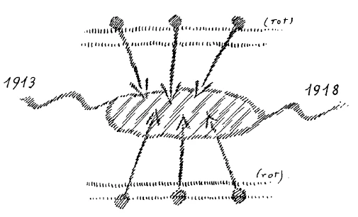
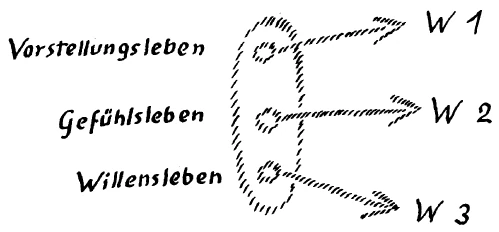

Zunächst bitte ich Sie, mit Bezug auf die Betrachtungen, die wir jetzt pflegen, und die ich angeknüpft habe an das Hereinleuchten einer Erkenntnisbestrebung mit unzulänglichen Erkenntnismitteln, die uns aber zu weiten historischen Perspektiven geführt haben, dabei zunächst zu beachten, daß sowohl bei diesen Dingen wie auch bei dem, was ich aus der gleichen Absicht, dem gleichen Impuls heraus bei meinem vorigen Hiersein gesagt habe: es handelt sich um Mitteilungen tatsächlicher Vorgänge, nicht um irgendeine Theorie, nicht um irgendeine Vorstellungssystematik, sondern um Mitteilungen von Tatsachen. Also gerade das ist der Punkt, den wir berücksichtigen müssen aus dem Grunde, weil uns sonst das Verständnis dieser Dinge Schwierigkeiten bereiten kann. Es handelt sich nicht darum, daß ich Ihnen geschichtliche Gesetze oder historische Ideen entwickle, sondern Tatsächlichkeiten, die zusammenhängen mit den Intentionen, mit den Absichten sowohl gewisser Persönlichkeiten, die in Brüderschaften zusammengeschlossen sind, als auch anderer Wesenheiten, welche auf solche Brüderschaften einwirken, deren Einfluß von diesen Brüderschaften auch gesucht wird, die aber, so wie sie sind, nicht zu den im Fleische verkörperten Menschen gehören, sondern solche Wesen sind, die sich in der geistigen Welt verkörpern. Insbesondere bei einer Mitteilung wie diejenige ist, die ich gestern gemacht habe, ist dies sehr notwendig zu berücksichtigen. Denn bei diesen Brüderschaften haben wir es ja — das haben Sie schon aus den Auseinandersetzungen des vorigen Jahres erkennen können - gewissermaßen mit verschiedenen Parteien zu tun. Ich habe Sie dazumal darauf aufmerksam gemacht, daß wir es innerhalb solcher Brüderschaften mit einer solchen Partei zu tun haben, welche von sich aus für die absolute Geheimhaltung gewisser höherer Wahrheiten ist; daneben, neben andern Schattierungen, hat man es zu tun mit Mitgliedern solcher Brüderschaften, welche namentlich seit der Mitte des 19. Jahrhunderts dafür sind, daß gewisse Wahrheiten — wenn auch zunächst noch jene Wahrheiten, für deren Bekanntmachung nur die nächste Notwendigkeit besteht - vorsichtig und entsprechend sachgemäß der Menschheit enthüllt werden. Neben diesen Hauptparteien gibt es andere Parteinuancen. Daraus aber ersehen Sie, daß dasjenige, was beabsichtigt wird, was gerade ausgehend von solchen Brüderschaften in die Menschheitsentwickelung als Impuls hineinverlegt wird, sehr häufig die Sache eines Kompromisses sein wird. ^zinaa3

Nun, gerade als die Brüderschaften, die bekannt sind mit den geistigen Wirkensimpulsen der Menschheitsentwickelung, herankommen sahen das bedeutsame Ereignis vom Anfang der vierziger Jahre: den Kampf gewisser Geister mit höheren Geistern, der dann 1879 damit beschlossen worden ist, daß gewisse Geister mit Engelnatur, Geister der Finsternis, verfallen sind dem Ereignisse, das als die Überwindung des Drachens durch Michael symbolisiert wird, als also in der Mitte des 19. Jahrhunderts, am Anfang der vierziger Jahre, diese Brüderschaften jenes Ereignis herankommen fühlten, da mußten sie dazu Stellung nehmen, mußten sich fragen: Was ist zu tun? ^hdl17q

Diejenigen Mitglieder dieser Brüderschaften, welche vor allen Dingen Rechnung tragen wollten den Forderungen der Zeit, sie waren bis zu einem gewissen Grade von den besten Absichten beseelt, und sie waren es, welche unter dem irrtümlichen Impulse standen, mit dem Materialismus der Zeit rechnen zu wollen; sie waren es, welche vorzugsweise darauf bedacht waren, den Menschen, die eigentlich nur auf physischem Wege etwas wissen wollten, gerade auf materialistische Weise auf diesem physischen Wege, ich möchte sagen, etwas beizubringen von der geistigen Welt. Es war also gut gemeint, als in den vierziger Jahren von dieser Seite der Spiritismus in die Welt hineinlanciert worden ist. ^xnduem

Notwendig war es in der Zeit dieses Kampfes, in der, wie ich angedeutet habe, auf Erden vorzugsweise herrschen sollte der kritische Geist, der bloß auf die Außenwelt gerichtete Verstand, notwendig war es, den Menschen wenigstens eine Empfindung, ein Gefühl dafür beizubringen, daß es eine geistige Welt um die Menschen herum gibt. Und nun, wie eben Kompromisse zustande kommen, so kam auch dieser Kompromiß zustande. Diejenigen Mitglieder solcher Brüderschaften, die sich durchaus ablehnend verhielten gegen die Bekanntgabe gewisser spiritueller Wahrheiten an die Menschheit, die sahen sich, ich möchte sagen, majorisiert, mußten sich herbeilassen, der Sache zuzustimmen. Es war nicht ihre ureigene Absicht, diese Dinge in die Welt zu setzen, die mit dem Spiritismus zusammenhingen. Wo es sich um Körperschaften handelt und der Wille der Körperschaften vorliegt, da hat man es mit Kompromissen zu tun. Aber natürlich, wie es äußerlich im Leben ist: wenn in irgendeiner Körperschaft etwas beschlossen wird, so erwarten da nicht nur diejenigen etwas von dem Beschlossenen, welche aus ihren eigenen Absichten heraus die Sache in Szene gesetzt haben, sondern auch jene, die ursprünglich dagegen waren, erwarten das eine oder das andere davon, wenn es einmal beschlossen ist. ^pj0boh

So waren denn gutmeinende spirituelle Mitglieder der Brüderschaften der irrtümlichen Ansicht, daß durch die Benützung der Medien die Menschen von dem Vorhandensein einer geistigen Welt um sie herum überzeugt werden würden; dann würde man ihnen auf Grundlage dieser Überzeugung weiter höhere Wahrheiten beibringen können. Das wäre dann gegangen, wenn das eingetroffen wäre, was diese gutmeinenden Mitglieder von Brüderschaften vorausgesetzt hatten: wenn es eingetroffen wäre, daß dasjenige, was durch solche Medien zutage tritt, in dem Sinne ausgelegt worden wäre, daß man es mit einer geistigen Welt ringsherum zu tun hat. Es ist etwas ganz anderes eingetreten — wie ich auch gestern angedeutet habe. Was durch die Medien zutage trat, das wurde interpretiert von den Menschen, die daran teilnahmen, als herkommend von den Toten. Dadurch war das, was dutch den Spiritismus zutage trat, eigentlich eine Enttäuschung für alle. Denn diejenigen, welche sich haben überstimmen lassen, waren natürlich aufs äußerste betrübt darüber, daß in den spiritistischen Sitzungen — zuweilen mit Recht — von Manifestationen der Geister Verstorbener geredet werden konnte. Die gutmeinenden fortschrittlichen Eingeweihten, die erwarteten überhaupt nicht, daß von Toten gesprochen würde, sondern sie erwarteten, daß von einer allgemeinen elementaren Welt gesprochen würde; auch sie waren also enttäuscht. Vor allem aber verfolgen solche Dinge jene, die in einer gewissen Weise eingeweiht sind. Und nun haben wir — außer den bereits angeführten Mitgliedern von Brüderschaften — solche Mitglieder anderer Brüderschaften oder zum Teil auch derselben, worinnen sich Minoritäten, manchmal auch Majoritäten bilden können; wir haben andere Eingeweihte zu beachten: jene, welche genannt werden innerhalb der Brüderschaften «die Brüder der Linken», also jene, welche vor allen Dingen ausnutzen ein jegliches, was als Impuls der Menschheitsentwickelung einverleibt wird, im Sinne einer Machtfrage. Und selbstverständlich, diese Brüder der Linken erwarteten nun auch ihrerseits allerlei von dem, was durch den Spiritismus zutage trat. Ich habe gestern bemerklich gemacht, daß es solche Brüder der Linken vor allen Dingen waren, welche die Veranstaltungen mit den Seelen der toten Menschen gemacht haben. Für sie war vor allen Dingen das interessant, was durch die spiritistischen Sitzungen herauskommen werde. Sie bemächtigten sich nach und nach des ganzen Feldes. Die gutmeinenden Eingeweihten verloren nach und nach alles Interesse an dem Spiritismus, fühlten sich in einer gewissen Weise sogar beschämt, weil diejenigen, die den Spiritismus von Anfang an nicht wollten, ihnen sagten, das hätte man von Anfang an wissen können, daß mit dem Spiritismus jetzt nichts herauskommen kann. Dadurch kam aber gerade der Spiritismus in die Machtzone, ich möchte sagen, der Brüder der Linken. Nun, von solchen Brüdern der Linken habe ich gestern gesprochen, die vor allen Dingen sich dadurch enttäuscht fühlten, da sie sahen, es könne durch diesen nun einmal in Szene gesetzten Spiritismus sich das enthüllen, was sie eigentlich angeregt hatten, wovon sie aber vor allen Dingen wollten, daß es nicht herauskäme: es könne ja gerade in spiritistischen Sitzungen, weil sich die Teilnehmer von den Toten beeinflußt glaubten, durch Mitteilung der Toten sich offenbaren, was gewisse Brüder der Linken mit den Seelen Verstorbener machen. Gerade solche Seelen konnten sich in den spiritistischen Sitzungen manifestieren, die mißbraucht wurden gewissermaßen von den Brüdern der Linken. ^nsurd2

Das müssen Sie eben durchaus in Betracht ziehen, daß es sich bei diesen Mitteilungen nicht um Theorien handelt, sondern daß es sich darum handelt, Tatsachen zu erzählen, die auf Individualitäten zurückgehen. Und wenn nun diese Individualitäten wiederum vereinigt sind in Brüderschaften, so kann von ein und derselben Sache die eine Individualität dies, die andere jenes erwarten. Es geht schon einmal nicht, wenn man von dem Tatsächlichen der geistigen Welt redet, es geht schon einmal nicht, da etwas anderes zu suchen als ein Wirken aus den Impulsen der Individualitäten heraus. Was der eine macht und was der andere macht, widerspricht sich ja auch im Leben. Redet man von Theorien, dann darf der Satz des Widerspruchs nicht verletzt werden. Redet man aber von Tatsachen, dann wird sich — gerade weil man von Tatsachen redet - sehr häufig zeigen, daß diese Tatsachen in der geistigen Welt ebensowenig zusammenstimmen wie die Handlungen der Menschen hier auf dem physischen Plane. Also ich bitte Sie, das immer zu berücksichtigen. Man kann ja, wenn man von diesen Dingen spricht, nicht über Wirklichkeiten reden, wenn man nicht von individuellen Tatsachen redet. Das ist es, um was es sich handelt. Also es müssen die einzelnen Strömungen auseinandergehalten, auseinandergeschält werden. ^kz6u1r

Dies hängt aber zusammen mit einer sehr bedeutsamen Sache, die man, will man in der Gegenwart zu einer einigermaßen befriedigenden Weltanschauung kommen, sich vor allen Dingen zum Bewußtsein bringen muß. Es ist das, was ich nun sage, eine ganz prinzipielle und bedeutungsvolle Sache, trotzdem sie etwas abstrakter ist; aber wir müssen uns einmal diese Tatsache vor die Seele führen. ^ijmwaz

Der Mensch strebt nämlich, wenn er sich eine Weltanschauung bilden will, mit Recht danach, daß die einzelnen Teile dieser Weltanschauung zusammenstimmen. Dies tut er aus einer gewissen Gewohnheit heraus, aus einer Gewohnheit heraus, die so berechtigt ist wie nur möglich; denn sie hängt zusammen mit alledem, was durch viele Jahrhunderte hindurch der Menschheit teuerstes Seelen- und Geistesgut war: mit dem Monotheismus. Man will dasjenige, was einem in der Welt als Erlebnis begegnet, auf einen einheitlichen Weltengrund zurückführen. Dies hat seine gute Berechtigung, aber nicht nach derjenigen Seite hin, nach welcher es die Menschen gewöhnlich berechtigt glauben, sondern nach einer ganz andern Seite hin, von der wir das nächste Mal sprechen werden. Heute möchte.ich Ihnen nur das prinzipiell Wichtige vor die Seele führen. ^3xz8d7

Wer mit der Voraussetzung an die Welt herantritt: alles muß sich widerspruchslos so erklären lassen, als ob es aus einem einheitlichen Weltengrunde hervorgehe, der wird viele Enttäuschungen erleben gerade dann, wenn er in unbefangener Art der Welt und ihren Erlebnissen gegenübertritt. Es ist einmal so hergebracht, daß der Mensch alles das, was er in der Welt wahrnimmt, behandelt nach der pastoralen Weltanschauung: alles führt zurück zu dem einheitlichen göttlichen Urgrund; aus Gott stammt alles, also muß es in einheitlicher Weise sich erklären lassen. ^j3yral

Nun ist das aber nicht so. Es ist nicht so, es stammt nicht dasjenige, was uns in der Welt an Erlebnissen umgibt, aus einem einheitlichen Urgrund, sondern es stammt aus voneinander verschiedenen spirituellen Individualitäten. Es wirken verschiedene Individualitäten zu dem zusammen, was uns in der Welt als Erlebnisse umgibt. So ist es zunächst. Über anderes, was den Monotheismus berechtigt macht, werden wir das nächste Mal noch sprechen. Aber so ist es zunächst. Wir müssen uns bis zu einem gewissen Grade, ja bis zu einem hohen Grade voneinander unabhängige Individualitäten denken, sobald wir nur die Schwelle der geistigen Welt übertreten. Aber dann kann man nicht verlangen, daß dasjenige, was auftritt, aus einem einheitlichen Prinzip heraus zu erklären ist. Denn denken Sie, schematisch dargestellt (siehe Zeichnung S.200), dies wäre irgendein Erlebnis, meinetwillen wären das die Erlebnisse, sagen wir vom Jahre 1913 bis zum Jahre 1918. Die Erlebnisse der Menschen gehen natürlich nach beiden Richtungen fort. Ja, der Historiker wird immer versucht sein, nun ein einheitliches Prinzip in diesem ganzen Werdegang vorauszusetzen. So ist es aber nicht; sondern sobald man die Schwelle zur geistigen Welt überschreitet, die man nach unten und nach oben überschreiten kann (siehe Zeichnung, rot), es ist ein und dieselbe, so wirken in diese Ereignisse herein verschiedene Individualitäten zusammen, die voneinander verhältnismäßig unabhängig sind (siehe Zeichnung, Pfeile). Und wenn Sie das nicht berücksichtigen, wenn Sie einen einheitlichen Weltengrund überall voraussetzen, so werden Sie die Ereignisse niemals verstehen. Nur dann, wenn Sie in dem, was gewissermaßen der Wellenschlag der Ereignisse ist, die verschiedensten Individualitäten, die gegeneinander oder miteinander arbeiten, in Betracht ziehen, dann werden Sie die Dinge in der richtigen Weise verstehen. ^0t7gcv

 ^0igjni

Diese Sache hängt ja zusammen mit den tiefsten Geheimnissen des Menschenwerdens überhaupt. Und nur das monotheistische Gefühl hat diese Tatsache für Jahrhunderte oder Jahrtausende verschleiert; aber in Betracht ziehen muß man sie. Man muß daher, wenn man heute in Weltanschauungsfragen weiterkommen will, vor allen Dingen Logik nicht verwechseln mit abstrakter Widerspruchslosigkeit. Abstrakte Widerspruchslosigkeit kann in einer Welt, in der voneinander unabhängige Individualitäten zusammenwirken, nicht da sein; daher wird es immer, wenn abstrakte Widerspruchslosigkeit angestrebt wird, zur Verarmung der Begriffe führen; die Begriffe werden nicht mehr die volle Wirklichkeit umspannen können. Nur dann können die Begriffe die volle Wirklichkeit umspannen, wenn diese Begriffe jene widerspruchsvolle Welt in sich zu fassen vermögen, welche eben die Wirklichkeit ist. ^wpufgw

Dasjenige, was der Mensch als Naturgebiet vorliegend hat, das kommt auf eine sehr merkwürdige Weise zustande. Auch an der Natur, an allem, was der Mensch Natur nennt und mit Naturwissenschaft auf der einen Seite, mit Naturdienst, Naturästhetik und so weiter auf der andern Seite zusammenfaßt, wirken verschiedene Individualitäten mit. Aber in dem gegenwärtigen Entwickelungszyklus der Menschheit ist durch die weisheitsvolle Weltenlenkung eine für den Menschen sehr segensvolle Einrichtung getroffen worden. Nämlich, der Mensch kann die Natur begreifen mit den Begriffen, die sich auf eine einheitliche Lenkung beziehen, weil von der Natur durch die Sinneswahrnehmung nur dasjenige an den Menschen als Erlebnis herankommt, was von der einheitlichen Lenkung abhängt. Hinter dem Teppich der Natur liegt etwas anderes, was von ganz anderer Seite beeinflußt wird. Aber das wird ausgeschaltet, wenn der Mensch die Natur wahrnimmt. So kommt es, daß dasjenige, was der Mensch Natur nennt, ein einheitliches System ist, aber nur deshalb, weil es durchgesiebt ist. Indem wir wahrnehmen durch unsere Sinne, wird uns die Natur gleichsam durchgesiebt. Alles das, was widerspruchsvoll in ihr ist, das wird herausgesiebt, und es wird die Natur uns so überliefert, daß sie ein einheitliches System ist. In dem Augenblick aber, wo man die Schwelle überschreitet und dasjenige, was zur Wirklichkeit gehört, auch zur Naturerklärung heranzieht — die elementaren Geister oder die Beeinflussungen der Menschenseelen, die sich auf die Natur auch richten können -, in dem Augenblick ist man nicht mehr in der Lage, auch bei der Natur von einem einheitlichen System zu reden, sondern da muß man sich dann auch schon wiederum klarwerden, daß man es mit dem Hereinwirken einander bekämpfender oder einander tragender, einander verstärkender Individualitäten zu tun hat. ^hq8b0x

In der elementaren Welt finden wir Geister der Erde, gnomenhafte Wesen; Geister des Wassers, undinenhafte Wesen; Geister der Luft, sylphenhafte Wesen; Geister des Feuers, salamanderartige Wesen. Die sind alle da. Ja, die sind nicht so, daß sie nun alle ein einheitliches Regiment bilden würden. So ist das nicht. Sondern diese verschiedenen Reiche: Gnomen, Undinen, Sylphen, Salamander, sie sind in einer gewissen Weise selbständig; sie arbeiten nicht nur in Reih und Glied alle aus einem System heraus, sondern sie bekämpfen auch einander. Ihre Intentionen haben nichts miteinander zu tun von vornherein, sondern das, was entsteht, entsteht durch das verschiedenartigste Zusammenwirken der Intentionen. Kennt man die Intentionen, dann sieht man in dem, was vor einem auftritt, daß da hereinwirken meinetwillen Feuergeister und Undinen zusammen. Aber man darf niemals glauben, daß hinter diesen nun wiederum einer steht, der ihnen ein gewisses Kommando gibt. Das ist nicht so. Es ist dieser Geist sehr verbreitet in der Gegenwart, und solche Philosophen, wie zum Beispiel der Philosoph Wand -— von dem Fritz Mauthner nicht mit Unrecht gesagt hat: «Autorität von seines Verlegers Gnaden», aber Autorität ist er fast für die ganze Welt vor dem Kriege gewesen -, die gehen darauf aus, alles dasjenige, was in der menschlichen Seele lebt, Vorstellungsleben, Gefühlsleben, Willensleben in eine Einheit zu fassen, weil sie sagen: Die Seele ist eine Einheit, also muß alles das zu einer Einheit, zu einem gemeinsamen System gehören. — Das ist aber eben nicht so, und es würden jene starken, bedeutungsvollen Diskrepanzen des menschlichen Lebens, auf die gerade die analytische Psychologie kommt, nicht herauskommen, wenn nicht unser Vorstellungsleben hinter der Schwelle zurückführte in ganz andere Regionen, wo andere Individualitäten unser Vorstellungsleben beeinflussen als unser Gefühlsleben und dann wiederum unser Willensleben. ^itl3t4

Es ist so sonderbar! Sehen Sie, wenn das die menschliche Wesenheit ist (siehe Zeichnung, Oval) und wir haben in der menschlichen Wesenheit Vorstellungsleben, Gefühlsleben, Willensleben (drei Kreise), dann kann sich so ein Systematiker wie Wundt nichts anderes vorstellen, als daß das alles ein System ist. ^lci385

Indessen, es führt das Vorstellungsleben in eine andere Welt (W 1), es führt das Gefühlsleben in eine andere Welt (W 2), und wiederum das Willensleben in eine andere Welt (W 3). Dazu ist gerade die Menschenseele da, um eine Einheit zu bilden aus demjenigen, was in der vormenschlichen, also augenblicklich vormenschlichen Welt eine Dreiheit ist. ^x1wgig

 ^sp6u4l

Nun, mit allen diesen Dingen muß gerechnet werden, sobald für die geschichtliche Entwickelung der Menschheit in Betracht kommen die Impulse, die dieser geschichtlichen Entwickelung einmal einverleibt werden. ^duarg1

Ich habe im Verlaufe dieser Betrachtungen gesagt, daß ein jeder Zeitraum der nachatlantischen Zeit seine besondere Aufgabe hat. Ich habe im allgemeinen die Aufgabe des fünften nachatlantischen Zeitraumes charakterisiert, indem ich angedeutet habe, daß es einmal schon für die Menschheit die Aufgabe dieses Zeitraumes ist, sich mit dem Bösen als Impuls in der Weltenentwickelung auseinanderzusetzen. Was das heißt, das haben wir ja verschiedentlich besprochen. Es ist nicht anders möglich, als daß die Kräfte, welche, wenn sie am schlechten Orte auftreten, als das Böse auftreten, durch die Anstrengungen der Menschen im fünften nachatlantischen Zeitraum für die Menschheit erobert werden, so daß sie mit diesen Kräften des Bösen etwas Günstiges für die Zukunft der ganzen Weltenentwickelung anzufangen in der Lage ist. Dadurch wird die Aufgabe dieses fünften nachatlantischen Zeitraums eine ganz besonders schwierige. Denn sehen Sie, eine große Anzahl von Versuchungen steht der Menschheit bevor. Und wenn so nach und nach die Gewalten des Bösen erscheinen, dann ist natürlich der Mensch unter Umständen viel mehr geneigt, sich diesem Bösen auf allen Gebieten zu überlassen, als daß er den Kampf aufnimmt, um dasjenige, was ihm als Böses erscheint, in den Dienst der guten Weltenentwickelung zu stellen. Und dennoch, dieses muß geschehen; es muß das Böse bis zu einem gewissen Grade in den Dienst der guten Weltenentwickelung gestellt werden. Ohne dieses könnte nicht eingetreten werden in den sechsten nachatlantischen Zeitraum, der dann eine ganz andere Aufgabe haben wird, der die Aufgabe haben wird, die Menschheit leben zu lassen, trotzdem sie mit der Erde noch zusammenhängt, vor allen Dingen in einer fortdauernden Anschauung der geistigen Welt, in geistigen Impulsen. Gerade mit dieser Aufgabe gegenüber dem Bösen im fünften nachatlantischen Zeitraum hängt es zusammen, daß eine gewisse Art von persönlicher Verfinsterung für die Menschen eintreten kann. ^6oe819

Nun wissen wir, daß seit dem Jahre 1879 die dem Menschen nächststehenden Geister der Finsternis, die dem Reiche der Angeloi angehören, im Menschenreiche selber wandeln, weil sie aus der geistigen Welt in das Menschenreich herabgestoßen worden sind und nun in den menschlichen Impulsen drinnen vorhanden sind, durch die menschlichen Impulse wirken. Ich sagte, gerade durch dieses, daß dem Menschen so nahestehende Wesen auf unsichtbare Art unter den Menschen wirken und der Mensch durch die hereinspielenden Kräfte des Bösen abgehalten ist davon, das Spirituelle mit der Vernunft anzuerkennen — denn das ist wiederum die damit zusammenhängende Aufgabe des fünften nachatlantischen Zeitraums -, gerade dadurch werden diesem fünften nachatlantischen Zeitraum viele Gelegenheiten gegeben, sich finsteren Irrtümern und dergleichen hinzugeben. Es muß gewissermaßen der Mensch sich dazu bequemen, in diesem fünften nachatlantischen Zeitraum das Spirituelle durch seine Vernunft zu erfassen. Geoffenbart wird es schon; dadurch, daß die Geister der Finsternis 1879 besiegt worden sind, dadurch wird immer mehr und mehr spirituelle Weisheit aus den geistigen Welten herunterfließen können. Nur wenn die Geister der Finsternis oben geblieben wären in den geistigen Reichen, würden sie ein Hemmnis sein können für dieses Herunterfließen. Das Herunterfließen von spiritueller Weisheit können sie fortan nicht verhindern; aber Verwirrung können sie fortan stiften, die Seelen können sie verfinstern. Und welche Gelegenheiten zur Verfinsterung ergriffen werden, haben wir ja zum Teil schon geschildert. Was für Vorkehrungen getroffen werden, haben wir angeführt, um die Menschen abzuhalten davon, das spirituelle Leben zu empfangen. ^p4l5ml

Das alles kann natürlich nicht zum Jammern oder irgend so etwas Anlaß geben, sondern zu einer Stärkung der Kraft und Energie der Menschenseele nach dem Spirituellen hin. Denn wird in diesem fünften nachatlantischen Zeitraum von den Menschen dasjenige erreicht, was erreicht werden kann durch die Einverleibung der Kräfte des Bösen im guten Sinne, dann wird zu gleicher Zeit etwas Ungeheures erreicht: dann wird dieser fünfte nachatlantische Zeitraum für dieEntwickelung der Menschheit etwas wissen aus größeren Vorstellungen als irgendein nachatlantischer Zeitraum, ja als irgendein früherer Zeitraum der Erdenentwickelung. Erschienen ist zum Beispiel der Christus durch das Mysterium von Golgatha dem vierten nachatlantischen Zeitraum; aneignen für die menschliche Vernunft kann ihn sich der fünfte nachatlantische Zeitraum erst. Im vierten nachatlantischen Zeitraum haben die Menschen begreifen können, daß sie in dem Christus-Impuls etwas haben, was sie über den Tod hinausführt als Seelen; das ist ja durch das Paulinische Christentum hinlänglich klargeworden. Aber ein noch Bedeutsameres wird eintreten für die Entwickelung des fünften nachatlantischen Zeitraums, in dem die Menschenseelen erkennen werden, daß sie in dem Christus den Helfer haben, um die Kräfte des Bösen in Gutes umzuwandeln. Aber eines ist mit dieser Eigentümlichkeit des fünften nachatlantischen Zeitraums verbunden, eines, das man sich jeden Tag aufs neue in die Seele schreiben soll, das man ja nicht vergessen soll, obwohl der Mensch besonders für das Vergessen dieser Sache angelegt ist: ein Kämpfer um das Spirituelle muß der Mensch sein in dieser fünften nachatlantischen Zeit; erleben muß er, daß seine Kräfte erschlaffen, wenn er sie nicht fortwährend im Zaume hält für die Eroberung der spirituellen Welt. Im höchsten Maße ist der Mensch auf seine Freiheit gestellt in diesem fünften nachatlantischen Zeitraum! Das muß er durchmachen. Und gewissermaßen an der Idee der menschlichen Freiheit muß geprüft werden alles dasjenige, was die Menschen trifft in diesem fünften nachatlantischen Zeitraum. Denn würden die Kräfte der Menschen erschlaffen, so könnte gewissermaßen alles zum Schlimmen ausfallen. Der Mensch ist nicht in der Lage, in diesem fünften nachatlantischen Zeitraum wie ein Kind geführt zu werden. Sind gewisse Brüderschaften da, welche sich gewissermaßen das Ideal vorhalten, die Menschen wie Kinder zu führen, wie sie noch geführt wurden im dritten nachatlantischen Zeitraum und im vierten, so tun diese Brüderschaften gar nicht das rechte; sie tun gar nicht dasjenige, was für die Entwickelung der Menschheit eigentlich geschehen soll. Die Menschen so auf die spirituelle Welt hinzuweisen, daß Annahme oder Ablehnung der spirituellen Welt in die Freiheit der Menschen gestellt ist, das muß sich derjenige, der in dieser fünften nachatlantischen Zeit von dieser spirituellen Welt spricht, immer wieder und wiederum vorhalten. Daher können gewisse Dinge in dieser fünften nachatlantischen Zeit nur gesagt werden; aber das Sagen ist jetzt ebenso wichtig, wie irgend etwas anderes wichtig war in andern Zeiträumen. Dafür will ich Ihnen ein Beispiel geben. ^xj19oi

In unserer Zeit ist das Mitteilen von Wahrheiten, wenn ich trivial sprechen darf, das Vortragen von Wahrheiten das Allerwichtigste. Danach richten sollen sich die Menschen aus ihrer Freiheit heraus. Weiter sollte eigentlich nicht gegangen werden als bis zum Vortrag, bis zur Mitteilung der Wahrheiten; das andere sollte in freiem Entschlusse daraus folgen; so daraus folgen, wie die Dinge folgen, die man als Entschlüsse faßt aus dem Impulse des physischen Planes heraus. Das bezieht sich auch auf die Dinge, die gewissermaßen nur von der geistigen Welt aus selbst gelenkt und geleitet werden können. ^lu68of

Wir werden uns gleich besser verstehen, wenn wir auf Einzelheiten eingehen. Noch im vierten nachatlantischen Zeitraum war es so, daß andere Dinge in Betracht kamen als das bloße Wort, die bloße Mitteilung. Was kam da in Betracht? Nun, nehmen wir einen bestimmten Fall an: die Insel Irland, wie wir sie heute nennen, hat ganz besondere Eigentümlichkeiten. Diese Insel Irland unterscheidet sich durch gewisse Dinge von der ganzen übrigen Erde. Jedes Gebiet der Erde unterscheidet sich von den andern durch gewisse Dinge; das ist also nichts Besonderes; nur will ich den verhältnismäßig starken Unterschied heute hervorheben, der im Vergleich von Irland mit andern Gegenden der Erde besteht. In der Entwickelung der Erde kann man ja - wie Sie schon aus meiner «Geheimwissenschaft im Umriß» sehen — zurückgehen und verschiedene Einflüsse, verschiedene Geschehnisse konstatieren in demjenigen, was als Tatsachen aus der geistigen Welt herausgeholt werden kann. Sie wissen aus der «Geheimwissenschaft», wie sich die Dinge verhalten, wenn man zurückgeht bis zu dem, was die lemurische Zeit genannt wird, was da alles geschehen ist seit der lemurischen Zeit, wie sich die verschiedenen Dinge entwickelt haben. Ich habe Sie nun gestern darauf aufmerksam gemacht, daß die ganze Erde eigentlich als ein Organismus zu betrachten ist, daß sie für verschiedene Territorien Verschiedenes aus sich herausstrahlt auf die Bewohner. Dieses Ausgestrahlte hat auf den Doppelgänger, auf den ich gestern zum Schluß aufmerksam gemacht habe, einen ganz besonderen Einfluß. Bei Irland ist es so, daß in älteren Zeiten die Menschheit, die Irland gekannt hat, die ganz besondere Eigentümlichkeit von Irland märchenhaft, legendenhaft zum Ausdruck gebracht hat. Ich möchte sagen, eine esoterische Legende hat man gekannt als aussprechend das Wesen von Irland im Erdenorganismus. Man hat gesagt: Die Menschheit ist einstmals aus dem Paradiese vertrieben worden, weil im Paradiese Luzifer die Menschheit verführt hat; und sie ist dann in die übrige Welt zerstreut worden. Aber diese übrige Welt war schon da zur Zeit, als die Menschheit aus dem Paradiese vertrieben worden ist. Man unterscheidet also — so sagte man in dieser märchenhaften, in dieser legendenhaften Darstellung -, man unterscheidet also das Paradies mit dem Luzifer darinnen von der übrigen Erde, in welche die Menschheit verstoßen worden ist. Aber mit Irland ist es nicht so, das gehört nicht in demselben Sinne zu der übrigen Erde, weil, bevor Luzifer das Paradies betreten hat, sich ein Abbild des Paradieses auf der Erde gebildet hat, und dieses Abbild ist Irland geworden. ^huuld6

Verstehen Sie wohl: Irland ist also dasjenige Stück Erde, welches keinen Teil hat an Luzifer, zu dem Luzifer keine Beziehung hat. Dasjenige, was abgesondert hat werden müssen vom Paradiese, damit sein irdischer Abglanz entstehe, das hätte verhindert, daß Luzifer ins Paradies hineingekonnt hätte. Also Irland wurde so aufgefaßt nach dieser Legende, daß es erst eine Absonderung war desjenigen Teiles des Paradieses, der Luzifer verhindert hätte, in das Paradies hineinzukommen. Erst als Irland aus dem Paradiese heraus abgesondert war, konnte Luzifer in das Paradies hinein. ^rqx14g

Diese esoterische Legende, die ich Ihnen sehr unvollkommen dargestellt habe, ist etwas sehr Schönes. Sie war vielen Menschen die Erklärung für die ganz eigentümliche Aufgabe von Irland durch Jahrhunderte hindurch. Im ersten Mysteriendrama, das ich geschrieben habe, finden Sie schon dasjenige, was ja so viel erzählt wird: wie die Christianisierung Europas von irischen Mönchen ausgegangen ist. Als Patrick das Christentum eingeführt hatte in Irland, da verhielt sich die Sache ja so, daß dort das Christentum zur höchsten Frömmigkeit führte. Umdeutend die eben besprochene Legende, nannte man sogar Irland, das die Griechen «Ierne», die Römer «Ivernia» genannt hatten - in diesen Zeiten, in denen die Kräfte des europäischen Christentums gerade in seinen besten Impulsen von Irland ausgingen, von irischen, ins Christentum liebevoll Eingeweihten -, wegen der Frömmigkeit, die dort in den christlichen Klöstern herrschte: die Insel der Heiligen. Das hängt damit zusammen, daß allerdings die Kräfte, von denen ich gesprochen habe, diese territorialen Kräfte, die aus der Erde aufsteigend den menschlichen Doppelgänger erfassen, für die Insel Irland die allerbesten sind. ^3it076

Sie werden sagen: dann müßten ja in Irland die allerbesten Menschen sein. Ja, so ist es aber doch nicht auf der Welt. In jedes Gebiet wandern andere ein und haben Nachkommen und so weiter. Also, so ist es eben nicht, daß der Mensch bloß das Ergebnis des Stückes Erde ist, auf dem er steht. Es kann sehr wohl der Charakter der Menschen widersprechen dem, was aus der Erde aufsteigt. Man darf nicht dasjenige, was sich in den Menschen wirklich entwickelt, zur Charakteristik des Erdenorganismus mit Bezug auf ein bestimmtes Territorium anführen. Da würde man sich eben wiederum nur der Welt der Illusionen überlassen. ^2w6pwr

Aber so etwas wie das, was ich Ihnen jetzt angedeutet habe, daß Irland ein ganz besonderer Boden ist, das können wir heute sagen. Und aus solchem Sagen müßte erfließen ein Faktor unter den vielen Faktoren, welche heute in fruchtbarer Weise zu sozialpolitischen Ideen führen können. Man müßte mit solchen Faktoren rechnen. Das, was ich eben von Irland gesagt habe, ist ein Faktor, man müßte mit solchen Faktoren rechnen. Man müßte das alles zusammensetzen. Das müßte Wissenschaft sein von der Gestaltung der menschlichen Verhältnisse auf der Erde. Bevor das sein wird, wird mit Bezug auf die Einrichtung der öffentlichen Angelegenheiten kein rechtes Heil sein. Das, was aus der geistigen Welt heraus gesagt werden kann, müßte einfließen in die Maßnahmen, die man trifft. Deshalb habe ich in öffentlichen Vorträgen jetzt gesagt, es sei wichtig, daß alle, die mit öffentlichen Angelegenheiten zu tun haben, Staatsmänner und so weiter, sich mit diesem bekanntmachen; denn dadurch allein würden sie die Wirklichkeit beherrschen. Sie tun es nur nicht, haben es vor allen Dingen nicht getan bis jetzt. Aber eine Notwendigkeit ist es deshalb doch. ^bi8j1a

Heute liegt das vor, daß in Gemäßheit der Aufgaben der fünften nachatlantischen Zeit es auf das Sagen ankommt, auf das Mitteilen; denn ehe das Gesagte zur Tat werden soll, müssen die Entschlüsse so gefaßt werden, wie man sie aus dem Impulse des physischen Planes heraus faßt. Das war in früheren Zeiten eben anders; da hat man noch anderes tun können. ^mjiub3

In einem bestimmten Zeitpunkte des dritten nachatlantischen Zeitraumes hat eine gewisse Brüderschaft Veranlassung genommen, eine größere Anzahl von Kolonisten aus Kleinasien nach der Insel Irland zu schicken. Dazumal wurden dort angesiedelt Kolonisten aus demselben Gebiete von Asien, aus dem später der Philosoph Thales stammte. Lesen Sie nach in meinen «Rätseln der Philosophie» über die Philosophie des 'Thales. Thales stammte aus derselben Gegend, wenn auch später; er ist ja erst in der vierten nachatlantischen Zeit geboren. Aber schon früher, aus dem Milieu heraus, aus der ganzen geistigen Substanz heraus, aus welcher später der Philosoph Thales stammte, haben die Eingeweihten nach Irland Kolonisten geschickt. Warum? Weil sie die Eigentümlichkeit eines solchen Gebietes der Erde, wie es Irland ist, gekannt haben. Sie haben dasjenige gewußt, was angedeutet wurde durch die esoterische Legende, von der ich Ihnen gesprochen habe. Sie haben gewußt: die Kräfte, die aufsteigen aus der Erde durch den Boden der irischen Insel, diese Kräfte wirken so auf die Menschen, daß der Mensch dadurch wenig beeinflußt wird nach der Richtung der Intellektualität hin, wenig nach der Richtung des Egoismus, wenig nach der Richtung der Entschlußfähigkeit. Das haben diese Eingeweihten, die jene Kolonisten dahin geschickt haben, sehr gut gewußt, und sie haben Leute ausgewählt, welche durch ihre besonderen karmischen Anlagen geeignet erschienen, gerade den Einflüssen der Insel Irland ausgesetzt zu werden. Heute gibt es noch immer in Irland Nachkommen jener alten Bevölkerung, die dazumal von Kleinasien hinüber verpflanzt worden ist, und die sich entwickeln sollte so, daß nicht die kleinste Intellektualität, nicht der kleinste Verstand, nicht die Entschlußfähigkeit, dagegen gewisse besondere Eigenschaften des Gemütes hervorragend sich entwickeln sollten. ^uiblzi

Dadurch ist von langer Hand her vorbereitet gewesen das, was dann als die friedliche Ausbreitung des Christentums in Irland Platz gegriffen hat und jene gloriose Entwickelung des Christentums in Irland, von der dann ausgestrahlt ist die Christianisierung Europas. Von langer Hand her ist das vorbereitet gewesen. Die Landsleute des späteren Thales haben Leute dorthin geschickt, welche sich dann geeignet erwiesen, solche Mönche zu werden, die in der Weise, wie ich es angedeutet habe, wirken konnten. Solche Dinge hat man überhaupt viele gemacht in älteren Zeiten, und wenn Sie in der äußeren exoterischen Geschichte heute von unverständigen Historikern — die aber viel Verstand haben können selbstverständlich, denn der Verstand ist ja heute auf der Straße zu finden -, wenn Sie heute von solchen Historikern Kolonisationen der Alten dargestellt finden, so müssen Sie immer sich klar sein: in solchen Kolonisationen lag eine tiefgehende Weisheit; die wurden gelenkt und geleitet, indem man überall Rücksicht nahm auf dasjenige, was in der Zukunft stattfinden sollte, indem man in jener Zeit rechnete mit den Eigentümlichkeiten der Erdenentwickelung. ^y7rvt0

Das war eine andere Art, spirituelle Weisheit in die Welt zu setzen. Das dürfte heute derjenige, der den rechten Pfad geht, so nicht machen; er dürfte nicht einfach den Leuten gegen ihren Willen, um die Erde einzuteilen, etwas vorschreiben, sondern er hat so zu wirken, daß er den Leuten die Wahrheiten sagt, und sie sollen sich selber darnach richten. ^qyfvf4

Sie sehen also damit angedeutet einen wesentlichen Fortschritt vom dritten, vierten zum fünften nachatlantischen Zeitraum. Solch eine Sache muß man sehr gut ins Auge fassen. Und erkennen muß man, wie dieser Impuls der Freiheit sich hindurchziehen muß durch all dasjenige, was den fünften nachatlantischen Zeitraum beherrscht. Denn gerade gegen diese Freiheit des menschlichen Gemütes lehnt sich auf jener Widersacher, von dem ich Ihnen gesagt habe, daß er wie ein Doppelgänger den Menschen von einiger Zeit vor der Geburt bis zum Tode hin begleitet, aber bei dem Tode, vor dem Tode den Menschen verlassen muß. Wenn man unter diesem Einflusse steht, der unmittelbar mit dem Doppelgänger wirkt, dann kommt allerlei heraus, das schon in diesem fünften nachatlantischen Zeitraum herauskommen kann, aber nicht für diesen fünften nachatlantischen Zeitraum so geeignet ist, daß es ihm die Möglichkeit gibt, seine Aufgabe so zu erreichen, daß im Kampf mit dem Bösen die Umwandlung des Bösen in das Gute bis zu einem gewissen Grade sich vollzieht. ^bf341a

Denken Sie, was also eigentlich hinter all den Dingen steht, in welche der Mensch des fünften nachatlantischen Zeitraums hineingestellt ist. Die einzelnen Tatsachen müssen in der richtigen Weise beleuchtet werden; sie müssen verstanden werden. Denn da, wo stark der Doppelgänger wirkt, von dem ich gestern gesprochen habe, da wirkt man auch der eigentlichen Tendenz des fünften nachatlantischen Zeitraums entgegen. Es ist nur in diesem fünften nachatlantischen Zeitraum die Menschheit noch nicht so weit, die Tatsachen richtig zu taxieren; insbesondere seit diesen letzten drei traurigen Jahren ist die Menschheit gar nicht geeignet, die Tatsachen irgendwie in der richtigen Weise zu taxieren. ^rdtbyn

Aber nehmen Sie eine scheinbar von dem, was ich heute auseinandergesetzt habe, sehr weit abliegende 'Tatsache. Die Tatsache, die ich Ihnen vorführen will, ist diese: In einem großen Eisenwerke sollten Zehntausende von Tonnen Gußeisen verladen werden in Eisenbahnzüge. Dazu wurde selbstverständlich eine bestimmte Anzahl von Arbeitern angestellt. Fünfundsiebzig Mann sollten an die Arbeit gehen, und es stellte sich heraus, daß jeder zwölfeinhalb Tonnen am Tage verladen konnte; also von fünfundsiebzig Mann je zwölfeinhalb Tonnen am Tage. ^c3ijev

Ein Mann, der mehr auf den Doppelgänger gab als auf dasjenige, was im Sinne des Fortschrittes der Menschheit für das menschliche Gemüt im fünften nachatlantischen Zeitraum erobert werden muß, ein solcher Mann ist Taylor. Dieser Mann fragte zunächst die Fabrikanten, ob sie nicht glaubten, daß ein einzelner Mann viel mehr verladen könne als zwölfeinhalb Tonnen am Tag? Die Fabrikanten meinten, daß ein Arbeiter höchstens achtzehn Tonnen verladen könnte. Da sagte Taylor: Dann machen wir Experimente; wir wollen einmal experimentieren. ^lkh8mu

Taylor ging daran, mit den Menschen zu experimentieren. Das Maschinenmäßige wird dadurch in das menschliche soziale Leben übertragen. Es sollte mit den Menschen experimentiert werden! Er probierte, ob das wirklich so wäre, wie die praktischsten Fabrikanten sagten, daß ein Mann nur höchstens achtzehn Tonnen am Tag verladen kann. Er richtete Pausen ein, die er nach der Physiologie so berechnete, daß die Menschen in diesen Pausen gerade so viel Kräfte wiederum sammelten, als sie vorher ausgegeben hatten. Es stellte sich natürlich heraus, daß es unter Umständen beim einen so, beim andern so war. Da nahm er — Sie wissen, im Mechanismus kommt dabei nichts darauf an, da nimmt man das arithmetische Mittel, beim Menschen kann man nicht das arithmetische Mittel nehmen, weil jeder Mensch seine Berechtigung zum Dasein hat -—, aber Taylor nahm arithmetische Mittel, das heißt, er wählte diejenigen Arbeiter heraus, welche in ihrer Gesamtheit rationelle Pausen abwarfen, und diese rationellen Pausen gestattete er ihnen. Die andern, die nicht in diesen Pausen ihte Kräfte wiederherstellen konnten, wurden einfach herausgeworfen. Da stellte sich denn heraus, wenn man in dieser Weise experimentierte mit den Menschen, daß die Ausgewählten, die durch Selektion Ausgewählten, wenn sie in den Pausen sich wieder vollständig erholten, jeder siebenundvierzigeinhalb Tonnen verladen könne. ^0ccnaj

Sie haben den Mechanismus der Darwinschen Theorie auf das Arbeiterleben angewendet: die Unpassenden weg, die Passenden durch Selektion ausgewählt. Die Passenden sind diejenigen, die mit entsprechender Ausnützung der Pausen, nicht, wie man früher angenommen hat, als Maximum achtzehn Tonnen, sondern siebenundvierzigeinhalb Tonnen verladen können. Dadurch können aber auch die Arbeiter zufriedengestellt werden; denn man erspart ungeheuer viel dabei, und man konnte dadurch den Lohn jener Arbeiter um sechzig Prozent erhöhen. Also man macht die Ausgewählten, die im Kampfe ums Dasein Passendsten, die man auf diese Weise herausgewählt hat durch Selektion, außerdem zu sehr zufriedenen Leuten. Aber - die Unpassenden mögen verhungern! ^0n2j8c

Das ist der Anfang eines Prinzips! Solche Sachen beachtet man wenig, weil man sie nicht von großen Gesichtspunkten aus beleuchtet. Man muß sie aber von großen Gesichtspunkten aus beleuchten. Heute ist es noch ein bloßes Anwenden irrtümlicher naturwissenschaftlicher Vorstellungen auf das Menschenleben. Der Impuls bleibt. Und dann wird der Impuls angewendet auf diejenigen Dinge, die im Verlauf des fünften nachatlantischen Zeitraums als okkulte Wahrheiten kommen. Der Darwinismus enthält keine okkulten Wahrheiten; seine Anwendung würde aber schon zu großen Scheußlichkeiten führen: die Anwendung der darwinistischen Anschauung in bezug auf das unmittelbare Experimentieren mit Menschen. Wenn aber dazu okkulte Wahrheiten wirklich kommen, wie sie enthüllt werden müssen im Verlauf des fünften nachatlantischen Zeitraums, dann würde man eine ungeheure Macht über Menschen auf diese Weise gewinnen, allerdings nur dadurch, daß man die Passendsten immer auswählt. Aber man würde nicht nur die Passendsten auswählen, sondern man würde dadurch, daß man anstrebt eine gewisse okkulte Erfindung, um die Passenden immer passender und passender zu machen — dadurch würde man zu einer ungeheuren Machtausnützung kommen, die gerade entgegengesetzt wirken würde der guten Tendenz des fünften nachatlantischen Zeitraums. ^u4uwnk

Solche Zusammenhänge, wie ich sie Ihnen jetzt dargestellt habe, wollte ich nur anführen, um Ihnen zu zeigen, wie sich die Anfänge zukunftsumspannender Intentionen ausnehmen und wie man diese Dinge beleuchten muß von gewissen höheren Gesichtspunkten aus. Es wird nun unsere weitere Aufgabe sein, das nächste Mal hinzuweisen auf die drei bis vier großen Wahrheiten, zu denen der fünfte nachatlantische Zeitraum kommen muß. Es wird daran gezeigt werden, wie diese Wahrheiten mißbraucht werden können, wenn sie nicht im Sinne der richtigen guten Tendenz des fünften nachatlantischen Zeitraums angewendet werden, sondern wenn vorzugsweise die Bedingungen des Doppelgängers erfüllt würden, die vertreten werden durch diejenigen Brüderschaften, die an die Stelle des Christus ein anderes Wesen setzen wollen. ^1u273a