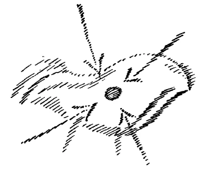
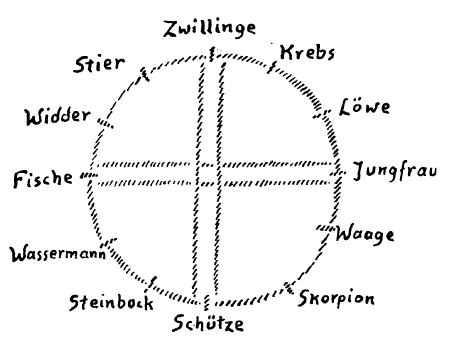

Ich möchte heute an einzelne Betrachtungen, die wir angestellt haben im Laufe der Zeit, das eine und das andere anknüpfen, um dieses oder jenes zu ergänzen. Wenn Sie aufmerksam die Zeit verfolgen, werden Sie schon ab und zu bemerken können, daß man fühlt, wie in den Gedanken, Empfindungen und Impulsen, in denen die Menschen durch lange Zeiten dasjenige gefunden haben, wodurch man es «so herrlich weit gebracht» hat, man jetzt nicht mehr das finden kann, was in die nächste Zukunft hinüberhelfen kann. Gestern ist mir von einem unserer Mitglieder eine Nummer der «Frankfurter Zeitung» vom letzten Mittwoch, 21.November 1917, in die Hand gedrückt worden. Da spricht sich ein sehr gelehrter Herr aus - es muß ein sehr gelehrter Herr sein, denn er hat vor seinem Namen nicht nur das Doktorzeichen der Philosophie, sondern auch das Doktorzeichen der Theologie, und außerdem steht noch Professor davor: also er ist Professor, Doktor der Theologie und Doktor der Philosophie, also ein sehr gescheiter Mann selbstverständlich. Er hat einen Aufsatz geschrieben, der über allerlei gegenwärtige geistige Bedürfnisse handelt. Im Verlaufe dieses Aufsatzes ist eine Stelle enthalten, die in der folgenden Weise sich ausspricht: «Das Erleben des Seins, das hinter den Dingen liegt, bedarf nicht der frommen Weihe oder der religiösen Wertung, denn es ist selbst Religion. Es handelt sich ja nicht um das Erfühlen und Erfassen eigenen individuellen Gehalts, sondern des großen Irrationalen, das hinter allem Dasein verborgen ist. Wer daran rührt, so daß der göttliche Funke überspringt, der macht ein Erlebnis, das primären Charakter beansprucht, «Urerlebnis > heißen will. Dieses eint den Erlebenden mit allem, was vom gleichen Lebensstrome bewegt wird, verleiht ihm, um das Lieblingswort der neuen Zeit zu brauchen, ein kosmisches Lebensgefühl. » ^tt7xs7

Verzeihen Sie, liebe Freunde, ich lese das nicht vor, um in Ihnen irgendwie besonders hervorragende Vorstellungen zu erwecken für diese verwaschenen Sätze, sondern um Ihnen ein Zeitsymbolum vorzuführen: «Eine kosmische Religiosität ist unter uns im Werden, und wie stark das Verlangen nach ihr ist, zeigt das wahrnehmbare Wachstum der Theosophischen Bewegung, die jenes hintersinnlichen Lebens Kreisläufe zu entdecken und zu entschleiern unternimmt.» — Es ist ja schwierig, über all diese verwaschenen Begriffe hinwegzuhumpeln, aber nicht wahr, als Zeitsymbolum ist das doch eine Merkwürdigkeit. Weiter sagt er: «Es handelt sich bei dieser kosmischen Frömmigkeit nicht um eine quietistische Mystik, die mit Weltabwendung beginnt und in Kontemplation endigt, sondern um etwas, das gerade in der Brandung des Geschehens empfangen wird und immer neue Bewegtheit hervorbringt» — und so weiter. ^sy0w84

Etwas Gescheites kann man sich bei diesen Sätzen ja nicht denken! Da aber «Professor, Dr. theol. und Dr. phil.» davorsteht, muß man es natürlich für etwas Gescheites halten, sonst würde man es für etwas halten, was stammelnd in einigen unklaren Tiraden zum Ausdruck bringt, wie der gelehrte Herr eben auf dem Pfade, den er gewandelt ist, nicht mehr weiterkommt und nun doch sich genötigt fühlt, auf etwas hinzuweisen, was auch da ist und ihm offenbar nicht ganz aussichtslos erscheint. ^s5m17q

Man sollte gar nicht entzückt sein über solche Auslassungen, denn solche Auslassungen dürfen uns vor allen Dingen nicht in irgendeinen Schlaf einlullen darüber, daß nun wiederum von irgendeiner Seite jemand gemerkt hat, daß doch hinter der geisteswissenschaftlichen Bewegung etwas steckt. Das würde sogar sehr schädlich sein. Denn jene, welche solche Auslassungen machen, sind zuweilen auch dieselben, die sich bei solchen Auslassungen befriedigt fühlen, die nicht weitergehen, die eben mit solchen verwaschenen Dingen hinweisen auf etwas, was in die Welt hereintreten will und dabei gerade zu denen gehören, welche durchaus viel, viel zu bequem sind, um sich einzulassen auf das, was als ernstes Studium der Geisteswissenschaft notwendig ist und was wirklich hereinbrechen und die Menschengemüter ergreifen muß, wenn das, was mit der Wirklichkeit verbunden ist, mit dem Zeitensttrom des Werdens so verwachsen soll, daß Heilsames daraus entstehen kann. Es ist natürlich leichter, von «Brandung» und von «kosmischen Gefühlen» zu sprechen, als sich ernsthaft einzulassen auf jene Dinge, die -— von den Zeichen der Zeit gefordert — gegenwärtig der Menschheit verkündet werden müssen. Deshalb erscheint es mir notwendig, gerade jetzt hier die Dinge zu sagen, welche in den öffentlichen Vorträgen vorgebracht worden sind und weiter vorgebracht werden, gerade mit scharfer Betonung des Unterschiedes, der besteht zwischen dem Abgelebten, nicht mehr Lebensfähigen, das in die katastrophalen Zeiten hineingeführt hat, und dem, was die Menschenseele wirklich ergreifen muß, wenn irgendein Schritt nach vorwärts gemacht werden soll. ^q4xd1n

Mit der alten Weisheit, durch welche die Menschen eingelaufen sind in unsere Zeit, können Tausende von Kongressen abgehalten werden, Weltkongresse und Volkskongresse und was immer, es können Tausende und Tausende von Vereinen begründet werden: klar muß man sich darüber sein, daß diese Tausende von Kongressen, Tausende von Vereinen nichts bewirken werden, wenn nicht das geistige Lebensblut der Wissenschaft vom Geiste durch sie fließen wird. Dasjenige, was den Menschen heute fehlt, das ist der Mut, einzutreten in die wirkliche Erforschung der geistigen Welt. So sonderbar es klingt, es muß einmal gesagt werden, es brauchte nichts anderes zum Beispiel zunächst als einen nächsten Schritt: die kleine Broschüre «Das menschliche Leben vom Gesichtspunkte der Geisteswissenschaft» in weitesten Kreisen zu verbreiten, und es würde etwas anderes damit getan sein im Hervorrufen des Wissens eines Zusammenhanges des Menschen mit der kosmischen Ordnung. Auf dieses Wissen ist gerade in dieser kleinen Broschüre «Das menschliche Leben vom Gesichtspunkte der Geisteswissenschaft» aufmerksam gemacht; im Konkreten ist darauf aufmerksam gemacht, wie die Erde alljährlich ihre Bewußtseinszustände ändert und dergleichen. Gerade das, was in diesem Vortrage und in dieser Broschüre gesagt wird, ist mit vollem Bedacht gesagt mit Bezug auf die Bedürfnisse unserer Zeit. Das aufzunehmen, würde mehr bedeuten, als alles Wischiwaschi reden von kosmischem Gefühl und vom Einlaufen in irgendeine «Brandung», oder was weiß ich, ich habe Ihnen ja gerade diese Dinge vorgelesen; zu wiederholen sind sie mir nicht möglich, weil sie zu sinnlos sind in ihrer Formulierung. ^aewr84

Das hindert selbstverständlich nicht, aufmerksam zu sein auf diese Dinge, denn sie sind wichtig und wesentlich. Worauf ich aufmerksam machen will, ist, daß wir uns nicht selber benebeln sollen, daß wir klar sein müssen, daß äußerste Klarheit notwendig ist, wenn wir wirken wollen für die anthroposophisch orientierte Geisteswissenschaft. ^rjztl3

Noch einmal will ich darauf hinweisen, daß der Menschheit bevorsteht in diesem fünften nachatlantischen Zeitraum, hineinzukommen in eine besondere Behandlung großer Lebensfragen, die in einer gewissen Weise verdunkelt gewesen sind durch die Weisheit der bisherigen Zeit. Ich habe schon auf sie hingewiesen. Die eine große Lebensfrage kann damit bezeichnet werden, daß man sagt: Es soll versucht werden, das Geistig-Ätherische in den Dienst des äußeren praktischen Lebens zu stellen. — Ich habe Sie aufmerksam darauf gemacht, daß der fünfte nachatlantische Zeitraum das Problem wird lösen müssen, wie menschliche Stimmungen, die Bewegung menschlicher Stimmungen sich in Wellenbewegung auf Maschinen übertragen lassen, wie der Mensch in Zusammenhang gebracht werden muß mit dem, was immer mechanischer und mechanischer werden muß. Ich habe deshalb heute vor acht Tagen hier darauf aufmerksam gemacht, in welcher äußerlichen Weise von einem gewissen Teil unserer Erdoberfläche diese Mechanisierung genommen wird. Ich habe Ihnen ein Beispiel vorgeführt, wie aus amerikanischer Denkweise heraus versucht wird, das Maschinelle über das Menschenleben selber auszudehnen. Ich habe dieses Beispiel angeführt von den Pausen, die man ausnützen will, so daß, statt viel weniger Tonnen, bis gegen fünfzig Tonnen verladen werden können von einer Anzahl Arbeitern: man braucht nur das Darwinsche Selektionsprinzip wirklich ins Leben einzuführen. ^2intpp

An solchen Stellen ist der Wille dazu vorhanden, die Menschenkraft zusammenzuspannen mit Maschinenkraft. Diese Dinge dürfen nicht so behandelt werden, als ob man sie bekämpfen müßte. Das ist eine ganz falsche Anschauung. Diese Dinge werden nicht ausbleiben, sie werden kommen. Es handelt sich nur darum, ob sie im weltgeschichtlichen Verlaufe von solchen Menschen in Szene gesetzt werden, die mit den großen Zielen des Erdenwerdens in selbstloser Weise vertraut sind und zum Heil der Menschen diese Dinge formen, oder ob sie in Szene gesetzt werden von jenen Menschengruppen, die nur im egoistischen oder im gruppenegoistischen Sinne diese Dinge ausnützen. Darum handelt es sich. Nicht auf das Was kommt es in diesem Falle an, das Was kommt sicher; auf das Wie kommt es an, wie man die Dinge in Angriff nimmt. Denn das Was liegt einfach im Sinne der Erdenentwickelung. Die Zusammenschmiedung des Menschenwesens mit dem maschinellen Wesen, das wird für den Rest der Erdenentwickelung ein großes, bedeutsames Problem sein. ^gz2pjm

Ich habe vollbedacht öfter jetzt darauf aufmerksam gemacht, auch in öffentlichen Vorträgen, daß das Bewußtsein des Menschen zusammenhängt mit abbauenden Kräften. Zweimal habe ich es in öffentlichen Vorträgen in Basel gesagt: In unser Nervensystem hinein ersterben wir. — Diese Kräfte, diese ersterbenden Kräfte, sie werden immer mächtiger und mächtiger werden. Und es wird die Verbindung hergestellt werden zwischen den im Menschen ersterbenden Kräften, die verwandt sind mit elektrischen, magnetischen Kräften und den äußeren Maschinenkräften. Der Mensch wird gewissermaßen seine Intentionen, seine Gedanken hineinleiten können in die Maschinenkräfte. Noch unentdeckte Kräfte in der Menschennatur werden entdeckt werden, solche Kräfte, welche auf die äußeren elektrischen und magnetischen Kräfte wirken. ^3d9386

Das ist das eine Problem: das Zusammenführen des Menschen mit dem Mechanismus, das immer mehr und mehr um sich greifen muß in der Zukunft. Das andere Problem liegt in demjenigen, was die geistigen Verhältnisse zu Hilfe rufen wird. Das kann aber nur gemacht werden, wenn die Zeit reif ist, und wenn eine genügende Anzahl Menschen dazu in der richtigen Weise vorbereitet ist. Aber kommen muß es, daß die geistigen Kräfte mobil gemacht werden für die Beherrschung des Lebens in bezug auf Krankheit und Tod. ^np7bta

Die Medizin wird vergeistigt werden, sehr, sehr vergeistigt werden. Von allen solchen Dingen werden von gewissen Seiten her Karikaturen geschaffen; aber die Karikaturen zeigen nur, was da wirklich kommen muß. Wieder handelt es sich darum, daß dieses Problem von jener Seite her, auf die ich bei dem andern Problem hingewiesen habe, in Angriff genommen werden soll in einer äußeren egoistischen oder gruppenegoistischen Weise. ^ack6yh

Das dritte ist: die Menschengedanken einzuführen in das Werden des Menschengeschlechtes selber in Geburt und Erzeugung. Ich habe darauf hingewiesen, wie ja auch schon darüber Kongresse gehalten worden sind, wie man sogar eine materialistische Ausgestaltung der Wissenschaft von der Zeugung und von der Zusammenspannung von Mann und Weib in der Zukunft begründen will. Diese Dinge alle weisen uns hin auf Bedeutsamstes, das im Werden begriffen ist. Billig ist es heute noch, zu sagen: Wie kommt es, daß diejenigen, die im richtigen Sinne von diesen Dingen wissen, sie nicht anwenden? Man wird sich zukünftig schon überzeugen, was es mit dieser Anwendung für eine Bewandtnis hat, und welche hindernden Kräfte gegenwärtig noch am Werke sind, um zum Beispiel in ausgiebigerem Maße eine spiritualisierte Medizin zu begründen oder eine spiritualisierte Volkswirtschaft. Heute kann nicht mehr geleistet werden, als daß von diesen Dingen geredet wird, bis die Menschen sie genügend verstanden haben werden, jene Menschen, die geneigt sind, sie in selbstlosem Sinne aufzunehmen. Das glauben heute viele schon, daß sie das können; allein das zu können, verhindern eben heute noch viele Lebensfaktoren, die nur in der richtigen Weise überwunden werden können, wenn zunächst ein immer tieferes und tieferes Verständnis Platz greift, und wenn gerade verzichtet wird, eine Zeitlang wenigstens, auf die unmittelbar praktische Anwendung in größerem Maße. ^37i5li

Diese Dinge haben sich alle so entwickelt, daß man sagen kann: Von dem, was eigentlich bis in das 14., 15. Jahrhundert herein gesteckt hat hinter der alten atavistischen Bestrebung, hat sich wenig erhalten. Man spricht heute viel von alter Alchimie; man erinnert sich auch zuweilen an den Vorgang der Homunkulus-Erzeugung und so weiter. Was darüber gesprochen wird, ist zumeist unzutreffend. Wird man einmal dasjenige verstehen, was in Anlehnung an die HomunkulusSzene bei Goethe gesagt werden kann, so wird man über diese Dinge besser belehrt sein; denn das Wesentliche ist, daß vom 16. Jahrhundert an über diese Dinge Nebel verbreitet worden sind; sie sind im Menschheitsbewußtsein zurückgetreten. ^6i7a8a

Das Gesetz, das in diesen Dingen waltet, ist durchaus dasselbe Gesetz, welches beim Menschen auch bestimmt den rhythmischen Wechsel von Wachen und Schlafen. Sowenig sich der Mensch über den Schlaf hinwegsetzen kann, so wenig konnte sich die Menschheit in bezug auf das spirituelle Werden jenem Verschlafen der spirituellen Wissenschaft verschließen, welches die Jahrhunderte seit dem 16. Jahrhundert auszeichnet. Es mußte einmal die Menschheit verschlafen das Spirituelle, damit es wieder auftreten kann in anderer Form. Solche Notwendigkeiten muß man eben einsehen. Aber man muß sich von ihnen auch nicht niederdrücken lassen. Man muß deshalb doch sich klar sein darüber, daß nun die Zeit des Erwachens gekommen ist, und daß man an dem Erwachen mitzutun hat, daß die Ereignisse dem Wissen vielfach voraneilen und daß man die Ereignisse, die um uns herum geschehen, nicht verstehen wird, wenn man nicht zum Wissen sich bequemen will. ^1f8lj8

Ich habe Sie nun wiederholt darauf hingewiesen, daß gewisse Gruppen von egoistisch okkult Strebenden am Werke sind, welche eben in der Richtung wirken, die ich ja in diesen Betrachtungen wiederholt angedeutet habe. Zunächst war notwendig, daß ein gewisses Wissen innerhalb der Menschheit zurücktrat - ein Wissen, das heute bezeichnet wird mit den unverstandenen Worten, wie Alchimie, Astrologie und so weiter —, daß ein gewisses Wissen zurücktrat, verschlafen wurde, damit der Mensch nicht mehr die Möglichkeit habe, Seelisches herauszuziehen aus der Naturbetrachtung, damit er mehr auf sich selber hingewiesen _ werde. Und damit er die Kräfte in seinem Innern erweckte, dazu war notwendig, daß zunächst gewisse Dinge in abstrakter Form zutage traten, die wieder konkrete geistige Gestalt annehmen müssen. ^keugyu

Drei Ideen haben sich allmählich herausgebildet im Laufe des Werdens der letzten Jahrhunderte, die eigentlich so, wie sie unter die Menschen getreten sind, abstrakte Ideen sind. Kant hat sie falsch benannt, Goethe hat sie richtig benannt. Diese drei Ideen, Kant hat sie genannt: Gott, Freiheit und Unsterblichkeit; Goethe hat sie richtig genannt: Gott, Tugend und Unsterblichkeit. ^q8zzx5

Wenn man auf die Dinge sieht, welche hinter diesen drei Worten stecken, so sind es durchaus dieselben, die der heutige Mensch mehr abstrakt ins Auge faßt und die bis ins 14., 15. Jahrhundert mehr konkret, aber im alten atavistischen Sinne auch mehr materiell gemeint warten. Man experimentierte in der alten Art; man versuchte ja dazumal im alchimistischen Experiment solche Vorgänge zu beobachten, welche das Wirken Gottes im Vorgang zeigten. Man versuchte, den Stein der Weisen zu erzeugen. ^j9wtwc

Hinter all diesen Dingen steckt etwas Konkretes. Dieser Stein der Weisen sollte den Menschen in die Möglichkeit versetzen, tugendhaft zu werden, aber es war mehr materiell gedacht. Er sollte den Menschen auch dazu führen, Unsterblichkeit zu erleben, sich in eine gewisse Beziehung zu setzen zum Weltenall, auf daß er in sich erlebe, was über Geburt und Tod hinausgeht. All die verwaschenen Ideen, mit denen man heute diese alten Dinge zu begreifen sucht, decken sich nicht mehr mit dem, was damals gewollt war. Die Dinge sind eben abstrakt geworden, und die moderne Menschheit hat von abstrakten Ideen gesprochen. Gott hat sie verstehen wollen durch die abstrakte Theologie; Tugend auch als etwas nur Abstraktes. Je abstrakter, desto lieber ist es der modernen Menschheit, von diesen Dingen zu sprechen; ebenso Unsterblichkeit. Man spekulierte über das, was im Menschen unsterblich sein könne. Ich habe im ersten Basler Vortrag davon gesprochen, daß diejenige Wissenschaft, die sich als philosophische heute mit solchen Fragen wie die der Unsterblichkeit befaßt, eine verhungerte Wissenschaft ist, eine unterernährte Wissenschaft. Das ist nur eine andere Form des Ausdrucks für die Abstraktheit, in der solche Sachen angestrebt werden. ^i1e66y

Aber in gewissen Brüderschaften des Westens hat man sich noch den Zusammenhang gewahrt mit den alten Überlieferungen und versucht, ihn in der entsprechenden Weise anzuwenden, ihn in den Dienst eines gewissen Gruppenegoismus zu stellen. Es ist schon notwendig, einmal auf diese Dinge hinzuweisen. Natürlich, wenn von dieser Ecke des Westens her in der öffentlichen exoterischen Literatur davon gesprochen wird, dann wird auch von Gott, Tugend oder Freiheit und Unsterblichkeit im abstrakten Sinne geredet. Allein in den Eingeweihtenkreisen weiß man, daß das alles nur Spekulation ist, daß dies alles Abstraktionen sind. Für sich selber sucht man dasjenige, was mit den abstrakten Formeln Gott, Tugend und Unsterblichkeit angestrebt wird, in etwas viel Konkreterem. Und daher übersetzt man in den entsprechenden Schulen diese Worte für die Eingeweihten. Gott übersetzt man mit Gold und sucht hinter das Geheimnis zu kommen, welches man bezeichnen kann als das Geheimnis des Goldes. Denn Gold, der Repräsentant des Sonnenhaften innerhalb der Erdenkruste selber, Gold ist in der 'Tat etwas, was ein bedeutsames Geheimnis in sich einschließt. Gold steht materiell in der Tat in einem solchen Verhältnis zu den andern Stoffen, wie in den Gedanken der Gedanke von Gott zu den andern Gedanken steht. Es handelt sich nur darum, wie dieses Geheimnis aufgefaßt wird. ^pgt15t

Und zusammen hängt das mit der gruppenegoistischen Ausnützung des Mysteriums der Geburt. Man strebt darnach, hier wirkliches kosmisches Verständnis zu erringen. Dieses kosmische Verständnis hat ja der Mensch der neueren Zeit ganz und gar durch ein tellurisches Verständnis ersetzt. Wenn der Mensch heute untersuchen will, wie sich zum Beispiel der Lebenskeim der Tiere oder Menschen entwickelt, dann untersucht er mit dem Mikroskop dasjenige, was gerade an dem Orte der Erde vorhanden ist, auf den er seinen mikroskopierenden Blick richtet; das betrachtet er als das, was man untersuchen soll. Aber es kann sich nicht darum handeln. Man wird dahinterkommen — und gewisse Kreise sind nahe daran, dahinterzukommen -, daß was als Kräfte wirkt, nicht in dem darinnen steckt, worauf man den mikroskopierenden Blick richtet, sondern daß dies vom Kosmos hereinkommt, von der Konstellation im Kosmos. Wenn ein Lebenskeim entsteht, so entsteht er dadurch, daß in das Lebewesen, in welchem der Lebenskeim sich ausbildet, Kräfte von allen Seiten des Kosmos her wirken, kosmische Kräfte. Und wenn eine Befruchtung geschieht, handelt es sich bei dem, was aus der Befruchtung wird, darum, welche kosmischen Kräfte bei der Befruchtung tätig sind. ^sbvny4

Eines wird man einsehen, was man heute noch nicht einsieht. Heute denkt man, da ist irgendein Lebewesen, sagen wir ein Huhn. Wenn in diesem Lebewesen ein neuer Lebenskeim entsteht, so untersucht gewissermaßen der Biologe, wie gleichsam aus diesem Huhn das Ei herauswächst. Die Kräfte untersucht er, die aus dem Huhn selber das Ei wachsen lassen sollen. Fin Unsinn ist dieses. Aus dem Huhn wächst gar nicht das Ei heraus, das Huhn ist nur die Unterlage; aus dem Kosmos herein wirken die Kräfte, die auf dem Boden, der im Huhn bereitet ist, das Bi erzeugen. Was der mikroskopierende Biologe heute unter seinem Mikroskop sieht, davon glaubt er, daß da, wo sein mikroskopisches Feld ist, auch die Kräfte sind, auf die es ankommt. Was er da sieht, hängt aber von den Sternenkräften ab, die in einem Punkte in einer gewissen Konstellation zusammenwirken. Und wenn man hier das Kosmische entdeckt, wird man erst die Wahrheit, die Wirklichkeit entdecken: das Weltenall ist es, das in das Huhn hinein das Ei zaubert. ^ndr98q

 ^i8bpsf

All dieses hängt aber vor allen Dingen zusammen mit dem Geheimnis der Sonne, und irdisch betrachtet mit dem Geheimnis des Goldes. Ich mache heute, ich möchte sagen, eine Art programmatischer Andeutung; im Laufe der Zeit werden uns diese Dinge schon viel klarer werden. ^6q2egq

Tugend nennt man in denselben Schulen, von denen da die Rede ist, nicht Tugend, sondern man nennt sie einfach Gesundheit und strebt danach, diejenigen kosmischen Konstellationen kennenzulernen, welche mit der Gesundung und Erkrankung des Menschen in einem Zusammenhang stehen. Dadurch, daß man die kosmischen Konstellationen kennenlernt, lernt man aber die einzelnen Stoffe, die in der Erdoberfläche sind, die Säfte und so weiter kennen, die wiederum mit dem Gesund- und Kranksein zusammenhängen. Immer mehr wird von einer gewissen Seite her eine mehr materielle Form der Gesundheitswissenschaft ausgebildet werden, die aber auf spiritualistischer Grundlage ruhen wird. ^7870au

Und verbreitet soll werden von dieser Seite her die Auffassung, daß nicht in dem abstrakten Lernen von allerlei ethischen Prinzipien das liegt, wodurch der Mensch gut werden kann, sondern daß der Mensch gut werden kann dadurch, daß er, sagen wir, unter einer gewissen Sternkonstellation Kupfer oder unter einer andern Sternkonstellation Arsenik einnimmt. Sie können sich denken, wie von gruppenegoistisch gesinnten Menschen diese Dinge im Sinne des Machtprinzipes ausgenützt werden können! Man braucht nur dieses Wissen vorzuenthalten den andern, die dann nicht daran teilnehmen können, und man hat das beste Mittel, große Massen von Menschen zu beherrschen. Man braucht ja über diese Dinge gar nicht zu reden, sondern man braucht nur zum Beispiel irgendeine neue Leckerei aufzubringen. Dann kann man für diese neue Leckerei, die aber in entsprechender Weise tingiert ist, die Absatzströmungen suchen, und man kann das Nötige veranlassen, wenn man diese Dinge materialistisch auffaßt. Man muß sich nur klar sein darüber, daß in allem Materiellen geistige Wirksamkeiten stecken. Nur derjenige, der da weiß, daß es eigentlich im wahren Sinn gar nichts Materielles gibt, sondern nur Geistiges, der kommt hinter die Geheimnisse des Lebens. ^hg6xkt

Ebenso handelt es sich darum, von dieser Seite das Problem der Unsterblichkeit in materialistisches Fahrwasser zu bringen. Dieses Problem der Unsterblichkeit kann auf ebensolche Weise, durch Ausnützung der kosmischen Konstellation, in materialistisches Fahrwasser gebracht werden. Dann erreicht man zwar nicht das, was vielfach unter Unsterblichkeit erspekuliert wird, aber man erreicht eine andere Unsterblichkeit: Man hat irgendeine Bruderloge — man. bereitet sich vor, solange es noch nicht geht, auf den physischen Leib einzuwirken, um dadurch das Leben künstlich zu verlängern -, man bereitet sich vor, mit seiner Seele solche Dinge durchzumachen, die einen befähigen, auch nach dem Tode in der Bruderloge drinnen zu sein, dort mitzuhelfen mit den Kräften, die einem dann zur Verfügung stehen. Unsterblichkeit wird in diesen Kreisen daher einfach Lebensverlängerung genannt. ^alf7xg

Von all diesen Dingen sehen Sie ja äußere Zeichen. Ich weiß nicht, ob einige unter Ihnen das Buch bemerkt haben, das eine Zeitlang etwas Aufsehen erregt hat, das auch vom Westen herübergekommen ist und den Titel führt «Der Unfug des Sterbens». Diese Dinge laufen alle in jener Richtung. Sie sind erst am Anfange, denn dasjenige, was weiter ist als der Anfang, das wird heute noch sehr für den Gruppenegoismus bewahrt, sehr esoterisch gehalten. Aber diese Dinge sind tatsächlich möglich, wenn man sie ins materialistische Fahrwasser bringt, wenn man die abstrakten Ideen von Gott, Tugend und Unsterblichkeit zu den konkreten Ideen macht von Gold, Gesundheit und Lebensverlängerung, wenn man im gruppenegoistischen Sinne das ausnützt, was ich als die großen Probleme der fünften nachatlantischen Zeit Ihnen vorgeführt habe. Dasjenige, was verwaschen der Professor Dr. theol., Dr. phil. «kosmisches Gefühl» nennt, das wird von vielen schon — und leider auch von vielen im egoistischen Sinne — als kosmische Erkenntnis an den Menschen herangebracht. Während die Wissenschaft durch Jahrhunderte hindurch nur auf das, was auf der Erde nebeneinander wirkt, geschaut hat, sich entäußert hat alles Aufblickens zu dem, was als das Wichtigste im Geschehen von Außerirdischem, Außertellurischem herankommt, wird gerade in der fünften nachatlantischen Zeit das Ausnützen der Kräfte in Betracht kommen, die aus dem Kosmos hereindringen. Und ebenso wie es jetzt für den regulären Professor der Biologie von besonderer Wichtigkeit ist, ein möglichst gut vergrößerndes Mikroskop zu haben, möglichst treffende Laboratoriumsmethoden und so weiter, so wird es in der Zukunft, wenn die Wissenschaft sich spiritualisiert haben wird, sich darum handeln, ob man gewisse Prozesse am Morgen oder am Abend vollführt oder am Mittag; ob man das, was man am Morgen gemacht hat, von dem Einwirken des Abends irgendwie weiter beeinflussen läßt, oder den kosmischen Einfluß vom Morgen bis zum Abend ausschließt, paralysiert. Solche Prozesse werden sich in der Zukunft notwendig erweisen, werden sich auch abspielen. Natürlich wird noch manches Wasser den Rhein hinabrinnen, bis ausgeliefert werden an Geisteswissenschafter die rein materialistisch gearteten Katheder und Laboratorien und so weiter; aber ersetzt müssen sie werden, wenn die Menschheit nicht ganz in die Dekadenz kommen will, ersetzt müssen sie werden, diese Laboratorienarbeiten, durch solche Arbeiten, welche zum Beispiel, wenn es sich handelt um das Gute, das erreicht werden soll in der nächsten Zeit, so vollzogen werden, daß gewisse Prozesse am Morgen stattfinden, unterbrochen werden den Tag über, und daß dann der kosmische Strom durch sie wiederum durchgeht am Abend, und rhythmisch das aufbewahrt wird wiederum bis zum Morgen. So daß die Prozesse in der Art verlaufen, daß immer unterbrochen werden gewisse kosmische Wirkungen während des Tages und der kosmische Morgen- und Abendprozeß hereingeleitet wird. Dazu werden mannigfaltige Veranstaltungen nötig sein. ^099cfj

Sie können daraus schon entnehmen, daß, wenn man nicht in der Lage ist, öffentlich mitzuwirken an dem, was geschieht, man über diese Dinge nur sprechen kann. Aber von derselben Seite her, die Gold, Gesundheit und Lebensverlängerung an die Stelle von Gott, Tugend und Unsterblichkeit setzen will, von derselben Seite her wird angestrebt, nicht mit den Morgen- und Abendprozessen zu wirken, sondern mit ganz andern. Und ich habe Sie das letzte Mal darauf aufmerksam gemacht, daß auf der einen Seite der Impuls des Mysteriums von Golgatha aus der Welt entfernt werden soll, indem man vom Westen her den andern Impuls, eine Art Antichrist, einführt; daß von Osten her der Christus-Impuls so, wie er im 20. Jahrhundert hervortritt, dadurch paralysiert werden soll, daß man die Aufmerksamkeit, das Interesse gerade ablenkt von dem ätherisch kommenden Christus. ^zvam60

Von der Seite, wo man gewissermaßen den Antichrist wird als den Christus einführen wollen, wird angestrebt, auszunützen dasjenige, was insbesondere durch die materiellsten Kräfte wirken kann, aber durch die materiellsten Kräfte eben geistig wirkt. Vor allen Dingen wird von dieser Seite angestrebt, Elektrizität, und namentlich Erdmagnetismus auszunützen, um Wirkungen hervorzubringen über die ganze Erde hin. Ich habe Ihnen ja gezeigt, wie in dem, was ich den menschlichen Doppelgänger genannt habe, aufsteigen die Erdenkräfte. Hinter dieses Geheimnis wird man kommen. Es wird ein amerikanisches Geheimnis sein, den Erdmagnetismus in seiner Doppelheit, im Nord- und Südmagnetismus zu verwenden, um dirigierende Kräfte über die Erde hinzusenden, die geistig wirken. Sehen Sie sich die magnetische Karte der Erde an, und vergleichen Sie einmal die magnetische Karte mit dem, was ich jetzt sage: den Verlauf der magnetischen Linie, wo die Magnetnadel nach Osten und Westen ausschlägt und wo sie gar nicht ausschlägt. Ich kann über diese Dinge nicht mehr als Andeutungen zunächst geben: Von einer gewissen Himmelsrichtung her wirken fortwährend geistige Wesenheiten; man braucht nur diese geistigen Wesenheiten in den Dienst des Erdendaseins zu stellen, so wird man — weil diese geistigen, vom Kosmos hereinwirkenden Wesenheiten das Geheimnis des Erdmagnetismus vermitteln können — hinter dieses Geheimnis des Erdmagnetismus kommen und mit Bezug auf die drei Dinge Gold, Gesundheit, Lebensverlängerung sehr bedeutsames Gruppenegoistisches wirken können. Es wird sich eben darum handeln, den zweifelhaften Mut zu diesen Dingen aufzubringen. Den wird man innerhalb gewisser Kreise schon aufbringen! ^i56k3t

Von östlicher Seite her wird es sich darum handeln, das zu verstärken, was ich schon auseinandergesetzt habe, indem man wiederum von der entgegengesetzten Seite des Kosmos die einströmenden, die einwirkenden Wesenheiten in den Dienst des Erdendaseins stellt. Ein großer Kampf wird entstehen in der Zukunft. Auf das Kosmische wird die menschliche Wissenschaft gehen; aber in verschiedener Weise wird die menschliche Wissenschaft aufs Kosmische zu gehen versuchen. Es wird die Aufgabe der guten, der heilsamen Wissenschaft sein, gewisse kosmische Kräfte zu finden, welche durch das Zusammenwirken zweier kosmischer Richtungsströmungen auf der Erde entstehen können. Diese zwei kosmischen Richtungsströmungen werden sein: Fische- Jungfrau. Vor allen Dingen wird das Geheimnis zu entdecken sein, wie dasjenige, was aus dem Kosmos in der Richtung von den Fischen her als Sonnenkraft wirkt, sich verbindet mit dem, was in der Richtung von der Jungfrau her wirkt. Das wird das Gute sein, daß man entdecken wird, wie von zwei Seiten des Kosmos her, Morgen- und Abendkräfte, in den Dienst der Menschheit gestellt werden können; auf der einen Seite von seiten der Fische, auf der andern Seite von seiten der Jungfrau her. ^jtts6j

 ^u8toqi

Um diese Kräfte wird man sich nicht kümmern da, wo man versuchen wird, alles zu erreichen dutch den Dualismus der Polarität, durch positive und negative Kräfte. Die spirituellen Geheimnisse, welche auf der Erde — mit Hilfe der zwiefachen Kräfte des Magnetismus, dem positiven und negativen — Geistiges durchströmen lassen können von Kosmischem, die kommen im Weltenall aus den Zwillingen her; das sind Mittagskräfte. Schon im Altertum hat man gewußt, daß es sich da um Kosmisches handelt, und es ist ja auch heute exoterisch den Wissenschaftern bekannt, daß hinter den Zwillingen im Tierkreise in irgendeiner Weise positiver und negativer Magnetismus steckt. Da wird es sich dann darum handeln, dasjenige zu paralysieren, was durch die Offenbarung der Zweiheit aus dem Kosmos gewonnen werden soll, das zu paralysieren auf materialistisch-egoistische Weise durch die Kräfte, die insbesondere von den Zwillingen her der Menschheit zuströmen und ganz und gar in den Dienst des Doppelgängers gestellt werden können. ^8rbvdb

Bei andern Brüderschaften wiederum, die vor allen Dingen an dem Mysterium von Golgatha vorbeigehen wollen, wird es sich darum handeln, die zwiefache Menschennatur auszunutzen; diese zwiefache Menschennatur, die, so wie der Mensch in die fünfte nachatlantische Zeit hereingezogen ist, enthält auf der einen Seite den Menschen, aber in dem Menschen die niedere Tiernatur. Der Mensch ist ja gewissermaßen wirklich ein Kentaur: er enthält die niedere Tiernatur astraliter, er enthält die Menschheit gewissermaßen nur auf diese Tiernatur aufgesetzt. Durch dieses Zusammenwirken der Zwienatur im Menschen gibt es auch einen Dualismus von Kräften. Das ist jener Dualismus von Kräften, der mehr nach der östlichen, indischen Seite hin von gewissen egoistischen Brüderschaften benutzt werden wird, um auch den europäischen Osten zu verführen, welcher die Aufgabe hat, den sechsten nachatlantischen Zeitraum vorzubereiten. Und der verwendet die Kräfte, welche vom Schützen her wirken. ^iqwez7

Das Kosmische für die Menschheit zu erobern in zwiefach unrechter Weise oder in einfach richtiger Weise, das ist dasjenige, was der Menschheit bevorsteht. Das wird eine wirkliche Erneuerung für das Astrologische geben, das in der alten Form ein Atavistisches war und in dieser alten Form nicht fortbestehen kann. Bekämpfen werden sich die Wissenden des Kosmos, indem die einen die Morgen- und Abendprozesse in Anwendung bringen in der Weise, wie ich es schon angedeutet habe; im Westen vorzugsweise die Mittagsprozesse mit Ausschaltung der Morgen- und Abendprozesse, und im Osten die Mitternachtsprozesse. Man wird nicht mehr bloß nach den chemischen Anziehungs- und Abstoßungskräften Substanzen herstellen, sondern man wird wissen, daß eine andere Substanz entsteht, je nachdem ob man sie mit Morgen- und Abendprozessen oder mit Mittags- oder Mitternachtsprozessen herstellt. Man wird wissen, daß solche Stoffe in einer ganz andern Weise auf die Dreigliedrigkeit: Gott, Tugend und Unsterblichkeit -— Gold, Gesundheit und Lebensverlängerung wirken. Aus dem Zusammenwirken dessen, was von den Fischen und von der Jungfrau kommt, wird man nichts Unrechtes zuwege bringen können; da wird man dasjenige erreichen, was zwar den Mechanismus des Lebens in einem gewissen Sinne von den Menschen loslösen wird, aber keinerlei Herrschaft und Macht einer Gruppe über die andere begründen kann. Die kosmischen Kräfte, die von dieser Seite geholt werden, die werden merkwürdige Maschinen erzeugen, aber nur solche, die dem Menschen die Arbeit abnehmen werden, weil sie selber in sich eine gewisse Intelligenzkraft tragen werden. Und eine selber auf das Kosmische gehende spirituelle Wissenschaft wird dafür zu sorgen haben, daß alle die großen Versuchungen, die von diesen Maschinentieren, die der Mensch selber hervorbringt, ausgehen werden, auf den Menschen keinen schädlichen Einfluß ausüben. ^pyqm5v

Zu alledem muß aber gesagt werden: Notwendig ist, daß die Menschen sich vorbereiten dadurch, daß sie Wirklichkeiten nicht mehr für Illusionen nehmen, daß sie wirklich eintreten in eine spirituelle Auffassung der Welt, in ein spirituelles Begreifen der Welt. Die Dinge sehen, wie sie sind, darauf kommt vieles an! Man kann sie aber nur sehen, wie sie sind, wenn man in der Lage ist, die Begriffe, die Ideen, die aus der anthroposophisch orientierten Geisteswissenschaft kommen, auf die Wirklichkeit anzuwenden. In hohem Maße werden für den Rest des Erdendaseins gerade die Toten mitwirken. Wie sie mitwirken, darum wird es sich handeln. Vor allen Dingen wird der große Unterschied hervortreten, daß durch das Verhalten der Menschen auf Erden die Mitwirkung der Toten auf der einen, der guten Seite, in eine solche Richtung gelenkt wird, daß diese Toten dann wirken können da, wo der Impuls zum Wirken von ihnen selber ausgeht, wo er aus der spirituellen Welt genommen wird, die der Tote post mortem erlebt. ^6ut6s8

Dagegen werden viele Bestrebungen auftreten, welche die Toten in künstlicher Weise in das menschliche Dasein hereinführen. Und auf dem Umweg durch die Zwillinge werden in das Menschenleben Tote hereingeführt werden, wodurch in einer ganz bestimmten Weise die menschlichen Vibrationen fortklingen, fortvibrieren werden in den mechanischen Verrichtungen der Maschine. Der Kosmos wird die Maschinen bewegen auf jenem Umwege, den ich eben angedeutet habe. ^niz2h4

Dabei kommt es eben darauf an, daß man nicht Ungehöriges verwendet, wenn diese Probleme eintreten, sondern nur dasjenige verwendet, was elementare Kräfte sind, die ohnedies zur Natur gehören; daß man darauf verzichtet, ungehörige Kräfte in das maschinelle Leben einzuführen. Man wird auf okkultem Gebiete darauf verzichten müssen, den Menschen selbst in das mechanische Triebwerk auf eine. solche Weise einzuspannen, daß die darwinistische Selektionstheorie für die Bestimmung der Arbeitskraft des Menschen so ausgenutzt wird, wie ich es Ihnen das letzte Mal in einem Beispiel angeführt habe. ^085zpp

Ich mache alle diese Andeutungen, die ja natürlich in so kurzer Zeit die Sache nicht erschöpfen können, aus dem Grunde, weil ich mir denke, daß Sie über diese Dinge weiter noch meditieren werden, daß Sie versuchen, eine Brücke zu schlagen zwischen Ihren eigenen Lebenserfahrungen und diesen Dingen, vor allem denjenigen Lebenserfahrungen, die gerade heute in dieser schweren Zeit gewonnen werden können. Sie werden sehen, wie viele Dinge sich Ihnen aufklären, wenn Sie sie mit dem Lichte betrachten, das Ihnen von solchen Ideen kommen kann. Denn wirklich, in unserer Zeit handelt es sich nicht darum, daß die Kräfte und die Kräftekonstellationen einander gegenüberstehen, von denen man im äußeren exoterischen Leben immer wieder spricht, sondern es handelt sich um ganz andere Dinge. Es handelt sich darum, daß in der Tat gegenwärtig eine Art Schleier gebreitet werden soll über die wahren Impulse, um die es sich handelt. Es sind ja durchaus gewisse Menschenkräfte daran, für sich etwas zu retten. Was denn zu retten? Gewisse Menschenkräfte sind daran, die Impulse, die bis zur Französischen Revolution berechtigte Impulse waren und von gewissen okkulten Schulen auch vertreten worden sind, jetzt in ahrimanisch-luziferischer Zurückhaltung zu vertreten; sie so zu vertreten, um eine solche gesellschaftliche Ordnung aufrechtzuerhalten, wie die Menschheit glaubt, sie überwunden zu haben seit dem Ende des 18. Jahrhunderts. ^o7q2y1

Hauptsächlich stehen die zwei Mächte einander gegenüber: die Vertreter des Prinzips, das mit dem Ende des 18. Jahrhunderts überwunden war, und die Vertreter der neuen Zeit. Instinktiv sind selbstverständlich eine große Anzahl von Menschen Vertreter der Impulse der neuen Zeit. Daher müssen diejenigen, die Vertreter der alten Impulse, noch des 18., 17., 16. Jahrhunderts sein sollen, durch künstliche Mittel eingespannt werden in die Kräfte, die von gewissen gruppenegoistisch wirkenden Brüderschaften ausgehen. Das wirksamste Prinzip in der neueren Zeit, um die Macht auszudehnen über so viel Menschen als man braucht, ist das wirtschaftliche Prinzip, das Prinzip der wirtschaftlichen Abhängigkeit. Aber diese ist nur das Werkzeug. Um was es sich handelt, das ist etwas ganz anderes. Um was es sich handelt, das ist eben, was Sie entnehmen können aus all den Andeutungen, die ich gemacht habe. Das wirtschaftliche Prinzip ist mit alldem verbunden, um eine große Anzahl von Menschen über die Erde hin gewissermaßen zum Heer für diese Prinzipien zu machen. ^gpyjx2

Das sind die Dinge, die einander gegenüberstehen. Da wird hingewiesen auf das, was eigentlich gegenwärtig in der Welt kämpft: im Westen verankertes Prinzip des 18., 17., 16. Jahrhunderts, welches sich dadurch unbemerkbar macht, daß es sich gerade umkleidet mit den Phrasen der Revolution, mit den Phrasen der Demokratie, das diese Maske annimmt und die Bestrebung hat, auf diesem Wege möglichst viel Macht zu erlangen. Günstig ist für diese Bestrebungen, wenn möglichst viele Menschen nicht darnach trachten, die Dinge anzusehen, wie sie sind, und sich auf diesem Gebiete immer wieder und wieder von der Maja einlullen zu lassen, von jener Maja, welche man etwa mit den Worten aussprechen kann, es gäbe heute einen Krieg zwischen der Entente und den Mittelmächten. ^o5ddq6

Den gibt es ja gar nicht in Wirklichkeit, sondern um ganz andere Dinge handelt es sich, die hinter dieser Maja stehen als die wahren Wirklichkeiten. Das letztere, Kampf der Entente mit den Mittelmächten, ist ja nur die Maja, ist ja nur die Illusion. Dasjenige, was im Kampfe miteinander steht, darauf kommt man, wenn man hinter die Dinge blickt, aber sie sich in einer solchen Weise beleuchtet, wie ich es eben aus gewissen Gründen nur andeute. Man muß wenigstens für sich darnach trachten, nicht Ilusionen für Wirklichkeiten zu nehmen: dann wird schon nach und nach die Illusion, sofern sie aufgelöst werden muß, aufgelöst werden. Man muß vor allen Dingen heute sich bestreben, die Dinge so anzusehen, wie sie dem unbefangenen wirklichen Sinn sich darstellen. ^fvxd5i

Nehmen Sie all das zusammen, was ich so entwickelt habe, dann wird Ihnen selbst eine nebensächliche Bemerkung, die ich im Verlauf dieser Vorträge gemacht habe, nicht als nebensächlich erscheinen. Wenn ich einmal gesagt habe, eine gewisse Bemerkung, die der Mephistopheles dem Faust gegenüber macht: «Ich sehe, daß du den Teufel kennst», die würde er dem Woodrow Wilson gegenüber sicher nicht machen -, so ist das keine nebensächliche Bemerkung; das ist etwas, was schon die Situation erhellen soll! Diese Dinge muß man wirklich ohne Sympathie und Antipathie betrachten, muß sie objektiv betrachten können. Man muß vor allen Dingen heute nachdenken können, was Konstellationen bedeuten bei irgend etwas, das wirkt, und was Eigenkraft bedeutet; denn hinter dieser Eigenkraft liegt oftmals etwas ganz anderes, als was hinter der bloßen Konstellation liegt. Nehmen Sie einmal ganz unbefangen das Problem auf, wieviel das Gehirn Woodrow Wilsons wert wäre, wenn dieses Gehirn nicht auf dem Präsidentenstuhl der nordamerikanischen Union säße? Nehmen Sie einmal an, dieses Gehirn wäre in einer andern Konstellation drinnen: da würde es seine Eigenkraft zeigen! Auf die Konstellation kommt es an. ^bzlepe

Es gibt durchaus, wenn ich es jetzt abstrakt und radikal sagen soll, selbstverständlich nicht etwa, um den eben angeführten Fall zu charakterisieren — das würde mir in einem so neutralen Lande nicht einfallen, aber unabhängig davon gibt es durchaus eine sehr wichtige Einsicht —, wenn man sich bei einem Gehirn zum Beispiel die Frage votlegt, ob es dadurch etwas wert wird, weil es wirklich von einer besonderen spirituellen Seelenkraft erleuchtet und zu wirken veranlaßt wird, ob es dadurch ein spirituelles Gewicht hat in dem Sinne, wie ich von spirituellem Gewicht in diesen Betrachtungen gesprochen habe, oder ob dieses Gehirn eigentlich nicht viel mehr wert ist, als was herauskommen würde, wenn man es auf die eine Waagschale legte und auf die andere Seite Gewichte. ^s0twpg

Denn in dem Augenblick, wo man hinter alle Geheimnisse des Ihnen das letzte Mal angeführten Doppelgängers dringt, kommt man eben gerade in die Lage - ich rede nichts Unreales -, Gehirne zu dem Wert zu bringen, den sie nur haben als Masse auf die Waage gelegt, weil man imstande ist, wenn sie belebt werden sollen, sie bloß durch den Doppelgänger beleben zu lassen. ^usl7bs

Alle diese Dinge sind für den heutigen Menschen grotesk. Aber dasjenige, was an ihnen grotesk ist, muß als etwas Selbstverständliches unter die Menschen kommen, wenn gewisse Dinge aus einem unheilsamen in einen heilsamen Strom einmünden sollen. Und was nützt es, wenn man darüber immer nur herumredet! Sie müssen schon eine Vorstellung davon bekommen, daß es mit dem Wischiwaschi reden über «kosmische Religiosität», oder davon «wie stark das Verlangen nach ihr ist», oder «von der Bewegung, die jenes hintersinnlichen Lebens Kreisläufe zu entdecken und zu entschleiern unternimmt» und so weiter, daß bei diesem Herumreden es sich auch nur darum handelt, Nebel zu verbreiten über Dinge, die nur in Klarheit in die Welt hereinkommen müßten, die nur in Klarheit wirken können, und vor allem nur in Klarheit als praktische, sittlich-ethische Impulse in die Menschheit hineingetragen werden dürften. ^l2c34o

Ich kann nur einzelne Andeutungen machen. Ich überlasse es Ihrer eigenen Meditation, weiterzubauen auf diesem Gebiete. Die Dinge sind in vieler Beziehung aphoristisch. Aber aus einer solchen Zusammenstellung wie dieser hier angeführte Tierkreis (siehe Zeichnung Seite 229), wenn Sie sie wirklich als Meditationsstoff benutzen, werden Sie die Möglichkeit haben, sehr viel herauszuentnehmen. ^ggkfn4