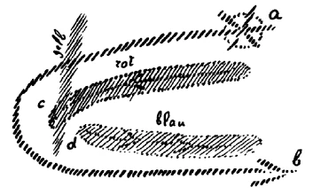
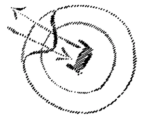
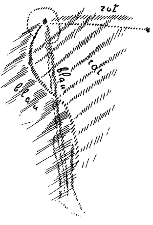
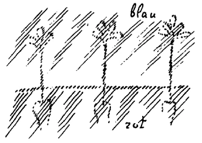

Wir werden heute fortfahren, einiges hinzuzutragen zu den Betrachtungen, die wir angestellt haben. Es war mir in dieser Zeit viel darum zu tun, begreiflich zu machen, von welchen Bedingungen das menschliche Leben abhängt im einzelnen und in dem großen Zusammenhange. Sie haben gesehen, wie auch in den öffentlichen Vorträgen, die ich in dieser Zeit halten durfte, es mir darauf ankam, gerade jetzt auf diejenigen Probleme der Geisteswissenschaft hinzuweisen, welche für das Begreifen der Menschheit notwendig sind, um aus gewissen Vorstellungskreisen herauszukommen, in die sich die Menschheit gewissermaßen über den ganzen Erdkreis hin eingesponnen hat und die letzten Endes doch mit zu den Veranlassungen der jetzigen katastrophalen Ereignisse gehören. ^s0ztwl

Vor allen Dingen wird es sich darum handeln, daß die Menschen einsehen lernen müssen, wo die Grenze zwischen der sogenannten physischen und der geistigen Welt liegt. Diese Grenze liegt eigentlich mitten im Menschen drinnen. Gerade dieser Satz ist wichtig für das Verständnis der Welt: daß wir die Grenze zwischen der physischen und geistigen Welt in dem Menschen selber drinnen sehen. Die naturwissenschaftliche Denkungsweise, deren große Bedeutung für die Gegenwart und die Zukunft ich vom Gesichtspunkt der Geisteswissenschaft oftmals hervorgehoben habe, ist aber jetzt, wo sie noch mehr oder weniger immer an ihrem Ausgangspunkte steht, eigentlich dazu geeignet, über gewisse wichtige Lebenswahrheiten, man könnte schon sagen, zunächst sogar Finsternis zu verbreiten. ^2jvaiy

Machen wir uns nur klar, daß sich die Zeitentwickelung eigentlich heute erst dazu anschickt, das naturwissenschaftliche Denken allmählich in die Welt- und Lebensanschauungen ganz einzuführen. Heute beschäftigen sich — in einer oftmals haarsträubend dilettantischen Weise — gewisse Monisten- oder andere Vereine damit, naturwissenschaftliche Weltanschauung dem Allgemeinbewußtsein zuzuführen. Allein dies ist ja nur der eine Weg, durch den allmählich dieses naturwissenschaftliche Denken in die Menschenseele fließt. Der viel wirksamere, einschneidendere Weg ist der durch die Publizistik. ^fxkrt5

Nicht umsonst, sondern durchaus innerlich zusammengehörig fallen in die Menschheitsentwickelung der Einschnitt der neueren naturwissenschaftlichen Denkungsweise und die Erfindung der Buchdruckerkunst zusammen. Denn dasjenige, was bisher durch den Druck als Ursprüngliches in die Menschheit eingegangen ist, selbstverständlich abgesehen von dem, was man von früher schon Dagewesenem gedruckt hat, ist im wesentlichen aus naturwissenschaftlichem Bewußtsein hervorgegangen. Ich meine, das Neue ist aus naturwissenschaftlichem Bewußtsein hervorgegangen, und vor allen Dingen die Art und Weise, in die man die Gedanken eingefangen hat, ist aus naturwissenschaftlicher Denkweise hervorgegangen. ^1opvx4

Nun werden natürlich Theologen gegenüber einem solchen Ausspruch sagen: Ja, haben wir denn nicht auch unsere theologische Weisheit und alle möglichen frommen Dinge in den letzten Jahren und Jahrzehnten und Jahrhunderten gedruckt? — Ja, das ist allerdings wahr, aber wozu hat es geführt? Diese Art und Weise, wie unter der Flagge des Druckes das geistige Leben sich eingelebt hat in die Seelen der Menschen, hat dazu geführt, daß nach und nach ganz geschwunden ist auch aus dem Gebiete des religiösen Bewußtseins das spirituelle Element. Und selbst aus dem Christus Jesus, das wissen Sie ja, hat man unter dem Einfluß der naturwissenschaftlichen Denkweise den «schlichten Mann aus Nazareth» gemacht, den man zwar versucht in der verschiedensten Weise zu charakterisieren, der aber doch eigentlich schon dabei angelangt ist, mit den andern großen Persönlichkeiten der Welt in eine Linie gestellt zu werden, wenn auch vorläufig noch auf einem besonderen Gipfel. Das eigentlich Geistige, das mit dem Mysterium von Golgatha verknüpft ist, das ist nach und nach dahingeschwunden, wenigstens für diejenigen, die da glauben, mit der Zeitenbildung vorwärtsgeschritten zu sein. ^7s3rxd

Ich sagte, die naturwissenschaftliche Denkweise hat zunächst geradezu mitwirken müssen zu einer gewissen Verfinsterung, zu einer Unterstützung desjenigen, was nun seit 1879 durch die Geister der Finsternis in das menschliche Denken hineingebracht werden soll. Und auf naturwissenschaftlichem Gebiete zeigt sich die Sache in einer recht raffinierten Art, raffiniert deshalb, weil der naturwissenschaftlich nicht nur Durchgebildete, sondern der naturwissenschaftlich fachmännisch Gebildete, wenn er heute mitarbeitet an der allgemeinen Bildung der Zeit, an der Gestaltung der Weltanschauung, gar nicht anders kann, so wie heute die Wissenschaft einmal ist — lassen Sie mich das triviale Wort anwenden -, als «aus bestem Wissen und Gewissen heraus» so zu wirken, daß durch die Popularisierung der naturwissenschaftlichen Denkweise der Mensch geradezu abgebracht wird davon, den Blick hinwerfen zu können auf die Grenze, die in ihm selber ist zwischen der physischen Welt und der geistigen Welt. Es wird eine Zukunft des Menschendenkens anbrechen, es ist fürchterlich, daß dies heute gesagt werden muß, fürchterlich für die nach einer gewissen Richtung heute Gebildeten, da werden gewisse Vorstellungen, die heute in der Wissenschaft herrschen — und die zwar nicht im populären Bewußtsein sehr vorhanden sind, aber auf das populäre Bewußtsein dadurch wirken, daß man heute die Wissenschafter als, verzeihen Sie, Autoritäten ansieht -, gewisse Vorstellungen der Gegenwart werden vor einem künftigen Zeitbewußtsein geradezu komisch anmuten müssen. ^jgjynq

Auf eine Vorstellung habe ich öfters hingewiesen, öffentlich nun auch in meinem Buch «Von Seelenrätseln»: Es ist eine gangbare naturwissenschaftliche Vorstellung heute, daß man im Nervensystem - bleiben wir zunächst beim Menschen, aber in ähnlicher Weise, nur in ähnlicher Weise ist das auch beim Tiere gültig -, daß man im Nervensystem unterscheidet zwischen den sogenannten sensiblen, sensitiven Nerven — Sinnesnerven, Wahrnehmungsnerven - und motorischen Nerven. Schematisch kann das nur so dargestellt werden, daß zum Beispiel irgendein Nerv, sagen wir ein Tastnerv, die Tastempfindung hineinträgt bis zum Zentralorgan, sagen wir bis zum Rückenmark; da mündet dasjenige, was da aus der Peripherie des Leibes geleitet wird, in einem Horn des Rükkenmarks. Und dann geht von einem andern Horn, Vorderhorn, der sogenannte motorische Nerv aus, da wird wiederum weitergeleitet der Willensimpuls (siehe Zeichnung S. 12). ^5vkuj6

 ^a7wnbj

Beim Gehirn ist das nur komplizierter dargestellt, so etwa, wie wenn die Nerven eine Art Telegraphendrähte wären. Der Sinneseindruck, der Hauteindruck wird bis zum Zentralorgan geleitet, dort wird gewissermaßen der Befehl erteilt, daß eine Bewegung ausgeführt werden soll. Eine Fliege setzt sich irgendwo auf einen Körperteil, das macht einen Eindruck, das wird geleitet bis zum Zentralorgan; dort wird der Befehl gegeben, die Hand bis zu der Stelle zu erheben und die Fliege wird weggejagt. Es ist eine, schematisch angedeutet, sehr gangbare Vorstellung. Künftigen Zeiten wird diese Vorstellung außerordentlich komisch erscheinen, denn sie ist ja nur komisch für denjenigen, der die Tatsachen durchschaut. Aber es ist eine Vorstellung, von der heute ein großer Teil der fachmännischen und fachmännischesten Wissenschaft beherrscht ist. Sie können das nächstbeste Elementarbuch, das Sie über solche Dinge unterrichtet, aufschlagen, und Sie werden finden, man habe zu unterscheiden zwischen Sinneswahrnehmungsnerven und motorischen Nerven. Und man wird besonders das urkomische Bild von den Telegraphenleitungen — wie der Eindruck bis zum Zentralorgan geleitet und dort der Befehl gegeben wird, daß die Bewegung entstehe gerade in populären Werken heute noch immer sehr verbreitet finden können. ^poap9c

Die Wirklichkeit ist allerdings schwieriger zu durchschauen, als die an die primitivsten Vorstellungen erinnernden Vergleichsvorstellungen von den Telegraphendrähten. Die Wirklichkeit kann nur durchschaut werden, wenn sie eben mit Geisteswissenschaft durchschaut wird. Daß ein Willensimpuls erfolgt, hat mit einem solchen Vorgange, den man in kindischer Weise so ausdrückt, als ob da irgendwo in einem materiellen Zentralorgan ein Befehl erteilt würde, wirklich gar nichts zu tun. Die Nerven sind nur da, um einer einheitlichen Funktion zu dienen, sowohl diejenigen Nerven, die man heute sensitive Nerven nennt, wie auch diejenigen, die man motorische Nerven nennt. Und ob nun im Rückenmark oder im Gehirn der Nervenstrang durchbrochen ist, beides weist auf dasselbe hin; im Gehirn ist er nur in komplizierterer Weise durchbrochen. ^4646e2

Diese Durchbrechung ist nicht deshalb da, damit durch die eine Hälfte, wenn ich so sagen darf, von der Außenwelt etwas zum Zentralorgan geleitet wird und dann vom Zentralorgan durch die andere Hälfte, nachdem sie in einen Willen umgewandelt worden ist, weitergeleitet würde. Diese Unterbrechung ist aus einem ganz andern Grunde da. Daß wir unser Nervensystem so gebaut haben, daß es in dieser Regelmäßigkeit durchbrochen ist, hat seinen Grund darin: An der Stelle, wo unsere Nerven durchbrochen sind, da liegt im Abbilde im Menschen allerdings nur im körperlichen Abbilde einer komplizierten geistigen Wirklichkeit — die Grenze zwischen physischem und geistigem Erfahren, physischem und geistigem Erleben. Sie ist allerdings im Menschen auf eine merkwürdige Weise enthalten. Sie ist so enthalten, daß der Mensch mit der ihm zunächstliegenden physischen Welt in eine solche Beziehung tritt, daß mit dieser Beziehung der Teil des Nervenstranges, der bis zu jener Unterbrechung geht, etwas zu tun hat. Aber der Mensch muß auch als seelisches Wesen eine Beziehung haben zu seinem eigenen physischen Leib. Diese Beziehung, die er zu seinem eigenen physischen Leib hat, ist durch den andern Teil vermittelt. Wenn ich eine Hand bewege, dadurch veranlaßt, daß ein äußerer Sinneseindruck auf mich gemacht worden ist, dann liegt der Impuls, daß diese Hand bewegt wird, vereinigt von der Seele mit dem Sinneseindruck, schematisch dargestellt, schon bereits hier (siehe Zeichnung, a). Und dasjenige, was geleitet wird, wird auf den ganzen sensitiven Nerven und den sogenannten motorischen Nerven entlang geleitet von a bis zu b. Das ist nicht so, daß der Sinneseindruck erst bis zu c geht und dann von da aus ein Befehl geht, damit b dazu veranlaßt werde - nein, wenn ein Willensimpuls stattfindet, lebt das Seelische schon völlig bei a und geht durch den ganzen unterbrochenen Nervenweg durch. ^gu0n3t

Es ist keine Rede davon, daß solche kindische Vorstellung, als ob die Seele da irgendwo säße zwischen den sensitiven und motorischen Nerven und wie ein Telegraphist die Eindrücke der Außenwelt empfangen und dann den Befehl aussenden würde, es ist keine Rede davon, daß diese kindische Vorstellung irgendeiner auch wie immer gearteten Wirklichkeit entsprechen würde. Diese kindische Vorstellung, die wir immer hören, nimmt sich recht sonderbar komisch aus neben der Forderung, man solle ja in der Naturwissenschaft nicht anthropomorphistisch sein! Da fordern nun die Leute, man solle ja nicht anthropomorphistisch sein und merken nicht, wie anthropomorphistisch sie sind, wenn sie Worte gebrauchen wie: Ein Eindruck wird empfangen, ein Befehl wird ausgegeben und so weiter. - Sie reden darauf los, ohne auch nur eine Ahnung davon zu haben, was sie alles für mythologische Wesen — wenn sie die Worte ernst nehmen würden — hineinträumen in den menschlichen Organismus. ^tcfvvf

Nun entsteht aber die Frage: Warum ist der Nervenstrang unterbrochen? — Er ist unterbrochen aus dem Grunde, weil wir, wenn er nicht unterbrochen wäre, nicht eingeschaltet wären in den ganzen Vorgang. Nur dadurch, daß gewissermaßen der Impuls hier an der Unterbrechungsstelle überspringt - der gleiche Impuls, wenn es ein Willensimpuls ist, geht schon von a aus -, dadurch sind wir selbst drinnen in der Welt, dadurch sind wir bei diesem Impuls dabei. Würde er einheitlich sein, würde hier nicht eine Unterbrechung sein, so wäre das ganze ein Naturvorgang, ohne daß wir dabei wären. ^xpkd7j

Stellen Sie sich denselben Vorgang, den Sie bei einer sogenannten Reflexbewegung haben, vor: Eine Fliege setzt sich Ihnen irgendwo hin, der ganze Vorgang kommt Ihnen gar nicht voll zum Bewußtsein, aber Sie wehren die Fliege ab. Dieser ganze Vorgang hat sein Analogon, sein ganz gerechtfertigtes Analogon auf physikalischem Gebiete. Insofern dieser Vorgang physikalische Erklärung herausfordert, muß diese Erklärung nur etwas komplizierter sein als ein anderer physikalischer Vorgang. Nehmen Sie an, Sie haben hier einen Kautschukball, Sie stoßen hinein, Sie deformieren den Kautschukball: das geht wieder heraus, richtet sich wieder her. Sie stoßen nochmals hinein; er stößt wieder heraus. Das ist der einfache physikalische Vorgang: eine Reflexbewegung. Nur ist kein Wahrnehmungsorgan eingeschaltet, nichts Geistiges ist eingeschaltet. Schalten Sie hier etwas Geistiges ein (innerer Kreis) und unterbrechen Sie hier (Zentrum), dann fühlt sich die Kautschukkugel als ein Eigenwesen. Die Kautschukkugel müßte dann allerdings, um sowohl die Welt wie sich zu empfinden, ein Nervensystem einschalten. Aber das Nervensystem ist immer da, um die Welt in sich zu empfinden, niemals irgendwie da, um auf der einen Seite des Drahtes eine Sensation zu leiten und auf der andern Seite des Drahtes einen motorischen Impuls zu leiten. ^7bu4sv

 ^h740zi

Ich deute dieses an aus dem Grunde, weil dies, wenn es weiter verfolgt wird, auf einen der zahlreichen Punkte hinführt, wo Naturwissenschaft korrigiert werden muß, wenn sie zu Vorstellungen führen soll, die einigermaßen der Wirklichkeit gewachsen sind. Die Vorstellungen, die heute herrschen, sind eben weiter nichts als solche Vorstellungen, die den Impulsen der Geister der Finsternis dienen. Im Menschen selber ist die Grenze zwischen dem physischen Erleben und dem geistigen Erleben. ^c4keg8

Dieses Stück des Nervs, das ich rot gezeichnet habe (Abb. S.12), dient im wesentlichen dazu, um uns hineinzustellen in die physische Welt, um uns Empfindung zu vermitteln innerhalb der physischen Welt. Das andere Stück des Nervs, das ich blau bezeichnet habe, dient im wesentlichen dazu, um uns selbst uns empfinden zu lassen als Leib. Und es ist kein wesentlicher Unterschied, ob wir eine Farbe außen bewußt erleben durch den Strang a-c, oder ob wir innerlich ein Organ oder eine Organlage oder dergleichen erleben durch den Strang d-b; das ist im wesentlichen dasselbe. Das eine Mal erleben wir ein Physisches, das nicht in uns zu sein scheint, das andere Mal erleben wir ein Physisches, das in uns ist, das heißt innerhalb unserer Haut. Dadurch aber sind wir eingeschaltet, daß wir bei einem Willensvorgang alles das erleben können, was nicht nur außen ist, sondern auch was innerlich an uns ist. Aber die Stärke der Wahrnehmung ist verschieden vermittelt durch den Strang a-c und durch den Strang d-b. Dasjenige, was eintritt, ist allerdings eine wesentliche Abschwächung der Intensität. Wenn wir eine Vorstellung mit einem Willensimpuls zusammen formen in a, so wird dieser Impuls von a aus weitergeleitet. Indem er von c auf d überspringt, schwächt sich das Ganze so ab für unser Bewußtsein, für unser bewußtes Erleben, daß wir das weitere, was wir nun in uns erleben, die Hebung der Hand und so weiter, nur mit der geringen Intensität des Bewußtseins erleben, die wir sonst auch im Schlafe haben. Wir sehen das Wollen erst wiederum, wenn die Hand sich bewegt, wenn wir wieder von einer andern Seite her eine Sensation haben. ^zhnnbp

Der Schlaf dehnt sich in der Tat anatomisch, physiologisch in das wache Leben fortwährend hinein. Wir stehen mit der äußeren physischen Welt in Verbindung und wachen eigentlich immer nur mit demjenigen Teil unseres Wesens, welcher bis zu der Unterbrechung der Nerven geht. Was jenseits der Unterbrechung der Nerven in uns selber liegt, das verschlafen wir auch am Tage. Das ist aber ein Vorgang, der noch nicht physisch ist in der jetzigen Phase der Erdenentwickelung, sondern noch in einer gewissen geistigen Höhe vor sich geht, wenn das auch vielfach zu tun hat mit den niederen Eigenschaften der Menschennatur. Aber ich habe hier schon öfter von dem Geheimnis gesprochen, daß, was im Menschen niedere Natur ist, gerade zusammenhängt mit den höheren Äußerungen gewisser geistiger Wesenheiten. ^1aq0yf

Würde man im Menschen alle diejenigen Stellen sammeln, wo Nervenunterbrechungen sind, und würde man das aufzeichnen, dann würde man zeichnungsgemäß die Grenze bekommen zwischen dem Erleben in der physischen Welt und dem Erleben aus einer höheren Welt heraus. Daher kann ich auch folgendes Schema gebrauchen. Nehmen Sie einmal an - ich zeichne hier alle Nervenunterbrechungen schematisch auf —, nehmen Sie an, da wäre der Kopf und da wäre ein Bein. Nun nehmen wir an, von hier aus ginge ein sogenannter Eindruck, und hier wäre die Nervenunterbrechungsstelle «Gehen» erfolgt. Was real ist, ist dann dieses: hier ist alles dasjenige, was der Mensch durch den Nerv erlebt, wachend bei Tag erlebt; hier ist das, was der Mensch erlebt als einen unterbewußten Willen, auch im Wachen schlafend erlebt. Und alles dasjenige, was nun unter der Nervenunterbrechungsstelle liegt, wird von der geistigen Welt heraus direkt gebildet, geschaffen. ^preoho

 ^6dm7pf

Die Vorstellungen werden Ihnen, wenn Sie sie das erste Mal hören, vielleicht etwas schwierig sein. Allein sie sollen in Ihnen auch die Vorstellung hervorrufen, daß man ohne gewisse Schwierigkeiten in die intimeren Dinge der Erkenntnis des Menschen doch nicht hineinkommen kann. ^q9lgb9

Wenn Sie das so ansehen, daß hier (rot) alles dasjenige ist, was den Menschen mit der physischen Welt verbindet, unter dieser Grenze alles dasjenige, was den Menschen mit einer geistigen Welt verbindet, die nur heute ein untergeordnetes physisches Abbild hat in ihm — wenn Sie dies ins Auge fassen, dann können Sie eine andere Vorstellung damit verbinden. Diese andere Vorstellung, die Sie damit verbinden sollen, ist die folgende: Denken Sie sich einmal die Pflanzenwelt. Die Pflanzen wachsen aus der Erde heraus; aber sie würden nicht aus der Erde herauswachsen, wenn sie nicht aus dem Kosmos herein Kräfte empfingen, Kräfte, die mit dem Sonnenleben innig zusammenhängen, welche alles das in Empfang nehmen, was von der Erde heraus gekraftet wird. Lesen Sie, um das besser zu verstehen, noch einmal die Abhandlung über «Das menschliche Leben vom Gesichtspunkte der Geisteswissenschaft». Zum Leben der Pflanzenwelt gehört dieses ganze Kosmische, das von dem Kosmos herein vom Sonnenleben kommt, zusammen mit dem, was von der Erde herauf kommt. ^f46wdm

 ^qbzpv9

Dieses Zusammenwirken aber des Kosmischen mit demjenigen, was tellurisch, was irdisch ist, das gehört überhaupt zum Leben, zum Dasein innerhalb der physischen Welt, so wie wir sie aufzufassen haben. Und dieselben Kräfte, die unter diesem Strich (siehe Zeichnung) aus der Erde heraus auf die Pflanze wirken, zusammen mit der Samenkraft der Pflanze - der Same wird ja auch in die Erde hineingetan -, diese selbe Masse von Kräften derselben Art, die müssen Sie hier suchen, hier, wo die roten Striche sind. Diesseits der Grenze, die ich schematisch angedeutet habe, müssen Sie meinetwillen die Kräfte suchen, die Sie sonst durch die Wurzeln von der Erde kommend für die Pflanzen suchen. ^q4p8v9

Der Mensch nimmt durch seine Augen, durch seine Ohren, namentlich durch seine Haut, von der Erde in verfeinerter Art dasjenige auf, was die Pflanze durch ihre Wurzeln aus dem Boden der Erde aufsaugt. Die Pflanze ist ein Erdenwesen durch ihre Wurzeln. Der Mensch ist ein Erdenwesen durch seine Nerven und durch dasjenige, was er als das Irdische, das Tellurische aufnimmt durch seine Lungen, durch seine Nahrung, die er von der Erde hereinbekommt. Alles das, was für die Pflanze von der Erde kommt - nur daß die Pflanze die Wurzeln in die Erde hineinversenkt -, nimmt der Mensch auf durch seine Organe, nur daß er das in verfeinerter Weise aufnimmt, die Pflanze gröber durch die Wurzeln. ^sutbih

Aber die Pflanze nimmt noch andereKräfte auf. Die Pflanze nimmt die Kräfte auf, welche ihr aus dem Sonnenreiche, aus dem himmlischen Reiche - räumlich-himmlischen Reiche -, aus dem Kosmos zukommen. Dieses Gebiet habe ich blau schraffiert: das sind die Kräfte, welche die Pflanze aus dem Kosmos aufnimmt. Diese Kräfte sind von derselben Art, wie die blau schraffierten Kräfte jenseits der Grenze, die ich angegeben habe. Der Mensch zieht aus seinem Leibe heraus das, was die Pflanze aus dem Kosmos hereinzieht. Von der Erde zieht der Mensch verfeinert diejenigen Kräfte und Substanzen, welche die Pflanze durch ihre Wurzeln vergröbert aus dem Boden zieht. Aus seinem Leibe heraus zieht der Mensch dieselben Kräfte und Substanzen vergröbert, welche die Pflanze verfeinert aus dem Kosmos zieht. Denn so, wie er sie heute aus dem eigenen Leibe herauszieht, so sind sie nicht als Kräfte unmittelbar gegenwärtig im Kosmos vorhanden, sondern sie sind so vorhanden gewesen während der alten Mondenzeit. Von dieser hat sie der Mensch bewahrt. Der Mensch nimmt durch das, was jenseits dieser Grenze im hier gezeichneten blauen Teile enthalten ist, nicht unmittelbar aus der Gegenwart wahr, sondern aus dem, was er durch die Erbschaft der alten Mondenzeit bewahrt hat. Er hat das Kosmische einer alten Zeit in die Gegenwart hereingetragen. In seinem Leib hat der Mensch die Mondenverhältnisse aufbewahrt. Und so sehen Sie, daß wir in einer gewissen Weise kosmisch sind; sogar so mit dem Kosmos zusammenhängen, daß wir in uns tragen ein Abbild desjenigen, was der Kosmos draußen schon überwunden hat. ^gjkpsp

Wiederum ein Beispiel für das, was ich das letzte Mal hier angeschlagen habe: daß nichts dienlich sein wird, wenn man nur so vom allgemeinen, verschwommenen, nebelnden Standpunkte aus davon redet, daß der Mensch wiederum ein kosmisches Empfinden oder kosmische Vorstellungen in sich aufnehmen müsse. Diese Dinge haben nur Wert, wenn sie völlig konkret an den Menschen herantreten, wenn wirklich gewußt wird, wie die Dinge liegen, wie sich die Dinge verhalten. Dadurch wird dasjenige, was heute nur ein Probieren ist, eben auf eine gesunde, wirkliche gesunde Grundlage gestellt. Und wenn man weiß, wie alles das, was jenseits der Nervenunterbrechungen im Innern des menschlichen Leibes liegt, mit dem mondartigen Wesen zusammenhängt, dann wird man herausfinden können aus den Verwandtschaften heraus, welche krankmachenden oder heilenden Kräfte im Kosmos und im Erdenleben zu finden sind. Und wenn man wissen wird, in welcher Weise das, was diesseits der Grenze liegt, so zusammenhängt mit den Erdenverhältnissen, nur im verfeinerten Sinne, wie die Pflanze durch ihre Wurzeln mit den Bodenverhältnissen zusammenhängt, dann wird man die Beziehung zwischen Krankheit und Gesundheit und zwischen dem Wesen gewisser Pflanzen wirklich in bewußter Art auffinden können. ^1qv5yk

Heute sind die Dinge ein Probieren. Auf gesunde Grundlage muß zuerst das menschliche Erkennen gestellt werden, und dann wird auf gesunde Grundlage auch gestellt werden können, was der Mensch an Begriffen und Vorstellungen entwickelt, um das soziale, das sittliche, das pädagogische, das politische Leben irgendwie mit seinen eigenen Vorstellungen zu regeln, durchdringen zu können, ihm eine Struktur verleihen zu können. ^g73gtp

Wir machen auf vielen Gebieten die Wahrnehmung, daß gerade diejenigen, die naturwissenschaftlich groß, fachmännisch gediegen denken, ganz gräßlich zu fabulieren, zu schwätzen anfangen, wenn sie ihre gewohnten Vorstellungen übertragen auf das Gebiet des sozialen Lebens. Aber dieses Gebiet des sozialen Lebens ist ja nicht ein ganz selbständiges Gebiet. Der Mensch steht darinnen mit seiner physischen, seelischen, geistigen Natur, und man kann die Dinge nicht voneinander trennen. Und es darf nicht bei der Tatsache bleiben, daß die Menschheit auf dem sozialen Gebiet naturwissenschaftlich dumm gemacht wird, damit sie auf dem sozialen Gebiet nur zu schwätzen vermag. ^phgwy4

Man kann heute ohne Schwierigkeit leicht nachweisen, wie gediegene Naturforscher ins Schwätzen hineinkommen, wenn sie die Grenze zwischen Naturwissenschaft und dem geistigen Leben überschreiten. Besonders Mediziner sind auf diesem Gebiet außerordentlich produktiv im Hervorbringen von allerlei Geschwätz, wenn es sich darum handelt, mit den Vorstellungen, die auf naturwissenschaftlichem Gebiete heute gewonnen werden, ins geistige Gebiet herüberzugehen. Man braucht nur irgend etwas herauszugreifen. Greift nur hinein ins volle Menschenleben - wo ihr es nur anfaßt, ist es in dieser Beziehung heute konfus. ^0rglig

Da habe ich zum Beispiel eine Broschüre: «Die Schädigungen der Nerven und des geistigen Lebens durch den Krieg», von einem ausgezeichneten Mediziner. Ich will gar nicht, um Ihr Vorurteil nicht zu erregen, sagen von einem wie ausgezeichneten Mediziner. Aber dieser ausgezeichnete Mediziner, er betrachtete nun dieses Nervensystem, über das die Naturwissenschaft ja eigentlich nicht einmal einen Schimmer von einer richtigen Vorstellung hat - nach den paar Andeutungen, die ich heute gegeben habe, können Sie das sehen -, er betrachtete nun dieses Nervensystem, wie es malträtiert wird durch die gegenwärtigen Kriegsverhältnisse. Ja, man braucht nur an das Allerprimitivste zu denken und man kann darauf hinweisen, wie das wirklich vernünftige Denken aufhört, wenn herübergeleitet werden die naturwissenschaftlichen Vorstellungen auf das, was mit dem geistigen Gebiete, ich will nur sagen, etwas zu tun hat, gar nicht einmal noch das geistige Gebiet selber ist. Nicht wahr, wenn man so etwas bespricht wie «Die Schädigungen der Nerven und des geistigen Lebens durch den Krieg», dann hat man die Notwendigkeit vor sich, dasjenige, was angeblich in den Nerven vor sich gehen soll, auszudrücken durch allerlei vom geistigen Leben Entnommenem - natürlich von dem geistigen Leben, das hier auf dem physischen Plane verläuft -, durch allerlei Vorstellungen, die diesem geistigen Leben entnommen sind. ^7ftwfb

Nun gibt zum Beispiel dieser Herr hier die Vorstellung - die unter gewissen Verhältnissen des abnormen Nervenlebens berechtigt sein soll -, die Vorstellung von «überwertigen Ideen». Überwertige Ideen sind ein Symptom für kranke Nerven. Überwertige Ideen - was ist eine überwertige Idee? Wenn man einen solchen Begriff aufstellt, dann muß man sich klar sein, daß ein solcher Begriff lebenswirklich sein muß. Aber was ist eine überwertige Idee? Eine überwertige Idee ist für jenen Mann etwas, das entsteht, wenn die Empfindungs- und Gefühlsbetonung der Idee zu stark ist, wenn sie einseitig ist. Allerlei so vage Vorstellungen bringt er eben heran. Ich kann Ihnen natürlich keine bestimmte Vorstellung davon geben. Schreiben Sie, wenn ich das nicht bestimmt definiere, es nicht der Geisteswissenschaft zu, denn ich muß ja referieren. Eine überwertige Idee entsteht zum Beispiel, wenn man, durch den Krieg veranlaßt, eine fremde Nation zu viel haßt. Eine «wertige Idee» ist die richtige Vaterlandsliebe. Aber diese richtige Vaterlandsliebe wird, wenn das Nervensystem irritiert ist, überwertig. Man liebt nicht nur sein Vaterland, sondern man haßt die andern Völker: jetzt ist dieIdee überwertig geworden. Die wertige Idee ist gesund, und man muß aus der wertigen Idee schließen, daß auch die Nerven gesund sind. Wenn aber die Idee überwertig ist, so sind auch die Nerven geschädigt. ^hbxtci

Trifft man irgendwo die Wirklichkeit, wenn man auf der einen Seite so einen Nervenvorgang charakterisiert, auf der andern Seite eine Idee, die nun eine gewisse Eigenschaft haben soll? Sie soll überwertig als Idee sein. Auf der einen Seite ist der Nervenvorgang, auf der andern Seite ist Ideeüberwertiges. Die Leute würden gut tun, solche Dinge immer zu Ende zu denken, denn ein Gedanke zeigt sich nur dann in seiner Richtigkeit oder Unrichtigkeit beziehungsweise in seiner Wirklichkeitsgemäßheit oder Wirklichkeitsungemäßheit, wenn man ihn zu Ende denkt. Eine überwertige Idee wäre es, wenn ich mir vorstellen würde, ich wäre der König von Spanien. Nicht wahr, ganz zweifellos wäre das eine überwertige Idee. Aber jene Idee brauchte durchaus nicht überwertig zu sein, wenn ich es wirklich wäre. Dann wäre mein Nervensystem ganz gesund und ich hätte dieselbe Idee. Die Idee hat denselben Inhalt. Die Idee als solche ist also doch wohl nicht überwertig, denn sonst müßte man den König von Spanien als krank ansehen in seinem Nervensystem, weil er denkt, er wäre der König von Spanien, nicht wahr? Also auf diesen Zusammenhang kommt es überhaupt gar nicht an. Dennoch wird herumgeschwätzt über diese Dinge. Und man redet nicht nur herum, sondern man bildet auch Begriffe, Definitionen aus und so weiter, und man kommt dann zu Merkwürdigem, was nicht mehr ist als Geschwätz. ^ajrw27

Denn nun hat der gute Herr diesen Begriff von überwertigen Ideen ausgebildet. Die Überwertigkeit der Idee ist nun das Symptom für das unrichtige Nervenleben. Na, schön! Aber seinem Unterbewußten ist nicht recht wohl dabei, weil er unterbewußt doch fühlt: während er die ganze Sache von der Überwertigkeit der Ideen den Leuten vorträgt, haben die wiederum allerlei unterbewußte Ideen von dem, daß die Sache doch nicht recht stimmt. Bei den Zuhörern bleibt die Sache heute selbstverständlich unterbewußt, denn der Herr ist eine Autorität — verzeihen Sie! -, da dürfen die Eindrücke nicht ins Bewußtsein dringen. «Denn mit der Bezeichnung der «Überwertigkeit soll nicht nur die an sich lebhafte hohe Bewertung der betreffenden Vorstellungen, sondern eben auch ihre «Überwertung» im Verhältnis zur realen Bedeutung der ihnen wirklich zugrunde liegenden Tatsächlichkeiten ausgedrückt werden. Die überwertige Idee beherrscht dasBewußtsein so sehr, daß neben ihr nicht genügend Platz für andere, objektiv ebenfalls berechtigte Ideen vorhanden ist. Darum werden letztere verdrängt, verlieren ihre Wirksamkeit im Bewußtsein und ihren Einfluß auf die Beschränkung und Zügelung der überwertigen Vorstellungen. So entsteht die einseitige Übertreibung in der Urteilsbildung, die einseitige Richtung der Willensbestrebungen, die Abkehr von allen andern Gedankenkreisen, die mit dem Zentrum der überwertigen Ideen nicht unmittelbar zusammenhängen.» So wie wenn man sagt: Die Armut kommt von der Pauvret€ so ungefähr ist es! ^52yxaj

«Daher erscheint dem ruhig urteilenden Beobachter das nervös erregte Bewußtsein stets als etwas Unvernünftiges, als etwas geistig Haltloses, und es entspricht daher durchaus der Tatsächlichkeit, wenn der ruhige Zuschauer den nervös erregten Menschen mit den Worten: ‹So nimm doch Vernunft an, so sei doch vernünftig!›, wieder auf die rechte Bahn des Denkens und Urteilens zu bringen versucht.» ^ovk2vh

Nun also hat er von der Überwertigkeit der Ideen gesprochen, von ihrem Zusammenhang mit dem Nervensystem. Aber nun wird ihm etwas schwül im Unterbewußtsein, denn die Geschichte ist ja nur ein Gerede, und es paßt schlecht. Na, da setzt er denn die Rede fort: «Wir dürfen aber die «überwertige Idee» nicht ohne weiteres jeder überhaupt gefühlsbetonten und ungewöhnlich lebhaften Vorstellungsweise gleichstellen. Auch alles Edle und Hohe, was den Menschengeist bewegt und ihn zu großen Taten befähigt, was Hingabe und Begeisterung für eine große Tat und für die Anspannung aller Kräfte zur Erreichung eines großen Zieles erweckt, auch dies entspringt nur aus großen Ideen, die den Geist beherrschen und ihm die Kraft und Ausdauer des Willens geben, ohne die ein zielbewußtes Handeln nicht möglich ist.» ^krsj44

Überwertige Ideen, sie zerstören das Nervensystem, sind wenigstens ein Symptom dafür; aber alles Hohe und Edle ist eigentlich ebenso. Es gibt keinen rechten Unterschied. Aber er muß wenigstens erwähnen, daß die Geschichte eigentlich ebenso ist. ^bi7ytz

«Überall in der Geschichte des Einzelnen und in der Geschichte der Völker sehen wir die großen Taten vollbracht unter dem Einfluß einer großen leitenden Idee, die ihren 'Träger unaufhaltsam und auf der gleichen Bahn und in derselben Richtung festhielt und vorwärts trieb, ihn erst befähigte zu jener unermüdlichen Ausdauer, die trotz Hindernissen und Widerständen das einmal erkannte und erstrebte Ziel erreichen konnte. Was wäre aus Galilei, aus Richard Wagner, aus Bismarck und aus vielen andern großen Männern geworden ohne die Schwungkraft einer großen leitenden Idee, die den Geist jahre- und jahrzehntelang trotz aller Kämpfe und Widerstände in eine bestimmte Richtung des Wollens vorwärts trieb!» - die also «überwertig» war, die ganz ausgesprochen «überwertig» war! ^3p3t4j

Da wird manchmal solch ein Anflug von Ehrlichkeit vollzogen. Es gibt eine naturwissenschaftliche Richtung, die alle Genies zugleich für etwas verrückt erklärt, weil ja auf diesem Boden so ein richtiger Unterschied zwischen der Genialität und der Verrücktheit ohnedies nicht herauszufinden ist. Und ich habe Ihnen gesagt, daß es heute auch schon Werke gibt, die den Christus Jesus als einen pathologisch Kranken hinstellen, so daß eigentlich das ganze Christentum der Ausfluß der Tatsache ist, daß einmal einer in Palästina, der den Namen Jesus geführt hat, nicht recht gescheit war. Das ist heute Gegenstand von verschiedenen ernst gemeinten, als wissenschaftlich angesehenen Persönlichkeiten. ^nsxhvz

Die Leerheit solchen Denkens, die tritt manchmal in krasser Art zutage, so wenn der betreffende Herr dann gleich fortfährt: «Aber darin liegt die Tragik des Menschengeistes, daß die Vorstellungen, welche mit größter Stärke das Bewußtsein erfüllen, nicht immer die richtigen sind» — sehr tief ist hier die Tragik des Menschengeistes erklärt, außerordentlich tief! - «und sich nicht immer einfügen in den geordneten Zusammenhang der äußeren Welt.» ^9dwzym

Nun haben wir es! Wie weit ist es von solchen Vorstellungen zu der Erkenntnis, die nur erreicht werden kann auf Grundlage von solchen Betrachtungen, wie wir sie hier anstellen. Gewiß, es kann in zwei Menschen dieselbe Vorstellungsmasse anwesend sein, nur ist sie das eine Mal, sagen wir luziferisch, das andere Mal ahrimanisch, das dritte Mal ist sie im Sinne der normalen Menschheitsentwickelung. Statt das inhaltsleere Wort «überwertige Ideen» zu bilden, muß der Begriff einer Geistigkeit eingeführt werden, wie die luziferische oder ahrimanische Geistigkeit, so daß man weiß: darauf kommt es an, daß man erkennt, ob der Mensch selbst will, oder ob ein anderes in ihm will. Aber davor schreckt natürlich solche angebliche Wissenschaft heute noch zurück. ^x352v1

Sehr nett werden dann die Dinge, wenn man erwarten will, daß nun wirklich etwas Substantielles vorgebracht wird: «Da nenne ich zunächst» - er will zunächst das angeben, wodurch sich gewisse nervöse Störungen beim Menschen ankündigen —, «da nenne ich zunächst dieselben Vorstellungen, welche auch bei der Nervosität des Einzelnen oft die größte Rolle spielen:» - er meint, beim heutigen Völkerwahn eben auch - «die Vorstellungen der Verzagtheit, der Sorge, des Kleinmuts, der Mutlosigkeit, des mangelnden Selbstvertrauens.» ^cs9gk8

Das sind also diejenigen Dinge, welche das gestörte Nervensystem charakterisieren beim nervösen Leben, das unter überwertigen Ideen steht. Verzagtheit, Sorge, Kleinmut, Mutlosigkeit, mangelndes Selbstvertrauen. Nicht wahr, solch ein Vortrag ist doch Mittel dazu, daß er irgendwie nützlich sein könnte. Denn um bloß die Luftwellen zu erregen, wird wahrscheinlich die betreffende Autorität nicht sprechen, sondern um irgendwie nützlich zu sein. Man sollte also erwarten, daß der betreffende Herr nun sagt, wie die Menschheit darüber hinauskommt, da er wie beim einzelnen Menschen, so auch in der Menschheit findet, daß heute Mutlosigkeit, Verzagtheit, Sorge, mangelndes Selbstvertrauen Symptome sind für die Nervenstörung. Man sollte glauben, daß er nun sagt, wie diese Geschichten zu beheben sind, wie man über diese Mutlosigkeit, Sorge, Verzagtheit, mangelndes Selbstvertrauen hinauskommt. Man sollte das voraussetzen. Er setzt es eigentlich auch voraus. Er sagt daher: «Und so kann, wenigstens zeitweise, in großen Volksschichten jene mutlose unzufriedene Stimmung einreißen, die wir mehr zu fürchten haben als alles andere. Denn sie führt zum Nachlassen kräftiger Willensregungen, zur Lockerung der festen einheitlichen Zielstrebigkeit, zur Schwächung der Energie und Ausdauer.» ^9s1c3b

Nun erwartet man also etwas, nicht wahr? Da sagt er: «Nicht nervös werden heißt daher in erster Linie Mut, Zuversicht und Vertrauen auf die eigene Kraft und das als richtig erkannte Handeln nicht verlieren.» ^erxvvv

Na, schön, jetzt haben wir es. Man ist nervös, wenn man die Sorge, Mutlosigkeit, Verzagtheit, mangelndes Selbstvertrauen hat. Wie kriegt man es weg? Wenn man es nicht hat! Es ist ganz klar, nicht wahr, wenn man es nicht hat! ^jqnzgc

Diese Nichtigkeit des Denkens überträgt sich auf das Substantielle auch in der Wissenschaft, und solche Autoritäten haben alles Material zur Verfügung, haben alles Material okkupiert, es konfisziert, wenn irgendwie versucht werden soll, mit Vernunft das Material zu bearbeiten — aber indem sie das Material bearbeiten, bearbeiten sie es mit nichtigen Gedanken. Das anatomische, physiologische, physikalische Material geht verloren. Nichts wird geschaffen, weil an demjenigen Tisch, wo das Nützliche für die Menschheit geschaffen werden soll, Leute stehen mit solchen Nichtigkeitsgedanken! Selbstverständlich kann bei der Sektion einer Leiche nichts herauskommen, wenn — verzeihen Sie den harten Gedanken - ein Hohlkopf seziert. Hier werden die Dinge schon sozial. Von diesem Gesichtspunkte aus müssen schon die Dinge angesehen werden. Und eine so vielversprechende Abhandlung, die einen Vortrag wiedergibt, endet auf solche Weise! ^xeidp9

Ich habe Ihnen das eine Beispiel angeführt: Nicht nervös werden heißt daher in erster Linie Mut, Zuversicht und Vertrauen nicht verlieren. Aber wenn heute der Durchschnittsleser solch eine Abhandlung in die Hand nimmt und liest: «Die Schädigungen der Nerven und des geistigen Lebens durch den Krieg», denkt er: Da kann ich aufgeklärt werden, denn das ist von Professor Dr. Soundso, Direktor der medizinischen Klinik in Soundso. - Nun ja, da ist er sich also klar darüber: jetzt wird er natürlich aufgeklärt. ^wz3uwo

Doch da steht zum Beispiel auf Seite 27, wo der Völkerhaß besprochen wird: «Aber freilich auch in uns selbst loderten ähnliche Erregungen auf, und wir empfanden es fast als eine erleichternde Genugtuung, nun auch unsererseits unserem Hauptfeinde mit ähnlichen Gesinnungen gegenüberzutreten. Und doch bedarf es nur geringer ruhiger Überlegung, um zu erkennen, daß dieser allgemeine Völkerhaß nur der Ausfluß einer krankhaften, überreizten Seelenstimmung ist, in welche die Volksmassen durch gegenseitige Anfeuerung, Aufhetzung und Nachahmung geraten sind.» ^2npdsj

Nun, wie ist also nach diesem Satz die Geschichte mit dem Völkerhaß eigentlich gekommen? Da sind Völker: A, B, C; eigentlich ist weder A noch B noch C irgendwie geeignet, von sich aus zu hassen, denn davon ist ja die ganze Geschichte nicht gekommen, sondern gekommen ist dieser allgemeine Völkerhaß durch eine krankhaft überreizte Seelenstimmung, in welche die Völkermassen durch gegenseitige Anfeuerung, Aufhetzung und Nachahmung geraten sind. Also der A kann es nicht; der B auch nicht; der C kann es auch nicht machen; aber was jeder nicht machen-kann, dazu reizen sie sich nun gegenseitig auf. Denken Sie sich, wie scharfsinnig der Gedanke ist! Ich erkläre etwas, ich habe vor mir A, B, C; das alles ist nicht geeignet zur Erklärung — aber sie machen es doch. Ich erkläre also etwas aus dem Nichts heraus auf die schönste Weise. Diese Dinge nehmen die Menschen in die Hand, lesen sie, werden nicht aufmerksam, daß das ein bloßer Unsinn ist. ^qk1lxf

Es ist schon nötig, auf solche Dinge hinzuweisen, denn sie zeigen, wie verrenkt, wie nichtig das Denken ist, das heute die Autorität in Anspruch nimmt. Natürlich, in der Wissenschaft, die sich auf das schon Vorhandene bezieht, da tritt das nicht so stark zutage, denn da kann man die Geschichte nicht kontrollieren. Aber so wie die Leute da in der Wissenschaft denken, so denken sie auch im sozialen, im pädagogischen, im politischen Leben. Und so hat sich das seit vier Jahrhunderten vorbereitet. So ist die Sache. Und so ist es gekommen, daß aus dem verrenkten, nichtigen Denken eben allmählich jene Impulse geworden sind, welche wir in den heutigen katastrophalen Ereignissen uns entgegentreten fühlen. Da muß man schon in das Tiefere der Sache eben durchaus hineinsehen. Und erst wenn die Menschen dann an die Oberfläche der Dinge kommen, da wo, ich möchte sagen, die Sache unmittelbar aktuell für den einzelnen Menschen wird und auch für die soziale Struktur ganzer Völker es werden kann, da wird die Sache ganz besonders gräßlich traurig! ^clgbyx

Nicht wahr, man hat die Aufgabe, auf der einen Seite die Dinge zu begreifen; man muß sie in ihrer gegenseitigen Abgegrenztheit kennenlernen, wenn man sie verstehen will. Will man ein solches Ereignis selbst wie den gegenwärtigen Krieg, das so kompliziert ist und heute eben wirklich in seinen Einzelheiten selbstverständlich nicht erfaßt werden kann vom physischen Plane aus, verstehen, muß man ihn, wie man sagt, auf seine Ursachen zurückführen und so weiter. Aber jeder glaubt daran: wenn er eine Sache auf seine Ursache zurückgeführt hat, wenn er sie in einer solchen Weise verstanden hat, so sei sie auch notwendig, hätte so geschehen müssen, wie sie da ist. Heute zum Beispiel merkt man nicht einmal im geringsten, daß das eine mit dem andern gar nichts zu tun hat. Dadurch daß man eine Sache in ihren Zusammenhängen erkennt, ist nicht etwa festgestellt, daß das Ereignis hat eintreten müssen, wie man sagt, daß es nicht hätte unterbleiben können. Derjenige, der versucht, sich in einer mehr oder weniger gescheiten Weise klarzumachen, warum der gegenwärtige Krieg hat kommen müssen, warum er nicht etwas ist, was ein paar Leute beschlossen haben, sondern was schon mit tieferen Ursachen in der Menschheitsentwickelung zusammenhängt, der geht dann oftmals befriedigt von dannen und sagt: Also habe ich begriffen, daß es gar nicht anders möglich war, als daß dieser Krieg hat kommen müssen! - Er ist selbstverständlich eine Notwendigkeit in dem Sinne, daß, wenn man seine Ursachen kennt, er aus diesen Ursachen, aus diesen konkreten Bedingungen mit aller Notwendigkeit sich entwickelt hat. Aber das besagt nicht, daß man daraus den Schluß ziehen darf: die Sache hat unmittelbar so kommen müssen, wie sie gekommen ist. Kein Ereignis, das in der Weltgeschichte auftritt, ist in diesem letzteren Sinne notwendig, obzwar es im ersteren Sinne notwendig ist - kein Ereignis ist in diesem letzteren Sinne notwendig. Jedes könnte anders sein; und jedes könnte auch nicht sein! ^h4qkiz

Und derjenige, der dann von der absoluten Notwendigkeit spricht, der könnte mit demselben Rechte sich überlegen: Ich möchte gerne wissen, wann ich sterben werde. Ich gehe also zu einer Versicherungsgesellschaft; die Leute rechnen aus, danach bestimmen sie die Versicherungspolicenhöhe: wieviel von einer gewissen Anzahl von Menschen nach einer gewissen Zeit gestorben sind und wie viele noch lebend sind. Danach werden die Quoten ausgezahlt. Ich gehe also einmal, erkundige mich bei einer Versicherungsgesellschaft; nach deren Ausrechnungen muß es sich ergeben, ob ich nun 1920 schon gestorben sein werde. ^iigf56

Das ist natürlich ein absoluter Unsinn. Aber derselbe Unsinn ist es, wenn man die Notwendigkeit eines Geschehens herleiten will aus dem andern, dem Begreifen der Ursache, die zu diesem Geschehen führen muß. Und hiermit schlage ich ein Thema an, das allerdings nicht leicht ist, aus dem Grunde, weil gerade auf diesem Gebiete die allerverrenktesten Ideen herrschen, weil auf diesem Gebiete auch heute noch nicht sehr viel Wille besteht, sich über die Dinge klarzuwerden. ^wm4llz

Die Sache ist diese: Man muß, wenn man sich gerade über die Frage klarwerden will, die hiermit angeschlagen ist, ins Auge fassen, daß, wenn irgend etwas eintritt, dieses unter dem Einfluß von gewissen Bedingungen eintritt. Man kommt in der Reihe der Bedingungen immer zu einem Punkte, wo in der Welt Anfänge, richtige Anfänge sind. Wenn Sie heute ein Bäumchen sehen, das noch klein ist, so wissen Sie: in späterer Zeit wird es größer sein. Mit Notwendigkeit entwickelt sich die Größe des Bäumchens aus seiner Kleinheit heraus. Und Sie können nach einiger Zeit sagen: Es ist eine Notwendigkeit, daß dieses Bäumchen sich so entwickelt hat; ich konnte sehen, wie es sich mit Notwendigkeit entwickelte aus einem ganz kleinen heraus, vielleicht als es eben die ersten Triebkräfte aus der Erde hervor entwickelte. Wenn ich Botaniker bin, kann ich sehen, daß da mit Notwendigkeit ein großer Baum nach einiger Zeit entstehen muß. Wenn aber das Samenkorn nicht dort an jener Stelle hineingefallen wäre, wie dann? Vielleicht hat es ein Mensch hineingetan. Wenn er es nicht getan hätte, dann wäre da ein Punkt, wo die Notwendigkeit nicht eingeleitet worden wäre. Nun aber muß da die Notwendigkeit beginnen. Und, sagen wir, Sie haben hier eine mächtige Eiche - sie ist ja nicht in Wirklichkeit da -, Sie schauen sie an und bewundern sie. Diese Eiche war selbstverständlich einmal ein kleines Bäumchen, sie hat sich mit Notwendigkeit aus einem kleinen Bäumchen entwickelt. Aber nehmen Sie an, ein nichtsnutziger Bube oder — pardon, um nicht unhöflich zu werden - ein nichtsnutziges Mädchen wäre, als das Bäumchen noch ganz klein war, dahin gekommen, wo das kleine Bäumchen stand und hätte es ausgerissen: durch dieses Ausreißen hätte sich jene ganze Notwendigkeit nicht ergeben. Auch in negativer Weise können Sie die Notwendigkeit wegnehmen. ^50f2x4

Anfangspunkte, wo die Notwendigkeiten beginnen, stellen sich dem wirklichkeitsgemäßen Denken ein, das ist das Wesentliche. Aber zu diesen Anfangspunkten kommt man nicht, wenn man nur den äußeren Verlauf der Tatsachen betrachtet. Man kommt nur zu ihnen, wenn man die geistige Grundlage wenigstens erfühlen kann. Denn geradeso wie Sie hier einen Rosenstrauß haben und wie der, wenn Sie ihn vorstellen, für den Abstraktling eine Vorstellung gibt, welche Wirklichkeit abbildet - denn der Rosenstrauß ist ihm wirklich, und seine Vorstellung bildet Wirklichkeit ab -, für den Okkultisten ist der Rosenstrauß, wenn er ihn vorstellt, gar nichts Wirkliches, weil der Rosenstrauß nicht existiert; die Rosen können nur existieren, wenn sie mit der Wurzel zusammen in dem Erdboden sind und so weiter. Die wirklicheVorstellung ist nicht gegeben, wenn man von vornherein etwas Äußerliches nachbildet, sondern wenn man aus der Wirklichkeit heraus diese erlebte Vorstellung nachgebildet hat. Diese erlebte Vorstellung ergibt sich aber auch gegenüber der äußeren sinnlichen Wirklichkeit nur der geisteswissenschaftlichen Betrachtung. ^ovfb0u

Und so ergibt sich auch für ein weltgeschichtliches Ereignis nur dann eine gültige Vorstellung, wenn man geisteswissenschaftlich dieses weltgeschichtliche Ereignis überblicken kann. Da findet man, daß es in bezug auf seine Notwendigkeit allerdings sich verfolgen läßt. Man findet seine Verästelungen, seine Wurzeln in der Wirklichkeit drinnen. Aber nur mit diesem konkreten Verfolgen der Wurzeln ist etwas getan, nicht mit der allgemeinen Konstatierung von einer abstrakten Notwendigkeit. Wären aber zum Beispiel gewisse Ereignisse in den achtziger Jahren des 19. Jahrhunderts anders gewesen, dann wären die Ereignisse 1914 auch anders geworden. Aber darauf kommt es eben an, daß man nicht so wie die Historiker vorgeht: Jetzt geschieht etwas, das die Wirkung zum Vorhergehenden ist, das ist wiederum die Wirkung vom Vorhergehenden, dieses wiederum die Wirkung vom Vorhergehenden und so weiter. Da kommt man nicht nur bis zum Anfang der Welt, sondern noch weiter ins völlige Nichts hinunter. Da kugelt so eine Vorstellung hinter der andern daher. Darauf kann es nicht ankommen, sondern auf das konkrete Verfolgen dieser Sache, auf das wirkliche Einwurzeln. So wie die Pflanzenwurzel irgendwo anfängt, so fangen die Ereignisse auch irgendwo an. Keime werden gelegt im Laufe der Zeit. Wenn die Keime nicht gelegt werden, dann entstehen auch die Ereignisse nicht. Ich schlage damit ein Thema an, das ich selbstverständlich heute nicht erschöpfen kann. Wir werden am nächsten Sonntag über dieses Thema, welches ich im wesentlichen dadurch bezeichnen will: Trotz aller Betrachtung der Notwendigkeit ist kein einziges Ereignis absolut notwendig — noch zu sprechen haben. ^8fcqbh

Es ist wirklich notwendig, daß die Menschheit der Gegenwart auch der Gesinnung nach aus diesem furchtbaren Dogmatischen, das heute die sogenannte Wissenschaft durchzieht, herauskommt, daß die Dinge ernst genommen werden. Ich will Ihnen ein richtiges Beispiel anführen. Damit will ich dann die heutigen Betrachtungen abschließen. Ich habe in Zürich und in Basel versucht, klarzumachen, daß es ein Unsinn ist, die welthistorischen Ereignisse so hintereinander zu betrachten, als ob eines aus dem andern hervorgehe. Ich habe gesagt, es sei ein Unding, wenn ein Ereignis aus dem andern folge, nur so eins aus dem andern hervorgehend zu betrachten. Das sei so, wie wenn ich hier eine Lichtquelle habe, welche zuerst den Gegenstand a beleuchtet, dann den Gegenstand b beleuchtet, endlich den Gegenstand c beleuchtet. Da sehe ich in meiner Beobachtung zuerst a, dann b, dann c beleuchtet, wenn ich die Lichtquelle gar nicht wahrnehme. Jetzt würde ich einen Fehler machen, nicht wahr, wenn ich zuerst a beleuchtet sehe, dann b, und würde sagen, das b wird von a her beleuchtet; und wenn ich dann c beleuchtet sehe und würde sagen, das c wird von b her beleuchtet. Ich würde etwas ganz Unrichtiges sagen, denn die Beleuchtung von b und c hat gar nichts damit zu tun, sondern es wird von einer gemeinsamen Lichtquelle aus beleuchtet. Ich habe dieses Beispiel gebraucht, um die historischen Ereignisse zu erläutern. ^22fqwu

Nehmen Sie nun an, es würde jemand diesen Begriff, den ich damit gegeben habe, diese Idee nett finden. Es könnte sein, daß auch einmal ein auf anthroposophischem Boden gewachsener Begriff nett befunden würde. Es ist sogar in der letzten Zeit hie und da vorgekommen, daß gerade Gegner diese Begriffe genommen haben, um sie ihrerseits nun zu verwenden. Manche sind sogar Gegner geworden, weil so etwas moniert werden mußte. Also es könnte einmal sein, daß auch eine auf anthroposophischer Seite vorgebrachte Analogie nicht gerade Blödsinn wäre. Nehmen wir an, es griffe es jemand auf, aber er brächte es dann vor in einem andern Zusammenhang, als ich es vorgebracht habe; er brächte es dogmatisch vor - nicht wie ich symptomatisch —, mit einer andern Gesinnung, und ich hörte einen Vortrag, in dem er sagte: Es wird ganz falsch die Aufeinanderfolge von Ursache und Wirkung dargestellt, wenn man immerfort sagt, Wirkung b ist die Folge von Ursache a, Wirkung c die Folge von Ursache b und so weiter; denn damit begeht man denselben. Fehler, wie wenn man sagen würde, wenn das a beleuchtet wird, das b beleuchtet wird, das c beleuchtet wird, so ist das b infolge von a beleuchtet und das c infolge von b beleuchtet. Wenn ich das anhöre und das nicht in demselben Zusammenhang vorgebracht würde wie von mir in Basel und in Zürich, so würde ich dem Mann vielleicht aus seinem Zusammenhange einwenden können: Wenn die Sache aber so ist, daß a, b und c sogenannte nachleuchtende Materien sind — es gibt ja solche Materien, man exponiert sie einer Lichtquelle, da fangen sie dann selber an zu leuchten, die Lichtquelle kann entfernt sein —, wenn dann a tatsächlich, weil es nachleuchtet, das b beleuchtet, und b wiederum, weil es nachleuchtet, das c beleuchtet: nun, dann kann die Geschichte so sein, daß das b infolge von a, und das c infolge von b beleuchtet ist. Also die ganze Analogie könnte eine sehr brüchige sein, wenn sie einer vertritt, der nicht im Verlaufe seines Vortrages vorgebracht hat, daß Begriffe für die Wirklichkeit im geistigen Leben so sind wie Photographien. Wenn man von der einen Seite die PhotograPhie aufnimmt, nimmt es sich anders aus, als wenn man von der andern Seite die Photographie aufnimmt. Wenn man das nicht voraussetzt, wenn man nicht hinführt zu wirklichkeitsgemäßen Begriffen, so daß diese wirklichkeitsgemäßen Begriffe immer perspektivische Begriffe sind, dann kann man unter Umständen mit demselben, was absolut richtig ist, wenn man es perspektivisch meint, einen Unsinn sagen, sobald man es absolut sagt. ^jyxneq

Das ist der Unterschied, ob einer von der Wirklichkeit ausgeht, oder ob einer von Begriffen ausgeht. Wenn einer von Begriffen ausgeht, so wird er immer in eine Einseitigkeit verfallen. Wenn aber einer von der Wirklichkeit ausgeht, so darf er — weil er nichts anderes kann, als Begriffe vorbringen, und jeder Begriff ist einseitig —, so darf und muß er einseitige Begriffe vorbringen, denn das ist nur ganz selbstverständlich. Also Sie sehen, es kommt auf eine vollständige Umänderung des seelischen Lebens, eine tiefgehende Umänderung des seelischen Lebens an. Daher ist es natürlich auch gar nicht schwer, zahlreiche Begriffe, die vorgebracht werden von mir, zu kritisieren. Ich weiß nicht, ob einer auf diese Kritik gerade gekommen wäre, aber ich selber komme schon auf alles dasjenige, was notwendig ist zu kritisieren. ^xzcn0u

Man muß das Bewußtsein haben, wie sich die Vorstellung zu der Wirklichkeit verhält. Dann erst hat man die Möglichkeit, in die Wirklichkeit einzudringen, sonst streitet man immer über Vorstellungen. Und die ganze Welt streitet heute über Vorstellungen auf sozialem Gebiete,wenn auch diesesStreiten eben sich umgesetzt hat in äußere Taten. Und sehr häufig setzt sich das Streiten über äußere Vorstellungen in äußere Taten um. Diese Dinge führen schon in große Intimitäten hinein, Intimitäten des geistigen Lebens. Aber man muß sich solche Dinge überlegen, wenn man das Dasein verstehen will. ^wtbmu1

Nachdem ich Sie heute in mehr theoretischer Weise auf solche Dinge aufmerksam gemacht habe, werde ich das nächste Mal über Zeitgeschichte von diesem Standpunkte sprechen, werde zeigen, inwiefern es notwendig war, daß gewisse Ereignisse gekommen sind; aber inwiefern diese Ereignisse gar nicht notwendig waren, sondern ganz andere Ereignisse hätten kommen können. Ereignisse, unter deren katastrophaler Art wir alle leiden, hätten gar nicht zu kommen brauchen. Diese wichtige Frage wollen wir dann am nächsten Sonntag weiter besprechen. ^3o1z0a