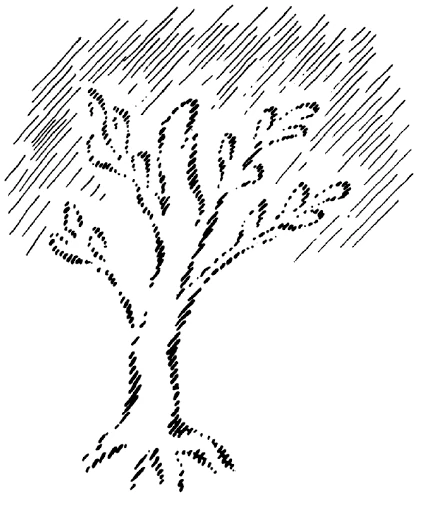
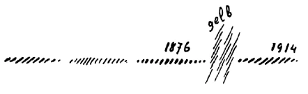

Ich will kurz einige Tatsachen, die angeführt worden sind, noch einmal einleitungsweise berühren, weil wir sie für den Fortgang unserer Betrachtungen brauchen werden. Ich habe gesagt, daß im Menschen selber, auch seelisch, dasjenige liegt, was wir die Schwelle der gewöhnlichen sinnlich-physischen Welt und der seelisch-geistigen Welt nennen können. Und zwar so, daß wir im gewöhnlichen Wachbewußtsein, mit dem der Mensch ausgerüstet ist zwischen der Geburt und dem Tode, eigentlich nur in bezug auf die sinnlichen Wahrnehmungen völlig wachen, in bezug also auf die Wahrnehmung alles desjenigen, was durch unsere Sinne an uns herankommt, ferner in bezug auf alles das, was wir an Vorstellungen entwickeln, seien es Vorstellungen, die wir uns machen über das sinnlich Wahrgenommeng, seien es Vorstellungen, die aus unserem Innern auftauchen zum Begreifen, zum Beleben der Welt. Schon eine ganz gewöhnliche Selbstbesinnung lehrt uns — keineswegs ist dazu hellseherische Begabung notwendig -, daß das gewöhnliche Menschheitsbewußtsein völlig wachend nicht mehr umfassen kann als das Gebiet des Vorstellungslebens und das Gebiet der Sinneswahrnehmungen. In unserer Seele selbst erleben wir außerdem unsere Gefühlswelt und unsere Willenswelt. Aber wir haben gesagt, daß wir unsere Gefühlswelt nur so durchleben, wie wir etwa einen Traum durchleben, daß das Traumleben sich in das gewöhnliche Wachbewußtsein herein erstreckt, und wir eigentlich, indem wir fühlende Menschen sind, Träumer des Lebens sind. Denn auf dem Grunde des Gefühlslebens gehen Dinge vor, von denen das Wachbewußtsein im Vorstellen und im Sinneswahrnehmen nichts weiß. Noch weniger weiß das wache Bewußtsein etwas von den wirklichen Vorgängen des Willenslebens. Das Gefühlsleben verträumt der Mensch im gewöhnlichen Wachbewußtsein, das Willensleben verschläft er. So daß also unter unserem Vorstellungsleben ein Reich lebt, in das wir selber eingebettet sind, und das uns nur zum Teil bekannt ist, uns nur bekannt ist durch die Wogen, die heraufschlagen über seine Oberfläche. ^4jq0c5

Ferner haben wir betont, daß in diesem Reich, das also der Mensch verträumt, verschläft, mit uns gemeinschaftlich leben die Menschenseelen in dem Dasein zwischen dem Tod und einer neuen Geburt. Wir sind also von den sogenannten Toten nur dadurch getrennt, daß wir nicht in der Lage sind, mit dem gewöhnlichen Bewußtsein wahrzunehmen, wie die Kräfte der Toten, das Leben der Toten, die Handlungen der Toten in unser eigenes Leben hereinspielen. Denn diese Kräfte, diese Handlungen der Toten durchdringen unser Gefühlsleben und unser Willensleben fortwährend. Wir leben also mit den Toten. Und es ist schon von Bedeutung, sich klarzumachen in dieser unserer Gegenwart, wie Geisteswissenschaft die Aufgabe hat, dieses Bewußtsein des Zusammengehörens mit den Totenseelen zu entwikkeln. ^i5kct1

Der Rest der Erdenentwickelung wird nicht verfließen können, wenn er zum Heile der Menschheit verfließen soll, ohne daß die Menschheit dieses lebendige Gefühl von dem Zusammensein mit den Toten entwickelt. Denn das Leben der Toten spielt auf mannigfaltigen Umwegen herein in das Leben der sogenannten Lebendigen. ^daft70

Und eben nicht umsonst ist im Verlauf der öffentlichen Vorträge aufmerksam darauf gemacht worden, wie das geschichtliche Leben, wie das, was der Mensch historisch durchlebt, sozial durchlebt, wie das, was er in bezug auf die ethischen Vorgänge unter den Menschen durchlebt, eigentlich den Wert eines Traumes, eines Schlafes hat; daß die Impulse, welche der Mensch entwickelt, wenn er aus seiner Persönlichkeit herausgeht, wenn er also in der menschlichen Gemeinschaft wirkt, Traumes-, Schlafesimpulse sind. ^rgb163

Die Menschen werden Geschichte ganz anders ansehen, wenn ihnen dies zum lebendigen Bewußtsein gekommen ist. Sie werden als Geschichte nicht mehr jene Fable convenue ansehen, welche man heute allgemein Geschichte nennt, sondern sie werden einsehen, daß geschichtliches Leben nur verstanden werden kann, wenn in diesem geschichtlichen Leben dasjenige gesucht wird, was für das gewöhnliche Bewußtsein verträumt, verschlafen wird, in das aber hineinspielen zunächst, wie wir gesehen haben, die Impulse, die Taten, die Handlungen der sogenannten Toten. Es verweben sich die Handlungen der Toten mit dem Fühlen, mit den Willensimpulsen der sogenannten Lebendigen. Und das ist eigentlich Geschichte. ^0u88vs

Der Mensch hört nicht auf, tätig zu sein innerhalb der menschlichen Gemeinschaft, wenn er durch des Todes Pforte gegangen ist. Er fährt fort, tätig zu sein, wenn auch in einer andern Weise, als er hier im physischen Leib tätig sein muß. Aber vieles von dem, wovon der Mensch wegen seiner Illusionen glaubt, daß er es tue, weil es aus seinen Gefühlen, aus seinen Willensimpulsen fließt, fließt in Wahrheit bis in unsere eigenen Tage, wo wir die entsprechenden Handlungen vollziehen, aus den Handlungen derer, die hinübergegangen sind. ^i79epf

Zu wissen, daß der Mensch in dem Augenblicke, wo es sich um sein Leben in menschlicher Gemeinschaft handelt, auch in Gemeinschaft mit den Toten handelt, das wird ein Bedeutsames sein in der Entwickelung der Menschen in der Zukunft. Nur muß selbstverständlich ein solches Bewußtsein, das sich im wesentlichen auf das Gefühls-, auf das Willensleben bezieht, auch vom Fühlen und Willen erfaßt werden. Die abstrakten, die trockenen Vorstellungen werden das niemals erfassen können, aber Vorstellungen, die genommen sind aus dem Umfange der Geisteswissenschaft, die werden das erfassen können. Über vieles allerdings werden sich die Menschen gewöhnen müssen, ganz andere Begriffe zu bilden. ^8v52gl

Sie wissen ja alle, daß derjenige, der fest drinnensteht im Erfassen der geisteswissenschaftlichen Impulse, versuchen kann, mit denjenigen in Verbindung zu bleiben, die hingegangen sind durch die Pforte des Todes. Und an den Gedanken der Geisteswissenschaft, an den Ideen, die wir uns bilden über die Vorgänge in den geistigen Welten, haben wir solche Gedanken, die uns Erdenmenschen verständlich sind, die aber auch den toten Seelen verständlich sind. Und daraus ergibt sich dasjenige, was wir nennen: Vorlesen den Toten. Wenn wir gerade über Materien der Geisteswissenschaft im Gedanken an die Toten vorlesen, dann ist das ein wirkliches Gemeinschaftsleben mit den Toten. Denn die Geisteswissenschaft spricht eine Sprache, die den lebenden und den toten Seelen gemeinschaftlich ist. Aber es handelt sich darum, immer mehr und mehr gerade mit dem Gefühlsleben, mit dem durchleuchteten Gefühlsleben an diese Dinge heranzukommen. ^v3hyk1

Denn bedenken Sie einiges von dem, was ich gestern gesagt habe. Der Mensch lebt zwischen Tod und einer neuen Geburt in einer Umgebung, die im wesentlichen ganz durchsetzt ist nicht nur von Lebendigkeit, sondern von fühlender Lebendigkeit. Das ist schon sein unterstes Reich, habe ich gesagt. Wie für uns das fühllose Mineralreich dasjenige ist, was uns während unseres Sinnenlebens umgibt, ist um den Toten ein so geartetes Reich, daß, wenn er nur irgend etwas darin berührt, er Schmerz oder Freude hervorruft. So ist es bei den Toten, wie wenn wir im Leben wissen müßten, sobald wir irgendeinen Stein berühren, ein Baumblatt berühren, so rufen wir Gefühle hervor. Nichts kann der Tote tun, ohne daß er in seiner Umgebung Gefühle der Freude, Gefühle des Schmerzes, Gefühle der Spannung, Gefühle der Entspannung und so weiter hervorbringt. Indem wir mit dem Toten in einer Verbindung stehen, wie sie durch das Vorlesen gegeben ist, tritt dann für den Toten selbst jene Gemeinschaft auf, von der wir auch schon gesprochen haben, aber eben für diesen besonderen Fall des Vorlesens. Dadurch tritt der Tote in Verbindung mit der Seele, die ihm hier vorliest, mit der Seele, die ihm irgendwie karmisch besonders verbunden ist. Und so wie der Tote in seinem untersten Reiche, das wir mit dem Tierreich in Verbindung bringen mußten, in einem solchen Verhältnisse steht, daß alles, was er tut, Freude, Leid und so weiter hervorbringt, so steht er mit alledem, was Zusammenhang mit Menschenseelen hervorruft — seien es Menschenseelen, die hier auf der Erde leben, seien es Menschenseelen, die schon entkörpert sind und zwischen dem Tod und einer neuen Geburt leben -, in einer solchen Verbindung, daß er durch dasjenige, was in andern Seelen vorgeht, entweder ein gehobenes oder ein abgelähmtes Lebensgefühl erhält. ^qk875p

Machen Sie sich das einmal klar. Wenn Sie hier einem sogenannten Lebenden vorlesen, so wissen Sie, der versteht in dem Sinne, wie man vom menschlichen Verständnisse spricht, dasjenige, was Sie ihm vorlesen. Der Tote lebt darinnen, der Tote lebt in jedem Wort, das Sie ihm vorlesen, der Tote dringt ein in dasjenige, was durch Ihr eigenes Gemüt zieht. Der Tote lebt mit Ihnen, er lebt intensiver mit Ihnen, als er jemals in dem Leben zwischen der Geburt und dem Tode hat leben können. Das kann sich Ihnen steigern zum Verständnisse der Gemeinschaft mit dem Toten. Und diese Gemeinschaft mit dem Toten ist eigentlich, wenn sie gesucht wird, eine recht innige, und es steigert sich dieses Zusammensein mit dem Toten durch schauendes Bewußtsein. ^lkrwyj

Tritt der Mensch wirklich bewußt in jenes Reich, das wir mit den Toten gemeinschaftlich bewohnen, dann ist der Verkehr mit den Toten so: Wenn Sie dem Toten zum Beispiel vorlesen oder vorsprechen, so hören Sie von ihm wie von einem Geisterecho das, was Sie selber vorlesen. Mit solchen Begriffen muß man sich bekanntmachen, wenn man eine wirkliche Vorstellung von der konkreten geistigen Welt gewinnen will. Die Dinge sind in der geistigen Welt anders als hier. Hier hören Sie sich sprechen, oder wissen sich denkend, wenn Sie sprechen, oder wenn Sie denken. Sprechen Sie zu Toten, oder gehen Sie mit dem Toten denkend eine Verbindung ein, so tönt Ihnen, wenn die Verbindung bewußt ist im Schauen, aus dem Toten selbst dasjenige heraus, was Sie zu ihm sprechen, oder was Sie denkend, vorstellend an ihn richten. ^mwa6vo

Und weiter, wenn Sie dem Toten eine Mitteilung machen, dann haben Sie das Gefühl des innigen Verbundenseins. Und antwortet er Ihnen auf diese Mitteilung, dann ist das so, daß Sie zunächst das unbestimmte Bewußtsein haben: der Tote spricht. Sie haben das unbestimmte Bewußtsein: der Tote hat gesprochen, und Sie müssen nun aus der eigenen Seele hervorholen, was er gesprochen hat. Sie erkennen daraus, wie notwendig es zu einem wirklichen Geistverkehr ist, von dem andern zu hören dasjenige, was man selber denkt und vorstellt, aus sich selbst zu hören dasjenige, was der andere spricht. Dies ist eine Art von Umkehrung des ganzen Verhältnisses von Wesen zu Wesen. Aber diese Umkehrung findet statt, wenn wirklich eingetreten wird in die geistige Welt. ^8fd6py

Weil die geistige Welt so durchaus anders ist als die physische Welt und die Menschen seit dem 15. Jahrhundert ungefähr sich nur Vorstellungen bilden wollen, die im Sinne der physischen Welt geartet sind, so verlegen sich, verbauen sich die Menschen den Zugang zur geistigen Welt. Wenn die Menschen sich einmal herbeilassen werden, wenigstens die Möglichkeit vor sich hinzustellen, daß es eine Welt geben kann, die in gewissem Sinne, nicht in allem, entgegengesetzt ist derjenigen, die der Mensch hier die wahre Welt nennt, wenn sich die Menschen einmal werden Vorstellungen bilden wollen, die vielleicht demjenigen als die allerverrücktesten erscheinen, der nur in materialistischer Welt leben will, dann erst werden die Menschen ihre Seelen so umformen, daß sie die Möglichkeit erhalten, wirklich hineinzuschauen in diese geistige Welt, die ja fortwährend um uns herum ist. Es ist nicht so, daß die Menschen unbedingt durch ihre Natur getrennt wären von der geistigen Welt, sondern es ist deshalb so, weil die Menschen durch Gewöhnung, durch Vererbungsverhältnisse, seit dem 14. und 15. Jahrhundert sich ganz abgewöhnt haben, andere Vorstellungen zu bilden als diejenigen, die hier der physischen Welt entlehnt sind. Ist es ja sogar so für die Kunst geworden! Was will denn die heutige Kunst noch anderes bilden als das, was nach dem Modell gebildet ist, was sich draußen in der Natur auch bildet. Selbst in der Kunst wollen die Menschen nicht mehr gelten lassen das, was auch als ein Reales frei aufsteigt aus dem Geistesleben der Seele. Aber die Menschen können nicht das tilgen, was in den geschichtlichen Ereignissen, im ethisch-moralischen Zusammenleben, im sozialen Zusammenleben selbst als frei Aufsteigendes wirksam und tätig ist, wenn sie es auch verträumen, verschlafen. Sobald der Mensch auch nur im geringsten über das hinausgeht, was seine ureigensten, persönlichsten Angelegenheiten sind - und er geht ja in jedem Augenblicke des Lebens darüber hinaus -, so wirkt durch seinen Arm, durch seine Hand, durch sein Wort, durch seinen Blick die geistige Welt, jene Welt, die wir — das muß ich immer wieder betonen mit den Toten gemeinschaftlich haben. ^wmuro8

Der Tote lebt sich nun in das Reich ein, von dem ich schon gesprochen habe, so wie wir uns, indem wir von Kindheit auf wachsen, in dem Leben zwischen Geburt und Tod einleben in die mineralische, die pflanzliche, die tierische, die menschliche physische Welt. Indem er sich so einlebt in das unterste Gebiet, das mit dem Tierreich etwas zu tun hat, in das zweite Gebiet, worin sich die Gemeinschaft ausbildet mit all den Seelen, mit denen der Tote in einer unmittelbaren oder mittelbaren karmischen Verbindung steht, so entwickelt sich der Tote zugleich dazu, sich in das Reich derjenigen Wesen einzuleben, die nun — wenn ich den Ausdruck gebrauchen darf, obwohl er nur etwas uneigentlich gemeint sein kann — über dem Menschen stehen: in das Reich der Angeloi, Archangeloi, Archai zunächst. ^93z0ji

Hier in der physischen Welt steht der Mensch da - viele betonen das so gern - als die Krone der physischen Schöpfung. Er fühlt sich hier als das höchste der Wesen. Die mineralischen Wesen sind die untersten, dann die pflanzlichen Wesen, dann die tierischen Wesen, dann er, der Mensch. Er fühlt sich als dem höchsten Reiche angehörig. So ist es nicht mit den Toten im geistigen Reiche; denn der Tote fühlt sich als sich anschließend an die Hierarchien, die über ihm stehen: die Hierarchien der Angeloi, Archangeloi, Archai und so weiter. So wie der Mensch sich hier in der physischen Welt gewissermaßen hervorgehend, hervorwachsend fühlt aus dem mineralischen, dem pflanzlichen und tierischen Reiche, dem physischen Menschenreich, so fühlt der Tote sich gehalten, getragen von den über ihm stehenden Hierarchien in dem Leben zwischen dem Tod und einer neuen Geburt. ^sozc5e

Die Art, wie sich der Mensch allmählich in diese Reiche einlebt, in die Reiche der Angeloi, Archangeloi, Archai und so weiter, kann man so bezeichnen, daß man sagt: Man fühlt es wie ein Loslösen von sich. — Wiederum müssen wir uns eine Vorstellung aneignen von diesen Dingen, die man in der physisch-sinnlichen Welt gar nicht gewinnen kann. In der physisch-sinnlichen Welt lernen wir, wenn wir von Kindheit auf wachsen, allmählich die Dinge kennen: zuerst unsere nächste Umgebung, dann dasjenige, was im weiteren Umkreise unsere Lebenserfahrung werden soll und so weiter. Wir lernen die Dinge so kennen, daß wir wissen, sie treten nach und nach an uns heran. Das ist nicht der Fall zwischen dem Tod und einer neuen Geburt. Da fühlen wir von dem Momente an, wo wir wissen, jetzt stehen wir in Beziehung zu den Angeloi, da fühlen wir, wie wenn wir mit ihnen schon von Ewigkeit her verbunden gewesen wären, wie wenn wir zu ihnen gehörten, eines mit ihnen wären, aber wie wenn das Bewußtsein sich nur dadurch entwickeln kann, daß wir gewissermaßen es dahin bringen, die Vorstellung von den Angeloi von uns loszulösen. Hier in der physischen Welt machen wir unsere Erfahrungen dadurch, daß wir die Vorstellungen aufnehmen. In der geistigen Welt machen wir unsere Erfahrungen dadurch, daß wir die Vorstellungen gewissermaßen aus uns heraus loslösen. Wir wissen, wir tragen sie in uns; und wir wissen, wir sind ganz und gar von ihnen erfüllt. Aber wir müssen sie, damit wir sie zum Bewußtsein bringen können, von uns loslösen. Und so lösen wir los die Vorstellungen der Angeloi, der Archangeloi, der Archai. ^7izz9r

Gleichsam durch das unterste Reich ist der Mensch mit dem Wesen des Tierischen verbunden, das er in dem Sinne, wie ich es schon auseinandergesetzt habe, zu bemeistern hat. Dann bildet sich das darüberstehende Reich zu den Seelen, mit denen der Mensch karmisch, mittelbar oder unmittelbar, verbunden ist. Dann erfährt er seine Beziehungen zum Reiche der Angeloi. Durch die Beziehungen zum Reiche der Angeloi tritt vieles von dem erst ein, was die rechten Beziehungen gibt zu dem Reich der Menschenseelen. So daß man eigentlich schwer für das Leben zwischen dem Tod und einer neuen Geburt trennen kann das, was der Mensch zu tun hat mit den andern Menschenseelen, und dasjenige, was er zu tun hat mit den Wesen aus dem Reiche der Angeloi. Menschen und Wesen aus dem Reiche der Angeloi, sie haben ja viel miteinander zu tun. Man kann sagen - obwohl man natürlich über diese Dinge nur vergleichsweise sprechen kann, obwohl alles Sprechen nur Andeutungen geben kann, ist es doch richtig -, so wie uns hier im physischen Leben die Erinnerung wieder hinträgt zu irgendeinem Ereignisse, das wir durchgemacht haben, so trägt in dem Leben zwischen dem Tod und einer neuen Geburt ein Wesen aus dem Reich der Angeloi uns hin zu irgend etwas, zu dem wir getragen werden sollen, das wir erleben sollen. Die Wesen aus dem Reich der Angeloi sind eigentlich die Vermittler für alles dasjenige, was sich ausbildet im Leben des sogenannten Toten. ^rrisak

Und für alles das, was der Mensch zu tun hat zwischen dem Tod und einer neuen Geburt mit Bezug auf die Bemeisterung des Tierischen — er hat ja seine eigene tierische Natur einzupflanzen seinem Geistwesen, damit er sich vorbereitet zu der nächsten Inkarnation -, helfen die Archangeloi. Dann, wenn Sie dies in rechtem Sinne erfassen, werden Sie sich sagen: Dadurch, daß der Mensch zwischen dem Tode und einer neuen Geburt teilhaftig wird des Verkehrs mit den Angeloi, kommt er in die Lage, seine rechten Beziehungen, seine rechten Verhältnisse anzuknüpfen zu den Seelen, mit denen er eben Verhältnisse anknüpfen soll. Dadurch, daß der Mensch in Beziehung tritt zu dem Reich der Archangeloi, wird der Mensch in die Lage versetzt, in der richtigen Weise sich vorzubereiten für das, was ablaufen soll für die nächste Erdeninkarnation. ^w90jl4

Die Archai, jene Wesen, welche wir auch die Wesen des Zeitgeistes genannt haben, sind aber jene Wesen, welche gemeinschaftlich tätig sind in ihren Aufgaben für die Toten und für die Lebendigen. Aus meinen Andeutungen können Sie entnehmen, daß im wesentlichen der Tote mit den Angeloi so zu tun hat, daß diese sein Verhältnis zu andern Seelen regeln; daß die Archangeloi sein Verhältnis zu seinen fortlaufenden Inkarnationen regeln. Was der Tote zu tun hat mit jenen Wesen, die der Hierarchie der Archai angehören, das hat er - auf dem gemeinschaftlichen Boden mit den sogenannten Lebendigen — mit denen zu tun, die hier im physischen Leibe inkarniert sind. Der Tote in dem Leben zwischen dem Tod und einer neuen Geburt und der sogenannte Lebende hier zwischen der Geburt und dem Tode, sie sind in gleicher Weise eingebettet in etwas, was wie eine fortströmende Weltenweisheit und Weltenwillenstätigkeit gewoben wird von den Zeitgeistern. Was wiederum gewoben wird von den Zeitgeistern, ist Geschichte, ist ethisch-moralisches Leben eines Zeitalters, ist soziales Leben eines Zeitalters. ^v0kw4z

Man möchte sagen, hinaufblicken können wir in das Reich des Geistes und uns sagen: Da sind die sogenannten Toten; was sie in ihrem Reiche erleben, das wird geregelt, insoferne dieses Erlebte ihre eigenen Angelegenheiten sind, durch die Angeloi und Archangeloi; was sie gemeinschaftlich mit den sogenannten Lebendigen erleben, das wird gewoben von den Wesen, die zu der Hierarchie der Archai gehören. Und so können wir gar nicht fruchtbar im sozialen, im geschichtlichen, im ethisch-moralischen Leben wirken, ohne daß wir uns bewußt sind: dieses Wirken muß heraus erwachsen aus dem mit den Toten gemeinschaftlichen Elemente, muß heraus erwachsen aus dem Elemente der Archai, der Zeitgeister. ^08kenm

Diese Zeitgeister aber lösen sich ab in bezug auf ihre Aufgabe. Darüber haben wir ja wiederholt gesprochen. Ein solcher Zeitgeist webt an dem Geschicke des fortgehenden geschichtlichen Stromes und sozialen Stromes, des moralisch-ethischen Stromes im Menschengeschehen gewisse Jahrhunderte hindurch, dann wird er durch einen andern Zeitgeist abgelöst. Die Zeitpunkte, in denen ein Zeitgeist den andern ablöst, sind die allerwichtigsten für die Beobachtung desjenigen, was eigentlich innerhalb der Menschheitsentwickelung vor sich geht. Denn man kann die Menschheitsentwickelung nicht verstehen, wenn man nicht das lebendige Hereinwirken der Zeitgeister und damit überhaupt der ganzen geistigen Welt ins Seelenauge faßt; man kann nicht verstehen, was eigentlich zwischen den Menschen geschieht, wenn man nicht das Reich des Geistes in Erwägung zieht. ^8y26k6

Abstrakt, höchst abstrakt denkt der Mensch über das, was sozial, was ethisch-moralisch, was historisch abläuft. So wie wenn die Geschichte ein fortlaufender Strom wäre, wo immer eins aufs andere folgt, so stellt sich der Mensch den Zeitenstrom des Geschehens vor. Er frägt: Warum sind die Ereignisse im Beginne des 20. Jahrhunderts so, wie sie eben sind? — Weil sie verursacht sind von den Ereignissen am Ende des 19. Jahrhunderts. Warum sind die Ereignisse am Ende des 19. Jahrhunderts so geworden? — Weil sie verursacht sind von denen in der Mitte des 19. Jahrhunderts. Und die Ereignisse in der Mitte des 19. Jahrhunderts sind wiederum verursacht durch die Ereignisse im Beginn des 19. Jahrhunderts und so fort. ^y1n8hb

Es ist diese Betrachtungsweise, die immer die geschichtlichen Ereignisse als Folgen der unmittelbaren früheren betrachtet, ungefähr ebenso gescheit, als wenn der Bauer sagen würde: Der Weizen, den ich dieses Jahr haben werde, ist die Folge des Weizens vom vorigen Jahre, die Samen sind geblieben; der vom vorigen Jahre ist wiederum die Folge des Weizens vom vorvorigen Jahre. — Eins schließt sich an das andere, Wirkung immer an die Ursache. Es tut es nur nicht, wenn nicht nachgeholfen wird! Denn der Bauer muß selbstverständlich persönlich eingreifen: er muß die Saat erst aussäen, damit Wirkung wird aus der Ursache. Von selbst wird nicht Wirkung aus der Ursache. Das ist von einem gewissen Gesichtspunkte aus sogar die schrecklichste Illusion des materialistischen Zeitalters, daß die Menschen glauben: Wirkung entsteht aus der Ursache, und daß die Menschen sich nicht die einfachsten Gedanken bilden wollen über die Wahrheit dieser Verhältnisse. ^yf7z4z

Ich habe Ihnen schon ein Ereignis als Beispiel angeführt, das ein sensationelles Ereignis im Menschengeschehen ist. Aber es ist schon einmal so, daß die Menschen auf solche sensationellen Ereignisse leichter hinschauen als auf die andern Ereignisse, die von genau derselben Art sind, aber sich stündlich, ja augenblicklich innerhalb unseres Lebens immer vollziehen. Ich habe Sie aufmerksam gemacht darauf, wie so ein Ereignis verfließt: Ein Mann ist gewöhnt, einen Spaziergang zu machen an einem Berghang; er machte ihn durch lange Zeit hindurch täglich. Aber eines Tages, als er ausgeht und an eine bestimmte Stelle des Weges kommt, hört er,wie wenn eineStimme ihm zutönen würde, so ungefähr: Warum gehst du denn eigentlich diesen Weg? Hast du es denn nötig, dies zu tun? - so ähnlich. Er wird bedenklich, als er diese Stimme hört; er tritt zur Seite, besinnt sich einen Augenblick über das Sonderbare, das sich zugetragen hat - ein Felsblock stürzt herab, der ihn ganz sicher zerschmettert hätte, wenn er nicht durch die Stimme auf die Seite getreten wäre. Es ist ein sensationelles Ereignis. Aber für denjenigen, der die Welt nüchtern und doch geistig betrachtet, ist es nichts anderes als ein solches Ereignis, wie es sich in jedem Augenblick unseres Lebens vollzieht. Denn in jedem Augenblick unseres Lebens könnte auch etwas anderes geschehen, wenn dies oder jenes eintreten würde. ^2t73lp

Der sehr gescheite Mensch - wir wissen, daß insbesondere die Menschen der Gegenwart sehr gescheit sind -, er sagt: Ja, warum ist jener Mensch nicht erschlagen worden? — Weil er weggegangen ist! Das ist die Ursache. - Na schön; aber nehmen wir an, er wäre nicht weggegangen, er wäre erschlagen worden, dann würde der sehr gescheite Mensch der Gegenwart sagen: Der herabfallende Stein ist die Ursache, daß der Mensch erschlagen worden ist. ^rb0az4

Rein formell, äußerlich abstrakt ist es schon richtig: der herabfallende Stein ist die Ursache, und der Tod des Menschen ist die Wirkung. Aber daß die Ursache mit der Wirkung nicht das geringste zu tun hat - denn für den herabfallenden Stein gilt genau dasselbe, ob der Mensch dort steht oder nicht dort steht -, bedenkt er nicht. Diese Ursache hat mit jener Wirkung nicht das geringste zu tun. Bedenken Sie das nur einmal ordentlich und versuchen Sie sich dann klarzumachen, was es mit aller Ursache-und-Wirkung-Rederei eigentlich für eine Bedeutung hat. Die sogenannte Ursache braucht nicht das geringste mit ihrer Wirkung zu tun zu haben. Für den Stein würde sich genau derselbe Vorgang abspielen, wenn der Mann nicht dort stehen würde, und er spielt sich auch ab: es ist für den Stein, als der Mann gewarnt wurde und weggegangen ist, nichts anderes geschehen. ^7pfz2i

Ich führte Ihnen dies als ein Beispiel dafür an, daß selbst in solchen äußeren, rein formellen Dingen die sogenannte Ursache mit der sogenannten Wirkung nichts zu tun zu haben braucht. Diese ganze Betrachtung von Ursache und Wirkung kommt nur aus der Abstraktion heraus. Von Ursache und Wirkung zu sprechen ist nur angängig innerhalb gewisser Grenzen. Nehmen Sie einmal an: Sie hätten hier einen Baum, der habe hier seine Wurzeln. Nun, was in den Wurzeln vorgeht, das ist in einer gewissen Beziehung sicherlich als Ursache zu bezeichnen für dasjenige, was da wächst; was in den Zweigen vorgeht, ist mit einem gewissen Rechte wiederum als Ursache dessen zu bezeichnen, was in den Blättern vorgeht. Der Baum ist in einer gewissen Beziehung ein Ganzes; und die konkrete Lebensbetrachtung geht auf Totalitäten, geht aufs Ganze; die abstrakte Lebensbetrachtung, die schließt immer eins an das andere an, ohne sich zu fragen: wo ist ein abgeschlossenes Ganzes? Für die geistige Lebensbetrachtung ist dies aber von Bedeutung, daß man sich einer Ganzheit bewußt wird. Denn sehen Sie, da wo die äußersten Blätter sind, da hört der Baum auf mit dem, was innerliche Ursachen sind für das, was da geschieht. Wo die Blätter aufhören, da hören auch die verursachenden Kräfte auf. Wo aber die verursachenden Kräfte aufhören, da greift anderes ein. Hier, wo die verursachenden Kräfte aufhören, sehen Sie, wenn Sie geistig schauen, den Baum umspielt von geistiger Wesenhaftigkeit, von geistigen Elementarwesen, da beginnt, wenn ich so sagen darf, ein negativer Baum, der sich ins Unendliche hinausdehnt — nur scheinbar ins Unendliche, denn er verliert sich nach einiger Zeit. Dem Hinauswachsen des Baumes begegnet ein elementarisches Dasein, und da, wo der Baum aufhört, berührt er sich mit elementarisch ihm entgegenwachsendem Dasein (Siehe Zeichnung S. 66). So ist es in der Natur. Die Pflanze, indem sie aus dem Boden herausschießt, hört auf. Die Ursachen hören da auf, wo die Pflanze aufhört. Aber entgegen wächst der Pflanze aus dem Weltenall herein ein elementarisches Dasein. ^uwfn1z

 ^fhnrk5

Ich habe das gerade in dem Vortrage, der über «Das menschliche Leben vom Gesichtspunkte der Geisteswissenschaft» handelt, in einigem angedeutet. Die Pflanzen wachsen aus dem Boden von unten hinauf, Geistiges wächst von oben herunter den Pflanzen entgegen. So ist es mit allen Wesen. Was Sie hier für die Natur sehen, das ist aber in allem Dasein vorhanden. Vor allen Dingen ist ein Strom des sozialen, des erhisch-moralischen, des geschichtlichen Werdens vorhanden. Nicht solch ein fortlaufender Strom ist das Geschehene, sondern ein Zeitgeist regiert während einer gewissen Zeit, ein anderer löst ihn ab, ein dritter löst ihn ab, ein vierter löst ihn ab und so weiter. Und an den Stellen, wo ein Zeitgeist den andern ablöst, da ist auch im Strom des fortlaufenden Geschehens ein Unterschied, ein solcher Einschnitt, daß man nicht sagen kann, das, was da folgt, ist unmittelbar die Wirkung des Vorhergehenden. Es ist nicht die Wirkung des Vorhergehenden in dem Sinne, wie man sich das vorstellt. ^gnox3b

Gesetzmäßigkeit ist schon vorhanden in dem, was aufeinanderfolgend auftritt. Aber das, was man gewöhnlich «Notwendigkeit» nennt, das ist eine Illusion, wenn man es so auffaßt, wie es heute vielfach aufgefaßt wird. Im Strom des fortlaufenden Geschehens ist es ganz ähnlich, wie an einer solchen Stelle, wo der Baum aufhört und der elementare Baum beginnt; nur daß in der Natur hier ein Wesen des sichtbaren, des sinnlich-sichtbaren Reiches angrenzt an ein Wesen, das sinnlich-unsichtbar ist, das übersinnlich ist. Hier grenzt Sinnliches an Übersinnliches - hier im Zeitenstrom grenzt Gleichartiges aneinander; aber ebenso wie hier der sichtbare Baum aufhört und der Elementarbaum beginnt, so hört auch hier etwas auf und ein anderes beginnt. ^e3gsv0

So gibt es Zeitepochen, in denen die alten Geschehnisse, die alten Impulse, gewissermaßen aufhören und neue eingreifen müssen. Die Menschen halten sich in solchen Zeitpunkten oftmals gern an Luzifer und Ahriman und behalten das noch fort, was in Wirklichkeit eigentlich schon abgestorben ist. Im Bewußtsein kann man das noch fortbehalten, was in Wirklichkeit schon abgestorben ist. In der Natur kann man das nicht. Wenn jemand im Jahre 1914 Ideen genau derselben Art kultivieren will, wie sie berechtigt waren im Jahre 1876, so kann er das. Er kann es aus dem Grunde, weil man im fortlaufenden Strom des Menschengeschehens, in dem man sich an Ahriman und Luzifer klammert, das Alte bewahren kann, wenn es auch in Wirklichkeit schon tot ist. Aber es ist dasselbe, wie wenn einer wollte den Baum fortwachsen machen, so daß er nicht aufhört, wenn er seine natürlichen Grenzen erreicht hat. In der Geschichte geschieht es in der Regel, daß die Menschen nicht die Möglichkeit finden, einer neuen Epoche sich in der entsprechenden Weise richtig entgegenzusetzen, das heißt, sich in den Dienst des neuen Zeitgeistes zu stellen. ^yi46jp

Und gerade für unsere Zeit ist dies von einer ganz besonderen, durchdringenden Wichtigkeit. Wir haben in diesen ganzen Wochen von dem gesprochen, was geistig Wichtiges vorgegangen ist 1879 (siehe Zeichnung, gelb). Da ging ein Zeitalter zu Ende, da starb etwas ab, da hörte etwas auf, so wie hier der Baum aufhört. Von da ab war es nötig - und ist bis heute nötig geblieben selbstverständlich, und wird noch lange nötig sein —, daß die Menschen zugänglich werden für Ideen, für Impulse, die aus der geistigen Welt selbst heraus sind. Sonst verwandelt sich das Alte in Ahrimanisches, Luziferisches. ^3qdz97

 ^9ms6lz

Mit dieser Andeutung ist außerordentlich Wichtiges gesagt. Denn in diesem letzten Drittel des 19. Jahrhunderts war eine wichtige Zeit in der Menschheitsentwickelung. Notwendig war es und notwendig bleibt es, daß die Menschen den Sinn sich eröffnen für das Eingreifen inspirierter Ideen; dafür müssen die Menschen empfänglich werden. Allerdings, äußerlich betrachtet - wir werden aber die Sache nicht bloß äußerlich betrachten, sondern wir werden auf die tiefere, innerliche Betrachtung eingehen -, äußerlich betrachtet sieht es zunächst so aus,‘ als wenn eigentlich die Dinge recht trostlos lägen. Aus den geistigen Welten kamen schon die Impulse, die hereinströmten, hereinwirkten, um die Menschen über diesen Zeitpunkt des Jahres 1879 hinwegzuführen so, daß sie für inspirierte Ideen empfänglich geworden wären. Es waren schon die Impulse da, um den Menschen Gedanken zu geben, daß sie schon am Ende des 19. Jahrhunderts hätten das Bewußtsein haben können: Wenn wir geschichtlich, wenn wir sozial, wenn wir ethisch-moralisch im Gemeinschaftsleben handeln, dann handeln unsere Toten, handeln die Angeloi, handeln die Archangeloi, handeln die Archai unter uns. - Das war da. Die Impulse waren da, sie gingen nur an vielen Menschen zunächst spurlos vorüber. ^vbg6pn

Ich sage, ich betrachte das heute zunächst äußerlich, und es ist gut, wenn man sich einmal klarmacht, wie scheinbar spurlos alles vorbeigegangen ist. Wichtige Dinge, wichtige Impulse hat es schon gegeben in dieser zweiten Hälfte des 19. Jahrhunderts, indem Menschen schon da waren, die bedeutungsvolle Gedanken gehabt, bedeutungsvolle Gedanken dargelegt haben. Wenn Sie diese heute ansehen werden, so sehen diese Gedanken selbst wie abstrakte Gedanken aus, gewiß, aber sie sind keine abstrakten Gedanken. Auch sollten sie nicht so bleiben, wie sie dazumal waren. Ich wiederhole es noch einmal, äußerlich ist das jetzt betrachtet, morgen werden wir es innerlich betrachten. ^x2xdtb

In allen Gebieten der heutigen Bildungswelt fast war das so. Wer betrachtet denn zum Beispiel, um ein Nächstes zu berühren, hier in diesem Lande, der Schweiz, dieses Leben so, daß er sich sagen würde: Hier in der Schweiz hat im 19. Jahrhundert in den fünfziger Jahren ein Mensch gewirkt, der bedeutungsvolle Gedanken hegte, die dazumal allerdings philosophische Gedanken waren, die aber von zwei oder drei andern hätten aufgenommen, popularisiert zu werden gebraucht, und die in der fruchtbarsten Weise hätten eingreifen und die ganze Geschichte der Schweiz durchgeistigen können! - Wer denkt zum Beispiel, daß ein Geist ersten Ranges in Otto Heinrich Jäger geschaffen hat in der Mitte des 19. Jahrhunderts, einer der größten, die hier in der Schweiz geschaffen haben? Wo ist sein Name, wo wird er genannt? Wo ist das Bewußtsein dafür vorhanden, daß, obzwar die Gedanken abstrakt zutage getreten sind, scheinbar abstrakt, sie doch hätten konkret werden und blühen und Früchte tragen können, weil ein Größtes durch diesen Kopf gegangen ist, der an der Universität in Zürich gelehrt hat, der Bücher geschrieben hat über die wichtigsten Ideen - die hineingeweht werden müßten in das Leben der Gegenwart -, über die Idee der menschlichen Freiheit und ihres Zusammenhanges mit der ganzen geistigen Welt. Von ‘einem andern Gesichtspunkte, als dann meine Freiheitsphilosophie in den neunziger Jahren entstanden ist, hat Otto Heinrich Jäger hier in der Schweiz eine Art Freiheitsphilosophie geschaffen. ^azvlan

Und so wie dieses eine Beispiel könnte man überall unzählige anführen. Es sprießten und sproßten die fruchtbarsten Ideen. Aber das, was man heute erzählt als Geistesgeschichte des 19. Jahrhunderts und bis in das 20. Jahrhundert herein, ist das Allerunbedeutendste von dem, was sich wirklich zugetragen hat. Und das Allerbedeutendste, das Eindrücklichste, ist nicht berücksichtigt worden. So sehen die Dinge, zunächst äußerlich betrachtet, aus. Die innerlichen Betrachtungen werden vielleicht trostreicher aussehen. ^rcggbe