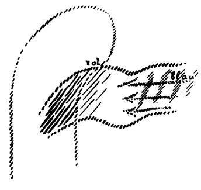
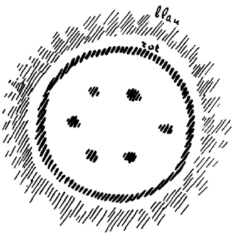
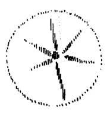

Das Thema, das wir jetzt besprechen, ist sehr umfassend, und es wird heute nicht so weit geführt werden können, als ich eigentlich gewollt habe, aber wir setzen ja diese Betrachtungen weiter fort. Denn ich möchte gerade in diesen Betrachtungen vor allem die Grundlage zum Verständnis von Freiheit und Notwendigkeit so legen, daß Sie ein Bild bekommen von dem, was vom okkultistischen Standpunkte in Betracht kommt, um den Verlauf des sozialen und des geschichtlichen, des ethisch-moralischen Menschenlebens zu verstehen. ^ubylnf

Wir haben betont, daß für das Leben zwischen der Geburt und dem Tode völlig wachend eigentlich nur das durchlebt wird, was wir in der Sinneswahrnehmung haben, was aus den Sinneseindrücken stammt und was in den Vorstellungen erlebt wird. Dagegen verträumt der Mensch alles das, was in den Gefühlen als Wirklichkeit lebt, und er verschläft alles, was in den Willensimpulsen eigentlich als die tiefere Notwendigkeit liegt, als die tiefere Wirklichkeit vorhanden ist. Wir leben in unserem Gefühls- und Willensleben in denselben Sphären, in denen mit uns gemeinschaftlich die sogenannten Toten da sind. ^6xidji

Nun ist es gut, wenn wir uns zunächst eine Vorstellung davon machen, was eigentlich hinter dem Sinnesleben nach außen hin liegt. Die Eindrücke der Sinne, man kann sie sich vorstellen, als ob sie sich wie ein Teppich vor uns ausbreiteten. Natürlich, diesen Teppich müssen wir uns besetzt denken auch mit den Gehörseindrücken, mit allen Eindrücken der zwölf Sinne, wie wir sie ja aus anthroposophischen Betrachtungen kennen. Sie wissen, daß die wirkliche Zahl der Sinne zwölf ist. Dieser Sinnesteppich deckt gewissermaßen eine hinter ihm liegende Wirklichkeit zu. Diese hinter den Sinneswahrnehmungen liegende Wirklichkeit dürfen wir uns nicht so vorstellen, wie etwa der Naturforscher sich die Atomwelt vorstellt, oder wie eine gewisse philosophische Richtung vom Ding an sich spricht. Denn ich habe sogar in den öffentlichen Vorträgen betont: Suchen nach einem Ding an sich, wie es die heutige Philosophie tut, wie es der Kantianismus tut, das hieße ungefähr dasselbe als, die Wesen, die man in einem Spiegel sieht, ihrer Wirklichkeit nach dadurch suchen zu wollen, daß man den Spiegel zerbricht, um zu sehen, was dahinter ist. - In diesem Sinne rede ich nicht von etwas, was hinter den Sinneswahrnehmungen liegt, sondern ich rede von etwas, was hinter den Sinneswahrnehmungen liegt als einem Geistigen, in dem wir selber eingebettet sind, an das aber des Menschen gewöhnliches Bewußtsein, das er zwischen der Geburt und dem Tode trägt, nicht reicht. In dem Augenblicke, wo wir den Sinnesteppich gewissermaßen enträtseln würden auf einer ersten Stufe, so daß wir nach außen hin mehr sehen würden als die Mannigfaltigkeit der Sinnesimpulse - was würden wir da auf dieser ersten Stufe der spirituellen Enträtselung des Sinnesteppichs sehen? Diese Frage wollen wir uns einmal vorlegen. ^o2r8p4

Es kann zunächst überraschen, was als dasjenige genannt werden muß, das man zunächst sieht. Was man da zunächst sieht, ist eine Summe von Kräften, die alle darauf ausgehen, unser gesamtes Leben zu impulsieren von der Geburt, oder sagen wir von der Empfängnis bis zum Tode. Nicht in den einzelnen Ereignissen würden wir unser Leben sehen, wenn wir den Sinnesteppich enträtseln, aber in seiner ganzen Artung. Nicht irgend etwas ganz Fremdartiges würden wir zunächst finden, uns selbst würden wir finden auf der ersten Stufe der Enträtselung der Sinneswahrnehmungen - aber uns selbst nicht, wie wir in diesem Augenblicke sind, sondern uns selbst so, wie wir geartet sind dieses ganze Leben zwischen der Geburt und dem Tode. Dieses Leben, das nicht in unseren physischen Leib hereinspielt, daher auch nicht mit physischen Sinnen wahrgenommen werden kann, dieses Leben spielt in unseren Ätherleib, in unseren Bildekräfteleib herein. Und unser Bildekräfteleib ist im wesentlichen ein Ausdruck dieses Lebens, das wir überblicken würden, wenn wir die Sinne, die Sinneswahrnehmungen ausschalten würden. Würde gewissermaßen der Sinnesteppich zerreißen - und er zerreißt, wenn der Mensch zum Schauen aufsteigt -, so findet sich der Mensch selbst, so wie er geartet ist für diese Erdeninkarnation, in der er die betreffende Beobachtung macht. Aber wie gesagt, die Sinne sind nicht geeignet, dies wahrzunehmen. ^76zfjl

Was ist geeignet, dies wahrzunehmen? Der Mensch hat es schon, was geeignet ist, dies wahrzunehmen; aber er hat es in einer solchen Entwickelungsstufe, daß von einem wirklichen Wahrnehmen gegenwärtig noch nicht die Rede sein kann. Was da wahrgenommen würde, das dringt in kein Auge, kein Ohr, dringt nicht in Sinnesorgane, sondern wird - ich bitte Sie, das wohl zu verstehen — eingeatmet, mit dem Atem eingesogen. Und das, was unserer Lunge ätherisch zugrunde liegt - von der physischen Lunge kann ja dabei gar nicht die Rede sein, denn die Lunge ist, so wie sie ist, kein unmittelbares Wahrnehmungsorgan —, was ätherisch unserer Lunge zugrunde liegt, das ist eigentlich Wahrnehmungsorgan, aber für den Menschen zwischen Geburt und Tod nicht brauchbares Wahrnehmungsorgan desjenigen, was da eingeatmet wird. In der Atemluft, die wir einsaugen, liegt eigentlich in bezug auf jeden Atemzug, wie er sich einfügt in den Gesamtrhythmus des Lebens von der Geburt bis zum Tode, unsere tiefere Wirklichkeit. Es ist nur so eingerichtet, daß das, was dem ganzen Lungensystem zugrunde liegt, beim Menschen auf dem physischen Plan unausgebilder ist, nicht vorgeschritten ist bis zu der Fähigkeit, wahrzunehmen. Würde das, was eigentlich unser Lungensystem aufbaut, was da ätherisch zugrunde liegt, untersucht und richtig erkannt, dann stellte es sich im Grunde genommen als ganz dasselbe dar, was physisch, für die physische Welt, unser Gehirn mit den Sinnesorganen ist. In dem, was unserem Lungensystem zugrunde liegt, haben wir ein Gehirn auf einer früheren Entwickelungsstufe, auf einer, man möchte sagen, noch kindlichen Entwickelungsstufe. Auch in dieser Beziehung tragen wir gewissermaßen - ich sage ausdrücklich: gewissermaßen - einen zweiten Menschen in uns. Und Sie stellen nicht falsch vor, wenn Sie sich denken, daß außer dem physischen Kopf, den der Mensch trägt, noch ein ätherischer Kopf vorhanden ist, der nur noch nicht als Wahrnehmungsorgan im gewöhnlichen Leben brauchbar ist, der aber in der Anlage Wahrnehmungsvermögen- hat für das, was hinter dem Bildekräfteleib, als diesen Bildekräfteleib schaffend, liegt. Dies aber, was da hinter dem Bildekräfteleib schaffend liegt, das ist dasjenige, in das wir eintreten, wenn wir durch die Pforte des Todes gehen. Den Bildekräfteleib selbst legen wir dann ab, aber was ihn schafft, was ihn produziert, in das treten wir ein. Es ist vielleicht eine schwierige Vorstellung; allein es ist gut, wenn Sie versuchen, diese Vorstellung wirklich zu Ende zu denken. Schematisch könnten wir uns die Sache doch noch verdeutlichen. ^c0zypu

 ^oy7l7d

Wir stellen uns das physische System des Kopfes vor, und wir stellen uns das physische System der Lunge vor (siehe Zeichnung, rot), hereinwirkend aus dem Kosmos die Impulse des Kosmos (blaue Pfeile), die sich rhythmisch ausdrücken in den Lungenbewegungen (rot schraffiert). Durch unsere Lunge stehen wir mit dem ganzen Kosmos in Beziehung, und der ganze Kosmos schafft an unserem Ätherleib. Den Ätherleib selbst legen wir ab, wenn wir durch die Pforte des Todes treten, aber wir treten ein in dasjenige, was hineinspielt in unser Lungensystem; das steht mit dem ganzen Kosmos in Verbindung. Daher jene merkwürdige Übereinstimmung im Rhythmus des Menschenlebens und im Rhythmus der Atmung. Sie wissen ja — ich habe das schon einmal hier ausgeführt —, wenn Sie die 18 Atemzüge, die der Mensch in der Minute hat, ausrechnen, so daß Sie die Zahl der Atemzüge in einem Tage bekommen, so sind es also 18 mal 60 in der Stunde, für den Tag mal 24 sind 25 920 Atemzüge in einem Tage. Der Mensch atmet ein und atmet aus; das gibt seinen Rhythmus, seinen kleinsten Rhythmus zunächst. Dann aber ist ein anderer Rhythmus in unserem Leben da, wie ich Ihnen schon einmal angedeutet habe: der besteht darinnen, daß wir unser Seelisches, das Ich und den astralischen Leib, an jedem Morgen beim Aufwachen in unser physisches System gewissermaßen einatmen, beim Einschlafen wiederum ausatmen. Das machen wir durch unser ganzes physisches Leben hindurch. Nehmen wir ein Durchschnittsmaß des menschlichen Lebens an, so haben wir das so zu berechnen, daß wir sagen: 365 mal während eines Jahres atmen wir uns selbst aus und uns selbst ein. Das gibt, wenn wir das menschliche Leben, sagen wir durchschnittsmäßig auf 71 Jahre annehmen, 25 915. Sie sehen, im wesentlichen dieselbe Zahl - das Leben ist ja nicht gleich bei den einzelnen Menschen -, wiederum 25 920mal während eines Lebens zwischen Geburt und Tod wird aus- und eingeatmet dasjenige, was wir unser eigentliches Selbst nennen. So daß wir sagen können: Wie wir uns mit einem Atemzug verhalten zu den Elementen ringsherum, so verhalten wir uns zu der Welt, der wir selbst angehören. In demselben Rhythmus zum Kosmos leben wir während des Lebens, in welchem wir durch unser Atmen während des Tages stehen. Und wiederum, wenn wir unser Leben nehmen, sagen wir also ungefähr 71 Jahre, und wir betrachten dieses Leben des Menschen als einen kosmischen Tag — nennen wir einmal ein Menschenleben einen kosmischen Tag —, so würde ein kosmisches Jahr 365 mal soviel sein, 25 920, also annähernd wiederum ein Jahr. Das aber ist die Zeit, in welcher die Sonne wiederum zurückkehrt zu demselben Sternbilde: 25920 Jahre. Wenn in einem bestimmten Jahre die Sonne im Widder erscheint, nach 25920 Jahren erscheint sie wiederum im Widder im Aufgang, denn die Sonne bewegt sich durch den ganzen Tierkreis im Laufe von 25 920 Jahren. So also ist ein Jahr des Menschenlebens, herausgeatmet aus dem Kosmos, ein Atemzug des Kosmos, der sich genau zum kosmischen Werden, zum kosmischen Umschwung der Sonne im Tierkreis verhält, wie ein Atemzug zum Tagesleben. Eine tiefe innerliche Gesetzmäßigkeit! Sie sehen, alles ist auf Rhythmus aufgebaut. Wir atmen dreifach oder wenigstens stehen dreifach in einem Atmungsprozeß drinnen. Wir atmen zunächst durch unsere Lunge in den Elementen - in einem Rhythmus, der durch die Zahl 25920 angegeben wird. Wir atmen im ganzen Sonnensystem, wenn wir Auf- und Untergang der Sonne als parallellaufend zählen unserem Einschlafen und Aufwachen. Wir atmen durch unser ganzes Leben hindurch in einem Rhythmus, der wiederum durch die Zahl 25920 bestimmt ist. Und endlich, das Weltenall atmet uns aus, atmet uns wieder ein in einem Rhythmus, der wiederum durch die Zahl 25920 bestimmt ist, bestimmt durch den Umlauf der Sonne um den Tierkreis. ^o2hz1l

So sind wir hineingestellt in den ganzen sichtbaren Kosmos, dem nun der unsichtbare Kosmos zugrunde liegt. In diesen unsichtbaren Kosmos treten wir ein, wenn wir durch die Pforte des Todes treten. Rhythmisches Leben ist dasjenige Leben, das unserem Gefühlsleben zugrunde liegt. In das rhythmische Leben des Kosmos treten wir ein in der Zeit, die wir durchleben zwischen dem Tod und einer neuen Geburt. Dieses rhythmische Leben liegt als unser ätherisches Leben bestimmend hinter dem Sinnesteppich ausgebreitet. Sehen würde man in dem Augenblicke, wo man zum schauenden Bewußtsein kommt, diesen Weltenrhythmus, der gewissermaßen ein rhythmisch wogendes Weltenmeer ist, jetzt astralisch gearter. Und in diesem rhythmisch wogenden astralischen Meere sind auch die sogenannten Toten vorhanden, sind die Wesenheiten der höheren Hierarchien vorhanden, ist dasjenige vorhanden, was zu uns gehört, was aber unter der Schwelle liegt, aus der nur die Gefühle heraufwogen, die verträumt werden, die Willensimpulse heraufwogen, die in ihrer eigenen Wirklichkeit verschlafen werden. ^8qyc1x

Die Frage kann aufgeworfen werden - wir dürfen die Sache vergleichsweise, ohne in Teleologie zu verfallen, so sagen: Warum hat es die weisheitsvolle Weltenlenkung eingerichtet, daß der Mensch, so wie er nun einmal ist zwischen Geburt und Tod, nicht wahrnimmt, was da als rhythmisches Leben hinter dem Sinnesteppich liegt? Warum ist der Kopf des Menschen, der verborgene Kopf des Menschen, dem das Lungensystem entspricht, nicht geeignet zu einem entsprechenden Wahrnehmen? Ja, das führt auf eine Wahrheit, welche, man kann sagen, bis in unser Zeitalter von den entsprechenden okkulten Schulen als ein Geheimnis bewahrt worden ist, weil allerdings mit diesem Geheimnis andere Geheimnisse in Verbindung stehen, die nicht enthüllt werden sollen, sollten, bisher. Allein in unserer Zeit ist eben auch die Epoche gekommen, in der solche Dinge zum Bewußtsein der Menschheit gebracht werden müssen. ^aqumd8

Die okkulten Schulen, die da oder dort eingerichtet sind, bewahren solche Dinge aus Gründen, die jetzt nicht erörtert werden sollen, vielfach heute noch, obwohl die Dinge heute notwendigerweise an das Menschenbewußtsein herangebracht werden sollen. Aber seit dem letzten Drittel des 19. Jahrhunderts sind Mittel und Wege gegeben, durch die dasjenige überholt werden kann, was die okkulten Schulen eigentlich vielfach unrechtmäßigerweise zurückhalten. Das hängt zusammen mit dem Ereignis, von dem ich Ihnen gesprochen habe als fallend in den Herbst des Jahres 1879. Wir können nur den äußersten Saum dieses Geheimnisses für diesmal berühren. Allein schon dieser äußerste Saum dieses Geheimnisses gehört zu den bedeutsamsten Erkenntnissen des menschlichen Wesens. Ein Kopf ist es allerdings, den wir da in uns tragen als den Kopf eines zweiten Menschen, ein Kopf ist es - aber was zu diesem Kopf gehört, ist auch ein Leib, und der Leib, der dazugehört, der ist zunächst ein Tierleib. Der Mensch trägt also einen zweiten Menschen in sich: dieser zweite Mensch hat einen richtig ausgebildeten Kopf, aber einen Tierleib daran, einen richtigen Kentaur. Der Kentaur ist schon eine Wahrheit. Er ist eben eine ätherische Wahrheit. ^ptetqi

Das Bedeutsame ist das, daß in dieser Wesenheit eine verhältnismäßig große Weisheit spielt, eine Weisheit, die sich auf den ganzen kosmischen Rhythmus bezieht. Was der. Kopf sieht, der diesem Kentaur angehört, das ist der kosmische Rhythmus, in dem auch der Mensch als Wesen, das zwischen Tod und neuer Geburt lebt, eingebettet ist. Es ist jener Weltenrhythmus, der hier in dreifacher Weise selbst zahlenmäßig gezeigt worden ist, jener Rhythmus, auf dem viele Geheimnisse des Kosmos beruhen. Dieser Kopf ist viel weiser als unser physischer Kopf. Alle Menschen tragen einen sehr weisen andern Menschen, eben den Kentaur, in sich. Aber zugleich ist dieser Kentaur, trotz seiner Weisheit, ausgerüstet mit allen wilden Instinkten der Tierheit. ^2kvvmy

Jetzt werden Sie die weise Weltenlenkung verstehen. Sie konnte nicht dem Menschen ein Bewußtsein geben, das auf der einen Seite mächtig ist und den Weltenrhythmus durchschaut, aber auf der andern Seite ungebändigt ist, in wilden Trieben lebend. Aber was in der einen Inkarnation tierisch ist an diesem Kentaur, das wird - halten Sie das, was ich jetzt sage, mit andern Vorträgen zusammen, in denen ich das Thema von einem andern Gesichtspunkte aus beleuchtet habe -, das wird in der nächsten Inkarnation gebändigt, indem er durch die Welt des Weltenrhythmus durchgeht zwischen Tod und neuer Geburt. Was unserem Lungensystem in der gegenwärtigen Inkarnation zugrunde liegt, was da verborgen wird, das erscheint als Ihr physischer Kopf, der dann allerdings herabgedämpft ist zu seinem beschränkten sinnlichen Wissen, und es erscheint in der nächsten Inkarnation als der ganze Mensch nun auch den wilden Trieben nach gebändigt. Was Kentaur in dieser Inkarnation ist, ist der sinnlich wahrnehmende Mensch in der nächsten Inkarnation. ^bmtbj4

Und jetzt werden Sie ein anderes begreifen. Jetzt werden Sie begreifen, warum ich gesagt habe, daß der Mensch zwischen dem Tod und einer neuen Geburt als unterstes Reich das tierische Reich hat, in dessen Kräften er Meister werden muß. Was muß er denn tun? Woran muß er denn teilnehmen zwischen zwei Inkarnationen? Er muß daran teilnehmen, den Kentauren, das Tierische in ihm für die nächste Inkarnation ins Menschliche umzuwandeln. Dazu sind wirklich Kenntnisse notwendig, welche über die Impulse des ganzen tierischen Reiches sich erstrecken müssen, welche in ihrer Abschwächung atavistisch eigen gewesen sind den Menschen jenes Zeitalters, in dem der Chiron gelebt hat. Wenn auch die Erkenntnisse, von denen der Chiron spricht, Abschwächungen sind dieser Inkarnation, von dieser Art sind sie. Aber Sie sehen den Zusammenhang. Sie sehen, wozu der Mensch zwischen dem Tod und einer neuen Geburt dieses untere Reich braucht, in dem er Meister werden muß: er braucht es, weil er den Kentauren in einen Menschen umwandeln muß. ^h4lc5m

Was die anthroposophisch orientierte Geisteswissenschaft darbietet, war bis jetzt eigentlich nur in einzelnen Lichtblitzen außerhalb der okkulten Schulen erlangt worden. Aber einzelne Menschen hat es immer gegeben, die auf solche Dinge wie durch Lichtblitze des Lebens gekommen sind. Besonders im 19. Jahrhundert kamen, ich möchte sagen vorahnend, einzelne Geister darauf, daß im Menschen drinnen so etwas mit wildgebändigten Trieben steckt. Es gibt Schriftsteller, die davon sprechen. Und aus der Art, wie sie davon sprechen, sieht man, wie sie erschrocken sind über diese Erkenntnis. Ja, so bequem geistig zu verdauen wie die heutigen naturwissenschaftlichen Erkenntnisse, sobequem sind die hohen Wahrheiten nicht. Diese hohen Wahrheiten haben schon zuweilen die Eigenschaft, daß man vor ihrer Wirklichkeit erschrecken kann. Und es hat Geister im 19. Jahrhundert gegeben, die erschrocken sind, die furchtbar berührt gewesen sind, als sie wahrnahmen, was eigentlich aus dem manchmal verwirrt blickenden Auge des Menschen oder aus sonstigem am Menschen spricht. Einer der Schriftsteller des 19. Jahrhunderts hat sich drastisch ausgedrückt, indem er sagte: Jeder Mensch trägt eigentlich einen Mörder in sich. — Er meinte diesen Kentauren, der ihm unklar zum Bewußtsein gekommen ist. ^bvskiv

Daß auf dem Grunde der Menschennatur Rätselhaftes ist, über das der Mensch sich nach und nach aufklären muß, das ist etwas, was immer wieder und wieder betont werden muß. Mit Mut und Gelassenheit müssen diese Dinge ins Auge gefaßt werden. Aber sie dürfen nicht vertrivialisiert werden, denn sie rücken das Menschheitsbewußtsein an den großen Ernst des Lebens heran. Und den Ernst des Lebens zu durchschauen, das ist dasjenige, was den Menschen vorgesetzt ist für diese Zeit, die da kommt, die jetzt durch so furchtbare Zeichen eingetreten ist. ^bzfwnr

Dies ist die eine Seite, durch die ich eine gewisse Betrachtung vorbereiten will, die wir dann demnächst fortsetzen werden. Die andere Seite ist die folgende: Der Mensch tritt durch die Todespforte; ich habe ja das letzte Mal davon gesprochen, wie verschieden das ganze Erleben dann wird, indem ich Ihnen angedeutet habe, wie der Verkehr mit einem Toten eigentlich so vor sich geht, daß dasjenige, was man selber ihm mitteilt, wie aus ihm spricht, und dasjenige, was er einem mitteilt, wie aus den Tiefen des eigenen Wesens heraus spricht. Es kehrt sich geradezu das gegenseitige Verhältnis um im Verkehr mit dem Toten. Wenn Sie hier mit einem Menschen verkehren, da sprechen Sie. Sie hören sich dasjenige sprechen, was Sie dem andern mitteilen. Von ihm hören Sie dasjenige, was er Ihnen mitteilt. Wenn Sie mit dem Toten sich verständigen, dann dringt aus Ihrer eigenen Seele herauf dasjenige, was er sagt, und wie durch ein Echo tönt von ihm zurück Ihnen entgegen, was Sie ihm mitgeteilt haben. An sich nehmen Sie es gar nicht wahr, was Sie ihm mitgeteilt haben: an ihm nehmen Sie es wahr. Das wollte ich nur als ein Beispiel angeben für den radikalen Unterschied, der da besteht zwischen der physischen Welt hier, in der wir zwischen Geburt und Tod leben, und der Welt, in der wir leben zwischen dem Tod und einer neuen Geburt. ^awwrzf

Hinein schauen wir, indem wir diese Welt von der einen Seite anschauen: indem wir den Sinnesteppich durchschauen, schauen wir in den Rhythmus der Welt. Aber dieser Rhythmus hat zwei Seiten. Ich will Ihnen diese zwei Seiten des Rhythmus schematisch dadurch darstellen, daß ich vielleicht eine Anzahl von Sternen, sagen wir Planeten zunächst, hier aufzeichne (rot). Das sei eine Anzahl von Sternen, Planeten. Meinetwillen sei das das Planetensystem, das zu unserer Erde gehört. Der Mensch geht durch dieses Planetensystem durch in der Zeit, die zwischen dem Tod und einer neuen Geburt liegt. Es gibt einen Zyklus von Vorträgen, der gedruckt ist, in dem Sie sich über diese Dinge unterrichten können. Der Mensch geht durch das System durch. Aber indem er durch das, was noch sichtbare Welt ist, durchgeht, kommt er in der Zeit zwischen dem Tod und einer neuen Geburt auch in die Welt, die nicht mehr sichtbar ist, die nicht einmal räumlich ist. Da redet man allerdings von schwierigen Dingen, weil der Mensch gewohnt ist, nach den Erfahrungen hier in der physischen Welt, wo er sich überhaupt etwas vorstellt, sich Räumliches vorzustellen. Aber es liegt eine Welt jenseits des Sinnlich-Wahrnehmbaren, die allerdings nicht mehr räumlich ist. Ich kann sie schematisch nur räumlich ausdrücken. ^vnhuzs

 ^x9gs1z

Die Alten haben gesagt: Jenseits der Planeten liegt der Fixsternhimmel - das ist zwar verkehrt gesagt, darauf kommt es aber jetzt nicht an - und jenseits davon liegt nun die übersinnliche Welt. - Die Alten stellten sie räumlich dar, aber das ist nur eine bildliche Vorstellung davon (siehe Zeichnung, blau). ^s91wd3

Ist der Mensch eingetreten in diese übersinnliche Welt in der Zeit, die zwischen dem Tod und einer neuen Geburt liegt, dann kann man sagen, trotzdem das auch wieder bildlich gesprochen ist, der Mensch befindet sich dann jenseits der Sterne, und die Sterne selbst dienen ihm zu einer Art von Lesen. Also die Sterne dienen dem Menschen zwischen dem Tod und einer neuen Geburt zu einer Art von Lesen. Machen wir uns das ganz klar, wie das ist. Wie lesen wir, wenn wir hier auf der Erde lesen? Wenn wir hier auf der Erde lesen, haben wir ungefähr zwölf Konsonanten und sieben Vokale mit verschiedenen Nuancen. Diese Buchstaben setzen wir in der mannigfaltigsten Weise zu Worten zusammen. Wir werfen sie durcheinander, die Buchstaben. Stellen Sie sich vor, wie der Setzer im Setzkasten die Dinge durcheinander wirft, damit Worte daraus werden. Aus den bestimmten Buchstaben, die wir haben, werden ja alle Worte. Was für den Menschen, der hier auf dem physischen Plane ist, diese Buchstaben sind, diese ungefähr zwölf Konsonanten und sieben Vokale mit den verschiedenen Nuancen, das sind für den Toten die Fixsterne des Tierkreises und die Planeten. Die Fixsterne des Tierkreises sind die Konsonanten und die Planeten sind die Vokale. Ist man jenseits des Sternenhimmels, dann sieht man peripherisch. Der Mensch sieht zentral, wenn er zwischen der Geburt und dem Tode ist; er hat hier sein Auge, und dann sieht er so ausstrahlend nach verschiedenen Punkten hin. Es ist am schwersten vorzustellen, daß das umgekehrt ist nach dem Tode: da sieht man peripherisch. Man ist eigentlich im Umkreise und man sieht von außen die Sterne des Tierkreises, die Konsonanten, und die Planeten, die Vokale. Und so sieht man von außen herein auf das, was auf der Erde vorgeht. Und je nachdem man irgendeinen Teil seines Wesens belebt, sieht man — Sie müssen sich jetzt das nicht von der Erde aus denken, sondern umgekehrt, auf die Erde herunterschauend — durch den Stier und Mars auf die Erde nieder, oder Sie sehen durch den Stier durch zwischen Mars und Jupiter. Sie lesen, indem Sie als Toter die Erde umkreisen, Sie lesen mit Hilfe des Sternensystems. Nur müssen Sie sich dieses Lesen jetzt etwas anders vorstellen. Nicht wahr, wir könnten auch anders lesen, nur wäre es nicht technisch so bequem eingerichtet wie unser gegenwärtiges Lesesystem. Man könnte auch anders lesen. Man könnte so lesen, daß wir die Buchstaben hintereinander haben: a, b, c, d, e, f, g und so weiter oder nach einem andern System — und statt daß wir sie im Setzkasten um und um werfen, könnten wir so lesen, daß, wenn zum Beispiel «der» gelesen werden soll, ein Lichtstrahl fällt auf das «der»; soll «geht» gelesen werden, fällt ein Lichtstrahl auf «geht». Es könnte also die Reihenfolge der Buchstaben erst da sein, und sie könnten so hintereinander beleuchtet sein. Es wäre technisch nicht so bequem, aber Sie könnten sich immerhin ein Erdenleben vorstellen, in dem das Lesen so bewerkstelligt würde, daß man vor sich nimmt ein Alphabet, und dann gäbe es irgendeine Vorrichtung, durch die immer beleuchtet wird ein Buchstabe; dann liest man hintereinander die Aufeinanderfolge der beleuchteten Buchstaben - und es hat den Goetheschen «Faust» ergeben. Das ist natürlich nicht so ohne weiteres vorzustellen, doch eine Möglichkeit gibt es, sich so es vorzustellen, nicht wahr? ^6uhvhs

 ^ylegh0

Aber so liest der Tote mit Hilfe des Sternensystems: Die Fixsterne stehen fest, und er bewegt sich, denn er ist in der Bewegung drinnen. Die Fixsterne stehen fest, er bewegt sich. Soll er den Löwen über dem Jupiter lesen, so bewegt er sein Wesen so, daß ihm der Löwe über dem Jupiter steht, wie wir «der» lesen, indem wir das d mit dem e zusammenbringen und so weiter. Dieses Lesen der Erdenverhältnisse aus dem Kosmos - wozu der unsichtbare Kosmos gehört - besteht also darinnen, daß das, was geistig den Sternen zugrunde liegt, von den Toten gelesen werden kann. Nur ist das ganze System auf Ruhe eingerichtet; dieses ganze göttliche System des Lesens vom Kosmos herein ist auf Ruhe eingerichtet. Was heißt das? Das heißt: Eigentlich sollten nach den Intentionen gewisser Wesen der höheren Hierarchien die Planeten ruhig sein, sollten eine ruhige Form abgeben. Dann würde bloß das Wesen, das sich draußen lesend verhält, in Bewegung sein. Es würde vom Weltenall aus auf der Erde unbedingt richtig gelesen werden können, wenn die Planeten in Ruhe wären, eine ruhende Lage hätten. ^3i1qkc

Das sind sie nicht! Warum sind sie es nicht? Sie wären es, wenn die Weltenschöpfung so gegangen wäre, daß die Geister der Form, die Exusiai nach unserer Benennung, die Welt allein zustande gebracht hätten. Doch es beteiligten sich, hereingreifend in die Welt, luziferische Geister, wie Sie wissen. Luziferische Geister brachten das, was Gesetz war während der Mondengestalt der Erde - wo gewisse Dinge, die dann übergingen in die Macht der Geister der Form, den Geistern der Bewegung unterstanden -, dieses System der Bewegung herüber aus der Mondenzeit der Erde: sie brachten die Planeten in Bewegung. Daß die Planeten in bestimmter Bewegung sind, ist ein Luziferisches im Weltenraum. Das bringt in einer gewissen Beziehung in die elohimistische Ordnung Unruhe hinein; das bringt in das Weltenall, in den Kosmos ein luziferisches Element hinein. Es ist das jenes luziferische Element, das der Mensch zwischen dem Tod und einer neuen Geburt kennenlernen muß; gerade dadurch kennenlernen muß, daß er lernt abzuziehen gewissermaßen von dem, was er liest, das, was aus der Bewegung der Planeten, der Irr- oder Wandelsterne kommt. Das muß er abziehen, das muß er abrechnen; dann bekommt er das Richtige zustande. ^afih6t

Man lernt in der Tat zwischen dem Tod und einer neuen Geburt viel kennen über das Walten und Weben des Luziferischen im Kosmos. Und solche Dinge, wie der Gang der Wandelsterne, der Gang der Planeten, hängen mit Luziferischem zusammen. ^ppll3p

Das ist die andere Seite, auf die ich habe aufmerksam machen wollen. Sie sehen aber daraus, wie jenes andere Leben, das wir durchleben zwischen dem Tod und einer neuen Geburt, mit unserem hiesigen Leben zusammenhängt. Man möchte sagen, die Welt hat zwei Seiten. Hier zwischen der Geburt und dem Tode sieht man die eine Seite durch die Sinne. Von der abgewendeten Seite aus schaut man sie mit dem Seelenauge an in der Zeit zwischen dem Tod und einer neuen Geburt. Und zwischen dem Tod und einer neuen Geburt lernt man die Verhältnisse hier im Irdischen mit denen der geistigen Welt zusammenhängend lesen. ^arh8g5

Man mache sich so etwas nur ganz klar, man versuche, sich hineinzuversetzen in diese Verhältnisse. Man wird sich gestehen müssen, daß es allerdings eine tiefe Bedeutung hat, wenn man davon spricht, daß die Welt, die der Mensch zunächst durch seine Sinne und durch seinen Verstand kennenlernt, eine Maja ist. Sobald man an die wirkliche Welt herantritt, verhält sich allerdings die Welt, die man kennt, zu dieser wirklichen Welt so, wie das, was im Spiegel drinnen erscheint, zu dem sich verhält, was vor dem Spiegel ist als Lebendiges und sich im Spiegel bloß spiegelt. ^om0sxg

Nun, wenn Sie hier einen Spiegel haben und dadrinnen sind verschiedene Gestalten, so weist das darauf hin, daß außerhalb des Spiegels Gestalten da sind, die sich spiegeln. Nehmen Sie an, Sie schauen in den Spiegel hinein als unbeteiligter Zuschauer. (Es wird gezeichnet.) Die zwei Gestalten, die ich da aufgezeichnet habe, die prügeln sich, das sehen Sie, die prügeln sich. Das weist zwar darauf hin, daß diejenigen Gestalten, die sich spiegeln, irgend etwas tun, aber Sie werden nicht behaupten dürfen, daß die Gestalt A im Spiegel dadrinnen die Gestalt B im Spiegel dadrinnen durchprügelt. Was da im Spiegel drinnen erscheint, das gibt das Bild des Prügelns, weil die Gestalten außer dem Spiegel irgend etwas tun. Sind Sie der Meinung, daß die Gestalt A, die da im Spiegel drinnen ist als Spiegelbild, der Gestalt B, die im Spiegel drinnen ist, etwas antut, dann sind Sie in einer ganz irrtümlichen Meinung befangen. Sie können nicht Beziehungen, Verhältnisse aufstellen zwischen den Spiegelbildern, sondern Sie können nur sagen: Das, was sich in den Spiegelbildern ausdrückt, das weist hin auf irgend etwas in der Welt der Wirklichkeit, die sich spiegelt. - Aber die Welt, die der Mensch als gegebene hat, ist ein Spiegel, ist eine Maja, und in dieser Welt redet der Mensch von Ursachen und Wirkungen. Wenn Sie in dieser Welt von Ursachen und Wirkungen reden, so ist das gerade so, wie wenn Sie glauben würden, daß das Spiegelbild A dadrinnen das Spiegelbild B durchprügelt. In den wirklichen Wesen, die sich spiegeln, geschieht etwas; aber in dem Spiegelbild A, in dem Spiegelbild B liegen nicht die Impulse des Sich-Prügelns. ^sh969z

Gehen Sie die ganze Naturordnung durch: sie ist zunächst, so wie sie den Sinnen erscheint, eine Maja, ein Spiegelndes, ein Gespiegeltes. Die Wirklichkeit liegt unter der Grenze, die ich angegeben habe, die zwischen dem Vorstellungsleben und dem Gefühlsleben liegt. Selbst Ihre eigene Wirklichkeit ist in dem, was das wache Bewußtsein enthält, gar nicht einmal drinnen. Aber diese eigene Wirklichkeit ist in der Geistwirklichkeit drinnen, in welche die träumende und schlafende Gefühls- und Willenskraft hinuntertaucht. Also von ursächlicher Notwendigkeit in der Maja zu sprechen, ist, wie Sie sehen, ein Unding; ein Unding auch, in der historischen Folge der Ereignisse von Ursache und Wirkung zu sprechen. Ein Unding! Zu dem, was ich gesagt habe, füge ich hinzu, daß es ein Unding ist, zu sagen, die Ereignisse von 1914 sind eine Folge der Ereignisse von 1913,1912 und so weiter. Das ist geradeso gescheit, wie wenn man sagen würde: Ach, dieser A im Spiegel, der ist ein schlechter Kerl, der haut den B dadrinnen durch! - Auf die wahre Wirklichkeit zu gehen, das ist das, worauf es ankommt. Und die wahre Wirklichkeit liegt unter der Schwelle, die überschritten wird nach unten von unserer Gefühls- und Willenswelt, die aber nicht in das gewöhnliche wachende Bewußtsein tritt. Und da lebt auch der Kentaur, von dem ich gesprochen habe. ^ed2zxk

Sie sehen, daß man den Begriff: Irgend etwas mußte geschehen — Irgend etwas war notwendig — anders fassen muß, als man ihn in der gewöhnlichen Geschichte oder gar in der Naturwissenschaft faßt; daß man die Frage aufwerfen muß: Welches sind die wirklichen Wesen, die dasjenige, was in einem späteren Zeitpunkte auf einen früheren folgt, hervorgebracht haben? — Die sogenannten historischen Ereignisse von vorher sind nur Spiegelbilder, die können das nicht bewirken, was nachher geschieht. ^hdhntb

Das ist aber wiederum die eine Seite der Sache. Die andere wird Ihnen klar, wenn Sie bedenken, daß eigentlich im Vorstellungs- und Sinnesleben der wachen Wirklichkeit nur ein Spiegel des wahren Lebens, eine Maja gegeben ist. Diese Maja kann aber nichts bewirken. Diese Maja kann nicht im Stande einer Causa sein, irgendeine wirkliche Ursache sein. Der Mensch ist aber in der Lage, sich von seinen reinen Vorstellungen zu Handlungen bestimmen zu lassen. Das ist eine Erfahrungstatsache des Lebens, wenn der Mensch nicht durch Leidenschaften, Triebe, Begierden, sondern durch reine Vorstellungen getrieben wird. Das kann sein, und das ist möglich; der Mensch kann sich von reinen Idealen, von reinen Ideen impulsieren lassen. Aber die können selbst nichts bewirken. Ich kann also eine Handlung ausführen unter dem Einfluß einer reinen Idee; aber die Idee kann nichts bewirken. ^lpqnnu

Vergleichen Sie noch einmal, um das einzusehen, die Idee mit einem Spiegelbild. Ja, das Bild im Spiegel, das kann nicht bewirken, daß Sie davonlaufen. Es muß Ihnen nicht gefallen, oder es muß etwas sein, was gar nicht mit dem Spiegelbild in irgendeiner Beziehung steht, wenn Sie davonlaufen. Das Spiegelbild selbst kann nicht eine Peitsche nehmen und bewirken, daß Sie davonlaufen. Das kann keine Causa sein. Wenn aber der Mensch unter dem Einfluß seiner Spiegelbilder, also seiner Ideen handelt, dann handelt er aus der Maja heraus, handelt er eben aus dem Weltenspiegel heraus: Er muß es sein, der handelt, deshalb handelt er dann frei. Wenn er seinen Leidenschaften folgt, handelt er nicht frei; nicht einmal, wenn er seinen Gefühlen folgt, handelt er frei. Wenn er seinen Vorstellungen, die bloß Spiegelbilder sind, folgt, handelt er frei. Aus diesem Grunde ist es, warum ich in der «Philosophie der Freiheit» ausgeführt habe, daß der Mensch, wenn er reinen Ideen folgt, dem reinen Denken folgt, ein frei handelndes Wesen ist, weil reine Ideen eben nichts bewirken können, also das Bewirken von anderswoher kommen muß. Ich habe diese Sache mit diesem Bilde noch einmal durchgeführt in meinem Buche «Vom Menschenrätsel». Gerade weil dasjenige, was uns zunächst umgibt, eine Maja ist, die nichts bewirken kann, wir aber unter dem Einflusse dieser Maja handeln, sind wir freie Menschenwesen. Unsere Freiheit beruht darauf, daß unsere Wahrnehmungswelt Maja ist. Unser Wesen vermählt sich mit der Maja und ist dadurch ein freies Wesen. Wäre die Welt, die wir wahrnehmen, Wirklichkeit, dann würde diese Wirklichkeit uns zwingen, dann wären wir nicht freie Wesen. Wir sind freie Wesen gerade deshalb, weil die Welt, die wir wahrnehmen, nicht eine Wirklichkeit ist, daher uns auch nicht zwingen kann, ebensowenig wie uns ein Spiegelbild zwingen kann davonzulaufen. Darinnen beruht das Geheimnis des freien Menschen, daß man den Zusammenhang einsieht zwischen der Wahrnehmungswelt als einer Maja, der bloßen Spiegelung einer Wirklichkeit, und dem Impulsieren des Menschen durch sich selbst. Der Mensch muß sich selber impulsieren, wenn dasjenige, unter dessen Eindruck er handelt, ihn eben nicht bestimmt. ^qppmi6

Die Freiheit läßt sich streng beweisen, wenn man diesen Beweis auf der Grundlage sucht, daß die Welt, so wie sie als Wahrnehmung gegeben ist, ein Spiegelbild ist und nicht eine Wirklichkeit. ^lgy5d7

Das sind die vorbereitenden Ideen, die ich Ihnen mitteilen wollte über dasjenige, was auf dem Grunde der Menschennatur liegt. Was Wirklichkeiten wahrnehmen würde, aber zur Wahrnehmung in einer Inkarnation noch nicht reif ist, sondern abgeschwächt erst in der nächsten Inkarnation Mensch wird, der Kentaur würde Wahrheit, würde Wirklichkeit wahrnehmen; aber der Kentaur nimmt eben noch nicht wahr. Dasjenige, was heute wahrgenommen wird, ist noch keine Wirklichkeit. Aber der Mensch kann sich bestimmen lassen durch dasjenige in seinem Wesen, was nicht mehr — oder noch nicht - ein Kentaur ist: dann handelt er als ein freies Wesen. Das Geheimnis unserer Freiheit hängt innig zusammen mit der Bändigung unserer Kentaurennatur. Unsere Kentaurennatur verhält sich so zu uns, daß sie angekettet, gefesselt ist, damit wir nicht die Wirklichkeit des Kentauren, sondern eine bloße Maja wahrnehmen. Wenn wir uns durch die Maja impulsieren, sind wir frei. ^f4e2l8

Das ist von dieser Seite aus gesehen. Von der andern Seite lernen wir erkennen die Welt zwischen dem Tod und einer neuen Geburt, indem dasjenige, was uns sonst als Kosmos umgibt, zusammenschrumpft zu einem Lesemittel im Kosmos, dessen Abglanz hier die physischen Buchstaben sind. Daß mehr Buchstaben heute vorhanden sind in den Sprachen - die finnische Sprache hat heute noch immer bloß zwölf Konsonanten -, das ist nur, weil Nuancen geschaffen werden; aber im wesentlichen gibt es zwölf Konsonanten und sieben mit verschiedenen Nuancen behaftete Vokale. Die verschiedenen Nuancen der Vokale sind dasjenige, was als Luziferisches dazugekommen ist. Was die Vokale in Bewegung bringt, das entspricht der Planetenbewegung. ^8l0v86

Sie sehen den Zusammenhang desjenigen, was im Kleinen im Menschenleben spielt: das Lesen, der Zusammenhang zwischen dem Lesen der Buchstaben, die wir hier auf dem Papiere haben, und demjenigen, was im Kosmos draußen lebt. Der Mensch ist aus dem Kosmos heraus geboren, nicht bloß wiederum eine Wirkung desjenigen, was ihm in der Vererbung vorangegangen ist. ^m5l1cf

Das sind so einige Grundlagen, um allmählich zu dem wirklichen Begreifen von Freiheit und Notwendigkeit von historischem, sozialem und ethisch-moralischem Geschehen zu kommen. ^fjczfa