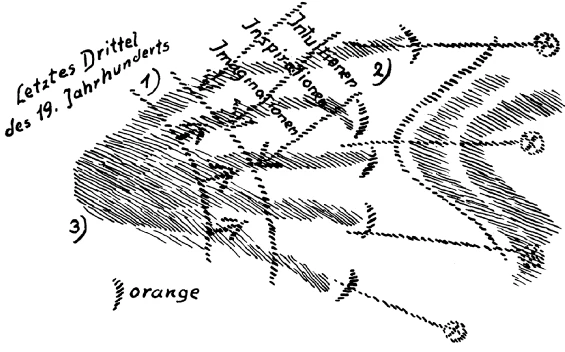
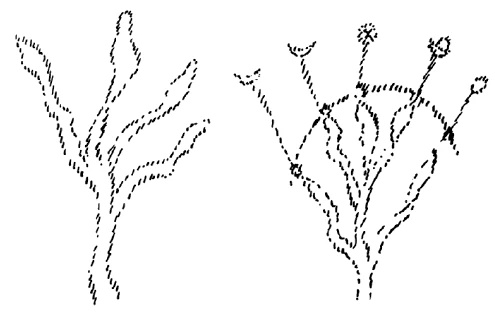

Wenn wir dasjenige durchdringen wollen, was den beiden in das Menschenleben eingreifenden Impulsen, der sogenannten Freiheit und der sogenannten Notwendigkeit, zugrunde liegt, dann müssen wir zu den mancherlei Voraussetzungen, die wir schon geschaffen haben, einige andere noch hinzufügen. Und das will ich heute tun, damit wir dann morgen in der Lage sind, gewissermaßen die Konklusion, den Schluß in bezug auf den Freiheits-- und Notwendigkeitsbegriff im menschlichen, sozialen, sittlichen und geschichtlichen Wirken zu ziehen. Wenn man solche Dinge bespricht, dann kommt eigentlich immer mehr in Betracht, daß die Menschen, und namentlich die Menschen der Gegenwart danach streben, die höchsten, die wichtigsten, die bedeutsamsten Dinge mit den allereinfachsten Begriffen und Vorstellungen zu umfassen. Um eine Uhr zu begreifen - ich habe das öfters schon erwähnt -, dazu hält man mancherlei Kenntnisse für notwendig, und man wird nicht ohne einen Schimmer davon zu haben, wie Räder zusammenwirken oder dergleichen, aus dem Stegreif heraus den Gang einer Uhr im einzelnen erklären wollen. Ein Sachverständiger über Freiheit und Notwendigkeit will man eigentlich in jeder Lage des Lebens sein, ohne über diese Dinge etwas zugrunde Liegendes gelernt zu haben. Über die allerwichtigsten, allerwesentlichsten Dinge, die nur eingesehen werden können im ganzen Zusammenhange mit der Menschennatur, möchte man sich am liebsten nicht unterrichten und alles mögliche wie von selbst wissen und beurteilen. Das ist insbesondere so die Sehnsucht unserer Zeit. Wenn geltend gemacht wird, daß der Mensch eine komplizierte, eine mannigfaltigst zusammengesetzte Wesenheit ist, eine Wesenheit, die auf der einen Seite tief eintaucht in alles das, was mit dem physischen Plane zusammenhängt, auf der andern Seite wiederum seelisch tief eintaucht in all das, was mit den geistigen Welten zusammenhängt, dann wird gar leicht erwidert, daß solche Dinge trocken, verstandesmäßig seien, daß man die allerwichtigsten und wesentlichsten Dinge in einer ganz andern Weise auffassen müsse. ^x54ohj

Die Welt wird kennenlernen müssen - sie lernt es vielleicht doch gerade durch die gegenwärtigen katastrophalen Ereignisse schon ein wenig —, was alles im Menschen und in seinem Zusammenhange mit dem Gang der Weltenentwickelung Verborgenes liegt. Wir haben seit Jahren betont, daß wir dasjenige im Rohen unterscheiden können im Menschen, was man seine physische Natur nennt, seinen physischen Leib, seinen Ätherleib, den Bildekräfteleib, wie ich ihn nenne, seinen astralischen Leib, der schon Seelisches ist, und das eigentliche Ich. ^745rzo

Wir haben nun in den letzten Zeiten von den verschiedensten Gesichtspunkten her betont, daß der Mensch, so wie er lebt vom Aufwachen bis zum Einschlafen, also im gewöhnlichen wachen Tagesbewußtsein, eigentlich in Wirklichkeit nur etwas weiß von den Eindrücken seiner Sinneswahrnehmungen und noch von seinen Vorstellungen, daß er aber den eigentlichen Inhalt seines Gefühlslebens verträumt, und den eigentlichen Inhalt seines Willenslebens verschläft. Traum und Schlaf dehnen sich herein in die gewöhnliche Welt des Wachens, und mehr bewußt als eines’ Traumes sind wir uns auch unseres Gefühlslebens nicht im gewöhnlichen Wachbewußtsein. Mehr bewußt als im traumlosen Schlafe ist sich der Mensch seines wirklichen Willensinhaltes nicht. Denn durch unsere Gefühle, durch unseren Willensinhalt tauchen wir in dieselbe Welt hinein — das haben wir in diesen Betrachtungen betont -, in welcher wir gemeinschaftlich mit den Toten unter den Wesenheiten der höheren Hierarchien, der Angeloi, Archangeloi, Archai und so weiter leben. Sobald wir in einem Gefühle leben - und wir leben ja fortwährend in Gefühlen -, lebt in der Sphäre, in dem Gebiete dieses Fühlens alles dasjenige mit, was im Reiche der Toten ist. ^ri2uad

Nun kommt ein anderes dazu. Wir sprechen im gewöhnlichen wachen Bewußtseinsleben von unserem Ich. Aber von diesem Ich können wir eigentlich mit dem gewöhnlichen Wachbewußtsein nur in recht uneigentlichem Sinne sprechen. Denn welche Natur und Wesenheit hat eigentlich dieses Ich? Es kann nicht erkannt werden im gewöhnlichen Wachbewußtsein. Taucht das schauende Bewußtsein in das wahre Wesen des Ich ein, dann ist das wahre Ich des Menschen willensartiger Natur. Das, was der Mensch im gewöhnlichen Bewußtsein hat, ist nur die Vorstellung des Ich. Daher wird es dem naturforscherischen Psychologen leicht, dieses Ich überhaupt wegzuleugnen, obwohl andererseits dieses Wegleugnen ein wirklicher Unsinn ist. Solche Naturforscher und Psychologen sprechen davon, daß das Ich sich eigentlich nach und nach heranbilde, daß der Mensch im Verlauf seiner individuellen Entwickelung zu diesem Ich komme. Er kommt nicht zu dem Ich, sondern zu der Ich-Vorstellung auf diese Art. Und es ist leicht hinwegzuleugnen, weil es eben im gewöhnlichen Bewußtsein nur eine Vorstellung, ein Spiegelbild des wirklichen, wahren, echten Ich ist. Das echte Ich lebt in derselben Weltensphäre, in der die wahre Wirklichkeit unseres Willens lebt. Und das, was wir den astralischen Leib nennen, was wir als das eigentliche Seelenleben bezeichnen können, das wiederum lebt in derselben Sphäre, in der da lebt unser Gefühlsleben. Wenn Sie die beiden Dinge zusammennehmen, die wir so betrachtet haben, können Sie daraus wiederum ersehen, daß wir mit unserem Ich und mit unserem astralischen Leib untertauchen in dasselbe Gebiet, das wir mit den Toten gemeinschaftlich haben. In dem Augenblicke, wo wir hellseherisch in unser wahres Ich hinuntersteigen, sind wir ebenso unter den Ichen der Toten wie unter den Ichen der sogenannten Lebendigen. ^6gc44j

So etwas muß man sich nur ganz klarmachen, um voll einzusehen, wie sehr der Mensch mit seinem gewöhnlichen Bewußtsein in der sogenannten Scheinwelt, oder wie man es mit einem orientalischen Ausdrucke nennt, in der Maja lebt. Wir leben wachbewußt in unserer Sinnes- und in unserer Vorstellungswelt. Aber die Sinnesimpulse, die geben uns nur den Teil der Welt, der als Natur sich ausbreitet. Und unsere Vorstellungswelt gibt uns auch nichts anderes als dasjenige in uns, was unserer Natur angemessen ist, aber zwischen der Geburt und dem Tode. Dasjenige, was unsere ewige Natur ist, das tritt im Grunde gar nicht aus der Welt heraus, die wir mit den Toten gemeinschaftlich haben. Das verbleibt im Grunde genommen in der Welt, in der die Toten auch sind, wenn wir durch die Verkörperung in das Leben des physischen Planes eintreten. ^vrw8l8

Um aber diese Dinge voll zu verstehen, haben wir nötig, gewisse Begriffe aufzunehmen, die - man kann schon nichts dafür, das sagen zu müssen, weil die Dinge eben so sind — nicht ganz leicht zu durchdenken sind, bei denen man sich, um sie zu durchdenken, Mühe geben muß. Solche Begriffe hat zunächst der Mensch im Verlaufe seines gewöhnlichen wachen Bewußtseins nicht. Der Mensch kennt im gewöhnlichen wachen Bewußtsein das, was räumlich ausgedehnt ist, was in der Zeit verläuft. Und er möchte eigentlich mit dem zufrieden sein, was räumlich ausgedehnt ist und was in der Zeit verläuft. Krankt ja sogar der Mensch vielfach daran, sich auch dasjenige, was in der geistigen Welt enthalten ist, möglichst räumlich zu denken, wenn auch nebulos, wenn auch dünn und nebelhaft, aber er möchte es doch irgendwie sich räumlich denken: räumlich herumfliegende Seelen und dergleichen möchte er sich denken. Man muß über die Begriffe von Raum und Zeit hinausgehen zu komplizierteren Begriffen, wenn man in diese Dinge wirklich eindringen will. Und da möchte ich Ihnen denn heute etwas andeuten, was wichtig ist zur Erfassung des menschlichen Gesamtlebens. ^qkqrpd

Fassen wir noch einmal ins Auge — wie gesagt, im Rohen -, daß wir diese vierfache Natur zunächst haben: den physischen Leib, den Bildekräfte- oder Ätherleib, den astralischen Leib und das Ich. Wenn man so vom Standpunkte des gewöhnlichen wachen Bewußtseins aus redet und frägt: Wie alt ist eigentlich ein Mensch, dieser bestimmte Mensch A, wie alt ist er? - Nun, da wird irgend jemand sein Alter angeben, sagen wir fünfunddreißig Jahre, und er glaubt, damit etwas Ernsthaftes gesagt zu haben. Er hat auch für den physischen Plan und das gewöhnliche Wachbewußtsein etwas Ernsthaftes damit gesagt, daß er fünfunddreißig Jahre alt sei. Aber für die geistige Welt, also für die Gesamtwesenheit des Menschen, ist damit nur teilweise etwas gesagt. Denn Sie können eigentlich, wenn Sie sagen, ich bin fünfunddreißig Jahre alt, dies nur für Ihren physischen Leib sagen. Sie müßten sagen: Mein physischer Leib ist fünfunddreißig Jahre alt - dann würde die Sache stimmen. Für den ätherischen oder Bildekräfteleib, für die andern Glieder der menschlichen Wesenheit haben Sie aber damit noch gar nichts gesagt. Denn daß Ihr Ich zum Beispiel auch fünfunddreißig Jahre alt sein soll, wenn Ihr physischer Leib fünfunddreißig Jahre alt ist, das ist eine bloße Illusion, das ist sogar eine reine Phantasterei. Denn sehen Sie, hier tritt auf der Begriff verschieden geschwinder, verschieden schneller Entwickelung der verschiedenen Glieder der menschlichen Natur. ^39bn05

Das können Sie sich durch folgende Zahlen klarmachen. Der Mensch wird, sagen wir sieben Jahre alt; das heißt aber nichts anderes als: sein physischer Leib ist sieben Jahre alt geworden. Dann ist deshalb sein Ätherleib, sein Bildekräfteleib noch nicht sieben Jahre alt, sondern sein Bildekräfteleib macht nicht so schnell mit; der ist noch nicht so alt geworden. Man kommt auf diese Dinge nur deshalb nicht, weil man die Zeit sich eben so als einen einheitlich dahinlaufenden Strom vorstellt und man sich gar nicht denken kann, daß innerhalb der Zeit verschiedenes mit verschiedener Geschwindigkeit vorwärtsgeht. Dieser physische Leib, der sieben Jahre ist, der hat sich mit einer gewissen Geschwindigkeit entwickelt. Langsamer hat sich entwickelt der Ätherleib, noch langsamer der astralische Leib, und am langsamsten das Ich. Dieser Ätherleib ist erst fünf Jahre drei Monate alt, wenn der physische Leib sieben Jahre alt ist, weil er ein langsameres Tempo durchmacht. Der astralische Leib ist drei Jahre sechs Monate alt. Und das Ich ist ein Jahr neun Monate alt. So daß Sie sich sagen müssen, wenn ein Kind sieben Jahre alt ist, so ist sein Ich erst ein Jahr neun Monate alt. Es macht dieses Ich eine langsamere Entwickelung durch auf dem physischen Plane. Es geht dieses Ich auf dem physischen Plane ein langsameres Tempo, jenes langsamere Tempo, welches auch das Tempo ist, das man gemeinschaftlich mit den Toten durchleben kann. Warum faßt denn der Mensch dasjenige, was im Strom des Erlebens der Toten stattfindet, nicht auf? Weil er sich nicht angewöhnt, das langsamere Tempo einzuschlagen im Halten von Gedanken, im Halten von Gefühlen namentlich, in dem die Toten verharren. ^1h0miq

Ist also ein Mensch achtundzwanzig Jahre alt seinem physischen Leibe nach, so ist sein Ich erst sieben Jahre alt. Sie können also nur den Anspruch darauf machen, daß Sie in bezug auf Ihr Ich, was das Eigentliche Ihrer Wesenheit ist, ein viel langsameres Tempo einhalten in der Entwickelung als in bezug auf den physischen Leib. Die Schwierigkeit besteht darinnen, daß man sonst Geschwindigkeiten nur als äußere Geschwindigkeiten auffaßt. Wenn die Dinge nebeneinander hinlaufen, so sagt man: Eines geht schneller und das andere geht langsamer - weil man die Zeit zum Vergleich hat. Aber hier ist die Geschwindigkeit in der Zeit verschieden. Ohne diese Einsicht aber, daß die verschiedenen Glieder der menschlichen Natur verschiedenes Tempo haben zu ihrer Entwickelung, ist es unmöglich, dasjenige einzusehen, was mit der eigentlichen tieferen Wesenheit des Menschen zusammenhängt. ^y7uatt

Sie sehen aber daraus, wie man im gewöhnlichen Bewußtsein eigentlich ganz verschiedene Dinge, die in der menschlichen Natur sind, einfach zusammenwirft. Der Mensch hat diese viergliederige Wesenheit, und die vier Glieder dieser Wesenheit sind so voneinander verschieden, daß sie sogar verschiedenes Alter haben. Der Mensch aber gibt sich dadurch einer beträchtlichen Illusion hin, daß er alles auf seinen physischen Leib bezieht. Er sagt etwas, was schlechterdings vor der geistigen Welt gar keinen Sinn hat, wenn er behauptet, sein Ich sei achtundzwanzig Jahre alt, wenn er seinem physischen Leibe nach achtundzwanzig Jahre alt ist. Es hätte nur einen Sinn, wenn er dann sagen würde: Mein Ich ist sieben Jahre alt - wobei aber dann ein Jahr selbstverständlich viermal so lang ist. ^73q3xc

Man könnte die Sache auch so ausdrücken: die vier verschiedenen Glieder der menschlichen Wesenheit rechnen nach ganz verschiedenen Zeitmaßen. Das Ich rechnet einfach ein Jahr viermal so lang als der physische Leib. Und bildhaft könnten Sie sich das so vorstellen, wenn Sie es sich projizieren wollten auf den physischen Plan heraus. Während zum Beispiel ein Mensch normal wächst, achtundzwanzig Jahre alt wird, wachse ein Kind langsamer und sei nach achtundzwanzig Jahren ein siebenjähriges Kind. So zunächst erscheint die ganze Sache wie eine abstrakte Wahrheit, aber es ist im Menschen eine gründliche Wirklichkeit. Denn denken Sie doch, daß wir in unserem Ich dasjenige tragen, was wir unseren Verstand, unser selbstbewußtes Denken nennen. Wenn wir in unserem Ich unseren Verstand, unser selbstbewußtes Denken haben, dann sind unser Verstand und unser selbstbewußtes Denken eigentlich wesentlich jünger, als wir scheinbar unserem physischen Leibe nach sind. Das sind sie auch, das sind sie wirklich! ^f4bcm1

Ja, da kommen Sie aber darauf, einzusehen: wenn ein solcher Mensch achtundzwanzig Jahre alt ist und den Eindruck eines achtundzwanzigjährig entwickelten Verstandes macht, so ist das, was sein Eigen ist von diesem Verstand, den er hat, nur ein Viertel. Es hilft nichts: wenn wir mit achtundzwanzig Jahren eine gewisse Summe von Verstand haben uns eigen ist nur ein Viertel davon, das andere gehört der allgemeinen Welt an; das andere gehört der Welt an, in die wir eingetaucht sind durch unseren astralischen Leib, durch unseren ÄÄtherleib, durch unseren physischen Leib. Aber von denen wissen wir ja unmittelbar nur durch Vorstellungen, durch Sinneswahrnehmungen etwas, also auch wiederum im Ich. Das heißt, wenn wir als Menschen uns entwickeln zwischen der Geburt und dem Tode, so sind wir eigentlich rechte Scheinwesen der Wirklichkeit. Wir machen den Eindruck von viermal so gescheiten Wesen, als wir in Wirklichkeit sind. Das ist wahr! Alles, was wir außer jenem Viertel haben, das verdanken wir dem, was da waltet im historischen, im sozialen, im moralischen Wirken jener Welt, die wir verträumen, die wir verschlafen. Träume, Schlafimpulse, die wir mit der Allgemeinheit gemein haben, brodeln herauf über den Horizont unseres Daseins und befruchten unser Verstandes- und Seelenviertel und machen es viermal so stark, als es in Wirklichkeit ist. ^fdzrq1

Hier ist der Punkt, wo die Täuschung entsteht in bezug auf die Freiheit des Menschen. Der Mensch ist ein freies Wesen; das ist er schon. Aber nur der wahre Mensch ist ein freies Wesen — jenes Viertel, von dem ich eben gesprochen habe, das ist ein freies Wesen. Die andern drei Viertel, in die spielen andere Wesenheiten herein; die können nicht frei sein. Und dadurch entsteht die Täuschung in bezug auf die Freiheit, daß man immer frägt: Ist der Mensch frei oder ist er nicht frei? Frei ist der Mensch, wenn er diesen Begriff der Freiheit bezieht auf das eine Viertel seines Wesens in dem Sinne, wie ich das jetzt auseinandergeserzt habe. Will der Mensch diese Freiheit als einen eigenen Impuls haben, dann muß er allerdings dieses Viertel in entsprechend selbständiger Weise entwickeln. Im gewöhnlichen Leben kann dieses Viertel nicht zu seinem Rechte kommen, aus dem einfachen Grunde, weil es von den übrigen drei Vierteln überwältigt wird. In den übrigen drei Vierteln wirkt alles dasjenige, was der Mensch in sich trägt als seine Triebe, seine Begierden, seine Affekte, seine Leidenschaften. Die ertöten seine Freiheit, denn durch die Triebe, durch die Affekte, durch die Leidenschaften wirkt dasjenige hindurch, was an Impulsen in der Allgemeinheit ist. ^9n0w6e

Nun entsteht die Frage: Was wollen wir tun, um das eine Viertel von Seelenleben, das in uns Realität ist, wirklich zur Freiheit zu bringen? Wir müssen es in Beziehung setzen, dieses Viertel, zu dem, was unabhängig ist von dem übrigen Dreiviertel. ^ricog0

Philosophisch habe ich eben versucht, diese Frage zu beantworten in meiner «Philosophie der Freiheit», indem ich damals zu zeigen bestrebt war, wie der Mensch nur dadurch in sich den Impuls der Freiheit realisieren kann, wenn er sein Handeln, sein Tun ganz unter den Einfluß des reinen Denkens stellt, wenn er dazu kommt, reine Gedankenimpulse zu seinen Handlungsimpulsen machen zu können, Impulse, die gar nicht herausentwickelt sind aus der äußeren Welt. Denn alles das, was aus der äußeren Welt entwickelt ist, läßt uns nicht Freiheit realisieren. Freiheit realisieren läßt uns nur dasjenige, was sich unabhängig von der äußeren Welt in unserem Denken als Antrieb unseres Handelns entwickelt. ^s65jr3

Woher kommen solche Antriebe? Woher kommt das, was nicht aus der äußeren Welt kommt? Nun, es kommt aus der geistigen Welt. Der Mensch braucht sich nicht in jeder Lage seines Lebens hellseherisch bewußt zu sein, wie diese Impulse aus der geistigen Welt kommen, aber sie können in ihm doch da sein. Nur wird er sie notwendigerweise etwas anders auffassen müssen. Wenn wir uns im schauenden Bewußtsein zur ersten Stufe der geistigen Welt erheben, so ist das die imaginative Welt; die zweite Stufe ist die inspirierte Welt, wie Sie wissen; die dritte Stufe die intuitive Welt. Statt daß wir also die Impulse unseres Wollens, unseres Handelns aufsteigen lassen aus unserem physischen, aus unserem astralischen, aus unserem ätherischen Leib, können wir, wenn wir von dieser Seite her keine Impulse empfangen, sondern sie aus der geistigen Welt empfangen, sie nur entgegennehmen als Imaginationen, hinter denen Inspirationen, hinter denen Intuitionen stehen. Aber das braucht nicht bewußt als hellseherisches Bewußtsein erlebt zu werden: Jetzt will ich dieses, dahinter stehen Intuitionen, Inspirationen, Imaginationen -, sondern das Resultat davon tritt auf als ein Begriff, als ein reines Denken, sieht so aus, wie ein in der Phantasie geschaffener Begriff. Weil das so ist, weil ein solcher Begriff, der dem freien Handeln zugrunde liegt, für das gewöhnliche Bewußtsein wie ein aus der Phantasie heraus geschaffener Begriff erscheinen muß, nannte ich das, was dem freien Handeln zugrunde liegt, in meiner «Philosophie der Freiheit» die moralische Phantasie. Was ist also diese moralische Phantasie? Diese moralische Phantasie ist, ich möchte sagen, das Gegenteil eines Spiegelbildes. Dasjenige, was wir um uns herum als die äußere physische Wirklichkeit ausgebreitet haben, das ist ein Spiegelbild, da werden uns die Dinge zurückgespiegelt. Die moralische Phantasie ist das Tableau, durch das wir nicht durchsehen. Daher erscheinen uns die Dinge als Phantasie. Hinter ihnen stehen aber die eigentlichen Impulse: Imaginationen, Inspirationen, Intuitionen, die wirken (siehe Zeichnung S. 102). Wenn man nicht weiß, daß diese wirken, sondern nur das, was sie bewirken, ins Bewußtsein, ins gewöhnliche Bewußtsein hereinbekommt, so sieht es wie eine Phantasie aus. Und diese Ergebnisse der moralischen Phantasie, diese nicht aus Trieben, Leidenschaften, Affekten geholten Antriebe des Handelns, sie sind freie Antriebe. ^810axm

Wie soll man aber zu ihnen kommen? Würde man sich ohne weiteres zum hellseherischen Bewußtsein erheben, dann würde man durch das Hellsehen bewußt dazu kommen. Aber das braucht man gar nicht. Moralische Phantasie kann auch der Mensch entwickeln, der nicht hellseherisch ist. Alles dasjenige, was den wirklichen Fortschritt der Menschheit bedeutet hat, ist immer aus moralischer Phantasie hervorgegangen, insoferne dieser Fortschritt auf ethischem Gebiete lag. Es handelt sich nur darum, daß der Mensch zuerst ein Gefühl entwickelt, und dann ein gesteigertes Gefühl - wir werden gleich deutlicher hören, was unter diesem gesteigerten Gefühl zu verstehen ist -, daß er hier auf dieser Erde da ist, um Dinge zu tun, welche nicht bloß seine Persönlichkeit, seine Individualität angehen, sondern um Dinge zu tun, durch die dasjenige verwirklicht wird, was die Zeitgeister wollen. ^nlai2e

Es scheint zunächst, als ob etwas ganz Besonderes dahinter stecke, wenn man sagt, der Mensch soll dasjenige realisieren, was die Zeitgeister wollen. Es wird eine Zeit kommen, wo man dies aber viel besser verstehen wird als in der Gegenwart. Und es wird eine Zeit kommen, wo man anderes zu Inhalten des menschlichen Lehrens machen wird, als es die Gegenwart macht, wo selbst den Allergebildetsten nur Begriffe beigebracht werden, die auf die Natur gehen. Denn was beigebracht wird den Leuten mit Bezug auf das ethische, mit Bezug auf das soziale Leben, das sind zumeist wesenlose, schemenhafte Abstraktionen, das sind äußerste Abstraktionen. ^ol9cm8

In dieser Beziehung haben wir dasjenige noch nicht erreicht, was frühere Zeiten hatten. Nur kann sich der Mensch jetzt sehr schwer in frühere Zeiten hineindenken. Frühere Zeiten hatten Mythen - Mythen, die mit dem lebendigen Leben des Volkes zusammenhingen, Mythen, die in Dichtung, in Kunst, in alles mögliche hineinwirkten. Und womit beschäftigten sich diese Mythen? Man redete im Griechischen von Odipus, von Herkules, von andern Heroen, denen man nachstrebte, die etwas getan hatten, was die Einleitung von Taten war, in deren Fußstapfen man treten wollte. Jeder einzelne wollte in ihre Fußstapfen treten. Nach rückwärts leitete der Faden des Vorstellens, der Faden des Denkens, der Faden des Empfindens. Man fühlte sich eins mit längst Verstorbenen. Dasjenige, was von den Verstorbenen als ein Impuls ausgegangen ist, das wurde erzählt im Mythus, und im Durchleben des Mythus, im Sich-Einswissen mit den Impulsen des Mythus lebten diese Menschen. ^0oa436

Etwas Ähnliches muß wieder geschaffen werden, wird geschaffen werden, wenn die Impulse der Geisteswissenschaft richtig verstanden werden. Nur werden allerdings die Seelenblicke der Zukunft weniger nach rückwärts als nach vorwärts gerichtet sein. Aber was Inhalt des öffentlichen Unterrichts werden muß, das ist das, was den Menschen zusammenbindet mit dem Werden der Zeit, und damit mit den Impulsen vor allem des Zeitgeistes, des entsprechenden Wesens aus der Hierarchie der Archai, von dem ich in einer früheren Betrachtung gesagt habe, daß ihm ebenso die sogenannten Toten gegenüberstehen wie die Lebendigen. Lernen wird man im öffentlichen Unterricht in der Zukunft, was der Inhalt eines solchen Zeitalters ist wie desjenigen, das mit dem 15. Jahrhundert begonnen und zugleich das griechisch-lateinische Zeitalter abgeschlossen hat; lernen wird man, was das allgemeine Weltenall in diesem fünften nachatlantischen Zeitraum eigentlich will. Die Impulse dieses fünften nachatlantischen Zeitraums wird man aufnehmen. Man wird wissen: das muß sich realisieren zwischen dem 15. Jahrhundert und einem Jahrhundert in einem folgenden Jahrtausend. Und man wird wissen: man gehört seinem Zeitalter so an, daß durch einen hindurchströmen die Impulse dieses bestehenden Zeitalters. Die Kinder schon werden es in der Zukunft lernen, wie sie Blumen benennen, wie sie Sterne benennen lernen - das tun sie ja heute wieder weniger, aber das ist wenigstens etwas Außerlich-Reales -, so werden sie lernen, die wirklichen geistigen Impulse des Zeitalters aufzunehmen. Dazu müssen sie allerdings erst erzogen werden, dazu muß erst aufhören, dasjenige Geschichte zu heißen, was jetzt als Geschichte erzählt wird. Statt all der Dinge, von denen heute die Geschichte erzählt, wird man in einer nicht zu fernen Zukunft von den geistigen Impulsen, die hinter dem geschichtlichen Werden stehen und die von den Menschen geträumt werden, sprechen. Denn diese geistigen Impulse sind dasjenige, was den Menschen aufruft zur Freiheit und ihn frei macht, weil es ihn erhebt zu der Welt, aus der die Intuitionen, Inspirationen, Imaginationen kommen. Denn dasjenige, was äußerlich auf dem physischen Plane geschieht, was äußerlich Geschichte ist - ich habe das selbst in öffentlichen Vorträgen auseinandergesetzt -, das hat schon seine Bedeutung verloren, wenn es vorüber ist; das hat in Wirklichkeit nicht die Bedeutung, daß man sagen kann: Das Vorhergehende ist immer die Ursache des Nachfolgenden. — Es gibt nichts Unsinnigeres, als Geschichte etwa so zu erzählen, daß man die Taten Napoleons im Beginn des 19. Jahrhunderts erzählt und dann glaubt, dasjenige, was später geschehen ist, nachdem Napoleon verbannt worden ist, sei die Folge desjenigen, was Napoleon zu seiner Zeit getan hat. Nichts Unsinnigeres gibt es als das! Denn das, was man von Napoleon erzählen kann, bedeutet für die Wirklichkeit genau dasselbe, was es für das Leben eines Menschen bedeutet, wenn ich drei Tage nach seinem Tode seinen Leichnam beschreibe. Dasjenige, was jetzt Geschichte genannt wird, ist gegenüber der Wirklichkeit des geschichtlichen Werdens Kadavergeschehen, wenn auch die Erzählung dieses Kadavergeschehens im Bewußtsein mancher Menschen außerordentlich viel bedeutet. ^w3xq02

Was äußerlich geschehen ist, wird erst eine Wirklichkeit, wenn es aufgezeigt wird in seinem Hervorsprießen aus den geistigen Impulsen. Dann wird man vielfach sehen, daß das, was ein Mensch tut, sagen wir in irgendeinem bestimmten Jahrzehnt eines Jahrhunderts, die Folge von etwas ist, was er erfahren hat, bevor er zu seiner eigenen Erdeninkarnation gegangen ist, gar nicht die Folge von dem, was vor Jahrzehnten im Verlauf des physischen Erlebens auf der Erde sich zugetragen hat und so weiter. Gerade mit Bezug auf das geschichtliche, mit Bezug auf das soziale und sittliche Leben wird die anthroposophisch orientierte Geisteswissenschaft vertiefend, befruchtend wirken müssen, namentlich auf dem Gebiete der Geschichte. Dieses Wissen der geistigen Impulse, das, zu den Forderungen unserer Zeit erhoben, etwas ähnliches sein wird, wie für die alten Zeiten das Drinnenstehen im lebendigen Mythus es war, das wird die Menschen erfüllen mit solchen Impulsen für ihr Tun und Handeln, die sie frei machen. Diese Dinge müssen zuerst verstanden werden, dann werden sie, wenn sich das Verständnis immer mehr und mehr ausbreitet, schon eingreifen in das wirkliche Leben. ^4m613a

Aber noch ein anderes geht Ihnen ja gerade aus diesen Betrachtungen hervor. Es geht Ihnen daraus hervor, daß die Gefühlsimpulse, die Willensimpulse, mit denen wir in derselben Lebenssphäre drinnenstehen, in der auch die sogenannten Toten drinnenstehen, dann eine höhere, eine intensivere Wirklichkeit sind als dasjenige,was wir mit dem wachen Bewußtsein als Vorstellungen und als Sinnesempfindungen kennen. Daher kann das, was jetzt eben so gefordert worden ist, daß es auch ein Gegenstand der öffentlichen Belehrung werden muß, nur recht fruchtbar werden, wenn es nicht nur mit dem Verstande aufgefaßt wird, sondern wenn es übergeht in die Impulse des Fühlens, in die Impulse des Wollens. ^mvvmir

Das kann nur geschehen, wenn in Geisteswissenschaft eine reale Wirklichkeit gesehen wird, und nicht eine bloße Lehre. Es wird leicht in Geisteswissenschaft eine bloße Lehre gesehen, eine Theorie. Aber Geisteswissenschaft ist nicht eine bloße Lehre, ist nicht eine bloße Theorie, Geisteswissenschaft ist ein lebendiges Wort. Denn was als Geisteswissenschaft verkündet wird, ist die Offenbarung aus den Welten, die wir gemeinschaftlich haben mit den höheren Hierarchien und mit der Welt der sogenannten Toten. Diese Welt selbst spricht zu uns durch Geisteswissenschaft. Und der, welcher wirklich Geisteswissenschaft versteht, der weiß, daß in der Geisteswissenschaft forttönt das, was Seelenmusik der geistigen Welt ist. Dasjenige, was herausgelesen wird aber jetzt nicht aus toten Buchstaben, sondern aus wirklichem Geschehen der geistigen Welt —, es kann schon unser Gefühl durchdringen mit lebendigem Leben, wenn wir Geisteswissenschaft in diesem Sinne als etwas auffassen, was aus der geistigen Welt zu uns hereinspricht. ^enoq9w

Ich habe betont, wie das der Fall ist, als ich besprach, wie seit dem Jahre 1879 auf der einen Seite die Gelegenheit gegeben ist, daß in der Art, wie es früher nicht vorhanden war, Geistesleben herunterfließe auf den physischen Plan, auf der andern Seite allerdings es seine Gegner findet in den Geistern der Finsternis, von denen wir gesprochen haben. Und gerade mit Bezug auf dieses Einleben des geisteswissenschaftlichen Inhaltes in Gefühl und Wille muß gewissermaßen noch alles, alles geschehen. Und dieses kann nur geschehen, wenn gewisse Dinge, mit Bezug auf welche die Menschen gegenwärtig geradezu in einer Kultursackgasse angelangt sind, sich gründlich ändern. ^9z8q41

 ^ojfrw3

Und durchdringen muß man sich damit: Auf der einen Seite schreitet die Entwickelung so fort, daß allerdings die Ereignisse der Geschichte sich vergleichen lassen mit einem Baum, der wächst; aber wenn sich die Blätter bis zu seiner äußeren Peripherie entwickelt haben, wächst er nicht weiter, da beginnt das Absterben. So ist es mit den geschichtlichen Ereignissen. Bleiben wir bei dem Bilde, das ich in diesen Betrachtungen schon früher gebraucht habe: Es gibt eine ganz bestimmte Summe von geschichtlichen Ereignissen, die haben ihre Wurzeln im letzten Drittel des 18. Jahrhunderts - davon werde ich dann morgen deutlicher sprechen -, dazu kommen andere Einflüsse im Lauf des 19. Jahrhunderts und so weiter. Und sehen Sie, diese historischen Ereignisse, die breiten sich aus und erreichen äußerste Grenzen (Siehe Zeichnung). Aber jene Grenzen sind nicht so wie bei einem Baum oder bei einer Pflanze, wo es an der Peripherie einfach nicht weiterwächst, sondern es muß eine neue Wurzel geschichtlicher Ereignisse beginnen. Wir leben im eminentesten Sinne seit Jahrzehnten schon in einer Zeit, in der solche neuen geschichtlichen Ereignisse aus unmittelbaren Intuitionen heraus beginnen müssen (rechte Hälfte der Zeichnung). Nur ist es im geschichtlichen Leben der Menschen so, daß auch über diese Dinge leicht Illusionen sich ausbreiten. Sie können ja eine Pflanze, die durch ihr inneres Gesetz bis zu einer gewissen Peripherie wächst, naturgemäß wachsend ansehen nur bis zu dieser Peripherie. Jetzt aber könnten Sie eine Illusion hervorrufen: Sie könnten Drähte anbringen, Papierblätter an die Drähte anhängen und könnten sich der Illusion hingeben, daß dann die Pflanze bis dahin gehe. ^f2ynhg

 ^v1e0iw

Solche Drähte gibt es allerdings bei geschichtlichen Ereignissen! Während längst ein anderer Duktus des geschichtlichen Ereignisses da sein sollte, gibt es solche Drähte. Nur sind im geschichtlichen Werden diese Drähte die menschlichen Vorurteile, die menschlichen Bequemlichkeiten, die das, was längst abgestorben ist, eben in toten Drähten fortsetzen. Dann setzen sich gewisse Leute an das Ende dieser toten Drähte, und die Menschen, die sich dann an das Ende dieser toten Drähte setzen, das heißt, an die äußersten Ranken der menschlichen Vorurteile, die werden oftmals auch als historische Persönlichkeiten aufgefaßt, ja oftmals als die richtigen historischen Persönlichkeiten. Und man ahnt gar nicht, inwiefern diese Persönlichkeiten an solchen Drähten menschlicher Vorurteile sitzen! Ein wenig sich ein Urteil zu bilden, wieviel Persönlichkeiten, die in der Gegenwart als «große» angesehen werden, an solchen Drähten menschlicher Vorurteile pendeln, das gehört schon zu den wichtigen Aufgaben der Gegenwart. ^a491bf