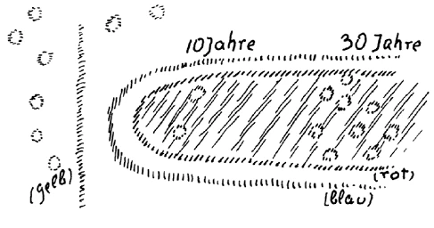

Den Betrachtungen, die in diesen Wochen gehalten worden sind, lag verschiedenes zugrunde, das dazu führen kann, die menschliche Natur in ihrem Zusammenhang mit dem geschichtlichen Werden der Menschheit so zu verstehen, daß man sich allmählich eine Vorstellung bilden kann über Notwendigkeit und Freiheit. Weniger können solche Dinge entschieden werden durch Definitionen und Wortauseinandersetzungen als dadurch, daß man die entsprechenden Wahrheiten aus der geistigen Welt zusammenträgt. Die Menschheit wird sich in unserem Zeitalter immer mehr daran gewöhnen müssen, eine andere Art des Verständnisses der Wirklichkeit sich anzueignen, als es die heute so vielfach herrschende und übliche ist, die sich im Grunde genommen an sehr Sekundäres, an allerlei nebulose Vorstellungen in Anknüpfung an Wortdefinitionen und so weiter hält. Man hat heute, wenn man das vornimmt, was manche Leute schreiben oder sagen, die sich für ganz besonders gescheit halten, das Gefühl: sie reden in Begriffen und Vorstellungen, die nur scheinbar bestimmt, in Wirklichkeit aber so unbestimmt sind, wie wenn jemand über einen gewissen Gegenstand sprechen würde, der zum Beispiel aus einem Kürbis gemacht ist. Hat man einen Kürbis umgestaltet zu einer Flasche und benützt ihn als Flasche, so kann man über diesen Gegenstand so reden, als ob man über einen Kürbis redet, denn ein Kürbis ist es in Wirklichkeit; aber man kann auch wie über eine Flasche reden, denn eine Flasche ist er ja auch, er wird richtig benützt als Flasche. Nicht wahr, die Dinge, über die man spricht, bekommen erst ihre Valeurs in den Zusammenhängen, in denen man sich ergeht. Wenn man nicht in Anlehnung an Worte, sondern aus einer gewissen Anschauung heraus spricht, so wird jeder Mensch wissen, ob man eine Flasche meint oder einen Kürbis. Aber man darf sich dann nicht auf die Beschreibung des Gegenstandes oder die Definition des Gegenstandes beschränken. Denn solange man sich auf eine Beschreibung, auf eine Definition beschränkt, kann es ebensogut ein Kürbis oder eine Flasche sein. Und so kann heute dasjenige, worüber viele Philologen, Leute, die sich sehr gescheit dünken, reden, die Seele des Menschen sein, es kann aber auch der Leib des Menschen sein, es kann Kürbis und kann Flasche sein. ^z6kv6s

Ich meine mit dieser Bemerkung sehr vieles von dem, was in der Gegenwart sehr ernst genommen wird, zum Teil zum Unheil der Menschheit. Daher eben ist es notwendig, daß gerade von der anthroposophisch orientierten Geisteswissenschaft, zu der unter anderem auch klares, präzises Denken nötig ist, ausgehe ein Bestreben, nicht in einer solchen Weise, wie es heute üblich ist, die Welt anzuschauen, nicht den Kürbis mit der Flasche zu verwechseln, sondern überall auf das Reale zu sehen, sei es das äußere Physisch-Reale, sei es das Geistig-Reale. ^o0qdp8

Man kann ohnedies nicht zu einer wirklichen Vorstellung über dasjenige gelangen, was für den Menschen in Betracht kommt, wenn man sich an Definitionen und dergleichen hält, sondern nur dann, wenn man die Lebenszusammenhänge in ihrer Wirklichkeit ins Auge faßt. Und gar über solch wichtige Begriffe wie Freiheit und Notwendigkeit im sozialen, im sittlichen Leben, kann man nur Klarheit gewinnen, wenn man zusammenhält solche spirituellen Tatsachen, wie sie in diesen Betrachtungen vorgebracht worden sind, und gewissermaßen versucht, sie immer aneinander abzuwägen, um ein Urteil über die Wirklichkeit zu gewinnen. ^iadjs0

Bedenken Sie, daß ich schon in öffentlichen Vorträgen und auch hier wiederum in den verschiedensten Zusammenhängen mit einer gewissen Intensität immer wieder und wieder hervorgehoben habe, daß wir das, was wir Vorstellungen nennen, nur dann richtig begreifen können, wenn wir sie so in Beziehung bringen zu unserm leiblichen Organismus, daß wir den Vorstellungen im Leibe nicht etwas Wachsendes, Gedeihendes zugrunde liegend sehen, sondern gerade umgekehrt, etwas Absterbendes, etwas partiell im Leibe Absterbendes. Ich habe das so ausgesprochen in einem öffentlichen Vortrage, daß ich gesagt habe: Der Mensch stirbt eigentlich immer in sein Nervensystem hinein ab. Der Nervenprozeß ist ein solcher, daß er sich auf das Nervensystem beschränken muß. Denn würde er sich ausdehnen über den ganzen Organismus, würde dasselbe vorgehen im ganzen Organismus, was in den Nerven vorgeht, so würde dies den Tod des Menschen in jedem Augenblick bedeuten. Man kann sagen: Vorstellungen entstehen da, wo der Organismus sich selber abbaut, wir sterben in unser Nervensystem fortwährend hinein. - Dadurch ist Geisteswissenschaft in die Notwendigkeit versetzt, nicht nur diejenigen Prozesse zu verfolgen, welche die heutige Naturwissenschaft als die einzig maßgebenden betrachtet: die aufsteigenden Prozesse. Diese aufsteigenden Prozesse, sie sind Wachstumsprozesse, sie gipfeln noch im Unbewußten. Erst wenn der Organismus mit den absteigenden Prozessen beginnt, tritt im Organismus jene Tätigkeit der Seele auf, die man als Vorstellungs-, ja auch als sinnliche Wahrnehmungstätigkeit bezeichnen kann. Dieser Abbauprozeß, dieser Ersterbeprozeß, der muß da sein, wenn überhaupt vorgestellt werden soll. ^fj4xoj

Nun habe ich gezeigt, daß das freie Handeln des Menschen geradezu darauf beruht, daß der Mensch in die Lage kommt, aus reinen Gedanken heraus die Impulse für sein Handeln zu suchen. Diese reinen Gedanken werden am meisten von Einfluß sein auf die Abbauprozesse im menschlichen Organismus. Was geschieht denn eigentlich, wenn der Mensch so recht eine freie Handlung vollzieht? Machen wir uns das einmal klar, was da beim gewöhnlichen physischen Menschen geschieht, wenn der Mensch aus moralischer Phantasie heraus - Sie wissen jetzt, was ich damit meine -, aus moralischer Phantasie heraus, das heißt aus einem Denken, das von sinnlichen Impulsen, sinnlichen Trieben und Affekten nicht beherrscht ist, handelt, was geschieht da mit dem Menschen eigentlich? Dann geschieht das, daß er sich reinen Gedanken hingibt; die bilden seine Impulse. Sie können ihn nicht impulsieren durch sich selbst; er muß sich impulsieren, denn sie sind bloße Spiegelbilder, das haben wir ja betont. Sie gehören der Maja an. Spiegelbilder können nicht zwingen, der Mensch muß sich selber zwingen unter dem Einfluß der reinen Vorstellungen. ^nf4ov9

Worauf wirken reine Vorstellungen? Am stärksten wirken sie auf den Abbauprozeß im menschlichen Organismus. Auf der einen Seite kommt aus dem Organismus heraus der Abbauprozeß, und auf der andern Seite kommt aus dem geistigen Leben diesem Abbauprozeß entgegen der reine Tatgedanke. Ich meine damit den Gedanken, welcher der Tat zugrunde liegt. Durch die Vereinigung von beiden, durch das Aufeinanderwirken des Abbauprozesses und des Tatgedankens entsteht die freie Handlung. ^432ey8

Ich sagte, der Abbauprozeß wird nicht durch das reine Denken bewirkt; der ist sowieso da, er ist also eigentlich immer da. Wenn der Mensch diesem Abbauprozeß, gerade den bedeutsamsten Abbauprozessen in ihm, nichts aus dem reinen Denken heraus entgegenstellt, dann bleibt er Abbauprozeß, dann wird der Abbauprozeß nicht umgewandelt in einen Aufbauprozeß, dann bleibt ein ersterbender Teil im Menschen. Denken Sie das einmal durch, dann ersehen Sie daraus, daß die Möglichkeit besteht, daß der Mensch gerade durch Unterlassung von freien Handlungen einen Todesprozeß in sich nicht aufhebt. Darin liegt einer der subtilsten Gedanken, die der Mensch nötig hat, in sich aufzunehmen. Wer diesen Gedanken versteht, kann im Leben nicht mehr zweifeln an dem Vorhandensein der menschlichen Freiheit. Denn eine Handlung, die aus Freiheit geschieht, geschieht nicht durch etwas, was im Organismus verursacht wird, sondern wo die Ursachen aufhören, nämlich aus einem Abbauprozeß heraus. Dem Organismus muß etwas zugrunde liegen, wo die Ursachen aufhören, dann kann überhaupt erst die reine Vorstellung als Motiv des Handelns eingreifen. Aber solche Abbauprozesse sind immer da, sie bleiben nur gewissermaßen ungenützt, wenn der Mensch nicht freie Handlungen vollführt. ^r2757g

Was hier zugrunde liegt, bezeugt aber auch, wie es mit einem Zeitalter aussehen muß, welches sich nicht darauf einlassen will, die Idee der Freiheit im vollsten Umfange zu verstehen. Die zweite Hälfte des 19. Jahrhunderts, das 20. Jahrhundert bis in unsere Zeit, diese Epoche hat es sich geradezu zur Aufgabe gesetzt, auf allen Gebieten des Lebens die Idee der Freiheit immer mehr und mehr für die Erkenntnis zu trüben, für das praktische Leben in Wirklichkeit auszuschalten. Freiheit wollte man nicht verstehen, Freiheit wollte man nicht haben. Die Philosophen haben sich bemüht, zu beweisen, daß alles mit einer gewissen Notwendigkeit aus der menschlichen Natur hervorgeht, Gewiß, der menschlichen Natur liegt eine Notwendigkeit zugrunde, aber diese Notwendigkeit hört auf, indem Abbauprozesse beginnen, in welchen der Zusammenhang der Ursachen sein Ende findet. Wenn Freiheit da eingegriffen hat, wo die Notwendigkeit im Organismus aufhört, dann kann man nicht sagen, daß die Handlungen der Menschen aus der inneren Notwendigkeit hervorgehen; sie gehen dann erst aus ihm hervor, wenn diese Notwendigkeit aufhört. Der ganze Fehler bestand darinnen, daß man sich nicht eingelassen hat darauf, im menschlichen Organismus nicht nur zu verstehen die aufbauenden Prozesse, sondern auch zu verstehen die abbauenden Prozesse. Es wäre aber allerdings nötig, daß man, um das zu erkennen, was eigentlich der menschlichen Natur zugrunde liegt, mehr Begabung entwickele, als die Gegenwart Neigung dazu hat. Wir haben gestern gesehen, daß es notwendig ist, dasjenige wirklich ins Seelenauge fassen zu können, was man als menschliches Ich bezeichnet. Aber es ist gerade in der Gegenwart wenig Talent vorhanden, diese Wirklichkeit des Ich irgendwie zu erfassen. Ich will Ihnen einen Beweis liefern. ^rm5xb5

Ich habe öfter die ausgezeichnete wissenschaftliche Leistung von Theodor Ziehen erwähnt: «Die physiologische Psychologie.» Da ist auf Seite 205 auch die Rede von dem Ich. Nur kommt Ziehen niemals in die Lage, auch nur hinzudeuten auf das wirkliche Ich, sondern er redet nur von der Ich-Vorstellung. Wir wissen, die ist jedoch nur ein Spiegelbild des wirklichen Ich. Aber interessant ist es gerade zu hören, wie ein ausgezeichneter Denker der Gegenwart, aber ein solcher, der da glaubt, mit naturwissenschaftlichen Vorstellungen alles erschöpfen zu können, über das Ich redet. Es sind Vorträge, die wiedergegeben werden, deshalb ist die Sache in Vortragsform vorgebracht. Ziehen sagt: «Es wird Ihnen vielleicht auffallen, daß die mit dem kurzen kleinen Wort Ich bezeichnete Ich-Vorstellung ein so komplexes dreigliedriges Gebilde sein soll, an welchem tausend und abertausend Teilvorstellungen beteiligt sein sollen. Aber ich bitte Sie zu erwägen: das Wort ist zwar kurz, aber daß sein Vorstellungsinhalt sehr komplex sein muß, geht schon daraus hervor, daß jeder von Ihnen in Verlegenheit geraten wird, wenn er den Denkinhalt seiner sogenannten Ich-Vorstellung angeben soll.» ^cbh9by

Und jetzt geht Ziehen daran, etwas zu sagen über den Denkinhalt der Ich-Vorstellungen. Nun wollen wir einmal sehen, was der ausgezeichnete Gelehrte über dasjenige zu sagen weiß, woran man eigentlich denken soll, wenn man über sein Ich denkt: «Sie werden alsbald an Ihren Körper denken» - also an Ihren Körper denken! - «an Ihre Relationen zur Außenwelt, Ihre verwandtschaftlichen und Eigentumsbeziehungen» — also man wird bald daran gehen, an seine Börse zu denken und sein Geld abzuzählen! - «Ihre Namen und Titel .. .» ^ijn2fa

Nun, der ausgezeichnete Gelehrte weist ausdrücklich darauf hin, daß man auch an seinen Namen und an seinen Titel denken soll, wenn man sein Ich in der Vorstellung umfassen, umspannen soll. ^lxk5if

«... Ihre Hauptneigungen und dominierenden Vorstellungen und endlich an Ihre Vergangenheit, und damit selbst den Beweis führen, wie äußerst zusammengesetzt diese Ich-Vorstellung ist. Freilich reduziert der reflektierende Mensch diese Kompliziertheit der Ich-Vorstellung wieder auf eine relative Einfachheit, indem er den äußeren Objekten und anderen Ichs sein eigenes Ich als das Subjekt seiner Empfindungen, Vorstellungen und Bewegungen gegenüberstellt. Gewiß hat auch diese Gegenüberstellung und diese Vereinfachung der Ich-Vorstellung ihre tiefe erkenntnistheoretische Begründung, aber, rein psychologisch betrachtet, ist dieses einfache Ich nur eine theoretische Fiktion.» ^83qbo6

Also «dieses einfache Ich» ist nur eine «theoretische Fiktion», das heißt eine bloße Phantasievorstellung, die sich aufbaut, wenn man seinen Namen, seine Titel, vermutlich auch seine Orden und andere dergleichen Dinge zusammenstellt, die einem Gewicht geben! An solchen Punkten kann man die ganze Schwäche des heutigen Denkens erkennen. Und diese Schwäche muß um so mehr ins Auge gefaßt werden, weil ja dasjenige, was sich als entscheidende Schwäche für die Erkenntnis des seelischen Lebens erweist, eine Stärke ist für die Erkenntnis der äußeren naturwissenschaftlichen Tatsachen. Gerade was untauglich ist für die Erkenntnis des seelischen Lebens, ist sehr tauglich, um die äußere sinnenfällige Tatsache in ihrer unmittelbaren äußeren Notwendigkeit zu durchschauen. ^iqivxs

Man muß sich nicht hinwegtäuschen darüber, daß es ein Charakteristikon unserer Zeit ist, daß Leute, die auf einem Gebiete groß sein können, auf dem andern Gebiete Vertreter des äußersten Unsinns sind. Nur wenn man diese Tatsache, die so sehr geeignet ist, der Menschheit Sand in die Augen zu streuen, scharf ins Auge faßt, dann kann man irgendwie mitdenken bei dem, was in Betracht kommt für die Wiederaufrichtung jener Kraft, die die Menschheit braucht, um solche Vorstellungen zu gewinnen, die fruchtbar und heilsam in das Leben eingreifen können. Denn in dieses Leben, wie es heute ist, werden nur Vorstellungen eingreifen, die tief aus der wahren Wirklichkeit heraus genommen sind, bei denen man sich nicht scheut, tief in die wahre Wirklichkeit hineinzugreifen. Davor aber scheuen sich gerade viele Menschen der Gegenwart. ^5j9c5y

Die Menschen der Gegenwart finden sich sehr häufig geneigt, ohne erst hineingeschaut zu haben in die wahre Wirklichkeit, aus der sie ihre Impulse schöpfen sollten, die geistige Wirklichkeit zu reformieren. Wer reformiert heute nicht alles Mögliche in der Welt, das heißt, glaubt zu reformieren. Was holt man nicht alles aus dem reinen Nichts der Seele heraus! Aber in einer Zeit, wie diese ist, können nur diejenigen Dinge fruchtbar sein, welche aus der Tiefe der geistigen Wirklichkeit heraus selbst geholt sind. Dazu muß Wille vorhanden sein. ^n4uugu

Die Eitelkeit, die auf Grund des seelischen Nichts alle möglichen Reformgedanken fassen will, ist ebenso schädlich der Entwickelung in unserer heutigen Zeit wie der Materialismus selber. Ich habe gestern am Schluß darauf aufmerksam gemacht, wie das wahre Ich des Menschen, dasjenige Ich, das allerdings der Willensnatur angehört, über das sich daher für das gewöhnliche Bewußtsein Schlaf breitet, befruchtet werden muß dadurch, daß schon durch den öffentlichen Unterricht die Menschen hingeführt werden zum konkreten Begreifen der großen Zeitinteressen. Das kann man nicht anders machen in unserer Zeit, als indem man klarmacht, welche geistigen Kräfte und Wirksamkeiten hereingreifen in unser Geschehen. Nicht mit allgemeinen nebulosen Reden über den Geist ist es getan, sondern mit der Erkenntnis der konkreten geistigen Vorgänge, wie wir sie in diesen Betrachtungen geschildert haben, wo man per Jahrzahl darauf hinweist, wie da und dort diese gewissen Mächte und Kräfte aus der geistigen Welt hier in die physische hereingegriffen haben. ^8t9035

Dadurch aber kommt das zustande, was ich bezeichnen konnte im Gesamtwerden der Menschheit als das Zusammenarbeiten der sogenannten Toten mit den sogenannten Lebendigen. Denn im Wirklichen unseres Gefühls- und Willenslebens sind wir mit den Toten in einem Reich. Man kann ebensogut sagen, mit dem Wirklichen unseres Ich und unseres astralischen Leibes sind wir mit den Toten in einem Reich. Beides besagt dasselbe. Dadurch aber ist hingewiesen auf ein gemeinsames Gebiet, in das wir eingebettet sind, in dem die Toten und die Lebendigen zusammenarbeiten an demjenigen Gewebe, das man das soziale, das sittliche, das geschichtliche Menschenleben in seiner Ganzheit nennen kann, wozu auch diejenigen Lebensläufe gehören, die zwischen dem Tod und einer neuen Geburt zugebracht werden. ^bxpoik

Wir haben darauf hingewiesen in diesen Betrachtungen, wie der sogenannte Tote zwischen dem Tod und einer neuen Geburt als unterstes Reich das tierische Reich hat, so wie wir das mineralische Reich als unterstes Reich haben. Wir haben auch in einer gewissen Weise darauf hingewiesen, wie der Tote zu arbeiten hat innerhalb des Wesens des tierischen Reiches, wie er aufzubauen hat aus den Gesetzen der Tierheit dasjenige, was wiederum der nächsten Inkarnation als Organisation zugrunde liegt. Wir haben darauf hingewiesen, wie als zweites Reich der Tote alle diejenigen Zusammenhänge erlebt, die hier in der physischen Welt karmisch begründet worden sind, und die sich in die geistige Welt hinein entsprechend verwandelt fortsetzen. Ein zweites Reich baut sich auf also für den Toten, das zusammengewoben ist aus all den karmischen Zusammenhängen, die er jemals in einer Inkarnation auf der Erde begründet hat. Dadurch dehnt sich aber allmählich alles, was der Mensch an Interesse entwickelt zwischen dem Tod und einer neuen Geburt, man kann sagen, in Konkretheit über die ganze Menschheit aus. ^73a8kl

Als drittes Reich, das der Mensch dann durchlebt, können wir auffassen das Reich der Angeloi. Und wir haben auch schon in einem gewissen Sinne darauf hingewiesen, welche Rolle die Angeloi spielen drüben in dem Leben zwischen dem Tod und einer neuen Geburt. Sie tragen gewissermaßen die Gedanken von der einen menschlichen Seele zur andern menschlichen Seele hin und bringen sie wieder zurück. Sie sind die Boten des gemeinschaftlichen Gedankenlebens. Die Angeloi sind im Grunde genommen von den Wesen der höheren Hierarchien diejenigen, über die der Tote das klarste Erleben hat; ein klares Erleben über die tierischen und ein klares Erleben über die menschlichen Zusammenhänge, das sein Karma begründet hat durch die Wesen der höheren Hierarchien. Die klarste Vorstellung hat er von jenen Wesen aus der Hierarchie der Angeloi, die eigentlich die Träger der Gedanken beziehungsweise überhaupt der Seeleninhalte von einem Wesen zu dem andern sind, die auch dem Toten helfen beim Bearbeiten der Tierheit. Man könnte sagen — wenn man von den Angelegenheiten der Toten als von persönlichen Angelegenheiten spricht -, die Wesen aus der Hierarchie der Angeloi haben sich vorzugsweise zu bestreben, die persönlichen Angelegenheiten der Toten zu besorgen. Allgemeinere Angelegenheiten der Toten, die nicht persönliche sind, werden mehr besorgt von den Wesen aus dem Reich der Archangeloi und der Archai. ^d5zuyo

Wenn Sie sich erinnern an den Vortragszyklus über «Inneres Wesen des Menschen und Leben zwischen Tod und neuer Geburt», dann werden Sie in Ihr Gedächtnis zurückrufen, daß es zum Leben des sogenannten Toten gehört, abwechselnd gewissermaßen sein Wesen auszudehnen über die Welt und es wieder zusammenzuziehen in sein Inneres. Ich habe das dort tiefer begründet und geschildert. Das Leben des Toten verläuft so, daß gewissermaßen eine Art Abwechselung stattfindet zwischen Tag und Nacht. Aber diese Art ist so, daß aus dem Innern auftaucht reges Leben. Man weiß: Was da auftaucht, dieses rege Leben, das ist nur das Wiederauftauchen dessen, was man in dem andern Zustande, mit dem dieser abwechselt, durchlebt hat, indem man sein Wesen ausgedehnt hat über die Welt, indem man zusammengewachsen ist mit der Außenwelt. Wenn man daher mit einem Toten zusammenkommt, trifft man abwechselnde Zustände: Solche Zustände, wo er sein Wesen über die Welt ausdehnt, wo er gewissermaßen mit seinem eigenen Wesen in die Wesenhaftigkeit seiner Umgebung, in die Vorgänge seiner Umgebung hineinwächst. Da weiß er am wenigsten, da ist für ihn eine Art von Schlafzustand vorhanden, wenn er mit seinem Wesen in die geistige Welt um ihn hineinwächst. Wenn das wieder auftaucht aus seinem Innern, dann ist für ihn eine Art Wachzustand vorhanden, dann weiß er alles das. Denn sein Leben verfließt in der Zeit, nicht im Raume. Wie wir als Besitzer des wachen Tagesbewußtseins draußen im Raume dasjenige haben, was wir hereinnehmen in unser Bewußtsein und dann wiederum uns von ihm zurückziehen im Schlafe, so ist es beim Toten so, daß er von einem gewissen Zeitraume, den er durchlebt hat, die Erlebnisse hereinnimmt in den nächsten Zeitraum und sie dann sein Bewußtsein ausfüllen. Vergangene Zeit füllt sein Bewußtsein aus, wie unser Wachbewußtsein der Raum ausfüllt. Es ist ein völliges Leben in der Zeit. Und damit muß man sich bekanntmachen. ^r4ovjn

Durch dieses rhythmische Zeitleben, das der Tote führt, kommt er nun in eine ganz bestimmte Beziehung zu den Wesen aus der Hierarchie der Archangeloi und der Archai. Von diesen Wesenheiten, von den Archangeloi und den Archai, hat er nicht eine so klare Vorstellung wie von den Angeloi und von den Menschen und von der Tierheit, aber er hat vor allen Dingen immer die Vorstellung, daß diese Wesenheiten, die Archai und Archangeloi, diejenigen sind, welche mit ihm zusammenarbeiten in diesem Aufwachen, Einschlafen, Aufwachen, Einschlafen in diesem Rhythmus, der sich im Laufe der Zeit abspielt. Der Tote hat wenn er dazu kommt, ein Bewußtsein von dem zu entwickeln, was er im vorhergehenden Zeitabschnitt erlebt, aber nicht gewußt hat -, er hat immer das Bewußtsein, daß ein Wesen aus der Hierarchie der Archai ihn aufgeweckt hat; er hat immer das Bewußtsein, daß er in bezug auf dieses rhythmische Leben zusammenarbeitet mit den Archai und Archangeloi. ^86o0g5

Halten wir recht gut fest, geradeso wie wir hier im Aufwachen gewahr werden: uns wird bewußt die äußere Welt, von der wir während des Schlafens nicht wissen, wie wir hier gewahr werden: diese äußere Welt geht in die Finsternis hinunter, wenn wir einschlafen — so lebt in der Seele des sogenannten Toten das Bewußtsein: Archai, Archangeloi, mit ihnen arbeite ich zusammen, auf daß ich durchgehen kann durch dieses Leben des Einschlafens, Aufwachens, Einschlafens, Aufwachens und so weiter. Man möchte sagen, der Tote verkehrt mit Archangeloi und Archai so, wie wir hier im Wachbewußtsein mit der physischen Umgebung, der Pflanzen- und mineralischen Welt verkehren. Der Mensch kann nicht zurückschauen in dieses Zusammenspielen, in das er hineinverwoben ist zwischen dem Tod und einer neuen Geburt. Warum nicht? Nun, man meint: Warum nicht? — aber gerade dieses Zurückschauen ist etwas, was der Mensch wird lernen müssen, nur kann er es freilich aus den materialistischen Vorstellungen der Gegenwart heraus schwierig lernen. Ich möchte Ihnen graphisch darstellen, warum da der Mensch nicht zurücksieht (Siehe Zeichnung). ^jvh6lc

 ^55d6a2

Nehmen Sie einmal an: Sie stehen mit Ihrem gesamten Sinnes- und Vorstellungsapparat der Welt gegenüber. Dadurch haben Sie Vorstellungen, Wahrnehmungsinhalte verschiedenster Art. Ich bezeichne das, was in einem Momente Bewußtsein ist, so, daß ich da verschiedene Ringe, kleine Kreise aufzeichne. Das ist in einem Momente im Bewußtsein. Jetzt wissen Sie, findet in anderer Art, als Psychologen heute meinen, aber es findet statt ein Erinnerungsprozeß, wenn Sie zurückschauen; und die Zeit, in die Sie zurückschauen können, indem Sie sich erinnern, die bezeichne ich mit dieser Linie, mit der aber eigentlich dieser Raum gemeint ist, der da blind ausläuft, hier wäre der Punkt im dritten, vierten oder fünften Jahre, bis zu dem man sich im Leben zurückerinnert. Da drinnen liegen also alle die Vorstellungen, die entstehen, wenn man sich an die Erlebnisse zurückerinnert, die man gehabt hat. Nehmen Sie an: Sie haben diese Vorstellungen, sagen wir mit dreiBig Jahren, so erinnern Sie sich, indem diese Vorstellungen vor Ihnen auftauchen, an etwas, das Sie vor zehn Jahren gehabt haben. Wenn Sie sich so recht lebhaft, bildhaft vorstellen, wie das eigentlich ist mit der Seele, so können Sie folgendes denken. Sie können sich sagen: Wenn wir so zurückschauen bis dahin, wo in der Kindheit dasjenige auftaucht, bis wohin wir uns erinnern, so ist das ein seelischer Sack, der ein Ende hat; er hat dort seinen Bogen, wo der Punkt liegt, bis zu dem wir uns in der Kindheit zurückerinnern. Das ist ein solcher Seelensack; das ist die Zeit, die überschaut wird. Stellen Sie sich solch einen seelischen Sack vor,in den Sie so zurück hineinblicken: hier ist die Grenze dieses Sackes, diese Grenze fällt in Wirklichkeit zusammen mit der Grenze zwischen Ätherleib und physischem Leib. Diese Grenze muß da sein, Sie können sich das sehr grob vorstellen: sonst würden nämlich die Vorgänge, welche die Erinnerung herbeiführen, immerfort da durchfallen. Sie würden sich an nichts erinnern können, die Seele wäre ein Sack, der keinen Boden hat, es würde alles durchfallen. Es muß also eine Grenze da sein, es muß ein wirklicher seelischer Sack vorliegen. Dieser seelische Sack aber hindert zu gleicher Zeit, auch dasjenige wahrzunehmen, was man so durchlebt hat, daß es außerhalb liegt. Sie sind sich selbst in Ihrem Seelenleben undurchsichtig, weil Sie Erinnerungen haben. Weil Sie das Vermögen der Erinnerung haben, sind Sie undurchsichtig. ^b20l1p

Sie sehen, das, was macht, daß wir ein ordentliches Bewußtsein für den physischen Plan haben, ist zu gleicher Zeit der Grund, daß wir nicht hineinsehen mit dem gewöhnlichen Bewußtsein in dieses Gebiet, welches hinter der Erinnerung liegen müßte. Hinter der Erinnerung liegt es nämlich in Wirklichkeit. Man kann sich aber bemühen, die Erinnerung nach und nach etwas umzugestalten. Man muß nur vorsichtig dabei sein. Man kann damit beginnen, daß man versucht, dasjenige, an das man sich erinnert, immer genauer und genauer meditativ ins Auge zu fassen, bis man das Gefühl hat: Es ist nicht nur etwas, was man so in der Erinnerung ergreift, sondern etwas, was eigentlich da stehen bleibt. Ein Mensch, der ein intensives, reges Geistesleben entwickelt, bekommt schon allmählich dieses Gefühl, daß die Erinnerung nicht etwas ist, das kommt und geht, kommt und vergeht, sondern daß der Inhalt der Erinnerung etwas ist, was stehen bleibt. Nun allerdings, in dieser Weise arbeiten, kann nur dazu führen, die Überzeugung hervorzurufen, daß dasjenige, was in der Erinnerung sonst auftaucht, stehen bleibt, daß es wirklich als Akasha-Chronik vorhanden bleibt, daß es nicht weggeht. Dasjenige, was wir sonst in der Erinnerung überblicken: es steht da in der Welt, es ist in Wirklichkeit da. Aber weiter kommt man durch diese Methode eigentlich nicht, denn diese Methode, sich nur an seine persönlichen Erlebnisse zu erinnern, die gut hervorgerufen wird, die Erkenntnis, daß der Erinnerungsgehalt stehen bleibt — diese Methode ist in einem höheren Sinne zu egoistisch, um weiterzuführen als nur bis zu dieser Überzeugung. Im Gegenteil, wenn Sie über einen gewissen Punkt hin gerade diese Fähigkeit ausbilden würden, hinzuschauen auf das Stehenbleibende Ihrer eigenen Erlebnisse, so werden Sie sich erst recht den Ausblick in die freie Geisteswelt verbauen. Denn statt daß der Sack der Erinnerungen da ist, steht dann nur Ihr eigenes Leben um so kompakter da und läßt Sie nicht durchblicken. ^u59o5m

Dagegen kann man eine andere Methode anwenden, die in ganz ausgezeichneter Weise, wenn ich den Ausdruck gebrauchen darf, die Einschreibungen der Akasha-Chronik durchsichtig macht. Und sieht man einmal durch die stehengebliebenen Erinnerungen, dann sieht man sicher hinein in die geistige Welt, mit der man verbunden war zwischen dem Tod und einer neuen Geburt. Aber dazu muß man nicht nur dasjenige, was als erinnerungsgemäß stehen bleibt aus dem eigenen Leben, benützen — das wird immer kompakter und kompakter, da sieht man dann erst recht nicht durch. Es muß das durchsichtig werden. Und durchsichtig wäre es, wenn man immer stärker und stärker den Versuch macht, nicht so sehr an das sich zu erinnern, was man von seinem Gesichtspunkte aus erlebt hat, sondern an das sich immer mehr zu erinnern, was von außen an einen herangetreten ist. Statt an das, was man gelernt hat, erinnert man sich an den Lehrer, an die Art, wie der Lehrer gesprochen, wie der Lehrer gewirkt hat, was der Lehrer mit einem gemacht hat. Man erinnert sich daran, wie das Buch entstanden ist, aus dem man dies oder jenes gelernt hat. Man erinnert sich vorzugsweise an dasjenige, was von der Außenwelt herein an einem gearbeitet hat. ^cqz3b2

Ein sehr schöner, wunderbarer Anfang, ja eine Anleitung zu solcher Erinnerung ist Goethes Schrift «Dichtung und Wahrheit», wo er schildert, wie er, Goethe, aus der Zeit heraus geformt wird; wie die verschiedenen Kräfte an ihm arbeiten. Daß Goethe so etwas gemacht hat in seinem Leben, daß er in einer solchen Weise eine Art Rückschau gehalten hat, nicht von dem Gesichtspunkte der eigenen Erlebnisse, sondern von dem Gesichtspunkte der andern und der Zeitereignisse, die an ihm gearbeitet haben, dem verdankt er, daß er solche tiefen Einblicke hat tun können in die geistige Welt, wie er getan hat. Das aber ist auch zu gleicher Zeit der Weg, um in weiterem Umfange mit der Zeit in Berührung zu kommen, die zwischen dem letzten Tode und dieser unserer Geburt verflossen ist. ^2zyy7y

Also Sie sehen, von einem andern Gesichtspunkt aus weise ich Sie heute auf dasselbe hin, worauf ich Sie schon hingewiesen habe: Erweiterung der Interessen über das Persönliche hinaus, gerade Hinlenkung der Interessen und der Aufmerksamkeit auf dasjenige, was nicht wir sind, sondern was uns geformt hat, woraus wir entstanden sind. Ein Ideal ist es, hinzuschauen auf die Zeit und auf längere Vorzeit vor uns und all die Kräfte aufzusuchen, die diesen Kerl, der man geworden ist, aus sich heraus geformt haben. ^so97km

Das allerdings bietet wenig Schwierigkeiten, wenn man es so schildert, aber es ist keine ganz leichte Aufgabe. Es ist auch eine Aufgabe, die, weil sie starke Selbstlosigkeit erfordert, großen Erfolg hat. Gerade diese Methode erweckt die Kräfte, mit seinem Ich in dieselbe Sphäre hineinzukommen, die die Toten mit den Lebendigen gemeinschaftlich haben. Weniger sich kennenzulernen, mehr seine Zeit kennenzulernen, das wird die Aufgabe eines öffentlichen Unterrichts in einer gar nicht zu fernen Zukunft sein, aber seine Zeit im Konkreten kennenzulernen, nicht so kennenzulernen, wie es jetzt in den Geschichtsbüchern steht; so, wie diese Zeit selbstverständlich sich entwickelt aus geistigen Impulsen heraus. ^wbq9wz

Also wieder werden wir auch auf diese Weise dazu geführt, die Interessen zu erweitern über eine Charakteristik unseres Zeitalters und seines Hervorgehens aus dem allgemeinen Weltengang. Warum hat denn Goethe so intensiv danach gestrebt, griechische Kunst kennenzulernen, seine Zeit durch und durch zu verstehen, sie abzumessen an der vorhergehenden Zeit? Warum läßt er seinen Faust bis in die griechische Zeit, bis in die Helena-Zeit zurückgehen, den Chiron aufsuchen, die Sphinxe aufsuchen? Weil er seine eigene Zeit, wie sie an ihm gearbeitet hat, so kennenlernen will, wie er sie nur kennenlernen kann, wenn er diese eigene Zeit an der früheren Zeit mißt. Aber Goethe läßt seinen Faust nicht sich hinsetzen und Pergamente entfalten, Urkunden der Staatsarchive entfalten, sondern er führt ihn zurück auf Seelenwegen in die Impulse, welche ihn selber geformt haben. Es steckt in ihm manches von dem, was den Menschen hinweist auf ein Zusammenkommen auf der einen Seite mit den Toten, auf der andern Seite - Sie können es jetzt sehen aus dem Zusammenhang der Toten und Archangeloi - mit den Zeitgeistern und den Erzengeln. Dadurch, daß der Mensch mit den Toten zusammenkommt, kommt er auch in Berührung mit den Erzengeln und den Zeitgeistern. Gerade in den Impulsen, auf die Goethe in seinem «Faust» hindeutet, liegt das, wodurch der Mensch seine Interessen erweitert über den Zeitgeist, liegt das, was im eminentesten Sinne unserer Zeit notwendig ist. Allerdings ist unserer Zeit notwendig, in anderer Art auf so etwas hinzuschauen, wie es zum Beispiel der «Faust» ist, als die Zeit bisher darauf hingeschaut hat. Die meisten derjenigen, die den «Faust» beurteilen, kommen kaum darauf, wo die Probleme liegen. Einige kommen darauf, die Fragen zu stellen. Die Antworten werden oft in der kuriosesten Weise gegeben. ^qmupdp

Nehmen Sie ein Beispiel, wo Goethe nun wirklich darauf hinweist: Denkt nach! Wird da immer nachgedacht? Goethe macht aber alles, um Deutlichkeit dafür hervorzurufen, daß über gewisse Dinge nachzudenken ist. Zum Beispiel: Sie wissen, die Erichtho redet über dasjenige, was Schauplatz der klassischen Walpurgisnacht ist; sie entfernt sich, die Luftfahrer, Homunkulus mit Faust und Mephistopheles erscheinen. Sie erinnern sich an die ersten Reden des Homunkulus, des Mephisto, des Faust. Nachdem Faust den Boden berührt hat und die Frage aufgeworfen hat: Wo ist sie? — sagt Homunkulus: ^0vpy06

Homunkulus sagt: «Wer zu den Müttern sich gewagt, hat weiter nichts zu überstehen...» Woher weiß denn der, daß der Faust bei den Müttern war? Das ist eine Frage, die ganz notwendig sich ergibt, denn blättern Sie zurück, so werden Sie sehen, daß nirgends eine Andeutung darüber ist, daß Homunkulus erfahren haben könnte als ein Wesen außer dem Faust, daß der Faust bei den Müttern war. Jetzt auf einmal piepst der Homunkulus davon, daß «wer zu den Müttern sich gewagt, hat weiter nichts zu überstehen». Sie sehen, Goethe gibt schon Rätsel auf. Mit zwingender Notwendigkeit geht daraus hervor, daß Homunkulus, wenn er überhaupt irgend etwas ist, dieses innerhalb des Bewußtseinsbereiches des Faust selber ist; denn nur dann kann er dasjenige, was innerhalb des Bewußtseinsbereiches des Faust ist, wissen, wenn er zum Bewußtseinsbereiche des Faust selber gehört. ^494gap

Erinnern Sie sich an manche Auseinandersetzungen, die wir über den «Faust» gegeben haben, daß Homunkulus eigentlich nichts anderes ist als dasjenige, was als astralischer Leib bereitet werden muß, damit die Helena erscheinen kann. Aber dadurch ist er in einem andern Bewußtsein, ist sein Bewußtsein erweitert über den Astralleib. Dann haben Sie eine Verständnismöglichkeit des Wissens des Homunkulus, wenn er in den Bewußtseinsbereich des Faust selber hineinkommt. Deshalb läßt Goethe den Homunkulus werden, weil durch das Werden des Homunkulus das Bewußtsein des Faust gewissermaßen die Möglichkeit findet, aus sich herauszugehen, nicht nur in sich zu sein, sondern draußen zu sein. Und er ist auch da, wo der Homunkulus ist; der Homunkulus ist im Bewußtsein des Faust darinnen. ^54k7si

Goethe nimmt in diesem Sinne Alchimie sehr ernst, wie Sie sehen. Solche Rätsel, die direkt mit Geheimnissen der geistigen Welt zusammenhängen, sind im «Faust» sehr viele. Man muß den «Faust» so auf sich wirken lassen, daß man gewahr wird, welche Tiefen geistiger Wirklichkeit eigentlich diesem «Faust» zugrunde liegen. Nur dadurch versteht man so jemanden wie Goethe, daß man sich klarmacht: Er hat auf der einen Seite getrachtet, das, was ihn gemacht hat, wirklich wie von außen anzusehen, wofür ein Beweis seine Darstellung in «Dichtung und Wahrheit» ist, und hat auf der andern Seite auch gewußt, das führt zurück sogar in weite perspektivische Zusammenhänge mit den Toten. Und Faust tritt in das Leben sehr weit zurückliegender Menschenentwickelung ein, tritt auch in das Leben weit zurückliegender geistiger Wesenheiten ein. ^smy5zc

Aber, wenn man ganz durchschauen will, was nötig ist in positivem Sinne für die Gegenwart, dann muß man in vieler Beziehung auch einen Blick und ein Gefühl für das Negative haben, muß das richtige Fühlen entwickeln für das Negative. Man muß einen Blick haben für alles das, was verhindert das als notwendig bezeichnete Zusammenkommen der lebenden Menschen im gemeinsamen Plane mit dem Wirken der Toten. Überall können Sie heute die Hindernisse entdecken. Sie finden sie auf Schritt und Tritt. Sie finden sie gerade dort, wo Bildung — verzeihen Sie, daß ich dieses häßliche Wort gebrauche - heute verbreitet wird. ^o3bepn

Wie fühlt sich ein Mensch heute geradezu gescheit, tief gescheit, aufgeklärt, wenn er dergleichen hinschreiben kann: «Swedenborg, um dessen finster rätselvolle Persönlichkeit auch Goethe mit ehrfürchtigem Tasten herumgewandert ist, hat mit den Engeln jenseits der Erde verkehrt. Erzählt hat er, daß diese überirdischen Geschöpfe, mit Gedanken streitend, sogar mit Gewändern bekleidet einhergehen. Das Ringen um Erkenntnis und Aufklärung sei ihnen nicht fremd, haben sie doch eine Druckerei eingerichtet, von der sie manchmal zu besonders glücklichen Menschen einige Blätter hinabschicken. Mit hebräischen Buchstaben sind die Zeitungen des Jenseits dann bedeckt. Ein Eigentümliches der ehrwürdigen biblischen Bilderzeichen wäre es, daß jeder Strich an ihnen, jede Kante, jede Biegung, einen geheimnisvollen Geisteswert verberge. Nur lernen müsse der Mensch, das Engelsgeschnörkel richtig zu lesen, damit er in die Wahrheit des Jenseits, in das abgekehrte, ewig besonnte Leben, in die beseligende Festlichkeit und das erheiternde Paradies des Jenseits eingeweiht werde. Swedenborg, dem es gelang, bei lebendigem Leibe manchmal für das irdische Leben abzusterben und vor dem körperlichen Tode schon den Aufschwung in das Jenseits zu vollführen, hat vieles von den Engeln erfragt und über sie berichtet. Jahrhunderte vor ihm haben Babylonier, Ägypter und Juden das gleiche Kundschafterhandwerk geübt. Menschenalter nach ihm, bis zum heutigen Tage noch, tun es die auf der Erde unzufriedenen Wesen, die sich über ihre Zukunft von Gott Rates holen wollen, die auf die Gesellschaft ihrer Toten nicht verzichten, und die endlich der Meinung sind, die Brücke, die von ihrem träumeumspielten Bett bis in die Bezirke des Unfaßbaren gebaut wird, sei ein fester, seraphisch zementierter, von Geistern durchaus gestählter und getragener Weg.» ^mmdt00

Und so setzt der betreffende, sich sehr gescheit haltende Mensch seine Betrachtungen fort, sich in einem billigen Spott über diejenigen ergehend, die da versuchen, die Brücke zu schlagen in das Jenseits; denn dieser sehr gescheite Mann hat das Buch eines andern sehr gescheit sich dünkenden Menschen gelesen und schreibt darüber: «Dieses Jenseits der Sinne, das von der Seele bewohnt wird, will das gewichtige Buch Max Dessoirs: «Vom Jenseits der Seele neu beschreiben, nachdem schon tausende von Grüblern diesen Weg ins Jenseits betreten haben. Diesmal redet also ein Philosoph, der sich um Menschenkenntnis mehr bemüht hat als um die Sonderung verwaister Gedankenrichtungen, ein Kunstfreund, der sich nicht gescheut hat, die Rätsel-umschattete Geburtssekunde eines Künstlerplanes auszudeuten, ein Mann endlich, der gelegentlich auch mit dem Messer in der Hand Knochen und Nerven des Menschen abgesucht hat, damit er sich in den zahlreichen irdischen Verstecken der Seele zurechtfindet. ^nleo7a

Weil Dessoir so vielfältig gegen die Übereilung der Schwarmgeister und gegen die Kälte der hochmütigen Vernünftler geschützt ist, verdient sein seit mehr als dreißig Jahren vorbereitetes Urteil über Dinge des Jenseits auch bei jenen Achtung und Gehör, die ihm nicht auf seinem Wege folgen können» und so weiter. ^6fh985

Jenes besagte Individuum Max Dessoir mußte ich besprechen in dem zweiten Kapitel meines Buches: «Von Seelenrätseln», denn dieser Universitätsprofessor hatte die Frechheit, die Anthroposophie als solche zu besprechen. Ich mußte mich der Aufgabe unterziehen, nachzuweisen, daß die ganze Art, wie Max Dessoir arbeitet, die gewissenloseste, oberflächlichste Art ist, die sich nur denken läßt. Dieser Mann hat die Stirne, auf fast ausschließlich blödsinnig geformte Zitate hin, die er aus wenigen meiner Bücher ausschreibt und immer so ausschreibt, daß sie in der blödsinnigsten Weise entstellt sind, ein abfälliges Urteil zu fällen. Man muß schon die Tatsache in dieser Form hinstellen, wenn man jenen Skandal in Wirklichkeit sehen will, der möglich ist innerhalb desjenigen, was sich heute vielfach Wissenschaft nennt. Ich habe das Individuum Dessoir in meinem Leben nur einmal gesehen; es war im Anfang der neunziger Jahre. Damals hat er mir eine sehr gescheite Bemerkung gemacht. Meine «Philosophie der Freiheit» war damals noch nicht geschrieben. Max Dessoir sagte dazumal - es war bei einem Goethe-Diner in Weimar: «Ja, Sie haben allerdings einen Fehler, Sie beschäftigen sich mit zu vielerlei Wissenschaften.» Das war der große Fehler, daß man versuchte, nicht einseitig zu sein! ^p3fejr

Unter den andern Blödsinnigkeiten, die Max Dessoir in seinem Buche begeht, ist zum Beispiel auch diese, daß er jetzt von meiner «Philosophie der Freiheit» als von meinem «Erstling» spricht. Der ist zehn Jahre ungefähr nach meinem wirklichen Erstling geschrieben; eine zehnjährige Schriftstellerlaufbahn liegt vor der «Philosophie der Freiheit». Das alles und vieles andere ist ganz gleich erlogen in dem Dessoir-Buch. Wie viele Leute werden die notwendig gewordenen, sachlichen Auseinandersetzungen, die zeigen, welche Windbeutelei Dessoirs Wissenschaft ist, wie viele Leute werden diese sachlichen Auseinandersetzungen in meinem Buche «Von Seelenrätseln» lesen! Wie vieles Journalistengeschmeiß von der Sorte von Max Hochdorf in Zürich findet sich aber zusammen, um das unsinnige Buch Max Dessoirs «Vom Jenseits der Seele» hinauszuposaunen in der Art, daß man sagt, «Dieses Jenseits der Sinne, das von der Seele bewohnt wird, will das gewichtige Buch Max Dessoirs: «Vom Jenseits der Seele neu beschreiben, nachdem schon Tausende von Grüblern diesen Weg ins Jenseits betreten haben» und so weiter, ^uuxlv2

Auf solche Dinge ist es notwendig den Blick zu richten. Es ist ja sattsam bekannt, daß dasjenige, was auf dem Boden der anthroposoPhisch orientierten Geisteswissenschaft versucht wird, in beispiellosester Weise da und dort entstellt wird; zuweilen von Leuten, die sehr gut wissen, daß das Gegenteil von dem wahr ist, was sie sagen. Allein das sind zum großen Teil arme Hascherln, die innerhalb der Gesellschaft ihre persönlichen Interessen nicht befriedigen konnten, die sie befriedigen zu können glaubten, und mit denen man ja Mitleid haben kann, über die man nicht weiter zu reden braucht. Und die wissen selbst am besten, wie es mit der objektiven Wahrheit dessen steht, was sie sagen. Aber solches Gift, wie das von Max Dessoir verbreitete, das ist allerdings ernster zu nehmen, und ich mußte schon das Meinige tun, um gewissermaßen Satz für Satz die ganze philosophische Nichtswürdigkeit der Dessoirschen Auseinandersetzungen klarzulegen. Ehe nicht in weitesten Kreisen ein gesundes Urteil über solche angebliche Wissenschaftelei herrscht wie die einesMax Dessoir — und solche Max Dessoirs gibt es sehr viele - und so lange nicht ein gesundes Urteil herrscht über solche Schleppenträger der Max Dessoirei, wie zum Beispiel dieser Artikelschreiber ist, der sich natürlich dann nicht entwehren kann, seinen Artikel zu schließen mit den Worten: «Weil eben der Weg in das Jenseits so vollkommen versperrt ist» — natürlich, für das verbaute Gehirn dieses Herrn Max Dessoir ist der Weg in das Jenseits versperrt! — «haben die Menschen in den Jahrtausenden immer wieder versucht, die Schranken zu sprengen. «Magische Idealisten» nennt Dessoir diese Kämpfer um das verzweifelt feste und doch nicht greifbare Geisterreich. Er führt sie alle heran, diese Gesundbeter, Zahlenapostel, ägyptischen Zauberer, Negerheiligen, Anthroposophen, Neubuddhisten, Kabbalisten und Chasidim. Er ist ein höchst fesselnder Geschichtschreiber all der dem Wunder unterworfenen, all der dem Wunder trotzdem aufsässigen Geschlechter. Es verbrüdert sich eine eigentümliche Gesellschaft, wenn man alle Männer, die Weisen und die Narren, aufzählt, die sich um den reinen Geist versammeln wollten. Cagliostro und Kant, Hegel und auch der moderne Hexenmeister Svengali begegnen da einander, wenn sie sich lustwandelnd auf dem Wege ins Jenseits verlieren.» ^jvekww

Zu verhindern, daß es Menschen gibt, die in dieser Weise schreiben, ist natürlich nicht möglich, aber in weitesten Kreisen muß ein gesundes Urteil Platz greifen, welches verhindert, daß dasjenige, was auf diesem Wege in die Offentlichkeit kommt, autoritativ hingenommen wird. Denn selbstverständlich, Gedankenformen von dieser Art, herumsprühend in unserem sozialen Organismus, verhindern jede Möglichkeit eines heilsamen Fortschrittes der Menschheit. Für sich selber kann man sich, wenn man wissenschaftlichen Unrat wie den Max Dessoirschen hat angreifen müssen, die Hände waschen und kann sich damit befriedigt erklären. Aber dieser wissenschaftliche Unrat fließt und fließt, und es sind heute der Wege allzu viele, auf denen dieser Unrat fließen kann. Man muß schon manchmal ein Beispiel annageln. Es mußte in diesem Falle wiederum geschehen, weil Sie sich ja ausrechnen können, in wie viele Menschenköpfe nun wiederum einmal unter andern auch ein Urteil über die Anthroposophie hineingetrichtert wird, wenn ein solches Feuilleton wie das vom 14. Dezember 1917 in der «Neuen Zürcher Zeitung» erscheint, von einem Menschen, der als ein ganz gescheiter auf einem ebensolchen gescheiten, nämlich auf Max Dessoir, fußt! ^jxt47e

Diese Dinge muß man als kulturhistorische Fakta ins Auge fassen, muß ihre kulturhistorische Bedeutung ins Auge fassen. Gewiß, es ist nur eine geringfügige Möglichkeit leider heute noch vorhanden, so etwas wie dieses Kapitel, das ich geschrieben habe: «Max Dessoir über Anthroposophie», unter die Menschen zu bringen. Denn auch in der Anthroposophischen Gesellschaft ist ja nur ein kleiner Kreis, der seine Aufgabe wirklich versteht: die Aufgabe, die Menschheit aufzuklären über die Art und Weise, wie heute oftmals Wissenschaft gemacht wird, aufzuklären in der richtigen und rechtmäßigen Weise. Und das, was heute als Wissenschaft gemacht wird, das ist aber nur ein Symptom für allgemeines Denken. Denn so, wie es in der Wissenschaft bestellt ist — wofür Max Dessoir ein schreiendes Beispiel ist mit all seinen Trabanten —, so ist es auch auf andern Gebieten bestellt. Und wenn Sie die Frage aufwerfen: Was hat in die heutige Katastrophe an tieferen Kräften hineingeführt? — bleiben Sie immer an der Oberflächenansicht, wenn Sie nicht auf diese tieferen Gründe eingehen, auf dasjenige, was in der Verrenktheit, in der gesuchten Verrenktheit und in der gesuchten Oberflächlichkeit, Scharlatanerie liegt, eine Scharlatanerie, die sich dadurch zu erhalten sucht, daß sie ernste Geistigkeit gerade der Scharlatanerie zuschreibt. Das muß in gesundem Sinne in seiner wahren Gestalt durchschaut werden. Ich führe das Beispiel von Max Dessoir nur aus dem Grunde an, weil es eben gerade naheliegt. Aber es ist ein Beispiel für vieles, was als Negatives in unserer Zeit existiert. Will einer in der Menschheit ein Herz haben für das Positive des Zusammenwachsens mit der geistigen Welt, dann muß er auch ein Herz haben zum Abweis, zum starken, herzhaften Abweis, wo es nur sein kann, des Unechten, des Oberflächlichen, des Nichtsnutzigen. ^dxnkxr

Erleben wir es ja geradezu in unseren Tagen, daß oftmals diejenigen, die auch im öffentlichen Leben am schlimmsten hingestellt werden, gerade die Anständigsten sind. Es gibt nicht die Notwendigkeit, mit Pessimismus nach diesen Dingen zu blicken, aber es gibt die Notwendigkeit, in seiner eigenen Seele Kräfte aufzusuchen, die ein gesundes Urteil über diese Dinge in dieser Seele erzeugen und heranzüchten. ^729w9a