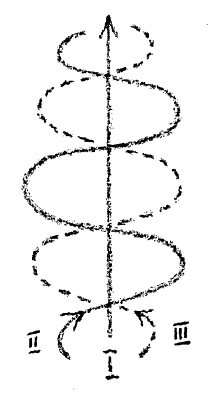

Im Verlaufe der letzten Betrachtungen habe ich hier öfter darauf aufmerksam gemacht, daß, allerdings aus andern Quellen heraus, okkulte Wahrheiten einzelnen Menschen immer bekannt waren, durch alle Zeiten der Menschheitsentwickelung bekannt waren, daß aber allerdings diese einzelnen Menschen sehr sorgfältig darüber gewacht haben, daß gerade diejenigen, welche in solche okkulten Mysterien eingeweiht worden sind, nichts nach außen an Nichteingeweihte mitgeteilt haben. Nun wissen wir, daß solche Dinge sich auch noch dann fortpflanzen, wenn sie in der Fortentwickelung des allgemeinen Menschenlebens ihre Bedeutung, ja ihre Berechtigung verloren haben. So werden denn gewisse Wahrheiten heute noch immer von solchen, die sie kennen, streng bewacht. Aber wir wissen, daß auf gewisse Dinge heute einfach hingewiesen werden muß, daß sie nicht mehr im Verborgenen bleiben dürfen, sondern daß sie, wie andere wissenschaftliche Wahrheiten, auch als geisteswissenschaftliche Wahrheiten der allgemeinen Menschheit zugänglich gemacht werden müssen. ^h5j738

Nun kann das ja nur mit Bezug auf gewisse elementare Dinge geschehen, allein mit Bezug auf diese muß es geschehen. In den Dingen, die wir seit langem besprochen haben, liegt allerdings manches von dem, was zu solchen Wahrheiten, zu solchen Erkenntnissen gerechnet wird, die von manchen Seiten sorgfältig bewacht werden. Allein, dennoch muß fortgefahren werden im Geiste dieser Betrachtungen, an manches anzuknüpfen, was ein solches Bewachtes ist. Und diejenigen, welche heute solche Wahrheiten, einfach verkündet, empfangen, sollten es den Wahrheiten selbst ansehen, daß sie mit einem gewissen großen Ernst, mit einer gewissen Ehrfurcht betrachtet werden. Denn zu jenen Dingen, mit Bezug auf welche die Eingeweihten vor dem Mitteilen zurückschrecken, gehört nebst anderem die Scheu vor der Ehrfurchtslosigkeit der heutigen Menschen gegenüber der Wahrheit. Allerdings kann ja gegenüber dem, was der heutige materialistische Sinn als Wahrheit gelten läßt, viel Ehrfurcht nicht aufkommen, und die Dinge werden auch nicht sehr profaniert, [dadurch], daß wir ihnen nicht mit Ehrfurcht entgegenkommen, wenigstens nicht scheinbar. Allein, gewisse Dinge müssen zart und ehrfurchtsvoll behandelt werden, wenn sie in der richtigen Weise in das Geistesleben der Menschheit sich einverleiben sollen. ^lw99hj

Dazu gehören vor allem die Erkenntnisse über den Menschen selbst, Erkenntnisse, die zunächst, wenn sie an unsere Seele herantreten, einfach erscheinen, die aber von außerordentlich bedeutsamer Tragfähigkeit und Tragweite sind. Gerade die Betrachtungen, die uns in der letzten Zeit beschäftigt haben, die alle mehr oder weniger darin gipfeln, das Geheimnis uns nahezubringen, das dem Zusammenhange zwischen dem Leben im physischen Leibe und dem Leben zwischen Tod und neuer Geburt entspricht, diese Wahrheiten führen die Betrachtung sehr, sehr weit an den Menschen heran, knüpfen an manches von dieser Art an, was in intimer Weise mit dem Menschen erkenntnismäßig verknüpft ist. Da wollen wir zunächst unseren geistigen Blick auf Dinge lenken, von denen wir von andern Gesichtspunkten aus schon gesprochen haben, wollen heute nur in einer gewissen Richtung solche Dinge wieder betrachten, um den eben charakterisierten Gesichtspunkt in diesen Vorträgen hier festhalten zu können. ^t3mzvq

Die neuere Naturwissenschaft hat, wie wir wissen, den Menschen an das Tier sehr nahe herangebracht. Allein, wir haben schon betont: Was den Menschen eigentlich im wahren Sinne des Wortes von dem Tier unterscheidet, das berücksichtigt diese moderne Naturwissenschaft gar nicht. Sie macht zum Beispiel darauf aufmerksam, wie die Formen der Knochen beim Menschen und bei den höheren Tieren sind und findet eine große Ähnlichkeit darin; sie findet in der Gestaltung, in der Morphologie überhaupt eine große Ähnlichkeit. Darin hat sie zwar recht, aber das Hauptsächlichste ist damit gar nicht berührt. Dieses Hauptsächlichste - ich habe schon einmal in diesem Winter, in einem Öffentlichen Vortrage sogar, darauf hingewiesen stellt sich zunächst einmal von einer Seite so dar, daß man sagen kann: Wer mit der nötigen Ehrfurcht und Tiefe an die Betrachtung des Menschenlebens so herangeht, daß er sich beeindrucken läßt von dem großen, bedeutsamen Gegensatz zwischen einem hier auf der Erde physisch lebenden Menschen und einem menschlichen Leichnam, der hat einfach in diesem Eindruck dieser beiden Gegensätze ein Mysterium vor seine Seele hingestellt: den lebendigen Menschen und einen Leichnam. Was dem Menschen zunächst dabei auffallen muß, ist, daß nun der Leichnam von den Kräften der äußeren Erdennatur in Anspruch genommen wird, denen er nicht unterworfen war in der Zeit seit der Empfängnis oder Geburt bis zum Tode, sondern denen er dadurch entzogen war, daß das Seelisch-Lebendige mit diesem Stoffzusammenhange, der uns im Leichnam gegenübersteht, verbunden war. Verfolgen wir in Gedanken, was aus einem Leichnam wird, gleichgültig, ob der betreffende Leichnam rasch durch Verbrennung oder langsamer durch Verwesung aufgelöst wird, die beiden Prozesse sind ja genau dasselbe, unterscheiden sich nur der Kürze oder Länge der Zeit nach. Was stofflich im Menschen verbunden war, das wird in kürzerer oder längerer Zeit im Gesamtstoffprozeß unserer Erde aufgelöst, geht über in den Gesamtstoffprozeß der Erde. Der Mensch kann in der Tat mit seinen gewöhnlichen Sinnen, auch mit seinen gewöhnlichen Gedanken verfolgen, was alles aus den Teilen eines Leichnams wird. ^8bdnyn

Der geisteswissenschaftliche Betrachter kann in dieser Beziehung weitergehen. Er kann finden, daß das, was im Leichnam unmittelbar nach dem Tode zusammen ist, allmählich in ein ungeheuer großes Stoffgebiet übergeht; natürlich verteilt sich dies über Jahrhunderte, aber es geht in ein ungeheuer großes Stoffgebiet über, löst sich sozusagen auf in der Gesamtheit desjenigen, was überhaupt unsere sichtbare, äußerlich wahrnehmbare Welt ist. ^qy0hhh

Nun ist es interessant zu verfolgen, welcher Zusammenhang besteht zwischen dem, was hier im physischen Leben unser Ich-Bewußtsein ist, und diesem sich auflösenden Leichnam. Kurioserweise hängen diese zwei Dinge in einer gewissen Beziehung zusammen: der sich auflösende Leichnam und das Ich-Bewußtsein. Ich sage: Das IchBewußtsein — natürlich nicht das reale, das wirkliche Ich, denn dieses Ich geht selbstverständlich durch die Todespforte — lebt das Leben weiter zwischen Tod und neuer Geburt. Aber was hier im physischen Leben dem Menschen als Bild des Ich vorschwebt - er hat ja kein Bewußtsein von dem Ich, hat nur ein Bild des Ich im Bewußtsein -, das ist an den Leichnam gebunden, und zwar an denjenigen Stoffzusammenhang gebunden, der sich eben nach dem 'Tode im Universum auflöst. Diese Auflösung des Leichnams im Universum ist nichts anderes als das äußere Bild für das gesamte Ich-Bewußtsein; denn in Wahrheit gehört unser Ich-Bewußtsein diesem Universum an, in das sich unser Leichnam auflöst. Und daß wir in der Zeit zwischen Geburt und Tod in der sonderbaren Anschauung - für den Okkultisten sonderbaren Anschauung, für den gewöhnlichen Menschen selbstverständlichen Anschauung — verharren: Da innerhalb der Grenzen unserer Haut sind wir —, daran ist nur Schuld, daß die Stoffmassen unseres Leibes zwischen Geburt und Tod zusammengehalten werden. Von diesem Zusammenhalt kommt es her, daß wir auch diesem Rauminhalt, den wir mit unserem Fleisch und Blut ausfüllen, es stets zuschreiben, daß wir da sind. Denn eigentlich ist es absurd, wir sind gar nicht da. Wir sind in Wahrheit überall dort und versuchen sogar vom Einschlafen bis zum Aufwachen überall dort zu sein, wo nach dem Tode die Stoffteilchen unseres Leibes sein werden. Es wird uns nur zwischen Geburt und Tod das Majabewußtsein beigebracht, daß wir in diesem Rauminhalt seien, der durch unsere Haut begrenzt ist. Das ist aber ein Majabewußtsein, das uns beigebracht wird. Und der Tod ist unter vielem andern, was er ist, die Widerlegung dieses Majabewußtseins für die physisch-materielle Welt. Er führt die Teile unseres Leichnames dahin, wo in Wahrheit unser IchBewußtsein immer weilt. Das ist schon etwas sehr Weittragendes. ^fjn0su

Sie können nun aber fragen: Was trägt uns denn da eigentlich, wenn wir gestorben sind, dieses unser Ich-Bewußtsein und sein äußeres Bild, die Stoffteilchen unseres Leibes, in die weite Welt hinaus? Was sind das für Kräfte? ^k2ntdg

Drei Kräfte sind es, die wir etwa in folgender Weise uns veranschaulichen können. ^n7l9ha

Die eine Kraft kommt während der Zeit unseres Lebens dadurch zur Erscheinung, daß wir in der allerersten Zeit unseres Lebens auf allen vieren kriechen und dann uns vertikal aufrichten. Wir orientieren uns ja erst nach und nach in der Vertikallinie. Indem wir uns vom kriechenden Kinde zum aufrechtgehenden Menschen umgestalten, folgen wir einer gewissen Kraftlinie, in die wir uns hineinstellen, mit der wir uns identifizieren. Diese Kraftlinie ist, geisteswissenschaftlich angesehen, sehr genau anschaubar im Menschen. Von unten läuft ^jbeefq

eine Linie, die vom Mittelpunkt der Erde ins Universum hinausgeht. "Man hat das in alten Zeiten einfach so bezeichnet, daß man sagte: Vom Mittelpunkt der Erde ins Universum geht eine Linie, die für jeden Menschen, sogar für jeden Zeitpunkt, eine andere ist, aber immer von der Mitte der Erde hinaus nach dem Universum. Das ist die eine im Menschen wichtige Kraftlinie. Wie sie in unserem physischen Leben wirkt, so wirkt sie eben nur so lange, als dieses physische Leben dauert; denn da hält die physische Schwerkraft unseres Leibes dieser Kraft das Gleichgewicht. In dem Augenblicke, wo diese physische Schwerkraft nicht mehr so wirkt, wie sie im lebendigen Leibe wirkt, mit dem Zeitpunkt, wo der lebendige Leib Leichnam wird, da entfaltet sich diese Kraftlinie vom Mittelpunkt der Erde zum Universum hinaus als diejenige, welche zunächst unsere Stoffteilchen schiebt, trägt. Natürlich werden sie ja immer durch ihre eigene Schwere dann weiter getrieben, aber wenn wir durch lange Zeit sie verfolgen würden, was mit unseren Stoffteilen geschieht, so würden wir finden, daß sie sich zerstreuen in der Richtung dieser Kraft, wenn dies auch Jahrhunderte in Anspruch nimmt. — Die zweite Kraft, die dabei in Betracht kommt, ist eine solche, welche hauptsächlich in der menschlichen Sprache zum Ausdruck kommt. Wir reden, wir können wenigstens reden. Es ist immer ein gewisser Antrieb in der artikulierten Sprache. Eine gewisse Schwungkraft liegt in der ausgeatmeten Luft, wenn wir sprechen. Diese Kraft sieht der geisteswissenschaftliche Forscher wie um jene erste Linie herum geschlungen. Sie hat im wesentlichen eine Spiralform, um diese Vertikale herum sich schlingend. Diese Kraft verändert etwas die reine Abstoßungskraft, bringt sie in Schwung. Aber sie ist nicht allein tätig, sondern es kommt ein Drittes dazu, das von folgendem herrührt. Während das Sprechen nach außen eine gewisse Schwungkraft entwickelt, wirkt das Denken, durch das sich der Mensch vom Tier unterscheidet, entgegengesetzt. dieser in der Sprache zum Ausdruck kommenden Kraft. Damit haben wir die dritte Kraft. Wenn wir sie zeichnen wollten, so könnte dies in der folgenden Weise geschehen (siehe Zeichnung). Durch diese drei Kräfte, die Auftichtekraft, die im Sprechen wirkende Kraft und die im Denken wirkende Kraft, werden die Teile des menschlichen Leichnams nach und nach langsam in das Universum hinausdirigiert. Entgegen wirkt ihnen natürlich die Schwere und anderes, chemische Kräfte zum Beispiel, die ihnen entgegengesetzt sind. Aber diese drei Kräfte überwinden dies Entgegenwirkende. ^mnrmhm

 ^4vhbdt

Diese drei Kräfte, die während des physischen Lebens, wenn wir als Menschen auf unseren zwei Beinen stehen, zusammengehalten werden, diese Kräfte werden frei und zerstreuen das, was hier in der Form zusammengehalten ist. Namentlich auch das, was wir Äther- oder Bildekräfteleib nennen, folgt diesen drei Kräften. Schon vorausgehend, unmittelbar nach dem Tode, nach wenigen Tagen geschieht das, was wir öfter als Auflösung des Äther- oder Bildekräfteleibes geschildert haben, auch in der Richtung dieser Kräfte. Die andere, die Zerstreuung des physischen Leibes, ist für den Toten weniger wichtig; sie bewirkt nur, weil sie ihm den Moment des Todes fixiert, daß sie ihm die Erinnerung an sein irdisches Ich fortbehält. Aber wichtiger ist, daß diese Kräfte ihm das fortwährend Gesetzmäßige dieser Auflösung des Äther- oder Bildekräfteleibes zeigen. Aber wenn nichts anderes da wäre als diese drei Kräfte, so könnte der Tote nicht wissen, daß es seine Form ist, daß das eigentlich von ihm kommt. Er würde es wahrnehmen, aber wie etwas Fremdes. Daher handelt es sich darum, daß er nicht nur das Sich-Auflösende wahrnimmt, sondern daß er wissen könne, daß das von ihm herrührt, daß es der Rest ist von dem, was er auf der Erde in seiner Form zusammengehalten hat. Und dies führt uns zu etwas anderem. ^l83b3o

Da muß ich auf etwas hinweisen, was in unserer trockenen, nüchternen, papierenen Zeit schon wirklich gar nicht mit der nötigen Ehrfurcht behandelt wird, trotzdem es immer und überall vor uns steht. Es ist etwas, was innerhalb der physischen Welt eigentlich als das Allermysteriöseste wirkt, was für jeden da ist innerhalb der physischen Welt, was nur in seinem mysteriösen Charakter nicht empfunden wird: Es ist das menschliche Inkarnat, dasjenige, was in der menschlichen Fleischesfarbe nach außen sich am Menschen offenbart. Sie brauchen sich nur erinnern, welche Fülle des Individuellen darin sich ausspricht, daß uns der Mensch mit seinem Inkarnat entgegenkommt, wie im Grunde genommen diese Fleischesfarbe doch bei jedem Menschen eine andere ist, in so vielen Schattierungen uns entgegentritt, als es Menschen gibt. Wer sich mit der Enträtselung des Inkarnats beschäftigt, wie es auch schon versucht worden ist, der wird schon ein Gefühl für das bekommen, was in der Fleischesfarbe, in der Tingierung der menschlichen Haut zum Ausdruck kommt. Es ist etwas ungemein Geheimnisvolles, was in dem Inkarnat sich ausspricht. Für den, der geistesforscherisch an die Betrachtung herangeht, gewinnt die Frage: Wie steht es eigentlich mit dem Inkarnat? - eine sehr große Bedeutung. Denn diese eigentümliche Tingierung im Inkarnat hängt ab von zwei gegeneinander wirkenden Kräften, man könnte sagen: von in der Form einander entgegenwirkenden Druckkräften, die im Menschen wirksam sind. Und zwar wirkt in einer gewissen Weise der Äther- oder Bildekräfteleib drückend nach außen, der astralische Leib in entgegengesetzter Art drückend nach innen, und dies an allen Stellen. Will der astralische Leib sich zusammenziehen, von außen nach innen drücken, so will der Äther- oder Bildekräfteleib von innen nach außen drücken, sich ausdehnen. Und was dadurch entsteht, daß sich an des Menschen Oberfläche diese beiden Druckkräfte von außen und innen begegnen, das ist mitwirkend in dem, was sich im menschlichen Inkarnat offenbart. Was der ätherische Leib und der astralische Leib sich gegenseitig zu sagen haben, das drückt sich auf geheimnisvolle Weise im Inkarnat aus. ^91qujd

Wenn man auf den Menschen hinschaut, wie er hier auf dem physischen Plan ist, so sieht man sein Inkarnat auch. Aber dieses Inkarnat würde anders erscheinen, wenn man es anschauen könnte von innen nach außen. Von innen nach außen gesehen, wären Sie als durchschnittliche Mitteleuropäer mit Ihrem Inkarnat nicht fleischfarbig, rosig, sondern Sie wären grün-bläulich. Diese Farbe des Grün-Bläulichen zeigt sich auch in der Nachwirkung nach dem Tode. Wenn des Menschen Bildekräfte - oder ätherischer Leib sich ausdehnt im Sinne der drei vorhin charakterisierten Kräfte, und der Tote auf dieses Gebilde hinschaut, so sieht er sein Inkarnat gewissermaßen in der Nachwirkung von der andern Seite. Es schimmert nach dem Tode grünlich-bläulich ihm nach. ^z7apn3

Aber es enthält noch etwas wesentlich anderes, als was uns entgegentritt, wenn wir es im physischen Leben von außen anschauen. Streng genommen ist dieses Inkarnat in seiner Mysteriosität nicht nur individuell verschieden für die verschiedensten Mensthen, sondern es ändert sich auch bei einem und demselben Menschen im Laufe des Lebens, wenn auch in kleinen Nuancen. Nicht, daß wir in gewissen krankhaften Zuständen manchmal blühend, manchmal käsig aussehen, denn das ist natürlich eine Abnormität, aber von diesen großen Veränderungen abgesehen, ändert sich das Inkarnat fortwährend. Wenn es aber von der andern Seite gesehen wird, wie es der Tote sieht, dann zeigt es noch etwas anderes. Dann zeigt es, wie auf einem Teppich aufgemalt, unsere gesamte Erinnerungswelt. Wenn wir also bildlich sprechen wollen, müssen wir uns diesen Inkarnatteppich wie ein Kleid vorstellen, wie ein ganz feines Kleid, und dieses jetzt gewendet, wie man ein Kleid wendet, nach der andern Seite dreht, oder wie man einen Handschuh umdreht. Dann würden wir auf der andern Seite sehen, was sonst nach innen gewendet ist, und dessen wir uns, weil es nach innen gewendet ist, nur dadurch bewußt werden können, daß es, wenn es ins Bewußtsein hineingekommen ist, als Erinnerung auftritt, nicht als Inhalt der Gedanken, aber die Gedanken autisch verschieden charakterisiert, schwingende Gedanken. Was wir in unser Unterbewußtsein hinunterschicken, lernen wir nur in seinem Außenleben kennen. Wie es durch unser Inkarnat durchglitzert, das lernen wir nicht kennen, das lernt aber der Tote dadurch kennen, daß das Inkarnat nachwirkt. Wenn der Tote auf die Auflösung des Bildekräfteleibes zurückschaut, dann hat er ihn als Erinnerung hinter sich, und er weiß dann: Das ist er, das bin ich! ^b9n32z

Die geisteswissenschaftliche Forschung zeigt, daß das, was naturwissenschaftlich weniger in Betracht kommt: die große Differenzierung zwischen dem Menschen und dem Tier, die aufrechte Haltung, die Sprachfähigkeit, artikulierte Sprache, die Denkfähigkeit, daß das die Kräfte sind, welche den Menschen nach dem Tode ins Universum tragen, und daß das Inkarnat im Menschen der diesseitige physische Ausdruck ist für das, was als Erinnerungsrest nach dem Tode nachwirkt. So teilen wir uns selbst nach dem Tode dem Universum mit und tragen in dem, was wir hier in unserem physischen Leibe an uns haben und an uns zeigen, die äußeren Zeichen unserer kosmischen Wesenheit an uns. Deshalb das Gefühl, das wir namentlich mit so etwas Mysteriösem verbinden wie mit dem Inkarnat, dieses Gefühl, denn es ist das Gefühl von der universellen Bedeutung dessen, was ‚uns im Menschen entgegentritt: Noch mehr als durch irgend etwas anderes ist der Mensch durch so etwas wie durch sein Inkarnat ein Mikrokosmos gegenüber dem Makrokosmos. Und die Grundtingierung hat eine große Bedeutung, denn sie ist gewissermaßen die Farbe des Teppichs, auf welchem dem Toten seine Erinnerung erscheint: für die weiße Menschheit grünlich, grünlich-bläulich, für die Japaner violett-rötlich, für die Schwarzen nach dem Tode gerade fleischfarbig. ^f39mx8

Das sind Dinge, die mit dem Leben: zwischen Tod und neuer Geburt innig zusammenhängen, bedeutungsvoll zusammenhängen; bereiten sie doch die neue Inkarnation vor. In diesen Dingen liegt ungeheuer viel. Es liegt in ihnen das Bestimmende, das einen Menschen in einer neuen Inkarnation einer bestimmten Rasse und so weiter zuführt. Die Betrachtung des geistigen Lebens bedeutet nicht nur die Befriedigung einer Neugier oder neugierigen Wißbegierde. Sondern das Leben, wie es auch hier in der physischen Welt ist, mit denjenigen Dingen, die eigentlich auf unser Gemüt gerade geheimnisvolle Eindrücke machen, es wird erst erklärt, wenn wir dieses physische Leben im Zusammenhange mit dem geistigen richtig betrachten können. ^r7d9hr

Nun können Sie sich aber denken — die Dinge, die ich auseinandersetze, sind ja mehr oder weniger elementarer und können weiter ausgestaltet werden -, daß mit einer solchen Ausgestaltung ein intimes Hineinschauen in die menschliche Natur und Entwickelung überhaupt verknüpft ist. Vor diesem Hineinschauen in die menschliche Natur und Entwickelung scheuen namentlich die gegenwärtigen Menschen zurück. Sie wollen sie nicht haben. Und anderseits möchten gerade solche Menschen, auf die ich heute und öfter schon aufmerksam gemacht habe, welche Wache halten über gewisse okkulte Wahrheiten, in einem ausschließlichen Besitz solcher Dinge einen Machtfaktor haben. Das ist von außerordentlicher Bedeutung. Denn es gibt schon Menschen, wenn man es auch heute so schwer glaubt, die sich in gewisser Weise an der Realisierung des Weltenplanes beteiligen, indem sie an ihren okkulten Stätten herauszubekommen versuchen: Wie realisiert sich die Entwickelung der Welt? Was tut man am besten, um in den nächsten dreißig, vierzig, fünfzig, hundert Jahren von sich aus machtvoll auf die Menschheit zu wirken? - Nationen, die unter sich solche Menschen haben, die den Gang der Menschheitsentwickelung erforschen und dann das politische Leben in diesem Sinne einrichten, haben dies natürlich voraus vor andern, die nicht auf dergleichen Dinge eingehen. Diese Dinge spielen im Menschheitsleben eine große Rolle. Wir leben heute in der Zeit, wo es notwendig wäre, daß die Menschen darauf achten würden, daß es solche Dinge gibt. Ich will heute nur auf eines nach dieser Richtung hin aufmerksam machen. ^636jtd

So ungeheuer katastrophal unsere gegenwärtigen Ereignisse sind, so sehr sie schon, rein äußerlich, oberflächlich betrachtet, alles überbieten, was an Ähnlichem seit dem geschichtlichen Leben sich in der Menschheit ausgebreitet hat, sie sind trotzdem Teilereignisse eines großen, umfassenden Geschehens, eines Geschehens, das nur derjenige richtig ins Auge fassen kann, der es mit der nötigen Ehrfurcht und mit dem nötigen Ernst betrachtet. So etwas wird ins Auge gefaßt werden müssen. Vor allen Dingen weiß man an gewissen Orten unserer Erdenmenschheit über die Menschheitsentwickelung schon mancherlei. Aber man bewahrt gerade jenen Teil des Wissens sorgfältig, der Macht in die Hände der Wissenden liefern soll. Nun weiß ich ja nicht, inwiefern Sie dieses bezweifeln wollen, aber die Dinge, die ich meine, sind eben so gesagt, daß ich es jedem frei stelle, davon in seinen eigenen Glauben aufzunehmen, so viel er von ihnen für glaubwürdig hält. - Es streben heute die Menschen der englisch sprechenden Erdenbevölkerung aus gewissen Impulsen heraus, die wir vielleicht auch noch einmal genauer charakterisieren wollen, nach einer irdisch-universellen Weltherrschaft. Das ist kein Ergebnis irgendeines mitteleuropäisch-chauvinistischen Empfindens, sondern es ist ein Ergebnis der ganz objektiven okkulten Forschung, und es würde von den wissenden Mitgliedern der anglo-amerikanischen Bevölkerung jedenfalls am allerwenigsten negiert werden — geleugnet vielleicht, aber nicht negiert -, bloß daß die Wissenden es auf keinen Fall unter die Leute kommen lassen wollen. Diese Wissenden wissen nämlich auch das Folgende noch, das ich Ihnen anschaulich machen will, indem ich ein klein wenig weiter aushole. ^312ia7

Im Verlaufe der Menschheitsentwickelung, so wie vom dritten, vierten in unseren fünften nachatlantischen Entwickelungszeitraum die Entwickelungszusammenhänge in den Materialismus hinein sich gestaltet haben, sind manche Dinge, die früher Wahrheiten ausdrückten, entwertet, richtig entwertet worden. Wenn Sie nach alten Überlieferungen suchen, finden Sie überall gerade die tiefsten Wahrheiten in die Bildform gekleidet. Mythos, Bilder, Bildformen lassen sich ja heute die Menschen nur noch als Dichtung gefallen. Bei Strindberg zum Beispiel lassen sie es sich gefallen, weil er ja scheinbar Dichtung geben will. Aber die Menschen sind bescheiden, wenn sie sagen: Das brauche man nicht zu glauben, und man soll ja nichts darin sehen, was wirkliche Wahrheit in den Sachen ausdrückt. -— Das mythische, bildliche Ausdrücken ist entwertet worden. Die Menschen empfinden bei der Imagination nicht, daß hinter ihr etwas steckt. Dieser Prozeß wird sich im Laufe des fünften nachatlantischen Kulturzeitraumes, insbesondere bei der englisch sprechenden Bevölkerung, auf die Sprache selbst ausdehnen. Nicht nur, daß die Bilder als Ausdtucksmittel entwertet wurden, sondern das Wort als solches wird entwertet. Wie man heute vom materialistischen Bewußtsein aus das Bild bekämpft, so wird man in Zukunft das Wort bekämpfen. Man wird sagen, das Wort sei nicht geeignet, durch sich selbst überhaupt etwas Wahres auszudrücken. Fritz Mauthner hat es schon mit seiner «Kritik der Sprache» versucht, der Sprache überhaupt alles aufzuhalsen, was an Aberglauben in der Menschheit existieren soll. Aber er hat es vielleicht nicht mit einem ungeeigneten Werkzeug zu tun. Sein kritischer Teil ist nämlich ein geeignetes Werkzeug; aber er hat es mit einem ungeeigneten Material zu tun: mit der deutschen Sprache. Damit täuscht er sich. Die englisch sprechenden Okkultisten aber haben das geeignete Material: die englische Sprache. Die hat in ihrem Entwickelungsimpuls, den sinnvollen Inhalt zu entwerten, immer mehr und mehr die bloße Wortranke zu haben. Bedenken Sie, wieviel sie heute schon an bloßen Wortschweifen hat, was darin bloß überhudelt wird. Und wer gar englische Philosophie studiert, merkt es ihr an, daß die Sprache nichts mehr hergibt von inhaltsvollem Wortreichtum. Man studiere zum Beispiel John Stuart Mill, Herbert Spencer und andere: Die Sprache gibt nichts her, um in den Geist hineinzukommen. Man kann daran sehen, wie die Sprache eine große Rolle spielt, wenn das Sprachproblem von englisch sprechenden Okkultisten aufgefaßt wird; denn das liegt in den Zeitimpulsen. Daher handelt es sich darum, aus okkulten Untergründen heraus Mittel und Wege zu ersinnen, um ohne die Hilfe der Sprache Weltherrschaft auszuüben. Und das ist der große Gegensatz von Orient und Okzident: der Orient mit seiner ungemein lebendigen Intensität der Sprache, der Okzident mit dem Abwerfen des inneren Sinnvollen der Sprache. Wiederum ist der Mitteleuropäer zwischen die beiden Extreme hineingestellt. Was sich da abspielt und was ein bedeutsames Symbolum hat in etwas, was heute so laut wie möglich geschrieen wird, aber so verlogen wie möglich ist, um das Wahre zu verdecken — das ist wieder nicht aus irgendeiner chauvinistischen Empfindung heraus gesagt, sondern aus der nüchternsten geisteswissenschaftlichen Entdeckung -, was so laut geschrieen wird und die verschiedenen Völker zur Geltung bringen, das ist nur gesagt, um das andere zu verhüllen: Der Wille, zur Herrschaft zu kommen auf einem Gebiete, wo die Sprache durch ihren eigenen Entwickelungsgang ihre Herrschaft verliert. Das ist etwas, wovon auch die großen, einschneidenden, katastrophalen Ereignisse der Gegenwart Spezialdinge sind; das ist etwas, was einen großen, umfassenden Kampf inauguriert, der sich in den verschiedensten Formen in der nächsten Zeit über die Erdenmenschheit hin zum Ausdruck bringen muß. Es ist nicht etwas, worüber man so denken kann, daß es damit sein wird wie mit allen Kriegen bisher: daß früher auch Kriege gewesen sind, daß dann Frieden geschlossen sind und daß es weiterhin sein wird, wie es früher auch war. Sondern das ist etwas, was man als etwas Perpetuierliches ins Auge zu fassen hat; denn nur dann bekommt man über die einschneidenden Ereignisse der Gegenwart durchgreifende Gedanken, wenn man solche Dinge berücksichtigt. Man muß sich heute entschließen, über gewisse Verhältnisse nicht mehr oberflächlich zu denken, sondern in die Tiefen hineinzugehen, sonst kommt bei allem, was man zu unternehmen versucht, nichts besonderes heraus. Aber es wird der Gegenwart recht schwer, sich an das zu gewöhnen, was auf diesem Gebiete aus der geisteswissenschaftlichen Betrachtung heraus fließen muß. An einer Kleinigkeit trat mir das in diesen Tagen grotesk entgegen, und weil es einen außerordentlich liebenswürdigen Ursprung hatte, war es so grotesk. Ich war in diesen Tagen beschäftigt mit der Ausgestaltung der Neuauflage der «Philosophie der Freiheit», die in der nächsten Zeit erscheinen soll. Nun ist es ja lange her, daß ich als junger Mann die «Philosophie der Freiheit» geschrieben habe; ich war damals etwa zweiunddreißig, dreiunddreißig Jahr alt, es ist also wirklich schon recht lange her. Und das bringt so manche Dinge an die seelische Oberfläche. Nun hatte ich damals mit Bezug auf dieses Werk eine große Befriedigung, wie ich auch in der Zeitschrift «Das Reich» ausgeführt habe. Ich korrespondierte damals viel mit Eduard von Hartmann, dem Verfasser der «Philosophie des Unbewußten», und er hatte, als er meine «Philosophie der Freiheit» empfangen hatte, in sein Exemplar seine Bemerkungen hineingeschtieben und es mir dann zur Verfügung gestellt. Ich habe mir damals diese Bemerkungen abgeschrieben und habe sie heute noch. Sie sehen, eine recht liebenswürdige, alle meine Dankbarkeit herausfordernde Veranlassung liegt vor in bezug auf das, was ich jetzt zu erzählen habe. ^nm6way

Ich hatte in der «Philosophie der Freiheit» zunächst die geistige Wesenhaftigkeit in der Form des sich selbst erfassenden Denkens hingestellt, weil man nur dadurch wirklich zur Erfassung eines Geistigen kommt, daß man das, was dem Menschen zunächst als Geistiges entgegentritt — das sich selbst erfassende, auf sich selbst beruhende Denken - wirklich erfährt, wirklich erlebt. Aber, indem dies sich mir damals ergeben hat, hatte ich nötig, über manche Dinge in andern Sätzen zu sprechen, als diejenigen sprachen, die von andern Gesichtspunkten ausgingen. So hatte ich zum Beispiel auf einer Seite den Satz: Die Vorstellung ist ein individualisierter Begriff, der Begriff ist auf intuitive Weise im Geiste erlebt; die Vorstellung ist individualisierter Begriff und wird von dem Ich auf das Objekt nach außen bezogen. Unter den Dingen, die Eduard von Hartmann damals angestrichen hat, ist auch hier sein Strich, und er hat dazu bemerkt: «Das ist ein ungewöhnlicher Wortgebrauch.» Man sieht, es ist eine sehr liebenswürdige Veranlassung, aber etwas, was sehr charakteristisch ist. Denn wenn man Großes mit Kleinem vergleichen darf, könnte man folgendes heranziehen. Als Kopernikus den Gedanken ausgesprochen hatte: Nicht die Sonne dreht sich um die Erde, sondern die Erde um die Sonne -, wenn ihm da jemand an den Rand geschrieben hätte: Das ist ein ungewöhnlicher Wortgebrauch -, was wäre das für eine Sonderbarkeit gewesen! Natürlich muß ein ungewöhnlicher Wortgebrauch bei etwas herauskommen, was neu auftritt. Aber Sie sehen, wie von dorther, wo man glauben sollte, daß unbedingtes Verständnis vorhanden sein könnte, einem entgegentönt: Das ist ein ungewöhnlicher Wortgebrauch! - Wenn die Menschen niemals sich entschlossen hätten, ungewöhnlichen Wortgebrauch zu haben, so gäbe es ja gar keinen Fortschritt, nicht nur auf geistigem Gebiete. Das ist ein Beispiel, wo es einem recht anschaulich entgegentritt. Sie werden auf Schritt und Tritt finden, wie vor allem schon dem Wortgebrauche gegenüber, den die Geisteswissenschaft zur Anwendung bringt, Ablehnung vorhanden ist. Was heute allerdings, schon wie ein recht ausgetragenes Kleid, die alten Weltanschauungen darstellt, das könnten nicht einmal die alten Weltanschauungen verwenden; denn das ist so ausgetragen, daß es selbst die «Reichsbekleidungsstelle» nicht mehr annehmen würde, wenn es ihr wirklich in der Form eines Kleides, wie es ihr entspricht, angeboten würde. Aber wenn es als Weltanschauung auftritt, die im Inneren der Seele lebt, dann merken es die Menschen nicht. Dafür muß man eine Empfindung bekommen. Das gehört zu dem, was die Menschen der Gegenwart brauchen, um die Zeit zu verstehen. Und die Zeit muß verstanden werden! ^55wdd6

Das ist es, was uns immer wieder ans Herz gelegt werden muß. Sonst werden die einzelnen Wissenden und ihr Wissen im Dienste der _ Menschheit Bewachenden sehr leicht die Oberhand bekommen. Darauf kommt es an, daß man dafür sorgt, daß ein bestimmtes Wissen nicht in den Dienst eines Teiles der Menschheit gestellt wird, sondern in den Dienst der Gesamtheit der Menschheit. Sobald man auch das beste Wissen nicht mit dieser Gesinnung durchtränkt, wird das beste Wissen zum Unheil für die Menschheit werden. ^8lzb2n