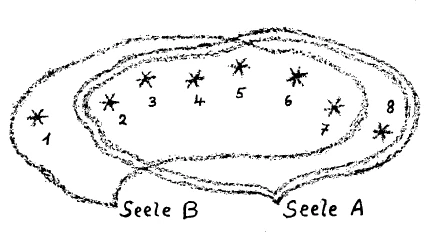

Mit ein paar Worten wollen wir zurückkommen, damit der Zusammenhang gewahrt werde, auf das, was vor acht Tagen hier vorgebracht worden ist. Ich sagte: Wenn es sich darum handelt, das Verhältnis der im Leibe verkörperten Menschenseelen zu entkörperten Menschenseelen, die zwischen Tod und neuer Geburt leben, ins Auge zu fassen, so kommt es darauf an, das geistige Auge gewissermaßen auf die «seelische Luft» zu richten, die den Lebenden mit den sogenannten Toten verbinden muß, damit ein Verhältnis zwischen beiden stattfinden könne. Und wir haben zunächst gefunden, daß gewisse Seelenstimmungen, die beim Lebenden vorhanden sein müssen, gewissermaßen die Brücke hinüberschlagen in die Reiche, in denen die sogenannten Toten sind. Seelenstimmungen bedeuten ja immer auch das Vorhandensein eines gewissen seelischen Elementes, und man könnte sagen, eben wenn dieses seelische Element vorhanden ist, wenn es seine Anwesenheit zeigt durch die entsprechenden Gefühle des Lebenden, dann findet die Möglichkeit eines solchen Verhältnisses statt. ^i8dspx

Wir mußten dann darauf hinweisen, daß solche Möglichkeit, also gewissermaßen die seelische Luftverbindung, durch zwei Gefühlstichtungen beim Lebenden geschaffen wird. Die eine Gefühlsrichtung ist die, welche man nennen könnte das universelle Dankbarkeitsgefühl gegenüber allen Lebenserfahrungen. Ich sagte: Die Gesamtart, wie sich die Seele des Menschen zur Umgebung überhaupt verhält, zerfällt in einen unterbewußten Teil und in einen bewußten. Den bewußten Teil kennt jeder; er besteht darinnen, daß der Mensch mit Sympathien und Antipathien und mit seinen gewöhnlichen Wahrnehmungen verfolgt, was ihn im Leben trifft. Der unterbewußte Teil aber besteht darinnen, daß wir tatsächlich eben unter der Schwelle des Bewußtseins ein Gefühl entwickeln, das besser, erhabener ist als die Gefühle, die wir im gewöhnlichen Bewußtsein entwickeln können, ein Gefühl, das eben nicht anders bezeichnet werden kann als dadurch, daß wir in unserer Unterseele immer wissen, wir haben dankbar zu sein für jede Lebenserfahrung, auch für die kleinste, die an uns herantritt. Daß schwere Lebenserfahrungen an uns herantreten, mag uns gewiß für den Augenblick schmerzlich stimmen; aber für einen größeren Überblick des Daseins nehmen sich auch schmerzliche Lebenserfahrungen so aus, daß man zwar nicht in der Oberseele, aber doch in der Unterseele dankbar dafür sein kann, dankbar dafür, daß vom Universum unser Leben mit fortwährenden Gaben versehen wird. Das ist etwas, was einmal als ein wirklich unterbewußtes Gefühl in der Menschenseele vorhanden ist. Das andere ist, daß wir unser eigenes Ich verbinden mit jedem Wesen, mit dem wir irgendwie im Leben handelnd etwas zu tun gehabt haben. Unsere Handlungen erstrecken sich auf diese oder jene Wesen des Lebens, es können auch sogar unbelebte sein. Aber wo wir etwas getan haben, wo sich unsere Wesenheit mit einer andern Wesenheit handelnd verbunden hat, da bleibt etwas zurück, und dieses Zurückbleibende begründet eine dauernde Verwandtschaft unserer Wesenheit mit alledem, womit wir uns eben jemals verbunden haben. Ich sagte: Dieses Gefühl der Verwandtschaft ist die Grundlage für ein tieferes, der Oberseele gewöhnlich unbekannt bleibendes Gefühl einer Gemeinsamkeit mit der umgebenden Welt, ein Gemeinsamkeitsgefühl. ^1ov3na

Der Mensch kann diese beiden Gefühle, das Gefühl der Dankbarkeit und das Gefühl der Gemeinsamkeit mit der Umgebung, mit der er irgendwie karmisch verbunden war, immer mehr und mehr bewußt ausleben. Er kann gewissermaßen das, was in diesen Gefühlen und Empfindungen lebt, heraufheben in die Seele; und in dem Maße, als er gerade diese beiden Empfindungen heraufhebt in die Seele, macht er sich geeignet, die Brücke zu schlagen zu den Seelen, die ihr Leben zwischen Tod und neuer Geburt verbringen. Denn die Gedanken dieser Seelen können zu uns nur den Weg finden, wenn sie durch den Bereich des von uns entwickelten Dankbarkeitsgefühls wirklich durchdringen können; und wir können einzig und allein dadurch den Weg zu ihnen finden, daß unsere Seele wenigstens einigermaßen sich gewöhnt hat, wirkliche Gemeinschaft zu pflegen. Daß wir imstande sind, dem Universum gegenüber Dankbarkeit zu empfinden, läßt auch zuweilen eine solche Dankbarkeitsstimmung in unsere Seele fallen, wenn wir mit den Toten in irgendeine Verbindung treten wollen, daß wir geübt haben eine solche Dankbarkeitsstimmung, daß wir in der Lage sind, sie fühlen zu können, das bahnt den Gedanken des Toten den Weg zu uns. Und daß wir empfinden können: Es lebt unser Wesen in einer organischen Gemeinschaft, von der es ein Teil ist, wie unser Finger von unserem Körper, das macht uns reif dazu, auch gegenüber den Toten, wenn sie nicht mehr im physischen Leibe anwesend sind, eine solche Dankbarkeit zu empfinden, damit wir mit unseren Gedanken zu ihnen herüberkommen. Wenn man sich auf einem Gebiete so etwas angeeignet hat wie Dankbarkeitsstimmung, die Gemeinsamkeitsempfindung, dann hat man erst die Möglichkeit, sie im gegebenen Falle auch anzuwenden. ^1hfw45

Nun sind diese Empfindungen nicht die einzigen, sondern solcher unterbewußter Empfindungen und unterbewußter Seelenstimmungen sind noch mannigfaltige vorhanden. Alles was wir in unseren Seelen ausbilden, bahnt mehr den Weg in die Welt, wo die Toten zwischen Tod und neuer Geburt sind. So stellt sich eine ganz bestimmte Empfindung, die unterbewußt immer vorhanden ist, aber ins Bewußtsein allmählich heraufgebracht werden kann, der Dankbarkeit an die Seite, eine Empfindung, die dem Menschen um so mehr abhanden kommt, je mehr er ins Materialistische umschlägt. Aber im Unterbewußten ist sie bis zu einem gewissen Grade immer vorhanden und ist eigentlich selbst durch den stärksten Materialismus nicht auszurotten. Aber eine Bereicherung, eine Erhöhung, eine Veredelung des Lebens hängt davon ab, daß man solche Dinge auch heraufholt aus dem Unter.bewußten ins Bewußte. Die Empfindung, die ich meine, ist das, was man bezeichnen könnte mit dem allgemeinen Vertrauen in das durch uns hindurchflutende und an uns vorbeiflutende Leben, Vertrauen zum Leben! Innerhalb einer materialistischen Lebensauffassung ist die Stimmung des Vertrauens zum Leben außerordentlich schwer zu finden. Sie ist sogar ähnlich der Dankbarkeit gegenüber dem Leben, aber doch wieder eine andere Empfindung, die sich dieser Dankbarkeit an die Seite stellt. Denn Vertrauen zum Leben besteht darin, daß eine unerschütterliche Stimmung in der Seele vorhanden ist, daß das Leben, wie es auch an uns herantreten mag, unter allen Umständen uns etwas zu geben hat, daß wir niemals auch nur auf den Gedanken verfallen können, daß das Leben uns durch dieses oder jenes, was es uns entgegenbringt, nichts zu geben hätte. Gewiß, wir machen schwere Lebenserfahrungen, leidvolle Lebenserfahrungen durch, aber in einem größeren Lebenszusammenhange stellen sich gerade leidvolle und schwere Lebenserfahrungen als die heraus, die uns am meisten das Leben bereichern, uns am meisten für das Leben stärken. Es handelt sich darum, diese fortdauernde Stimmung, die in der Unterseele wieder vorhanden ist, ein wenig in die Oberseele heraufzuheben, diese Stimmung: Du, Leben, du hebst und trägst mich, du sorgst dafür, daß ich vorwärtskomme. ^qlnaqg

Wenn im Erziehungssystem für die Pflege einer solchen Stimmung etwas getan würde, so wäre außerordentlich viel gewonnen. Erziehung ‚und Unterricht daraufhin anzulegen, geradezu an einzelnen Beispielen zu zeigen, wie das Leben gerade dadurch, daß es oftmals schwer zu durchdringen ist, Vertrauen verdiente, es würde ganz besonders viel bedeuten, wenn diese Stimmung in das Erziehungs- und Untetrichtssystem überginge. Denn indem man geradezu das Leben unter einem solchen Gesichtspunkte betrachtet: Verdienst du Vertrauen, o Leben? - stellt sich heraus, daß man vieles findet, was man sonst nicht im Leben findet. Man betrachte eine solche Stimmung nur ja nicht oberflächlich. Es darf eine solche Sache nicht dazu führen, nun alles glänzend und gut im Leben zu finden. Im Gegenteil, es kann in den einzelnen Fällen gerade dieses Vertrauen-haben-zum-Leben zu einer scharfen Kritik von schlimmen, törichten Dingen führen. Und gerade wenn man kein Vertrauen hat zum Leben, führt das oftmals dazu, daß man vermeidet, Kritik zu üben an Schlechtem und Törichtem, weil man vorübergehen will an dem, wozu man kein Vertrauen hat. Es handelt sich ja nicht darum, daß man zu dem einzelnen Dinge Vertrauen habe, das gehört in ein anderes Gebiet. Man hat zu dem einen Ding Vertrauen, zu einem andern nicht, je nachdem sich die Dinge und Wesenheiten darbieten. Aber zu dem Gesamtleben, zu dem Gesamtzusammenhalt des Lebens Vertrauen haben, darum handelt es sich. Denn, kann man etwas von dem im Unterbewußtsein immer vorhandenen Vertrauen zum Leben heraufholen, so bahnt es den Weg, um das Geistige, die weisheitsvolle Fügung und Führung im Leben auch wirklich zu beobachten. Wer sich, nicht theoretisch, sondern empfindend immer wieder und wieder sagt: So wie die Erscheinungen des Lebens aufeinanderfolgen, so bedeuten sie für mich etwas, indem sie mich in sich aufnehmen und etwas mit mir zu tun haben, wozu ich Vertrauen haben kann -, der. bereitet sich gerade damit vor, um das, was geistig lebt und webt in den Dingen, wirklich auch nach und nach wahrzunehmen. Wer dieses Vertrauen nicht hat, der verschließt sich vor dem, was geistig in den Dingen lebt und webt. ^6vfx2c

Nun die Anwendung auf das Verhältnis der Lebenden zu den Toten. Indem man diese Stimmung des Vertrauens entwickelt, macht man es wiederum dem Toten möglich, mit seinen Gedanken den Weg zu uns zu finden; denn auf dieser Vertrauensstimmung können die Gedanken gewissermaßen von ihm zu uns segeln. Wenn wir im allgemeinen Vertrauen zum Leben, Glauben an das Leben haben, werden wir die Seele in eine solche Verfassung bringen können, daß in ihr jene Eingebungen erscheinen können, welche die von den Toten gesandten Gedanken sind. Dankbarkeit gegenüber dem Leben, Vertrauen zum Leben in der geschilderten Form gehören in einer gewissen Weise zusammen. Wir können, wenn wir nicht dieses allgemeine Weltvertrauen haben, zu einem Menschen nicht ein solch starkes Vertrauen gewinnen, das über den Tod hinausreicht, sonst ist es Erinnerung an das Vertrauen. Sie müssen sich schon vorstellen, daß die Gefühle, wenn sie den nicht mehr im physischen Leibe verkörperten Toten treffen sollen, in einer andern Weise abgewandelt sein müssen als die Empfindungen, die Gefühle, die zu dem Menschen gehen, der im physischen Leibe da ist. Gewiß, wir können zu einem Menschen im physischen Leibe Vertrauen haben, dieses Vertrauen wird auch etwas für den Zustand nach dem Tode nützen. Aber es ist notwendig, daß dieses Vertrauen durch das universelle, durch das allgemeine Vertrauen verstärkt werde, weil ja der Tote nach dem Tode in andern Verhältnissen lebt, weil wir nicht bloß nötig haben, uns an das Vertrauen zu erinnern, das wir schon im Leben zu ihm gehabt haben, sondern weil wir auch nötig haben, immer neubelebtes Vertrauen an eine Wesenheit, die nicht mehr durch ihre physische Anwesenheit Vertrauen erweckt, hervorzurufen. Dazu ist notwendig, daß wir gewissermaßen etwas in die Welt hinausstrahlen, was nichts zu tun hat mit den physischen Dingen. Und mit physischen Dingen nichts zu tun hat das geschilderte universelle Vertrauen zum Leben. ^fdzu35

Ebenso wie sich das Vertrauen neben die Dankbarkeit hinstellt, so stellt sich auch neben das Gemeinschaftsgefühl etwas hin, was immer in der Unterseele vorhanden ist, aber auch wieder in die Oberseele heraufgeholt werden kann. Das ist wieder etwas, was man auch mehr berücksichtigen sollte, als man es tut. Und das kann man, wenn dieses Element, von dem ich jetzt sprechen will, in unserer materialistischen Zeit im Unterrichts- und Erziehungssystem berücksichtigt würde. Davon hängt ungemein viel ab. Soll der Mensch im gegenwärtigen Zeitenzyklus in der richtigen Weise sich in die Welt hineinstellen, dann hat er notwendig, etwas auszubilden, ich könnte auch sagen, etwas aus der Unterseele heraufzuholen, was in den früheren Zeiten des atavistischen Hellsehens von selbst kam, was nicht gepflegt zu werden brauchte, wovon spärliche Reste noch vorhanden sind, die aber nach und nach verschwinden, wie alles aus den alten Zeiten Stammende verschwindet, was aber heute gepflegt werden muß, und zwar gepflegt werden muß aus der Erkenntnis der geistigen Welt heraus, nicht aus unbestimmten Instinkten. Was der Mensch in dieser Beziehung braucht, ist die Möglichkeit, seine Gefühle für das, was ihn im Leben trifft, immer wieder und wieder zu verjüngen, zu erfrischen an dem Leben selber. Wir können das Leben so verbringen, daß wir von einem gewissen Lebensalter an mehr oder weniger uns müde fühlen, weil wir die lebendige Teilnahme am Leben verlieren, weil wir nicht mehr genug für das Leben aufbringen können, damit uns seine Erscheinungen Freude machen. Man vergleiche nur miteinander, wenn man äußere Extreme verbindet: das Ergreifen und Entgegennehmen der Erlebnisse in früher Jugend und das müde Entgegennehmen der Lebenserscheinungen im späten Alter. Denken Sie, wie viele Enttäuschungen mit solchen Dingen zusammenhängen. Es ist ein Unterschied, ob der Mensch imstande ist, seine Seelenkraft gewissermaßen einer fortwährenden Auferstehung teilhaftig werden zu lassen, daß ihr jeder Morgen neu ist für das seelische Erleben, oder ob er gewissermaßen im Laufe des Lebens für die Erscheinungen ermüdet. | ^ko56o6

Dies zu berücksichtigen, ist in unserer Zeit außerordentlich wichtig, weil es bedeutsam’ ist, daß es auch auf das Erziehungssystem Einfluß gewinne. Wir gehen nämlich gerade mit Bezug auf solche Dinge einer bedeutungsvollen Wendung in der Menschheitsentwickelung entgegen. Die Beurteilung früherer Menschheitsepochen geschieht unter dem Einfluß unsefer Geschichte, die ja eine Fable convenue ist, wirklich in außerordentlich schiefer Weise. Man weiß nicht, wie die letzten Jahrhunderte die Menschen dazu gebracht haben, immer mehr und mehr Erziehung und namentlich Unterricht so einzurichten, daß der Mensch in seinem späteren Leben nicht dasjenige von der Erziehung und dem Unterricht hat, was er eigentlich von ihnen haben sollte. Das Äußerste, was wir unter dem Einfluß der heutigen Verhältnisse im späteren Lebensalter für das aufbringen, was wir während der Jugend in der Erziehung aufgewendet haben, ist eine Erinnerung. Wir erinnern uns an das, was wir gelernt haben, was uns gesagt worden ist, und man ist in der Regel auch zufrieden, wenn man sich daran erinnert. Dabei aber berücksichtigt man ganz und gar nicht, daß das menschliche Leben zwar vielen Geheimnissen, aber mit Bezug auf diese Dinge einem bedeutsamen Geheimnisse unterliegt. In einer früheren Betrachtung habe ich hier von diesem Geheimnis schon von einem andern Gesichtspunkte aus eine Andeutung gemacht. ^zvuglm

Der Mensch ist ein vielfältiges Wesen. Wir betrachten ihn zunächst, insofern er ein zwiespältiges Wesen ist. Die Zwiespältigkeit — sagte ich in einer früheren Betrachtung — drückt sich schon in der äußeren Leibesform aus. Diese zeigt uns den Menschen als Haupt und als den übrigen Menschen. Wir wollen zunächst den Menschen trennen in das Haupt und den übrigen Menschen. Würde man nur einmal diesen Unterschied im ganzen Bau des Menschen ins Auge fassen, so würde man schon naturwissenschaftlich ganz bedeutende Entdeckungen machen können. Wenn man nämlich den Bau des Hauptes rein physiologisch, anatomisch betrachtet, so stellt sich gerade das Haupt als das heraus, worauf sich die mehr materialistisch gedachte Abstammungslehre, was man heute Darwinische Theorie nennt, anwenden läßt. In bezug auf seinen Kopf ist der Mensch gewissermaßen in diese Entwickelungsströmung hineingestellt, aber nur in bezug auf seinen Kopf, nicht in bezug auf seinen übrigen Organismus. Sie müssen sich, um diese Abstammung des Menschen zu begreifen, die Sache so vorstellen, daß Sie sich, ganz abgesehen vom Größenverhältnis, das menschliche Haupt vorstellen und das andere darangewachsen. Denken Sie sich einmal, die Entwickelung ginge so vor sich, daß der Mensch sich in die Zukunft entwickelte und irgendwelche Organe noch besondere Anhangorgäane bekämen. Die Entwickelung, die Umgestaltung könnte ja weitergehen. So war es aber in der Vergangenheit: Der Mensch war vor Zeiten bloß eigentlich als Haupteswesen vorhanden, und dieses Haupt hat sich immer weiter- und weitergebildet, und ist zu dem geworden, was es heute ist. Und was an dem Haupte dranhängt, wenn dies auch physisch größer ist, ist erst später dazugewachsen. Das ist eine jüngere Bildung. In bezug auf sein Haupt stammt der Mensch ab von den ältesten Organismen, und das andere außer dem Haupt ist erst später dazugewachsen. Dadurch kommt es auch, daß das Haupt beim heutigen Menschen immer so wichtig ist, weil es an die vorherige Inkarnation erinnert. Der übrige Organismus — darauf habe ich auch schon aufmerksam gemacht - ist dagegen die Vorbedingung für die spätere Inkarnation. Der Mensch ist in dieser Beziehung ein ganz zwiespältiges Wesen. Das Haupt ist ganz anders veranlagt als der übrige Organismus. Das Haupt ist ein verknöchertes Organ. Es ist so, daß der Mensch, wenn er den übrigen Organismus nicht hätte, zwar sehr vergeistigt, aber ein vergeistigtes Tier wäre, Das Haupt kann niemals, wenn es nicht dazu inspiriert wird, sich als Mensch fühlen. Es weist zurück auf die alte Saturn-, Sonnen- und Mondenzeit. Der übrige Organismus weist nur bis in die Mondenzeit, und zwar in die spätere Mondenzeit zurück; er ist an den Hauptesteil darangewachsen und ist in dieser Beziehung wirklich etwas wie ein Parasit des Hauptes. Sie können es sich gut vorstellen: Das Haupt war einmal der ganze Mensch, es hatte nach unten hin Ausfluß- und Auslauforgane, durch die es sich ernährte. Es war ein ganz eigentümliches Wesen. Aber indem es sich weiterentwickelte, indem sich die Öffnungen nach unten so entwickelten, daß sie sich nicht mehr in die Umgebung hinein öffneten und dadurch nicht mehr für die Ernährung dienen konnten und das Haupt mit den von der Umgebung einstrahlenden Einflüssen in Verbindung bringen konnten, und so das Haupt nach oben zu auch verknöcherte, war der übrige Ansatz nötig geworden. Dieser übrige Organismus ist erst damit nötig geworden. Dieser Teil der physischen Organisation ist erst zu einer Zeit entstanden, als für die übrige Tierheit keine Möglichkeit mehr war, zu entstehen. Sie werden sagen: So etwas, wie ich es jetzt dargestellt habe, ist schwer zu denken. Darauf kann ich aber immer wieder nur entgegnen: Man muß sich eben Mühe geben, so etwas zu denken; denn die Welt ist nicht so einfach, wie es die Leute gerne haben möchten, damit sie nicht viel über die Welt denken brauchen, um sie zu begreifen. In dieser Beziehung erlebt man das Mannigfaltigste, was die Leute für Ansprüche stellen, damit die Welt ja möglichst leicht zu begreifen sei. Darin haben die Menschen ganz merkwürdige Ansichten. Es gibt eine reiche Kant-Literatur von allen den Leuten, die Kant nach allen Richtungen für einen ungeheuren Philosophen halten. Das rührt aber nur davon her, daß die Leute keine andern Philosophen verstehen und schon so viel Gedankenkraft aufwenden müssen, um Kant zu verstehen. Und da er doch immer ein großer Philosoph ist - sich selber hält man ja oft für das Allergenialste —, so begreifen sie die andern erst recht nicht. Und nur weil sie Kant schon so schwer begreifen, ist er für sie ein großer Philosoph. Damit hängt es auch zusammen, daß man sich scheut, die Welt als kompliziert gelten zu lassen, und Kraft aufwenden muß, um sie zu verstehen. Wir haben von diesen Dingen schon von den verschiedensten Gesichtspunkten aus gesprochen. Und wenn einmal meine Vorträge über «Okkulte Physiologie» erscheinen werden, wird man auch im einzelnen lesen können, wie man auch embryologisch nachweisen kann, daß es ein Unsinn ist zu sagen: Das Gehirn ist aus dem Rückenmark entwickelt. Umgekehrt ist es der Fall: Das Gehirn ist ein umgewandeltes Rückenmark von einstmals, und das heutige Rückenmark hat sich an das heutige Gehirn als ein Anhängsel erst angegliedert. Man muß nur begreifen lernen, daß das, was beim Menschen das Einfachere ist, später entstanden ist als das, was als das Kompliziertere erscheint; was primitiver ist, steht auf einer untergeordneteren Stufe, ist später entstanden. ^gqtrii

Ich habe diese Einfügung von der Zwiespältigkeit des Menschen nur deshalb gemacht, damit Sie das andere begreifen, was die Folge ist dieser Zwiespältigkeit. Und die Folge ist, daß wir mit unserem seelischen Leben, das sich ja unter den Bedingungen der Leiblichkeit entwickelt, auch in dieser Zwiespältigkeit drinnenstehen. Wir haben nicht nur organisch die Kopfentwickelung und die Entwickelung des übrigen Organismus, sondern wir haben auch zwei verschiedene Tempi, zwei verschiedene Geschwindigkeiten in unserer seelischen Entwickelung. Unsere Kopfentwickelung geht nämlich verhältnismäßig schnell, und die Entwickelung, die den übrigen Organismus zur Ausbildung bringt - ich will sie die Herzensentwickelung nennen -, geht verhältnismäßig langsamer, geht etwa drei- bis viermal langsamer. Was den Kopf zur Bedingung hat, ist mit seiner Entwickelung in der Regel mit den Zwanzigerjahren des Menschen schon abgeschlossen; mit Bezug auf den Kopf sind wir alle mit zwanzig Jahren schon Greise. Und nur weil fortwährend die Erfrischung von dem übrigen Organismus kommt, der sich aber drei- bis viermal langsamer entwickelt, leben wir in einer annehmbaren Weise weiter. Unsere Kopfentwickelung geht schnell; unsere Herzensentwickelung, die aber die Entwickelung des übrigen Organismus ist, geht drei- bis viermal langsamer. Und in diesem Zwiespalt stehen wir mit unserem Erleben drinnen. Unsere Kopfentwickelung kann gerade in unserer Kindheit und Jugendzeit eine ganze Menge aufnehmen. Daher lernen wir in der Kindheit und Jugendzeit. Was aber da aufgenommen wird, muß fortwährend erneuert, erfrischt werden, muß fortwährend eingefaßt werden von dem langsameren Gang der übrigen Organentwickelung, von der Herzensentwickelung. ^kcwojy

Nun denken Sie sich, wenn die Erziehung so ist wie jetzt in unserem Zeitalter, wo Erziehung und Unterricht nur auf die Kopfausbildung Rücksicht nehmen, so ist, weil wir in Unterricht und Erziehung gewissermaßen nur den Kopf zu seinem Rechte kommen lassen, die Folge davon die, daß der Kopf wie ein toter Organismus in den langsameren Gang der übrigen Entwickelung sich eingliedert, daß er diese zurückhält, und daß die Menschen seelisch früh alt werden. Diese Erscheinung, daß die Menschen im heutigen Zeitalter innerlich seelisch früh alt werden, hängt im wesentlichen mit dem Erziehungs- und Unterrichtssystem zusammen. Natürlich dürfen Sie nicht denken, daß man jetzt die Frage stellen kann: Wie soll man den Unterricht einrichten, damit er nicht so ist? — Das ist eine sehr bedeutsame Sache, die man nicht mit zwei Worten beantworten kann. Denn fast alles vom Unterricht muß anders eingerichtet werden, damit er nicht nur etwas ist für das Gedächtnis, woran man sich erinnert, sondern etwas, durch das man sich erfrischt, sich erneuert. Man frage sich, wie viele Menschen heute, wenn sie zu einer Kindheitsverrichtung zurückblicken, auf alles, was sie da erlebt haben, was ihnen die Lehrer und die Tanten gesagt haben, so zurückzudenken vermögen, daß sie nicht nur sich erinnern: Das sollst du so und so machen -, sondern daß sie immer wieder von neuem hinuntertauchen in das, was sie in der Jugend durchgemacht haben, liebevoll hinblicken zu jedem Handgriff, zu jeder einzelnen Bemerkung, zu dem Stimmklang, zu der Gefühlsdurchdringung dessen, was ihnen in der Kindheit dargeboten wurde, und es so empfinden, daß es stets ein immer uns erneuernder Verjüngungsquell ist. Das hängt zusammen mit den Tempi, welche wir in uns erleben: daß der Mensch seiner schnelleren Kopfentwickelung folgen muß, die in den Zwanzigerjahren abgeschlossen ist, und dem langsameren Gange der Herzensentwickelung, der Entwickelung des übrigen Menschen, der für das ganze Leben gespeist werden soll. Wir dürfen dem Kopf nicht nur das geben, was nur für den Kopf bestimmt ist, sondern wir müssen ihm auch das geben, woraus der übrige Organismus immer wieder und wieder durch das ganze Leben erfrischende Kräfte ziehen kann. Dazu ist zum Beispiel notwendig, daß alle einzelnen Zweige des Unterrichtes von einem gewissen künstlerischen Element durchzogen sein müssen. Heute, wo man das künstlerische Element flieht, weil man glaubt, daß durch eine gewisse Pflege des Phantasielebens — und die Phantasie ist ja etwas, was den Menschen über die bloße alltägliche Wirklichkeit hinüberbringt — die Phantastik in den Unterricht hineingebracht werden könnte, ist ganz und gar keine Neigung vorhanden, ein solches Geheimnis des Lebens zu berücksichtigen. Man braucht nur auf einzelnen Gebieten etwas zu sehen von dem, was ich jetzt meine - es ist ja natürlich da oder dort noch vorhanden -, dann wird man sehen, daß so etwas schon geleistet werden kann, aber es kann besonders dadurch geleistet werden, daß die Menschen namentlich wieder Menschen werden. Dazu ist Mannigfaltiges notwendig. Auf eines möchte ich in dieser Beziehung aufmerksam machen. ^x6d8hs

Man prüft heute diejenigen, die Lehrer werden wollen, darauf hin, ob sie dieses und jenes kennen. Was aber stellt man dadurch fest? In der Regel doch nur das, daB der Betreffende einmal in der Zeit, für die er gerade die Prüfung abzulegen hat, in seinem Kopf etwas hineingehamstert hat, was er, wenn er einigermaßen geschickt ist, für jede einzelne Unterrichtsstunde sich aus so und so vielen Büchern zusammenlesen könnte, was man sich Tag für Tag für den Unterricht aneignen könnte, was gar nicht notwendig ist, sich in dieser Weise anzueignen, wie es gegenwärtig betrieben wird. Was aber vor allen Dingen bei einem solchen Examen notwendig wäre, das ist, daß man erfahren sollte, ob der Betreffende Herz und Sinn hat, ob er das Blut dafür hat, allmählich ein Verhältnis von sich zu den Kindern zu begründen. Nicht das Wissen sollte man durch das Examen prüfen, sondern erkennen sollte man, wie stark und wie viel der Betreffende Mensch ist. — Ich weiß: Solche Forderungen an die heutige Zeit stellen, heißt für die Gegenwart nur zweierlei. Entweder sagt man: Wer so etwas fordert, ist ja ganz verrückt, ein solcher Mensch lebt nicht in der wirklichen Welt! - Oder, wenn man eine solche Antwort nicht geben will, sagt man: So etwas geschieht ja immerfort, das wollen wir doch alle. - Die Menschen glauben nämlich, daß durch das, was geschieht, schon die Dinge erfüllt werden, weil sie nur das von den Dingen verstehen, was sie selbst hineinbringen. ^ixfcks

Ich habe dieses ausgeführt, selbstverständlich um erstens von einer gewissen Seite her ein Licht auf das Leben zu werfen, dann aber auch, um gerade dies, was die Unterseele des Menschen immer fühlt, was so schwer gerade in der heutigen Zeit in die Oberseele heraufzubringen ist, wonach aber die Seele des Menschen verlangt und in der Zukunft immer mehr und mehr verlangen wird, um dies ins rechte Licht zu stellen, daß wir etwas in der Seele brauchen von der Macht, die Kräfte dieser Seele immerfort so zu erneuern, daß wir nicht mit dem fortschreitenden Leben müde werden, sondern immer hoffnungsvoll dastehen und sagen: Jeder neue Tag wird uns ebenso sein wie der erste, den wir bewußt erlebt haben. -— Dazu müssen wir aber in einer gewissen Weise nicht alt zu werden brauchen; das ist dringend notwendig, daß wir nicht alt zu werden brauchen. Wenn man heute sieht, wie verhältnismäßig junge Menschen, Männer und Frauen, eigentlich seelisch schon so furchtbar alt sind, so sehr wenig darauf aus sind, jeden Tag aufs neue das Leben als etwas zu empfinden, was ihnen gegeben wird wie dem frischen Kinde, dann weiß man, was auf diesem Gebiete durch eine geistige Zeitkultur eben geleistet werden muß, gegeben werden muß. Und letzten Endes ist es eben doch so, daß das Gefühl, welches ich hier meine, dies Gefühl der nie, nie, nie schwächer werdenden Lebenshoffnung doch geeignet macht, das rechte Verhältnis zwischen den Lebenden und den sogenannten Toten zu empfinden. Sonst bleibt die Sache, die das Verhältnis zu einem Toten begründen soll, zu stark in der Erinnerung stecken. Man kann sich erinnern, was man mit dem Toten während des Lebens erlebt hat. Wenn man aber nicht die Möglichkeit hat, nachdem der Tote physisch fort ist, ein solches Gefühl zu haben, daß man immer neu erlebt, was man während des Lebens mit ihm durchgemacht hat, so kann man nicht so stark fühlen, nicht so stark empfinden, wie es notwendig ist unter diesem neuen Verhältnis zu empfinden: Der Tote ist ja nur noch als Geistwesen da und soll als Geist wirken. — Hat man sich so abgestumpft, daß man nichts mehr erfrischen kann an Lebenshoffnungen, so kann man nicht mehr fühlen, daß eine vollständige Umwandlung stattgefunden hat. Vorher konnte man sich dadurch helfen, daß einem der Mensch im Leben entgegentrat; jetzt aber steht einem nur der Geist zu Hilfe. Man kommt ihm aber entgegen, wenn man dieses Gefühl entwickelt der immerwährenden Erneuerung der Lebenskräfte, um die Lebenshoffnungen frisch zu erhalten. ^inausz

Ich möchte hier eine Bemerkung machen, die Ihnen vielleicht sonderbar erscheint. Ein gesundes Leben, das besonders nach den Richtungen hin gesund ist, die jetzt hier entwickelt wurden, führt, wenn es nicht zu einer Bewußtseinstrübung kommt, niemals dazu, das Leben als etwas zu betrachten, dessen man überdrüssig ist; sondern das ganz gesund verbrachte Leben führt dazu, wenn man älter geworden ist, jeden Tag dieses Leben immer von neuem, von frischem anfangen zu wollen. Nicht das ist das Gesunde, daß man, wenn man alt geworden ist, denkt: Gott sei Dank, daß man das Leben hinter sich hat! -, sondern daß man sich sagen kann: Ich möchte gleich wieder, wo ich jetzt vierzig oder fünfzig Jahre alt bin, zurückgehen und die Sache noch einmal durchmachen! - Und das ist das Gesunde, daß man sich durch Weisheit darüber trösten lernt, daß man es nicht in diesem Leben ausführen kann, sondern in einer korrigierten Weise in einem andern Leben. Das ist das Gesunde: gar nichts vermissen zu wollen von alledem, was man durchgemacht hat, und, wenn Weisheit dazu nötig ist, es nicht in diesem Leben haben zu wollen, sondern auf ein folgendes warten zu können. Das ist das Vertrauen, das auf richtiges Vertrauen zum Leben und auf die rege erhaltenen Lebenshoffnungen gebaut ist. | ^07txm6

So haben wir die Gefühle, die das Leben in der richtigen Weise durchseelen und die zugleich die Brücke schaffen zwischen den Lebenden hier und den Lebenden dort: Dankbarkeit gegenüber dem Leben, das an uns herantritt, Vertrauen zu den Erfahrungen dieses Lebens, intimes Gemeinsamkeitsgefühl, die Fähigkeit, die Lebenshoffnungen durch immer neu erstehende frische Lebenskräfte rege zu machen. Dies sind innere, ethische Impulse, die, in der richtigen Weise erfühlt, auch die allerbeste äußere soziale Ethik abgeben können, weil das Ethische, gerade wie das Historische, nur erfaßt werden kann, wenn es im Unterbewußten erfaßt wird, wie ich es selbst im öffentlichen Vortrage gezeigt habe. ^rm13uu

Ein anderes, das ich noch hervorheben möchte für das Verhältnis der Lebenden zu den Toten, ist eine Frage, die immer wieder und wieder auftreten kann, die Frage: Worin besteht eigentlich der Unterschied in dem Verhältnis zwischen Mensch und Mensch, insofern Mensch und Mensch im physischen Leibe verkörpert sind, und zwischen Mensch und Mensch, insofern der eine im physischen Leibe, der andere nicht, oder beide nicht im physischen Leibe verkörpert sind? - Im Hinblick auf einen Gesichtspunkt möchte ich da etwas Besonderes angeben. ^lfknco

Wenn wir geisteswissenschaftlich den Menschen betrachten in bezug auf sein Ich und in bezug auf sein eigentliches Seelenleben, das man auch den astralischen Leib nennen kann - in bezug auf das Ich habe ich oft gesagt, daß es das jüngste, das Baby unter den Gliedern der Menschenorganisation ist, während der astralische Leib etwas älter ist, aber nur seit der alten Mondenentwickelung -, so muß man in bezug auf diese beiden höchsten Glieder der menschlichen Wesenheit sagen: Sie sind noch nicht so weit entwickelt, daß der Mensch die Macht hätte, wenn er sich nur auf sie stützte, sich selbständig zu erhalten gegenüber den andern Menschen. Wenn wir hier beieinander wären jeder nur als Ich und Astralleib, nicht auch in unseren Ätherleibern und physischen Leibern lebend, so wären wir alle wie in einer Art Urbrei beieinander.-Es würden unsere Wesen durcheinander verschwimmen; wir wären nicht voneinander getrennt, wir wüßten auch nicht uns voneinander zu unterscheiden. Es könnte gar keine Rede davon sein, daß jemand wüßte — die Sachen lägen ja dann ganz anders, und man kann die Verhältnisse nicht so ohne weiteres miteinander vergleichen -, was seine Hand oder sein Bein wäre, oder was die Hand und das Bein des andern wäre. Aber nicht einmal seine Gefühle könnte man ordentlich als die seinigen erkennen. Daß wir als Menschen uns getrennt empfinden, rührt davon her, daß ein jeder aus der gesamten flüssigen Masse, die wir uns für einen bestimmten früheren Zeitraum vorzustellen haben, in Tropfenform herausgerissen ist. Damit aber die einzelnen Seelen nicht wieder zusammenrinnen, müssen wir uns denken, daß jeder Seelentropfen wie in ein Stück Schwamm hineingegangen ist, und dadurch werden sie auseinandergehalten. Dergleichen ist wirklich geschehen. Nur dadurch, daß wir als Menschen in physischen Leibern und Ätherleibern stecken, sind wir voneinander gesondert, richtig gesondert. Im Schlafe sind wir nur dadurch voneinander gesondert, daß wir dann die starke Begierde nach unserem physischen Leib haben. Diese Begierde, die ganz und gar nach unserem physischen Leib brünstig hinschlägt, trennt uns im Schlafe, sonst würden wir in der Nacht ganz durcheinanderschwimmen, und es würde wahrscheinlich empfindsamen Gemütern sehr wider den Strich gehen, wenn sie wüßten, wie stark sie schon in Zusammenhang kommen mit dem Wesen der Wesenheiten ihrer Umgebung. Aber das ist nicht besonders arg im Vergleich zu dem, was sein würde, wenn dieses brünstige Begierdenverhältnis zum physischen Leib nicht bestünde, solange der Mensch leiblich verkörpert ist. ^rdwxoh

Nun können wir die Frage aufwerfen: Was sondert unsere Seelen voneinander in der Zeit zwischen Tod und neuer Geburt? So wie wir mit unserem Ich und unserem astralischen Leib zwischen Geburt und Tod einem physischen Leibe und Ätherleibe angehören, so gehören wir nach dem Tode, also zwischen Tod und neuer Geburt, mit unserem Ich und astralischen Leib einem ganz bestimmten Sternengebiete an, keiner demselben, jeder einem ganz bestimmten Sternengebiete. Aus diesem Instinkt heraus spricht man von dem «Stern des Menschen». Sie werden begreifen: Das Sternengebiet - wenn Sie zunächst seine physische Projektion nehmen - ist peripherisch kugelig, und das können Sie in der mannigfaltigsten Weise verteilen. Die Gebiete überdecken sich, jeder aber gehört einem andern an. Man kann auch sagen, wenn man es seelisch ausdrücken will: Jeder gehört einer andern Reihe von Archangeloi und Angeloi an. So wie sich die Menschen hier durch ihre Seelen zusammenfinden, so gehört zwischen Tod und neuer Geburt jeder einem besonderen Sternengebiete, einer besonderen Reihe von Angeloi und Archangeloi an, und sie finden sich dann hier mit ihren Seelen zusammen. Nur ist es so, aber auch nur scheinbar — doch auf dieses Mysterium will ich jetzt nicht weiter eingehen -, daß auf der Erde jeder seinen eigenen physischen Leib hat. Ich sage: scheinbar -, und Sie werden sich verwundern; aber es ist völlig erforscht, wie auch jeder sein eigenes Sternengebilde hat, aber wie diese sich überdecken. Denken Sie sich eine bestimmte Gruppe von Angeloi und Archangeloi. Zu einer Seele gehören Tausende von Archangeloi und Angeloi im Leben zwischen Tod und neuer Geburt. Denken Sie sich von diesen Tausenden nur einen weg, so kann dieser eine gewissermaßen ausgetauscht werden: dann ist dies das Gebiet der nächsten Seele. In dieser Zeichnung haben zwei Seelen mit Ausnahme bin des einen Sternes, den sie aus einem andern Gebiete haben, das gleiche, aber absolut gleich haben nicht zwei Seelen ihr Sternengebiet. Dadurch sind die Menschen zwischen Tod und neuer Geburt individualisiert, daß jeder sein besonderes Sternengebiet hat. Daraus kann man ersehen, worauf zwischen Tod und neuer Geburt die Trennung von Seele zu Seele beruht. Hier in der physischen Welt wirkt die Trennung so, wie wir sie kennen durch den physischen Leib: Der Mensch hat gewissermaßen seinen physischen Leib als Hülle, er betrachtet von ihm aus die Welt, und alles muß an diesen physischen Leib herankommen. Alles was in die Seele des Menschen zwischen Tod und neuer Geburt kommt, steht in bezug auf das Verhältnis zwischen seinem astralischen Leib und seinem Ich in einer ähnlichen Weise in Zusammenhang mit einem Sternengebiet, wie hier die Seele und das Ich.mit dem physischen Leib in Verbindung stehen. Die Frage also: Wodurch tritt die Sonderung ein? — beantwortet sich auf die Weise, wie ich es eben angegeben habe. ^njaj2s

 ^vzm3pm

Nun haben Sie aus diesen Betrachtungen heute ersehen, wie wir auf unsere Seele in der Ausbildung gewisser Gefühle und Empfindungen wirken können, damit die Verbindungsbrücke geschlagen wird zwischen den sogenannten Toten und den Lebenden. Auch das letzte, was ich gesagt habe, ist geeignet, um in uns Gedanken, ich darf sagen, empfindende Gedanken oder gedankliche Empfindungen heranzuziehen, die sich wiederum an der Schöpfung dieser Brücke beteiligen können. Das geschieht dadurch, daß wir versuchen, mit Bezug auf einen bestimmten Toten immer mehr und mehr jene Empfindungsart auszubilden, die, wenn man etwas erlebt, in der Seele heraufkommen läßt den Impuls, sich zu fragen: Wie würde der Tote dieses jetzt, was du in diesem Augenblick erlebst, miterleben? Dazu die Imagination schaffen, als ob der Tote neben uns das Erlebnis mitmacht; und das recht lebendig machen, dann ahmt man in einer gewissen Beziehung die Art und Weise nach, wie entweder der Tote mit dem Lebenden oder der Tote mit Toten verkehrt, indem Sie das, was Ihnen verschiedene Sternengebiete geben, auf das Verhältnis Ihrer Seele beziehen oder aufeinander beziehen. Man ahmt schon hier das nach, was von Seele zu Seele spielt durch die Zugeteiltheit zu den Sternengebieten. Wenn man sich gewissermaßen konzentriert durch die Anwesenheit des Toten auf ein unmittelbar gegenwärtiges Interesse, wenn man auf diese Weise den Toten unmittelbar lebendig neben sich empfindet, dann wird aus solchen Dingen, die ich heute erörtert habe, auch immer mehr und mehr das Bewußtsein erwachsen, daß der Tote wirklich an uns herankommt. Die Seele wird sich auch ein Bewußtsein davon entwickeln. In dieser Beziehung muß man eben auch Vertrauen haben zum Dasein, daß die Dinge werden. Denn, wenn man nicht Vertrauen, sondern Ungeduld zum Leben hat, dann gilt die andere Wahrheit: Was das Vertrauen bringt, vertreibt die Ungeduld; was man durch das Vertrauen erkennen würde, verfinstert sich durch die Ungeduld. Nichts ist schlimmer, als wenn man sich durch die Ungeduld einen Nebel vor die Seele zaubert. ^43bktu