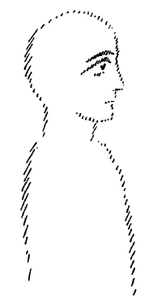
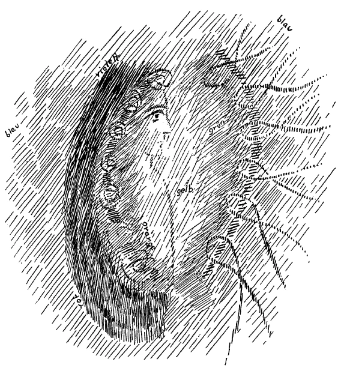
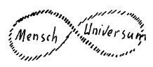
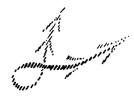
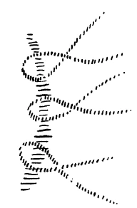
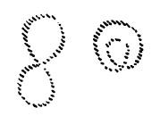
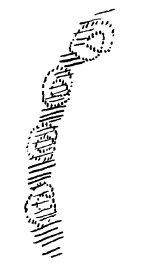

Ich möchte heute davon ausgehen, eine Art Skizze zu geben von der menschlichen Seele, so wie diese menschliche Seele in ihrem Verhalten zur Welt und zu sich selbst ist. Ich möchte diese Skizze so halten, daß man etwa sagen kann: Wir sehen uns den Menschen als Seelenwesen an im Profil. Also, damit wir uns verstehen: Wie wenn wir uns den physischen Menschen - nicht das Seelenwesen — so ansehen würden, daß wir ihn etwa nicht en face, sondern im Profil haben würden, meinetwillen nach rechts hinüberschauend. Betrachten wir ihn einmal so. Natürlich müssen wir, wenn wir versuchen, so etwas skizzenhaft zu entwerfen, uns immer klar darüber sein, daß wir es mit imaginativer Erkenntnis zu tun haben, daß also das Wirkliche, das hinter einer solchen Sache steht, durch ein Bild wiedergegeben ist. Das Bild deutet auf die Sache hin, und man macht ja auch das Bild so, daß es in richtiger Art auf die Sache hindeutet. Aber natürlich darf man sich eine Zeichnung, eine Skizze, welche darstellen soll ein Seelisch-Geistiges, nicht so denken, wie man sich irgend etwas vorstellt, das in naturalistischer Art eine äußere sinnenfällige Wirklichkeit kopiert. Dessen, was ich jetzt sage, muß man sich schon fortwährend bewußt sein. Ich werde also alles, was den physischen und den niederen ätherischen Organismus des Menschen betrifft, fortlassen, werde nur das Seelische, das Seelisch-Geistige zu skizzieren versuchen (siehe Zeichnung). ^urg1j2

 ^hm1qal

Wie Sie ja aus den verschiedenen Darstellungen, die gegeben worden sind, wissen, steht dieses Seelisch-Geistige mit der seelisch-geistigen Umwelt mehr in einem unmittelbaren Zusammenhang als der physische Mensch mit der physischen Umgebung. Der physische Mensch ist ja gegenüber der physisch-sinnenfälligen Umgebung ein ziemlich abgeschlossenes Wesen. Man möchte sagen: Dieser physisch-sinnliche Mensch ist wirklich auch real in seiner Haut eingeschlossen. — So ist es nicht bei dem, was man als den geistig-seelischen Menschen bezeichnen kann; da muß man sich einen fortdauernden Übergang denken in den Strömungen, die im seelisch-geistigen Inneren des Menschen pulsieren, und in all den Bewegungen und Strömungen, die in der allgemeinen, universellen geistig-seelischen Welt bestehen. ^yv6ojy

Wollte ich nun zunächst von der einen Seite her charakterisieren, wie dieses Verhältnis des menschlich Geistig-Seelischen zu dem Geistig-Seelischen der universellen Umgebung ist, so müßte ich das vielleicht in der folgenden Weise tun. Ich müßte dasjenige, was aus dem Universum, also aus der Unendlichkeit des Raumes in geistig-seelischer Weise hereinkommt, zunächst in dieser Art malen. Eigentlich müßte ich den ganzen Raum so ausmalen, aber das ist ja nicht nötig, ich werde nur dasjenige, was zunächst Umgebung des Menschen ist, ausmalen. Das ist also jetzt dasjenige, was als Umwelt aufzufassen ist (siehe Zeichnung Seite 31, blau). Denken Sie sich also in seelisch-geistiger Bildhaftigkeit das, worin der Mensch hineingestellt ist. Der Mensch ist ja jetzt noch nicht da, sondern es ist nur das, was aus der Umgebung angrenzt, mit diesem Blau gekennzeichnet. Denken Sie sich das wie ein in sich wogendes blaues Meer, das den Raum aber ausfüllt. Wenn ich sage: Blaues Meer -, ist das natürlich so aufzufassen, wie ich das öfter in den Büchern, die Ihnen ja vorliegen, charakterisiert habe, so wie Farben als Bezeichnung des Aurischen, des SeelischGeistigen aufzufassen sind. ^hlyn9d

 ^h8i2yf

Schwimmend, möchte ich sagen, oder schwebend getragen, wie eine Woge getragen, ist nun ein anderes Geistig-Seelisches. Das ist dasjenige, welches ich jetzt etwa in der folgenden Weise darstellen müßte. Wir können also, wenn wir von der universellen Umwelt zum Menschen übergehen, uns und das menschliche Geistig-Seelische etwa wie schwebend auf diesem Rot denken. Da hätten wir zunächst einen Teil des Geistig-Seelischen; davon müßten wir nur, wenn wir etwas der Wirklichkeit gemäß die Skizze machen wollten, den oberen Teil in einem etwas ins Violettliche, ins Lila fallenden Rot geben. Das würde nur richtig gegeben sein, wenn hier oben das Rot sich violett abstumpfte. ^sllqxz

Damit habe ich Ihnen zunächst, ich möchte sagen, den einen Pol des Geistig-Seelischen des Menschen gegeben. Den andern Pol bekommen wir, wenn wir das, was hier an das universell Geistig-Seelische sich anschließend gegen das physische menschliche Antlitz zu schwimmend-schwebend sich verhält, etwa in der folgenden Weise eingliedern: Gelb, Grün, Orange; Grün geht ins Blaue noch hinein. ^xp4hrt

Damit haben Sie eine, ich möchte sagen, Normalaura des Menschen im Profil, also von der rechten Seite aus gesehen. Ich sage ausdrücklich: eine Normalaura von der rechten Seite aus gesehen. Dasjenige, was sich dem Schauen so darstellen würde, daß das Schauen eben diese Figur vor sich hätte, das charakterisiert das Hineingestelltsein des Menschen in seine geistig-seelische Umgebung. Es charakterisiert aber auch die Stellung des Menschen, des Seelisch-Geistigen des Menschen zu sich selber. Man kann, gerade wenn man dasjenige studiert, was durch diese Figur dargestellt ist, so recht sehen, wie der Mensch nach zwei Seiten hin ein begrenztes Wesen ist. Diese zwei Seiten, nach denen hin der Mensch ein begrenztes Wesen ist, die werden im Leben immer bemerkt; allein sie werden nicht richtig gedeutet, sie werden nicht richtig ins Auge gefaßt, werden wenigstens nicht verstanden. Sie wissen ja, daß man in der äußeren Naturwissenschaft davon spricht, daß der Mensch, wenn er die Welt betrachtet, wenn er sich Erkenntnisse verschaffen will von der Welt, mit seiner Wissenschaft, mit seiner Erkenntnis an bestimmte Grenzen kommt. Wir haben öfter von diesen Grenzen gesprochen, von diesem berühmten «Ignorabimus» — wir werden niemals wissen -, welches von seiten der Naturforscher, von seiten mancher Philosophen geltend gemacht wird. Man sagt, der Mensch komme eben zu bestimmten Grenzen seines Erkennens, seines Anschauens der Außenwelt. Ich habe Ihnen wohl auch schon den berühmten Ausspruch angeführt, den Du Bois-Reymond auf der Leipziger Naturforscherversammlung in den siebziger Jahren getan hat: In die Regionen hinein, so sagte ungefähr dazumal Du BoisReymond, in denen Materie spukt, wird das menschliche Erkennen niemals dringen. ^5xiu70

Man würde richtiger über diese Erkenntnisgrenzen des Menschen sprechen, wenn man vielleicht sagen würde: Der Mensch ist genötigt, indem er die Welt betrachtet, gewisse Begriffe sich festzusetzen, welche er mit seinem naturwissenschaftlichen Erkennen, auch mit seinem gewöhnlichen Philosophenerkennen nicht durchdringt. Sie brauchen ja nur zu denken an solche Betrachtungen wie den Begriff des Atoms. Vom Atom redet die Naturwissenschaft. Aber das Atom hat natürlich nur dann einen Sinn, wenn man eigentlich nicht davon reden kann, wenn man nicht sagen kann, was ein Atom ist; denn in dem Augenblicke, wo man anfangen würde, das Atom zu beschreiben, wäre es nicht mehr ein Atom. Es ist ein schlechthin Unnahbares. Und so ist es eigentlich schon die Materie, der Stoff selber. Es müssen gewisse Begriffe festgesetzt werden, an die man nicht herankommt. So ist es mit dem Erkennen der Außenwelt. Es müssen Begriffe festgesetzt werden, wie Materie, Kraft und so weiter, an die man nicht herankommt. ^1h6wga

 ^r3ev2r

Daß solche Begriffe festgesetzt werden müssen, das beruht einfach darauf, daß jenes innerlich geistig-seelisch Leuchtende des Menschen hier nach außen in ein Dunkles hinein sich erstreckt. Das, was da konstatiert wird als Erkenntnisgrenze, das kann man, ich möchte sagen, aurisch wirklich richtig sehen. Es liegt hier dem Menschen eine Grenze vor. Das Wesen, das er selbst ist, wird hier dargestellt durch dasjenige, was ich aurisch habe verlaufen lassen als hellgrün ins Blauviolett übergehend (siehe Zeichnung Seite 31). Aber indem es ins Blauviolette übergeht, ist es nicht mehr der Mensch, da ist es das Universelle der Umgebung. Da gelangt der Mensch mit seinem Wesen, das die innere Kraft seines Anschauens der Welt ist, an eine Grenze, da gelangt er gewissermaßen an das Nichts, und da muß er solche Begriffe wie Materie, Atom, Stoff, Kraft festsetzen, die keinen Inhalt haben. Das liegt in der menschlichen Organisation, das liegt im Zusammenhange des Menschen mit dem ganzen Weltenall. Da geht wirklich die Verbindung des Menschen mit dem Weltenall vor sich. Man kann, wenn man im Sinne geisteswissenschaftlicher Vorstellung diese Grenze da bezeichnet, das so machen, daß man sagt: Diese Grenze läßt den Menschen in bezug auf seine Seele in Berührung kommen mit dem Universum. - Man kann, indem man die Richtung nach dem Universum hin mit der einen Schleife einer Lemniskate bezeichnet, das, was dem Menschen angehört, mit der andern Schleife bezeichnen; nur geht das, was aus dem Menschen herausgeht, in das Universum, in das Unendliche hinein. Man muß daher die Schleifenlinie, die Lemniskate, auf der einen Seite offenlassen, und auf der einen zumachen, und man muß dann diese Schleifenlinie so zeichnen: Hier ist die Schleifenlinie geschlossen, hier geht sie ins Unendliche hinaus. Es ist dieselbe Linie, die ich dort gezeichnet habe, nur gehen die Schenkel hier ins Unendliche hinaus. ^myzrdr

 ^bmii1e

Was ich hier so zeichne als offene Lemniskate, als offene Schleifenlinie, das ist nicht bloß etwas Ausgedachtes, das ist etwas, was Sie tatsächlich wie ein- und auslaufende Blitze in einer sanften, aber sehr langsamen Bewegung als Ausdruck des Verhältnisses des Menschen zum Universum sehen können. Die Strömungen des Universums nähern sich fortwährend dem Menschen; er zieht sie an, sie verschlingen sich in seiner Nähe und gehen wieder heraus. Also es strömt so etwas dem Menschen zu, verschlingt sich, geht wieder heraus. Der Mensch ist von solchen dem Universum angehörenden Strömungen durchsetzt, die sich hier vor ihm aufhalten. Dadurch ist der Mensch, wie Sie sich vorstellen können, von einer Art welligem Aurischen umgeben; es kommen diese Strömungen vom Universum herein, machen hier einen Wirbel, grüßen gleichsam den Menschen, indem sie einen Wirbel vor ihm machen, so daß er hier von einer Art aurischer Strömung umgeben ist. Das ist wesentlich ein Ausdruck des Verhältnisses des Menschen zum Universum, zur geistig-seelischen Umwelt. ^3b9llz

 ^tl3ila

Nun aber können Sie dasjenige, was Sie eigentlich als in Ihrem Bewußtsein liegend empfinden, hier dargestellt finden als bläulich-grünlich-gelblich, nach innen zu orange verlaufend. Aber das stößt hier auf; im Inneren des menschlichen Seelischen stößt dieses GelblichOrange auf das auf, was auf dem blauen Meere als das Geistig-Seelische des unteren Menschen schwingt, des niederen Menschen. Was ich hier rot und im Übergang ins Orange gezeichnet habe, das gehört zu den unterbewußten Teilen des Menschen, entspricht ja auch denjenigen Vorgängen im Physischen, die sich hauptsächlich als Verdauungstätigkeit und Ähnliches abspielen, woran das Bewußtsein keinen Anteil hat. Dasjenige, was mit dem Bewußtsein zusammenhängt, das würde aurisch charakterisiert sein in den hellen Partien, die ich hier dargestellt habe (siehe Zeichnung Seite 31). So wie hier zusammenstoßen des Menschen Geistig-Seelisches mit dem Geistig-Seelischen der Umwelt, so stößt nach innen des Menschen Geistig-Seelisches mit seinem Unterbewußten - also auch eigentlich dem Universum angehörig — zusammen. Dieses Zusammenstoßen muß ich in den Strömungen so zeichnen, daß die einen Strömungen ins Unendliche hinausgehen; anders muß ich dieses Zusammenstoßen im Inneren des Menschen zeichnen. Da muß ich auch eine Schleifenlinie zeichnen, aber diese muß ich so zeichnen, daß sie nach innen verläuft. Geben Sie acht: Ich zeichne durchaus eine Schleifenlinie, aber ich nehme die untere Schleife und schlage sie um, so daß die Schleifenlinie so wird: ^od4uea

 ^kyqrtr

Also, ich schlage die untere Schleife um (siehe Zeichnung, rechts). Im Gegensatz zu hier (siehe Zeichnung Seite 35), wo ich die eine Schleife ins Unendliche verlaufen lasse, also ins Unendliche vergrößere, schlage ich nun die untere Schleife um. - Dann habe ich dadurch bildlich bezeichnet die Stauungen, die sich ergeben da, wo das Geistig-Seelische hier innen auf das unterbewußte, also auch universelle Geistig-Seelische auftrifft. Ich muß also diese Stauungen, die im Menschen entstehen, wenn ich sie entsprechend denen hier zeichne, in dieser Weise charakterisieren (sieben Lemniskaten mit umgeschlagener Schleife). Das sind die Stauungen, welche entsprechen einer inneren Welle im Menschen. ^18ux6b

Wenn Sie diese innere Welle tatsächlich verfolgen wollten, so würde die Hauptrichtung dieser Welle — aber eben nur die Hauptrichtung — etwa so verlaufen, daß sie entlangliefe dem Zusammenstoßen von den, wie Sie wissen, unrichtig benannten, aber sogenannten sensitiven und motorischen Nerven im Menschen. Das nur nebenbei gesagt, denn ich will heute hauptsächlich das Geistig-Seelische der Sache erörtern. ^2nsd8d

 ^b3awzb

Sie sehen daran den starken Gegensatz, der besteht in dem Verhältnis des Menschen zur geistig-seelischen Umwelt und zu sich selber, zu dem Stück, das er aus der geistig-seelischen Umwelt als sein Unterbewußtes hereinnimmt, und das ich hier durch die rötliche Woge, die auf dem allgemeinen blauen Meere des geistig-seelischen Universums schwimmt, zu skizzieren gehabt habe. ^v6f300

Wir haben gesagt, daß diese Welle hier (siehe Zeichnung Seite 31, rechts) gewissermaßen der Schranke entspricht, auf die der Mensch aufstößt, wenn er die Außenwelt erkennen will. Aber auch hier (links) ist eine Schranke; im Inneren des Menschen selbst ist eine Schranke. Wäre diese Schranke nicht vorhanden, dann würden Sie immer in Ihr Inneres hinuntersehen. Jeder Mensch würde in sein Inneres hinunterschauen. So wie, wenn diese Schranke (rechts) nicht vorhanden wäre, der Mensch in die Außenwelt hineinschauen würde, so würde er, wenn diese Schranke (links) nicht vorhanden wäre, in sein Inneres hinunterschauen. Er würde allerdings, so wie der Mensch im gegenwärtigen Entwickelungszyklus einmal ist, wenn er so in sein Inneres hinunterschauen würde, wenig Freude haben über dieses sein Inneres, weil das, was er da sehen würde, ein höchst unvollkommenes, chaotisches, brodelndes Gewoge der inneren Menschennatur ist, etwas, worüber der Mensch keine große Freude haben könnte; aber es ist dasjenige, in welches die phantastischen Mystiker glauben hinunterschauen zu können, wenn sie von Mystik sprechen. Dasjenige, was sehr häufig von phantastischen Mystikern als das Erstrebenswerte angesehen wird, was namentlich bei sehr vielen solchen Mystikern ich habe sie im Vorjahre charakterisiert -, die wirklich glauben, indem sie in ihr Inneres schauen, das Universum erkennen zu können, als Mystik figuriert, das ist beim Menschen gerade durch diese Stauwelle zugedeckt, richtig zugedeckt. Der Mensch kann nicht in sein Inneres hinunterschauen.Dasjenige, was sich hier innerhalb dieser Region bildet (links), das staut sich und spiegelt sich, kann sich wenigstens in sich selbst zurückspiegeln, und die Erscheinung dieses Zurückspiegelns, das ist die Erinnerung, das Gedächtnis. Jedesmal, wenn ein Gedanke oder ein Eindruck, den Sie gefaßt haben, wiederum zurückkommt in der Erinnerung, so kommt er dadurch zurück, daß diese Stauung hier zu funktionieren beginnt. Wenn Sie diese Stauwelle nicht hätten, so würde jeder Eindruck, den Sie von außen bekommen, jeder Gedanke, den Sie fassen, durch Sie hindurchgehen, nicht in Ihnen bleiben können und in das übrige geistig-seelische Universum hineingehen. Nur dadurch halten Sie die Eindrücke auf, die Sie empfangen, daß Sie diese Stauwelle haben. Dadurch sind Sie aber imstande, durch gewisse Vorgänge, die wir noch charakterisieren werden, die Eindrücke wiederum zurückzubekommen. Und das drückt sich aus im Funktionieren des Gedächtnisses, im Funktionieren der Erinnerung. Sie können sich also vorstellen, daß Sie in sich etwas haben wie eine "Tafel, was hier im Profil gezeichnet ist — denn es ist ja im Profil gezeichnet, nicht wahr, es ist solch eine Ebene, die in Ihnen ist —, da wird zurückgeschlagen dasjenige, was nicht durchgehen soll. Sie bleiben, wenn Sie wachend sind, mit der Außenwelt vereint, sonst würde alles in wachem Zustande durch Sie durchgehen. Sie würden eigentlich von den Eindrücken nichts wissen, Sie würden die Eindrücke bekommen, aber könnten sie gar nicht festhalten. ^f5q3yq

Das ist also dasjenige, was auf die Erinnerung deutet. Und das, was gewissermaßen als die Fläche dieser Stauwelle unsere Erinnerung bewirkt, deckt dasjenige zu, was der phantastische Mystiker gern in sich sehen möchte. Was da drunten ist, davon könnte man schon sagen: Für den, der die Dinge wirklich kennt, gilt das Wort: Der Mensch «begehre nimmer und nimmer zu schauen, was sie [die Götter] gnädig bedecken mit Nacht und Grauen». — Doch die Mystiker sind phantastisch und wollen da hinunterschauen. Aber sie können es ja ohnedies nicht, weil sie das normale Bewußtsein so durchlöchern, so korrumpieren würden, daß sich die Gedächtniswelle nicht zurückschlüge. Dasselbe, was unsere Erinnerung ausmacht, was wir so notwendig brauchen zum äußeren Leben, das bedeckt uns dasjenige, was die phantastischen Mystiker wohl schauen möchten, was aber der Mensch nicht schauen soll. Unter Ihrem Gedächtnis, unter Ihrer Gedächtnisursache, unter Ihrer Gedächtnisfläche liegt etwas Wesenhaftes vom Menschen. Aber geradeso wie die Hinterwand eines Spiegels, wie der Belag eines Spiegels das, was vorn ist, zurück wirft, so geht, was also in Ihrem Bewußtsein ist, nicht da hinten hin; das wird wieder zurückgeworfen und kann deshalb fortwährend als Erinnerung da sein. So kann überhaupt unser ganzes Leben sich als Erinnerung spiegeln. Und im wesentlichen ist ja dasjenige, was wir das Leben unseres Ich nennen, das Spiegeln dieser Erinnerung. ^e5isai

Sie sehen also, unser bewußtes Leben leben wir eigentlich zwischen dieser Welle hier (rechts) und zwischen dieser Welle (links). Wir wären also Schläuche, die alles durch sich hindurchlassen, wenn wir nicht diese Stauwelle hätten, die der Erinnerung zugrunde liegt, und wir sähen in die Geheimnisse jenseits der Erkenntnisgrenze hinein, wenn wit nicht genötigt wären, außerhalb des Gebietes des Sinnenfälligen Begriffe zu setzen, für die wir keinen Inhalt mehr haben. Wären wir so organisiert, daß wir diese Stauung hier nicht erzeugen könnten, so würden wir Schläuche sein. Wären wir so organisiert, daß wir nicht genötigt wären, diese gewissermaßen unausgefüllten Begriffe, diese dunklen Begriffe vor uns hinzusetzen, so wären wir liebeleere und liebelose Wesen; steinerne Naturen wären wir, trockene Naturen. Wir könnten nichts in der Welt gern haben, wir wären alle Mephistophelesnaturen. ^9070v7

Daß wir so organisiert sind, daß wir an gewisses Geistig-Seelisches unserer Umgebung nicht herankommen können mit unseren abstrakten Begriffen, mit unserem Fassungsvermögen, das bewirkt, daß wir lieben können. Denn was wir lieben sollen, an das sollen wir nicht so herankommen, daß wir es analysieren im gewöhnlichen Sinne des Wortes, daß wir es zergliedern, daß wir es behandeln wie der Chemiker im Laboratorium die chemischen Stoffe. Man liebt ja nicht, wenn man chemisch analysiert oder chemisch synthetisiert. Erinnerungsfähigkeit, Liebefähigkeit, das sind die zwei Fähigkeiten, die zugleich entsprechen zwei Grenzen der menschlichen Natur. Der einen Grenze nach innen entspricht die Erinnerungsfähigkeit; was jenseits der Erinnerungszone liegt, ist unterbewußtes menschliches Inneres. Die andere Zone entspricht der Kraft der Liebefähigkeit; was jenseits dieser Zone liegt, entspricht dem Geistig-Seelischen des Universums. Das Unbewußte der menschlichen Natur liegt also jenseits dieser Zone, soweit das menschliche Innere reicht; das Geistig-Seelische des Universums geht unbegrenzt in die Weiten hinaus von der andern Zone an. ^j1ag5u

Wir können also sprechen von Liebezone, von Erinnerungszone und können dasjenige, was das menschlich Geistig-Seelische ist, innerhalb dieser Zonen einschließen; müssen aber jenseits der einen Zone da drüben (siehe Zeichnung Seite 31, links) dasjenige suchen, was unbewußt bleibt, und was deshalb, weil es unbewußt bleibt, gerade sehr stark zusammenhängt mit der menschlichen Körperlichkeit, mit den körperlichen Verrichtungen. Natürlich sind die Dinge in der Wirklichkeit nicht so einfach, wie man sie darstellen muß, weil alles ineinandergreift. Das, was hier rot ist (siehe Zeichnung Seite 31), das greift in Dinge hinein, das verändert sich; und wiederum dasjenige, was grün und blau ist, das verändert sich auch. In der Wirklichkeit greifen die Dinge alle ineinander ein. Aber trotzdem ist in der Hauptsache die skizzenhafte Zeichnung richtig und entspricht den Tatsachen. ^niuzds

Daraus aber ersehen Sie, daß für das physische Leben auf der Erde hier ein starkes, bewußtes Geistiges ist. Hier (links) ist ein unbewußtes Geistiges, das eigentlich mit dem Universum zusammen verschwimmt. Diese zwei Stücke des Menschen unterscheiden sich sehr deutlich voneinander. Dieses Geistige (in der Mitte), das ist daher zunächst für das irdische Leben ein solches, das sehr fein gewoben ist. Wie fein gewobenes Licht, möchte ich sagen, ist alles hier (gelb). Würde ich am Menschen zu zeigen haben, wo dieses fein gewobene Licht ist, so würde in das hinein, was ich jetzt umfassend so umschreibe, das menschliche Haupt fallen. Also was ich so umschrieben habe, was ich dorthin als das Gelbe, Gelb-Grünliche, Gelb-Orange nach der andern Seite gezeichnet habe, das ist fein gewobenes, wenn ich so sagen darf, Geistlicht. Das hat keine starke Verwandtschaft mit der irdischen Materie; das hat eine möglichst geringe Verwandtschaft mit der irdischen Materie. Deshalb, weil es wenig Verwandtschaft hat, kann es auch nicht mit der Materie sich gut verbinden, und so bleibt es zum großen Teile unverbunden mit der Materie; es wird diesem Teil gegeben eine solche Materie, die eigentlich immer jeweils aus der vorigen Inkarnation des Menschen stammt. Das Haupt, das, was das menschliche Haupt formt, die Formungskräfte des menschlichen Hauptes, das wird im wesentlichen hereingetragen aus der vorigen Inkarnation, und da ist nur eine lose Verbindung zwischen diesem feingewobenen Geistig-Seelischen und dem Körperhaften, das eigentlich von der vorigen Inkarnation zusammengehalten wird. Ihre Physiognomie tragen Sie ja eigentlich nach Ihren Verrichtungen und Eigenschaften in der vorigen Inkarnation. Und derjenige, der sich gut versteht auf Deutungen von Menschen, der sieht gerade durch das Physiognomische des Hauptes hindurch; nicht durch dasjenige, was von dem luziferischen Inneren stammt, sondern mehr durch die Anpassung an das Universum. Man muß ja die Physiognomie so sehen, als wenn sie in den Menschen hineingedrückt wäre. Nicht so sehr, als ob sie herausginge, sondern man muß gewissermaßen das Negativ des Seelischen sehen; das sieht man in diesem Negativ des Gesichts. Wenn Sie einen Abdruck machen würden von jedem Gesicht, da würden Sie eigentlich die Physiognomie sehen, die ein furchtbar starker Verräter ist desjenigen, was Sie in der vorigen Inkarnation angestellt haben. Dagegen ist alles, was ich da unten wie nur zusammenhängend mit dem wogenden Meere des Geistig-Seelischen der Welt skizziert habe, was so aufzufassen ist, daß es des Menschen Unterbewußtem oder Unbewußtem entspricht, stark verwandt mit der Körperlichkeit; das durchsetzt die Körperlichkeit. Diese Körperlichkeit, die verbindet sich so mit dem Geistigen, daß das Geistige als Geistiges gar nicht erscheinen kann. Daher würde man, wenn man hinunterschaute, dieses Ineinanderbrodeln von Geistigem und Leiblichem schauen, was hinter der Schwelle der Erinnerung liegt. Das ist das, was vorbereitet das Haupt der nächsten Inkarnation, das ist das, was sich metamorphosieren will zu dem, was in der Zukunft erst feste materielle Form bekommt, erst Haupt sein wird in der nächsten Inkarnation. Denn das Haupt des Menschen ist ein über das Maß seiner Entwickelung Hinausgeschrittenes. Daher ist das Haupt - wie Sie sich erinnern aus den früheren Vorträgen, die ich hier gehalten habe - eigentlich mit dem siebenundzwanzigsten, achtundzwanzigsten Jahre des Menschen in seiner Entwickelung schon abgeschlossen. Da ist schon Überbildung des Menschen, in der Hauptesform. ^lpssji

Aber der übrige Mensch, der ist auch ein Haupt, so sonderbar das aussieht; nur ist er noch nicht so weit als das Haupt. Wenn Sie sich den Menschen geköpft denken, so ist das, was übrigbleibt, auch ein Haupt des Menschen, aber auf einer noch sehr zurückgebliebenen Stufe. Wenn es sich weiter entwickelt, dann wird es auch Haupt, während das, was Sie als Haupt des Menschen haben, der übrige Organismus gewesen ist in früherer Inkarnation. Wenn Sie dann dasjenige entleiblicht sich denken, vom Leibe befreit, was in Ihrem gegenwärtigen Organismus noch nicht Haupt ist, wenn Sie sich also das Haupt wegdenken vom gegenwärtigen Organismus, der erst in der nächsten Inkarnation Haupt wird - aber dieser Ihr Organismus ist ja ein Abbild, alles Physische ist ein Abbild eines Geistigen —, wenn Sie sich dafür das Geistige denken, was also in seiner äußeren Form nicht bis zum Menschen vorgeschritten ist: da sehen Sie es sich nun an unserer luziferischen Figur bei der Gruppe drüben an, da haben Sie es! ^pqzttj

Und jetzt denken Sie sich all das Geistig-Seelische, das bei Ihnen zurückgehalten ist von Ihrem Haupte, in den Menschen hineingefügt, also all das, was beim Menschen eine Grenze ist, was er nicht durchdringen kann (rechts, siehe Zeichnung Seite 31), in den menschlichen Kopf hineingepreßt: dann wird der Mensch nicht nur ein so altes, ehrwürdiges Haupt haben, wie er es ohnedies schon hat, sondern er wird ein ganz verknöchertes Haupt haben, wird überhaupt ganz verknöchern, wie die Ahrimanfigur bei unserer Gruppe drüben. ^77hggr

Wenn Sie sich also dasjenige, was hier unter der Erinnerungsgrenze ist, ausgegossen denken über das Innere des Menschen, bekommen Sie alles Luziferische. Wenn Sie sich alles dasjenige, was jenseits dieser Stauwelle ist (rechts), hereinergossen denken in die menschliche Figur, bekommen Sie die ahrimanische Form. Und der Mensch ist zwischen beiden. ^bt31ge

Was ich Ihnen da auseinandergesetzt habe, das hat nicht nur eine große Bedeutung für das Verständnis des Menschen, sondern das hat auch eine große Bedeutung für das Verständnis der geistigen Vorgänge in der Menschheitsentwickelung. Man versteht nicht, wie das Christentum und der Christus-Impuls in die Menschheitsentwickelung hereingekommen ist, wenn man nicht gründlich diese Dinge versteht. Man versteht auch nicht, welche Funktionen die katholische Kirche hatte, welche Funktionen Jesuitismus und ähnliche Strömungen haben, welche Osttum und Westtum haben, wenn man sie nicht im Zusammenhange betrachten kann mit diesen Dingen. ^4mxxz2

Über diese Strömungen, die eigentlich richtig erst verstanden werden können, wenn man diese Grundlagen des geistig-seelischen Menschen sich einmal anschaulich vor das Auge führt, Ost-, Westtum, Jesuitismus, Amerikanismus und so weiter, werde ich mir morgen erlauben, ein weniges zu sprechen. ^3jqc8l