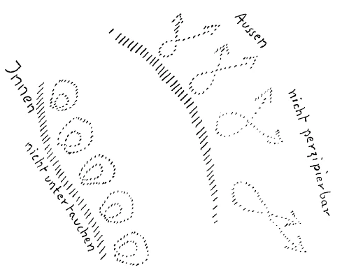

Ich bemühte mich gestern, Ihnen ein Bild des seelischen Menschen zu geben. Dasjenige, was wir für heute einmal aus diesem Bilde des seelischen Menschen herausgreifen wollen, das sollen die beiden Grenzzonen sein, die wir gestern kennengelernt haben. Die eine Grenzzone ergibt sich ja dadurch, daß der Mensch genötigt ist, haltzumachen, wenn er versucht, die Außenwelt, so wie sie sich ihm zunächst sinnenfällig ergibt, zu durchschauen. Von Grenzen des Erkennens reden dann die Naturforscher, Philosophen und so weiter. Wir wissen, daß diese Grenzen des Erkennens nicht in Wahrheit vorhanden sind, daß sie aber in der Tat für das sinnliche, für das physische Anschauen des Menschen vorhanden sind. ^97r7d0

Die andere Grenze ist dadurch gegeben, daß alles in unserem Bewußtsein Befindliche oder in das Bewußtsein Eintretende gewissermaßen reflektiert wird, zurückgespiegelt wird an einer inneren Zone und dadurch zur Erinnerung werden kann. Es geht das, was wir im Bewußtsein haben, nicht in die volle Tiefe derjenigen Region hinunter, die nur unterbewußt für den Menschen bleibt. Wir wollen diese beiden Grenzen herauszeichnen (siehe Zeichnung Seite 45), die Erinnerungsgrenze (links) und — wir können sie geradezu nennen die Liebefähigkeitsgrenze (rechts), die zugleich die Grenze des Naturerkennens ist. Wir haben sie bezeichnet, indem wir Lemniskaten, die nach außen offen sind, hier zu zeichnen hatten (rechts), und hier (links) hatten wir gewissermaßen Lemniskaten mit einer umgestülpten Schleife zu verzeichnen. Das (rechts) also ist dann die Region des Außen, in das der Mensch nicht mehr hineinsieht mit dem gewöhnlichen sinnlichen Anschauungsvermögen, also: nicht perzipierbar. Das (links) ist die Grenze des bewußten Lebens nach innen, in die der Mensch nicht unterzutauchen vermag mit dem Bewußtsein. Der Mensch bleibt mit seinem Bewußtsein oberhalb dieser Grenze. Würde er mit seinen be wußten Vorstellungen hinuntertauchen, so würde er keine Erinnerung haben. ^g49ljk

 ^igaf7d

Nun ist aber gerade in bezug auf das Leben des seelischen Menschen angesichts dieser beiden Grenzen etwas ganz Bestimmtes zu sagen. Wenn wir in der Entwickelung der Menschheit zurückgehen etwa hinter das 8. vorchristliche Jahrhundert - Sie wissen, 747 vor Christus beginnt der vierte nachatlantische Zeitraum -, wenn wir hinter diesen Zeitpunkt zurückgehen in die früheren nachatlantischen Zeiträume, dann gilt für den Menschen dieses, daß dasjenige, was jenseits dieser Grenze liegt, doch in einer gewissen Weise noch hereinwirkte in das Bewußtsein. Und darauf beruhte eben jenes damals noch vorhandene atavistische Hellsehen. Es drangen gewisse Impulse damals herein aus dem Universum und machten sich geltend als atavistische Schauungen. So daß wir sagen können: Ganz undurchsichtig — ich meine jetzt intellektuell undurchsichtig — wurde dieses Außen erst seit dem 8. vorchristlichen Jahrhundert, und es wurde immer mehr und mehr undurchsichtig. — Jetzt leben wir im fünften nachatlantischen Zeitraum. Es ist ja undurchsichtig geblieben. Und darauf pochen ja die Leute heute ganz außerordentlich, indem sie immerzu behaupten, daß überhaupt kein Mensch eindringen könne in jenes «Ding an sich», oder wie sie es dann nennen, was da jenseits dieser Grenze liegt. ^fcfc3e

Dagegen darf gesagt werden, daß immer mehr und mehr sich eine andere Tendenz geltend macht und gegen den sechsten nachatlantischen Zeitraum sich immer mehr und mehr geltend machen wird. Das ist: es wird gewissermaßen diese Zone hier (links) durchlässig werden. Es wird die Zeit kommen, wo aus den Tiefen der Menschennatur dasjenige, was ich Ihnen gestern als das Brodelnde geschildert habe, als dasjenige, in das der Mensch nicht hinunterschauen soll - in dem Sinne vor allen Dingen nicht, wie die phantastischen Mystiker das wollen -, es wird aus diesem Gebiete von dem sechsten nachatlantischen Zeitraum an gewissermaßen allerlei durchsickern wollen. Ja, es wird diese Zeit schon im fünften nachatlantischen Zeitraum beginnen, in unserem Zeitraum. Es wird allerlei durchsickern wollen. Es wird sich das ja vor allen Dingen dadurch äußern, daß viel mehr Menschen, als man heute denkt, immer mehr und mehr aus gewissen rein inneren Erfahrungen entnehmen werden, daß es wiederholte Erdenleben gibt und dergleichen. Diese Dinge kommen, man möchte sagen, heute schon, obwohl spärlich, zum Durchbruche. Ich habe öfter, hier ja wohl auch schon, den Namen eines merkwürdigen Menschen der Gegenwart genannt, des O/to Weininger, der ja besonders bekanntgeworden ist durch sein dickes Buch «Geschlecht und Charakter». Noch interessanter aber ist dasjenige Buch, das nach seinem Tode sein Freund Rappaport herausgegeben hat, und in dem allerlei außerordentlich Interessantes drinnensteht. Es sind zum großen Teil Aphorismen. Das Ganze trägt den Titel «Über die letzten Dinge». Einer dieser Aphorismen besagt ungefähr dieses: Weininger behauptet, die Seele des Menschen hätte in ihrem vorgeburtlichen Leben ein gewisses Grauen vor sich selber zur Entwickelung gebracht und hätte dadurch die Sehnsucht bekommen, dieses Leben zu vergessen und sich in das Vergessen hineinzustürzen, was die Verleiblichung bedeutete. — Also Weininger spricht vollständig von dem vorgeburtlichen Leben, von dem Verleiblichen; nur spricht er in seiner düsteren, pessimistischen Anschauung davon, daß die Seele sich zu betäuben sucht gegenüber ihrem vorgeburtlichen Leben, und die Betäubung sucht sie in der Verleiblichung in einem physischen Menschenleib. ^2smx3i

Aber solche unmittelbaren Eindrücke heutiger Menschen von dem Wege der Seele gibt es ja viele, und sie werden immer zahlreicher und zahlreicher werden. Bei solch einem Menschen wie Weininger kann man schon heute sehen, wie dichter, kompakter, möchte ich sagen, das Ich innerlich den Menschen anfaßt. Bei Weininger sieht man schon deutlich, wie diese Grenze etwas durchlässig wird und da allerlei heraufdringt. Interessant ist es zum Beispiel, welche Notiz er hingeschrieben hat über seinen eigenen Tod. Er verübte frühzeitig, mit dreiundzwanzig Jahren schon, Selbstmord. Er schrieb eine ganze Reihe von Notizen nieder, die außerordentlich interessant sind, weil sie geradezu Imaginationen astralischen Schauens darstellen. Das alles paarte sich mit einem gewissen Charakterzug, der ihn dann dahin führte, eines Tages sich einzumieten in Beethovens Sterbehaus in Wien und in diesem sich gleich am nächsten Morgen selber zu ermorden, mit dreiundzwanzig Jahren. Und darüber schrieb er die Notiz, daß er sich ermorden müsse, weil er sonst fürchten müsse, getrieben zu werden durch einen unbestimmten Drang, ein Mörder zu werden, einen andern ermorden zu müssen. ^zjnpyy

Man sieht, da rumoren furchtbarste Dinge in der Seele eines außerordentlich genialischen Menschen, die nicht so ohne weiteres bezwungen werden können durch das, was in seinem Bewußtsein ist, weil da vieles aus diesem Unterbewußten herauf rumort. Sie werden begreifen, daß man schon mit einem gewissen Recht darauf hinweisen muß, daß die gewöhnliche Gescheitheit, die der Mensch jetzt entwickeln kann, nicht ausreicht, um das, was da aus den unbekannten Tiefen heraufkommt, zu erkennen. Denn es sollte ja gar nicht heraufkommen, es sollte da unten bleiben, aber es wird doch heraufkommen. Geradeso wie bis zum Jahre 747 vor Christus von außen etwas hereingekommen ist, so wird nachher von innen etwas aufsteigen. Durch das, was der Mensch sich erringen wird an gewöhnlicher, normaler Gescheitheit, wird das nicht bezwungen werden können, bei weitem nicht bezwungen werden können. Da wird man eben brauchen jenes Verstehen der Welt, welches durch die Geisteswissenschaft zu erwerben ist. Es wird Harmonie, innerliche Festigkeit und innerliche Gediegenheit in das menschliche Seelenleben nur eindringen können, wenn die Menschen dieses innerliche Seelenleben werden ordnen, harmonisieren wollen durch dasjenige, was aus der Erkenntnis des Geistes heraus errungen werden kann. Es strebt die Entwickelung der Menschheit also aus einem Zustande heraus, in welchem von der Außenwelt mehr wahrnehmbar war, als heute wahrnehmbar ist, und es strebt diese Entwickelung der Menschheit einem Zustande zu, in welchem aus dem tiefsten Inneren des Menschen mehr auftauchen wird, als heute im Normalzustand auftaucht. ^bequ17

Diese Dinge, von denen ich jetzt spreche, sie kennt man eigentlich in den eingeweihten Kreisen da und dort sehr gut. Von jenem alten Erkennen, das bis ins 8. vorchristliche Jahrhundert den Menschen zugänglich war, spricht ja noch das ganze morgenländische Geistesleben, das ganze asiatische Geistesleben. Ja, es spricht nicht nur das Geistesleben, es spricht im Grunde genommen die ganze asiatische Kultur davon. Daher kommt es, daß es eigentlich so schwer verständlich ist für den Europäer, wenn heute der Orientale, der asiatische Orientale von seiner Kultur spricht. Da muß man schon, wenn man diese Leute verstehen will, sich hineinfinden in eine andere Art, die Vorstellungen, die Gedanken zu bilden. Heute würde es zum Beispiel für sehr viele Menschen sehr interessant sein müssen, so etwas Tonangebendes zu verfolgen, wie die Rede ist, welche Rabindranatb Tagore, der Inder, gehalten hat über den Geist Japans. Sie wissen: Tagore ist der von der Nobel-Stiftung preisgekrönte Inder. Er hatüber den Geist Japans einen Vortrag gehalten. Es ist weniger wichtig, was er über den Geist Japans gerade spricht, als der Geist, aus dem heraus er spricht, der Geist des heutigen Orientalen, der nur verstanden werden kann, wenn man weiß, daß etwas in den Orientalen noch zurückgeblieben ist von jenem Herauf-, von jenem Hereinkommen der Außenwelt, wie es heute nicht perzipierbar ist. Für die meisten Europäer reden die Orientalen, wenn sie im Sinne ihrer Kultur reden, eben eigentlich etwas ziemlich Unverständliches. Man versteht gewöhnlich gar nicht, wovon sie eigentlich reden. ^bbnq57

Auch die andere Erscheinung kommt vor, daß dasjenige, was eigentlich erst in der Zukunft auftreten sollte, in einer gewissen Weise dann vorweggenommen wird. Vergleichen könnte ich das damit, daß ich hinweise auf Kinder, die als Kinder schon greisenhaft sind. Sie nehmen das Greisenhafte als Kinder schon voraus. Da ist die Unregelmäßigkeit in der Entwickelung dadurch eingetreten, daß etwas, das später kommen sollte, früher hereingeschoben ist, in eine frühere Zeit. Während nun im orientalischen Denken, in der orientalischen Anschauungsweise gerade bei den hervorragendsten Geistern ein aus alter Zeit Zurückgebliebenes in der Weise herrscht, wie ich es eben angedeutet habe, herrscht namentlich bei so ganz im Sinne des Amerikanismus denkenden Geistern ein Hereinnehmen von Späterem, ein Hereinschieben von Späterem. Da merkt man deutlich, wenn man auf solche Sachen eingehen kann, daß gerade hervorragendere Geister vieles von dem haben, was da (links) durchsickert. Sie bekommen eine Vorstellung von solchem Durchsickerndem, wenn Sie zum Beispiel jenen Essay lesen, den Woodrow Wilson geschrieben hat über die Entwickelung des amerikanischen, des nordamerikanischen Volkes im besonderen. Man kann sich nichts denken, das mehr den Nagel auf den Kopf trifft, das treffender wäre als dieser Essay, den Woodrow Wilson über die Entwickelung des amerikanischen Volkes geschrieben hat. Da ist jedes Wort darinnen so, daß man das Gefühl hat: es ist die Sache in der allerallerschärfsten Weise charakterisiert und getroffen. Und das fällt insbesondere deshalb auf, weil Wilson in diesem Fall sehr scharf aufmerksam macht darauf, daß eine ganze Anzahl von Leuten auch in Amerika die Ansicht haben, die eigentlich nur zu rechtfertigen ist, wenn man das amerikanische Volk heute noch auffaßt — wogegen et, Woodrow Wilson, sich wendet — gleichsam als eine Dependance des englischen Volkes. Diese Menschen, die heute noch die Amerikaner so auffassen, als ob diese etwas wären wie Abkömmlinge, wie ein Zweig der europäischen Engländer, diese Leute lehnt Woodrow Wilson im strengsten Sinne des Wortes ab. Die verstehen nichts, meint er, von der eigentlichen Entwickelung des amerikanischen Volkes im 19. Jahrhundert. Denn der Amerikaner beginnt von innen erst Amerikaner zu sein — so spricht Wilson aus echt amerikanischem Geiste heraus, außerordentlich prägnant und treffend - in dem Momente, wo er aufhört anzuknüpfen mit seinem Seelenhaften an das, was von England herübergekommen ist, wo er beginnt, als Bebauer des Bodens von Osten nach dem Westen hinüberzudringen, von der amerikanischen Ostküste nach der Westküste hinüberzudringen. In diesem Ausroden der Urwälder, in der Arbeit mit der Flinte, in der Arbeit mit dem Spaten, in der Arbeit mit dem Pflug und dem Pferde, in diesem Überwinden jenes Widerstandes, der zu überwinden ist bei der Arbeit von dem Osten nach dem Westen hinüber, entwickelt sich für ihn der Westmann, der «Westerner», wie er es nennt. Und in dieser Art und Weise der Eroberung des Bodens sieht er, so daß es unmittelbar überzeugendsten Eindruck macht, den eigentlichen Nerv der amerikanischen Entwickelung. Man hat überall gerade das Gefühl - man muß natürlich verstehen, das Wie zu lesen in einem solchen Fall, nicht bloß das Was -, da spricht viel mehr als der Wilson. Denn wenn der Wilson selber spricht — ja, da wird nicht viel Gescheites daraus. Da spricht viel mehr, da spricht dasjenige, wovon der Mann als von seinem eigenen Inneren her besessen ist, da sprechen Dämonennaturen, die geradezu grandiose Zukunftsgeheimnisse eingeben. In diese Geheimnisse müßte eigentlich die Menschheit eindringen, wenn die Entwickelung verstanden werden soll. ^yhr5zf

Man muß heute tatsächlich einen Unterschied machen zwischen der bloßen wissenschaftlichen und zeitungsgemäßen Erfassung der Welt, die ja bequem ist, die auch allbeliebt ist, und der wahren Erfassung der Welt. Die wahre Erfassung der Welt, die muß solche Gegensätze sich klarmachen können wie die, welche ich jetzt auseinandergesetzt habe: von dem Hereinkommen bei den orientalischen Völkern von etwas, das da draußen liegt (siehe Zeichnung Seite 45, rechts); von dem Heraufkommen bei den amerikanischen Völkern von etwas, was da drinnen (links) liegt. Und was da heraufkommt, es braucht das nicht etwas bloß Verwerfliches zu sein, es kann in gewissem Sinne grandiose ahrimanische Offenbarung sein, die da heraufkommt. Denn ahrimanische Offenbarung ist es im wesentlichen, welche in jenem ausgezeichneten Aufsatze von Woodrow Wilson über die Entwickelung des amerikanischen Volkes gegeben ist. ^hdlh3i

Die Eingeweihten des Ostens und die Eingeweihten des amerikanischen Volkes, die wissen auch das Nötige aus diesen Dingen zu machen. Man will von beiden Seiten die Entwickelung der Menschheit durchaus in gewisse Bahnen bringen. Die orientalischen Völker, das heißt ihre Eingeweihten, haben ganz bestimmte Absichten für die Zukunftsentwickelung der Menschheit. Diese Leute sehen, was in der Entwickelung richtig liegt und versuchen dasjenige, was in der Entwickelung richtig liegt, soweit der Mensch es beeinflussen kann, zu beeinflussen. Sie suchen ihm eine gewisse Richtung, einen gewissen Impuls zu geben. Und der Impuls, der da von den orientalischen Eingeweihten der Entwickelung gegeben werden will, der beruht im wesentlichen darauf, daß man nicht mehr rechnen will, so ungefähr nach der Hälfte der sechsten nachatlantischen Zeit, auf die menschliche Generation. Man möchte verzichten auf das irdische Menschengeschlecht nach dieser Zeit. Man möchte die Entwickelung der Menschheit dahin bringen, daß die Menschen nachher eigentlich nicht mehr so recht physische Nachkommen haben, daß die Seelen dann schon sich vergeistigen, nicht mehr auf die Erde herunterkommen in Verleiblichungen. Man möchte das Reich des Geistes für die Menschheit schon von der Mitte der sechsten nachatlantischen Zeit an begründen. Dies würde man nur können, wenn man gewisse Kulturingredienzien abweisen würde. Nicht nur die Eingeweihten des Orients, sondern eigentlich instinktiv jeder gebildete Orientale lehnt daher im eminentesten Sinne gewisse Europäismen ab; gerade diejenigen Europäismen, auf die der Europäer ganz besonders stolz ist, lehnt er ab. Er lehnt ab namentlich alles dasjenige, was sich ja aus der rein technischen, materiellen Kultur in Europa und seinem Anhange Amerika ergeben hat. Wer die Entwickelung der Menschheit studiert, namentlich im 19. Jahrhundert und in das 20. Jahrhundert herein, der wird finden, daß man mit Recht sagt: Die Technik hat es ungeheuer weit gebracht, die Technik hat den Menschen Arbeitskräfte abgenommen. Wenn man heute davon redet, die Erde habe so und so viel hundert Millionen Einwohner, so ist dieses eigentlich nicht ganz richtig, weil man auch rechnen kann, wieviel die Erde Einwohner hat nach dem, wieviel gearbeitet wird. Nun wird mit vollständigem Recht gesagt, daß seit dem letzten Drittel des 18. Jahrhunderts von den Maschinen, die nach und nach entstanden sind, menschliche Arbeitskraft verrichtet wird. Man kann berechnen, ziemlich exakt berechnen, wieviel Millionen Menschen mehr die Erde haben müßte, wenn alle die Arbeit, die von den Maschinen verrichtet wird, von den Menschen verrichtet würde. Die Erde müßte fünfhundert Millionen Menschen mehr haben. Man kann schon sagen: Heute sind auf der Erde nicht nur diejenigen Menschen mit zwei Beinen und einem Kopf, die statistisch berechnet werden können, sondern fünfhundert Millionen mehr, gemessen an der Arbeitskraft; die Arbeitskraft wird eben von Maschinen verrichtet. ^xev706

Aber es gibt nichts Materielles, hinter dem nicht ein Geistiges steht. Diese fünfhundert Millionen Menschenkräfte, die sind die Gelegenheit zum Aufenthalte von ebensovielen ahrimanischen Dämonen innerhalb der menschlichen Kultur. Diese ahrimanischen Dämonen sind einmal da. Und diese ahrimanischen Dämonen, die lehnt der Orientale aus einem gewissen Instinkt heraus radikal ab; die will er nicht. Das sehen Sie eigentlich aus jeder Manifestation eines feingebildeten Orientalen heraus, daß er diese ahrimanische Dämonologie ablehnt. Denn diese ahrimanische Dämonologie, die gibt dem Menschen eine gewisse Schwere, die niemals möglich macht, daß dasjenige geschieht, was die orientalische Initiation anstrebt: daß das Menschengeschlecht mit der Mitte der sechsten nachatlantischen Zeit physisch aufhört auf der Erde zu sein, weil die Menschen zurückgehalten werden durch das, was sich auf diese Weise dämonologisch-ahrimanisch entwickelt. ^b6cfdd

Einem andern Ziel streben die Eingeweihten des Amerikanismus zu. Sie streben dem entgegengesetzten Ziele zu. Sie streben danach, eine innigere Gemeinschaft zu bilden, als im normalen Verlauf der Menschheitsentwickelung geschehen soll, zwischen den Menschenseelen und derjenigen Leiblichkeit, welche auf der Erde zu finden sein wird, der dichten, groben Leiblichkeit, die auf der Erde zu finden sein wird von dem sechsten nachatlantischen Zeitraume an. Die seelische Kultur wird sehr vertieft sein, aber die leibliche wird grob sein. Aber eine innigere Verbindung mit dieser groben Leiblichkeit strebt man im amerikanischen Westen an, eine innigere Verbindung als die normale ist, ein stärkeres Untertauchen in die Leiblichkeit. Man will entgegenkommen dem, was da durchsickert (siehe Zeichnung Seite 45, links), will ihm entgegengehen durch stärkeres Eindringen in die Leiblichkeit. Während man also eine Kultur begründen will von seiten der Orientalen, die nicht rechnet mit den Menschenleibern der späteren Erdenentwickelung, will man die Seelen ketten an diese spätere Erdenentwickelung innerhalb der amerikanischen Kultur des Westens. Man will die Leiber möglichst so gestalten, daß die Seelen, wenn sie durch den Tod gegangen sind, möglichst bald wiederum in einen Leib herunterkommen können, daß sie möglichst wenig sich aufhalten in der geistigen Welt. Man will die Seelen möglichst abhalten von einem Aufenthalt in der geistigen Welt, man will, daß sie möglichst bald wiederum auf die Erde herunterkommen. Man will sie innigst verbinden mit dem Leben der Erde. ^tiao05

Das sind Tendenzen, die man kennenlernen muß. So sonderbar es dem heutigen Menschen noch erscheint, wenn man von diesen Tendenzen spricht, so schädlich ist es ihm, daß sie übersehen werden. Denn notwendig ist, daß der Mensch sich mit vollem Bewußtsein hineinstellt in dasjenige, das eigentlich mit ihm selbst gewollt wird und demgegenüber er oftmals leider, leider so steht, daß man sagen kann: er läßt alles mögliche mit sich geschehen. ^v5xt8w

Aber dieses westliche Ideal, diese Dämonologisierung des Menschen, das wird nur erreicht werden können, wenn der geistige, psychische Amerikanismus unterstützt werden kann von einer andern Weltanschauungsströmung, die viel verwandter mit dem Amerikanismus ist, als man denkt. Sie haben ja gesehen: Es ist wesentlich ein Hinneigen des Amerikanismus zur Ahrimankultur, was das Ausschlaggebende ist. Aber eine richtige Förderung würde dieser Amerikanismus erhalten können, wenn er unterstützt würde von einer andern Weltanschauung, die viel verwandter mit ihm ist, als man denkt. Das ist der Jesuitismus. Jesuitismus und Amerikanismus sind zwei sehr, sehr verwandte Dinge. Denn als der fünfte nachatlantische Zeitraum begann, da handelte es sich darum, einen Impuls zu finden, durch den man sich in den Stand setzen konnte, die Menschen möglichst hinwegzuführen von dem Verständnisse des Christus. Und diejenige Bestrebung in der Kulturentwickelung, welche es sich zur Aufgabe gesetzt hat, kein Verständnis des Christus aufkommen zu lassen, das Verständnis des Christus vollständig zu untergraben, das ist der Jesuitismus. Der Jesuitismus strebt danach, allmählich jede Möglichkeit eines Christus-Verständnisses auszurotten. Denn dasjenige, was da zugrunde liegt, das hängt schon mit einem tiefen Mysterium zusammen. Damit, daß etwas von außen (siehe Zeichnung Seite 45, rechts) immer da hereinkam in das menschliche Innere, hängt es zusammen, wie ich sagte, daß die Menschen vorher, vor dem 7., 8. vorchristlichen Jahrhundert, atavistisches Hellsehen hatten. Aber durch dieses atavistische Hellsehen sahen sie auch im Universum den Christus. Der Christus war etwas, was sie sehen konnten im alten Hellsehen. Ich habe das ja oft dargestellt, ich habe es dargestellt in der «Geheimwissenschaft im Umriß», und der ganze Sinn meines Buches «Das Christentum als mystische Tatsache» gipfelt ja schließlich darin. Man sah den Christus im Kosmos, man sah den Christus im Universum. Aber nun denken Sie: Vom 7., 8. vorchristlichen Jahrhundert ab haben wir Menschen die Möglichkeit verloren, in das Universum hinauszuschauen. Was hätten denn die Menschen mitverloren, wenn nichts anderes gekommen wäre, dadurch, daß sie gar nicht mehr hinausschauen konnten ins Universum? Was hätten die Menschen verloren? Die Möglichkeit, von einem Christus-Geiste überhaupt etwas zu wissen, wenn der Christus nicht zu ihnen gekommen wäre durch das Mysterium von Golgatha, wenn der Christus nicht auf die Erde heruntergekommen wäre. In dem historischen Zeitmomente, wo die Menschen nicht mehr den Christus im Kosmos schauen konnten, kam der Christus auf die Erde herunter, verband sich mit dem Jesus. Von da ab war es des Menschen Aufgabe, den Christus in dem Menschen zu erfassen. Und gerettet werden muß die Möglichkeit, daß mit dem, was da durchsickert (siehe Zeichnung, links), der Christus erkannt werde. Denn der Christus ist zu den Menschen heruntergestiegen. Der Jesus ist ein Mensch, in dem der Christus gewohnt hat. Wirkliche menschliche Selbsterkenntnis muß den Jesus-Keim tragen. Dadurch wird man in die Zukunft übersiedeln können. Tief begründet ist es, daß wir von einem Christus Jesus sprechen. Denn der Christus entspricht dem Kosmischen; aber dieses Kosmische ist auf die Erde heruntergekommen und hat in dem Jesus Wohnung genommen, und der Jesus entspricht dem Irdischen mit der ganzen irdischen Zukunft. ^cgwm2n

Will man den Menschen abschließen vom Geistigen, so nimmt man ihm den Christus. Dann hat man die Möglichkeit, den Jesus so zu benützen, daß die Erde nur in ihrem irdischen Aspekt vorhanden bleibt. Sie werden daher beim Jesuitismus eine fortwährende Bekämpfung der Christologie finden, dagegen ein scharfes Betonen dessen, daß man ein Heer ist, eine Armee für den Jesus. Ja, natürlich: Geisteswissenschaft ist schon ein Mittel, daß solche Dinge erkannt werden, daß den Menschen die Schuppen von den Augen fallen. Daher werden jene, die nicht erkannt sein wollen, immer wütender und wütender werden auf dasjenige, was Geisteswissenschaft will. Wütender, man sieht es: Das Juliheft der jesuitischen Zeitschrift «Stimmen der Zeit» — früher «Stimmen aus Maria-Laach» — enthält nicht nur einen, sondern gleich zwei Artikel gegen mich. Und wer dieses im Zusammenhang zu denken vermag mit dem, was sonst jetzt sich an neuen Aspirationen des Jesuitismus in der Welt entwickelt, der wird daraus überhaupt etwas Tieferes sehen können. Nur leider, man spricht ja von solchen Dingen heute doch zumeist vor einer schlafenden Menschheit. Die Menschen lieben es, die wichtigsten Dinge zu verschlafen, nicht hinzuhören auf dasjenige, was nun wirklich zukunftbestimmend ist. Daher werden die Menschen jetzt von allen Dingen, wie ich vorgestern sagte, überrascht. Sie wollen ja auch überrascht sein. Spricht man möglichst früh von den Dingen, die im Schoße der Zeit liegen, so betrachten die Menschen das als etwas Unbequemes, weil sie möglichst lange gut brav bürgerlich bequem auf ihren Polstersesseln sitzen möchten, auch wenn sie verantwortungsvolle, führende Menschheitsstellen innehaben. Aber diejenigen, welche sich für Geisteswissenschaft interessieren, sollten schon sich in die Seelen eingravieren, daß man alles tun wird, um diese Geisteswissenschaft unwirksam zu machen. Es ist nicht gerade gut, wenn auch wir innerhalb unserer Kreise allzusehr schlafen mit Bezug auf die Beobachtung desjenigen, was in der Welt vorgeht. ^y3p5vo

Zuweilen ist es ja recht schwierig, zu sehen, wie doch immer alles, was so persönlich spielt, höhergestellt wird als dasjenige, was in der gegenwärtigen Zeit so ganz besonders wichtig und wesentlich ist: das Hinschauen auf die großen Angelegenheiten der Menschheit, die sich langsam vorbereiten. Die Angriffe, die zu tun haben mit den großen «Wollungen», die kommen schon von den verschiedensten gegnerischen, ernst zu nehmenden Seiten. Solch ein Angriff wie der, von dem ich eben gesprochen habe, er ist schon in gewissem Sinne ernster zu nehmen. Man muß ihn in der richtigen Weise taxieren können. Nicht ernst zu nehmen nach dieser Richtung hin sind ja natürlich jene schönen Angriffe, welche aus dem Unterirdischen unserer Gesellschaft selber immer wiederum auftauchen, und die ja zum Teil bloß deshalb ein böses Ansehen haben, weil immer wieder und wiederum die Tendenz bemerkbar ist, daß man gerade die größte, liebevollste Teilnahme gegenüber jenen Leuten hat, welche dasjenige, was ernst erstrebt wird in unseren Reihen, verlästern, zu verunglimpfen suchen und dergleichen. Und erst wenn das Unheil da ist, dann entschließt man sich nach und nach, wirklich zu sehen; vorher werden manche Leute gehätschelt, welche dann das Unheil bringen. ^wo08f6

Ich sage dies nicht, weil ich daran denke, daß das oder jenes anders sein sollte, sondern weil ich mich wirklich verpflichtet fühle, darauf aufmerksam zu machen, daß die Menschheit aufwachen muß, und daß wir vor allen Dingen zu denen gehören müssen, welche nach Wachheit streben. ^idgq7k

Auf gewissen Gebieten kann man ja heute alles mögliche tun. Der von mir hier gemeinte Schlaf der Menschheit, der nur überwunden werden kann durch ein Eindringen in die geistigen Welten, der ist außerordentlich schwer zu überwinden, der Schlaf der Menschen. Und mit Bezug auf die Verbreitung des geisteswissenschaftlichen Erkenntnisgutes hat man es vielfach gerade mit diesem Schlaf zu tun als dem Gegner. Ich will dabei gar nicht von einer einzelnen Erscheinung sprechen, sondern in der ganzen Kulturbewegung ist gegenwärtig etwas Schläfriges gegenüber den eigentlichen Impulsen, die überall, an allen Stellen den Menschen über den Kopf hinauswachsen. Zwei Dinge sind notwendig, die man sich wie goldene Regeln eigentlich einschreiben müßte in seine Seele: Niemals war mehr als in unserem fünften nachatlantischen Zeitraum die Notwendigkeit vorhanden, daß die Menschen sich immer mehr und mehr bemühen - und daß Menschen da sind, die das können, daran ist nicht zu zweifeln —, gerade das zu erreichen, was besonders wertvoll ist: geisteswissenschaftliche Erkenntnisse zu verstehen. Gewiß, geisteswissenschaftliche Erkenntnisse müssen gesucht werden durch hellsichtiges Eindringen in die geistige Welt; das ist eine Notwendigkeit. Aber das ist eine Selbstverständlichkeit, daß es Hellseher geben muß, die eindringen in die geistige Welt, daß es Leute geben muß, die übersinnliche Erkenntnisse anstreben. Zweitens aber ist besonders wichtig, daß sich für diese geisteswissenschaftlichen Erkenntnisse, für diese in übersinnlichen Welten gesuchte Erkenntnis Leute finden, die kraft des Intellekts die Sache verstehen. Das vernünftige, verständige Begreifen der Geisteswissenschaft, das ist heute ganz besonders notwendig, denn das ist dasjenige, wodurch die widerstrebendsten Kulturmächte gerade überwunden werden. Der Intellekt der Menschen ist heute so groß, daß die ganze Geisteswissenschaft verstanden werden kann, wenn man nur will. Und gerade dieses Verständnis anzustreben, ist ein allgemein-menschliches, nicht ein egoistisches Interesse der Kultur. Denn dieses Verständnis kann angestrebt werden, wenn jene intellektuellen Kräfte, die heute verwendet werden auf naturwissenschaftlichen Gebieten an allerlei Kleinkram, wenn jene intellektuellen Kräfte, die heute volkswirtschaftlich recht fruchtlos verwendet werden, und endlich, wenn jene Kräfte, die in einer fruchtlosen, vielleicht sogar menschenmörderischen Technik verwendet werden, entsprechend angewendet würden, und die Menschen nicht verzogen würden von frühester Kindheit an. Dann würde man sehen, wie leicht das spirituelle Geistesgut wirklich zum Verständnisse der Menschheit gebracht werden könnte. Das ist das eine. ^6df1cf

Die andere goldene Regel ist diese, daß man heute noch etwas anderes braucht für das Fruchtbarmachen des spirituellen Geistesgutes für unsere Kultur. Das erste ist etwas, was Ahriman abgerungen werden muß. Die Menschen sind heute schon gescheit, denn Ahriman sorgt dafür, daß die Menschen gescheit sind. Oh, die Menschen sind gescheit! Sie verwenden ihre Gescheitheit eben nur im materialistischen Interesse. Die Menschen sind nicht nur gescheit, sie sind übergescheit. Davon werden wir aber in den nächsten Vorträgen noch sprechen, damit Sie sehen, welchen ungeheuren Einfluß gerade das ahrimanische Element auf die menschliche Übergescheitheit der heutigen Zeit hat. Aber noch etwas anderes ist notwendig. Noch einem andern Geiste ist manches abzuringen. Wir brauchen nicht nur Gescheitheit, mit der das spirituelle Geistesgut durchdrungen werden soll, wir brauchen vor allen Dingen sehr, sehr dringlich — ja, wie soll ich es ausdrücken -, wir brauchen bei den Menschenseelen, an die das spirituelle Geistesgut herankommt, Temperament, Enthusiasmus, Feuer, Wärme. Wir brauchen Menschen, welche mit der ganzen, vollen Seele dasjenige vertreten, was spirituelles Geistesgut ist. Gerade auf spirituellem Gebiete muß den luziferischen Kräften, die sonst so wirksam jetzt sind in der Welt, dieses abgerungen werden. Es gibt einen schönen Anblick: es ist der Anblick desjenigen, der in ruhiger Klarheit, aber mit innerem Feuer und Enthusiasmus, weil es ihm eine Notwendigkeit ist, für das spirituelle Geistesgut sich erwärmen kann. Es gibt einen andern Anblick: das ist der, wo man möglichst versucht, durch das spirituelle Geistesgut eingelullt zu werden, träumerisch zu werden, hingegossen warm zu werden, aufzugehen in die universellen Kräfte, die Seele zu vereinigen mit dem göttlichen All. Das sind Gegensätze, die man in der Gegenwart doch wohl beobachten kann, Gegensätze, die es notwendig ist, zu beobachten. Denn es wird nicht leicht werden, das spirituelle Geistesgut der Menschenkultur einzuverleiben. Und es muß hinein, denn die Menschenkultur braucht es. Man wird über vieles ganz, ganz anders nicht nur denken lernen müssen, sondern auch fühlen und empfinden lernen müssen. ^hqd6p0

Ja, ich könnte noch manches sagen in Anknüpfung an dasjenige, was ich jetzt eben ausgesprochen habe, aber ich will vielleicht lieber schweigen und will Ihnen Gelegenheit geben, nachzudenken. Man kann über manches nachdenken, was angeregt werden könnte durch manche Tücke, welche ich ganz absichtlich in die eben ausgesprochene Wahrheit hineingelegt habe. Nun, davon wollen wir dann das nächste Mal weiter sprechen. ^7jgwyv