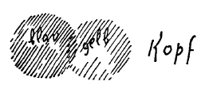
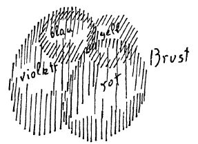
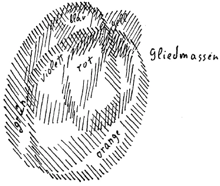

Wenn man eine Zeit, in der man selbst lebt, verstehen will, so muß man sie aus größeren Weltenzusammenhängen heraus verstehen. Das ist gerade das Kleinliche der gegenwärtigen Zeit, daß man nicht will die Impulse, die Kräfte, die wirksam sind in der Gegenwart, aus größerem Zusammenhang heraus sich klarmachen. Und insbesondere wird es immer wieder und wiederum notwendig sein, um das eine oder das andere gegenwärtig Wirksame zu verstehen, zurückzugreifen zu den Verhältnissen, durch welche die Menschheitsentwickelung gegangen ist zur Zeit des Mysteriums von Golgatha. Dieses Mysterium von Golgatha, wir haben es ja von den verschiedensten Gesichtspunkten aus dargestellt und haben gesehen, wie tief, wie bedeutsam es eingreift in den ganzen Evolutionsgang, die ganze Entwickelung der Menschheit. Wir wissen, daß die Menschen vor dem Mysterium von Golgatha anders die Welt empfanden, anders anschauten als nach dem Mysterium von Golgatha. Natürlich geht das nicht so auf einmal aus dem einen Zustand in den andern Zustand über. Aber der rückschauenden Betrachtung ergibt sich schon dasjenige, was wir von den verschiedensten Gesichtspunkten aus dargelegt haben. Insbesondere möchte ich heute, um eine gewisse Grundlage für die nächsten Betrachtungen zu finden, auf eines hinweisen. ^597n8m

Wenn wir die Stimmung, die Verfassung der Menschenseelen vor dem Mysterium von Golgatha betrachten, so können wir im allgemeinen sagen, daß innerhalb der Kulturmenschheit, also derjenigen Menschheit, aus der die heutige Kulturmenschheit hervorgegangen ist, vor dem Mysterium von Golgatha eine gewisse Fähigkeit in den Seelen vorhanden war, in die Geheimnisse der kosmischen, geistigen Welt hineinzuschauen. Es war für die Menschen vor dem Mysterium von Golgatha gewissermaßen selbstverständlich, nicht so zum Sternenhimmel hinaufzuschauen, wie heute der Mensch zum Sternenhimmel hinaufschaut. Wir wissen ja, heute schaut der Mensch zum Sternenhimmel: hinauf, indem er sich sagt: Mit unserer Erde sind einige andere Planeten verbunden, die mit ihr zusammen um die Sonne kreisen; dann sind unzählige andere Fixsterne da, die wiederum ihre Planeten haben. - Und wenn dann der Mensch darauf achtet, was er eigentlich, indem er sich so etwas überlegt, für einen Gedanken hat, so muß er sich doch sagen, er hat den Gedanken einer großen Weltmaschinerie. Daß da noch anderes waltet und wirkt als die Kräfte dieser großen Weltmaschinerie, das macht sich der Mensch der Gegenwart nur sehr, sehr wenig klar. Das war mehr oder weniger für den Menschen vor dem Mysterium von Golgatha selbstverständlich. Insbesondere war für ihn selbstverständlich, die Sonne zum Beispiel nicht bloß als dasjenige anzuschauen, als was sie der heutige Physiker anschaut, roh gesprochen, eine Art glühender Kugel im Weltenraume draußen, sondern der Mensch vor dem Mysterium von Golgatha wußte ganz genau: Diese Sonne, von der die Physik spricht, diese Sonne ist nur ein Element in der ganzen Sonne. Dieser Sonne liegt zugrunde ein Seelisches und ein Geistiges. Und das Geistige, das dieser Sonne zugrunde liegt, sprach ja noch der griechische Weise als das allgemeine Weltgute an, als das Gute der Welt, als das einheitliche, die Welt durchwallende Gute. Das war ihm der Geist der Sonne. Ihm wäre es, diesem griechischen Weisen, als stärkster Aberglaube vorgekommen, so zu denken, wie der heutige Physiker denkt, daß da draußen im Weltenraume einfach eine glühende Kugel schwebe; sondern ihm war diese glühende, schwebende Kugel die Offenbarung des einheitlich Guten, das in der Welt zentral wirksam ist. Und mit diesem zentralen Guten, das geistiger Art ist, ist wiederum verbunden ein Seelisches: der Helios, wie es die Griechen nannten. Und erst das dritte, der physische Ausdruck des Guten und des Helios, war dann die physische Sonne. Es sah also der Mensch damals an Stelle der Sonne ein Dreifaches. Und mit diesem Dreifachen, das in der Sonne in alten Zeiten gesehen worden ist, brachten diejenigen Menschen, welche in der Zeit des Mysteriums von Golgatha dachten — ausgerüstet mit dem Wissen dieses Mysteriums von Golgatha, ausgerüstet mit dem Wissen der alten Mysterien —, mit diesem dreifachen Sonnenmysterium brachten diese Weisen das Christus-Mysterium zusammen, das Mysterium von Golgatha selber. Mit der Sonnenverehrung war verbunden für diejenigen, die etwas wußten, die Christus-Verehrung. Mit der Sonnenweisheit war wiederum für diejenigen, die etwas wußten, verbunden die Christus-Weisheit. ^29uc09

Um aber das, was ich jetzt auseinandergesetzt habe, naturgemäß zu fühlen, als etwas Selbstverständliches zu empfinden, dazu war eben die Konstitution der Seele notwendig, die damals da war. Und diese Konstitution der Seele verschwand eben. Sie verschwand schon seit dem 8. vorchristlichen Jahrhundert, mit dem Jahre 747 - dies ist die wirkliche Gründungszahl von Rom - vor dem Mysterium von Golgatha. Mit der Gründung Roms schwindet eigentlich die alte Möglichkeit, in dem Kosmos draußen das Geistige zu sehen. Mit dem Eintritt Roms in die Geschichte tritt das in die Menschheitsevolution ein, was man das prosaische Element nennen kann. Die Griechen zum Beispiel bewahrten in ihrer ganzen Weltanschauung noch die Möglichkeit, hinter der Sonne eben die zwei andern Sonnen, die seelische und die geistige Sonne zu sehen. Und nur dadurch, daß nun nicht rein in griechische Weisheit und in griechisches Empfinden das Mysterium von Golgatha getaucht worden ist, sondern in römische Weisheit und in römisches Empfinden, dadurch ist es gekommen, daß man gebrochen hat mit dem Wissen von dem Zusammenhang des Christus mit der geistigen Sonne. Damit haben sich ja namentlich die christlichen Kirchenväter und die christlichen Kirchenlehrer zu befassen gehabt, dieses Mysterium von der Sonne zu verhüllen, dieses Mysterium von der Sonne für die Menschheit vergessen zu machen, es nicht herauskommen zu lassen. Es sollte gewissermaßen ein Schleier gebreitet werden durch die fortgehende Entwickelung des Christentums, wie man das nennt, über die tiefe, die bedeutsame, die umfassende Weisheit von dem Zusammenhange des Christus mit dem Sonnenmysterium. ^p29sjs

Wenn man definieren sollte die Aufgabe der Kirche, jener Kirche, die entstanden ist dadurch, daß das Christentum in das Römertum eingesenkt worden ist, dann müßte man dies so tun, daß man sagte: Die römisch gefärbte christliche Kirche hatte sich namentlich zur Aufgabe zu machen, das Christus-Mysterium möglichst zu verhüllen, es möglichst wenig bekanntwerden zu lassen. — Die Einrichtung, welche die Kirche durch den Romanismus erfahren hat, die ist insbesondere geeignet gewesen, die Menschen so wenig wie möglich von dem Christus-Geheimnis wissen zu lassen. Die Kirche war dadurch eine Institution zur Geheimhaltung des Christus-Mysteriums geworden, eine Institution geworden, möglichst wenig in die Welt kommen zu lassen von dem Christus-Mysterium. Dies ist etwas, was immer mehr und mehr in der jetzigen Zeit der Menschheit klarwerden muß, weil beginnen muß diejenige Zeit, welche in der Lage ist, wiederum mit andern Begriffen zu arbeiten als mit den römischen Begriffen. Römische Begriffe haben gerade das Scharfumrissene, das Scharf konturierte, das Kadaverhafte. Diejenigen Begriffe, welche entwickelt werden, um zum Beispiel den Menschen in seiner Wahrheit zu begreifen, wie ich ihn in seiner Normalaura, möchte ich sagen, Ihnen vor acht Tagen hier auf die Tafel gezeichnet, skizziert habe, die Begriffe, die notwendig sind, um die wahre Wirklichkeit des Menschen wieder zu erfassen und damit die wahre Wirklichkeit der Welt einigermaßen zu begreifen, diese Begriffe müssen flüssig sein, diese Begriffe dürfen nicht scharf konturiert sein, denn die Wirklichkeit ist nichts Starres, sondern etwas Werdendes. Und wollen wir mit unseren Begriffen und Ideen die Wirklichkeit erfassen, so müssen wir mit unseren Begriffen dem Fluß, dem Werden der Wirklichkeit nachschreiten. ^eb0ip2

Wenn außer acht gelassen wird dieses Flüssigwerden der Begriffe, dann kommt das zustande, was heute zum Unheil der Menschheit an zahlreichen Orten beobachtet werden kann. Nehmen Sie eine Erscheinung, die heute für etwas gründlichere, nicht schlafende Weltenbeobachter sich geradezu aufdrängt. Es ist die folgende Erscheinung. Nicht wahr, wir haben in der Welt unter uns Gelehrte, Gelehrte auf den mannigfaltigsten Gebieten. Diese Gelehrten vertreten, bewahren, wie man sagt, die Wissenschaft, und die heutige Menschheit, die ja nicht autoritätsgläubig ist, glaubt aber trotz ihres aus der Welt geschafften Autoritätsglaubens aufs Wort alles dasjenige, was von den Gelehrten der verschiedenen Gebiete vertreten wird. Und die Gelehrten untereinander glauben den andern immer dasjenige, was nicht gerade in ihrem Gebiete ist. In diese Verhältnisse sehen die Menschen heute nicht gern hinein, weil das ganze Zerfaserte und Chaotische unserer Kultur den Menschen auffallen müßte, wenn sie in diese Verhältnisse hineinsehen würden. Aber wir haben ja zum Beispiel das Folgende erlebt. Nehmen wir an, so ein Gelehrter — wir könnten immer für die verschiedenen Gebiete einen herausheben - hat zu seinem speziellen Gebiete, nun, meinetwillen - ich will etwas Ausgefallenes nehmen -, die Ägyptologie. Da besteht dann sein Beruf darinnen, daß er über die Eigentümlichkeit des ägyptischen Volkes die übrigen Menschen, die sich nicht beschäftigen können mit dem, was man die Quellen nennt, unterrichtet, daß er auch über die Beziehungen des ägyptischen Volkes zu andern Völkern des Altertums die Menschen unterrichtet. Der Menschen Aufgabe ist es, das aufs Wort zu glauben, denn der Mann ist ja in der Ägyptologie eine Autorität. Nun ist aber in unserer Zeit ein Unheil gekommen: Eine große Anzahl von diesen Gelehrten, die solche Spezialgebiete vertreten, haben nicht geschwiegen, sondern über Themen gesprochen, die nicht zu ihrem Fachgebiet gehören. Es wäre ja besser gewesen, wenn sie geschwiegen hätten, aber sie haben nicht geschwiegen; sie haben zum Beispiel ihr Denken, ihre Gedankenformen heute unter dem Eindruck dieser Ereignisse angewendet auf ihr eigenes Volk und auf seine Beziehungen zu den andern Völkern. Und da hat man nun genügend Gelegenheit zu sehen, was für Unsinn eigentlich die Leute reden. Nun müßte man Schlüsse ziehen, Schlüsse, die sehr real gedacht werden können. Gar mancher, der etwas gilt, sagen wir, auf dem Gebiete der Ägyptologie, und von dem man die Meinung hat, daß seine Begriffe mit Bezug auf die Eigentümlichkeiten des ägyptischen Volkes und seines Verhältnisses zu andern Völkern unanfechtbar seien, der redet nun plötzlich in der Gegenwart lauter Unsinn über sein eigenes Volk und über das Verhältnis seines eigenen Volkes zu den andern Völkern. Ja, glauben Sie, er wird nun über die Ägypter und über ihre Beziehungen zu andern Völkern gescheiter reden und geredet haben? Wenn Balfour heute über das Verhältnis seines Volkes zu der übrigen Welt spricht, oder wenn Fousten Stewart Chamberlain fortwährend Unsinn redet über das Verhältnis der Menschen zu den andern Menschen, da könnten einige auch ohne Nachdenken irgendwie herauskriegen, daß die Leute Unsinn reden, völligen Unsinn reden! Aber nun hat der Chamberlain geschrieben «Die Grundlagen des 19. Jahrhunderts» und eine große Anzahl anderer Bücher, bei denen man nicht die Gelegenheit hat, die Geschichte zu prüfen. Er hat natürlich ganz genau denselben Unsinn geredet dazumal. ^valzax

Es ist schon einmal gegenwärtig die Zeit der Prüfung, und namentlich die Zeit der Prüfung dafür, nun endlich einmal einzusehen, daß es nicht bloß darauf ankommt, Urteile abzugeben, die einen gewissen eingeschränkten Wert haben, indem sie richtig sind auf einem bestimmten Gebiete — das ist fast jedes Urteil, das Falscheste ist auf einem bestimmten Gebiete richtig —, sondern daß es darauf ankommt, geradezu zu suchen jene Flüssigkeit der Urteile, die nur durch die Geisteswissenschaft gefunden werden kann, die in die Realität eindringt. ^dfa18g

Es ist ja merkwürdig, welche Kollisionen zwischen gesundem Denken und zeitgemäßem Denken gerade heute an die Oberfläche treten. Man hat in den letzten Tagen von einer religiösen Diskussion gehört, die stattgefunden hat in Petersburg - Petrograd, so hat man eine Zeitlang gesagt, ich weiß nicht, ob man jetzt schon wieder Petersburg sagt -, also von einer religiösen Diskussion, die in dem ehemaligen St. Petersburg stattgefunden hat. Mitten drinnen im Bolschewismus hat man von einer religiösen Diskussion gehört. Da haben über die Religion und ihre Entwickelung gesprochen Sozialisten, Popen, selbstverständlich auch allerlei Bourgeoisleute. Die haben natürlich nicht das Gescheiteste geredet. Nun könnte man aus der Diskussion, die da gepflogen worden ist, die natürlich in der Wolle gefärbt war von der Gegenwart, aber durchaus mit den starrsten alten Begriffen arbeitete, wie es scheint, doch manches lernen. Zum Beispiel hat da ein Pope etwas höchst Interessantes vorgebracht. Der Pope fühlt sich genötigt, zu seinen Lämmern so zu sprechen, wie er es bisher gewohnt war. Nun hat er natürlich bisher so geredet, daß alles dasjenige, was auf der Welt ist, der Zarismus und alles, alles selbstverständlich von Gott kommt. Was kann er heute machen, der gute Pope? Er muß natürlich das, was er gewohnt war, früher seinen Lämmern zu sagen - jetzt sind es keine Lämmer mehr -, heute wenigstens irgendwie beibehalten, denn er will ja nicht zu neueren Begriffen übergehen. Da sagt er denn: Die Welt ist von Gott, alles ist von Gott; da wir jetzt eine Sowjetregierung haben, ist sie auch von Gott. Bolschewismus ist eben von Gott der Menschheit geschickt. Da alles von Gott ist, ist auch der Bolschewismus von Gott. — Was soll er anderes sagen? Ich bin ganz überzeugt davon, die Schlußfolgerung kann auch noch weiter ausgedehnt werden. Warum sollte man nicht sehr schön plausibel machen können, daß der Teufel von Gott ist? Der Teufel ist eingesetzt von Gott, nach ganz derselben Schlußfolgerung! — Das ist es ja, daß man wirklich einmal tiefer hineinleuchtet in dasjenige, was notwendig ist. Das findet natürlich auf allen Gebieten stärkste Gegnerschaft.Schlafen aber kann man nicht, wenn man sich vorgenommen hat, teilzunehmen an dieser Umarbeitung des Vorstellungsvermögens der Menschen. ^l2ay1f

Begriffe, die der Materialismus herausgearbeitet hat und die geradezu als unanfechtbar gelten, sie gehören zu demjenigen, was gewissermaßen am gründlichsten überwunden werden müßte. Nichts begegnet einem ja heute häufiger aus der sogenannten Autorität der Wissenschaft heraus als dasjenige, was genannt wird das Gesetz von der Erhaltung der Energie und des Stoffes, Erhaltung von Kraft und Stofl. Das ist dasjenige, was ganz besonders der Menschheit ans Herz gewachsen ist. Die ganz und gar mechanistisch, physikalisch gewordene Weltanschauung will sich betäuben gegenüber dem Vorhandensein des Geistes. Da sie den Geist nicht anerkennen will, kann sie dem Geist auch nicht Dauer, nicht Ewigkeit zuschreiben; sie schreibt die Ewigkeit ihrem kleinen Götzen, dem Atom, oder überhaupt dem Stoff oder der Kraft zu. Aber, die Wahrheit ist, daß von alldem, was Sie sinnlich anschauen können, was Sie da stofflich und als Kräfte in der Welt umgibt, nach den Gesetzen des Weltenalls nichts, aber auch gar nichts über die Stufe des Venuszeitalters hinaus existieren wird. Wir wissen, daß auf die Evolution der Erde die Jupiterevolution folgt, und auf die Jupiterevolution die Venusevolution, dann die Vulkanevolution. So wie sich der Mensch in verschiedenen Verkörperungen wiederfindet, so findet sich die Erde wieder als Jupiter, nach der Jupiterevolution als Venus, nach der Venusevolution als Vulkan. Dasjenige, was heute von irgendeinem physikalischen Experiment als Stoff und Stoffgefüge gefunden werden kann, es hat nicht Bestand über das Venusdasein hinaus. Es gibt keine Erhaltung des Stoffes und der Kraft - solchen Stoffes, solcher Kraft, von der die Physiker sprechen können — über das Venusdasein hinaus. Das ganze Gesetz von der Erhaltung des Stoffes und der Kraft ist lediglich ein Aberglaube, ist dasjenige, wovon alle physikalischen Begriffe beherrscht werden. Aber etwas wird zugedeckt, indem man geradezu davon spricht, die Welt bestehe aus unzerstörbarem Stoff, der sich immer in andern Gruppierungen ergibt. Zugedeckt wird das, was als Antwort kommen muß, wenn man die Frage aufwirft: Ja, was bleibt denn dann, wenn alles das, was unsere Sinne in weiterem Umkreise umgibt, schon nicht mehr da sein wird, wenn die Venuszeit gekommen oder in ihrer Mitte angelangt sein wird? Was bleibt dann? Wo ist denn irgend etwas, was bleibt? ^0k8s0n

Nun, richten Sie Ihre Augen hinaus in den weiten Umkreis, den Sie überschauen können. Schauen Sie sich alles, alles an, schauen Sie sich die Gesamtheit des mineralischen, des pflanzlichen, des tierischen, des menschlichen Reiches an; schauen Sie sich an alles dasjenige, was Sie sehen können als Sterne, Lichterscheinungen, alle Lufterscheinungen, alle Wassererscheinungen, sehen Sie hin, wo Sie hinschen wollen, fassen Sie alles zusammen, was Sie irgendwie in Ihren äußeren Sinneswahrnehmungen zusammenfassen können und stellen Sie sich die Frage: Wo ist etwas, was von unserem jetzigen Dasein bleibt? — In keinem Tier, in keiner Pflanze, in keinem Mineral, in keiner Luft, in keinem Wasser, nirgends als nur im Menschen! In allem, was Sie heute sehen können, ist nichts enthalten, was regelrecht über das Venusdasein hinausgeht, als einzig und allein der Mensch selber. In nichts anderem können Sie etwas Bleibendes, etwas, was mit dem Begriffe der Ewigkeit angesprochen werden kann, suchen, in nichts anderem als in dem Menschen. Das heißt: Suchen wir die Keime für die wahre Weltenzukunft, wo müssen wir sie suchen? - Wir müssen sie im Menschen suchen! Wir können sie bei keinem andern Geschöpf, in keinem Naturreiche suchen. Aber durch die Naturreiche haben die alten Menschen vor dem Mysterium von Golgatha das kosmische All, geistig natürlich, gesehen. Wenn wir die Sonne nehmen: Sie haben einen glühenden Ball gesehen, aber sie haben durch den glühenden Ball den Helios und das Gute gesehen. Doch dieser glühende Sonnenball wird nicht länger vorhanden sein als das Venusdasein; dann ist er weg. Und alles dasjenige, wodurch man wie die Alten als durch einen Schleier die Konstituion irgendeines geistigen Daseins gesehen hat, es wird weg sein. Und von alledem, was jetzt da ist, bleibt für die Zukunft nur das, was in den Menschen keimhaft veranlagt ist. ^za916o

Was ist denn also eigentlich geschehen? Die Menschen haben vor dem Mysterium von Golgatha hinausgesehen in das weite Weltenall; sie haben gesehen Sterne über Sterne, sie haben gesehen die Sonne und den Mond, sie haben gesehen Luft und Wasser, die verschiedenen Reiche. Aber sie haben sie nicht so angeschaut wie der heutige Mensch, sondern sie haben hinter alldem das geistig-göttliche Dasein geschaut, und sie haben hinter alldem den Christus, der noch nicht zur Erde niedergestiegen war, geschaut. In diesen alten Zeiten hat man den Christus verbunden mit dem Kosmos, außerirdisch hat man ihn gesehen. In all dem, worinnen man den Christus gesehen hat, ist nichts, was über das Venusdasein hinaus dauert. Alles, wodurch sich in den Zeiten vor dem Mysterium von Golgatha dem Menschen das Geistige enthüllt hat und auch der Christus im Kosmos, hat nur einen Bestand bis zum Venusdasein. Die Menschen lebten vor dem Mysterium von Golgatha mit dem Himmel, aber dieser Himmel ist so sinnlich, daß er auch mit dem Venusdasein verschwindet. Was über das Venusdasein hinaus bleibt, das hat seine Keime nur im Menschen. Der Christus mußte aus dem Weltenall zu dem Menschen kommen, wenn er mit dem Menschen den Gang in die Ewigkeit antreten wollte. Weil das alles so ist, wie ich es Ihnen jetzt geschildert habe, deshalb stieg der Christus aus dem Kosmos herab, um fortan mit dem zu sein, was als Keim im Menschen in die Ewigkeit hinaus dauert. ^6lfsgs

Das ist das große kosmische Ereignis, das man verstehen muß. Die Menschen vor dem Mysterium von Golgatha konnten den Gott, den Christus im Weltenall verehren. Die Menschen, die darauf kommen mußten - und es ist die Zeit seit dem Mysterium von Golgatha immer mehr und mehr darauf gekommen, daß nur im Menschen der Keim ist für die ewige Weltenzukunft -, diese Menschen mußten einen Christus haben nicht im Weltenall draußen, das zerfällt, sondern vereint mit dem Menschen, mit der menschlichen Organisation, mit dem menschlichen Reiche. Wörtlich wahr ist es: Dasjenige, was da ist im weiten Umkreis der Sinne als Sterne, als Himmelskörper, es wird vergehen. Aber das Wort, der Logos, der erschienen ist in dem Christus, und der sich vereinigt mit dem ewigen Wesenskern des Menschen, der wird bleiben. Und das ist eine wörtliche Wahrheit, wie die Dinge in den wirklichen okkulten, religiösen Urkunden wörtliche Wahrheiten sind. ^446nqy

Das aber ist auch der Grund, warum wir gewissermaßen einen Dualismus in der Namengebung haben müssen - ich habe darauf schon hingedeutet -, in der Namengebung Christus Jesus. Den Christus, der dem außerirdischen Weltenall angehört, dieses geistige Wesen, das vor dem Mysterium von Golgatha nicht mit den Menschen der Erde verbunden war, muß man auf der einen Seite erkennen; das darf nicht vergessen werden, denn das ist heruntergestiegen und hat sich mit der Menschennatur, mit dem Jesus verbunden. In dem Dualismus Christus Jesus liegt dasjenige, was notwendig ist, zu verstehen. In dem Christus muß man das Kosmisch-Geistige sehen; in dem Jesus muß man dasjenige sehen, durch welches dieses Kosmisch-Geistige in die historische Entwickelung eingetreten ist und sich so mit der Menschheit verbunden hat, daß es mit dem Menschenkeim nun weiter in die Ewigkeiten leben kann. ^5v7n7p

Dieses mit den alten Mysterien zusammenhängende Christusgeheimnis zu verhüllen, zu entstellen, das war gewissermaßen die Aufgabe der Kirche in den verflossenen Jahrhunderten. Und versuchen Sie einmal, den Werdegang der Menschheit in diesen verflossenen Jahrhunderten wirklich zu studieren, versuchen Sie sich klarzumachen, wie es denjenigen einzelnen Menschen gegangen ist, welche den Christus Jesus wirklich suchen wollten, die wirklich den Weg finden wollten zu dem Christus Jesus: es war immer ein Märtyrerweg. Er mußte immer gesucht werden, der Christus Jesus, gegen die Konventionen, wie er ja auch heute selbstverständlich gegen dasjenige, was von den Konventionen geblieben ist, gesucht werden muß. Aber man kann dem Christus-Geheimnis nicht nahekommen, wenn man es nicht verbindet mit dem Naturgeheimnis. ^57z8ub

Sie sehen, die Notwendigkeit, die wir vor unsere Seele hingestellt haben, von dem Herunterkommen des Christus aus kosmischen Höhen zu dem Menschenkeim, das Geheimnis von dem Jesus-Werden des Christus, man kann es nur verstehen, wenn eine Einheit wird Naturbetrachtung, Weltbetrachtung, Kosmologie und die Wissenschaft von dem Werden des Menschen und des Göttlichen in der Menschheit. Das möchte man gerade von einer gewissen Seite her vermeiden, daß Naturwissenschaft zu gleicher Zeit Geisteswissenschaft und Geisteswissenschaft zu gleicher Zeit Naturwissenschaft werde. Das ist ja das Bestreben der meisten Theologen, und auf der andern Seite wiederum das Bestreben der meisten Naturgelehrten der Gegenwart, daß eine Schranke aufgerichtet werde zwischen der Naturwissenschaft auf der einen Seite und der Geisteswissenschaft auf der andern Seite. Nur ja soll nicht über den Christus Jesus etwas gesagt werden, was zu gleicher Zeit zusammenhängt mit der Erdenevolution, und nur ja soll nicht über die Erdenevolution, das heißt über ihre einzelnen Teile etwas gesagt werden, was zusammenhängt mit dem großen geistigen Mysterium. ^r56q8w

Indem man diese Dinge berührt, berührt man in der "Tat Wichtigstes, Allerwichtigstes im Menschenleben der Gegenwart. Denn jenes konfuse Geschwätz von allerlei Geistigem, auf das auch unsere Freunde einen so oftmals aufmerksam machen, und zum Ekel einen aufmerksam machen, dieses konfuse Geschwätz vom Geiste nützt gar nichts. Ich meine, es kommt alle Augenblicke einer und sagt: Nun sehen Sie einmal, der hat wiederum ganz theosophisch oder anthroposophisch geredet, er hat das und das gesagt! — Dieses bequeme Suchen nach Stützen in der gegenwärtigen Konfusion, das ist nicht dasjenige, was wir anstreben sollen, sondern wir sollen schon auf dem Fundament feststehen, das uns die Geisteswissenschaft sein wird. Und die Zeit ist zu ernst, um weitere Kompromisse, besonders auf diesem Gebiete zu pflegen. ^vcwake

Die Brücke zu schaffen zwischen dem Naturwissen, überhaupt zwischen dem Wissen des Wahrgenommenen und dem Wissen desjenigen, zu dem die Sünde, zu dem die Erlösung, kurz, zu dem die religiösen Wahrheiten gehören, die Brücke zu schaffen zwischen diesen zwei Gebieten, das kann nur geschehen, wenn man den Mut haben wird, in das Geistige wirklich real einzudringen. Aber auch über die Lebenswahrheiten wird man nichts Vernünftiges wissen können, wenn man nicht den Mut hat, in das Geistige real, wirklich einzudringen. Zum Eindringen in das geistig Reale gehört vor allen Dingen diese Möglichkeit: wiederum etwas zurückzublicken zu dem dreifachen Sonnenmysterium der alten Zeit, aber in dem neuen Sinne, wie es der gegenwärtigen Menschheit angemessen ist. Geradeso wie die Sonne eine Dreiheit ist, so ist ja der Mensch auch eine Dreiheit. Aber es handelt sich darum, daß wir diesen dreifachen Menschen wirklich studieren. Das ist Wichtigstes für die Gegenwart: den dreifachen Menschen zu studieren. Ich möchte Ihnen heute einmal vorbereitend - morgen und übermorgen werden wir diese wichtige Sache zu Ende führen — schematisch etwas angeben, was Sie führen kann auf dem Wege, der eigentlich gesucht werden müßte, um den dreifachen Menschen zu begreifen. ^xad912

Denken Sie sich einmal das Folgende - also das, was ich jetzt skizziere, soll ein Schema sein -, denken Sie sich, Sie hätten ein Gebilde, das ganz und gar nur Bild, nur Abbild sei, das im Grunde gar keine Bedeutung in sich selber hat, also Abbild ist. Das will ich so skizzieren: ich zeichne einfach einen Kreis (siehe Zeichnung Seite 71, blau), eine Kreisfläche. Das ist ein Gebilde, das Abbild ist von etwas anderem, aber dadurch, daß es Abbild ist, hat es das andere, wovon es Abbild ist, vollständig aufgezehrt. Es ist ja sonderbar, wenn ich folgendes sage, aber denken Sie sich einmal: In unserer Kuppel, in der kleinen Kuppel arbeiten vier Damen; nehmen wir einmal an, diese vier Damen würden, auf jeder Seite zwei, malen, sich selber porträtieren, aber dieses Porträtieren hätte eine besondere Folge. Also denken Sie sich, diese vier Damen, die porträtieren sich in der kleinen Kuppel, malen sich selber da ab, aber dieses Sich-selber-Porträtieren, das hätte eine ganz bestimmte Folge: sie verschwänden nämlich dadurch, sie gingen über in ihr Abbild, sie hörten auf zu sein. Wenn sie fertig sind, sind sie nicht mehr da. Dadurch, daß die Abbilder entstanden sind, sind sie selbst nicht mehr da. - Solch ein Gebilde stellen Sie sich unter dem, was ich hier skizzenhaft aufgezeichnet habe, einmal vor: ein Gebilde, das dadurch entstanden ist, daß es gemacht worden ist von etwas, wovon es Abbild ist; aber dadurch, daß das Abbild da ist, ist das andere aufgezehrt. ^bnzqag

Nun ist aber dieses Aufgezehrte nicht allein in der Welt. Stellen Sie sich nämlich vor, es wäre die Geschichte noch nicht aus mit diesen vier Damen. Gut, diese vier Damen wären verschwunden, sie hätten sich da aufgemalt und wären verschwunden; aber die Bilder sind da. Sie sind nicht allein da im Weltenall, das Weltenall ist mit seinen Kräften außerdem noch da. Die Damen sind verschwunden, sind von den Bildern gewissermaßen aufgesogen worden; aber dadurch, daß die Bilder da sind, zieht sich aus dem Weltenall wiederum Substantielles zusammen und bildet die Damen neu, allerdings jetzt als Kinder: sie entstehen langsam wieder, entstehen da daneben. So entsteht neben diesem Gebilde wiederum sein Urbild (siehe Zeichnung, gelb). Ich müßte es eigentlich ein Stückchen hinein zeichnen, ich zeichne es nun daneben auf: das ist das Urbild. Das ist das Urbild, aber es ist ein sehr loser Zusammenhang zwischen diesem Abbild und dem Urbild, ein sehr loser Zusammenhang. Beide haben fast gar nichts miteinander zu tun. Dieses Abbild ist richtig verhärtet und hat fast gar nichts mit seinem Urbilde zu tun. ^ii9wc3

 ^tovajj

Dann denken Sie sich ein zweites Gebilde. Ich will das zweite Gebilde so skizzieren, daß ich es nun auch als Abbild mache (siehe Zeichnung Seite 72, violett); nur ist das erste drinnen in dem zweiten. Das erste ist etwas für sich, aber es ist auch drinnen in dem zweiten. Also ich zeichne da kühn über das erste das zweite drüber. Das ist wiederum solch ein Abbild, und wiederum so ähnlich ein Abbild von einem andern, das ich auch nun da drauf zeichnen will (siehe Zeichnung, rot); das muss ich aber nun schon inniger mit dem verbinden. Da ist die Sache also so, daß ich nicht den Vergleich wählen könnte, den ich früher mit den vier Damen gewählt habe, sondern wenn ich bezüglich dieses Bildes und Abbildes jetzt einen Vergleich wählen würde, müßte ich so sagen: Es sind also die vier Damen da, sie malen in der kleinen Kuppel, und während sie malen, geht schon auch etwas von ihnen selber auf, wird aufgesogen. Aber nur zur Hälfte werden sie aufgesogen; zuletzt sind sie so, daß sie — nun, ich will also sagen, um nicht einen unästhetischen Vergleich hervorzurufen: Es wird von der einen die linke Körperhälfte aufgesogen, die rechte ragt noch heraus aus dem Bilde; von der anderen die rechte Körperhälfte aufgesogen, die linke ragt noch heraus. Also sie sind teilweise aufgesogen; teilweise ragen sie noch heraus. Das ist das zweite. ^horuiq

 ^ow8ndj

Dann stellen Sie sich ein drittes vor, das also wiederum das erste mitumfaßt und das zweite auch mitumfaßt (siehe Zeichnung Seite 73, grün). Das aber ist zum großen Teil mit seinem Abbilde verbunden, das ist noch nicht getrennt von seinem Abbilde. Da müßte ich also, wenn ich den Vergleich festhalten wollte, sagen: Die Damen malen, aber sie bleiben auch als Damen vorhanden, und das Ganze, was ich vor mir habe, sind die Damen und ihre Abbilder. Das ist vorhanden (siehe Zeichnung, orange), das ist zum größten Teile auch im Urbilde vorhanden. ^tz8u4z

 ^fc1u3y

So haben Sie also hier (Zeichnung Seite 71) etwas schematisch gezeichnet: zuerst oben ein Abbild, verhärtet, kristallisiert, es hat möglichst wenig mit seinem Urbilde zu tun; das Urbild ist daneben, neu entstehend. Das ist nämlich Ihr Kopf; der ist der materiellste, verhärtetste Teil der Menschennatur. Sein Urbild hat geradezu nichts mit ihm zu tun, entsteht neu; und wenn Sie achtundzwanzig Jahre alt geworden sind, ist Ihr Kopf so, daß er aus sich selber gar nicht einmal mehr etwas hergibt, ausgewachsen ist. Der größte Materialist in der Menschennatur ist das Haupt. Ein zweites Gebilde ist Brust und Atmung und alles, was dazugehört. Das ist ungefähr so, daß ich das zweite als Schema gebrauchen könnte (Zeichnung Seite 72). Das ist schon mehr verbunden, da hängen Geist und Materie schon mehr zusammen, das ist schon durchgeistigter. Alles das, was Lunge und Atmungsprozeß ist, ist schon für die Erde vergeistigter. Und was übrigbleibt, Gliedmaßen, im Zusammenhange damit alles das, was die Sexualität umfaßt, da ist Geistiges mit Physischem eins, da sind sie noch zusammen. Das gehört zum dritten Schema (Zeichnung oben). ^5q9qj6

Das ist der dreifache Mensch. Ich habe es Ihnen heute nur schematisch auf die Tafel zeichnen können. Dieses zu gleicher Zeit wunderbare und fruchtbare, dieses großartige und tiefeindringende Mysterium vom dreifachen Menschen hängt wiederum mit dem dreifachen Sonnenmysterium zusammen. Das aber hängt wiederum zusammen mit all den Wahrheiten, die wir brauchen wie das Brot des Lebens für alles dasjenige, was sich setzen muß an die Stelle dessen, was in das Chaos, was in die Sackgasse hineingekommen ist und zu den gegenwärtigen Menschheitskatastrophen geführt hat. Davon werden wir morgen weiter sprechen. ^tz7wvn