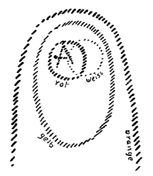
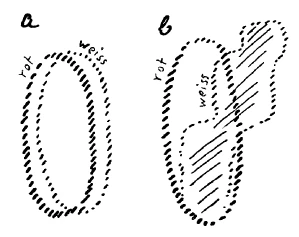
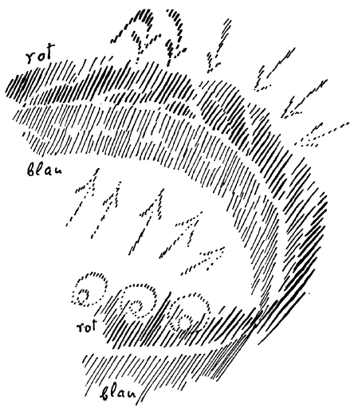
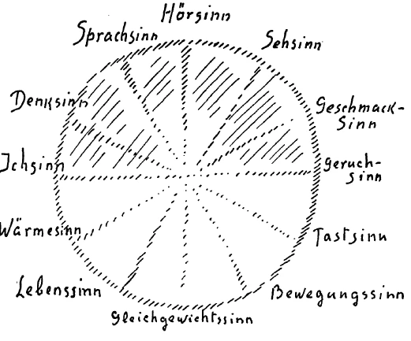

Auf den dreigeteilten Menschen habe ich gestern schematisch hingewiesen. Es ist ja durchaus so, daß aus unserem gegenwärtigen Geistesleben heraus wenig Empfindungen vorhanden sind für das Verständnis des Wesens des Menschen, so wie es erfaßt werden muß vom geisteswissenschaftlichen Standpunkte. Allein, wir müssen uns doch bemühen, an dieses Menschenwesen heranzukommen. Die wichtigsten Vorstellungen, die man auch über das Gesamtleben des Menschen gewinnen muß, über die Entwickelung des Menschen zwischen dem Tode und einer neuen Geburt, auch sie sind nur zu beherrschen, wenn man ausgeht von einem solchen Verständnisse, das an diesen dreigeteilten Menschen anknüpft. Betrachten wir für heute einmal im einzelnen diesen dreigeteilten Menschen. ^2ob2yb

Es wurde ja gestern schon darauf aufmerksam gemacht, daß wir da zunächst auf das Haupt des Menschen hinweisen können. In einem gewissen Sinne ist dieses Haupt des Menschen wirklich eine Art selbständige Formwesenheit. Sie können sich ja selber hinstellen vor ein Menschenskelett, und Sie können leicht das Haupt abheben. Wie eine Kugel können Sie es abheben. In Wirklichkeit ist allerdings die Trennung zwischen den drei Gliedern der menschlichen Natur nicht so einfach, daß man sagen könnte: Dasjenige, was man da vom übrigen Skelett so bequem abhebt wie eine Kugel, das ist dieser Hauptesteil. -— So streng sind die Dinge nicht geschieden. Aber man muß sich ja allmählich herausarbeiten aus dem bloßen Schematismus, auch aus dem, den einem die Natur selbst nahelegt, zu einer lebendigen Empfindung. Und ich mußte ja gestern schon, wie Sie gesehen haben, nicht etwa drei nebeneinanderliegende Kreise aufzeichnen, sondern einen Kreis für das Haupt, einen zweiten Kreis, der dieses Haupt übergriff, und einen dritten Kreis, der wiederum beide übergriff. So daß, wenn man schematisch den dreigeteilten Menschen zeichnen würde nach seiner physischen Wesenheit, man eben ihn so zu zeichnen haben würde, daß man sagt: Der Hauptesteil (siehe Zeichnung roter Kreis A), der Rumpfteil (oval, gelb), und dann der Gliedmaßenteil (orange) -, eigentlich drei Kugeln, wenn auch diese Kugeln in die Länge gezogen werden müssen. Mit dem Hauptesteil, also mit dem, was hier als roter Kreis A bezeichnet worden ist, mit diesem Hauptesteil steht das Geistige, das, wie Sie gestern gesehen haben, eine junge Bildung ist, im Zusammenhange (hellschraffhierter kleiner Kreis, weiß). Dieses Geistige des Hauptes, das ist eine junge geistige Bildung, während das Haupt selbst eine alte physische Bildung, eine physische Formwesenheit ist. Bei dem Haupte ist daher vor allen Dingen richtig, was man sonst im allgemeinen für den Menschen anführt, was aber in dieser Allgemeinheit, wie man es anführt, nicht ganz richtig ist; für das Haupt ist es richtig. Was ich hier als Weißes, Geistiges bezeichnet habe in bezug auf das Haupt, das ist, wenn Sie schlafen, heraußen aus dem Haupte. Wenn Sie wachen, ist es mit dem Haupt vereinigt, ist zum größten Teile im physischen Haupte drinnen. Es kann sich also am leichtesten vom physischen Haupte trennen; es geht heraus und geht wiederum zurück, hinein. ^2lg4v1

 ^aahwpz

Das ist schon durchaus nicht so für den mittleren Menschen, nennen wir ihn meinetwillen den Brustmenschen. Alles dasjenige, was vom Thorax, vom Brustkorbe eingeschlossen ist, von den Rippen und vom Rückgrat, das ist mit dem Geistigen verbunden, aber es ist nicht so ausgesprochen das Geistige heraußen, wenn Sie schlafen. Das Geistige steht schon auch während des Schlafens für diesen mittleren Menschen in einer starken Verbindung mit dem Physischen. Und für den dritten Menschen, für den Gliedmaßenmenschen, wozu auch der sexuelle Mensch gehört, da ist eigentlich praktisch eine Trennung zwischen Schlafen und Wachen in Wirklichkeit doch nicht vorhanden. Da kann man gar nicht sagen, daß wirklich das Geistig-Seelische im Schlafe sich trennt; die bleiben mehr oder weniger auch im Schlafe vereint. So daß man nach einem andern Schema den wachenden Menschen gut so zeichnen könnte, daß man sagte: Wenn das der physische Mensch ist, wachend (siehe Zeichnung a, dunkel schraffiert, rot), so würde dieses der geistige Mensch sein (hell schraffiert, weiß). Das würde der schlafende Mensch sein (siehe Zeichnung b, rot und weiß); es bliebe also dieses mehr oder weniger mit dem Leiblichen vereint, und nur das geht eigentlich heraus (siehe Zeichnung b). Das würde von einem gewissen Gesichtspunkte aus die eigentliche Zeichnung sein für den Gegensatz des wachenden und schlafenden Menschen. ^gft8xu

 ^zd98r1

Nun werden Sie die wichtigen Dinge, die wir zu besprechen haben, nur dann verstehen, wenn Sie diese Gliederung des dreigeteilten Menschen, die wir eben besprochen haben, für sich durchkreuzen mit einer andern Gliederung des Menschen, die anknüpft an dasjenige, was ich die vorige Woche hier auseinandergesetzt habe. ^76u6go

Wenn wir so noch einmal das Haupt, den Rumpfmenschen, den Gliedmaßenmenschen durchsprechen, so können wir ja sagen: Im eigentlichsten Sinne Mensch ist nur der Rumpfmensch. Der ist daher auch derjenige, dem der lebendige Odem eingehaucht ist durch die Elohim. Er ist der atmende Mensch. Da ist die Teilung nicht so ganz bequem wie beim Skelett; der Atmungsvorgang durch Nase und Mund gehört schon zum Rumpfmenschen. Also, nicht wahr, es ist die Teilung in Wirklichkeit nicht so schematisch bequem zu machen, wie man es sich gern aufzeichnen möchte, aber das sind ja natürlich die Schwierigkeiten des Verständnisses für eine solche Sache. ^vcgwyz

Also der eigentliche Mensch, der Erdenmensch, ist der Rumpfmensch. Und der Kopfmensch, als physische Gestaltung, das ist eigentlich nicht etwas durch und durch Menschliches. Man kann nicht sagen, daß der Menschenkopf etwas durch und durch Menschliches ist. Der Menschenkopf hat eben sehr viel Ahrimanisches in sich. Er ist im wesentlichen so gegliedert, wie er gegliedert ist, aus dem Grunde, weil gewisse Bildungsprinzipien in ihm namentlich diejenigen sind, die noch von der alten Sonne, also von diesem zweiten Erdenstadium - Saturn, Sonne -, zurückgeblieben sind. Unser Haupt mit seiner ganzen komplizierten Bildung wäre nicht so, wie es ist, wenn es nicht seine erste Bildung bekommen hätte in diesen uralten Zeiten der alten Sonne. Und es sind also eigentlich alte, uralte Bildungsprinzipien, die heute hereinragen in die Erdensphäre, und die wir aus diesem Grunde als ahrimanische bezeichnen müssen. Zurückgebliebene Prinzipien müssen wir ja immer als luziferische oder ahrimanische, je nach den Gesichtspunkten, ansehen. Dasjenige, was den Menschen als Erdenmenschen ausmacht, wo die Prinzipien des Erdenwerdens hauptsächlich spielen, das ist der Brust-, der Rumpfmensch. ^m8jh9p

Der Gliedmaßenmensch ist auch nicht rein der Mensch, sondern der hat sehr viel Luziferisches in sich, und seine Bildungsprinzipien sind eigentlich noch nicht volle Bildungsprinzipien, sondern sie sind solche, welche ihre volle Ausgestaltung erst haben werden, wenn die Erde ins Venusstadium gekommen sein wird, wenn also das Jupiterstadium vorausgegangen und im Übergange sein wird in das Venusstadium. Dann werden die Bildungsprinzipien, die heute, ich möchte sagen, noch diesen Schatten von einem Wesen ausbilden, der der Extremitätenmensch ist, dieses dritte menschliche Wesen, in ihrer vollen Intensität, in ihrer richtigen Gestalt wirken: wenn die Venuszeit da sein wird. Also das nimmt der Mensch voraus, was in der Venuszeit erst da sein wird und bildet es heute unvollkommen, keimhaft, läßt es nicht über das Keimhafte hinauskommen. ^seft4f

So ist die Sache kosmisch betrachtet. Kosmisch betrachtet also sind wir in unserer Gestaltung so, daß wir in unserem Haupte gewissermaßen nach den Kräften die alte Sonnenzeit wiederholen, in unserer Brust das Erdenwerden tragen; indem wir Extremitätenmenschen sind, tragen wir die Keime zum Venuswerden in uns. Das ist kosmisch betrachtet. ^z50is3

Humanistisch betrachtet ist es etwas anderes. Da müssen wir auf die menschliche Individualität sehen, wie diese menschliche Individualität von Inkarnation zu Inkarnation schreitet. Da müssen wir sagen: Was wir heute in dieser Inkarnation als Haupt an uns tragen, das hat sich verwandt erwiesen unserer vorigen Inkarnation; dasjenige, was wir jetzt als Brustmenschen in uns tragen, das ist eigentlich rein verwandt unserer gegenwärtigen Inkarnation; und dasjenige, was wir als Extremitätenmensch in uns tragen, das wird ja Haupt in der nächsten Inkarnation, das ist verwandt schon mit der nächsten Inkarnation. Ich habe Ihnen in der vorigen Woche gesagt: Das Haupt hat etwas Verräterisches, insbesondere in seinem Negativ. Wenn Sie einen Abdruck nehmen würden von der Physiognomie des Hauptes und diese Physiognomie anschauen würden, so würden Sie in dieser negativen Physiognomie Ihres Hauptes viel von dem erkennen, was Sie in einer vorigen Inkarnation angestellt haben. ^xwpkc1

Umgekehrt ist es mit dem Extremitätenmenschen. Da können Sie aber nicht einen Abdruck nehmen, sondern da müssen Sie anders vorgehen. Denken Sie sich vom Menschen das Haupt und den Rumpfmenschen weg, aber denken Sie sich alles das, was nun Ihre Hände und Beine tun, machen Sie sich ein Bild von dem, was Ihre Hände und Beine tun. Sie müssen sich da eine Art Landkarte machen. Nicht wahr, jedesmal, wenn Sie mit Ihren Händen das oder jenes tun, geschieht es ja an einem andern Orte. Sie gehen ja außerdem herum, Sie kommen in Beziehung zu andern Wesen. Wenn Sie das alles malen würden, was Ihre Hände und Beine tun, und ein Bild im Laufe Ihres Lebens entwerfen würden — es würde ein sehr bewegtes Bild werden - von dem, was Ihre Hände und Füße, Arme und Beine tun, dann würden Sie in dieser Zeichnung eine komplizierte Landkarte erblicken; aus der würden Sie viel von dem verraten bekommen, was Ihnen karmisch aufbewahrt ist für Ihre nächste Inkarnation. Darinnen würden Sie viel ablesen können von dem Karma der nächsten Inkarnation. Es ist durchaus bedeutsam: So wie der Negativabdruck der Physiognomie in seiner Ruhe, in seiner festen, konturierten Zeichnung verräterisch ist für das, was in der vorigen Inkarnation schon geschehen ist, so würde dasjenige, was man abpunktieren könnte von dem, wie sich Arme, Hände, Beine, Füße verhalten, außerordentlich instruktiv sein für das, was der Mensch in der nächsten Inkarnation ausführen wird. Namentlich ist es auch instruktiv für das, was der Mensch in der nächsten Inkarnation ausführt, wohin er geht, wohin ihn seine Beine tragen. Wenn Sie alle die Orte, wenn Sie einfach den Weg verfolgen würden, wohin Sie Ihre Beine tragen, so würde da eine Landkarte daraus werden. Sie würden merkwürdige Figuren bekonimen. Nicht ganz ohne Einfluß sind die Neigungen der Menschen auf diese Figuren. Es spricht sich viel von den geheimen Neigungen in diesen Figuren aus. Die sind sehr verräterisch, diese Spuren, die da bleiben, für dasjenige, was die nächste Inkarnation dem Menschen bringt. Also das wäre humanistisch betrachtet. Das andere war kosmisch betrachtet. ^ibdfd1

Diese Gliederung des Menschen, die, ich möchte sagen, abzielt auf die Gegenwart, bedeutet aber wiederum eine Verbindung mit den Geheimnissen der alten Mysterien, in denen man mehr atavistisch die Sache gewußt hat, aber in denen man solche Geheimnisse, wie sie jetzt eben angeführt worden sind, schon gekannt hat. Es gibt eine schöne Sage, anknüpfend an den König Salomo, über die Bestimmtheit, mit welcher der Mensch seine Füße dorthin setzt, wo er seinen Tod finden soll. Gleichsam ist der Sinn dieser Sage, daß ein bestimmter Ort auf der Erde ist, wo der Mensch seinen Tod finden soll — Sie werden einen Zweigvortrag finden, wo ich gerade über diese SalomoSage vorgetragen habe -, dahin setzt der Mensch dann seine Füße. Das hängt zusammen mit dem alten Mysterienwissen von diesen Dingen. ^b4bsjh

Nun, der Mensch hat ja eigentlich, wenn er so im allgemeinen lebt, nur sein gewöhnliches Bewußtsein; aber er ist, wie Sie sehen, ein recht kompliziertes Wesen, der Mensch. Wenn er wachend ist, wenn er sein jüngstes geistiges Glied, das Haupt, in seinem physischen Haupte drinnen hat, dann weiß er ja nichts von seinem Haupte. Sie werden mit Recht sagen: Gott sei Dank, daß man nichts vom Haupte weiß; denn weiß man vom Haupte, so ist es nur der Kopfschmerz. - Auf eine andere Weise wird sich der Mensch seines Hauptes nicht bewußt, als wenn er Kopfschmerz kriegt; dann weiß er, daß er ein Haupt hat. Sonst bleibt das unbewußt, im eminentesten Sinne unbewußt, viel unbewußter, als ein übriges Glied des menschlichen physischen Leibes. Der Mensch darf ganz froh sein, wenn er im normalen Bewußtsein von seinem Haupte nichts weiß. Aber unter diesem Bewußtsein des Hauptes, das gewöhnlich eigentlich nur von der Außenwelt Kenntnis nimmt, das nur darauf ausgeht, zu wissen von dem, was in der Umgebung ist, unter diesem Wissen ruht ein anderes, eine Art Traumbewußtsein, ein Traumeswissen. Ihr Haupt träumt fortwährend. Und während Sie von der Außenwelt wissen in der Art, wie Ihnen das wohl bekannt ist, träumen Sie eigentlich unter der Schwelle des Bewußtseins, im Unterbewußtsein, fortwährend. Und was Sie da träumen, dieses Träumen im Haupte, wenn Sie es voll auffassen könnten, wenn Sie es ganz in das Bewußtsein hereinbringen könnten, so würde Ihnen das ein Bild geben, ein richtiges, zusammenfassendes Bild Ihrer vorigen Inkarnation. Denn Ihre vorige Inkarnation träumen Sie unterbewußt in Ihrem Haupte. Das ist schon so. Es ist immer ein leises Bewußtsein vorhanden, das nur übertäubt ist von dem stärkeren Lichte des gewöhnlichen Bewußtseins, ein träumendes Bewußtsein von der vorigen Inkarnation. ^5yrlq7

Mit dem Jahre 747 vor dem Mysterium von Golgatha ist das äußere Bewußtsein so stark geworden, daß nach und nach dieses Unterbewußtsein der vorigen Inkarnation völlig ausgelöscht worden ist. Aber vor diesem Jahre 747 hat man vielgewußt von diesem Traumesbewußtsein des Hauptes. Daher finden Sie auch überall auf dem Grunde der alten Kulturen die wiederholten Erdenleben als eine Tatsache angeführt. Das rührt einfach davon her, daß dazumal dieses Unterbewußtsein des Hauptes noch nicht so völlig in den Hintergrund getreten war wie jetzt, wie das geschehen ist durch den vierten, namentlich durch den fünften nachatlantischen Zeitraum. ^6b7dym

Von dem, was seelisch-geistig mit dem Brustkorb und dem Rumpf des Menschen zusammenhängt, wissen Sie ja auch im gewöhnlichen Bewußtsein sehr wenig. Das ist schon an sich ein Traumhaftes. Es schlägt nur manchmal, und dann sehr chaotisch, unregelmäßig, dieses Rumpf- und Brustkorbbewußtsein in das Bewußtsein des Menschen im 'Traume herauf. Wenn der Mensch regelmäßig atmen kann, wenn sein Herzschlag regelmäßig ist, also wenn alle seine Funktionen des Brustkorbes und Rumpfes regelmäßig sind, so verläuft das Bewußtsein des Rumpfes nicht so hell wie das Kopfbewußtsein, sondern es verläuft auch im gewöhnlichen Leben traumhaft. Man träumt im Gefühle — ich habe das im vorigen Jahre hier ausgeführt - von diesem mittleren Menschen. Aber dieses, was da im Gefühle liegt, was der Mensch nur im Gefühle erlebt, wenn es heraufgeholt wird durch ein mehr hellseherisch werdendes Bewußtsein, wenn mit andern Worten der Mensch das, was in seinem Brustkorb sich abspielt, ebenso bewußt zu überschauen lernt, wie er sonst im wachen Zustande nur das überschaut, was in seinem Hauptesbewußtsein ist, ja, dann teilt sich dieses Rumpf- und Brustkorbbewußtsein deutlich in zwei Teile. Der eine Teil träumt zurück in die ganze Zeit zwischen dem vorigen Tod und der jetzigen Geburt oder Empfängnis. Also während Sie traumhaft, in sehr tiefen Träumen in Ihrem Hauptesbewußtsein unterbewußt haben dasjenige, was in der vorigen Inkarnation war, haben Sie das, was seit der vorigen Inkarnation bis zu der jetzigen Geburt in der Zwischenzeit verflossen ist, in den Träumen des Brustkorbes. Und in den Träumen, die mehr nach den unteren Partien des Brustkorbes gelegen sind, haben Sie ein starkes Bewußtsein von dem, was zwischen Ihrem kommenden Tode und dem nächsten Erdenleben ist. Also das Bewußtsein, das im Brustkorb konzentriert ist, das aber mehr oder weniger unterbewußt bleibt für den gegenwärtigen Menschen, das ist eigentlich ein traumhaftes Bewußtsein sowohl für die Zeit vor dieser Geburt wie für die Zeit nach diesem Tode. Was zwischen unserem letzten Erdentode und unserer nächsten Erdenempfängnis liegt, mit Ausnahme desjenigen oder auch mit Einschluß desjenigen, was wir jetzt erleben zwischen Geburt und Tod, das enträtselt sich für dieses Unterbewußtsein des mittleren Menschen. ^tkg0ic

Und in demjenigen, was recht sehr stark durch das ganze Leben hindurch unterbewußt bleibt, was nur heraufgezogen werden kann, wenn der Mensch imstande ist, es durch immerwährendes Sich-Beschäftigen mit geisteswissenschaftlichen Studien und Übungen heraufzuziehen, so daß gewisse Momente des Schlaflebens, die sonst eben schlafend, unbewußt vor sich gehen, heraufgehoben werden und der Mensch mitten aus dem Schlaf heraus bewußt wird, da kann sich das Tableau von der nächsten Erdeninkarnation aus diesem dritten Menschen, aus dem Unterbewußtsein des Extremitätenmenschen heraus entwickeln. Dasjenige, was der Mensch als sein gewöhnliches, heute wachendes Bewußtsein hat, ist eigentlich eine Art Seitentrieb des Menschen; das strahlt in das Haupt herein von außen. Aber hinter diesem Bewußtsein liegt ein anderes Bewußtsein, das sich verbreitet über die vorige Inkarnation, über das Leben von der vorigen Inkarnation bis zu dieser, über das Leben von dieser Inkarnation bis zur nächsten, und dann wiederum über die nächste Inkarnation. Nur verschläft der Mensch dieses Bewußtsein. ^bmkipk

Es ist das Bewußtsein der vorigen Inkarnation im Haupte. In allden Organen, die vorzugsweise dem Ausatmen dienen, wirkt ein starkes Bewußtsein für das Leben zwischen der vorigen Inkarnation und dieser. In all den Funktionen, die vorzugsweise dem Einatmen dienen, wirkt ein Bewußtsein von der jetzigen Inkarnation bis zur nächsten Erdeninkarnation. Und in dem Gliedmaßenmenschen, in all den geheimnisvollen Vorgängen des Gliedmaßenmenschen wirkt ein sehr, sehr unterbewußt bleibendes Bewußtsein der nächsten menschlichen Inkarnation. ^ljfsgw

Diese Bewußtseine sind mehr oder weniger verdeckt worden seit dem Beginn der vierten nachatlantischen Zeit, seit 747 vor dem Mysterium von Golgatha. Und der Beruf unserer Zeit ist wiederum, aus dem allgemeinen chaotischen Menschenbewußtsein heraus die bestimmten Bewußtseine von diesen konkreten Vorgängen der kosmischen und der Menschheitsevolution herauszuholen. ^qyb51d

Mit alldem, was ich jetzt entwickelt habe, muß sich eine andere Einsicht in die Menschenwesenheit, ich möchte sagen, kreuzen. Ja, es ist schon notwendig, daß wir uns in so schwierige Erörterungen einlassen, wir kommen sonst nicht zum genaueren Verständnisse. Ich hätte ja so gerne, wenn für diese schwierigen Erörterungen nicht nur ein gewisses Über-sich-ergehen-Lassen waltete, sondern wenn gerade für diese schwierigen Dinge — weil das der gegenwärtigen Menschheit so notwendig wäre — ein bißchen Enthusiasmus, ein bißchen temperamentvolles Eingehen aufzubringen wäre, was ja in einer Gesellschaft der heutigen Zeit so unendlich schwierig ist. ^nhihs9

 ^b6tdl3

Sehen Sie, Sie richten Ihre Sinne nach außen. Da finden Sie durch Ihre Sinne die Außenwelt als eine sinnenfällige ausgebreitet. Ich zeichne das schematisch, was da nach außen als sinnenfällig ausgebreitet um uns herum liegt. Bitte, es soll das, was da außen herum liegt, dieses (siehe Zeichnung, blau) sein. Wenn Sie Ihre Augen, Ihre Ohren, wenn Sie Ihren Geruchssinn, was Sie wollen, auf die Außenwelt richten, so wendet sich Ihnen gewissermaßen entgegen, es wendet sich diesen Sinnen entgegen dasjenige, was die Innenseite dieses Außen ist also bitte: die Innenseite dieses Außen (links). Nehmen Sie an, Sie wenden Ihre Sinne dem zu, was ich da gezeichnet habe (siehe Zeichnung, Pfeile), so sind diese Sinne auf diese Außenwelt gerichtet und Sie sehen das, was sich innen hier hineinneigt. Nun folgt die schwierige Vorstellung, auf die ich aber schon kommen muß. Alles das, was Sie da anschauen, zeigt sich Ihnen von innen. Denken Sie sich, daß das auch eine Außenseite haben muß. Nun, ich will es schematisch dadurch vor Ihre Seele rufen, daß ich sage: Wenn Sie so hinausschauen, sehen Sie als Grenze Ihres Schauens das Firmament: das hier ist ja fast so, nur daß ich es klein gezeichnet habe. Aber jetzt denken Sie sich, Sie könnten flugs da hinausfliegen und könnten da durchfliegen und von der andern Seite gucken, Ihre sinnenfälligen Eindrücke von der andern Seite angucken. Also Sie könnten so hinschauen (siehe Zeichnung, Pfeile oben). Bitte, das sehen Sie natürlich nicht; aber könnten Sie so hinschauen, so würde das der andere Aspekt sein. Sie würden aus sich heraus müssen und würden von der andern Seite Ihre ganze sinnenfällige Welt anschauen müssen. Sie würden also das, was sich Ihnen als Farbe zuwendet, von der Rückseite betrachten, das, was sich Ihnen als Ton zuwendet, von der Rückseite betrachten und so weiter; was sich Ihnen als Geruch zuwendet, würden Sie von der Rückseite betrachten, Sie würden von der Rückseite den Geruch in die Nase fassen. Also von der andern Seite denken Sie sich die Weltbetrachtung: wie einen Teppich ausgebreitet die sinnenfälligen Dinge, und nun den Teppich von der andern Seite einmal angesehen. Ein kleines Stück sehen Sie nur, ein sehr, sehr kleines Stück von dieser Rückseite. Dieses sehr kleine Stück, das kann ich hier nur dadurch zur Darstellung bringen, daß ich die Sache so mache: Denken Sie sich jetzt, ich zeichne das, was Sie da von der andern Seite sehen würden, rot ein; so daß ich sagen kann, schematisch sieht man das Sinnenfällige so: Wie man es gewöhnlich sieht, so sieht es blau aus; sieht man es von der andern Seite, so sieht es rot aus, aber das sieht man natürlich nicht. In diesem, was man da rot sehen würde, steckt erstens alles das drin, was erlebt werden kann zwischen dem Tod und einer neuen Geburt, zweitens alles das, was beschrieben ist in der «Geheimwissenschaft im Umriß» als Saturn-, Sonnen-, Monden-, Erdenentwickelung und so weiter. Dasjenige liegt da aufgespeichert, was eben verborgen ist für die sinnenfällige Anschauung. Das ist da auf der andern Seite der Kugel. Aber ein kleines Stück sehen Sie davon; das kann ich nur so zeichnen, daß ich jetzt sage: Nehmen Sie dieses kleine Stück von dem Roten, das ginge da herüber (siehe Zeichnung, unten) und durchkreuzt sich mit dem Blauen, so daß das Blaue, statt daß es jetzt vorne ist, dahinter ist. Ich müßte eigentlich hier vierdimensional zeichnen, wenn ich es wirklich zeichnen würde, ich kann es daher nur ganz schematisch zeichnen. Also da (links) sind die Sinne jetzt hier dem Blauen zugewendet; da sind sie nicht zugewendet dem Blauen, sondern dem Roten, das Sie sonst nicht sehen. Aber hinter dem Rot hat sich jetzt gekreuzt das, was sonst gesehen wird, und das ist jetzt darunter. Und dieses kleine Stück, das da sich kreuzt mit dem andern, das sehen Sie fortwährend im gewöhnlichen Bewußtsein. Das sind nämlich Ihre aufgespeicherten Erinnerungen. Alles, was als Erinnerung entsteht, entsteht nicht nach Gesetzen dieser äußeren Wahrnehmungswelt, sondern es entsteht nach den Gesetzen, die dieser hinteren Welt da entsprechen. Dieses Innere, das Sie als Ihre Erinnerungen haben, das entspricht wirklich dem, was da auf der andern Seite ist (rechts). Indem Sie in sich hineinblicken, in alles das, was Ihre Erinnerungen sind, sehen Sie tatsächlich die Welt auf einem Stück von der andern Seite; da ragt das andere ein wenig herein, da sehen Sie die Welt von der andern Seite. Und wenn Sie jetzt durch Ihre Erinnerungen, wie sie so aufgeschrieben sind, durchschlüpfen könnten - ich habe vor acht Tagen davon gesprochen --, wenn Sie da hinunter könnten, unter Ihre Erinnerungen sehen und sie von der andern Seite anschauen könnten, von da drüben (siehe Zeichnung, links), da würden Sie die Erinnerungen als Ihre Aura sehen. Da würden Sie den Menschen sehen als ein geistig-seelisches aurisches Wesen, wie Sie sonst die äußere Welt sinnenfällig in den Wahrnehmungen sehen. Nur wäre es ebensowenig angenehm — wie ich das vor acht Tagen hier charakterisiert habe -, weil da der Mensch noch nicht schön ist von dieser andern Seite. ^yert5q

Also das ist das Interessante, was man kreuzen muß mit dem andern Verständnis des dreigliedrigen Menschen. Diese Kreuzung hier, die liegt nun im mittleren Menschen, im Brustmenschen. Sie erinnern sich an die Zeichnung, die ich vor acht Tagen gemacht habe, wo ich ja die in sich gewundenen Lemniskaten mit den zurückgeschlagenen Schleifen hatte: die müßte ich hier zeichnen. Hier müßte ich diesen Brustmenschen zeichnen mit den zurückgeschlagenen Lemniskaten (siehe Zeichnung Seite 85, links unten): das würde zusammenfallen mit der Erinnerungssphäre. So daß dieser dreigliedrige Mensch hier in seinem mittleren Teil diese Umwendung des Menschen hat, wo das Innere äußerlich und das Äußere innerlich wird, wo Sie ein Tableau, das Sie sonst als Welttableau, als die große Welterinnerung schen würden, nun als Ihre eigene kleine mikrokosmische Erinnerung sehen. Sie sehen in Ihrem gewöhnlichen Bewußtsein dasjenige, was sich zugetragen hat von Ihrem dritten Jahre an bis jetzt: das ist eine innere Aufzeichnung, ein kleines Stück für das, was gleichartig mit dem ist, was sonst Aufzeichnung für die ganze Weltenevolution ist, was auf der andern Seite liegt. ^omfyjx

Nicht ohne Grund habe ich seinerzeit, wie den meisten von Ihnen wohl bekannt sein wird, davon gesprochen - und ich habe es ja wiederum ausgeführt in meinem letzten Buche «Von Seelenrätselm am Schluß in der Anmerkung -, nicht ohne Grund habe ich davon gesprochen, daß der Mensch eigentlich zwölf Sinne hat. Diese Sinne müssen wir uns so denken, daß eine Anzahl von diesen zwölf Sinnen nach dem Sinnenfälligen zugewendet sind, eine andere Anzahl von diesen zwölf Sinnen sind aber nach rückwärts gerichtet. Sie sind auch da unten (siehe Zeichnung Seite 85) nach dem gerichtet, was schon das Gewendete ist. Und zwar sind nach dem äußeren Sinnenfälligen gerichtet: Ichsinn, Denksinn, Sprachsinn, Hörsinn, Sehsinn, Geschmackssinn, Geruchssinn. Diese Sinne sind gerichtet nach dem Sinnenfälligen. Die andern Sinne kommen ja eigentlich dem Menschen deshalb nicht zum Bewußtsein, weil sie zunächst nach seinem eigenen Inneren und dann nach dem Umgekehrten der Welt gerichtet sind. Das sind vorzugsweise: Wärmesinn, Lebenssinn, Gleichgewichtssinn, Bewegungssinn, Tastsinn. So daß wir sagen können: Für das gewöhnliche Bewußtsein liegen sieben Sinne im Hellen (oben) und fünf Sinne im Dunkeln (unten). Und diese fünf Sinne, die im Dunkeln liegen, die sind der andern Seite der Welt zugewendet, auch im Menschen der andern Seite (siehe Zeichnung Seite 85). ^a6z0vd

Sie können daher einen vollständigen Parallelismus haben zwischen den Sinnen und zwischen etwas anderem, wovon wir gleich sprechen werden (siehe Zeichnung, Kreis). Also nehmen wir an, wir hätten als Sinne zu verzeichnen den Hörsinn, den Sprachsinn, den Denksinn, den Ichsinn, den Wärmesinn, den Lebenssinn, den Gleichgewichtssinn, den Bewegungssinn, den Tastsinn, den Geruchssinn, den Geschmackssinn, den Sehsinn, so haben Sie im wesentlichen alles dasjenige, was vom Ichsinn geht bis zum Geruchssinn, im Hellen liegend, in dem, was dem gewöhnlichen Bewußtsein zugänglich ist (siehe Zeichnung, schraffiert). Und alles dasjenige, was abgewendet ist vom gewöhnlichen Bewußtsein, so wie die Nacht vom Tag abgekehtt ist, das gehört den andern Sinnen an. ^t8xjgh

Es ist natürlich die Grenze auch wiederum nur schematisiert; es fällt etwas ineinander; es sind die Wirklichkeiten nicht so bequem. Aber diese Gliederung des Menschen nach den Sinnen ist so, daß Sie schon im Schema an die Stelle der Sinne nur zu zeichnen brauchen die Himmelszeichen, so haben Sie: Widder, Stier, Zwillinge, Krebs, Löwe, Jungfrau, Waage — sieben Himmelszeichen für die helle Seite; fünf für die dunkle Seite: Skorpion, Schütze, Steinbock, Wassermann, Fische: Tag, Nacht; Nacht, Tag. Und Sie haben einen vollständigen Parallelismus zwischen dem mikrokosmischen Menschen — dem, was zugewendet ist seinen Sinnen, und dem, was abgewendet ist, aber eigentlich zugewendet ist seinen unteren Sinnen - und zwischen dem, was im äußeren Kosmos den Wechsel bedeutet von Tag und Nacht. Es geht gewissermaßen im Menschen dasselbe vor, was im Weltengebäude vorgeht. Im Weltengebäude wechseln Tag und Nacht, im Menschen wechselt auch Tag und Nacht, nämlich Wachen und Schlafen, wenn sich auch beide voneinander emanzipiert haben für den gegenwärtigen Bewußtseinszyklus des Menschen. Während des Tages ist der Mensch zugewendet den Tagessinnen; wir können ebensogut sagen: Widder, Stier, Zwillinge, Krebs, Löwe, Jungfrau, Waage, wie wir sagen könnten: Ichsinn, Denksinn, Sprachsinn und so weiter. Sie können jedes Ich eines andern Menschen sehen, Sie können die Gedanken des andern Menschen verstehen, Sie können hören, sehen, schmecken, riechen: das sind die Tagessinne. In der Nacht ist der Mensch so, wie sonst die Erde nach der andern Seite gewendet ist, den andern Sinnen zugewendet, nur sind diese noch nicht vollentwickelt. Sie werden erst nach der Venuszeit so voll entwickelt sein, daß sie wahrnehmen können, was da nach der andern Seite ist. Sie sind noch nicht so voll entwickelt, daß sie das wahrnehmen können, was da nach der andern Seite ist. Sie sind in Nacht gehüllt, wie beim Durchgang durch die andern Himmelsregionen, durch die andern Bilder des Tierkreises, die Erde in der Nacht ist. Das Durchschreiten des Menschen durch seine Sinne ist ganz zu parallelisieren mit dem Gang - ob Sie nun sagen der Sonne um die Erde oder der Erde um die Sonne, das ist ja schließlich für diesen Zweck gleichgültig; aber diese Dinge hängen zusammen. Und diese Zusammenhänge kannten die Weisen der alten Mysterien sehr gut. ^9gqzxl

 ^jm33b3

Das verschwand für das Bewußtsein eben allmählich in der vierten nachatlantischen Zeit, aber es muß wieder heraufgeholt werden, muß auch gegen die Widerstände, die sich dagegen erheben, wiederum heraufgeholt werden für die Menschheitskultur. Denn in den Begriffen, die man sich da aneignet, liegt dasjenige, was einem auch verständlich erscheinen läßt, was nun im sozialen, im geschichtlichen Leben vor sich geht. Solange Sie Naturleben und geistiges Leben in der Art trennen, wie das die moderne Menschheit heute liebt, so lange kommen Sie nicht zu solchen Begriffen, die im geschichtlichen Werden eine Rolle spielen könnten, sondern Sie werden überwältigt von den Begriffen, die im geschichtlichen Leben eine Rolle spielen. Überwältigt werden Sie. Dafür gibt es ja viele Beispiele. ^0kpasd

Nicht wahr, die Menschen haben seit, nun, sagen wir zweihundert Jahren, wie sie glauben, furchtbar viel gedacht. Man kann zusammenstellen, was die Menschen seit zweihundert Jahren gedacht haben, was sie an Idealen ausgebildet haben, wovon sie als den großen Idealen gesprochen haben und immer wieder sprechen: von dem Ideal der Aufklärungszeit bis jetzt zu dem Ideal des großen Cäsar-Ersatzes Woodrow Wilson. All dasjenige, was da über die verschiedenen Ideale gesprochen worden ist, das haben die Menschen durch die Jahrhunderte, durch zwei Jahrhunderte hindurch gedacht; das bildete die Gedanken der Menschen. Aber die Weltgeschichte ist wenig bewegt worden von diesen Gedanken. Die Weltgeschichte ist von etwas ganz anderem bewegt worden: von jenen Gedanken, die in den Dingen gewirkt und gewebt haben. Und niemals waren eigentlich die Gedanken, die in den Menschenköpfen wimmeln, weiter entfernt von den großen kosmischen Gedanken, die in den Dingen leben, als in unserer Zeit. Dasjenige, was seit, man kann sagen, hundertfünfzig Jahren die Menschen dazu getrieben hat, eine gewisse Gestaltung der Welt zu bewirken, das sind nicht die Gedanken von Freiheit, Gleichheit, Brüderlichkeit, Gerechtigkeit und so weiter, sondern das sind die Gedanken, welche verwoben waren zum Beispiel mit dem Aufkommen des mechanischen Webstuhls. Daß der mechanische Webstuhl hereingekommen ist in die moderne Entwickelung in der zweiten Hälfte des 18. Jahrhunderts, daß sich diese bedeutsame Erfindung des mechanischen Webstuhls an die Stelle der alten Handweberei hineingefunden hat in die Menschheitsentwickelung, und daß von diesem mechanischen Webstuhl die ganze Maschinenkultur der neueren Zeit ausgegangen ist, darinnen weben die objektiven Gedanken, die wirklichen Gedanken, welche der Welt die Gestaltung gegeben haben, die sie bis heute hat, und aus der das gegenwärtige katastrophale Chaos entstanden ist. Man muß nicht, wenn man eine Geschichte schreiben will des gegenwärtigen katastrophalen Chaos, an die Gedanken, die in dem Menschenbewußtsein gewirnmelt haben, sich wenden, sondern an diese objektiven Gedanken von der Begründung, von der Erfindung des mechanischen Webstuhls bis zu dem Werden der Großindustrie und ihres Schattens, des Sozialismus. Denn wenn das auch scheinbare Gegensätze sind, Großindustrie und Sozialismus, so sind sie polarische Gegensätze, die zueinander gehören, sie sind nicht voneinander zu trennen. Bei diesen objektiven Gedanken muß man anfragen und das geschichtliche Werden betrachten. ^f6q8ha

Da findet man dann, daß die Menschen sich vielen Illusionen hingegeben haben in der Zeit des 18. Jahrhunderts, das 19. Jahrhundert hindurch, und namentlich in dem Teil des 20. Jahrhunderts, in dem wir jetzt leben. Sie haben sich vielen Illusionen hingegeben in ihren Gedanken; aber überwältigt sind sie worden von den objektiven, historisch-kosmischen Gedanken. Die weben in den Dingen. Und ein Interesse für diese objektiv webenden Gedanken, wenn auch ein furchtbar einseitiges Interesse, haben eigentlich doch nur diejenigen Menschen allmählich entwickelt, welche den Sozialismus als Weltanschauung ausgebildet haben. Und das ist etwas ungeheuer Charakteristisches. Wenn Sie das 19. Jahrhundert verfolgen: das Bourgeoistum verliert immer mehr und mehr das Interesse für große Weltanschauungsfragen. Große Weltanschauungsfragen werden sogar dem Bourgeoistum höchst unangenehm, sie werden womöglich in die Ästhetik hinein abgeschoben. Ob es geistige Wesen gibt oder nicht, darüber mag man, wenn man ein richtiger Durchschnittsbourgeois ist, von der Bühne herunter allerlei vernehmen, wo man nicht daran zu glauben braucht, wo es nicht darauf ankommt, ob die Dinge Wahrheiten sind oder nicht: da läßt man sich von Björnson und ähnlichen Leuten das Mannigfaltigste vormachen. So in das Ästhetische hinein, in das Spielen mit allerlei sogenannten Künstlerischem, dahin wird das Weltanschauungsgemäße für das Bourgeoistum in der neueren Zeit abgeschoben. Wirklich für Weltanschauungsfragen die Köpfe gegenseitig zerschlagen — womit ich das nicht als ein Ideal betrachten will im physischen Sinne, aber im geistigen Sinne ist es in gewissem Sinne ein Ideal: Sie wissen, ich habe mit einem sehr starken Aplomb darauf hingewiesen, daß ich gerne Temperament haben würde auch beim Vertteten anthroposophischer Wahrheiten -, die Köpfe eingeschlagen hat man sich in den letzten Jahrzehnten auf sozialistischem Gebiete. Und darum haben sich die andern nicht gekümmert. Sie haben, möchte ich sagen, diejenigen Leute allein gelassen, welche die Welt eigentlich von einem sehr engen Aspekt aus gesehen haben, welche die Welt nur gesehen haben von dem Aspekt der Fabrik aus, von dem Inneren der Fabrik aus, von dem Inneren der Buchdruckerwerkstätte und so weiter. Und es ist ja im höchsten Maße interessant, was für eine sogenannte Weltanschauung herausgekommen ist von dem Aspekte der Fabrik aus: denn das ist der Sozialismus! Das ist vom Aspekt des Inneren der Fabrik, das ist vom Aspekt der Menschen aus, die gar nichts anderes kennen als das Innere der Fabrik. Und für das, was da sich heranentwickelte, hat sich das Bourgeoistum, das sich mit allerlei abstrakten Ideen, aber auch im Abstrakten mit Ästhetisieren befaßt, so daß man nicht sehr sich die Köpfe zu zerschlagen brauchte, für das, was da unten sich entwickelt hat, hat sich das Bourgeoistum eigentlich wenig interessiert. Und so ist das Bourgeoistum kurioserweise in die Mitte hineingekommen zwischen der absterbenden, der ganz absterbenden alten Weltanschauung, die alles Geistige verloren hat, die alle großen Fragen überhaupt in den Ästhetizismus hinein abschieben möchte, und dem, was da neu heraufkommt, dem Sozialismus, der überhaupt noch keine Begriffe hat, der noch lediglich mit Worten allerlei Systeme bereitet, weil er die Welt überhaupt noch nicht sehen kann, sondern nur die Fabrik sehen kann, nur das alleräußerste Mechanische sehen kann. Denken Sie sich doch, was es eigentlich zu bedeuten hat, wenn der Mensch innerlich nichts weiß von Mineralreich, Pflanzenreich und Tierreich, sondern nur weiß von der Art und Weise, wie in der Maschine mechanisch sich dieser oder jener Zapfen auf und ab bewegt, das oder jenes zugefeilt und zugehobelt wird und dergleichen! Der Sozialismus ist eine Weltanschauung, die da fußt auf der Anschauung einer Welt, die rein mechanisch ist. Es ist für den Sozialisten das Stück der Welt herausgeschnitten, das mechanisch ist; danach formt er sich seine Begriffe. ^4b6cwk

Das hat man entstehen lassen, weil man das Prinzip hatte, sich eigentlich nur ästhetisch um die Dinge zu bekümmern. Als die 'Theosophische Gesellschaft zuerst begründet worden ist, hat man ja auch ihren Hauptgrundsatz gesehen in der Liebe aller Menschen untereinander. Wieviel ist darüber deklamiert worden! Nun, ich habe mich ja über diesen Punkt genügend ausgesprochen. Er ist ebenso bequem wie unfruchtbar. Aber er rührt auch davon her, daß man möglichst abschieben will dasjenige, was wirklich konkreten Inhalt hat, in das Inhaltlose hinein. Und so konnte man auch nicht ein eigentliches Interesse fassen für den wirklichen Hergang der Dinge. Einzelnen Menschen fiel das Absonderliche herkömmlicher, sagen wir Geschichtsbetrachtung auf. Nehmen wir einen Fall. ^u8f8sy

Nehmen Sie eine beliebte Darstellung der römischen Kaiserzeit; versuchen Sie in den Schulbüchern oder in den Büchern auch, die die großen autoritativen Historiker geschrieben haben, über die römische Kaiserzeit sich zu unterrichten. Ich glaube, Sie werden aus diesen Darstellungen außerordentlich wenig vernehmen über eine gewisse Persönlichkeit, die schon unter Nero eine bedeutende politische Rolle gespielt hat — so unter Nero kommen bereits die politischen Aspirationen durch -, dann ganz besonderes Aufsehen erregte und bedeutenden Einfluß auf die Politik Roms erlangte unter Vespasian und Tilus, so daß man sagen kann, daß diese Persönlichkeit die Seele der Regierung des Vespasianus und Titus war. Dann wendete sich diese Persönlichkeit der andern Seite zu unter der Regierung des Domitianus, den sie für einen Schädling des Römertums hielt. Sie wendete sich der andern Seite zu. Es wird ihr der Prozeß gemacht, ein sehr aufsehenerregender Prozeß in Rom, der sehr interessant verlaufen ist, in welchem Domitianus geradezu umgeschlagen hat vom Tyrannen zu einem, der sich gegenüber diesem Prozeß nicht zu helfen wußte, daher den Mann nicht verurteilen konnte. Dann wiederum, als an Stelle des Domitianus Nerva kam, sehen wir diese Persönlichkeit wieder energisch verbunden mit dem Kaiser, dem Cäsar. Da schen wir aber diese Persönlichkeit große Politik machen aus der gesamten Weltanschauung der damaligen Zeit heraus, und wir schen zu gleicher Zeit diese Persönlichkeit versuchen, wirklich weitgehende, aus dem Kosmos heruntergeholte Begriffe noch einmal, zum letzten Male während der römischen Kaiserzeit, den politischen Ereignissen einzuimpfen. Und kurioserweise finden Sie ja eine richtige Beschreibung dieser Persönlichkeit in gar keinem gebräuchlichen Geschichtsbuche, nicht einmal bei SzeZon und Tacitus, sondern nur bei Philostratus. Und Philostratus schildert auch nur so, daß man nicht wußte, schildert er einen Roman oder eine Wirklichkeit. Er schildert das Leben des Apollonius von Iyana. Denn Apollonius von Tyana ist der, von dem ich Ihnen gesagt habe, daß er von Nero an bis zu Nerva und namentlich unter Vespasian und Titus einen so großen Einfluß auf die Politik hatte, und den Philostratus beschrieb. Und der Tübinger Theologe Baur, der Historiker Baur war im höchsten Grade erstaunt, daß man so gar nichts findet über eine Persönlichkeit wie den Apollonius, der eine erste Rolle spielen müßte in der Geschichtsdarstellung. Natürlich sah Baur nicht ein, worauf es ankommt. Es kommt darauf an, daß in Apollonius eine Persönlichkeit dasteht in der Geschichte, die schon diesen großen Einfluß hatte, aber die aus dem überragenden Kosmischen die Prinzipien herunterholte. Das war dem ins Römische hineinmündenden Christentum im höchsten Grade fatal. Und nun bitte ich Sie zu berücksichtigen, daß alles dasjenige, was historisch da ist, von der Kirche Gnaden da ist. Es ist ja sonst nichts da, als was die Kirche aus Gnade den Menschen gelassen hat. Nicht mit Unrecht hat ein alter, gar nicht dummer Mensch behauptet, daß es überhaupt einen Plato, einen Sophokles gar nicht gegeben hatte, sondern daß Mönche vom 14. und 15. Jahrhundert des Sophokles’ Dramen geschrieben hatten; denn ein strikter Beweis dafür, daß Sophokles gelebt hat, ist nicht da. Wenn auch die Behauptung nicht haltbar ist, selbstverständlich Unsinn ist, aber wie unsicher alles dasjenige ist, was geschichtliche Fable convenue ist, wir haben es ja schon oft betont. Und wir müssen uns darüber klar sein. Wir müssen ja die Gegenwart mit der Vergangenheit in Zusammenhang bringen, denn wir nähern uns jetzt einer großen, bedeutungsvollen Frage. ^r65939

Wir haben wiederum, vom modernen Standpunkte jetzt, hingewiesen auf den dreigeteilten Menschen, auf diesen Zusammenhang mit kosmischen Wahrheiten, auf die Notwendigkeit, daß das wieder enthüllt werde. Ja, worin bestand denn eigentlich die Haupttätigkeit der Kirche, namentlich seit dem achten ökumenischen Konzil in Konstantinopel, das 869 stattfand? Sie bestand darinnen, auszulöschen, auszutilgen vom menschlichen Bewußtsein dasjenige, was in jenen alten Zeiten auch das Christentum an Verständnis für den. Zusammenhang des Menschen mit dem Kosmos, mit der großen geistigen Welt hatte. Mit einer wahren Ängstlichkeit hat man alles dasjenige beseitigt, was diesen Zusammenhang verrät. Und nur, weil nicht alles beseitigt werden kann, weil das Karma dem schon entgegenwirkt, sind solche Werke wie das des Philostratus geblieben. Und daher können Sie es begreifen, wenn Sie jetzt die Vergangenheit mit der Gegenwart zusammenbringen, daß gewisse Menschen von kirchlicher Seite heillose Angst bekommen, wenn in der Gegenwart wiederum die Anknüpfung gepflogen werden soll zwischen dem, was den Menschen zu einem Wesen des Kosmos macht, und diesem Menschen selber und seiner Aufgabe. ^lj4oag

Es geht eben nicht an, daß man nur schläfrig dasjenige verfolgt, was durch die anthroposophische Bewegung gewollt sein sollte. Man muß es in lebendigem, kraftvollem Bewußtsein verfolgen. Das ist schon notwendig. Damit habe ich hingewiesen auf dasjenige, was wir nun weiter ausführen wollen. Morgen werde ich den Vortrag hier halten, in dem ich diese Betrachtungen fortsetzen werde. ^r1etme