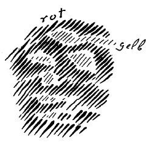
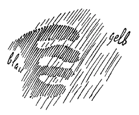
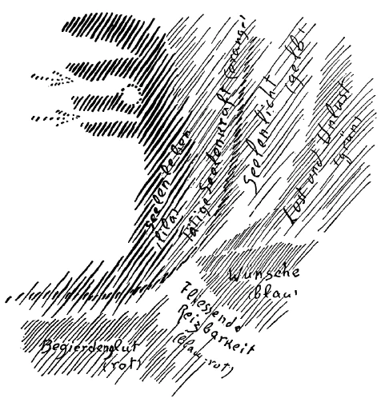
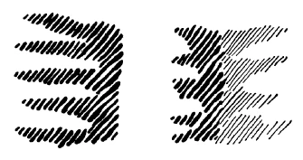
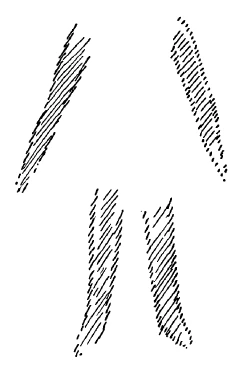
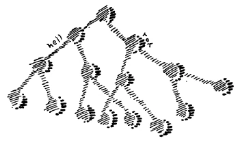

Gewisse Fragen werden dem denkenden Menschen sich doch immer wieder und wiederum aufdrängen, wenn er auch in Zeiten, in denen die materialistische Kultur überwiegt, diesen Fragen mehr oder weniger aus dem Wege gehen möchte. Es sind viele Fragen. Ich möchte heute ein paar aus der großen Reihe der Fragen herausheben, die davon kommen, daß der Mensch doch, selbst wenn er sich sträubt, eine geistige Welt anzuerkennen, den Eindruck dieser geistigen Welt verspürt. Zu solchen Fragen gehört zum Beispiel diese, die ja, man möchte sagen, das Leben alltäglich aufwirft: Gewisse Menschen sterben jung, andere sterben ganz alt, andere dazwischen. Gegenüber dieser Tatsache, daß auf der einen Seite ganz junge Kinder sterben, auf der andern Seite Leute ganz alt werden und dann sterben, erheben sich für den Menschen Fragen, welche mit den Mitteln, die man heute wissenschaftliche Mittel nennt, niemals — bei klarer Besinnung wird das jeder zugeben müssen — werden zu beantworten sein. Und doch sind sie für das Menschenleben brennende Fragen, und jeder kann eigentlich empfinden, daß sich für das Leben Unendliches aufklären müßte dadurch, daß man diesen Fragen nahetreten könnte: Warum sterben Menschen zuweilen früher, im Kindesalter, im Jugendalter, in der Mitte der gewöhnlichen Lebenszeit? Warum sterben andere alt? Was hat das für eine Bedeutung im gesamten Weltenall? ^b04j9q

Sich solche Fragen zu beantworten, dazu hatten die Menschen bis zu jenem Zeitpunkte, den ich Ihnen in diesen Betrachtungen schon angegeben habe, bis zu dem Zeitpunkt der beginnenden vierten nachatlantischen Zeit, so ungefähr bis in die Mitte des 8. vorchristlichen Jahrhunderts, noch Vorstellungen, Begriffe. Aus alter Weisheit herüberbekommen hatten sie Begriffe. Es gab auch in jenen alten Zeiten, die dem 8. vorchristlichen Jahrhundert vorangingen, über die damalige Erdenkultur verbreitet überall Vorstellungen, welche nach dem Sinn der damaligen Zeit den Menschen Aufschluß gaben über solche Fragen wie die eben angedeuteten. Dasjenige, was wir heute Wissenschaft nennen, kann nicht einmal einen rechten Sinn verbinden mit solchen Fragen, kommt gar nicht darauf, daß etwas mit diesen Fragen gegeben ist, wozu man irgendeine Antwort suchen sollte. Das alles rührt davon her, daß in der Zeit, die seit dem eben angedeuteten Zeitpunkte verflossen ist, eigentlich alle Vorstellungen verlorengegangen sind, die sich auf den geistigen und damit auf den ewigen Menschen beziehen. Es sind nur diejenigen Vorstellungen geblieben, die sich auf den vergänglichen Menschen und den zwischen Geburt und Tod eingeschlossenen Menschen beziehen. ^4tz002

Ich habe darauf aufmerksam gemacht, daß in allen alten Weltanschauungen von einer dreifachen Sonne gesprochen wurde, von jener Sonne, die man mit den physischen Sinnen wahrnimmt als eine leuchtende Kugel im Weltenraume draußen. Hinter dieser Sonne aber sahen die alten Weisen die seelische Sonne - im griechischen Sinne gesprochen, den Helios — und erst hinter dieser seelischen Sonne die geistige Sonne, die zum Beispiel noch Plato identifizierte mit dem Guten. Es hat für den heutigen Menschen eigentlich keinen rechten Sinn, von dem Helios, der seelischen Sonne, oder gar von der geistigen Sonne, von dem Guten, zu sprechen. Aber so wie uns hier zwischen Geburt und Tod die physische Sonne leuchtet, so scheint, wenn ich sagen darf, in unser Ich hinein in der Zeit, die wir verbringen zwischen dem Tod und einer neuen Geburt, die geistige Sonne, die eben noch von Plato identifiziert wird mit dem Guten. Für die Zeit zwischen dem Tod und einer neuen Geburt von dieser leuchtenden Kugel zu sprechen, von der unsere heutige materialistische Weltanschauung spricht, hat keinen Sinn; zwischen dem Tod und einer neuen Geburt hat nur Sinn zu sprechen von der geistigen Sonne, von dem, was Plato noch als das Gute bezeichnet. Aber gerade ein solcher Begriff sollte uns auf etwas hinweisen. Er sollte uns darauf hinweisen, nachzudenken, wie es sich eigentlich verhält mit dem, was wir uns als physische Vorstellung von der Welt bilden. Daß wir in dem, was wir uns als physische Vorstellungen von der Welt bilden, in dem, was sinnenfällig vor uns ausgebreitet ist, zu sehen haben eine Art von Täuschung, eine Art von Maja, das wird doch nicht im vollen Sinne des Wortes ernst genommen, wenigstens nicht so ernst, daß die Anschauung des Lebens wirklich mit diesen Dingen durchdrungen würde. ^m7br87

So eine Art Vorstellung von der Sonne hat im Grunde derjenige, der die heutige Physik, Astrophysik meinetwillen, autoritativ nimmt: Wenn er da hinauflahren könnte, wohin die Physiker die Sonne versetzen, so würde er, indem er sich der Sonne nähert — nun, sehen wir jetzt von menschlichen Lebensbedingungen ab, setzen wir voraus, daß die Lebensbedingungen absolut sein könnten -, gewaltige Hitze verspüren, so stellt er es sich vor, und er würde da, wenn er innerhalb des Raumes ankommt, den sich der Physiker von der Sonne ausgefüllt denkt, innerhalb dieses Raumes glühendes Gas oder dergleichen finden. So stellt sich der Physiker ja das eigentlich vor: einen glühenden Gasball oder so etwas. Aber so ist es nicht, das ist eine richtige Maja, eine richtige Täuschung. Und diese Vorstellung hält vor den wahren physikalischen Anschauungen, die man gewinnen kann, auch nicht stand, geschweige denn vor der wirklichen übersinnlichen Anschauung. Wenn man sich nämlich wirklich der Sonne nähern könnte und dahin kommen würde, wo die Sonne ist — ja, indem man sich nähert, da findet man schon so etwas, wie wenn man durch flutendes Licht durchgehen müßte (es wird gezeichnet: gelber Kreis, innen blauer Kern); aber wenn man da hineinkommt, wo die Physiker die physische Sonne vermuten, findet man zunächst das, was man ansprechen könnte als leeren Raum. Da ist überhaupt nichts; es ist gar nichts da, wo man die physische Sonne vermutet. Ich zeichne es schematisch (blau), weil eigentlich nichts dort ist. Da ist nichts, da ist leerer Raum. Aber ein sonderbarer leerer Raum ist das! Wenn ich sage: Es ist nichts da -, so rede ich eigentlich nicht ganz richtig; es ist weniger als nichts da. Es ist nicht nur ein leerer Raum da, sondern es ist weniger als nichts da. Und das ist es, was als eine Vorstellung für abendländische Menschen heute außerordentlich schwer zu bilden ist. Der Morgenländer hat diese Vorstellung auch heute noch ohne weiteres; für den ist es gar nichts Wunderbares oder Schwerverständliches, wenn man ihm davon spricht, daß da weniger als nichts ist. Der Abendländer denkt sich, und er denkt sich das insbesondere, wenn er ein waschechter Kantianer ist, denn viel mehr Leute, als man heute denkt, sind Kantianer, sind unbewußte Kantianer: Wenn nichts im Raum ist, so ist es eben leeret Raum! — Aber das ist nicht der Fall; es kann auch ausgeschöpfter Raum sein. Wenn Sie nämlich da durch diese Sonnenkorona durchsehen würden, so würden Sie diesen leeren Raum, in den Sie da eintreten würden, höchst unbehaglich empfinden: er zerreißt Sie nämlich. Und darin zeigt er seine Wesenheit, daß er mehr ist - oder weniger ist, wie ich besser sagen kann - als ein leerer Raum. Sie brauchen ja nur die einfachsten mathematischen Begriffe zu Hilfe zu nehmen, so wird Ihnen nicht ganz unklar bleiben können, was ich da meine: leerer Raum ist weniger noch als bloß leer. Nehmen wir an, Sie besitzen irgend etwas an Vermögen. Aber es kann auch vorkommen, daß Sie alles, was Sie besitzen, ausgegeben haben, daß Sie nichts haben. Aber man kann weniger als nichts haben: man kann Schulden haben, dann hat man wirklich weniger als nichts. Man kann, wenn man von der Raumerfüllung zu immer dünnerer und dünnerer Raumerfüllung übergeht, bis zum leeren Raum kommen; man kann aber dann hinter die bloße Leerheit noch hinübergehen, wie man von dem Nichts zu den Schulden gehen kann. ^l1ku9x

Das ist der größte Fehler der heutigen Weltanschauung, daß sie diese eigentümliche Art von negativer Stofflichkeit -— wenn ich mich so ausdrücken darf — nicht kennt, daß sie nur die Leerheit kennt und die Erfüllung, und nicht dasjenige, was weniger ist als die Leerheit. Denn dadurch, daß das heutige Wissen, die heutige Weltanschauung das, was weniger ist als die Leerheit, nicht kennt, dadurch wird diese heutige Weltanschauung mehr oder weniger im Materialismus festgehalten, richtig im Materialismus festgehalten, ich möchte sagen: gebannt in den Materialismus. Denn es gibt auch im Menschen, wenn ich mich so ausdrücken darf, einen Ort, welcher leerer ist als leer; nicht in seiner Gänze, aber welcher eingelagert hat Teile, die leerer sind als leer. Im ganzen ist ja der Mensch - ich meine der physische Mensch ein Wesen, welches einen Raum materiell ausfüllt; aber ein gewisses Glied der menschlichen Natur, von den dreien, die ich angeführt habe, hat tatsächlich etwas in sich, was sonnenähnlich ist, leerer ist als leer. Das ist - ja, Sie müssen es schon hinnehmen - der Kopf. Und gerade darauf, daß der Mensch so organisiert ist, daß sein Kopf sich immer entleeren kann und in gewissen Gliedern leerer sein kann als leer, dadurch hat dieser Kopf die Möglichkeit, das Geistige sich einzulagern. Stellen Sie sich einmal die Sache vor, wie sie eigentlich ist. Natürlich muß man die Dinge sich schematisch vorstellen; aber denken Sie sich, alles dasjenige, was materiell Ihren Kopf ausfüllt, würde ich schematisch durch das Folgende zeichnen. Das wäre schematisch Ihr Kopf (siehe Zeichnung, rot). Nun aber muß ich, wenn ich ihn vollständig zeichnen will, in diesem Kopf leere Stellen lassen. Das ist natürlich jetzt nicht so groß, aber drinnen sind leere Stellen. In diese leeren Stellen kann dasjenige hinein, was ich Ihnen den jungen Geist genannt habe in diesen Tagen. In die leeren Stellen hinein muß der junge Geist, gewissermaßen in seinen Strahlen, gezeichnet werden (gelb). ^1b69e6

 ^zxdd6g

Ja, die Materialisten sagen: Das Gehirn ist das Werkzeug des Seelenlebens, des Denkens. - Das Umgekehrte ist wahr: Die Löcher im Gehirn, ja sogar dasjenige, was mehr ist als Löcher, oder ich könnte auch sagen, weniger ist als Löcher, was leerer ist als leer, das ist das Werkzeug des Seelenlebens. Und da, wo das Seelenleben nicht ist, wo das Seelenleben fortwährend aufstößt, wo der Raum unseres Schädels mit Gehirnmasse ausgefüllt ist, da wird nichts gedacht, da wird nichts seelisch erlebt. Wir brauchen unser physisches Gehirn nicht zum Seelenleben, sondern wir brauchen es nur, damit wir das Seelenleben einfangen, physisch einfangen. Wenn da nicht das Seelenleben, das in den Löchern des Gehirnes eigentlich lebt, überall aufstoßen würde, so ^5jd2g5

vol würde es verfliegen; es käme uns nicht zum Bewußtsein. Aber es lebt in den Löchern des Gehirns, die leerer sind als leer. ^icbl09

So müssen wir uns die Begriffe allmählich korrigieren. Wir nehmen, wenn wir vor dem Spiegel stehen, nicht uns wahr, sondern unser Spiegelbild. Uns können wir vergessen. Wir sehen uns im Spiegel drinnen. So erlebt der Mensch auch nicht sich, indem er durch sein Gehirn dasjenige zusammenhält, was in den Löchern des Gehirnes liegt; er erlebt, wie sich überall sein Seelenleben spiegelt, indem es an die Gehirnmasse anstößt. Es spiegelt sich überall; das erlebt der Mensch. Er erlebt eigentlich sein Spiegelbild. Das aber, was da in die Löcher hereingeschlüpft ist, das ist dasjenige, was dann, wenn der Mensch durch die Pforte des Todes geht, ohne die Widerlage des Gehirnes seiner selbst bewußt wird, weil es dann in entgegengesetzter Weise mit Bewußtsein durchsetzt wird. ^65fa1n

Nun will ich ein anderes Schema aufzeichnen. Nehmen Sie das Folgende. Bitte, ich will jetzt das Gehirn recht drastisch zeichnen, wie das Löcher läßt (blau). Da sei die Gehirnmasse, da lasse es die Löcher, und dahinein in diese Löcher geht das Seelenleben (gelb). Dieses Seelenleben, das setzt sich aber vor den Löchern fort. Da kommen wir in die ja natürlich nur in der Nähe des Menschen sichtbare, aber ins Unbestimmte auslaufende Menschenaura hinein. ^b3tawh

 ^dk08ye

Denken wir uns jetzt das Gehirn weg, und denken wir uns, wir sehen beim gewöhnlichen Menschen zwischen Geburt und Tod das Seelenleben an, dann würden wir sagen müssen: Der wahre Mensch, in dieser Weise gesehen, der ist in seinem Zustande zwischen Geburt und Tod so, daß er eigentlich - da muß ich allerdings das jetzt anders schematisch zeichnen - sein Antlitz seinem Körper so zuwendet (siehe Zeichnung Seite 105, lila); sein Seelenleben wendet er dem Körperlichen zu. Und wenn wir auf das Gehirn sehen, so streckt dieses Seelenleben hier Fühlhörner vor, die in die Löcher des Gehirns hineingehen. Was ich dort (siehe Zeichnung Seite 102) gelb gezeichnet habe, zeichne ich hier lila, weil das besser dem Anblick im lebenden Menschen entspricht. Das wäre das, was sich ins Gehirn erstreckt beim lebenden Menschen. ^r0zafq

Wollte ich jetzt danach etwa den physischen Menschen zeichnen, so würde ich das am besten dadurch andeuten können, daß ich Ihnen etwa hier die Grenze, die mit dem Erinnerungsvermögen gegeben ist, hereinzeichne. Sie würde da nach außen gehen, und da würde die äußere Grenze, die Grenze des Erkennens sein, von der ich Ihnen ja auch gesprochen habe. Da brauchen Sie sich ja nur an die letzthin und gestern gemachte Zeichnung zu erinnern. ^s9jde7

Jetzt aber ist es wirklich so, daß, wenn man von außen den Menschen geistig anschaut, sich das Seelenleben so in den Menschen hinein erstreckt. Ich will also das einzelne Hineinerstrecken nur in bezug auf das Gehirn zeichnen. Aber dieses Seelenleben ist in sich auch differenziert: so würde ich, wenn ich dieses Seelenleben weiter verfolgen würde, hier eine andere Region zeichnen müssen (rot unter dem Lila), hier eine andere Region (blau); das würde also alles zu der den Menschen konstituierenden Aura gehören. Dann eine andere Region (grün): Sie sehen, dieser Teil, den ich da jetzt schematisch zeichne, liegt jenseits der Grenze des menschlichen Erkennens. Dann diese Region (gelb) - im Grunde genommen gehört das alles zum Menschen - und diese Region (orange). ^mljwdn

Das bewegt sich, wenn der Mensch einschläft, mehr oder weniger aus dem Körper heraus, so wie das gestern gezeichnet worden ist (Zeichnung Seite 77); wenn der Mensch wachend ist, mehr oder weniger in den Körper hinein, so daß eigentlich die Aura nur in der unmittelbarsten Umgebung des Körpers seelisch wahrzunehmen ist. Wenn man den physischen Menschen beschreibt, dann tut man es so, daß man sagt: Dieser physische Mensch besteht aus Lunge, Herz, Leber, Galle und so weiter. Das sagt der physische Anatom, der Physiologe und so weiter. Geradeso können Sie aber den geistig-seelischen Menschen beschreiben, der in dieser Weise sich eigentlich in die Löcher des Menschen hereinerstreckt, in das, was mehr ist als Leere, in den Menschen hineinerstreckt. Sie können das ebenso beschreiben. Da müssen Sie dann nur angeben, aus was dieser geistig-seelische Mensch besteht. Und ebenso wie man beim physischen Menschen Organe unterscheidet, so kann man hier Strömungen unterscheiden. Man kann sagen: Hier, wo ich das Rot gezeichnet habe, würde der physische Mensch so im Profil drinnenstehen, hierher das Gesicht gerichtet haben, hier etwa die Augen (siehe Zeichnung); hier würde sein die Region der Begierdenglut (rot). Das würde ein Bestandteil des seelisch-geistigen Menschen sein, der seiner Substanz nach entnommen ist der Region, die Sie aus der «Theosophie» kennen als die Region der Begierdenglut. Also Begierdenglut, gewissermaßen etwas von ihr entnommen, in den Menschen hineinversetzt, gibt diese Partie des Menschen. Das, was ich hier lila gezeichnet habe, das würde ich bezeichnen müssen, wenn ich die Einzelheiten beschriebe, mit Seelenleben. Sie wissen, eine bestimmte Partie des Seelengebietes, des Seelenlandes, ist mit «Seelenleben» bezeichnet. Die Substanz daraus würde dieses Violette, dieses Lila sein, was im Menschen einen Teil des GeistigSeelischen bildet. ^0vd8dl

Das, was ich hier als orange bezeichnet habe, würden wir zu nennen haben, wenn wir diese Benennung beibehielten, tätige Seelenkraft. So daß Sie sich vorzustellen hätten: Dasjenige, was am intensivsten durch Ihre Sinne in Sie hineingeht beim Leben zwischen Geburt und Tod, das ist das Seelenleben; und dahinter, sich auch hinstopfend, aber nicht so hineinkönnend, aufgehalten werdend durch das Seelenleben: tätige Seelenkraft. Und noch mehr dahinter dasjenige, was man nennen kann: Seelenlicht. Ich habe es hier gelb bezeichnet. Ziemlich anschließend an dieses Seelenlicht, sich so durchdrückend, würde dann das sein, was der Region von Lust und Unlust entnommen ist. Das würde ich hier etwa dem grünen Gebiete zuzuschreiben haben (siehe Zeichnung). Dann würde dem schon bläulich werdenden Gebiete zuzuschreiben sein: Wünsche. Und anstoßend nun hier an das Blaue, schon wiederum mehr in das Blaurote hineingehend, das würde die Region fließender Reizbarkeit sein. Das, was ich hier nenne Begierdenglut, fließende Reizbarkeit, Wünsche, das sind aurische Strömungen. Diese aurischen Strömungen konstituieren, wie Sie wissen, die Seelenwelt; sie konstituieren aber auch den seelisch-geistigen Menschen, der etwa so aufgebaut ist aus den Ingredienzien dieser Seelenwelt. ^7ob1da

 ^u0gl9l

Wenn dann der Tod eintritt, dann ist das so, daß der physische Leib abfällt und der Mensch das fortnimmt, was sich durch seine Löcher in ihn hineinerstreckt hat. Er nimmt es nun fort. Dadurch, daß er es fortnimmt — wir können uns diesen physischen Menschen wegdenken -, kommt nun der Mensch in eine gewisse Verwandtschaft mit der Seelenwelt, und dann auch mit dem Geisterland, wie Sie es ja in der «Theosophie» dargestellt finden. Er hat eine gewisse Verwandtschaft dadurch, daß er diese Ingredienzen in sich hat. Aber während des physischen Lebens sind sie gebunden an den physischen Leib; dann werden sie frei. Dadurch aber, daß sie frei werden, verwandelt sich nach und nach das Ganze. Während es so war, daß sich - wenn ich jetzt die Differenzierungen weglasse und das Seelenleben so zeichne während des physischen Lebens die Fühler (dunkel schraffiert) in unsere Löcher hineinerstrecken, nehmen sich nach dem Tode diese Fühler zurück. Dadurch aber, daß sich die Fühler zurücknehmen, höhlt sich das Seelenleben selbst aus, und im Seelenleben drinnen geht das geistige Leben auf; von der andern Seite geht das geistige Leben auf (hell schraffiert). ^l6pkb1

 ^4ix73i

In dem selben Maße, in welchem der Mensch aufhört unterzutauchen in den physischen Leib, hellt sich auf sein Geistig-Seelisches, diese seine Aura von der andern Seite durchleuchtend. Und wie derMensch ein Bewußtsein erlangen kann dadurch, daß beim Hineinstoßen des Seelisch-Geistigen in den physischen Körper dieses immer anstößt und dadurch sich immer spiegelt, so bekommt der Mensch jetzt dadurch ein Bewußtsein, daß er sich zurückzieht gegen das Licht. Aber dies ist jenes Licht der Sonne, welches das erste Licht ist: das Gute. Während der Mensch also während seines physischen Lebens als geistig-seelisches Wesen gegen das Sonnenverwandte, nämlich gegen die überleeren Löcher im Gehirn stößt, stößt er, sich zurückziehend nach dem Tode, nach der andern Sonne, nach der guten Sonne, nach der ersten Sonne. ^8qibni

Sie sehen, wie zusammenhängt mit den Grundvorstellungen der uralten Mysterien die Möglichkeit, Begriffe zu erhalten von dem Leben zwischen dem Tod und einer neuen Geburt. Denn so stecken wir drinnen in diesem ganzen kosmischen Leben, wie ich es Ihnen jetzt in diesen Tagen dargestellt habe. Aber allerdings muß man, um richtige Begriffe von diesen Dingen zu bekommen, tiefer in das eigentliche Gefüge der menschlichen Evolution durch die Erdenzeit hindurch eingehen. Nicht wahr, es wäre ja möglich, daß jemand durch besonderen Glücksfall, wie man das so nennen könnte, hellsichtig das Ganze, was ich jetzt dargestellt habe, schaute. Aber der Glücksfall könnte nicht weiter gehen, als daß er sich verwandelnde Gebilde schaut. Etwa so: Nehmen wir an, ein Mensch würde durch irgendein Wunder - es geschieht schon nicht durch ein Wunder -, durch irgend etwas hellsichtig, übersinnlich schauend, so würde er schon, so ähnlich, wie ich es hier versucht habe aufzuzeichnen, das geistig-seelische Leben des Menschen sehen. Daß dies etwas anders ausschaut, als was ich vor einiger Zeit als Normalaura aufgezeichnet habe, das werden Sie begreiflich finden, wenn Sie verstehen, daß ich vor einigen Tagen das aufgezeichnet habe (siehe Seite 31), was sich als Aura ergibt, wenn man den ganzen Menschen sieht, also den physischen Menschen und die Aura ringsherum; jetzt habe ich aber herausgeholt den geistigseelischen Menschen, so daß der geistig-seelische Mensch von dem physischen Menschen abstrahiert wird. ^tmkfao

Daran sehen Sie schon, daß man einmal so, das andere Mal anders die Farben setzen muß; daran sehen Sie auch, daß für das übersinnliche Bewußtsein die Dinge sehr verschieden ausschauen. Nehmen Sie sich vor, die Aura des Menschen einfach so zu sehen, wie sie ist, indem der Mensch den physischen Leib hat, dann sehen Sie diese Aura - also wenn Sie sich vornehmen, abgesehen vom geistig-seelischen Menschen jetzt den Menschen zu sehen, der nur seine Organe vorstreckt in den physischen Menschen hinein. Aber wenn Sie nun den Menschen in der Zeit zwischen dem Tod und einer neuen Geburt sehen, da sehen Sie wiederum, wie sich das Ganze verwandelt. Da geht also vor allen Dingen diese Region, die ich hier rot gezeichnet habe, weg von hier, geht hier herauf, das Gelbe geht hier herunter, das Ganze kommt nach und nach durcheinander. Man kann solche Dinge anschauen, aber das Anschauen hat etwas Verwirrendes. Und daher werden sich auch für den neueren Menschen nicht leicht Möglichkeiten finden, Sinn und Bedeutung in. dieses Verwirrende hineinzubringen, wenn er nicht zu andern Hilfsmitteln seine Zuflucht nimmt. ^oiynui

Wir haben hingewiesen darauf, daß das Haupt des Menschen, der Kopf, auf die Vergangenheit weist, der Extremitätenmensch auf die Zukunft weist. Es ist ein vollständiger Gegensatz, polarisch; beides, das Haupt des Menschen und der Extremitätenmensch - erinnern Sie sich nur an dasjenige, was ich gestern auseinandergesetzt habe -, beide sind eigentlich ein und dasselbe; nur daß das Haupt eben eine sehr alte Bildung ist, eine Überbildung. Daher hat es auch die Löcher. Der Extremitätenmensch hat diese Löcher noch nicht; der ist eben noch ganz von Materie ausgefüllt. Löcher kriegen, das ist ein Zeichen von Überentwickelung. Rückgängige Entwickelung im Haupte sehen können, darauf kommt viel an. Und viel kommt darauf an, daß man verstehen kann: der Extremitätenmensch ist eine junge Metamorphose, das Haupt ist eine alte Metamorphose. Und weil der Extremitätenmensch eine junge Metamorphose ist, kann er noch nicht hier im physischen Leben denken, sondern es bleibt sein Bewußtsein unbewußt. Er öffnet nicht dem geistig-seelischen Menschen solche Löcher wie das Gehirn. ^gkibis

Das ist von unendlicher Wichtigkeit und wird in Zukunft immer wichtiger und wichtiger werden für die Geisteskultur: einzusehen so etwas, daß zwei Dinge, die äußerlich physisch ganz voneinander verschieden sind wie der Kopfmensch und der Extremitätenmensch, geistig-seelisch ein und dasselbe sind, nur der Zeit nach auf verschiedenen Entwickelungsstufen. Viele Geheimnisse liegen gerade in dieser Tatsache, daß zwei physisch verschiedene Dinge dadurch, daß sie auf zeitlich verschiedenen Entwickelungsstufen stehen, eigentlich ein und dasselbe sein können. Sie sind äußerlich physisch etwas ganz Verschiedenes, aber Verwandlungszustände, also Metamorphosen eines und desselben. ^0te3q0

In elementarer Weise hat den Anfang mit Begriffen, durch die man so etwas erfassen kann, eben Goethe gemacht mit seiner Metamorphosenlehre. Während sonst eigentlich in der Ausbildung der Begriffe ein Stillstand ist seit alten Zeiten, setzt bei Goethe wiederum die Fähigkeit ein, Begriffe zu bilden. Und diese Begriffe sind die lebendigen Metamorphosenbegriffe. Goethe hat allerdings angefangen mit dem Einfachsten. Er hat gesagt: Wenn wir eine Pflanze anschauen, so haben wir das grüne Pflanzenblatt, aber das verwandelt sich dann in das farbige Blumenblatt. Beides ist ein und dasselbe, es sind nur Metamorphosen voneinander. -— So wie das grüne Pflanzenblatt und das rote Rosenblatt verschiedene Metamorphosen sind, ein und dasselbe auf verschiedenen Stufen, so sind das Haupt des Menschen und der Extremitätenorganismus einfach Metamorphosen voneinander. Wenn wir den Goetheschen Metamorphosengedanken für die Pflanze nehmen, haben wir etwas Primitives, Einfaches; aber es kann dieser Gedanke fruchtbar gemacht werden für ein Höchstes: für das Beschreiben des Überganges des Menschen von einer Inkarnation in die andere. Wir sehen eine Pflanze mit grünem Blatt und mit der Blüte und sagen: Die Blüte, die rote Rosenblüte ist umgewandelt aus dem grünen Pflanzenblatt. Wir sehen einen Menschen vor uns stehen und sagen: Das Haupt, das du trägst, das sind deine umgewandelten Arme, Hände, Beine, Füße aus der vorhergehenden Inkarnation; und das, was du jetzt an dir, wie Arme, Hände, Beine, Füße trägst, das wird sich umwandeln für die nächste Inkarnation in deinen Kopf. ^hz10e6

Aber jetzt kommt ein Einwand, der Ihnen offenbar in der Seele schwer sitzt. Jetzt werden Sie sagen: Ja, um Gottes willen, aber ich lasse doch meine Beine und meine Füße zurück, und meine Arme und meine Hände auch; die nehme ich doch nicht mit in die nächste Inkarnation! Wie soll denn da mein Kopf daraus werden? - Nicht wahr, das kann man einwenden. Wiederum stehen Ste eben hier vor einer Maja. Es ist nämlich nicht wahr, daß Sie wirklich Ihre Beine und Ihre Füße, Ihre Hände und Ihre Arme zurücklassen. Das ist nämlich nicht wahr; das sagen Sie deshalb, weil Sie an der Maja, an der großen Täuschung hängenbleiben. Was Sie nämlich mit dem gewöhnlichen Bewußtsein Ihre Arme und Hände, Ihre Beine und Füße nennen, das sind nicht Ihre Arme und Hände und Ihre Beine und Füße, sondern das ist dasjenige, was als Blut und andere Säfte Ihre Arme und Hände und Ihre Beine und Füße ausfüllt. Es ist hier wieder eine schwierige Vorstellung, aber es ist so. - Nehmen Sie an, hier haben Sie Arme und Hände, Beine und Füße; aber das, was hier ist, ist geistig, das sind geistige Kräfte. Bitte, stellen Sie sich vor: ^s6rmgz

 ^gu3gdp

Ihre Arme und Hände, Ihre Beine und Füße seien Kräfte, übersinnliche Kräfte. Würden Sie nur sie haben, Sie würden sie nicht mit den Augen sehen. Sie sind angefüllt, diese Kräfte sind angefüllt mit den Säften, mit dem Blute, und das, was als mineralische Masse, flüssig oder zum Teil fest, zum geringsten Teile fest, Unsichtbares ausfüllt, das sehen Sie (schraffiert). Was Sie im Grabe lassen, was verbrannt wird, das sind nur, ich möchte sagen, die mineralischen Einschlüsse. Ihre Arme und Hände, Ihre Beine und Füße sind nicht sichtbare Füße und so weiter, sie sind Kräfte, und diese nehmen Sie mit. Die Formen nehmen Sie mit. Sie sagen: Ich habe Hände und Füße. - Derjenige, der in die geistigen Welten hineinsieht, der sagt nicht: Ich habe Hände und Füße -, sondern er sagt: Es gibt Geister der Form, Elohim, die denken kosmisch, und deren Gedanken sind meine Arme und Hände und Beine und Füße; und deren Gedanken sind mit Blut und andern Säften ausgefüllt. - Aber Blut und andere Säfte sind auch wiederum nicht das, als was sie im Physischen erscheinen; diese Stofle sind wiederum die Vorstellungen der Geister der Weisheit, und dasjenige, was der Physiker Stoff nennt, das ist nur der äußere Schein. Wo der Physiker den Stoff hinsetzt, müßte er sagen: Da stoße ich auf einen Gedanken der Geister der Weisheit, der Kyriotetes. Und wo Sie Arme und Hände, Beine und Füße sehen, da können Sie nicht einmal darauf stoßen, da müssen Sie sagen: Hier bilden die kosmischen Gedanken der Geister der Form meine Formen. — Kurz, so sonderbar das klingt: Ihren Körper gibt es ja gar nicht, sondern da, wo im Raume Ihr Körper ist, da leben durcheinander die kosmischen Gedanken der höheren Hierarchien. Und würden Sie nicht der Maja gemäß, sondern richtig sehen, so würden Sie sagen: Hier erstrecken sich herein die kosmischen Gedanken der Exusiai, der Geister der Form, der Elohim. Diese kosmischen Gedanken machen sich mir sichtbar, indem sie ausgefüllt sind mit den kosmischen Gedanken der Geister der Weisheit. Das gibt Arme und Hände, Beine und Füße. Gar nicht steht das da, als was es in der Maja erscheint, vor dem geistigen Blicke, sondern da stehen die kosmischen Gedanken, und diese kosmischen Gedanken ballen sich zusammen, kondensieren sich, schieben sich ineinander, und daher erscheinen sie uns als diese Schattenfigur, als die wir herumgehen, von der wir glauben, daß sie wirklich ist. Also den physischen Menschen, den gibt es gar nicht. ^fdsv60

Wir können mit einem gewissen Recht sagen: In der Stunde des Todes scheiden die Geister der Form ihre kosmischen Gedanken von den kosmischen Gedanken der Geister der Weisheit. Die Geister der Form nehmen ihre Gedanken in die Luft hinauf, die Geister der Weisheit senken ihre stofflichen Gedanken in die Erde hinein. Dadurch ist im Leichnam so ein Nachschatten von den Gedanken der Geister der Weisheit noch vorhanden, wenn die Geister der Form ihre Gedanken zurückgenommen haben in die Luft. Das ist der physische Tod; das ist er in Wahrheit. ^fyk0n1

Kurz, wenn wir anfangen, über Wirklichkeiten zu denken, so kommen wir zu einer Auflösung desjenigen, was gewöhnlich die physische Welt genannt wird. Denn diese physische Welt besteht dadurch, daß die Geister der höheren Hierarchien ihre Gedanken ineinanderschieben, und deshalb - bitte stellen Sie sich vor: fein verteilte Wasserpartien gehen irgendwo hinein und bilden einen dichten Nebel - erscheint Ihr Leib auch so als ein Schattengebilde, weil die Gedanken der Geister der Form hineindringen in die Gedanken der Geister der Weisheit, die Formgedanken in die Stoffgedanken hineingehen. Die ganze Welt löst sich vor dieser Anschauung in Geistiges auf. Aber man muß die Möglichkeit haben, die Welt wirklich geistig vorzustellen, zu wissen: Das ist nur etwas ganz Scheinbares, daß meine Arme und Hände, meine Füße und Beine der Erde übergeben werden. In Wirklichkeit beginnt da die Metamorphose meiner Arme und Beine, Hände und Füße und vollendet sich in dem Leben zwischen dem Tod und einer neuen Geburt, und meine Arme und Beine, Hände und Füße werden mein Kopf in der nächsten Inkarnation. ^k99eic

Ich habe Ihnen mancherlei jetzt gesprochen, was Sie wenigstens in der Form vielleicht etwas sonderbar berührt hat. Aber was ist denn das schließlich, was wir da besprochen haben, anderes, als daß wir vom scheinbaren Menschen aufsteigen zum wahren Menschen, von dem, was äußerlich in der Maja lebt, aufsteigen zu der Stufenfolge der Hierarchien? Nur wenn man das tut, kann man in einer reifen Form heute davon sprechen, daß der Mensch in sich wissen darf ein sogenanntes höheres Selbst. Wenn man bloß deklamiert von dem höheren Selbst, wenn man bloß sagt: Ich fühle in mir ein höheres Selbst - da ist dieses höhere Selbst ein reines leeres Abstraktum, da hat es keinen Inhalt; denn das gewöhnliche Selbst gehört der Maja an, ist also selbst Maja. Das höhere Selbst hat nur einen Sinn, wenn man von ihm spricht gegenüber der Welt der höheren Hierarchien. Vom höheren Selbst zu sprechen, ohne auf die Welt Rücksicht zu nehmen, die da besteht aus den Geistern der Form und den Engeln, Erzengeln und so weiter, vom höheren Selbst zu sprechen, ohne auf diese Welt Rücksicht zu nehmen, bedeutet: man spricht von leeren Abstraktionen, bedeutet zugleich: man spricht nicht von demjenigen, was da lebt im Menschen zwischen dem Tod und einer neuen Geburt. Denn so wie wir hier mit Tieren, Pflanzen und Mineralien leben, so leben wir zwischen dem Tod und einer neuen Geburt mit den Reichen der höheren Hierarchien, von denen wir oftmals gesprochen haben. Nur wenn man sich nach und nach diesen Vorstellungen und Begriffen nähert, dann — wir werden davon erst vielleicht in acht Tagen sprechen -, dann kommt man zu einer Annäherung an so etwas, was Antwort geben kann auf die Frage: Warum sterben manche Menschen als junge Kinder, warum manche im höchsten Alter, andere dazwischen ? ^q0hj0f

Was ich Ihnen jetzt skizzenhaft dargestellt habe, sind konkrete Begriffe für die Wirklichkeiten der Welt. Es sind ja wahrhaftig nicht abstrakte Begriffe, die ich Ihnen dargestellt habe, es sind konkrete Begriffe für die Wirklichkeiten der Welt. Diese konkreten Begriffe, sie gab es, allerdings für ein mehr atavistisches Anschauen, in den alten Mysterien. Sie sind für das menschliche Anschauen verlorengegangen von dem 8. vorchristlichen Jahrhundert an; sie müssen durch eine Vertiefung in der Auffassung des Christus-Wesens wiederum gewonnen werden. Das kann nur auf geisteswissenschaftlichem Wege geschehen. ^f202mg

Verschaffen wir uns von einem gewissen Gesichtspunkte aus noch einmal eine Art Vorstellung von der Menschheitsevolution. Wir wollen jetzt sehr, sehr wichtige Begriffe ins Auge fassen. Da kann man sagen: Wenn man zurückgeht in der Menschheitsentwickelung, da kommt man - ich habe ja das öfter dargestellt — darauf, daß in alten Zeiten die Menschen mehr Gruppenseelen hatten und sich dann erst die individuellen Seelen hineingliederten in das Gruppenseelentum. Sie können das in verschiedenen Zyklen lesen. Dann könnte man schematisch die Entwickelung der Menschheit so darstellen, daß man sagt: In alten Zeiten gab es Gruppenseelen; jede dieser Gruppenseelen spaltete sich wiederum —- das würde für eine bloße seelische Anschauung sein, für eine geistige wäre es etwas anders -, aber jede solche Seele umkleidet sich mit einem Leibe, den ich hier in der Form mit einem roten Strich andeute (siehe Zeichnung Seite 114). ^8mv2im

Diese Zeichnung oder etwas ähnliches wie diese Zeichnung hat man noch bis in die Pythagoräische Schule hinein immer gemacht, indem man gesagt hat: Seht ihr die Leiber an, den Leibern nach sind die Menschen getrennt, jeder für sich ein Leib — daher sind die roten Striche hier isoliert —, den Seelen nach findet man aber eine Einheit der Menschheit, indem man hinaufgeht bis zur Gruppenseele, die allerdings weit zurückliegt. - Man hat eine Einheit. Wenn Sie sich das Rote wegdenken, so bildet das heller Schraffierte eine einheitliche Figur. ^vnnvod

 ^1u9000

Aber es hat nur einen Sinn, über diese Figur zu sprechen, wenn man zuerst von dem Geistigen so gesprochen hat, wie wir es heute getan haben; denn dann weiß man, was in diesen Seelen alles mitwirkt, wie die höheren Hierarchien mitwirken an diesem Seelischen. Es hat keinen Sinn, von dieser Figur zu sprechen, wenn man nicht im Hinblick auf die Hierarchien spricht. So hat man auch gesprochen bis in die Pythagoräische Schule herein, und aus den Pythagoräischen Schulen hat wiederum Apollonius dasjenige gelernt, wovon ich gestern gesprochen habe, von dem ich in der nächsten Woche weiter sprechen werde. Dann aber, seit dem 8. vorchristlichen Jahrhundert - schon die Pythagoräischen Schulen waren Nachzügler -, hat sich die Möglichkeit, so zu sprechen, verloren. Und allmählich sind die Begriffe, die konkret sind, die wirklich sind, wenn sie sich auf die höheren Hierarchien beziehen, den Leuten konfus geworden, verschwommen geworden. Und so ist ihnen statt der Welt der Engel, Erzengel, Urkräfte, Formen, Bewegungen, Weisheiten, Throne, statt all diesem konkreten Geistweben ist ihnen ein Begriff gekommen, der nun schon in der griechischen Anschauung eine gewisse Rolle spielt: der Begriff des Pneuma, in dem alles durcheinander schwimmt. Pneuma, allgemeiner Geist — dieser verschwommene Begriff, den noch heute die Pantheisten lieben: Geist, Geist, Geist, Geist! Ich habe öfter davon gesprochen, daß die Pantheisten überall den Geist hinsetzen. Aber das geht schon im griechischen Leben auf. Da hat man wieder diese Figur gezeichnet; aber Sie sehen: Was früher konkret war — die Fülle der Gottheiten -, ist zum abstrakten Begriff geworden, ist zum Pneuma geworden. Das Weiße ist das Pneuma, das Rote ist die physische Materie (siehe Zeichnung Seite 114), wenn man die Menschenevolution in Betracht zieht. Aber von diesem Pneuma, von dem haben die Griechen wenigstens noch eine Anschauung gehabt, denn sie haben immerhin noch etwas Aurisches gesehen; so daß also das, was sie sich da in dem weißen Gezweige vorstellten, für sie noch etwas Aurisches, also etwas wirklich Anschauliches war. Das ist die große Bedeutung des Überganges vom Griechentum ins Römertum, daß die Griechen in ihrer Anschauung noch das Pneuma als wirkliches Geistiges erlebt haben, die Römer nicht mehr. Bei den Römern ist es schon ganz abstrakt geworden, vollständige Abstraktion geworden, bloße Begriffe. Die Römer sind das Volk der abstrakten Begriffe. ^omjk60

Meine lieben Freunde, in der neueren Zeit finden Sie in der Naturwissenschaft wiederum dasselbe Schema! Sie können es heute in materialistischen naturwissenschaftlichen Büchern aufschlagen: da finden Sie ganz genau dieses Schema, das Sie in den alten Mysterien aufgezeichnet gefunden haben, in den Pythagoräischen Schulen, wo alles noch auf die Hierarchien bezüglich war. Sie haben es bei den Griechen, wo es auf das Pneuma bezüglich war; Sie finden es heute wieder gezeichnet. Wir werden sehen, was es heute ist. Heute sagt der Naturforscher, indem er diese selbe Zeichnung seinen Schülern auf die Tafel zeichnet: Indem das Menschengeschlecht sich fortpflanzt, geht die Keimsubstanz der Eltern über auf die Kinder; ein Teil der Keimsubstanz bleibt aber so erhalten, daß er in der nächsten Generation wiederum auf die Kinder übergehen kann, und von dem bleibt wiederum ein Teil so, daß er wieder auf die Kinder übergehen kann, während ein anderer Teil der Keimsubstanz die Zellen des physischen Leibes bildet. — Sie haben ganz dasselbe Schema, nur sieht der heutige Naturforscher in dem Weißen (siehe Zeichnung) die Kontinuität der Keimsubstanz. Er sagt: Wenn wir zu den alten Menschenvorfahren hinaufgehen und ihre Keimsubstanz nehmen, die männliche und die weibliche Keimsubstanz nehmen, und gehen zu den jetzigen Menschen herunter und nehmen ihre jetzige Keimsubstanz, so ist das ein einziger Strom; die Keimsubstanz ist kontinuierlich. Es bleibt immer in der Keimsubstanz etwas ewig - so stellt es sich der Naturforscher vor - und nur gewissermaßen die Hälfte des Keimplasmas geht über in die andere Körperlichkeit. - Der Naturforscher hat wiederum dieselbe Figur, nur hat er jetzt nicht mehr das Pneuma, sondern das Weiße, das ist ihm jetzt die materielle Keimsubstanz. Es ist nichts Seelisch-Geistiges mehr, es ist ihm die materielle Keimsubstanz. Das können Sie bei den heutigen Naturforschern lesen, das nimmt man heute an als eine große, bedeutsame Enntdeckung. Das ist Materialisierung einer hochgeistigen Vorstellung, indem sie durch die Abstraktion durchgegangen ist; der abstrakte Begriff steht mitten drinnen. Und drollig ist es, daß ein Naturgelehrter der neueren Zeit ein Buch geschrieben hat — für jemanden, der ordentlich denken kann, ist es drollig -, in welchem er geradezu sagt: Was die Griechen sich noch unter Pneuma vorgestellt haben, ist heute die kontinuierlich bleibende Keimsubstanz. — Ja, es ist närrisch, aber es ist heute hohe Weisheit. ^8ccfpe

Aber Sie sehen daraus eines: die Zeichnung macht es nicht! Und Sie werden daraus begreifen, warum ich immer in einer gewissen Weise mich gewendet habe gegen das Aufzeichnen von Schemen, solange wir noch versuchten, unsere Anthroposophie durch die Theosophische Gesellschaft durchzutragen. Man brauchte nur in irgendeinen theosophischen Zweig einzutreten: die Wände waren in der Regel behängt mit allerlei solchen Schemen. Da war alles mögliche aufgezeichnet, da standen dann Worte dabei, und da waren ganze Stammbäume und alles mögliche aufgezeichnet. Aber auf diese Zeichnungen kommt es nicht an, sondern es kommt darauf an, daß man wirklich zu dem lebendigen Vorstellen gehen kann; denn die Zeichnung kann ganz dieselbe sein, ob Sie sie als Ausfluß der Hierarchien, Geistig-Seelisches sich vorstellen, oder ob Sie sich das kontinuierliche Keimplasma, eine reine Materie, vorstellen. Diese Dinge verschwimmen dem heutigen Menschen. Daher ist es so wichtig, sich klar darüber zu sein, wie der Grieche noch etwas gewußt hat von dem realen Selbst im Menschen, von dem realen Geistigen, und wie das beim Römer in den abstrakten Begriff übergegangen ist. Sie können das an Äußerlichkeiten sehen. Indem der Grieche von seinen Göttern redet, redet er so, daß man ganz genau sieht: der Grieche denkt sich noch konkrete Figuren hinter den Göttern. Beim Römer sind die Götter im Grunde nur noch Namen, nur Bezeichnungen, sind Abstraktionen und werden immer mehr Abstraktionen. Beim Griechen war immer noch eine gewisse Vorstellung vorhanden, daß in dem Menschen, der hier steht, die Hierarchien leben, und in jedem Menschen verschieden die Hierarchien leben. Der Grieche nahm den Menschen seiner Realität nach, und wenn er sprach: Das ist der Alkibiades, das ist der Sokrates, das ist der Plato -, so hatte er noch den Begriff: da in den Alkibiades, in den Sokrates, in den Plato, da ragen herein die kosmischen Gedanken der Hierarchien in verschiedener Weise, und dadurch, daß da die kosmischen Gedanken in verschiedener Weise hereinragen, treten so verschiedene Figuren auf. ^r286kl

Das ging beim Römer verloren. Daher bildete sich beim Römer ein System von Begriffen aus, das sein Extrem darinnen hat, daß von Augustus an — eigentlich schon früher — der römische Cäsar selber als Gott galt. Die Gottheit war allmählich verabstrahiert, und der römische Cäsar war selber ein Gott, weil der Begriff vollständig abstrakt geworden war. Aber so abstrakt wurden auch die andern Begriffe. So abstrakt wurden namentlich die Begriffe, die als Rechtsbegriffe, als moralische Begriffe das römische Wesen durchsetzten, und so trat an die Stelle von alten Lebendigkeiten eine Summe von Abstraktionen. Und diese Summe von Abstraktionen, die ist als Erbschaft geblieben durch das ganze Mittelalter hindurch, ist auf die neuere Zeit heraufgekommen, ist bis in das 19. Jahrhundert herein als Erbschaft geblieben: abstrakte Begriffe, die überall hineingetragen werden. ^74tz4d

Da kam etwas Überraschendes im 19. Jahrhundert. Unter den abstrakten Begriffen hat man den Menschen vollständig verloren gehabt. Der Grieche ahnte noch etwas von dem wirklichen Menschen, der aus dem Kosmos herein gebildet wird; durch das Römertum hindurch ist der Mensch verlorengegangen. Das 19. Jahrhundert war genötigt, ihn wieder zu entdecken durch alle die Verhältnisse, auf die ich Sie schon hingewiesen habe, auf die ich Sie noch genauer hinweisen werde. Und die Entdeckung des Menschen, die geschah jetzt von dem andern Pol aus. Das Griechentum hat sehen wollen den Menschen, der aus der Hierarchie kommt, den göttlichen Menschen; die Römer haben an die Stelle eine Reihe von abstrakten Begriffen gesetzt; das 19. Jahrhundert, schon das 18. Jahrhundert, aber namentlich das 19. Jahrhundert war genötigt, den Menschen von der andern Seite, von seiner Tierseite aus wieder zu entdecken. Und da konnte er jetzt nicht gefaßt werden mit diesen abstrakten Begriffen. Das war der große Schock. Und das ist der große Schock, das ist die tiefe Kluft, die entsteht: Was ist denn das eigentlich, was da auf zwei Beinen vor uns steht und mit den Händen fuchtelt und allerlei ißt und trinkt, was ist denn das? Die Griechen haben es noch gewußt; dann ist es in abstrakte Begriffe verwandelt worden. Jetzt überrascht es die Menschen im 19. Jahrhundert; da steht es, aber man hat keine Begriffe, es zu fassen. Man faßt es als bloßes höheres Tier auf: es wird auf der einen Seite der Darwinismus, naturwissenschaftlich, auf der andern Seite, im Geistigen, der Sozialismus, der den Menschen nur als Tier in die Sozietät hineinstellen will. Es ist der Mensch, der vor sich selber überrascht steht: Was ist denn das eigentlich? - und der ohnmächtig ist, diese Frage zu beantworten. ^2lkprn

Das ist die Situation von heute, das ist die Situation, die nicht nur, je nachdem die Menschen es wollen, richtige oder unrichtige Begriffe schaffen wird, sondern die dazu berufen ist, katastrophale oder heilsame Tatsachen zu schaffen. Aber das ist sie, die Situation: der Schock, den der Mensch vor sich selber hat. Wiederum müssen die Elemente zum Begreifen des geistigen Menschen gefunden werden. Man wird sie nicht anders finden, als wenn man auf die Metamorphosenlehre eingeht. Da liegt der wesentliche Punkt. Die Metamorphosenbegriffe des Goetheanismus sind allein imstande, die fluktuierenden Erscheinungen zu fassen, welche sich dem Anschauen der Wirklichkeit darbieten. ^n82qbq

Nun, nach dieser Richtung, möchte ich sagen, schob die geistige Entwickelung schon immer. Auch damals - ich habe das im «Reich» in einer Reihe von Aufsätzen über«Die chymische Hochzeit desChristian Rosenkreutz» angedeutet -, als im 17. Jahrhundert «Die chymische Hochzeit» und andere Schriften auf so wunderbare Weise veröffentlicht worden sind, da war schon das Bestreben, vorzusorgen, daß eine solche soziale Struktur, die der wahren Wesenheit des Menschen entspricht, unter die Menschen kommen sollte. Auf diese Weise ist ja «Die chymische Hochzeit des Christian Rosenkreutz» von dem sogenannten Valentin Andreae entstanden. Aber auf der andern Seite ist ja auch das Buch entstanden, das er nannte «Allgemeine Reformation der ganzen weiten Welt», wo er einen großen politischen Überblick gibt, wie die sozialen Verhältnisse werden sollen. Der Dreißigjährige Krieg hat die Sache hinweggefegt. ^k2odhq

Dort ist es der Dreißigjährige Krieg, der die Dinge hinweggefegt hat. Heute ist es möglich, daß die Weltordnung entweder dahin geht, die Dinge wirklich wiederum hinwegzufegen, oder aber sie in die Menschheitsentwickelung hineinzunehmen. Damit berühren wir die große Grundfrage der Gegenwart, mit der sich die Menschen beschäftigen sollten, statt mit all den sekundären Fragen, mit denen sich die Menschen heute beschäftigen. Würden sich die Menschen mit dieser Grundfrage beschäftigen, dann würden sie die Mittel und Wege finden, fruchtbare Begriffe in die heutige Wirklichkeit hineinzutragen; dann würde man meiden die abstrakten Begriffe. ^37tcc7

Es ist nicht so leicht, Wirklichkeit von Täuschung zu unterscheiden. Da muß man schon wirklich im Ernste und mit allem guten Willen ins Leben hinein wollen, nicht bei Programmen und bei Vorurteilen Halt machen wollen. Nach dieser Richtung könnte ich ja vieles erzählen. Ich will nur ein Faktum anführen: Im Beginne der neunziger Jahre, da traten eine Anzahl von Menschen zusammen in den verschiedensten Städten in Europa und machten wiederum einmal etwas Amerikanisches nach: nämlich die «Bewegung für ethische Kultur». Es war dazumal unter gewissen Intellektuellen alles darauf aus, «Gesellschaften für ethische Kultur» zu gründen. Die Leute haben sehr schöne Sachen vorgebracht, und wenn Sie heute noch die Aufsätze lesen, die dazumal von diesen Vertretern der «Gesellschaften für ethische Kultur» geschrieben worden sind, wenn Sie Sinn haben für — ja, butteriges Zeug, so werden Sie wahrscheinlich heute noch entzückt sein können von all den schönen, wunderschönen Idealen, in denen die Leute dazumal geschwelgt haben. Und es war wahrhaftig keine angenehme Aufgabe, sich gegen dieses Schwelgen in den butterigen Idealen zu wenden. Ich schrieb aber dazumal in einer der ersten Nummern der Zeitschrift «Die Zukunft» einen Artikel gegen dieses ganze butterige Zeug von der «ethischen Kultur», schimpfte mordsmäßig über diese «ethische Kultur. Es war selbstverständlich eine schändliche Tat, denn wie könnte es nicht etwas Schändliches sein, wenn man sich gegen etwas so Gutes wendet, wenn die Leute daran gehen, die ganze Welt zu ethisieren, durchzumoralisieren! Ich lebte dazumal in Weimar, kam aber einmal nach Berlin, sprach auch mit Herman Grimm; der sagte: Was wollen Sie denn eigentlich mit dieser «ethischen Kultur»? Gehen Sie doch hin zu den Leuten, Sie werden sehen: die in Berlin hier zusammenkommen, diese Ethiker sind lauter recht nette, liebe Leute. Man kann gegen sie gar nichts haben. Es sind Leute, die einem ganz sympathisch sein können, die einem ganz gut gefallen können. — Das war auch gar nicht zu leugnen, und für den damaligen Moment hatte selbstverständlich Herman Grimm ebenso recht wie ich. Äußerlich genommen hatte der eine ebenso recht für den Moment wie der andere; das eine ließ sich ebensogut beweisen wie das andere, und ich will gar nicht behaupten, daß rein logisch meine Gründe gegen die Ethiker besser waren als die Gründe, die die Ethiker vorgebracht haben. Aber aus all diesem Butteridealismus ist ja die gegenwärtige Katastrophe hervorgegangen, und nur diejenigen Menschen hatten recht und sind durch die Tatsachen gerechtfertigt, die dazumal gesagt haben: Mit all eurem Schwelgen und Reden von irgend solchen Butteridealen, durch die ihr allgemeinen Frieden und dergleichen und allgemeine Moral unter die Menschen bringen wollt, erzeugt ihr nichts anderes als das, was ich dann das soziale Karzinom genannt habe, was endlich in diese katastrophale Gegenwart hineinführen mußte. Die Zeit hat gezeigt, wer mit realen Begriffen arbeitete und wer mit bloßen Abstraktionen arbeitete. Nach dem bloßen abstrakten Charakter kann man gar nicht entscheiden, ob irgend jemand recht oder unrecht hat; das entscheidet bloß das, ob irgendein Begriff richtig sich hineinfügt in den Gang der Tatsachen oder nicht. Wenn ein Professor an seiner Universität heute Naturwissenschaft lehrt, dann kann er selbstverständlich wunderschön beweisen, logisch beweisen, daß das alles richtig ist, was er sagt. Das geht auch alles in die Löcher der Köpfe hinein; das darf ich ja natürlich im allerbesten Sinne heute sagen. Und siehe da, darum handelt es sich aber nicht, ob scheinbare gute logische Gründe dafür anzuführen sind, sondern: dieselben Gedanken dann in einen LeninKopf hineingesenkt, werden Bolschewismus. Was ein Gedanke in der Wirklichkeit wird, darauf kommt es an. Nicht darauf kommt es an, was man über ihn denken kann, was man über ihn abstrakt fühlen kann, sondern darauf, welche Kraft in der Wirklichkeit einen Gedanken bildet. Und wenn man diejenige Weltanschauung, von der am meisten in der neueren Zeit gesprochen worden ist, weil die andern ästhetisierend waren, wie ich gestern ausgeführt habe, wenn man den Sozialismus prüft, so handelt es sich heute nicht darum, sich nun hinzusetzen, um den Karl Marx oder Lassalle oder den Bernstein zu «ochsen», also deren Bücher zu studieren, diese Autoren zu studieren, sondern darum handelt es sich, ein Gefühl, eine lebendige Erfahrung dafür zu haben, was im Fortgang der Menschheit dann wird, wenn eine Anzahl von Menschen - solche Menschen, die an Maschinen stehen — diesen Gedanken haben. Darauf kommt es an, und nicht darauf, über die soziale Struktur der nächsten Zukunft die Gedanken zu haben, die man im landläufigen Gang der heutigen diplomatischen Schulung lehrt. Sondern jetzt ist die Zeit, wo es darauf ankommt, Gedanken wägen zu können, um sich die Frage beantworten zu können: Was will die Zeit in den nächsten Jahrzehnten? Es ist heute schon einmal die Zeit gekommen, wo die Bequemlichkeit nicht gestattet ist, auf den verschiedensten kurulischen Stühlen zu sitzen und bequem das Alte fortzupflegen, sondern die Zeit ist gekommen, wo die Menschheit den Schock vor sich selbst fühlen muß, und wo bei denen, die irgendwo verantwortlich sind für irgend etwas, der Gedanke auftauchen muß: Wie löst man diese Frage aus dem geistigen Leben heraus? Wir werden das nächste mal davon weiter sprechen. ^2qy860