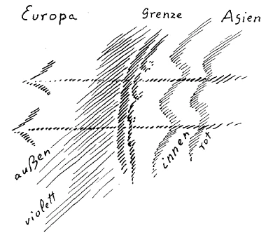
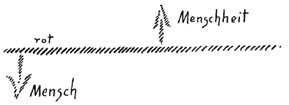
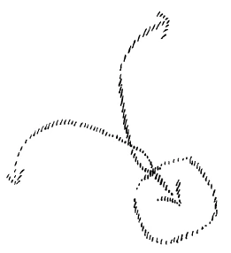
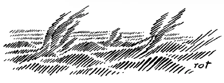

Ich werde versuchen, heute, morgen und übermorgen einiges Bedeutungsvolle anzuknüpfen an die Betrachtung, die ich in der vorigen Woche hier vor Ihnen angestellt habe. Was ich anknüpfen will an diese Dinge, die uns bis zu einer gewissen Tiefe hineingeführt haben in die Impulse, welche die neuere Menschheitsentwickelung beherrschen, das soll sich herausergeben aus allerlei Wendepunkten des neueren geschichtlichen Lebens. Wir wollen versuchen, dieses neuere geschichtliche Leben bis zu dem Punkte zu betrachten, an dem wir sehen können, wie die Menschenseele in der Gegenwart im Weltenzusammenhange drinnensteht, sowohl mit Bezug auf ihre Entwickelung im Kosmos, wie auf ihre seelische Entwickelung gegenüber dem Göttlichen und ihre Ich-Entwickelung gegenüber dem Geistigen. Aber ich möchte einmal diese Dinge an mehr oder weniger Alltägliches und Ihnen Bekanntes anknüpfen. Deshalb lege ich heute zunächst — Sie werden morgen und übermorgen sehen warum — jenen geschichtlichen Überblick über die neuere Menschheitsentwickelung zugrunde, der auch gestern zum Teil der Betrachtung über neuere Geschichte zugrunde gelegen hat, die ich versuchte in meinem öffentlichen Vortrage in Zürich zu geben. ^zqzwmx

Wir wissen aus früheren Vorträgen, die ich über ähnliche Themata gehalten habe, daß ich vom Gesichtspunkte der Geisteswissenschaft aus das, was man gewöhnlich Geschichte nennt, verwandelt sehen muß in eine Symptomatologie. Das heißt von dem Gesichtspunkte, den ich hier meine: Dasjenige, was man gewöhnlich empfängt als Geschichte, was verzeichnet wird in dem, was man schulmäßig Geschichte nennt, das sollte man nicht ansehen als das wirklich Bedeutungsvolle im Entwickelungsgange der Menschheit, sondern man sollte das nur ansehen als Symptome, die gewissermaßen an der Oberfläche ablaufen und durch die man durchblicken muß in weitere Tiefen des Geschehens, wodurch sich dann enthüllt, was eigentlich die Wirklichkeit ist im Werden der Menschheit. Während gewöhnlich die Geschichte die sogenannten historischen Ereignisse in ihrer Absolutheit betrachtet, soll hier das, was man historische Ereignisse nennt, nur als etwas angesehen werden, was gewissermaßen ein tiefer darunterliegendes, wahres Wirkliche erst verrät, und, wenn man es richtig betrachtet, offenbart. ^qvejex

Man braucht ja nicht sehr tief zu denken, so wird man sehr bald darauf kommen, wie unsinnig zum Beispiel eine sehr häufig gemachte Bemerkung ist: daß der Mensch der Gegenwart ein Ergebnis der Vergangenheit der Menschheit sei, und diese Bemerkung an die Betrachtung desjenigen knüpft, was dann die Geschichte von dieser Vergangenheit gibt. Lassen Sie diese geschichtlichen Ereignisse, die Sie in der Schule als Geschichte vorgeführt bekommen haben, einmal Revue passieren, und fragen Sie dann, wieviel davon Einfluß gewonnen haben kann, so wie es die Geschichte glaubt darstellen zu können, auf Ihr eigenes Gemüt, auf Ihre eigene seelische Struktur! — Aber die seelische Struktur zu betrachten, wie sie in der Gegenwart hineingestellt ist in die Entwickelung der Menschheit, das gehört ja zur wirklichen Selbsterkenntnis des Menschen. Diese Selbsterkenntnis wird nicht gefördert durch die gewöhnliche Geschichte. Manchmal wird allerdings ein Stück Selbsterkenntnis gefördert, herbeigeführt, aber auf einem Umwege, zum Beispiel wie mir gestern ein Herr erzählte, daß er einmal in der Schule nicht wußte, wann die Schlacht von Marathon geschlagen worden ist und deswegen drei Stunden Arrest bekommen hatte. Das ist allerdings dann etwas, was auf die Seele des Menschen wirkt und was dann auf einem Umwege etwas beitragen könnte zu Impulsen, die zur Selbsterkenntnis führen! Aber die Art und Weise, wie die Geschichte von der Schlacht von Marathon spricht, wird wenig beitragen zur wirklichen Selbsterkenntnis des Menschen. Dennoch muß auch eine symptomatologische Geschichte schon Rücksicht nehmen auf die äußeren Tatsachen, einfach aus dem Grunde, weil sich gerade durch die Betrachtung und Wertung der äußeren Tatsachen der Einblick gewinnen läßt in dasjenige, was wirklich geschieht. ^j04sx6

Nun will ich zunächst nur gewissermaßen ein Bild der neueren menschlichen Geschichtsentwickelung aufrollen, jener, die gewöhnlich in der Schule dadurch betrachtet wird, daß man mit der Entdeckung Amerikas, mit der Erfindung des Schießpulvers — nun, Sie wissen ja das alles, nicht wahr — anfängt und sagt: Nun war das Mittelalter abgeschlossen, jetzt beginnt die neuere Zeit. — Aber es handelt sich, wenn man eine solche Betrachtung fruchtbar für den Menschen anstellen will, darum, daß man vor allen Dingen den Blick hinwendet auf die wirklichen Umschwünge in der Menschheitsentwickelung selbst, auf diejenigen großen Wendepunkte, in denen das Seelenleben des Menschen aus einer gewissen Artung in eine andere Artung übergegangen ist. Diese Übergänge bemerkt man sogar gewöhnlich nicht. Man bemerkt diese Übergänge eben nicht, weil man sie über dem Gestrüppe der Tatsachen übersieht. Wir wissen ja aus rein geisteswissenschaftlicher Betrachtung, daß der letzte große Wendepunkt in der menschlichen Kulturentwickelung in den Anfang des 15. Jahrhunderts fällt, wo der fünfte nachatlantische Zeitraum beginnt. Wir wissen, daß 747 vor dem Mysterium von Golgatha der griechisch-lateinische Zeitraum begonnen hat und bis dahin dauerte, wo dann der neuere, fünfte nachatlantische Zeitraum begann, bis in den Anfang des 15. Jahrhunderts. Nur darum, weil man die Dinge oberflächlich betrachtet, kommt für die gewöhnliche Anschauung nicht heraus, daß wirklich das ganze Seelenleben der Menschen sich geändert hat in dem betreffenden Zeitpunkt. Und es ist ein ganz gewöhnlicher Unsinn, wenn man zum Beispiel das 16. Jahrhundert so vorstellt in der Geschichte, als ob es einfach sukzessive aus dem 11. oder 12. Jahrhundert hervorgegangen wäre, und ausläßt jenen beträchtlichen Umschwung, der gegen das 15. Jahrhundert zu, dann auslaufend davon, sich zugetragen hat. Natürlich ist ein solcher Zeitpunkt approximativ, annähernd; aber was ist denn nicht annähernd im wirklichen Leben? Bei all dem, wo ein Entwickelungsvorgang, der in sich in einer gewissen Weise zusammenhängend ist, hinüberdringt in eine andere Zeit, da müssen wir immer von «approximativ» sprechen. Wenn der Mensch geschlechtsreif wird, so kann man auch nicht genau den Tag in seinem Leben bestimmen, sondern es bereitet sich vor und läuft dann ab. Und so ist es natürlich auch mit diesem Zeitpunkt 1413. Die Dinge bereiten sich langsam vor und nicht gleich tritt alles und überall in seiner vollen Stärke auf. Aber man bekommt gar keinen Einblick in die Dinge, wenn man nicht den Zeitpunkt des Umschwunges ganz sachgemäß ins Auge faßt. ^d6xb50

Nun kann man nicht anders - wenn man, zurückschauend hinter die Zeit des 15. Jahrhunderts, nach der wichtigsten Seelenverfassung der Menschheit rückblickend frägt und dann vergleichen will mit dem, was nach dem Beginne des 15. Jahrhunderts immer mehr und mehr in diese Seelenverfassung der Menschheit hineinkam — man kann nicht anders, als das Auge hinwenden zu jenem umfassenden Tatsächlichen, welches sich das ganze sogenannte Mittelalter hindurch über die europäische zivilisierte Menschheit ausbreitete, und das noch innig zusammenhing mit der ganzen Seelenkonstitution der griechisch-lateinischen Zeit: Es ist die Form, welche sich allmählich im Laufe der Jahrhunderte aus dem Römischen Reiche heraus in dem an das römische Papsttum gebundenen Katholizismus herausgebildet hatte. Der Katholizismus kann ja nicht anders betrachtet werden bis zum großen Wendepunkt der neueren Zeit, als daß man ins Auge faßt, wie er ein Universalimpuls war, wie er als Universalimpuls sich ausbreitete. Sehen Sie, die Menschen waren im Mittelalter gegliedert; sie waren gegliedert nach Ständen, sie waren gegliedert nach Familienzusammenhängen, sie waren gegliedert in den Zünften und so weiter. Aber durch all diese Gliederungen zog sich hindurch dasjenige, was der Katholizismus in die Seelen träufelte, und er zog sich hindurch in jener Gewandung, welche das Christentum angenommen hatte unter mancherlei Impulsen, die wir noch kennenlernen werden in diesen Tagen, und unter jenen Impulsen, die ich Ihnen in den vorigen Vorträgen angeführt habe. Es breitete sich der Katholizismus aus als jenes Christentum, das wesentliche Einflüsse in Rom von jenen Seiten empfangen hat, die ich eben charakterisiert habe. ^e6fhth

Womit rechnete denn der von Rom ausgehende und sich in seiner Art durch die Jahrhunderte entwickelnde Katholizismus, der wirklich ein Universalimpuls war, der die tiefste Kraft war, welche in die Zivilisation Europas hineinpulsierte? Er rechnete mit einer gewissen Unbewußtheit der menschlichen Seele, mit einer gewissen Suggestivkraft, die man auf die menschliche Seele ausüben kann. Er rechnete mit jenen Kräften, welche die menschliche Seelenverfassung seit Jahrhunderten hatte, in welchen die menschliche Seele, die erst in unserem Zeitraume erwachte, noch nicht voll erwacht war. Er rechnete mit denen, die erst in der Gemüts- und Verstandesseele waren. Er rechnete damit, daß er ihnen in ihr Gemüt durch suggestives Wirken einträufelte dasjenige, was er für nützlich hielt, und er rechnete bei denen, welche die Gebildeten waren — und das war ja zumeist der Klerus —, mit dem scharfen Verstand, der aber in sich noch nicht die Bewußtseinsseele geboren hatte. Die Entwickelung der Theologie bis ins 13., 14., 15. Jahrhundert ist so, daß sie überall auf den denkbar schärfsten Verstand zählte. Aber wenn Sie Ihre Kenntnisse über das, was der menschliche Verstand ist, von dem Verstande heute nehmen, so können Sie niemals eine richtige Vorstellung gewinnen von dem, was der Verstand bis ins 15. Jahrhundert bei den Menschen war. Der Verstand bis ins 15. Jahrhundert hatte etwas Instinktives, er war noch nicht durchdrungen von der Bewußtseinsseele. Es war nicht ein selbständiges Nachdenken in der Menschheit, das nur von der Bewußtseinsseele kommen kann, sondern es war da und dort ein ungeheuer großer Scharfsinn, wie Sie ihn ganz gewiß in vielen Auseinandersetzungen bis ins 15. Jahrhundert finden, denn gescheiter sind viele dieser Auseinandersetzungen als die der späteren Theologie. Aber es war nicht jener Verstand, der aus der Bewußtseinsseele heraus wirkte, sondern es war jener Verstand, welcher, wenn man populär spricht, aus dem Göttlichen heraus wirkte, wenn man esoterisch spricht, aus dem Engel, aus dem Angelos heraus wirkte; also etwas, worüber der Mensch noch nicht verfügte. Das selbständige Denken wurde erst möglich, als der Mensch auf sich selber gestellt war durch die Bewußtseinsseele. Wenn man auf solche Weise mit suggestiver Kraft einen Universalimpuls so ausbreitet, wie das geschehen ist durch das römische Papsttum und alles, was damit in der Kirchenstruktur verbunden war, dann trift man viel mehr das Gemeinsame, das Gruppenseelenhafte der Menschen. Und das traf auch der Katholizismus. Und es brachten es - wir werden die Dinge schon von einem anderen Gesichtspunkte noch besprechen — gewisse Impulse der neueren Geschichte dahin, daß dieser Universalimpuls des sich ausbreitenden Katholizismus gewissermaßen seinen Sturmbock fand an dem RömischGermanischen Imperium, und wir sehen, wie die Ausbreitung des universellen römischen Katholizismus eigentlich unter fortwährendem Zusammenprallen und Sich-Auseinandersetzen mit dem RömischDeutschen Imperium geschieht. Sie brauchen ja nur in den gebräuchlichen Geschichtsbüchern die Zeit der Karolinger, die Zeit der Hohenstaufen zu studieren, und Sie werden da überall sehen, daß es sich im wesentlichen darum handelt, daß in Europas Kultur einzieht der katholische Universalimpuls, wie er von Rom aus gedacht wird. ^lsz6y4

Wenn wir von dem Gesichtspunkt des Beginnes der Bewußtseinsseelenkultur die Sache recht ansehen wollen, so müssen wir auf einen großen Wendepunkt hinblicken, durch den äußerlich symptomatisch sich zeigt, wie das, was durch das Mittelalter wirklich herrschend war in dem eben charakterisierten Sinne, aufhört so herrschend zu sein, wie es früher war. Und dieser Wendepunkt in der neueren geschichtlichen Entwickelung ist der, daß 1309 von Frankreich aus der Papst einfach von Rom nach Avignon versetzt wird. Damit war etwas getan, was früher selbstverständlich nicht hätte geschehen können, worinnen sich zeigte: Jetzt beginnt das, wo die Menschheit anders wird als früher, da sie sich beherrscht wußte von einem Universalimpuls. Man kann sich nicht vorstellen, daß es früher einem König oder einem Kaiser einfach hätte einfallen können, den Papst von Rom irgendwo andershin zu versetzen. 1309 wurde kurzer Prozeß gemacht: der Papst wurde nach Avignon versetzt, und es beginnt jene Zänkerei mit Päpsten und Gegenpäpsten, die eben an die Versetzung des Papsttums gebunden war. Und damit in Verbindung sehen wir dann, wie etwas, was allerdings in einem ganz anderen Zusammenhange mit dem Christentum war, das in eine gewisse äußere Verbindung mit dem Papsttum gekommen war, mit betroffen wurde. Während 1309 der Papst nach Avignon versetzt wird, sehen wir, daß bald danach, 1312, der Tempelherren-Orden aufgehoben wird. Das ist solch ein Wendepunkt der neueren Geschichte. Man soll solch einen Wendepunkt nicht bloß hinsichtlich seines tatsächlichen Inhaltes betrachten, sondern als Symptom, um allmählich zu finden, was für eine Wirklichkeit dahinterliegt. ^slad4l

Nun wollen wir andere solche Symptome vor unserem Seelenauge vorüberziehen lassen. Wir haben sie, wenn wir die Zeit, in welcher dieser Wendepunkt lag, einmal vor unserer Seele auftreten lassen. Da haben wir, über Europa hinschauend, die Tatsache auffällig, daß das europäische Leben mehr nach Osten hinüber doch radikal beeinflußt wird von jenen Ereignissen, die sich im geschichtlichen Leben, ich möchte sagen, wie Naturereignisse wirksam machen. Das sind die fortwährenden Wanderungen — mit den Mongolenwanderungen haben sie in der weiteren neueren Zeit begonnen -, die stattfinden von Asien nach Europa herüber, und die ein asiatisches Element nach Europa . hereinbrachten. Sie müssen nur bedenken, daß man, wenn man an ein solches Ereignis wie das von Avignon diese Tatsache anschließt, man sehr bedeutsame Anhaltspunkte gewinnt für eine historische Symptomatologie. Denn bedenken Sie das Folgende. Wenn Sie wissen wollen, welches die äußeren, nicht die inneren geistigen, sondern die äußeren menschlichen Veranlagungen und Wirkungen waren, welche sich an das Ereignis von Avignon knüpften und die zu ihm geführt haben, dann werden Sie bei einem zusammenhängenden Komplex von menschlichen Entschlüssen und Tatsachen stehenbleiben können. Das können Sie nicht, wenn Sie solche Ereignisse betrachten wie die herüberziehenden Mongolen, bis später dann zu den Türken. Sondern indem Sie solch ein historisches Ereignis, solch einen Tatsachenkomplex ins Auge fassen, müssen Sie folgende Erwägungen anstellen, wenn Sie wirklich zu einer geschichtlichen Symptomatologie kommen wollen. ^w97ls3

Nehmen Sie einmal an: Da ist Europa, da ist Asien (s. Zeiehng. S.16), die Züge gehen herüber. Nun nehmen wir an, solch ein Zug sei bis zu dieser Grenze vorgedrungen, dahinter seien meinetwillen die Mongolen, später die Türken, wer immer, davor seien die Europäer. Wenn Sie die Ereignisse von Avignon nehmen, so finden Sie einen Tatsachenkomplex von menschlichen Entschlüssen, menschlichen Taten vor. Das haben Sie dort nicht. Dort müssen Sie zwei Seiten betrachten, die eine, die hier liegt, und die andere, die hier liegt (auf die Zeichnung deutend). Für die Europäer ist dieser Sturm, der da herüberkommt, einfach wie ein Naturereignis: man sieht nur die Außenseite. Die kommen herüber und stören einfach, sie dringen ein. Dahinter aber liegt all diejenige Kultur, all die Seelenkultur, die sie selbst in sich tragen. Ihr eigenes seelisches Leben liegt dahinter. Das mag man wie immer beurteilen, aber es liegt dieses seelische Leben dahinter. Das wirkt gar nicht über die Grenze hinüber. Die Grenze wird gewissermaßen wie ein Sieb, durch das nur etwas wie elementarische Wirkungen durchgeht. Solche zwei Seiten - ein Inneres, das bei den Menschen bleibt, die hinter einer solchen Grenze stehen, und dasjenige, was nur zugewendet wird dem anderen -— finden Sie in dem Ereignis von Avignon natürlich nicht; da ist alles in einem Komplex drinnen. Solche Ereignisse wie diese Wanderungen von Asien herüber, die haben eine große Ähnlichkeit mit der Naturanschauung selber. Denken Sie sich, Sie schauen die Natur an, Sie sehen die Farben, Sie hören die Töne: Das ist ja alles Teppich, das ist ja alles Hülle. Dahinter liegt Geist, dahinter liegen die Elementarwesen, bis heran zu dem hier. Da haben Sie auch die Grenze. Sie sehen mit Ihren Augen, Sie hören mit Ihren Ohren, fühlen mit Ihren Händen. Dahinter liegt der Geist, der kommt hier nicht durch. Das ist in der Natur so. Das ist ja da nicht ganz gleich, aber etwas Ähnliches. Was dahinter als Seelisches liegt, das dringt da nicht durch, das wendet nur die Außenseite nach der anderen Gegend hin. ^r1kpbq

 ^zp9hzj

Es ist außerordentlich bedeutsam, daß man dieses merkwürdige Mittelgebilde ins Auge faßt, wo Völker oder Rassen aufeinanderprallen, die sich gewissermaßen nur ihre Außenseite zukehren, dieses merkwürdige Mittelgebilde — welches auch unter den Symptomen auftritt- zwischen eigentlichem menschlich-seelischen Universalerleben, wie es also angeschaut werden muß, wenn man so etwas erblickt wie das Ereignis von Avignon, und zwischen richtigen Natureindrücken. All das historische Gerede, das in der neueren Zeit heraufgekommen ist, und das keine Ahnung hat von dem Eingreifen eines solchen Mitteldings, all das kommt zu keiner wirklichen Kulturgeschichte. Weder Buckle noch Ratzel konnten daher zu einer wirklichen Kulturgeschichte kommen. Ich nenne zwei weit auseinanderliegende kulturgeschichtliche Betrachter, weil sie von den Vorurteilen ausgingen: Nun, man muß halt dasjenige, was von zwei Ereignissen aufeinanderfolgt, so betrachten, daß das spätere die Wirkung, das frühere die Ursache ist, und die Menschen so darinnen gestanden haben. ^6sv35m

Das ist also wiederum solch ein Ereignis. Wenn man es als Symptom betrachtet im neueren Werden der Menschheit, dann wird es, wie wir in diesen Tagen sehen werden, eine Brücke von den Symptomen hinüber zur Wirklichkeit. ^o8cm18

Nun sehen wir etwas auftauchen aus dem Komplex von Tatsachen heraus, was wir wiederum mehr symptomatisch betrachten wollen. Wir sehen im Westen von Europa, anfangs noch wie ein mehr oder weniger einheitliches Gebilde, dasjenige auftauchen, was später zu Frankreich und England wird. Denn zunächst können wir es — wie wir auftauchen sehen in der Zeit, was später zu diesen zwei Gebilden wird, wenn wir nicht die äußerlichen Unterscheidungen wie den Kanal ins Auge fassen, der aber doch nur etwas Geographisches ist — eigentlich nicht unterscheiden. In England drüben ist in den Zeiten, als die neuere geschichtliche Entwickelung beginnt, überall im Grunde französische Kultur. Englische Herrschaft greift herüber nach Frankreich; die Mitglieder der einen Dynastie machen Anspruch auf den Thron im anderen Lande und so weiter. Aber eines sehen wir, was da auftaucht, was das ganze Mittelalter hindurch ebenfalls zu dem gehört hat, das gewissermaßen in die Unterordnung getrieben wurde durch den katholisch-römischen Universalimpuls. Ich sagte schon, die Menschen hatten Gemeinschaften, sie hatten Blutsverwandtschaften in Familien, an denen sie zäh festhielten, sie hatten zünftliche Gemeinschaften, alles mögliche. Aber durch das alles geht etwas durch, was mächtiger, herrschender war, wodurch das andere in Unterordnung getrieben wird, wodurch dem anderen das Gepräge aufgedrückt wurde: Das war eben der römisch geformte, der katholischeTJniversalimpuls. Und dieser römisch-katholische Universalimpuls machte, wie er die Zünfte oder die anderen Gemeinschaften zu etwas Untergeordnetem machte, ebenso die nationale Zusammengehörigkeit zu etwas Untergeordnetem. Die nationale Zusammengehörigkeit wurde in der Zeit, als der römische Universal-Katholizismus wirklich seine größte impulsive Stärke entwikkelte, nicht für das Wichtigste in der seelischen Struktur der Menschen angesehen. Aber das ging jetzt auf, das Nationale als etwas zu betrachten, was wesentlich wird für den Menschen, in unendlichem Grade viel wesentlicher als es früher sein konnte, da der katholische Universalimpuls allherrschend war. Und bedeutsam sehen wir es gerade in dem Gebiete auftreten, das ich Ihnen eben bezeichnet habe. Aber wir sehen zu gleicher Zeit, während dort die allgemeine Idee, sich als Nation zu fühlen, auftaucht — wir werden noch über die Sache zu sprechen haben -, wie gestrebt wird, eine ganz wichtige, bedeutsame Differenzierung zu vollziehen. Während wir sehen, wie durch die Jahrhunderte hindurch ein gewisser einheitlicher Impuls über Frankreich und England sich ausbreitet, sehen wir, wie im 15. Jahrhundert Differenzierungen eintreten, für die der wichtigste Wendepunkt das Auftreten der Jungfrau von Orleans 1429 ist, womit der Anstoß gegeben wird - und wenn Sie in der Geschichte nachsehen, so werden Sie sehen, daß dieser Anstoß ein wichtiger, ein mächtiger ist, der fortwirkte — der Differenzierung zwischen dem Französischen einerseits, dem Englischen anderseits. ^o51do5

So sehen wir das Auftauchen des Nationalen als Gemeinsamkeit Bildendem, und zu gleicher Zeit diese für die Entwickelung der neueren Menschheit symptomatisch bedeutsame Differenzierung, die ihren Wendepunkt 1429 in dem Auftreten der Jungfrau von Orleans hat. Ich möchte sagen: In dem Augenblicke, in dem der Impuls des Papsttums die westliche europäische Bevölkerung aus seinen Fängen entlassen muß, taucht die Kraft des Nationalen gerade im Westen auf und ist dort bildend. — Sie dürfen sich nicht täuschen lassen in einer solchen Sache. So wie Ihnen die Geschichte heute dargestellt wird, können Sie selbstverständlich bei jedem Volk rückwärtige Betrachtungen anstellen und können sagen: Nun ja, da ist auch schon das Nationale gewesen! - Da legen Sie keinen Wert darauf, wie die Dinge wirksam sind. Sie können ja bei den Slawenvölkern nachsehen; die werden selbstverständlich unter dem Eindruck der heutigen Ideen und Impulse ihre nationalen Gefühle und Kräfte möglichst weit zurückführen. Aber die nationalen Impulse waren zum Beispiel gerade in der Zeit, von der wir heute sprechen, in besonderer Art wirksam, so daß Sie eine Epoche umwandelndster Impulse gegeben haben in den Gebieten, von denen wir eben gesprochen haben. Das ist es, worauf es ankommt. Man muß sich zur Objektivität durchringen, damit man die Wirklichkeit erfassen kann. Und eine solche symptomatische Tatsache, die ebenso das Heraufkommen der Bewußtseinsseele ausdrückt, äußerlich offenbart, wie die angeführte, ist auch dieses eigentümliche Sich-Herausorganisieren eines italienischen Nationalbewußtseins aus dem nivellierenden, das Nationale zu einem Untergeordneten machenden päpstlichen Elemente, wie es über Italien bis dahin ausgegossen war. In Italien wird es gerade in dieser Zeit im wesentlichen der nationale Impuls, der die Leute auf der italienischen Halbinsel vom Papsttum emanzipiert. Das alles sind Symptome, die in der Zeit da sind, als sich innerhalb Europas die Bewußtseinsseelenkultur aus der Verstandes- und Gemütsseelenkultur heraus entwickeln will. ^ssw7a0

In derselben Zeit — natürlich sehen wir da auf Jahrhunderte hin sehen wir dann die Auseinandersetzung, die da beginnt zwischen Mittel- und Osteuropa. Was sich herausentwickelt hat aus demjenigen, was ich als Sturmbock bezeichnet habe für das Papsttum, aus dem Römisch-Germanischen Imperium, das gerät in eine Auseinandersetzung mit den heranstürmenden Slawen. Und wir sehen, wie durch die mannigfaltigsten historischen Symptome dieses Ineinanderspielen Mittel- und Osteuropas stattfindet. Man muß den fürstlichen Herrschaften in der Geschichte nicht so weit die Türe aufmachen, als es heute die Lehrer der Geschichte tun. Schließlich muß man schon der Wildenbruch sein, wenn man den Leuten als große historische Ereignisse jenen Hokuspokus vormacht, der sich abgespielt hat zwischen Ludwig dem Frommen und seinen Söhnen und so weiter auf einem bestimmten Gebiete von Europa; man muß der Wildenbruch sein, wenn man diejenigen Ereignisse als historisch bedeutsame aufzählt, die er in seinen Dramen, die gerade von diesen Ereignissen handeln, als historisch bedeutsam hinstellt. Diese historischen Familienereignisse haben nicht mehr Bedeutung als sonstiger Familientratsch; diese Familienereignisse haben mit der Entwickelung der Menschheit nichts zu tun. Davon bekommt man erst ein Gefühl, wenn man Symptomatologie in der Geschichte treibt. Denn dann bekommt man einen Sinn für das, was sich wirklich heraushebt, und für das, was für den Entwickelungsgang der Menschheit ziemlich bedeutungslos ist. Bedeutungsvoll in der neueren Zeit ist die allgemeine Auseinandersetzung zwischen der europäischen Mitte und dem europäischen Osten. Aber im Grunde genommen ist es nur wie eine Gebärde, was sich da abgespielt hat mit Ottokar und so weiter. Das weist eigentlich nur hin auf dasjenige, was in Wirklichkeit geschieht. Dagegen ist von großer Bedeutung, daß man nicht einseitig dieses Ereignis betrachtet, sondern so, daß man sieht, wie, während jene Auseinandersetzung fortwährend stattgefunden hat, eine kolonisatorische Tätigkeit von Mittel- nach Osteuropa hinüber die Bauernbewegungen brachte, die später Menschen vom Rhein bis hinunter nach Siebenbürgen brachte, welche dann dort — und durch eine Mischung von Mittel- und Osteuropa trat das ein — das ganze Leben, wie es sich später in diesen Gebieten entwickelte, im allertiefsten Sinne beeinflußten. So daß wir auf der einen Seite die herankommenden Slawen durcheinandergeraten sehen in ihrem Tun mit dem, was sich in Mitteleuropa herausgebildet hat aus dem römisch-germanischen Imperium, fortwährend durchzogen von mitteleuropäischen Kolonisatoren, die nach dem Osten hinübergingen. Und aus diesem merkwürdigen Geschehen steigt dasjenige auf, was dann in der Geschichte die Habsburgische Macht wird. Aber ein anderes, das da aus diesem Getriebe überall in Europa aufsteigt, wie ich es Ihnen charakterisiert habe, das ist die Bildung gewisser Zentren mit einer zentralen, eigenen Gesinnung, die sich innerhalb kleiner Gemeinschaften der Städte ausbildet. Vom 13. bis 15. Jahrhundert ist die Hauptzeit, wo die Städte über ganz Europa hin mit ihrer eigenen Stadtgesinnvng heraufkommen. Dasjenige, was ich vorher charakterisiert habe, spielt so durch diese Städte hindurch. Aber Individualitäten bilden sich in diesen Städten herauf. ^kjid94

Nun ist es immerhin für diese Zeit bemerkenswert und bedeutsam, wie nach der Differenzierung von Frankreich und England, zunächst in England, sich langsam aber gründlich vorbereitet dasjenige, was dann später in Europa zum Parlamentarismus wird. Aus langdauernden Bürgerkriegen — Sie können das in der Geschichte nachlesen -, die von 1452 bis 1485 dauern, entwickelt sich unter mannigfaltigen äußeren Symptomen das historische Symptom des aufkeimenden Parlamentarismus. Die Menschen wollen, als im 15. Jahrhundert das Zeitalter der Bewußtseinsseele beginnt, ihre Angelegenheiten selbst in die Hand nehmen. Sie wollen mitreden, sie wollen parlamentarisieren, sich unterhalten über dasjenige, was geschehen soll, und wollen dann aus dem, worüber sie sich unterhalten, die äußeren Geschehnisse formen, oder wollen sich wenigstens manchmal einbilden, daß sie die äußeren Geschehnisse formen. Und das entwickelt sich, aus ihren schweren Bürgerkriegen im 15. Jahrhundert, innerhalb Englands aus jener Konfiguration heraus, die in deutlicher Differenzierung, in deutlichem Unterschiede ist von dem, was in Frankreich sich auch unter dem Einfluß des nationalen Impulses gebildet hatte. Dieser Parlamentarismus in England bildet sich aus dem nationalen Impuls heraus. So daß man sich klar sein muß darüber: Durch ein solches Symptom wie die Herausbildung des Parlamentarismus aus dem englischen Bürgerkrieg im 15. Jahrhundert sehen wir durcheinanderspielen, oder meinetwillen auch durcheinanderspülen, auf der einen Seite die heraufkommende nationale Idee, und einen Impuls, der uns schon sehr deutlich hinführt zu dem, was die Bewußtseinsseele will, die im Menschen rumort. Und aus Gründen, die sich schon noch ergeben werden, bricht sich der Impuls der Bewußtseinsseele just durch diese Ereignisse in England durch, nimmt aber den Charakter jenes nationalen Impulses an, den er eben gerade nur dort bekommen konnte; daher bekommt er diese Färbung, diese Nuance. Damit haben wir vieles von dem betrachtet, was Europa gerade im Anfange des BewußtseinskulturZeitalters die Konfiguration gegeben hat. ^cl70du

Hinter all dem, gleichsam im Hintergrunde wie ein halbes Rätsel für Europa dastehend, entwickelt sich das, was später zum russischen Gebilde wird, mit Recht als etwas Unbekanntes angesehen. Wir wissen, warum: weil es dasjenige, was es in sich trägt, als Keime für die Zukunft in sich trägt. Aber es gebiert sich zunächst aus lauter Altem heraus, oder wenigstens aus solchem heraus, das nicht eigentlich aus der Bewußtseinsseele entspringt, überhaupt nicht aus der menschlichen Seele. Natürlich ist es einmal entsprungen, aber hier entsprang es nicht aus der menschlichen Seele heraus. Keines von den drei Elementen, das konfigurierend eingriff in das russische Gebilde, entsprang aus der russischen Seele heraus. Das eine der Elemente war dasjenige, was von Byzanz kam, aus byzantinischem Katholizismus, das zweite dasjenige, was eingeflossen war durch die normannisch-slawische Blutmischung, das dritte dasjenige, was von Asien herüberkam. Alle drei sind nicht etwas, was produziert wurde aus dem Inneren der russischen Seele heraus, es hat aber die Konfiguration gegeben dem, was sich da als ein rätselhaftes Gebilde hinter dem europäischen Geschehen im Osten ausbildete. ^tpv404

Und nun suchen wir uns ein gemeinschaftliches Merkmal für all die Dinge, die uns da als Symptome entgegengetreten sind. Ein solches gemeinschaftliches Merkmal gibt es, das sehr auffällig ist. Wir brauchen nur das, was ja die eigentlich treibenden Kräfte sind, mit dem zu vergleichen, was früher die eigentlich treibenden Kräfte in der Menschheitsentwickelung waren, und wir finden einen bedeutsamen Unterschied, der uns charakteristisch hinweisen wird auf das, was das Wesenhafte in der Bewußtseinsseelenkultur ist, und auf das, was das Wesenhafte in der Verstandes- und Gemütsseelenkultur ist. ^6a1qmi

Wir können es ja, um uns die Sache recht deutlich zu machen, zunächst mit einem solchen Impuls vergleichen, wie es das Christentum ist: etwas, was bei jedem Menschen ganz aus dem ureigensten Innern heraus produziert werden muß, ein Impuls, der wirklich ins geschichtliche Geschehen übergeht, aber der aus dem Innern des Menschen heraus produziert wird. Nun ist das Christentum der größte Impuls von dieser Art in der Erdenentwickelung. Aber wir können ja kleinere Impulse nehmen. Wir brauchen nur dasjenige, was durch das Augusteische Zeitalter in das Römertum hineingekommen ist, zu nehmen, wir brauchen nur auf die zahlreich aus der Menschenseele hervorsprudelnden Impulse im griechischen Leben zu blicken. Da sehen wir, wie überall wirklich aus der Menschenseele heraus produziertes Neues in die Menschheitsentwickelung eintritt. Diese Zeit der Bewußtseinsseelenkultur bringt es in bezug auf so etwas zu keiner Naissance, sondern höchstens zur Renaissance, zu einer Wiedergeburt. In bezug auf das, was aus der menschlichen Seele herauskommt, kommt es höchstens zu einer Renaissance, zu einer Wiederauferstehung des Alten. Denn das alles, was da als Impulse eingreift, das ist ja nichts, was aus der menschlichen Seele herauspulsiert. Das erste, was uns aufgefallen ist, ist ja die nationale Idee, wie man es oftmals nennt, man müßte sagen, der nationale Impuls. Der wird nicht aus der Menschenseele produktiv herausgeboren, sondern der liegt in dem, was wir vererbt erhalten haben, der liegt in dem, was wir vorfinden. Es ist etwas ganz anderes, was, sagen wir, durch die zahlreichen geistigen Impulse im Griechentum auftritt. Dieser nationale Impuls, der ist ein Pochen auf etwas, was da ist wie ein Naturprodukt. Da produziert der Mensch nichts aus seinem Innern heraus, wenn er sich als Angehöriger einer Nationalität betrachtet, sondern er weist nur darauf hin, daß er in einer gewissen Weise gewachsen ist, wie eine Pflanze wächst, wie ein Naturwesen wächst. Und ich habe Sie mit Absicht darauf hingewiesen, daß, was da aus Asien herüberkommt, indem es nur die eine Seite der europäischen Kultur zuwendet, etwas Naturhaftes hat. Wiederum geschieht in Europa nichts, was aus der menschlichen Seele heraus produziert wird, dadurch daß die Mongolen, später die Osmanen einbrechen in die europäischen Ereignisse, obwohl vieles unter diesem Impuls geschieht. Auch in Rußland geschieht nichts, was aus der menschlichen Seele herauskommt, was dadurch besonders charakteristisch ist; das hat nur Byzantinismus und Asiatismus ausgebreitet, diese normannisch-slawische Blutmischung. Es sind gegebene Tatsachen, Naturtatsachen, die hereinkommen ins Menschenleben, aber es wird nichts wirklich aus der menschlichen Seele heraus produziert. Halten wir das einmal fest als Ausgangspunkt für später. Der Charakter dessen, worauf der Mensch pocht, wird ein ganz anderer vom 15. Jahrhundert ab. ^asp2r0

Betrachten wir mehr innerliche Ereignisse. Wir haben jetzt mehr so die äußerlichen geschichtlichen Tatsachen ins Auge gefaßt; betrachten wir mehr innerliche Ereignisse, die schon mehr im Zusammenhang stehen mit dem die Rinde der menschlichen Seele durchbrechenden Bewußtseinsseelenimpuls. Da sehen wir, wenn wir den Blick zum Beispiel auf das Konstanzer Konzil hin richten, 1415, die Hinrichtung des Aus. In Hus sehen wir eine Persönlichkeit, die, ich möchte sagen, heraufkommt wie einem Menschenvulkan ähnlich, in dieser bestimmten Art. 1414 beginnt das Konstanzer Konzil, das über ihn richtet, mit Beginn des 15. Jahrhunderts, gerade mit dem Beginn der Bewußtseinsseelenkultur. Wie steht dieser Hus drinnen im modernen Leben? Als ein mächtiger Protest gegen die ganze suggestive Kultur des katholischen Universalimpulses. Es bäumt sich in Hus die Bewußtseinsseele selbst auf gegen dasjenige, was die Verstandes- oder Gemütsseele angenommen hat durch den römischen Universalimpuls. Aber im Zusammenhange damit sehen wir — wir könnten auch hinweisen, wie sich das schon vorbereitet hat in den Albigenserkämpfen und so weiter —, wie im Grunde genommen das nicht eine vereinzelte Erscheinung ist. Wir sehen ja, wie in Italien Savonarola auftritt, wir sehen, wie andere auftreten: das Aufbäumen der auf sich selbst gestellten menschlichen Persönlichkeit ist es, die durch das Auf-sich-selbst-gestellt-Sein auch zu ihrem religiösen Bekenntnis kommen will. Sie wendet sich gegen den suggestiven Universalimpuls des päpstlichen Katholizismus. Und das findet seine Fortsetzung in Luther, das findet seine Fortsetzung in der Emanzipation der englischen Kirche von Rom, die so außerordentlich interessant und bedeutsam ist, das finder seine Fortsetzung in dem Calvinischen Einfluß in gewissen Gegenden Europas. Das ist etwas, was wie eine Strömung durch die ganze zivilisierte europäische Welt geht, was mehr innerlich ist als die anderen Einflüsse, was mehr mit der Seele des Menschen schon zusammenhängt. ^7elgg5

Aber wie? Auch anders, als das früher der Fall war. Im Grunde genommen, was bewundern wir an Calvin, an Luther, wenn wir sie eben als historische Erscheinungen nehmen? Was bewundern wir an denen, die das englische Kirchentum von Rom frei gemacht haben? Nicht neue produktive Ideen, nicht Neues, das aus der Seele heraus produziert wird, sondern die Kraft, mit der sie das Alte in eine neue Form gießen wollten, so daß, während es früher hingenommen wurde von der mehr unbewußt instinktiven Verstandes- oder Gemütsseele, es jetzt hingenommen werden soll von der auf sich selbst gestellten Bewußtseinsseele des Menschen. Aber nicht neues Bekenntnis wird produziert, nicht neue Ideen werden produziert. Es wird über alte Ideen gestritten, es wird nicht ein neues Symbolum gefunden. Denken Sie nur, wie reich die Menschheit in der Produktion von Symbolen war, je weiter wir zurückgehen. Wahrhaftig solch ein Symbolum wie das Altarsakrament-Symbol, es mußte einmal aus der menschlichen Seele heraus produziert werden. Im Zeitalter Luthers und Calvins konnte man nur darüber streiten, ob so oder so. Aber solch ein Impuls, der aus sich heraus, der ein für sich Individuelles ist, der produziert werden muß aus der menschlichen Seele heraus, war nicht da, im ganzen weiten Umfange war er nicht da. Ein neues Verhältnis zu diesen Dingen bedeutet das Herankommen der Bewußtseinsseelenkultur, aber nicht neue Impulse. ^d95awg

So daß wir sagen können: Indem diese neue Zeit anbricht, wirkt in ihr die heraufkommende Bewußtseinsseele. Sie wirkt sich in geschichtlichen Symptomen aus. Und wir sehen, wie auf der einen Seite die nationalen Impulse wirken, wie auf der anderen Seite selbst bis in die Tiefen des religiösen Bekenntnisses hinein das Aufbäumen der Persönlichkeit wirkt, die auf sich selbst gestellt sein will, weil eben die Bewußtseinsseele herausbrechen will aus ihren Hüllen. Und diese Kräfte, diese zwei Kräfte, die ich eben charakterisiert habe, die muß man in ihren Wirkungen studieren, wenn man jetzt die weitere Fortentwickelung der repräsentativen Nationalstaaten, Frankreich und England, ins Auge faßt. Die erstarken, aber so, daß sie in deutlicher Differenzierung zeigen, wie die zwei Impulse, der nationale und der Persönlichkeitsimpuls, auf verschiedene Weise in Frankreich und in England miteinander in Wechselwirkung treten, und nichts menschlich produziertes Neues, aber Althergebrachtes in Umgestaltung als Grundlage für die geschichtliche Struktur Europas offenbaren. Man kann sagen: Dieses Erstarken des nationalen Elementes, es zeigt sich auf besondere Weise in England, wo das Persönliche, das zum Beispiel in Hus nur als religiöses Pathos wirkte, sich verbindet mit dem Nationalen und sich verbindet mit dem Persönlichkeitsimpuls der Bewußtseinsseele und zum Parlamentarismus immer mehr und mehr wird, den Parlamentarismus immer mehr und mehr ausbildet, so daß dort alles nach der politischen Seite hinschlägt. -— Wir sehen, wie in Frankreich‘ überwiegt — trotz des nationalen Elementes, das eben stark durch Temperament und durch sonstige Dinge wirkt — das Auf-sich-gestellt-Sein der Persönlichkeit, und die andere Nuance gibt. Während in England mehr die nationale Nuance die stärkere Färbung gibt, gibt in Frankreich mehr das Persönlichkeitselement die nach außen sichtbare und wirksame Nuance. Man muß diese Dinge wirklich intim studieren. ^93njag

Daß diese Dinge wirken, objektiv wirken, nicht aus der menschlichen Willkür heraus, das sehen Sie ja da, wo der eine Impuls wirkt, aber nicht fruchtbar wird, steril bleibt, weil er äußerlich keine Förderung findet und weil der Gegenimpuls noch stark genug ist, um ihn zu verkümmern. In Frankreich wirkt der nationale Impuls so stark, daß er das französische Volk emanzipiert vom Papsttum. Daher war es auch Frankreich, das den Papst nach Avignon gezwungen hat. Daher wird da der Mutterboden bereitet für die Emanzipation der Persönlichkeit. In England wirkt stark der nationale Impuls, aber zu gleicher Zeit, wie angeboren, stark der Persönlichkeitsimpuls: die Kultur wird bis zu einem hohen Grade von Rom emanzipiert durch die ganze Nation hindurch, die sich auch ihre eigene Bekenntnisstruktur gibt. In Spanien sehen wir, wie der Impuls zwar wirkt, aber weder durch die Natur des Nationalen durchwirken kann, noch wie die Persönlichkeit aufkommen kann gegen das Suggestive. Da bleibt alles, ich möchte sagen, in den Eierschalen drinnen und kommt früher in die Dekadenz hinein, als es sich entwickeln kann. ^aitw9n

Die äußeren Dinge sind wirklich nur Symptome für dasjenige, was wir durch die äußeren Symptome hindurch suchen. Und ich möchte sagen: Es ist handgreiflich, wenn man nur schauen will, wie das, was man gewöhnlich historische Tatsachen nennt, nur Symptome sind. 1476 war auf dem heutigen Schweizerboden eine bedeutungsvolle Schlacht. Das, was dazumal in den Menschenseelen gelebt hat, als Karl der Kühne bei Murten besiegt worden ist, das tritt uns symptomatisch am bedeutsamsten entgegen in dieser Schlacht bei Murten 1476: die Austilgung beginnt des mit dem römischen Papsttum innig verbundenen Rittertums, des Ritterwesens. Aber es ist wieder ein Zug, der durch die ganze damals zivilisierte Welt geht, der sich gewissermaßen da nur in einer ganz repräsentativen Erscheinung an die Oberfläche bringt. ^thci5x

Natürlich ist, indem sich so etwas an die Oberfläche bringen will, der Gegendruck des Alten da. Neben dem normalen Fortgang, wissen Sie ja, ist immer alles mögliche Luziferische und Ahrimanische da, das von zurückgebliebenen Impulsen herrührt. Das sucht sich zur Geltung zu bringen. Dasjenige, was als normaler Impuls in die Menschheit eintritt, das muß kämpfen gegen das, was in der luziferisch-ahrimanischen Weise hereinkommt. Und so sehen wir, daß gerade der Impuls, der anschaulich in Wiclif, Hus, Luther, Calvin hervortritt, zu kämpfen hat. Ein Symptom für diesen Kampf sehen wir in dem Aufstand der Vereinigten Niederlande gegen die luziferisch-ahrimanische spanische Persönlichkeit des Philipp. Und wir sehen einen der bedeutendsten Wendepunkte der neueren Zeit — aber nur als Symptom können wir ihn auffassen — 1588, als die spanische Armada besiegt wird, und damit alles dasjenige zurückgeschlagen wird, was von Spanien her als der stärkste Widerstand gegen das Aufkommen der emanzipierten Persönlichkeit sich entwickelt hat. In den niederländischen Freiheitskämpfen und der Besiegung der Armada sind äußere Symptome gegeben. Es sind nur äußere Symptome, denn die Wirklichkeit erreichen wir nur, wenn wir langsam den Weg zum Inneren gehen wollen. Aber indem so die Wellen aufgeworfen werden, zeigt sich immer mehr das Innere. Diese Welle 1588, als die Armada geschlagen wurde, die zeigt eben, wie die sich emanzipierende Persönlichkeit, welche die Bewußtseinsseele in sich entwickeln will, sich aufbäumte gegen dasjenige, was in starrster Form geblieben war aus der Verstandes- oder Gemütsseele. ^gaedh5

Es ist ein Unsinn, die geschichtliche Entwickelung der Menschheit so zu betrachten: Das Spätere ist eine Folge des Früheren; Ursache — Wirkung, Ursache - Wirkung und so weiter. Das ist ja riesig bequem. Besonders ist es dann bequem, professorale Geschichtsbetrachtung anzustellen. Es ist ja riesig bequem, so — nun, so fortzuhumpeln von Schritt zu Schritt von einer historischen Tatsache zu der anderen historischen Tatsache. Aber wenn man nicht blind ist und nicht schläft, sondern offenen Auges die Dinge ansieht, so zeigen die historischen Symptome selbst, wie unsinnig solch eine Betrachtung ist. ^clztbo

Nehmen Sie ein historisches Symptom, das nun wirklich außerordentlich einleuchtend ist von einem gewissen Gesichtspunkte aus. All das, was da heraufkam seit dem 15. Jahrhundert und was diese Impulse hatte, von denen ich schon Andeutungen gemacht habe: nationaler Impuls, Persönlichkeitsimpuls und so weiter, all das brachte Gegensätze hervor, die dann zum Dreißigjährigen Krieg führten. Die Betrachtung des Dreißigjährigen Krieges, wie er so geschichtlich dargestellt wird, die ist ja besonders wenig vom Standpunkte der Symptomatologie angestellt. Man kann ihn nicht gut nach der Methode des Kaffeeklatsches betrachten, denn schließlich hat es für die europäischen Geschicke doch keine große Bedeutung gehabt, ob gerade der Martinitz und Slawata und der Fabricius aus dem historischen Fenster zu Prag herausgeschmissen worden sind, und wenn nicht just ein Misthaufen darunter gewesen wäre, wären sie tot gewesen; da sie aber auf einen Misthaufen — er soll nur aus Papierschnitzeln bestanden haben, welche die Bedienten vom Hradschin hingeworfen und nicht weggeschafft haben, bis sie endlich zu einem Papiermisthaufen geworden sind — gefallen waren, sind sie am Leben geblieben. Das ist ja eine ganz niedliche Anekdote für den Kaffeeklatsch, aber daß sie in irgendeiner inneren Beziehung zusammenhängt mit der Entwickelung der Menschheit, das wird man doch nicht behaupten können. ^j2zg8s

Wichtig ist jedenfalls, daß, wenn man beginnt den Dreißigjährigen Krieg zu studieren — ich brauche Ihnen nicht zu sagen, daß er 1618 begonnen hat -, er entspringt aus reinen Bekenntnisgegensätzen, aus dem, was sich gegen den alten Katholizismus, gegen den alten katholischen Impuls herausentwickelt hat. Wir sehen überall, wie sich die schweren Kämpfe aus diesen Gegensätzen der neueren Persönlichkeit zum alten suggestiven Katholizismus herausgebildet hatten. Aber wenn wir dann bis zum Ende studieren und bis zum Jahre 1648 kommen, wo bekanntlich der Westfälische Friede dem Treiben ein Ende gemacht hat, dann können wir uns folgende Frage vorlegen: Was ist denn eigentlich geschehen? — Wenn wir uns nämlich fragen: Wie stand es 1648 mit den protestantischen und katholischen Gegensätzen? Was war aus ihnen geworden im Lauf der dreißig Jahre? Wie hat sich das entwickelt? — Nun, es gibt nichts, was einem bedeutsamer ins Auge fallen kann, als daß es mit Bezug auf die Gegensätze zwischen Protestantismus und Katholizismus und allem, was damit zusammenhing, 1648 genau so stand wie 1618, und zwar ganz genau so. Wenn auch zwischendurch das eine oder andere ein bißchen verändert hatte dasjenige, um das man angefangen hatte sich herumzuzanken, war, wenigstens in ganz Mitteleuropa, es dann noch genau so wie beim Ausbruch. Bloß was sich da hineingemischt hat, was gar nicht in den Ursachen von 1618 lag, all dasjenige, was, nachdem da ein gewisses Feld geschaffen war, sich hineingemischt hat, das hat dann den politischen Kräften in Europa eine ganz andere Struktur gegeben. Der politische Horizont derjenigen, die sich hineingemischt haben, der ist ein ganz anderer geworden. Aber was da beim Westfälischen Frieden herausgekommen ist, was sich wirklich verändert hat gegenüber dem Früheren, das hat nicht das Geringste mit den Ursachen von 1618 zu tun. ^adskvi

Gerade beim Dreißigjährigen Krieg ist diese Tatsache von außerordentlicher Wichtigkeit und bezeugt uns, wie unsinnig es ist, die Geschichte nach dem Gesichtspunkte von Wirkung und Ursache zu betrachten, wie man es gewöhnlich tut. Jedenfalls hat sich aus dem, was sich da entwickelt hatte, gerade das ergeben, daß die führende Stellung von England und Frankreich, wie sie sie in Europa erlangt haben, mehr oder weniger aus diesem Kriege hervorgegangen ist, mit dieser Entwickelung des Krieges zusammenhängt. Aber sie hängt wahrhaftig nicht mit den Ursachen, die zu ihm geführt haben, irgendwie zusammen. Und gerade das ist nun das Wichtigste im Gang der neueren Zeitgeschichte, daß sich anschließend an den Dreißigjährigen Krieg die nationalen Impulse im Verein mit den anderen Impulsen, die ich charakterisiert habe, dazu entwickeln, daß Frankreich und England die repräsentativen Nationalstaaten werden. Wenn vom nationalen Prinzip im Osten heute so viel geredet wird, so darf man dabei nicht vergessen, daß das nationale Prinzip hinübergezogen ist vom Westen nach dem Osten. Das ist wie die Passatströmung auf der Erde: so ist die Strömung des nationalen Impulses vom Westen nach dem Osten gegangen. Das muß man sich nur vollständig klar vor Augen halten. ^tkxwba

Nun ist es interessant, wie dasselbe, nationaler Impuls im Verein mit der Emanzipation der Persönlichkeit, in den zwei differenzierten Gebilden, wo sie, wie wir gesehen haben, 1429 deutlich anfingen sich zu differenzieren, sich ganz verschieden ausnimmt. In Frankreich nimmt sich die Nuance der Emanzipation der Persönlichkeit innerhalb des Nationalen so aus, daß sie vor allem nach innen umschlägt. Ich möchte sagen: Wenn das Nationale (siehe Zeichnung, rot) diese Linie ist und auf der einen Seite vom Nationalen der Mensch liegt, auf der anderen Seite vom Nationalen die Menschheit, die Welt, liegt, so nimmt in Frankreich die Entwickelung vom Nationalen die Richtung zum Menschen hin, in England die Richtung zur Menschheit hin. Frankreich verändert das Nationale innerhalb des Nationalstaates so, daß es hintendiert zur Umänderung des Menschen in sich, daß es darauf hintendiert, den Menschen zu etwas anderem zu machen. In England nimmt aus dem Nationalen heraus das Persönliche den Charakter an, daß es sich hineintragen will in alle Welt, daß es die ganze Welt so machen will, daß überall die Persönlichkeit aufwächst. Der Franzose will mehr zum Erzieher des Persönlichen in der Seele werden, der Engländer will zum Kolonisator der ganzen Menschheit werden mit Bezug auf die Einpflanzung der Persönlichkeit. Zwei ganz verschiedene Richtungen; der Mutterboden ist das Nationale. Einmal schlägt es nach der Seele, nach innen, das andere Mal schlägt es nach außen, nach der Seele der Menschheit. So daß wir zwei parallelgehende Strömungen haben in Frankreich und in England mit zwei sehr stark sich unterscheidenden Nuancen. Daher konnte auch nur in Frankreich, wo das Innere der Persönlichkeit ergriffen wurde, das Gebilde, das sich da jetzt, so wie ich es charakterisiert habe, entwickelte, über Ludwig XIV. und so weiter dann nur zur Revolution hinführen. In England führte es zum ruhigen Liberalismus, weil es sich nach außen entlud, in Frankreich nach innen, nach dem Innern des Menschen. ^gn21bd

 ^bqy2kj

Dies tritt merkwürdigerweise auch geographisch zutage, und es zeigt sich ganz besonders, wenn wir wiederum einen Wendepunkt in der neueren Geschichte als Symptom betrachten, an dem Wendepunkt, wo der aus der Revolution herausgeborene Napoleon 1805 die Schlacht von Trafalgar an die Engländer verliert. Denn was offenbart sich da? Napoleon, als allerdings eigenartige, aber immerhin als Repräsentanz des französischen Wesens, bedeutet die Wendung nach dem Innern auch geographisch, nach dem Kontinente von Europa hinein. Wenn Sie Europa sich als dieses Gebilde vorstellen (siehe Zeichnung), so wird Napoleon gerade durch die Schlacht von Trafalgar nach Europa hereingedrängt (Pfeil), England nach der ganzen Welt hinaus, in entgegengesetzter Richtung. Dabei müssen wir nicht vergessen, wie diese Differenzierung natürlich auch ihre Auseinandersetzung braucht. Sie braucht ihre Auseinandersetzung, es muß sich gewissermaßen das eine an dem andern abreiben. Das geschieht in dem Kampfe um die Herrschaft in Amerika, Es geht das schon etwas hervor aus diesem Wendepunkt von 1805. Aber wir sehen, indem wir den Blick auf ein paar Jahrzehnte vorher wenden, wie das, was gerade die Nuance im Franzosentum bewirkt hat, der Romanismus, für die Welt zurückgeschlagen wird vom Angelsachsentum in Nordamerika. ^of8mpm

 ^4duo2b

So spüren Sie, wenn Sie nur wollen, was da waltet und wirkt. So sehen Sie, wie dieser Bewußtseinsimpuls durch seine Kraft gewissermaßen wie der Zauberlehrling nationale Impulse heraufruft, die sich in der verschiedensten Weise in die Menschheit hineinverpflanzen und hineinnuancieren. Man kann an diese Dinge nur herankommen, wenn man in allem den Bewußtseinsimpuls studiert, aber es vermeidet, pedantisch zu werden, sondern sich den Blick frei hält für Bedeutsames und Unbedeutsames, für Charakteristisches und Uncharakteristisches, mehr oder weniger Charakteristisches auch, so daß man dann dadurch aus den äußeren Symptomen zum inneren Gang der Wirklichkeit vordringen kann. Denn das Äußere widerspricht eben oftmals sogar ganz dem, was eigentlich als Impuls in der Persönlichkeit drinnenliegt. Und besonders in einer Zeit, in welcher die Persönlichkeit auf sich selber gestellt wird, da widerspricht das Äußere gar sehr dem, was eigentlich in der Persönlichkeit als ein Impuls drinnenliegt. ^tvrivw

 ^dv9xn5

Auch das zeigt sich, wenn man symptomatisch diese Entwickelung der neueren Geschichte der Menschheit verfolgt. Es ist überall so: Da geht die Strömung (rot schraffiert), da geht die Oberfläche — und die Schullehrer erzählen als Geschichte die Unwirklichkeit. Aber es gibt Punkte, da kommt in die geschichtlichen Ereignisse hinein so wie Wogen, die da heraufspülen, manchmal ganz vulkanisch, das durch, was da drunter ist. Wiederum an anderen Punkten, da guckt es, ich möchte sagen, heraus, und einzelne historische Ereignisse verraten das, was drunter ist. Die sind dann als Symptome besonders charakteristisch. Aber manchmal sind es gerade Symptome, wo man, indem man hinschaut auf die symptomatische Tatsache, über das Äußere sehr stark hinwegsehen muß. ^y8ffsg

Nun, besonders charakteristisch für das Aufkeimen des Bewußtseinsseelenimpulses im Westen Europas ist eine Persönlichkeit sowohl durch ihre persönliche Entwickelung, wie durch ihr ganzes Hineingestelltsein in das neuere geschichtliche Leben. Sie stellte sich im Beginne des 17. Jahrhunderts gerade hinein in dieses Differenzieren des französischen und englischen Impulses mit seiner ganzen Wirkung, die es damals schon entfacht hat auf das übrige Europa. Im 17. Jahrhundert, da hatte es schon eine längere Zeit gewirkt, hatte sich schon ausgebreitet. Es war die Persönlichkeit, die sich da hineinstellte, eine merkwürdige Persönlichkeit, die man in der folgenden Weise schildern kann. Man kann sagen: Diese Persönlichkeit war außerordentlich freigebig, erfüllt von einem wirklichen, tiefen Dankbarkeitsgefühl für alles dasjenige, was sie empfangen hat, erkenntlich im höchsten Grade, in mustergültiger Weise für alles dasjenige, was ihr als Güte von der Menschheit entgegenschlug, eine Persönlichkeit, sehr gelehrt, fast die Gelehrsamkeit der ganzen Zeit in sich vereinigend, eine Persönlichkeit, außerordentlich friedliebend, abgeneigt den Weltenhändeln als Herrscher, nur von dem Ideal erfüllt, daß in der Welt Friede sein soll, geradezu weise mit Bezug auf Entschlüsse und Willensimpulse, von einer außerordentlich tiefen Neigung zu freundschaftlichem Verhalten zu den Menschen erfüllt. - So könnte man diese Persönlichkeit schildern. Man braucht nur ein bißchen einseitig zu sein, so kann man sie so schildern, wenn man sie äußerlich, wie sie sich darstellt in der Geschichte, ansieht. ^z2d9rj

Man kann sie auch in der folgenden Weise schildern, wenn man nur wieder ein bißchen einseitig wird. Man kann sagen: Das war ein furchtbarer Verschwender, der gar keine Ahnung davon hatte, was er ausgeben konnte oder nicht, das war ein Pedant, so ein richtiger Professorengeist, der überall ins Abstrakte und Pedantische seine Gelehrsamkeit hineintrug. Man kann schildern: Das war ein kleinmütiger Mensch, ein kleinmütiger Charakter, der überall, wo es galt, irgend etwas wacker, tapfer zu verteidigen, kleinmütig sich zurückzog und den Frieden vorzog aus Kleinmut. Man kann sagen: Das war ein verschlagener Mensch, der sich durch das Leben so durchschlängelte, indem er überall klugerweise dasjenige wählte, wodurch er in allem durchkam, und so weiter, Man kann sagen: Das war ein Mensch, der Beziehungen zu anderen Menschen suchte, wie Kinder zu anderen Menschen ihre Beziehungen suchen. Er hatte in seinen Freundschaften ein Element, das geradezu kindisch war, und das ins Phantastisch-Romantische umschlug im Verehren von anderen Menschen und Sich-verehrenLassen von anderen Menschen. — Man braucht nur ein bißchen einseitig zu sein, dann kann man das eine oder das andere sagen. Und tatsächlich gab es Menschen, die das eine sagten, die das andere sagten; manche sagten beides. Und mit alledem hatte man die äußere historische Persönlichkeit von Jakob I. betrachtet, wie sie sich darlebte, als er von 1603 bis 1625 regierte. Man könnte so reden, wie ich zuerst geredet habe, man könnte so reden, wie ich dann geredet habe, und es wird beides gut für Jakob I. passen. Man kennt gar nicht, weder was in seinem Innern in Wirklichkeit lebte, noch was in ihm lebte als Angehöriger der Menschheitsentwickelung der neueren Zeit, wenn man das eine oder das andere schildert. Und doch schlägt gerade in der Zeitperiode, da Jakob I. in England regierte, so etwas wie von unten herauf, und es werden dazumal die Symptome stark charakteristisch für dasjenige, was als Wirklichkeit vorgeht. ^2q9pcl

Nun, von diesen Dingen wollen wir dann morgen weitersprechen. ^jy68t2