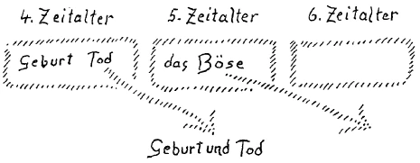

Bevor ich zu anderem übergehe, muß ich noch sprechen von gewissen umfassenderen Gedanken, die sich ergeben aus dem, was wir über die neuzeitliche menschliche Geschichtsentwickelung betrachtet haben. Wir haben versucht, diese neuzeitliche menschliche Geschichtsentwickelung ins Auge zu fassen vom Gesichtspunkte einer Symptomatologie, das heißt, wir haben entschieden den Versuch unternommen, dasjenige, was man gewöhnlich historische Tatsachen nennt, nicht als das zu betrachten, was das Wesentliche in der geschichtlichen Wirklichkeit ist, sondern diese historischen Tatsachen so hinzustellen, daß sie bildhafte Offenbarungen desjenigen darstellen, was eigentlich hinter ihnen als die wahre Wirklichkeit liegt. Diese wahre Wirklichkeit ist damit wenigstens auf dem Gebiete des geschichtlichen Werdens der Menschheit herausgehoben aus dem, was bloß äußerlich in der sinnenfälligen Welt wahrgenommen werden kann. Denn das, was äußerlich in der sinnenfälligen Welt wahrgenommen werden kann, das sind eben die sogenannten historischen Tatsachen. Und erkennt man die sogenannten historischen Tatsachen nicht als die wahre Wirklichkeit an, sondern sucht in ihnen als in Symptomen von der wahren Wirklichkeit Offenbarungen eines hinter ihnen Stehenden, dann kommt man ganz selbstverständlich zu einem übersinnlichen Elemente. ^4f6nui

Es ist im ganzen gerade bei der Betrachtung der Geschichte vielleicht nicht so leicht, vom Übersinnlichen in seinem wahren Charakter zu sprechen, weil viele glauben, wenn sie irgendwelche Gedanken oder Ideen in der Geschichte finden, oder einfach wenn sie geschichtliche Ereignisse notifizieren, dann hätten sie schon etwas Übersinnliches. Wir müssen uns ganz klar sein darüber, daß wir zum Übersinnlichen überhaupt nicht rechnen können, was uns, sei es für die Sinne, sei es für den Verstand, sei es für das Empfindungsvermögen, innerhalb der sinnenfälligen Welt entgegentritt. Daher muß uns alles, was eigentlich im gewöhnlichen Sinne als Geschichte erzählt wird, zum Sinnenfälligen gehören. Man wird natürlich, wenn man so historisch Symptomatologie treibt, die Symptome nicht immer gleichwertig nehmen dürfen, sondern man wird aus der Betrachtung selbst erkennen, daß das eine Symptom von ganz besonderer Wichtigkeit ist, um hinter die Ereignisse auf die Wirklichkeit zu kommen; andere Symptome sind vielleicht ganz bedeutungslos, wenn man den Weg einschlagen will in die wahre übersinnliche Wirklichkeit. ^b6bv2j

Nun, ich möchte, nachdem ich Ihnen eine größere Anzahl von mehr oder weniger wichtigen Symptomen aus jenem Zeitraume aufgezählt habe, der seit dem Eintritt der Menschheit in die Bewußtseinsseelenkultur verflossen ist, jetzt versuchen, Ihnen nach und nach einiges zu charakterisieren von dem dahinterstehenden Übersinnlichen. Einiges haben wir ja schon charakterisiert. Denn natürlich, ein wesentlicher Grundzug, der im Übersinnlichen pulsiert, ist ja das Eintreten der Menschheit in die Bewußtseinsseelenkultur selbst, das heißt das Aneignen der Organe für die Entwickelung der Bewußtseinsseele. Das ist das Wesentliche. Aber wir haben schon neulich erkannt, daß gewissermaßen der andere Pol, die Ergänzung zu diesem innerlichen Erarbeiten der Bewußtseinsseele, sein muß die Hinneigung zu einer Offenbarung aus der geistig-übersinnlichen Welt heraus. Diese Gesinnung muß die Menschen durchdringen, daß sie fortan nicht werden weiterkommen können, ohne der neuen Art von Offenbarung der übersinnlichen Welt entgegenzugehen. ^u203f1

Diese zwei Pole der Menschheitsentwickelung müssen wir zunächst sehen. Sie sind bis zu einem gewissen Grade schon heraufgekommen in den Jahrhunderten seit 1413, seit die Menschheit in das Bewußtseinszeitalter eingetreten ist. Sie werden sich als zwei mächtige Impulse weiterentwickeln müssen, werden in den verschiedenen Epochen bis ins vierte Jahrtausend die verschiedensten Formen annehmen, werden über die Menschen die mannigfaltigsten Schicksale bringen. Das alles wird sich nach und nach für die einzelnen Menschenseelen eben enthüllen. Aber gerade mit dem Hinblick auf die beiden Impulse werden wir dann belehrt darüber, wie Wesentliches verlaufen ist seit diesem 15. Jahrhundert. Und wir können sagen: Man ist heute schon imstande, darauf aufmerksam zu machen, wie Wesentliches verlaufen ist. Sehen Sie, im 18. Jahrhundert zum Beispiel, auch im Beginne des 19. Jahrhunderts, wäre es noch nicht möglich gewesen, strikte aus äußeren Erscheinungen auf die Wirksamkeit der beiden genannten Impulse hinzudeuten. Sie waren noch nicht lange genug wirksam, um sich intensiv genug zu zeigen. Sie sind nun intensiv genug wirksam gewesen, um sich auch schon in den äußerlichen Erscheinungen zu zeigen. ^j5hg31

Eine wesentliche Tatsache, die heute schon signifikant hervortritt, wollen wir zunächst einmal vor unsere Seele hinstellen. Man kann sagen: Wenn frühere Erscheinungen nur für den mehr oder weniger Eingeweihten das sichtbar machten, was ich jetzt meine - die russische Revolution in ihrer letzten Phase, namentlich vom Oktober 1917 bis zu den sogenannten Friedensverhandlungen von Brest-Litowsk, diese ungeheuer interessante Entwickelung, die ja übersichtlich ist, weil sie nur durch wenige Monate läuft, sie hat für denjenigen, der nun wirklich ernsthaftig aus den geschichtlichen Symptomen lernen will — denn auch diese Entwickelung ist selbstverständlich nur ein geschichtliches Symptom -, eine ungeheuer große Bedeutung. Alles das, was da geschehen ist, ist ja zuletzt zusammengeflossen aus den Impulsen, von denen wir als den tieferen Impulsen der neuzeitlichen Entwickelung gesprochen haben. Man kann sagen, es handelt sich gerade bei dieser Revolution um neue Ideen. Denn um neue Ideen kann es sich heute nur handeln, wo man von wirklicher Entwickelung der Menschheit spricht. Alles andere unterliegt, wie wir später noch hören werden und neulich schon andeuteten, gewissermaßen den 'Todessymptomen. Um das Wirksammachen neuer Ideen handelt es sich. Diese neuen Ideen — Sie werden das ja entnehmen können aus den mancherlei Ausführungen, die ich gerade über dieses Thema im Laufe von jetzt schon Jahrzehnten gemacht habe — müssen in die ganze breite Bevölkerung der osteuropäischen Bauernschaft einfließen können. Selbstverständlich hat man es da mit einem seelisch wesentlich passiven Elemente zu tun, aber mit einem Elemente, das aufnahmefähig ist gerade für Modernstes, aus dem einfachen Grunde, weil, wie Sie ja wissen, in diesem Volkselemente der Keim liegt zur Entwickelung des Geistselbstes. Während die andere Bevölkerung der Erde im wesentlichen den Impuls zur Entwickelung der Bewußstseinsseele in sich trägt, trägt die breite Masse der russischen Bevölkerung, mit einigen Anhängseln noch, den Keim in sich für die Entwickelung des Geistselbstes im sechsten nachatlantischen Kulturzeitraum. Das bedingt natürlich ganz besondere Verhältnisse. Aber für dasjenige, was wir jetzt betrachten wollen, ist es weiter nichts als eben signifikant. ^o0flep

Nun, nicht wahr, die Idee, die mehr oder weniger richtig, oder mehr oder weniger unrichtig, oder ganz unrichtig, aber als moderne Idee, als Idee von noch nicht Dagewesenem einfließen sollte in diese breite Masse der Bevölkerung, konnte nur kommen von denjenigen, die Gelegenheit haben im Leben, Ideen aufzunehmen, von führenden Klassen. ^ulfaui

Nachdem der Zarismus gestürzt war, sah man zuerst aufkommen ein Element, das im wesentlichen zusammenhängt mit einer völlig unfruchtbaren Klasse, mit der Großbourgeoisie — weiter westlich nennt man sieSchwerindustrie und so weiter —, mit einer völlig unfruchtbaren Klasse. Das konnte nur eine Episode sein. Das war ja selbstverständlich, daß das nur eine Episode sein konnte. Von der braucht man eigentlich im Grunde wirklich nicht zu reden, denn dasjenige, was aus dieser Klasse hervorgeht, das hat ja selbstverständlich, möchte ich sagen, keine Ideen, es kann keine haben, als Klasse selbstverständlich. Ich rede nie, wenn ich von diesen Dingen spreche, von den einzelnen menschlichen Persönlichkeiten oder Individuen. ^k7ajq3

Nun waren, nach links stehend, zunächst diejenigen Elemente, die aufgestiegen waren aus dem Bürgertum, mehr oder weniger vermischt mit arbeitenden Elementen. Es war die führende Bevölkerung der sogenannten Sozialrevolutionäre, zu denen sich auch die Menschewiki nach und nach geschlagen haben. Es sind diejenigen Menschen, die im wesentlichen, rein äußerlich nach ihrer Zahl gerechnet, sehr leicht eine führende Rolle hätten spielen können innerhalb der weiteren Entwickelung der russischen Revolution. Sie wissen, es ist nicht so gekommen. Es sind die radikalen, nach links stehenden Elemente an die Führung gekommen. Und als sie an die Führung gekommen waren, da waren die Sozialrevolutionäre, die Menschewiki und ihre Gesinnungsgenossen im Westen, selbstverständlich davon überzeugt, daß die ganze Herrlichkeit nur acht Tage dauern werde, dann werde alles kaputt gehen. Nun, es dauert jetzt schon länger als acht Tage, und Sie können ganz sicher überzeugt sein, meine lieben Freunde: Wenn manche Propheten schlechte Propheten sind — diejenigen Menschen, die heute historische Vorgänge prophezeien aus den alten Weltanschauungen gewisser Mittelklassen heraus, sind ganz gewiß die schlechtesten Propheten! - Nun, was liegt da eigentlich zugrunde? Physikalisch gesprochen möchte ich sagen: Dieses Problem der russischen Revolution vom Oktober, durch die nächsten Monate hindurch und bis heute, ist kein Druckproblem, physikalisch gesprochen, sondern ein Saugproblem. Und das ist wichtig, daß man das wirklich den historischen Symptomen entnehmen kann, daß es sich nicht um ein Druckproblem, sondern um ein Saugproblem handelt. Was meint man mit einem Saugproblem? Sie wissen ja (es wird gezeichnet), wenn man hier den Rezipienten einer Luftpumpe hat, die Luft herausgesaugt und im Rezipienten einen luftleeren Raum geschaffen hat und öffnet den Stöpsel, so strömt pfeifend die Luft ein. Sie strömt ein, nicht weil die Luft dort hineinwill durch sich selber, sondern weil ein leerer Raum geschaffen ist. In diesen luftleeren Raum strömt die Luft ein. Sie pfeift hinein, wo ein luftleerer Raum ist. ^btxwvf

So war es auch mit Bezug auf diejenigen Elemente, die gewissermaßen in der Mitte standen zwischen der Bauernschaft und den Sozialrevolutionären, den Menschewiki, und eben den weiter nach links stehenden, den radikalen Elementen, den Bolschewiki. Was ist denn eigentlich da geschehen? Nun, was geschehen ist, war das, daß die sozialrevolutionären Menschewiki absolut ideenlos waren. Sie waren in der überwiegenden Mehrzahl, aber sie waren absolut ideenlos; sie hatten gar nichts zu sagen, was geschehen soll mit der Menschheit gegen die Zukunft hin. Sie hatten zwar allerlei ethische und sonstige Sentimentalitäten im Kopfe, aber mit ethischen Sentimentalitäten, wie ich Ihnen öfter auseinandergesetzt habe, kann man nicht die wirklichen Impulse, welche die Menschheit weiter treiben können, finden. So ist ein luftleerer Raum, das heißt ideenleerer Raum entstanden, und da pfiff selbstverständlich dasjenige, was weiter nach links radikal steht, hinein. Man darf nicht glauben, daß es gewissermaßen durch ihr eigenes Wesen den radikalsten sozialistischen Elementen in Rußland, die wenig mit Rußland selbst zu tun haben, vorgezeichnet war, da besonders Fuß zu fassen. Sie hätten es nie gekonnt, wenn die Sozialrevolutionäre und andere mit ihnen Verbundene - es gibt ja die verschiedensten Gruppen — irgendwelche Ideen gehabt hätten, um Führende zu werden. Allerdings können Sie fragen: Welche Ideen hätten sie denn haben sollen? — Und da kann nur derjenige eine fruchtbringende Antwort heute finden, der nicht mehr erschrickt und auch nicht mehr feige wird, wenn man ihm sagt: Es gibt für diese Schichten keine anderen fruchtbaren Ideen als diejenigen, welche aus den geisteswissenschaftlichen Ergebnissen kommen. Es gibt keine andere Hilfe. ^411926

Aber das Wesentliche ist schließlich — gewiß, die Leute sind mehr oder weniger radikal geworden und werden es heute verleugnen, daß sie aus dem alten Bürgertum hervorgegangen sind, viele wenigstens, aber sie sind es doch -, das Wesentlichste ist, daß diejenige Schichte der Bevölkerung, aus welcher diese Leute, die den Raum luftleer, das heißt ideenleer gemacht haben, bis jetzt, im Zeitalter der Bewußtseinsseelenentwickelung, eben absolut nicht dazu zu bringen war, irgendwelche Ideen zu haben. Dies ist nun natürlich nicht bloß in Rußland der Fall, sondern diese russische Revolution in einer letzten, vorläufig letzten Phase kann es eben nur für den, der die Sache studieren will, mit ganz besonderer Deutlichkeit zeigen: Sie sehen Tag für 'Tag, wie diese Leute, die den Raum luftleer machen, zurückgedrängt werden, und wie die anderen hineinpfeifen, das heißt, sich an ihre Stelle setzen. Aber diese Erscheinung, sie ist heute über die ganze Welt verbreitet. Sie ist durchaus über die ganze Welt heute verbreitet. Denn das ist das Wesentliche, daß diejenige Schichte der Bevölkerung, die gewissermaßen heute zwischen rechts und links steht, sich seit langer Zeit ablehnend verhalten hat, wenn es sich darum handelte, eine fruchtbare Weltanschauung irgendwie anzustreben. Eine fruchtbare Weltanschauung kann in unserem Zeitalter der Bewußtseinsseelenentwickelung nicht anders sein als eine solche, die auch Impulse gibt für das Zusammenleben der Menschen. ^7n4mo5

Ja, das war es, was von allem Anfange an unsere geisteswissenschaftliche Bewegung durchpulste: nicht sollte sie nur irgendeine sektiererische Bewegung sein, sondern angestrebt wurde, daß sie wirklich mit dem Impulse unserer Zeit, mit all dem, was der Menschheit in unserer Zeit nach allen Richtungen hin wichtig und wesentlich ist, rechnet. Das wurde immer mehr angestrebt. Das ist allerdings dasjenige, was man heute am schwersten den Menschen zum Verständnis bringen kann, aus dem einfachen Grunde, weil ja doch immer wieder und wiederum selbstverständlich nicht bei allen, sondern bei vielen — die Gesinnung durchschlägt, daß sie auch in dem, was sie Anthroposophie nennen, doch nichts anderes haben wollen als so ein bißchen bessere Sonntagnachmittagspredigt für dasjenige, was man so zu seiner privat-persönlichen Erbauung braucht, was man aber fernhält von all den ernsthaften Angelegenheiten, die man abmacht im Parlament, im Bundesrat oder in der oder jener Körperschaft, oder auch nur am Biertisch. Daß wirklich alles Leben durchdrungen werden muß mit Ideen, die nur aus dem Geisteswissenschaftlichen heraus geholt werden können, das ist es, was eben eingesehen werden muß. ^y06cpm

Der Interesselosigkeit dieser Schichte der Bevölkerung stand und steht auch noch heute das rege Interesse des Proletariats entgegen. Dieses Proletariat hat natürlich, einfach durch die geschichtliche Entwickelung der neueren Zeit, nicht die Möglichkeit, über das bloß Sinnenfällige hinauszudringen. So kennt es nur sinnenfällige Impulse und will nur sinnenfällige Impulse in die Menschheitsentwickelung einführen. Aber während dasjenige, was die bürgerliche Bevölkerung, wenn wir so sagen dürfen, oftmals ihre Weltanschauung nennt, nur Worte, Phrasen oftmals sind — meistens sind, weil sie eigentlich nicht gehegt sind vom unmittelbaren Leben der Gegenwart, sondern weil sie heraufgebracht, überkommen sind aus älteren Zeiten, während die bürgerliche Bevölkerung in der Phrase lebt, lebt das Proletariat, weil es in einem wirklich neuen wirtschaftlichen Impuls drinnensteht, in Realitäten, aber nur in Realitäten sinnenfälliger Natur. ^s2h4o8

Hier haben wir einen bedeutsamen Angelpunkt. Sehen Sie, das Leben der Menschheit hat sich schon seit wenigen Jahrhunderten ganz wesentlich geändert. Seit wenigen Jahrhunderten sind wir innerhalb dieses Zeitalters der Bewußtseinsseele ins Maschinenzeitalter eingetreten. Die bürgerliche Bevölkerung und was über ihr ist wurde wenig berührt in ihren Lebensverhältnissen von diesem Eintritt ins Maschinenzeitalter. Denn was die bürgerliche Bevölkerung an besonders großen neuen Impulsen in der letzten Zeit aufgenommen hat, das liegt ja schon vor dem eigentlichen Maschinenzeitalter — Einführung des Kaffees und so weiter für den Kaffeeklatsch -, und dasjenige, was die bürgerliche Bevölkerung an neuen Bankusancen und dergleichen gebracht hat, das ist so wenig angemessen den neuzeitlichen Impulsen wie nur irgend denkbar. Es ist eigentlich nichts anderes als eine Komplikation der ururältesten Usancen, die man im kaufmännischen Leben gehabt hat. ^xvbhdd

Diejenige Kaste oder Klasse der Menschen dagegen, die wirklich von einem neuzeitlichen Impulse äußerlich im sinnenfälligen Leben unmittelbar ergriffen ist, die gewissermaßen durch die neuzeitlichen Impulse selber erst geschaffen ist, das ist das neuzeitliche Proletariat. Seit der Erfindung der Spinnmaschine und des mechanischen Webstuhls im 18. Jahrhundert ist die gesamte Volkswirtschaft der Menschheit umgewandelt, und es ist im wesentlichen erst durch diese Impulse des mechanischen Webstuhls und der Spinnmaschine das moderne Proletariat entstanden. Das ist also ein Geschöpf der neuen Zeit, und das ist das Wesentliche. Der Bürger ist kein Geschöpf der neuen Zeit, aber der Proletarier ist ein Geschöpf der neuen Zeit. Denn dasjenige, was früher vorhanden war und verglichen werden konnte mit dem Proletariat der neuen Zeit, es war nicht ein Proletariat, es war irgendein Mitglied der alten patriarchalischen Ordnung, und die ist grundverschieden von dem, was die Ordnung im Maschinenzeitalter ist. Aber damit war der Proletarier eben auch hineingestellt in dasjenige, was ganz von der lebendigen Natur herausgerissen ist: in das rein Mechanische. Er war ganz auf das sinnenfällige Tun gestellt, aber er durstete nach einer Weltanschauung, und er versuchte die ganze Welt sich so zu konstruieren, wie das konstruiert war, in dem er mit seinem Leib und mit seiner Seele drinnenstand. Denn die Menschen sehen schließlich im Weltengebäude dasjenige zuerst, in dem sie selber drinnenstehen. Nicht wahr, der Theologe und das Militär, sie gehören zusammen, wie ich Ihnen neulich angedeutet habe. Der Theologe und das Militär, sie sehen in vieler Beziehung im Weltengebäude Kampf, Kampf der guten und der bösen Mächte und so weiter, ohne weiter auf die Dinge einzugehen. Der Jurist und der Beamte — sie gehören wieder zusammen — und der Metaphysiker, sie sehen im Weltengebäude eine Realisierung abstrakter Ideen. Und kein Wunder, der moderne Proletarier sieht im Weltengebäude eine große Maschine, in die er selbst hineingestellt ist. Und so will er auch die soziale Ordnung gestalten als eine große Maschine. ^6re7f0

Aber es war doch eben ein gewaltiger Unterschied und ist heute noch ein gewaltiger Unterschied zum Beispiel zwischen dem modernen Proletarier und dem modernen Bürger, dem modernen BourgeoisLeben. Von dem versinkenden Stande braucht man ja nicht zu reden. Es ist doch ein beträchtlicher Unterschied, daß der moderne Bourgeois eben gar kein Interesse an irgendwelchen tiefergehenden Weltanschauungsfragen hat, während der Proletarier ein brennendes Interesse für Weltanschauungsfragen hat. Nicht wahr, der moderne Bourgeois diskutiert allerdings in zahlreichen Versammlungen, diskutiert mit Worten zumeist. Der Proletarier diskutiert über dasjenige, in dem er lebendig drinnensteht, über dasjenige, was täglich die Maschinenkultur erzeugt. Man hat sogleich, wenn man heute aus einer bürgerlichen Versammlung in eine proletarische Versammlung geht, folgendes Gefühl: In der bürgerlichen Versammlung, da wird diskutiert, wie schön es wäre, wenn die Menschen Frieden hielten, wenn sie alle Pazifisten wären zum Beispiel, oder wie schön irgend etwas anderes wäre. Aber das alles ist Dialektik von Worten zumeist, allerdings mit etwas Sentimentalität durchspickt, aber nicht ergriffen von dem Impuls, wirklich ins Weltengebäude hineinzuschauen, dasjenige, was man will, aus den Geheimnissen des Weltengebäudes heraus zu realisieren. Gehen Sie dann in die proletarische Versammlung, so merken Sie: Die Leute reden von Wirklichkeiten, wenn das auch die Wirklichkeiten des physischen Planes sind. Die Leute kennen Geschichte, das heißt, ihre Geschichte; sie kennen genau die Geschichte, an den Fingern können sie es herzählen, von der Erfindung des mechanischen Webstuhles und der Spinnmaschine an. Das wird jedem eingebläut, was da angefangen hat, was sich da entwickelt hat, wie das Proletariat zu dem geworden ist, was es heute ist. Wie das geworden ist, das weiß jeder am Schnürchen, der nur einigermaßen nicht stumpfsinnig ist, sondern teilnimmt am Leben — und das sind ja nur wenige, es ist wenig Stumpfsinn eigentlich gerade in dieser Klasse von Bevölkerung. ^7uigl7

Man könnte viele, viele charakteristische Momente aufzählen für die Stumpfheit gegenüber Weltanschauungsfragen bei der heutigen Mittelschichtsbevölkerung. Man braucht sich nur daran zu erinnern, wie sich die Leute verhalten, wenn einmal ein Dichter — derjenige, der nicht ein Dichter ist, darf es schon gar nicht tun, denn dann wird er ein Phantast genannt oder dergleichen —, wenn irgendein Dichter Gestalten aus der übersinnlichen Welt meinetwegen auf die Bühne bringt oder sonstwo hinbringt. Da lassen es sich die Leute so halb und halb gefallen, weil sie nicht daran zu glauben brauchen, weil sie kein Hauch der Wirklichkeit anweht, weil sie sich sagen können: Es ist bloß Dichtung! — Dieses ist so geworden im Lauf der Entwickelung des Bewußtseinsseelenzeitalters. So ist es, möchte ich sagen, die Sache räumlich betrachtet, daß sich herausgebildet hat eine Menschenklasse, die, wenn sie sich nicht besinnt, Gefahr läuft, immer mehr und mehr vollständig in die Phrase hineinzulaufen. Aber man kann dieselbe Sache auch zeitlich betrachten, und auf gewisse wichtige Zeitpunkte habe ich ja wiederholt hingewiesen von den verschiedensten Gesichtspunkten aus. ^vcs8wl

Sehen Sie, von diesem Zeitraum des Bewußtseinszeitalters, der 1413 approximativ begonnen hat, war in den vierziger Jahren des 19. Jahrhunderts, ungefähr um das Jahr 1840 oder 45 herum, das erste Fünftel abgelaufen. Das war ein wichtiger Zeitpunkt, diese vierziger Jahre, denn in diesem Zeitpunkte war gewissermaßen vorgesehen durch die die Weltenentwickelung impulsierenden Mächte eine Art von bedeutsamer Krisis. Außen, im äußeren Leben, kam diese Krisis im wesentlichen dadurch zum Vorschein, daß die sogenannten liberalen Ideen der Neuzeit gerade in diesen Jahren ihre Blüte entwickelten. In den vierziger Jahren hatte es den Anschein, als ob auch in die äußere politische Welt der zivilisierten Menschheit der Impuls des Bewußtseinszeitalters in Form von politischen Anschauungen hineinstürmen könnte. Zwei Dinge fielen zusammen in diesen vierziger Jahren. Das Proletariat war noch nicht vollständig seiner historischen Grundlage entbunden, es existierte noch nicht mit vollem Selbstbewußtsein. Das Proletariat war erst in den sechziger Jahren des 19. Jahrhunderts reif, bewußt einzutreten in die geschichtliche Entwickelung. Was vorher lag, ist nicht im modernen Sinne des Wortes proletarisches Bewußtsein. Die soziale Frage war natürlich früher da. Aber nicht einmal, daß die soziale Frage da ist, haben die Leute der Mittelschichte bemerkt. Ein österreichischer Minister, der eine große Berühmtheit erlangt hat, hat ja den berühmten Ausspruch noch Ende der sechziger Jahre getan: Die soziale Frage hört bei Bodenbach auf. -— Bodenbach liegt, wie Sie vielleicht wissen, an der Grenze zwischen Sachsen und Böhmen. Das ist ein berühmter Ausspruch eines bürgerlichen Ministers! ^nsj3sa

Das proletarische Bewußtsein war also in den vierziger Jahren noch nicht da. Träger der politischen Zivilisation der damaligen Zeit war im wesentlichen das Bürgertum, war im wesentlichen die Mittelschichte, von der ich eben gesprochen habe. Nun war das Eigentümliche der Ideen, die dazumal in den vierziger Jahren hätten politisch werden können, ihre ganz intensive Abstraktheit. Sie alle kennen ja, ich hoffe, wenigstens bis zu einem gewissen Grade, was alles an - man nennt es revolutionären Ideen, aber es war wirklich nur liberal —, was dazumal in den vierziger Jahren an liberalen Ideen in die Menschheit eingeströmt ist und sich 1848 entladen hat. Sie kennen das und wissen ja wohl auch, daß Träger dieser Ideen das Bürgertum war, das ich Ihnen eben charakterisiert habe. Aber alle diese Ideen, die dazumal lebten, die so eindringen wollten in die geschichtliche Entwickelung der Menschheit, waren restlos intensiv abstrakte Ideen. Sie waren die allerabstraktesten Ideen, manchmal bloße Worthülsen. Aber das schadete nichts, denn im Zeitalter der Bewußtseinsseele mußte man durch die Abstraktheit durch. Man mußte die leitenden Ideen der Menschheit einmal in dieser Abstraktheit fassen. ^dzjodd

Nun, der einzelne Mensch lernt nicht an einem Tag schreiben, nicht an einem Tag lesen, das wissen Sie, nicht wahr, von sich und anderen. Die Menschheit braucht auch eine gewisse Zeit, wenn sie mit irgend etwas eine Entwickelung durchmachen soll, sie braucht immer eine gewisse Zeit. Es war — wir werden auf diese Dinge noch genauer eingehen — der Menschheit Zeit gelassen bis zum Ende der siebziger Jahre. Wenn Sie 1845 nehmen, 33 Jahre dazurechnen, dann bekommen Sie 1878; da erreichen sie ungefähr dasjenige Jahr, bis zu welchem der Menschheit Zeit gelassen war, sich hineinzufinden in die Realität der Ideen der vierziger Jahre. Das ist in der historischen Entwickelung der neuzeitlichen Menschheit etwas außerordentlich Wichtiges, daß man diese Jahrzehnte ins Auge zu fassen vermag, die da liegen zwischen den vierziger und den siebziger Jahren. Denn über diese Jahrzehnte muß sich der heutige Mensch völlig klarwerden. Er muß sich klarwerden darüber, daß in diesen Jahrzehnten, in den vierziger Jahren, begonnen hat, in abstrakter Form in die Menschenentwickelung einzufließen das, was man liberale Ideen nennt, und daß der Menschheit Zeit gelassen war bis zum Ende der siebziger Jahre, um diese Ideen zu begreifen, diese Ideen an die Wirklichkeiten anzuhängen. ^ry1ffd

Träger dieser Ideen war das Bourgeoistum. Aber das hat den Anschluß versäumt. Es liegt etwas ungeheuer Tragisches über der Entwickelung dieses 19, Jahrhunderts. Es ist wirklich für denjenigen, der in den vierziger Jahren manchen hervorragenden Menschen — über die ganze zivilisierte Welt waren solche ausgebreitet — aus dem Bürgerstande reden hörte über das, was der Menschheit gebracht werden sollte auf allen Gebieten, in diesen vierziger, noch Anfang der fünfziger Jahre manchmal etwas wie von einem kommenden Völkerfrühling. Aber aus den Eigenschaften heraus, die ich Ihnen charakterisiert habe für die Mittelschichte, wurde der Anschluß versäumt. Als die siebziger Jahre zu Ende gingen, hatte der Bürgerstand die liberalen Ideen nicht begriffen. Es wurde von dieser Klasse, von den vierziger bis in die siebziger Jahre, dieses Zeitalter verschlafen. Und die Folge davon ist etwas, auf das man schon hinschauen muß. Denn die Dinge müssen sich ja in auf- und absteigenden Wellen bewegen, und eine gedeihliche Entwickelung der Menschheit in die Zukunft kann nur stattfinden, wenn man rückhaltlos auf dasjenige sieht, was sich da in der Jüngsten Vergangenheit abgespielt hat. Man kann nur aufwachen im Zeitalter der Bewußtseinsseele, wenn man weiß, daß man vorher geschlafen hat. Wenn man nicht weiß, wann und wie lange und daß man geschlafen hat, so wird man eben nicht aufwachen, sondern wird weiterschlafen. ^4w0yk0

Als das Bürgertum beim Erscheinen des Erzengels Michael als Zeitgeist Ende der siebziger Jahre nicht begriffen hatte den Impuls der liberalen Ideen auf politischem Gebiete, da zeigte es sich, daß jene Mächte, die ich ja auch charakterisiert habe, die mit diesem Zeitraume in die Menschheit sich hineinmischten, zunächst Finsternis verbreiteten über diese Ideen. Und das können Sie wiederum sehr deutlich studieren, wenn Sie nur wirklich wollen. Wie anders haben sich die Menschen die Gestaltung des politischen Lebens in den vierziger Jahren gedacht, als es am Ende des 19. Jahrhunderts über die ganze zivilisierte Welt gekommen ist! Es gibt keinen größeren Gegensatz als die allerdings abstrakten, aber in ihrer Abstraktheit lichtvollen Ideen der Jahre von 1840 bis 1848, und das, was man im 19. Jahrhundert auf den verschiedensten Gebieten der Erde «hohe Menschheitsideale» genannt hat, was man hohe Menschheitsideale genannt hat noch bis in unsere Tage herein, bis alles in die Katastrophe hineingerutscht ist von diesen hohen Menschheitsidealen. ^gbozqv

Also das ist es, was man als zeitliche Ergänzung zu dem Räumlichen hinzufügen muß, daß von den vierziger Jahren bis zu Ende der siebziger Jahre in den produktivsten und fruchtbarsten Zeiträumen für die bürgerliche Bevölkerung eine Art Schlafzustand vorhanden war. Nachher war es gewissermaßen zu spät. Denn nachher ist nichts mehr zu erreichen auf demjenigen Wege, auf dem das in dem genannten Zeitraume erreichbar gewesen wäre. Nachher ist nur durch völliges Erwachen im geisteswissenschaftlichen Erleben etwas zu erreichen. So hängen die Dinge historisch in der neueren Geschichte zusammen. ^4czg0k

In diesem Zeitraume, von den vierziger bis in die siebziger Jahre, da waren die Ideen, wenn auch abstrakt, in einer ganz bestimmten Weise so geartet, daß sie hintendierten nach dem aktiven Geltenlassen des einen Menschen neben dem anderen. Und wäre - als Hypothese sei das angenommen - dasjenige, was in diesen Ideen lag, zur Verwirklichung gekommen, dann würde man schon sehen, daß der Anfang - es wäre ja auch nur der Anfang, aber es wäre eben damit ein Anfang da zu diesem toleranten, aktiven toleranten Geltenlassen des einen Menschen neben dem anderen, was der heutigen Zeit insbesondere mit Bezug auf die Ideen und Empfindungen ganz und gar fehlt. Und so muß gerade im sozialen Leben aus dem Spirituellen heraus eine viel tiefer greifende, eine viel intensivere Idee den Menschen eigen werden. Ich will zunächst, ich möchte sagen, rein äußerlich historisch, zukunftshistorisch diese Idee vor Sie hinstellen, um sie Ihnen dann weiter zu begründen. ^g2bfll

Dasjenige, was der Menschheit einzig und allein Heil bringen kann gegen die Zukunft hin — ich meine der Menschheit, also dem sozialen Zusammenleben -, muß sein ein ehrliches Interesse des einen Menschen an dem anderen. Dasjenige, was dem Bewußtseinszeitalter besonders eigen ist, ist Absonderung des einen Menschen vom andern. Das bedingt ja die Individualität, das bedingt die Persönlichkeit, daß sich auch innerlich ein Mensch von dem andern absondert. Aber diese Absonderung muß einen Gegenpol haben, und dieser Gegenpol muß in dem Heranzüchten eines regen Interesses von Mensch zu Mensch bestehen. ^36sh49

Dieses, was ich jetzt meine als Hinzufügung eines regen Interesses von Mensch zu Mensch, das muß immer bewußter und bewußter im Zeitalter der Bewußtseinsseele an die Hand genommen werden. Alles Eigen-Interesse von Mensch zu Mensch muß immer mehr und mehr ins Bewußtsein heraufgehoben werden. Sie finden unter den, ich möchte sagen, elementarsten Impulsen, die angegeben werden in meinem Buche «Wie erlangt man Erkenntnisse der höheren Welten?», den Impuls verzeichnet, der, wenn er für das soziale Leben praktisch wird, gerade nach Erhöhung des Interesses für den Menschen hinzielt. Sie finden ja überall angegeben die sogenannte Positivität, die Entwickelung einer Gesinnung der Positivität. Die meisten Menschen der Gegenwart werden geradezu mit ihrer Seele umkehren müssen von ihren Wegen, wenn sie diese Positivität entwickeln wollen, denn die meisten Menschen der Gegenwart haben heute noch nicht einmal einen Begriff von dieser Positivität. Sie stehen von Mensch zu Mensch so, daß sie, wenn sie an dem anderen Menschen etwas bemerken, das ihnen nur nicht paßt — ich will gar nicht sagen, das sie tiefer betrachten, sondern das ihnen von obenher betrachtet, ganz äußerlich betrachtet, nicht paßt -, so fangen sie an abzuurteilen, aber ohne Interesse dafür zu entwickeln, abzuurteilen. Es ist im höchsten Grade antisozial — vielleicht klingt es paradox, aber richtig ist es doch - für die zukünftige Menschheitsentwickelung, solche Eigenschaften an sich zu haben, in unmittelbarer Sympathie und Antipathie an den anderen Menschen heranzugehen. Dagegen wird es die schönste, bedeutendste soziale Eigenschaft für die Zukunftsentwickelung sein, wenn man gerade ein naturwissenschaftliches, objektives Interesse für Fehler anderer Menschen entwickelt, wenn einen die Fehler anderer Menschen viel mehr interessieren, als daß man sie versucht zu kritisieren. Denn nach und nach, in diesen drei letzten Epochen, die noch folgen, der fünften, sechsten und siebenten Kulturepoche, da wird sich der eine Mensch ganz besonders immer mehr und mehr mit den Fehlern des andern Menschen liebevoll zu befassen haben. Im griechischen Zeitalter stand über dem berühmten Apollotempel das «Erkenne dich selbst». Das war dazumal im eminentesten Sinne noch zu erreichen, die Selbsterkenntnis, durch Hineinbrüten in die eigene Seele. Das wird immer unmöglicher und unmöglicher. Man lernt sich heute kaum noch irgendwie erheblich kennen durch das Hineinbrüten in sich selbst. Weil die Menschen nur in sich selbst hineinbrüten, deshalb kennen sie sich im Grunde genommen so wenig, und weil sie so wenig hinschauen auf andere Menschen, namentlich auf das, was sie Fehler der anderen Menschen nennen. ^0bwpgm

Eine rein naturwissenschaftliche Tatsache kann uns aufmerksam machen, ich möchte sagen, beweisend aufmerksam machen, daß diese Sache so ist. Sehen Sie, der Naturforscher tut heute zweierlei - ich habe das vielleicht schon erwähnt, aber es ist außerordentlich wichtig -, wenn er auf die Geheimnisse der menschlichen, der tierischen, der pflanzlichen Natur kommen will. Das erste ist, er experimentiert, so wie er in der unorganischen, in der leblosen Natur experimentiert, so auch in der organischen Natur. Nun, durch das Experiment entfernt man sich von der lebendigen Natur, und derjenige, der mit wahrem Erkenntnissinn verfolgen kann, was das Experiment der Welt gibt, der weiß, daß es den Tod allein gibt. Das Experiment gibt nur den Tod, und dasjenige, was einem die heutige Wissenschaft aus der Experimentierkunst, selbst aus einer so feinen Experimentierkunst bieten kann, wie sie zum Beispiel Oscar Hertwig entwickelt, das ist nur der Tod der Sache. Sie können durch das Experimentieren nicht erklären, wie irgendein Lebewesen empfangen und geboren wird, sondern Sie können nur den Tod erklären durch das Experimentieren, und so werden Sie nie etwas erfahren über die Geheimnisse des Lebens durch Experimentierkunst. Das ist die eine Seite. ^ug1oj2

Aber es gibt heute etwas, was allerdings mit sehr unzulänglichen Mitteln arbeitet, was erst ganz, ganz im Anfange ist, was aber geeignet ist, sehr große Aufschlüsse über die menschliche Natur zu geben: das ist die Betrachtung des pathologischen Menschen. Die Betrachtung eines nach irgendeiner Richtung hin nicht ganz, wie man im Philiströsen sagt, normalen Menschen, die bringt in uns das Gefühl hervor: Mit diesem Menschen kannst du eins werden, in diesen Menschen kannst du dich erkennend vertiefen; du kommst weiter, wenn du dich in ihn vertiefst. — Also durch das Experimentieren wird man von der Wirklichkeit weggetrieben; durch das Betrachten desjenigen, was man heute pathologisch nennt, was Goethe so schön die Mißbildungen nannte, wird man gerade hingebracht in die Wirklichkeit. Aber man muß sich einen Sinn aneignen für diese Betrachtung. Man darf nicht abgestoßen werden von solcher Betrachtung. Man muß wirklich sich sagen: Gerade das Tragische kann zuweilen, ohne daß man es je wünschen darf, unendlich aufklärend sein für die tiefsten Geheimnisse des Lebens. -— Was das Gehirn bedeutet für das Seelenleben, wird man nur dadurch erfahren, daß man immer mehr und mehr bekannt werden wird mit kranken Gehirnen. Das ist die Schule des Interesses für den anderen Menschen. Ich möchte sagen: Es kommt die Welt mit den groben Mitteln des Krankseins, um unser Interesse zu fesseln. Aber das Interesse am anderen Menschen ist es überhaupt, was die Menschheit sozial vorwärts bringen kann in der nächsten Zeit, während die Menschheit sozial zurückgebracht wird durch das Gegenteil der Positivität, durch das von obenherein Enthusiasmiert- oder Abgestoßensein von dem anderen Menschen. Diese Dinge hängen aber alle mit dem ganzen Geheimnis des Bewußtseinszeitalters zusammen. ^snl3l1

In jedem solchen Zeitalter wird historisch innerhalb der Menschheit, ich möchte sagen, etwas ganz Bestimmtes entwickelt, und was da entwickelt wird, das spielt dann in der wahren geschichtlichen Entwickelung eine große Rolle. Erinnern Sie sich an die Worte, die ich am Ende der letzten Betrachtungsstunde hier ausgesprochen habe. Ich sagte: Die Menschen müssen sich entschließen, immer mehr und mehr auch in der äußeren geschichtlichen Wirklichkeit Geburt und Tod sehen zu können, — Geburt durch die Befruchtung mit der neuen geistigen Offenbarung, Tod durch alles dasjenige, was man schafft. Tod durch alles dasjenige, was man schafft! Denn das ist das Wesentliche im Bewußtseinszeitalter, daß man auf dem physischen Plane nicht anders schaffen kann als mit dem Bewußtsein: Was man schafft, geht zugrunde. Der Tod ist beigemischt demjenigen, was man schafft. Gerade die wichtigsten Dinge der neueren Zeit in bezug auf den physischen Plan sind todbringende Institutionen. Und der Fehler liegt nicht darinnen, daß man das Todbringende schafft, sondern daß man sich nicht zum Bewußstsein bringen will, daß es todbringend ist. ^rj92wg

Heute noch, nach dem ersten Fünftel des Bewußtseinszeitalters, da sagen die Menschen, der Mensch wird geboren und stirbt; und nicht wahr, sie vermeiden es, weil sie es als unsinnig ansehen, zu sagen: Ja, wozu wird der Mensch geboren, wenn er nun doch stirbt? Es ist ja ganz unsinnig, wenn er geboren wird! Man braucht ihn ja nicht zu gebären, da man doch weiß, daß er stirbt! - Nun, das sagen die Menschen nicht, nicht wahr, weil sie auf diesem Gebiete der äußeren Natur unter dem Zwang der belehrenden Natur Geburt und Tod gelten lassen. Auf dem Gebiete des geschichtlichen Lebens sind die Menschen noch nicht so sehr weit, auch da Geburt und Tod gelten zu lassen, sondern da soll alles, was geboren ist, absolut gut sein und fortbestehen können in alle Ewigkeit. Der Sinn muß sich im Bewußtseinszeitalter ausbilden, daß im äußeren historischen Geschehen Geburt und Tod lebt, und daß, wenn man irgend etwas gebiert, sei es ein Kinderspielzeug oder sei es ein Weltreich, man es gebiert mit dem Bewußtsein, daß es auch einmal tot werden muß. Und wenn man es nicht mit dem Bewußtsein gebiert, daß es einmal tot werden muß, so macht man etwas Unsinniges; man macht dasselbe, als was man machen würde, wenn man glaubt, man würde einen kleinen Sprößling gebären können, der auf eine irdische Ewigkeit Anspruch hätte. ^x7sn13

Dies muß aber in den Inhalt der menschlichen Seele hineinziehen im Zeitalter der Bewußtseinsseele. Im griechisch-lateinischen Zeitraum brauchte man das noch nicht in der Seele zu haben, denn da machte sich das geschichtliche Leben von selbst in Geburt und Tod. Es entstanden die Dinge und sie vergingen von selbst. Im Zeitalter der Bewußtseinsseele muß der Mensch es sein, der Geburt und Tod hineinwebt in sein soziales Leben. Das ist es, was hineinverwoben werden muß in das soziale Leben: Geburt und Tod. Und der Mensch kann in diesem Zeitalter der Bewußtseinsseele den Sinn dafür erwerben, Geburt und Tod ins soziale Wesen hineinzuweben, aus dem Grunde, weil unter ganz bestimmten Verhältnissen in der griechisch-lateinischen Kulturepoche dieses in seine menschliche Wesenheit hineinversetzt worden ist. ^8jv4vc

Der wichtigste Zeitpunkt der persönlichen Entwickelung eines Menschen der mittleren griechisch-lateinischen Zeit war ja etwa der Anfang seiner Dreißigerjahre. Da war der Zeitpunkt, wo gewissermaßen zwei Kräfte, die in jedem Menschen wirksam sind, sich trafen. Nicht wahr, der Mensch wird geboren und stirbt. Aber die Kräfte, die in den Symptomen der Geburt wirken, die wirken die ganze Zeit von der Geburt bis zum Tode im Menschen; sie treten nur besonders charakteristisch durch die Geburt hervor. Die Geburt ist nur ein bedeutendes Symptom, und die andern Symptome, wo dieselben Kräfte wirken durch das ganze physische Leben hindurch, die sind weniger bedeutend. Ebenso beginnen die Kräfte des Todes gleich bei der Geburt zu wirken; wenn der Mensch stirbt, treten sie nur besonders anschaulich hervor. Immer sind diese zwei Arten von Kräften vorhanden in einer Art von Gleichgewicht, können wir sagen: Geburt-Kräfte und Todes-Kräfte, Und am meisten hielten sie sich das Gleichgewicht im griechisch-lateinischen Zeitalter so im Anfang der Dreißigerjahre; so daß der Mensch bis zum Anfang der Dreißigerjahre das Gemüt entwickelte und hinterher durch sich selbst den Verstand, denn vorher konnte er den Verstand nur dadurch bekommen, daß er erweckt wurde im Unterricht, durch Erziehung und so weiter. Und daher sprechen wir im griechisch-lateinischen Zeitalter von der Gemüts- und Verstandesseele, weil das so zusammenstieß; bis in die Dreißigerjahre Gemüt, nachher Verstand. Aber jetzt, im Zeitalter der Bewußtseinsseele, ist es nicht so. Jetzt reißt die Geschichte ab vor der Mitte des menschlichen Lebens. Die meisten Menschen, die Ihnen jetzt entgegentreten, namentlich in der Mittelschichte der Menschheit, werden nicht älter als kaum 27 Jahre; dann trotten sie fort mit dem, was sie gelernt haben und so weiter. Sie können es an einem äußerlichen Elemente sehr leicht sehen, was ich jetzt meine. Denken Sie nur, wie wenige Menschen es gibt, die heute nach dem 27. Jahre auf irgendeinem Gebiete noch wesentlich anders werden, als höchstens, daß sie physisch älter werden, daß sie grau werden, daß sie tatterig werden — nein, das darf man nicht sagen — und ähnliches, nicht wahr; aber der Mensch will bis zum 27. Jahre im wesentlichen heute abgeschlossen sein. Denken Sie einmal: Wenn heute ein Mensch bis zum 27. Jahre etwas Ordentliches gelernt hat - nehmen wir jetzt einen Menschen der sogenannten intelligenten oder intellektuellen Bevölkerung -, dann will er doch auch etwas werden; denn hat er etwas gelernt, dann will er das sein übriges Leben anwenden. Denken Sie, wenn Sie heute einem intelligenten Durchschnittsmenschen zumuten würden, so ein Faust zu werden, das heißt, nicht nur eine Fakultät, sondern vier Fakultäten wirklich hintereinander zu studieren bis zum 50. Jahre! Ich meine ja nicht, daß er gerade an die Universität gehen soll, vielleicht gibt es bessere Mittel als die vier Fakultäten. Weiter studieren heute, nicht wahr, fortlernen, ein verwandlungsfähiger Mensch bleiben, das findet man außerordentlich selten. Bei den Griechen war es noch viel häufiger — wenigstens in dem Teil der Bevölkerung, den man den intellektuellen nennt — aus dem Grunde, weil der Faden nicht abriß im Anfang der Dreifigerjahre; da waren die Kräfte, die von der Geburt herkamen, sehr regsam. Und dann fingen die Kräfte, die nach dem Tode hingingen, an, sich mit jenen zu begegnen; da war ein Gleichgewicht da in der Mitte. Jetzt reißt die Geschichte ab; mit siebenundzwanzig wollen die meisten Menschen «gemachte Menschen» sein, wie man sagt! Und am Ende der Dreißigerjahre würde man anknüpfen können an die Jugend und weiterlernen von der Jugend aus, wenn man nur wollte! Nun möchte ich aber wissen, wie viele Menschen heute wollen, wie viele Menschen das Notwendigste ergreifen wollen, was für die Zukunft der Erdenmenschheit dastehen wird: das immerwährende Lernen, das immerwährende InBewegung-Bleiben. Und das wird nicht zu erreichen sein ohne das eben geschilderte Interesse von Mensch zu Mensch. Liebevoll hinblicken können auf die Menschen, sich interessieren für die Eigenart der Menschen, das ist dasjenige, was die Menschheit ergreifen muß. Und gerade weil es die Menschheit ergreifen muß, deshalb ist es im Rückschlag so wenig in der heutigen Gegenwart schon vorhanden. Es beleuchtet dieses, was ich jetzt gesagt habe, eine wichtige Tatsache der inneren Seelenentwickelung. Gewissermaßen reißt der Faden, der Geburt und Tod verbindet, so zwischen dem 26., 27. Jahre und dem 37. oder 38. Jahre. Da ist ein Jahrzehnt in der Menschenentwickelung, wo die Kräfte von Geburt und Tod nicht recht zusammenwollen. Die Verfassung, die der Mensch braucht, und die er dadurch, daß diese Kräftezusammenkamen, im griechisch-lateinischen Zeitalter noch haben konnte, die muß er sich im Zeitalter der Bewußtseinsseele dadurch entwickeln, daß er im äußeren historischen Leben Geburt und Tod betrachten kann. Kurz, unsere Betrachtung des äußerlichen Lebens muß eine solche werden, daß wir kühn, ohne Feigheit auf unsere Umgebung hinschauen können so, daß wir uns sagen: Wachsen und Welken, das ist dasjenige, was in allem Leben bewußt bewirkt werden muß. Soziales kann nicht absolut für ein Ewiges gebaut werden. Wer für das Soziale baut, muß den Mut haben, immer weiter und weiter Neues zu bauen, nicht stehen zu bleiben, weil dasjenige, was gebaut ist, alt wird, welk wird, absterben muß; weil Neues gebaut werden muß. ^h1ixkj

Nun, so könnte man sagen: In charakteristischer Weise lebte Geburt und Tod gerade im vierten nachatlantischen Zeitalter, im Zeitalter der Gemüts- und Verstandesseele in dem Menschen drinnen. Er brauchte es noch nicht äußerlich zu sehen. Jetzt, im Zeitalter der Bewußtseinsseele, muß er es äußerlich sehen. Dafür muß er in seinem Innern wiederum ein anderes entwickeln. Das ist sehr wichtig, daß er ein anderes wiederum entwickelt. ^h6r2ur

Sehen Sie, man kann sagen, wenn man den Menschen schematisch so betrachtet (siehe Zeichnung): Viertes griechisch-lateinisches Zeitalter, fünftes Zeitalter — Geburt und Tod erblickte der Mensch bewußt in diesem vierten Zeitalter, wenn er ins Innere seines Menschen hineinschaute; jetzt muß er Geburt und Tod äußerlich im geschichtlichen Leben erblicken und von da aus es auch im Innern suchen. Daher ist es so unendlich wichtig, daß in diesem Zeitalter der Bewußtseinsseele der Mensch sich über Geburt und Tod im wahren Sinne, das heißt im Sinne der wiederholten Erdenleben, aufklärt, sonst wird er nie dazu kommen, im historischen Werden Verständnis für Geburt und Tod zu erwerben. ^uzoa2n

Aber geradeso, wie Geburt und Tod von innen nach außen gegangen sind im menschlichen Anschauen, so muß der Mensch wiederum etwas entwickeln in seinem Innern im fünften nachatlantischen Zeitraum, was im sechsten Zeitalter, das also im vierten Jahrtausend beginnt, wiederum nach außen gehen wird. Und das ist das Böse. Das Böse wird im Innern des Menschen entwickelt im fünften nachatlantischen Zeitraum, muß nach außen strahlen und im Äußeren erlebt werden im sechsten Zeitraume so wie Geburt und Tod im fünften Zeitraume. Das Böse soll innerlich in den Menschen sich entwickeln. ^k9rzfd

 ^grrnh9

Denken Sie einmal, was das für eine unangenehme Wahrheit ist! Man wird vielleicht sagen: Man kann es ja noch hinnehmen, was im vierten nachatlantischen Zeitraum das Wichtige ist, daß der Mensch ganz bekannt wird innerlich mit Geburt und Tod, dann aber kosmisch Geburt und Tod erfaßt, so wie ich es Ihnen dargestellt habe in der Conceptio immaculata und in der Auferstehung, im Mysterium von Golgatha. Deshalb steht vor der Menschheit des vierten nachatlantischen Zeitraums Geburt und Tod des Christus Jesus, weil Geburt und Tod das ganz besonders Wichtige war im vierten nachatlantischen Zeitraum. ^fmxjty

Jetzt, wo der Christus wiederum im Ärherischen erscheinen soll, wo wiederum eine Art Mysterium von Golgatha erlebt werden soll, jetzt wird das Böse eine ähnliche Bedeutung haben wie Geburt und Tod für den vierten nachatlantischen Zeitraum. Im vierten nachatlantischen Zeitraum entwickelte der Christus Jesus seinen Impuls für die Erdenmenschheit aus dem Tode heraus. Und man darf sagen: Aus dem erfolgten Tode heraus wurde das, was in die Menschheit einfloß. — So wird aus dem Bösen heraus auf eine sonderbare, paradoxe Art die Menschheit des fünften nachatlantischen Zeitraums zu der Erneuerung des Mysteriums von Golgatha geführt. Durch das Erleben des Bösen wird zustandegebracht, daß der Christus wieder erscheinen kann, wie er durch den Tod im vierten nachatlantischen Zeitraum erschienen ist. ^hyi7sw

Dazu, um dies einzusehen, müssen wir — wir haben ja da und dort schon einiges aufflackern lassen von dem Mysterium des Bösen —, müssen wir nun über das Mysterium des Bösen im Zusammenhange mit dem Mysterium von Golgatha ein wenig sprechen. Das wird nun das nächste Historische sein, daß wir über den Zusammenhang des Mysteriums des Bösen mit dem Mysterium von Golgatha sprechen. ^5chqy6