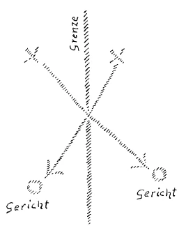

Ich denke, Sie haben gesehen, daß jene bedeutungsvolle Zeitforderung, welche aus der Flut des menschlichen Geschehens heraufsteigt und die man die soziale Bewegung nennt, gerade dort, wo sie am intensivsten bedacht und empfunden wird, nach den eigentümlichen Kräften der Zeit äußerlich behandelt wird, behandelt wird von dem Gesichtspunkte aus, als ob es eigentlich nur eine physische, eine sinnenfällige Welt gäbe. Die soziale Frage ist ja wirksam geworden als proletarische Forderung. Sie lebt in den proletarischen Forderungen in einer gewissen, man möchte sagen, abstrakt-theoretischen Weise, und die Gefahr ist vorhanden, daß die abstrakt-theoretische Weise, die niemals äußere Tatsache werden sollte, eben äußere Tatsache werden kann, oder wenigstens, daß verlangt wird, daß sie es werde. Aber dieses proletarische Bewußtsein, aus dem heraus sich heute die soziale Frage geltend macht, das ist durchaus durchdrungen von dem Glauben bloß an die materielle Welt mit ihrer ethischen Beigabe des bloßen ethischen Utilitarismus, der bloßen Nützlichkeitsmoral. ^wkzjdk

Dies ist eine Tatsache, die eigentlich jeder heute mit Händen greifen kann: daß die Ideen für die soziale Bewegung aus einem gewissen Glauben nur an das materielle Dasein und die Nützlichkeit des menschlichen Lebens und an die Nützlichkeitskräfte des menschlichen Lebens herausgeholt werden. Demjenigen aber, der das Leben durchschaut, ist es ganz besonders bedeutsam, daß die eigentliche Aufklärung über die soziale Frage, namentlich über die Ideen, die für diese soziale Frage in der Gegenwart und der nächsten Zukunft notwendig sind, nicht zu holen ist aus irgendeiner, und sei es noch so wissenschaftlichen Betrachtung der äußeren, physisch-materiellen Welt. ^oie6bv

Dies ist etwas, was die Gegenwart wissen muß, was die Menschen der Gegenwart werden durchdringen müssen. Sie werden durchdringen müssen, daß die soziale Frage nur lösbar ist auf einer spirituellen Grundlage, und daß heute ihre Lösung gesucht wird ohne alle spirituelle Grundlage. Damit ist etwas ungeheuer Wichtiges für unsere Zeit ausgesprochen. Sehen Sie, auf dem ganzen Felde, das man überschauen kann mit dem bloßen Sinnesvermögen und dem Verstande, der an dieses Sinnesvermögen gebunden ist, auf diesem ganzen Felde sind die Ideen, welche der sozialen Bewegung notwendig sind, nicht zu bilden. Diese Ideen liegen, wenn sie in ihrer unmittelbaren Wirkungskraft geschaut werden sollen, durchaus jenseits der Schwelle, die von der physisch-sinnlichen Welt zur übersinnlichen Welt führt. Das Allernotwendigste für die Gegenwart und für die nächste Zukunft in bezug auf die Entwickelung der menschlichen Geschicke ist das Hereinholen gewisser Ideen von jenseits der Schwelle, und die charakteristischste Erscheinung in der Gegenwart ist diese, daß solches Hereinholen von jenseits der Schwelle geradezu abgelehnt wird. Und alle Arbeit auf diesem Gebiete muß durchdrungen sein von dem Willen, zu überwinden diese Abneigung vor einem Hereinholen von sozial wirksamen Ideen von jenseits der Schwelle des physischen Bewußtseins. ^iy6r7j

Es liegt natürlich auf diesem Untergrunde eine außerordentliche Schwierigkeit, eine Schwierigkeit, die einem einfach vor die Seele tritt, wenn man bedenkt, daß, da wir ja im Zeitalter der Bewußtseinsseele leben, also alles eigentlich mehr oder weniger bewußt angestrebt werden soll oder muß, daß es notwendig ist, notwendig für eine wichtige Zeitforderung der Gegenwart, sich bekannt zu machen mit Wahrheiten, die jenseits der Schwelle des physischen Bewußtseins liegen. ^97qoub

Nun kann man ja allerdings sagen: Die wenigsten Menschen der Gegenwart haben eine rechte Würdigung für dasjenige, was jenseits der Schwelle des Bewußtseins liegt. Die wenigsten Menschen der Gegenwart haben eine rechte Würdigung für die Initiation und die Initiationsweisheit, wie sie in der Gegenwart eigentlich herrschen muß oder herrschend werden muß. Jener Fähigkeiten, die in jeder menschlichen Seele liegen und die aus dem Übersinnlichen hereinholen gewisse Ideen, jener Fähigkeiten möchten sich die Menschen der Gegenwart aus der Ihnen oftmals charakterisierten Bequemlichkeit heraus nicht bedienen. Und es ist ja auch so, daß man sagen muß: Es liegt eine durchaus objektive Schwierigkeit auf diesem Gebiete vor. Sie müssen ja nicht vergessen: Ich möchte sagen, in ihrer Urgestalt können die Dinge und Wesenheiten, die jenseits der Schwelle liegen, eben nur von demjenigen beobachtet werden, der diese Schwelle überschritten hat. Aber dieses Überschreiten der Schwelle ist ja ein wichtigstes Ereignis des persönlichen Lebens. Es ist auch ein Ereignis des persönlichen Lebens, das in ein besonderes Licht rückt, wenn man es, wie ich jetzt eben getan habe, in so nahe Beziehung zu bringen hat zu der sozialen Frage. Die soziale Frage, das deutet schon ihr Name an, ist eine Sache von Menschengruppen, Menschenzusammenhängen; das Geheimnis der Schwelle ist eine Sache der Individualität. Man kann sagen: Niemand ist eigentlich unmittelbar in der Lage, wenn er das Geheimnis der Schwelle kennt, es einem andern unmittelbar mitzuteilen. Man kann sogar sagen, daß es eine gewisse Krisis in der menschlichen Seele bedeutet, wenn das Geheimnis der Schwelle aus gewissen Zusammenhängen heraus, die man sonst empfangen hat, einem innerlich aufgeht. ^xl3z2e

Sie oder besser gesagt, diejenigen unter Ihnen, die jahrelang mitgemacht haben die geisteswissenschaftlichen Betrachtungen, insofern sie anthroposophisch orientiert sind, Sie haben ja alle Gelegenheit, sich auf dem Weg zu finden, das Geheimnis der Schwelle zu finden. Sie werden, wenn Sie dem Geheimnis der Schwelle nahekommen, durchaus das Bewußtsein durch die Sache selbst empfangen, daß man zwar über die Wege gut sprechen kann, die zum Geheimnis der Schwelle führen, daß man aber nicht eine unmittelbare Mitteilung über das Geheimnis der Schwelle machen kann. So ist in gewisser Beziehung das Geheimnis der Schwelle individuelle Sache eines jeden einzelnen Menschen, und dennoch liegt die Notwendigkeit vor, daß von jenseits der Schwelle gerade die wichtigsten Ideen für das soziale Werden geholt werden. Heute ist es ja überhaupt mit dem Geheimnis der Schwelle so eine eigene Sache, denn heute ist wenig Vertrauen von Mensch zu Mensch. Das ist ja etwas, was furchtbar geschwunden ist unter den Menschen, das Vertrauen von Mensch zu Mensch, und es stünde um unser soziales Leben ganz anders, wenn nur ein wenig größeres Vertrauen von Mensch zu Mensch vorhanden wäre. So kommt es, daß zu demjenigen, der heute das Geheimnis der Schwelle kennt, der das Geheimnis der Schwelle durch Bekanntwerden mit dem Hüter der Schwelle kennt, ein viel zu geringes Vertrauen sich festsetzt, oder ein falsch gerichtetes, ein falsch orientiertes, ein falsch eingestelltes Vertrauen. ^rau0ms

Es wäre, wie Sie daraus ersehen können, diese Sache eine ziemlich hoffnungslose, wenn nicht etwas anderes der Fall wäre. Denn man könnte sagen: Also kann zum Beispiel die soziale Frage überhaupt nur von Initiierten gelöst werden. — Man wird aber den Initiierten aus dem Mangel an Vertrauen, das heute der Mensch dem Menschen entgegenbringt, eben einfach nicht glauben. Man wird nicht glauben, daß sie die Einsicht in das Leben haben. Dies ist nur auf einem gewissen Gebiete wahrzunehmen, nämlich jenseits der Schwelle, von dem sie nicht unmittelbar von Mensch zu Mensch, wenigstens nicht jederzeit und aus allen Voraussetzungen heraus von Mensch zu Mensch sprechen können. Würde zum Beispiel jemand in unvorsichtiger Weise seine Erfahrungen, die er mit dem Hüter der Schwelle gemacht hat, einem anderen mitteilen, der sie emotionell oder, sagen wir, so aufnimmt, daß er sich nicht stellt in dasjenige Gebiet seiner Seele, in dem er eine bis zu einem gewissen Grad gedrungene Selbstzucht geübt hat, und würde vielleicht sogar ein solcher, der auf diese Weise das Geheimnis der Schwelle mitgeteilt erhielte, dieses Geheimnis der Schwelle weiter ausplaudern, so würde dies zwar ein Übergang des Geheimnisses der Schwelle in das soziale Leben sein, aber es würde eine sehr schlimme Folge haben. Es würde nämlich, was manchmal schon die bloße Mitteilung des Weges zum Geheimnis der Schwelle bewirkt, die Menschen mehr oder weniger in zwei Lager teilen, es würde die Menschen feindlich gegeneinander stellen. Denn während die Ideen, die von jenseits der Schwelle kommen, geeignet sind, wenn sie in ihrer wahren Kraft, in ihrer gereinigten spirituellen Kraft wirken, geradezu soziale Harmonie unter den Menschen zu bewirken, ist es, wenn sie ungeläutert unter die Menschen verstreut werden, so, daß sie Streit und Krieg unter den Menschen bewirken. ^og3ow3

Sie sehen, mit dem Geheimnisse der Schwelle hat es also eine eigentümliche Bewandtnis. Und wäre nicht etwas anderes der Fall, so wäre wirklich jene Hoffnungslosigkeit berechtigt, von der ich Ihnen gesprochen habe. Da aber etwas anderes berechtigt ist, so muß man sagen: Der Weg, den die Zukunft nehmen muß, der kann klar charakterisiert werden. — Es ist ja heute so, daß dasjenige, was sozial fruchtbar ist an Ideen, eigentlich nur gefunden werden kann von den wenigen Menschen, welche sich gewisser spiritueller Fähigkeiten bedienen können, die die weitaus überwiegende Mehrzahl der Menschen heute nicht gebrauchen will, trotzdem sie in jeder Seele liegen, nicht bloß bewußtnicht gebrauchen will, sondern zumeist unbewußt nicht gebrauchen will. Aber diese wenigen, die werden sich die Aufgabe setzen müssen, dasjenige, was sie herausholen aus der geistigen Welt gerade mit Bezug auf soziale Ideen, mitzuteilen. Sie werden es übersetzen in die Sprache, in die eben die geistigen Wahrheiten, die in einer anderen Gestalt jenseits der Schwelle geschaut werden, übersetzt werden müssen, wenn sie populär werden sollen. Sie können populär werden, müssen aber zuerst in eine populäre Sprache übersetzt werden. ^svsj4i

Nach dem allgemeinen Zeitcharakter wird man natürlich solchen in die Geheimnisse der Schwelle Eingeweihten, über die sozialen Ideen Sprechenden, nicht glauben, weil das nötige Vertrauen unter den Menschen nicht da ist. Man wird jede soziale Idee, welche eigentlich keine Wirklichkeit ist, wie Sie aus dem Vorhergehenden ersehen können, jede soziale Idee, die mit dem gewöhnlichen Verstande auf die Sinneswelt gerichtet ist, in der heutigen demokratienärrischen Zeit — wollte sagen: demokratiesüchtigen Zeit — man wird selbstverständlich eine solche rein verstandesmäßig zutage geförderte soziale Idee, die keine ist, für demokratisch gleichwertig halten mit dem, was der Initiierte aus der geistigen Welt herausholt und was wirklich fruchtbar sein kann. Aber würde diese demokratiesüchtige Ansicht oder Empfindung den Sieg davontragen, so würden wir in verhältnismäßig kurzer Zeit eine soziale Unmöglichkeit, ein soziales Chaos im wüstesten Sinne erleben. Aber das andere ist ja eben vorhanden und gilt gerade in hervorragendem Maße für die sozialen Ideen, die von Initiierten von jenseits der Schwelle hergeholt werden. Ich habe es immer wieder und wieder betont: Derjenige, der sich wirklich seines gesunden Verstandes, nicht des wissenschaftlich verdorbenen, aber des gesunden Menschenverstandes bedienen will, der kann jederzeit, wenn er auch nicht finden kann dasjenige, was nur der Initiierte finden kann, er kann es prüfen, er kann es am Leben erproben, und er wird es einsehen können, nachdem es gefunden ist. Und diesen Weg werden für die nächste Zeit die sozial fruchtbaren Ideen zu nehmen haben. Anders wird man nicht vorwärtskommen. Diesen Weg werden die sozial fruchtbaren Ideen zu nehmen haben. Sie werden da und dort auftreten. Man wird zunächst selbstverständlich, solange man nicht geprüft hat, solange man nicht seinen gesunden Menschenverstand darauf angewendet hat, jeden beliebigen marzistischen Gedanken mit einem Gedanken der Initiation verwechseln können. Aber wenn man vergleichen wird, nachdenken wird, wirklich den gesunden Menschenverstand auf die Dinge anwenden wird, dann wird man schon zu der Unterscheidung kommen, dann wird man schon einsehen, daß es etwas anderes ist an Wirklichkeitsgehalt, was aus den Geheimnissen der Schwelle von jenseits der Schwelle hergeholt wird, als dasjenige, was ganz aus der Sinnenwelt herausgeholt ist wie zum Beispiel der Marxismus. ^4yhlsu

Damit habe ich Ihnen zu gleicher Zeit nicht irgendein Programm charakterisiert, denn mit Programmen wird die Menschheit in der nächsten Zeit sehr schlimme Erfahrungen machen; ich habe Ihnen charakterisiert einen positiven Vorgang, der sich abspielen muß. Diejenigen, die aus der Initiation etwas wissen über soziale Ideen, werden die Verpflichtung haben, diese sozialen Ideen der Menschheit mitzuteilen, und die Menschheit wird sich entschließen müssen dazu, über die Sache nachzudenken. Und durch Nachdenken, bloß durch Nachdenken mit Hilfe des gesunden Menschenverstandes, wird schon das Richtige herauskommen. Das ist so außerordentlich wichtig, daß das, was ich eben jetzt gesagt habe, wirklich angesehen werde als eine fundamentale Lebenswahrheit für die nächsten Zeiten, unmittelbar von der Gegenwart schon angefangen! Nicht das ist die Forderung, daß man glauben soll, man könne dies oder jenes aus jeder beliebigen Idee heraus machen, sondern das ist die Forderung, daß man glauben soll: Menschen müssen zusammenarbeiten. Das unmittelbare persönliche Zusammenarbeiten von Menschen ist notwendig, damit unter den Zusammenarbeitenden auch solche sind, die von jenseits der Schwelle her die betreffenden Ideen haben. Sie sehen also, das, was für die Gegenwart wichtig ist, ist nicht etwas, mit dem sich spielen läßt. Es ist eine ungeheuer ernste Sache, die von der Gegenwart aus an die Menschen herantritt. Und man kann sagen: Im weiten Umkreise des Menschenbewußtseins ist noch wenig Sinn vorhanden für den ungeheuren Ernst, der sich gerade mit Bezug auf diese Dinge geltend macht. ^0dezlc

Es liegt eine weitere Schwierigkeit vor, die wenigstens derjenige wissen muß, der von gewissen geisteswissenschaftlichen Betrachtungen bei diesen Dingen ausgehen kann. So wie das soziale Problem in der Gegenwart auftritt, wirkt es als ein internationales Problem. Darinnen liegt ein verhängnisvoller Irrtum, der sich ja auch praktisch in der letzten Zeit dadurch zum Ausdruck gebracht hat, daß ein ganz und gar westwärts, englisch-amerikanisch orientierter Mann wie Lenin im plombierten Wagen unter der Protektion der deutschen Regierung nach Rußland gefahren worden ist, um dort einen solchen Zustand herbeizuführen, mit dem die deutsche Regierung, namentlich in der Persönlichkeit Ludendorffs, glaubte, einen Frieden schließen zu können und sich weiter halten zu können. Das beruht auf dem Irrtum, daß man etwas wirklich Voll-Internationales, was überall anwendbar ist, überhaupt haben könne. Und gerade an dem Leninismus in Rußland ließe es sich studieren, wie unmöglich es ist, auf das russische Volkstum draufzupfropfen etwas völlig aus dem Westen Entsprungenes, das der Westen aber gar nicht haben will. ^t9jqry

Nicht darum wird es sich handeln, wenn die soziale Harmonie gesucht werden muß für die nächste Zukunft, in abstrakter Weise immer wieder und wiederum zurückzukommen darauf, daß alle Menschen einander gleich sind mit Bezug auf das Grundwesen, sondern darauf wird es ankommen, daß die Menschen in ihren Individualitäten sich verstehen lernen müssen auch in den großen, ewigen Kräften, die durch die menschlichen Individualitäten gehen. Heute ist es noch für manche Menschen etwas außerordentlich Aufregendes, wenn man einmal diejenigen Dinge sagt, die ja gerade dazu dienen sollen, daß die Menschen sich besser verstehen lernen. Man kann es heute erleben, daß, wenn man jemandem sagt: Das deutsche Volkstum ist dazu angetan, daß der Volksgeist durch das Ich spricht, während das italienische Volkstum dazu angetan ist, daß der Volksgeist durch die Empfindungsseele spricht —, daß da der Mensch heute dazu in der Lage ist, zu sagen: Nun ja, da wird der Italiener weniger geschätzt, weil die Empfindungsseele weniger ist als das Ich zum Beispiel. - So sagt man. Es ist natürlich ein völliger Unsinn, denn bei diesen Dingen handelt es sich nicht darum, Wertigkeiten aufzustellen, sondern etwas an die Hand zu geben, wobei sich die Menschen über das ganze Erdenrund hin — und die Schicksale der Menschen lassen sich heute nicht anders als nur über das Erdenrund hin ordnen — wirklich verstehen lernen. Von einem gewissen Gesichtspunkte aus ist nichts so Geartetes wertvoller oder wertloser, sondern ein jedes hat seine Aufgabe in der Entwickelung der Menschheit. Und dann ist ja natürlich in jedem Menschen etwas, etwas, das aber natürlich zusammenhängt mit dem Geheimnis der Schwelle, wodurch er sich wieder heraushebt aus solchem Gruppenhaften, was dadurch charakterisiert wird, daß man sagt: Da wirkt die Empfindungsseele, da das Ich, da das Geistselbst und so weiter. - Aber kennen muß man heute diese Dinge, sonst werden die Menschen immer aneinander vorbeigehen und doch nicht viel mehr voneinander wissen, als höchstens Kenntnisse von zweierlei Art: erstens, daß die meisten Menschen die Nase mitten im Gesicht haben, oder daß dasjenige richtig ist, was die Journalisten wissen, wenn sie die Länder bereisen. Beides ist ja eine ungefähr gleich wichtige Wahrheit. ^yy5teq

Das ist es, worum es sich handelt: nicht um ein abstraktes, allgemeines Menschentum, sondern um ein wirkliches Verbinden der Menschen auf Grundlage des Interesses für die besondere individuelle Gestaltung, die ein Mensch dadurch erhält, daß er in ein bestimmtes Volksseelentum hineinversetzt ist. Es ist einmal heute die Zeit gekommen, daß solche Dinge, die nicht nur als unbequem, sondern manchmal sogar als verletzend empfunden werden, populär werden müssen. Man kommt nicht weiter, ohne daß solche Dinge populär werden. Das muß gehörig ins Auge gefaßt werden. Aber alle diese Dinge sind ja so, daß sie wirklich dem gesunden Menschenverstande zugänglich sind. Und wenn nur einmal wenigstens dieses Selbstvertrauen eintreten würde bei einer großen Anzahl von Menschen, dieses Selbstvertrauen, das nicht immer sagt: Ja, ich kann ja doch nicht in die geistige Welt hineinschauen, ich muß doch dem Initiierten nur glauben -, sondern welches sagt: Nun, es wird doch das oder jenes behauptet; ich will aber meinen gesunden Menschenverstand anwenden, um es einzusehen -, wenn dieses Selbstvertrauen, aber wirksam, tatkräftig, nicht bloß abstrakt oder theoretisch, einträte bei einer größeren Anzahl von Menschen, dann wäre es schon gut und dann wäre ungeheuer viel insbesondere für den Weg gewonnen, der gegangen werden muß mit Bezug auf das soziale Problem. Aber das ist gerade der Schaden, daß die Menschen dieses Selbstvertrauen zu ihrem gesunden Menschenverstand mehr oder weniger gerade durch die menschliche Erziehung im neunzehnten Jahrhundert eingebüßt haben. Die schädlichen Eigenschaften, durch die dieses Selbstvertrauen und dadurch der Gebrauch der menschlichen Urteilskräfte eingebüßt worden ist, diese schädlichen Eigenschaften waren in früheren Zeiten auch vorhanden, aber sie waren nicht so schädlich, weil der Mensch nicht im naturwissenschaftlichen Zeitalter lebte, das von ihm notwendigerweise aus gewissen Untergründen heraus verlangt, daß er ein einheitliches Urteilsvermögen wirklich anwendet, daß er seinen gesunden Menschenverstand restlos anwendet. Das aber ist es gerade, was am meisten gefehlt hat in der neueren Zeit. ^kwsqje

Man nimmt gar nicht ernst die Beispiele, die man dafür geben kann. Aber ich will Ihnen ein Beispiel geben, das ich nicht nur verhundertfachen, sondern vertausendfachen könnte. Ich habe eine Abhandlung hier; diese Abhandlung heißt: «Über Tod und Sterben vom rein naturwissenschaftlichen Standpunkte.» Diese Abhandlung ist eine Rede, die Wiedergabe einer Rede, die gehalten wurde in der Aula der Berliner Universität am 3. August 1911 von Friedrich Kraus. Er will naturwissenschaftlich über die Probleme von Tod und Sterben sprechen und sagt da allerhand auf 26 Seiten. Diese Rede, die zur Gedächtnisfeier des Stifters der Berliner Universität, König Friedrich Wilhelm III., gehalten wurde — immer wurde solch eine Rede gehalten, und solche Reden geschehen auch an anderen Universitäten -, diese Rede hat selbstverständlich auch einen Anfang, und diesen Anfang, den will ich Ihnen vorlesen. Also eine Abhandlung «Über Tod und Sterben», die in streng naturwissenschaftlichem Sinne gehalten war, wenigstens nach der Meinung des Vortragenden, nach der Meinung der um die Magnifizenz herumstehenden Dekane und Senatoren und der anderen erlauchten Herren der Wissenschaft, und diese Rede beginnt: «Hochansehnliche Versammlung! Verehrte Kollegen! Kommilitonen! Die Berliner Universität feiert heute ihre Stiftung und ihren königlichen Stifter. Die Redner, welche alljährlich zu dieser Stunde das Wort nehmen, gedenken, in der Erinnerung unseres Ursprungs, gewöhnlich der schweren Zeiten, aus deren Not diese Universität hervorging, und des wahrhaft königlichen Wortes vom Ersatz verlorener physischer durch geistige Kräfte. Heute, in einer Zeit machtvollen Gedeihens, wo des Kaisers starker Arm unsern Frieden in Ehren schirmt, können wir es ruhig erwägen, daß auch das Leben einer Nation mit kräftigstem Herzschlag in Wellen des Hoch- und Niedergehens verläuft.» ^1dj44s

Nun, heute sorgen ja die Ereignisse für die Richtigstellung dieser Dinge; heute sorgen die Ereignisse für die Richtigstellung eines solchen Satzes: «Heute, in einer Zeit machtvollen Gedeihens, wo des Kaisers starker Arm unsern Frieden in Ehren schirmt»! Aber, was sollte in einer solchen Sache der gesunde Menschenverstand sagen? Der gesunde Menschenverstand sollte sagen: Ein Mensch, der in der Lage ist, dieses zu sprechen, was nichts weiter ist als eine große Torheit, von dem muß auch alles übrige, was da über Tod und Sterben gesagt wird, als ein törichtes Zeug angesehen werden. Aber wer entschließt sich zu einer solchen Gesundheit des gesunden Menschenverstandes? Sie sehen also, nicht darum handelt es sich, daß der gesunde Menschenverstand nicht fähig wäre, zu entscheiden, sondern darum handelt es sich, daß man am Gebrauche des gesunden Menschenverstandes aus gewissen Grundeigenschaften der Gegenwart heraus vorbeigeht. Diese Dinge müssen gut ins Auge gefaßt werden. ^7puq35

Die Berliner Akademie der Wissenschaften ist von dem großen Philosophen Leibniz gegründet. Das ist ein Beispiel. Man könnte andere Beispiele anführen, die ähnlich charakterisiert werden müßten, von meinetwegen München, Heidelberg. Ein Land will ich auslassen aus einer gewissen Courtoisie heraus — nun, so sagt man heute nicht, also aus einer gewissen Empfindung heraus. Ich will also sagen: Man könnte ähnliches finden in Paris, in London, in Washington und so weiter, in Rom selbstverständlich, in Bologna und so fort. Leibniz hat unter dem Kurfürsten Friedrich die Berliner Akademie der Wissenschaften zu gründen unternommen. Nun ja, es war eine gute Absicht. Sie ließ sich aber nur dadurch verwirklichen, daß sich Leibniz der große Philosoph, herablassen mußte, den Kurfürsten -— der das, was Leibniz da sagte, allerdings ganz und gar nicht war — zu vergleichen mit dem König Salomo und ihn den preußischen König Salomo zu nennen. Ja, er mußte sogar die Kurfürstin mit der Königin von Saba vergleichen. Aber diese Berliner Akademie der Wissenschaften, die der große Du Bois-Reymond «das geistige Leibregiment des Hauses Hohenzollern» genannt hat, hat ihr tragikomisches Schicksal mit diesem Schicksal nicht etwa schon erfüllt gehabt. Denn Friedrich Wilhelm I. hat eines Tages gefunden, daß der Professor Gundling zu viel Gehalt bekommt, namentlich weil er zu gescheit ist, zu viel Gehalt bekommt. Da hat er ihn brotlos gemacht, hat ihn davongejagt, und da war der Professor Gundling genötigt, in allerlei Wirtshäusern den Leuten so etwas Varietéhaftes vorzumachen, seine besonderen Anlagen, den Leuten etwas vorzumachen, zu einer Art Varietevorstellung zu benützen. Das hörte dann der König Friedrich Wilhelm I., und da fing ihn der Gundling an etwas zu interessieren, den er früher davongejagt hat. Da machte er ihn zu einem Hofnarren, und jetzt gab er ihm wieder Gehalt. Aber er sagte: Der Hofnarr kann auch etwas anderes dabei besorgen -, da machte er ihn zum Präsidenten der Akademie der Wissenschaften. So daß in der Tat der Professor Gundling der Präsident der Akademie der Wissenschaften ward. Aber das ist nicht nur eine einzelne Tatsache, die aus einer einzelnen Schrulle etwa hervorgegangen ist, sondern noch Friedrich der Große, der dann den Voltaire an die Akademie der Wissenschaften in Berlin berufen wollte, der hörte von dem Gehalt, welches Voltaire verlangte für seinen Eintritt in die Akademie der Wissenschaften; da sagte er: Dies Gehalt ist für einen Hofnarren viel zu groß. — Also, es handelte sich darum, die ganze Akademie der Wissenschaften von der Gesinnung aus, daß man es mit Narren zu tun hat, zu behandeln. ^93ss37

Man muß schon auf solche Dinge hinweisen können, wenn man darauf aufmerksam machen will, was für eine Diskrepanz in den Ereignissen drinnenliegt, daß aus einem gewissen Fürstenhause heraus die Gelehrten den Hofnarren an die Seite gestellt werden, in aller Realität, und nachher die Gelehrten so quittieren wie das eine Exemplar, von dem ich Ihnen jetzt eben vom Jahre 1911 erzählt habe. Es handelt sich eben wirklich darum, daß man nicht zu gesundem Menschenverstand kommen kann, wenn man nicht den Willen hat, die Wirklichkeit ungeschminkt wirklich anzusehen, nachzugehen den Dingen, die einem zugänglich sind. Und nachzugehen den Dingen auf einem oder auf dem anderen Gebiete ist eigentlich jedem Menschen etwas, was ihn schulen kann mit Bezug auf Wirklichkeitssinn, mit Bezug auf alles dasjenige, was einem gesunder Menschenverstand gibt. Hat man — man hat natürlich, selbstverständlich, ich werde nicht so unhöflich sein, irgend jemand den gesunden Menschenverstand abzusprechen, denn ich glaube ja gerade, daß ihn jeder Mensch hat -, aber hat man die Handhabe, den Willen zum Gebrauch des gesunden Menschenverstandes, so kann man das nur dadurch haben, daß man den Dingen auf irgendeinem Gebiete ganz vorurteilslos und unbefangen zu Leibe geht. Versuchen Sie sich nur einmal klarzumachen, daß das eine Schwierigkeit ist, aber eine überwindliche Schwierigkeit. Versuchen Sie nachzudenken, wie viel in Ihnen steckt von nationalen oder sonstigen menschlichen Vorurteilen, die Sie hindern, den Dingen unbefangen und vorurteilslos zu Leibe zu gehen. Zu diesen Selbstbetrachtungen muß man schon den guten Willen haben, sonst kann man nie und nimmer irgendein vernünftiges Wort mitreden, wenn es sich darum handelt, zu entscheiden: Welche Ideen sind sozial fruchtbar für die Gegenwart und nächste Zukunft, und welche Ideen sind nicht sozial fruchtbar? ^bybqsl

Betrachten wir, nachdem wir dies, ich möchte sagen, mehr zur Charakteristik der Gesinnung als zur Charakteristik irgendwelcher theoretischer Grundlage aufgestellt haben, betrachten wir von diesem Gesichtspunkte aus rhapsodisch, aphoristisch manche Einzelheiten, die uns wichtig sein können zum Verständnis und zu unserem Tun in der Gegenwart und in der nächsten Zukunft. Ich will ausgehen von einer der Grundideen, die im modernen Proletariate wirklich mit großer Intensität verankert sind. Aus dem Marxismus heraus hat dieses moderne Proletariat die Empfindung gesogen, daß im wirklichen Fortgang der Menschheit die Meinung des einzelnen Menschen, die Meinung der einzelnen Individualität eigentlich keine Bedeutung hat. Die Meinung der einzelnen Individualität hat nur für diejenigen Dinge eines Menschen eine Bedeutung, die seine Privatangelegenheiten sind — so meint die proletarische Weltanschauung von heute —, aber alles, was geschichtlich wird, geschieht aus notwendigen wirtschaftlichen Untergründen heraus, wie ich sie Ihnen vorgestern charakterisiert habe. Das war gerade der Gegensatz, in den ich zu dem modernen Proletariat gekommen bin durch meine «Philosophie der Freiheit», daß da verlangt wird, alles zu bauen gerade auf die menschliche Individualität, auf den Inhalt und die Tatkraft der menschlichen Individualität, der diese modernen proletarischen Ideen gar keine Bedeutung beimessen, sondern die nur den Menschen als soziales Tier, als Gesellschaftswesen gelten lassen wollen. Die Gesellschaft bewirkt alles, was in der Geschichte irgendeinen Werdecharakter hat, was in der Geschichte irgendwie fruchtbar ist. Dasjenige, was ein Minister oder ein Fabrikherr oder irgendein anderer macht aus seiner Individualität heraus - so denkt der Proletarier —, das hat innerhalb der vier Wände seines Hauses oder an seinem Skat-Tisch oder wo er sonst ein Privatmensch ist, eine Bedeutung, das hat eine Bedeutung für sein Amusement, das hat eine Bedeutung für die persönlichen Beziehungen, die er zu dem oder jenem Menschen anknüpft; was aber wird durch ihn als der Menschheit angehörig, das stamme nicht aus seiner Individualität, sondern das stamme aus dem ganzen gesellschaftlichen Klassen-Zusammenhang und so weiter, wie ich es Ihnen charakterisiert habe. ^t62a5s

Diese Idee ist fest verankert in dem modernen Proletariat. Sie hängt innig zusammen mit dem Unglauben des modernen Proletariats an den einzelnen Menschen und seine Einsicht. Es hilft nämlich dem modernen Proletariat gegenüber nicht so leicht, wenn der Einzelmensch diesem Proletariat irgendwelche Erkenntnisse mitteilt, denn dieses Proletariat sagt dann: Was der einzelne denkt, hat ja doch nur für ihn einen Privatwert; nur dasjenige, was er sagt als Angehöriger einer Klasse, meinetwillen als Angehöriger des Proletariats selber, was also jeder sagen kann, das hat einen wirklichen äußeren Gesellschaftswert. Es ist verbunden mit den Ideen des modernen Proletariats ein furchtbares Nivellement mit Bezug auf die menschliche Individualität, ein absoluter Unglaube an diese menschliche Individualität. Daraus werden Sie sehen, wie ungeheuer schwierig es ihm wird, sich zu durchdringen mit dem, was aus dem Allerindividuellsten herauskommt, nämlich mit den wirklich fruchtbaren sozialen Ideen. Aber in unserer Zeit ist der Werdegang der Ereignisse selber dazu angetan, solche großen welthistorischen Vorurteile -— denn wenn Millionen sich dazu bekennen, so kann man sprechen von welthistorischen Vorurteilen — durch die Tatsachen, durch die Wirklichkeit zu widerlegen. Es könnte keine stärkere Widerlegung geben für die proletarische Theorie, die alles Werden aus der Verelendung der Masse, kurz aus sozialen Erscheinungen ableiten will, aus den notwendig von Zeit- zu Zeitperiode eintretenden wirtschaftlichen Krisen und so weiter — daraus, meint sie, ginge der Werdegang der Dinge hervor, nicht aus dem, was die Menschen meinen oder erkennen -, es könnte keine stärkere Widerlegung dieses Prinzips, dieses welthistorischen Vorurteils geben, als gerade durch die in den neuesten Ereignissen gegebene Tatsache, daß letzten Endes — ich sage, letzten Endes allerdings, aber dieses «letzten Endes» hat gerade für diese Weltkatastrophe eine große Bedeutung — von ganz wenigen Menschen die Entscheidung dieser Weltkatastrophe abhing. Von ganz wenigen Menschen. Dasjenige, was geworden ist, hing zuletzt an dem Faden der Ängste, der Beargwöhnungen, der Aspirationen von ganz wenigen Menschen. Und man kann sagen: Wie Herden sind von ganz wenigen Menschen Millionen anderer Menschen in diese Katastrophe hineingetrieben worden. — Das ist leider die traurige Wahrheit, die sich dem darbietet, der aus der Wirklichkeit heraus die Verhältnisse der Gegenwart durchschaut. ^nay0k8

Nicht wahr, jetzt wird den Leuten ein bißchen klar, was alles von dem in so vieler Richtung außerordentlich bornierten Willen Ludendorffs abhing. Denken Sie nur einmal, wie leicht so etwas verborgen bleiben könnte! Es wäre ja der Fall denkbar, durchaus denkbar, daß es nicht zu dieser furchtbaren Katastrophe der Gegenwart mit all ihren schrecklichen Folgen gekommen wäre, und daß dann Ludendorffs merkwürdige Handlungsart nicht an den Tag gekommen wäre. Da ist es an den Tag gekommen. Andere Staatsmänner, die durchaus nicht den Mittelmächten angehören, sie werden vielleicht bei der nächsten Wahl durchfallen, ins Privatleben zurücktreten; man wird dieses Ereignis besprechen, gleichgültig, aber man wird bei ihnen nicht darauf kommen, daß sie der Menschheit ebenso geschadet haben wie dieser Ludendorff. Das ist auch ein Kapitel, welches zur Ausbildung des gesunden Menschenverstandes gehört, weil man leicht vorbeigeht an dem gesunden Menschenverstand eben aus der Anbetung des Erfolges oder aus irgend anderem heraus. Derjenige, der den gesunden Menschenverstand hat, wird sich nicht dazu bewegen lassen, Woodrow Wilson, nein, ich meine diejenigen Menschen, die vor Woodrow Wilson heute kriechen — und schließlich, wie wenige tun es nicht! -, diejenigen Menschen, die vor Woodrow Wilson heute kriechen, anders anzusehen als jenen Professor Kraus, der 1911 den Satz, den ich Ihnen vorgelesen habe, gesprochen hat. Das ist es, was man ja möchte: die Menschen anregen zum Gebrauche ihres gesunden Menschenverstandes. Natürlich hängt das innig zusammen mit dem Willen, Tatsachen ins Auge zu fassen. Ein ungeheurer Schaden für die Gegenwart ist es, daß sich die unpraktischesten Leute heute eben gerade als die stärksten Praktiker fühlen. Was hat sich nicht außerordentlich praktisch gefühlt, sagen wir auf dem Gebiete des Militarismus der Mittelmächte! Die Leute haben sich ungeheuer praktisch gefühlt und waren die größten Illusionäre, waren die größten Phantasten, haben fast über alle Dinge, die geschehen sind im Laufe der letzten, nun, ich will sagen, zweieinhalb Jahre, namentlich nicht nur unrichtige, sondern grotesk unrichtige Urteile gefällt und aus diesen grotesk unrichtigen Urteilen heraus gehandelt. ^7rzo09

Es ist schwierig, wenn man sieht, wie die Menschen, die eigentlich gute Menschen sind, oftmals in dem Sinne wie man das so nennt, gute Menschen sind, gar nicht herankommen lassen an sich den gesunden Menschenverstand. In dieser Beziehung konnte man wiederum im Laufe der letzten vier Jahre die übelsten Erfahrungen machen, wenn man so sah, was zum Beispiel in den letzten Jahren geschehen ist in Deutschland von Offizieren, die die Volksbildung leiten wollten, die dem Volk einbleuen wollten, wie es zu denken habe, damit alles richtig geht, damit auch die Menschen hinter der Front «durchhalten», wie man das so schön spießig nannte. Es war furchtbar. Wenn man dann einen genaueren Einblick hatte in das, was dann den Leuten eingebleut werden sollte, und was diejenigen, die es einbleuten, oftmals mit dem allerbesten Willen vorbrachten - es war wahrscheinlich, in Wirklichkeit meinetwillen, die Sache in ihrer Art ehrlich, aber sie wollten sich ihres gesunden Menschenverstandes nicht bedienen. Und darauf kommt es an. Und das ist für die Gegenwart das ungeheuer Wichtige, denn dieser gesunde Menschenverstand muß überall auf die Wirklichkeit hinsehen, muß nicht, weil er irgend etwas aus einem Vorurteil heraus unangenehm empfindet, es ablehnen. Nicht wahr, wir haben in unserer Zeit die groteske Zusammenstellung erlebt des fast schon an den Absolutismus grenzenden monarchischen Prinzips mit der Ludendorfferei — mit dem Leninismus in Rußland, mit dem Bolschewismus, denn der Bolschewismus ist eigentlich ein Geschöpf Ludendorffs. Der Bolschewismus ist von Ludendorff in Rußland erzeugt worden, weil Ludendorff meinte, mit niemandem anderen in Rußland Frieden schließen zu können als mit den Bolschewisten, so daß nicht nur dasjenige, was als Unglück über das deutsche Volk hereingebrochen ist, in vieler Beziehung von einem einzelnen Menschen im Laufe von zweieinhalb Jahren bewirkt worden ist, sondern daß auch das Unglück Rußlands in vieler Beziehung mit den grotesken Irrtümern dieses einzelnen Menschen zusammenhängt. Diese Dinge zeigen, wie kolossal der Irrtum des Proletariats ist, daß die Meinung des einzelnen Menschen keine Bedeutung habe in der sozialen Gestaltung der Verhältnisse. Diese Dinge müssen eben ganz objektiv mit dem gesunden Menschenverstand durchschaut werden. ^hymfyr

Wenn wir von dieser Gesinnung ausgehen, so finden wir namentlich einen Satz, den ich Sie bitte, sich recht zu Herzen zu nehmen, denn dieser eine Satz kann unter anderem Richtkraft für soziales Denken in der Zukunft geben. Dieser eine Satz ist der: Man reicht aus, ohne daß man Ideen hat, in Zeiten von Revolutionen und Kriegen, man kann aber nicht ausreichen ohne Ideen in Zeiten des Friedens; denn werden die Ideen in Zeiten des Friedens rar, dann müssen Zeiten von Revolutionen und von Kriegen kommen. — Zum Kriegführen und zu Revolutionen braucht man keine Ideen. Um den Frieden zu halten, braucht man Ideen, sonst kommen Kriege und Revolutionen. Und das ist ein innerer spiritueller Zusammenhang. Und alle Deklamationen über den Frieden nützen nichts, wenn nicht diejenigen, die die Geschicke der Völker zu leiten haben, sich bemühen, gerade in Friedenszeiten Ideen zu haben. Und sollen es soziale Ideen sein, so müssen sie sogar von jenseits der Schwelle herrühren. Wird eine Zeit ideenarm, so schwindet aus dieser Zeit der Friede. ^lj478c

Man kann so etwas sagen; wenn die Menschen es nicht prüfen wollen, so werden sie es einfach nicht glauben. Aber an dem Unglauben an solche Dinge hängt das furchtbare Geschick der Gegenwart. Das ist ein solcher Richtsatz, den aufzunehmen außerordentlich wichtig ist für die Gegenwart und die nächste Zukunft. Einen anderen Richtsatz finden Sie in der angefangenen Abhandlung über «Theosophie und soziale Frage», die ich vor Jahren in «Lucifer-Gnosis» veröffentlicht habe, einen Richtsatz, von dem ich mich überzeugt habe, daß er von den wenigsten Menschen mit dem vollen Gewicht genommen wird. Ich habe da auf etwas aufmerksam zu machen versucht, was als ein soziales Axiom wirken soll. Darauf habe ich aufmerksm gemacht, daß schon einmal in jeglicher sozialer Struktur nichts Gedeihliches herauskommen kann, wenn das Verhältnis eintritt, daß der Mensch für seine unmittelbare Arbeit entlohnt wird. Soll eine gedeihliche soziale Struktur herauskommen, so darf das nicht sein — lesen Sie den Aufsatz, er wird ja doch noch zu haben sein —, so darf das nicht sein, daß der Mensch bezahlt wird für seine Arbeit. Die Arbeit gehört der Menschheit, und die Existenzmittel müssen den Menschen auf anderem Wege geschaffen werden als durch Bezahlung seiner Arbeit. Ich möchte sagen, wie ich es schon in jener Abhandlung getan habe: Wenn gerade das Prinzip des Militarismus, aber ohne Staat, übertragen werden würde auf einen gewissen Teil — ich will gleich von diesem Teil sprechen — der sozialen Ordnung, dann würde ungeheuer viel gewonnen werden. — Aber zugrunde liegen muß eben die Einsicht, daß gleich Unheil da ist auf sozialem Boden, wenn der Mensch so in der Sozietät drinnensteht, daß er für seine Arbeit, je nachdem er viel oder wenig tut, also nach seiner Arbeit eben, bezahlt wird. Der Mensch muß aus anderer sozialer Struktur heraus seine Existenz haben. Der Soldat bekommt seine Existenzmittel, dann muß er arbeiten; aber er wird nicht unmittelbar für seine Arbeit entlohnt, sondern dafür, daß er als Mensch an einer bestimmten Stelle steht. Darum handelt es sich. Das ist es, was das notwendigste soziale Prinzip ist, daß das Erträgnis der Arbeit von der Beschaffung der Existenzmittel völlig getrennt wird, wenigstens auf einem gewissen Gebiete des sozialen Zusammenhangs. Solange nicht diese Dinge klar durchschaut werden, solange kommen wir zu nichts Sozialem, solange werden Dilettanten, die manchmal aber Professoren sind, wie Menger, von «vollem Arbeitsertrag» und dergleichen sprechen, was alles Wischiwaschi ist. Denn gerade der Arbeitsertrag muß von der Beschaffung der Existenzmittel in einer gesunden sozialen Ordnung völlig getrennt werden. Der Beamte, wenn er nicht durch den Mangel an Ideen Bureaukrat würde, der Soldat, wenn er nicht durch den Mangel an Ideen Militarist würde, ist in gewisser Beziehung — in gewisser Beziehung, mißverstehen Sie mich nicht — das Ideal des sozialen Zusammenhanges. Und kein Ideal des sozialen Zusammenhanges, sondern der Widerpart des sozialen Zusammenhanges ist es, wenn dieser soziale Zusammenhang so ist, daß der Mensch nicht arbeitet für die Gesellschaft, sondern für sich. Das ist die Übertragung des unegoistischen Prinzips auf die soziale Ordnung. Wer nur in sentimentalem Sinne Egoismus und Altruismus versteht, der versteht eigentlich nichts von den Dingen. Derjenige aber, der praktisch, ohne Sentimentalität, mit reinem gesundem Menschenverstand durchschaut, daß jede Sozietät notwendigerweise zugrunde gehen muß, indem der Mensch nur für sich selber arbeitet also rein das, mit anderen Worten, was in der sozialen Ordnung egoistisch gestaltet ist—, der weiß das Richtige. ^lpmkx3

Das ist ein Gesetz, so sicher wirksam, wie die Gesetze der Natur wirken, und man muß dieses Gesetz einfach kennen. Man muß einfach die Möglichkeit besitzen, den gesunden Menschenverstand so zu handhaben, daß einem ein solches Gesetz als ein Axiom der sozialen Wissenschaft erscheint. Man ist heute noch weit entfernt davon, so etwas einzusehen. Aber die Gesundung der Verhältnisse hängt doch ganz und gar davon ab, daß geradeso, wie jemand den pythagoräischen Lehrsatz in der Mathematik als etwas Grundlegendes ansieht, er diesen Satz zugrunde legt der sozialen Struktur: Alles Arbeiten in der Gesellschaft muß so sein, daß der Arbeitsertrag der Sozietät zufällt und die Existenzmittel nicht als Arbeitsertrag, sondern durch die soziale Struktur geschaffen werden. ^ybve09

Solche sozialen Axiome gibt es natürlich eine ganze Anzahl, denn das soziale Leben ist natürlich kompliziert. Aber wir stehen heute einmal vor der Notwendigkeit, auf irgendeine Weise daran zu denken, wie die soziale Struktur der menschlichen Entwickelung in gesunde Bahnen gebracht werden soll. Da muß man vor allen Dingen einen gesunden Blick haben für die Partien, für die Teile, für die Glieder des sozialen Lebens. Man muß in gesunder Weise auseinanderhalten können die verschiedenen Glieder des sozialen Lebens. Sehen Sie, bei all den Dingen, um die es sich heute handelt, kommt es nicht so sehr darauf an, daß man auf die Schlagworte hört, die, sei es von bolschewistischer, sei es von der Entente-Seite her kommen, denn das sind ja heute fast Gegensätze, nicht wahr, sondern darauf kommt es an, daß man einsieht, was der Menschheit nottut, daß man ein gesundes Urteil für die Gliederung des sozialen Lebens sich aneignet. Natürlich, soziales Leben muß da sein. Und gerade, weil soziales Leben da sein muß, deshalb hängen die Menschen so sehr an der mongolischen — nun, verzeihen Sie, es ist Ja nur symptomatisch gemeint -, an der mongolischen Staatsidee, an der Allmacht des Staates, weil sich die Menschen vorstellen: Was der Staat nicht tut, das kann gar nicht zum Heile der Menschen geschehen. — Es ist übrigens diese Ansicht noch nicht so sehr alt. Denn es war das neunzehnte Jahrhundert schon ziemlich weit herangerückt, da hat ein einsichtiger Mann die schöne Abhandlung geschrieben: «Ideen zu einem Versuch, die Grenzen der Wirksamkeit des Staates zu bestimmen.» Es war ein preußischer Minister, Wilbelm von Humboldt. Diese Abhandlung lag mir ganz besonders deshalb am Herzen, weil in den neunziger Jahren und noch etwas in das zwanzigste Jahrhundert herein gerade meine «Philosophie der Freiheit» — nicht durch meinen Willen, aber durch andere — immer unter die Literatur «individualistischer Anarchismus» gestellt wurde. Das erste Werk war immer Wilhelm von Humboldts «Grenzen der Wirksamkeit des Staates zu bestimmen», als das letzte Werk war gewöhnlich immer meine «Philosophie der Freiheit», zeitlich angeordnet, eingereiht worden. Nun, Sie sehen, es ist möglich gewesen, registriert zu werden unter «individualistischer Anarchismus», aber immerhin zusammen mit einem preußischen Minister! ^uua0qt

Soziale Gestaltung, soziale Struktur muß da sein, aber sie kann nicht uniformiert werden. Sie kann nicht so gemacht werden, daß alles gewissermaßen unter einen Hut gebracht wird. Was heute nottut, was das Wichtige ist, hätte in einer bestimmten Gestalt geschehen können vor langer Zeit schon, hätte auch während dieser Kriegskatastrophe entstehen können, kann auch jetzt entstehen, aber immer modifiziert. Denn Sie müssen nicht vergessen, daß die Welt in den letzten Wochen für Mitteleuropa eine andere geworden ist, und daß das eine auf das andere wirkt. Nun, ich habe mich bemüht die ganzen Jahre her, da oder dort Verständnis zu erwecken für diejenige Form, die zum Beispiel von Mitteleuropa aus wirksam nach Osteuropa — denn die Entente ist nicht belehrbar, selbstverständlich, und sollte auch nicht belehrt werden -, die für Mittel- und Osteuropa wirksam sein soll; ich habe mich bemüht, das geltend zu machen. Da handelt es sich darum, daß man, wenn man so etwas geltend machen will, das Leben, das die Menschen zusammen führen müssen, in der richtigen Weise gliedern muß. Als diese Ideen, nun, sagen wir, Staatsmännern vorgelegt wurden — ich kann Ihnen diese Ideen nur kurz skizzieren; dasjenige, um was es sich handelt, ist, daß sie immer mehr individualisiert werden müssen -, als diese Ideen einem Staatsmanne vorgelegt wurden vor einiger Zeit, wo es ohnedies schon ziemlich zu spät war für die damalige Gestalt, die ich diesen Ideen gegeben hatte, da habe ich aber immerhin dem Herrn gesagt: Wenn er irgendwie daran dächte, an diese Ideen heranzutreten, so würde ich natürlich gern bereit sein, auch für die Zeit, die damals die Gegenwart war, sie in entsprechender Weise umzuarbeiten. — Heute müßten sie selbstverständlich wiederum für die besonderen Verhältnisse umgearbeitet werden. Da handelt es sich darum, daß man wirklich appellieren muß an den gesunden Menschenverstand, wenn man solche Ideen zunächst gibt. Dann handelt es sich darum, daß jemand einsehen kann, daß das soziale und sonstige menschliche Zusammenleben wirklich richtig gegliedert wird. Die Frage entsteht als Hauptfrage: Wie muß man unterscheiden in dem, was Menschen als gemeinschaftliches Leben führen? — Und da handelt es sich darum, daß man drei Glieder unterscheiden muß. Ohne diese Unterscheidung geht es nicht, und keine Vorwärtsentwickelung von der Gegenwart aus in die nächste Zukunft wird kommen, ohne daß diese dreigliedrige Unterscheidung gemacht wird. Da handelt es sich darum, daß erstens einmal es mag die soziale Gruppe, die da vorliegt, so oder so gestaltet sein, klein oder groß sein, darauf kommt es nicht an -, aber daß irgendeine soziale Gruppe so gestaltet sein muß, daß darinnen in bezug auf Sicherheit des Lebens und Sicherheit nach außen Ordnung herrscht. Der Sicherheitsdienst im weitesten Umfange gedacht — ich muß solche umfassenden Worte gebrauchen -, das ist das eine Glied. Dieser Sicherheitsdienst ist aber auch das einzige Glied, welches in das Licht der Idee der Gleichheit gelenkt werden kann. Dieser Sicherheitsdienst, alles Polizeilich-Militärische, wenn ich jetzt im alten Sinne sprechen will, der ist auch das einzige, was im Sinne zum Beispiel eines demokratischen Parlamentes behandelt werden kann. Mitbestimmend an diesem Sicherheitsdienst kann jeder Mensch sein. Es muß also ein Parlament geben, wie die soziale Gruppe auch beschaffen ist, in dem Abgeordnete, meinetwillen nach ganz allgemeinem, geheimem, direktem Wahlrecht sein können, welche die Gesetze und alles das zu bilden haben, was für diesen Sicherheitsdienst bestimmt ist. Denn das, dieser Sicherheitsdienst, ist ein Glied der Ordnung, aber er muß abgesondert von dem übrigen behandelt werden und nur von höherem Gesichtspunkte aus dann wiederum harmonisiert werden mit anderem. ^0qtc6e

Ein zweites, das aber ganz abgesondert werden muß von all dem, was Sicherheitsdienst ist, Sicherheit im Innern und Sicherheit nach außen, was auch nicht nach der Idee der Gleichheit behandelt werden kann, das ist dasjenige, was die eigentliche wirtschaftliche Gestaltung der sozialen Gruppen ist. Diese wirtschaftliche Gestaltung, die darf nicht im unmittelbaren Zusammenhange stehen mit dem, was ich als erstes Glied genannt habe, sondern sie muß für sich behandelt sein. Sie muß ihr eigenes Ministerium, ihr eigenes Volkskommissariat — heute sagt man Volkskommissariat — haben, das vollständig unabhängig von dem Ministerium, vom Kommissariat des Sicherheitsdienstes sein muß. Sie muß ihr eigenes Ministerium haben, das vollständig unabhängig ist, das nach rein ökonomischen Gesichtspunkten gewählt wird, so daß Leute in diesem ökonomischen Ministerium sind, die etwas von den einzelnen Zweigen verstehen, sowohl als Produzenten wie als Konsumenten. Nach ganz anderen Gesichtspunkten muß sowohl parlamentarisch wie ministeriell dieses zweite Glied der sozialen Ordnung gelenkt werden. Das erste Glied kann also, sagen wir, in die Demokratie eingestellt werden; wenn es nach dem Geschmack besser ist, könnte es auch in das Konservative eingestellt werden. Das kommt ganz darauf an; wenn es ordentlich gemacht wird, wird es schon etwas werden, und das andere ist Geschmacksache. Dasjenige, worauf es ankommt, ist diese Dreiheit. Denn auf dem Gebiete des wirtschaftlichen Lebens muß Brüderlichkeit herrschen. Geradeso wie alles auf dem Gebiete des Sicherheitsdienstes gerückt werden muß unter den Gesichtspunkt der Gleichheit, so muß auf dem Gebiete des wirtschaftlichen Lebens überall die Maxime der Brüderlichkeit herrschen. ^3jp9cg

Dann gibt es ein drittes Gebiet, das ist das Gebiet des geistigen Lebens. Zu dem rechne ich alles Religionstreiben, das gar nichts zu tun haben darf mit demjenigen, was Sicherheitsdienst ist und wirtschaftliches Leben; dazu rechne ich allen Unterricht, dazu rechne ich alle übrige freie Geistigkeit, allen wissenschaftlichen Betrieb, und dazu rechne ich auch alle Jurisprudenz. Ohne daß die Jurisprudenz dazu gerechnet wird, ist alles übrige falsch. Sie kommen sogleich zu einer widersinnigen Dreigliederung, wenn Sie nicht so gliedern: Sicherheitsdienst nach dem Prinzip der Gleichheit, wirtschaftliches Leben nach dem Prinzip der Brüderlichkeit, die Gebiete, die ich eben aufgezählt habe: Jurisprudenz, Unterrichtswesen, freies geistiges Leben, religiöses Leben, unter dem Gesichtspunkte der Freiheit, der absoluten Freiheit. Wiederum muß aus absoluter Freiheit die notwendige Verwaltung dieses dritten Gliedes der gesellschaftlichen Ordnung hervorgehen. Und der notwendige Ausgleich, der kann erst durch den freien Verkehr der diese drei Glieder Leitenden und Bestimmenden gesucht werden. Auf dem Gebiete des geistigen Lebens, zu dem eben die Jurisprudenz gehört, wird sich ja nicht so etwas herausstellen, wenn es wirklich einmal durchgeführt würde, wie ein Ministerium oder Parlament, sondern etwas viel freieres; es wird die Struktur ganz anders verlaufen. ^ccqnrt

Zu dem, was da angestrebt werden muß, müssen natürlich Übergangsformen sein. Aber das sollte den Menschen einleuchten. Und nicht früher kommen wir zu einer Gesundung, bevor es den Menschen einleuchtet, daß in dieser Weise diese Dreigliederung, von der ich gesprochen habe, zugrunde liegen muß, daß alles so gedacht werden muß, daß man nicht einen uniformierten Staat beibehalten kann. Denn die Staatsidee ist unmittelbar nur anzuwenden auf den ersten Teil, auf den Sicherheits- und Militärdienst. Was unter Staatsomnipotenz gestellt wird außer Sicherheits- und Militärdienst, das steht auf ungesunder Basis, denn das wirtschaftliche Leben muß auf rein, sei es korporativer, sei es auf assoziativer Basis aufgebaut werden, wenn es sich gesund entwickeln will. Und das geistige Leben einschließlich der Jurisprudenz ist nur dann auf gesunder Basis aufgebaut, wenn der einzelne vollständig frei ist. Er muß frei sein in bezug auf alles andere. Er muß auch, meinetwillen von fünf zu fünf, von zehn zu zehn Jahren seinen Richter bestellen können, der sowohl sein Privat-, wie sein Strafrichter ist. Ohne das geht es nicht, ohne das kommen Sie zu keiner entsprechenden Struktur. Diese nationalen Fragen hätten ohne territoriale Verschiebungen gelöst werden können! Das sagt Ihnen ein Mann, der studiert hat an den schwierigen österreichischen Verhältnissen, wo dreizehn verschiedene Amtssprachen oder wenigstens Gebrauchssprachen sind im amtlichen Verkehre, und der studieren konnte an diesen österreichischen Verhältnissen, was gerade auf dem Gebiete der Jurisprudenz nötig ist. Nehmen Sie an, es stoßen an irgendeiner Grenze zwei Länder zusammen, meinetwillen seien sie getrennt durch Nationalität oder durch etwas anderes. Hier ist ein Gericht und hier ist ein Gericht, da ist die Grenze hinüber. Der Mann hier bestimmt sich: Ich werde in den nächsten zehn Jahren von diesem Gerichte abgeurteilt —, der andere bestimmt sich: Ich werde von diesem Gerichte abgeurteilt. Die Sache ist absolut durchführbar, wenn man sie im einzelnen durchführt. Aber alle anderen Dinge sind unwirksam, wenn nicht solche Dinge da sind. Denn alles muß in der Tat zusammenwirken. Es wirkt aber nur zusammen, wenn die Dinge so gestellt sind, daß sie mit wirklichem Verständnis desjenigen, was da ist, gemacht werden. ^gx636b

 ^76mmjb

Ich habe früher Gelegenheit gehabt, diese Dinge den verschiedensten Menschen vorzutragen, denn ich war sicher und bin es auch heute noch, daß die Verhältnisse der letzten Jahre eine ganz andere Wendung genommen hätten, wenn dem Wilson-Programm dieses Programm entgegengesetzt worden wäre. Und dieses Programm wäre das einzig wirkliche Programm gewesen, welches, wenn es vor Brest-Litowsk vorgebracht worden wäre, wirksam gewesen wäre. Natürlich wäre BrestLitowsk nie erfolgt, wenn solchem Programm Verständnis entgegengebracht worden wäre. Die Dinge hätten einen ganz anderen Verlauf nehmen müssen. Denn ich hatte es in diesen Jahren ausgearbeitet als Richtschnur nicht nur einer inneren Politik, sondern einer äußeren Politik; Innenpolitik schien mir überflüssig zu sein, wenn alles beschäftigt ist damit, Munition zu fabrizieren. Alle Redereien des Dreiklassen-Rechts und seiner Änderung schienen mir Wischiwaschi zu sein, aber notwendig schien mir zu sein ein wirklicher Impuls — nicht ein Programm -, ein wirklicher Impuls, der imstande gewesen wäre, den Dingen eine andere Wendung zu geben. Ich kann Ihnen hier nur ein paar Gesichtspunkte angeben, wie ich es getan habe. Allein die Sache kann so im einzelnen ausgearbeitet werden, daß sie durchaus wirksam ist gerade für die Lösung der allerwichtigsten Fragen. Man hat allerdings dabei seine schmerzlichen Erfahrungen gemacht. Ich habe die Ausarbeitung einem Manne gegeben -— nicht nur einem, sondern vielen, aber von einem will ich Ihnen als Beispiel einen Fall erzählen —, der mir nach Monaten schrieb. Das war ein gutes Zeichen, denn er hatte die Sache wirklich studiert, hatte sich redliche Mühe gegeben, hatte auch mit mir darüber gesprochen. Sowohl in seinen Briefen, als wie er mit mir sprach, kamen zum Beispiel zwei Einwendungen, die sehr charakteristisch sind. Ich habe solche Einwendungen im Laufe der letzten Jahre in furchtbarster Weise immer wieder, unzählige Male gehört, so geartete Einwendungen. Eine Einwendung war diese: Ja, man weiß doch, daß die bisherigen Kriege zumeist kaschierte, maskierte Rohstoffkriege sind, daß es also zumeist sich handelt um Kriegszustände, welche aus Rohstoffinteressen herrühren, aus internationalen, also gegenseitigen Rohstoffinteressen. Wenn man aber das anschaut, was Sie gemacht haben, dann könnte es ja keine widerstreitenden Rohstoffinteressen mehr geben. — Ja, sagte ich, Herr Geheimrat, wenn Sie mir das sagen würden zur Bekräftigung dessen, was ich Ihnen da geschrieben habe, dann würde ich das verstehen; wenn Sie fänden, daß das gut wäre, was ich geschrieben habe, weil dann endlich die schrecklichen maskierten Rohstoffkriege aus der Welt geschaft wären durch die endliche Lösung der Zollverhältnisse, die in diesem zweiten Teile des Wirtschaftsprogrammes, wenn ich es so nennen darf, also gelöst sind. Wenn Sie mir etwas sagen, was der Wirklichkeit des Lebens entspricht, so würde ich das verstehen; daß Sie es mir als eine Widerlegung sagen, das kann ich allerdings nicht verstehen. ^i5yb99

Die zweite Einwendung war diese, daß er mir schrieb, nachdem er sich monatelang damit beschäftigt hatte: Ja, ich kann mir gar nicht vorstellen, wie, wenn Sie Glück hätten mit so etwas, dann noch eine sozialdemokratische Politik getrieben werden könnte, denn durch Ihr Wirtschaftsprogramm würde ja keine sozialdemokratische Politik mehr möglich sein. — Ja, Sie lachen. Ich habe nicht gelacht, denn ich habe aus diesen Dingen, die ich Ihnen sehr, sehr vervielfältigen könnte, und die Sie überall heute finden, die Lehre gezogen, wie schlimm die Selektion ist, die heute durch die Verhältnisse geübt wird in der Bestimmung derjenigen Menschen, die die verantwortlichen Führer auf diesem oder jenem Gebiete sein sollen. Ich habe vor langer Zeit zu Ihnen hier gesprochen davon, daß wir heute leiden unter der Selektion der Schlechtesten, die immer obenauf kommen. Das ist auch etwas, was zum gesunden Wirklichkeitssinn und damit auch zum gesunden Menschenverstand gehört: eben einsehen diese Selektion der Schlechtesten. ^z44dei

Damit habe ich Ihnen, ich möchte sagen Richtlinien gegeben. Auf dieser Dreigliedrigkeit beruht die Gesundung der Verhältnisse gegen die Zukunft hin. Auf der Konfundierung dieser drei Glieder beruht alles Unheil. Dasjenige, was eigentlich nur auf das erste Glied anwendbar ist, auf den Sicherheits- und Militärdienst, das wird angewendet auf das wirtschaftliche Leben, wo es unmöglich herbeiführen kann irgendwelche gesunden Zustände, wird aber auch sogar angewendet auf das geistige Leben mit Einschluß der Jurisprudenz, wo es ganz unmöglich ist. Oh, würden die Menschen nur ein wenig nahetreten wollen demjenigen, was aus den Geheimnissen von jenseits der Schwelle folgt, sie würden ja so unendlich leicht einsehen können, daß eben solche Wahrheiten, wie ich sie Ihnen gesagt habe von der Dreigliedrigkeit des gesellschaftlichen Lebens, schon geholt werden müssen aus der übersinnlichen Welt, aber begriffen werden können hier von dem Sinnlichen. Das ist es gerade. Ich habe Ihnen Richtlinien angegeben, aber es sind nicht Richtlinien, die irgendein abstraktes Programm darstellen, sondern es sind solche Richtlinien, von denen ich sagen konnte, als ich zum Beispiel einem Manne die Sache übergab, der eine ganz wichtige Stellung, ich will gar nicht sagen, was für eine wichtige Stellung hatte in dem abgelaufenen Zeitraume und bei dem es eine ungeheuer bedeutungsvolle Tat gewesen wäre, wenn er nach dieser Richtung hin ein Manifest gemacht hätte -, ja, ich habe dem Manne gesagt: Sie haben die Wahl, entweder tun Sie das eine, oder erleben Sie das andere. Dasjenige, was ich hier ausgearbeitet habe, das ist nicht aus solchen Ideen heraus, wie irgend, nun, Frauenklubs oder Pazifistengesellschaften oder dergleichen arbeiten, sondern das ist aus dem Studium der Entwickelung der Menschheit in den nächsten dreißig bis vierzig oder fünfzig Jahren. Das ist der Inhalt dessen, was in Mittel- und Osteuropa sich gestalten will und sich gestalten wird, und Sie haben die Wahl, entweder es durch Vernunft zu fördern oder zu erwarten, bis es sich durch Revolutionen auf ungeheuren Umwegen und durch großes Elend hindurch verwirklicht. — Aber sehen Sie, solche Dinge müssen einem die Leute glauben, glauben dadurch, daß sie ihren gesunden Menschenverstand anwenden, um die Dinge nachzuprüfen. Einsicht müssen einem die Leute entgegenbringen darinnen, daß man die Wirklichkeit zu prüfen hat. Denn dasjenige, was in der Menschheit sich entwickelt, entwickelt sich nach gewissen Impulsen, die man studieren muß und von denen man sagen kann: sie wollen sich gestalten. Stemmt man sich ihnen entgegen, so regiert man schlecht, ganz gleichgültig, ob man Sozialist oder Monarchist oder ob man Republikaner oder Fürst von Monaco oder was alles ist. ^yh19nr

Aber gerade den Mut zu solchen Dingen konnten in der letzten Zeit die Menschen nicht mehr aufbringen, weil ihnen eben gerade fehlte jenes Vertrauen, von dem ich in diesen Tagen gesprochen habe, und das beruht auf dem Fichte-Satze, das heißt auf der Gesinnung, die aus dem Fichte-Satze kommt: Der Mensch kann, was er soll; und wenn er sagt: ich kann nicht, so will er nicht. - Menschen, die bis zu einem gewissen Grade verstanden haben, was ich wollte, fanden sich; die aber den Mut - der nur eben aus dem wirklichen Gebrauch und aus der Handhabung des gesunden Menschenverstandes heraus folgt — gehabt hätten, so etwas in die Wirklichkeit umzusetzen, die fanden sich nicht, Und man kann sich nur der Hoffnung hingeben, daß, nachdem jetzt die Kräfte der Prüfung noch stärker geworden sind, nach und nach sich Menschen finden. Aber man soll nur nicht glauben, daß dasjenige, was hier formuliert vor Jahren war, jetzt nicht umformuliert werden muß auf die neuen Verhältnisse, die eingetreten sind. Man muß eben so wirklichkeitsgemäß denken, daß man weiß: In jedem Zeitpunkte müssen, wenn die Dinge in die Wirklichkeit hineingeworfen werden sollen, die Dinge etwas anders gedacht werden. — Und so konnte man wahrhaftig recht tragische Erfahrungen in den letzten Jahren machen. Wenn man zum Beispiel solches erfahren hat, daß einer derjenigen Monarchen, die jetzt auch abgegangen sind, als er schon so herankommen sah, was herankommt, noch einmal gefordert hat diese Ideen und sich seinen Ratgeber kommen ließ, um sie von dem zu hören, weil er die Dinge vergessen hatte und sie noch einmal hören wollte; er konnte sie nicht schnell genug verstehen, da sagte er zu dem betreffenden Ratgeber: Also schreiben Sie mir noch einmal kurz diese Dinge auf! Ja, aber ich weiß nicht, wie soll ich den Brief kriegen? Wie soll ich zu diesem Briefe kommen, den Sie mir da schreiben sollen? Der muß ja doch durch das Ministerium gehen oder durch die Kabinettskanzlei! — Es wurde aus dieser Angelegenheit eben nichts, weil die Sache durch das Ministerium ging, wo alles umgeschrieben wurde. ^fwavww

Ich erzähle heute solche Dinge - ich werde sie auch schon in weiterem Umfange erzählen -, weil es notwendig ist, daß von der jüngsten Vergangenheit recht, recht viel gelernt werde. Denn wir kommen nicht vorwärts auf einem gedeihlichen Wege, wenn nicht von der Vergangenheit gelernt wird. Das allein macht es nicht aus, daß das Allernächste ins Auge gefaßt wird, sondern das macht es aus, daß man den Willen hat, in die Untergründe, die hinter den bloßen Symptomen liegen, hineinzuschauen. Und man kann nicht hineinschauen, wenn man nicht einen gesunden Menschenverstand entwickelt für die Auffassung der Symptome, wenn man sich nicht aneignet den Willen, die Symptome wirklich zu taxieren. Die Dinge sind heute brennend. Man möchte immer wieder und wiederum sagen: Wenn sie nur nicht schläfrig erfaßt würden, sondern wenn sie erfaßt würden mit dem vollen Ernste, zu dem auch gehört, daß man einen Sinn dafür hat, wie sehr verfahren die Dinge sind durch die Selektion der Schlechtesten, und wie geneigt die Menschen sind, ihr Urteil in falsche Bahnen zu bringen, von falschen Impulsen durchpulsen zu lassen! — Wir müssen auf alle mögliche Weise dahin kommen, daß die Kontinuität des Wirtschaftslebens nicht früher gestört wird, bevor in einer gewissen Weise in die Menschenköpfe Gedanken hineingekommen sind, die brauchbar sind zur weiteren Ausgestaltung des Wirtschaftslebens. Wir müssen die Möglichkeit gewinnen, an die Stelle des — ich hätte bald ein furchtbares Wort gesagt — Quatsches, sage ich lieber, um nicht das furchtbare Wort zu sagen, an die Stelle des nationalökonomischen Quatsches, der von nationalökonomischen Universitätsprofessoren aller Länder heute hervorgebracht wird, an diese Stelle so etwas zu setzen, was nun wirklichkeitsgemäß ist. Wir kommen nicht weiter, wenn wir nicht in der Lage sind, das Unterrichtswesen im weitesten Sinne zunächst in Angriff zu nehmen. Denn Verständnis brauchen wir. Alles dasjenige, was die bisherigen Bildungsanstalten liefern über eine notwendige Gestaltung des sozialen Lebens oder des sozialen Körpers, ist unbrauchbar. Das ist aber auch dasjenige, was die Sozialdemokratie als Erbe übernommen hat, und was unbrauchbar ist. Erstens ist notwendig, verständige Ideen in die Köpfe hineinzubringen. Daher ist es notwendig, daß derjenige, der mitarbeiten will am sozialen Leben gerade der gegenwärtigen Zeit, zunächst findet die Möglichkeit eines solchen Übergangszustandes, der dasjenige am nächsten befriedigt, was am nächsten befriedigt werden kann. Das ist: Sicherheits- und Ordnungsdienst. Da kann man ja den Leuten auch dasjenige Parlament geben, nach dem sich heute, nun ja, das demokratische Element besonders sehnt. Aber darum handelt es sich, daß das Wirtschaftliche wirklich eine selbständige Stellung erlangt neben den anderen Dingen. Das muß zunächst sorgfältig umgewandelt werden in eine vollständige Summe von Provisorien. Nur auf dem ersten Gliede kann man heute radikal vorgehen; das andere muß umgewandelt werden in eine Reihe von Provisorien. Und das geistige Leben ist dasjenige, was unmittelbar angegriffen werden müßte. Das dritte Glied, das ist dasjenige, wobei angefangen werden müßte. Und wenn jemand darauf kommen würde, daß dann vor allen Dingen die Universitäten ausgekehrt werden müßten, und das nicht will, dann, dann ist eben auf diesem Gebiete mit ihm nicht zu reden. Allerdings müssen die zuerst ausgekehrt werden! ^rk4zo8

Solches wollte ich im Zusammenhange mit den wichtigen Fragen der Gegenwart zu Ihnen sprechen. ^72f7wz