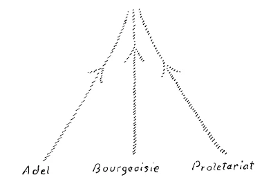
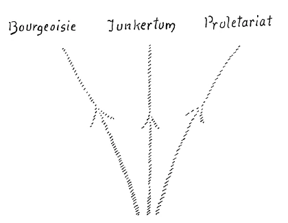

Sie haben vor kurzem den «Chor der Urträume» Ferchers von Steinwand eurythmisiert gesehen. Es wird nun jene Dichtung Ferchers von Steinwand für eine eurythmische Darstellung vorbereitet, die sich an den «Chor der Urträume» anreiht: der «Chor der Urtriebe». Es ist nun vielleicht bei dieser Dichtung ganz wünschenswert, wenn Sie sich mit den Gedanken der Dichtung zuerst bekannt machen, weil während der eurythmischen Darstellung durch das gleichzeitige Aufnehmen des Eurythmischen und der Dichtung die Aufmerksamkeit doch sehr stark in Anspruch genommen wird. Damit es nun vor der eurythmischen Aufführung möglich ist, daß Sie sich schon mit der Dichtung bekannt machen, wird heute Frau Dr.Steiner vor dem Vortrag den ersten und den zweiten Absatz des Chors der Urtriebe rezitieren und morgen dann damit fortsetzen. ^58aoqh

Es ist von mir in diesen Betrachtungen versucht worden, gerade an die bedeutsamen Entwickelungsereignisse der Gegenwart einiges episodisch anzuknüpfen, das dann die Möglichkeit bieten soll, weitere Ausblicke zu geben gerade von unserem geisteswissenschaftlichen Standpunkte aus. Ich möchte auch heute das eine oder das andere noch episodisch mit Bezug auf unsere Zeitereignisse vor Ihnen vorbringen, damit wir dann innerhalb dieser drei Vorträge heute, morgen und übermorgen vielleicht zu einigen Ausblicken, die jedem wichtig sein müssen in der Gegenwart, kommen können. Ich möchte heute ausgehen von einer allgemeinen Bemerkung. Unter dem Mancherlei, was diese furchtbaren katastrophalen Ereignisse der letzten Jahre in die Menschheit hereingetragen haben, sollten zwei Dinge namentlich sein. Das eine ist: Es sollte aus der Beobachtung des Erlebten hervorgehen eine Art Verstärkung der Menschheit in bezug auf das Gefühl für tatsächliche Wahrheit. Und das zweite sollte sein: Es sollte ersprießen aus dem Tragischen, das sich zugetragen hat und weiterhin zutragen wird, eine gewisse Fähigkeit, von den Weltereignissen, überhaupt von der Welt als solcher zu lernen. ^jsp6eo

Diese zwei Dinge sollten hineingetragen werden in das menschliche Leben aus der Beobachtung der vergangenen viereinhalb Jahre. Ein Gefühl, sagte ich, sollte der Menschheit ersprießen für tatsächliche Wahrheit, für die Wahrheit innerhalb der Tatsachenwelt. Wir haben gesehen, wenn wir sehen wollten, wenn es uns darum zu tun war, zu sehen, daß durch Jahre hindurch — womit ich nicht sagen will, daß es _ vorher nicht in einem gewissen Grade auch so war, nur war es nicht so auffällig —, daß durch reichlich mehr als vier Jahre die Menschheit über die ganze zivilisierte Welt hin sich allmählich abgestumpft hat für die Beobachtung der tatsächlichen Wirklichkeit, der in den Ereignissen lebenden Wahrheit. Wie oft ist es eigentlich nötig, innerhalb des Kreises derer, die sich in unserer Bewegung zusammengeschlossen haben, von der Bedeutung, von der tatsächlichen Bedeutung der Wahrheit zu sprechen. Wie schwierig ist es auf der anderen Seite, für das echte Bild der Wahrheit, insofern die Wahrheit nicht bloß eine Abstraktion ist, sondern insofern die Wahrheit eine Realität ist, für das echte Bild der Wahrheit einiges Verständnis zu erwecken. Und wie groß sind die Versuchungen, sich zu entziehen dem Anblicke der wirklichen Wahrheit. Über die vier letzten Jahre und über dasjenige, was vorangegangen ist, wird ja wohl die Menschheit auch einmal unterrichtet sein wollen, weil jedenfalls aus dem Chaos heraus sich auch so etwas wie der Drang, die Ereignisse kennenzulernen, entwickeln wird. Heute — darauf habe ich ja namentlich in den letzten Betrachtungen, die ich hier angestellt habe, hinweisen wollen —, heute haben noch wenige Leute wirklich ein Bedürfnis, die Wahrheit über die letzten Jahre zu erfahren. Aber das meine ich weniger, sondern ich meine, indem ich von der Wahrheit hier spreche, die Hingabe an die Wirklichkeit. Die Menschen lieben es, in Illusionen zu leben. Zwischen Illusionen und Unwahrheiten ist aber nur eine ganz schmale Kluft, über die man sehr leicht eine Brücke hinüberfindet von den Illusionen aus ins Reich der wirklichen Lüge. Ob diese Lüge nun bewußt oder unbewußt ist, darauf kommt es ja weniger an, wenn es sich um Wirklichkeiten handelt. Die Versuchungen sind eben sehr groß, einzuführen in seine Anschauungswelt an der Stelle, wo man üben sollte die Hingabe an die Wahrheit, einzuschalten die Illusion und dann sehr bald eben die Unwahrheit. ^2rofhp

Dem Geisteswissenschafter sollte es nun klar sein, daß bildend, entwickelnd, aufbauend, wachstumfördernd nur das Leben der Menschen in der Wahrheit sein kann, daß dagegen alles dasjenige, was Leben in der Unwahrheit ist, zerstört, isoliert. Es ist auch immer das Leben in der Unwahrheit mit dem Egoismus verbunden. Dasjenige, was so hinderlich ist dem Eindringen in die in den Tatsachen waltende Wahrheit, das ist das Sich-Einspinnen in die subjektive Bequemlichkeit namentlich des Vorstellungs-, aber auch des Empfindungslebens. Man möchte nicht gern sich über die Illusionen hinausheben, daß ja doch alles, alles so ist, daß man des Denkens, des natürlichen Denkens enthoben ist. ^eoeulo

In diese Stimmung, die sehr leicht allgemeine Stimmung wird, ist dann der einzelne hineingestellt und wird, wenn er sich in einer der Wahrheit nicht sehr günstigen Zeit bedienen muß einer gewissen Form, dann außerordentlich schwer verstanden. Derjenige, der genötigt war in den letzten vier Jahren, das eine oder das andere durchleuchten zu lassen von den tatsächlichen Verhältnissen, und der genötigt war, den brutalen Wirklichkeiten Rechnung zu tragen, der wurde selbstverständlich schwer verstanden. Aber wie schwierig es ist, dieses Hinneigen zur Wahrheit in den Tatsachen zu entwickeln, das kann ja daraus entnommen werden, daß es für zahlreiche Menschen wahrhaftig recht unbequem gewesen wäre, ihr Denken auf so etwas einzustellen, wie es zum Beispiel, sagen wir, von mir in jenem Wiener Zyklus von Vorträgen vorgebracht worden ist, auf das ich neulich hier wiederum hingewiesen habe; der von dem, was innerhalb der Menschheit waltete seit Jahrzehnten, sprach als von einer Karzinomkrankheit, von einer Krebskrankheit, die im sozialen Leben der Menschen spielt. Und ich sagte dazumal: Wahrhaftig nur die Verpflichtung, so etwas zu sagen, kann einen veranlassen, es auszusprechen. — Ich sagte aber zu gleicher Zeit: Man möchte das, was darinnen liegt, hinausschreien in alle Welt. — Aber es ist unbequem, das zu hören, und unbequem war es für die Menschen, zu hören, bevor diese Katastrophe hereingebrochen ist, daß sie hereinbrechen wird. Unbequem war es selbstverständlich für eine große Anzahl von Menschen, sagen wir, vor zwei Jahren, darauf aufmerksam gemacht zu werden, daß ja die Ereignisse keinen anderen Gang nehmen können als denjenigen, den sie jetzt genommen haben. Daß dieser Gang der Ereignisse für die sogenannten Zentralmächte ein sehr bedeutungsvoll unbequemer ist, das liegt ja heute schon auf der Hand. Daß er für die Entente ein recht unangenehmer werden wird, das wird man im Laufe einiger Jahre schon sehen, aber es liegt heute noch nicht so auf der Hand; daher ist es heute noch immer eine unbequeme Wahrheit. Selbstverständlich würde heute so ziemlich auf der ganzen Welt demjenigen, der noch deutlicher sagen würde, als das hier schon geschehen ist, um was es sich handelt, recht Unangenehmes passieren können, geradeso wie in anderem Gebiete jemandem höchst Unangenehmes passiert sein würde, wenn er die Hindenburg- und Ludendorff-Verehrung vor zwei Jahren in das richtige Licht gesetzt hätte. ^apl2ze

Das sind Dinge, die spielen nur ins Große hinein. Es gibt aber Dinge, die treten im menschlichen Leben alltäglich auf, sie zeigen sich von Mensch zu Mensch allüberall. Und schließlich ist dasjenige, was sich im Großen abspielt, was die sogenannten großen Ereignisse sind, ja nichts anderes als die Kumulierung dessen, was sich im Kleinen von Mensch zu Mensch alltäglich, eben im alltäglichen Leben abspielt. Es besteht einmal eine gewisse Hinneigung der Menschen, nicht auf die Wahrheit zu schauen, schauen zu wollen. Gewiß, die Menschen reden viel von Wahrheit. Ich habe aber nirgends größere Liebe zur Illusion gesehen als bei denjenigen Menschen, die das Wort Wahrheit alle Augenblicke im Munde führen, wie ich niemals stärkeren Egoismus entdeckt habe als bei denjenigen Menschen, die fortwährend sagen, sie wollen ja eigentlich nur das oder jenes Unpersönliche. ^5nk24j

Das ist das eine, die Notwendigkeit, Wahrheitsgefühl, insofern die Wahrheit in den Tatsachen liegt, zu entwickeln. Das andere ist, von den Weltenereignissen zu lernen. Es kann einem das Herz bluten, wenn man die Notwendigkeit durchschaut, gerade an den Ereignissen der letzten Jahre zu lernen, und wenn man sieht, wie verhältnismäßig wenig doch eben gelernt worden ist durch die Menschen. Es ist einem, wenn man die Dinge betrachtet, oftmals, wie wenn Jahrhunderte zwischen dem Jahre 1914 und dem heutigen Jahre liegen würden, und man kann wirklich heute noch Menschen treffen, die heute genau ebenso urteilen, wie sie 1914 über diese oder jene Dinge geurteilt haben. Gewiß, es bleibt ein gewisser Grundstock von Dingen unangetastet, aber wir verstehen uns ja wohl, wenn ich sage: Man muß gelernt haben, über gewisse Dinge anders zu urteilen. —- Man kann ja wohl verstehen, daß eben diejenigen Dinge gemeint sind, die gerade durch solche Ereignisse ans Tageslicht getreten sind, wie die vier letzten Jahre waren. ^f25y3n

Dasjenige, was schon gelernt werden könnte von vielen Menschen, das ist die Notwendigkeit der Hinneigung zu einer geistigen Weltenbetrachtung. Aus alledem, was namentlich auf dem Gebiete des sozialen Lebens geschieht, der sozialen Verwickelungen, die sich zuletzt herausentwickelt haben aus dieser Weltenkatastrophe, was sich ergibt aus dem sozialen Chaos, das sich herausentwickeln wird aus dieser Weltkatastrophe, das wird vor allen Dingen sein die Notwendigkeit für die Menschheit, sich zu spiritueller, zu geistiger Weltbetrachtung hinzulenken. Das macht sich heute zunächst dadurch geltend, daß diejenigen Menschen, die in diesem Wirbeltanz, der ja eingetreten ist, nun für einige Zeit obenaufkommen, gerade am schlimmsten ablehnend sind gegen alles spirituelle Leben, gegen alle geistige Weltenbetrachtung. Aber gerade in dieser schlimmen Ablehnung liegt der reale Keim für die Herbeirufung der Sehnsucht nach spiritueller Weltenbetrachtung. Man wird gar nicht zu einer lichtvollen sozialen Gestaltung in der Zukunft kommen können, ohne daß man den Blick wendet auf dasjenige, was die heutige Ordnung, das heutige Chaos ergeben hat. Aber durchschauen dasjenige, was geschehen ist — und das gegenwärtige Chaos ist nur das Ergebnis desjenigen, was im Laufe der Menschheitsentwickelung geschehen ist —, einen Einblick in das, was geschehen ist, wird man nur bekommen können, wenn man als geistige Lichtquellen eben Geisteswissenschaft haben wird. ^wqtaab

Man wird, um die großen proletarischen Fragen, die auftauchen, einigermaßen beherrschen zu können - ich will gar nicht davon sprechen, sie lösen zu können -, sich fragen müssen: Welche Bedeutung haben denn eigentlich überhaupt die Klassen, auf welche zum Beispiel gerade das Proletariat, indem es sich selber als Klasse fühlt, zurückblickt: die Klasse des alten Adels, der Bourgeoisie, und endlich die Klasse des Proletariats selber? — Mit Definitionen kommt man der Sache nicht bei. Auch nicht dadurch kommt man der Sache bei, daß man beobachtet, wie sich die Adelsklasse im Laufe der Jahrhunderte benommen hat, woraus sie geworden ist, wie sich die Bourgeoisie verhalten hat, wie das Proletariat entstanden ist. Auch dadurch kommt man nicht zu einem Verständnis desjenigen, was in die menschliche Gesellschaftsordnung hereingeflossen ist, indem es sich aus anderen, namentlich aus diesen drei Klassen seine Zuflüsse geholt hat. ^tptwj4

Der Adel in seinen verschiedensten Formen - ja, zuletzt versteht man dasjenige, was mit dem Adel als Klasse zusammenhängt, doch nur, wenn man in der Lage ist, so etwas geisteswissenschaftlich zu beleuchten. Dadurch allein hat man die Möglichkeit, sich zu sagen: Diejenigen Menschen, die in der Adelskaste sich heranentwickelt haben, sind ja natürlich nicht bloß diese menschlichen Individuen, die von gewissen Vorfahren nach der Kontinuität des Blutes herstammen und sich dadurch gewisse Vorrechte in der Welt gesichert haben auf Grundlage bestimmter Ereignisse, die Ihnen ja mehr oder weniger bekannt sind, sondern die Mitglieder dieser Adelskaste sind ja auch Seelen, wenigstens zum größten Teil Seelen, die gesucht haben, gerade in solchen Körpern sich zu verkörpern, welche in der Adelskaste geboren worden sind. Das wird man sich überhaupt aneignen müssen gegen die Zukunft hin: den Menschen nicht bloß als leiblich-körperliches Wesen zu betrachten, sondern ihn zu betrachten in seinem Zusammenhange mit der hinter ihm stehenden geistigen Welt, in der er die Quelle seines Seelischen hat. Man wird allmählich das Gefühl bekommen müssen, daß man den Menschen nicht kennt, wenn man nicht seinen Zusammenhang mit der hinter ihm stehenden geistigen Welt ins seelische Auge faßt. ^tpaoux

Man kann sich nun wirklich geisteswissenschaftlich Mühe geben, die Frage zu beantworten: Woher kommt das eigentlich, was in die Menschheit durch den Adel hineingekommen ist? — Man hat ja auch in der Gegenwart ziemlich viel Gelegenheit, solche Fragen geisteswissenschaftlich zu behandeln; wenigstens hatte man dazu Gelegenheit. Das wird ja jetzt aufhören. Die Welt hat viel geschimpft über den sogenannten preußisch-deutschen Militarismus; jetzt schimpft Preußisch-Deutschland selber über den preußisch-deutschen Militarismus. Das Schimpfen mag von diesem oder jenem Standpunkte aus berechtigt sein; die Gründe, welche vorgebracht worden sind von der einen oder von der anderen Seite, für und gegen, sind zumeist recht wenig schöne und jedenfalls recht wenig wahre Gründe gewesen, sind es auch heute noch nicht. Und für den Wahrheitsucher kommt es ja viel mehr auf die Gründe an als auf das abstrakte Stimmen oder Nichtstimmen. Aber viel wichtiger als dieses Pro und Kontra ist die Tatsache, daß achtzig Prozent, eigentlich mehr alsachtzigProzent derKommandeurstellen im preußisch-deutschen Heere von Adeligen, von guten alten Adeligen besetzt sind, führende Stellen, in den höchsten führenden Stellungen achtzig Prozent, über achtzig Prozent; so daß gerade, ohne daß man dabei Sympathien und Antipathien walten läßt, sich zum Beispiel beantworten läßt, woher das kommt, was durch den Adel in die Menschheit hineingekommen ist. Ob das nun für die Menschheit Gelegenheit gibt zum Pro oder Kontra, darauf will ich nicht eingehen, wie ich oben schon sagte, aber dasjenige, was geschehen ist, das läßt sich zu der Frage bringen: Wie hängt das eigentlich mit dem ganzen Werden, mit der ganzen Entwickelung der Menschheit zusammen? — Denn man kann zum Beispiel gerade an diesem Militarismus die Frage aufwerfen, was durch ihn geschehen ist im Laufe der letzten Jahrzehnte und der letzten viereinhalb Jahre, da er in seiner Mehrzahl gerade von Aristokraten geführt wird. Da läßt sich die Frage beantworten, die ich oben aufgeworfen habe: Wie hängen die Adelsimpulse mit der Gesamtentwickelung der Menschheit zusammen? — Und überall findet man, auch spirituell, auch wenn man versucht, den Zusammenhang der menschlichen Seele mit den geistigen Welten zu erforschen, überall findet man: Dasjenige, was die Menschheit irgendwo und irgendwann erlebt hat durch ihren Adel, das ist Auswirkung eines alten Menschheitskarmas, das ist Auswirkung von Impulsen, welche einmal durch das oder jenes in die Menschheitsentwickelung hineingetragen worden sind. Damit gewisse Dinge über die Menschen kommen können wegen früherer gemeinschaftlich menschlicher Verwickelungen, dazu war im wesentlichen - jetzt spirituell betrachtet — der Adel auf diesem oder jenem Gebiete da; der Auswirker alter Schulden, könnte man sagen. Man muß überall zurückgehen in die Vergangenheiten, wenn man die Impulse, die im Adel sozial wirken, mit Bezug auf ihre Bedeutung für die Menschheit verstehen will. ^zt0wca

Hat man, ich möchte sagen, die tiefere Betrachtung der Dinge da einmal angefaßt, wo ich es Ihnen jetzt angedeutet habe, dann wird man dazu getrieben, auch beim anderen Pol einmal anzufassen. Und der andere Pol ist das Proletariat. Hier verhält sich die Sache umgekehrt. Alles dasjenige, was durch das Proletariat verursacht wird an Schwierigem für die Menschheit, was hereingetragen wird in die Menschheit an Verwickelungen durch das Proletariat, alles das weist auf die Zukunft hin, gibt Zukunftskarma, wird von der Menschheit in der Zukunft ausgetragen werden müssen. ^n2ip62

Das erstere, daß der Adel gewissermaßen die vollziehende Gewalt gegenüber alter Schuld ist, diese Erkenntnis kann dazu führen, Verantwortlichkeit zu fühlen gegenüber dem, was heute durch das Proletariat geschehen muß. Denn schließlich ist ja doch dasjenige, was durch das Proletariat geschieht, in weitem Umfange auf dem Umwege durch das geistige Leben von der Bourgeoisie verursacht. Um das letztere durchdringend zu verstehen, muß man versuchen, die Mittelstellung der Bourgeoisie zwischen dem Adel und dem Proletariat ins Auge zu fassen. ^znd5os

Sehen Sie, der Adel ist gewöhnlich abgeneigt einer eigentlich wissenschaftlichen Behandlung der Weltereignisse. Er ist nicht abgeneigt, über die Weltereignisse etwas zu wissen, aber er möchte nicht auf dem Wege des wissenschaftlichen Forschens, des wissenschaftlichen Denkens zu der Erkenntnis der Weltereignisse kommen. Er möchte vielmehr ohne die Anstrengung des Denkens - ich sage das alles ohne Sympathie und Antipathie, nur um zu charakterisieren — per Autorität in die Weltengeheimnisse hineinkommen, nicht durch Erkenntnis. Es ist ja zweifellos, daß in der bequemen Weise, wie zum Beispiel durch den Spiritismus die Leute versuchen, in die Weltengeheimnisse erkennend hineinzukommen, dies in Adelskreisen zahlreiche Anhängerschaft findet. Nun ja, Sie werden sagen: selbstverständlich sind nicht nur Adelige Spiritisten. — Das ist schon wirklich wahr, aber in den anderen Klassen stehen den Spiritisten so und soviel Leute gegenüber, welche wenigstens ein gewisses Streben haben, durch die Mitanwendung des eigenen Denkens in die geistige Welt hineinzukommen, Wissenschaft zu treiben. Innerhalb der Adelsklasse stehen wissenschaftlich strebende Menschen den spiritistisch oder mystisch — nun, es gibt ja verschiedene Wege, die man nicht alle zu charakterisieren braucht — in die geistige Welt Hineinkommen-Wollenden eben nicht zur Seite. Dagegen muß immer dasjenige, was eine Adelsklasse irgendwie in der Welt prätendiert, gestützt werden auf militärische Weise, in irgendeiner militärischen Art. Eine Adelsklasse ist ohne militärische Stütze nicht denkbar. Das wären so etwa — es gibt natürlich viele andere charakteristische Eigentümlichkeiten der Adelsklasse -, aber das wären solche, die von radikaler Bedeutung sind. ^7cutsa

Was nun die Bourgeoisie betrifft, die zwischen dem Adel und dem Proletariat mittendrinnensteht, so ist zu sagen, daß gerade mit der Bourgeoisie auftritt ein gewisses Streben, die Erkenntnis wissenschaftlich zu machen, in die Vorstellungen, die in die geistige Welt hineingehen wollen, wissenschaftliche Gestaltung zu bringen. Dabei beruht die Macht der Bourgeoisie auf dem Besitz der Produktionsmittel, der Werkzeuge und dergleichen. Ich wähle in den Dingen, die zu sagen sind, um gewisse Ausblicke morgen oder übermorgen zu begründen, einzelne aus, aber Sie werden sehen, daß das, was ich auswähle, eine gewisse Bedeutung hat. ^k6lcdm

Besonders charakteristisch ist dasjenige, was immer eine Klasse von der nächstvorhergehenden übernimmt. So zum Beispiel übernimmt die Bourgeoisie von dem Adel den Militarismus. Aber es ist das Interessante, daß die Bourgeoisie überall die Tendenz hat, den Militarismus zu demokratisieren. Der Adelige braucht ein Heer, das ihm zur Verfügung steht, um ihn zu halten. Wie er das zustande kriegt, das kann ihm gleichgültig sein. Der Bürgerliche ist durch die Art, wie er mit seiner Lebens-, mit seiner Existenzgrundlage zusammenhängt, schon auch darauf angewiesen, sich auf ein Heer zu stützen, aber er muß dieses Heer aus demselben Volke herausnehmen, das er an seine Produktionsmittel hinstellt. Daher wird er zum Schwärmer der allgemeinen Wehrpflicht. Und, nicht wahr, in der Zeit, in der das Bürgertum allmählich heraufgekommen ist und sich entwickelt hat, war man selbstverständlich ein Trottel, wenn man nicht für die allgemeine Wehrpflicht schwärmen konnte, denn das war einfach der größte Fortschritt der Zeit, die allgemeine Wehrpflicht, die sogenannte Demokratisierung des Militarismus und so weiter. ^i4zjgs

Dasjenige, was nun das Proletariat wiederum von der vorhergehenden Klasse nahm, ist die Wissenschaft der Bourgeoisie, die bourgeoise Wissenschaft. Der Proletarier weiß heute — wenigstens insoferne er wissenschaftlich geschult ist, und das sind ja sehr viele -—, er weiß einzuschätzen gewisse unterbewußte oder unbewußte Dinge im Menschen. Er weiß gut einzuschätzen, wie aus der Klasse oder Kaste des Menschen heraus ein gewisses Denken und eine gewisse Formung im Denken kommt. Zum Beispiel weiß der Proletarier sehr gut, daß, wenn man Adeliger ist, man anders denkt, weil man eben der Adelskaste angehört, als wenn man Bourgeois ist oder wenn man Proletarier ist. Die ganze Formung des Denkens ist anders, die Instinkte, die hineinlaufen in die Gedankenformen und diese Gedankenformen bilden, sind anders. Die bourgeoise Wissenschaft, die steht auf dem Standpunkte, Wahrheit ist Wahrheit, es kann nur eine Wahrheit geben, und glaubt an die Absolutheit ihrer Urteile. Das tut der Proletarier nicht, denn er kennt die Abhängigkeit desjenigen, was ein Mensch denkt, von seiner Kaste, von seiner Klasse. ^lal4tn

Nun gewiß, auch da gibt es einen gewissen Grundstock von Wahrheiten, die von der Kaste nicht abhängig sind, meinetwillen gewisse elementare mathematische Begriffe und dergleichen. Gewiß, auch die rein mathematisch-mechanische Astronomie ist nicht von der Kaste abhängig. Aber alles dasjenige, was sich auf soziales, auf geschichtliches Leben bezieht, und namentlich die Formung und die Verwendungsform der einzelnen wissenschaftlichen Vorstellungen, die sind von der Kaste abhängig. Das hat die proletarische Wissenschaft durchschaut. In vieles Unterbewußte der Menschen schaut die proletarische Wissenschaft hinein. Allein sie übernimmt, diese proletarische Wissenschaft übernimmt das bourgeoise Denken, übernimmt sozusagen mit Haut und Haar dasjenige, was die bourgeoise Bildung, die bourgeoise Intelligenz erobert hat, und popularisiert es. Genau ebenso, wie die Bourgeoisie den Militarismus des Adels demokratisiert hat, so popularisiert das Proletariat in einer ganz blinden Gläubigkeit die Bourgeois-Wissenschaft, oder besser gesagt, die bourgeoise Wissenschaftlichkeit. ^x2lb06

Daraus sehen Sie schon, daß das Proletariat mit Bezug auf sein ganzes Denken der Erbe ist desjenigen, was von der Bourgeoisie gerade mit Bezug auf menschliche Gedanken, mit Bezug auf menschliche wissenschaftliche Hervorbringungen getan worden ist. Das wird sich als eine ganz außerordentlich wichtige Tatsache in die nächste Zukunft hinein zeigen, und es würde ungeheuer notwendig sein, daß man gerade auf solche Dinge achten lernen kann. Sonst wird man über Wichtigstes, was sich heranschleicht, nun, eben wiederum in bequemen Illusionen, die von der Lüge nur durch eine schmale Kluft getrennt sind, leben wollen. ^v2ur54

Es gibt zum Beispiel nichts, was der Wahrheit abträglicher ist in dem Sinne, wie ich von dieser Wahrheit vorhin gesprochen habe, als der Nationalismus. Aber der Nationalismus gehört gerade zu dem Programm, das als ein besonders segensreiches Programm der nächsten Zukunft gelten wird. Er gehört zu dem Programm der nächsten Zukunft. Daher wird man es erleben müssen, wenn dieser Nationalismus wird bauen wollen — er kann ja in Wirklichkeit nur zerstören —, daß die Illusionen, die von der Lüge durch eine schmale Kluft getrennt sind, sich eben fortsetzen werden. Denn so viel Nationalismus in der Welt entstehen wird, so viel Unwahrheit wird in der Welt sein, besonders gegen die Zukunft hin. Und so werden sehr viele Quellen für neue Unwahrheiten da sein. Unwahrheit hat in vieler Beziehung die Welt regiert. Aber sie wird nicht regieren können, indem die Menschheit in sich aufgenommen hat jene Impulse, jene Strömungen, die heute chaotisch in den proletarischen Massen zutage treten und die, wie Sie gesehen haben - ich habe Ihnen das neulich aus geisteswissenschaftlichen Unterlagen vorgeführt -—, einer der drei großen Strömungen in der Menschheitsentwickelung entsprechen. ^d4hhi3

Mit diesen Dingen hängen die tatsächlichen Ereignisse ganz wesentlich zusammen. Aber man war abgeneigt, namentlich in den letzten Jahrzehnten, so in die Welt hineinzuschauen, daß man wirklich das Wirkliche gesehen hätte. Man konnte nur nicht, ohne daß man auf den Geist schaute, in die Welt hineinschauen, wenn man nicht das Wirkliche sich entgehen lassen wollte. Sehen Sie, all das, was sich zugetragen hat in den letzten Jahren, es geht ja zurück im Grunde genommen auf geistig durchschaubare Kräftewirkungen in der zivilisierten Welt. Es war eigentlich nichts gräßlicher im Verlaufe dieser traurigen Ereignisse als das Reden aus diesem oder jenem sogenannten nationalen oder anderen Standpunkte heraus. Da redete man zumeist von Dingen, die mit dem Gang der Ereignisse nicht das allergeringste zu tun hatten. Das Eigentümliche war ja, daß die leitenden Staatsmänner auch so redeten, daß ihre Reden mit dem Gang der Ereignisse nicht viel zu tun hatten. Mit den Dingen, die da berührt werden, sollte man nicht so unzart umgehen, mit dem, was man nennen könnte das Schicksal der Menschen, insoferne diese Menschen in Gruppen zusammengedrängt sind, in Völkergruppen zum Beispiel. Denn da berührt man im Grunde genommen recht tief, tief mit dem Geistigen zusammenhängende Verhältnisse, von denen man nicht so oberflächlich sprechen sollte, als oftmals gesprochen wird. ^3mfpjy

Vor allen Dingen kommt in Betracht, daß man nicht übersehen sollte, daß gewisse Begriffe an verschiedenen Orten der Welt ganz Verschiedenes bedeuten. Denken Sie doch nur, daß die Menschen überallhin, sagen wir, vom Staate sprechen. Aber es kommt nicht darauf an, daß man einen gewissen Begriff vom Staate hat, sondern daß man doch wenigstens etwas mit diesem Begriff verbindet von den verschiedenen Gefühlsnuancen, die sich da oder dort an diesen Staat knüpfen, und daß man vor allen Dingen loskomme von der unseligen Verquickung von Staat und Nation und Volk, von jener unseligen Verquickung, die ein Grundcharakteristikum des Wilsonianismus ist, der immer zusammenwirft Staat und Nation und Volk, und sogar Staaten begründen will nach Nationen, wodurch eben nur in gewissen Strömungen die Lüge perpetuiert würde, wenigstens wenn es möglich wäre. ^mcizq7

Man muß überall die konkreten, die wirklichen Dinge ins Auge fassen. Ich habe Ihnen im Laufe dieser Betrachtungen dargestellt, wie eine gewisse Konfiguration Mitteleuropas zusammenhängend ist mit jenen alten, auf die Gruppeninstinkte rechnenden Suggestionen, die von dem römischen Katholizismus, von Rom ausgingen. Sehen Sie, mit diesem Gespenste des alten Römischen Reiches, wie die spirituelle Wissenschaft sagt, hing innig zusammen dasjenige, was die alte, 1806 verstorbene Kaiser-Idee Mitteleuropas war. Bis dahin gab es mehr oder weniger, wirklich mehr oder weniger nominell das Heilige Römische Reich Deutscher Nation, das 1806 erst verschwunden ist. Es ist nicht eigentlich verschwunden, sondern es ist nur abgeschoben worden. Denn dieses Heilige Römische Reich, das mehr oder weniger günstig oder ungünstig durch lange Zeiten hindurch die verschiedenen deutschen Stämme zusammengehalten oder auch entzweit hat, dieser kaiserliche Impuls des Heiligen Römischen Reiches Deutscher Nation ist eigentlich nach und nach übergegangen auf die habsburgische Hausmacht, und damit ist dann eben dasjenige beglückt worden, was österreichisch-ungarischer Staatszusammenhang war. Aber Staat, der im Lichte der Habsburgermacht stand, bedeutet etwas anderes als Staat, der, sagen wir, sich so herausgebildet hat seit dem fünfzehnten, sechzehnten Jahrhundert, wie er, eigentlich mehr mit dem Volkstum zusammenhängend, in England oder Frankreich sich als Staat gebildet hat. Wo der Staat gar keinen wirklichen Inhalt hat, in dem, was Habsburgerreich war, wo verschiedene Völkerschaften zusammengehalten waren unter dem Gesichtspunkte der habsburger Hausmacht und diese habsburger Hausmacht wie einen Mantel hatten, wie ein altes Kleinod hatten, war etwas tief Mittelalterliches, nämlich das Kaisertum aus dem alten Heiligen Römischen Reich Deutscher Nation. Das, was Habsburg war, war ältestes Mittelalter, und leider auch durch und durch verbunden mit ältestem Mittelalter mit Bezug auf den Romanismus, mit Bezug auf jenen Katholizismus, der durch die Gegenreformation wiederum lebendig oder wenigstens lebensähnlich gemacht worden war und der alle jene Zustände hervorgebracht hat, von denen ich Ihnen auch hier schon gesprochen habe, der so viel beigetragen hat zur Einschläferung, zur Eindämmerung, aber auch zu anderen üblen Wirkungen innerhalb der mitteleuropäischen Welt. ^bgc4x2

Diesem Habsburgerreich ältester mittelalterlicher Sorte stand ein Modernstes gegenüber, dasallmählich ganz modern geworden ist, etwas allermodernsten Gepräges: das preußisch-hohenzollerische Kaisertum, jenes preußisch-hohenzollerische Kaisertum, welches den Amerikanismus innerhalb des deutschen Wesens darstellte, Wilsonianismus vor Wilson. Das ist jener große, gewaltige Unterschied: dieses modernste Gepräge des preußisch-hohenzollerischen Amerikanismus, als Kaisertum maskiert, und das mittelalterliche habsburgische Kaisertum, das zusammengeschmiedet war von außen. Diese Dinge zu studieren ist nötig, wenn man verstehen will, was geschehen ist, und was noch geschehen wird. ^ttmv9t

Was da als hohenzollerisch-preußisches Amerikanertum entstanden ist, das hatte nun eine ganz bestimmte Eigentümlichkeit: es entwickelte genau dieselben Impulse, die zum Beispiel im Britischen Reiche sich entwickelten, aber es entwickelte alle diese Impulse in der entgegengesetzten Art. Sehen Sie, dreierlei Strömungen gibt es, hergebracht von alten Zeiten, entstanden in der Gegenwart: die adelige, die bourgeoise, die proletarische. Nirgends so, ich möchte sagen, in Reinkultur nebeneinander, getrennt, entwickelten sich diese drei Strömungen, die adelige, die bourgeoise, die proletarische, wie im Britischen Reich und auch innerhalb des sogenannten Deutschlands — was ja kein offizieller Name ist, ein Deutschland gibt es ja nicht staatsrechtlich, hat es nie gegeben staatsrechtlich —, also im sogenannten Deutschen Reich. Also in beiden Gebieten, aber im genau entgegengesetzten Sinne entwickelten sich diese drei Strömungen. Im Britischen Reich entwickelte sich das alles so, daß Adel, Bourgeoisie, Proletariat zusammengingen, immer nach einer gemeinsamen Tendenz hin strebten. Es ist guter alter Adel da, aber er verstand es, mit den Anforderungen des bourgeoisen Wesens, namentlich mit den Anforderungen des materiellen und finanziellen Bourgeoisiewesens sich auszugleichen. Man ist nicht nur Adeliger, man wird auch wohlhabender Adeliger, reicher Mensch im modernen Sinne. Man kann zu gleicher Zeit seine Revenuen aus der Industrie haben und im guten Sinne alter, angesehener Adeliger sein. Aber man verwaltet das Ganze so, daß der Proletarier in seinen Unternehmungen nicht zu sehr abweicht von dem, was die anderen wollen. Es geht eben immer auf irgendeine Weise zusammen. ^dq8k8y

 ^6tav00

Innerhalb des neuen deutschen Staatsgebildes ging alles auseinander. Da haben Sie auch die drei Strömungen, aber sie entwickelten sich so in dem Sinne auseinander: Da haben Sie die Industrie zur Großindustrie gebildet, die ihre eigene Strömung hatte, da haben Sie den alten Adel im preußischen Junkertum — die beiden drängten wohl zusammen, aber es war auch danach! -, das Proletariat, welches immer mehr zum Gegner der Bourgeoisie wurde und sich gerade zur Aufgabe stellte, den Klassenkampf gegen die Bourgeoisie im eminentesten Sinne aufzunehmen. Das entwickelte sich alles auseinander. Wer die geschichtlichen Ereignisse in dieser Beziehung studiert hat, der findet gerade das in außerordentlicher Weise interessant. Dabei das alles in einem Rahmen, den es sprengen mußte. Denn das, was da als sogenanntes Deutschland - wie gesagt, was es staatsrechtlich nie gegeben hat — konstruiert worden ist, trug Bismarcksches Gepräge, das Gepräge eines Mannes, dem nie die moderne Großindustrie gegenständlich geworden ist, der sie nie kannte, der nie damit rechnete, der den Rahmen, den er konstruierte, mit Ausschluß des Werdens der Großindustrie konstruierte. Nun entwickelte sich da hinein der ganze Amerikanismus der Großindustrie und sprengte den Rahmen. Der war schon in sich gesprengt, lange bevor diese kriegerische Katastrophe gekommen ist. ^6w1i2c

 ^94fdp9

Diese Verhältnisse mit unbefangenem Blick, mit wissenschaftlicher Objektivität in Ruhe zu studieren, dazu hatte die Menschheit in dem tollen Wirbel, in den sie verfallen war auf allen möglichen Gebieten, wahrhaftig keine Ruhe. Denn man ist ja nicht sehr geneigt, auf Realitäten einzugehen. Man muß eigentlich Realitäten auch wirklich anzustreben suchen. Man muß einen Sinn haben für Realitäten, vielleicht nicht nur einen Sinn, sondern auch einen Spürsinn für Realitäten; denn der Zug der Zeit geht dahin, die Realitäten zu verleugnen, sich gar nicht einzulassen auf Realitäten. Sehen Sie, die Leute, die dahin schauten, wo der Inn fließt, die Moldau fließt, die Donau fließt, die Leitha fließt, sie unterschieden nicht viel zwischen zwei grundverschiedenen Dingen: zwischen dem deutsch-österreichischen Volk und dem Habsburgerreich. Das floß zusammen. Und wiederum, wenn die Leute Österreich besuchten, da, wo das deutsch-österreichische Volk lebte, das jetzt einem so tragischen Schicksal entgegengeht — wie hatten sie denn Gelegenheit, kennenzulernen, was innerhalb der eigentlichen Volkheit doch lebt? Man lernte halt — wie einmal ein Schriftsteller konstatierte -, wenn man so als Reisender nach Österreich kam, die «ärarische» Gesinnung, die sehr innig verbunden war mit Schlamperei, kennen. Wenn man an einen Bahnhof kam, nun, man wurde gewiesen, man solle dahin fahren, da habe man dann einen Anschlußzug. Man fuhr hin, und sollte man zur rechten Zeit ankommen, kam man sicher nicht zur rechten Zeit an. Nicht wahr, man war nie sicher, wenn man sich den Zügen überließ, daß man zur rechten Zeit hinkam, aber man war, wie der Betreffende sagte, überall sicher, wo man hinkam, daß man eine gute Tasse Kaffee kriegte. Aber das ist ja nur eine Äußerlichkeit. Dasjenige, was da in diesem Gebiete Mitteleuropas war und vor dem eine gewisse Brutalität Halt machen sollte, das war gerade die Möglichkeit der Entwickelung starker geistiger Individualitäten aus einem gewissen Untergrunde des Volkstums heraus. ^h12x3o

Sehen Sie, von Fercher von Steinwand war wenig gedruckt in den achtziger Jahren des vorigen Jahrhunderts. Ich lebte in Wien zusammen mit einigen Freunden, jüngeren Schriftstellern. Bei uns kam auch einmal das Gespräch auf Fercher von Steinwand, von dem ich einzelne seiner Dichtungen kannte. Es war gerade in der Zeit, als ich in Wien die «Deutsche Wochenschrift» redigierte. Hamerling hat ja mit einem großen Verständnis und innigem Wohlwollen auf Fercher von Steinwand hingewiesen gehabt. Da sagten mir einige Freunde: Ja, den Fercher, den können wir finden. — Ich war selbstverständlich rasch bereit, den Fercher von Steinwand zu finden. Man konnte ihn nie anders finden als: man ging in eine abgelegene Gaststube in der Singerstraße in Wien. Das ist eine Straße, die vom Opernhaus gegen den Stephansplatz hin geht. Ja, sehen Sie, da war unter allerlei Brüdern, die man schon «Brüder» nennen kann, mittendrinnen dieses feine, durchgeistigte Gesicht des Fercher. Dieser Deutsche aus dem Kärntnerlande, ganz und gar entsprossen in bezug auf die Art, wie er seine Gedanken formt, diesem deutsch-österreichischen Gebiete, dabei gerade jener Zusammenhang mit der Ideenwelt, wie er eben ein spiritueller Zusammenhang ist und wie er eigentlich nur da in dieser Art lebt. Fercher von Steinwand hatte auch große politische Ideen, aber er war nicht geeignet, nach den Usancen, die auf solchen Gebieten stattfanden, diese politischen Ideen irgendwie in Wirklichkeit umzusetzen. Das war er durchaus nicht. Es gibt überall solche Leute, wenn sie auch nicht so begabt sind wie Fercher von Steinwand, die gerade auf diesem Gebiete in Zusammenhang stehen mit der spirituellen Welt, die in sich trugen seit langer Zeit ein gewisses Verspüren von Impulsen, die da leben. Aber es war unbequem, auf solche Leute zu hören. ^zvacw3

Ich muß sagen, ich war dann oft mit Fercher von Steinwand zusammen. Er kam mir immer vor so wie einer von den Zigeunern, die in der Welt herumwandern, aber der Aristokrat unter den Zigeunern, wie ihr Anführer, große Ideen im Kopfe tragend, und der von großen Ideen so redete, als ob er unter ihnen selber gewesen wäre. Ich sagte ihm eines Abends, als wir so zusammensaßen, als ich gerade eben die «Deutsche Wochenschrift» redigierte: «Sagen Sie, Herr Fercher, könnten Sie nicht auch einmal etwas noch von Ihnen Ungedrucktes geben? Sie haben doch sicher allerlei Dichtungen, ungedruckt noch; ich würde sie gern jetzt in der Wochenschrift veröffentlichen.» — «Ja», sagte er, «i hab’ allerlei da liegen, so komische Sacherln, die hab’ i a no da.» Und da gab er mir diesen «Chor der Urtriebe», den er seit langer Zeit in seinem Pult hatte und den ich dazumal veröffentlichte. ^jpmyx8

Dieser Fercher von Steinwand ist eben eine von den Individualitäten, die wirklich aus dem Volkstum heraus in Mitteleuropa entstanden waren. Ich möchte Ihnen eine kleine Mitteilung machen über die Art, wie Fercher von Steinwand mit seinem Volkstume zusammenhing. ^jhyf02

Am 4. April 1859 hat Fercher von Steinwand im Dresdener Altertumsverein, in Gegenwart des damaligen Kronprinzen Georg — hier in diesem Buche steht noch: gegenwärtig König von Sachsen -, sämtlicher Minister und vieler Offiziere höchsten Grades - ich bitte, das letztere besonders zu bemerken -, vor allen diesen Leuten hat Fercher von Steinwand, also bitte: 1859, am 4. April, einen Vortrag gehalten, und zwar über die Zigeuner. In diesem Vortrage über die Zigeuner steht außerordentlich viel drinnen, nicht so sehr wegen der feinen Bemerkungen, die Fercher von Steinwand über die Zigeuner macht, sondern wegen der großen völkerpsychologischen Ausblicke, die er in Anknüpfung an die Zigeunerfrage macht. Er hält die Zigeuner nämlich für Indogermanen. Und nun schweift sein Blick — wie gesagt, er hielt diese Rede, aus der ich Ihnen jetzt ein Stück vorlesen werde, vor dem Kronprinzen Georg von Sachsen, vor sämtlichen Ministern und vor hohen militärischen Würdeträgern — zu den Deutschen, und er sagte im Laufe dieser Rede: ^39hjij

«Wir Deutschen, die wir einen so schwarzen Genius lange nicht auf Erden für möglich hielten, mußten unser helles Vertrauen auf Welt und Weltordnung nacheinander auf ruhmlosen Schlachtfeldern büßen. Wir Deutschen haben die unselige Tugend, ein fremdes Volk bis zur blöden Hintansetzung unsrer selbst zu achten, auch wenn dasselbe wenig oder nichts Lobenswertes für sich hätte, als eine hervorstechende Eigenheit.» ^qwp5vr

Jetzt will ich, was er nun weiter sagt, überspringen. ^lloxee

«Doch unsre Tugend schlägt plötzlich zum Laster um, sowie ein großes Ereignis geharnischt vor unsre Schwelle tritt, ohne unser leidendes und leidiges Wesen aufzurütteln und unsre eingewurzelte unnatürliche Scheu vor dem göttlichen Wink der Geschichte zu überwinden, die uns schon oft unter das Richtbeil des Verhängnisses geführt. Die Götter sind niemandem feindlicher gesinnt, als dem Philister, und nirgends unter der Sonne gibt es Kleinkrämer, die nicht von einem Großkrämer tyrannisiert würden. Wie jede Zukunft, so mag uns unsre deutsche Zukunft ein Rätsel sein. Doch dieses ist nicht so undurchdringlich, als wir gewöhnlich meinen. Wir stoßen bereits auf wirkliche Lösungen dieses deutschen Rätsels, Lösungen, die wir mit Beziehung auf unsre Heimat prophetisch nennen können.» ^ks7f13

Das alles in einer Rede, die über die Zigeuner handelt. Seine Betrachtungen knüpft er an das Zigeuner-Sein an, Fercher von Steinwand. ^qs61j1

«Laßt uns ein wenig über den Atlantischen Ozean schauen! Lenken wir unsre Blicke auf Säo Jorge dos Ilheos oder wandern wir in Gedanken den Rio Contas hinauf, wo wir auf deutsche Ansiedlungen treffen. «Mit stiller Verachtung — also erzählt Kaiser Max, der ein Mann von Gemüt und schöpferischem Geiste ist, also etwas weit Besseres, als Kaiser von Mexiko -, «mit stiller Verachtung blicken die neuen Schößlinge auf das alte Festland. — Die hagern Kinder mit den blassen, fahlen Gesichtern, mit den vergißmeinnichtblauen Augen und den strohgelben, spießigen Haaren fielen mir besonders auf und erinnerten mich lebhaft an die Nachkommenschaft unsrer deutschen Dörfer. Ich ging auf zwei größere Knaben zu und sprach sie deutsch an; scheu blickten sie zu mir auf und konnten mir nicht antworten, den eigenen deutschen Namen brachten sie nur mit Mühe verstümmelt hervor. Es waren Kinder deutscher Auswanderer, deren es in Ilheos viele gibt. Nicht ohne ein Gefühl der Entrüstung fand ich aber schon in ihnen die vollkommenen Brasilianer, die mit ihren eigenen Eltern nicht imstande waren, die Muttersprache zu sprechen. Und dann wundern sich die Deutschen, daß sie nirgends eine selbständige Stellung haben, daß sie, start zu dominieren, eine Art Mittelding zwischen Sklaven und Freien abgeben. Welch eine Schmach für deutsche Eltern, mit ihren Kindern in fremden Lauten zu verkehren! Wie muß das Familienverhältnis darunter leiden, wenn die schwache Mutter sich in fremden Ausdrücken mit ihrem eigenen Blute abquälen muß! — Diese überall sich wiederfindende Tatsache mag ein Hauptgrund der trüben Melancholie sein, die auf dem Antlitz und auf dem Wesen aller deutschen Kolonisten schwer und beängstigend lastet. Ich habe während meiner Reise keinen ganz heiteren deutschen Auswanderer gesehen; auf allen lag ein geheimer Schmerz. Erst die Kinder ziehen zuweilen Vorteil aus der gebrochenen Existenz ihrer Eltern, deren Charakterlosigkeit sie fast immer den fremden und geschlossenen Nationalitäten preisgibt. Das ist der Schmerz, der auf dem Gemüte dieser Fremdlinge lastet. — Zwei blasse Männer zogen des Weges mit abgehärmten Zügen; einige deutsche Worte bewiesen uns ihren transatlantischen Ursprung. Sie antworteten in der Sprache ihres Heimatlandes, aber der Klang war nicht mehr voll und rein, der matte Ton hatte etwas Müdes und Trauriges; auch die Gestalten waren ohne Energie und Elastizität, wie von Leuten, die ihren Beruf verfehlten, sich nicht heimisch fühlen, für die der französische Ausdruck dépaysé im vollsten Sinne gilt. Ein solches Bild der Melancholie bieten die meisten deutschen Auswanderer; an allen nagt der heimliche Wurm.» — — ^jr3ehg

Ist das nicht Zigeunerluft, was von den Gestaden des Rio Contas herüberweht? Und diese gräßliche Melusine, was flüstert sie uns ins Ohr? Ein Wort von unsrer deutschen Zukunft, einen eiskalten Gruß von ihr auf baldiges Zusammentreffen. Ja, diese Zukunft naht bereits unheimlich unserm Horizonte... .» ^pean0u

1859 ist das gesprochen! ^b01raa

«Ja, diese Zukunft naht bereits unheimlich unserm Horizonte, sieht über Ufer und Berge herein in die Tiefe unserer Länder, hager genug, wie der Genius des Todes mit der Leichenblässe im Angesicht. Wir haben kein Recht, es anders zu erwarten. ^xp4fks

Was wir reden, hat nicht Mark; was wir tun, hat nicht Kern; was wir künstlerisch schaffen, hat nicht den Klang, nicht den Adel der großen Natur. Es sieht aus, als hätten wir uns die Aufgabe gestellt, die Kunst durch dürre Eigenheiten, durch nüchterne Volkstümlichkeit, durch erzwungene Naturalismen zu necken. Was wir im übrigen noch denken oder zur Geschichte beitragen, hat Raum genug im Hohlkegel einer Schlafmütze.» ^1h5t47

So sprach dasjenige, was wirklich aus diesem Volkstume heraus gesprochen hat. Und das ist vorhanden, das lebt doch auch bis heute. Das kann nur brutalisiert werden. Das ist auch genugsam brutalisiert worden im Laufe der letzten Jahre. Es wird schon auch einmal zugestanden werden müssen, was völkische Selbsterkenntnis in auserlesenen Individuen ist; das lebte vielleicht doch nicht am besten unter der Agide von Menschen wie Clemenceau, sondern vielleicht doch unter anderer Ägide. ^p532mb

Man muß die Dinge zuweilen auch abgesehen von den Phrasen, die die Welt beherrschen, ins Auge fassen, und in welthistorischen Momenten ist vielleicht auch das notwendig. Wenn Fercher von Steinwand in Anknüpfung an Zigeuner-Charakteristik von seinem Volke spricht, dann liegt darinnen vielleicht etwas Melancholisch-Pessimistisches, wenn es gerade so herauskommt, wie in dieser Rede, aber so ist es nicht gemeint, so ist es wahrhaftig nicht gemeint. Von diesen «Zigeunern» muß doch etwas in die Weltmission hineingehen. Das wird zwar heute abgelehnt, das wird heute geleugnet. Diese Leugnung ist eng verbunden mit Wilsonianismus, aber die Tatsachen werden die Welt eines andern belehren. Und damit doch heute schon von irgendeiner Seite gegen dasjenige, was ganz gewiß mit mancher weltlichen Infallibilität und mit manchem weltlichen Autoritätsglauben der nächsten Zeit zusammenhängen wird, damit gegen das Protest da sei — vielleicht wird die Welt sagen: Zigeuner-Protest da sei —, habe ich meinen Wunsch ausgesprochen und meine Gedanken geäußert, daß dieser Bau hier, als Protest gegen dasjenige, was in den nächsten Jahren geschehen wird über die ganze zivilisierte Menschheit hin, sogenannte zivilisierte Menschheit hin, Goetheanum genannt werden sollte. Das ist nicht bloß, um in irgendeiner oberflächlichen leichten Weise an Goethe anzuknüpfen, sondern das ist aus dem Impulse unserer Zeit heraus. ^id40xp

Nun, wir werden morgen weitersprechen. ^6rn8cp