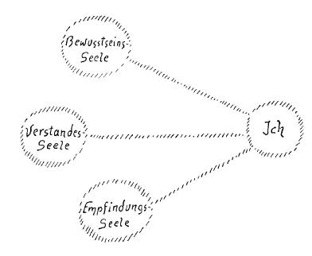
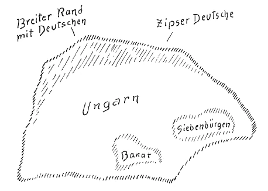

Dornad, 23. November 1918 ^hopd5r

Ich habe in den letzten Betrachtungen von den verschiedensten Gesichtspunkten aus versucht, Ihnen die Ideen und Impulse ein wenig vorzuführen, welche seit langer Zeit die proletarischen Kreise bewegen, in den proletarischen Kreisen leben, und die gerade das Allerwesentlichste zu dem beitragen werden, was von der Gegenwart ab in die nächste Zukunft hinein weltbewegende Ereignisse sein werden. Ich möchte heute, um diese Betrachtungen dann morgen zu einer Art von Abschluß zu bringen, auf manches hinweisen, was gewissermaßen aus der Vergangenheit her an Kräften für die Gegenwart vorhanden ist, was für den genauer, namentlich für den geisteswissenschaftlich Beobachtenden, wahrnehmbar ist an die Geschicke der Menschheit bestimmenden Kräften, die sich in der Vergangenheit vorbereitet haben, jetzt da sind, die aber eigentlich nicht so an der Oberfläche liegen, wie die meisten Menschen heute glauben, die aber berücksichtigt werden müssen von jedem, der an irgendeinem Punkte der Weltentwickelung, und an einem Punkte steht ja jeder, wird teilnehmen wollen bei der Gestaltung der Ereignisse - man kann schon von solcher Gestaltung der Ereignisse sprechen —, die sich von der Gegenwart in die Zukunft hinein bilden wird. ^c0fsdq

Dasjenige, was geschieht, geschieht ja immer aus bestimmten Kräften heraus, die da oder dort ihr Zentrum haben und die dann ausstrahlen nach den verschiedensten Richtungen hin. Wir haben gesehen, wie in den letzten viereinhalb katastrophalen Jahren gewissermaßen nach den verschiedensten Richtungen hin sich lang, lang vorbereitende Kräfte entladen haben, wie sie die verschiedenste Form angenommen haben, so daß tatsächlich dasjenige, was in den letzten viereinhalb Jahren geschehen ist, deutlich voneinander unterscheidbare Epochen, wenn sie auch der Zeit nach kurz sind, zeigt, und man nicht damit auskommt, wenn man etwa in Bausch und Bogen diese Ereignisse der viereinhalb letzten Jahre eben einfach als den «Krieg» der letzten Jahre bezeichnet. Die Ereignisse sind an einem gewissen Punkte, ich möchte sagen, zu einer kriegerischen Entzündung gekommen. Dann aber traten zu den Dingen, die zuerst, ich möchte sagen, mehr illusionär in die Menschenbewußtseine hereinleuchteten und die auch in der allerillusionärsten Weise von den breitesten Kreisen gedeutet worden sind, ganz andere Kräfte hinzu. Die Entschlüsse der Menschen, die Willensimpulse der Menschen wurden in verhältnismäßig kurzer Zeit ganz anders, als sie vorher waren. ^ar74sa

Das alles will sorgfältig berücksichtigt werden. Man wird nämlich in der Zukunft sehen, daß da und dort diese oder jene Willensrichtungen auftauchen werden. An einer Stelle, in einem Zentrum wird man das, in einem anderen Zentrum jenes wollen. Diese Willensimpulse, die von Menschengruppen ausgehen werden, die werden sich in der mannigfaltigsten Weise durchdringen, gegenseitig bekämpfen. An eine Harmonie der wirksamen Kräfte ist dabei nicht im allerentferntesten zu denken, sondern es ist zunächst nur daran zu denken, daß der einzelne sich wirklich Verständnis für dasjenige erwirbt, was da oder dort auftritt. Heute sind die wenigsten Menschen überhaupt vorbereitet dazu, das oder jenes in der richtigen Weise zu taxieren, was auftreten wird, denn man hat sich zu sehr gewöhnt, die Dinge nach vorgefaßten Meinungen, nach Schlagworten zu beurteilen. Man hat im Laufe des neunzehnten Jahrhunderts und bis heute sich nach und nach so erzogen, daß man den Blick abgelenkt hat von demjenigen, worauf es eigentlich ankommt. Dadurch ist man auch kaum irgendwo heute leicht in die Lage versetzt, das Gewicht der Willensimpulse, die von dieser oder jener Menschengruppe ausgehen, in der richtigen Weise zu taxieren. Dafür hat der Verlauf der letzten Ereignisse hinlängliche Beweise geliefert. Diese Beweise werden einmal von der Geschichte verzeichnet werden. Vielleicht schneller, als die Menschen glauben, werden sie von der Geschichte verzeichnet werden. Aber für denjenigen, der sich ein irgendwie die Ereignisse berührendes Urteil bilden will, für den ist es notwendig, daß er heute schon den Willen entwickelt, die Freignisse zu taxieren, die Ereignisse abzuschätzen. ^qpp6ai

Ich sage: Beweise finden sich für das, was ich eben gesagt habe, in Hülle und Fülle. Man braucht nur einen schlagenden Beweis zu liefern, einen Beweis, dessen Tragkraft leider, leider noch allzusehr in die Gegenwart hereinragt, indem in dieser Hinsicht noch immer an den Orten, wo die Urteile nicht getrübt sein sollten, diese Urteile vielfach getrübt sind. Wir haben nämlich im Laufe der letzten Jahre die betrübende Erfahrung gemacht, daß gerade Menschen, die in verantwortungsvollen Stellungen waren da oder dort auf den verschiedensten Gebieten, daß Leute, die das oder jenes zu lenken oder zu leiten hatten oder auch nur das oder jenes zu beurteilen hatten — denn vom Urteil hängt ja sehr viel ab, von der sogenannten wahren öffentlichen Meinung, die manchmal eigentlich die unausgesprochene Gedankenmeinung der Menschen ist und die doch eine gewisse tiefe Bedeutung hat -, wir haben die Erfahrung gemacht und sie wirkt eben in die Gegenwart noch herein, daß sich Leute an maßgebenden Stellen oder auch an nichtmaßgebenden Stellen, die aber doch in Betracht kommen, über alles, über was sie hätten ein gesundes Urteil haben sollen, sich Illusionsurteile gebildet haben. Ich habe zum Beispiel berührt die Tatsache, daß gerade dem deutschen Volke vom Auslande dadurch ein übles Urteil angehängt worden ist, das mehr als man glaubt im Laufe der letzten Ereignisse gewirkt hat: das ist das Urteil über den deutschen Kaiser. Dieses Urteil über den deutschen Kaiser, es berichtigt sich ja jetzt durch die allerletzten Ereignisse ein wenig, aber es fängt eigentlich erst an, sich zu berichtigen. Das Übelste an diesen Urteilen war dasjenige, was geradezu verheerend gewirkt hat, daß man diesen Mann für einen bedeutenden Mann gehalten hat. Hätte man ihn nicht für einen bedeutenden Mann, sondern für einen höchst unbedeutenden, überhaupt für die Ereignisse gar nicht in Betracht kommenden Menschen gehalten, wie er war seit seinem Regierungsantritt durch alle Jahre hindurch, so würde auch nicht jenes schlimme Urteil des Auslandes zustandegekommen sein, welches — die Geschichte wird es schon ausweisen — größere Verheerungen angerichtet hat, als man sich heute noch irgendwie vorstellen kann. ^xsgy7s

Nicht wahr, es wird allerdings ein wenig zur Berichtigung beitragen, wenn man hinsehen wird auf die heillose Angst, die wenige Leute in Deutschland hatten, als dieser Mann, noch in den letzten Tagen sich sträubend gegen den Rücktritt, ins Hauptquartier floh, um im Hauptquartier möglicherweise irgendeine Auskunft zu finden, sich doch zu halten, die alten Zustände irgendwie doch zu halten. Wenn man richtig taxieren konnte die Stimmen derjenigen, die ja immer rieten, er soll nach Berlin zurückkehren, wohin er gehört, so muß man sagen, daß daran sich eben das Gewicht von notwendigen Urteilen zeigt. Die Dinge müssen eben nicht nur gedacht werden, sie müssen taxiert werden, sie müssen gewogen werden. Es ist im höchsten Grade leichtsinnig, wenn zum Beispiel in einer Basler Zeitung gestern ein Artikel erschienen ist gewissermaßen zur Entschuldigung des deutschen Kaisers und zu einer Anklage des deutschen Volkes. Dieses deutsche Volk hat wahrhaftig genug gelitten durch Jahrzehnte hindurch durch all dasjenige, was gerade durch die Unbedeutendheit und durch die theatralische Aufbauschung aller Verhältnisse, durch das unleidige Tyrannisieren geleistet worden ist. Und wenn von einem «Deutschen im Auslande», so wie es in dieser Basler Zeitung gestern geschehen ist, dieses deutsche Volk jetzt angeklagt wird in der dümmsten Weise, um die törichte Behauptung zu tun, daß dieser Mann bloß ein Exponent des deutschen Volkes gewesen wäre — was er durchaus nicht gewesen ist -, so ist das ein bodenloser Leichtsinn, der unbedingt gerügt werden muß. Es kommt heute darauf an, daß solch leichtsinnige Urteile nicht gerade in den angrenzenden Ländern Platz greifen, daß die Menschen hinschauen auf solche Urteile, die die ganze Atmosphäre, in die wir eintreten müssen, geeignet sind zu verpesten. ^ep7ftj

Diese Dinge müssen wirklich heute mit einem durchdringenderen Blick angesehen werden. Man muß nicht schlafen diesen Dingen gegenüber, man muß wachen. Man muß wirklich diese Dinge mit einem nicht emotionellen, aber mit einem wirklich verstandesmäßigen Temperament aufzunehmen in der Lage sein, und man muß eine Entrüstung empfinden, gedankenmäßig empfinden, wenn derlei Torheiten heute in die Welt gesetzt werden, die geeignet sind, ein sachgemäßes Urteil vollständig zu verrücken. Und ein sachgemäßes Urteil ist heute vor allen Dingen notwendig. Versuchen Sie es einmal, die Dinge wirklich so zu nehmen, wie sie heute genommen werden sollen, indem man sie in ihrem Gewichte nimmt, indem man nicht über die Dinge, die Stimmung machen, die Meinungen in der Welt verbreiten, mit einem gleichgültigen Humor, der kein Humor ist, hinweggeht und alle fünfe gerade sein läßt, da es sich doch um Ereignisse handelt, die, jedes einzelne an sich, von einer ungeheueren, weittragenden, welthistorischen Bedeutung sein können. Diese Dinge müssen heute auch auf einem eindringlicheren Hintergrunde beobachtet werden. Und ich möchte so gerne es erleben, daß in den Herzen derer, die sich zur Anthroposophie bekennen wollen, etwas einzöge von dem, was ich ein welthistorisches Urteilsvermögen nennen möchte. Ich möchte, daß etwas einzöge in Ihre Herzen von dem, was die Wichtigkeit des Augenblickes ausmacht, daß wirklich hinausgekommen werde über die Stimmung, die niemals vorhanden war da, wo ich versuchte, anthroposophisch orientierte Weltanschauung in die Welt zu bringen, daß hinausgekommen werde über die Stimmung, die das, was in der Anthroposophie vorgebracht wird, nur nimmt wie eine Sonntagsnachmittagspredigt, wie etwas, was nur zur Wärmung der Herzen und zur Beruhigung, zur Temperierung der Seelen bestimmt ist. Nein, alles gerade auf dem Boden anthroposophisch orientierter Weltanschauung war dazu bestimmt, die Herzen und die Seelen hineinzuleiten in jene Weltenströmung, die sich heraufzog seit dem Ende des neunzehnten Jahrhunderts, die hinwies immer mehr und mehr auf die bedeutenden, großen Ereignisse, die zur Erschütterung der Menschheit kamen und noch immer mehr und mehr kommen werden. Alles war darauf abgesehen, die Herzen hinzulenken auf die Kräfte, die wirken, nicht bloß auf irgendein Gern-Hören desjenigen, was so ein wenig die Seelen temperiert und was so ein wenig die Herzen erwärmt, damit man, wenn man aufgenommen hat, was anthroposophisch orientierte Weltanschauung bietet, dann mit einer gewissen beruhigteren Seele schlafen kann, als man sonst schlafen kann. Der einzelne ist heute gar nicht in der Lage, bloß auf sich zu sehen, bloß gewissermaßen eine Art neue Religion zu empfangen zur Beruhigung seines einzelnen Herzens. Dasjenige, was von der Menschheit gefordert wird, ruft den einzelnen auf, teilzunehmen an demjenigen, was durch die menschliche Sozialität wogt und wallt. ^e3559y

Dazu ist eben notwendig, daß man die Dinge auf einem größeren Hintergrund betrachtet. Ich gebe ja zu, daß es notwendig war im Lauf der letzten Jahre, unter den Impulsen, die anthroposophisch orientierte Weltanschauung herantragen soll zu den Herzen der Menschen, schnell hintereinander, weil die Zeit drängte, vieles zu bringen, schnell die Ideen einander ablösen zu lassen. Hätte man manchmal zu demjenigen, was man im Laufe einer Woche vorzubringen hatte, einen Monat oder noch länger Zeit gehabt, hätte man es in kleinen Portionen bieten können, was durch den Drang der Zeit notwendigerweise schnell an die Herzen herangebracht werden mußte, es wäre vielleicht tiefer in die Seelen hineingezogen. Aber das ging ja nicht. Die Zeit drängte, und die Ereignisse haben bewiesen, daß die Zeit drängte. Ich gebe zu, daß durch die Schnelligkeit, mit der die Lehren der anthroposophisch orientierten Weltanschauung an die Mitglieder der anthroposophischen Bewegung herangetreten sind, wirklich zuweilen die Tatsache vorlag, daß das Spätere das Frühere ausgelöscht hat. Allein man kann nicht in einer so ernsten Sache sein, ohne seinen ganzen Sinn zu ändern. Und in gewissem Sinne erneuert sich in der Gegenwart das Wort, welches zur Zeit der Begründung des Christentums immer wieder und wieder gesprochen werden mußte: Ändert den Sinn. Darauf allein kommt es nicht an, daß wir inhaltlich diese oder jene Lehre aufnehmen; darauf kommt es an, daß wir die ganze Sinnesrichtung ändern, daß wir alles abstreifen, was bestimmend war für die Richtung unseres Urteils aus dem neunzehnten Jahrhundert heraus, was man wirklich nennen kann, wie ich es vorhin anläßlich einer Ansprache eben benannt habe, das Jahrhundert der unanständigen Psychologie, der unanständigen Seelenrichtung, wo man, wenn man in die menschliche Seele hineingeschaut hat, wegen jenes mangelnden Vertrauens zu den göttlich-geistigen Kräften der Seele, von dem ich gestern sprach, innerhalb der menschlichen Seelen nur Willkür oder nur Ohnmacht oder nur Tatlosigkeit sehen kann, wo man niemals so etwas begriffen hat wie das Fichtesche Wort: «Der Mensch kann, was er soll; und wenn er sagt: ich kann nicht, so will er nicht.» — Dieses neunzehnte Jahrhundert war ein Jahrhundert großer wissenschaftlicher Errungenschaften. Allein diese Errungenschaften waren derart, daß sie den Willen der Menschen gelähmt haben und daß sie den Glauben erweckt haben, alles das, was aus der Menschenbrust kommt, komme nur als rein Zufälliges aus dieser Menschenbrust heraus. Daß aus jeder Menschenbrust heraus das GöttlichEwige strahle und daß jeder Mensch verantwortlich ist, das Göttlich-Ewige durch sich darzustellen, das ist es, was das neunzehnte Jahrhundert vollständig unterdrückt hat, das ist es, was das GoetheZeitalter hineingeführt hat in das Zeitalter des Spießertums; das ist es, was macht, daß die heutige Intelligenz so unvorbereitet ist für alles das, was ich Ihnen angegeben habe und was durch Millionen und Abermillionen Proletarierseelen als Impuls zieht. ^gs9vm4

Verstehen, darauf kommt es zunächst in der Gegenwart an. Tun, dazu wird erst die Gelegenheit kommen, wenn die Menschen sich wirklich angestrengt haben zu verstehen. Nichts von dem, wovon heute zum Beispiel das Bürgertum glaubt, daß es gut sein könnte in der Zukunft, nichts von dem wird irgendwie angreifen diejenigen Impulse, die ich Ihnen in diesen Tagen als die Impulse des von unten nach oben strebenden Proletariats angegeben habe. Manches wirkte, wenn es nicht so tragisch wäre, tragikomisch, was heute an Quacksalberei ausgeht von denjenigen, die durch Jahrzehnte Gelegenheit gehabt hätten, zu lernen an den Ereignissen und die an diesen Ereignissen gar nichts gelernt haben. ^kjs0v9

So wollen wir denn heute einmal, um eine Vorbereitung zu schaffen für unmittelbar Aktuelles, das ich noch vorzubringen habe, ich möchte sagen, ein größeres Grundtableau uns schaffen, gewissermaßen einen Hintergrund schaffen. Sehen Sie, alles dasjenige, was in die moderne Sozietät hineinwirkt, was da wirkt als Kräfte, die sich entladen werden in der verschiedensten Weise gegen die Zukunft zu, das kommt heraus aus gewissen Grundkräften, die in der mannigfaltigsten Weise durcheinanderwirken. Ich habe gestern am Schlusse darauf hingewiesen, daß immer mehr und mehr vom Westen aus der Kampf inszeniert werden wird, der ein rein materieller Kampf ist und der die Menschheit in die materialistischen Kämpfe hineinstürzen wird: daß vom Osten her das Blut konterkarieren wird dasjenige, was da vom Westen her als wirtschaftlicher Kampf kommt. Dieses Wort, das in der Zukunft außerordentlich wichtig sein wird in sozialer Beziehung, das für jeden wichtig ist, der sich ein helles Urteil wird bilden wollen, dieses Wort müssen wir näher interpretieren. Ich habe Gelegenheit gehabt im Laufe der letzten Jahre, mit den allerverschiedensten Leuten über die Dinge zu sprechen, welche aus den wirkenden Kräften herausgeholt werden sollten, um der Zukunft da oder dort diese oder jene Richtung zu geben. Man war bei jeder Gelegenheit, wo es sich darum handelte, etwas Wirksames zu besprechen, geradezu furchtbar, ich möchte sagen, beklemmt von der Kurzsinnigkeit, die allmählich die Urteilskraft der modernen Menschheit angenommen hat. Man spricht heute ja selbstverständlich gern davon, daß derjenige, der irgendwie mitdenken will über das, was sich entwickelt, die volksmäßigen Verhältnisse da oder dort kennen soll. Allein gerade dieses Kennenlernen, die Leute suchen es ja gar nicht auf den Wegen, auf denen es heute notwendigerweise gesucht werden muß, und daher die grotesken und grandiosen Irrtümer. Der eine Irrtum, den ich Ihnen angeführt habe, der ist ja nur ein Teilirrtum. Man muß, um sich das ganze Gewicht dessen, was dabei in Betracht kommt, vor die Augen zu stellen, darauf hinweisen, daß jetzt ja eben die Zeit abläuft, in der ganze weite Massen in die unsinnigsten Urteile hineingetrieben worden sind. ^zhe717

Ich habe Ihnen gestern gezeigt, daß allerdings bei der Mehrheit der Menschen, denn das ist ja das Proletariat, Glaubenskraft ist, die sich nur auf rein materielle Dinge erstreckt. Ich habe Ihnen sagen müssen: Wenn die Glaubenskraft, die zum Beispiel mit marxistischen Impulsen beim Proletariat durch die Jahrzehnte sich herausgebildet hat, wenn diese Glaubenskraft nur im allergeringsten Maße irgendwie beim Bürgertum vorhanden gewesen wäre, es wäre etwas anders als dasjenige, was leider heute der Fall ist. Aber es wäre dann notwendig gewesen, daß gerade diejenigen Menschen, die Gelegenheit gehabt haben durch ihre soziale Stellung, diese Gelegenheit ausgenützt hätten — da sie es nicht getan haben, müssen sie es in der Zukunft tun —, um die Wege zum Urteilen zu betreten, auf denen einzig und allein wirkliches Urteil zu gewinnen ist; ich meine nicht Urteil über das oder jenes, sondern Urteil überhaupt. Bedenken Sie doch nur einmal, daß nicht ein Volk, sondern über eine ganze weite Fläche hin Menschen in der Lage waren, durch Jahre zwei Generäle für bedeutende Menschen zu halten, die höchst unbedeutende Menschen waren: Hindenburg und Ludendorff. Eine solche Verfälschung des Urteiles für ganze weite Menschenkreise, das ist ein Charakteristikon unserer Gegenwart. Hauptsächlich hängt dies damit zusammen, daß die Menschen nicht die Verantwortlichkeit fühlen bei der Bildung eines Urteils. Ich weiß selbstverständlich, daß zunächst gesagt werden kann: Ja, wenn schon jemand ein Urteil gehabt hätte, ein richtiges Urteil zum Beispiel über Ludendorff, der ja als eine pathologische Natur genommen werden muß, der als eine Natur genommen werden muß, die sozusagen seit Kriegsanfang nicht mehr anders als vom psychiatrischen Standpunkte aus zu beurteilen ist —, ich weiß, daß man sagen kann: Was hätte solch ein Urteil geholfen in einer Zeit, wo ein Urteil nicht ausgesprochen werden durfte. — Gewiß, das gilt, aber darauf kommt es nicht an, sondern darauf kommt es an, daß der Mensch zunächst das Urteil wenigstens in sich selber bildet; dann wird schon das andere kommen, daß er sich nicht bis in die innersten Gründe seiner Eigenheit hinein benebeln läßt. Und jetzt muß das um so mehr ausgesprochen werden, denn die Macht der Ereignisse hat es mit sich gebracht, daß einzelne Urteile berichtigt werden müssen bei den sogenannten Zentralmächten. Diese Macht der Ereignisse ist noch nicht da für die Berichtigung der Urteile der Entente und der amerikanischen Mächte. Und das würde ein ungeheures Unheil über die Menschheit bringen, wenn auch da abgewartet würde mit der Berichtigung der Urteile, bis die Macht der Ereignisse spricht; wenn jetzt etwa der Ausgang da wäre für eine Anbetung der Entente-Machthaber; wenn nicht in den Herzen der Entschluß reif würde, klar zu sehen, wie es sich da verhält. Wenn jetzt Anbetung des Erfolges auftritt, wenn die Bestimmung der Urteile auch nur durch den äußeren Gang der Ereignisse geschehen sollte, so müßte das für die Entwickelung der Menschheit von ungeheuer verheerenden Folgen sein. Das wird ja nicht ein Zeichen sein, wie der eine oder der andere unter der Knebelung des Urteiles sich wird äußern können, aber wenigstens in seiner Eigenheit sollte sich der Mensch ein unabhängiges Urteil über dasjenige bilden, was ist. Das bildet man sich, wenn man in sich selber fühlt, daß man nicht eine durch den Zufall in die Welt geschleuderte Persönlichkeit ist, die denken kann, was sie will, sondern wenn man fühlt, daß man ein Glied der göttlichen Weltordnung ist und daß die Kraft, welche ein Urteil hereinsetzt in dieses Herz, in diese Seele, eine Kraft ist, der man selbst mit seinen intimsten Gedanken verantwortlich ist. Im Laufe der Ereignisse der letzten viereinhalb Jahre geschah so manches. Das oder jenes hat sich da oder dort abgespielt. Man kann sagen: Fast nichts hat sich abgespielt, worüber zum Beispiel die deutsche Regierung oder die deutsche Heeresführung an verantwortungsvoller Stelle ein richtiges Urteil sich gebildet hat. Über alles hat sie falsch geurteilt und unter falschem Urteil weiter gehandelt. - Das sind schon Beweise dafür, wie wenig die Gegenwart und die jüngste Vergangenheit die Menschen dazu erzogen hat, die Dinge zu beurteilen. ^xvqs59

Ich sagte, ich habe Gelegenheit gehabt, mit den verschiedensten Menschen zu sprechen. Die Menschen haben schon einmal äußerlich abstrakt die Meinung, man müsse kennenlernen, was zum Beispiel in den verschiedenen Volkskräften spielt. Da sind sie dann zufrieden, wenn der eine oder andere Journalist in diese oder jene Gegend geschickt wird und seine Zeitungsartikel schreibt, und die Menschen wissen gar nichts damit anzufangen, wenn man ihnen einfach auch auf dem Gebiete des geistigen Lebens mit demselben Prinzip kommt, mit dem man kommen muß zum Beispiel in der Mathematik, wo von elementaren Grundmaximen ausgegangen wird und zu den weitesten Schlüssen gekommen wird. Müssen Brücken gebaut werden oder Eisenbahnen, da geben die Menschen zu, daß zum Aufbau die Wissenschaft davon nötig ist, die von den einfachsten Dingen ausgeht, um dann zu den weittragendsten Schlüssen zu kommen. Aber Geschichte treiben, Geschichte machen wollen die Leute ohne irgendwelche Prinzipien und sie werden gar nichts damit machen können, wenn man ihnen sagt: Niemand kann die europäischen Verhältnisse beurteilen, der nicht wenigstens das Elementare weiß, daß auf der italienischen Halbinsel die Empfindungsseele das vorzugsweise volksmäßig Wirksame ist, in Frankreich die Verstandes- oder Gemütsseele, im Britischen Reiche die Bewußtseinsseele und so weiter —, wie wir das kennengelernt haben. Diese Dinge liegen zugrunde demjenigen, was geschieht, wie das Einmaleins zugrunde liegt dem Rechnen. Und bevor man nicht mit Bezug auf Kenntnis der realen Verhältnisse in der Welt von diesen Dingen ausgeht, ist man, welche Stelle man auch einnimmt im Gefüge des sozialen oder politischen Lebens der heutigen Zeit, ein unfähiger Mensch, geradeso wie man ein unfähiger Mensch beim Brückenbau wäre, wenn man nicht die einfachsten Dinge der Mathematik kennen würde. Die Menschen müssen dazu kommen, dieses einzusehen; sie müssen das durchschauen lernen. Denn davon hängt die Zukunft der Menschheit ab, daß die Menschen dieses durchschauen können. Das ist es, worauf es ankommt. ^gz8bum

Denn allein, wenn man erst diese Grundtatsachen kennt, dann kennt man die verschiedenen Kräfte, die hereinstrahlen in dasjenige, was geschieht. Sie können den Weg einer Hökerfrau vom Land zur Stadt nicht in richtiger Weise beurteilen, wenn Sie nicht imstande sind, den Gang der Hökerfrau vom Lande zur Stadt hineinzustellen in das Gefüge des sozialen Lebens. Es war der Menschheit bis zu einem gewissen Grade gestattet, in atavistisch-schläfrigem Zustande das soziale Leben zu durchleben, und diesen Zustand haben sich die Menschen im neunzehnten Jahrhundert, um tiefer auszuschlafen, konserviert. Es wird der Menschheit in der Zukunft nicht gestattet sein, in dieser Weise weiterzuleben, sondern es wird ihr die notwendige Verpflichtung auferlegt, mitzudenken, was die Hierarchien der Angeloi, Archangeloi, Archai und so weiter für den Gang der Entwickelung der Menschheit ihrerseits denken und was sie hineinstrahlen lassen in das, was die Menschen tun. Das Kleinste muß an das Größte geknüpft werden in der alltäglichen Beurteilung. Wenn Sie heute in diesen oder jenen Ländern Räte, Arbeiter- und Soldatenräte auftauchen sehen, wenn Sie in die Gefahr, daß überall, mit Ausnahme der Länder der Entente, Arbeiter- und Soldatenräte auftauchen, kommen werden, dann müssen Sie das Gewicht einer solchen Tatsache in der richtigen Weise würdigen können. Ein Urteil zu gewinnen über diese Dinge, das ist es, was vor allen Dingen notwendig ist. Fragen Sie nicht zunächst: Was istzu tun? — Was zu tun ist, wird schon kommen, wenn nur ein wirkliches Urteil, aber ein Urteil so vorhanden ist, daß das Kleinste an die großen Linien des Weltgeschehens geknüpft werden kann. Das große Weltgeschehen, das ist das Eigentümliche unserer Zeit, wird in diesen Tagen aktuell; es wird nicht mehr eine bloße Theorie sein, sondern es wird aktuell. ^58o05i

In den Gang der europäischen Ereignisse zum Beispiel — die amerikanischen sind ja nur ein kolonialhafter Anhang der europäischen Ereignisse — spielen Kräfte herein, die sich lange, lange vorbereitet haben. Der Beobachter der europäischen Verhältnisse — wir haben von den verschiedenen Gesichtspunkten gerade in diesen Tagen darauf hinzudeuten - sollte auf die besondere Konfiguration, sagen wir, der sozialen Verhältnisse im Britischen Reich achthaben, er sollte auf die besondere Konfiguration der sozialen Verhältnisse im Osten Europas, in Rußland und in der Mitte Europas wohl achthaben, sollte acht darauf haben, welche Kräfte da hereinspielen. Denn an der Oberfläche der Ereignisse maskieren sich diese Ereignisse vielfach, und wer nur die Oberfläche der Ereignisse beobachtet, der wird leicht zu, wie man sagt, Schlagworten, man kann ja auch sagen Schlagvorstellungen, Schlagbegriffen kommen, durch die er die Ereignisse beherrschen will. In den Köpfen der Menschen spielt heute vielfach recht oberflächliches Zeug. Aber in den Impulsen der Menschen, da spielen Kräfte, die sich seit Jahrhunderten nicht bloß, sondern seit Jahrtausenden vorbereitet haben und die heute gerade erst ihre ganz signifikante Gestalt annehmen werden. ^msfgdc

Sehen Sie, es ist keineswegs die Möglichkeit vorhanden, daß sich jenes internationale Wesen, das ich Ihnen charakterisiert habe als die Stimmung des Proletariats, das vorzugsweise von marxistischen Ideen genährt ist, im weitesten Umfange natürlich marxistischen Ideen, wirklich über ganz Europa etwa verbreitet. Das ist eine Illusion des Proletariats. Und da das Proletariat eine gewisse Macht darstellen wird, so ist das eine sehr verderbliche Illusion des Proletariats. Übersehen wir das nicht, daß das Schlimmste herauskommen würde, wenn diese Illusion des Proletariats über die Welt Herrschaft gewinnen würde, denn man wäre dann genötigt, diese Herrschaft wiederum zu überwinden. Besser wäre es, wenn man sehen würde, wie sich die Dinge vorbereiten und wie den Dingen begegnet werden kann. Selbst angenommen, daß die Impulse des Proletariats in gewissen Gegenden zur Herrschaft gelangen, was würde daraus geschehen? Nun gut, sie würden äußerlich zur Herrschaft gelangen, man kann ebensoviele Leute da oder dort abmurksen, wie der Bolschewismus in Rußland abgemurkst hat. Aber alle diese Ideen sind lediglich geeignet, Raubbau zu treiben, sind lediglich geeignet, das Alte zu verzehren und Neues nicht zu begründen. Wenn die Ideen des Proletariats soziale Gestaltung werden, sich einleben, so wird dasjenige, was an Werten da ist, nach und nach verbraucht werden, in einer schnellen Progression verbraucht werden. Bitte nehmen Sie nur solche Tatsachen — ich will Ihnen einzelne vorführen, sie könnten sehr vermehrt werden —, nehmen Sie eine einzige solche Tatsache: Die Staatskasse in Rußland hatte zum Beispiel noch im Jahre 1917 eine Einnahme von 2852 Millionen Rubel, im Unglücksjahre 1917: 2852 Millionen Rubel. Der Bolschewismus brach herein. Er trieb Raubbau. Die Staatseinnahmen von Rußland 1918: 539 Millionen Rubel! Das ist etwa der fünfte Teil des im vorherigen Jahre Eingenommenen. Sie können sich aus solchen Zahlen die Progression selber ausrechnen, die eintreten muß, wenn Raubbau getrieben wird. Man muß diese Dinge nicht nach den Urteilen, die sich obenhin bilden, betrachten, sondern man muß sie nach dem betrachten, wie der objektive Gang der Ereignisse in der Menschheitsgeschichte unter dem Einfluß dieser Tatsache verläuft. Man käme eben, wenn diese soziale Ordnung sich verbreitete, bei Null an, beim Nichts. Aber bevor dieses Nichts eintritt, treten die Reaktionen auf aus dem Unterbewußten der Menschen da oder dort, und in den sich ausbreitenden Proletarismus, der marxistisch durchsetzt ist, muß sich überall in den verschiedensten Zentren dasjenige wiederum hineinmischen, was in dem Glauben, in den Impulsen oder auch in den Illusionen oder selbst in den Narrheiten der Menschen durch Jahrhunderte, manchmal durch Jahrtausende sich vorbereitet hat. Es wird sich ja nicht hineinmischen in derselben Gestalt, in der es da war, aber es wird sich hineinmischen in verwandelter Gestalt. Daher muß man es kennen und muß in der Lage sein, es in der richtigen Weise zu taxieren. ^9277c1

Nun haben die Mächte, die jetzt zum Teil dem Untergang verfallen sind, zum Teil aber noch die Welt beherrschen, diese Mächte haben es sich ja immer zu ihrer mehr oder weniger bewußten oder unbewußten Aufgabe gemacht, die Menschen zu täuschen. Was ist nicht alles getäuscht worden auf dem Umwege des sogenannten geschichtlichen Unterrichtes! In allen möglichen Ländern ist ja Geschichte nichts weiter als eine Legende, ist Geschichte nur dazu da, um die Menschenköpfe so zu dressieren, daß sie mit ihren Gedanken diejenige Richtung einschlagen, die den Machthabern angenehm erscheint und als die richtige erscheint. Aber die Zeit ist gekommen, wo sich die Menschen ihr eigenes Urteil werden bilden müssen. Hier ist ja im Laufe der Jahre verschiedenes getan worden, gerade an dieser Stelle, um das eine oder andere Urteil richtigzustellen. Aber heute muß noch etwas anderes gefragt werden. Heute muß unter den —- man weiß gar nicht wieviel man der Zahl nach sagen soll —, unter den hunderten von Fragen, die brennend auftauchen, vor allen Dingen auch die Frage gestellt werden: Wie sind die verschiedenen Herrschaftsverhältnisse, die verschiedenen sozialen Strukturverhältnisse entstanden, für die die Menschen da oder dort schwärmen oder geschwärmt haben oder schnell verlernt haben zu schwärmen in den letzten Wochen? — Die Menschheit hat ja durch Jahre von Schlagworten gelebt, Schlagworten wie «preußischer Militarismus» oder «deutscher Militarismus», «Völkerbund», «internationales Recht», nun, und so weiter, was eben nur Schlagworte waren. Das hat eigentlich die Köpfe der Menschen beherrscht und verwirrt. Wie gesagt, hier ist ja manches zur Berichtigung dieser Urteile gesagt worden. Das Wichtige ist aber, daß man einsähe, daß ja die Dinge in der nächsten Zeit natürlich nicht in derselben Gestalt auftreten werden, aber daß man sie kennen muß, damit man weiß, wenn sie in einer neuen Gestalt auftreten, daß sie es sind. ^qfdfxl

Nicht wahr, es ist anzunehmen zum Beispiel, daß die HohenzollernDynastie nicht wiederum als solche auftaucht. Aber die Gefühle der Menschen, unter denen die Hohenzollern-Dynastie leben konnte, diese Gefühle der Menschen leben fort, maskieren sich in anderer Form. Oder, es ist nicht einmal sehr wahrscheinlich, daß, selbst unter dem bis zu einem gewissen Grade ja gewiß vorhandenen Willen der Entente, die unselige Habsburg-Dynastie wiederum irgendwie auftaucht. Aber darauf kommt es nicht an. Die Gefühle, welche in der Lage waren, in den Menschenherzen diese Habsburger-Dynastie zu halten, die werden weiterleben. Sie werden natürlich nicht darauf gehen, diese Habsburger-Dynastie wieder einzusetzen, aber sie werden mitwirken, diese selben Gefühle, an jener Reaktion gegen den Proletarismus, von der ich gesprochen habe; sie werden in einer ganz anderen Form wiederum auftreten. Daher ist es notwendig, dasjenige, was von den verschiedensten Zentren auftreten wird, wirklich mit gesundem Urteil zu durchschauen. Es handelt sich dann dabei darum, hinzuschauen auf die Verhältnisse, aber hinzuschauen mit einem durch die Wirklichkeit gerichteten Blick. Die Tatsachen als solche haben keinen Wert. Ich habe in meinen Büchern — Sie können das an den verschiedensten Stellen finden —- von Tatsachenfanatismus gesprochen, der so verheerend wirkt. Dieser Tatsachenfanatismus wurzelt in dem Glauben, daß dasjenige, was man außen sieht, schon eine Tatsache ist. Es wird eine Tatsache erst dadurch, daß es ins richtige Urteil eingespannt wird. Das richtige Urteil muß aber hinter sich den Impuls der rechten Richtkraft haben. ^yre1fp

 ^r1vqvz

Nehmen Sie ein Beispiel. Sie wissen, ich habe oft gesagt, daß in Mitteleuropa vorzugsweise alle völkischen Impulse dadurch bedingt sind, daß in diesem Mitteleuropa der Volksgeist durch das Ich wirkt im Gegensatz zu den verschiedensten Gebieten Westeuropas. Aber das Ich hat die Eigentümlichkeit, daß es, ich möchte sagen, auf- und abkreist unter den anderen Gebieten, die fest sind. Nehmen Sie also an: im Süden und Westen Empfindungsseele, Verstandes- oder Gemütsseele, Bewußtseinsseele, in der Mitte aber das Ich (es wird gezeichnet). Das Ich kann in der Bewußtseinsseele, in der Verstandesseele, in der Empfindungsseele sein. Es pendelt gewissermaßen auf und ab, es findet sich in alles hinein. Daher die Eigentümlichkeit: Wenn Sie nach dem Westen von Europa schauen, haben Sie, ich möchte sagen, scharfumrissene Volkskonturen. Da ist scharfumrissenes Volkstum, Volkstum, das Sie wirklich, ich möchte sagen, definieren können, das in einem guten Rahmen darinnen ist. Schauen Sie nach Mitteleuropa, vorzugsweise zum deutschen Volke, so haben Sie ein nach allen möglichen Seiten bestimmtes Wesen. Und jetzt verfolgen Sie die Geschichte, indem Sie diese Grundmaximen in der richtigen Weise beurteilen. Sehen Sie hin, wo Sie wollen, im Westen bis Amerika hinüber, im Osten bis nach Rußland, und sehen Sie an, wie da überall deutsches Volkstum als Ferment gewirkt hat. Es geht in diese fremden Gebiete hinein, ist heute drinnen, wird in der Zukunft wirken, auch wenn es sich entnationalisiert hat, wie man sagt; es geht in diese Gebiete hinein, weil das Ich auf- und abschwebt. Es verliert sich darinnen. Das finden Sie aus dem Grundwesen des Volkstums ganz genau heraus. Sehen Sie doch an, wie diese ganze russische Kultur durchsetzt ist von deutschem Wesen, wie Hunderttausende von Deutschen dort eingewandert sind im Laufe einer verhältnismäßig kurzen Zeit, wie sie bis in unendliche Tiefen hinein dem volksmäßigen Wesen das Gepräge gegeben haben. Sehen Sie nach dem ganzen Osten, so werden Sie überall dieses Gepräge finden, und gehen Sie selbst auf die Jahrhunderte zurück, fragen Sie heute an, gehen wir zum Beispiel nach Ungarn, wo angeblich eine magyarische Kultur ist. Diese magyarische Kultur beruht vielfach darauf, daß alles mögliche Deutsche dort als Ferment hineingegangen ist. Der ganze Nordrand Ungarns ist von den sogenannten Zipser-Deutschen bewohnt, die natürlich dann majorisiert, tyrannisiert, entnationalisiert worden sind, die Unsägliches gelitten haben, die aber ein Kulturferment abgaben. Gehen wir weiter nach dem Osten, Siebenbürgen, da finden wir die Siebenbürger Sachsen, die einst am Rhein gewohnt haben. Gehen wir weiter zu dem sogenannten Banat, da haben Sie die Schwaben, die aus dem Württembergischen eingewandert sind, die das Kulturferment abgegeben haben. Und würde ich Ihnen die Karte von Ungarn aufzeichnen, so würden Sie sehen hier den breiten Rand der in das Magyarentum hineingegangenen deutschen Menschen, hierin die Zipser-Deutschen, im Südosten die Siebenbürger Sachsen, hier im Banat die Schwaben, gar nicht gerechnet dasjenige, was an einzelnen da hineingegangen ist. Und das Eigentümliche dieses deutschen Volkstums besteht darin, daß es eben, weil sein Volksgeist durch das Ich wirkt, gewissermaßen äußerlich als Volk untergeht, aber ein Kulturferment bildet. Das ist dasjenige, was beitragen kann zur Beurteilung der wirksamen Kräfte. Das ist eine solch wirksame Kraft. ^ci71hi

 ^s2mxsl

Lassen Sie ruhig, ob es Andrássy oder Karolyi ist, lassen Sie ruhig einen alten Politiker im alten feudalen Sinne, wie man sagt, wirken; dasjenige, was wirkt, ist nur dann nicht Schlagwort, wenn man berücksichtigt, was aus dem Unterbewußtsein der Leute durch solche historische Vorgänge, wie ich Ihnen einen aufgezeigt habe — und Hunderte andere wirken dabei mit -, in der Zukunft bewirkt wird. Und das strahlt aus in das übrige Geschehen von Europa, und man muß im Grunde genommen recht gründlich vorgehen, wenn man heute dieses komplizierte Gefüge von Europa kennenlernen will. Man darf zum Beispiel nicht vergessen, wenn man ein wichtig Mittuendes beurteilen will bei der künftigen europäischen Gestaltung, nämlich den europäischen Osten, daß gewissermaßen jeder nicht nur ein Ketzer war, sondern jeder in Lebensgefahr war, der in Rußland über Rußland die Wahrheit sprach in geschichtlicher Beziehung. Die russische Geschichte ist Ja, zwar nicht viel mehr als die übrigen Geschichten, aber sie ist eben auch durchaus eine Geschichtslegende. So zum Beispiel kommt es denjenigen, die im gewöhnlichen Sinne russische Geschichte lernen, gar nicht zum Bewußtsein — was hier vor einigen Jahren entwickelt worden ist —, daß etwa zu derselben Zeit, als die Normannen im Westen Europas ihren Einfluß geltend machten, Normannisch-Germanisches auch nach dem Osten hin seinen Einfluß geltend machte. Und die russische Geschichte von heute hat ein Interesse daran, im Zurückgehen immer mehr und mehr zu zeigen, wie alles, alles von slawischen Menschen abstammt, von slawischen Elementen abstammt, auch ein Interesse zu verleugnen, daß das maßgebende Element, dasjenige Element, von dem heute noch tief beeinflußt ist, was im Osten ist, von Impulsen herkommt, die normannisch-germanischen Ursprungs sind. Man kommt ja mit der russischen Geschichte nicht viel weiter zurück, als daß man etwa den Leuten erzählt — nun ja, das ist, nicht wahr, der stereotype Satz, der immer wiederum gesagt wird —: Wir haben ein großes Land, aber wir haben keine Ordnung, kommt und beherrscht uns. — So ungefähr beginnt das, während in Wahrheit hingewiesen werden müßte darauf, daß dasjenige, was bis zum Einfall der Mongolen in Rußland sich ausgebreitet hat, germanisch-normannischen Ursprungs war, germanisch-normannische soziale Konfiguration hatte. Das heißt aber so viel, daß sich in Rußland damals etwas ausbreitete, was durch spätere Verhältnisse überwuchert worden ist, was, ich möchte sagen, in Reinkultur sich weiter erhalten und konserviert hat zum Beispiel innerhalb des sozialen Gefüges des Britischen Reiches. Da ist die gradlinige Fortentwickelung. Wenn Sie also die soziale Entwickelung des Britischen Reiches nehmen, so haben Sie die eine Strömung, die natürlich im Laufe der Jahrhunderte sich ändert, die heute aber die gradlinige Fortsetzung der alten normannisch-germanischen sozialen Konstitution ist. Sie haben im Osten nach Rußland hin denselben Strom sich ausbreitend, aber unter dem Mongolenjoch, unter dem Mongoleneinfluß, möchte ich sagen, von einem gewissen Punkte ab abbrechend. Das heißt: Würde dasselbe, was zur Zeit Wilhelms des Eroberers unter normannisch-germanischem Einflusse in der sozialen Struktur des Britischen Reiches vorbereitet worden ist und bis zum neunzehnten Jahrhundert sich so entwickelt hat, daß es die heutige Stellung in der Welt einnimmt, würde sich das in Rußland weiterentwickelt haben, so würde Rußland England ähnlich sein. ^sl37rk

Nun hat nirgends mehr als in Rußland alles dasjenige, was gewirkt hat, tief in die Herzen und in die Seelen der Menschen hineingewirkt. Nun muß man nicht vergessen: Was ist es denn eigentlich, was da mit dem normannisch-germanischen Einflusse kommt? — Dieser normannisch-germanische Einfluß hat, sich herausarbeitend, auch im Westen Gegenwirkungen gehabt. Ich sage: Hier hat er sich gradlinig entwickelt, er hat sich am gradlinigsten entwickelt, aber er hat auch hier Gegenwirkungen gehabt. — Dasjenige, was er hier als Gegenwirkung gehabt hat, wovon er sich in einer gewissen Weise emanzipiert und was seine Entwickelungsströmung modifiziert hat, das ist auf der einen Seite die westliche römisch-katholische Kirche und das ist der Romanismus überhaupt, der ein abstrakt juristisches Element, ein abstrakt politisches Element in sich enthält. So daß wir zu dem völkischen Einfluß, von dem alle Ständegliederungen, alle Klassen- und Kastenbildung, wie sie sich innerhalb des britischen Wesens findet, herrühren, dasjenige hinzutreten sehen, was von der Kirche und was von dem Romanismus gekommen ist. Das wirkt alles darin, aber so, daß sich in einer gewissen Weise, aber frühzeitig, das britische Wesen emanzipiert hat von jenem tiefgehenden Einfluß der Kirche, der dann in Mitteleuropa weitergewirkt und gewuchert hat und heute noch wirkt und wuchert; daß sich verhältnismäßig aber weniger emanzipiert hat dieses Wesen von dem romanisch-abstrakten Elemente des juristisch-politischen Denkens. Die Wahrheit ist, daß dieses normannisch-germanische Element auch sich als Herrschaftselement, als dasjenige Element, was gerade die soziale Struktur angegeben hat, in die verschiedenen Slawengebiete, die ja seit ältesten Zeiten auf dem Boden des heutigen Rußlands vorhanden waren, hineinerstreckt hat. ^f4ulez

Dieses normannisch-germanische Wesen, das beruht auf einer gewissen Anschauung, die dann in sozialen Tatsachen sich auslebt. Dieses normannisch-germanische Wesen beruht auf der Anschauung, daß dasjenige, was Blutszusammenhang, engeren Blutszusammenhang hat, diesen Blutszusammenhang auch erbschaftsmäßig oder erbgemäß in sozialer Weise auswirken soll, beruht auf einer gewissen sozialen Institution der Sippe und der Übersippe, der nächsten Familiensippe und der darüberstehenden Sippe, was dann zum Fürsten führt, der die Untersippe, die weitergehende Sippe beherrscht. Das ist dasjenige, was also eine soziale Konstitution hervorruft nach einer gewissen Blutskonfiguration. ^1mueud

Das ist es, was in denkbar schärfsteem Widerspruch steht zu dem, was zum Beispiel vom romanisch-juristisch-politischen Wesen ausgeht. Das romanisch-juristisch-politische Wesen, das bringt überall abstrakte Zusammenhänge, richtet alles nach Verträgen und dergleichen, nicht nach dem Blute ein, Das ist alles erwas, was die Tatsachen weniger ins Gemüt als aufs Papier bringt, etwas radikal gesprochen. Nur eines ist gründlich abgebogen worden von diesem germanisch-normannischen Wesen. Hätte es allein gewirkt - es ist dies natürlich eine Hypothese, es hat ja nicht allein wirken können -, aber hätte es allein gewirkt, es hätte niemals kommen können zu einer monarchischen Staatsverfassung auf irgendeinem europäischen Gebiete. Denn eine monarchische Staatsverfassung liegt nicht in der Entwickelung derjenigen sozialen Impulse, die vom normannisch-germanischen Wesen ausgehen, sondern es liegt diesem normannisch-germanischen Wesen zugrunde der Impuls einer Gliederung nach Sippen, nach Familien-Konfigurationen, die verhältnismäßig individuell und selbständig gegeneinander sind, und nur unter gewissen Gesichtspunkten sich verbünden unter einem Fürsten, der dann die Übersippe kontrolliert. Und vor allen Dingen: Außer diesem, daß niemals ein Monarch hätte Platz greifen können aus diesem normannisch-germanischen Wesen heraus, hätte niemals aus diesem Wesen der reine Monotheismus kommen können, denn der kam vom Süden her — ich möchte eigentlich sagen: vom Süd-Osten her — durch das theokratisch-jüdische Element. Wäre das normannischgermanische Element rein für sich fortwirkend gewesen, dann würde man es heute leichter haben, jenen berechtigten Monotheismus zur Geltung zu bringen, der wiederum nicht den abstrakten Einzelgott annimmt, sondern der annimmt die Aufeinanderfolge der Hierarchien, Angeloi, Archangeloi und so weiter, der nicht den Unsinn annimmt, daß der eine Gott zum Beispiel zwei Heere, die einander wütend gegenüberstehen, da durchdringend und da durchdringend, den Christen und den Türken zugleich beschützt und dergleichen, weil er eben der eine Gott der ganzen Welt ist. Es würde niemals der Unsinn haben Platz greifen können, der als abstrakter Monotheismus fortwuchert, denn innerhalb diese Elementes war der abstrakte Monotheismus nicht da. Die Leute waren im modernen Sinne Heiden, das heißt, sie haben die verschiedensten geistigen Wesen, die die Naturkräfte leiten, anerkannt, lebten also in einer spirituellen Welt, wenn auch auf atavistische Weise. Dasjenige, was der Unsinn des Monotheismus ist, wurde erst durch das theokratische Element von Süd-Osten aufgedrängt. Daher hat man es heute so schwer mit dem Durchbringen desjenigen, was notwendig durchkommen muß: die Vielseitigkeit der die Naturkräfte und die Naturereignisse lenkenden geistigen Wesenheiten, der Götter. Gerade aber auf russischem Boden spielte sich in gewisser Weise die Abdumpfung desjenigen, was ja vom Norden her kam, ab. Ich habe vor längerer Zeit hier sogar einmal über den Namen Russe gesprochen. Sie werden sich erinnern, daß ich darauf hingewiesen habe, daß der Name Russe darauf hinweise, woher diese Menschen da vom Norden kamen. Sie nannten sich selbst Vaeringjar. ^uf7rwm

Dasjenige aber, was eigentlicher Staatsgedanke ist, das ist ein Gebilde, das sorgfältig studiert sein sollte. Dieser Staatsgedanke kommt in einer gewissen Beziehung aus demselben Wetterwinkel her, woher manches andere für Europa Bedeutungsvolle kommt. Gerade wenn man so etwas bespricht, muß man sich intensiv erinnern, daß Geschichte ja nur symptomatisch betrachtet werden kann. Wenn man also irgendeine Erscheinung betrachtet, die eine äußere Tatsache ist, so muß man diese als Symptom taxieren. In diesem Rußland war, solange dieser normannisch-germanische Einfluß sozial strukturbildend da war, nichts von einem Staatsgedanken vorhanden. Es waren gewissermaßen in sich geschlossene slawische Gebiete, und ausgebreitet hatte sich also das, was ich Sippengedanke genannt habe. Der Sippengedanke hat das so netzförmig umschlungen. Die verschiedenen geschlossenen Slawengebiete, die hatten in sich dasjenige Element, was vielleicht der moderne Mensch demokratisches Element nennen würde, aber zu gleicher Zeit verknüpft mit einer gewissen Sehnsucht nach Herrschaftslosigkeit, mit einer gewissen Einsicht darin, daß man zentralisierte herrschaftliche Mächte eigentlich zum Ordnungmachen der Welt nicht braucht, sondern nur zum Unordnungmachen. Das lebte in diesen geschlossenen Slawengebieten. Und in dem, was sich vom normannisch-germanischen Elemente hineinerstreckte, lebte eigentlich der Sippengedanke, der Gedanke, der mit dem Blute zusammenhing. ^t19ckx

Nun kam der Mongoleneinfall. Diese Mongolen, sie werden ja recht schlimm geschildert. Aber das Allerschlimmste, was sie getan haben, ist ja eigentlich doch das, daß sie hohe Tribute, Steuern eingefordert haben, und sie waren mehr oder weniger damit zufrieden, wenn ihnen die Leute die Steuern, natürlich namentlich in Gestalt von Naturalien, abgegeben haben. Dasjenige aber, was sie brachten — aber bitte das jetzt symptomatisch aufzufassen und nicht etwa zu meinen, ich sage, der Staatsgedanke käme von den Mongolen -, dasjenige, was sie damals gebracht haben also, symptomatisch aufgefaßt, das ist der Staatsgedanke. Der monarchische Staatsgedanke, der kommt gerade aus diesem Wetterwinkel, aus dem die Mongolen auch gekommen sind, nur daß er nach dem weiteren Westen Europas schon früher gebracht worden ist. Er kommt aus jenem Wetterwinkel der Welt, den man findet, wenn man die von Asien sich herüberwälzende Kultur, oder meinetwillen sagen sie: barbarische Welle, verfolgt. Was in Rußland geblieben ist von den Mongolen, das ist im wesentlichen die Meinung, daß ein einzelner Herrscher mit seinen Paladinen eine Art Staatsherrschaft auszuüben hat. Das ist im wesentlichen getragen gewesen von dem monarchischen Gedanken der Khane, und das ist dort übernommen worden. Im Westen von Europa ist es nur früher übernommen worden, aber es kam aus demselben Wetterwinkel. Und im wesentlichen war es ein tatarisch-mongolischer Gedanke, der das sogenannte Staatswesen in Rußland zusammengefügt hat. Und so hat sich lange Zeit gerade in Rußland dasjenige einflußlos gezeigt, was die Kultur des Westens ausgemacht hat von vielen Gesichtspunkten her: der Feudalismus, der eigentlich in Rußland einflußlos war, weil sich mit Überspringung des Feudalismus die Monarchie ausgebreitet hat, die immer im Westen gestört war zunächst durch den Feudalismus, durch die Feudalherren, die eigentlich die zentralmonarchische Gewalt immer bekämpften und die ein Gegenpol gegen die monarchische Gewalt waren. ^qh9fjm

Die römische Kirche ist das zweite. Das ist ja unwirksam gewesen im Osten, weil schon im zehnten Jahrhundert die östliche Kirche sich getrennt hat von der westlichen Kirche. Die griechisch-römische, römisch-griechische Bildung ist auch, so wie sie im Westen gewirkt hat und sehr viel beigetragen hat zur Heranziehung des modernen Bürgertums, in Rußland unwirksam gewesen. Daher hat gerade der monarchische Staatsgedanke, der durch das Mongolentum hereingetragen worden ist, da seine tiefsten Wurzeln geschlagen. ^60godf

Sehen Sie, da haben Sie so einige von den Impulsen, die man kennen muß, weil sie in der mannigfaltigsten Weise maskiert, verändert, in Metamorphose auftreten werden. Da oder dort werden Sie dies oder jenes aufleuchten sehen. Sie werden es nur richtig taxieren, wenn Sie es von diesem Gesichtspunkte aus, den ich jetzt angeführt habe, taxieren. Und Sie werden vor allen Dingen die Wichtigkeit davon einsehen, daß innerhalb der Begründung der Weltherrschaft durch die englischsprechende Bevölkerung, von der ich jetzt seit vielen Jahren spreche, die Ausbildung der Bewußtseinsseele im wesentlichen wirkt, daß diese gerade unserem Zeitalter angemessen ist, und daß da einsetzen müßte ein gesundes Urteil in der Beurteilung der Verhältnisse. ^1387f1

Die soziale Frage wird eine große Rolle spielen bei aller Gestaltung der Verhältnisse nach der Zukunft hin. Dasjenige, was jetzt schon soziales Denken auch beim Proletariat ist, das kann nur zum Raubbau führen, zum Abbau, zur Zerstörung. Es handelt sich darum, daß nun wirklich eingesehen werde, daß die Gestaltung, die die soziale Frage annimmt, die Gestaltung namentlich, die die proletarische Bewegung annehmen wird, notwendig macht, daß dasjenige, was heute als proletarisches Fühlen am weitesten entfernt ist von Spiritualität, gerade an die Spiritualität herangeführt werden muß. Innig verwandt innerlich ist dasjenige, was scheinbar äußerlich am weitesten voneinander entfernt steht: proletarisches Wollen und Spiritualität. Der Proletarier bekämpft natürlich heute mit Händen und Füßen — man kann sagen: mit Händen und Füßen, denn er kämpft ja nicht viel mit dem Kopf die Spiritualität. Aber das, was er, ohne es zu wissen, will, das ist ohne Spiritualität nicht zu erreichen. Zu dem muß sich die Spiritualität hinzugesellen. Und sie muß sich auf allen Gebieten hinzugesellen. Und man muß wirklich ein Gefühl sich aneignen, daß man an einem wichtigen Zeitenwendepunk steht. Jene Stimmung muß vorbeigehen, welche sich im neunzehnten Jahrhundert auf den verschiedensten Gebieten geltend gemacht hat. ^0xcovk

Sie können, wenn Sie einzelnes sehen und es richtig taxieren, heute schon sehen, ich möchte sagen, wenn ich mich trivial ausdrücken darf, wie der Hase läuft. Durch Herrn Englerts Güte wurde mir neulich ein Brief gegeben, der aus Rußland hergeschrieben war, wo russische Verhältnisse von heute sehr anschaulich geschildert werden. Da ist auch die Rede von Kunst. Die Art und Weise, wie die Leute an die Kunst herangezogen werden, sie ist ja sehr interessant; aber dasjenige, was sie malen, diese Leute, die unmittelbar aus der Fabrik herangezogen werden, Leute, die lungenkrank sind und in der Fabrik nicht weiterarbeiten können und dann in eine künstlerische Anstalt gestellt werden, damit sie da irgend etwas, zum Beispiel malen lernen, also unmittelbar aus dem Proletariat heraus in die Kunst hineingetrieben werden, die malen — sie malen ja nicht ganz so, wie in unserer Kuppel gemalt wird, aber man sieht es, sie fangen an so zu malen, daß sich aus diesem Anfange zuletzt das ergeben wird, was in unserer Kuppel gemalt wird, wenn man es auch heute noch Futurismus nennt, was in unserer Kuppel gemalt wird. Das ist auf dem Marsche dahin. Gerade in den Dingen, wo nicht programmäßig vorgegangen wird, da zeigt es sich, was an Impulsen in der Gegenwart liegt. Wer auf Programme schaut — von Regierungsprogrammen gar nicht zu sprechen -, der wird immer fehlgehen. Wer auf die Impulse schaut, die neben und zwischen den Programmen sich entwickeln, namentlich aus dem Unbewußten heraus, der wird vieles sehen, was heute aufstrahlt in der Welt. Sie können ganz sicher sein: Die Wege, wenn es auch mühsam sein wird, die werden gefunden werden. Wenn man einmal gerade aus den Impulsen, die heute so primitiv, so raubbauerisch im Proletariat hervortreten, so etwas lesen wird - ich will nicht sagen, die Dinge selbst, die ja unvollkommene sind, die durch andere ersetzt werden müssen -, aber solche Dinge, wie meine Mysterien sind oder auch die anthroposophischen Bücher, man wird sie gerade in den besseren Elementen, die aus dem Proletariat nach oben strömen, erst mit dem richtigen Interesse lesen, während dasjenige, wobei das Bürgertum im neunzehnten Jahrhundert sich die Finger abgeleckt hat: Gustav Freytag «Soll und Haben» oder ähnliches, oder Gottfried Keller, niemanden interessieren wird. Heute zum Beispiel wird die Menschheit damit beleidigt, daß man Gottfried Keller neben Conrad Ferdinand Meyer nennt. Während man an Conrad Ferdinand Meyer ein Element der Zukunft hat, ein Element, welches tatsächlich wahres spirituelles Leben für die Zukunft in sich enthält, ist Gottfried Keller der Bourgeoisdichter der schlafenden Menschheit der Seldwyler Schweiz. ^w3hl26

Überall, auf allen Gebieten muß es durchschaut werden. Dafür wird in der Zukunft kein Interesse sein, wenn die Leute sich in die Ateliers Modelle stellen und dasjenige, was die Natur viel besser kann, nachmalen und dann sich daran ergötzen, ob das nun wirklich natürlich ausschaut, ob das nun wirklich modellgemäß ist. Danach wird man verlangen, daß etwas da ist in der Welt, was durch die Natur selber nicht gemacht wird. Dafür wird Verständnis vorbereitet werden müssen. Daher mußte auch hier das Modell als solches bekämpft werden. Sie erinnern sich, wie ich von diesem Gesichtspunkte aus einmal vor Jahren über Kunst gesprochen habe. Dadurch muß ein Verständnis geschaffen werden, daß man die Impulse verfolgt, die da sind. Jene Blödigkeit zum Beispiel muß aufhören, daß die Leute kennenlernen wollen, wie das Volk lebt, etwa, sagen wir, dadurch, daß sie Berthold Auerbachs «Dorfgeschichten» oder dergleichen Zeug lesen, wo ein Mensch, der das Volk, nun ja, so kennt, wie einer, der am Sonntagnachmittag aufs Land hinausgeht und die Leute von außen ansieht, beschreibt, wie man so recht schön das Volk beschrieben hat. Darauf kommt es nicht an. Überhaupt kommt es nicht darauf an, das Vorübergehende zu beobachten, sondern das Ewige, das in dem Menschen lebt, muß immer mehr und mehr beobachtet werden. Das ist es, worauf es ankommt. ^vpufcz

Über diese Dinge werden wir dann morgen weiter sprechen. ^963bte