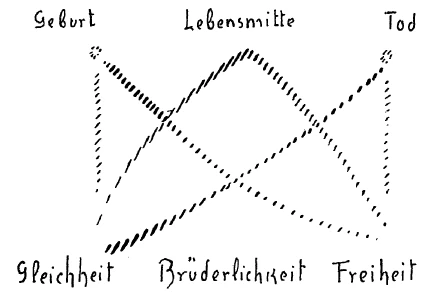

Als ich am letzten Sonntag einige Andeutungen machte über die Erneuerung des Weihnachtsgedankens, da sprach ich davon, wie der Mensch - ich meinte den wirklichen inneren Menschen, der sich, herauskommend aus der geistigen Welt, verbindet mit dem, was ihm übergeben wird aus der Vererbungsströmung heraus -, wie dieser Mensch beim Eintritt in das Dasein, das er verlebt zwischen der Geburt und dem Tod, hereinkommt mit einem gewissen Impulse der Gleichheit. Ich sagte, man könne, verständig beobachtend, dieses Geltendmachen des Gleichheitsimpulses beim Kinde bemerken: das Kind kennt noch nicht die Differenzierungen, die innerhalb der Menschheit in der sozialen Struktur auftreten durch die Verhältnisse, in die das Karma den Menschen einführt. Ich sagte dann: Klar und unbefangen besehen, stellten sich gewisse Fähigkeiten, Begabungen, selbst das Genie so dar, daß wir die Kräfte, die in diesen Fähigkeiten, Begabungen, selbst im Genie leben, vielfach zuzuschreiben haben den Impulsen, die in der Vererbungslinie, Vererbungsströmung auf den Menschen wirken und daß man solche Impulse zunächst, wie sie rein im Naturlauf der Vererbungsströmung auftreten, als luziferische Impulse anzusprechen habe, daß in unserer gegenwärtigen Zeitepoche diese Impulse nur dann von dem Menschen in der rechten Weise in die soziale Struktur hereingestellt werden, wenn er sie ansieht als luziferische Impulse und wenn er dazu erzogen wird, das Luziferische abzustreifen, gewissermaßen darzubringen am Altar des Christus dasjenige, was die Natur ihm übermittelt hat, es umzuwandeln, zu metamorphosieren. ^lv2ynm

Zwei Gesichtspunkte halten wir also auseinander. Den einen Gesichtspunkt: was zu tun ist mit den durch die Blutsverhältnisse, durch die Geburtsverhältnisse auftretenden Differenzierungen der Menschheit. Und den andern: daß der eigentliche Wesenskern des Menschen beim Anfang des irdischen Lebens wesentlich den Impuls der Gleichheit in sich trägt. Damit ist hingewiesen darauf, daß der Mensch nur richtig betrachtet wird, wenn er in seinem ganzen Lebenslauf betrachtet wird, wenn die zeitliche Entwickelung zwischen Geburt und Tod wirklich ins Auge gefaßt wird. Wir haben gerade hier in einer andern Beziehung hingewiesen darauf, wie Entwickelungsmotive sich verändern im Laufe des Lebens zwischen Geburt und Tod. Und in anderer Weise finden Sie hingewiesen auf diese Entwickelungsmotive in meinem Aufsatz, den ich in der letzten Nummer des «Reiches» geschrieben habe über das Ahrimanische und Luziferische im menschlichen Leben. Da ist darauf hingewiesen, wie das Luziferische in der ersten Lebenshälfte eine gewisse Rolle spielt, das Ahrimanische in der zweiten Lebenshälfte, wie diese Impulse des Ahriman und Luzifer durch das ganze Leben hindurch wirken, aber in verschiedener Art. ^aen2g6

Neben der Idee der Gleichheit haben sich in der neueren Zeit andere Ideen, wie ich dazumal am Sonntag sagte, in tumultuarischer Weise vorgedrängt, gewissermaßen vorausnehmend die ruhige Entwickelung der Zukunft, zunächst in der Idee vorausnehmend dasjenige, was langsam in der Menschheitsentwickelung sich ausleben muß, wenn es zum Heile und nicht zum Unheil gereichen soll. Es haben sich andere Ideen neben die Idee der Gleichheit hingestellt; aber auch diese andern Ideen kann man hinsichtlich ihrer Bedeutung für das Leben nur dann richtig verstehen und würdigen, wenn man sie in den Zeitenlauf des menschlichen physischen Daseins richtig hineinstellt. ^4ge0fd

Neben der Idee der Gleichheit tönt gewissermaßen durch die moderne Welt die Idee der Freiheit. Ich habe über die Idee der Freiheit vor einiger Zeit zu Ihnen in Anlehnung an die Neuauflage meiner «Philosophie der Freiheit» gesprochen. Wir sind also in der Lage, die ganze Wichtigkeit und Tragweite dieser Idee der Freiheit im Zusammenhang mit dem innersten Wesenskern des Menschen zu würdigen. Vielleicht wissen aber auch einige von Ihnen, daß öfters durch Fragen da und dort notwendig geworden ist, auf das ganz Besondere der Freiheitsauffassung hinzuweisen, wie sie in meiner «Philosophie der Freiheit» herrscht. Ich habe immer nötig gehabt, einen Gesichtspunkt mit Bezug auf die Freiheitsidee besonders hervorzuheben, nämlich den, daß die ganze neuere Zeit, die verschiedenen philosophischen Anschauungen über die Freiheit eigentlich den Fehler gemacht haben — wenn man es Fehler nennen will -, die Frage so zu stellen: Ist der Mensch frei oder unfrei? Kann man dem Menschen freien Willen zuschreiben oder darf man ihm nur zuschreiben, daß er in einer wie absoluten Naturnotwendigkeit drinnensteht und auch aus dieser Notwendigkeit heraus seine Handlungen, seine Willensentschlüsse vollführt? — Die Fragestellung ist unrichtig. Es gibt kein solches Entweder-Oder. Man kann nicht sagen, der Mensch ist entweder frei oder unfrei, sondern er ist begriffen in der Entwickelung von der Unfreiheit zur Freiheit. Und die Art und Weise, wie Sie aufgefaßt finden den Freiheitsimpuls in meiner «Philosophie der Freiheit», zeigt Ihnen, daß der Mensch immer freier und freier wird, daß er sich herauswindet aus der Notwendigkeit und immer mehr und mehr in ihm die Impulse wachsen, die ihm möglich machen, ein freies Wesen innerhalb der sonstigen Weltenordnung zu sein. ^4ce8ru

So hat denn der Impuls der Gleichheit seine Kulmination beim Geborenwerden — wenn auch nicht im Bewußtsein, da das noch nicht so entwickelt da schon leben kann -, dann fällt er ab. Der Impuls der Gleichheit hat also eine absteigende Entwickelung. Schematisch können wir das so zeichnen: ^v0psdy

 ^pxl5yh

Bei der Geburt ist eine Kulmination der Gleichheitsidee da, und die Gleichheit bewegt sich in einer absteigenden Kurve. Umgekehrt ist es nun bei der Freiheitsidee. Die Freiheit bewegt sich in einer aufsteigenden Kurve und hat ihre Kulmination im Tode. Ich will damit nicht sagen, daß der Mensch, indem er durch die Pforte des Todes geht, den höchsten Gipfel eines freitätigen Wesens erreicht. Aber relativ, mit Bezug auf das Menschenleben entwickelt der Mensch den Impuls der Freiheit gegen den Moment des Todes hin immer mehr und mehr, und relativ hat er sich am meisten die Möglichkeit, ein freies Wesen zu sein, in dem Augenblick erworben, wo er durch des Todes Pforte in die geistige Welt eintritt. Während er also, indem er durch die Geburt in das physische Dasein eintritt, aus der geistigen Welt herausträgt die Gleichheit, die dann absteigt in der Entwickelung des physischen Lebenslaufes, entwickelt er gerade im physischen Lebenslaufe den Freiheitsimpuls und steigt mit dem ihm im physischen Lebenslauf erreichbaren Höchstmaß des Freiheitsimpulses durch die Pforte des Todes in die geistige Welt hinein. ^9snog6

Sie sehen daraus wiederum, wie einseitig oftmals das Menschenwesen betrachtet wird. Man bezieht nicht die Zeit in dieses Menschenwesen ein. Man redet vom Menschen im allgemeinen, in abstracto, weil man heute nicht geneigt ist, auf Wirklichkeiten einzugehen. Aber der Mensch ist nicht ein stehenbleibendes Wesen, er ist ein Wesen im Werden. Und je mehr er wird, je mehr er sich selbst in die Möglichkeit versetzt, zu werden, desto mehr erfüllt er gewissermaßen hier im physischen Lebenslaufe schon seine wirkliche Aufgabe. Diejenigen Menschen, die starr bleiben, die abgeneigt sind, eine Entwickelung durchzumachen, entwickeln wenig von dem, was eigentlich ihre irdische Mission ist. Was Sie gestern waren, sind Sie heute nicht mehr, und was Sie heute sind, werden Sie morgen nicht mehr sein. Es sind das allerdings kleine Nuancen. Wohl dem, bei dem es überhaupt Nuancen sind, denn das Stehenbleiben ist ahrimanisch. Nuancen sollten da sein. Es sollte wenigstens gewissermaßen im Leben des Menschen kein Tag vor sich gehen, ohne daß er wenigstens einen Gedanken in sich aufnimmt, der ein wenig sein Wesen ändert; der ein wenig ihn in die Möglichkeit versetzt, ein werdendes Wesen, nicht bloß ein seiendes Wesen zu sein. Und so kann man den Menschen wirklich nur betrachten seiner eigentlichen Natur nach, wenn man nun nicht sagt im absoluten Sinn: Der Mensch hat in der Welt die Prätention auf Freiheit, Gleichheit -, sondern wenn man weiß, wie der Impuls der Gleichheit seine Kulmination erlangt im Lebensbeginn, wie der Impuls der Freiheit seine Kulmination erlangt am Lebensende. Man schaut erst dann in dieses Komplizierte des menschlichen Werdens auch im Lebenslauf hier auf der Erde hinein, wenn man solche Dinge in Betracht zieht, wenn man nicht abstrakt einfach hinsieht auf den ganzen Menschen und sagt: Er hat Anspruch, verwirklicht zu sehen in der sozialen Struktur Freiheit, Gleichheit und so weiter. — Das sind die Dinge, die durch Geisteswissenschaft wiederum dem menschlichen Gemüt nahekommen müssen, die außer acht gelassen worden sind von der nach Abstraktion und dadurch nach Materialismus hinstrebenden neueren Entwickelung. ^210ft5

Nun der dritte der Impulse: die Brüderlichkeit. Ihr ist eigen, daß sie die Kulmination in einem gewissen Sinne in der Mitte des Lebens hat. Ihre Kurve steigt an (siehe Zeichnung Seite 44) und fällt wiederum. Man kann allerdings dafür die Sache nur so aussprechen, daß man sagt: In der Mitte des Lebens, wenn der Mensch in seinem labilsten, das heißt schwankenden Zustand ist mit Bezug auf das Verhältnis des Seelischen zum Leiblichen, da hat der Mensch die stärkste Veranlagung, die Brüderlichkeit zu entwickeln. Er entwickelt sie nicht immer, aber er hat Veranlagung dazu. Es sind sozusagen für die Entwickelung der Brüderlichkeit die stärksten Vorbedingungen gegeben in der Lebensmitte. ^zgylmf

So verteilen sich diese drei Impulse über das ganze menschliche Leben hin. In der Zeit, der wir entgegenleben, wird es notwendig für das Verständnis des Menschen und dann selbstverständlich auch für die sogenannte Selbsterkenntnis des Menschen, daß so etwas berücksichtigt werde. Man wird nicht zu richtigen Ideen über das Zusammenleben der Menschen kommen können, wenn man nicht wissen wird, wie sich die Impulse auf den Lebenslauf des Menschen verteilen. Man wird gewissermaßen nicht konkret leben können, wenn man diese Erkenntnis sich nicht wird erwerben wollen; denn man wird nicht wissen, wie konkret ein junger Mensch zu einem alten, ein älterer zu einem in mittleren Lebensjahren stehenden Menschen steht, wenn man nicht die besondere Konfiguration dieser inneren Impulse des menschlichen Wesens ins Auge faßt. ^sn1839

Fassen Sie aber das, was wir jetzt auseinandergesetzt haben, zusammen mit Betrachtungen, die wir früher hier angestellt haben über das allmähliche Jüngerwerden des ganzen Menschengeschlechtes. Erinnern Sie sich, wie ich auseinandergesetzt habe, daß die eigentümliche Abhängigkeit, welche der Mensch vom Körperlichen mit Bezug auf die seelische Entwickelung heute nur in seinen allerjüngsten Lebensjahren hat, gefühlt wurde, erlebt wurde in alten Zeiten — wir sprechen jetzt nur von nachatlantischen Zeiten - bis ins hohe Alter hinauf. Bis in die Fünfzigerjahre hinauf war der Mensch, sagte ich, in der urindischen Kultur so abhängig von seiner physischen, sogenannten physischen Entwickelung, wie er es heute nur in den jüngsten Jahren ist. Der Mensch ist in den ersten Lebensjahren abhängig von seiner physischen Entwickelung. Wir wissen, was für einen Einschnitt in der physischen Entwickelung der Zahnwechsel bildet, dann wiederum die Geschlechtsreife und so weiter. In den ersten Entwickelungsjahren sehen wir einen deutlichen Parallelismus zwischen seelischer und körperlicher Entwickelung. Das hört dann auf, das schwindet dann. Und ich habe darauf aufmerksam gemacht, wie das in älteren Kulturepochen der nachatlantischen Zeit nicht der Fall war. Jene Möglichkeit, zu naturgegebener Weisheit zu kommen einfach dadurch, daß man Mensch war, zu jener hohen Weisheit zu kommen, die man verehrte bei den alten Indern, die man noch verehren konnte bei den alten Persern und so weiter, jene Möglichkeit war dadurch gegeben, daß die Sache nicht so war wie jetzt, wo der Mensch in den Zwanzigerjahren ein fertiges Wesen wird, wo er nicht mehr abhängig bleibt von seiner physischen Organisation. Die physische Organisation gibt ihm dann nichts mehr. Das war nicht der Fall in alten Zeiten, sagte ich. Da gab die physische Organisation selbst die Weisheit den Menschen in die Seelen herein bis in die Fünfzigerjahre hinauf. Da war man in der zweiten Lebenshälfte auch ohne besondere okkulte Entwickelung in die Möglichkeit versetzt, auf elementare Art aus der körperlichen Entwickelung die Kräfte herauszusaugen, um zu einer gewissen Weisheit und Willensentwickelung zu kommen. Ich habe Sie aufmerksam gemacht, was das bedeutete für die alten indischen oder für die persischen Zeiten, selbst noch für die ägyptisch-chaldäischen Zeiten, wo dann, wenn man jung war, ein Knabe oder Mädchen oder Jüngling oder Jungfrau war, man hingewiesen werden konnte darauf: Wenn du alt wirst, hast du zu erwarten, daß einfach durch das Altwerden hereinbricht in dein Menschenleben dasjenige, was dir beschert ist dadurch, daß du eben eine Entwickelung durchmachst bis zum Tode hin. - Auch das war gegeben, daß man mit Ehrfurcht zum Alter hinaufsah, weil man sich sagte: Es wirkt mit dem Alter etwas herein in das Leben, was man noch nicht wissen kann, nicht wollen kann, wenn man noch ein junger Mensch ist. - Das gab dem ganzen sozialen Leben eine gewisse Struktur, die eigentlich erst aufhörte, als das während der griechisch-lateinischen Zeit zurückging bis in die mittleren Lebensjahre des Menschen. Bis in die Fünfzigerjahre war in der urindischen Kultur der Mensch entwickelungsfähig. Dann verjüngte sich der Mensch, also ging das Alter des Menschengeschlechtes, das heißt, diese Entwikkelungsfähigkeit zurück bis zum Ende der Vierzigerjahre während der urpersischen Zeit, und nur noch zwischen dem fünfunddreißigsten bis zweiundvierzigsten Jahre wirkte sie während der ägyptisch-chaldäischen Zeit. Während der griechisch-lateinischen Zeit war der Mensch nur entwickelungsfähig zwischen dem achtundzwanzigsten und fünfunddreißigsten Jahre. In der Zeit, als das Mysterium von Golgatha geschah, war der Mensch entwickelungsfähig eben bis zum dreiunddreißigsten Jahre. Das ist das Wunderbare, das man in der Entwickelungsgeschichte der Menschheit entdeckt: daß das Alter des durch den Tod auf Golgatha gehenden Christus Jesus zusammenfällt mit jenem Alter, bis zu dem die Menschheit dazumal zurückgegangen war. Und dann haben wir noch darauf hingewiesen, wie die Menschheit immer jünger und jünger wird, das heißt, bis zu einer immer geringeren Anzahl von Jahren entwickelungsfähig bleibt, wie es etwas Besonderes bedeutet, wenn der Mensch heute gerade im charakteristischen Jahre, in dem die Menschheit heute steht — im siebenundzwanzigsten Jahre sagte ich Ihnen -, eintritt in das öffentliche Leben und nichts anderes mitbekommen hat als dasjenige, was von außen bis zum siebenundzwanzigsten Jahre aufgenommen wurde. Ich führte an, wie ZL/oyd George gerade in dieser Beziehung der repräsentative Mensch unserer Zeit ist, weil er mit siebenundzwanzig Jahren in das öffentliche Leben eingetreten ist. Ungeheuer vieles folgt daraus. Sie können das in der Biographie von Lloyd George nachlesen. Diese Dinge machen aber möglich, die Verhältnisse der Welt von innen heraus zu durchschauen. ^6yl2w6

Nun, was ist Ihnen aber die Hauptsache, wenn Sie diesen Gesichtspunkt, den wir da für das Immer-Jüngerwerden des Menschengeschlechtes ins Auge gefaßt haben, verbinden mit den Gesichtspunkten, die wir gerade in diesen Tagen im Zusammenhang mit dem Weihnachtsgedanken uns vor die Seele geführt haben? Das ist das Charakteristische für unsere Gegenwartsentwickelung nach dem Mysterium von Golgatha, daß wir eigentlich durch das, was dem Menschen von Natur zugeteilt ist, aus unserem Organismus heraus nichts gewinnen können von den Dreißigerjahren an. Würde nicht das Mysterium von Golgatha eingetreten sein, wir würden gewissermaßen von unseren Dreißigerjahren an hier auf der Erde herumgehen und würden uns dann sagen: Eigentlich leben wir ja nur richtig bis so zum zweiunddreißigsten, dreiunddreißigsten Jahre höchstens. Da gibt uns unser Organismus die Möglichkeit des Lebens. Dann könnten wir ebensogut sterben. Denn durch den Naturlauf, durch die elementarischen Naturereignisse können wir nichts mehr durch die Impulse unseres Organismus für unsere seelische Entwickelung gewinnen. — Das würden wir sagen müssen, wenn das Mysterium von Golgatha nicht eingetreten wäre. Voll müßte die Erde sein, wenn dieses Mysterium von Golgatha nicht eingetreten wäre, von den Klagen der Menschen, die dahingingen, daß die Menschen sagten: Was habe ich eigentlich von meinem Leben vom dreiunddreißigsten Lebensjahre an! Bis dahin ist es möglich, daß mir mein Organismus etwas gibt. Von da ab könnte ich ebensogut tot sein, ich gehe eigentlich als ein lebendiger Leichnam hier auf der Erde herum. — Das würden viele Menschen empfinden, daß sie wie ein lebendiger Leichnam auf der Erde herumgehen würden, wenn dieses Mysterium von Golgatha nicht eingetreten wäre. Aber dieses Mysterium von Golgatha soll eben auch noch fruchtbar gemacht werden. Wir sollen nicht bloß unbewußt, wie es für die Menschen der Fall ist, in uns den Impuls von Golgatha aufnehmen, sondern wir sollen ihn bewußt aufnehmen. Wir sollen bewußt ihn so aufnehmen, daß wir gewissermaßen durch den Impuls von Golgatha jugendfrisch bleiben bis in das Alter hinein. Und er kann uns gesund und jugendfrisch erhalten, wenn wir ihn in der richtigen Weise bewußt aufnehmen. Und wir werden uns dann auch dieses Erfrischenden des Mysteriums von Golgatha für unser Leben bewußt werden. Und das ist wichtig, meine lieben Freunde! ^682gxy

Sie sehen also, dieses Mysterium von Golgatha kann als etwas sehr, sehr Lebendiges innerhalb unseres irdischen Lebenslaufes aufgefaßt werden. Ich sagte vorhin, die Menschen sind am meisten veranlagt in der Lebensmitte, so um das dreiunddreißigste Jahr herum, für die Brüderlichkeit. Aber sie bilden nicht immer diese Brüderlichkeit aus. Hier haben Sie den Grund in dem, was ich eben gesagt habe. Diejenigen, die die Brüderlichkeit nicht ausbilden, bei denen es etwas mangelt an der Brüderlichkeit, die sind eben zu wenig dutchchristet. Weil der Mensch gewissermaßen in der Lebensmitte erstirbt durch die Kräfte des Naturlaufes, kann er sowohl den Impuls, den Instinkt der Brüderlichkeit wie namentlich den Impuls der Freiheit, den die Menschen heute so wenig aufnehmen, nicht ordentlich entwickeln, wenn er nicht lebendig macht in sich Gedanken, die unmittelbar von dem Christus-Impuls herkommen. Daher ist der Christus-Impuls unmittelbar, indem wir zu ihm uns hinwenden, die Anfeuerung zur Brüderlichkeit. In dem Maße, in dem man empfindet die Notwendigkeit der Brüderlichkeit, durchchristet man sich. Aber der Mensch würde allein während des Restes der Erdenzeit — in künftigen Entwickelungen wird es anders sein — nicht dahin kommen, die ganze Stärke des Freiheitsimpulses zu entwickeln. Da tritt dasjenige in unsere Erdenentwickelung als Menschen ein, was beim Tode des Christus Jesus ausgeflossen ist und sich mit der Erdenentwickelung der Menschheit vereinigt hat. Daher ist Christus im wesentlichen auch der Führer der heutigen Menschheit zur Freiheit. Wir werden in Christo frei, wenn wir den Christus-Impuls so verstehen, daß wir ganz darauf einzugehen wissen, daß der Christus eigentlich nicht älter werden konnte im physischen Leib, oder nicht länger leben konnte im physischen Leibe als bis zum dreiunddreißigsten Jahre hin. Nehmen wit hypothetisch an, er hätte länger gelebt, so würde er in einem physischen Menschenleibe in die Zeit hineingelebt haben, wo dieser physische Leib eigentlich nach der gegenwärtigen Erdenentwickelung zum Ersterben bestimmt ist. Da würde er die Ersterbekräfte gerade als der Christus aufgenommen haben. Wäre er vierzig Jahre alt geworden, so hätte er im Leibe erlebt die Ersterbekräfte. Die konnte er nicht erleben wollen. Er konnte nur dasjenige erleben wollen, was noch die erfrischenden Kräfte des Menschen sind. Bis dahin wirkt er, bis zum dreiunddreißigsten Jahre, bis zur Lebensmitte, regt als der Christus die Brüderlichkeit an, übergibt dann dasjenige, was in des Menschen Kraft liegen soll, indem er ausfließen läßt in die Entwickelung der Menschen den Geist, dem Heiligen Geiste. Durch diesen Heiligen Geist, diesen gesundenden Geist entwickelt sich der Mensch gegen sein Lebensende hin zur Freiheit. So gliedert sich der ChristusImpuls ein in dieses konkrete menschliche Leben. ^z5p3zj

Solch eine innerliche Durchdringung des Menschenwesens mit dem Christus-Prinzip, das ist es, was als ein neuer Weihnachtsgedanke aufgenommen werden muß vom Menschenwissen. Wissen muß man, wie der Mensch mit der Gleichheit aus der geistigen Welt herauskommt. Das ist etwas, was ihm mitgegeben wird, was gewissermaßen aus dem Vatergott ist. Dann kann aber die Kulmination der Brüderlichkeit in der richtigen Weise nur durch des Sohnes Hilfe und durch den mit dem Geist vereinigten Christus die Entwickelung zum Freiheitsimpuls gegen den Tod hin in die Menschheitsentwickelung eintreten. ^dgkv3q

Dieses Mitwirken des Christus-Impulses in der konkreten Menschheitsausgestaltung, das ist dasjenige, was von jetzt ab in das Bewußtsein der Seelen aufgenommen werden muß. Das allein wird richtig heilsam sein, wenn die Forderungen der Menschen immer drängender und brennender werden in bezug darauf, wie man gestalten soll die soziale Struktur. Aber in dieser sozialen Struktur leben Kinder, junge, mittlere und alte Leute, und eine soziale Struktur, die alle umfaßt, wird man nur finden können, wenn man weiß, daß Mensch nicht einfach gleich Mensch ist. Das fünfjährige Kind ist Mensch, der zwanzigjährige Jüngling, die zwanzigjährige Jungfrau ist Mensch, der vierzigjährige Mensch ist Mensch, alles ist Mensch. Aber dieses chaotische Durcheinanderwerfen, das bringt es nicht zu einer solchen Erkenntnis des Menschen, wie sie notwendig ist, um die Forderungen der Zukunft, der Gegenwart auch, zu erfüllen. Das chaotische Durcheinanderwerfen bringt es höchstens dazu, daß man meint: Mensch ist Mensch, also muß er mit zwanzig Jahren ungefähr ins Parlament gewählt werden. — Diese Dinge sind zerstörend für die wirkliche soziale Struktur. Sie beruhen darauf, daß der Mensch in der Gegenwart nicht eintreten will in die Menschenbeobachtung und das daraus hervorgehende Menschheitsbewußtsein, welches den Menschen konkret so nimmt, wie er ist. Aber konkret genommen ist die Abstraktion Mensch, Mensch, Mensch, gar nicht vorhanden, sondern es ist immer ein konkreter Mensch eines bestimmten Lebensalters mit bestimmten Impulsen. Menschenerkenntnis muß erworben werden; aber sie muß erworben werden, wenn man die Entwickelung desjenigen, was als Wesenskern im Menschen von der Geburt bis zum Tode lebt, ins Auge faßt. Das ist etwas, was auftreten muß! Und man wird wahrscheinlich nur geneigt sein, solche Dinge aufzunehmen in das Menschheitsbewußtsein, wenn man wiederum in der Lage ist, Rückblicke auf die Menschheitsentwickelung zu machen. ^n60fw6

Gestern habe ich Sie hingewiesen auf etwas, was in die Menschheitsentwickelung eingetreten ist mit dem Christentum, indem das Christentum gewissermaßen herausgeboren ist aus der jüdischen Seele, aus dem griechischen Geist, aus dem römischen Leib. Das sind gewissermaßen die Hüllen des Christentums geworden. Aber im Christentum ist das lebendige Ich darinnen, und das kann wiederum abgesondert betrachtet werden, indem man zurückblickt auf diese Geburt des Christentums. Für die äußere Geschichtsschreibung ist diese Geburt des Christentums ziemlich chaotisch geworden. Dasjenige, was heute gewöhnlich - sei es von katholischer, sei es von protestantischer Seite — geschrieben wird über die ersten Jahrhunderte des Christentums, ist eine ziemlich chaotische Weisheit. Manches, was gelebt hat in den ersten Jahrhunderten des Christentums, ist überhaupt gerade für die Theologen der Gegenwart seiner eigentlichen Wesenheit nach entweder ganz vergessen oder zu einem Horror, könnte man sagen, geworden. Denn lesen Sie nur nach, in welche sonderbaren Konvulsionen des Intellektuellen, Konvulsionen, daß die Leute fast schon, möchte ich sagen, bis zu einer Art intellektueller Epilepsie kommen, wenn sie charakterisieren sollen dasjenige, was in den ersten Jahrhunderten des Christentums als Gnosis gelebt hat. Das ist schon so eine Art Teufel, so etwas Dämonisches, etwas, das man nur ja nicht ordentlich hereinlassen soll in das menschliche Leben, diese Gnosis! Und wenn nun gar solch ein Theologe oder sonstiger offizieller Vertreter dieses oder jenes Bekenntnisses die Anthroposophie anschuldigen kann, daß sie etwas gemein hätte mit der Gnosis, dann glaubt er schon, das Allerschlimmste gesagt zu haben. ^qe6qvb

Nun, alldem liegt aber zugrunde, daß in den ersten Jahrhunderten der Entwickelung des Christentums diese Gnosis in der Tat viel bedeutsamer in das geistige Leben der europäischen Menschheit eingriff, soweit sie dazumal für die Zivilisation in Betracht kam, als man heute glaubt. Man hat auf der einen Seite gar keine Vorstellung davon, was diese Gnosis eigentlich war, und hat auf der andern Seite, ich möchte sagen, eine geheimnisvolle Furcht. Es ist diese Gnosis für die meisten gegenwärtigen offiziellen Vertreter dieses oder jenes Religionsbekenntnisses etwas Horribles. Man kann sie aber nun wirklich betrachten ohne besondere Sympathie und Antipathie, rein als etwas Tatsächliches. Dann muß man die Sache wohl geisteswissenschaftlich studieren, weil die äußere Geschichte nicht viel bietet. Die kirchliche Entwickelung des Abendlandes hat dafür gesorgt, daß eigentlich alle historischen Denkmäler dieser Gnosis mit Stumpf und Stiel ziemlich ausgerottet wurden. Es ist nur weniges, wie Sie wissen, und was nur ein unklares Bild von der Gnosis wiedergibt, wie die «Pistis Sophia» und dergleichen, übriggeblieben. Sonst weiß man aus der Gnosis nur die Sätze, die von den Kirchenvätern widerlegt werden. Also im Grunde genommen kennt man die Gnosis nur aus der Schriftstellerei der Gegner; während das, was äußerlich historisch eine Vorstellung von ihr geben könnte, ziemlich mit Stumpf und Stiel ausgerottet worden ist. ^6qom0b

Nun würde aber ein verständiges Betrachten der theologischen Entwickelung des Abendlandes — nur findet ein solches verständiges Betrachten in der Regel nicht statt — die Menschen auch auf diesem Punkte nachdenklicher machen. Man würde zum Beispiel, wenn man verständig die Entwickelung der christlichen Dogmatik betrachtete, darauf kommen, daß diese christliche Dogmatik doch noch in etwas anderem wurzeln müsse als in irgendeiner bloßen Willkür oder dergleichen. Im Grunde wurzeln diese Dogmen alle in der Gnosis. Nur ist das Lebendige der Gnosis abgestreift worden und die abstrakten Gedanken und Begriffshülsen sind geblieben, so daß man in den Dogmen diesen lebendigen Ursprung nicht mehr erkennt. Dieser lebendige Ursprung liegt aber eigentlich in der Gnosis. Wenn Sie die Gnosis, soweit sie geisteswissenschaftlich studiert werden kann, wirklich verfolgen, dann wirft das einem auch ein gewisses Licht auf die wenigen Dinge, die historisch übriggelassen worden sind von den Gegnern der Gnosis. Und dann sagen Sie sich wahrscheinlich: Diese Gnosis weist hin auf die ganz ausgebreitete, sehr konkrete atavistische Hellseherweltanschauung der alten Zeiten, die in ihren Resten noch ziemlich vorhanden war in der Zeit des ersten nachatlantischen Kulturzeitraumes, im zweiten schon weniger; dann, als im dritten die letzten Reste des alten Hellsehertums über die Welt verloren worden sind, sind sie eben in der Gnosis in einem wunderbaren Begriffssystem, das aber ganz außerordentlich bildlich ist, zutage getreten. Wer von diesem Punkte aus die Gnosis ansieht, wer in der Lage ist, auch nur historisch zurückzugehen zu den spärlichen Resten, die dann in der heidnischen Gnosis reichlicher als in der christlichen Literatur zutage gefördert werden können, der findet, daß in dieser Gnosis tatsächlich wunderbare Weisheitsschätze schon da waren, eine Weisheit, die sich auf eine Welt bezog, von der die Menschen gegenwärtig überhaupt nichts wissen wollen. So daß es gar nicht zu verwundern ist, daß selbst gutmeinende Menschen mit der alten Gnosis nicht viel anzufangen wissen, etwa solche Menschen wie der Professor Jeremias in Leipzig, der ja willig wäre, auf die Dinge einzugehen; aber er kann keine Vorstellung erwerben, auf was sich eigentlich diese alten Begriffe beziehen, auf was es sich bezieht, wenn da gesprochen wird von einem geistigen Wesen Jaldabaoth, das in einem gewissen Hochmut sich aufgeworfen hätte zum Herrn der Welt, dann von seiner Mutter zurechtgewiesen worden wäre und so weiter. Solche mächtigen Bilder strahlen herein selbst aus dem historisch Aufbewahrten, solche mächtige Bilder wie dieses, wo wirklich Jaldabaoth sagt: Ich bin Vatergott, über mir ist niemand. — Und die Mutter erwidert: Lüge nicht, über dir ist der Vater von allem, der erste Mensch und des Menschen Sohn. — Da rief — so wird weiter erzählt — Jaldabaoth seine sechs Mitarbeiter, und sie sprachen: Laßt uns den Menschen machen nach unserem Bilde. ^dgme39

Da haben Sie einen merkwürdigen Dialog zwischen Jaldabaoth und seiner Mutter, und dann das Heranrufen der sechs andern Mitarbeiter, die zu dem Entschluß kommen: Laßt uns den Menschen machen nach unserem Bilde. — Aber solche Bilder, solche Imaginationen, die eigentlich ganz anschaulich sind, sie waren zahlreich und umfangreich vorhanden in dem, was als Gnosis herrschte. Man hat im Alten Testament eigentlich nur Reste: diejenigen Reste, die die jüdische Überlieferung behalten hat, von einer umfangreichen Bilderweisheit, die in der alten Gnosis enthalten war, vorzugsweise im Oriente lebte, deren Strahlen aber herüberwirkten ins Abendland, und die eigentlich erst im 3., 4. Jahrhundert für das Abendland mehr oder weniger verglommen sind, dann noch nachgewirkt haben bei den Waldensern und Katharern, aber doch verglommen sind. ^zdggv9

Wie es ausgeschaut hat in den ersten christlichen Jahrhunderten in den Seelen der Menschen, in denen nicht etwa bloß die Vorstellungen lebten, die heute bei den Katholiken leben, sondern in denen durchaus Nachklänge dieser mächtigen Bilderwelt der Gnosis lebendig waren, davon machen sich die heutigen Menschen nicht viele Begriffe. Es sieht ungeheuer anders aus, wenn man zurückschaut in das, was in den Seelen der ersten Jahrhunderte innerhalb der europäischen zivilisierten Länder lebte, ungeheuer anders, als wenn man in die Bücher hineinsieht, welche die kirchlichen und weltlichen Theologen und sonstigen Gelehrten über diese ersten Jahrhunderte schrieben. Denn für diese Bücher fällt all das fort, was lebendig war in solchen mächtigen, gewaltigen Bildern, die sich, wie gesagt, auf eine Welt bezogen, von der sich die heutigen Menschen keine Vorstellung machen. Daher weiß ein im Sinne der heutigen Bildung ausgebildeter Mensch nichts anzufangen mit diesen Begriffen, die da zu ihm herüberkommen. Den Jaldabaoth, dessen Mutter, die sechs Mitarbeiter, andere Dinge, die auftreten: er weiß sie auf nichts anzuwenden. Sie sind Worte, sind Worthülsen; er weiß nicht, worauf sie sich beziehen. Und noch weniger weiß er, wie die Menschen einmal dazu gekommen sind, solche Vorstellungen sich zu bilden. Daher kann der moderne Mensch nicht anders als sich sagen: Nun, die alten Orientalen haben eine starke Phantasie gehabt, die haben das alles phantastisch ausgebildet! Man ist immer nur sehr verwundert darüber, daß diese Herren gar keine Ahnung davon haben, wie eigentlich der elementarisch lebende Mensch wenig Phantasie hat, wie diese Phantasie zum Beispiel bei den Bauern eine ungeheuer geringe Rolle spielt. In dieser Beziehung haben auch die Mythenforscher Ungeheures geleistet. Sie haben nämlich ausgedacht, wie die einfachen Leute die ziehenden Wolken, die vom Winde getriebenen Wolken phantastisch zu allen möglichen Wesen umgestaltet haben und so weiter. Die Leute haben keine Ahnung davon, wie eigentlich die Menschen, denen sie das zuschreiben, in ihrer Seele beschaffen sind, daß diese so weit wie nur irgend möglich entfernt sind, in solcher Weise poetisch das auszugestalten. Die Phantasie herrscht nur in den Kreisen der Mythologen, der Gelehrten, die so etwas ausdenken. Das ist wirkliche Phantasie. ^li0q5h

Das, was die Leute sich so ausgedacht haben als den Ursprung der Mythologie und so weiter, ist eben bloßer Irrtum. Und es wissen die Menschen heute nicht, auf was eigentlich sich die Worte, die Begriffe beziehen, von denen da gesprochen wurde. Gewisse, ich möchte sagen, deutliche Hinweise, wie die Dinge gemeint sind, können daher auch gar nicht mehr richtig berücksichtigt werden. P/ato hat die Leute noch sehr genau darauf aufmerksam gemacht, daß der Mensch, indem er hier im physischen Leibe lebt, sich an etwas erinnert, was er vor diesem physischen Leben in der geistigen Welt erlebt hat. Aber mit diesem platonischen Gedächtniswissen wissen die heutigen Philosophen nichts anzufangen. Das sei auch so etwas, was Plato phantasiert habe — während Plato eben noch wußte, daß die griechische Seele schon so veranlagt war, aber nur die letzten Reste dieser Veranlagung noch hatte, etwas in sich zu entwickeln, was vor der Geburt in der geistigen Welt erlebt war. Wer zwischen Geburt und Tod nur wahrnimmt im physischen Leibe und die Wahrnehmung mit dem heutigen Verstande verarbeitet, der kann keinen vernünftigen Sinn verbinden mit den Betrachtungen, die gar nicht gefaßt worden sind im physischen Leibe zwischen Geburt und Tod, sondern die gefaßt worden sind zwischen dem Tod und einer neuen Geburt, die da durchlebt worden sind, bevor man geboren wurde. Da waren die Menschen in einer Welt, in der sie reden konnten von Jaldabaoth, der sich in Hochmut auflehnt, den seine Mutter ermahnt, der die sechs Mitarbeiter herbeiholt. Das ist für den Menschen zwischen Tod und neuer Geburt eine solche Wahrheit, wie hier für den in den Leib eingebannten Menschen Pflanzen, Tiere, Mineralien und andere Menschen die Welt sind, von der er redet. Und die Gnosis enthielt dasjenige, was bei der Geburt mitgebracht wurde in die physische Welt herein. Und bis zu einem gewissen Grade war es den Menschen möglich bis zum ägyptisch-chaldäischen Zeitraum hin, also bis in das 8. Jahrhundert der vorchristlichen Zeitrechnung, vieles mitzubringen aus der Zeit, die zwischen Tod und neuer Geburt durchlebt wurde. Was da mitgebracht wurde und in Begriffe, in Ideen gekleidet wurde, das ist Gnosis. Das lebte dann fort im griechisch-lateinischen Zeitraum, wo es nicht mehr unmittelbar wahrgenommen wurde, wo es als ein Erbgut in Ideen noch vorhanden war, wo nur auserlesene Geister den Ursprung wußten, wie Plato, in einem geringen Grade auch Aristoteles. Sokrates wußte auch davon, Sokrates büßte in Wirklichkeit gerade dieses Wissen mit dem Tode. Da muß man den Ursprung der Gnosis suchen. ^ozq74j

Nun, wie ist es eigentlich mit diesem vierten nachatlantischen, dem griechisch-lateinischen Zeitraume? Sehen Sie, nur spärlich konnte man die Erinnerung an vorgeburtliche Zeit noch in das Leben herein mitnehmen. Aber man nahm doch, und zwar in der griechischen Zeit noch deutlich, etwas mit von dem, was man da durchlebte vor der Geburt. Die Menschen sind heute ungeheuer stolz auf ihre Denkkraft, aber sie können eigentlich mit dieser Denkkraft furchtbar wenig begreifen. Die heutige Denkkraft ist nämlich ein Gegenstand, auf den man nicht besonders stolz sein kann, denn es wird sehr wenig damit begriffen. Die Denkkraft, die zum Beispiel die Griechen entwickelten, war anderer Natur. Die war so, daß, indem man durch die Geburt durchging, die Bilder der Erlebnisse vor der Geburt gewissermaßen verlorengingen; aber jene Denkkraft blieb noch, die man vor der Geburt brauchte, um mit diesen Bildern einen vernünftigen Sinn zu verbinden. Das ist das Eigentümliche bei dem griechischen Denken, daß es nämlich ganz verschieden ist von unserem sogenannten normalen Denken. Denn dieses griechische Denken ist das, was man lernen kann an dem Verarbeiten der Imaginationen, die man gehabt hat vor der Geburt. An die Imaginationen vor der Geburt erinnerte man sich wenig, aber das Wesentliche, was da blieb, war der Scharfsinn, den man brauchte vor der Geburt, um sich zurechtzufinden in der Welt, über die man sich Imaginationen machte. Und das ist gerade die Entwickelung des vierten nachatlantischen Zeitraumes, der, wie Sie wissen, bis in das 15. nachchristliche Jahrhundert hereinging, das ist gerade das Wesentliche, daß diese Denkkraft abnimmt. Und jetzt im fünften Zeitraum müssen wir sie aus der Erdenkultur heraus wieder entwickeln. Wir müssen sie langsam, stammelnd aus der naturwissenschaftlichen Weltanschauung heraus entwickeln. Wir sind heute im Anfang davon. Während des vierten nachatlantischen Zeitraumes, also von 747 v.Chr. an, dann bis 1413 — dazwischen liegt das Ereignis von Golgatha -, ist eine fortwährende Abnahme der Denkkraft. Dann erst wiederum steigt langsam die Denkkraft an und wird bis ins 3. Jahrtausend wiederum eine anständige Höhe haben. Auf die heutige Denkkraft braucht die Menschheit nicht besonders stolz zu sein. Also die Denkkraft geht herunter. Die allerdings noch verhältnismäßig hoch entwickelte Denkkraft-Erbschaft hatte noch die Gedanken, mit denen man die gnostischen Bilder ordnete und durchdrang. Sie hatte nicht mehr in derselben Schärfe, wie zum Beispiel die Ägypter oder Babylonier, die Bilder, aber sie hatte noch die Denkkraft; diese nahm dann allmählich ab. Das ist das eigentümliche Zusammenwirken in den ersten christlichen Jahrhunderten. ^dyzhd4

Das Mysterium von Golgatha bricht herein, es wird das Christentum geboren. Die abnehmende Denkkraft, die im Orient noch sehr lebendig ist, aber auch nach Griechenland herübergreift, sucht dieses Ereignis zu verstehen. Die Römer haben wenig Verständnis dafür. Diese Denkkraft aber sucht gewissermaßen das Ereignis von Golgatha zu begreifen vom Standpunkt des Denkens vor der Geburt, vom Standpunkt des Denkens in der geistigen Welt drinnen. Aber jetzt tritt etwas Eigentümliches ein: Dieses gnostische Denken, das steht nun auch dem Mysterium von Golgatha gegenüber. Sehen Sie sich die gnostischen Lehren über das Mysterium von Golgatha an, jene Lehren, die so horribel sind für den heutigen, namentlich christlichen Theologen: da wird vieles aus den alten atavistischen Lehren oder aus solchen Lehren, die eben mit dieser Denkkraft durchsetzt sind, viel Großes und Gewaltiges über den Christus gesagt, das heute ketzerisch, furchtbar ketzerisch ist. Langsam und allmählich nimmt diese Fähigkeit der gnostischen Denkkraft ab. Wir sehen sie noch bei Manes im 3. Jahrhundert, und wir sehen sie noch übergehen auf die Katharer — lauter ketzerische Leute im katholischen Sinne -: da ist eine große, gewaltige, grandiose Auffassung des Mysteriums von Golgatha. Das schmilzt merkwürdigerweise zusammen in den ersten Jahrhunderten, und man beschränkt sich darauf, möglichst wenig Denkscharfsinn auf das Mysterium von Golgatha und sein Verständnis zu verwenden. Und diese zwei Dinge liegen im Kampfe: auf der einen Seite die gnostische Lehre, mit einem mächtigen spirituellen Denken das Mysterium von Golgatha begreifen wollend, und dann das andere, rechnend mit dem, was kommen soll, rechnend mit der nicht mehr vorhandenen Denkkraft, mit dem unscharfsinnigen Denken - daher möglichst abstrakt, so wenig wie möglich gebend, um das Mysterium von Golgatha zu verstehen. Es schrumpft das Geheimnis von Golgatha als kosmisches Geheimnis fast in die paar Sätze zusammen, die den Anfang des Johannes-Evangeliums bilden: vom Logos und seinem Eintritt in die Welt und seinem Schicksal in der Welt- möglichst wenig Begriffe, denn es soll gerechnet werden mit dem, was abfallende Denkkraft ist. ^fvxmyt

Und so sehen wir, wie die gnostische Auffassung des Christentums verglimmt, wie aufkommt eine andere Auffassung des Christentums, die wenig, möglichst wenige Begriffe geltend machen will. Aber natürlich geht eines in das andere über. Solche Begriffe wie das Trinitätsdogma oder andere Dogmen werden herübergenommen aus gnostischen Anschauungen und eben hier verabstrahiert, in Begriffshülsen gebracht. Aber das eigentlich Lebendige ist das, daß im Kampfe liegt eine ungeheuer geniale gnostische Auffassung des Mysteriums von Golgatha und jene andere, die mit möglichst wenig Begriffen arbeitet, die damit rechnet, wie die Leute sein werden bis zum 15. Jahrhundert hin und wie die alte, vererbte scharfsinnige Denkkraft immer weiter herunterkommt und eben primitiv wieder erworben werden muß an der Betrachtung der Naturobjekte in der Naturwissenschaft. Sie können es studieren von Etappe zu Etappe, Sie können es studieren selbst in einem inneren Seelenkampfe, wenn Sie hinschauen auf Augustinus, der in seiner Jugend bekannt wird mit dem gnostischen Manichäertum, aber das nicht verdauen kann und dann sich zur sogenannten Einfachheit wendet, primitive Begriffe bildet. Die Begriffe werden immer primitiver und primitiver. Nur geht bei Augustinus schon der erste Morgenstrahl desjenigen auf, was nun wiederum erworben werden muß: die Erkenntnis vom Menschen aus, vom konkreten Menschen aus. In den alten gnostischen Zeiten hat man versucht, von der Welt auszugehen und zum Menschen hinzugehen. Nunmehr muß vom Menschen ausgegangen werden und durch Menschenerkenntnis wiederum Welterkenntnis erworben werden. Vom Menschen zum Kosmos wird man künftig gehen müssen; in alten Zeiten ist man vom Kosmos zum Menschen gegangen. Ich habe das vor einiger Zeit hier auseinandergesetzt, habe versucht diesen ersten Morgenstrahl im Menschen zu fassen. Sie finden das zum Beispiel in den Bekenntnissen des Augustinus, aber es ist durchaus noch chaotisch. Die Hauptsache, worauf es ankommt, ist, daß immer unfähiger und unfähiger die Menschheit sich erweist, aufzunehmen dasjenige, was aus den geistigen Welten hereinstrahlt, was in Form einer imaginativen Weisheit bei den Alten vorhanden war, was in der Gnosis wirkte, von der dann zurückblieb scharfsinnige Denkkraft, die noch bei den Griechen vorhanden war. So daß in der griechischen Weisheit vieles, wenn es auch in abstrakte Begriffe gebannt ist, so wirkt, daß man noch gewissermaßen die Ideen hatte, die eigentlich etwas verstehen können von der geistigen Welt. Das hört dann auf, man kann nichts mehr verstehen von der geistigen Welt mit den Ideen, die eben verglimmen. ^hoai66

Es ist das merkwürdig im Griechentum, daß der heutige Mensch sehr leicht bei den griechischen Ideen das Gefühl haben kann: sie sind eigentlich auf etwas ganz anderes anwendbar, als worauf sie angewendet werden. Die Griechen haben noch die Ideen, aber nicht mehr die Imaginationen. Besonders bei Aristoteles ist das so unendlich auffällig. Es ist sehr merkwürdig: Sie wissen, es gibt ganze Bibliotheken über Aristoteles. Alles bei Aristoteles wird so oder so ausgelegt, die Leute streiten sich selbst darüber, ob Aristoteles ein wiederholtes Erdenleben oder die Präexistenz angenommen habe. Das rührt alles davon her, weil seine Worte so oder so ausgelegt werden können, weil Aristoteles mit einem Begriffssystem arbeitete, das auf eine übersinnliche Welt anwendbar ist, aber keine Anschauung mehr von ihr hatte. Plato hatte noch viel mehr Verständnis dafür, kann daher sein Begriffssystem in jenem Sinne mehr ausarbeiten; aber Aristoteles ist schon in abstrakten Begriffen befangen und kann daher nicht mehr hinblicken auf dasjenige, worauf sich die Gedankenformen beziehen, die er ausbildet. Das ist das Eigentümliche, daß in den ersten Jahrhunderten im Kampfe liegt eine Auffassung des Mysteriums von Golgatha, die dieses Mysterium von Golgatha beleuchtet mit dem Lichte der übersinnlichen Welt, und daß dann die Notwendigkeit sich herausbildet, die zum Fanatismus wird, dieses zurückzuweisen. Nicht alle durchschauen diese Dinge, aber manche. Die sie durchschauten, behandelten sie nicht ehrlich. Zum Fanatismus führte eine primitive Auffassung des Mysteriums von Golgatha, eine Auffassung, die wütig darauf aus war, nur wenige Begriffe zu verwenden. ^eagd1e

So sehen wir, daß gewissermaßen immer mehr und mehr herausgeworfen wird aus der christlichen Weltanschauung, überhaupt aus der Weltanschauung herausgeworfen wird das übersinnliche Denken, das verglimmt, das aufhört. Wir können von Jahrhundert zu Jahrhundert, möchte ich sagen, verfolgen, wie den Leuten vorliegt das Mysterium von Golgatha als ein ungeheuer Bedeutsames, das in die Erdenentwickelung eingreift, wie ihnen aber entschwindet die Möglichkeit, mit irgendwelchen Begriffssystemen dieses Mysterium von Golgatha zu begreifen, oder überhaupt die Welt kosmisch zu begreifen. Sehen Sie auf das Werk aus dem 9. Jahrhundert, «Die Einteilung der Natur» von Scotus Eriugena. Da ist noch viel vorhanden an Bildern, wenn sie auch verabstrahiert sind, diese Bilder eines Weltenwerdens. Vier Etappen eines Weltenwerdens führt Scotus Erigena sehr schön an, aber überall ungenügende Begriffe. Man sieht, er ist nicht imstande, das Netz seiner Begriffe auszuspannen und verständlich, plausibel zu machen dasjenige, was er eigentlich zusammenfassen will. Überall reißen, möchte ich sagen, die Fäden der Begriffe ab. Das ist sehr interessant, wie sich dieses von Jahrhundert zu Jahrhundert mehr zeigt, wie endlich ein Tiefstand im Spinnen von Begriffsfäden im 15. Jahrhundert eintritt. Da beginnt dann wiederum ein Aufstieg, der aber im Allerelementarsten steckenbleibt. Das ist interessant. Auf der einen Seite ist das Mysterium von Golgatha da, das man eigentlich hat, auf das man sich hinwendet mit dem Gemüt, von dem man aber erklärt: es ist nicht zu verstehen. Es wird allmählich überhaupt die Empfindung Platz greifen, daß es nicht zu verstehen ist. Auf der andern Seite kommt die Beobachtung der Natur herauf; gerade in dem Zeitalter kommt sie herauf, wo die Begriffe schwinden. Die Beobachtung der Natur tritt ein in das Leben, aber es sind keine Begriffe da, um die Naturerscheinungen, die in die Beobachtung des Lebens eintreten, wirklich zu fassen. ^tndp3o

Das ist das Gemeinsame dieses Zeitalters in der Wende des vierten zum fünften nachatlantischen Zeitraum in der Mitte des Mittelalters, daß man weder in der aufkeimenden Naturbeobachtung, noch in dem Geoffenbarten der Heilswahrheiten genügende Begriffe hat, genügende Begriffe anwenden kann. Sehen Sie, wie die damals wirkende Scholastik in diesem Falle ist: Sie hat auf der einen Seite die religiöse Offenbarung, aber sie kann keine Begriffe aus der Zeitbildung heraus gewinnen, um diese religiöse Offenbarung zu verarbeiten. Anwenden muß diese Scholastik den Aristotelismus; der muß erneuert werden. Man greift zurück zum Griechentum, zu Aristoteles, um diese Begriffe zu haben, um damit die religiösen Offenbarungen zu durchdringen. Und mit dem griechischen Verstande verarbeitet man die religiösen Offenbarungen, weil die Zeitbildung, wenn ich mich des paradoxen Ausdruckes bedienen soll, keinen Verstand hat. Und gerade diejenigen, die am ehrlichsten wirken in dieser Zeit, die Scholastiker, die bedienen sich nicht des Zeitverstandes, weil er nicht da ist in jener Zeit, weil er nicht zur Zeitkultur gehört. Sie nehmen sowohl zur Naturerklärung — das ist das Wesentliche im 10., 11., 12., 13., 14., 15. Jahrhundert, daß gerade die ehrlichsten der Scholastiker dies zur Naturerklärung nehmen - und ebenso zur Ausgestaltung religiöser Offenbarungen alte aristotelische Begriffe. Dann erst kommt, wie aus grauer Geistestiefe herauf, wiederum bis heute noch nicht sehr weit entwickelt, ein selbständiges Denken: das kopernikanische, galileische Denken, das sich weiter ausbilden muß, um sich nun wiederum zu erheben in übersinnliche Regionen. ^okj4kt

So kann man in die Seele, gewissermaßen in das Ich des Christentums hineinblicken, das sich nur umhüllt hat mit der jüdischen Seele, dem griechischen Geist, dem römischen Leib. Aber dieses Christentum selbst mußte seinem Ich nach Rechnung tragen dem Verglimmen des übersinnlichen Verständnisses und daher gewissermaßen zusammenschrumpfen lassen die umfassende gnostische Weisheit, man kann schon sagen, zu dem wenigen, was den Anfang des JohannesEvangeliums bildet. Denn im wesentlichen besteht die Entwickelung des Christentums in dem Sieg der Johannes-Evangeliumworte über die Gnosis. Dann ist natürlich alles in Fanatismus übergegangen und die Gnosis ist mit Stumpf und Stiel ausgerottet worden. ^yaue66

Das sind auch Dinge, die zu der Geburt des Christentums gehören. Das ist etwas, was man berücksichtigen muß, wenn man so recht den Impuls in sich aufnehmen will für das neu sich entwickeln müssende Menschheitsbewußtsein, für den neuen Weihnachtsgedanken. Wir müssen wiederum zu einer Art von Erkenntnis kommen, die sich auf das Übersinnliche bezieht. Dazu müssen wir das in das Menschenwesen hereinwirkende Übersinnliche durchschauen, damit wir es erweitern können in das Kosmische hinaus. Wir müssen Anthroposophie, Menschenweisheit erringen, die kosmisches Empfinden wiederum erzeugen kann. Und das ist der Weg. In alten Zeiten konnte ‘der Mensch die Welt überschauen, indem er durch die Geburt mit den Erinnerungen an die Erlebnisse ins Dasein hereintrat, die er vor der Geburt gehabt hat. Da war ihm diese Welt, die ein Abbild ist der Geisteswelt, eine Antwort auf Fragen, die er mitgebracht hat durch die Geburt ins Dasein. Jetzt steht der Mensch dieser Welt gegenüber, bringt nichts mit, muß mit so primitiven Begriffen arbeiten wie denen, mit welchen etwa die heutige Naturanschauung arbeitet. Aber er muß sich wiederum hinaufarbeiten, er muß jetzt vom Menschen ausgehen, um vom Menschen zum Kosmos aufzusteigen. Im Menschen muß die Erkenntnis des Kosmos geboren werden. Dies ist auch etwas vom Weihnachtsgedanken, wie er sich in der Gegenwart ausbilden soll, damit er in die Zukunft hinein fruchtbar werden kann. ^4n85ye