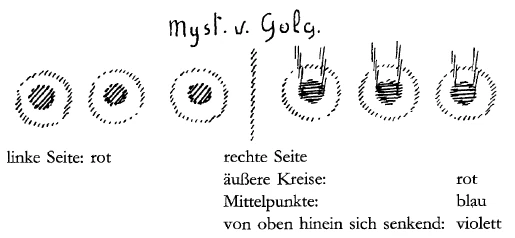

Vorgestern ist hier versucht worden, hinzuweisen auf die Impulse, aus denen sich das Christentum herausentwickelt hat. Wir konnten sehen, wie das eigentliche Ich des Christentums, das Zentrale des Christentums sich gewissermaßen verleiblicht hat - man kann das natürlich nicht gut sagen, aber vergleichsweise kann man es sagen in drei Elementen: in der althebräischen Seele, in dem griechischen Geist, in dem römischen Leib. Nun wollen wir, um die Anwendung pflegen zu können, um von der Anwendung des christlichen Gedankens auf die unmittelbare Gegenwart sprechen zu können, diese Betrachtung zunächst noch etwas fortsetzen, wollen gewissermaßen über dieses Innere, dieses Zentrale des Christentums heute noch einige Einblicke zu gewinnen versuchen. ^br42de

Wenn man auf die Entwickelung des Christentums eingehen will, so kann man es nicht anders — und Sie sehen das schon aus meinem Buche «Das Christentum als mystische Tatsache» -, als indem man auch zeigt, inwiefern sich das Christentum aus dem Mysterienwesen der vorchristlichen Zeit heraus entwickelt hat. Es ist heute im allgemeinen nicht leicht, über das Mysterienwesen zu sprechen aus dem Grunde, weil im Entwickelungsgange der Menschheit — durch notwendige Gesetzmäßigkeit ist dies bedingt - gerade der Zeitpunkt, die Epoche, besser gesagt, eingetreten ist, in gewissem Sinne stecken wir noch drinnen, in der das Mysterienwesen zurückgegangen ist, in der es nicht mehr jene Rolle spielen kann, die es zum Beispiele gespielt hat in der Zeit, in der sich das Christentum, so wie aus anderem, so auch aus dem Mysterienwesen heraus entwickelt hat. Daß das Mysterienwesen in unserer Zeit zurückgegangen ist, hat seine gute Begründung, und wir werden gerade in Anlehnung an das heute und in den nächsten Tagen zu Besprechende auf diese Begründung eingehen und auch sehen können, in welcher Weise dieses Mysterienwesen neu zu begründen ist. ^pwydss

Dasjenige, was in alten Zeiten - ich spreche also zunächst von vorchristlichen Zeiten, sagen wir zunächst von der vorchristlichen griechischen und der vorchristlichen ägyptisch-chaldäischen Zeit —, was in diesen alten Zeiten die Menschen zu dem Mysterienwesen getrieben hat, das ist der Umstand, daß sie durch ihre damalige Weltanschauung gezwungen waren, die Überzeugung in sich aufzunehmen: die Welt, die ringsherum sich um sie ausbreitet, ist nicht unmittelbar die wahre Welt; man muß Mittel und Wege suchen, um in die wahre Welt als Mensch einzudringen. Eine starke Empfindung von einer gewissen Tatsache war den Menschen jener alten Zeiten eigen, die sich überhaupt irgendwelche Rätsel der Erkenntnis vorlegten. Die Tatsache war diesen Menschen bekannt, daß - wie man sich auch mit äußeren Anschauungen bemühen mag, in das Wesen der Welt einzudringen — man in dieses Wesen der Welt durch äußere Anschauung nicht eindringen könne. Man muß, um das ganze Gewicht dieser Erkenntnis jener alten Zeiten sich vor die Seele zu rücken, sogar berücksichtigen, daß wir von Zeiten sprechen, in denen die weitaus größte Anzahl der Menschen sogar noch eine volle äußere Anschauung hatte von geistigen elementaren Tatsachen. Es war nicht so für diese Menschen, wie es heute für die große Mehrzahl der Menschen ist, daß sie nur die Impression der äußeren Sinne wahrnahmen; sie nahmen noch geistig Wesenhaftes wahr, diese Leute, gewissermaßen durch die Naturerscheinungen hindurch. Sie nahmen auch Wirkungen wahr, die sich durchaus nicht erschöpften in dem, was wir heute Natutvorgänge nennen. Dennoch, trotzdem diese Leute von der Offenbarung von elementarischen Geistern überhaupt in der Natur sprachen, waren sie doch tief davon durchdrungen, daß diese Anschauungen der äußeren Welt - und seien sie noch so hellseherisch — zum wahren Wesen dieser Welt nicht führen können, daß dieses wahre Wesen der Welt auf besonderem Wege gesucht werden müsse. Diese besonderen Wege sind dann schön zusammengefaßt in der griechischen Weltanschauung in dem Worte «Erkenne dich selbst». ^69j4oj

Sucht man nach der eigentlichen Bedeutung dieses Wortes « Erkenne dich selbst», so wird man etwa das Folgende finden. Man wird finden, daß die Kraft dieses Wortes hervorgegangen ist aus der Einsicht, daß, wie weit man auch die Außenwelt überblicken mag, wie weit man auch eindringen mag in die Außenwelt, man nicht nur nicht‘ das Wesen dieser Außenwelt selbst findet, sondern man findet auch nicht das Wesen des Menschen. Einfach mit Worten der heutigen Weltanschauung ausgesprochen, könnte man sagen: Diese Leute waren davon überzeugt, Naturanschauung kann keine Aufklärung geben über das Wesen des Menschen. Dagegen waren sie auf der andern Seite davon überzeugt, daß dieses Wesen des Menschen zusammenhängt mit der ganzen in der Welt ausgebreiteten Natur, daß also, wenn es dem Menschen gelingt, in sein eigenes Wesen einzudringen, er imstande wäre, durch die Erkenntnis seines eigenen Wesens auch über diese Welt etwas Wesenhaftes zu wissen. Aus der Welt, davon waren sie überzeugt, können sie zunächst nicht über dieses Wesen der Welt sich aufklären. Aber aus dem Wesen des Menschen, der ja ein Glied dieser Welt ist, können sie, wenn sie es erkennen können, auch über das Wesen der Welt Aufklärung gewinnen. Daher: Erkenne dich selbst, um die Welt zu erkennen. — Das war gewissermaßen der Impuls. Und das war der Impuls, der zugrunde lag, nun, sagen wir der ägyptisch-chaldäischen Einweihung. -— Alle Einweihung geht über Stufen — man ist gewohnt geworden, sie Grade zu nennen —, geht über Stufen, über Grade hinauf. Nun bezeichnet man die erste Stufe, den ersten Grad der ägyptisch-chaldäischen Einweihung, mit einem Worte: der Einzuweihende habe zunächst zu gehen durch das «Tor des Menschen». Das war gewissermaßen die erste Stufe: der Durchgang durch das Tor des Menschen. Das heißt, der Mensch selber sollte zum Tore der Erkenntnis gemacht werden. Der Mensch sollte erkannt werden, weil, wenn man an diesem Eingangstor in die Welt am Menschen selbst das Wesen des Menschen erkennt, man auch in das Wesen der Welt auf dem Umweg durch den Menschen eindringen kann. Daher ist «Erkenne dich selbst» gleichbedeutend mit Eintreten in das Weltenwesen durch das Tor des Menschen. ^bugdu1

Nun habe ich heute nicht vor, in vielen Einzelheiten über diese verschiedenen Stufen der Einweihung zu sprechen, sondern möchte dasjenige hervorheben, was wesentlich ist zur Erfassung des Christentums. Betrachten Sie also dasjenige, was ich nunmehr sagen werde, nicht als eine erschöpfende Darstellung des Wesens der Einweihungsgrade, sondern betrachten Sie es als ausgesprochen, um einzelne charakteristische Eigenschaften dieser Einweihungsgrade der ägyptisch-chaldäischen Einweihung hervorzuheben, die besonders vorbereitend wirken konnten und wirklich vorbereitend wirkten auf die Entwickelung des Wesens des Christentums. ^6b609m

Dasjenige, was der Einzuweihende am Tore des Menschen erkennen sollte, das war also das Wesen des Menschen selbst. Das war etwas, was er nicht finden konnte — wie weit und wie genau er sich auch umschaute - in dem, was ihm die äußere Welt zeigte. Man war in den Mysterien sich klar darüber, daß in der Menschennatur etwas zurückgeblieben war von den Geheimnissen des Daseins, die man in dieser Menschennatur mit Menschenmitteln finden konnte, die man aber nicht finden kann, wenn man den Blick auf die Außenwelt richtet. Davon waren diese Menschen überzeugt. Richtet man den Blick auf die Außenwelt, so findet man allerdings zunächst die um den Menschen herum sich ausbreitende irdische Naturwesenheit. Allein diese irdische Naturwesenheit ist gewissermaßen nur eine Art von Schleier, von Hülle, insofern sie der Mensch erkennt. Und auch dasjenige, was heute etwa schon die Naturwissenschaft zu sagen hat über diese äußere Natur, wie sie sich darbietet, ist durch seine eigene Wesenheit so, daß es durchaus nicht über sich selbst aufklärt. Dann konnte der Mensch den Blick richten — und in jenen alten Zeiten tat man das viel intensiver, als man das heute tut — aufwärts von der äußeren Natur, die er hier auf der Erde in seiner Umgebung erblickt, auf die Sternenwelt. Da sah er mancherlei, von dem er in jenen alten Zeiten gut wußte — ein Wissen, das für die äußere Welt heute verlorengegangen ist —, daß der Mensch ebenso damit in Verbindung steht, wie er mit dem Pflanzen-, mit dem Tierreich und dem mineralischen Reiche hier auf der Erde in Verbindung steht. Man wußte, daß der Mensch, ebenso wie er aus den Reichen der Natur auf der Erde herausgeboren ist, mit irgend etwas in sich auch aus dem außertellurischen, dem außerirdischen Kosmos herausgeboren ist. Allerdings, das, was den Menschen mit diesem außertellurischen, außerirdischen Kosmos vereint, das stellte sich für die Erkenntnis ein, wenn der Mensch durch das Tor des Menschen ging. In sich trug der Mensch gewissermaßen die Überreste eines Zusammenhanges, aus denen er sich losgelöst hatte beim Übergang der Mondennatur zur Erdennatur. Er trug in sich die Überreste seines Zusammenhanges mit dem außerirdischen Kosmos. Der Mensch wurde also zum Tore des Menschen geführt; er sollte da den Menschen selbst kennenlernen. Er lernte dasjenige, was er nur äußerlich anstarren konnte, namentlich in der Sternenwelt, in sich selbst kennen. ^buedvr

Er lernte in sich selbst kennen, wie er als eigentlicher Mensch nicht nur eingegliedert ist in einen irdischen Leib, der aus den Reichen der Erdennatur zusammengesetzt ist, sondern er lernte auch kennen, wie in sein ganzes menschliches Wesen eingeflossen ist dasjenige, was von der gesamten außerirdischen Sternenwelt ausgeht. Der Mensch entdeckte durch seine Selbsterkenntnis, könnte man sagen, die Natur des Sternenhimmels. Er lernte kennen, wie er von Stufe zu Stufe herabgestiegen ist, gewissermaßen von Himmel zu Himmel herabgestiegen ist, bevor er auf der Erde angelangt ist und in einem irdischen Leibe verkörpert wurde. Und er sollte beim Tore des Menschen diese Stufen - ihrer acht wurden gewöhnlich aufgeführt - wieder hinaufsteigen. Er sollte gewissermaßen während seiner Einweihung den Rückweg antreten durch diejenigen Stufen hindurch, durch die er herabgestiegen ist, bis er hier in einem physischen Leibe geboren worden ist. ^musj36

Solch eine Erkenntnis kann nicht erworben werden - ich spreche jetzt immer von vorchristlicher Mysterienerkenntnis -, ohne daß das ganze Wesen des Menschen ergriffen wird. Die Vorbereitung, die der Einzuweihende in jenen Zeiten durchzumachen hatte, von ihr macht sich der heutige Mensch nicht gern einen Begriff - ich wähle meine Worte so, daß sie möglichst genau die Tatsache ausdrücken -, weil er durch diese Begriffe irritiert wird. Der Mensch möchte heute womöglich auch die Einweihung durchmachen wie etwas, was man so gelegentlich mitnimmt auf seinen Lebensweg, was man so nebenher absolviert. Er möchte sich informieren — wie man das heute nennt über das, was zu den Erkenntnissen führt; er möchte jedenfalls, der heutige Mensch, nicht gern das erleben, was jene alten Leute, die die Einweihung suchten, erleben mußten. In seiner ganzen menschlichen Wesenheit von der Vorbereitung zur Erkenntnis ergriffen werden, ein anderer Mensch werden, das möchte er nicht gern. Diese Leute aber mußten sich dazu entschließen, ein anderer Mensch zu werden. Die Beschreibungen, die Sie sehr häufig über dieses alte Mysterienwesen finden, geben Ihnen nur einen unklaren Begriff, denn diese Beschreibungen sind meistens so gehalten, daß man die Vorstellung bekommt, es wären diese alten Einweihungen auch so nebenher an den Menschen vorübergegangen wie etwa die sogenannten Einweihungen der modernen Freimaurerei. Das ist aber nicht der Fall. Man hat es auch da, wo alte Einweihungen nachgeahmt werden in der Gegenwart, nur zu tun mit allerlei Nachbildungen desjenigen, was in jenen alten Zeiten wirklich durchlebt worden ist, mit Nachbildungen, die wirklich so nebenher, wie es der moderne Mensch wünscht, im Leben absolviert werden können. Dasjenige aber, was für den alten Menschen wesentliche Vorbereitung war, das war, daß er durchzumachen hatte jenen inneren Seelenzustand, der sich nur mit einem Worte dadurch bezeichnen läßt, daß man sagt: er mußte durchgeführt werden in stärkstem Maße durch jene Furcht, welche der Mensch immer empfindet, wenn er wahrhaftig und wirklich vor ein ihm gänzlich Unbekanntes geführt wird mit vollem Bewußtsein. Das war gerade das Wesentliche bei den alten Einweihungen, daß die Menschen wirklich am intensivsten die Empfindung in sich aufzunehmen hatten: sie stehen vor etwas, wovor sie nicht stehen können irgendwie im äußeren Leben. ^oejomt

Mit all den Seelenkräften, mit denen man im äußeren Leben auch heute noch wirtschaftet, läßt sich diese Seelenverfassung nicht erreichen. Mit den Seelenkräften, die der Mensch heute gern handhabt, mit denen kann man essen und trinken, mit denen kann man sich in der Weise sozial bewegen, wie man das heute tut unter den heute üblichen Menschenklassen, mit denen kann man Handel treiben, Bürokratismus treiben, ja mit denen kann man Professor werden, Naturwissenschaft treiben, all das, aber man kann mit diesen Fähigkeiten nichts Wirkliches erkennen. Die Seelenverfassung, mit der man - halten Sie das fest, daß ich immer in jenem alten Sinne spreche — in jenen alten Zeiten erkennen wollte, ist eine wesentlich andere. Sie durfte nichts gemein haben mit den Seelenkräften, die für das äußere Leben dienlich sind, die mußten sozusagen aus ganz andern Regionen des Menschen hergenommen werden. Diese Regionen sind immer im Menschen vorhanden, aber der Mensch hat eine heillose Furcht, sie irgendwie zu handhaben. Geradezu voll absichtlich wurde jene Region in Tätigkeit versetzt bei dem Einzuweihenden, die gerade der moderne Mensch, der gewöhnliche profane Mensch auch in der damaligen Zeit, in sich selber mied, zu der er nicht seine Zuflucht nehmen wollte, über die er sich gern Illusionen macht, sich gern betäuben läßt. Daher wird das äußerlich — was aber mehr innerlich verstanden werden sollte — geschildert als das Erregen einer Reihe von Furchtzuständen, die allerdings durchgemacht werden mußten, weil in der Seele des Menschen nur das zur beabsichtigten Erkenntnis hingeleitet werden kann, was in solcher Region liegt, vor der sich der Mensch im gewöhnlichen äußeren Leben fürchtet. Erst aus dieser Seelenstimmung heraus, die wacker durchgemacht wurde, die nun wirklich erlebt wurde, wo der Mensch in seiner Seele nichts fühlte als Furcht vor irgend etwas, was eben das Unbekannte war - denn er sollte erst durch diese Furcht zur Erkenntnis hingeführt werden -, erst aus diesem Seelenzustand heraus wurde er dann hingeführt vor dasjenige, was ich eben charakterisiert habe als das Heruntersteigen des Menschen dutch die Regionen der Himmel oder der geistigen Welt, wo er die acht Stufen wiederum hinaufgeleitet wurde, die natürlich heute nur nachgemacht werden, nur nachgemacht werden können nach den Gepflogenheiten unserer Zeit. Aber der Mensch wurde damals in dieses Erlebnis tatsächlich eingeführt. ^s1xx3f

Für uns ist besonders wichtig das Ergebnis, das sich für den Menschen dann herausstellte, wenn er an dieses Tor des Menschen hingeführt worden ist. Der Mensch hörte auf, nachdem er begriffen hatte den ganzen Sinn seines Hingestelltseins vor das Tor des Menschen, sich als das Tier - verzeihen Sie den Ausdruck - auf zwei Beinen zu betrachten, das eine Zusammenfassung der übrigen Naturreiche hier auf dieser Erde ist. Er fing an, sich als ein Bürger der ganzen Welt zu betrachten, er fing an, sich zu den Himmeln zugehörig zu betrachten, die man sehen kann, und auch zu denen, die man nicht sehen kann. Er fing an, sich eins zu fühlen mit dem ganzen Kosmos, sich wirklich als Mikrokosmos zu fühlen, nicht bloß als eine kleine Erde, sondern als eine kleine Welt sich zu fühlen. Er fühlte seinen Zusammenhang mit Planeten und Fixsternen, fühlte sich also herausgeboren aus dem Weltenall. Gewissermaßen könnte man sagen, er fühlte, wie sein Wesen nicht endet bei den Fingerspitzen, den Ohrenspitzen, Zehenspitzen, sondern wie sein Wesen sich fortsetzt über diese seine von der Erde her genommene Leiblichkeit durch die unendlichen Räume, und durch diese unendlichen Räume noch hindurch in die Geistigkeit hinein. Das war das Ergebnis. ^kbd87u

Versuchen Sie nicht, dieses Ergebnis allzusehr in einen abstrakten Begriff zu verwandeln, denn von diesem abstrakten Begriff haben Sie wirklich nicht viel. Zu sagen, der Mensch ist ein Mikrokosmos, eine kleine Welt, und da nur den abstrakten Gedanken zu haben, das ist nicht sehr viel; das ist eigentlich bloß eine Illusion, bloß eine 'Täuschung. Denn dasjenige, um was es sich bei diesen alten Mysterien handelte, war das unmittelbare Erlebnis. Wirklich hatte der Einzuweihende erlebt beim Tor des Menschen, wie er verwandt ist mit Merkur, Mars, mit der Sonne, mit dem Jupiter, mit dem Monde. Wirklich hatte er erlebt, daß jene Hieroglyphen, die im Weltenraume stehen und die von der Sonne durchlaufen werden - scheinbar, wie wir heute selbstverständlich sagen -, die Bilder des Tierkreises mit seiner eigenen Existenz etwas zu tun haben. Erst dieses konkrete Wissen, das auf Erlebnis beruhte, machte dasjenige aus, was ich jetzt als Ergebnis bezeichne. Nicht hat man dasselbe, wenn man diese Dinge heute übersetzt in abstrakte Begriffe. Wenn man heute die alten Erlebnisse in den abstrakten Begriff übersetzt: dieser Stern hat diesen Einfluß, jener Stern hat jenen Einfluß und so weiter, so sind das eben abstrakte Begriffe. Für jene alten Zeiten handelte es sich um das unmittelbare Erlebnis, um das wirkliche Hinaufsteigen durch die verschiedenen Stufen, durch die der Mensch vorgeburtlich heruntergestiegen ist. Erst dann, wenn der Mensch dieses lebendige Bewußtsein hatte, wenn er aus dem Erlebnis wußte, daß er ein Mikrokosmos ist, erst dann fühlte man ihn reif, eine zweite Stufe, einen zweiten Grad aufzusteigen, der damals der eigentliche Grad der Selbsterkenntnis war. Da konnte der Mensch erleben, was er selbst ist. ^frosr4

Dasjenige also, was ich vorhin charakterisiert habe als das Wesen, das auch das Wesen der Welt ist, war aber für den Menschen der damaligen Zeit nur im Menschen selbst zu finden; daher mußte man, wollte man im Weltenall Einlaß finden, durch das Tor des Menschen gehen. Innerhalb dieses zweiten Grades kam gewissermaßen alles in Bewegung, was im ersten Grade wie ein erlebtes Wissen erfahren worden war. Dieses In-Bewegung-Kommen - es ist heute sogar noch schwierig, eine Vorstellung zu geben von diesem In-BewegungKommen von Erlebnissen. Man lernte im zweiten Grade nicht nur kennen, wie man zugeteilt ist dem Makrokosmos, sondern man wurde eingesponnen in die ganze Bewegung des Makrokosmos. Man ging gewissermaßen mit der Sonne durch den Tierkreis, man lernte kennen dadurch, daß man mit der Sonne durch den Tierkreis ging, auch den ganzen Weg, welchen irgendein äußerer Eindruck auf den Menschen selber macht. Der Mensch kennt, wenn er der Außenwelt mit dem gewöhnlichen Erkenntnisvermögen gegenübersteht, nur den Anfang eines sehr ausführlichen Prozesses. Sie sehen eine Farbe, machen sich die Vorstellung der Farbe, behalten vielleicht diese Vorstellung im Gedächtnis, in der Erinnerung, aber weiter geht es nicht. Das sind drei Stufen. Wenn man das als etwas Vollendetes betrachten würde, so wäre das gerade so, wie wenn man den Tageslauf, der zwölf Stunden mit der Sonne hat, nur drei Stunden lang betrachten wollte. Denn alles dasjenige, was der Mensch als eine Impression von außen aufnimmt, was er eigentlich höchstens bis zu der Gedächtnisvorstellung verfolgt, das macht in ihm von der Gedächtnisvorstellung an einen weiteren Prozeß dutch, durch weitere neun Stufen. Der Mensch wird sich selbst ein Bewegliches, wird innerlich gewissermaßen durchzogen von einem lebendigen sich drehenden Rade, wie die Sonne ihr Himmelsrad beschreibt - scheinbar, im heutigen Begriffe gesprochen. So lernte der Mensch sich selbst kennen. Er lernte aber damit auch die Geheimnisse der großen Welt kennen. Lernte er im ersten Grade kennen, wie er drinnensteht in der Welt, so lernte er im zweiten Grade kennen, wie er sich bewegt innerhalb der Welt. ^v8i0v0

Ohne diese Erkenntnisse als Lebenserkenntnisse ist nicht dasjenige zu erreichen, was jeder in den dritten Grad, in die dritte Stufe Einzuweihende in den alten Zeiten wirklich durchzumachen hatte. Wir leben eben in einer Epoche, in der es dem Menschen natürlich ist, alles Dreigliedrige, wenn ich im Mysteriensinne sprechen soll, überhaupt zu leugnen, überhaupt aus dem menschlichen Bewußtsein alles Dreigliedrige auszulöschen. Denn der Mensch, ob er es nun zugibt oder nicht, pocht heute eigentlich auf die ganze Welt als in Raum und Zeit beschlossen. Sie können selbst bei sehr nachdenklichen Menschen finden, wie sie die ganze Welt in Raum und Zeit beschlossen finden. Sie brauchen zum Beispiel nur zu denken, wie in der Epoche des 19. Jahrhunderts, in welcher der Materialismus, der theoretische Materialismus, seine Hochblüte getrieben hat, der Unsterblichkeitsgedanke des Menschen gefaßt worden ist. Sehr gescheite Leute in der Mitte, in der zweiten Hälfte des 19. Jahrhunderts, haben immer wieder betont: Wenn die Seele des Menschen im Tode den Menschen verlassen würde, so könnte ja zuletzt kein Platz sein; die Welt müßte so angefüllt sein mit Seelen, daß kein Platz sein könnte für diese Seelen. — Das haben sehr gescheite Leute gesagt, weil sie tatsächlich damit gerechnet haben, daß die Seele des Menschen nach dem Tode irgendwie untergebracht sein müßte in einer Weise, die sich mit Raumesvorstellungen charakterisieren läßt. Oder ein anderes Beispiel: Es gab, soll sogar noch geben eine Theosophische Gesellschaft, in der allerlei Dinge gelehrt worden sind über die höheren Glieder der Menschennatur. Ich will nicht sagen, daß die erleuchteten Führer in denselben Fehler verfallen sind, aber ein großer Teil der Anhänger hat sich recht räumlich den Astralleib vorgestellt: so wie eine allerdings recht dünne, aber doch wie eine räumliche Wolke; und diese Anhänger haben viel darüber nachspekuliert, wie sie sich nun das vorzustellen haben, wenn der Mensch schläft, und jene Wolke räumlich aus ihm herausgeht, wo sie sich räumlich nun irgendwo aufhält. Es war sehr schwierig, einer großen Anzahl von Anhängern beizubringen, daß solche räumlichen Vorstellungen unangemessen sind dem Geistigen. ^8kzpy2

Das wird eben dem heutigen Menschen ungeheuer schwierig, sich vorzustellen, daß von einem gewissen Punkte des Erkenntnisweges aus der Mensch nicht nur in andere Raumesteile und in andere Zeiten kommt, sondern aus Zeit und Raum herauskommt, daß erst dann eigentlich das wirkliche Übersinnliche beginnt, wenn man nicht nur die Sinneseindrücke und ihre zeitlichen Prozesse verläßt, sondern Raum und Zeit selbst, wenn man in ganz andere Daseinsbedingungen eintritt als in die Daseinsbedingungen, die Raum und Zeit umschließen. Und wenn Sie sich vielleicht, indem ich dieses ausspreche, auf sich selbst besinnen, so werden Sie unter Umständen in Ihrem eigenen Inneren Schwierigkeiten finden, wenn Sie sich fragen: Wie soll ich das nun machen, um aus Raum und Zeit mit meiner Vorstellung hinauszugehen? — Und dennoch, das war im wesentlichen die wirkliche Errungenschaft des wirklichen Durchmachens der zwei ersten Grade. Würde man in dem Zeitalter des Materialismus noch ein deutliches Bewußtsein gehabt haben von diesen drittgradigen Geheimnissen, so würde nicht etwas — jetzt spreche ich nicht über das äußere Experimentelle, aber über die zugrunde gelegte Theorie -, was als Theorie so grotesk ist wie der Spiritismus, Verbreitung gefunden haben. Wer Geister sucht, indem er sie so wie feine Körper in den Raum hereinbringen will, der hat gar keine Ahnung davon, daß, indem er so verfährt, er schon geistlos verfährt, das heißt, eine Welt aufsucht, die keine Geister enthält, sondern eben etwas anderes als Geister. Würde der Spiritismus eine Ahnung haben, wie, um Geister zu finden, man aus Zeit und Raum herausgehen muß, so würde er nicht zu dieser grotesken Vorstellung kommen, daß man räumliche Arrangements treffen kann, durch die sich Geister in irgendeiner Weise so ankündigen, wie sich äußere Raumeswirkungen im Zeitprozeß abspielen. ^ysysut

Nun kurz, das war es, was eben gerade erworben werden sollte durch die zwei ersten Stufen bis zum dritten Grade hin: die Möglichkeit, aus Zeit und Raum herauszukommen. Dazu bereitete allerdings vor das wirkliche Hindurchschreiten durch das Tor des Menschen und dann durch den zweiten Grad. ^bn3jav

Diese dritte Stufe, dieser dritte Grad wurde mit einem Worte bezeichnet, das man etwa in deutscher Sprache so ausdrücken kann: Der Einzuweihende ging durch das «Tor des Todes». Das heißt, er wußte sich jetzt wirklich außerhalb des Raumes, in dem sich das leibliche Menschenleben zwischen Geburt und Tod abspielt, und außerhalb der Zeit, in welcher dieses Menschenleben verläuft. Er wußte sich, jenseits von Zeit und Raum, im Dauernden zu bewegen. Er lernte erkennen dasjenige, was schon in die Sinneswelt hereinragt, wie ich öfter jetzt betont habe, aber mit dem, womit es in die Sinneswelt hereinragt, nicht innerhalb dieser Sinnenwelt begriffen werden kann, weil es schon Geistiges enthält. Er lernte sich befassen mit dem Tode, mit alldem, was mit dem Tode zusammenhängt. Das war im wesentlichen der Inhalt dieses dritten Grades. Wie man auch die je nach den verschiedenen Völkern verschieden gearteten Mysterienriten anschauen mag, wie sie sich auch darstellen mögen, überall lag zugrunde die Beschäftigung mit dem Tode. Überall mußte der Ausgangspunkt genommen werden für den dritten Grad von alldem, was erlebt werden kann — wenn ich den paradoxen Ausdruck, weil ich keinen besseren jetzt habe, gebrauchen muß -, wenn man den Tod, der sonst den Menschen aus dem Leibe herausführt, erlebbar macht schon innerhalb des Leibeslebens. Das war dann zugleich verbunden mit der Möglichkeit, nun wirklich den Menschen, so wie er dasteht zwischen Geburt und Tod, als etwas zu betrachten, das außerhalb der Wesenheit ist, die man jetzt im dritten Grade erreicht hatte. Man wußte jetzt einen Begriff zu verbinden mit dem Worte: außerhalb seines Leibes zu sein, wobei dieses «außerhalb» eben dann nicht räumlich aufgefaßt worden ist, sondern überräumlich aufzufassen war. Also man wußte damit einen erlebbaren Begriff zu verbinden. Da war es auch, wo die Menschen ablegten den Glauben an die gewöhnliche profane Religion, die die Religion ihres Volkes war. Da legten die Menschen vor allen Dingen ab am Tore des Todes die Vorstellung: Du stehst hier auf der Erde, deine Götter oder dein Gott sind irgendwo außer dir. - Da wußte sich der Mensch einig mit seinem Gotte, da unterschied sich der Mensch nicht mehr von seinem Gotte, da wußte er sich mit ihm völlig verbunden. Es war im wesentlichen erlebte Unsterblichkeit, die dieser dritte Grad dem Menschen brachte. Es war erlebte Unsterblichkeit dadurch, daß der Mensch dasjenige, was sterblich an ihm ist, verlassen konnte, daß er sich trennen konnte von demjenigen, was an ihm sterblich ist. ^cpcfjm

Aber vergessen wir nicht über diesem Ergebnis den ganzen Weg. Der ganze Weg bestand darin, daß der Mensch sich selbst erkennen gelernt hat. Jetzt war der Mensch nicht mehr in sich selbst, jetzt war er in der Außenwelt. Er hatte das mit in die Außenwelt hineingetragen, was er durch das Eindringen in sich selbst kennengelernt hat. Das ist das Wesentliche dieser vorchristlichen Einweihung, daß der Mensch in sich selbst ging, um in sich selbst etwas zu finden, was er dann mitnahm in die Außenwelt und was ihm in der Außenwelt, indem er sich von sich selbst getrennt hat, erst in der richtigen Weise aufleuchtete, so daß er sich dann mit dem Wesen der Außenwelt verbunden fühlte. Er ging in sich, um aus sich herauszugehen. Er ging in sich, weil er in sich etwas finden konnte von dem Wesen der Welt, was er nur in sich finden konnte, was er draußen nicht hätte finden können, was er aber nur draußen wirklich erleben konnte. Er ging durch das Tor des Menschen und durch das Tor der Selbsterkenntnis und des Todes, um in diejenige Welt einzutreten, die allerdings außer ihm ist. Die gewöhnliche Naturwelt ist auch außer uns. Aber der Mensch war sich klar darüber, daß er das, was er suchte, nur finden konnte, wenn er in sich selber hineinging. ^ql28sd

Dann, nachdem der Mensch den außerordentlich schwierigen dritten Grad durchgemacht hatte, war er ohne weiteres reif für den vierten Grad. Und man kann sagen: Einfach dadurch, daß er eine Zeitlang praktiziert hatte, zu leben im dritten Grade, war er reif für den vierten Grad in einer Weise, wie man es vom heutigen Menschen sehr schwer behaupten könnte. Denn der heutige Mensch wird - das liegt einfach in der Zeitepoche — nicht eigentlich reif innerhalb des dritten Grades. Er kommt anders nicht leicht aus der Raumes- und Zeitenvorstellung heraus als durch gewisse Kraftvorstellungen, die aber gesucht werden müssen auf andern Wegen — darüber werde ich in den nächsten Tagen sprechen -, als sie in alten Zeiten verfolgt wurden. Mit dem, was der Mensch aus sich heraus nun in die Außenwelt hineingetragen hatte, wurde er zum Bewußtsein dieses vierten Grades erhoben, und er wurde das, was man in späteren Sprachen übertragen und übersetzen konnte mit den Worten: ein «Christophor», ein Christus-Träger. Das war im Grunde genommen das Ziel dieser Mysterieneinweihung: den Menschen zum Christus-Träger zu machen. Natürlich wurden nur einige Auserlesene solche Christus-Träger. Sie konnten auch nur Christus-Träger werden dadurch, daß sie erst im Menschen suchten, was sich in der ganzen Außenwelt nicht finden ließ, daß sie dann mit dem im Menschen Gesuchten in die Außenwelt gingen und sich dann vereinigten mit ihrem Gotte. Sie wurden so zum Christus-Träger. Sie wußten, sie haben in der Struktur des Weltenalls sich vereinigt mit demjenigen — das ist jetzt nicht historisch, sondern vorweggenommen gesprochen -, was im Johannes-Evangelium der Logos oder das Wort genannt wird; sie haben sich vereinigt mit dem, woraus alle Dinge gemacht sind und ohne welches nichts von dem gemacht ist, was gemacht worden ist. So war das Christus-Geheimnis in diesen alten Zeiten gewissermaßen durch einen Abgrund vom Menschen getrennt, und es war gebunden daran, daß der Mensch diesen Abgrund überstieg, daß er wirklich durch die Selbsterkenntnis in die Lage sich versetzte, aus sich herauszukommen und sich mit seinem Gotte zu vereinigen, ein Träger seines Gottes zu werden. ^uwgw2m

Nehmen wir nun einmal, um uns in dieser Betrachtung weiterzuhelfen, hypothetisch an, es wäre auf der Erde das Mysterium von Golgatha nicht geschehen, die Erdenentwickelung wäre bis zum heutigen Tage verflossen, ohne daß das Mysterium von Golgatha geschehen wäre. Nur indem man solche Kontrahypothesen macht, kann man die Bedeutung einer solchen Sache wie die des Mysteriums von Golgatha wirklich ins Auge fassen. Also nehmen wir an, das Mystetium von Golgatha hätte sich bis zum heutigen Tage nicht vollzogen. Was wäre für dasjenige, was da durch die Mysterien in alten Zeiten am Menschen beobachtet worden ist, eingetreten? ^zs2af1

Der heutige Mensch könnte dann das vernehmen, was der griechische apollinische Spruch, was die griechische apollinische Devise war: «Erkenne dich selbst.» Er könnte gewissermaßen nachleben wollen diesem Worte «Erkenne dich selbst», könnte versuchen, da schließlich die Traditionen sich erhalten haben, dieselben Einweihungswege durchzumachen, die meinetwillen die ägyptisch-chaldäische Königseinweihung gegeben hat, könnte also versuchen, durch die vier Stufen so aufzusteigen, wie in der damaligen vorchristlichen Zeit aufgestiegen worden ist, um ein Christophor zu werden. Da würde der Mensch aber eine ganz bestimmte Erfahrung machen. Er könnte dann, wenn er befolgt diese Devise «Erkenne dich selbst», wenn er versucht, in sich hineinzugehen auch durch jene Furchtzustände hindurch, die damals durchgemacht worden sind, dann durch das nachträgliche Erleben der Veränderungen, durch das nachträglich In-Bewegung-Versetzen desjenigen, was erst im Ruhezustand durchgemacht worden ist, die Erfahrung machen, daß er nun nichts findet, daß er nun nicht das Wesen des Menschen in sich findet. Das ist schon das Bedeutungsvolle! Gewiß, die Devise «Erkenne dich selbst», gilt auch für den heutigen Menschen, aber diese Selbsterkenntnis führt ihn nicht mehr zur Welterkenntnis. Dasjenige, was der Mensch in der alten Seelenverfassung noch in sich gefunden hat als mit dem Wesen der Welt zusammenhängend, was er nicht finden konnte in der äußeren Welt, was er eben auf dem Wege der Selbsterkenntnis suchen mußte, um es dann als Welterkenntnis zu haben, jenes innere menschliche Wesenszentrum, das er dann mitnehmen konnte in die Außenwelt, um zum Christophor zu werden, das findet der Mensch heute nicht in sich, das ist nicht mehr da. Das ist wichtig, daß man das ins Auge faßt! Die Menschen mit den heutigen törichten Begriffen, die durch die sogenannte Wissenschaft kultiviert werden, haben die Meinung: Mensch ist Mensch. Der heutige Engländer oder Franzose oder Deutsche ist Mensch, so wie es der alte Ägypter war. Das ist aber ein Unsinn vor der wirklichen Erkenntnis, ein wirklicher Unsinn. Denn der alte Ägypter, indem er in sich selber einkehrte nach den Regeln der Initiation, fand etwas in sich, was der heutige Mensch in sich nicht finden kann, weil es verschwunden ist, weil es weg ist. Das ist entglitten dem Menschen, verlorengegangen dem Menschen, was selbst noch in der vorchristlichen und zum Teil noch in der nachchristlichen griechischen Seelenverfassung gefunden werden konnte. Das ist verlorengegangen, ist aus der Menschenwesenheit heraus verschwunden. Die menschliche Organisation ist heute eine andere, als sie in alten Zeiten war. ^56vbxc

Wenn wir die Sache anders aussprechen, so können wir so sagen: Der Mensch fand, wenn auch dunkel, wenn auch nicht in vollbewußten Begriffen, in jenen alten Zeiten, indem er in sich hineinging, doch sein Ich. Das widerspricht nicht dem, daß man sagt, daß das Ich in einer gewissen Weise durch das Christentum erst geboren worden ist. Deshalb sage ich: Wenn auch dunkel, wenn auch nicht in vollbewußten Begriffen, der Mensch fand doch sein Ich. Es war als aktives Bewußtsein erst durch das Christentum geboren worden, aber der Mensch fand sein Ich. Denn von diesem Ich, von diesem wirklichen, wahren Ich ist im Menschen der damaligen Zeit etwas zurückgeblieben, nachdem er geboren worden ist. Sie werden sagen: Soll nun jetzt etwa der Mensch heute nicht sein Ich finden? — Nein, er findet es auch nicht: das wirkliche Ich macht einen Stillstand, indem wir geboten werden. Dasjenige, was wir erleben als unser Ich, ist nur ein Spiegelbild des Ich. Das ist nur etwas, was das vorgeburtliche Ich in uns abspiegelt. Wir erleben in der Tat nur ein Spiegelbild des Ich, etwas vom wirklichen Ich erleben wir nur ganz indirekt. Das, wovon die Psychologen, die sogenannten Seelenforscher als vom Ich reden, ist nur ein Spiegelbild; das verhält sich zum wirklichen Ich so, wie das Bild, das Sie von sich im Spiegel sehen, sich zu Ihnen verhält. Aber dieses wirkliche Ich, das während der Zeit des atavistischen Hellsehens und bis in die christlichen Zeiten herein gefunden werden konnte, ist heute nicht in dem Menschen, der auf seine eigene Wesenheit - insofern die eigene Wesenheit verbunden ist mit dem Leibe hinschaut. Nur indirekt erlebt der Mensch etwas von seinem Ich, dann, wenn er mit andern Menschen in Beziehung tritt und sich das Karma abspielt. ^tuxod9

Wenn wir einem andern Menschen gegenübertreten und sich etwas abspielt zwischen uns und dem andern Menschen, was zu unserem Karma gehört, da tritt etwas von dem Impulse des wahren Ich in uns herein. Aber das, was wir in uns Ich nennen, was wir mit dem Worte bezeichnen, das ist nur ein Spiegelbild. Und gerade dadurch wird der Mensch reif gemacht während unseres fünften nachatlantischen Kulturzeitraumes, das Ich im sechsten Zeitraum in einer neuen Gestalt zu erleben, daß er gewissermaßen durch den fünften Zeitraum dieses Ich nur als Spiegelbild erlebt. Das ist gerade das Charakteristische des Zeitalters der Bewußtseinsseele, daß der Mensch sein Ich nur als Spiegelbild erhält, damit er in das Zeitalter des Geistselbstes hineinlebt und das Ich anders gestaltet, in neuer Gestalt wieder erleben kann. Nur wird er es anders erleben, als er es heute gerne möchte! Heute möchte der Mensch sein Ich, das er nur als Spiegelbild erlebt, alles eher nennen als das, was sich ihm im zukünftigen sechsten nachatlantischen Zeitraum als solches präsentieren wird. Jene mystischen Anwandlungen, wie sie heute die Menschen noch haben: durch Hineinbrüten in ihr Inneres das wahre Ich zu finden - das sie sogar das göttliche Ich nennen! -, solche Anwandlungen werden die Menschen in der Zukunft seltener haben. Aber gewöhnen werden sie sich müssen, dieses Ich nur in der Außenwelt zu sehen. Das Sonderbare wird eintreten, daß jeder andere, der uns begegnet und der etwas mit uns zu tun hat, mehr mit unserem Ich zu tun haben wird als dasjenige, was da in der Haut eingeschlossen ist. So steuert der Mensch auf das soziale Zeitalter zu, daß er sich in Zukunft sagen wird: Mein Selbst ist bei all denen, die mir da draußen begegnen; am wenigsten ist es da drinnen. Ich bekomme, indem ich als physischer Mensch zwischen Geburt und Tod lebe, mein Selbst von allem Möglichen, nur nicht von dem, was da in meiner Haut eingeschlossen ist. ^z93nv8

Dieses, was so paradox erscheint, es bereitet sich heute indirekt vor dadurch, daß die Menschen ein wenig empfinden lernen, wie sie in dem, was sie ihr Ich nennen, in diesem Spiegelbild drinnen eigentlich furchtbar wenig sind. Ich habe neulich einmal davon gesprochen, wie man dadurch auf die Wahrheit kommen kann, daß man sich seine Biographie, aber sachlich, vor Augen führt und sich frägt, was man eigentlich dem und jenem Menschen verdankt von seiner Geburt ab. Man wird sich allmählich so langsam auflösen in die Einflüsse, die von andern kommen; man wird außerordentlich wenig finden in dem, was man als sein eigentliches Ich zu betrachten hat, das, wie gesagt, doch nur ein Spiegelbild ist. Etwas grotesk gesprochen, kann man sagen: In jenen Zeiten, in denen das Mysterium von Golgatha sich abgespielt hat, ist der Mensch ausgehöhlt worden, ist er hohl geworden. Das ist das Bedeutsame, daß man erkennen lernt das Mysterium von Golgatha als Impuls, indem man es in seiner Wechselbeziehung zu diesem Hohlwerden des Menschen betrachtet. Der Mensch muß, wenn er von der Wirklichkeit spricht, sich klar sein, daß der Platz irgendwie ausgefüllt sein muß, den er früher noch hat finden können, sagen wir, in den ägyptisch-chaldäischen Königsmysterien. Der wurde damals noch etwas ausgefüllt von dem wirklichen Ich, das heute haltmacht, wenn der Mensch geboren wird, oder wenigstens in den ersten Kindheitsjahren haltmacht, es scheint noch etwas herein in die ersten Kindheitsjahre. Und diesen Platz, ihn nahm der Christus-Impuls ein. Da sehen Sie den wahren Vorgang. Sie können sich sagen: Hier (siehe Zeichnung, links) die Menschen vor dem Mysterium von Golgatha, hier (Mitte) das Mysterium von Golgatha, (rechts) die Menschen nach dem Mysterium von Golgatha. ^zzwicl

 ^kaixke

Die Menschen vor dem Mysterium von Golgatha hatten etwas in sich, das, wie gesagt, durch die Einweihung gefunden wurde (rot). Die Menschen nach dem Mysterium von Golgatha haben dieses nicht mehr in sich (blau), sie sind gewissermaßen da ausgehöhlt, und der Christus-Impuls senkt sich herein (violett) und nimmt den leeren Platz ein. Der Christus-Impuls soll also nicht aufgefaßt werden wie eine Lehre bloß, wie eine T'heorie, sondern er muß hinsichtlich seiner Tatsächlichkeit aufgefaßt werden. Und jeder, der die Möglichkeit dieses Hinabsenkens im Sinne der alten Mysterieninitiation wirklich versteht, der versteht erst die Bedeutung des Mysteriums von Golgatha seiner innerlichen Wahrheit nach. Denn heute könnte, so wie das in der alten ägyptischen Königseinweihung der Fall war, der Mensch nicht ohne weiteres ein Christophor werden; er wird aber ein Christophor unter allen Umständen, indem gewissermaßen in den Hohlraum, der in ihm ist, der Christus sich hineinsenkt. ^eyy9qw

Also in dem Bedeutungsloswerden der alten Mysterienprinzipien zeigt sich die große Bedeutung des Christus-Mysteriums, von dem ich gesagt habe — Sie können das in meinem Buche «Das Christentum als mystische Tatsache» nachlesen -: Dasjenige, was früher in den Tiefen der Mysterien erlebt worden ist, was den Menschen zum Christophor gemacht hat, ist hinausgestellt worden in den großen Plan der Weltgeschichte und vollzieht sich als eine äußere Tatsache. Das ist Tatsache. Daraus werden Sie aber auch ersehen, daß das Einweihungsprinzip selber seit jenen alten Zeiten eine Änderung erfahren mußte, eine Wandlung durchmachen mußte, denn dasjenige, was sich die alten Mysterien als das im Menschen zu Suchende vorgesetzt haben, das kann heute nicht gefunden werden. ^ttoshq

Man tue sich nur ja nicht gar so viel darauf zugute, daß die heutige Naturwissenschaft den heutigen Engländer, Franzosen, Deutschen ebenso betrachtet, wie sie, wenn sie könnte, den alten Ägypter betrachten würde. Sie betrachtet gar nicht das am Menschen, was sein Wesentliches ist. Schließlich hat sich sogar das Äußere etwas verändert seit jenen alten Zeiten, aber das, was das Wesentliche ist, was sich verändert hat, das muß man so schildern, wie wir es heute getan haben. In dieser Schilderung sehen Sie aber zugleich die Notwendigkeit, daß das Initiationsprinzip sich ändert. Was soll denn heute der Mensch suchen, wenn er nur das alte «Erkenne dich selbst» im alten Sinne befolgen will? Was würde er erreichen, wenn er alle Beschreibungen der Einweihungszeremonien und Einweihungsvorgänge des alten Ägypten kennen und auf sich anwenden würde? Er würde nicht mehr das finden, was man innerhalb der alten Mysterien gefunden hat. Und dasjenige, was man im vierten Grad geworden ist, das würde er unbewußt vollziehen, er kann es aber nicht verstehen. Der Mensch kann, auch wenn er alle Einweihungszeremonien durchmacht, wenn er die Wege geht, die damals bis zum Christophor geführt haben, dem Christus auf diese Weise nicht verständnisvoll entgegentreten. Der alte Mensch konnte das, wenn er eingeweiht wurde: er wurde wirklich zum Christophor. Das ist eben eingetreten im Laufe der Entwickelung der Erde, daß der Mensch die Möglichkeit verloren hat, in sich selber jene Wesenheit zu suchen, die dann zum Licht der Weltwesenheit wurde. Heute findet der Mensch einen Hohlraum in sich, wenn er auf dieselbe Weise sucht. ^a9vay0

Aber im Weltengang ist es auch nicht bedeutungslos, wenn man etwas verliert: Man wird dadurch ein anderer. Man trägt — wenn ich das weiter ausdehne, was ich eben besprochen habe - sich als Mensch durch die Welt mit jenem Hohlraum. Das gibt einem aber wiederum besondere Fähigkeiten. Und so wahr es ist, daß gewisse alte Fähigkeiten verlorengegangen sind, so wahr ist es aber auch, daß gerade durch den Verlust jener Fähigkeiten neue erworben worden sind, die nun wiederum so ausgebildet werden können wie die alten Fähigkeiten im alten Sinne. Das heißt mit andern Worten: Der Weg, der gemacht worden ist durch das Tor des Menschen bis zum Tor des Todes, der muß heute in anderer Weise gemacht werden. Das hängt zusammen mit dem, was ich gesagt habe: Die Geister der Persönlichkeit nehmen einen neuen Charakter an. Mit diesem neuen Charakter der Geister der Persönlichkeit hängt im wesentlichen zusammen die neue Initiation. ^zspxfa

Es wurde gewissermaßen zuerst eine Pause gemacht in der Menschheitsentwickelung mit der Initiation. Im 19. Jahrhundert namentlich war der Mensch weit von ihr weggerückt. Erst mit dem Einde des 19. Jahrhunderts kam wiederum die Möglichkeit des Nahegerücktwerdens der wirklichen lebendigen Initiation. Und diese wirkliche lebendige Initiation bereitet sich vor, aber sie wird in einer ganz andern Weise verlaufen, als jene frühere verlaufen ist, die ich heute — um Ihnen eine Vorbereitung zu geben zum tieferen Verständnis des Christentums — von einem gewissen Gesichtspunkte aus geschildert habe. Dasjenige, was damals ganz vergeblich war: in der sich ausbreitenden äußeren Welt irgend etwas Wesenhaftes zu suchen, das wird gerade dadurch möglich, daß wir innerlich so hohl werden. Und das wird immer mehr eintreten und ist bis zu einem gewissen Grade heute schon möglich und kann heute schon erreicht werden durch solche Erkenntniswege, die geschildert werden in «Wie erlangt man Erkenntnisse der höheren Welten?». Dasjenige, was heute zu erlangen möglich ist, das ist, in einer gewissen Weise mit denselben Seelenfähigkeiten, wenn man sie nur richtig anwendet, mit denen man in die äußere Welt hineinsieht, tiefer in diese äußere Welt hineinzuschauen. Die Naturwissenschaft tut das nicht, sie will nur bis zu Gesetzen vordringen, sogenannten Naturgesetzen. Diese Naturgesetze sind ja Abstraktionen. Und wenn Sie sich ein bißchen bekanntmachen mit der gebräuchlichen Literatur, die den naturwissenschaftlichen Begriffen so ein Philosophenmäntelchen umhängt - ich könnte auch sagen, ein Philosophenhütchen aufsetzt -, dann werden Sie sehen, daß diese Leute, die da heute über diese Dinge reden, nicht wissen, wie sie über die Beziehungen der Naturgesetze zu der Realität, zu der Wirklichkeit denken sollen. Da kommt man bis zu den Naturgesetzen, aber die bleiben abstrakte Begriffe, abstrakte Ideen. Solch eine Persönlichkeit wie Goethe sucht über die Naturgesetze hinauszudringen. Und das ist das Bemerkenswerte an Goethe und an dem Goetheanismus, das, was so wenig verstanden wird: Goethe suchte über die Naturgesetze hinauszudringen zu der Naturgestaltung, zu den Formen. Daher begründete er gerade eine Morphologie im höheren Sinne, eine spirituelle Morphologie. Er versuchte nicht das festzuhalten, was die äußeren Sinne geben, sondern das Sich-Formende, dasjenige, was die äußeren Sinne nicht geben, was sich aber versteckt in den Formen. So daß wir heute wirklich von etwas Parallelem sprechen können zum Tor des Menschen: Wir können sprechen vom «Tor der Naturformen». Ich möchte sagen, die Morgenröte war schon gegeben, aber in einer etwas noch dunklen Art, als aus der chaotisch mittelalterlichen Mystik heraus solch ein Mann wie Jakob Böhme, wenn auch in seiner Sprache, von den sieben Naturformen sprach. Aber es ist eben nicht sehr deutlich und nicht sehr umfassend bei Jakob Böhme. Dasjenige aber, wozu die moderne Initiation immer mehr kommen muß, das sind diese Formen, die sich in den äußeren Sinnesformen als über das Räumlich-Zeitliche hinausgehend zeigen. ^cczlkh

Ich habe öfters aufmerksam gemacht auf jenes berühmte Gespräch zwischen Goethe und Schiller, als beide von einem Vortrag des Naturforschers Batsch herauskamen. Da sagte Schiller zu Goethe, daß das eine sehr zerstückelte Art wäre, die Welt zu betrachten, die Batsch sich geleistet habe. Nun, so zerstückelt wie die heutigen Naturforscher das tun, war das damals noch lange nicht, abet Schiller empfand das doch als sehr trocken. Und Goethe sagte, man könne wohl auch eine andere Naturbetrachtung anwenden. Und er zeichnete seine Pflanzenmetamorphose, die Urpflanze, mit ein paar charakteristischen Strichen. Da sagte Schiller, der das nicht erfassen konnte: Das ist keine Erfahrung -— er meinte, nichts was in der äußeren Welt ist -, das ist eine Idee. - Schiller blieb bei der Abstraktion. Goethe sagte darauf: Wenn das eine Idee ist, kann es mir recht sein, dann sehe ich meine Ideen mit Augen. — Er meinte, für ihn ist das nicht eine Idee, die man sich nur innerlich bildet, sondern für ihn ist das, was er da aufzeichnete, obwohl es nicht wie etwa Farben mit Augen gesehen werden kann, doch da. Das ist wirkliche Gestaltung, übersinnliche Gestaltung in den Sinnen. Goethe hat das gewiß nicht sehr weit ausgebildet. Ich habe Ihnen in Betrachtungen, die wir angestellt haben, gesagt: In gerader Fortsetzung von dieser Goetheschen Pflanzen- und Tierweltmetamorphose, die Goethe nur in elementarer Weise ausgebildet hat, liegt die wahre Durchdringung der wiederholten Erdenleben. Goethe betrachtet das farbige Blütenblatt als umgewandeltes Pflanzenblatt; er betrachtet den Schädelknochen als umgewandelten Rückenwirbelknochen. Es war ein Anfang. Wenn man nach derselben Betrachtungsweise ihn fortsetzt, kommt man nur bis zu den Formen, aber eben bis an das Tor der Naturformen, kommt zu imaginativer Einsicht in diese Naturformen. Und da kommt man dazu, wirklich nicht bloß auf die Schädelknochen hinzusehen, die umgewandelte Wirbelknochen sind, sondern auf den ganzen menschlichen Schädel. Man kommt darauf, daß dieser ganze menschliche Kopf die umgewandelte Menschengestalt ist aus dem vorherigen Leben, nur kopflos gedacht. Das, was Sie heute an sich tragen außer dem Kopf, der übrige Körper, geht natürlich seiner Materie nach in die Erde über; aber das Übersinnliche der Formen, das geht durch das Leben zwischen Tod und neuer Geburt, und das ist Kopf der nächsten Inkarnation. Da haben wir die Metamorphose in ihrer höchsten Ausbildung beim Menschen. Sie dürfen nur auf den Schein nichts geben. Sie können natürlich sagen: Wir senken den Menschen in die Erde ein oder wir verbrennen ihn, wie soll sich denn da der Körper umwandeln zum Kopf? — Nun, das ist eben das Rechnen mit dem Scheine im heutigen Sinn. Da müssen Sie schon, wenn Sie diesen Schein kultivieren wollen, bei denen bleiben, die aufmerksam machen auf die Shakespeare-Stelle, wo Hamlet aus Verzweiflung sagt, daß irgendwo in einem beliebigen Staube der irdische Menschenstaub vorhanden sei von Julius Cäsar, vielleicht in irgendeinem Hunde seien die Überreste, die Atome, die einstmals den römischen Cäsar gebildet haben. ^w9kbmz

Nun, diese Leute gehen eben nicht dem Wege nach, den zum Beispiel auch der physische Organismus nimmt, gleichgültig ob er in die Erde gelegt oder verbrannt wird. Da findet schon diese Metamorphose statt. Es ist so, daß nur das Haupt, der Kopf abglimmt, von der Erde verschwindet, denn er geht ins Weltenall hinaus; dasjenige aber, was für die jetzige Inkarnation Ihr Leib ist, außer dem Kopfe, das verwandelt sich, und Sie finden es als Kopf - Sie können dem gar nicht entkommen - in Ihrer nächsten Inkarnation. An Materie brauchen Sie gar nicht zu denken. Sie haben auch jetzt nicht dieselbe Materie, die Sie vor sieben Jahren in sich getragen haben. Sie brauchen nur an die sich verwandelnde, an die verwandelte Form zu denken. Es ist ebenso eine erste Stufe, wie das Tor des Menschen im alten Sinne eine erste Stufe war: es ist das Tor der Formen. Und indem man lebendig erfaßt hat dieses Tor der Formen, kann man eintreten in das «Tor des Lebens», wo man es nicht mehr mit Formen zu tun hat, sondern mit Lebensstufen, mit Lebenselementen. Das würde demjenigen entsprechen, was ich vorhin bei der alten ägyptischen Königseinweihung charakterisiert habe als den zweiten Grad. Und das Dritte ist gleichbedeutend mit dem Eintreten in das Tor des Todes: es ist die Initiation in die verschiedenen Bewußtseine. Der Mensch kennt ja zwischen Geburt und Tod nur das eine Bewußtsein; doch dieses ist nur eines unter zunächst sieben. Aber mit diesen verschiedenen Bewußtseinen muß man rechnen, wenn man die Welt überhaupt verstehen will. ^va284d

Bedenken Sie doch nut, daß Sie die Skizze haben von diesen drei aufeinanderfolgenden Dingen in meiner «Geheimwissenschaft im Umriß». Ich habe sie für die Weltentwickelung gegeben. Sie haben da die verschiedenen Bewußtseinsformen Saturn, Sonne, Mond, Erde und so weiter, die sieben Bewußtseinsformen. Der Mensch geht in jeder dieser Stufen, von denen eine die Erde ist, durch ein Bewußtsein hindurch. Er absolviert sieben verschiedene Bewußtseinsstufen, auf jeder dieser Bewußtseinsstufen, also Saturn, Sonne und so weiter, sieben Lebensstufen und in jeder Lebensstufe sieben Stufen der Form. Das, was wir beschreiben in unseren Kulturstufen als altindische, altpersische, ägyptisch-chaldäische, griechisch-lateinische Stufe, unsere jetzige, das sind auch Formen. Da leben wir im Tor der Formen. Das entspricht dem Tor des Menschen, wenn wir von diesen Kulturformen sprechen, und wir können uns aus der Welt der Formen heraus Vorstellungen bilden über diese Kulturen, die aufeinanderfolgen. Es sind sieben in jeder Lebensstufe. Wenn wir aber von Lebensstufen sprechen, sprechen wir von den sieben aufeinanderfolgenden Stufen, wovon zum Beispiel unsere nachatlantische Zeit eine ist, mit der urpersischen, urindischen und so weiter zusammen bis zur siebenten. Wir stehen jetzt in der fünften Lebensstufe, das ist dann eine Lebensstufe, die atlantische auch eine, die lemurische auch eine Lebensstufe. Und diese sieben Lebensstufen sind da, damit der Mensch das Bewußtsein, das er heute hat, erlangen konnte. Dieses Bewußtsein aber ist herausentwickelt aus dem alten Mondenbewußtsein, dieses aus dem alten Sonnenbewußtsein. Aus jeder dieser Planetenverkörperungen nimmt der Mensch eine solche Bewußtseinsform an. Seine zunächst vollkommenste wird er während der Vulkanentwickelung erlangen. ^utpkug

Da sehen Sie, wie durch die drei aufeinanderfolgenden Geheimnisse der Grade der Mensch einen Überblick bekommt über den Kosmos. Und dann kann er aus dieser Welterkenntnis heraus wiederum Menschenerkenntnis gewinnen. Aus dieser Welterkenntnis heraus gewinnt man nun die Möglichkeit, dem Mysterium von Golgatha auch Verständnis entgegenzubringen. ^emh8df

Wir haben erst heute einige Skizzen, möchte ich sagen, in bezug auf dieses Verständnis in uns aufgenommen. Aber wir haben doch immerhin begreifen können, warum zum Beispiel das Mysterium von Golgatha in die vierte nachatlantische Kulturform der fünften Lebensperiode, der nachatlantischen Lebensperiode, hineinfällt, warum es auf der Erde sich zugetragen hat. Wenn Sie in dem letzten Leipziger Zyklus nachlesen, werden Sie sehen, wie sich vorbereitet hat auf dieser Erde dieses Mysterium von Golgatha. Aber alles dasjenige, was zum Verständnis dieses Mysteriums von Golgatha notwendig ist, das ergibt sich aus den Prinzipien der neuen Initiation heraus. So daß die alte Initiation eben im wesentlichen von der Menschenerkenntnis zur Welterkenntnis ging, die neue von der Welterkenntnis zurückgeht zur Menschenerkenntnis. ^swaoyk

Aber das ist vom Initiationsstandpunkt aus charakterisiert. Da stehen Sie gewissermaßen auf der einen Seite; auf der andern Seite zeigt sich Ihnen das Spiegelbild davon. Sie müssen, um diese Welterkenntnis zu erlangen, eben von einer neuen Menschenerkenntnis erst ausgehen. Und von dieser habe ich neulich gesprochen. Von dieser muß man völlig anders sprechen für die alte und wiederum für die neue Zeit. Die alte Zeit kam durch ihre Menschenerkenntnis zu einem Ergebnis, das eben Welterkenntnis war. 'Theoretisch gesprochen, könnte man sagen: Der Mensch machte etwas als Lebensprozeß durch, und dann, wenn er fertig war, war das Welterkenntnis; er ging dadurch in seinem Bewußtsein von der Welterkenntnis aus und konnte dann wiederum auf den Menschen zurückschließen. Heute, wenn Sie von dieser Welterkenntnis durch Form, Leben und Bewußtsein ausgehen, erlangen Sie eigentlich dadurch — sehen Sie es in meiner «Geheimwissenschaft» an - im wesentlichen Menschenerkenntnis. Es verschwindet eigentlich alles übrige in der Naturerkenntnis: der Mensch wird einem verständlich. Und ebenso wird einem, wie ich Ihnen gezeigt habe, der Mensch erst verständlich als dreigliedriges Wesen - als Sinnes-Nervenwesen, als rhythmisches Wesen, als Stoffwechselwesen — dadurch, daß man diese Welterkenntnis erwirbt. Und von dem Menschen aus kann man dann wiederum zur Welterkenntnis übergehen. ^97c1ud

Das sind keine Widersprüche. Solches werden Sie auf Schritt und Tritt finden, wenn Sie in die Wahrheitswelt eintreten wollen. Wollen Sie eine Dogmatik, dann können Sie nach solchen Widersprüchen nicht gehen, denn sie sind Ihnen unbequem. Wenn Sie eine Dogmatik wollen, können Sie diese da oder dort finden, aber diese Dogmatik wird niemals Verständnis der Wirklichkeit geben, sondern nur etwas, worauf Sie schwören können, wenn Sie wollen. Wollen Sie die Wirklichkeit erkennen, so müssen Sie sich eben klar sein, daß diese Wirklichkeit von verschiedenen Seiten aus dargestellt werden muß. Dem Leben nach mußte der alte Mensch von der Welt zum Menschen gehen, der neue Mensch vom Menschen zur Welt; der Erkenntnis nach ging der alte Mensch vom Menschen zur Welt, der neue Mensch von der Welt zum Menschen. Das ist dasjenige, was notwendig ist. Das ist wiederum für den modernen Menschen etwas Unbequemes, aber ein jegliches muß heute den Durchgang gewinnen durch das, was das Schwanken ist, durch jene Unsicherheit! Bedenken Sie nur, in dem zweiten Grade der ägyptischen Königseinweihung kam der Mensch in das Schwanken hinein, in die Drehung. Heute muß der Mensch, wenn er wirklich durch die Formen hineinstrebt in das Leben, sich in jene Möglichkeit versetzen lassen, wo er sich sagt: Und wenn ich mir noch so schöne Begriffe durch dieses oder jenes hergebrachte Bekenntnis geben lasse, diese Begriffe mögen alle recht schön sein, aber ich komme doch durch sie nicht an die Wirklichkeit heran, wenn ich nicht auch den entgegengesetzten Begriff mir hinstellen kann. ^lqmt2h

Ich habe Sie darauf aufmerksam gemacht, daß das Mysterium von Golgatha selbst notwendig macht, die beiden entgegengesetzten Begriffe zu haben, indem Sie sich sagen: Ganz gewiß war es eine schlechte Tat, wenn Menschen den Gott, der in einem Menschen verkörpert ist, morden. Aber ganz gewiß war diese Tat der Ausgangspunkt des Christentums. Denn, wäre der Mord auf Golgatha nicht geschehen, so gäbe es das Christentum seiner Realität nach nicht. Dieses Paradoxon einer übersinnlichen Tatsache gegenüber kann ein Musterbeispiel sein für manche Paradoxa, mit denen Sie sich abfinden müssen, wenn Sie wirklich hinüberkommen wollen in das Begreifen der übersinnlichen Welt, denn ohne das läßt sich nicht hinüberkommen. Früher brauchte man die Furcht, heute braucht man das Überschreiten jenes Abgrundes, der dem Menschen vorkommt wie das Stehen ohne einen Schwerpunkt im Weltenall. Aber durch das muß durchgegangen werden, damit nicht mehr auf Begriffe geschworen wird, sondern damit Begriffe als etwas angesehen werden, was die Dinge von verschiedenen Seiten beleuchtet, wie die Bilder, die man von einem Baum aufnimmt, der von verschiedenen Seiten beleuchtet wird. Der Dogmatiker — der Naturforscher und der Theologe -, sie glauben, mit irgendwelchen Dogmen die ganze Realität zu erfassen. Der in der Wirklichkeit Stehende weiß, daß jede Aussage solcher Art sich vergleichen läßt mit einer Photographie, die von einer Seite aufgenommen ist und die nur einen Aspekt der Wirklichkeit gibt; daß man mindestens den entgegengesetzten Aspekt noch haben muß, um durch das Zusammenschauen der beiden Aspekte sich der Wirklichkeit des Gegenstandes zu nähern. Davon dann morgen weiter. ^4xy6x7