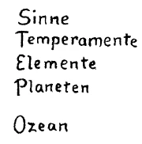
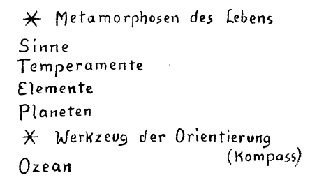

Die Vorstellung könnte vielleicht entstehen, daß die Vorgänge, von denen berichtet wird, wenn man von Initiation spricht, gewissermaßen heraufbeschworen würden durch diese Initiation. Diese Vorstellung wäre ganz besonders für unsere Zeit nicht richtig. Dasjenige, was als Vorgang der Initiation beschrieben werden kann insbesondere in unserer Zeit, das spielt sich im Inneren — oder im Verhältnis des Inneren zur Welt — bei den weitaus meisten Menschen der Gegenwart ab; nur wissen sie nichts davon, nur spielt es sich unbewußt ab. Und dasjenige, um was es sich dann handelt, wenn man von Initiation spricht, das ist, daß man aufmerksam wird darauf, daß man ein Bewußtsein erhält von dem, was sich unbewußt im Menschen abspielt. Also der Unterschied des Erkennenden von dem Nichterkennenden liegt eben gerade in der Erkenntnis von Vorgängen, die die Menschen, wenigstens die weitaus größte Zahl der Menschen, in der Gegenwart wie von selbst, wenn auch unbewußt, erleben. Daher spricht man, indem man von diesen Dingen spricht, im Grunde von etwas, was jeden Menschen mehr oder weniger, namentlich in der Gegenwart, wiederum angeht. ^5ca1c4

Nun habe ich gesagt: Gerade an der Schilderung dieser Vorgänge, das heißt an der Schilderung desjenigen, was man wahrnimmt, wenn man diese Vorgänge erkennend verfolgt durch die Initiationswissenschaft, erkennt man, welche Wandlungen im Lauf seiner Entwickelung der Mensch auch in historischen Zeiten durchgemacht hat. Und wir haben auf einiges in diesen Wandlungen insbesondere in bezug auf die Entwickelung des Christentums hingewiesen. Im äußeren täglichen Leben merkt man von diesen Entwickelungen gewissermaßen nur den äußeren Abglanz, diesen äußeren Abglanz, der eigentlich im Grunde so wenig verständlich ist für den Menschen, der wirklich verstehen will, der die Impulse eines Verstehens in sich entwickelt. ^5txdqq

Nehmen Sie einmal, um sich das zu vergegenwärtigen, diesen äußeren Abglanz in der Entwickelung des Christus-Begriffes im Laufe der letzten nahezu zwei Jahrtausende seit dem Mysterium von Golgatha. Sie werden, wenn Sie tiefer gehen im Verstehenwollen, eben manches unverständlich finden, manches finden, wo Sie mit Fragen gründlich einsetzen müssen, wenn Sie nicht oberflächlich bleiben oder irgendein Dogma blind annehmen wollen. Verfolgen Sie — was man eigentlich auch schon aus der äußeren Geschichte wissen kann -, wie beim Eintritt des Christus-Impulses in die Welt noch ein gewisser stark leuchtender Überrest der Gnosis da war, wie in den ersten Jahrhunderten versucht worden ist, den Christus-Impuls und seinen Durchgang durch das Mysterium von Golgatha mit Hilfe der durch die Gnosis erworbenen Begriffe zu verstehen. Da war viel gesagt in diesen Begriffen, die auf ganz andere Dinge gingen als die Begriffe, die man heute aus der äußeren Welt gewinnen kann, da war viel gesagt von dem, wie sich die Welt entwickelt hat, wie der Christus in dieser Weltentwickelung war, wie es zu seinem Herabsteigen zu der Menschheit gekommen ist, wie es zu seiner Vereinigung mit der menschlichen Wesenheit gekommen ist. Da war wiederum manches gesagt über den Rückgang des Christus zu der geistigen Welt, die dann die geistige Erdenwelt ist. Kurz, es waren leuchtende, weit leuchtende, umfassende Vorstellungen, die Erbgut waren der Urweisheit der Menschheit, in welche man gefaßt hat dasjenige, was man sagen wollte über das Mysterium von Golgatha. Die Kirche hat in den ersten Jahrhunderten gründlich dafür gesorgt, daß bis auf spärliche, nicht viel sagende Überreste die Vorstellungen der alten Gnosis verlorengegangen sind. Und ich habe Ihnen angedeutet, wie man sich heute geradezu bemüht, wo man kann, eine unbequem werdende Weltanschauung dadurch zu verketzern, daß man sagt, sie wolle eine alte Gnosis wieder aufwärmen, womit man glaubt, etwas furchtbar Schlimmes zu sagen. ^mbpnoj

Dann trat an die Stelle dieser Auffassung des Mysteriums von Golgatha eine andere, welche rechnete mit den primitiver und immer primitiver werdenden menschlichen Begriffen, welche damit rechnete, daß die Menschen nichts mehr in sich lebendig machen können von den umfassenden, weit leuchtenden gnostischen Vorstellungen. Und ich sagte Ihnen, es blieb der Rest, der den Anfang des JohannesEvangeliums bildet; der ist eigentlich nichts mehr als ein Hinweis darauf, daß der Christus etwas zu tun habe mit dem übersinnlich wahrnehmbaren Logos, dem Weltenworte, daß als solcher der Christus der Schöpfer alles desjenigen ist, was den Menschen umgibt, was der Mensch erlebt. Aber im übrigen blieb nichts anderes als die Evangelienerzählungen, die allerdings, wenn sie mit den Mitteln der Geisteswissenschaft durchdrungen werden, viel Gnostisches enthalten, aber sie wurden nicht gnostisch interpretiert. Sie wurden in den ersten Jahrhunderten überhaupt den Gläubigen vorenthalten, nur für die Priesterschaft reserviert. Aus ihnen aber wurde entnommen eine Art von Weltanschauung, welche das Mysterium von Golgatha in sich begriff, welche berechnet war auf die immer abstrakter und abstrakter werdenden, wenig nach dem Geistigen hinneigenden Vorstellungen der sogenannten gebildeten Welt. Man wollte, ich möchte sagen, immer mehr und mehr einfache Begriffe, zu deren Fassung man sich nicht sehr anzustrengen brauchte. Daher auch der eigentümliche Weg, den die Erklärung der Evangelien machte. Während man in den ersten Jahrhunderten noch durchaus das Bewußtsein hatte, daß die Evangelien aus geistigen Tiefen heraus zu erklären sind, versuchte man immer mehr, die Evangelien als bloße Erzählungen des Erdenlebens jenes Wesens aufzufassen, über das man mit Bezug auf seinen kosmischen Zusammenhang eben nicht mehr geltend machen wollte - wenigstens durch menschliches Wissen — als den Anfang des Johannes-Evangeliums und einige Abstraktionen wie die Trinitätsabstraktion und dergleichen. Diese hat man in den abstrakten Formen herausgeschält aus den alten gnostischen Vorstellungen, die man aber ihres gnostischen Impulses entkleidete und in Form von Dogmen den Gläubigen hingab. Immer primitiver und primitiver wurden aber die Evangelieninterpretationen. Sie sollten immer mehr werden eine bloße Erzählung eben über das Wesen, um dessen Wesenheit man sich nicht viel von höheren übersinnlichen Gesichtspunkten aus bekümmerte, über das Wesen, das da auf der Erde gelebt hat und das der Christus Jesus genannt wird. ^o20rke

Dann kam immer mehr die Notwendigkeit, die Evangelien auch der Öffentlichkeit zugänglich zu machen, und es kam damit der Protestantismus herauf. Er hielt zunächst noch fest an den Evangelien. Und solange ein Zusammenhang, ein Erkenntniszusammenhang bestand mit dem Johannes-Evangelium, so lange konnte man auch in einer gewissen Beziehung doch eine Art Band finden, das die einzelnen Seelen verbindet mit den kosmischen Höhen, in die man doch aufschauen muß, wenn man von dem wirklichen Christus reden will. ^iq7i6k

Aber es ging immer mehr verloren, man kann sagen, nicht bloß das Verständnis, sondern auch die Hinneigung zu dem JohannesEvangelium. Die Folge davon war, daß ein richtiger Zusammenhang mit dem Christus-Impuls, mit jener Wesenheit, welche in dem Leibe des Jesus lebte, dem neueren Protestantismus, dem denkenden Christentum überhaupt verlorengegangen ist. Der Christus-Begriff schwand immer mehr dahin, indem man zuerst die Interpretation beschränkt hat auf die irdischen Schicksale, menschlich erzählt, des Christus Jesus. Es schwand, weil man die Sache immer mehr und mehr ins materialistische Fahrwasser brachte, völlig die Möglichkeit, den Christus-Begriff noch zu haben: der menschliche Jesus blieb zurück. Und so wurden die Evangelien immer mehr als eine bloße Beschreibung des menschlichen Lebens Jesu genommen. Und an diese Beschreibung knüpfte sich in einer sehr abstrakten Form der Glaube an Unsterblichkeit, an die göttliche Wesenheit und dergleichen — ich habe über den Glaubensbegriff gestern gesprochen. Kein Wunder ist es, daß überhaupt nach und nach die Menschen wenig mehr zu sagen wußten, wenn die Vorstellung des Christus Jesus angeschlagen wurde. Man nahm gewissermaßen Christus auf der einen Seite, Jesus auf der andern Seite wie Synonyma, wie etwas, was dasselbe bezeichnet. Und was war die Folge, eine Folge, die gar nicht anders als eintreten konnte? Die Folge war, daß endlich diese Schilderung des bloßen irdischen Lebens eines Jesus, aus der das Bewußtsein des Zusammenhanges mit dem Christus geschwunden war, daß diese Beschreibung auch das Wesen des Jesus selbst verlor, und überhaupt allen Zusammenhang mit den Anfängen des Christentums verlor. Denn indem man nach und nach auf die bloßen materiellen Evangelien noch zurückging, auf nichts anderes als auf diese materiellen Evangelien, kam man zu der sogenannten Evangelienkritik selber. Und die konnte zu keinem andern Ergebnis führen, als daß die Tatsache des Mysteriums von Golgatha und was damit zusammenhängt, sich nicht historisch beweisen läßt, weil die Evangelien keine historischen Urkunden sind. Man verlor zuletzt den Zusammenhang mit dem Jesus selbst. So wie man in der neueren Wissenschaft über Beweise denkt, konnte da nicht bewiesen werden. Da man aber bei der modernen Wissenschaft bleiben wollte, auch wenn man Theologe war oder ist, verlor man nach und nach auch den Jesus-Begriff, da es äußere, historisch nachweisbare Urkunden nicht gibt. ^i34dc5

Harnack, der ein christlicher Theologe ist, sogar ein tonangebender der Gegenwart, hat gesagt: Alles dasjenige, was man außer den Evangelien, die keine historischen Urkunden sind, historisch über den Jesus aufschreiben kann, läßt sich auf ein Quartblatt aufschreiben. — Aber das, was man auf ein Quartblatt aufschreiben kann, die Josephus-Stelle und so weiter, hält vor der modernen Historik auch nicht stand, so daß eigentlich nichts übrigbleibt, um den Ausgangspunkt des Christentums zu beweisen. Das ist eigentlich für diejenigen, die mit dem modernen Denken die Entwickelung des Christentums verfolgt haben, etwas, was nicht anders kommen konnte; es ist der Weg, der endlich die Menschheit weggeführt hat von dem Christus Jesus, selbst von dem Jesus, und der erst recht die Notwendigkeit zeigt, eben einen andern Weg zu suchen, einen Weg des übersinnlichen Erkennens in der Art, wie das durch das moderne Geistesleben allein angestrebt werden kann. Denn allen übrigen Wegen, heute zu dem Christus Jesus zu kommen, kann eben einfach die moderne Evangelienkritik und die moderne historische Forschung entgegengehalten werden, die im Einklang ist mit dem wissenschaftlichen Bewußtsein unserer Zeit, und die nicht aufrechterhalten kann, irgendeine historische Tatsache an den Ausgangspunkt der Entwickelung des Christentums zu stellen. Haben wir doch in unserer Zeit die merkwürdige groteske Tatsache erlebt, daß christliche, allerdings protestantische Pastoren ihre Aufgabe darin gesehen haben, das Mysterium von Golgatha als historische Tatsache überhaupt zu leugnen und die Entstehung des Christentums zurückzuführen auf gewisse Vorstellungen, die sich gebildet haben aus der sozialen Gesamtmenschheitslage der Zeit, mit der unsere Zeitrechnung beginnt. So der Pfarrer Kalthoff in Bremen, der, trotzdem er christlicher Pfarrer war, so gepredigt hat, daß seiner Weltanschauung, seiner Lebensauffassung kein historischer Christus zugrunde lag. Er meinte, es hätte sich nur eine Vorstellung von einer solchen Gestalt in den Köpfen herausgebildet aus den Voraussetzungen heraus, die damals in der Zeit, wo unsere Zeitrechnung beginnt, eben in den Köpfen waren. Christliche Pastoren ohne den Glauben an einen wirklichen Christus Jesus sind das notwendige Ergebnis der modernen Evangelienkritik. Das konnte gar nicht anders kommen, denn es hängt zusammen mit all den Entwickelungsimpulsen, von denen ich in diesen Tagen, insbesondere auch gestern, gesprochen habe. ^9rqwwj

Das ist durchaus festzuhalten, daß der Weg zu dem Christus Jesus in unserer Zeit ein übersinnlicher werden muß, daß er nur gegangen werden kann von jener Wissenschaft, die selbst übersinnliche Methoden sucht, aber mit dem wissenschaftlichen Gewissen der modernen Naturanschauung rechnet. ^faw17x

Immer wird es gut sein für diese moderne Art, einen übersinnlichen Weg auch zu dem Christus zu finden, sich klarzumachen, wie bis in unsere Tage herein die Umwandlungen der Initiationswissenschaft, des Initiationswissens sich abgespielt, abgewickelt haben. Und aus diesem Grunde möchte ich heute noch einmal auf etwas hinweisen, auf das ich hier an diesem Ort schon vor einiger Zeit, aber von einem andern Gesichtspunkte aus, hingewiesen habe. ^1ciig8

Wir wissen, daß mit Bezug auf diese Dinge der große Umschwung verstanden werden muß, den die äußere Geschichte verschweigt, der sich in der neueren Entwickelung vollzogen hat gegen das 15. Jahrhundert hin und eben im 15. Jahrhundert hauptsächlich vollzogen hat. Aber er bereitete sich schon vorher vor. Wir wissen, dieser Umschwung ist für uns das Auftreten der fünften nachatlantischen Kulturperiode, welche die vierte, die griechisch-lateinische Kulturperiode, ablöst. ^xs4yrd

Nun ist es selbst schon für die äußere Wissenschaft eine Frage geworden, allerdings nur für einige verständigere Gelehrte, wie sich das erklären läßt, was man gewöhnlich nur nennt das Heraufkommen der Renaissancezeit — aber damit ist die Sache nur höchst äußerlich gekennzeichnet -, also dasjenige, was sich vom 12., 13., 14. bis ins 15. Jahrhundert hinein mit elementarer Gewalt über die gebildete Welt hin abspielt. Ein merkwürdiger Drang, eine merkwürdige Sehnsucht — äußere Gelehrte haben das schon ausgesprochen - lebte auch in den Menschen und läßt sich nicht durch äußere Gründe erklären. Es zeigt sich, daß etwas Elementares in den Menschen wallt und wogt und sie zu einer bestimmten Seelenverfassung bringt. ^t0czgo

Nun ist es interessant und bedeutsam, sich folgendes vor Augen zu führen: Im 12., 13., 14. Jahrhundert hat man es noch zu tun mit der ablaufenden griechisch-lateinischen Zeit. Dann kommt der Umschwung. An dieser Stelle muß sich also etwas Besonderes zeigen. Und das, was die äußere Wissenschaft erkundet hat, das ist es eben, was sich da zeigt. Weniger hat die äußere Wissenschaft den Umschwung in Betracht gezogen; aber sie hat sehr stark in Betracht gezogen, verschiedene Rätsel sich da vorgelegt, das allmähliche Abglimmen derjenigen Seelenverfassung, die für den vierten nachatlantischen Zeitraum charakteristisch war, das Abglimmen im 12., 13., 14. Jahrhundert. Während da die Renaissance heraufkommt, deren gewöhnliche Schilderung in den Äußerlichkeiten eben steckenbleibt, spielt sich in den Seelenverfassungen der europäischen Menschheit, wenn man genauer hinsieht, doch etwas außerordentlich Wichtiges ab. Es ist so, daß man verspürt: Es muß etwas verglimmen. Man erlebt noch gewisse Dinge in der Seele, die man nach einiger Zeit wieder anders erleben muß. Man muß sich gewissermaßen beeilen - wenn man mit der Entwickelung Schritt halten will -, diese Dinge noch zu erleben, denn die Menschheit wird sie später nach dem Umschwung nicht mehr erleben können. Es ist dasjenige, worauf ich im Anfange der heutigen Betrachtung hingewiesen habe. Was da im Unterbewußtsein vor sich geht, was, wenn es erkannt wird, der Initiationsvorgang ist, das ist etwas, was sich fortwährend, wie gesagt, bei der weitaus größten Mehrzahl der Menschen abspielt. Einige kommen dann durch die Beobachtung des « Erkenne dich selbst» darauf, diese Dinge wirklich in ihr Bewußtsein hereinzubringen. Es ist ein großer Unterschied zwischen diesem Vorgang und dem, was sich im vierten nachatlantischen Zeitraum als Mysterienerlebnis in den Menschenseelen abgespielt hat, ein größerer Unterschied als gegenüber dem, was sich zum Beispiel in der dritten nachatlantischen Kulturperiode abgespielt hat. Ich habe Ihnen vor einigen Tagen ungefähr charakterisiert, was sich in der dritten nachatlantischen Zeit abgespielt hat, indem der Mensch durch das Tor des Menschen ging, dann durch den zweiten Grad, dann durch das Tor des Todes, und weiter, bis er ein Christophorus wurde. Und so, wie ich Ihnen diese Dinge geschildert habe, so spielten sie sich im Unterbewußten ab und konnten dann durch die Initiation bei den weitaus meisten Menschen der dritten nachatlantischen Kulturperiode ins Bewußtsein heraufgetragen werden. Aber verändert schon war der ganze Vorgang bei den Menschen der vierten nachatlantischen Kulturperiode. Noch nicht so sehr verändert war er im ersten Drittel dieser vierten nachatlantischen Kulturperiode, das dem Mysterium von Golgatha voranging - 747 v.Chr. beginnt ja die vierte nachatlantische Kulturperiode, das Mysterium von Golgatha schließt ungefähr das erste Drittel ab. Und dann beginnt eine Zeit, wo das Mysterium von Golgatha schon da war, wo auch für dasjenige, was sich im Unterbewußtsein des Menschen abspielt und dann durch die Initiationswissenschaft bewußt werden kann, eine bedeutendere Veränderung eintrat. Annähernd bis zum Mysterium von Golgatha nur geringe Ausnahmefälle abgerechnet — war, man kann schon sagen, der notwendige Weg, um zur Initiation zu kommen, der, daß man erwählt wurde von irgendeinem den Mysterien angehörigen Priesterweisen, der aus gewissen Erkenntnissen heraus die Leute wählte, die er zur Initiation, zum Durchmachen der Grade bestimmen konnte. Es schwand diese Notwendigkeit nach und nach dahin, nachdem sich das Mysterium von Golgatha abgespielt hatte, obwohl die Initiation, an den alten Mysterien orientiert, auf die neuen Verhältnisse eingerichtet wurde. Solche Mysterien hat es immer gegeben, Mysterien, die dann in die neueren Geheimgesellschaften übergegangen sind und, nur mehr in abstrakten Symbolen, zumeist alte Einweihungszeremonien und Einweihungsvorgänge nachahmen, die nicht mehr an den Menschen herandringen, während die wirkliche Initiation immer weniger und weniger in solchen Geheimgesellschaften erlangt wird, weil die Menschen nicht vordringen zu dem Erleben desjenigen, was sich vor ihren Augen symbolisch abspielt. Es geschahen aber in immer weiterem und weiterem Maße - und charakteristisch gerade am Ausgang der vierten nachatlantischen Kulturperiode — Einweihungen, die, ich möchte sagen, von der geistigen Welt aus selbst geleitet wurden, wo also nicht der Initiationspriester den Bettreffenden auswählte, sondern wo die Auswahl von der geistigen Welt selbst gemacht wurde. Äußerlich nimmt es sich natürlich dann so aus, als ob es eine Selbsteinweihung wäre, weil der Führende eben ein Geist und nicht ein Mensch ist; ein Mensch ist ja auch ein Geist, aber Sie wissen, was ich meine. Insbesondere war so gegen das Ende des vierten nachatlantischen Kulturzeitraumes schon sehr stark das vorhanden, daß die Initiationen in solcher unmittelbaren geistigen Führung stattfanden. Und ich habe schon, wie gesagt, vor einiger Zeit darauf hingewiesen, wie aufzufassen ist als eine wirkliche Initiation die Einweihung, die auf solche Art erfahren hat der Lehrer und Meister des Dante, Brunetto Latini. ^lgu0o2

Äußerlich erzählt, nimmt sich dasjenige, was als ein höchst Wichtiges Brunetto Latini schildert, wie eine Art Novelle aus, eine Novelle, die allerdings legendarischen Charakter hat. Brunetto Latini will seine Einweihung schildern, seine Initiation. Er schildert sie etwa in der folgenden Weise, und Sie werden aus dieser Weise erkennen, wie die Erlebnisse der Initiation des Brunetto Latini dann gewirkt haben auf die ganze Komposition und Phantasiegestaltung des Danteschen großen Gedichtes, der «Divina Commedia». Brunetto Latini, er war Gesandter beim König von Kastilien für seine Vaterstadt Florenz, erzählt, wie er die Reise zurückmachen mußte von seinem Gesandtschaftsposten und wie er, als er schon nahe seiner Vaterstadt Florenz war, erfuhr, daß seine Partei, die welfische Partei, unterlegen war; daß also alles, was ihn verbunden hat mit Florenz, gewissermaßen unterminiert sei, daß er mit Bezug auf die äußeren Verhältnisse plötzlich keinen Boden unter den Füßen mehr fühlt. Man muß, indem von einem Menschen aus dem Dante-Zeitalter eine solche Sache geschildert wird, nicht an heutige Verhältnisse, nicht an heutige Auffassungen denken. In dieser Beziehung hat sich die Seelenverfassung ganz ungeheuerlich verändert. Nicht wahr, wenn heute jemand in der Schweiz erfährt, daß zum Beispiel die Stadt Köln, mit der er lange Zeit zusammengehangen hat, in eine ganz andere Weltstruktur hineingekommen ist, von einer ganz andern Seite her beherrscht wird, so fühlt er sich als heutiger Mensch nicht so, als ob ihm der Boden unter den Füßen entzogen wäre, wenigstens innerlich nicht. Aber von dieser Seelenverfassung muß man nicht die Vorstellungen nehmen für jene Zeit. Für einen solchen Menschen wie Brunetto Latini war das wie eine Art Weltuntergang. Er hing zusammen mit Bezug auf sein Eingeordnetsein in die Welt mit den Weltenverhältnissen seiner Vaterstadt. Das war weg, und das erfuhr er, als er sich dieser seiner Vaterstadt Florenz näherte: es war einfach die Welt nicht mehr da, in der er arbeitete. Jetzt erzählt er weiter, nachdem er aufmerksam gemacht hat auf diese Umstände, auf diese Tatsache, wie er geführt wurde in einen Wald, wie er durch geistige Führung aus dem Wald hingeleitet wird auf einen Berg, der umgeben ist von der ganzen Schöpfung, soweit sie ihm bekannt war. ^k1w160

Man erkennt sofort, was eigentlich Brunetto Latini andeuten will. Er ist durch das Leben so geführt worden, daß in einem gewissen Momente vor seine Seele ein so bestürzendes Ereignis trat, daß es das Geistig-Seelische freimachte von dem Leiblich-Physischen, daß er herauskam aus seinem physischen Leibe. Er erlebte Geistiges. Da haben Sie das Eingreifen eines geistigen Führers, der diesen Menschen seinem Karma nach in dem Augenblicke, wo er so frappiert, so geistig erschüttert ist, daß diese Erschütterung sein Geistig-Seelisches trennen kann von dem Leiblich-Physischen, in die geistige Welt einführt. Nun schildert Brunetto Latini, wie die Schöpfung sich um den Berg ausbreitet, wie ihm auf dem Berg eine riesige Frauengestalt erscheint, auf deren Worte hin, auf deren Wortangaben hin sich diese Schöpfung, die um den Berg ist, wandelt und ändert, andere Formen annimmt. Und so wie Brunetto Latini spricht, so erkennt man: er spricht so über diese Frauengestalt, wie in den alten Einweihungsmysterien gesprochen worden ist über Proserpina. Nur hat die Vorstellung über die Proserpina eben die Wandlung durchgemacht von der alten Griechenzeit bis zum Ausgang der griechisch-lateinischen Zeit. Nicht so wie die alten griechischen Dichter die Proserpina schildern, schildert Brunetto Latini sie; er schildert sie eben so, wie sie in den menschlichen Seelen lebte im Ausgang des griechisch-lateinischen Zeitalters. Und dennoch: Das, was der alte Ägypter anhörte, wenn ihm die Beschreibung der Isis, und was der Grieche anhörte, wenn ihm die Beschreibung der Proserpina nahetrat durch die Einweihung, man kann es vergleichen mit dem, was Brunetto Latini erzählt von dieser Frauengestalt, auf deren Geheiß und Worte hin sich die Gestalten der Schöpfung wandeln. Und man wird finden, daß starke Ähnlichkeiten da sind. Derjenige, der nur oberflächlich betrachtet, wird überhaupt sagen: Es ist eigentlich dasselbe, was Brunetto Latini über seine Frauengestalt sagt und was die Alten sagten über ihre Proserpina. Dasselbe ist es nicht, denn wenn man genauer hinsieht, so merkt man: Bei den alten Griechen, wenn sie von der Proserpina sprachen, oder bei den Ägyptern, wenn sie von der Isis sprachen, handelte es sich mehr um die Schilderung dessen, was in allem Ruhenden lebt, in allem, was bleibt, was durch alles Bleibende hindurchzieht. Bei Brunetto Latini handelt es sich darum, zu schildern, wie ein gewisser Kraftimpuls - der Isis-Impuls, der Proserpina-Impuls, als Impuls der «Natura», so heißt die Gestalt bei Brunetto Latini -, durch alles hindurchgeht, aber alles in Bewegung setzt, fortwährend wandelt. Das ist der große Unterschied. ^losj3h

Damit ist ihm aber der Anstoß gegeben - indem er schaut, wie sich alles wandelt, indem er diese auf das Geheiß der Göttin Natura sich wandelnde Schöpfung schaut -, nun in der neuen Art Selbsterkenntnis zu üben. Die übt er natürlich nicht so, wie es heute die mystischen Bequemlinge beschreiben, sondern er übt sie in konkreten Einzelheiten. Brunetto Latini beschreibt, wie er nun, nachdem er diese sich wandelnde Schöpfung geschaut hat, die Welt der menschlichen Sinne schaut. Er lernt den Menschen nach und nach von außen kennen. Es ist ein Unterschied, ob man die äußere Welt, welche die Sinne einfach im gewöhnlichen Bewußtsein wahrnehmen, schaut und beschreibt, oder ob man das beschreibt, was in den Sinnen, also schon innerlich im Menschen vor sich geht. Denn mit dem gewöhnlichen Bewußtsein kommt man in das Innere der Sinne nicht hinein: man würde die Außenwelt nicht sehen. Denn wenn man die Sinne im Inneren sieht, kann man die Außenwelt nicht beschreiben; man sieht dann nicht die Außenwelt. ^vu34t5

Abgestimmt auf die gegenwärtige Zeit - wir werden gleich nachher davon sprechen — habe ich versucht, dieses Schauen des Inneren des Menschen, wenn man in der Region der Sinneswelt ist, bei dem Ausmalen der großen Kuppel hier im Bau wirken zu lassen. Das wird Ihnen ungefähr eine Vorstellung davon geben, was gemeint ist mit diesem «Erkenne dich selbst», insofern man in der Region der Sinne ist. Sie werden zum Beispiel deutlich wahrnehmen, wenn Sie die große Kuppel betrachten, wie das Innere des Auges, das Mikrokosmische, das sich im Inneren des Auges offenbart, auf der einen Seite, auf der Westseite, festzuhalten versucht ist. Nicht das, was das Auge außen sieht, auch nicht das Physikalische des Auges, sondern was innerlich erlebt ist, wenn man mit dem seelischen Schauen im Auge drinnen ist, was man natürlich nur kann, wenn man im gewöhnlichen Sinne sich getrennt hat von dem Gebrauch der Augen als Werkzeuge für die äußere Sinneswahrnehmung, wenn man ebenso das Innere des Auges schaut, wie man sonst mit dem Auge das Äußere schaut. ^hpaihb

Nicht so, wie das heute dargestellt werden muß, sondern etwas anders - er macht nur kurz darauf aufmerksam - erlebte es Brunetto Latini. Dann dringt er weiter von außen nach innen ins Menschliche vor: er gelangt dann zu den vier Temperamenten. Da lernt man schon erkennen, wie der Mensch nun nicht in dem Inneren der Sinnesregion ist, sondern wie er ist, indem der melancholische, der cholerische, der phlegmatische, der sanguinische Impuls ineinander wirken, wie die Menschen sich dann äußerlich differenzieren, indem irgendeiner dieser vier Impulse die Oberhand gewinnt. Man kommt dann durch die Region der Sinne weiter in das menschliche Innere zu der Region der Temperamente. Der Unterschied in der Beobachtung der Sinnesregion und in der Beobachtung der Temperamente ist der, daß, wenn man die Sinnesregion betrachtet, sich die einzelnen Regionen der Sinne sehr stark voneinander unterscheiden. Bei den Temperamenten steigt man schon tiefer in das Menschliche hinein; da enthüllt sich schon mehr von der universellen Natur des Menschen. ^n4oidi

Wenigstens, ich möchte sagen, ein Glied von diesem Schauen, aber nur ein Glied davon, mit Orientierung nach bestimmten Richtungen hin, aber wiederum abgestellt auf das heutige Schauen, ist dann versucht worden, in der Ausmalung der kleinen Kuppel festzuhalten. ^76kqij

So muß der Mensch in dieser Weise vordringen. Sie sehen, Brunetto Latini schildert stückweise seine Initiation. Zugrunde liegt eine geistige Führung. Dann gelangt er schon in eine Region, in welcher der Mensch sich nicht mehr recht von der Außenwelt unterscheiden kann. Wenn der Mensch die Region seiner Sinne und die Region der Temperamente beobachtet, dann kann er sich noch sehr gut von der Außenwelt unterscheiden; aber dann kommt er in eine Region, in der er sich wenig noch unterscheiden kann, in der sozusagen sein Wesen mit der Außenwelt zusammenfließt: er kommt in die Region der vier Elemente. Da erlebt der Mensch sein Weben innerhalb von Erde, Wasser, Feuer und Luft, wie er mit diesen im Weltenall lebt. Er unterscheidet sich nicht mehr sehr stark mit Bezug auf seine Subjektivität von der äußeren Objektivität. Man erlebt höchstens noch stark den Unterschied in bezug auf das Irdische, aber mit Bezug auf das wässerige, das flüssige Element, da fühlt man sich schon schwimmend in einer Art von All. Es ist noch ein Unterschied zwischen dem Subjektiven und dem Objektiven, aber es ist eben, wenn man die 'Temperamente betrachtet, viel weniger stark als bei den festen Sinnesorganen, bei denen man weiß: sie leben nur im Menschen innerhalb der physischen Welt, sie leben nicht auch außerhalb. ^39d30d

Dann schildert er, wie er weiter kommt in die Region der Planeten, wie er durch die Planetenregion durchgeht, und wie er dann, nachdem er durch die Planetenregion durchgegangen ist, den Ozean durchirrt, im Ozean den Ort erreicht, den die verschiedensten Mystiker bezeichnen als den Ort der Säulen des Herkules. Dann geht er hinaus über die Säulen des Herkules und ist nun vorbereitet, nachdem ihn dieses «Erkenne dich selbst» bis zu den Säulen des Herkules getrieben hat, aufzunehmen ein Wissen, eine Erkenntnis über die übersinnliche Welt. Die Säulen des Herkules sind für die Mystiker — insbesondere für die Mystiker der Zeit, von der ich jetzt spreche — dasjenige Erlebnis, durch das man noch stärker, als es bei den vier Elementen oder bei den Planeten der Fall ist, ganz aus dem Menschen herauskommt und die äußere Geistwelt betritt, die dann erst in der dritten Initiationsstufe in ihren konkreten Wesenheiten sich zeigt. Aber man betritt sie wie einen sich ausbreitenden Ozean, wie eine allgemeine Geistigkeit, im ersten Grade, den Brunetto Latini hier schildert. Er schildert dann weiter, wie — was ja sein mußte, nachdem er soweit gekommen war — eine starke Versuchung an ihn herantritt. Diese Versuchung, die schildert er sehr sachgemäß. Er schildert, wie er in die Notwendigkeit versetzt wird, neue Vorstellungen sich zu bilden über Gut und Böse, weil eben verlorengeht dasjenige, was ihn über Gut und Böse, solange er in der Sinneswelt war, aufgeklärt hat. Er schildert dann, wie er diese neuen Vorstellungen über Gut und Böse wirklich erlangt, wie er dadurch, daß er alles das durchgemacht hat, gewissermaßen ein anderer Mensch geworden ist, ein Teilnehmer an der geistigen Welt. Man sieht an der Schilderung des Brunetto Latini ganz genau, wie jemand, der durch eine geistige Wesenheit selbst geführt wird, in dieser Zeit des ausgehenden griechisch-lateinischen Zeitalters von der sinnlichen in die übersinnliche Welt hineingeht. ^tyins4

 ^4kyvz6

Halten wir fest diese Schilderung, die auch äußerlich in der Menschheitsentwickelung jene ungeheuer fruchtbare Wirkung gehabt hat, daß sie Dante, den Schüler des Brunetto Latini, angeregt hat zu der «Göttlichen Komödie», der «Divina Commedia». Wenn wir das festhalten, daß es eine typische, eine repräsentative Einweihung war, die dieser Brunetto Latini schildert, daß er wirklich das schildert, was sich im Unterbewußtsein der Menschen gerade in dieser Zeit abspielt und was durch eine solche wirkliche Initiation erlangt, erkannt werden kann, so haben wir eben vor uns dasjenige, was im verglimmenden vierten nachatlantischen Zeitraum als Seelenverfassung da war. ^nmqo8b

Nun kann uns schon die Frage als bedeutsam interessieren: Wie änderte sich das in kurzen Zeiträumen? Nicht lange, ein paar Jahrhunderte sind vergangen seit dem, was ich geschildert habe. Wie ändert sich in kurzen Zeiträumen das, was da der Mensch im Unterbewußtsein durchmacht und was in der Initiation ins Bewußtsein herauftritt? Natürlich, je höhere Initiationsstufen der Mensch erlangt, desto mehr, ich möchte sagen, verschwindet für seinen Geistesblick dasjenige, was bei den ersten Stufen gar sehr in Betracht kommt. Aber bei den ersten Stufen muß man wirklich hinschauen auf dasjenige, was eigentlich das Bedeutsame ist. Denn diese ersten Stufen stellen gerade das dar, was sich in den weitaus meisten Menschenseelen eben tatsächlich abspielt, auch wenn sie es nicht wissen, auch wenn sie sich nicht dazu herbeilassen, durch Geisteswissenschaft oder gar durch Initiation ins Wissen heraufzuheben, was sich unbewußt in ihrem tieferen Menschen eigentlich immer abspielt. Da ist es sehr wichtig, daß man folgendes Beispiel ins Auge faßt. Ich habe gesagt: Brunetto Latini schildert, wie er hingeführt wird vor die Göttin Natura. Dann schreitet er durch gewisse Stufen: die Sinne, die Temperamente, die Elemente, die Planeten, den Ozean, wo er also schon draußen ist, wo er an der Grenze des Menschlichen, an den Säulen des Herkules, hinübergetreten ist in das außen sich Ausbreitende, wo nicht einmal mehr das in Betracht kommt, was schon bei den Elementen der Fall ist, daß er nicht unterscheiden kann, wo er gewissermaßen sich selber verloren hat und in dem Meere des Daseins schwimmt. ^z06wld

Diese Säulen des Herkules spielen dann in der Symbolik eine große Rolle als Jakim- und Boas-Säule, wobei nur zu bemerken ist, daß in den heutigen Geheimgesellschaften diese Säulen nicht mehr in der richtigen Weise aufgestellt werden können, auch nicht mehr aufgestellt werden sollen, weil sich diese richtige Aufstellung eben bei der wirklichen innerlich erlebten Initiation erst zeigt. Außerdem kann man sie im Raume nicht so aufstellen, wie sie in Wirklichkeit eben sich aufgestellt zeigen, wenn der Mensch seinen Leib verläßt. ^zhpb8q

Nun, damit hat man gewissermaßen, wenn ich mich des trockenen Ausdruckes bedienen darf, das Schema hingestellt, welches durchlebt wurde an der Wende des 12. zum 13. Jahrhundert, erlebt wurde auch von einem solchen Menschen, der die Initiation so durchmachte wie der Lehrer Dantes, Brunetto Latini. Nun kann man das vergleichen mit dem, was heute in den Untergründen der Menschenseelen vorgeht. Gar so sehr ist es ja nicht verschieden. Aber wenn heute der Mensch unmittelbar bei der ersten Stufe der Initiation unter der Führung dieser ja auch heute vorhandenen riesigen Frauengestalt, der Göttin Natura, hintreten wollte vor die ihm von ihr gezeigte Schöpfung, dann fängt ja in der Schöpfung der übersinnliche Weg für ihn erst an. ^vbhbl5

Wenn der Mensch heute gleich vor die Sinne hintreten würde oder in die Sinne hinein wollte, so würde er sich der Gefahr aussetzen, innerhalb der Sinnesregion ziemlich im Finstern zu sein. Er würde gewissermaßen ohne eine ordentliche Beleuchtung in der Sinnesregion sich aufhalten müssen und dann nichts Ordentliches auch unterscheiden können in dieser Sinnesregion. Heute ist nämlich notwendig, daß vor dieser Sinnesregion noch ein anderes Erlebnis durchgemacht wird. Das Durchmachen dieses andern Erlebnisses bereitet einen erst in der rechten Weise vor, in diese Sinnesregion eindringen zu können. Und dieses Erlebnis habe ich Ihnen gestern schon angeführt. Es ist einfach die Möglichkeit, Geistig-Ideelles als äußerliche Wirklichkeit in der Metamorphose der Gestaltung der Welt zu schauen. Also bevor man in die Sinnesregion eintreten will, soll man sich bemühen, die Metamorphose der Gestalten in der Außenwelt zu verfolgen. Goethe hat nur die Elemente gegeben, aber die Methode ist schon bei ihm zu finden. Ich habe gesagt: Was Goethe für die Pflanzen, für das tierische Skelett gefunden hat, das zeigt sich in der Metamorphose so weiter ausgebildet, daß uns unser Haupt auf das frühere Erdenleben, unser Extremitätenorganismus auf das spätere Erdenleben hinweist. Also dieses In-die-Möglichkeit-Versetztsein, die Welt nicht als fertige, ruhige Gestaltung hinzunehmen, sondern in der unmittelbar vorliegenden Gestalt den Hinweis auf eine andere Gestalt zu sehen, das Versetztsein in diese Möglichkeit, das ist schon eine notwendige Vorstufe der gegenwärtigen Initiation. ^4vy3pn

Sie finden auch Anhaltspunkte zu dieser Anschauung in der Weise, wie sie am richtigsten vom gegenwärtigen Menschen absolviert werden kann, gleich im Beginn meines Buches «Wie erlangt man Erkenntnisse der höheren Welten?» geschildert. Das wird schon erreicht, wenn in der richtigen Weise die Anweisungen dieses Buches befolgt werden, daß, wenn Sie einem Menschen gegenübertreten, Ihnen aus seinem Kopf etwas herausspringt wie die Vorstellung seiner früheren Inkarnation. Sie können gar nicht anders, als seinem Kopfe etwas von der Gestaltung in der früheren Inkarnation anempfinden. Wenn Sie ihm nachgehen, sehen, wie er die Füße aufstellt, mit den Armen schlenkert, oder wenn Sie vor ihm stehen und seine sonstigen Gesten mit Armen und Händen beobachten, dann bekommen Sie ein Gefühl, wie es in der nächsten Inkarnation mit seiner Gestaltung bestellt sein wird. Ich habe deshalb in öffentlichen Vorträgen öfter gesagt, indem ich dieses schon vor vielen Jahren auseinandergesetzt habe: Mit den wiederholten Erdenleben ist es eigentlich gar nicht einmal so schlimm, daß der Materialismus sich ganz und gar dagegen zu wehren brauchte. Wenn er nur ein weniges verstünde von der menschlichen Gestalt, so sind ja die wiederholten Erdenleben gar nicht etwas, wogegen der Materialismus sich zu sträuben braucht, denn sie sind handgreiflich. Und wenn Sie zum Beispiel nicht nach dem Buche, sondern nach der erlebten Einsicht Phrenologe, Schädeluntersucher sind, dann untersuchen Sie mit dem Schädel eigentlich die Gestaltung der früheren Inkarnation, das ist handgreiflich die frühere Inkarnation! Also man muß natürlich diese Metamorphosengestalt, Metamorphosenanschauung des Lebens bis in diese Region ausdehnen. Man muß gewissermaßen sich aneignen - ich habe vom sozialen Gesichtspunkte von dieser Aneignung gesprochen - ein so starkes Interesse für den Menschen, daß einem aus seinem Schädel fortwährend ins Gesicht springt etwas von der Empfindung seiner früheren Inkarnation, weil der Schädel der umgestaltete Mensch in einer früheren Inkarnation in gewisser Beziehung, namentlich in bezug auf das Physiognomische und die Gestaltung der Kopfformation ist. Und so erlangt man eine Anschauung der Welt, welche nicht stehenbleibt bei der einen Gestalt, wie Goethe nicht beim Blütenblatt und grünen Laubblatt stehenbleibt, sondern eines auf das andere bezieht. So erlangt man eine solche Anschauung, welche nicht stehenbleibt bei der einzelnen Gestalt, sondern von Gestalt zu Gestalt weitergeht, die Verwandlung der Gestaltungen ins Auge faßt. ^b8vgir

Ich habe versucht, eine Empfindung hervorzurufen von solchem Gestaltenwandel, indem ich diesen Gestaltenwandel selber habe festzuhalten gesucht in unserer Holzarchitektur, beim Übergang von einem Kapitäl in das nächste und in die weiteren Kapitäle, bei der Weitergestaltung der Architrave, wo alles aufgebaut ist nach diesem Prinzip der Metamorphose. So daß derjenige, der einmal unsere Säulenfolge und was dazugehört, in unserem hiesigen Goetheanum sehen wird, eine Vorstellung haben wird, wie man sich beweglich mit Bezug auf seine Seelenverfassung zur Außenwelt zu verhalten hat. Wenn man diese Vorstufe absolvieren will, die notwendig ist für den heutigen Menschen - und lange noch notwendig sein wird für den Menschen der Zukunft -, sich hineinfindet in das innere Verständnis, wie die zweite Säule aus der ersten mit Sockel und Kapitäl und Architrav hervorgeht, die dritte aus der zweiten Säule und so weiter, dann findet man in diesem wirklichen Verständnis einen Anhaltspunkt, um eben nach den heutigen Möglichkeiten erst in das Innere der Sinnesregion vorzudringen. So ist festgehalten unten in der Säulenregion etwas, was schon zusammenhängt mit dem gegenwärtigen Initiationsprinzip. Und weiter in der Kuppelregion finden Sie etwas anderes, was mit dem heutigen Initiationsprinzip zusammenhängt; da gehen die Dinge etwas verändert vor sich. ^v4h9fr

Also in dem Zeitalter des Brunetto Latini konnte den Menschen noch erspart werden dasjenige, was man hier nennen kann die Metamorphosen des Lebens (siehe Schema Seite 134), aus denen man dann in die Region der Sinne hineinkommt. Wollten wir die Sache schematisch uns vergegenwärtigen, so könnten wir sagen: In dem Zeitalter des Brunetto Latini konnte man noch — wenn wir das Auge als Repräsentanten nehmen — direkt ins Auge hineingehen und dieses als erste Region empfinden. Heute muß man zuerst dasjenige, was den Menschen umhüllt, betrachten. In diesem den Menschen Umhüllenden, was vor der Region der Sinne äußerlich liegt, da prägen sich die Metamorphosen des Lebens aus. Es liegt vor den Sinnen. Das muß man bewußt durchschreiten. ^bs3dsq

Nun geht man auch heute durch Sinnesregion, Temperamentenregion, Elementenregion, Planetenregion durch. Dann aber ist es notwendig, bevor man sich heute durch die Säulen des Herkules in den freien Ozean der Geistigkeit begibt, daß wiederum eine Einschiebung geschieht. Also hier (siehe Schema Seite 134) lagert sich etwas vor, hier geschieht eine Einschiebung. Diese Einschiebung brauchte in der Zeit des Brunetto Latini noch nicht erlebt zu werden. Sie wird sich nicht leicht schildern lassen, weil diese Dinge selbstverständlich intimen und subtilen Regionen des menschlichen Erlebens angehören. Aber man kann vielleicht doch in der folgenden Art eine Schilderung bieten, gerade indem man auf Brunetto Latini hinweist. Brunetto Latini erlebte, gewissermaßen als das erste Zeichen seiner Führung durch eine Geistwesenheit, das, was ihm die Mitteilung war, daß seine Vaterstadt für ihn unterhöhlt sei. Es ist das ein Ereignis, das in den Menschen Brunetto Latini hineinspielt, das aber doch seinem Tatsacheninhalte nach äußerlich war, von der Außenwelt hineinspielte. Dieses Ereignis, das ihn so stark erschütterte, daß er eben mit seinem Geistig-Seelischen aus dem Leiblichen herausging, schilderte er als etwas, was in sein Leben eintrat, was in seinem Leben vorging. Man kann sagen, dieses Ereignis wird von ihm nicht bewußt, sondern wie etwas geschildert, was an ihn herantritt wie ein Schicksalsereignis. ^7oj2z6

Ein solches Ereignis, oder eigentlich ein ähnliches — Sie werden darauf auch hingewiesen finden an einer Stelle meines Buches «Wie erlangt man Erkenntnisse der höheren Welten?» -, muß der heute zu Initiierende ganz bewußt durchmachen. Aber es muß bei ihm ein inneres Erlebnis sein, das er nicht wie Brunetto Latini im Zusammenhang mit der Außenwelt, sondern das er innerlich durchmacht: irgend etwas, was innerlich stark verwandelnd auf den Menschen wirkt. Solche Ereignisse gibt es schon im Leben der weitaus meisten Menschen, nur beachten es die Menschen kaum stark. Wer sein Leben überblickt, wird schon sehen können, daß Ereignisse — wenn ich so sagen darf, trotzdem das trivial ist — allerersten Ranges, und insbesondere eir Ereignis allerersten Ranges in das Leben hereinspielen. Man versuche nur einmal, nicht so sehr nach der äußerlichen Bedeutung, sondern nach dem inneren Wandel, den es im Menschen hervorbringt, auf ein solches Ereignis im Leben zurückzublicken. Man wird dann auf eines aufmerksam sein, auf das man eigentlich recht aufmerksam sein sollte: Man wird aufmerksam werden darauf, daß eben solche Ereignisse in dem Leben der Menschen nicht tief genug genommen werden. Sie können unendlich viel tiefer, das heißt erschütternder, bemerkbarer im Leben genommen werden, als es heute geschieht. Man kann schon durch eine gewisse allgemein-menschliche Innerlichkeit manches im Leben vertieft spüren, aber es wird doch gegenüber dem, was man namentlich von Ereignissen allerersten Ranges erleben kann, über eine gewisse Oberflächlichkeit nicht hinauskommen, wenn man nur bei dem gewöhnlichen Menschlichen bleibt. Denn solche Ereignisse, wie ich sie meine, die lassen sich eigentlich nicht im gewöhnlichen Bewußtsein ihrer vollen Geltung nach erkennen. Man muß erst die andern Stufen durchmachen. Dann zeigt sich, wenn man die Metamorphosen des Lebens, wenn man die Region der Sinne, der Temperamente, der Elemente, der Planeten durchgemacht hat und hierhergekommen ist (siehe Seite 134), daß man in einer neuen Gestalt gerade ein solches Erlebnis wiederum beobachten kann, und daß man jetzt, wenn man schon ein stark verwandelter Mensch geworden ist, zu seiner eigentlichen Tiefe vordringt, indem man sich als ein Angehöriger nicht nur der Erde, sondern der Himmelswelten, der Planetenregion erkannt hat. Dann erkennt man erst so recht die Bedeutung von solchen Erlebnissen allerersten Ranges. Dann wird einem erst klar, was für einen selbst und für die Welt solch ein Erlebnis bedeuten kann. Und man muß, wenn man da durchgeht, auf das wichtigste Ereignis seines Lebens schon kommen. ^3yslom

Wenn man, bevor man in den weiten Ozean der Geistigkeit hinaustritt, hier ankommt, so kann es nicht fehlen, sofern man nicht ein ganz starker Egoistling ist und noch irgend etwas anderes kennt in der Welt als sich selbst, daß, während man durch die früheren Stufen durchgeht, man aufmerksam wird auf dieses Ereignis. Bevor man in den Ozean der Geistigkeit hinaustritt, tritt einem schon in der völligen Stärke dieses Ereignis vor die Seele. Aber es schiebt sich eben da ein. Und dieses Ereignis, das bedeutet an dieser Stelle des inneren Erlebens außerordentlich viel. Es bedeutet, daß man jetzt eigentlich erst hinausfahren kann in den unermeßlichen Ozean der Geistigkeit; es bedeutet, daß man durch dieses Erlebnis einen gewissen Schwerpunkt erlangen kann. Ich möchte sagen: Würde man unter den heutigen Geistesverhältnissen einfach, nachdem man sich erkannt hat als Bürger der Planetenwelt, hinausschiffen wollen auf den Ozean der Geistigkeit, man würde in ein Wellenmeer hineinkommen, würde sich nirgends sicher fühlen, würde unter allen möglichen geistigen Erlebnissen hin und her geworfen werden, würde nicht einen innerlichen Schwerpunkt haben. Diesen innerlichen Schwerpunkt muß man schon dadurch finden, daß man ein solches Ereignis allerersten Ranges, das sieh in der Regel niemals in den bloßen Regionen des Egoismus abspielen wird, sondern das eine allgemein-menschliche Bedeutung haben wird, wirklich tief innerlich durchlebt, und man sich selbst in ihm tief innerlich durchlebt. Man kann heute sagen, indem man ganz genau den Tatsachenbestand ausspricht: An den Säulen des Herkules muß, bevor der Mensch diese Säulen des Herkules durchschifft, sein bedeutsamstes Erlebnis vor ihn hintreten, Vertieftestes ihm Erlebnis werden. Da fühlt der Mensch an dieser Stelle des Erlebens eine ganz besondere Vertiefung seines Wesens. Da kommt etwas über ihn, von dem man sagen kann, es trägt die objektive Welt in sein Inneres herein. Es kommt schon etwas an den Menschen heran, wenn er hier durchkommt - so geartet, wie ich das eben geschildert habe — durch die Säulen des Herkules, das man etwa in der folgenden Weise schildern kann: Wenn der Mensch natürlich auch immer wiederum bei dieser oder jener Gelegenheit in dasjenige zurückfällt, was sich im Lichte seines gewöhnlichen Bewußtseins abspielt, auch wenn er diese Erlebnisse hat, wenn er auch nicht bei jedem Schritt und Tritt seines Lebens gewissermaßen aufrechterhalten kann diese Seelenstimmung, die sich hier erzeugt, so wird es doch, wenn diese Seelenstimmung einmal durchgemacht worden ist, immerhin Momente geben, und immer sich wiederholende Momente geben, die mit dieser Seelenstimmung zusammenhängen. Denn es würde gar nicht gut sein, wenn der Mensch, nachdem er diese Seelenstimmung erlebt hat, ganz wieder aus ihr herauskommen würde. Was mit dieser Seelenstimmung gemeint ist, das läßt sich etwa in folgender Art charakterisieren. ^oiavbm

Man möchte bei diesen Dingen immer sagen — Hand aufs Herz, meine lieben Freunde -: Für das gewöhnliche Bewußtsein bleibt es doch bestehen, daß, auch wenn der Mensch noch so selbstlos ist, es für ihn das Allerwichtigste, wenigstens verhältnismäßig das Allerwichtigste ist, was innerhalb seiner Haut vorgeht. Wichtiger ist eben doch in der Regel für das gewöhnliche Bewußtsein dasjenige, was innerhalb der Haut vorgeht, als was außerhalb der Haut vorgeht. Aber das ist eben eine Seelenstimmung, die gerade hier beim Betreten des Ozeans erzeugt werden soll, damit sie wenigstens für wichtige Lebensmomente beibehalten werden kann: daß es für den Menschen äußere Dinge geben kann, die ihn subjektiv gar nichts angehen, die er aber gerade so stark miterlebt wie diejenigen Dinge, die ihn subjektiv angehen. Heute hat der Mensch, wenn er will, reichlich Gelegenheit, sich gut vorzubereiten für diese Seelenstimmung, die an dem geschilderten Punkte erlebt wird. Denn wenn er sich einläßt nicht auf subjektive Naturerkenntnis oder dergleichen, sondern auf wahrhaftige Naturerkenntnis, namentlich wenn der Mensch versucht, von solcher Naturerkenntnis auszugehen, so wird schon viel von dieser Stimmung erzeugt, aber sie muß erzogen werden an jener Stufe auf die Art, wie ich sie geschildert habe. Dann, wenn der Mensch diese Stimmung haben kann, wenn er so, wie es hier geschieht, das wichtigste Ereignis seines Lebens erfahren kann, so vertieft erfahren kann, dann bekommt er, wenigstens für viele Momente des Lebens, diese Stimmung der Objektivität, die ich geschildert habe, wo ihm Äußeres so wichtig sein kann wie Inneres, wo das wahr ist, daß ihm Äußeres so wichtig sein kann wie Inneres. Viele Menschen behaupten zwar das oder jenes; das ist aber dann nicht wahr, sie täuschen sich selber über die Sache. Aber damit hat der Mensch zugleich einen Schwerpunkt erlangt, eine Richtung würde ich vielleicht besser sagen, einen Kompaß, durch den er die Möglichkeit hat, nun wirklich auf den Ozean des geistigen Lebens hinauszutreiben. Hier (x, siehe Schema Seite 134) muß also dasjenige eintreten, was man nennen kann das Ausgerüsterwerden mit dem Werkzeug der Richtung. Man betritt also die Säulen des Herkules und wird ausgestattet mit dem Werkzeug der Orientierung, dem Kompaß. Dann erst, also nachdem er mehr erlebt hat, kann der moderne Mensch in die Geistigkeit hinausfahren. ^dwz3xu

 ^ud2mlo

Sie sehen an den Beispielen, die ich Ihnen jetzt geschildert habe, an der Initiation des Brunetto Latini und an der Umwandlung dieser Initiation bis in unsere Tage — und das wird noch lange gelten -, daß die Menschennatur sich auch für kürzere Zeiträume in einer Verwandlung schildern läßt, wenn man versucht, sie mit der Initiationswissenschaft zu beschreiben. Das alles, was man so schildert, trägt aber der Mensch wirklich in sich. Das charakterisiert den Wandel, den die menschliche Seelenstimmung im Lauf der Jahrhunderte durchmacht. Die Menschen werden gewöhnlich nur nicht aufmerksam auf diese Dinge, und sie drücken sich dann eben in dem äußeren Leben wie in ihrem Abglanz aus. In dem Zeitalter des Brunetto Latini, dessen Schüler eben Dante war, ist man so Christ, wie Dante Christ ist. Da geht noch durch die menschliche Seele hindurch die ganze Himmelswelt, indem man sich wirklich christlich fühlt. In unserem Zeitalter ist dieser Ruck zurück gemacht worden, wir rücken nur ein bißchen heraus, so daß wir eine Region vor den Sinnen durchmachen müssen, bevor wir wiederum heraustreten, damit wir jetzt die Region, die wir vorher von außen schon kennengelernt haben, nicht in derselben Weise betreten, sondern, bevor wir uns weiter aus dem Leibe lösen, sie verändert betreten, mit einem neuen Werkzeug orientiert werden. In dieser unserer Zeit hat sich das im Abglanz äußerlich so verwandelt, daß die am meisten denkenden Menschen, die sich gerade ausrüsten mit dem wissenschaftlichen Gewissen unserer Zeit, welches aber diesen Kompaß nicht hat - es hat ihn wahrhaftig nicht -, den Christus Jesus verloren haben. Er kann nicht mehr bewiesen werden mit den Mitteln, die man heute wissenschaftlich nennt, und die Religion selbst, die christliche Religion ist in den Materialismus verfallen. Sie strebt auch sehr stark nach dem Materialismus. Eines der stärksten Beispiele für das Hinstreben nach dem Materialismus im Katholizismus war die Aufstellung des Infallibilitätsdogmas, eine rein materialistische Maßnahme. Ich habe davon schon vor einiger Zeit gesprochen. ^fxyhpp

Nun könnten Sie sagen: Und trotz alledem, wenn man hineinschaut in das Innere des Menschen, zeigt sich dieser Ruck! - Der Mensch ist mit seinem Wesen etwas heraußen aus der Region der Sinne; dafür aber hat er eine Art Höhlung, wo unbewußt das wichtigste Ereignis seines ganzen Lebens auf seinen ganzen Organismus Einfluß nimmt, so daß er dann so erleben kann, wie ich es geschildert habe. Denn das hat schon Einfluß auf den Menschen, wenn er auch nichts davon weiß, aber es kann in der verschiedensten Weise sich ausleben, wenn es im Unbewußten verläuft. Der eine wird vielleicht sieben Jahre, nachdem er dieses wichtigste Ereignis durchgemacht hat, ein unleidiger Kerl, oder begeht allerlei Schändlichkeiten, ein anderer verliebt sich — er braucht es nicht gleich zu tun, das Verlieben selbst kann dieses wichtigste Ereignis darstellen -, ein Dritter kriegt Gallensteine und so weiter. In der verschiedensten Weise kann sich, wenn das Ereignis im Unbewußten bleibt, die Sache im menschlichen Dasein ausleben. So sieht das im Inneren des Menschen aus, was so in das Bewußtsein hereintritt, wie ich es geschildert habe. Im Äußeren des Menschen stellt es sich so dar, daß neben vielem anderen — ich habe ja nur die eine Sache erwähnt — man den Christus Jesus verliert. ^tzemz4

Da können Sie sagen: Was sich im Inneren des Menschen aus seinem Leibe heraus bis zu einem gewissen Grade als dieses Rückfluten darstellt, hat also äußerlich ein wenig erfreuliches Resultat! — Das ist aber auch nur scheinbar. Ein jegliches hat in der Welt zwei Seiten. Es gab in der Mitte ungefähr und auch im letzten Drittel des 19. Jahrhunderts den theoretischen Materialismus: der dicke Vogt in Genf, Moleschott oder Ludwig Büchner, sie alle waren theoretische Materialisten. Clifford hat den Ausspruch getan, daß das Gehirn Gedanken ausschwitze wie die Leber die Galle; also einen rein materiellen Vorgang sah Clifford in dem Bilden von Gedanken: wie die Galle aus der Leber kommt, so kommen Gedanken aus dem Gehirn. Dieses materialistische Zeitalter sah bloß auf die Materie hin; aber die Leute dachten doch über die Materie, und man kann zweierlei anschauen: Man kann in diesem Zeitalter lesen die Bücher von Clifford, von Ludwig Büchner, meinetwillen auch Auguste Comte, dem dicken Vogt in Genf und so weiter; dann kann man sich, wenn man noch Sympathie und Antipathie bei solcher Lektüre entwickelt, fürchterlich darüber ärgern, daß die Leute in dem Entwickeln der Gedanken nur ein Ausschwitzen aus dem Gehirn sehen. Man kann das bitter empfinden. Nun schön! Wenn man nicht ein Materialist ist, so kann man das. Aber man kann es auch anders anschauen. Man kann sagen: Was da der Clifford, Auguste Comte, der Vogt in Genf, was die da über die Welt gesagt haben, das sehe ich als Wischiwaschi an, dafür interessiere ich mich nicht. Aber ich will jetzt in das, was da im eigentlichen Denken von Vogt, von Clifford, von Auguste Comte vorgeht, einmal selbst hineinschauen. Diese Art zu denken, daß die Gedanken nur aus dem Gehirn ausgeschwitzt werden wie Galle aus der Leber, das ist zwar Wischiwaschi, danach will ich mich nicht richten, was Vogt sagt, sondern danach, wie er denkt. ^t8zhd7

Da stellt sich etwas Merkwürdiges heraus, wenn man das tun kann. Da stellt sich heraus, daß die Art zu denken, die die Leute entwickelt haben, der Keim einer sehr weitgehenden Spiritualität ist. Die Gedanken sind in ihrer eigenen Substanz — weil sie ja nur Spiegelbilder sind, wie ich vorgestern auseinandergesetzt habe — so furchtbar dünn, sie sind noch dünner als dünn, weil sie ja nur Bilder sind, sie sind so dünn, daß sie erfordern, daß der Mensch eine ungeheure Geistigkeit anwendet, um überhaupt noch zu denken, um zu verhindern, daß das hinuntersinkt und ergriffen wird von dem bloß Materiellen des Daseins. Es wird auch sehr häufig heute ergriffen von dem Materiellen des Daseins, sinkt hinunter, und ich bin sogar überzeugt, daß die meisten heute noch materialistisch denkenden Menschen, wenn sie nicht auf der Schule gedrillt worden wären, nicht an den Universitäten geochst hätten, um zum Examen zu kommen, wenn sie nicht den Materialismus eingesogen hätten, weil der Professor ihn als die richtige Weltanschauung verlangt, sich das Denken erspart hätten, das zur materialistischen Weltanschauung aufgewendet werden muß! Sie möchten am liebsten »icht denken! Die meisten gingen auch lieber auf den Paukboden, zur Korpskneipe, als daß sie ihr Denken in Aktivität brächten, oder sie reden nach. Wenn Sie einmal den Versuch machen würden, die wirklichen erkannten Weistümer, die sich bloß auf die Materie beziehen, bei all den Individuen zu studieren, die als Mitglieder monistischer Gesellschaften, wie sich heute etwas nobler die Materialisten nennen, so in der Welt herumlaufen, lange Reden halten, wenn Sie studieren würden, was die eigentlich gedacht haben: Sie würden furchtbar wenig finden! Die reden eigentlich meistens nach. Eigentlich haben den Materialismus nur ein paar Autoritäten begründet; die andern reden nur nach. Weil nämlich, um die modernen naturwissenschaftlichen Gedanken zu hegen, eigentlich eine starke Anstrengung des Geistes notwendig ist! Diese Anstrengung, die ist eine geistige Anstrengung, die ist wahrhaftig nicht so ausgeschwitzt vom Gehirn wie die Galle von der Leber. Das ist eine geistige Anstrengung, eine gute Vorbereitung, um gerade zum Spirituellen aufzusteigen. Ehrlich materialistisch gedacht zu haben, aber ehrlich selbst gedacht zu haben, das ist eine gute Vorbereitung für ein Eindringen in die spirituelle Welt. ^0xqll0

Ich habe das einmal in einem Berliner Vortrag dadurch ausgedrückt, daß ich sagte: Wer Haeckels Bücher nur liest, der erkennt natürlich in Haeckel - wenn er nicht manches, was zwischen den Zeilen doch bemerkbar ist, ins Auge faßt - leicht einen Materialisten von reinstem Wasser. Aber gerade wenn man mit Haeckel redet, dann merkt man, daß eigentlich sein ganzes Denken, insofern es materialistisch ist, nur durch die Vorurteile der Zeit diese Gestaltung annimmt, daß es aber schon hintendiert — schon wie er jetzt ist, dieser Haeckel — zum Spirituellen. Daher sagte ich in diesem Berliner Vortrag: Man erkennt Haeckel dann richtig, wenn man sich klar ist, daß er theoretisch gleichsam diese materialistische Seele hat, daß er aber eine andere Seele hat, die nach dem Spirituellen hintendiert. — Für uns kann ich sagen: die ganz gewiß in der nächsten Inkarnation mit einer starken Spiritualität wiedergeboren wird. Der Stenograph, der dazumal offiziell von uns angestellt war, ein richtiger Berufsstenograph, hat geschrieben, daß ich gesagt hätte, Haeckel hätte trotz seines Materialismus eine spiritistische Seele. ^f089fr

Also darauf wollte ich hinweisen, daß man, was da als materialistische Denkweise auftritt, gewiß bekämpfen kann, nicht scharf genug bekämpfen kann, denn im Bekämpfen liegt gerade das Weiterentwickeln zum Spirituellen, aber es ist innerlich darin die Kraft zur Spiritualität. Und in den Seelen, die heute bloß unter dem Einfluß der äußeren Theologie zu einem ganz äußerlichen oder gar schon verlogenen Christus-Begriff gekommen sind, entwickeln sich auf spirituellen Wegen Fähigkeiten, die sie dazu bringen, in der Zukunft diesen Christus-Begriff zu suchen. Das soll nicht etwa eine Aufforderung zur Bequemlichkeit sein, man soll nicht etwa sagen: Na, dann wird die Geistesanschauung schon kommen, denn der dicke Vogt, Clifford und so weiter haben sie ja gut vorbereitet! - Da muß schon mitwirken, daß derjenige, der weiß, welche Finsternis der Materialismus bedeutet, gegen den Materialismus kämpfe! Denn es ist die Kraft, die in diesen Kämpfen wirkt, notwendig, damit die Veranlagung zur Spiritualität in den theoretischen Materialisten ausgebildet werde. ^jx6new

Aber Sie sehen, wie die Dinge kompliziert sind, wie sie verschiedene Seiten haben. Dann, wenn man versucht, durch die Initiationswissenschaft in die Tiefen der Welt einzudringen, dann erlangt man etst vertiefte Menschenerkenntnis, dringt durch zu dem, was in den Tiefen der Menschennatur wirkt. ^kbr027