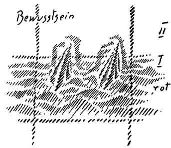

Ein Lichtstrahl, der wirklich erleuchtend wirken kann, fällt auf solche Zeitrückblicke, wie wir gestern einen angestellt haben, wenn man zunächst gewissermaßen die negative Seite der Sache ins Auge faßt, wenn man sich nämlich fragt, wie wir das im Grunde schon öfter getan haben: Welches sind im tieferen Sinne die Impulse, welche die Menschheit in der Gegenwart in solche katastrophalen Ereignisse, namentlich aber, was noch wichtiger ist, in eine gewisse katastrophale Verfassung hineingebracht haben, wie sie ganz deutlich in den Verhältnissen zutage tritt? - Nun wird man selbstverständlich nicht gleich immer den Blick wenden können auf die tieferen Grundlagen von Zeitereignissen. Man wird den Blick zunächst wenden auf die, ich möchte sagen, mehr oberflächliche Schichte des Geschehens. Man wird dann dies oder jenes schildern können, und man wird mit solchen Schilderungen keineswegs unrecht haben. Das ist etwas, was immer berücksichtigt werden muß, wenn im Ernste von geisteswissenschaftlichen Betrachtungen ausgegangen werden soll. Solche geisteswissenschaftlichen Betrachtungen wollen nicht sagen, daß anderes immer unrichtig sei. Aber sie wollen heute in der Gegenwart namentlich darauf hinweisen, daß es nicht genügt, bei einer gewissen oberflächlichen Schichte der Weltbetrachtung stehenzubleiben, sondern daß es notwendig ist, tiefer in die Verhältnisse einzudringen. Nichts gerade Neues soll nach dieser Richtung hin heute gesagt werden, aber an manches soll erinnert werden, was, wenn man es sich als eine gewisse Neujahrsperspektive vor die Seele stellt, geeignet ist, in richtiger Art in diese Perspektive hineinzugehen, die vor uns in vieler Beziehung in erschütternder Weise liegt. ^0zbll6

Sie erinnern sich, wie ich in diesen Tagen ausgeführt habe, daß zum Allerwichtigsten, zum Allerwesentlichsten in der Erkenntnis der gegenwärtigen Zeit gehört, daß die Menschheit gewissermaßen vor einer neuen Offenbarung steht. Es ist diejenige Offenbarung, die geschehen soll, und in gewisser Beziehung auch schon geschieht, durch die Geister der Persönlichkeit, welche, wenn man sich so ausdrücken will, zu der Würde von Schöpfern aufsteigen, während wir als Schöpfer im Weltengange der Menschheit bisher nur haben ansprechen können diejenigen Geister, welche in der Bibel die Elohim genannt werden, die wir die Geister der Form nennen. Etwas Schöpferisches also wird auftauchen innerhalb desjenigen, was der Mensch beim Verfolgen der Außenwelt bemerken kann. ^ne9qcl

Nun liegt es in gewissen Bedingungen der Menschennatur, daß der Mensch sich zunächst sträubt gegen die Anerkennung eines solchen hereinbrechenden Geisteselementes. Der Mensch will namentlich in der Gegenwart nicht eingehen auf ein solches Hereinbrechen eines geistigen Elementes. Nun müssen wir zweierlei unterscheiden, gerade wenn wir diese gegenwärtige neue Offenbarung ins Auge fassen. Um mich deutlicher zu machen, möchte ich noch das Folgende sagen. ^836row

Der berühmte Kardinal Newman sagte, als er eingekleidet wurde in Rom, ein merkwürdiges Wort. Er sagte bei seiner Einkleidung, daß er kein anderes Heil für die Kirche sähe als eine neue Offenbarung. Das ist nun schon Jahrzehnte her, und Verschiedenes ist in der Welt da oder dort über diese merkwürdige Anschauung des Kardinals Newman gesprochen worden. Wenn man aber hinblickt auf das, was von kirchlicher Seite und von solcher Seite, die dem kirchlichen Bekenntnis verwandt ist, darüber gesagt worden ist, so ist es überall ein Hinweis darauf gewesen, daß man nicht von einer neuen Offenbarung sprechen soll, daß vielmehr an der alten Offenbarung festzuhalten sei. Und vor allen Dingen, wenn irgend etwas notwendig sei, so sei es nur das, daß man die alte Offenbarung besser verstünde, als man sie bisher verstanden hat. ^asqvdq

In diesen Einwänden, die von allen möglichen Seiten gegen den Ausspruch des Kardinals gemacht worden sind, der also eine Intuition hatte von dem Hereinbrechen einer neuen Offenbarung, sieht man, wie sich die Menschheit sträubt gegen eine solche Offenbarung. Nun ist zweierlei, wie gesagt, zu unterscheiden. Dadurch, daß sich die Menschen sträuben, eine solche Offenbarung entgegenzunehmen, wird selbstverständlich die Tatsache nicht aus der Welt geschafft, daß diese Offenbarung kommt. Diese Offenbarung ergießt sich wie eine neue Geisteswelle durch das Geschehen, in das der Mensch eingespannt ist. Der Mensch kann diese Welle nicht etwa von der Erde zurückstoßen. Sie ergießt sich über die Erde. Das ist die eine Tatsache. ^0456x7

Also, ich möchte sagen, seit einiger Zeit, insbesondere seit dem Beginne des 20. Jahrhunderts - oder eigentlich deutlicher gesagt seit dem Jahre 1899 etwa - stehen wir, indem wir als Menschen in der Welt herumgehen, innerhalb einer neuen Welle des geistigen Lebens, die sich in das andere Leben der Menschheit hineinergießt. Und ein Geistesforscher ist heute nur ein Mensch, der dies zugibt, das heißt, der bemerkt, daß so etwas hereingebrochen ist in das Leben der Menschheit. Das ist die eine Tatsache. ^lva64v

Die andere Tatsache ist eben, daß die Menschen - gerade nach ihrer gegenwärtigen Verfassung - ein gewisses Aufraffen brauchen, eine gewisse Aktivität brauchen, um zu bemerken, daß eine solche Welle sich in das Leben hereinergießt. Dadurch konnte das Bedeutsame eintreten, daß auf der einen Seite diese Welle sich wirklich hereinergossen hat in das Leben und da ist, auf der andern Seite aber die Menschen sie nicht bemerken wollen. Sie sträuben sich dagegen. Diese Tatsache, die dürfen Sie nicht abstrakt betrachten. Denn die Zentren gewissermaßen, die Mittelpunkte, in welchen sich diese Welle so ähnlich entlädt wie die elektrische Stromwelle im Kohärer bei der drahtlosen Telegraphie, die Kohärer auf diesem Gebiete also sind doch die Menschenseelen. Und geben Sie sich darüber keiner Täuschung hin: die Sache ist so, daß, indem die Menschen auf der Erde leben, sie einfach dadurch, daß sie Menschen des 20. Jahrhunderts sind, Aufnahmeapparate für das sind, was sich in der geschilderten Weise in das Leben hereinergießt. Der Mensch kann sich sträuben, mit seinem Bewußtsein das zuzugeben, aber er kann es nicht verhindern, daß seine Seele doch den Wellenschlag aufnimmt, daß der Wellenschlag in ihm ist. ^h4qvci

Nun muß man gerade diese Tatsache etwas genauer betrachten. Man muß nach den verschiedenen Voraussetzungen fragen, die wir jetzt machen können, nachdem wir diese Betrachtungen durch Wochen hindurch angestellt haben. Man muß fragen: Welches ist denn in unserem Zeitalter die bedeutungsvollste Fähigkeit der menschlichen Seele? Das ist die Intellektualität. Und wenn immer wieder und mit vollem Recht betont wird, der Mensch soll auch die andern Seelenkräfte zur Ausbildung bringen, nicht bloß die Intellektualität, so geschieht solche Betonung gerade aus dem Grunde heute so intensiv, weil der Mensch fühlt, die Intellektualität ist die eigentliche Fähigkeit des Zeitalters, und et soll, weil die Intellektualität über ihn hereinbrechen will, nur nicht die andern Fähigkeiten verkümmern lassen. Gerade weil die Intellektualität im Zeitalter der Bewußtseinsseele eine so wichtige Rolle spielt, gerade deshalb gibt es heute so oftmals die intensive Betonung, man soll das Gefühl, die Empfindung nicht verkümmern lassen, was eben gegenüber der hervorstechenden Tatsache, daß die Intellektualität eine so große Rolle spielt, von ganz besonderer Wichtigkeit ist. ^xv7401

Nun muß man sich über diese Intellektualität einmal eine klare Vorstellung machen. Ich habe von den verschiedensten Gesichtspunkten aus über diese Intellektualität gesprochen. Sie erinnern sich vielleicht, daß ich sogar in Öffentlichen Vorträgen nicht versäumt habe, das Notwendige über das Intellektuelle in der gegenwärtigen Zeit mitzuteilen. Ich habe zum Beispiel davon gesprochen, daß wir in unserer naturwissenschaftlichen Weltauffassung, die eigentlich doch alle Kreise ergriffen hat — jeder Mensch denkt heute naturwissenschaftlich, wenn er auch gar nichts von Naturwissenschaft weiß -, etwas haben, was sich insbesondere der Intellektualität bedient. Auch wenn man experimentiert, auch wenn man beobachtet, man verarbeitet die Experimente oder die Ergebnisse der Experimente, man verarbeitet die Beobachtungen mit der Intellektualität. Gerade in der naturwissenschaftlichen Weltanschauung, an die sich die Menschheit in der Gegenwart so gewöhnt hat, von deren Gesichtspunkten sie auch das soziale Leben zum Beispiel betrachten möchte, gerade in der naturwissenschaftlichen Weltanschauung waltet und webt ganz und gar diese Intellektualität. Aber wie webt sie? Ich habe in öffentlichen Vorträgen oftmals die Frage erörtert: Was für ein Bild der Welt gewinnt man eigentlich durch naturwissenschaftliche Weltanschauung ?Zuletzt sieht man doch ein, daß das, was man sich vorstellen kann von der Welt durch die gebräuchlichen naturwissenschaftlichen Denkgewohnheiten, nicht die Wirklichkeit ist, sondern ein Gespenst oder eine Summe von Gespenstern, selbst unsere Atome und alles das, was man sich vorstellt in der Welt der Atome. Aber auch solche Leute, die mehr Positivisten sind, die nicht viel auf die Atomhypothese geben, wie Poincaré oder Avenarius oder Mach, stellen sich die Natur so vor, daß sie in ihren Vorstellungen eigentlich nicht etwas Wirkliches haben, wo die Natur hineinspielt, sondern ein Gespenst der Natur. Es ist dies zusammenhängend mit dem, was ich vor einigen Tagen hier gesagt habe: daß eigentlich die Begriffswelt, in der wir heute im Zeitalter der Bewußtseinsseele leben, nicht Wirklichkeiten enthält, sondern nur Bilder, Spiegelbilder. Und es ist schon außerordentlich viel gewonnen, wenn man nicht an dem Aberglauben hängt, daß, wenn man ein naturwissenschaftliches Buch liest oder eine naturwissenschaftliche Auseinandersetzung hört, man dann von einer Wirklichkeit erzählen hört. Wird man sich dessen bewußt, was einem da mitgeteilt ist, so ist das eigentlich nur ein Bild, eine Art Gespenst der Wirklichkeit. Was aber da lebt in solchen Vorstellungen, die eigentlich nur gespenstische Bilder sind, die sich nicht so wie die Goetheschen Metamorphosengedanken mit der Wirklichkeit verbinden, das, was da lebt, hat man doch heute in einem gewissen Sinn außerordentlich gern, außerordentlich lieb. Und man möchte die Wirklichkeit einfangen in dieses Gespenstgespinst der Vorstellungen. Alle diejenigen Leute, die heute von monistischer Weltanschauung und dergleichen reden, oder die sonstwie die positivistische Weltanschauung begründen, die glauben eigentlich mit einem merkwürdigen Aberglauben an die Tragweite dieser Gespenstgespinste. Sie glauben, sie könnten aus dem, was ihnen die heutige naturwissenschaftliche Anschauung gibt, ein Bild der Wirklichkeit herausholen, was sie eben nicht können. Also man liebt diese gespenstartige Natur des Weltbildes, das man sich schon einmal nach der heutigen Entwickelungsstufe des Menschen machen kann. Und das, daß man auf der einen Seite seine Vorstellungswelt liebt, daß aber diese Vorstellungswelt auf der andern Seite doch nur Bilder gibt, das beherrscht heute die Seelen. Und die Seelen, die in dieser Weise beherrscht sind von ihrem Vorstellungsstreben, die sind es, die sich sträuben gegen das Hereinbrechen einer Geisteswelle, die ja Wirklichkeit ist, und die zunächst nicht aufgefangen werden kann durch das bloße Gespenstgespinst der Vorstellungen, die man an der Hand der Naturwissenschaft entwickelt. Man kommt mit diesen Dingen nur zurecht, wenn man sich ganz klar ist, daß diese naturwissenschaftliche Vorstellungsart die Menschen dazu präpariert, das positive Geistige abzuweisen, das hereinspielt in die Welt. Und deshalb sträuben sie sich, furchtsam sträuben sie sich gegen die Welle, von der ich gesagt habe, daß sie hereinkommt und sich ausbreitet und daß sie doch in den Seelen der Menschen lebt. ^3ci349

So ist im heutigen Menschen, gerade in den Menschen, die tonangebend sind, etwas da, was diese Welle nicht ergreifen mag; da ist etwas von dem Einschlagen dieser Welle, aber es ist zu gleicher Zeit in ihrem Bewußtsein etwas, was diese Welle nicht ergreifen mag. Man kann das Schema des heutigen Menschen oftmals so hinstellen, daß man sagt: Wenn dieses der Mensch ist, so ist hier eine Schicht der Seele, und hier eine zweite Schicht der Seele. Hier oben in dieser Schicht (siehe Zeichnung, II) ist das Bewußtsein, das heutige Bewußtsein, das insbesondere naturwissenschaftlich geschult ist. Aber die Welle, von der ich spreche, die geht durch die andere Schicht durch (rot). Nun würde es sich darum handeln, daß das Bewußtsein sich nicht bloß mit dem beschäftigt, was Gespenstgespinst wird, sondern daß das Bewußtsein in sich hereinfließen läßt, was da unten ist, daß es in sich aufnimmt, was da unten ist. ^qynzh5

 ^il34j3

Wenn Sie dies bedenken, so werden Sie etwas finden, was gerade heute für das Verstehen der Seelenkonstitution von außerordentlicher Wichtigkeit ist. Denn wir hätten diese furchtbare Kriegskatastrophe oder vielmehr den kriegerischen Ausdruck dieser Katastrophe — die Katastrophe, die in der Menschheit waltet, ist ja verschieden gestaltet, sie hat verschiedene Seiten, der Krieg, von dem man gesprochen hat, ist nur eine Seite -, diese Kriegsseite der Katastrophe, das, was da hauptsächlich in den letzten viereinhalb Jahren gewütet hat, das hätten wir gar nicht bekommen können, wenn nicht diese seelische Tatsache vorläge. Man muß diese seelische Tatsache ganz genau ins Auge fassen, wenn man sie verstehen will. Man muß sich nämlich fragen: Wie ist es denn eigentlich mit dieser Welle, die da so geht? ^jvtz02

Das ist eine Welle, die zunächst gleichsam unter der Oberfläche dessen ist, worauf man gewöhnlich aufmerksam ist. Man kann fragen: Was lebt denn eigentlich in dieser Welle, in der sich gerade die Geister der Persönlichkeit bewegen? - Gewiß, es leben darin die Geister der Persönlichkeit, die sich neu als Schöpfer offenbaren wollen, aber es lebt eben manches andere noch in dieser Welle. Denn sehen Sie, Sie können sich einfach ein Meer vorstellen, da fahren Schiffe, in diesen Schiffen können die verschiedensten Persönlichkeiten sein, die sich auf den Wellen da bewegen; sie seien uns Bilder der Geister der Persönlichkeiten. Aber die Wellen selber sind ja da, die stellen auch etwas dar. Im Meer haben wir gewissermaßen bloß das blinde Wasserelement, das aber schon auch seine Mucken haben kann. Aber in dieser geistigen Welle, von der ich da spreche, stellt sich etwas anderes dar. Das, was da hereinflutet in die Seelen, was wirklich in den Seelen einschlägt, das ist Kampf, das ist ein Weltenkampf, der sich gewissermaßen hinter der Szene der gegenwärtigen Welt abspielt. In diesen Weltenkampf ist der Mensch eingesponnen. Die Wahrnehmung der Geister der Persönlichkeit, von denen ich spreche, ist für den Geistesforscher keineswegs eine, ich möchte sagen, ganz bequeme, wohlige Sache. Sie ist durchaus nicht so zu schildern, daß man etwa dem Menschen sagen könnte: Ich mache dich zum Geistesanschauer, weil dir das eine ungeheure Seligkeit bietet, weil du da recht wohlig schwimmen kannst in der geistigen Anschauung. - Das möchten die meisten Menschen. Die möchten, daß man ihnen so etwas wie einen Labetrank gibt, wenn sie heute in die geistige Welt hineinkommen sollen. Sie scheuen davor zurück, nicht einen Labetrank zu empfangen, nicht etwas, wovon sie sagen können: Es ist mir dabei so behaglich, so bequem zumute. — Das ist es gerade nicht, um was es sich heute handeln kann, sondern es handelt sich heute darum, daß man tatsächlich durch sich hindurchgehen fühlt einen Kampf, der sich hinter den Kulissen der Welt abspielt, einen Kampf, der sich abspielen muß, weil er notwendig hineingestellt ist in die Weltentwickelung, wie sie eben zu sein hat. ^uhu27k

Man kann verschiedenes angeben, was diese Weltentwickelung, wie sie zu sein hat, charakterisiert. Ich will nur eines erwähnen. In den älteren, vorchristlichen Zeiten — gegen die Zeit, wo das Mysterium von Golgatha stattfand, hat das dann abgenommen -, da war es für die Seelen, die aufmerksam waren, über die ganze heidnische Welt hin wenigstens ziemlich selbstverständlich, daß sie Eindrücke hatten davon, daß es wiederholte Erdenleben gibt. Dieses alte Leben war überhaupt anders, als man geneigt ist, es sich heute vorzustellen. Nicht wahr, heute unterscheidet man Menschen, die eine Schulbildung haben und Menschen, die keine haben. In älteren Zeiten hat man unterschieden Menschen, die aufmerksam sein konnten auf die wiederholten Erdenleben, und solche, die nicht aufmerksam waren darauf. Das aber ging zurück, und ich habe öfter davon gesprochen, daß es gerade die Aufgabe des Christentums war, für eine Weile zurücktreten zu lassen diese Entwickelungswelle, die in dem Menschen das Bewußtsein von den wiederholten Erdenleben erweckt. Wenn man so etwas sagt, so setzt man sich gewöhnlich allerlei Mißverständnissen aus. Widersprüche werden einem vorgeworfen, die man ja, wenn man ausführlich redet, selber beheben möchte und kann. Ich habe neulich das wieder irgendwo gesagt; da hat mir gleich jemand geschrieben, ob ich denn nicht wisse, daß in der Bibel selber über die Reinkarnation gesprochen ist. Natürlich findet man in meinen Schriften die Andeutungen, wo in der Bibel darüber gesprochen ist, das ist selbstverständlich. Aber es ist nicht die Frage die, ob durch eine sehr weitgehende Interpretation in der Bibel von der Reinkarnation die Rede sein kann. Die ganze Verfassung in der Bibel ist doch so, daß die Reinkarnation in der Bibel nicht etwas darin Ausgesprochenes ist, nicht etwas, man kann sagen, an der Hand Hergetragenes. Das ist schon so, daß es in der Entwickelungsnotwendigkeit der Menschheit lag, daß eine Weile das Bewußtsein von den wiederholten Erdenleben zurückging, damit der Mensch sich daran gewöhne, ernst und intensiv das eine Erdenleben zu nehmen. Aber jetzt sind wir gewissermaßen bei einer Rückkehr dieser Sache; jetzt sind wir daran, daß wir nicht vorwärtskommen, wenn wir nicht den Blick wenden auf die wiederholten Erdenleben. Jetzt müssen wiederum diejenigen geistigen Elemente, die dem Menschen das Bewußtsein von den wiederholten Erdenleben zutragen wollen, hinter den Kulissen des Daseins einen harten Kampf kämpfen gegen diejenigen, die die alten Elemente und Impulse nur allein in das Bewußtsein des Menschen hineinlassen wollen. Dies ist ein bedeutsamer Kampf, an dem man teilnehmen muß, wenn man hineinschauen will in das, was hinter den Kulissen der Menschheitsentwickelung, der Weltentwickelung überhaupt vorgeht! ^r6218a

Man soll sich nur nicht vorstellen, daß hinter den Kulissen des sinnlichen Daseins etwas ist, worinnen man sich so gemütlich schlafen legen kann. So sind in der Regel die Paradiesesvorstellungen der materialistischen Menschen. Die stellen sich am liebsten vor: Wenn sich das Tor des 'Todes schließt, so kommen sie dann in die Möglichkeit, recht viel zu schlafen. Weil dieses Schlafen auch sehr behaglich ist, stellen es sich die Menschen am liebsten so vor. Nun, Sie wissen, daß die Sache nicht so ist. Aber es ist auch hinter den Kulissen des Daseins nicht so, daß man unbedingt nur das Begehren danach haben könnte, um alle diejenigen Triebe zu befriedigen, die man gerade aus seinem persönlichen Egoismus heraus gern hätte. Also man wird Teilnehmer eines Kampfes, eines richtigen Kampfes. ^0oygsm

Nun liegt folgendes vor: Würden sich die Menschen nicht sträuben, diesen Kampf anzuschauen, würden sie sich bereit erklären, hinter die Kulissen des Daseins zu schauen nach den Mitteilungen, die von Geistesforschern gegeben werden, dann würden die Menschen das Dasein heute überhaupt anders anschauen. Was ich immer betont habe, das ist: Wir sollen Interesse gewinnen, der eine Mensch an dem andern; aber dieses Interesse, wie wir es gewinnen sollen, es ist in Wirklichkeit gar nicht denkbar, ohne daß wir die Geisteswissenschaft in unser Leben hereinleuchten lassen. Nicht wahr, wenn man zu Menschen in Beziehungen tritt - und jeder Mensch tritt zu Menschen in Beziehungen -, dann ist die Sache doch so: Wir lernen Menschen kennen, die wir gut nennen, wir lernen Menschen kennen, die wir mehr gleichgültig finden, wir lernen Menschen kennen, die wir böse nennen, die uns allerlei antun, durch die wir allerlei Schlimmes erfahren. Gewiß, im äußeren Leben auf dem physischen Plan bleibt nichts anderes übrig, als sich an die Menschen zu halten. Wenn einem schließlich einer eine Ohrfeige gibt, so kann man nicht, wenn man den Drang hat, sie ihm wieder zurückzugeben, sich an etwas anderes halten als an diesen Menschen. Aber den Zeitverhältnissen genügt diese Auffassung nicht mehr. Das muß man sich schon einmal gestehen: den Zeitverhältnissen genügt wirklich diese Auffassung nicht mehr, sondern es entspricht den Zeitverhältnissen viel mehr, wenn man sich heute sagt: Irgendein Mensch lügt einen an, oder ein anderer Mensch tut dies oder jenes. Gewiß, im physischen Leben muß man sich an den Menschen halten. Aber das Wichtige ist, daß man sich dessen bewußt wird: In den Menschen wirken herein allerlei geistige Impulse, und mit denen hat man es eigentlich zu tun. Man kann natürlich nicht, wenn einem einer eine Ohrfeige gibt, irgendeinem Dämon, der ihn dazu angetrieben hat, die Ohrfeige zurückgeben, man muß sich an den Menschen halten, der einem im physischen Leben physisch gegenübersteht. Aber das, was so notwendig ist, ich möchte sagen, vor den Kulissen des Daseins, das reicht wirklich nicht aus, um die Welt zu verstehen, namentlich reicht es nicht aus, um wirklich das soziale Leben ordentlich ins Auge zu fassen. Mit andern Worten: Der Mensch kommt heute nicht aus, wenn er nicht hinter dem, was physisch vorgeht, eine geistige Welt in Realität, in Konkretheit wirklich anerkennt. Das ist sehr wichtig. Davor haben die Menschen zum großen Teile Furcht. ^reyuu8

Diese Furcht ist gewiß nicht unbegründet. Wenn Sie nicht ganz nüchterne, trockene Menschen sind - selbstverständlich sitzt kein solcher hier -, dann werden Sie so etwas wie eine kleine Gänsehaut bekommen, wenn Sie sich denken sollen, daß Sie eigentlich der Schauplatz sind für das Wirken allerlei geistiger Wesenheiten, wie es in Wahrheit der Fall ist. Hat man dann so das Bewußtsein, man ist der Schauplatz für das Wirken aller möglichen geistigen Wesenheiten, dann hat man das Gefühl, daß man sich verliert an diese geistigen Wesenheiten, die einen ausstopfen. Man kommt sich so wie ein Sack vor, der ausgestopft ist mit allen möglichen Wesenheiten. Dieses Gefühl ist gewiß nicht unberechtigt, diese Gänsehaut; aber sie kann wahrhaftig nicht dadurch aus der Welt geschafft werden, daß man die Tatsache, ein solcher Sack zu sein, ableugnet, daß man gewissermaßen das Bewußtsein davor verschließt und sich blind und taub macht gegen das, was eine Wirklichkeit ist. Es muß in anderer Weise Hilfe geschaffen werden. ^ppb12e

Nun, da liegt eine sehr wichtige Tatsache vor. Nehmen Sie an, so ein Menschenkohäter, so ein Mensch, in den hereinschlägt die Welle des Kampfes, der aber nicht geneigt ist, auf das geistige Leben etwas zu geben, gibt sich der Denkweise der heutigen Zeit im eminentesten Sinne hin, der Denkweise, die nach dem Muster naturwissenschaftlicher Weltanschauung aufgebaut ist. Man muß wirklich sich ernsthaft den Dingen gegenüberstellen, denn in unserer heutigen Zeit kann man keinen Lichtstrahl empfangen, sondern nur sich Rathenauschem Pessimismus hingeben, wenn man nicht auf diese Dinge hinschaut. Nehmen Sie zum Beispiel folgendes. Nehmen Sie an, so ein Mann wie Ludendorff wäre Professor der Botanik geworden. Er wäre wahrscheinlich ein ausgezeichneter Professor der Botanik geworden, würde Außerordentliches geleistet haben als Professor der Botanik, würde, wie man sagt, ein berühmter Knopf geworden sein, so berühmt, daß es sogar seinen Ehrgeiz hätte befriedigen können, aber er würde nicht eine so große Zahl von Menschen unglücklich gemacht haben, wie er es getan hat. Nun stand er nicht an einem Platze, wo er ein unschuldiger Professor der Botanik war — unschuldig jetzt im Weltenzusammenhange; wahrscheinlich würde er diejenigen doch einigermaßen gemartert haben, die bei ihm hätten Examen machen sollen -, aber nehmen wir an, er wäre also im Weltenzusammenhange ein unschuldiger Professor der Botanik geworden, so wäre die Sache gut vor sich gegangen. So ist er es aber nicht geworden, sondern er ist ein sogenannter Stratege geworden. Und dutch das, was in ihm lag: nur denken zu können im Sinne der Gespenstgespinste der naturwissenschaftlichen Richtung, konnte er nicht das, was sich in seiner Seele entlud, ins Bewußtsein heraufbekommen; denn diese Denkweise ist nicht geeignet, das, was da unten sich in der Seele entlädt, ins Bewußtsein heraufzubekommen. Und so ist er das Unglück eines großen Teiles der Menschheit. So ist er einer von den dreißig bis vierzig Menschen der Gegenwart, von denen äußerlich die Katastrophe abhängt, ein Mensch, der an dem Platze, an dem er steht, einfach sich sträubt gegen die Anerkennung von irgend etwas Geistigem. Es ist aber heute schon die Zeit da, wo diejenigen Menschen zum Menschenunglück werden können, die in führenden Stellungen sich gegen die Anerkennung eines Geistigen sträuben, die nicht anerkennen wollen, daß das Geistige hereinspielt namentlich in das Menschenleben. Das ist sehr wichtig, daß man diese Tatsache ins Auge faßt. Nun, wenn sie auch nicht zunächst in führenden Stellungen waren bei dieser kriegerischen Katastrophe, so sind doch diejenigen Menschen heute sehr zahlreich, die einfach aus Furchtsamkeit oder andern Gründen zurückstoßen die Welle des geistigen Lebens, die hereinflutet durch die Geister der Persönlichkeit, weil sie nur naturwissenschaftlich denken wollen. ^82tudk

Da liegt der Grund, warum viele Persönlichkeiten so unverständlich sind in der Gegenwart, und warum viele Persönlichkeiten so falsch beurteilt werden. Es ist unendlich tragisch, daß solche Menschen wie Ludendorff als große Menschen angesehen worden sind. Aber es ist schon einmal so, daß diese Tatsache, die ich eben angeführt habe, das ganze Urteil über die Menschen trübt. Es spielt da in die Menschen allerlei Dämonisches herein, das man ihnen zuschreibt, das sie aber eigentlich selber zurückstoßen, weil sie ein bloßes Gespenstgespinst nach dem Muster der Naturwissenschaft in ihrer Seele tragen und mit diesem die Sache nicht auffassen können. Solch ein Mensch wie derjenige, den ich eben jetzt als Beispiel angeführt habe, der lebt sich dann aus, um in allerlei solchen Dingen, wie es diese Persönlichkeit gemacht hat, sich zu betäuben über die Spaltung der Persönlichkeit, über das, was da rumort und tobt. Das ist überhaupt bei sehr vielen Menschen der Gegenwart der Fall. Sie betäuben sich über das, was eigentlich in ihrem Inneren tobt, wenn sie in eine bestimmte Lage kommen im äußeren Leben, durch das oder jenes, was sie tun; der eine prügelt seinen Nachbarn durch, der andere schreibt ein blödsinniges botanisches Buch und dergleichen. Sie betäuben sich über das, was eigentlich in ihrem Inneren tobt, und was immer darin besteht, daß ihre Persönlichkeit zu zerfallen droht; einfach unter dem Einfluß der notwendigen Zeitereignisse droht ihre Persönlichkeit zu zerfallen, weil sie sich davor fürchten, sich in den Kampf hineinzustürzen, der hinter den Kulissen in der Welt jetzt spielt und auf dessen Wellen die Geister der Persönlichkeit einziehen wollen in unsere Zeit. ^tzwvzg

Anerkennung des Geistigen erfordert einFertigwerden mit derFrage, die wir eben jetzt ins Auge fassen. Und da ist es von ungeheurer Notwendigkeit, wirklich das ernst zu nehmen, was hier so oft betont wird: Geisteswissenschaft nicht bloß als eine Theorie zu betrachten. Wenn Sie sie als eine Theorie betrachten, dann lesen Sie lieber Kochbücher und dergleichen; denn das, was bloßer Inhalt ist in der Geisteswissenschaft, ist nicht eigentlich das Wesentliche und Wichtige. Das, worauf es ankommt, ist die Art, wie man denken muß, um Geisteswissenschaft anzuerkennen. Es ist eine andere Art des Denkens als diejenige, die man gerade aus dem heute gebräuchlichen Naturanschauen gewonnen hat. Es gibt eben zwei Arten, sich Gedanken zu bilden. Die eine Art ist die zergliedernde, die unterscheidende, die gerade in der Naturwissenschaft heute eine so große Rolle spielt, wo man unterscheidet, sorgfältig unterscheidet. Sie finden das gerade in der Naturwissenschaft tonangebend. Alles, was in der Naturwissenschaft gesagt, geschrieben, getan wird, steht unter dem Einfluß der zergliedernden Denkweise, der unterscheidenden Denkweise. Man sucht stramme Definitionen. Und wenn einer heute etwas sagt, so nagelt man ihn an stramme Definitionen. Stramme Definitionen sind aber nichts weiter als Unterscheidungen der Sachen, die man definiert, von andern Sachen. Diese Denkweise ist eine Art von Maske, der sich insbesondere gern bedienen die Geister, die heute uns zerreißen möchten, die in diesem Kampfe drinnenstehen. Trivial könnte man sagen: Eine große Anzahl derjenigen Menschen, die die gegenwärtige Kriegskatastrophe herbeigeführt haben, und derjenigen, die noch drinnenstehen in dem, was die Folgen sind, sind eigentlich verrückt. Aber das ist, wie gesagt, nur etwas Triviales. Um was es sich da handelt, ist, daß man versteht, wodurch ihre Persönlichkeiten zerrissen werden. Von dieser Denkweise, zu der einen Zugang haben die verschiedenen, den Menschen auseinanderreißenden Mächte, muß man klar unterscheiden die andere, die in der Geisteswissenschaft allein angewendet wird. Sie ist eine ganz andere Vorstellungsart, eine ganz andere Denkweise. Sie ist, im Gegensatz zu der zergliedernden, eine gestaltende Denkweise. Sehen Sie genauer zu, verfolgen Sie, was ich versuche in den verschiedenen Büchern über Geisteswissenschaft auszuführen, so werden Sie sich sagen: Nicht so sehr liegt der Unterschied in dem, was mitgeteilt wird — das kann man so oder so beurteilen -, aber aufmerksam sollte man werden, daß die ganze Art der Eingliederung der ganzen Welt, die ganze Art der Vorstellungen eine andere ist. Diese ist gestaltend, sie gibt abgeschlossene Bildheiten, sie versucht Konturen und durch Konturen Farben zu geben. Das werden Sie durch die ganze Darstellung hindurch verfolgen können: sie hat nicht das Zergliedernde, welches die ganze heutige Wissenschaft hat. Dieser Unterschied des Wie muß hervorgehoben werden ebenso wie der Unterschied des Was. Also es gibt eine gestaltende Denkweise, die insbesondere ausgebildet wird und die den Zweck hat, in die übersinnlichen Welten hineinzuführen. Wenn Sie zum Beispiel das Buch nehmen «Wie erlangt man Erkenntnisse der höheren Welten?», wo ein solcher Weg in die übersinnlichen Welten vorgezeichnet wird, so werden Sie finden, daß. darin alles, was die Gedanken und Vorstellungen in Anspruch nimmt, auf gestaltendes Denken veranlagt ist. ^5v0zap

Das ist etwas, was für die Gegenwart notwendig ist. Denn das gestaltende Denken hat eine ganz bestimmte Eigenschaft. Wenn Sie zergliedernd denken, wenn Sie so denken, wie der heutige Naturforscher denkt, dann denken Sie ebenso wie gewisse Geister der ahrimanischen Welt, und daher können diese ahrimanischen Geister in Ihre Seele hereindringen. Wenn Sie aber das gestaltende Denken nehmen, das metamorphosierte Denken, ich könnte auch sagen das Goethesche Denken, wie es sich zum Beispiel darstellt in der Gestaltung unserer Säulen und Kapitäle und so weiter, wenn Sie dieses gestaltende Denken nehmen, das auch in all den Büchern beachtet ist, die ich versuchte in die Geisteswissenschaft hineinzustellen, so ist dieses Denken eng an den Menschen gebunden. So gestaltend, wie der Mensch mit dem Denken in sich selber wirkt, vermögen es keine andern Wesen als diejenigen, die mit der normalen Menschheitsentwickelung zusammenhängen. Das ist das Eigentümliche. Dadurch können Sie nie auf falsche Wege kommen, wenn Sie sich durch die Geisteswissenschaft auf gestaltendes Denken einlassen. Da können Sie niemals sich verlieren an die verschiedenen geistigen Wesenheiten, die Einfluß gewinnen wollen auf Sie. Die gehen natürlich durchaus durch Ihre Wesenheit hindurch. Aber sobald Sie gestaltend denken, sobald Sie sich bemühen, nicht bloß zu spintisieren und zu unterscheiden, sondern so zu denken, wie es wirklich diese moderne Geisteswissenschaft will, so bleiben Sie in sich, so können Sie nicht das Gefühl der bloßen Ausgehöhltheit haben. Deshalb betont man, wenn man auf dem Standpunkt unserer Geisteswissenschaft steht, so häufig den Christus-Impuls, weil der Christus-Impuls in der geraden Linie des gestaltenden Denkens liegt. Die Evangelien kann man auch nicht verstehen, wenn man sie bloß zergliedert. Was dabei herauskommt, hat gerade die moderne protestantische Theologie gezeigt. Die zergliedert, aber es ist ihr auch alles entfallen, und es ist gar nichts mehr geblieben. Diejenigen Zyklen, die von den Evangelien handeln, die verfolgen den entgegengesetzten Weg. Sie bauen etwas auf, was gestaltet wird, um durch diese neuen Gestaltungen zum Verstehen der alten Evangelien vorzurücken. Es braucht heute tatsächlich - das ist gar nicht übertrieben — jemand nichts anderes, als sich an die Vorstellungsart, an die Denkweise dieser Geisteswissenschaft zu halten, dann können ihm diejenigen dämonischen Wesenheiten, die als Begleiterscheinungen der Geister der Persönlichkeit hereinrollen mit der neuen Welle, nichts anhaben. Daher sehen Sie, was es eigentlich für ein großer Schaden für die Menschheit ist, wenn sie sich sträubt, geisteswissenschaftlich zu denken. ^ifhbc0

Ich sagte vorhin: Es läßt sich diese Welle nicht aufhalten, wenn die Menschen sie auch abweisen, sie flutet herein, auch wenn die Menschen sich gegen sie sträuben, wenn sie sie nicht auffassen wollen. Dann kommt dasjenige heraus, was im Grunde zur Katastrophe der Gegenwart im tieferen Sinne geführt hat: das Nichtanerkennen der geistigen Welt. Das ist doch die tiefere Ursache für die heutigen katastrophalen Ereignisse, namentlich auch für die heutigen katastrophalen Seelenverfassungen. Und da es ein Kampf ist, der unten ja waltet, so gibt es kein anderes Mittel, als durch das gestaltende Denken die menschliche Persönlichkeit in sich selber plastisch auszubilden und dadurch den Kampf in der Seele zu erleben. Sonst wird der Kampf in der Außenwelt sich bleibend abspielen. Deshalb muß man schon sagen: Es ist wahrhaftig nicht richtig, wenn die Menschen sich nicht hinneigen wollen zu diesem geistigen Untergrunde der gegenwärtigen katastrophalen Weltlage. Denn Sie bemerken: Es liegt etwas außerordentlich Neues in dem, was hier gesagt worden ist; es ist ein Rechnen mit einer neuen Welle, die hereinspielt, und die durch eine ganz besondere Vorstellungsweise an den Menschen herangebracht werden soll, der in der Gegenwart lebt. Wenn man sich Gedanken, die nach dem Muster der Naturwissenschaft sind, hingibt, kann man einfach nicht der heutigen Zeit gewachsen sein. Wenn man bloß dasjenige ordnen will, was hier in der physischen Welt ist, wenn man bloß über das nachdenkt, was hier in der physischen Welt ist und nichts anderes gelten lassen will, dann zerstört man nur. Und man soll sich dann nicht wundern, wenn der Kampf, dessen man nicht Meister werden will im Geistigen, in das physische Leben hereinspielt, denn er schlägt ja herein in die Menschen. Und wenn sie ihn nicht in der Seele ausfechten wollen, so führt er den einen gegen den andern, Völker gegen Völker, Menschen gegen Menschen. Was hier in der physischen Welt geschieht, kann nur ein Abbild sein der geistigen Welt: Entweder der Mensch nimmt den Kampf so, daß er ihn in seiner Seele ausficht, das heißt, die Menschen vertiefen sich geistig, oder aber dieser Kampf, der durch das Bewußtsein wie durch ein Sieb hindurchgeht, wenn man bloß so denken will, wie die Gegenwart denkt, entlädt sich, indem er den Menschen, die menschliche Seele ausschaltet in der äußeren Welt, und verursacht alles das, was Sie eben jetzt sehen. Sie werden, wenn Sie so etwas bedenken, einsehen, daß es wirklich der heutigen Menschheit obliegt, sich zum Geiste hinzuwenden, daß dies notwendig vorgezeichnet wird von den Weltereignissen. ^8rysen

Betrachten wir eine solche Zeit, wie sie uns dargeboten wird an der Jahreswende, wo wir doch ein wenig auf das Kommende hinblicken sollen, das wahrhaftig in einer erschütternden Perspektive vor uns steht. Sehen Sie, meine lieben Freunde, das ist es, was man erreichen muß: daß man sich nicht betäubt, indem man die Perspektive der Zukunft doch zu verschlafen versucht. Ich habe Ihnen gestern aus diesem Grunde die Perspektive vorgeführt, die ein Mensch entworfen hat, der rechnet, der nun wirklich die Dinge nicht aus Sympathien und Antipathien heraus streut, sondern der sie berechnet. Ich habe das aus dem Grunde getan, damit Sie sehen, wozu ein rechnender Materialist in der heutigen Zeit kommt. Die Menschheit schickt sich zu etwas ganz anderem an als dazu, wirklich einmal Ernst zu machen mit der Anerkennung der Tatsache, daß zum Heil der Menschheit die geistige Welt anerkannt werden muß. Wer die geistige Welt und ihr Verhältnis zur physischen Welt durchschaut, der weiß, daß gewisse Gesetze herrschen, wenn das auch keine logische Folge ist, aber die logische Folge liegt eben im zergliedernden, nicht im gestaltenden Denken, nicht im anschauenden Denken, das ich charakterisiert habe. Sie sehen, solche Gesetze walten auch äußerlich nicht so, daß sie ganz stramm ziffernmäßig vorhanden sind, aber sie sind da. Nehmen Sie nur einmal solch ein Gesetz, das natürlich auch Ausnahmen hat: daß — zum Heile der Menschen — ungefähr ebensoviel Männer wie Frauen über die Erde hin geboren werden. Es könnte ja, rein theoretisch gedacht, zum Unheil der Menschheit doch auch einmal eintreten, daß in irgendeinem Jahrhundert nur ein Zwanzigstel der Menschheit Männer wären, und die andern alle als Frauen geboren würden! Solche Gesetze also, die sich nicht mit der gewöhnlichen Logik begründen lassen, sondern die nur geisteswissenschaftlich zu durchschauen sind, solche Gesetze gibt es. Ein solches Gesetz aber ist auch dieses: In dem Maße, in dem die Menschen ihre Seele durchdringen mit Anerkennung des Geistigen, wie ich es heute geschildert habe, so daß also auch dasjenige, was in einem Zeitalter geistig ist, herabfließt in das Bewußtsein, in dem Maße kann sich auch das gewöhnliche Zusammenleben in der Menschheit entfalten, in dem Maße können die Menschen über die antisozialen Triebe, über das, was der Sozialisierung entgegenarbeitet, hinauskommen. ^l55xrg

Es haben die Menschen heute nur nicht den Mut, das Geistige wirklich in ihr Bewußtsein hereinspielen zu lassen. Aber wenigstens einige Menschen sollten wissen, daß es sich darum handelt, heute ins unmittelbare Bewußtsein das Geistige hereinspielen zu lassen. Betrachten Sie von diesem Gesichtspunkte aus bestimmte Zeiterscheinungen, ich möchte sagen, Zeitliebhabereien, dann werden Sie sehen, wie die Menschen heute einen Drang haben, aus ihrem Bewußtsein den Zusammenhang mit dem geistigen Gesetze des Daseins auszuschließen. Und wie sogar im praktischen Handeln mit solchen Dingen zu rechnen ist, durch die der bewußte Zusammenhang ausgeschlossen werden kann, habe ich Ihnen neulich einmal vorgeführt, als ich von den Begabtenprüfungen sprach. Da will man möglichst nicht mehr einen unmittelbar elementaren Zusammenhang mit der Begabung des Schülers haben, sondern durch allerlei äußere Maßregeln Gedächtnis, Verständniskräfte prüfen, damit man nicht zu denken braucht. Deshalb haben die Leute die Mathematik so gern. Da stellt man erst einige Regeln auf, und dann wird mechanisch gerechnet. Da braucht man nicht die Einzelheiten mit der Intelligenz zu verfolgen. Man könnte ja auch nicht. Nicht wahr, Sie können sich nebeneinander drei, vier, fünf Bohnen vielleicht vorstellen, auch zehn Bohnen noch, zwanzig sich auf einen Blick vorzustellen, wird schon schwer gehen. Aber denken Sie sich, Sie sollten sich jetzt tausend oder gar eine Million auf einen Blick vorstellen! Aber rechnen können Sie es ganz gut, weil Sie da mechanisch den Ansatz machen; Sie brauchen die Einzelheit dessen, was Sie da tun, nicht mit der Intelligenz zu verfolgen. Das lieben aber die Menschen heute ganz besonders, wenn man ihnen etwas beweisen kann, wobei sie nicht eigentlich mit der Intelligenz dabeizusein brauchen. Wenn man an sie den Anspruch macht, sie sollen alle einzelnen Etappen des Beweises verfolgen, so ist das den Menschen furchtbar unangenehm. Daher soll lieber die Sache beweisen, ohne daß der Mensch dabei ist. Man möchte am liebsten die Sache, die geistige Welt, so beweisen, daß sie sich da draußen selber zeigt: Spiritismus und dergleichen. Den Menschen ist es furchtbar, daß die Geisteswissenschaft den Anspruch erhebt, daß man wirklich dabei ist, daß man aktiv ist in den einzelnen Etappen. Ohne das ist aber Geisteswissenschaft gar nicht denkbar. Daher liebt man auch die Symbole der alten Geheimwissenschaft und dergleichen. Man liebt Ritualien, von denen die Leute sagen: Sie spielen sich vor uns ab, aber wir brauchen nicht sie mit unserer Intelligenz zu verfolgen, wir brauchen uns keine Vorstellung davon zu machen, was da eigentlich geschieht -, und dergleichen. Doch das ist schon etwas, was moderne Geisteswissenschaft haben muß: dieses Verfolgen des einzelnen. ^4042mt

Es ist sehr merkwürdig: Im Osten von Europa haben wir aufkeimend, was eigentlich auf die nächste Epoche wartet. Da werden, gerade im Osten, allerlei Dinge getrieben, welche zeigen, wie man das, was eigentlich nur mit dem Netz der Intelligenz umspannt werden soll, mit der Intelligenz durchdringen will. Im Zeitalter des Bewußtseins, wo die Intelligenz wirken soll, wo das alles in das Netz der Intelligenz eingespannt werden soll, da sucht man das Intelligente hineinzubringen. Nehmen Sie zum Beispiel nur einmal die Art, wie namentlich in Rußland Propaganda getrieben worden ist, um in den letzten zwei Jahrzehnten den Sturz des Zarentums allmählich herbeizuführen! In diesem geknechteten, geknuteten Rußland konnte man natürlich nicht eine ganz offene Propaganda treiben. Das wäre alles polizeilich konfisziert worden, was man irgendwie als Propagandaschriften verbreitet hätte. Reden durfte man auch nicht. Dennoch, in einer verhältnismäßig kurzen Zeit, von 1900 bis 1904, sind in Rußland sechzig Millionen antizaristische Schriften erschienen. Von diesen sechzig Millionen Schriften sind nur zwanzig bis fünfundzwanzig Prozent polizeilich aufgespürt worden, die andern sind hinausgegangen, und Ungeheueres ist erschienen in der Zeit, die dem Sturz des Zarentums vorangegangen ist; ein großer Teil des Volkes war dadurch vorbereitet auf diesen Sturz des Zarentums. Worauf beruht es denn, daß — trotzdem alles, was nur irgendwie aufgespürt werden konnte, sorgfältig polizeilich konfisziert wurde - dennoch von sechzig Millionen Schriften, die alle hingearbeitet haben auf die Revolution, auf den Sturz des Zarentums, kaum ein Viertel der Beschlagnahme verfallen ist? Das beruht darauf, daß die leitenden Führer der Agitation auf etwas ganz Bestimmtes gekommen sind, was heute ungeheuer wichtig ist, was aber die Menschen durchaus nicht einsehen wollen. Wenn man es aber in ahrimanischem Sinne, wie diese Führer, einsieht, dann kann man ungeheuer stark wirken. Die sind darauf gekommen, daß irgend etwas, was man mit denselben Worten ausspricht, in ganz verschiedener Weise wirkt, ob man es einem Polizeimann, der stramm zaristisch denkt, oder ob man es einem Menschen aus dem Volke vorlegt. Dieselben Sätze, die, wenn sie nur in der entsprechenden Weise gesagt sind, auf den Polizeimann lammfromm wirken, die können unter Umständen unter dem Volke in furchtbarstem Sinne sozialistisch wirken. Allerdings, man hat nicht solche Schriften geschrieben, wie sie jetzt in der Schweiz geschrieben werden, die dann konfisziert werden, sondern man hatte Bücher oder Broschüren verbreitet über Botanik, über Pflanzen, die einfach durch die Art der Abfassung im eminentesten Sinne die Seelen so präpatierten, daß Rußland wirklich im Jahre 1917 auf die Revolution vorbereitet war. Hinter das Geheimnis zu kommen, daß eine Sache, die man sagt, auf den einen ganz anders wirkt als auf den andern, das ist ungeheuer wichtig. Allerdings wird das gerade sorgfältig studiert, und die Studien, die auf diesem Gebiete gemacht werden, sind so recht charakteristisch für unsere Zeit. Sie sind eigentlich etwas von dem, was sich am allerärgsten gegen das sträubt, was geisteswissenschaftlich in die Welt hereinkommt. Ich kann mir zum Beispiel nicht denken, daß es etwas gibt, was sich stärker gegen das eigentliche Urelement des Geistigen sträubt, als solche Bücher wie die von Nikolai Rubakin, der es versucht, in ganz neuartiger Weise, aber eben in einer Weise, die dem Lebendigen der Geisteswissenschaft ganz entgegenstrebt, die Menschenseele zu studieren, so daß man gewissermaßen die Intelligenz festhält, wie sie wirkt, aber die Aktivität der Intelligenz in dem Wirken ausschließen kann. Das Streben solch eines Menschen rechnet damit: In unserer Zeit will alles intelligent geschehen, aber man soll nicht durch Anstrengung der subjektiven Intelligenz überall mitwirken. Deshalb hat er in einer ungeheuer weitgetriebenen Art das Folgende versucht. ^2vkom6

Er organisierte das Studium der Leser, der Menschen, die etwas lesen. Er läßt sich mitteilen, welches ihre Lieblingsbücher sind, was in diesen Büchern besonders auf sie wirkt, wie sie durch diese Bücher an Einfluß gewonnen haben. Und die Fragen, die dabei gestellt werden an die Leute, sind so gestellt, daß man nicht etwa mit den Sympathien und Antipathien für die Bücher rechnet, sondern daß gerade diese ausgeschaltet sind, daß eigentlich nur das objektive Wirken der Intelligenz in Betracht kommt. Das ist die eine Art: daß er die Leser sich selber so zergliedern läßt, daß sie ihm einfach durch die Fragestellung, die er gibt, Sachen sagen, durch die er tiefer in ihre Seelen hineinschaut, als sie selber es tun. ^cgn68a

Die andere Seite ist diese, daß er nun in Tausenden und Tausenden von Fällen wiederum durch solch raffinierte Fragestellungen die Bücher von den Menschen analysieren läßt, die erscheinen. Es wird ganz abgesehen davon, ob das Buch ein mathematisches oder ein botanisches oder ein politisches oder sozialistisches oder anarchistisches ist, das kommt weniger in Betracht, denn das ist der Inhalt, und die Menschen achten nicht darauf, daß der Inhalt nur der eine Teil ist. Aber er läßt feststellen, wie das Buch wirkt durch die Schönheit seiner Sätze oder dadurch, daß der Verfasser Temperament verrät, oder langweilig schreibt, also lauter Eigenschaften, durch die man die objektiv waltende Intelligenz, die in den Büchern nun statistisch festgestellt wird, kennenlernt. Die ganze Art geht darauf hin, die innerhalb des Zeitalters wirkende Intelligenz in der Ausströmung und in dem Aufnehmen kennenzulernen. Würde man eine solche Wissenschaft bis zu einem gewissen Grade ausgebildet haben, dann könnte man auch einmal über den Jupiter ein Buch schreiben, das ein furchtbar revolutionäres Buch sein würde, und auf der andern Seite ein Buch über das erste rechte Bein der Maikäfer, und dieses würde ebenso dem Zweck dienen können, wie das andere Buch über den Jupiter. Denn da handelt es sich wirklich nicht darum, was man sagt, sondern wie man es sagt, weil man dadurch kennenlernt, was als Intelligenz objektiv in der Menschheit wirkt, dessen sich die Menschen aber nicht bewußt sind. Man wirkt jetzt nicht nur subjektiv, indem man seine eigene Intelligenz, wie beim Rechnen, nicht mittun läßt, sondern man wirkt in dem, was als Intelligenz waltet, aber nicht in dem, was diese Intelligenz von Mensch zu Mensch anwendet, sondern indem man die subjektive Intelligenz ganz ausschaltet. ^t8fcex

Man könnte heute eine Hochschule begründen, welche auf Grund einer solchen Wissenschaft sich die Aufgabe stellte, revolutionäre Propaganda zu betreiben einfach dadurch, daß man in der Richtlinie vorgeht, wie ich es Ihnen angedeutet habe. Solche Bestrebungen gibt es in der Gegenwart. Sie alle gehen eigentlich darauf hinaus, den Menschen im Zeitalter der Intelligenz nicht in diese Intelligenz hereinzuholen, sondern ihn gerade hinauszuwerfen aus der Intelligenz. Es ist dasselbe, was nicht will, daß der Mensch bewußt, mit dem Bewußtsein, das schon einmal das Bewußtsein der Gegenwart ist, die geistige, die spirituelle Welt aufnimmt. Das aber ist notwendig. Und nur das kann der Menschheit Heil bringen in der Gegenwart und in der nächsten Zukunft: sich kühn und mutig dem Hereinspielen der geistigen Welt zu überlassen. Weder durch Begabtenprüfungen noch dadurch, daß man Bücher und Leser statistisch untersucht, wird man zu dem kommen, was heraus will aus dem, was gerade im Menschen jetzt lebt, sondern man wird anders vorgehen. Denn worauf läuft das alles hinaus? Man kann, wenn man trivial sprechen wollte, sagen: All diese Bestrebungen, gerade diese von Rubakin und so weiter, laufen darauf hinaus, daß der Mensch eigentlich heute aus seiner Haut fahren will, weil er in der Haut in die Notwendigkeit versetzt ist, sich seiner Intelligenz zu bedienen, sie aber auf das spirituelle Leben anzuwenden. Der Mensch möchte aus seiner Haut heraus, möchte nicht in seiner Haut leben, weil er weiß: da strömt ein Lebendiges herein. Aber es ist ihm unangenehm, mit diesem Lebendigen bekanntzuwerden; also möchte er heraus. Er möchte selbst das intelligente Wesen verobjektivieren, möchte heraus und sich neben sich setzen, damit diese Welle durch ihn hindurchgehen kann. Das ist aber dasjenige, was Geisteswissenschaft will: eine Wissenschaft, die eben nicht innerhalb der Haut beschlossen worden ist, weil man nicht auf unrechtmäßige Weise durch solche Experimente, wie ich es gesagt habe, aus der Haut herausfahren soll. Den Drang dazu haben schon die Menschen. Die Menschen sollen aber in der Wirklichkeit das Wissen aufnehmen, das durch den gesunden Menschenverstand aufgenommen werden kann. Man braucht nicht immer selber leibfrei zu werden, um ein Wissen zu erwerben, welches in der Welt so handelt, daß das Handeln unabhängig von dem ist, was man mit dem Wirkungskreis des Leibes vollbringt. Das ist die Aufgabe der Wahrheit, und das andere sind die Karikaturen der Wahrheit. Diese Karikaturen aber der eigentlichen spirituellen Aufgabe in der Gegenwart, die sind es, welche das Unheil unserer Zeit, das Landen in Sackgassen bewirken. ^cawiuo

Sieht man in dieser Weise hinein in dasjenige, was in unserer Zeit waltet, dann weiß man, woher es kommt, daß Menschen, die nicht den eigentlichen Geist anerkennen wollen, die aber, wenn sie ehrlich sind, nicht dazu kommen, sich zu betäuben, sich klarmachen, was der Menschheit bevorsteht, wenn sie beim Materialismus bleiben will. Und man muß einsehen, daß in der Hinlenkung zum Geiste dasjenige liegt, was einen durchaus nicht in die Notwendigkeit versetzt, Pessimist zu werden. Wenn man sich klarmacht, wie wenig heute noch die Menschen geneigt sind, so in die spirituelle Welt hineinzugehen, wie es die Geisteswissenschaft verlangt, dann sieht man schon, wo die tieferen Ursachen des Verfalls in unserer Zeit liegen. ^5akjos

Es sind auch in diesen Jahren wiederum allerlei Weihnachtsartikel erschienen. Man sollte gar nicht glauben, daß gegenüber dem Ernste dieser Zeit solches Zeug erscheint, wie es jetzt vielfach wiederum erschienen ist. Die Leute schreiben ja alle furchtbar gut, sie schreiben furchtbar nett, schreiben, wie sich die Menschen lieben sollen. Sie hassen sich zwar so, wie sie sich noch nie gehaßt haben, aber geschrieben wird, wie man sich lieben soll, wie man die Feinde lieben soll und so weiter. Kurz, man schreibt so, wie auch die Dame schreibt, welche die «Briefe einer Frau an Walther Rathenau» geschrieben hat. Man schreibt so, daß eigentlich, geistig angesehen, das Vorstellen, das diesem Schreiben zugrunde liegt, in einer ganz eigentümlichen Weise verläuft. Die Leute schreiben von Menschenliebe, von Christentum, von allem möglichen. Es ist sehr schön, was sie schreiben, und die Leute, die es lesen, finden auch, daß es wunderschön ist. Und dennoch sind es nichts anderes als abgebrauchte Begriffsmünzen, die so fortkollern im Kopf oder im Herzen. Und indem sie so kollern, so rollen, steht der Schreibende oder der Lesende dahinter, und dann wirkt das so wie Zuckerbrot, wenn man sich in der Liebe zu solchen Worten wollüstig ergeht. Man kann so schön träumen, wenn man sagt: Der Christus hat gesprochen von Nächstenliebe, das Christentum muß wiederum aufblühen — und so weiter. Man braucht sich da nicht aus der innersten Seele heraus, mit dem ganzen Menschen auf die konkrete geistige Welt einzulassen, wie die Geisteswissenschaft es verlangt. Aber gerade darauf kommt es an, daß man Einst mit diesen Sachen macht. Wenn diese Sachen theoretisch anerkannt werden, und dann doch die Menschen wiederum nichts anderes tun als den Wilsonianismus verehren oder in nationalen Chauvinismus verfallen und so reden, wie man heute eben redet, dann bleibt diese katastrophale Zeit. Und sie wird so lange bleiben, bis sich die Menschen darauf einlassen, die geistige Welt wirklich so aufzunehmen, wie heute die geistige Welt aufgenommen werden muß: mit dem Bewußtsein, konkret, ohne Furcht und ohne Zaghaftigkeit. ^niogzg

So daß wir, wenn wir hineinschauen in das neue Weltenjahr, auf der einen Seite die Menschen sehen, wie sie, nur um sich betäuben zu können, prophetisch politisieren, Völkerbünde begründen, welche die Kriege aus der Welt schaffen sollen. Freilich fangen die Leute heute schon an, trotzdem sie damit renommieren, daß ein neuer «Wiener Kongreß» nicht kommen soll, sich zu sagen, sie würden froh sein, wenn der Versailler Kongreß so viele Monate den Frieden bewirke, wie der Wiener Kongreß Jahre des Friedens bewirkt hat. Nun, die Menschen mögen eben Gedanken, die sie betäuben! Der hauptsächlichste heutige Betäubungsgedanke für die Menschheit ist dieser, daß nun, nachdem man einige andere abgesägt hat, Wilson der richtige Mann für die Zukunft ist. Er ist der große Mann, nicht wahr? Ein Mann, der vierzehn abstrakte Gedanken für fähig hält, die Welt des Erdendaseins in ein Paradies zu verwandeln! Aber es ist bequem, es ist dasjenige, was einen betäuben kann. Und es ist unbequemer, sich zu sagen: Wenn nicht eine solche Perspektive dastehen soll vor uns, wie die von Rathenau geschaute, ist es notwendig, daß möglichst viele Leute zu einer bewußten Anerkennung der geistigen Welt kommen. Das möchte man in einigen Seelen wenigstens bewirken, nachdem man sich zu einer solchen Silvesterempfindung herbeigelassen hat, wie wir sie gestern durch unsere Seelen ziehen ließen: daß die Wahrheit dieser Silvesterempfindungen so in den Seelen erlebt werde, daß sie sich sagen: Bleibt man stehen bei dem, woran sich die Menschheit in ihrem Denken gewöhnt hat und was wahrhaftig nicht bei einem Volke, sondern bei allen Völkern über das Erdenrund hin waltet, dann ist diese Perspektive von Rathenau richtig. — Sie braucht nicht richtig zu sein! Es ist in der Möglichkeit der Menschen gelegen, daß diese Perspektive nicht richtig zu sein braucht. Das kann die Neujahrsbetrachtung sein, daß man den Willen walten lasse, daß diese Perspektive nicht richtig sei. Dazu ist aber notwendig, daß man sich von allen Vorurteilen absondert, die man heute noch in sich hegt, indem man Urältestes wiederum hervorholt, um sich darinnen wollüstig zu ergehen, daß man sich viel mehr einläßt auf das wirklich Neue. ^eopmza

Derjenige, der das einsieht, der wird wissen, wo man den Geist sucht, und da wird Aussicht sein für ein Heil in der Zukunft. Wo man den Geist nicht suchen wird, man mag da Sieger oder Besiegter sein, da wird nicht Heil sein in der Zukunft! Mögen die Menschen des einen Teiles der Welt von den andern Milliarden verlangen, diese Milliarden, sie werden zu einem glühenden Golde werden und vernichtend wirken, während auf der andern Seite die Armut, wenn sie vom Geist beflügelt ist, doch die Menschen emportragen wird in die Höhen, in welche die Zukunft der Menschenentwickelung hinführen soll. ^evkpdm

Aber das muß man empfinden aus innerer Einsicht in den Gang des Geistes. Und kein Hinblicken auf irgend etwas Äußerliches, kein Schwören auf neue Götzen, wie es sich jetzt vorbereitet, kann die Menschheit retten, sondern nur das Sich-Halten an den Geist, das Halten zum Geiste, das Wirken im Geiste. ^5fov2d