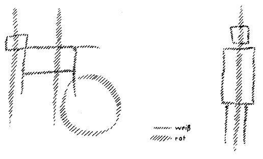

Wie oft mußten wir eigentlich hier betonen, daß die geisteswissenschaftlichen Wahrheiten, wenn sie ausgesprochen werden, nach der einen oder andern Richtung hin leicht mißzuverstehen sind. Und ich habe Ihnen ja auch von den verschiedensten Gründen gesprochen, aus denen es sicher leicht ist, diese geisteswissenschaftlichen Anschauungen und Erkenntnisse zu mißkennen, mißzuverstehen. Es ist immer wieder und wiederum zu sagen, daß es natürlich ungemein leicht ist, wenn man wenig Gelegenheit gehabt hat, sich in Spirituelles zu vertiefen, da oder dort zu finden, daß die Dinge, die geisteswissenschaftlich zutage treten, nicht voll begründet sind oder dergleichen. Es ist auch ungemein leicht zu sagen: Woher weiß denn der oder jener, welcher geisteswissenschaftlich etwas mitteilt, woher weiß er das? - wenn man nicht darauf eingehen will, das zu durchschauen, was er selbst oftmals darüber vorgebracht hat, von woher er diese Dinge weiß, und man lediglich das Urteil sich bildet nach dem, was man selber weiß. Das ist ja nicht schwer zu sagen: Woher kann der das wissen? Ich weiß es doch nicht! — und dann souverän zu erklären: Dasjenige, was ich nicht weiß, das weiß auch kein anderer, da kann ein anderer höchstens doch nur noch glauben! — Aber ein solches Urteil kommt nur dadurch zustande, daß man sich eben gar nicht darauf einläßt, auf die Quellen einzugehen, aus denen insbesondere in der heutigen Zeit geisteswissenschaftliche Erkenntnisse geschöpft werden müssen. ^v4k4x5

Zu den auf diese Art zustande gekommenen Mißverständnissen kann nun auch gehören, daß man glaubt, die Geisteswissenschaft wolle in Bausch und Bogen ein Verdammungs-, ein Vernichtungsurteil aussprechen über das ganze Streben der Zeit, insofern dieses Streben von Persönlichkeiten ausgeht, die außerhalb der Geisteswissenschaft stehen. Aber auch da liegt nur ein Mißverständnis vor. Gerade der Geisteswissenschafter, der ernst und würdig den heutigen Weltzustand ins Auge faßt, wird wohl eingehen auf die Gemütslage, auf die Seelenstimmung der Zeitgenossen und wird sich die Frage vorlegen: Was geht in den Seelen der ernsten Zeitgenossen der Gegenwart vor, in der Richtung, in der eine Besserung manches Verbesserungswürdigen oder Verbesserungsnotwendigen eben gesucht werden muß? — Was aber hier vor allen Dingen als eine besonders in der Gegenwart außerordentlich markante Tatsache ins Auge gefaßt werden muß, das ist, daß gerade abgelehnt wird, manchmal von den strebendsten Zeitgenossen abgelehnt wird das konkrete Eingehen auf das Wissen von der geistigen Welt, auf die Erkenntnis von der geistigen Welt, die als eine Wirklichkeit vor den Menschen treten kann und nicht bloß als etwas, was man durch eine Summe von Begriffen erschließt. Die meisten Menschen möchten eben heute mit ihren Erfahrungen nur in der Sinneswelt stehenbleiben und eine geistige Welt höchstens zugeben als durch Begriffe, durch Ideen erschließbar. Sie möchten sich nicht anschließen an eine Forschung, welche von Mitteln spricht, in die geistige Welt erlebnisgemäß wirklich einzudringen. Dieses Ablehnen der wirklichen Geistigkeit, das ist allerdings ein charakteristischer Zug unserer Zeit; das ist ein Zug unserer Zeit, den insbesondere wir, die wir versuchen, uns auf den Boden der Geisteswissenschaft zu stellen, berücksichtigen müssen. Sonst bleiben wir doch außerhalb dieser Geisteswissenschaft stehen, uns nur auf sie einlassend als wie auf etwas, was neben andern Dingen, die in der Gegenwart zutage treten, doch auch berücksichtigt werden sollte. ^ydn873

Ich habe vor kurzem hier, dadurch, daß ich Ihnen die Gedanken Walther Rathenaus vorführte, gezeigt, daß der Geisteswissenschafter schon in der Lage ist, innerhalb der Grenzen, in welcher gegenwärtige Gedankenrichtungen zu würdigen sind, diese Gedankenrichtungen auch wirklich zu würdigen. Aber auffällig ist eben doch diese Zurückweisung des wirklichen geistigen Einschlages, der in unserer Zeit kommen soll. Dieses Ablehnen kann man ja auf Schritt und Tritt erfahren, wenn man aufmerksam ist auf das, was die Leute heute denken. Gewiß, es ist vor viele Menschen in der Gegenwart das Erschütternde der gegenwärtigen Weltenlage getreten; es gibt Menschen, die den ganzen Ernst der gegenwärtigen Zeit zu würdigen verstehen und auch schon seit einiger Zeit zu würdigen verstanden haben. Auch da bitte ich Sie, sich durchaus nicht der Hochnäsigkeit mancher Anthroposophen zu befleißigen und zu meinen, daß Anthroposophie als solche schon eine Anweisung gibt, besser den Ernst der Zeit zu würdigen, als ihn Leute würdigen, die außerhalb der anthroposophischen Bewegung stehen. Denn man möchte auch, daß innerhalb dieser anthroposophischen Bewegung gar mancher mehr in seinem Gemüte berührt würde von dem Entscheidenden in unserer gegenwärtigen Weltenlage. Man findet nur allzuhäufig gerade innerhalb unserer Reihen Menschen, die heute, trotz des Ernstes der Zeit, nicht auf diesen Ernst hinblicken mögen und lieber sich mit ihrer eigenen werten Persönlichkeit beschäftigen, statt einiges Interesse für die großen Fragen in sich zu erregen, die durch die Menschheit pulsieren. ^ktyw84

Ich will bei der heutigen Betrachtung von einem Beispiel ausgehen, das mir, man kann sagen zufällig - wenn man das Wort nicht mißversteht, und wir brauchen es nicht mißzuverstehen - in die Hände gekommen ist; ein Aufsatz, der allerdings insofern heute veraltet ist, als er geschrieben wurde, während der sogenannte Krieg noch in vollem Gange war. Also der Aufsatz ist heute veraltet. Er ist auch sonst nicht gerade eindringlich, da er die meisten Dinge, die er bespricht, sehr einseitig behandelt. Allein er rührt doch her von einem Menschen das sieht man nach der ganzen Haltung, nach der ganzen Schreibweise -, der sich die ernstesten Gedanken darüber macht, was nun eigentlich geschehen soll, was die Welt von den Ereignissen zu erwarten hat. Er stellt dar, dieser Aufsatz, wie sich die Westmächte, die Mittelmächte, die Ostmächte allmählich verhalten haben innerhalb der Katastrophe der letzten Jahre. Er stellt die großen Gefahren, wenn auch einseitig, aber doch immerhin dar, die aus dieser Katastrophe heraus heute lauern und in die Zukunft hineinlauern werden. Der Verfasser hat einen gewissen Weltblick. Er betrachtet die Welt nicht nur vom Gesichtspunkt der Landesgrenzen; auch das soll ja unter den heutigen Menschen noch vorkommen, daß sie die Welt nur vom Gesichtspunkt ihrer Landesgrenzen betrachten, und wenn sie sich dann beruhigen können, daß innerhalb ihres Landes das oder jenes noch nicht stattfindet, dann sind sie unbesorgt. Der Verfasser dieses Aufsatzes sieht immerhin nicht nur den Umkreis des Kitchturmes, sondern er sieht doch etwas von der Weltperspektive. Und seine Gedanken zusammenfassend, kommt er zu einem sehr merkwürdigen Satze. Er sagt: «Daß ein furchtbares Schicksal der weißen Menschheit winkt; dies scheint mir unter allen Umständen gewiß, es sei denn, daß eine Periode supremer Weisheitsherrschaft sehr bald die der Leidenschaft und Wahnvorstellungen ablöst. Wir leben in der Tat seit lange schon in der Periode, die mit der Völkerwanderungszeit viel Ähnlichkeit hat. Das Tempo wird durch den Weltkrieg ungeheuer beschleunigt. Was den damals von außen in altes Kulturland einwandernden Germanenstämmen entspricht, sind die beträchtlichen, aufsteigenden unteren Volksschichten, die sowohl dem Blut wie dem Kulturerbe nach von den bisher herrschenden sehr verschieden sind. Daß diese Völkerwanderung» - es ist in der Tat viel besser, von einer Völkerwanderung als von einem Kriege zu sprechen - «überhaupt stattfindet, ist gut insofern, als sie Verbreitung bedingt, eine Verbreitung der Kulturbasis und eine Hebung vom Gesamtniveau. Sehr gefährlich aber ist es, wenn sie zu schnell verläuft. Und diese Gefahr wird vergrößert, je länger der Weltkrieg dauert.» ^4ulysj

Der Aufsatz ist heute veraltet. Die Gefahr ist nicht weniger groß geworden, aber da er alle Argumente aus dem noch vorhandenen Kriegswüten ableitet, so sind seine Argumente veraltet. Uns aber muß hier insbesondere der erste Satz interessieren, den ich vorgelesen habe: «Daß ein furchtbares Schicksal der weißen Menschheit winkt, scheint mir unter allen Umständen gewiß, es sei denn, daß eine Periode supremer Weisheitsherrschaft sehr bald die der Leidenschaft und Wahnvorstellungen ablöst.» - Denn das ist in der Tat als abstrakte Wahrheit unbedingt richtig. Und wenn jemand es einmal ausspricht, daß die einzige Rettung der Menschheit in dem Sich-Hinwenden zu einer supremen Weisheitsherrschaft liegt, und nicht zu irgendwelchen andern politischen oder sozialen Quacksalbereien, dann müssen wir eine solche Tatsache, eine solche Gedankenrichtung anerkennen. Aber wir dürfen dabei eben durchaus nicht vergessen, daß gerade solche Menschen, von denen wir zugeben müssen, daß sie in allen Tiefen ihres Wesens ergriffen sind von dem Ernst der Zeitlage, daß gerade solche Menschen, wenn es sich nun darum handelt, zu sagen, worin denn die Weisheitsvorstellungen bestehen, die die alten Wahnvorstellungen ablösen sollen, daß sie dann doch gleich wieder zurückfallen auf irgendwelche, zu schönen Worten gewordene alte Wahnvorstellungen. Denn das ist gerade die Tragik, das ist das furchtbare Schicksal unserer Zeit, daß die Menschen zwar aufmerksam darauf werden: Es ist notwendig, zum Geiste sich hinzuwenden -, daß sie aber immer Furcht und Angst überkommt, wenn sie sich zum Geiste hinwenden sollen; daß sie dann gleich wieder bereit sind, nach den alten Wahnvorstellungen zu greifen, die die Menschheit hineingetrieben haben in das gegenwärtige furchtbare Schicksal. Wir brauchen ja nur das Beispiel einer sehr verbreiteten Vorstellungsrichtung zu nehmen. ^uuk20t

Glauben Sie, wenn Sie einen richtiggehenden, sagen wir trivial, Vertreter des römisch-katholischen Kirchenbekenntnisses fragen, ob er geneigt sein würde zu glauben, daß die alten Vorstellungen in die katastrophale Zeit hineingeführt haben, daß sie von neuen abgelöst werden müssen, glauben Sie, daß er wirklich geneigt sein würde, an die Notwendigkeit einer Erneuerung derjenigen Vorstellungen zu glauben, welche die Menschheit nicht retten haben können vor dieser furchtbaren Katastrophe? Nein, er würde sagen: Wenn die Menschen nur wiederum richtig römisch-katholisch werden, dann werden sie schon glücklich werden. - Und er wird gar nicht auf den Einfall kommen, sich zu sagen, daß sie doch tausendneunhundert Jahre hindurch Zeit gehabt haben, römisch-katholisch zu sein und dennoch in die Katastrophe hineingekommen sind; daß also zum mindesten die Katastrophe lehren muß, daß man neue Impulse braucht. Das ist nur ein Beispiel für viele. Es ist überhaupt notwendig, gerade mit Bezug auf diesen Punkt rückhaltlos die Zusammenhänge, die da bestehen, vor Augen zu führen. ^oel4kp

Es ist heute leicht, selbst für einen als echt geltenden Anhänger dieser oder jener Kirche, zu sagen: Der Haeckelismus oder der Materialismus, das ist eine Teufelssache, das muß mit Stumpf und Stiel ausgerottet werden. — Das ist das Gegenteil von dem, was die Menschen: in eine heilsame Seelenverfassung hineinführen kann. Ja, man kann wohl so sprechen, aber wenn man bei dieser Aussage bleibt und nicht die Zusammenhänge untersucht, die dabei in Betracht kommen, dann wird man unmöglich zu etwas kommen können, was der Gegenwart und noch weniger der nächsten Zukunft heilsam sein kann. Denn wenn Sie irgendeine materialistisch gefärbte Weltanschauungsempfindung aufnehmen und sich fragen: Woher kommt sie historisch? — dann werden Sie, wenn Sie wirklich Einsicht gewinnen wollen, gar nicht umhin können, sich zuletzt doch zu sagen: sie kommt ja im Grunde gerade aus der Art, das Christentum zu vertreten, wie dieses Christentum tausendneunhundert Jahre lang von den verschiedenen Konfessionen vertreten worden ist. Der Tiefersehende weiß, daß Haeckelismus ohne das vorangehende Christentum der Kirche gar nicht möglich gewesen wäre. Es gibt Leute, die sind auf dem Standpunkt der Kirche zurückgeblieben, sagen wir, wie sie im Mittelalter war; die vertreten heute noch immer die Gedanken, die die Kirche im Mittelalter gehabt hat. Andere haben diese Gedanken weitergebildet. Und diejenigen, die sie weitergebildet haben, unter denen ist zum Beispiel Ernst FHaeckel. Er ist ein gerader Abkömmling der durch die verschiedenen Kirchen jahrhundertelang gepflogenen Vorstellungen. Das ist nicht außerhalb der Kirche entstanden, das ist im tieferen Sinne durchaus innerhalb der Kirchenlehren entstandene Wahrheit. Allerdings, richtig die Zusammenhänge erkennen wird man erst dann, wenn man sich ein wenig befruchtet mit geisteswissenschaftlichen Einsichten, um diese Dinge ins Auge zu fassen. ^gpsl6n

Ich will Ihnen daher heute - obwohl vielleicht einzelne von Ihnen sagen werden, die Sache ist zu schwer, aber es darf uns nichts zu schwer sein, man soll Einsicht gewinnen -, ich möchte Ihnen heute “ zunächst einmal einen Punkt besonders auseinandersetzen. ^2smrze

Wenn Sie heute philosophisch angehauchte Schriften gut geschulter, zum Beispiel katholischer Gelehrter lesen, da werden Sie überall mit Bezug auf einen gewissen Punkt eine ganz bestimmte Anschauung ausgebildet finden. Und man kann sagen: Sie finden diese Anschauung ausgebildet bei den allerbesten dieser katholisch geschulten Gelehrten. — Ich möchte dabei gleich bemerken, daß ich durchaus nicht geneigt bin, die formale Schulung des katholischen Klerus zum Beispiel zu unterschätzen. Ich kenne sehr gut - ich habe das auch ausgesprochen in meinem Buch «Vom Menschenrätsel» — die bessere Schulung, die gerade manche katholischen Theologen haben, wenn sie philosophisch schreiben, gegenüber den Schreibereien der nicht durch die katholische Theologie gegangenen philosophischen Gelehrten zum Beispiel. In dieser Beziehung, muß man sagen, ist die gelehrte Literatur, die theologische Literatur der protestantischen, der reformierten Geistlichen weit zurück hinter der guten philosophischen Schulung der katholischen Theologen. Diese Leute haben durch ihre strenge Schulung eine gewisse Fähigkeit, ihre Begriffe wirklich plastisch auszubilden; sie haben — was zum Beispiel Menschen, die heute berühmt sind in der nichtkatholischen philosophischen Literatur, nicht einmal als Ahnung haben - eine gewisse Fähigkeit, einzusehen, was ein Begriff ist, was eine Idee ist und dergleichen, kurz, diese Leute haben eine gewisse Schulung. Man braucht nicht einmal ein Buch von Haeckel zu nehmen, man kann ein Buch von Eucken nehmen, um diese Begriffspurzelei festzustellen, diese schreckliche, bloß feuilletonistische Herumrederei über die wichtigsten Begriffe, oder man kann zum Beispiel ein Buch von Bergson nehmen, wo man immer das Gefühl hat: der fängt die Begriffe ab, ohne mit ihnen hantieren zu können, wie der bekannte Chinese, der sich umdrehen will und immer seinen Zopf abfängt. Dieses absolute Taumeln in der Begriffswelt, das bei diesen ungeschulten Leuten der Fall ist, das werden Sie nicht finden, wenn Sie sich einlassen auf die vom katholischen Klerus ausgehende philosophische Literatur, so daß in dieser Beziehung zum Beispiel ein Buch wie die dreibändige «Geschichte des Idealismus» von Otto Willmann, einem waschechten Katholiken, der auf jeder Seite seinen Katholizismus zur Schau trägt, weit höher steht als das meiste, was von nichtkatholischer Seite gerade heute auf philosophischem Gebiete geschrieben wird. Das alles kann man durchaus wissen und dennoch den Standpunkt einnehmen, den man eben als Geisteswissenschafter einnehmen muß. Inferiorität des Geistes mag auf diesem Gebiete anders entscheiden, mag zum Beispiel der Meinung sein: weil da gute Schulung ist, so ist sie überhaupt mehr wert. Nun, das mag sein; aber man kann durchaus sich auch der Objektivität befleißen, wenn man genötigt ist, einen bestimmten Gesichtspunkt im Leben einzunehmen. ^evio15

Ein Punkt wird Ihnen in dieser gut geschulten katholischen philosophischen Literatur immer entgegentreten, ein Punkt, der auch ungemein viel Blendendes für den heutigen Denker hat; das ist der, der immer in Betracht kommt, wenn die Leute zu sprechen kommen auf den Unterschied des Menschen vom Tiere. Nicht wahr, die gewöhnlichen Haeckel-Leser und Haeckel-Bekenner, die werden ja immer darauf ausgehen, den Unterschied des Menschen vom Tier möglichst zu verwischen, möglichst den Glauben zu erwecken, daß der Mensch im ganzen nur ein gewissermaßen höher ausgebildetes Tier ist. Das tun die katholischen Gelehrten nicht, sondern sie heben immer etwas hervor, was ihnen als radikaler Unterschied erscheint zwischen dem Menschen und dem Tiere. Sie heben hervor, daß das Tier bei der gewöhnlichen Anschauung bleibt, die es gewinnt von dem Gegenstand, den es jetzt beriecht, von dem nächsten Gegenstand, den es dann beriecht oder beschaut und so weiter; daß das Tier gewissermaßen immer nur in einzelnen individuellen Vorstellungen bleibt, während der Mensch die Fähigkeit hat, abgezogene, abstrakte Begriffe sich zu bilden, die Dinge zusammenzufassen. Das ist in der Tat ein radikaler Unterschied, weil der Mensch, wenn man die Sache so auffaßt, dadurch sich wirklich radikal vom Tier unterscheidet. Das Tier, das nur die Einzelheiten ins Auge faßt, kann nicht in sich die Geistigkeit ausbilden, weil ja die abstrakten Begriffe in der Geistigkeit leben müssen. Und dadurch muß man dazu kommen, anzuerkennen, daß im Menschen diese besondere Seele lebt, die eben die abstrakten Begriffe bildet, während das Tier mit seiner besonderen Art des Innenlebens diese abstrakten Begriffe nicht bilden kann. ^h1uwje

Wer auf diesen Punkt hin die entsprechenden katholischen Auseinandersetzungen ins Auge faßt, der sagt sich: Das ist etwas ungeheuer Bedeutsames, daß durch gute philosophische Schulung auf diesen entscheidenden, radikal entscheidenden Punkt in dem Unterschied zwischen Mensch und Tier richtig hingewiesen werden kann. Die Menschen würdigen in der Gegenwart gar nicht die Tragweite einer solchen Sache. Als zum Beispiel der Rummel dazumal losgegangen war, den Drews veranstaltet hat, diese Auseinandersetzung, ob Jesus gelebt hat oder nicht, als damals in Berlin eine große Versammlung abgehalten worden ist, wo alle möglichen und unmöglichen Leute geredet haben über das Problem: Hat Jesus gelebt? — da hat auch der katholische Theologe Wasmann darüber gesprochen, und er konnte natürlich nur Dinge sagen, die die andern als sehr rückständig betrachtet haben. Aber trotzdem dazumal eigentlich die Koryphäen, namentlich der Berliner protestantischen Theologie, geredet haben, so sind mir im Grunde genommen in den damaligen Reden doch als wirklich auf einem etwas besseren Niveau - nicht auf dem Gegenwartsniveau, aber einem etwas besseren Niveau - zwei Aussprüche beziehungsweise die Unterlagen dieser Aussprüche erschienen. Das eine war eine Ausführung, die ein — ich will damit gar nichts Schlimmes sagen, sondern eigentlich den Mann loben — gelehrter Bummler allerersten Ranges dazumal losgelassen hat. Ich glaube ihn nicht besser loben zu können, als indem ich ihn einen gelehrten Bummler allerersten Ranges nenne. Der Mann hätte nämlich durch seinen Scharfsinn und durch seine eigenartigen Kenntnisse auf den verschiedensten Gebieten, durch ein großes Wissen viel leisten können. Schon damals, als ich mit ihm verkehrte — das ist achtzehn, neunzehn Jahre her -, hatte er schon seit fünfzehn Jahren, glaube ich, an einer Revision der Logik geschrieben, und ich glaube, er muß auch seither noch daran schreiben, denn diese Revision der Logik ist mir mittlerweile nicht zu Gesicht gekommen. Er hat dazumal schon gesagt, was ganz richtig ist: die Menschen seien eigentlich ganz fürchterlich in der Gegenwart, sie seien nämlich dann ganz fürchterlich, wenn sie zu denken anfangen, denn man brauche nur zwei, drei Sätze, sei es in einem wissenschaftlichen oder in einem unwissenschaftlichen Gespräch heute zu hören, um zu beobachten, wie gleich die furchtbarste Unlogik einsetzt. Das, meinte er, was die Menschen beobachten müßten, damit sie nicht in die grauslichsten Wahnvorstellungen kommen, die heute gang und gäbe sind, das ließe sich auf eine Quartseite aufschreiben, man brauche nur diese Quartseite wirklich zu berücksichtigen. Ich weiß ja nicht, ob er diese Quattseite als Revision der Logik zustande bringen will; wie gesagt, dazumal waren es schon fünfzehn Jahre, seither sind noch achtzehn, neunzehn Jahre verflossen, ich weiß nicht, wie weit er jetzt ist mit dieser Revision der Logik. Aber ich will ihn also loben, indem ich ihn einen geistreichen, geistvollen Bummelanten nenne, weil ich damit andeuten will, daß er, wenn er nicht ein geistreicher Bummelant wäre, furchtbar viel leisten könnte. Der hat dazumal etwas sehr Schönes gesagt, er hat nämlich gesagt: Ja, die katholische Kirche mußte eines Tages hören, daß die Kometen, die ja aus Kern und Schwanz bestehen, Himmelskörper wie die andern sind und nach Gesetzen sich bewegen, wie die andern Himmelskörper auch. Als nun gar nicht mehr geleugnet werden konnte, nach den Dingen, die da einmal vorlagen, daß die Kometen auch solche Himmelskörper seien wie die andern, da entschloß sich die katholische Kirche zuzugeben, daß man auf die Kometen auch die übrigen Himmelsbahngesetze anwende; aber sie gab es zunächst nur mit Bezug auf den Kern, noch nicht mit Bezug auf den Schwanz zu. - Nun, er wollte damit symbolisch nur ausdrükken, daß die katholische Kirche in der Regel nur geneigt ist, das Notwendigste zuzugeben, wie sie ja 1827 erst die kopernikanische Weltanschauung für ihre Bekenner erlaubt hat; daß sie aber selbst dann, wenn sie das Notwendigste zugeben muß, wenigstens noch den Schwanz von der Sache zurückbehält! Das ist eine Bemerkung, von der ich fand, daß sie eigentlich ganz gut die Situation charakterisierte. ^sm4zzb

Die andere Bemerkung aber, die war getan eben gerade von dem katholischen Ameisenforscher Wasmann - er ist ein ausgezeichneter Ameisenforscher, aber er ist auch ein gut geschulter Philosoph -, der da sagte: Eigentlich, meine Herren, können Sie mich ja gar nicht verstehen, denn in Wirklichkeit wissen Sie alle nicht, wie man philosophisch denkt; derjenige, der philosophisch denkt, der redet eben nicht so wie Sie! - Und in der Tat, er hatte damit recht, es ist ganz zweifellos, daß er damit den Nagel auf den Kopf traf. Nun gibt es gerade eine kleine, nette Schrift von Wasmann über den Unterschied zwischen Mensch und Tier, welche scharf hervorhebt, was ich jetzt eben angedeutet habe: diese Fähigkeit der Menschen, wirklich in abstrakten Begriffen zu denken, die das Tier eben nicht haben soll. Das ist etwas, was außerordentlich blendend ist, weil es ja nach einer gewissen Richtung hin überzeugend ist für den, der sich nur in seinem Denken so weit geschult hat, daß er die ganze Tragkraft einer solchen Behauptung ins Auge fassen kann. ^9crr59

Aber nun sehen wir die Sache einmal geisteswissenschaftlich an, da wird Ihnen erst die ganze Geschichte in ihrer Bedeutung vor Augen treten. Wenn wir geisteswissenschaftlich ausgehen von den Anschauungen, von den Erfahrungen, die man darüber gewinnen kann in der spirituellen Welt, dann begreift man auf der einen Seite, daß ohne die geisteswissenschaftlichen Betrachtungen diese blendende Behauptung zustande kommen kann, von der ich eben gesprochen habe, daß sie auch eigentlich für jeden, der nicht Geisteswissenschafter werden will, gelten muß, gerade wenn er gut philosophisch geschult ist; das sieht man auf der einen Seite ein. Auf der andern Seite sieht man aber folgendes, man sieht es einfach, indem man die Dinge in der Welt betrachtet: Wenn man mit geisteswissenschaftlichen Voraussetzungen den Menschen mit dem Tiere vergleicht, dann zeigt sich, daß der Mensch zwar den Dingen der Welt gegenübertritt in einzelnen Beobachtungen und sich dann abstrakte Begriffe bildet durch allerlei Denkoperationen, in denen er zusammenfaßt, was er vereinzelt sieht. Man kann auch zugeben, daß das Tier diese Abstraktion nicht hat, daß das Tier diese Tätigkeit der Abstraktion nicht ausübt. Aber das Kuriose ist, daß die abstrakten Begriffe dem Tiere nicht fehlen, daß das Tier mit seiner Seele gerade in den allerabstraktesten Begriffen lebt, die wir Menschen uns mühevoll bilden, und daß das Tier die einzelne Anschauung nicht so hat wie wir. Was wir voraushaben, ist gerade, daß wir einen viel freieren Gebrauch der Sinne, eine ganz bestimmte Art von Zusammenwirken von Sinnen und inneren Emotionen und Willensimpulsen haben. Das haben wir vor dem Tier voraus. Aber die Sicherheit des Instinktes, welche die Tiere haben, die beruht gerade darauf, daß das Tier von vornherein mit solchen abstrakten Begriffen lebt, die wir uns erst bilden müssen. Worin wir uns von dem Tier u   nterscheiden, das ist, daß sich unsere Sinne emanzipieren und freier werden im Gebrauch nach der Außenwelt zu, und daß wir auch in unsere Sinne den Willen hineingießen können, den das Tier nicht hineingießen kann. Aber das, was wir Menschen nicht haben, sondern uns erst erwerben müssen, die abstrakten Begriffe, die hat gerade das Tier, so sonderbar es einem erscheinen mag. Gewiß, es hat jedes Tier nur ein bestimmtes Gebiet, aber auf diesem Gebiete hat das Tier solche abstrakten Begriffe, so sonderbar es einem erscheinen mag. Der Mensch ist darauf angewiesen, einen, zwei, drei Hunde zu sehen; er bildet sich daraus den abstrakten Begriff «Hund». Das Tier hat auf diesem Gebiete, und zwar ganz genau, denselben abstrakten Begriff «Hund», den wir haben, es braucht sich ihn nicht zu bilden. Wir müssen uns ihn erst bilden, das Tier braucht das nicht. Aber das Tier hat nicht die Fähigkeit, den einen Hund von dem andern genau zu unterscheiden, genau zu individualisieren durch die Sinneswahrnehmungen. ^0qvsky

Wenn wir uns nicht die Fähigkeit erwerben, durch Geisteswissenschaft auf den wahren Tatbestand der Wirklichkeit einzugehen, so täuschen wir uns in einer gewissen Beziehung über das Allerwesentlichste. Wir glauben, weil wir Menschen die Fähigkeit entwickeln müssen, abstrakte Begriffe zu bilden, so unterscheiden wir uns durch die abstrakten Begriffe vom Tiere, das diese Fähigkeit nicht besitzt. Aber das Tier braucht diese Fähigkeit gar nicht, weil es die abstrakten Begriffe von vornherein hat. Das Tier hat eine ganz andere Art von Sinnesanschauung als wir Menschen. Gerade die äußere Sinnesanschauung ist ganz verschieden. ^kserfi

In dieser Beziehung ist sogar eine sehr tief eingreifende Umwandlung in den menschlichen Vorstellungen notwendig. Denn über allerlei naturwissenschaftliche Begriffe, die heute schon populär geworden sind, haben sich ja die Menschen unterrichtet. Entweder haben sie sie in einer gewissen Schule, durch direkten Unterricht lernen können, oder sie haben sich unterrichtet durch jenes Abwaschwasser — ich wollte sagen durch jene Zeitungslektüre -, womit heute die naturwissenschaftlichen Vorstellungen in alle Welt hinausströmen. Aber die Menschen sind beherrscht von diesen naturwissenschaftlichen Vorstellungen. Mit Bezug auf das, was ich Ihnen eben angedeutet habe, da sind die Menschen ganz tief beherrscht von einem, fast könnte man sagen, instinktiven Hang zu glauben, daß das Tier wirklich in der Umgebung dasselbe sieht wie der Mensch. Wenn er mit seinem Hunde spazieren geht, so hat er den instinktiven Glauben, daß der Hund die Welt so sieht, wie er sie sieht, daß er ebenso das Gras farbig, den Weizen gefärbt, die Steine gefärbt sieht, wie er selber. Und dann hat er, wenn er einigermaßen denken kann, auch noch den Glauben: er selber kann abstrahieren und hat daher abstrakte Begriffe, sein Hund aber abstrahiert nicht und so weiter. Und dennoch ist es nicht so. Dieser Hund, der neben uns geht, lebt geradeso in den abstrakten Begriffen wie wir. Ja, er lebt sogar intensiver darinnen als wir. Er braucht sie auch gar nicht zu erwerben, sondern er lebt vom Anfange an intensiv darinnen. Aber die äußere Anschauung hat er nicht so, die gibt ihm ein ganz anderes Bild. Sie brauchen nur aufmerksam zu sein auf gewisse Beobachtungen, die man im Leben machen kann. Allerdings, man nimmt die Dinge nicht immer ernst genug. Ich könnte Ihnen eine ganze Anzahl von Beispielen anführen, aus denen Ihnen hervorgehen würde, wie der Mensch rein instinktiv in dieser Richtung verkehrt denkt. Zum Beispiel ging ich einmal, es war in Zürich, glaube ich, von einem Vortrag, der an einem Zweigabend gehalten worden war, auf die Straße. Da wartete ein Kutscher, und das Pferd wollte nicht recht gehen, machte Miene, ein bißchen zu scheuen. Da sagte der Kutscher: Das fürchtet sich vor seinem Schatten. - Er sah natürlich den Schatten des Pferdes, den die Laterne auf die Wand warf, und deshalb setzte er voraus, daß das Pferd ganz genau ebenso diesen Schatten sehe wie er. Er hatte natürlich keine Ahnung davon, was, wenn ich sagen darf, in der Seele des Pferdes und was in seiner Seele vorgeht. Er sieht den Schatten des Pferdes, aber das Pferd hat ein lebendiges Gefühl vom Sein in jenem Raumteil des Ätherleibes, wo sich der Schatten bildet. Das ist ein ganz anderer Vorgang, in bezug auf die innere Anschauung ein ganz anderer Vorgang. ^lqzflo

Da haben Sie das Aufeinanderprallen der bisherigen Denkweise bis in die elementarsten, instinktivsten Anschauungen naiver Menschen hinein mit dem, was geisteswissenschaftlich neu in die Menschen hineinkommen muß. Sie werden allerdings erst mit allem Ernste würdigen müssen, was hier eigentlich zugrunde liegt. Denn mit Bezug auf solche Dinge unterscheidet sich der ärgste Materialismus eines Vog/ oder Moleschoft oder Clifford oder Spencer und so weiter viel weniger von dem hergebrachten Bekenntnisbegriffe der einzelnen Konfessionen, als sich dasjenige unterscheidet, was als eine neue Denkweise der Geisteswissenschaft zugrunde liegend von diesen Bekenntnissen sich unterscheiden muß. Denn eigentlich denken gewisse Materialisten doch heute: Der Mensch unterscheidet sich nicht sehr vom Tiere. Sie haben auch einmal etwas davon läuten gehört, wenn auch nicht die Glocken zusammenschlagen vernommen, daß der Mensch sich abstrakte Begriffe machen kann, die doch etwas anderes sind als die gewöhnlichen bloß sinnlichen Vorstellungen; aber sie sagen sich: Abstrakte Begriffe, das ist vielleicht doch nicht so etwas Wichtiges, so etwas Wesentliches, also im Grunde genommen unterscheidet sich der Mensch nicht von dem Tiere. — Der gesamte Materialismus der Gegenwart ist eigentlich eine Schöpfung der Kirchenbekenntnisse. Das muß man nur wirklich ganz ernsthaftig ins Auge fassen, dann wird man sehen, daß eine Erneuerung der Vorstellungsart der Menschenseelen hier in Betracht kommt, wenn man nicht dabei stehenbleiben will: Nun wiederum zurück zu den alten Vorstellungen, dann wird es schon gut gehen! ^nztk0e

Man kann aber nicht etwa sagen, daß die Menschen es einfach unterlassen könnten, sich nun zu wirklichem Geistesleben hinzuwenden, und es auch so weitergehen könnte! Nein, diejenigen haben schon recht, die da sagen, «...daß ein furchtbares Schicksal der weiBen Menschheit winkt, scheint mir unter allen Umständen gewiß, es sei denn, daß eine Periode supremer Weisheitsherrschaft sehr bald die der Leidenschaft und Wahnvorstellungen ablöst». Nur sollten solche Leute auch einsehen, daß zu den Wahnvotrstellungen der größte Teil der wissenschaftlichen Vorstellungen über die Welt heute gehört. Das sollte eben durchaus eingesehen werden. Die Menschheit ist in ihrer Entwickelungsströmung an dem Punkt angekommen, den wir oftmals dadurch charakterisieren, daß wir sagen: Seit dem 15. Jahrhundert ist die Menschheit im Zeitalter der Bewußtseinsseele. Und diese Entwickelung der Bewußtseinsseele findet so statt, wie ich es eben öfter charakterisiert habe. Sehen wir einmal auf ein sehr wichtiges Charakteristikon mit Bezug auf die Entwickelung der Bewußtseinsseele hin. ^4wbmdp

Ich habe Ihnen schon das letzte Mal angedeutet: Alles was der Geistesforscher erkennt, das heißt ins Bewußtsein heraufhebt gerade von solchen Dingen, die in der Entwickelung der Menschheit liegen, das geht, auch wenn es nicht erkannt wird, bei den Menschen im Unterbewußtsein vor sich. Die Menschheit geht einmal, indem sie nach der Zukunft hin sich entwickelt, durch gewisse Erfahrungen hindurch. Sie geht unbewußt durch diese Erfahrungen hindurch, wenn sie es nicht vorzieht, sie ins Bewußtsein heraufzubringen, was eben im Zeitalter der Bewußtseinsseelenentwickelung geschehen sollte. Aber gerade in diesem Zeitalter der Bewußtseinsseelenentwikkelung wird heute noch manches, was an den Menschen im Unterbewußtsein herantritt, zurückgestoßen. ^2mqdco

Unter anderem tritt mehr und mehr ein gewisser Teil desjenigen Erlebnisses an den Menschen heran, das man nennen kann die Begegnung mit dem «Hüter der Schwelle». Gewiß, will man wirklich in die geistige Welt vollbewußt eintreten, Imaginationen, Inspirationen, Intuitionen entwickeln, so muß man in viel höherem Maße mit reichlicheren Erfahrungen, mit ganz andern Erfahrungen noch eintreten in das Gebiet der übersinnlichen Welt. Man muß gründlicher - wenn ich mich des Ausdrucks bedienen darf — beim Hüter der Schwelle vorbeischreiten, als die ganze Menschheit im Laufe des Zeitalters der Bewußtseinsseele dies tun muß. Aber in einem gewissen Grade muß der Mensch einfach bis zum Ende der Bewußtseinsseelenentwickelung an dem Hüter der Schwelle vorbeigeschritten sein. Er kann nun die Bequemlichkeit haben, dieses Vorbeischreiten ganz im Unterbewußtsein zu lassen. Daß dies aber nicht geschehe, dazu ist gerade Geisteswissenschaft da. Sie soll darauf aufmerksam machen, daß das eben jetzt zu den Geschehnissen gehört, die sich in der Menschheitsentwickelung vollziehen. Und derjenige, der heute die Leute abhält von Geisteswissenschaft, will eigentlich nichts Geringeres, als die Menschen zwingen, nicht bewußt, sondern unbewußt am Hüter der Schwelle vorbeizukommen, der eben einfach in diesem Zeitalter in den Horizont der Menschen hereintritt. ^ordnfe

Mit andern Worten: die Menschheit muß in den 2160 Jahren, welche das Zeitalter der Bewußtseinsseelenentwickelung dauert, von 1413 an ungefähr, in irgendeiner Inkarnation an dem Hüter der Schwelle vorbeikommen und teilweise die Erlebnisse, die man bei dem Hüter der Schwelle haben kann, erleben. Der Mensch kann sich von materialistisch gesinnten Menschen zwingen lassen, unbewußt vorbeizugehen; oder er kann in Freiheit ergreifen den Entschluß, auf Geisteswissenschaft aufmerksam zu sein und, sei es durch Selbstschau, sei es durch den gesunden Menschenverstand, etwas über dieses Vorbeigehen an dem Hüter der Schwelle zu vernehmen. Und bei diesem Vorbeigehen an dem Hüter der Schwelle wird eben das vernommen, was den Menschen befähigt, sich richtige, zutreffende Vorstellungen zu bilden über die konkrete übersinnliche Welt, Vorstellungen zunächst, welche in der Lage sind, vor allen Dingen das Vorstellen selbst, das Denken, in eine gewisse freie, unbefangene, wirklichkeitsfreundliche Richtung zu bringen. ^myj6hb

Das habe ich ja oftmals als die größte Errungenschaft der Geisteswissenschaft bezeichnet, daß das Denken wirklichkeitsfreundlicher wird, daß es wirklich eingehen kann auf die Impulse, die in dem Geschehen liegen, und nicht bloß in abstrahierter Weise wie die Naturwissenschaft äußerlich etwas über die Vorgänge weiß. Gewisse Dinge der geistigen Welt zu wissen, das ist es, was den Menschen notwendig wird. Dadurch muß der Mensch in die Lage versetzt werden, seine Stellung in der Welt vom Gesichtspunkte eines geistigen Horizontes aus beurteilen zu lernen, während er heute seine Stellung in der Welt nur vom Standpunkte des sinnlichen Horizontes aus zu beurteilen vermag. Sie beurteilen schon etwas neu und richtig, wenn Sie zum Beispiel einen solchen Gedanken fruchtbar in sich machen, daß die Tiere nicht etwa keine abstrakten Vorstellungen haben, sondern daß sie gerade in den abstraktesten Vorstellungen leben, und daß der Mensch sich vom Tier unterscheidet durch eine gewisse Ausbildung seiner Sinne, die sich emanzipieren von dem engen Zusammenhang mit dem Körperleben. Dadurch kommen Sie eigentlich erst zu zutreffenden Vorstellungen über den Unterschied des Menschen von dem Tier. Äußerlich drückt sich das so aus, daß die Organisation der Sinne bei den Tieren in einem sehr ausgesprochenen Lebenszusammenhang steht mit der gesamten Organisation des Leibes. Die Organisation des Leibes erstreckt sich beim Tier sehr bedeutsam noch in den Sinn hinein. ^kj73ft

Nehmen Sie das Auge. Es ist den Naturwissenschaftern durchaus bekannt, daß Augen niederer Tiere Organe in sich haben, zum Beispiel den Fächer oder den Schwertfortsatz, welche bluterfüllt sind, welche lebendig einen Zusammenhang zwischen dem Augeninneren und der ganzen Organisation herstellen, während das menschliche Auge diese Organisation nicht hat, sondern viel selbständiger ist. Dieses Selbständigerwerden der Sinne, dieses Emanzipieren der Sinne von der Gesamtorganisation, das ist etwas, was erst beim Menschen eintritt. Dadurch aber ist beim Menschen die ganze Welt der Sinne viel mehr im Zusammenhang mit dem Willen als beim Tier. Ich habe das einmal morphologisch anders ausgedrückt. Ich habe Sie von einem andern Gesichtspunkte aus auf dieselbe Sache aufmerksam gemacht, indem ich sagte: Wenn Sie den dreigliedrigen Organismus nehmen, Extremitätenorgane, Brust, Kopf, so ist das, wenn ich schematisch zeichne, beim Tier so: dies der Kopforganismus (Zeichnung links,S.32), dies der Brustorganismus, dies der Extremitätenorganismus. Der Kopf steht unmittelbar über der Erde. Die Erde ist unter dem Kopforganismus — natürlich approximativ, aber dem Wesen nach - bei allen Tieren. Das Rückgrat steht senkrecht auf der Erdachse oder dem Erdradius. Beim Menschen ist es so, daß sein Kopf auf seinem eigenen Brustorganismus und Extremitätenorganismus steht. Beim Menschen ist der Brustorganismus so unter dem Hauptesorganismus, wie beim Tier die Erde unter dem Hauptesorganismus ist. Der Mensch steht mit dem Kopf auf seiner eigenen Erde. Dadurch ist beim Tiere eine Auseinanderhaltung vorhanden zwischen dem Willensorganismus, namentlich dem Extremitätenorganismus, den rückwärtigen Extremitäten, und dem Haupte. Beim Menschen ist unmittelbar der Wille, der Willensorganismus in den Kopforganismus eingeschaltet und das Ganze im Erdradius. Dadurch werden die Sinne gewissermaßen durchflossen von dem Willen, und das ist das Charakteristische beim Menschen. Dadurch unterscheidet er sich in Wirklichkeit von dem Tiere, daß die Sinne von dem Willen durchflossen werden. Beim Tiere werden die Sinne nicht vom Willen, sondern von einem tieferen Elemente durchflossen; daher auch der innigere Zusammenhang der Organisation der Sinne mit dem Gesamtorganismus. Der Mensch lebt viel mehr in der Außenwelt, das Tier lebt viel mehr in seiner eigenen inneren Welt. Indem der Mensch sich seiner sinnlichen Werkzeuge bedient, lebt er viel mehr in der Außenwelt. ^knxqzn

Nun bedenken Sie, jetzt leben wir im Zeitalter der Bewußtseinsseele. Was bedeutet das? Das bedeutet, wie ich Ihnen jetzt einige Male ausgeführt habe, daß wir gerade vorrücken dazu, daß im Bewußtsein nur die Spiegelung, nur Spiegelbilder vorhanden sind, da das Zeitalter der Bewußtseinsseele auch das Zeitalter des Intellektualismus ist. Das Abstraktionsvermögen so rein als eine Kunst auszubilden, das tut man eigentlich erst im Zeitalter des Intellektualismus. In diesem Zeitalter des Intellektualismus und Materialismus, da bildete man die abstraktesten Begriffe aus. ^exegjx

Nun können wir uns zwei Leute denken; der eine ist ein gut geschulter Philosoph, so gut geschult, wie es katholische Theologen sind. Dieser eine müßte eigentlich von seinem Gesichtspunkte aus etwas sagen, was er aber nicht sagen wird, weil er die Bescherung sieht, daß aus der jahrhundertealten Entwickelung des Christentums sich der Materialismus herausentwickelt hat, und das ist ihm unangenehm; aber er müßte eigentlich sagen: Dieser Mensch im Zeitalter der Bewußtseinsseele kann am besten abstrakte Begriffe bilden, er hat sich also am meisten über das Tier erhoben. ^72dupb

Es kann aber auch der Geisteswissenschafter kommen und sagen: In diesem Zeitalter der Bewußtseinsseelenentwickelung ist das Charakteristische für den Menschen gerade das, daß er die Fähigkeit, abstrakte Begriffe auszubilden, ganz besonders stark entwickeln kann. Wohin kommt er dadurch ? Er kommt gerade dadurch in die Tierheit zurück! Und das erklärt ungeheuer vieles. Das erklärt Ihnen, warum auch der Hang des Menschen, sich möglichst dem Tiere zu nähern, gerade dadurch entsteht, daß man in die Abstraktionen der Begriffe hineinkommt. Das erklärt Ihnen aber auch etwas, was vielfach in der Lebenspraxis und Lebensführung heute auftritt. Die Wissenschaften werden immer abstrakter und abstrakter, und im sozialen Leben kommt der Mensch immer mehr dazu, so leben zu wollen, wie eigentlich das liebe Vieh lebt, nämlich nur für die alleralltäglichsten Hungerund sonstigen Bedürfnisse zu sorgen. Den inneren Zusammenhang zwischen Abstraktionsvermögen und Tierheit, den zeigt die Geisteswissenschaft auf. Diesen inneren Zusammenhang, den macht der Mensch unter allen Umständen als Erlebnis im Zeitalter der Bewußtseinsseelenentwickelung durch. Wird er gehindert in der vorher charakterisierten Weise, so macht er ihn unbewußt durch. Es machen zahlreiche Menschen das durch, was in den Tiefen ihrer Seelen ihnen sagt: Du wirst ja dem Tiere immer ähnlicher; gerade indem du vorwärtskommst, wirst du immer mehr dem Tiere ähnlich. — Das ist der Schreck, den die Menschen bekommen vor dem Vorschreiten auf der Bahn. Das ist es auch, was die Menschen veranlaßt, so gerne bei alten Begriffen konservativ zu verweilen. ^tffhwl

Darf das sein? Darf dieses unbewußte Sichtbarwerden der Tierheit am Hüter der Schwelle die Menschen abhalten vom Vorwärtsschtreiten? Nein, das darf nicht geschehen; aber ein anderes muß eintreten. Indem man zurückschreitet im scheinbaren Vorwärtsschreiten, muß das Zurückschreiten so geschehen, daß es nicht, wie es unbedingt sein würde, wenn man nur das Abstraktionsvermögen ausbilden würde, einfach stattfindet so hin und her: da würde man bei früheren Stufen der Menschheitsentwickelung ankommen, ja, man käme überhaupt bei der Vertierung an. Nein, zurückgeschritten muß werden, aber so, hin und her (Zeichnung rechts, S. 32), daß eine Erhöhung stattfindet, und diese Erhöhung muß in das Geistige hineinführen. ^ryzpgt

Dasjenige, was wir verlieren, indem wir in die Abstraktion hineinschreiten, das müssen wir dadurch paralysieren, daß wir unsere abstrakten Spiegelbilder mit Geistigem ausfüllen, daß wir das Geistige aufnehmen in die Abstraktion hinein. Dadurch kommen wir vorwärts. Der Mensch ist vor dem Hüter der Schwelle, sei es bewußt oder unbewußt, vor die furchtbare Entscheidung gestellt: entweder durch die abstrakten Begriffe nur «tierischer als das Tier» zu werden und «in jeden Quark seine Nase zu begraben», um mit Goethes «Faust» zu sprechen, oder aber in dem Augenblicke, wo er in die Abstraktion eintritt, in diese abstrakten Begriffe dasjenige hineinzugießen, was aus geistigen Welten herausströmt, so wie wir das in diesen Tagen charakterisiert haben. Dann beginnt der Mensch seine Stellung innerhalb der Welt erst richtig zu würdigen, denn dann faßt er sich auf als in der Entwickelung begriffen, dann weiß er, warum ihm in einem bestimmten Punkte dieser Entwickelung die Gefahr droht, herunterzusinken in die Tierheit gerade durch die Abstraktionen. Als der Mensch auf der Tierstufe stand in primitiven Kulturperioden, da unterschied er sich durch seine Sinne von den Tieren, nicht durch seine abstrakten Begriffe. Die abstrakten Begriffe hatten die Tiere besser. Er kann diese abstrakten Begriffe erst heute zur Not entwickeln. Die Tiere haben sie viel besser. Ich habe es einmal ausgeführt durch ein anderes Beispiel, indem ich Ihnen sagte: Wie lang ist es denn her, daß in der geschichtlichen Entwickelung der Mensch versucht hat, Papier zu machen? Die Wespe macht ihr Nest aus Papier, die kann es seit Jahrmillionen! Und sehen Sie sich an, was aber in wirkendem, waltendem Verstand an Klugheit, an Intellektualität, an Abstraktionsvermögen durch die Tiere zutage tritt, wenn auch durch die verschiedenen Tiere in einseitiger Weise. Man nennt es törichterweise Instinkt. Aber wenn man die Sache durchschaut, so weiß man: Die weitaus wenigsten Menschen sind heute mit dem, was sie an Abstraktionsvermögen haben, so weit, daß sie etwa über die Einseitigkeiten der heutigen Tierklassen mit dem, was sie aus ihrem Abstraktionsvermögen bereiten, hinaus wären. ^5vsnab

Vor diese wichtige Entscheidung also ist der Mensch gestellt: entweder zur Tierheit zurückzukehren in sehr starkem Maße, tierischer als jedes Tier zu sein, um den mephistophelischen Ausdruck im «Faust» zu gebrauchen - Ahriman-Mephistopheles möchte ja das im Menschen, mit dem Menschen erreichen —, oder aber das Spirituelle aufzunehmen. ^0b5ljm

Es ist schon eine gewisse Intensität des Vorstellens notwendig, wenn man heute wissen will, was eigentlich im Werdegang der Zeit, in den zeitlichen Notwendigkeiten den Menschen vorgezeichnet ist. Da muß man schon sehr, sehr tief hineinschürfen in das Weltenwerden, da muß man es auch nicht scheuen, sich durch geisteswissenschaftliche Begriffe vorzubereiten für die schwierigeren und die Wirklichkeit tragenden Begriffe. Denn natürlich, wenn einer so etwas, wie ich es heute gesagt habe, das erste Mal hört, wird er sagen: Das ist ja die reine Verrücktheit! — Das ist begreiflich. Aber man könnte sich auch vorstellen, daß jemand sehr vieles von dem, was die «Gescheiten» seit Jahren gemacht haben, als eine große Verrücktheit ansieht, und er könnte sehr große Mehrheiten für verrückt halten; dann aber könnte er auch begreiflich finden, warum diese sehr großen Mehrheiten ihn, als einen Abweichenden, für verrückt halten. Denn in einer Gesellschaft von Verrückten wird gewöhnlich nicht der Verrückte, sondern der Gescheite für verrückt gehalten. ^eu7nif

Der Mensch lernt dadurch aber überhaupt befruchten sein ganzes Anschauen der Welt. Und er lernt gerade das befruchten, was ihn in Wirklichkeit vom Tiere schon immer unterschieden hat. Es ist ja der Mensch im Grunde genommen recht unaufmerksam auf seine eigenen Fähigkeiten, und er wird immer unaufmerksamer werden, wenn er im Zeitalter der Bewußtseinsseele nur die Intellektualität ausbildet. Wenn man zurückgeht in frühere Zeiten, findet man bei sinnreichen Menschen noch sehr häufig, daß sie auch einen gewissen Sinn hatten für die Umgebung. Wenn man die Vorstellungen nimmt, die sich frühere Menschen über gewisse Tiere zum Beispiel bildeten, so sind diese oft sinnreich. Die Vorstellungen der heutigen Zoologiebücher sind manchmal vom Standpunkte der Abstraktionsbildung aus ja ganz brav und recht anerkennenswert, aber sinnreich sind sie nicht. Vor allen Dingen möchte ich Sie einmal fragen, ob unter den Vorstellungen, die Sie heute in der Schule aufnehmen, wirklich solche sind, die Sie sinnvoll hereinführen können, sagen wir in das Leben der Tiere? Sehen denn heute die Menschen noch, hinschauend über eine große Anzahl von Tieren, den ängstlichen Blick, mit dem ganze Scharen, ganze Gruppen von Tieren in die Welt schauen, den furchtsamen, ängstlichen Blick? Oh, wir werden ihn wieder sehen lernen, wenn wir durch das Abstraktionsvermögen nur so weit gekommen sind, daß es uns zum Hüter der Schwelle getrieben hat, daß wir wiederum Mitgefühl entwickeln können mit dem Tiere! Nicht jenes Mitgefühl, das heute oftmals künstlich anerzogen wird, sondern das einem elementaren inneren Erleben entspricht. Man kann sagen: Über die gesamten höheren Tiere, die gesamten warmblütigen Tiere, breitet sich aus ein eigentümliches Ängstlichsein, ein ängstliches Hineinschauen in die Welt. Ich ging einmal mit einem Manne, der akademisch gebildet war, und wir sahen von einem gewissen Punkte des Weges aus Rehe, Hirsche, die vor allem möglichen davonliefen. Da sagte dieser Mann zu mir: Da muß doch dem irgendwie zugrunde liegen, daß in alten Zeiten die Menschen die Tiere gequält haben, geschossen haben oder dergleichen, und dadurch haben sich die Tierseelen gewöhnt, sich vor dem Menschen zu fürchten. — Aber die Tiere fürchten sich ja auch vor anderem, nicht bloß vor dem Menschen. ^qzgn1h

Also man versucht zu erforschen, warum sich gewisse Tiere fürchten. Das braucht man nicht zu erforschen. Das Fürchten ist nämlich eine ganz generelle, allgemeine Eigenschaft der Tiere. Wenn sich manche Tiere nicht fürchten, so beruht das gerade auf Abrichten und Gewöhnen in irgendeiner Weise. Das Fürchten ist dem "Tiere ganz eigen aus dem Grunde, weil das Tier in hohem Maße die Fähigkeit der Abstraktion hat, die abstrakten Begriffe. In denen lebt das Tier. Die Welt, die Sie sich erwerben, wenn Sie lange studieren, wenn Sie lange abstrahiert haben, das ist die Welt, in der das Tier lebt; und die Welt, in welcher der Mensch hier auf der Erde durch seine Sinne lebt, die ist dem Tier, trotzdem das Tier Sinne hat, viel unbekannter als dem Menschen, und vor dem Unbekannten fürchtet man sich. Das ist durchaus einer tiefen Wahrheit entsprechend. Das Tier sieht ängstlich in die Welt. Das hat eine gewisse Tragweite. Ich habe es neulich ausgesprochen in einem Aufsatz, den ich über das Ahrimanische und Luziferische im Menschenleben im letzten Hefte der Zeitschrift «Das Reich» geschrieben habe: Die Menschen fürchten sich vor dem geistigen Leben. — Wie kommt es denn, daß sie so in Furcht hineinkommen? Es kommt davon her, daß sie jetzt an den Hüter der Schwelle heran müssen im Unterbewußtsein. Da stehen sie vor dieser Entscheidung, von der ich gesprochen habe. Da kommen sie dem Tiere näher. Das Tier hat Furcht. Durch die Furchtregion gehen die Tiere durch. So sind die Zusammenhänge. Und der Furchtzustand wird immer größer und größer werden, wenn die Menschen sich nicht ernstlich bemühen werden, diejenige Welt, die an sie herantreten muß, die spirituelle Welt, wirklich kennenzulernen, wirklich in sich aufzunehmen. ^pq0cin

Es gibt nur noch einige ganz wenige Menschen in der neueren Zeit, bei denen sich durch die allgemeinen Wahnvorstellungen etwas von früheren, atavistischen Weltwirklichkeitsvorstellungen durchgestoßen hat. Wenn man das Tier im ganzen Zusammenhang mit der Naturentwickelung betrachtet, wenn man sich seine Organisation dann ansieht im ganzen Zusammenhang mit der Naturordnung, was ist denn eigentlich mit dem Tiere? Als die alte Mondenentwickelung vorhanden war, da war in bezug auf die äußere Organisation noch keine Differenzierung eingetreten zwischen den höheren Tieren und dem heutigen Menschen. Die ist erst ein Ergebnis der Erdenentwickelung. Der Mensch hat die normale Erdenentwickelung mitgemacht, das Tier nicht. Das Tier ist gleichsam in der Mondenentwickelung vertrocknet. Es stimmt nicht zusammen seine Organisation mit der Erdenentwickelung. Wer das durchschaut — es haben es in der neueren Zeit eben wenige instinktiv durchschaut, /ege/ unter anderem -, der beantwortet sich die Frage: Was ist denn eigentlich das Tier in bezug auf seine Organisationsform? — damit, daß er sagt: Die Natur wird krank, und die Krankheit der Natur ist das Tier, namentlich das höhere Tier. In der tierischen Organisation waltet die Krankheit der Natur, die Krankheit der ganzen Erde. Das Krankwerden der Erde, das kranke Zurücksinken in die alte Mondenentwickelung ist die höhere Tierheit; nicht so sehr die niederen Tiere, aber die höhere Tierheit. Das aber ist auch etwas, was dem Menschen in dem entscheidenden Augenblicke unbewußt entgegentritt, wenn er an dem Hüter der Schwelle vorbeikommt, falls er es nicht bewußt will. ^8eiyr7

Und wenn Sie das, was ich Ihnen jetzt gesagt habe, zusammenhalten damit, wie ich Ihnen die Verteilung der Begegnungen mit dem Hüter der Schwelle in ihrer Differenzierung über den amerikanischen Westen, über die europäische Mitte, über den Osten vor einiger Zeit vorgetragen habe, wenn Sie das zusammenhalten, dann werden Sie sehen, wie man sich orientieren kann über das, was auf der Erde in der Menschheit geschieht, wenn man sich nur auf diese Dinge einläßt. Und läßt man sich auf diese Dinge ein, dann begreift man, daß der Mensch wirklich dazu kommen würde, endlich einmal anders zu denken über sich und auch über das Verhältnis zu seinen Mitmenschen. Die Frage sollten alle ernsteren Leute in der Gegenwart doch aufwerfen, die Frage, die sich an einen solchen Satz anschließen kann wie der erwähnte: «Daß ein furchtbares Schicksal der weißen Menschheit winkt, dies scheint mir unter allen Umständen gewiß, es sei denn, daß eine Periode supremer Weisheitsherrschaft sehr bald die der Leidenschaft und Wahnvorstellungen ablöst.» Wo diese Weisheitsvorstellungen zu finden sind, wie sie zu bekommen sind, darauf möchte nämlich die Geisteswissenschaft Antwort geben. Damit möchte sie aber auf die allerwichtigsten Fragen der Gegenwart Antwort geben. Und wenn jemand kommt, der so gründlich das, was der Gegenwart notwendig ist, empfindet, wie solch ein Mann, so kann man ihm sagen: Wenn du nicht weiter fürchten willst, daß der weißen Menschheit ein furchtbares Schicksal winkt, dann lasse dich ein auf eine geisteswissenschaftliche Betrachtung der Welt und ihrer Er scheinungen! Davon wollen wir dann morgen weiter reden. ^pn6917

 ^kpt4o7

