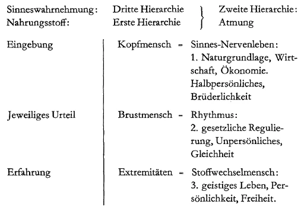

Mit Bezug auf alles dasjenige, was in tieferem Sinne mit der Auffassung des sozialen Lebens in derGegenwart zusammenhängt, scheint eine Betrachtung nützlich, die sich anschließen kann an unsere letzten Darstellungen über Goethe, welche wir im Zusammenhange mit der Darstellung unserer «Faust»-Szene gepflogen haben. Ein solches Besprechen scheint mir deshalb nützlich zu sein, weil gerade in bezug auf das soziale Leben der Gegenwart das 19. Jahrhundert einen außerordentlich bedeutsamen Wendepunkt in der Entwickelung der Menschheit bildet. Die Denkweise der Menschen hat sich viel mehr, als man gewöhnlich meint, gerade in der Mitte des 19. Jahrhunderts sehr, sehr umgeändert. Nun könnte man ja gewiß, wenn man auf diese Wendung hinweisen wollte, auch andere als gerade deutsche Geister als Ausgangspunkt nehmen; man könnte vielleicht Shaftesbury oder Hemsterhuis nehmen. Allein, würde man den englischen oder den holländischen Geist als Ausgangspunkt nehmen, Shaftesbury oder Hemsterhuis, so würde man — und das darf ganz objektiv gesagt werden - wohl kaum so tief schürfen können in bezug auf alles das, was zum Verständnisse des einschlägigen Themas führt, wie gerade in Anlehnung an den Goetheanismus. Und in unserer Gegenwart, wo sich so vieles, mehr und gründlicher als man heute denkt, gerade zur Vernichtung desjenigen anschickt, was aus diesem mitteleuropäischen Geiste geboren ist, mag es nicht unnützlich sein, an diese Dinge anzuknüpfen, die wohl in ganz anderer Weise in der Menschheit werden fortleben müssen, als sich die meisten auch heutigen Deutschen etwa vorstellen. ^r32xie

Man muß ja doch, wenn man ehrlich und unbefangen auf die Gegenwart hinsieht, bei einem Ausspruche wie dem von Herman Grimm, also eines hervorragenden Geistes, der noch nicht sehr lange zurückliegt, heute etwas Bedrückendes empfinden — man braucht dazu wahrhaftig nicht Deutscher zu sein —, wenn man einiges Gefühl für mitteleuropäische Kultur hat. Herman Grimm sagte einmal, daß es vier Geister gebe, vier Persönlichkeiten, zu denen der Deutsche hinaufschaut, wenn er gewissermaßen die Richtung seines Lebens empfangen will, und er nennt als diese vier Geister Luther, Friedrich den Großen, Goethe und Bismarck. Grimm sagt: Wenn der Deutsche nicht mehr hinaufblicken kann zu der richtunggebenden Kraft dieser vier Geister, dann fühlt er sich gewissermaßen ohne Halt und verlassen im Zusammenhange der Nationen der Welt. - Man kann heute mit einer gewissen Bedrücktheit diesen Ausspruch hören, an dessen Richtigkeit viele - ich gehörte nicht zu diesen - in den neunziger Jahren durchaus nicht gezweifelt haben. Allein man muß sich ja doch folgendes gestehen, gerade einem solchen Ausspruch gegenüber: Luther lebt eigentlich nicht wesenhaft in den Traditionen des deutschen Wesens. Goethe ist im Grunde genommen niemals wirklich lebendig geworden, das haben wir ja immer wieder betonen müssen, und Friedrich der Große und Bismarck gehören einem Werke an, das heute aus der Welt geschafft ist. So daß der Zeitpunkt eingetreten sein würde, wo sich gerade der mitteleuropäische Deutsche, der Deutsche überhaupt, unter den Nationen der Welt ohne Halt und verlassen fühlen müßte. Man fühlt heute nicht gründlich genug, um so etwas wirklich in der Seele ganz auszuschöpfen. Man ist zu oberflächlich. Allein, zu denken wenigstens sollte eine solche Tatsache doch den Menschen geben: die Tatsache, daß etwas vor noch nicht ganz drei Jahrzehnten für einen erleuchteten Geist eine Selbstverständlichkeit war, was heute eine Unmöglichkeit ist. Würde die gegenwärtige Menschheit nicht so oberflächlich sein, so würde in der Tat manches viel tiefer gefühlt werden, als es heute geschieht, wo einem über das Nichtfühlen dessen, was durch die Welt pulsiert, zuweilen das Herz brechen möchte. ^tr8zsf

Es fällt der Blick, wenn man rückgängig die Entwickelung der Menschheit über das 19. Jahrhundert in das 18. Jahrhundert hinein betrachtet, auf einen großen Moment. Es war jener Moment, welcher in Schiller gewirkt hat, als er seine «Briefe über die ästhetische Erziehung des Menschen» schrieb, jener Moment, wo sich Goethe angeregt hat durch dasjenige, was in der Zeit, als Schiller die «Briefe über ästhetische Erziehung des Menschen» schrieb, dazumal zwischen Schiller und Goethe verhandelt worden war. Dadurch hat sich Goethe veranlaßt gefühlt, dann seinerseits den Impuls, der in Schillers Ästhetischen Briefen lebt, in seinem «Märchen von der grünen Schlange und der schönen Lilie» auf seine Art auszuführen. Sie können den Zusammenhang zwischen Schillers Ästhetischen Briefen und Goethes «Märchen von der grünen Schlange und der schönen Lilie» in einem der Aufsätze meines letzten kleinen Goethe-Büchelchens nachlesen. Ich will heute nur so viel davon erwähnen, als zu unserer Betrachtung notwendig ist. ^tsnuxt

Schiller wollte mit seinen «Briefen über ästhetische Erziehung des Menschen» nicht nur einen literarischen Aufsatz schreiben, sondern er wollte im Grunde genommen eine politische Tat dadurch tun. Der Anfang der «Briefe über ästhetische Erziehung» verrät das ja sogleich. Es wird angeknüpft an die Französische Revolution, und es wird sozusagen von Schiller angestrebt, in seiner Art, von seinem Bildungsund Gesichtspunkte aus dasjenige zu sagen, was dem Menschen durch den Kopf gehen kann durch das Wollen aus der Französischen Revolution heraus, aus der Revolution vom Ende des 18. Jahrhunderts heraus überhaupt. Schiller versprach sich zunächst von einer großen politischen Umwälzung, von der sich die französischen Revolutionäre alles versprochen hatten, nichts Besonderes. Er versprach sich viel mehr etwas von einer durchgreifenden Selbsterziehung des Menschen. Und von dieser notwendigen, zeitgeschichtlich notwendigen Selbsterziehung des Menschen wollte er in seinen «Briefen über die ästhetische Erziehung des Menschen» sprechen. ^pityvs

Stellen wir den Grundgedanken dieser «Briefe über die ästhetische Erziehung des Menschen» noch einmal vor unsere Seele hin. Wir haben es ja schon öfter getan. Schiller will die Frage in seiner Art beantworten: Wie kommt der Mensch zu einer wirklichen Freiheit im sozialen Zusammenleben mit andern Menschen? Schiller würde sich nie etwas versprochen haben davon, daß bloß die sozialen Einrichtungen, in denen der Mensch lebt, irgendwie gestaltet werden, um den Menschen zur Freiheit zu führen. Schiller verlangte vielmehr, daß der Mensch selber durch innere Arbeit an sich, durch Selbsterziehung, zu diesem Stande der Freiheit innerhalb der sozialen Ordnung komme. Schiller meinte gewissermaßen, der Mensch müsse selbst erst innerlich frei werden, bevor er die Freiheit nach außen hin realisieren könne. Und so sagte sich Schiller: Der Mensch steht eigentlich zwischen zwei Trieben mitten drinnen. Er steht auf der einen Seite gegenüber dem Trieb, der aus der physischen Natur kommt — Schiller nennt ihn den Trieb der Notdurft -, alldem, was die sinnliche Natur des Menschen selber an Begierden und so weiter hervorbringt. Das rechnet Schiller zu dem sinnlichen Triebe, zu dem, wozu der Mensch durch eine gewisse bloß physische Notwendigkeit gedrängt wird. Und er sagte sich: Wenn der Mensch diesem Trieb folgt, so kann er nimmermehr frei sein, denn er folgt eben nur aus einer physischen Notwendigkeit diesem sinnlichen Triebe. ^7gjk5n

Dem sinnlichen Triebe steht ein anderer gegenüber; das ist der Trieb der Vernunftnotwendigkeit, der logischen Notwendigkeit, der Denknotwendigkeit. Diesem Trieb der Vernunftnotwendigkeit zu folgen, kann sich der Mensch gewissermaßen als dem andern Pol seines Wesens nun auch überlassen. Aber ein richtig freier Mensch kann er auch dadurch nicht sein. Denn wenn er logisch der Vernunftnotwendigkeit folgt, folgt er eben einer Notwendigkeit. Und auch wenn diese Vernunftnotwendigkeit sich in einem äußeren Staats- oder ähnlichen Gesetze konsolidiert, festsetzt, so folgt der Mensch, wenn er diesem Gesetze folgt, auch einer Notwendigkeit. Er ist also auf keinen Fall, indem er seiner Vernunft folgt, ein freies Wesen. Der Mensch ist also hineingestellt zwischen Vernunft und Sinnlichkeit. Folgt er der Sinnlichkeit, so folgt er der Notwendigkeit, nicht einer Freiheit. Folgt er der Vernunft, so folgt er auch der Notwendigkeit, wenn auch einer geistigen Notwendigkeit, aber eben doch einer Notwendigkeit. Er ist nicht ein freier Mensch, Frei sein kann der Mensch im Sinne Schillers nur, wenn er weder einseitig dem sinnlichen Trieb noch einseitig dem Vernunfttrieb folgt, sondern wenn er es dahin bringt, daß er seinen Vernunfttrieb seiner Menschlichkeit annähern kann, wenn er es so weit bringt, daß er nicht nur wie ein Sklave sich der logischen oder gesetzmäßigen Notwendigkeit unterwirft, sondern wenn er den Inhalt des Gesetzes, den Inhalt der Vernunftnotwendigkeit zu seinem eigenen Wesen macht. ^8hi6cl

In dieser Beziehung ist Schiller tatsächlich zum Beispiel Kant gegenüber, dem er sonst in manchem — man darf sagen, zum Unheile Schillers - folgte, ein viel freierer Geist. Denn Kant betrachtete das Folgen der Vernunftnotwendigkeit, die Hingabe an die Vernunftnotwendigkeit gerade als das Höchste, das der Mensch anstreben kann; die absolute Unterwerfung unter das, was Kant die Pflicht nennt, das heißt unter die Vernunftnotwendigkeit, das gilt eben Kant als das Höchste im Menschen. Schiller sagt: «Gern dien’ ich dem Freunde, doch tu ich es leider mit Neigung, und so fürchte ich, daß ich nicht tugendhaft bin», denn Kant, meint Schiller, würde fordern, daß es Pflicht ist, dem Freunde zu dienen. «Pflicht, du erhabener großer Name», sagt Kant, das einzige Mal gewissermaßen, wo er poetisch wird, «der du nichts bei dir führst, was Einschmeichelung und dergleichen heißt...» Schiller sagt: «Gerne dien’ ich den Freunden, doch tu’ ich es leider mit Neigung. Und so wurmt es mir oft, daß ich nicht tugendhaft bin.» Satirisch sagt er das Kant gegenüber. Also man muß so weit mit seiner Menschlichkeit kommen, daß man dasjenige, was der unfreie Mensch als Inhalt eben gegenüber der Pflicht, dem kategorischen Imperativ, vollbringt, aus Neigung, aus Liebe, aus innerer Selbstverständlichkeit tut. Das ist das eine. ^jpso6d

Schiller will die Vernunftnotwendigkeit also ins Menschliche herunterziehen, damit der Mensch sich ihr nicht zu unterwerfen brauche, sondern diese Vernunftnotwendigkeit als das eigene Gesetz seines Wesens entfalten könne. Die Vernunftnotwendigkeit will er herunterrücken zum Menschen. Die sinnliche Notwendigkeit, den sinnlichen Trieb, will er heraufheben, er will ihn durchgeistigen, so daß der Mensch nicht mehr bloß dem folgt, wonach die Sinnlichkeit drängt, sondern daß er diese Sinnlichkeit verschönt, veredelt, daß er ihr folgen darf, weil er sie heraufgehoben hat zu seinem Gipfel. Indem sich in einem mittleren Zustand, meint Schiller, Sinnlichkeit und Vernunft treffen, wird der Mensch ein freies Wesen. ^ukkj21

Es scheint, als ob die heutige Menschheit nicht mehr so recht empfinden könnte, was Schiller empfunden hat, indem er diesen mittleren Zustand als das eigentlich Erstrebenswerte des Menschen hinstellte. Er stellte dann gewissermaßen den Idealzustand hin, in welchem immer erfüllt ist diese Durchdringung der Vernunftnotwendigkeit und der sinnlichen Notwendigkeit, und fand den Idealzustand im künstlerischen Schaffen und im künstlerischen Genießen. ^b0n77k

Das ist so recht bezeichnend für die Schiller-Goethe-Zeit, daß in der Kunst etwas gesucht wurde, wonach sich die übrige menschliche Tätigkeit richten müsse. Das ist der Gegensatz des Goetheanismus zu aller Philistrosität, daß in der wahren, echten Kunst etwas gesucht wird, was ein Idealzustand ist, dem nachgestrebt werden soll. Denn der Künstler schafft im sinnlichen Material. Selbst wenn er in Worten schafft, schafft er im sinnlichen Material. Und er würde schönes Zeug, höchstens symbolisches, abstraktes Zeug zusammenbringen, wenn er sich einer Vernunftnotwendigkeit im Schaffen überließe. Er muß, was er schaffen will, dem Stoffe und seiner Formung ablauschen. Er muß gerade die Sinnlichkeit vergeistigen, indem er den Stoff formt. Aber indem er den Stoff formt, muß er dem Stoff eine Gestalt geben, welche macht, daß der Stoff nicht mehr als Stoff wirkt, sondern daß er so wirkt, wie das Geistige wirkt. Also der Künstler schiebt Geistiges und Sinnliches in seiner Schöpfung ineinander. Wenn alles Wirken des Menschen in der Außenwelt so wird, daß der Mensch alles Pflichtgemäße, Gesetzgemäße aus eigener Neigung macht, wie man künstlerisch schafft, und wenn alles das, was Sinnlichkeit ist, so verrichtet wird, daß Geist drinnen lebt, dann ist für den einzelnen Menschen, aber auch für Staat und soziale Struktur die Freiheit erreicht im Schillerschen Sinne. ^dpvwff

Das heißt, Schiller frägt: Wie müssen die verschiedenen Seelenkräfte im Menschen zusammenwirken — der Vernunftzustand, der Sinneszustand, der ästhetische Zustand -, wenn der Mensch als ein freies Wesen innerhalb der sozialen Struktur stehen soll? In einem gewissen Zusammenwirken der Seelenkräfte suchte Schiller dasjenige, was angestrebt werden soll. Und er glaubte, daß wenn solche Menschen, in denen die Vernunftnotwendigkeit die sinnliche Notwendigkeit durchdringt, und die sinnliche Notwendigkeit vergeistigt wird durch die Vernunftnotwendigkeit, wenn solche Menschen eine soziale Ordnung bilden, so wird ein guter Zustand dieser sozialen Ordnung die notwendige Folge sein. ^0e152m

Goethe sprach viel mit Schiller, korrespondierte viel mit Schiller in der Zeit, als dieser die Ästhetischen Briefe verfaßte. Goethe war ein ganz anderer Mensch als Schiller. Schiller war von gewaltiger innerer dichterischer Leidenschaft, aber zu gleicher Zeit ein scharfer Denker. Goethe war nicht in dem Sinne scharfer, abstrakter Denker wie Schiller, war sogar von geringerer dichterischer Leidenschaft, aber er war ausgerüstet mit dem, was Schiller gerade fehlte, was Schiller nicht hatte: mit durchgreifenden vollmenschlichen, harmonischen Instinkten, vergeistigten Instinkten. Schiller war der reflektierende Mensch, der rationalistische Mensch, Goethe war der Instinktmensch, aber der vergeistigte Instinktmensch. Wie sie sich so gegenüberstanden, Schiller und Goethe, das wurde für Schiller selber zum Problem. Lesen Sie den schönen Aufsatz, den Schiller geschrieben hat über «Naive und sentimentalische Dichtung», so werden Sie immer das Gefühl haben, Schiller hätte ebensogut, wenn er persönlich hätte werden wollen, schreiben können: Über Goethe und mich Über Goethe und Schiller. - Denn der naive Dichter ist Goethe, der sentimentalische Dichter ist Schiller. Er beschreibt eigentlich in diesem Aufsatz über naive und sentimentalische Dichtung nur sich selbst und Goethe. ^3lhmip

Goethe, der Instinktmensch war, dem kam die Sache nicht so einfach vor. Er verhandelte, wie ich eben sagte, viel mit Schiller, während dieser die Ästhetischen Briefe schrieb, über dieses Problem. Jedes abstrakt-philosophische Reden, schon ein solches über Vernunftnotwendigkeit, sinnliche Notwendigkeit und ästhetischen Zustand — was ja schließlich auch Abstraktionen sind, wenn man diese Dinge kontrastiert —, jedes solche «Philosopheln» war Goethe eigentlich im Innersten doch zuwider. Er ließ sich dazu herbei, weil er für alles Menschliche empfänglich war, und weil er sich sagte: So und so viele Menschen treiben eben Philosophiererei, also muß man sich auf so etwas schon einlassen. — Er war nie ganz absprechend. Das zeigt sich am besten, wenn er in die Notwendigkeit versetzt wird, über Kant zu reden. Da war Goethe in einer ganz besonderen Lage. Kant galt Schiller und einer ganzen Anzahl anderer Menschen als der größte Mann seines Jahrhunderts. Goethe konnte das eben nicht verstehen, daß Kant als der größte Mann seines Jahrhunderts gelten sollte. Aber er war durchaus nicht intolerant, er war nicht ein Mensch, der nur auf sein eigenes Urteil eigensinnig etwas gab. Goethe sagte sich: Wenn so viele Menschen in Kant so viel finden, dann muß man sie halt gehen lassen, ja, man muß sich sogar anstrengen, dasjenige, was man nicht sehr bedeutend findet, vielleicht doch nach einer geheimen Bedeutung einmal zu erforschen. — Ich habe das Exemplar der «Kritik der Urteilskraft», das Goethe gelesen hat, in. der Hand gehabt; da hat er bedeutende Stellen angestrichen. Man sieht, wie Goethe sich bestrebt hat, hineinzukommen gerade in das Lesen der Kantschen «Kritik der Urteilskraft». Allein, ziemlich vor der Mitte schon werden die Striche dann seltener, und zuletzt versiegen sie ganz. Man sieht, zu Ende ist er nicht gekommen. ^zq3g92

Und wenn das Gespräch auf Kant kam, da ließ er sich auch nicht so ganz auf den wirklichen Inhalt eines solchen Gespräches ein. Es war ihm unangenehm, in philosophischen Abstraktionen über die Welt und ihre Geheimnisse zu reden. Und so war es ihm auch klar, daß man so einfach nicht wegkommt, wenn man den Menschen in seiner Entwickelung von der Notwendigkeit zur Freiheit auffassen will, wie Schiller das getan hat. Sehen Sie, es liegt etwas außerordentlich Großes in diesen Ästhetischen Briefen. Dieses Große erkannte Goethe an. Aber es war ihm zu einfach. Es war ihm überhaupt zu einfach, diesen komplizierten Menschen, namentlich den komplizierten Seelenmenschen auf drei Kategorien zurückzuführen: Vernunftnotwendigkeit, ästhetischen Zustand, sinnliche Notwendigkeit. Ihm war viel, viel mehr in dieser menschlichen Seele, und die Dinge ließen sich auch für ihn nicht so nebeneinanderstellen. ^jea1x9

Daher wurde er angeregt, das «Märchen von der grünen Schlange und der schönen Lilie» zu schreiben, wo nicht drei, sondern etwa zwanzig Seelenkräfte sind, die nicht in Begriffe gefaßt sind, sondern in vieldeutigen, bildhaft wirkenden Gestalten, die dann gipfeln in dem goldenen König, der die Weisheit repräsentiert — nicht symbolisiert, sondern repräsentiert —, dem silbernen König, der den Schein repräsentiert, dem ehernen König, der die Gewalt repräsentiert, und der sie krönenden Liebe. Aber alles andere sind auch Seelenkräfte; Sie brauchen das nur in meinem Aufsatze nachzulesen. ^oilggd

So wurde Goethe angeregt, diesen Weg des Menschen von der Notwendigkeit zur Freiheit auch vor seine Seele hinzustellen. Für ihn wurde das Problem nur ungeheuer viel komplizierter. Er war der vergeistigte Instinktmensch. Schiller war der - lassen Sie mich den Ausdruck gebrauchen, Sie werden ihn nicht mißverstehen — versinnlichte Verstandesmensch; nicht ein gewöhnlicher Verstandesmensch, sondern der versinnlichte Verstandesmensch. ^e1p1a4

Nun, wenn man ehrlich die Zeitentwickelung ins Auge faßt, so kann man sagen: Solche Betrachtungsweise, wie sie da jeder in seiner Art, Schiller auf der einen Seite abstrakt-philosophisch, Goethe imaginativ-künstlerisch gepflogen haben, solche Betrachtungsweise, ganz abgesehen von der Form, ist auch ihrem Inhalte nach dem heutigen Menschen wenig gelegen. Ein sehr naher älterer Freund von mir, Karl Julius Schröer, der auch einmal Prüfungskommissär für Prüfungskandidaten des Realschullehramtes war, wollte über Schillers Ästhetische Briefe diese Leute prüfen, die dann Kinder von zehn bis achtzehn Jahren unterrichten sollten. Ja, die haben einen reinen Aufruhr gemacht! Leute, die es ganz selbstverständlich gefunden hätten, daß man sie über Plato gefragt hätte, daß sie die platonischen Gespräche hätten interpretieren sollen, solchen Leuten lag es ganz ferne, irgendwie etwas zu wissen von Schillers «Briefen über ästhetische Erziehung», die einen Höhepunkt der neueren Geistesbildung darstellen. ^4u444p

Nun, die Sache ist aber doch so, daß die Mitte des 19. Jahrhunderts viel mehr, als man heute noch denken kann, einen ungeheuer tiefen Einschnitt der menschlichen Geistesgeschichte darstellt. Jenseits, nach vorne, liegt auch dasjenige, was noch in Schiller und Goethe sich darstellt, und hinter der Mitte des 19. Jahrhunderts, bis zu uns herüber, liegt eben doch etwas ganz anderes, was das Vorhergehende nur in sehr geringem Maße verstehen kann. Es wäre viel besser, wenn sich die heutigen Menschen einfach gestehen würden, daß wir eine Art von Abgrund überschritten haben, der uns nur dann, wenn wir ganz bestimmte Verständnismittel anwenden, auch die nahe Vergangenheit vor der Mitte des 19. Jahrhunderts verständlich macht. Und man darf sagen: Dasjenige, was wir heute soziale Frage nennen - jetzt nicht im engen Sinne, sondern im weitesten Sinne aufgefaßt, wie sie eigentlich noch nicht aufgefaßt wird von der Menschheit, wie sie aber aufgefaßt werden soll und auch nach und nach aufgefaßt werden muß -, das kannte man vor der Mitte des 19. Jahrhunderts noch gar nicht. Das ist erst, so wie es in das Bewußtsein der Menschheit eingetreten ist, in der zweiten Hälfte des 19. Jahrhunderts geboren. Und ein Verständnis für diese Tatsache gewinnt man nur, wenn man sich frägt: Warum ist in solchen repräsentativen, signifikanten Betrachtungen, wie sie Schiller angestrebt hat in seinen Ästhetischen Briefen, wie sie Goethe bildhaft vor die Seele gestellt hat in seinem «Märchen von der grünen Schlange und der schönen Lilie», warum ist darinnen, trotzdem Goethe mit seinem Märchen auch deutlich auf politische Gestaltungen hinweist, gar nichts von jener eigentümlichen Art, wie wit heute über die soziale Struktur der Menschen denken müssen? Und warum sind wir heute darauf angewiesen, über diese soziale Struktur in dem Sinne, wie ich das oftmals hier auseinandergesetzt habe, uns wirkliche Gedanken zu machen? Wir können eben nicht mehr ganz so sein, wie Schiller und Goethe waren. Wir betreiben am wenigsten richtig Goetheanismus, wenn wir Goethe nicht weiterbilden wollen, sondern ihn nur nachäffen wollen. Wenn man sich mit innerem Verständnis einläßt sowohl auf Schillers Ästhetische Briefe wie auf Goethes «Märchen von der grünen Schlange und der schönen Lilie», so merkt man, daß da etwas von einer ungeheuren Geistigkeit drinnen ist, die seither die Menschheit verlassen hat, die seither nicht mehr da ist. Da waltet etwas, wofür die wenigsten Menschen heute eigentlich so tichtige Empfindung haben. Wer Schillers Ästhetische Briefe liest, müßte die Empfindung haben: Da waltet noch ein anderes scelischgeistiges Element in der Schreibart selbst, als es heute auch bei den hervorragendsten Geistern waltet, und zu glauben, daß heute jemand so unmittelbar etwas schreiben könnte wie Goethes «Märchen von der grünen Schlange und der schönen Lilie», ist überhaupt eine Dummheit. Denn diese Geistigkeit ist so nicht mehr da seit der Mitte des 19. Jahrhunderts. Das spricht nicht unmittelbar zum heutigen Menschen, das kann nur eigentlich sprechen durch das Medium der Geisteswissenschaft, die den Gesichtskreis erweitert, und die sich auch in Früheres wirklich einlassen kann. Und es wäre eigentlich am besten, wenn sich die Menschen gestehen würden: Ohne Geisteswissenschaft verstehen sie Schiller und Goethe gar nicht. Jede «Faust»-Szene kann Ihnen das beweisen. ^lu0ai3

Und wenn man dem nachgeht, was da waltet, nicht so sehr in den Behauptungen, sondern in der Art, wie diese Behauptungen aufgestellt werden, dann findet man: Es ist in jener Zeit im Menschen noch der allerletzte Rest, der letzte Nachklang von der alten Geistigkeit. Man redet da noch aus der alten Geistigkeit heraus. Die alte Geistigkeit ist letzten Endes erst verrauscht und verraucht um die Mitte des 19. Jahrhunderts, und um die Mitte des 19. Jahrhunderts beginnen die Menschen auf dem ganzen Erdenrund so zu denken, daß in dem Denken nicht mehr der Geist als solcher waltet, sondern nur das Menschliche, wenn sie sich sich selbst überlassen. Natürlich ist das nur im allgemeinen richtig. Bei Schiller und Goethe, bei ihren Zeitgenossen ebenso, waltete noch etwas von Nachklängen der alten, man darf sagen atavistischen Geistigkeit. Das geht ja nur langsam und allmählich verloren. Wenn man immer wieder den Zeitpunkt angibt, mit der Entstehung des Christentums sei die alte Geistigkeit zu Ende gewesen, so bedeutet das doch nur eine Etappe; der letzte Ausläufer liegt in dem, was um die Wende des 18. zum 19. Jahrhundert in solchen Hervorbringungen gelebt hat wie in den beiden heute angeführten. Er lebte im Menschen so, daß derjenige, der abstrakt dachte wie Schiller, in dem abstrakten Denken die Geistigkeit drinnen hatte, und bei dem, der vergeistigte Instinkte hatte wie Goethe, da lebte das in den vergeistigten Instinkten drinnen. Aber es lebte in irgendeiner Weise. Jetzt muß es auf geisteswissenschaftlichem Wege gesucht werden, jetzt muß der Mensch sich eben aus Freiheit zur Geistigkeit durchringen. Das ist es, worauf es ankommt. Und ohne das Verständnis dieses Einschnittes in der Mitte des 19. Jahrhunderts kommt man nicht zu einer wirklichen Erfassung dessen, was heute von besonderer Wichtigkeit ist. Denn nehmen Sie nur einmal diese Tatsache: Schiller sieht auf die soziale Struktur hin. Im Hinblick auf die Französische Revolution schreibt er dann seine Ästhetischen Briefe; aber er blickt auf den Menschen, indem er die Frage beantworten will: Wie soll der soziale Zustand sich gestalten? — Das ist nicht die soziale Frage im heutigen Sinne. Das ist eine bloß humanistische Auffassung, die Schiller für die ganz allgemeine Menschheit verwendet, eine rein humanistische Auffassung. ^trpl7o

Seit der Mitte des 19. Jahrhunderts nun wird der Blick nicht mehr so sehr auf den Menschen gelenkt, sondern auf das Außermenschliche. Und heute ist es ja allgemein üblich, wenn über die soziale Frage gesprochen wird, den individuellen Menschen mit seinen inneren Kämpfen, mit dem, was er durch eigene Selbsterziehung aus sich macht, eigentlich auszuschalten und auf die Zustände, auf dasjenige, was eben in der sozialen Struktur liegt, zu sehen. Der Mensch erwartet heute das, was Schiller von der Selbsterziehung erwartet, von der Umgestaltung der äußeren Verhältnisse. Schiller sagte: Werden die Menschen, wie sie werden können im mittleren Zustande, dann werden sie von selbst eine richtige soziale Struktur schaffen. Heute sagt der Mensch: Richten wir eine wirkliche, richtige soziale Struktur ein, dann wird der Mensch darinnen so, wie er werden soll. ^0gggny

So hat sich im Verlaufe von kurzer Zeit die ganze Empfindungsweise, die Form der Empfindungsweise wirklich umgedreht. Das ist sehr wichtig, daß man das ins Auge faßt. Ein Schiller, ein Goethe, sie würden nicht haben glauben können, daß der selbsterzogene Mensch zu einer richtigen sozialen Struktur im Zusammenleben führt, wenn sie nicht im Menschen selbst das Allgemein-Menschliche im Zusammenleben noch gefühlt hätten. Sie haben gewissermaßen die menschliche Gesellschaft im einzelnen Menschen mitgefühlt. Aber es war nicht mehr wirksam. Man konnte gewissermaßen zur Zeit Schillers und Goethes geistvolle, schöne Betrachtungen über die beste Selbsterziehung anstellen — es war eben der Nachklang des alten atavistischen Lebens, es war gewissermaßen ein Bild des alten atavistischen Lebens, aber es lebte nicht mehr richtige Impulsivität darin. ^wq3qe2

Ebensowenig lebt heute in dem, was die Menschen so ausdenken über die besten sozialen. Verhältnisse, in denen die Menschen leben sollen, schon irgend etwas, was soziale Impulsivität hat. Bei Schiller war die menschliche Gesellschaft im einzelnen Menschen noch vorhanden für die Betrachtung, aber nicht mehr wirksam. Heute ist in der Hypothese, in der ausgedachten gesellschaftlichen sozialen Struktur, der Mensch vorhanden, aber nicht wirksam. Es muß der Mensch erst wiederum gefunden werden in der Betrachtung der Außenwelt, in dem Hinblick auf die Außenwelt. Und zwar in durchgreifendem Sinne muß der Mensch gefunden werden. Schiller glaubte noch, die menschliche Gesellschaft im einzelnen Menschen zu finden. Wir müssen auf die menschliche Gesellschaft überhaupt, auf die Welt blicken und draußen uns selbst, den Menschen finden können. ^imqe7i

In durchgreifendem Sinne tut das nur die wirkliche Geisteswissenschaft. Nehmen Sie meine «Geheimwissenschaft im Umriß», nehmen Sie dasjenige, was heute noch am allermeisten Anstoß erregt, die Entwickelungslehre, Saturn-, Sonnen-, Monden-, Erdenentwickelung: überall ist der Mensch drinnen. Denken Sie, wie die übrige Betrachtungsweise, die kosmologische Betrachtung, den Menschen verloren hat. Denken Sie an die groteske - wie Herman Grimm richtig sagt -, wahnsinnige Kant-Laplacesche Theorie! Denken Sie: Da ist ein allgemeiner Weltennebel in langsamer Bewegung, da entwickelt sich das nachher weiter, was da in rotierender Bewegung ist, und zuletzt tritt der Mensch wie aus der Pistole geschossen auf. Nehmen Sie die Evolution, wie sie die Geisteswissenschaft lehren muß, nehmen Sie den ersten Zustand, der beschrieben werden kann, den Saturnzustand. Sie haben die ersten Anlagen des Menschen drinnen; nirgends haben Sie die bloße abstrakte Welt, den bloßen abstrakten Kosmos, überall haben Sie irgendwie den Menschen in der Sache drinnen liegen. Der Mensch ist gar nicht abgesondert von der Welt. Das ist der Anfang dessen, was aus ganz dunkeln, aus ganz finstern Impulsen heraus die Zeit instinktiv will. Die Zeit vor der Mitte des 19. Jahrhunderts hat auf den Menschen geblickt und geglaubt, im Menschen die Welt zu finden. Die Zeit nach der Mitte des 19. Jahrhunderts will nur noch auf die Welt blicken. Aber das ist unfruchtbar. Das führt zuletzt zu geradezu menschenleeren Theorien, wenn nicht in allem Weltlichen schon der Mensch gefunden wird. Deshalb dient diese Geisteswissenschaft wirklich den sonst finstersten, aber berechtigten Instinkten. Sie ist, wenn ich den ekelhaften Journalistenausdruck gebrauchen darf, das wirklich Zeitgemäße, denn sie dient den Impulsen, welche die Zeit aus sich selbst hervortreibt. Das, was die Menschen wollen, ohne daß sie wissen, was sie wollen, das wird durch die Geisteswissenschaft erfüllt: Hinzublicken auf die Außenwelt und in der Außenwelt den Menschen zu finden. Das ist es aber, worauf es ankommt. Und das ist es, was heute noch verpönt, ja verabscheut wird, was aber notwendig wird gepflegt werden müssen, wenn irgendein Heil in diesem Punkte in der Zukunft wirklich eintreten soll. ^7ucxnm

Solche Schriften wie Schillers Ästhetische Briefe soll der heutige Mensch aufnehmen, ich möchte sagen, um seinen Geist zu lockern, der sonst fest hereinversetzt ist in das materielle physische Dasein. Man wird freier im Geiste, wenn man diese Dinge auf sich wirken läßt. Aber man muß dann vorschreiten zur neuen Erfassung der Welt. Man kann nicht stehenbleiben bei diesen Dingen. Man darf heute Schiller, man darf Goethe im Sinne des Goetheanismus verstehen, aber nicht so, daß man bei Schiller und Goethe stehenbleibt, sondern daß man das Fruchtbare in ihnen gerade mit Hilfe dessen erkennt, was die Geisteswissenschaft heute bietet. ^sp7zim

Und so muß eine Erweiterung auch der Menschenlehre eintreten, wenn man in den äußeren Verhältnissen, in der Außenwelt nun den Menschen finden will. Das, worauf es ankommen wird, wird sein: den äußeren sozialen Organismus, in dem der Mensch drinnen lebt, wirklich zu verstehen. Aber man wird ihn erst verstehen, wenn man den Menschen drinnen schaut in dem sozialen Organismus. Der Mensch ist ein dreigliedriges Wesen. Er betätigt sich auch in allen Zeitaltern in dreigliedriger Weise, mit Ausnahme unseres Zeitalters, in welchem der Mensch, weil er gerade auf sich selbst, auf den einzigen Punkt des eigenen Selbstes sich stellen soll im Bewußtseinszeitalter, gewissermaßen alles auf eine einzige Kraft in ihm konzentriert; sonst betätigt er sich auch in der Menschheitsentwickelung in dreigliedriger Weise. Denn heute hat jeder eigentlich das Gefühl, daß ihm als Mensch alles aus einem Einzigen fließe. Er denkt: Nun, wenn mir irgendeine Frage vorgelegt wird, wenn mir das Leben irgendeine Aufgabe stellt, dann urteile ich als Mensch so aus mir heraus. — Das ist aber eigentlich nicht die ganze menschliche Wesenheit, aus dem heraus da geurteilt wird, sondern die menschliche Wesenheit hat erstens den Menschen in der Mitte, dann darüber etwas und darunter etwas. Das, wasin der Mitte ist, ist das jeweilige Urteilen, aus Urteilen handeln. Dasjenige, was darüber ist, ist die Eingebung, das, was man durch Religion oder sonstige geistige Eingebung als etwas Höheres, Übersinnliches anschaut. Und dasjenige, was unter dem jeweiligen Urteil ist, ist die Erfahrung, ist die Summe der Erlebnisse: Eingebung - jeweiliges Urteilen - Erfahrung. ^1lxpe6

Beides berücksichtigt heute der Mensch wenig. Eingebung: alter Aberglaube, muß überwunden werden! Erfahrung berücksichtigt heute der Mensch auch wenig, sonst würde er den Unterschied zwischen jugendlichem Nichtswissenundälterem Wissen-durch-Erfahrung mehr berücksichtigen. Er berücksichtigt ihn allerdings nicht nur im Bewußtsein nicht, sondern auch in der Praxis nicht, Er wird nämlich nichts erfahren, der heutige Mensch, aus dem Grunde, weil er nicht an die Erfahrung glaubt. Die meisten Menschen sind heute, wenn sie graue Haare und Runzeln haben, auch nicht viel gescheiter, als wenn sie zwanzig Jahre alt sind, weil der Mensch nicht an die Erfahrung glaubt. Man wird nämlich wirklich im Leben immer gescheiter, und man bleibt doch immer dumm; aber Erfahrung sammelt man, und die Erfahrung ist der andere Pol von der Eingebung. Die Eingebung kann in jedem Lebensalter kommen; die Erfahrung kann nur kommen, indem man durch die Zeit hindurchlebt zwischen Geburt und Tod. Dazwischen steht dann das jeweilige Urteil. ^r5d4gt

Ich habe es oft gesagt, heute liest man Urteile, kritische Urteile von den jüngsten Leuten, die sich gar nicht in der Welt umgesehen haben. Da kommt es sogar vor, daß alte Menschen etwas produzieren, dicke Bücher schreiben, und die jüngsten Dachse beurteilen sie kritisch. Das ist nicht die Methode, durch die man wirklich als Mensch vorwätrtskommt. Die Methode, durch die man als Mensch vorwärtskommt, ist diese, daß man sich an dem Alter aufrichtet, daß man ihm nachstrebt, daß man es für urteilsfähiger hält durch die Erfahrung. ^e479ov

Also der Mensch ist auch in der praktischen Betätigung ein dreigliedriges Wesen, und er ist in jeder Hinsicht ein dreigliedriges Wesen. Lesen Sie mein Buch «Von Seelenrätseln», so werden Sie finden der Eingebung entsprechend den Kopfmenschen, SinnesNervenmenschen, dem jeweiligen Urteile entsprechend den Brustmenschen, und der Erfahrung entsprechend den Extremitätenmenschen. Ich könnte auch sagen: den Menschen des Sinnes-Nervenlebens, den Menschen des rhythmischen Lebens und den Menschen des Stoffwechsels. Diese dreigliedrige Natur des Menschen berücksichtigt man heute nicht. Deshalb kommt man auch nicht zu dem entsprechenden kosmischen Korrelat. Man kann nicht zu dem entsprechenden kosmischen Korrelat kommen, weil man ja überhaupt vom Sinnlichen zu dem Übersinnlichen nicht aufsteigen will. Der Mensch ißt heute, das heißt, er vereinigt die äußeren Nahrungsmittel mit seinem Organismus, und er denkt: Nun ja, dadrinnen ist der Organismus, der verkocht so die Sache, nimmt sich so, was er braucht, heraus; das andere, nicht wahr, läßt er unverbraucht abgehen, und so geht die Geschichte weiter. Das auf der einen Seite. ^zgiy3i

Auf der andern Seite: Ich sehe mit meinen Sinnen in die Welt hinaus. Das Sinnliche nehme ich auf und verarbeite das verstandesmäßig, und das führe ich nun in die Seele hinein, wie die Nahrungsmittel in den Leib. Das, was da draußen ist, was Augen sehen, was Ohren hören, trage ich dann in mir als Vorstellung; das, was da draußen ist als Weizen, Fisch, Fleisch, was weiß ich, trage ich dann in mir, indem ich es dadrinnen verdaue, verkoche und so weiter. ^oeasab

Ja, dabei wird eben nicht berücksichtigt, daß alles, was Nahrungsstoffe sind, auch seine Innenseite hat. Das, was man sieht mit den äußeren Sinnen und was man erlebt mit den äußeren Sinnen an den Nahrungsmitteln, das hat keinen Bezug zu unserer tieferen Natur. Sie können mit dem, was Ihre Zunge schmeckt, was Ihr Magen verdaut, so verdaut, daß es nachkonstatierbar ist mit der gewöhnlichen heutigen Wissenschaft, Ihren täglichen Stoffwechsel besorgen, aber Sie können niemals den andern Stoffwechsel besorgen, der zum Beispiel dazu führt, daß Sie ungefähr im siebenten Jahre die ersten Zähne auswerfen und neue bekommen. Das, was diesen Stoffwechsel ausmacht, das liegt nicht in dem, was durch die gewöhnlichen Sinne aufgefaßt wird von den Nahrungsmitteln, sondern das liegt in den tieferen Kräften der Nahrungsmittel, die heute keine Chemie irgendwie an die Oberfläche bringt. Das, was der Mensch als Nahrungsmittel aufnimmt, das enthält eine tief geistige Seite, jene geistige Seite, die sich auch sehr stark im Menschen betätigt, aber nur wenn er schläft. In dem, was Ihre Nahrungsmittel sind, leben nämlich die Geister der höchsten Hierarchien, Seraphim, Cherubim, Throne. Ihre Nahrungsmittel haben eine äußere Seite, wenn Sie sie schmecken, wenn Sie sie auflösen in Pepsin oder Ptyalin; aber in diesen Nahrungsmitteln lebt etwas Weltgestaltendes, so weltgestaltend, daß in den Kräften, die da untersinnlich — werde ich besser sagen — in den Nahrungsmitteln leben, die Impulse sind für den Zahnwechsel, für die Geschlechtsreife, für die spätere Metamorphose der menschlichen Natur. Das lebt dadrinnen. Nur der tägliche Stoffwechsel wird besorgt durch das, was der Mensch durch äußere Wissenschaft kennt. Dieser Stoffwechsel, der durch das Leben geht, der wird durch die höchsten Hierarchien besorgt, die in den Nahrungsmitteln als Unterlagen drinnen sind. Und hinter dem, was die Sinne schauen, da breiten sich in Wirklichkeit aus die Wesen der dritten Hierarchie: Angeloi, Archangeloi, Archai. — So daß Sie sagen können: Sinneswahrnehmung: Dritte Hierarchie, Nahrungsstoff: Erste Hierarchie, und dazwischen ist die zweite Hierarchie, die lebt im Atmen, überhaupt in aller rhythmischen Tätigkeit des Menschen. ^kfei4e

Die Bibel hat das noch ganz richtig dargestellt. Diejenigen Geister, die die Elohim sind, mit Jahve, werden durch den Atem in die Menschen eingeführt. Die alte Wissenschaft wußte atavistisch diese Dinge noch ganz richtig. Da werden Sie, wenn Sie auf eine wirkliche Menschenkenntnis eingehen, auch in eine richtige Kosmologie hinausgeführt. ^gc4fxh

Diese Betrachtungsweise inauguriert erst wiederum die Geisteswissenschaft. Sie sucht den Menschen wiederum in der Außenwelt auf, macht die ganze Welt zum Menschen. Aber das kann man nicht, wenn man nicht den dreigliedrigen Menschen ins Auge faßt, wenn man nicht weiß, daß der Mensch wirklich eine Trinität ist. Heute ist Eingebung und Erfahrung unterdrückt. Der Mensch wird nicht gerecht der Eingebung und der Erfahrung. Er wird auch nicht gerecht dem, was in die Sinne geht, und er wird nicht gerecht dem, was in die Nahrungsmittel geht, denn im Verlaufe des Lebens sind ihm die Nahrungsmittel bloß das, was die äußeren Sinne darbieten. Das ist aber nur eine ahrimanische Verzerrung der Nahrungsmittel, das ist nicht ein Hinblicken auf das, was tiefer in allem Geschöpflichen lebt, wie zum Beispiel in den Nahrungsmitteln. Geisteswissenschaft führt nicht zur Verachtung der Materie, sondern zum Durchgeistigen der Materie. Und wenn irgend jemand auf die Nahrungsmittel mit Verachtung hinblicken würde, so müßte er es erleben, daß die Geisteswissenschaft ihm nun sogar groteskerweise sagt: Die höchsten Hierarchien, Seraphim, Cherubim und Throne, die leben gerade in den Nahrungsmitteln drinnen. ^w1o078

Also unser Zeitalter faßt zusammen in einer unklaren, chaotischen Weise den dreigliedrigen Menschen, macht ihn zum Monon. Praktisch, für die soziale Struktur, ist das Gegenbild [des dreigliedrigen Menschen] da, indem alles zum Monon staatlicher Gesetzlichkeit gemacht wird. Das ist das genaue Gegenbild. Alles soll aufgehen in die staatliche Gesetzmäßigkeit. Wir sehen also eine Trinität, welche sich aus drei Gliedern zusammensetzen soll: Erstens aus der Naturgrundlage des Lebens, aus allem Wirtschaftlichen des Lebens, Ökonomie. Zweitens aus 'der gesetzlichen Regulierung, die auch dem Mittleren des Menschen entspricht, dem Rhythmus. Und drittens dem geistigen Leben. Und wir sehen, wie sich dieses Dreifache vereinheitlichen will. Die Wirtschaft, das Ökonomische, soll allmählich dem Staat aufgebuckelt werden, der Staat soll der alleinige Unternehmer werden. Das geistige Leben ist ja schon vor langer Zeit überhaupt dem Staate aufgebuckelt worden. Dasselbe, was auf der einen Seite der Mensch, der sich nicht mehr versteht, darstellt, soll auf der anderen Seite der Staat darstellen, den man nicht mehr versteht, weil man nicht mehr den Menschen in der sozialen Struktur drinnen findet. Diese drei Glieder der sozialen Struktur, Wirtschaft, gesetzmäßige Regelung, geistiges Leben, sind so radikal voneinander verschieden wie Kopf, Brust und Unterleib. Wenn Sie den Staat mit der Wirtschaft belasten wollen, so bedeutet das dasselbe, wie wenn Sie mit Lunge und Herz essen wollten, statt mit dem Magen. Der Mensch gedeiht nur dadurch, daß seine drei Systeme außereinander sind und im Außereinander zusammenwirken. So kann auch der soziale Organismus nur gedeihen, wenn die drei Glieder als selbständige Glieder nebeneinander wirklich wirken und nicht zusammengepfercht werden in einen Monon. Denn aller gesetzlichen Regulierung, die im Menschen dem Rhythmus, dem Atmungssystem entspricht, das auch nur zwischen Bauch und Kopf reguliert, entspricht ein absolut unpersönliches Element, vor dem alle Menschen gleich sind. In dem Ausspruch: Vor dem Gesetz sind alle Menschen gleich -, drückt sich das auch aus; da ist nichts vom Menschen drinnen. Daher müssen es auch alle Menschen besorgen, daher allgemeine Vertretung auf diesem Gebiete, daher auch ein gewisses StehenbleibenWollen bei diesen Dingen; aber daher auch etwas, was nach beiden Seiten hin steril geblieben ist. Wir müssen atmen. Aber wenn nicht auf der einen Seite dem Prozeß des Atmens die Nahrung zugeführt wird und auf der andern Seite die Sinnesempfindung, dann sind wir nicht Menschen. Wir müssen einen Staat haben, der gesetzlich regelt in unpersönlichen Gesetzen. Wenn aber in diesen Staat nicht hineinwirkt das halb Persönliche der Ökonomie, wo der Mensch daran beteiligt ist, und das ganz Persönliche, nämlich für das Außenleben des Staates ganz persönliche Geistesleben, so ist der staatliche Organismus ebenso unmöglich, wie wenn der Mensch nur als Atmungsmensch leben wollte. So wenig der Magen beim gegenwärtigen Menschen das tun kann, was Herz und Lunge tun, und der Kopf seine Betätigung ausführen kann, wenn er auch Herz und Lunge wird, ebensowenig ist es möglich, wenn eine gesunde soziale Struktur eintreten soll, daß Sie dem Staate aufbuckeln die beiden andern Systeme: Das ökonomische System, bei dem der Mensch dabei sein muß, dessen Unternehmungen sich nicht ganz loslösen können vom Menschen, und das geistige Leben, das für den Staat wie für den Menschen so kommen muß, wie das, was er ißt, von der Natur aus von außen in den Menschen hereinkommt. Das muß eine neue Lehre werden, die als fundamental gelten muß: daß die soziale Struktur eine dreigliedrige ist. Sie können sich nicht hinstellen als Mensch in die Welt und nichts essen, sondern Sie müssen das Essen von außen hereinbekommen. Sie können den Staat nicht hinstellen in die Welt und ihm nicht seine Nahrung zuführen - es ist umgekehrt hier, deshalb habe ich auch umgekehrt geschrieben —- von dem geistigen Produzieren der Menschen. Das geistige Produzieren der Menschen ist für den Staat dasselbe, was die äußere physische Nahrung für den einzelnen individuellen Menschen ist. Und Sie können einen Staat nicht hinstellen, ohne ihm auf der andern Seite eine gewisse Naturgrundlage in der Wirtschaft zu geben. Denn die Wirtschaft ist für den Staat genau dasselbe, was beim einzelnen, individuellen Menschen das Element ist, welches dem Atmungsprozeß von der andern Seite zugeführt wird, was dem Menschen zugeführt wird durch die Sinneswahrnehmung. ^ycbt39

 ^jm7tyx

Sie sehen daraus, daß wirkliche Menschenerkenntnis und wirkliche Erkenntnis der sozialen Struktur sich gegenseitig bedingen, daß man zu dem einen nicht kommen kann ohne das andere. So wie der Mensch Kopfmensch, Brustmensch, Stoffwechselmensch ist, also Sinnes- und Nervenmensch, rhythmischer Mensch und Stoffwechselmensch ist, so ist der Staat nicht ein ganzer Organismus, sondern die soziale Struktur ist: Staat und Wirtschaft und geistiges Leben. ^apqkt2

Das muß geradezu das Einmaleins werden für die soziale Einsicht in die Zukunft. Und die Sünde, die in bezug auf den Menschen gemacht wird, indem man Eingebung und Erfahrung eliminiert, die wird heute gemacht von dem sozialistischen Denken, indem ignoriert wird auf der einen Seite das Halbpersönliche, in jenem sozialen Denken, in dem die Brüderlichkeit walten muß für sich; indem ignoriert wird auf der andern Seite das geistige Leben, in welchem die Freiheit walten muß, während auf dem unpersönlichen Gesetzeselemente die Gleichheit zu walten hat. ^f0sftm

Sie können in den Staat nicht die Brüderlichkeit hineinbringen; Sie können aber keine wirtschaftliche Organisation zustande bringen ohne die Brüderlichkeit. Das ist der große Irrtum des gegenwärtigen Sozialismus, daß er glaubt, durch staatliche Regelung, vor allen Dingen durch Sozialisierung der Produktionsmittel irgendwie eine gesunde soziale Struktur schaffen zu können. An alle Kräfte des sozialen Organismus muß appelliert werden, wenn eine gesunde soziale Struktur geschaffen werden soll. Da muß neben der Gleichheit, die heute einzig und allein angestrebt wird, die für alles Gesetzmäßige ganz richtig angestrebt wird, walten die Brüderlichkeit und die Freiheit. Aber sie können nicht walten, wenn nicht Dreigliedrigkeit eintritt. Sagt man: im Staate muß walten Freiheit, Gleichheit und Brüderlichkeit, und der Staat ist omnipotent, dann ist das dasselbe, als wenn man sagt: Du brauchst keinen Kopf und du brauchst keinen Magen, sondern du sollst nur Herz und Lunge haben, denn das Herz muß denken, und die Lunge muß essen oder trinken. Geradeso unsinnig, wie es ist, vom Herzen und der Lunge zu verlangen, daß sie denken und essen sollen, so unsinnig ist es, von einem omnipotenten Staatswesen zu verlangen, daß es Wirtschaft führt und daß es das geistige Leben versorgt. Das geistige Leben muß auf sich selbst gestellt sein und nur so zusammenwirken, wie der Magen mit dem Kopf zusammenwirkt und mit dem Herzen. Es wirken schon die Dinge im Leben zusammen, aber sie wirken nur dann richtig, wenn sie ihre individuelle Ausgestaltung bekommen, nicht wenn man sie abstrakt zusammenpfercht. Das ist es, was vor allen Dingen eingesehen werden muß, und ohne diese Einsicht kommt man sicher nicht weiter. Und daß diese Einsicht errungen werden muß, das beweisen gerade die Tatsachen der Gegenwart. Es ist im höchsten Grade bemerkenswert, wie die Menschen in der Gegenwart diesen Zusammenhang zwischen Materialismus auf der einen Seite und abstraktem Denken auf der andern Seite gerade in bezug auf die soziale Frage gar nicht sehen. ^ub1xol

Ein starker Grund für die Entstehung des Materialismus ist, daß sich der Staat nach und nach bemächtigt hat aller freikorporativen, schulmäßigen Institutionen. Wenn Sie zurückgehen in die Zeiten, in denen man noch aus atavistischem Empfinden heraus, das aus dem Hellsehen entsprang, die Dinge gegründet hat, da werden Sie sehen, wie man da noch gefühlt hat die Notwendigkeit des Zusammenwirkens der drei Glieder. Erst seit dem 16. Jahrhundert ist das allmählich ineinandergeflossen, mit der Zeit des Heraufkommens des Materialismus. Sehen Sie sich die Universitäten an in früheren Zeiten: sie waren freie Korporationen, und sie stellten sich ganz selbständig in die menschliche soziale Struktur hinein. Der Mensch des früheren Zeitalters, wenn er ein bedeutender Jurist werden wollte, ging an eine bedeutende juristische Universität, also sagen wir nach Padua; wenn er ein bedeutender Mediziner werden wollte, nach Montpellier oder nach Neapel; wenn er ein bedeutender Theologe werden wollte, an die Universität in Paris. Das gehörte nicht irgendeinem Staate an, das gehörte der Menschheit an, denn das stellte sich als ein selbständiges Glied hinein in den sozialen Organismus. Heute hilft es einem Menschen, der in der Schweiz lebt, nichts, wenn er ein bedeutender Mediziner in irgendeinem andern Lande wird, denn da ist er gar nichts in der Schweiz auf dem Gebiete der Medizin, denn heute hat dasjenige, was nur die Regulierung machen sollte, die wirtschaftliche Produktivität und auch die geistige Produktivität aufgesogen. Und damit ist ein ungesundes Element hineingekommen. Nicht wahr, der Mensch kann vergessen, daß er einen Kopf hat und daß er einen Magen hat. Er hat es vergessen in der neueren Wissenschaft, denn er behandelt sich so, als ob er nur ein Atmungsmensch wäre. Aber auf dem Gebiete der Wirklichkeit führt das nicht nur zu falschen Theorien, sondern zu falschen Institutionen und falschen Einrichtungen. Jede Schule, die unmittelbar nur unter der Gewalt des Staates steht, ist eine unmögliche Einrichtung. Das braucht man nicht zu durchschauen, wenn man eben kurzsichtig ist, aber trotzdem ist das eine unmögliche Einrichtung, die nach und nach zum Unheile führt. Jede Unternehmung, die über das bloß Regulierende hinausgeht, die produktiv sein will, ist, wenn sie vom Staate betrieben wird, Unheil. Das ist es, worauf es ankommt. Sie können in die Lunge nichts hineingießen, nicht einmal Wasser, wenn Sie Durst haben. Wenn es einmal passiert, dann sehen Sie, was das für Unheil anrichtet. ^cxwu4h

Aber heute gießt man in dasjenige, was nur die gesetzliche Regulierung des Daseienden übernehmen soll, alle möglichen Wirtschaftsunternehmungen hinein und auch sogar die Unternehmungen des geistigen Lebens. Man wird heute sogar als ziemlich verdreht angesehen, wenn man das einzig Elementare, fundamental Richtige auf diesem Gebiete klarlegt. Nun, die radikalen Parteien, so weit gehen sie noch: Trennung von Kirche und Staat, darauf lassen sie sich noch ein. Diesen Teil des geistigen Lebens, die Kirche, wollen sie unter Umständen vom Staate trennen, weil sie dann hoffen, daß die Menschen ja doch nur Interesse für das Staatliche haben. Dann wird die Kirche auf diese Weise, auf einem klugen Umwege, ganz absterben. Aber wenn man denselben Leuten zumuten würde, was notwendig ist: daß vor allen Dingen die Schule auf sich selbst gestellt wird, damit das geistige Leben seiner Produktivität zurückgegeben wird, dann würden sie sehr entschieden widersprechen. Jede Einrichtung, die von der Regulierung aus in das geistige Leben eingreift, muß aber notwendig zur Unfruchtbarkeit, zur Sterilität führen. Und ebenso muß es für jene Initiative falsch sein, welche zum wirtschaftlichen Leben notwendig ist, wenn das bloße Regulierungsleben da eingreift. Polizei, Sicherheitsdienst, alles das, was das gesellschaftliche Recht ist — nicht das Privatrecht und nicht das Strafrecht, das gehört zum dritten Gliede, zum geistigen Leben -, gehört zum Regulierungssystem. Alles das, was Wirtschaftssystem ist, ist ein System für sich, das muß eine korporative Gliederung haben, halbpersönlich. Und alles, was geistiges Leben ist, muß auf die menschliche Individualität gestellt werden und kann nie und nimmer gedeihen, wenn es nicht auf die menschliche Individualität gestellt wird. Die menschliche Individualität in ihrer geistigen Produktion ist für den Staat ganz genau dasselbe, was für Lunge und Herz die Nahrungsmittel sind, die durch den Magen gehen müssen und nicht direkt in die Lunge und in das Herz. ^8a2trq

So sehen Sie den andern Pol. Schiller kommt zu der äußersten Menschlichkeit — mittlerer Zustand -, knüpft an sogar an den nächsten Zustand, an die Kunst. Wir sind gewissermaßen genötigt, bei dem Robustesten, bei dem Gröbsten, bei dem Derbsten einzusetzen und den Menschen drinnen zu suchen; aber wir müssen diesen Weg einschlagen, sonst ist kein Heil für die Entwickelung der Menschheit der Gegenwart und der nächsten Zukunft. Schiller hat kühn den Satz ausgesprochen in seinen Ästhetischen Briefen: Der Mensch ist nur da ganz Mensch, wo er spielt, und der Mensch spielt nur, wo er im vollsten Sinne des Wortes Mensch ist. -— Das Spielen betrachtet Schiller als den eigentlichen Idealzustand, wenn man das Spielen natürlich so vorstellt, wie Schiller: daß da die Vernunftnotwendigkeit zur Neigung heruntergeführt und die Neigung hinaufgeführt worden ist, daß sie ebenso vergeistigt worden ist wie die Vernunftnotwendigkeit. Er nennt dann den Ernst des Lebens ein Spiel, weil man so verfährt wie das Kind im Spiel, das auch keiner Pflicht gehorcht, sondern sich seinen 'Trieben überläßt, aber doch in gewisser Beziehung sich frei seinen Trieben überläßt, weil die Notdurft des Lebens noch nicht hineinreicht in das kindliche Leben. So ist wie ein Gipfelpunkt des Menschen gefaßt in Schillers Ästhetischen Briefen: Der Mensch ist nur da ganz Mensch, wo er spielt, und der Mensch spielt nur, wo er im vollsten Sinne des Wortes Mensch ist. - Und so ist es auf der andern Seite notwendig, daß jetzt, wo wir beginnen müssen mit dem Robusten des Kosmos, um den Menschen drinnen zu finden, mit dem Derben des ganzen Kosmos, um im ganzen Kosmos den Menschen zu finden, daß wir uns sagen müssen: Der Mensch wird nur dadurch wirklich die Menschheit vorwärtsbringen, daß er auch das Allerkleinste im alltäglichsten Leben, selbst das alltäglichste Spiel, in den großen Ernst des kosmischen Daseins hinaufzurücken versteht. Deshalb muß man sagen: In der Gegenwart ist ein Wendepunkt für die Menschheit eingetreten, wo der Ernst furchtbar an unsere Türe klopft. Das muß eben eingesehen werden. Davon dann morgen weiter. ^klitse