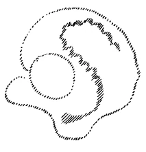

Es wird Ihnen durchsichtig sein, wie dasjenige, was von mir hier und sonst vorgebracht worden ist gerade über das soziale Problem der Gegenwart, doch durchaus fließt aus geisteswissenschaftlichen Untergründen und wie versucht worden ist, in den Aufruf, von dem ich Ihnen neulich hier gesprochen habe, hineinlaufen zu lassen, was aus der tieferen Einsicht der gegenwärtigen Weltenlage über das soziale Problem jetzt praktisch gedacht werden muß. Wir sollten eigentlich nicht müde werden, uns immer wieder und wiederum die Hauptsache vor die Seele zu führen. Und diese Hauptsache besteht heute darin, daß Mittel und Wege gefunden werden zur Aufklärung, zur Möglichkeit, Verständnis hervorzurufen für das, was als Tatenansätze, als Handlungen in die Menschheit hineinkommen muß, wenn in der richtigen Art gedacht wird über das Wesen des sozialen Organismus. Nicht wahr, Sie haben ja begriffen, daß das Denken und Empfinden und damit auch das Wollen der Menschheit radikal anders geworden ist seit der Mitte des 15. Jahrhunderts, und daß die Gesamtgeschichte wird revidiert werden müssen, wenn sie fruchtbar gemacht werden soll für die Menschheit von dem Gesichtspunkte aus, der sich aus dieser radikalen Metamorphose der Seelenverfassung der Menschheit für den fünften nachatlantischen Zeitraum ergibt. Man muß sich klar sein darüber, daß gerade durch die Eigentümlichkeit der Entwickelung in diesem unserem fünften nachatlantischen Zeitraume bei den Menschen, die mit einem gewissen Wollen ausgestattet sind — ob wir dieses Wollen nun selbst für ein richtiges oder unrichtiges, für ein gutes oder schlechtes halten —, daß bei diesen Menschen das zugrunde liegende Denken bestimmte Formen annimmt. Und von diesem zugrunde liegenden Denken, das bestimmte Formen annimmt, ist ja im Grunde unsere ganze soziale Bewegung heute im wesentlichen gestaltet. Es liegen doch zugrunde die Gedanken der Menschen, die sie haben können gemäß dem Grundcharakter unseres Zeitalters. ^g23d1w

Nun erinnern Sie sich, daß es bei der Dreiteilung, von der wir jetzt öfter gesprochen haben, und die auch ausgedrückt ist in dem Ihnen zur Kenntnis gebrachten Aufruf, daß bei dieser Dreiteilung der eigentliche politische Staat, von dem die meisten Menschen heute glauben, er umfasse den gesamten sozialen Organismus, oder den die meisten Menschen heute mit dem sozialen Organismus verwechseln, gewissermaßen nur ein Departement, ein Glied des dreigeteilten sozialen Organismus ist. Wenn Sie in der rechten Weise einerseits verstehen, worauf die ganze Dreigliederung des sozialen Organismus hinausläuft, und wenn Sie auf der anderen Seite versuchen zu verstehen, wie sich die Einseitigkeit im modernen Leben herausgebildet hat, den sozialen Organismus ganz zu zentralisieren, gewissermaßen den Staat alles verschlingen zu lassen, dann haben Sie in dem Zusammenhalten dieser beiden Dinge ein Wichtiges für das Verständnis der Sache gegeben. Und von einem ernsten Gesichtspunkte aus heute die soziale Bewegung zu verstehen ist das Allernotwendigste für den gegenwärtigen Menschen. Mit Bezug auf das, was an Handlungen zu geschehen hat, werden, wie das heute der Fall ist, die Menschen noch lange im Unbestimmten tappen. Das kann gar nicht anders sein. Aber worauf gesehen werden muß, worauf hingearbeitet werden muß, das ist: soziales Verständnis zu verbreiten; zu verbreiten die Möglichkeit, den sozialen Organismus wirklich zu verstehen. Es ist gerade von diesem Gesichtspunkte aus außerordentlich interessant zu beobachten, welcher Art das Denken der gegenwärtigen Menschen ist, die nach einer gewissen Richtung hin ihr soziales Wollen betätigen. Nicht wahr, uns muß es mehr darauf ankommen, die Artung, die Formung, die Gestaltung des Denkens der Menschen zu beobachten, weniger auf den Inhalt zu sehen; denn wir haben bei verschiedensten Gelegenheiten betonen müssen: was schließlich die Menschen denken, darauf kommt es sehr, sehr viel weniger an, als wie die Menschen denken, wie das Denken orientiert ist. Schließlich ist es für das Einschneidende und Durchgreifende der gegenwärtigen Weltenbewegung gar nicht so sehr von Bedeutung, ob einer reaktionär im urältesten Sinne ist, ob er liberal, ob er demokratisch, sozialistisch oder bolschewistisch ist. Wenn man bloß auf dasjenige sieht, was die Leute sagen, so ist das gar nicht so besonders wichtig, sondern besonders wichtig ist, wie die Menschen denken, in welcher Art die Gedanken der Menschen sich formen. Darauf kommt es an. Denn Sie werden heute die Erfahrung machen können, daß Sie schließlich da oder dort eine Persönlichkeit entdekken, die radikal sozialistisch denkt dem Inhalte nach, dem Programm nach, die aber eigentlich gar nicht anders in ihren Gedankenformen ist, als diejenigen Menschen, die über ein großes Gebiet der Erde hin heute gestürzt worden sind. ^unsyax

Also wir müssen schon auf das Tiefere sehen, das sich geltend macht. Denn von den Programmen, die, wie ich neulich in Basel gesagt habe, heute wie Urteilsmumien unter uns herumwandeln, von diesen Programmen wird in der Zeitbewegung sehr, sehr wenig abhängen. Vieles wird davon abhängen, daß die Leute lernen, anders zu denken, die Gedanken anders zu formen, anders zu bilden. Gegenwärtig gibt es ja noch nichts, was wirklich das Denken der Menschen in eine andere Richtung hinlenkt, als das geisteswissenschaftliche Denken, das deshalb auch von den meisten für phantastisch angesehen wird. Dabei sind die Leute, die sagen, es sei phantastisch, eben selber Phantasten, wenn auch vielfach materialistische Phantasten; aber sie sind Phantasten, sie sind Theoretiker und können sich nicht auf die Wirklichkeit einlassen. Das aber, was sich gestaltet, das wird aus der Artung des Denkens heraus sich entwickeln. Gerade mit Bezug auf das, was damit angedeutet ist, möchte ich Ihnen heute einiges auseinandersetzen. ^hj3yxp

Wer hinsieht auf die Art und Weise, wie sich nach und nach die Anschauungen innerhalb der proletarischen Bewegung gebildet haben, und wie sie sich bis heute gestaltet haben, der sieht innerhalb der proletarischen Welt alle möglichen Anschauungen. Uns soll heute die eine Tatsache besonders interessieren, daß ja neben den vielen anderen sozialistischen Proletariern, die so oder so denken, weitaus die größte Zahl unter diesen Proletariern sich ganz radikal zu dem ursprünglichen oder zu einem fortgebildeten Marxismus bekennt. Das ist ja das Eigentümliche, daß dieser Karl Marx — nachdem er die deutsche Dialektik Hegels in sich aufgenommen hatte, nachdem er den französischen sozialen Positivismus kennengelernt hatte, dann von London aus sich die soziale Welt, das soziale Werden betrachtet hatte — von da aus seine außerordentlich einschneidenden sozialistischen Theorien gebildet hat, die dann nach und nach die gesamte proletarische Welt ergriffen haben. Es war also eigentlich der marxistische Gedanke, der sich ausbreitete, der durch das Zündfeuer der Katastrophe der letzten Jahre sich so ausgewachsen hat, wie er heute schon ist, und der sich weiter auswachsen wird. Unter den Sozialisten selbst gibt es eine große Anzahl, die sich einfach so auf Karl Marx berufen, daß sie sagen, sie seien Marxisten. Nun, der eine behauptet, er stünde ganz auf orthodox-marxistischem Standpunkt, der andere behauptet, er vertrete einen fortgeschrittenen Marxismus und so weiter. Aber alles geht auf Marx zurück. ^8b2m44

Nun liegt ja ein Ausspruch von Karl Marx selbst vor, der auf gewisse Seiten dieser Sache recht tief blicken laßt. Karl Marx betonte einmal, als er über den Marxismus selber sprach, daß er, Karl Marx, jedenfalls kein Marxist sei. Das, meine lieben Freunde, sollte man insbesondere in der heutigen Zeit nicht aus dem Auge verlieren. Denn nur wenn man auf solche Dinge sieht, merkt man in der richtigen Weise, worauf es ankommt: eben darauf, wie sich die Gedanken formen, nicht was ausgesprochen wird. Die bequeme Art, auf Programme zu bauen, wird die Menschheit gerade in unserer schwerlebigen Zeit nicht haben können. Und ein Weg ist, wenn er auch noch so weit ist, der von Karl Marx zu Wladimir Lenin, der sich nun auch für einen wirklichen, echten Marxisten hält. Und wenn man heute über Lenin spricht, so spricht man ja nicht über eine einzelne Persönlichkeit, sondern über eine Bewegung, die man meinetwillen in Grund und Boden kritisieren kann selbstverständlich, die aber als Impuls schon weite, weite Kreise zieht, aber auch durch gewisse Methoden, die sie eingeschlagen hat, und von denen ihre Träger überzeugt sind, daß sie eigentlich der wahre Marxismus sind. ^86wmpv

Nun kommt man am leichtesten dem Problem, auf das ich hier deute, bei, wenn man gerade dies in den Mittelpunkt der Betrachtungen stellt, daß die Einseitigkeit Platz gegriffen hat, alles gewissermaßen dem Staate aufbuckeln zu wollen, während man es im sozialen Organismus mit einer Dreigliedrigkeit zu tun hat. Es ist schon interessant, die Gedankenformung, wie sie sich bei Karl Marx selbst vollzogen hat, zu verfolgen; einmal ganz abzusehen von dem, was Marx inhaltlich gesagt hat, mehr auf seine Gedankenformung zu sehen. Sehen Sie, wer zum Beispiel an Karl Marx herangeht und seine Schriften liest mit der Meinung, er werde jetzt durch die Lektüre eine Vorstellung empfangen, wie der soziale Organismus sich gestalten werde, der wird sich sehr bedeutsam täuschen. Solche Angaben, wie Sie sie den Mitteilungen der Geisteswissenschaft über den sozialen Organismus entnehmen, die hier und anderswo von mir gemacht worden sind, werden Sie bei Karl Marx vergeblich suchen. Darum handelte es sich ihm nach seiner Gedankenformung eigentlich nirgends. Wenn Sie die nationalökonomischen Ansichten über die soziale Gestaltung, soweit sie Karl Marx selber aufgeschrieben hat, verfolgen, so können Sie sich sagen: Karl Marx hat eigentlich über den sozialen Organismus keine anderen Gedanken als diejenigen, die schon da waren. Originelle Gedanken, wie die Welt werden soll, die macht sich Karl Marx nämlich nicht. Er verfolgt: Wie haben die Menschen gedacht, welche das moderne kapitalistische Zeitalter herbeigeführt haben, wie hat sich Lohnfrage, Kapitalfrage, Grundrentenfrage und so weiter ausgebildet unter der kapitalistischen Herrschaft? — Und er zergliedert die Nationalökonomie der kapitalistischen Herrschaft. Im Grunde genommen finden Sie wichtigste Vorstellungen, die Karl Marx dem Proletariiat überliefert hat, schon bei Ricardo und bei anderen, Was tut Karl Marx? Karl Marx sagt: In der kapitalistischen Wirtschaftsordnung, die sich allmählich in der neueren Zeit heraufgebildet hat, haben die Menschen Meinungen gehabt, aus denen heraus sich gebildet haben die modernen Lohnverhältnisse, die modernen Kapitalverhältnisse, die modernen Grundrentenverhältnisse und so weiter. Und jetzt versucht er weiter zu denken. Nicht daß er sagt, was an die Stelle dieser sozialen Gliederung, wie sie sich unter dem Kapitalismus herausgebildet hat, treten soll, er zeigt nur, daß sich unter dieser kapitalistischen Herrschaft als eine besondere Menschenklasse das Proletariat hat ergeben müssen. Das ist da, das ist eine Realität. Er zeigt nun, wohin die kapitalistische Herrschaft führt. Er zeigt, daß sie sich selbst ad absurdum führt, daß sie, wenn sie auf ihren Höhepunkt gekommen ist, in ihr Gegenteil umschlagen muß. Immer mehr und mehr sammeln sich Kapitalien in den Händen einzelner, bis sie übergehen auf den «einzelsten», der dann zu gleicher Zeit die Gemeinsamkeit ist; so sehr sich auch Marx und die Marxisten dagegen sträuben, das dem Worte nach anzuerkennen, sie gehen über auf die staatliche Ordnung, so daß der Staat eigentlich der einzige Großkapitalist wird. Aber er hat dann in seiner Vertretung alle am Staate teilnehmenden Menschen. ^jhkfya

Nun, gerade aus dieser Auseinandersetzung haben sich die verschiedensten sozialistischen Meinungen in der neueren Zeit gebildet. Karl Marx und sein Freund Engels haben ja lange Zeit gewirkt, haben viel im Laufe von Jahrzehnten dazu beigetragen, Gedanken, die sie ursprünglich geäußert haben, zu modifizieren, zu erweitern, zu begrenzen, wie das ja geschehen muß bei jemandem, der nicht stehenbleibt, sondern der sich selber, die Welt beobachtend, weiterentwickelt. Nun entstand auf Grundlage des Marxismus, weil die Gedanken von Karl Marx, wie ich Ihnen wiederholt gezeigt habe, eben dem Proletariat in die Seele hinein sprachen, eine große Bewegung, die für die verschiedenen Länder die verschiedensten Formen angenommen hat. Man kann schon sagen: Sozialismus, der sich auf Grundlage des Marxismus gebildet hat, hat eine andere Nuance in England, in Frankreich, er hat die radikalste Nuance in Deutschland bekommen, die dann auf Rußland übergegangen ist. Das ist alles richtig, daß er verschiedene Nuancen angenommen hat. Aber was eine ganz wesentliche Prinzipienfrage ist, das Verhältnis der proletarischen Welt zum Staate, das ist eigentlich mehr oder weniger in eine Art nebuloser Atmosphäre eingelaufen. Die Leute bildeten gerade dadurch viele Parteien innerhalb des Sozialismus, die sich bis aufs Messer bekämpften, weil sie in der einen oder in der anderen Weise gerade das Verhältnis des Proletariats zum Staate, wie er sich geschichtlich in dem Laufe der neueren Entwickelung gebildet hat, in der verschiedensten Art auffaßten. Nun spielen ja da die verschiedensten Strömungen hinein, die wir heute nicht berühren wollen. Allein den Weg wollen wir doch einmal kurz andeuten, der sich zieht von Karl Marx bis zu Lenin. Denn Lenin behauptet gerade, der echteste Marxist zu sein, der Karl Marx selbst am besten versteht, während zahlreiche andere Sozialisten, die sich auch Marxisten nennen, von Lenin als Abtrünnige, als Verräter bezeichnet werden, mit den verschiedensten Namen belegt werden; manche werden wegen ihres Verhaltens während des sogenannten Weltkrieges SozialChauvinisten genannt und dergleichen. ^7irmx3

Wenn wir noch einmal zurückblicken auf Karl Marx, so muß uns die Gedankenformung interessieren, und Sie können ein Wesentliches schon entnehmen aus dem, was ich gesagt habe: es liegt kein positiver Gedanke vor, wie die Sache werden soll, es ist etwas Auflösendes in der Gedankenform. Karl Marx sagt einfach: Ihr kapitalistischen Denker habt es so gesagt und gemacht, daraus muß euer eigener Untergang folgen, dann wird das Proletariat oben sein. Was das Proletariiat macht, das weiß ich nicht, das wissen andere auch nicht, das wird sich schon zeigen. Das einzig Sichere ist, daß ihr euch durch eure eigenen Maßnahmen und durch das, was ihr aus der Welt gemacht habt, euren eigenen Untergang bereitet; wie es dann ist, wenn das Proletariat da ist, was das tun wird, das weiß ich nicht, das wissen andere nicht, das wird sich schon zeigen. ^264y2r

Wenn Sie diese Sache so nehmen, wie ich sie eben dargestellt habe, dann haben Sie die Gedankenform. Es wird einfach dasjenige, was in der Außenwelt ringsherum sich zeigt, aufgenommen, wird durchgedacht. Aber wenn man mit dem Gedanken zu Ende ist, dann vernichtet sich der Gedanke, dann kommt er zu nichts, dann läuft er gewissermaßen ins Nichts aus. Das ist es, was dem, der für solche Sachen Empfindungen hat, so stark auffällt. Wenn man Karl Marx studiert, so findet man immer: man geht von gewissen Gedanken aus; die sind aber eigentlich nicht seine Gedanken, sondern die sind die Gedanken der neueren Zeit. Und dann treibt man in etwas hinein, was eigentlich den Gedanken strudelt, was ihn verwirrt, und was ihn auslaufen läßt in das Zerstörerische, an das nichts angesetzt werden kann. ^0lfp38

Außerordentlich interessant ist, wie diese bei Karl Marx schon einschlagende Gedankenform in höchster Potenz, man möchte sagen, bis zum Genialen potenziert bei Lenin sich zeigt. Lenin deutet Karl Marx so, daß Marx ein absoluter Gegner des Staates sei, daß er, Karl Marx, von dem Gedanken ausgegangen sei: wenn die Unterdrückung des Proletariats aufhören solle, so muß der Staat, wie er sich historisch herausgebildet hat, beseitigt werden, muß aufhören. Das ist interessant, weil gerade diejenigen, die Lenin als Gegner betrachtet, eigentlich dem Staate, wie er sich historisch herausgebildet hat, alles aufbuckeln möchten. So daß wir diese beiden Gegensätze in sozialen Kreisen heute drinnen haben: auf der einen Seite gerade die richtigen Staatsfanatiker, die alles verstaatlichen wollen, und auf der anderen Seite Lenin, den absoluten Gegner des Staates, der eigentlich das Heil der Menschheit nur sieht — nicht in der Abschaffung, das hält er für einen Unsinn, für eine Utopie -, aber in dem allmählichen Absterben des Staates. Und gerade, wenn man betrachtet, wie er da denkt, kommt man auf die Gedankenform, die in ihm lebt; das ist interessant. ^r9x1a0

Lenin denkt so: Das Proletariat ist die einzige Klasse, die, nachdem die anderen sich selber ad absurdum geführt haben, sich zum Untergang reif gemacht haben, obenauf kommen kann. Diese proletarische Menschenklasse wird, so meint Lenin, dasjenige, was sich als Bourgeoisie-Staat herausgebildet hat, zur höchsten Vollkommenheit treiben. — Bitte, geben Sie acht auf die Gedankenform. — Also Lenin sagt nicht etwa, wie die Anarchisten: Schaffen wir den Staat ab; das fällt ihm gar nicht ein. Er ist ein Gegner des Anarchismus, sagt nicht: Schaffen wir den Staat ab; das würde er für den größten Unsinn halten, sondern er sagt: Wenn die Entwickelung so fortgeht, wie die Bourgeoisie sie eingeleitet hat, dann ist die Bourgeoisie reif zum Untergang. Das Proletariat wird sich der Staatsmaschinerie, wie er sagt, bemächtigen; was die Bourgeoisie als ein Werkzeug zur Unterdrükkung des Proletariats begründet hat als Staat, das wird das Proletariat vervollkommnen, wird also gerade den vollkommensten Staat machen. Aber was ist die Eigentümlichkeit des vollkommensten Staates? — fragt jetzt Lenin. Und er glaubt echter Marxist zu sein, wenn er sagt: Die Eigentümlichkeit des vollkommenen Staates, wenn er entsteht — und er wird entstehen durch das Proletariat, wird als letzte Konsequenz der Bourgeoisie entstehen -, die Eigentümlichkeit des vollkommenen Staates ist diese, daß er selber abstirbt. Der gegenwärtige Staat kann eben nur als ein von der Bourgeoisieklasse geschaffener Staat existieren, weil er unvollkommen ist; wenn ihn das Proletariat vollkommen ausgestaltet, zu Ende führt, was die Bourgeoisie angefangen hat, dann bekommt der Staat seine richtige Impulsivität, die darin besteht, daß er stirbt, daß er von selber aufhört. ^ou326e

Das ist nur die charakteristischste Gedankenform in dem Denken von Lenin. Sie sehen das potenziert, was bei Marx schon zu finden ist: der Gedanke, der gebildet wird und dann ins Nichts abläuft. Nur daß Lenin ein sehr realistischer Denker ist, der aus dem geschichtlichen Hergang darauf kommt: der Staat muß gerade vervollkommnet werden; er stirbt gerade jetzt nicht, weil er unvollkommen ist; daraus hat er seine Lebenskraft. Wenn ihn das Proletariat vollkommen macht, dann hat es den Grund dazu gelegt, daß er allmählich abstirbt. ^0qbmyc

Sie sehen, aus der Wirklichkeit heraus wird eine Vorstellung geformt, und diese Vorstellung, die hat heute in einem großen Teile von Osteuropa die Tendenz, sich auszudehnen zur Realität. Sie ist nicht eine bloße Vorstellung, sie geht in Wirklichkeit über, sie geht darauf hinaus, daß gesagt wird: Ihr Bourgeois habt diesen modernen Staat entstehen lassen; ihr habt ihn nur benützt als ein Instrument zur Unterdrückung des Proletariats, ihr habt ihn unvollkommen gelassen, er ist der Staat der bevorzugten Klasse. Er dient euch dazu, die proletarische Klasse zu unterdrücken; dem verdankt er seine Lebensfähigkeit. Nun wird das Proletariat kommen, wird die Klassenherrschaft abschaffen, wird den Staat zum vollkommenen Wesen machen: dann stirbt er, dann kann er nicht leben. Und dann entsteht das, was entstehen soll, von dem kein Mensch, wie Lenin sagt, heute wissen kann, was es ist. Das soziale «Ignorabimus», das ist es, was aus diesem Sozialismus fließt. Das ist nun sehr interessant. Denn die Denkweise, die heute das soziale Vorstellen ergriffen hat, die ist aus der Naturwissenschaft heraus gebildet, und wie die Naturwissenschaft mit Recht von ihrem einseitigen Standpunkte zu dem Ignorabimus gekommen ist: «Wir können nichts wissen», so kommt das sozialistische Denken zu dem sozialistischen Ignorabimus. ^66xcav

Diesen Zusammenhang sollte man richtig einsehen, meine lieben Freunde. Ohne alles das, was von den naturwissenschaftlichen Weltanschauern auf den gut bürgerlichen Universitäten gelehrt worden ist, ohne das gäbe es keinen Sozialismus. Der Sozialismus ist ein Kind der Bourgeoisie. Auch der Bolschewismus ist ein Kind der Bourgeoisie. Das ist durchaus der tiefere Zusammenhang. Das muß man vor allen Dingen verstehen. ^ji87hw

Nun kann man, wenn man sich diese Gedankenform erst klargemacht hat, auf einige wichtige Punkte gerade mit Bezug auf die Anschauungsweise eines solchen Mannes wie Lenin hindeuten. Er legt zum Beispiel ein besonderes Gewicht darauf, daß sich innerhalb des bourgeoisen Staates der Bürokratismus herausgebildet hat, die militärische Maschinerie, wie er sie nennt. Diese bürokratische, militärische Maschinerie ist entstanden, weil sie gebraucht wird von den leitenden Klassen zur Unterdrückung eben der unterdrückten Klassen. Daher ist der radikalste Flügel des Sozialismus, der Bolschewismus, sich darüber klar, daß das, was er will, nur verwirklicht werden kann durch das bewaffnete Proletariat. Ohne Waffen ist aussichtslos, was auf dieser Seite gewollt wird. Und es wird dieses durch historische Beispiele belegt. Die französischen Kommunen konnten gerade solange wirken, als diejenigen, die da obenaufgekommen waren, Waffen hatten. In dem Augenblick, wo sie entwaffnet waren, ging es nicht mehr. Das ist einer der Punkte, daß darauf gesehen werden muß, das Proletariat als bewaffnete Arbeitermacht zu haben. Nun, was soll dann geschehen, was soll durch dieses Proletariat, das als bewaffnete Arbeitermacht auftritt, geschehen? Es geschieht ja heute zum Teil schon. Es geschieht in einer Weise, von der man glauben könnte, daß manche Menschen darüber erwachen könnten aus dem tiefen sozialen Schlafe, den die Menschen so lange Zeit geträumt haben. Was soll geschehen? Aufhören soll vor allen Dingen der Staat als Klassenstaat. Dasjenige, was die Bourgeoisie begründet hat als Klassenstaat, soll übernommen werden von der bewaffneten Arbeiterschaft. ^zhrr50

Und nun ist es interessant, daß mit klaren und deutlichen Worten gerade bei solchen Menschen, die bis zu einer gewissen Genualität die Gedankenform des modernen sozialistischen Denkens ausgebildet haben, herauskommt, was eigentlich durch die Verhältnisse, durch die geschichtliche Entwickelung in den Proletarierseelen veranlagt worden ist. Lenin weist zum Beispiel darauf hin, daß an die Stelle der Beamten und militärischen Hierarchie eine Art Verwaltung treten müsse, die aber nur aus Gewählten besteht, und er weist darauf hin, daß so, wie die Verhältnisse heute liegen, man ja nichts anderes im Kopfe zu haben braucht, um die Dinge zu verwalten, die zu verwalten sind, als die heute eben übliche allgemeine Schulbildung. Und er gebraucht selber einen merkwürdigen Ausdruck, der viel sagt. Lenin sagt, daß das, was heute Staat genannt wird, so umgewandelt werden soll, daß eigentlich eine große Fabrik mit allgemeiner Buchhaltung entsteht. Um das zu bewirken und um Kontrolle und sonstiges auszuüben, kann man so ziemlich mit den vier Rechnungsarten, mit dem, was allgemeine Volksbildung sein kann, auskommen. ^vgniw2

Nun, meine lieben Freunde, man sollte über solche Dinge nicht einfach spotten, sondern man sollte sich klar darüber sein, daß ja auch diese Anschauung nichts anderes ist als die letzte Konsequenz der bourgeoisen Entwickelung. So wie sich einmal rein wirtschaftlich das moderne soziale Gebilde ergeben hat, muß man sagen, daß gerade die kapitalkräftigen Menschen, die Kapital-dirigierenden Menschen zumeist nichts anderes im Kopfe haben als was Lenin verlangt, daß es die späteren Arbeiteraufseher haben sollten. ^cqpyqt

Würde die Möglichkeit vorliegen, daß der Proletarier, so wie er entstanden ist in der neueren Entwickelung, zu jemandem hinsehen könnte, an dessen besondere Fähigkeiten oder dergleichen er glauben könnte, zu dem er als zu einer gewissen berechtigen Autorität hinsehen könnte, dann würde sich die ganze Entwickelung anders ergeben haben. Aber er kann ja nicht zu solchen Menschen hinsehen. Er kann ja nur auf diejenigen hinsehen, die ihm im Grunde genommen an geistigen Qualitäten gleich sind, die nur das Kapital vor ihm voraus haben. Er findet keinen Unterschied zwischen sich und denjenigen, die dirigieren. Das tritt nur in streng theoretische Formeln gefaßt bei Lenin zutage. ^fg3imc

Also begreifen kann man gerade an den radikalen Formeln des Lenin, wie die Dinge sich ergeben haben. Nun wird Ihnen ja allen selbstverständlich die Frage, möchte ich sagen, auf der Zunge liegen: Ja, aber es kommt doch so viel Schreckliches heraus bei der Sache, es ist doch alles so furchtbar. - Dennoch, es handelt sich darum, daß man den Dingen ganz offen ins Auge schaut, daß man sich schon die Unbequemlichkeit macht, auf die Gedanken der Menschen einzugehen. Nicht wahr, wenn so einfach zeitungsmäßig geschildert wird, was da oder dort durch die radikalen Sozialisten geschieht, so kann man bürgerliche Entrüstung haben, die ja heute schon vielfach in bürgerliche Angstmeierei übergeht; aber der Drang, die Dinge zu verstehen, der ist ja heute noch nicht besonders groß. ^varsvz

Nun ist unbedingt nötig, um zu verstehen, was schon geschieht, und namentlich was noch geschehen wird, folgendes zu bedenken: Gerade Lenin, der sich für einen echten Marxisten hält, weist darauf hin, wie schon durch Marx eingeleitet worden ist eine bestimmte Anschauung über die Entwickelung der sozialen Ordnung in die neuere Zeit und in die Zukunft hinein. Eigentlich denken diese Leute, daß sich die soziale Neugestaltung in zwei Phasen vollziehen muß, nicht mit einem Anhub geschieht. Die erste Phase ist die, daß einfach das Proletariat in die bourgeoise Staatsform einrückt, von der Lenin meint, daß sie, wenn sie vollkommen sein wird, durch sich selber absterben werde. Das Proletariat wird einrücken, wird dasjenige zu Ende führen, was nach den Anschauungen und Impulsen des Proletariats aus dem bourgeoisen Staate werden kann. Schon von Marx selber ist ausgeführt worden, daß das ja noch nicht zu irgendwelchen wünschenswerten Zuständen führen kann. Wozu wird diese erste Phase der Sozialisierung im Sinne des Marx-Leninismus führen? Sie wird dazu führen, wenn man es banal darstellt — aber die Leute stellen es ja selbst so banal dar -, daß, wer nicht arbeitet, auch nicht essen kann; daß jeder eine bestimmte Arbeit zu verrichten hat und daß er dann durch diese Arbeit Anspruch haben wird auf die Artikel, die zu seinem Lebensunterhalt notwendig sind, sagen wir, aus den Staatsmaschinen und dergleichen. Aber die Leute sind sich klar darüber: dadurch wird nicht irgendeine Gleichheit unter den Menschen herbeigeführt, sondern dadurch wird die Ungleichheit nur fortgesetzt. Auch wird nicht etwa der Mensch dazu gebracht, das Erträgnis seiner Arbeit wirklich zu haben. Das betont Karl Marx, das betont auch Lenin. Es muß ja von der Gemeinsamkeit — also von dem Staat oder wie man es nennen will, was da übrigbleiben wird von der bourgeoisen Weltordnung — alles das abgezogen werden, was nötig ist für das Schulwesen, was nötig ist, um gewissen Unternehmungen auf die Sprünge zu helfen und so weiter. Der alte Lassallesche Gedanke auf das Recht des vollen Arbeitsbetrags, der muß natürlich im Sinne dieses Sozialismus fallengelassen werden. Aber auch da kommt keine Gleichheit heraus. Denn, nicht wahr, die Menschen als solche werden, selbst wenn sie gleiche Arbeit leisten, verschiedene Ansprüche an das Leben haben, durch die Lebensverhältnisse selbst. Das gibt natürlich dieser Sozialismus durchaus zu. Dadurch ist gleich wieder eine Ungleichheit bedingt. Kurz, es ist die Anschauung dieser Sozialisten, daß sich in die erste Phase der sozialistischen Ordnung einfach die bourgeoise Ordnung hinein fortsetzt, daß das Proletariat diese bourgeoise Ordnung besorgt. ^2bjyt5

Sehr interessant ist, wie sich Lenin direkt über die Sache ausspricht; er sagt zum Beispiel an einer Stelle seines Werkes «Staat und Revolution», daß etwas eintreten würde wie bourgeoise Ordnung, bourgeoiser Staat ohne die Bourgeoisie. Da sehen Sie in diesem Worte, das Lenin selber gebraucht - der bourgeoise Staat wird da sein ohne die Bourgeoisie -, da sehen Sie, was ich immer betone und was ich für außerordentlich wichtig halte, daß die Leute, die heute sozialistisch denken, nur die Erbschaft der Bourgeoisie angetreten haben. Die Gedanken sind die bourgeoisen Gedanken. Denn ein so die Gedankenform bis zur Genialität fortbildender Mensch, wie Lenin, sagt, die nächste Phase ist diese: bourgeoiser Staat ohne die Bourgeoisie, die entweder totgeschlagen oder dienende Kaste sein wird. Da wird es keine Gleichheit geben, da wird nur das Proletariat oben sein; es wird, statt daß von Monarchen oder von sonstigen ähnlichen Gebilden ernannt und dekoriert wird, gewählt werden. Das Proletariat wird verwaltend und gesetzgebend zu gleicher Zeit. Aber es ist der bourgeoise Staat, nur ohne die Bourgeoisie. Jeder wird entlohnt nach seiner Arbeit, aber Ungleichheit gibt es da natürlich. ^h3oz82

Das alles gibt keineswegs einen idealen Zustand. Wenn also jemand fragt: Was haben diese Leute gemacht aus der menschlichen gesellschaftlichen Ordnung? — dann wird einfach Lenin antworten: Wir haben euch ja als erste Phase nichts anderes versprochen, als daß wir dasjenige, was ihr als bourgeoisen Staat begründet habt, in seinen Konsequenzen ausführen; nur haben jetzt wir es auszuführen, als Proletarier werden wir es ausführen. Ihr habt es früher gemacht, jetzt machen wir es. Aber wir machen dasselbe, was ihr gemacht habt: bourgeoiser Staat, nur ohne die Bourgeoisie. ^jp32o2

So sagt zum Beispiel Lenin: Dieser bourgeoise Staat ohne die Bourgeoisie, das wird zum Absterben des Staates führen. Der Staat wird dann völlig abgestorben sein können, wenn die Gesellschaft die Regel verwirklicht haben wird, die er als sein Ideal betrachtet, und wenn der enge bürgerliche Rechtshorizont aufgehört haben wird, der einen mit der Hartherzigkeit eines Shylock berechnen läßt, ob man am Ende nicht eine halbe Stunde länger gearbeitet oder etwas weniger bezahlt bekommen hat als der andere. Dieser enge Horizont wird erst am Ende der ersten Phase überschritten sein. Bis zum Ende der ersten Phase wird noch immer, und zwar dann natürlich gerade gesteigert, der bürgerliche Rechtsstaat sein, der einen mit der Hartherzigkeit eines Shylock berechnen läßt, ob man am Ende nicht eine halbe Stunde länger gearbeitet oder etwas weniger bezahlt bekommen hat als der andere. Dieser bürgerliche Shylock-Standpunkt, der wird sich also in die erste Phase des Sozialismus hereinerstrecken. ^8kvvwc

Da haben Sie das, was diese Leute zunächst einzig und allein versprechen: Ihr habt es gemacht, ihr habt es zunächst für eure Kaste gemacht; wir machen die Sache für das Proletariat. Von Demokratie zu reden ist Unsinn, denn die Demokratie würde doch nur dazu führen, daß die Minorität unterdrückt würde. Das Proletariat wird alles so machen, wie ihr es gemacht habt. Dadurch aber wird sie das, was ihr zu einem Scheinleben erweckt habt, zum Absterben bringen. Dann kommt erst die zweite Phase. ^j83s9m

Auf diese zweite Phase des Sozialismus weist auch Karl Marx schon hin, weist Lenin wieder hin, aber in einer sehr merkwürdigen Weise; und ich halte es für außerordentlich wichtig, daß das ins Auge gefaßt wird. Also stellen Sie sich vor: Marx in der Gestalt des Lenin - sie werden die bourgeoise Ordnung bis zu ihren letzten Konsequenzen treiben; dann wird das absterben, was Staat ist, und dann werden die Menschen die Gewohnheit haben, keinen Rechtsstaat mehr zu brauchen, überhaupt keinen Staat mehr zu brauchen; der Staat wird aufhören. Es wird ganz unnötig sein nach und nach, daß man einen Staat braucht, denn all das, was der Staat zu tun hat, wird nicht nötig sein zu tun. Denn die Zeit, wo jeder nach dem Grundsatze entlohnt wird: Wer nicht arbeitet, darf auch nicht essen -, diese Zeit wird ja eben aufhören. Sie ist die erste Phase des Sozialismus. Dann wird die Zeit kommen, wo jeder nach seinen Fähigkeiten und Bedürfnissen wird leben können, nicht nach seiner Arbeit. Und das wird die höhere Stufe sein, zu der all das, was jetzt zunächst angestrebt wird, nur der Übergang ist. Da wird man nicht mehr fragen, ob einer eine halbe Stunde länger oder kürzer gearbeitet hat. Da erst wird die Zeit gekommen sein, wo man die Gleichwertigkeit geistiger und künstlerischer Arbeit in der richtigen Weise taxieren wird. Da wird jeder an seinen Posten gestellt sein durch die naturgemäße soziale Ordnung und jeder nach seinen Fähigkeiten nicht nur arbeiten können, sondern wollen, weil die Menschen sich durch das Zivilisiertsein in der ersten Phase gewöhnt haben, die Arbeit nicht als etwas zu betrachten, was sie aus Notwendigkeit tun, sondern sie werden sich dazu drängen. Und damit wird es sich ergeben, daß jeder nach seinen Bedürfnissen auch seinen Lebensunterhalt finden wird. Da wird man nicht mehr nach der bürgerlichen Rechtsordnung eine Shylock-Rechtsordnung haben und fragen, ob einer eine halbe Stunde länger oder kürzer gearbeitet har, sondern man wird einsehen, daß der eine, der eine bestimmte Arbeit hat, auch vielleicht zwei Stunden kürzer arbeitet, daß jeder nach seinen Fähigkeiten und Bedürfnissen leben und arbeiten kann. Das ist die höhere Ordnung. Alles was die Übergänge bilden muß, weil nun einmal der bourgeoise Staat bis zu seinem Ende entwickelt werden muß, damit er abstirbt, alles das führt dann zu dem, worüber man auf der einen Seite sagt: «Ignorabimus» — wir wissen es alle nicht —, wovon man aber andererseits doch sagt, es wird sich als eine zweite, höhere Phase des Sozialismus entwickeln. ^ehnafj

Aber interessant ist, was gerade Lenin über diese höhere Phase des Sozialismus sagt. Ignoranz nennt er es, wenn man behauptet, sich vorstellen zu können, die Menschen, wie sie heute sind, könnten dazu gebracht werden, in einer sozialen Ordnung zu leben, wo jeder nach seinen Fähigkeiten und seinen Bedürfnissen sich ausleben kann — Ignoranz. Denn keinem Sozialisten kann es in den Sinn kommen, zu versprechen, daß die höhere Entwickelungsphase des Kommunismus eintreten muß. Die Voraussicht der großen Sozialisten auf ein solches Zeitalter setzt auch eine Produktivität der Arbeit und einen Menschenschlag voraus, der von dem heutigen weit entfernt ist — von diesem heutigen Menschen, der imstande ist, mir nichts dir nichts Magazine, Wäscheläden zu plündern und das Blaue vom Himmel zu verlangen. Das ist das außerordentlich Interessante und Bedeutungsvolle — erste Phase: Sozialisierung mit den heutigen Menschen; letzte Konsequenz der bourgeoisen Weltordnung: ein Staat, der durch seine eigenen Qualitäten abstirbt; höhere Phase mit Menschen, die ganz anders geworden sind als heute, mit einem neuen Menschenschlag. ^14cn50

Sehen Sie, das ist das abstrakte Ideal: die bourgeoise Ordnung zu ihrem sich selbst ad absurdum führenden Ende zu bringen; den Staat zum Absterben zu bringen; durch diesen Prozeß einen neuen Menschenschlag zu züchten, dessen Menschen gewohnt sein werden, nach ihren Fähigkeiten zu arbeiten und daher nach ihren Bedürfnissen leben zu können; wo es unmöglich sein wird, daß irgendeiner stiehlt, weil,.geradeso wie wenn heute irgendwo eine Dame beschimpft wird, die anständigen Leute sich dagegen auflehnen, dann die Anständigen sich von selber auflehnen werden. Man wird nicht nötig haben, daß da eine militärische oder bürokratische Kaste eingreife — aber ein anderer Menschenschlag. Und auf welchem Glauben beruht das, meine lieben Freunde? Das beruht auf dem Aberglauben gegenüber der wirtschaftlichen Ordnung. Das muß man bedenken. Auf der einen Seite hat der Kapitalismus eine wirtschaftliche Ordnung erzeugt, der kein Geistesleben gegenübersteht, sondern nur eine Ideologie. Diesen Zustand will der Sozialismus bis zur Spitze treiben: Alles weg, außer Wirtschaftsleben! Aber er meint, daß das einen anderen Menschenschlag hervorbringen werde. ^5itt0k

Sehen Sie, es ist außerordentlich wichtig, daß man sich diesen Aberglauben gegenüber dem Wirtschaftsleben klarmacht, daß man sich davon überzeugt, wie heute eine ungeheure Anzahl von Menschen einfach glaubt, wenn das wirtschaftliche Leben in ihrem Sinne eingerichtet werde, dann entsteht nicht nur eine wünschenswerte soziale Ordnung, sondern es wird dadurch sogar ein neuer Menschenschlag, der erst in eine wünschenswerte soziale Ordnung hineinpaßt, gezüchtet. ^10u51b

Das alles ist die moderne Form des Aberglaubens, der sich nicht auf den Standpunkt stellen kann, daß hinter all der äußeren ökonomischen und materiellen Wirklichkeit das Geistige mit seinen Impulsen waltet und vom Menschen als Geistiges aufgenommen werden muß, die Verkennung des Geistigen. Soll die Menschheit gesunden, dann ist das nur auf geistigem Wege möglich, dann ist das nur dadurch möglich, daß die Menschen geistige Impulse als geistige Erkenntnis und als soziales Denken und soziales Fühlen, das auf geisteswissenschaftlichen Grundlagen gebaut ist, in sich aufnehmen. Durch wirtschaftliche Evolutionen wird niemals der neue Mensch erzeugt, einzig und allein von innen heraus. Dann aber muß das geistige Leben frei auf sich selber gestellt sein. Ein solches Geistesleben, wie es sich im Laufe der letzten Jahrhunderte herausgebildet hat, das früher gefesselt war von dem rein kameralistischen Staate, jetzt von dem Wirtschaftsstaate, wird niemals imstande sein, den neuen Menschen wirklich zu gebären. Deshalb muß auf der einen Seite die Freiheit des Geisteslebens angestrebt werden dadurch, daß das geistige Leben sein Departement für sich hat. Dann muß auf der anderen Seite angestrebt werden, daß der Mensch das Wirtschaftsleben rein als Wirtschaftsleben führt, daß der Staat, der es nur zu tun hat mit dem Verhältnisse von Mensch zu Mensch, nicht Wirtschafter ist. Denn das Wirtschaftsleben geht darauf aus, alles was in sein Gebiet drängt, zu verbrauchen. Insofern der Mensch selber im Wirtschaftsleben drinnensteht, wird er verbraucht, und er muß sich fortwährend vor dem Verbrauchtwerden retten. Das wird er, wenn er ein entsprechendes Verhältnis von Mensch zu Mensch aufrichtet. Und das ist dann im regulierenden eigentlichen Staate verwirklicht. ^6pzfj6

Wenn man solche Dinge unbefangen betrachtet, wie die sind, die wir heute wiederum betrachtet haben, so sieht man: gerade das ist das Wesentliche in den Impulsen, die sich durch die moderne soziale Bewegung heraufgebildet haben, daß sie erfüllt sind von einem Denken, das eigentlich ins Nichts hineingeht. Denken Sie doch nur einmal, wenn jemand als beste Erziehungsmaxime nach derselben Gedankenform das Folgende aufstellen würde und sagte: Ich will die vollkommenste Ausgestaltung der heutigen Erziehungsmethode ersinnen; dann gestalte ich sie so aus, daß man den Menschen dahin erzieht, daß er möglichst viel aufnimmt vom Todesprinzip, daß er, wenn er erzogen ist, möglichst anfängt zu sterben. Das wäre ein Gedanke, der sich als real erfaßter Gedanke in sich selbst vernichtet. Aber nun der Leninsche Gedanke vom Staat: Gerade wenn der Staat vollkommen ist, rüstet er sich zum Absterben. Sie sehen schon daraus: über nichts kann eigentlich das moderne Denken zu einer produktiven, fruchtbaren Vorstellung kommen. Auf dem Gebiete des geistigen Lebens nicht, weil das geistige Leben zu einer bloßen Ideologie geworden ist, bloße Gedanken umfaßt oder Naturgesetze, die auch nur Gedanken sind, und weil dieses Geistesleben außerdem gefesselt ist von dem Wirtschaftsleben oder von dem politischen Leben. Das hat ja insbesondere diese Kriegskatastrophe gezeigt. Denken Sie sich doch, wieviel von diesem geistigen Leben abhängig war. Da hat sich die Fesselung in der furchtbarsten Weise gezeigt, überall, über die ganze Erde hin. -— Dann auf dem Gebiete des Staatslebens sahen Sie es ja: Die Sozialisten, die die Halbgedanken der Bürgerlichen zu Ende denken, denken einen Staat aus, der gerade die Eigentümlichkeit hat, daß er sich selber zum Absterben bringt. Und auf dem Gebiete des Wirtschaftslebens geben sich alle dem Aberglauben hin, als ob dieses Wirtschaftsleben, das uns in Wirklichkeit verbraucht und gegen dessen Verbrauchen wir gerade die beiden anderen Departemente haben müssen —, daß dieses Wirtschaftsleben den neuen Menschenschlag hervorbringen werde. ^4s823a

Auf keinem Gebiete ist es dem modernen Denken gelungen, zu etwas zu kommen, was lebensfähige Zustände herbeiführen kann. So daß man sagen kann: was auf dem Boden der Geisteswissenschaft auf diesem Gebiete gewollt wird, das ist eben gerade, aus todeswürdigen lebenswürdige Zustände herauszugestalten. Aber dann handelt es sich wirklich nicht darum, daß, wie das jetzt in der Gegenwart viele hoffen und wie es sich da oder dort auch schon vollzieht, daß diejenigen, die vorhin unten gewesen sind, jetzt oben sind, und jene unten sind, die vorhin oben gewesen sind. Die jetzt unten sind, haben früher oben reaktionär oder bourgeois gedacht, die jetzt oben sind, denken sozialistisch. Aber die Gedankenformen sind im Grunde ganz dieselben. Denn nicht darauf kommt es an, was einer denkt, sondern wie einer denkt. Und sobald man dies versteht, hat man schon den Grundimpuls zum Verstehen gerade dieser Dreiteilung des sozialen Organismus, die eben auf die Wirklichkeit geht, darauf, was sich als die Gesundheit des sozialen Organismus herausentwickeln muß. ^ng63xe

Wir dürfen uns wirklich auf unserem Gebiete sagen: es ist aus dem geisteswissenschaftlichen Erkennen das Wichtigste für die Zeit herauszuholen, und wir müssen uns hüten, diese tief, tief ernste und bedeutungsvolle Seite unserer geisteswissenschaftlichen Bewegung zu verkennen. Wir verkennen sie aber, meine lieben Freunde, wenn wir uns überwältigen lassen, gerade auf dem Gebiete des anthroposophisch orientierten Geisteswissens in irgendwelche Sektiererei zu verfallen. Es sollte schon jeder mit sich zu Rate gehen mit Bezug auf die Frage: wieviel steckt in mir noch Sektiererisches? Denn die moderne Menschheitsbewegung geht darauf aus, alles Sektiererische aus dieser Menschheitsentwickelung auszutreiben, nicht sektiererisch zu sein, nicht abstrakt zu sein, sondern menschenfreundlich zu sein, weite Gesichtspunkte zu gewinnen, nicht enge, sektiererische Gesichtspunkte zu gewinnen. Insofern von einer gewissen Seite her diese unsere Bewegung aus der theosophischen herausgewachsen ist, stecken in ihr die Keime eben zu sektiererischem Treiben. Aber diese Keime müssen erstickt werden. Das Sektiererische muß ausgetrieben werden. Und die weiten Horizonte sind uns vor allen Dingen nötig, das unbefangene Hinblicken auf die Wirklichkeit. ^39lemj

Neulich habe ich gesagt: Wer Coupons abschneidet, soll sich klar sein, daß in diesen abgeschnittenen Coupons menschliche Arbeitskraft steckt, und insofern menschliche Arbeitskraft versklavt ist in der kapitalistischen Wirtschaftsordnung, nimmt er mindestens Teil an der Versklavung. Darauf darf nicht erwidert werden: Das ist entsetzlich! — oder dergleichen; denn diese Erwiderung: Das ist entsetzlich! — ist die furchtbarste Theorie, ist etwas, was einen sehr leicht gerade zu dem heutigen modernen sektiererischen Treiben verleiten kann. Ich habe dieselbe Sache oftmals in anderer Form gesagt. Da hören die Leute von Luzifer und Ahriman und sagen sich: um Gotteswillen, ja weit, weit weg — ich habe nichts zu tun mit Luzifer und Ahriman; ich habe nichts mit ihnen zu tun, ich bin nur beim guten Gotte! - Um so tiefer verfallen die Leute dem Luzifer und Ahriman, wenn sie so auf die abstrakte Weise herankommen. Man muß schon die Aufrichtigkeit und Ehrlichkeit haben, zu wissen, daß man drinnensteckt in dem gegenwärtigen sozialen Prozeß und daß man nicht bloß durch irgendwelche Selbsttäuschung herauskommen kann, sondern daß man sein Möglichstes tun soll, damit der soziale Prozeß zur Gesundung kommt im Ganzen. Der Einzelne kann sich nicht helfen, so wie heute die Menschheit entwickelt ist, sondern er muß das Seinige dazu tun, um der armen Menschheit mitzuhelfen. Nicht darauf kommt es an, daß wir uns heute sagen: ich will ein guter Mensch sein, uns hinsetzen, Gedanken aussenden, die alle Menschen lieben und so weiter, sondern darauf kommt es an, meine lieben Freunde, daß wir uns in diesem sozialen Prozesse drinnenstehend verstehen, daß wir das Talent entwickeln, auch schlecht zu sein mit der schlechten Menschheit, nicht weil es gut ist, schlecht zu sein, sondern weil eine soziale Ordnung, die überwunden werden muß, die zu etwas anderem gebracht werden muß, eben dazu zwingt, so zu leben. Nicht von der Illusion sollen wir leben wollen, wie brav, wie gut wir sind und uns die Finger ablecken, wie wir selber besser sind als die anderen; sondern wissen, wie wir drinnenstehen, das sollen wir, uns keinen Illusionen hingeben. Denn je weniger wir uns den Illusionen hingeben, desto mehr wird der Elan in uns Platz greifen, mitzuarbeiten an dem, was zur Gesundung des sozialen Organismus führt, die Fähigkeiten uns zu erobern, aufzuwachen gegenüber dem Schlafzustand, der die heutigen Menschen so tief befangen hat. Und da kann nichts anderes helfen, als die Möglichkeit, die energischeren Gedanken, die eindringlicheren Gedanken zu fassen, die in der Geisteswissenschaft gegeben sind, gegenüber den schwachen, lässigen, gelähmten Gedanken, die heute in der offiziellen Wissenschaft, im offiziellen Wissenschaftsbetrieb vorhanden sind. ^qz90kd

Ich muß daran denken, wie ich vor vielleicht heute achtzehn, neunzehn Jahren im Berliner Gewerkschaftshause einmal davon gesprochen habe, wie die heutige, die Wissenschaft der Gegenwart, eine bourgeoise Wissenschaft ist und wie die Entwickelung darauf hinauslaufen muß, gerade die Gedanken, gerade die Wissenschaft zu befreien von dem bourgeoisen Elemente. Ja, das verstehen die Führer des Proletariats heute durchaus nicht, denn die sind davon überzeugt, daß die bürgerliche Wissenschaft, die sie übernommen haben, etwas Absolutes ist. Was wahr ist, ist wahr. Darüber denken die Sozialisten auch nicht nach, wie das zusammenhängt mit der bourgeoisen Entwickelung. Sie reden von den Impulsen, von den Emotionen des Proletariats, aber sie denken ganz bourgeois, ganz bürgerlich. - Nun werden gewiß viele von Ihnen selber sagen: Ja, aber was wahr ist, ist doch eben wahr. — Ja, meine lieben Freunde, gewiß, eine gewisse Summe, sagen wir, von chemischen, von physikalischen Wahrheiten, von mathematischen Wahrheiten ist freilich wahr. Es kann nicht auf bürgerliche Weise wahr sein und auf proletarische Weise wahr sein. Ganz gewiß ist der pythagoräische Lehrsatz nicht auf bourgeoise Weise wahr oder auf proletarische Weise wahr und so weiter, ganz selbstverständlich. Darum handelt es sich aber nicht, sondern darum handelt es sich, daß die Wahrheiten ein gewisses Feld umschließen. ^dysf97

 ^isqx3w

Bleibt man bei diesem Felde stehen, so kann das, was darin ist, ja gewiß wahr sein, aber es sind Wahrheiten, die gerade just den bürgerlichen Kreisen nützlich und bequem und angemessen sind, während außerhalb (siehe Zeichnung) manches andere liegt, was man auch wissen kann, was einfach unberücksichtigt bleibt von der Bourgeoisie. Also darauf kommt es nicht an, daß die chemischen, die mathematischen Wahrheiten wahr sind, sondern daß es außer diesen Wahrheiten auch noch andere gibt, die erst das richtige Licht auf diese werfen, daß dadurch eine ganz andere Nuance herauskommt und die Wissenschaft auf einen breiteren wissenschaftlichen Horizont, der eben kein bourgeoiser sein kann, gestellt wird. Nicht ob die Sachen wahr sind oder nicht, sondern was man von der Wahrheit haben will, das ist es, worum es sich handelt. Und selbst auf die Qualität der Wahrheit färbt die Sache ab. Gewiß, die Chemieprofessoren werden an den Universitäten nicht sonderliche Sprünge machen können, weil im Laboratorium der Chemieprofessor derjenige ist, der die Dinge kennt, der weiß, daß er selber am wenigsten denkt: da denken die Methoden und so weiter; die werden nicht sonderliche Sprünge machen können. Aber sobald dasselbe Denken herübergeht in die Geschichte, in die Literaturgeschichte, in dasjenige, was überhaupt die Menschen heraushebt aus dem wirtschaftlichen Leben und erst in eine menschenwürdige Sphäre bringt, da geht es dann gleich los. Und die Geschichte ist nichts anderes, so wie sie dasteht, als eine bürgerliche Fable convenue; ebenso die Philosophie und andere Wissenschaften. Nur ahnen das die Leute nicht, nehmen es als objektive Wissenschaft hin. ^hxsk9e

Da kann nur gesundendes Leben Platz greifen, wenn der wissenschaftliche Betrieb seiner Selbstverwaltung zurückgegeben wird, kurz, wenn jene Dreigliedrigkeit eintritt, von der ich nun öfter gesprochen habe. ^3trgo0

Ich muß noch eine kleine Korrektur anbringen. Ich sagte neulich, als ich darauf aufmerksam machte, daß sich in Stuttgart für unseren Aufruf das deutsche Komitee gebildet hat, daß die Herren Dr. Boos, Molt und Kühn dieses Komitee bilden; ich wurde aufmerksam gemacht, daß in Stuttgart auch Dr. Unger, unser Freund, in wesentlicher Weise mitwirkt, und daß das nicht vergessen werden darf. ^dxankb

Nun, meine lieben Freunde, habe ich heute gerade versucht, aus der Zeitgeschichte heraus Ihnen wiederum die Dinge zu beleuchten. Es liegt mir wirklich sehr auf dem Herzen, daß unsere Freunde gerade vom geisteswissenschaftlichen Standpunkte aus immer tiefer und tiefer versuchen einzudringen in das soziale Problem. Sie haben die Grundlagen dazu, um es zu verstehen, und auf das Verständnis kommt es zunächst an. Wer in die heutige Zeitgeschichte hineinschaut, ich habe das schon betont, der denkt nicht daran, daß man durch solch einen Aufruf und alles, was sich daranschließt, auf einen Erfolg von heute auf morgen rechnen kann. Die in Zürich gehaltenen Vorträge werden ja, erweitert und durch konkrete einzelne Fragen ergänzt, demnächst als Buch erscheinen, so daß man dasjenige, was im Aufrufe in ein paar lapidaren Sätzen enthalten ist, in aller Ausführlichkeit haben wird. - Was da kommt, das ist, daß sich die Bewegungen, die heute Raubbau treiben, wirklich erst ad absurdum führen, sich erst bis zur völligen Ratlosigkeit und bis zum Unglück entwickeln müssen. Aber man muß in der rechten Zeit etwas schaffen, worauf dann zurückgegriffen werden kann, wenn das Alte sich selbst ad absurdum geführt hat. Deshalb ist es so unendlich notwendig, daß die Impulse, die einmal in Ihre Herzen gelegt sind, nicht wiederum fallengelassen werden, sondern daß Sie auch Ihrerseits — jeder, wo er nur kann mitwirken an dem, was notwendig zu geschehen hat. ^5nljhf