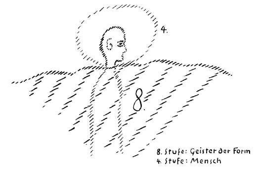
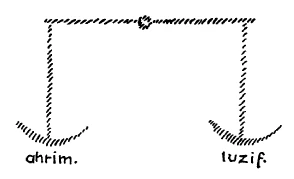

Ich möchte in diesen Tagen etwas sprechen über die Art und Weise, wie wir Menschen der Gegenwart in der Lage sind, uns zu stellen zu derjenigen geistigen Macht, von der wir sagen können, daß sie als die Macht des Michael eingreift in das geistige und damit auch in das übrige Geschehen der Erde. Es wird notwendig sein, daß wir dasjenige, was dabei in Betracht kommt, heute einmal vorbereiten. Denn es sind verschiedene Gesichtspunkte notwendig, welche die menschliche Verständigkeit befähigen, die verschiedenen Eingriffe der eben bezeichneten Macht aus den Symptomen, die wir ja immer in unserer Umgebung bemerken, wirklich wiederzugeben. Wir müssen ja festhalten, daß wir, wenn wir ernsthaft von der geistigen Welt sprechen wollen, immer blicken können auf dasjenige, was sich als Offenbarungen der geistigen Mächte hier in der physischen Welt zeigt. Man sucht gewissermaßen durch den Schleier der physischen Welt durchzudringen zu demjenigen, was in der geistigen Welt wirksam ist. Das, was in der physischen Welt vorhanden ist, kann ja beobachtet werden von jedem Menschen; das, was in der geistigen Welt wirksam ist, dient dann dazu, die Rätsel, welche die physische Welt gibt, aus der geistigen Welt heraus zu lösen. Man muß nur die Rätsel des physischen Lebens in der richtigen Weise empfinden. Es handelt sich gerade bei diesen wichtigen Dingen darum, daß manches, was gerade in der Zeit, die diesen Vorträgen vorangegangen ist, von mir hier gesagt worden ist, in vollem Ernste aufgefaßt werde. Man kann nun einmal nicht verbinden die persönlichsten Auffassungen der Welt mit einem wirklichen Verständnisse desjenigen, was durchgreifend nicht nur die ganze Menschheit, sondern geradezu die Welt angeht. Man muß sich frei machen von den bloß persönlichen Interessen. Man wird ja dasjenige, was die Persönlichkeit in der Welt zu tun hat und was sie von sich als ihren Wert zu begreifen hat, gerade am besten dann einsehen, wenn man sich von dem Persönlichen im engeren Sinne frei gemacht hat. | ^rv2cvb

Nun wissen Sie, daß unserer Entwickelung, die wir als unsere Erdenentwickelung aufzufassen haben, vorangeht eine andere Entwickelung, daß wir also in einer vollen kosmischen Entwickelung drinnenstehen. Sie wissen aber erstens, daß diese Entwickelung weiterschreitet, daß diese Entwickelung an einem Punkt angelangt ist, über den sie hinausgehen wird zu weiteren, fortgeschritteneren Stufen. Sie wissen aber auch zweitens, daß wir es zu tun haben, wenn wir die Welt als solche betrachten, nicht nur mit denjenigen Wesen, die uns zunächst im irdischen Felde entgegentreten, also im mineralischen, im pflanzlichen, im tierischen Reiche, im menschlichen Reiche, sondern daß wir es zu tun haben mit Wesen, die diesen Reichen übergeordnet sind, und die wir zusammengefaßt haben als die Wesen der höheren Hierarchien. Wir müssen immer, wenn wir von der vollen Entwickelung sprechen, auch auf diese Wesen der höheren Hierarchien Rücksicht nehmen. ^aynpbt

Diese Wesen machen ja ihrerseits auch eine Entwickelung durch, die wir verstehen können, wenn wir Analogien finden zu unserer eigenen menschlichen Entwickelung und zu derjenigen, die sonst in den verschiedenen Reichen der Erde vorhanden ist. Ich bitte Sie, nur das Folgende einmal zu berücksichtigen. Sie wissen, wir Menschen sind durchgedrungen durch eine Saturn-, Sonnen-, Mondenentwickelung und sind auf unserer Erde angekommen, so daß wir, wenn wir unsere kosmische Entwickelung ins Auge fassen, davon sprechen können, daß wir als Menschen, wie wir uns nun in der Erdenumgebung fühlen, auf der vierten Stufe unserer Entwickelung angelangt sind. ^a4fe1e

Betrachten wir einmal die unmittelbar über unserer Menschenstufe stehenden Wesen, die wir als die Angeloi bezeichnen. Wir können, wenn wir bloß die Analogie geltend machen, sagen: Diese Wesenheiten, wenn sie auch ganz andere Formen haben als die Form des Menschendaseins ist und zunächst für physische Menschensinne unsichtbar sind, sie haben die Entwickelungsstufe des Jupiter. ^o19czz

Gehen wir dann zu den Archangeloi, so haben sie die Entwickelungsstufe, welche die Menschheit auf der Venus erlangt haben wird. Und gehen wir zu den Archai, zu den Zeitgeistern, also zu denjenigen Wesenheiten, die ganz besonders hereinragen in unsere irdische Entwickelung, so stehen diese bereits in der Vulkanentwickelung. ^hvwt0l

Nun entsteht die bedeutsame Frage: Es gibt ja nun auch die nächsthöherstehende Klasse von Wesenheiten, welche der Hierarchie der sogenannten Formgeister angehört. Wenn wir uns fragen, auf welcher Stufe stehen diese Formgeister, dann müssen wir uns sagen: Sie sind bereits hinausgerückt über dasjenige, was wir Menschen zunächst als unsere Zukunftsentwickelung, als die Vulkanentwickelung erblicken. Sie sind also auf einer Stufe angelangt, von der wir sagen müssen: Wenn wir unsere, für unsere Betrachtungen zunächst hinreichenden Stufen als sieben Stufen bezeichnen, so sind diese Wesenheiten, die wir die Formgeister nennen, auf der achten Stufe angelangt. Wir können also sagen: Wir Menschen stehen auf der vierten Stufe der Entwickelung, nehmen wir die achte Stufe, so finden wir da die Formgeister. ^txb59p

Nun können wir aber nicht uns etwa diese Stufenfolge der Entwickelung nebeneinander denken, sondern wir müssen uns denken, daß das alles durcheinandergeschoben ist. So wie etwa der Luftkreis, der die Erde umgibt und durchdringt, so ist auch diese achte Entwickelungssphäre, welcher die Formgeister angehören, so, daß sie durchdringt die Sphäre, in der wir uns zunächst als Menschen befinden. Wir wollen zunächst diese zwei Stufen der Entwickelung streng ins Auge fassen. ^cr19tv

Wir wollen uns sagen: Wir Menschen als solche, wir befinden uns in einer Sphäre, welche eine vierte Stufe der Entwickelung erlangt hat. Nun befinden wir uns aber außerdem, wenn wir zunächst von allem übrigen absehen, in dem Reiche, das die Formgeister um uns und durch uns als das ihrige zu betrachten haben. Nehmen wir nun konkret den Menschen in seiner Entwickelung. Wir haben ja öfter die Entwickelung dieses Menschen in seiner Gliederung unterschieden. Wir haben unterschieden die Hauptesentwickelung von der übrigen Entwickelung des Menschen. Wir teilen die übrige Entwickelung wiederum in zwei Glieder, in die Brustentwickelung und in die Gliedmaßenentwickelung. Davon wollen wir jetzt zunächst absehen. Wir wollen uns nur auf den Standpunkt stellen, daß wir im Menschen haben alles dasjenige, was zur Hauptesentwickelung gehört, und alles dasjenige, was dem übrigen Menschen zuerteilt ist. ^5werdi

Nun denken Sie sich einmal bildlich die Sache so (es wird gezeichnet), daß Sie sich etwa eine Meeresoberfläche denken, den Menschen wie im Meere watend, im Meere sich vorwärts bewegend, so daß nur sein Kopf herausragt, dann würden Sie durch dieses Bild - es ist selbstverständlich ein Bild - die Lage des gegenwärtigen Menschen haben. Alles dasjenige, worinnen der Kopf wurzelt, würden wir zu der vierten Stufe der Entwickelung zu rechnen haben, und dasjenige, worinnen der Mensch watet, worinnen er sich zwar gehend, oder wir können sagen, schwimmend vorwärts bewegt, würden wir zu bezeichnen haben als die achte Stufe der Entwickelung. Denn es ist das Eigentümliche, daß der Mensch in einer gewissen Weise entwachsen ist mit seinem Haupt demjenigen Elemente, in dem die Geister der Form ihr eigentümliches Wesen entfalten. Der Mensch ist gewissermaßen emanzipiert mit Bezug auf seine Hauptesbildung von demjenigen, was durchimprägniert wird von den Wesen der Geister der Form. ^vdqn8m

 ^uzivyt

Nur dadurch, daß man dieses gründlich versteht, kann man wirklich zu einer Auffassung des Menschen kommen. Denn nur dadurch wird man die besondere Stellung, die der Mensch in der Welt hat, in der richtigen Weise erfassen. Man wird nämlich nur dadurch richtig erfassen, daß der Mensch, insofern er einen gewissen schöpferischen Einfluß auf sich zu verspüren hat von seiten der Geister der Form, diesen schöpferischen Einfluß nicht verspürt unmittelbar durch die Fähigkeiten seines Hauptes, sondern verspürt durch dasjenige, was von seinem übrigen Organismus als Wirkung auf das Haupt ausgeübt wird. Sie wissen ja, wir atmen, und das Atmen steht mit unserem Blutkreislauf im Zusammenhange, wenn wir äußerlich physiologisch sprechen. Das Blut wird aber auch in das Haupt getrieben. Dadurch ist das Haupt in einem organischen, in einem lebensvollen Zusammenhange mit dem übrigen Organismus. Es wird genährt, es wird belebt von dem übrigen Organismus. ^13virx

Sie müssen zwei Dinge genau unterscheiden. Das eine ist, daß das Haupt in unmittelbarem Zusammenhange steht mit der Außenwelt. Wenn Sie eine Sache sehen, so nehmen Sie diese Sache durch Ihre Augen wahr. Da ist ein unmittelbarer Zusammenhang zwischen der Außenwelt und Ihrem Haupte. Wenn Sie aber das Leben Ihres Hauptes betrachten, wie es unterhalten wird durch den Atmungs- und Blutkreislaufprozeß, dann haben Sie heraufschießend das Blut von dem übrigen Organismus in das Haupt, und Sie können sagen, da haben Sie keinen unmittelbaren Zusammenhang Ihres Hauptes mit der Umgebung, sondern einen mittelbaren. ^t1faxy

Sie müssen natürlich nicht pedantisch unterscheiden, indem Sie sagen, nun ja, die Atemluft wird ja durch den Mund eingezogen, also gehört die Atmung auch zum Haupte. Ich habe deshalb gesagt, das ist nur ein Bild. Organisch gehört dasjenige, was durch den Mund eingezogen wird, nicht eigentlich zum Haupte, sondern es gehört zu dem übrigen Organismus. ^hkkkke

Wenn Sie einmal diese Grundbegriffe, die wir jetzt aufgenommen haben, zunächst ins Auge fassen wollen, wenn Sie festhalten wollen an der Idee, daß wir drinnenstehen in zwei Sphären, in derjenigen Sphäre, in die wir gebracht sind dadurch, daß wir Saturn-, Sonnen-, Mondenentwickelung durchgemacht haben und innerhalb der Erdenentwickelung stehen, daß wir also auf der vierten Stufe unserer Entwickelung stehen, wenn Sie ferner in Betracht ziehen, daß wir außerdem drinnenstehen in einem Leben, in einer Sphäre, welche so angehört den Formgeistern wie uns die Erde angehört, welche aber unsere Erde durchdringt und nur unser Haupt ausschließt, so daß wir mit unserem ganzen übrigen Organismus, mit alldem, was nicht Sinnesauffassung ist, stehen in dieser achten Sphäre: wenn Sie dies ins Auge fassen, so haben Sie eine gewisse Grundlage geschaffen für das Folgende. ^38ie0r

Doch ich will noch durch andere Begriffe eine gewisse Grundlage schaffen. Wenn wir unser Leben unter solchen Einflüssen betrachten wollen, so können wir es nicht anders betrachten, als indem wir ins Auge fassen diejenigen an dem Weltengeschehen mitwirkenden Wesenheiten, die wir öfter schon erwähnt haben: die luziferischen und die ahrimanischen Wesenheiten. Fassen wir zunächst nur einmal, ich möchte sagen, das Alleräußerlichste an diesen Wesen, an den luziferischen und ahrimanischen Wesenheiten ins Auge. Sie bewohnen ebenso wie wir Menschen die Sphären, in denen wir eben drinnenstehen. Wenn wir ihr Außerlichstes ins Auge fassen, so können wir sagen: Alle luziferischen Wesenheiten können wir uns vorstellen als Inhaber derjenigen Kräfte, die wir als Menschen dann verspüren, wenn wir phantastisch werden wollen, wenn wir einseitig uns der Phantasie hingeben, wenn wir einseitig uns der Schwärmerei hingeben, wenn wir — um mich bildlich auszudrücken — mit unserem Wesen über unseren Kopf hinaus wollen. Wenn wir als Mensch mit unserem Wesen über unseren Kopf hinaus wollen, so sind das Kräfte, welche in unserer Menschenorganisation eine gewisse Rolle spielen, die aber die universellen Kräfte derjenigen Wesen sind, die wir luziferische Wesen nennen. Denken Sie sich Wesen, ganz geformt aus dem, was in uns über unseren Kopf hinausstreben will, so haben Sie die luziferischen, die mit unserer Menschenwelt in einer gewissen Beziehung stehen. Denken Sie sich umgekehrt alles dasjenige, was uns auf die Erde drückt, alles dasjenige, was uns zu nüchternen Philistern macht, was uns dazu bringt, materialistische Gesinnungen zu entwickeln, was uns durchdringt mit dem, was wir nennen können trockenen Verstand und so weiter, so haben Sie die ahrimanischen Mächte. ^fhcis7

Man kann alles dasjenige, was ich jetzt eben mehr seelisch gesagt habe, auch mehr leiblich ausdrücken. Man kann sagen: Der Mensch ist eigentlich immer in einer Art Mittelpunktslage zwischen dem, was sein Blut mit ihm will, und dem, was seine Knochen mit ihm wollen. Die Knochen wollen uns fortwährend zum Erstarren bringen, die Knochen wollen uns mit anderen Worten auch leiblich ahrimanisch machen, verhärten. Das Blut möchte uns über uns selbst hinaustreiben. Pathologisch gesprochen: Das Blut kann fiebrig werden, dann wird der Mensch auch organisch in die Phantasterei hineingetrieben; die Knochen können ihr Wesen ausdehnen über den übrigen Organismus, dann verknöchert der Mensch, er wird sklerotisch, wie es fast jeder Mensch im Alter bis zu einem gewissen Grade wird. Dann trägt er das tötende Element in seinem Organismus in sich: Das ist das Ahrimanische. Man kann sagen: Alles dasjenige, was im Blute liegt, hat die Hinneigung zum Luziferischen, alles dasjenige, was in den Knochen liegt, hat die Hinneigung zum Ahrimanischen, und der Mensch ist die Gleichgewichtslage zwischen beiden, so wie er die Gleichgewichtslage sein muß in seelischer Beziehung zwischen der Schwärmerei und der nüchternen Philistrosität. ^wnznmk

Wir können aber auch in einer gewissen Weise tiefer diese beiden Wesenheiten charakterisieren. Wir können einmal uns die luziferischen Wesenheiten anschauen, was sie gewissermaßen im kosmischen Dasein für Interessen haben. Und da findet man, daß die Juziferischen Wesenheiten vor allen Dingen das Interesse haben im Kosmos, die Welt, namentlich die Menschenwelt, abtrünnig zu machen von denjenigen geistigen Wesenheiten, die wir als die eigentlichen menschenschöpferischen Wesenheiten auffassen müssen. Die luziferischen Wesenheiten möchten nichts anderes, als die Welt, man könnte sagen, von den göttlichen Wesenheiten abtrünnig machen. Nicht so sehr, daß luziferische Wesenheiten in erster Linie die Absicht hätten, sich selber die Welt anzueignen. Sie werden aus Verschiedenem, was ich schon gesagt habe über die luziferischen Wesenheiten, entnehmen können, daß das nicht die Hauptsache ist bei den luziferischen Wesenheiten, sondern die Hauptsache ist: von dem, was der Mensch empfinden kann als seine eigentlichen göttlichen Wesenheiten, abtrünnig zu machen die Welt, frei zu machen die Welt davon. ^4ogo64

Die ahrimanischen Wesenheiten haben eine andere Absicht. Sie haben die entschiedene Absicht, namentlich das Menschenreich, aber damit die übrige Erde, in ihre Machtsphäre zu bekommen, von sich abhängig zu machen, namentlich zunächst die Menschen als solche zu beherrschen. Während also die luziferischen Wesenheiten darauf hinarbeiten zunächst und immer hingearbeitet haben, die Menschen abtrünnig zu machen von dem, was die Menschheit als ihr Göttliches empfinden kann, haben die ahrimanischen Wesenheiten die Tendenz, die Menschheit und alles, was dazu gehört, in ihre Machtsphäre allmählich einzubeziehen. ^hqr6eu

So ist eigentlich in unserem Kosmos, in den wir hineinverwoben sind als Menschen, ein Kampf vorhanden zwischen den fortwährend nach Freiheit, nach universeller Freiheit strebenden luziferischen Wesenheiten, und den nach einer immerwährenden Macht und Kraft strebenden ahrimanischen Wesenheiten. Dieser Kampf, in dem wir drinnenstehen, durchdringt alles. Das bitte ich Sie als die zweite für unsere weitere Betrachtung wichtige Idee festzuhalten. Die Welt, in der wir drinnenstehen, ist durchdrungen von luziferischen und ahrimanischen Wesenheiten, und es besteht dieser gewaltige Gegensatz zwischen der befreienden Tendenz der luziferischen Wesenheiten und der nach Macht strebenden Tendenz der ahrimanischen Wesenheiten. ^ecfx7n

Wenn Sie diese ganze Sache ins Auge fassen, dann werden Sie sich sagen: Verstehen kann ich die Welt eigentlich nur, wenn ich sie mit Bezug auf die Dreizahl ins Auge fasse. Denn wir haben auf der einen Seite alles dasjenige, was luziferisch ist, auf der anderen Seite alles dasjenige, was ahrimanisch ist, mitten hineingestellt den Menschen, der als ein Drittes, wie im Gleichgewichtszustande zwischen beiden, sein Göttliches empfinden muß. Nur dadurch kommt man mit dem Weltverständnis zurecht, daß man diese Dreiheit zugrunde legt, daß man sich klar darüber ist: Es ist dieses menschliche Leben wie ein Waagebalken (siehe Zeichnung S. 19). Hier das Hypomochlion, da eine Waagschale, das Luziferische, das aber in Wirklichkeit hinaufzieht. Auf der anderen Seite das Ahrimanische, das in Wirklichkeit hinunterzieht. Den Waagebalken im Gleichgewicht zu erhalten, das ist das Wesen des Menschen. Es haben diejenigen, die eingeweiht waren in solche Geheimnisse, immer betont in der geistigen Menschheitsentwickelung, daß man das Weltendasein, in das der Mensch hineingestellt ist, nur im Sinne der Dreizahl verstehen kann, daß man nicht verstehen kann die Welt, wenn man sie gewissermaßen auffassen will in ihrer Grundstruktur im Sinne der anderen Zahlen als im Sinne der Dreizahl. So daß wir sagen dürfen, in unserer Sprache sprechend: Wir haben es zu tun im Weltendasein mit dem Luziferischen, das die eine Waagschale, dem Ahrimanischen, das die andere Waagschale darstellt, und dem Gleichgewichtszustande, der uns darstellt den Christus-Impuls. ^uw6po2

 ^6ukqhu

Nun können Sie sich denken, daß es durchaus im Interesse der ahrimanischen und der luziferischen Mächte liegt, dieses Geheimnis der Dreizahl zu verhüllen. Denn die richtige Durchdringung dieses Geheimnisses der Dreizahl befähigt ja die Menschheit, den Gleichgewichtszustand zwischen ahrimanischen und luziferischen Mächten herzustellen. Das heißt auf der einen Seite, alle Tendenz nach Freiheit, das Luziferische, zu benützen zu einem gedeihlichen Weltenziele, auf der anderen Seite das gleiche zu tun mit dem Ahrimanischen. Des Menschen normalster Geisteszustand besteht darin, in der richtigen Weise sich hineinzuversetzen in diese Trinität der Welt, in diese Struktur der Welt, insofern ihr die Dreizahl zugrunde liegt. ^3ds17r

Es bestand nun und besteht — wir werden die Quellen dieses Bestehens schon noch genauer morgen und übermorgen zu besprechen haben — einmal in dem, was auf das menschliche Geistes- und Kulturleben Einfluß hat, eine starke Tendenz, den Menschen zu verwirren in bezug auf diese Bedeutung der Dreizahl. Eine starke Tendenz besteht, den Menschen mit Bezug auf diese, wir dürfen sagen, heilige Dreizahl zu verwirren. Und wir können in der neueren Menschheitskultur sehr deutlich sehen, wie fast ganz zugedeckt wird diese Gliederung nach der Dreizahl durch eine Gliederung nach der Zweizahl. Bedenken Sie nur einmal, daß man ja sogar, um den Goetheschen «Faust» richtig zu verstehen, wie ich das öfter hier auseinandergesetzt habe, wissen muß, daß bis in dieses gewaltige Weltengedicht hinein die Verwirrung mit Bezug auf diese Dreizahl spielt. Hätte Goethe zu seiner Zeit schon ganz durchschauen können, wie es sich eigentlich mit diesen Dingen verhält, dann hätte er nicht bloß dargestellt als den Gegner des Faust, als denjenigen, der Faust herabzieht, die mephistophelische Macht, sondern er hätte dieser mephistophelischen Macht, von der wir ja wissen, daß sie identisch ist mit der ahrimanischen Macht, gegenübergestellt die luziferische Macht, und es würden Luzifer und Mephistopheles als zwei Parteien im «Faust» auftreten. Das habe ich ja schon wiederholt hier ausgeführt. Man kann auch, wenn man die Goethesche Mephistopheles-Figur studiert, genau sehen, wie Goethe überall durcheinandergebracht hat in der Charakteristik des Mephistopheles das luziferische und das ahrimanische Element. Die Figur des Mephistopheles ist bei Goethe gewissermaßen aus zwei Elementen gemischt. Es ist keine einheitliche Gestalt. Es ist bunt durcheinandergeworfen das luziferische und das ahrimanische Element. Ich habe das in meinem kleinen Büchelchen «Goethes Geistesart» ausführlicher auseinandergesetzt. ^mihwsb

Diese Verwirrung, die also bis in den Goetheschen «Faust» hineinspielt, ist durchaus darauf begründet, daß nach einer gewissen Richtung hin - in älterer Zeit war es anders — in der neueren Menschheitsentwikkelung sich der Wahn geltend gemacht hat, an die Stelle der Dreizahl, wenn man auf die Weltstruktur sieht, die Zweizahl zu setzen: das gute Prinzip auf der einen Seite, das böse Prinzip auf der anderen Seite, Gott und den Teufel. ^fgvllf

Denken Sie nur, daß wir also festzustellen haben: Will jemand sachgemäß in die Weltenstruktur hineinblicken, dann muß er die Dreizahl anerkennen, muß anerkennen, daß sich gegenüberstehen das luziferische und das ahrimanische Element, und daß das Göttliche besteht in dem Gleichgewichthalten zwischen beiden. Dem haben wir gegenüberzustellen den Irrwahn, der eingezogen ist in die Geistesentwickelung der Menschheit mit der Zweiheit, mit Gott und dem Teufel, mit den geistig-göttlichen Mächten oben und den teuflischen Mächten unten. Es ist so, wie wenn man den Menschen gewissermaßen hinausbringen, hinausquetschen würde aus der Gleichgewichtslage, wenn man ihm verhehlt, daß das eigentliche Heil des Weltenverständnisses in dem richtigen Auffassen der Dreizahl besteht, und wenn man ihm vormacht, daß irgendwie die Weltenstruktur bedingt sei durch eine Zweizahl. Dennoch ist bestes menschliches Streben diesem Irrtum verfallen. ^zhtioh

Will man auf diesen Punkt eingehen, dann muß man das gar sehr ohne alles Vorurteil tun, dann muß man wirklich einmal sich hinausversetzen in eine vorurteilslose Sphäre. Dann muß man gar sehr unterscheiden zwischen den Sachen und den Namen. Dann muß man sich nicht verführen lassen zu der Meinung: dadurch, daß man einer Wesenheit einen bestimmten Namen gibt, sei diese Wesenheit auch schon in der richtigen Weise vom Menschen empfunden. ^10gz7f

Fassen wir einmal den Begriff derjenigen Wesenheiten, die der Mensch als seine göttlichen Wesenheiten empfinden soll, dann müssen wir uns sagen: Der Mensch kann richtig diese Wesenheiten nur empfinden, wenn er sie sich denkt als das Gleichgewicht bewirkend zwischen dem luziferischen und dem ahrimanischen Prinzip. Er kann dasjenige, was er als sein Göttliches empfinden soll, niemals als Richtiges empfinden, wenn er auf diese Dreigliederung nicht eingeht. Betrachten Sie von diesem Gesichtspunkte aus einmal eine Dichtung wie «Das verlorene Paradies» von Milton, oder betrachten Sie eine Dichtung wie Klopstocks Messiade, die unter dem Einflusse des «Verlorenen Paradieses» von Milton entstanden ist. Da haben Sie im Grunde nichts von einem wirklichen Verständnis einer dreigliedrigen Weltstruktur, da haben Sie einen Kampf zwischen vermeintlich Gutem und vermeintlich Bösem, den Kampf zwischen dem Himmel und der Hölle. Da haben Sie so recht in die menschliche Geistesentwickelung den Irrwahn der Zweiheit hineingetragen. Da haben Sie dasjenige, was vielfach im populären Bewußtsein wurzelt als der wahnvolle Gegensatz zwischen Himmel und Hölle, in zwei neuere Weltgedichte hineingetragen. ^x6gzah

Es nützt nichts, wenn Milton oder Klopstock die Wesen des Himmels als göttliche Wesen bezeichnen. Göttliche Wesen, wie sie der Mensch empfinden soll, wären sie nur, wenn zugrunde läge die dreigliedrige Struktur des Weltendaseins. Dann würde man sagen können: Da findet ein Kampf statt zwischen dem guten Prinzip und dem bösen Prinzip. So aber, wie die Sache liegt, wird eine Zweiheit angenommen, dem einen Glied dieser Zweiheit das Gute beigelegt, Namen gefunden, die den Wesen beigelegt werden, die eigentlich vom Göttlichen hergenommen sind, und auf die andere Seite das teuflische, das antigöttliche Element gestellt. Was ist damit eigentlich in Wirklichkeit getan? Damit ist in Wirklichkeit nichts Geringeres getan, als daß das wirklich Göttliche aus dem Bewußtsein herausgerückt ist, und daß das Luziferische mit dem göttlichen Namen belegt wird, daß wir in Wahrheit vorliegen haben einen Kampf zwischen Luzifer und Ahriman, und daß nur dem Ahriman luziferische Eigenschaften beigelegt werden, und dem Reiche des Luzifer werden die göttlichen Eigenschaften beigelegt. ^vlz9ro

Sie sehen, von welch ungeheurer Tragweite eine solche Betrachtung eigentlich ist. Während die Menschen glauben, mit einer solchen Gegenüberstellung, wie man sie findet in Miltons «Verlorenem Paradies» oder in Klopstocks «Messias», habe man es zu tun mit den göttlichen und den höllischen Elementen, hat man es in Wahrheit zu tun mit dem luziferischen und dem ahrimanischen Elemente. Vom wirklich göttlichen Elemente liegt kein Bewußtsein vor, dagegen werden dem luziferischen Elemente die göttlichen Namen beigelegt. ^ppljez

Nun sind Miltons «Verlorenes Paradies» und Klopstocks «Messias» eben nur die Geistesschöpfungen, die herausragen aus dem neueren Bewußtsein der Menschheit. Denn dasjenige, was sich in diesen Dichtungen auslebt, ist allgemeines Bewußtsein der Menschheit. Es ist ja eingezogen in dieses neuere Bewußtsein der Menschheit der Irrwahn der Zweizahl, und es ist hintangehalten worden die Wahrheit von der Dreizahl. Tiefstes, das die Menschheit in der neueren Zeit hervorgebracht hat, zu dem sie von einem gewissen Gesichtspunkte aus mit Recht hinschaut als zu den größten Hervorbringungen der neueren Zeit, ist eine Kulturmaja, ist eine große Täuschung und entsprungen aus der großen Täuschung der neueren Menschheit. Das alles, was in diesem Irrwahn wirkt, das ist im Grunde genommen Schöpfung der ahrimanischen Einflüsse, jener Einflüsse, die sich einstmals konzentrieren werden in der Inkarnation des Ahriman, von der ich Ihnen schon gesprochen habe. Denn dieser Irrwahn, in dem wir drinnenstehen, ist nichts anderes als das Ergebnis jener falschen Weltbetrachtung, die für die Menschen der neueren Kultur, der neueren Zivilisation überall hervorsprießt aus der Welt, indem sie entgegensetzen Himmel und Hölle. Der Himmel wird als Göttliches angesehen, so wie sie ihn schildern, und die Hölle wird als das Teuflische angesehen, während in Wahrheit man es zu tun hat auf der einen Seite mit dem himmlisch genannten Luziferischen und auf der anderen Seite mit dem höllisch genannten Ahrimanischen. ^d6ozzv

Wir müssen nur bedenken, welche Interessen da in der neueren Geistesgeschichte walten. Sogar die Dreigliederung des menschlichen Organismus oder des Menschenwesens im Ganzen ist ja in einer gewissen Beziehung, wie ich es Ihnen öfters erwähnt habe, für die abendländische Zivilisation durch das achte ökumenische Konzil von Konstantinopel im Jahre 869 aus der Welt geschafft worden. Es ist zum Dogma erhoben, daß der Christ nicht zu glauben habe an eine dreigliedrige Menschenwesenheit, sondern nur an eine zweigliedrige Menschenwesenheit. An Leib, Seele und Geist zu glauben gilt als verpönt, und die mittelalterlichen Theologen und Philosophen, die noch viel wußten von der Wahrheit, die hatten eine große Mühe, sich um diese Wahrheit herumzudrücken, denn die sogenannte Trichotomie, die Gliederung des Menschen in Leib, Seele und Geist, war für ketzerisch erklärt worden. Sie mußten die Zweiheit lehren: der Mensch bestehe aus Leib und Seele, nicht aus Leib, Seele und Geist. Und das ist ja dasjenige, wovon gewisse Wesen, wovon gewisse Menschen gut wissen, was es für eine ungeheure Bedeutung hat für das menschliche Geistesleben, die Zweigliederung an die Stelle der Dreigliederung zu setzen. ^b7ivrz

Auf solche Tiefen muß hingeblickt werden, wenn man richtig verstehen will, warum in der Novembernummer der «Stimmen der Zeit» von dem Jesuitenpater Zimmermann darauf hingewiesen wird, daß eines der neueren Dekrete des heiligen Offiziums von Rom den Katholiken bei Strafe, nicht die Absolution in der Beichte zu erlangen, verbietet, theosophische Schriften zu lesen oder zu haben oder sich an irgend etwas Theosophischem zu beteiligen. Das interpretiert der Jesuitenpater Zimmermann in den «Stimmen der Zeit», die früher «Stimmen aus Maria-Laach» geheißen haben, so, daß es vor allen Dingen anzuwenden sei auf meine Anthroposophie, daß also vor allen Dingen darauf gesehen werden müsse, daß diejenigen Katholiken, welche als echte Katholiken von Rom angesehen werden wollen, sich nicht zu beschäftigen haben mit anthroposophischer Literatur. Als einer der Hauptgründe wurde da angeführt, daß unterschieden werde die menschliche Wesenheit in Leib, Seele und Geist, daß also ein Ketzerisches gelehrt werde gegenüber dem Rechtgläubigen, das darin bestehe, den Menschen zu unterscheiden in Leib und Seele. ^8onid6

Ich habe Ihnen ja auch erwähnt, daß diese Unterscheidung in Leib und Seele, ohne daß sie es wissen, auf die modernen Philosophen übergegangen ist, die glauben, vorurteilslose, voraussetzungslose Wissenschaft zu betreiben, die glauben, wirklich zu beobachten, um dadurch zu der Einsicht zu kommen, daß der Mensch bestehe aus Leib und Seele. In Wahrheit befolgen auch sie nur dasjenige, was durch jenes Dogma in die neuere Geistesentwickelung hineingekommen ist. Was heute als Wissenschaft angesehen wird, ist im Grunde genommen ganz abhängig von solchen Dingen, wie sie im Laufe der neueren Menschheitsentwikkelung in die Welt hineinversetzt worden sind. Glauben Sie nicht, daß Sie durch irgendwelche guten Worte, die Sie oftmals meinen, Leuten geben zu müssen, welche aus solchen Ecken heraus Anthroposophie verketzern, diese Leute bekehren können, oder daß Sie sie zu einem gewissen Wohlwollen bekehren können gegenüber der Anthroposophie. Anthroposophie muß sich durch sich selbst in der Welt Eingang verschaffen, nicht durch die Protektion irgendwelcher, und wären sie auch als noch so christlich angesehene Mächte. Durch innere Kraft allein kann Anthroposophie dasjenige erreichen, was sie in der Welt erreichen soll. ^11xag6

Bedenken Sie, der Christus-Impuls ist nur zu begreifen, wenn man ihn als den Gleichgewichtsimpuls ansieht zwischen dem Ahrimanischen und dem Luziferischen, wenn man ihn in die Trinität richtig hineinzustellen weiß. Was muß man tun — so kann man die Frage aufwerfen —, wenn man die Menschen irreführen will über den eigentlichen Christus-Impuls? Man muß die Menschen ablenken von der wahren Weltengliederung nach der Dreizahl und muß sie hinführen zu dem Irrwahn der Zweizahl, die nur da ihre Berechtigung hat, wo es sich um das Offenbare handelt, nicht da, wo es sich darum handelt, auch hinter dasjenige zu kommen, was hinter dem Offenbaren steht, was in der Sphäre des Wahren liegt. ^ezeydl

Wir müssen uns klar sein darüber, daß wir in solchen Dingen durchaus über bloße Namen hinauskommen müssen. Dadurch, daß man irgend etwas Christus nennt, hat man den Christus nicht getroffen. Und man kann verhindern, daß der Christus getroffen werde mit dem Christus-Namen, wenn man an die Stelle der Dreizahl die Zweizahl stellt. Wollte irgend jemand den Menschen sicher davon abbringen, einen richtigen Begriff von dem Christus zu erringen, dann hätte er nur nötig, an die Stelle der Dreizahl die Zweizahl zu setzen. Und soll dann auf den Christus-Impuls in einem wahrhaftigen Sinne wiederum hingedeutet werden, dann ist es notwendig, daß der Zweizahl die Dreizahl entgegengesetzt werde. Man braucht nicht auch ein Ketzererklärer zu werden neben Ketzererklärern. Sie brauchen von heute ab nicht Miltons «Verlorenes Paradies» oder Klopstocks «Messias» für verdammte Teufelsschriften zu erklären, Sie können sich an der Schönheit und Größe selbstverständlich weiter erfreuen. Aber Sie sollen sich klarwerden darüber, daß in solchen Schriften, insofern sie die Blüten gerade der populären neueren Menschheitszivilisation sind, von Christus überhaupt nicht die Rede ist, sondern daß solche Schriften hervorgehen aus dem Irrwahn, daß man alles dasjenige, was nicht der Menschheitsentwickelung zugehört, auf der einen Seite nach dem Teuflischen hin rechnen darf, und daß man auf der anderen Seite das Göttliche bekommt. Nein, man bekommt bloß das Luziferische. Und schreibt man dann ein «Verlorenes Paradies», dann beschreibt man in Wirklichkeit die Austreibung der Menschen aus dem Reiche des Luzifer in das Reich des Ahriman, und man schildert die Sehnsucht der Menschen nicht nach dem Göttlichen, man schildert die Sehnsucht der Menschen nach dem verlorenen Paradiese, das heißt aber nach dem Reiche des Luzifer. Schöne Beschreibungen der menschlichen Sehnsucht nach dem luziferischen Reiche mögen Sie sehen in Miltons «Verlorenem Paradies», mögen Sie sehen in Klopstocks «Messias»; aber eben das sollen Sie darinnen sehen, denn das sind sie. ^ab1pmy

Gar sehr sind gewisse Vorstellungen, die in die neuere Menschheit eingezogen sind, zu revidieren. Wir stehen heute, indem wir im Ernste uns anschicken, anthroposophisch zu denken und zu empfinden, nicht vor kleinen Entscheidungen, wir stehen vor großen Entscheidungen. Wir stehen davor, ein Wort, das Nietzsche oftmals gebraucht hat, sehr ernst zu nehmen. Das Wort von der Umwertung gewisser Werte, es muß sehr, sehr ernst genommen werden. Die Menschheitsleistungen der neueren Zeit müssen gar sehr umgewertet werden. ^z98gr1

Man braucht deshalb durchaus nicht auch ein Ketzerverdammer zu werden. Wir führen fortwährend Szenen aus dem Goetheschen «Faust» auf, und ich habe Jahrzehnte dem Studium Goethes gewidmet. Aber aus meiner kleinen Schrift «Goethes Geistesart» können Sie entnehmen, daß mich das nicht blind gemacht hat gegen die falsche Charakteristik, die in der Goetheschen Mephistopheles-Figur lebt. Es wäre durchaus philiströs, zu sagen: Goethes Mephistopheles ist falsch, also weg damit. Da würde man es ja machen wie gewisse Ketzerrichter. In diese Lage dürfen wir uns als moderne Menschen nicht bringen. Aber wir dürfen uns auch nicht in bequemer Weise bei dem befriedigen, was den breitesten Menschenmassen aus dem neueren Geistesleben wie in Fleisch und Blut übergegangen ist. Ungeheuer viel wird die Menschheit lernen müssen. In bezug auf vieles wird sie Umwertungen vornehmen müssen. ^1n8fz3

Alles das hängt zusammen mit der Sendung des Michael gegenüber denjenigen Wesen der höheren Hierarchien, mit denen er wiederum in Verbindung steht. Und wie wir dazu kommen können, diejenigen Impulse, die von der Michael-Wesenheit in unser irdisches Menschendasein hereinstrahlen, zu verstehen, davon wollen wir dann morgen und übermorgen sprechen. ^fxt7bg