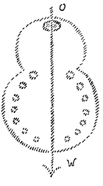
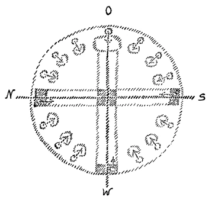
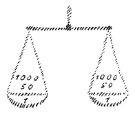
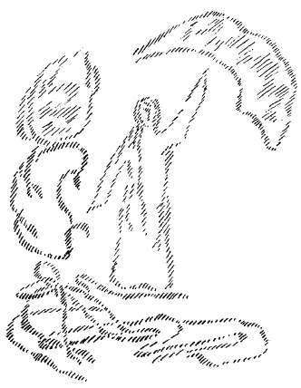

Gestern habe ich Ihnen gesprochen von den Beziehungen anthroposophisch orientierter Geisteswissenschaft zu den Formen unseres Baues. Ich wollte besonders darauf hinweisen, daß die Beziehungen dieses Baues zu unserer Geisteswissenschaft nicht äußerliche sind, sondern daß gewissermaßen der Geist, der waltet in unserer Geisteswissenschaft, eingeflossen ist in diese Formen. Und ein besonderer Wert muß darauf gelegt werden, daß gewissermaßen behauptet werden kann, daß ein wirkliches, empfindungsgemäßes Verstehen dieser Formen ein Ablesen des inneren Sinnes bedeutet, der in unserer Bewegung vorhanden ist, Ich möchte heute noch auf einiges auf den Bau Bezügliches eingehen, um dann daran anknüpfend einige wichtige Dinge aus der Anthroposophie Ihnen heute oder morgen vorzubringen. ^fbisc9

Sie werden sehen, wenn Sie sich den Bau betrachten, daß sein Grundriß zwei ineinandergreifende Kreise sind, ein kleinerer und ein größerer, so daß ich etwa schematisch den Grundriß so zeichnen könnte (es wird der Grundriß gezeichnet). ^5vrs97

Der ganze Bau ist von Osten nach Westen orientiert. (Es wird die Ost-West-Linie gezogen.) Nun werden Sie gesehen haben, daß diese Ost-West-Linie die einzige Symmetrie-Achse ist, daß also alles symmetrisch auf diese Achse hin orientiert ist. ^szy61k

Im übrigen haben wir es nicht zu tun mit einem bloßen mechanischen Wiederholen der Formen, wie man es sonst in der Baukunst findet, etwa mit gleichen Kapitälen oder dergleichen, sondern wir haben es zu tun, wie ich schon gestern ausführte, mit einer Evolution der Formen, mit einem Hervorgehen späterer Formen aus früheren Formen. ^ax8151

Sie finden, abschließend den äußeren Umgang, sieben Säulen zur Linken und sieben zur Rechten. (Die Säulen werden angedeutet.) Und ich habe schon gestern erwähnt, daß diese sieben Säulen Kapitäle und Sockel haben und über sich die entsprechenden Architrave, die in fortlaufender Evolution ihre Formen entwickeln. ^02vzni

 ^9nrhnk

Wenn Sie diesen Grundriß empfinden, dann werden Sie einfach in diesen zwei ineinandergreifenden Kreisen — aber Sie müssen es empfindungsgemäß erfassen — etwas haben, was hinweist auf die Entwickelung der Menschheit. Ich habe schon gestern gesagt, daß ungefähr in der Mitte des 15. Jahrhunderts ein ganz bedeutungsvoller Einschnitt in der Entwickelung der Menschheit zu verzeichnen ist. Dasjenige, was man schulmäßig und äußerlich «Geschichte» nennt, das ist ja nur eine Fable convenue, denn die verzeichnet äußere Tatsachen so, daß dabei der Schein hervorgerufen wird, als wenn es mit dem Menschen im wesentlichen schon im 8., 9. Jahrhunderte so gestanden hätte, wie es etwa im 18. oder 19. Jahrhundert gestanden hat. Es sind ja sogar schon neuere Geschichtsschreiber darauf gekommen, zum Beispiel Lamprecht, daß dies ein Unsinn ist, daß in der Tat die Seelenverfassung und Seelenstimmung der Menschen eine ganz andere war vor und nach dem angedeuteten Zeitpunkte. Und wir in der Gegenwart stehen in einer Entwickelung drinnen, die wir nur verstehen können, wenn wir uns bewußt werden, daß wir mit eigenartigen Seelenkräften uns der Zukunft entgegen entwickeln, und daß diejenigen Seelenkräfte, die ihre Entwickelung durchgemacht haben bis in diejenige des 15. Jahrhunderts, zwar jetzt noch, man könnte sagen, in den Menschenseelen spuken - sie klingen ab -, daß sie aber zu dem gehören, was untergeht, zu dem, was verurteilt ist dazu, aus der Menschheitsevolution herauszufallen. Über diesen wichtigen Umschwung in der Menschheitsentwickelung muß man ein Bewußtsein entwickeln, wenn man überhaupt fähig werden soll, über die Angelegenheiten der Menschheit in der Gegenwart und in der nächsten Zukunft mitzureden. ^jbfqq8

Solche Dinge drücken sich besonders da aus, wo die Menschen bedeutungsvoll hinweisen wollen auf dasjenige, was sie fühlen, was sie empfinden. Wir brauchen uns ja nur an eines in der Entwickelung der Baukunst zu erinnern, was wir hier ja schon angeführt haben, auf das ich aber heute erneut wiederum hinweisen will, um an einem Beispiele zu zeigen, wie die Entwickelung der Menschheit fortschreitet. ^34phw7

Betrachten Sie einmal die Formen eines griechischen Tempels. Wie kann man die Formen eines griechischen Tempels verstehen? Man kann sie nur verstehen, wenn man sich klar darüber ist, daß der ganze Baugedanke dieses griechischen Tempels daraufhin orientiert ist, den Tempel zum Wohnhaus des Gottes oder der Göttin zu machen, die man als Standbild darinnen hatte. Alle Formen des griechischen Tempels wären ein Unding, wenn man ihn nicht so auffaßte, daß er die Umhüllung, das Wohnhaus des Gottes oder der Göttin ist, die drinnenstehen sollten. ^c2sqsz

Schreiten wir vor von den Formen des griechischen Tempels zu den nächsten, wiederum signifikanten Formen des Bauens, so kommen wir zu dem gotischen Dom. Wer in einen gotischen Dom hineingeht und das Gefühl hat, er habe mit diesem gotischen Dom etwas Abgeschlossenes, Fertiges vor sich, der versteht die Formen des gotischen Baues nicht, ebensowenig wie derjenige die Formen des griechischen Tempels versteht, der ihn auch so betrachten kann, daß kein Götterbild drinnensteht. Ein griechischer Tempel ohne Götterbild — wir brauchen es uns ja nur drinnen zu denken, aber es muß eben, um die Form zu verstehen, drinnen gedacht werden -, ein griechischer Tempel ohne Götterbild ist eine Unmöglichkeit für das empfindende Verständnis. Ein gotischer Dom, der leer ist, ist auch eine Unmöglichkeit für den Menschen, der wirklich so etwas empfindet. Der gotische Dom ist erst fertig, wenn die Gemeinde drinnen ist, wenn er mit Menschen angefüllt ist, und eigentlich nur dann, wenn er mit Menschen angefüllt ist und zu den Menschen gesprochen wird, so daß der Geist des Wortes über der Gemeinde oder in den Herzen der Gemeinde waltet. Dann ist der gotische Dom fertig. Aber die Gemeinde gehört dazu, sonst sind die Formen nicht verständlich. ^ydwoax

Was haben wir denn da eigentlich für eine Evolution vor uns von dem griechischen Tempel bis zum gotischen Dom? Das andere sind im Grunde genommen Zwischenformen, was auch darüber irrtümliche Geschichtsauslegung sagen möge. Was haben wir denn da für eine Evolution vor uns? Wenn wir auf die griechische Kultur hinblicken, diese Blüte der vierten nachatlantischen Periode, so müssen wir sagen: Im griechischen Bewußtsein lebte noch etwas von dem Verweilen göttlich-geistiger Gewalten unter den Menschen, nur daß die Menschen dazu verhalten waren, ihren Göttern, die sie sich selbst nur in den Bildern vergegenwärtigen konnten, Wohnhäuser zu bauen. Der griechische Tempel war das Wohnhaus des Gottes oder der Göttin, von denen man das Bewußtsein hatte: sie gehen herum unter den Menschen. Ohne dieses Bewußtsein der Gegenwart göttlich-geistiger Mächte ist die Hineinstellung des griechischen Tempels in die griechische Kultur gar nicht zu denken. ^k1br67

Schreiten wir nun vorwärts von der Blüte der griechischen Kultur zu dem Auslauf dieser Kultur gegen das Ende der vierten nachatlantischen Periode, also gegen die Zeiten des 8., 9., 10. nachchristlichen Jahrhunderts, so kommen wir hinein in die Formen der gotischen Baukunst, die da fordert die Gemeinde. Alles entspricht dem Empfindungsleben der Menschen der damaligen Zeit. Die Menschen waren in ihrer Seelenstimmung natürlich anders in dieser Zeit, als in der Hochblüte des griechischen Denkens. Das Bewußtsein von der unmittelbaren Gegenwart göttlich-geistiger Mächte war nicht vorhanden, die göttlich-geistigen Mächte waren fern in ein Jenseits versetzt. Das irdische Reich war vielfach angeklagt als ein solches des Abfallens von den göttlich-geistigen Mächten. Das Materielle sah man an als etwas, das zu meiden ist, von dem der Blick abzuwenden ist, der dagegen hinzuwenden ist zu den geistigen Mächten. Und der eine Mensch suchte im Anschluß an den anderen in der Gemeinde — gewissermaßen aufsuchend den Gruppengeist der Menschheit — das Walten des Geistigen, das damit auch den Charakter eines gewissen Abstrakten gewonnen hatte. Daher machen die Formen der Gotik auch einen abstrakt-mathematischen Eindruck gegenüber den mehr dynamisch wirkenden Formen der griechischen Baukunst, die etwas haben vom wohnlichen Umfassen des Gottes oder der Göttin. In den gotischen Formen ist alles aufstrebend, es ist alles darauf hinweisend, daß in geistigen Fernen gesucht werden muß dasjenige, wonach die Seele dürstet. Dem Griechen war sein Gott und seine Göttin da. Er hörte gewissermaßen mit seinem Seelenohr deren Raunen, Die sehnsüchtige Seele nur konnte in Formen, die nach oben zuliefen, das Göttliche ahnen in der Zeit der Gotik. ^z8y3zr

So war die Menschheit gewissermaßen mit Bezug auf ihre Seelenstimmung sehnsüchtig geworden, baute auf Sehnsuchten, baute auf das Suchen, glaubte in diesem Suchen glücklicher sein zu können durch den Zusammenschluß in der Gemeinde, aber war immer überzeugt, daß dasjenige, was als das Göttlich-Geistige anzuerkennen ist, nicht etwas ist, was unmittelbar unter den Menschen waltet, sondern was in geheimnisvollen Untergründen sich verbirgt. Wenn man nun dasjenige, was man da sehnsüchtig erstrebte, sehnsüchtig suchte, ausdrücken wollte, konnte man es nur so ausdrücken, daß man irgendwie es anknüpfte an ein Geheimnisvolles. Der Zeitausdruck für diese ganze Seelenstimmung der Menschen ist der Tempel oder der Dom, könnten wir auch sagen, der in seiner eigentlichen, typischen Form der gotische Dom ist. Aber wenn man wiederum dasjenige, was man als das allerhöchst Geheimnisvolle ersehnte, in das geistige Blickfeld rückte, so mußte man gerade in der Zeit, in der man vom Irdischen ins Überirdische sich erheben wollte, von der bloßen Gotik zu etwas anderem übergehen, das, man möchte sagen, nun nicht die physische Gemeinde vereinte, sondern den ganzen zusammenstrebenden Geist der Menschheit oder die zusammenstrebenden Seelengeister der Menschheit nach einem Mittelpunkt, nach einem geheimnisvollen Mittelpunkt hinstreben ließ. ^ng1okc

Wenn Sie sich etwa vorstellen die Gesamtheit der menschlichen Seelen wie von allen irdischen Himmelsrichtungen her zusammenströmend, so haben Sie gewissermaßen die Menschheit der ganzen Erde auf dieser Erde vereint als in einem großen Dome, den man nun nicht gotisch dachte, obwohl er denselben Sinn haben sollte wie der gotische Dom. Solche Dinge wurden im Mittelalter angeknüpft an das Biblische. Und wenn man sich etwa vorstellt, daß die zweiundsiebzig Jünger — man braucht ja nicht an physische Geschichte zu denken, sondern an das Geistige, das in diesen Zeiten durchaus die physische Anschauung der Welt durchwebte -, wenn Sie sich also vorstellen, wie nach dem Geiste der Zeit gedacht war, daß die zweiundsiebzig Jünger Christi sich nach allen Himmelsrichtungen verbreiteten und in die Seelen den Geist pflanzten, der zusammenströmen sollte in dem Mysterium Christi: so haben Sie in all dem, was wiederum von jenen zurückströmte, in deren Seelen die Jünger den Christus-Geist hineingetragen haben, in den Strahlen, die von all diesen Seelen aus allen Himmelsrichtungen kommen, dasjenige, was in umfassendster, in universellster Weise der frühmittelalterliche Mensch dachte als das zum Geheimnis Hinstrebende. Ich brauche vielleicht nicht alle zweiundsiebzig zu zeichnen, aber ich kann es andeuten (es wird gezeichnet). Ich deute das nur an, denken Sie sich aber, es wären das zweiundsiebzig Pfeiler. Von diesen zweiundsiebzig Pfeilern würden also die Strahlen kommen, welche aus der Gesamtmenschheit nach dem Geheimnisse Christi hinstreben. Umschließen Sie das Ganze mit einer irgendwie gearteten Wandung - gotisch würde es dann nicht sein, aber ich sagte ja auch schon, warum man nicht bei dem Gotischen streng stehen blieb -, deren Grundriß ein Kreis ist, und denken Sie sich hier die zweiundsiebzig Pfeiler, so würden Sie den Dom haben, der gewissermaßen die ganze Menschheit umfaßt. Denken Sie sich auch den von Osten nach Westen orientiert, so haben Sie darinnen natürlich einen ganz anderen Grundriß zu empfinden als bei unserem Bau, der aus den zwei Kreisstücken zusammengesetzt ist. Die Empfindung diesem Grundriß gegenüber muß eine ganz andere sein, und ich versuchte, skizzenhaft Ihnen diese Empfindung zu beschreiben. Es würde dann zu denken sein, daß die Hauptorientierungslinien eines solchen Baues, der nach diesem Grundriß aufgebaut ist, Kreuzesform haben, und man würde sich etwa zu denken haben, daß Hauptgänge nach dieser Kreuzesform angeordnet wären. ^zfjs74

So dachte sich allerdings der mittelalterliche Mensch seinen IdealDom. Wir würden (es wird weitergezeichnet), wenn das hier Osten, das hier Westen ist, dann hier Norden und Süden haben und dann würden im Norden, Süden und Westen drei Tore sein, hier im Osten würde eine Art Hauptaltar sein, und bei jedem Pfeiler würde eine Art Seitenaltar sein. Da aber, wo die Kreuzesbalken sich durchschneiden, da würde stehen müssen der Tempel des Tempels, der Dom des Domes: da würde gewissermaßen die Zusammenfassung des Ganzen sein, im Kleinen eine Wiederholung desjenigen, was das Ganze ist. Wir würden etwa in der modernen, abstrakt gewordenen Sprache sagen: Hier würde stehen ein Sakramentshäuschen, aber in der Form des Ganzen. ^lq270d

 ^7mrx4h

Denken Sie sich dies, was ich Ihnen hier aufgezeichnet habe, in einem Stil, in einem Baustil, der erst angenähert ist an die eigentliche Gotik, der noch allerlei romanische Formen in sich schließt, aber der durchaus die Orientierung hat, die ich Ihnen hier angedeutet habe, dann habe ich Ihnen damit die Skizze des Graltempels aufgezeichnet, wie sich ihn der mittelalterliche Mensch vorstellte, jenes Graltempels, der gewissermaßen das Ideal des Bauens war in der Zeit, die sich dem Ausgang der vierten nachatlantischen Epoche näherte: Ein Dom, in dem zusammenströmten die Sehnsuchten der ganzen nach Christus hin orientierten Menschheit, so wie in dem einzelnen Dom zusammenströmten die Sehnsuchten der Glieder der Gemeinde, und so, wie sich verbunden fühlten im griechischen Tempel die Menschen, auch wenn sie nicht drinnen waren — denn der griechische Tempel fordert nur, daß der Gott oder die Göttin drinnen ist, nicht die anderen Menschen -, so also wie sich verbunden fühlten die griechischen Menschen eines Territoriums durch ihren Tempel mit ihrem Gott oder ihrer Göttin. Will man sachgemäß sprechen, so kann man sagen: Indem der Grieche von seinem Verhältnis zu dem 'Tempel redete, schilderte er die Sache etwa in folgender Weise. So wie er von irgendeinem Menschen der Erde, meinetwegen dem Perikles, sagte: Der Perikles wohnt in diesem Hause - so drückt dieser Satz: Der Perikles wohnt in diesem Hause - nicht aus, daß der Mensch selber, der das ausspricht, irgendeine Eigentums- oder sonstige Beziehung zu dem Hause hat, aber er empfindet doch die Art, wie er verbunden ist mit dem Perikles, indem er sagt: Der Perikles wohnt in diesem Hause! — Genau mit derselben Empfindungsnuance würde der Grieche sein Verhältnis auch ausgesprochen haben zu dem, was im Baustil zu lesen war, damit ausdrückend: die Athene wohnt in diesem Hause, das ist das Wohnhaus der Göttin, oder: der Apollo wohnt in diesem Hause! ^k1z1ru

Das konnte die mittelalterliche Gemeinde, die den Dom hatte, nicht sagen. Denn das war nicht das Haus, in welchem die göttlich-geistige Wesenheit wohnte, das war das Haus, das ausdrückte in jeder einzelnen Form den Versammlungsort, in dem man die Seele hinstimmte zu dem Geheimnisvoll-Göttlichen. Daher war in dem, ich möchte sagen, «Urtempel» vom Ausgange der vierten nachatlantischen Zeit, in der Mitte der Tempel des Tempels, der Dom des Domes. Und von dem Ganzen konnte man sagen: Geht man hier hinein, dann kann man darinnen sich erheben zu den Geheimnissen des Weltenalls! — In den Dom mußte man hineingehen. Von dem griechischen Tempel brauchte man bloß zu sagen: Das ist das Haus des Apollo, das ist das Haus der Pallas. - Und der Mittelpunkt jenes Urtempels, wo sich die Balken des Kreuzes schneiden, der Mittelpunkt, der barg den Heiligen Gral, der war da aufbewahrt. ^j7ia8o

Sehen Sie, in dieser Art muß man die Stimmung verfolgen, durch welche die einzelnen geschichtlichen Perioden charakterisiert sind, sonst lernt man dasjenige, was eigentlich geschehen ist, nicht kennen. Und man kann vor allen Dingen ohne eine solche Betrachtung nicht kennenlernen, welche seelischen Kräfte sich wiederum in unserer Gegenwart ansetzen. ^l80dz4

Also, der griechische Tempel umschloß den Gott oder die Göttin, von denen man wußte: Sie sind unter den Menschen anwesend. Aber das fühlte der mittelalterliche Mensch nicht, der fühlte gewissermaßen die irdische Welt Gott-verlassen, göttlich verlassen. Er fühlte die Sehnsucht, den Weg zu finden zu den Göttern oder zu dem Gotte. ^3w5spo

Wir stehen ja heute allerdings erst am Ausgangspunkt, denn es sind ja nur ein paar Jahrhunderte seit dem großen Umschwung in der Mitte des 15. Jahrhunderts verflossen. Die meisten Menschen sehen kaum dasjenige, was da aufgeht, aber es geht etwas auf, es wird anders mit den Seelen der Menschen. Und dasjenige, was nun wiederum in die Formen hineinfließen muß, in denen man das Zeitbewußtsein verkörpert, das muß auch wieder anders sein. Diese Dinge lassen sich allerdings nicht mit dem Verstande, mit dem Intellekt ausspintisieren, diese Dinge lassen sich nur empfinden, fühlen, künstlerisch anschauen. Und derjenige, der sie auf abstrakte Begriffe bringen will, der versteht sie eigentlich nicht. Aber man kann doch in der verschiedensten Weise charakterisierend auf diese Dinge hinweisen. Und so muß gesagt werden: Der Grieche fühlte gewissermaßen den Gott oder die Göttin wie seine Zeitgenossen, wie seine Mitbewohner. Der mittelalterliche Mensch hatte den Dom, der dem Gotte nicht als Wohnhaus diente, der aber gewissermaßen die Einlaßpforte sein sollte zu dem Wege, der zu dem Göttlichen führt. Die Menschen versammelten sich in dem Dom und suchten gewissermaßen aus der Gruppenseele der Menschheit heraus. Das ist das Charakteristische, daß diese ganze mittelalterliche Menschheit etwas hatte, das nur zu verstehen ist aus dem Gruppenseelenhaften heraus. Der einzelne, individuelle Mensch kam bis in die Mitte des 15. Jahrhunderts nicht so in Betracht wie seit jener Zeit. Seit jener Zeit ist dasjenige, was das Wesentlichste im Menschen ist, das Streben, Individualität zu sein, das Streben, individuelle Persönlichkeitskräfte zusammenzufassen, gewissermaßen einen Mittelpunkt in sich selber zu finden. ^mjffzz

Man versteht auch nicht dasjenige, was in den verschiedensten sozialen Forderungen unserer Zeit aufsteigt, wenn man nicht dieses Walten des Individualgeistes in jedem einzelnen Menschen kennt, dieses Stehenwollen eines jeden einzelnen Menschen auf der Grundlage seines Wesens. ^aaxjjr

Dadurch aber wird für den Menschen etwas ganz besonders wichtig in dieser Zeit, die mit der Mitte des 15. Jahrhunderts begonnen hat und gegen das vierte Jahrtausend zu erst enden wird. Damit tritt etwas ein, was für diese Zeit von ganz besonderer Wichtigkeit ist. Denn sehen Sie, es ist etwas Unbestimmtes ausgedrückt, wenn man sagen muß: Jeder Mensch strebt nach seiner besonderen Individualität. Der Gruppengeist, selbst wenn er nur kleinere Gruppen umfaßt, ist etwas viel Faßbareres als dasjenige, was jeder einzelne Mensch aus dem Urquell seiner Individualität heraus erstrebt. Daher kommt es, daß ganz besonders wichtig wird für diesen Menschen der neueren Zeit das zu verstehen, was man nennen kann: Gleichgewicht suchen zwischen den entgegengesetzten Polen. ^7f2bb4

Das eine will gewissermaßen über den Kopf hinaus. Alles, was den Menschen dazu bringt, Schwärmer, Phantast, Wahnmensch zu sein, was ihn erfüllt mit unbestimmten mystischen Regungen nach irgendeinem unbestimmten Unendlichen, ja, was ihn selbst erfüllt, wenn er Pantheist oder Theist oder irgend so etwas ist, was man ja heute so häufig ist, das ist der eine Pol. Der andere Pol ist der der Nüchternheit, der Trockenheit, trivial gesprochen, aber nicht unwirklich gesprochen gegenüber dem Geiste der Gegenwart, wahrhaftig nicht unwirklich gesprochen: der Pol der Philistrosität, der Pol des Spießbürgertums, der Pol, der uns hinunterzieht zur Erde in den Materialismus hinein. Diese zwei Kräftepole sind im Menschen, und zwischen denen darinnen steht das Menschenwesen, hat es das Gleichgewicht zu suchen. Auf wie viele Arten kann man denn das Gleichgewicht suchen? Sie können sich das wiederum durch das Bild der Waage vorstellen (es wird gezeichnet). Auf wie viele Arten kann man denn das Gleichgewicht suchen zwischen zwei nach entgegengesetzten Richtungen ziehenden Polen? ^t9p389

Nicht wahr, wenn hier auf der einen Waagschale fünfzig Gramm oder fünfzig Kilogramm sind, und hier auch, so ist Gleichgewicht. Aber wenn hier auf der einen Waagschale ein Kilogramm ist, und hier auf der anderen Waagschale auch ein Kilogramm, so ist auch Gleichgewicht, und wenn hier tausend und hier tausend sind, so ist auch Gleichgewicht. ^3t1v0f

 ^fk4b3i

Auf unendlich viele Arten können Sie das Gleichgewicht suchen. Das entspricht den unendlich vielen Arten, individueller Mensch zu sein. Daher ist für den gegenwärtigen Menschen so wesentlich, einzusehen, daß sein Wesen in dem Streben nach Gleichgewicht zwischen den entgegengesetzten Polen besteht. Und das Unbestimmte des Suchens nach Gleichgewicht ist eben jenes Unbestimmte, von dem ich Ihnen vorhin gesprochen habe. ^g3plmz

Daher kommt der Mensch der Gegenwart mit seinem Suchen nur zurecht, wenn er sich mit diesem Suchen anlehnt an das Streben nach dem Gleichgewichte. ^128ttu

So wichtig, wie es für den Griechen war, zu fühlen, in dem Gemeinwesen, dem ich angehöre, waltet die Pallas, waltet der Apollo, das ist das Haus der Pallas, das ist das Haus des Apollo, so wichtig es für den mittelalterlichen Menschen war, zu wissen: es gibt einen Versammlungsort, der birgt etwas — seien es die Reliquien eines Heiligen, sei es der Heilige Gral selber —, es gibt einen Versammlungsort, in dem, wenn man sich da versammelt, die Seelensehnsuchten nach dem unbestimmten Geheimnisvollen strömen können, so wichtig ist es für den modernen Menschen, ein Empfinden dafür zu entwickeln, was er ist als individueller Mensch: daß er als individueller Mensch ein Sucher des Gleichgewichtes ist zwischen zwei entgegengesetzten, zwei polarischen Kräften. Man kann seelisch das so ausdrücken, daß man sagt: Auf der einen Seite waltet das, wodurch der Mensch gewissermaßen über seinen Kopf hinaus will, das Schwärmerische, das Phantastische, dasjenige, was Lust entwickeln will, die nicht sich kümmert um die realen Bedingungen des Daseins. So wie man das eine Extrem seelisch so bezeichnen kann, so das andere Extrem so, daß es hinüberzieht nach der Erde, nach dem Nüchternen, Trockenen, trocken Intellektuellen und so weiter. Physiologisch ausgedrückt kann man auch so sagen: Der eine Pol ist alles dasjenige, wo das Blut hinkocht, und kocht es zu stark, so wird es fieberhaft. Physiologisch ausgedrückt ist der eine Pol alles dasjenige, was mit den Kräften des Blutes zusammenhängt, der andere Pol alles dasjenige, was zusammenhängt mit dem Knochigwerden, dem Petrifizieren des Menschen, was, wenn es ins physiologische Extrem geht, zur Sklerose in den verschiedensten Formen führen würde. Und zwischen der Sklerose und dem Fieber als den radikalen Endpolen muß auch physiologisch der Mensch sein Gleichgewicht bewahren. Das Leben besteht im Grunde genommen in dem Gleichgewichtsuchen zwischen dem Nüchternen, Trockenen, Philiströsen und dem SchwärmerischPhantastischen. Seelisch gesund sind wir, wenn wir das Gleichgewicht finden zwischen dem Schwärmerisch-Phantastischen und dem TrockenPhiliströsen. Körperlich gesund sind wir, wenn wir im Gleichgewichte leben können zwischen dem Fieber und der Sklerose, der Verknöcherung. Und das kann auf unendlich viele Weise geschehen, darinnen kann die Individualität leben. ^bv20bg

Das ist dasjenige, worin der Mensch gerade in der modernen Zeit erfühlen muß den alten Apollo-Spruch «Erkenne dich selbst». Aber «Erkenne dich selbst» nicht in irgendeiner Abstraktion: «Erkenne dich selbst in dem Streben nach Gleichgewicht.» Deshalb haben wir im Osten des Baues aufzustellen dasjenige, was den Menschen empfinden lassen kann dieses Streben nach Gleichgewicht. Und das soll in der gestern erwähnten plastischen Holzgruppe zur Darstellung kommen, die als Mittelpunktsfigur hat die Christus-Gestalt, die Christus-Gestalt, die versucht worden ist so zu gestalten, daß man sich vorstellen kann: $o hat wirklich der Christus in dem Menschen Jesus von Nazareth gewandelt im Beginne unserer Zeitrechnung in Palästina. Die konventionellen Bilder des bärtigen Christus, sie sind ja eigentlich erst Schöpfungen des 5., 6. Jahrhunderts, und sie sind wahrhaftig nicht irgendwie, wenn ich den Ausdruck gebrauchen darf, porträtgetreu. Das ist versucht worden: einen porträtgetreuen Christus zu schaffen, der der Repräsentant zugleich sein soll des suchenden, des nach Gleichgewicht strebenden Menschen. (Es wird gezeichnet.) ^g0iqk3

 ^j06s7o

Sie werden dann an dieser Gruppe zwei Figuren sehen: Hier den stürzenden Luzifer, hier den hinaufstrebenden Luzifer. Hier unten, gewissermaßen verbunden mit Luzifer, eine ahrimanische Gestalt, und hier eine zweite ahrimanische Gestalt. Hineingestellt der Menschheitsrepräsentant zwischen der ahrimanischen Gestalt: dem Philiströsen, dem Nüchtern-Trocken-Materialistischen; und der Luzifer-Gestalt: dem Schwärmerischen, Phantastischen. Der Ahriman-Gestalt: alldem, was den Menschen führt zur Petrifizierung, zur Sklerose; der LuziferGestalt: Repräsentanz alles dessen, was den Menschen fiebrig über das Maß derjenigen Gesundheit hinausführt, das er ertragen kann. ^4b3abu

Und so kommt man, nachdem gewissermaßen in die Mitte hineingestellt ist der gotische Dom, der kein solches Bildnis umschließt, sondern entweder die Reliquien der Heiligen oder auch den Heiligen Gral — also irgend etwas, was nicht mehr mit unmittelbar hier Wandelnden zusammenhängt —, so kommt man, ich möchte sagen, wiederum zurück zu dem, daß der Bau etwas Umschließendes wird, aber jetzt umschließt die Menschenwesenheit in ihrem Streben nach Gleichgewicht. ^4rbcvn

Wenn das Schicksal es will-und einmal dieser Bau vollendet werden kann, wird gewissermaßen der, welcher darinnen sitzt, unmittelbar vor sich haben das, was ihm nahelegt, indem er hinsieht auf die Wesenheit, die der Erdenevolution Sinn gibt, auszusprechen: Die Christus-Wesenheit. Aber die Sache soll künstlerisch empfunden werden. Es darf das nicht spintisierend etwa nur als der Christus intellektuell gedacht werden, sondern es muß empfunden werden. Das Ganze ist künstlerisch gedacht, und was künstlerisch in den Formen zum Ausdruck kommt, das ist das Wichtigste. Dennoch aber soll es gerade rein empfindungsgemäß, ich möchte sagen, mit Ausschluß des Intellektuellen, das nur die Leiter zur Empfindung sein soll, dem Menschen nahelegen, nach dem Osten hinzuschauen und sagen zu können: «Das bist Du», aber jetzt nicht eine abstrakte Definition des Menschen, denn das Gleichgewicht kann auf unendlich viele Arten hergestellt werden. Nicht ein Götterbild ist umschlossen — denn es gilt ja auch für die Christen, daß sie sich von dem Gotte kein Bild machen sollen -, nicht ein Götterbild ist umschlossen, aber dasjenige ist umschlossen, was aus dem Gruppenseelenhaften des Menschen sich herausgebildet hat zu der Individual-Kraftwesenheit jedes einzelnen Menschen. Und dem Wirken und Weben des Individual-Impulses ist Rechnung getragen in diesen Formen. ^aulvoj

Wenn Sie das, was ich jetzt gesagt habe, nicht mit dem Verstande denken -— das ist ja heute eine beliebte Art —, sondern wenn Sie es mit dem Gefühl durchdringen und sich denken, daß nichts symbolisiert ist oder verstandesmäßig ausgedacht ist, sondern vor allem wenigstens versucht worden ist, es ausströmen zu lassen in künstlerischen Formen, dann haben Sie das Grundprinzip, das sich in diesem Bau des Goetheanum ausdrücken soll. Dann haben Sie aber auch die Art und Weise, wie zusammenhängt mit dem inneren Geist der Menschheitsevolution das, was sein will anthroposophisch orientierte Geisteswissenschaft. In dieser Zeit kommt man dieser anthroposophisch orientierten Geisteswissenschaft nicht nahe, wenn man den Weg nicht sucht aus den großen Forderungen heraus der neueren Zeit der menschlichen Gegenwart und der nächsten menschlichen Zukunft. Wir müssen wirklich anders reden lernen über dasjenige, was eigentlich die Menschen der Zukunft entgegenträgt. ^l0lykc

Es gibt jetzt mancherlei auf sich stolze Geheimgesellschaften, die aber im Grunde genommen mehr oder weniger nichts anderes sind als doch nur Träger dessen, was noch hereinragt aus der Zeit vor der großen Wende im 15. Jahrhundert. Das drückt sich ja oftmals auch sehr äußerlich aus. Auch wir haben es ja oftmals erfahren können, daß in unsere Reihen hereinragt solches Streben. Wie oft und oft wird, wenn man das besonders Wertvolle eines sogenannten okkulten Strebens ausdrücken will, darauf hingewiesen, wie alt die Sache ist. Wir hatten zum Beispiel einmal einen Mann unter uns, der wollte so ein bißchen sich aufspielen als einen Rosenkreuzer. Und der hat überhaupt, wenn er etwas gesagt hat, was zumeist nichts anderes war als seine höchst eigene, triviale Privatmeinung, nie versäumt zu sagen: wie die «alten» Rosenkreuzer gesagt haben. Aber das «alte» hat er nie ausgelassen. Und wenn man nachschaut bei mancherlei der gegenwärtigen Geheimgesellschaften, überall sieht man den Wert der Dinge, die man vertritt, darinnen, daß man auf das höchste Alter hinweisen kann. Manche gehen zurück auf das Rosenkreuzertum - in ihrer Art selbstverständlich -—, manche natürlich noch viel weiter, besonders ins alte Ägypten, und wenn irgend jemand ägyptische Tempelweisheit heute verschleißen kann, dann fällt schon ein großer Teil der Menschheit auf die bloße Ankündigung hin herein. ^kll2dq

Die meisten unserer Freunde wissen, daß wir stets betont haben: mit diesem Streben nach dem Alten hat diese anthroposophisch orientierte Geistesbewegung nichts zu tun. Sie strebt nach dem, was jetzt unmittelbar aus der geistigen Welt heraus sich für diese physische Welt offenbart. Daher muß sie über vieles anders reden, als auch ernst zu nehmende, aber doch auf das Antiquierte bauende Geheimgesellschaften, die gegenwärtig noch in dem Geschehen der Menschheit eine große Rolle spielen. Wenn Sie solche Leute reden hören - es wird ihnen ja aus dem eigenen Willen heraus heute manchmal der Mund geöffnet -, die eingeweiht sind in gewisse Geheimnisse der gegenwärtigen Geheimgesellschaften, so werden Sie hören, wie sie hauptsächlich von drei Dingen reden. Erstens von jenem Erlebnis, das der wirkliche Sucher nach der geistigen Welt hat, wenn er die Schwelle zur geistigen Welt überschreitet, das darinnen besteht, daß man nicht umhin kann, sobald man die Schwelle zur geistigen Welt überschreitet, zuammenzukommen mit Mächten, welche die wirklichen Feinde der Menschheit sind, welche die wahren, realen, wesenhaften Gegner des hier auf der Erde lebenden physischen Menschen sind, so wie dieser physische Mensch von den göttlichen Mächten intendiert wird. Das heißt: Es wissen diese Leute, daß dasjenige, was sich vor dem gewöhnlichen Menschenbewußtsein verhüllt, durchwoben ist von denjenigen Mächten, die mit einem gewissen Rechte genannt werden dürfen die wesenhaften Ursachen von Krankheit und Tod, mit denen aber auch verwoben ist all dasjenige, was mit der menschlichen Geburt zusammenhängt. Und Sie können dann hören von jenen Menschen, die von solchen Dingen etwas wissen, daß über diese Dinge geschwiegen werden müsse — ich sag es im Konjunktiv —, weil man der profanen Menschheit — so sagt man, man meint eigentlich die unreifen Seelen, die sich nicht stark genug gemacht haben dazu, und allerdings gehört ja dazu ein großer Teil der Menschheit — nicht offenbaren könne, was da jenseits des normalen Bewußtseins ist. ^mwzhwu

Das zweite Erlebnis ist, daß der Mensch in dem Augenblicke, wo er die Wahrheit erkennen lernt — die Wahrheit kann man erst erkennen lernen, wenn man die Geheimnisse des Übersinnlichen kennen lernt -, auch erkennen lernt, inwiefern alles dasjenige, was man durch bloße sinnliche Beobachtung der Umwelt aussagen kann, Illusion, Täuschung ist; wenn das noch so exakt erforscht ist, ja, dann erst recht Täuschung ist. Dieses Verlieren des Bodens unter den Füßen, den insbesondere der heutige Mensch braucht, das Verlieren des festen Bodens, so daß er sagen kann: Das ist eine Tatsache, denn ich habe es gesehen — das hört auf nach dem Überschreiten der Schwelle. ^67ksy6

Das dritte ist, daß in dem Augenblicke, wo wir beginnen Menschenwerk zu verrichten - sei es, indem wir mit Werkzeugen arbeiten oder den Boden bearbeiten, überhaupt Menschenwerk verrichten, namentlich aber dann, wenn wir Menschenwerk verrichten, indem wir es in das Gewebe des sozialen Organismus einweben -—, daß wir dann etwas machen, was nicht bloß uns als Menschen angeht, sondern etwas machen, was dem ganzen Universum angehört. Der Mensch glaubt heute selbstverständlich, wenn er eine Lokomotive konstruiert, oder wenn er ein Telephon macht oder einen Blitzableiter oder einen Tisch, oder wenn er einen Kranken heilt oder auch nicht heilt, ihn krank bleiben läßt, oder irgend etwas anderes tut, das seien Dinge, die sich nur abspielen innerhalb der Menschheitsentwickelung auf der Erde. Nein, dasjenige, was ich angedeutet habe in meinem Mysteriendrama «Die Pforte der Einweihung», daß sich im ganzen Weltenall Ereignisse abspielen, wenn hier etwas geschieht — erinnern Sie sich an die Szene zwischen Strader und Capesius —, das ist eine tiefe Wahrheit. ^0bdv9y

An diese drei Erlebnisse knüpfen die Menschen an, die heute etwas wissen von den Dingen, welche aber in diesen Gesellschaften in der Form von vor der Mitte des 15. Jahrhunderts aufbewahrt werden und oftmals höchst mißverstanden aufbewahrt werden. An diese Dinge knüpfen die Menschen an, indem sie hinweisen: erstens auf das Geheimnis von Krankheit, Gesundheit, Geburt und Tod, zweitens auf das Geheimnis der großen Illusion im Sinnlichen, drittens auf das Geheimnis der universellen Bedeutung des Menschenwerkes. Und sie sprechen in einer gewissen Weise davon. Über alle diese Dinge - und gerade über diese wichtigsten Dinge- muß in der Zukunft anders gesprochen werden als in der Vergangenheit. Und eine Vorstellung davon möchte ich Ihnen geben, wie anders in der Vergangenheit über solche Dinge gesprochen worden ist, was dann herausgeflossen ist in das allgemeine Bewußtsein, durchdrungen hat das gewöhnliche Naturwissen, das gewöhnliche soziale Denken und so weiter, und wie in der Zukunft gesprochen werden muß da, wo man wirklich von der Wahrheit spricht, wie dann herausfließen muß dasjenige, was aus den geheimen Quellen des Erkenntnisstrebens kommt, in die äußere Naturerkenntnis, in die äußere soziale Anschauung und so weiter. ^lmm8xw

Von dieser gewaltigen Metamorphose — die man aber heute verstehen soll, weil die Menschen aus dem Gruppenbewußtsein heraus völlig erwachen müssen zum individuellen Bewußtsein —, von dieser großen Metamorphose, von dieser historischen Metamorphose möchte ich Ihnen noch sprechen. ^qur6yi