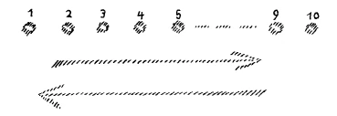
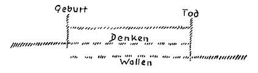
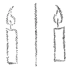
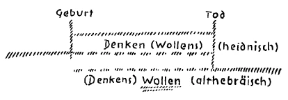
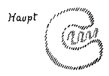
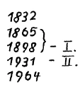

Ich möchte heute noch, zum Teil mehr ins Allgemeine gehend, einiges besprechen in Anknüpfung an das gestern und vorgestern Gesagte. Auch aus jenen beiden Betrachtungen werden Sie ja entnehmen können, daß Geisteswissenschaft, wie sie hier gedacht wird, herausgeboren sein soll aus den tiefsten und ernstesten Forderungen der Menschheitsentwickelung in unserer Zeit und für die nächste Zukunft. Ich habe es ja oft erwähnt, daß es sich hier nicht um solche Ideale handelt, die aus der Subjektivität des Menschen entspringen, sondern um dasjenige, was abgelesen wird der geistigen Entwickelungsgeschichte der Menschheit. Und dieser geistigen Entwickelungsgeschichte der Menschheit kann man wahrhaftig ablesen, daß die Wissenschaft der Initiation, also die Wissenschaft, die ihre Erkenntnisse herüberholt von jenseits der Schwelle zur geistigen Welt, für die Weiterentwickelung der Menschheit durchaus nötig ist. Gegen alles, was für eine wirkliche Erkenntnis der geistigen Welt heute geltend gemacht werden kann, lehnen sich aber auch diejenigen Mächte auf, die das Alte vertreten. Und die Auflehnung jener Menschen, in denen gewissermaßen die Mächte des Alten leben, sie muß überwunden werden. Das Wort von der Notwendigkeit des Umlernens und Umdenkens in bezug auf die wichtigsten Angelegenheiten der Menschheitsentwickelung, es muß gründlich und ernst verstanden werden. Deshalb möchte ich Sie bitten, gerade darauf Wert zu legen, daß unsere Tendenz darauf gehen müsse, alles bloß Sektiererische, das auch noch in dem anthroposophischen Gemüt wuchert, zu überwinden und die Welt- und Menschheitsbedeutung der anthroposophisch orientierten Geisteswissenschaft wirklich zu sehen. ^xmfj1a

Die Menschen sind heute noch lange nicht erwacht aus dem Schlafe, in den sie eingehüllt worden sind durch jeneEntwickelung, die ich Ihnen ja auch in gewissen Grundzügen schon geschildert habe, die begonnen hat um die Mitte des 15. Jahrhunderts. Gewiß, was da der Menschheitsevolution einverleibt worden ist, die äußerliche Naturwissenschaft mit ihren großen Triumphen, die materialistische Auffassung der Weltgesetzmäßigkeit und damit die ja heute so klar zutage tretenden irrtümlichen sozialen Ideen, das alles, was von dieser Seite her die Menschheit in den Schlaf gehüllt hat, das wirkt mächtig fort. Und ein gedeihlicher Fortschritt wird nicht möglich sein, ohne die Menschheit aus diesem Schlafe aufzurütteln. Vergessen wir nur ja nicht, daß die Erkenntnis des Geistigen mächtige Feinde hat an all denjenigen, welche vor allen Dingen das fortgesetzt wissen wollen, was sie gewöhnt worden sind zu denken, fortgesetzt wissen wollen aus der reinen Denkbequemlichkeit heraus. Man kann nicht sagen: Wenn von dieser Seite her Feindlichkeit und Gegnerschaft gegen die Geisteswissenschaft, wie sie hier gemeint ist, um so mehr sich erhebt, je mehr diese Geisteswissenschaft bekannt wird, dann solle man nicht diese Hemmnisse berücksichtigen. Gewiß, es könnte eine mögliche Anschauung sein, ganz unberücksichtigt zu lassen, was sich so erhebt. Allein, das wäre ein ganz falscher Gedanke in unserer heutigen Zeit, denn man läßt ja auch nicht unberücksichtigt dasjenige, was sich etwa als Ungeziefer an uns heranmacht, sondern man versucht es von sich aus zu entfernen und manchmal muß man es entfernen auf unsanfte Weise. Das ist etwas, was von Fall zu Fall selbstverständlich entschieden werden muß. ^i3fjhr

Diese Dinge müssen auch aus den Notwendigkeiten der Zeit heraus begriffen werden. Deshalb muß es mit ganz besonderer Befriedigung aufgenommen werden, wenn in dieser unserer immer schwieriger werdenden Zeit sich doch nun Menschen finden, die ergriffen werden von jener Willenskraft, die notwendig ist, um für unsere Sache einzutreten. Aber es sind leider noch viel zu wenige da von der Art derjenigen, die den ganzen Ernst dessen durchdringen, was heute für die Evolution der Menschheit auf dem Spiele steht. Es stehen auf der einen Seite jene, die, nicht aus irgendwelchen geistigen Gründen, sondern aus einer Denkbequemlichkeit und anderen Rücksichten, nicht heraus wollen aus dem, woran sie sich gewöhnt haben seit langer Zeit. Auf der anderen Seite müssen diejenigen dastehen, die mit ihrem ganzen Wesen sich entgegenstemmen dem, was reif ist zum Untergange. Und wir müssen nicht glauben, daß die Nachsicht mit dem, was reif ist zum Untergange, irgend etwas sein darf, was uns heute zurückhält. In den letzten fünf bis sechs Jahren hätten die Menschen lernen können, wie die alten Dinge sich ad absurdum führen. Und jene, die es noch nicht gelernt haben, werden reichlich Gelegenheit haben, es in der nächsten Zeit zu lernen. Aber es muß in uns das Feuer sein für dasjenige, was als Neues der Menschheitsevolution eingepflanzt werden soll. ^eqn1n3

Deshalb erfüllte es mich mit einer gewissen Befriedigung, als ich vorgelegt bekam den Brief, dessen Hauptinhalt ich Ihnen heute zur Einleitung mitteilen möchte. Es handelt sich darum, daß in Reutlingen, einer Nachbarstadt von Stuttgart, jener selbe Professor aufgetreten ist, um wiederum mit ebenso törichten Gründen loszuwettern gegen dasjenige, was gewollt wird von seiten der anthroposophisch orientierten Geisteswissenschaft, wie er es in jener törichten Schrift getan hat, von deren Inhalt ich Ihnen vor kurzem hier gesprochen habe. Jedenfalls wird jener Professor, eine der Zierden — denn so sind die Zierden jetzt auf dieser Seite —, eine der Zierden der Tübinger Universität — an anderen Universitäten der Welt sind sie nicht anders — jetzt ebenso gesprochen haben, wie er gesprochen hat in jener Schrift. Da trat ihm entgegen, aber diesmal — das geht aus einem Brief hervor — mit dem wirklichen Elan, der notwendig ist heute, wenn man den völligen Ernst ermißt von dem, was auf dem Spiele steht, unser Freund Dr. Walter Stein. Und von jener Diskussion, die sich da vor einigen Tagen abgespielt hat, schreibt unser Freund, Dr. Stein, an seine Frau hierher: «Gestern war ich in Reutlingen, wo Professor Traub gegen Steiner sprach. Ich meldete mich zur Diskussion. Es war ein Kampf auf Leben und Tod. Ich stellte Traub als einen gewissenlosen, der Materie, die er behandelt, gänzlich unkundigen Menschen hin. Sein Schlußwort brachte er nur noch stammelnd hervor. Er war gebrochen. Der Stadtpfarrer, der eröffnete, wurde von mir durch Bibeltexte so in die Enge getrieben, daß er sagte in bezug auf die Stelle, wo Christus von der Reinkarnation spricht: Hier irrt Christus, — der Stadtpfarrer von Reutlingen. Da stand ich auf und rief: Hört! das ist heute Religion, ein Gott, der irrt! — Das Publikum tobte. Man wollte mich zuerst unterbrechen, mir das Wort entziehen, rief: zur Sache! scharrte und stampfte. Ich aber sprach völlig ruhig, zeigte mit einer Hand auf Professor Traub und sprach: dies ist die Autorität! Ich bekam Beifall und siegte. Der Mann ist fertig. Ich bin noch heute halb tot.» ^e2w7ru

Daß ein starker Haß sich auftun werde gegen jene anthroposophisch orientierte Geisteswissenschaft, die nun schon seit zwei Jahrzehnten hier getrieben wird in Europa, das konnte man voraussehen, konnte jeder voraussehen, der eben wußte und weiß, wie innig verbunden mit den Mächten, die zum Fortschritte der Menschheit aufgerufen werden müssen in der Gegenwart und der nächsten Menschheitszukunft, das ist, was hier anthroposophisch orientierte Geisteswissenschaft genannt wird. Aber mit Schlafmützigkeit, mit derjenigen Gesinnung, die sich durch geistige Ideen und Begriffe ein wenig Wollust in der Seele schaffen will, darf diese anthroposophisch orientierte Geisteswissenschaft nicht verwechselt werden. Und wenn der Dr. Stein empfindet, es handelte sich dabei um einen Kampf auf Leben und Tod, so ist das die Empfindung von etwas durchaus Richtigem. Wir stehen am Anfange. Gegen uns tobt der Kampf des Vernichtungswillens. Wir haben niemals Anstalten gemacht, insoferne wir den richtigen Impuls unserer Geisteswissenschaft verstanden haben, aggressiv vorzugehen. Aber wir dürfen nicht vermeiden dasjenige, was notwendig ist gegenüber dem aggressiven Wesen, das immer mehr und mehr von außen kommen wird. Da darf uns nicht der Mut sinken, da dürfen wir nicht mit Schlafmützigkeit vorgehen wollen. Bequem wird es nicht sein, die Wahrheit der Menschheitsevolution einzufügen, und Nachsicht ist wahrhaftig nicht dasjenige, mit dem wir uns bei gewissen Dingen gürten dürfen. Denn wir sind ja weit gekommen, wenn die Herren, die offiziell das Christentum zu vertreten haben, dann, wenn sie nicht mehr weiter können, sogar bereit sind, zu sagen: Hier irrt Christus! - Selbstverständlich, der Herr Stadtpfarrer irrt nicht! Aber wenn dasjenige, was der Herr Stadtpfarrer zu sagen hat, nicht stimmt mit dem, was offenbarer Bibeltext ist, dann irrt Christus, nicht der Herr Stadtpfarrer! Das ist aber überhaupt die Gesinnung, der man heute begegnet, die man nur nicht sehen will, weil es unbequem ist, sie zu sehen. Man könnte sie sehen auf allen Gebieten, wenn man nur wollte. ^fdnehh

Für diejenigen aber, welche die Zusammenhänge im Leben sehen können, ist es auch klar, daß das europäische Unglück der letzten Jahre, wenn es sich auch scheinbar äußerlich abgespielt hat, innig zusammenhängt mit dem, was die Menschen gewohnt worden sind zu denken, und - verzeihen Sie den etwas trivialen, banalen Ausdruck - wovon die Menschen so gern sprechen: Wie wir es so herrlich weit gebracht haben — und sich dabei vor Wollust die Finger ablecken. ^2e9f2q

Was aber notwendig ist, das ist: innerlich sachlich werden. Unter dem Einfluß der neueren Kultur haben die Menschen die Sachlichkeit verloren. Persönliches spielt überall. Und wenn einmal die Geschichte der letzten fünf bis sechs Jahre geschrieben wird, wird sie nur geschrieben werden können aus geisteswissenschaftlichen Unterlagen heraus. Dann wird in diesen Kapiteln der Weltgeschichte viel stehen davon, wie unendlich das Persönliche hineingespielt hat in die großen weltgeschichtlichen Ereignisse. Ich sagte, unmöglich wird es sein ohne geisteswissenschaftliche Grundlagen, von den Ereignissen der letzten fünf bis sechs Jahre zu sprechen. Ich brauche ja nur dasjenige anzudeuten, was ich hier auch schon öfter angedeutet habe. Von den dreißig bis vierzig Menschen, die 1914 in leitenden hervorragenden Stellungen beteiligt waren an dem, was man den Ausbruch des Weltkrieges nennt — ungenaues Sprechen liebt man ja heute, weil es geeignet ist, die Wahrheit zu verhüllen; es war weder ein Ausbruch, es war etwas ganz anderes, noch war es ein Weltkrieg: es war etwas ganz anderes, was noch lange nicht zu Ende ist —, von den dreißig bis vierzig damals beteiligten Menschen war eine große Anzahl nicht vollsinnig, hatte nicht alle Kräfte der Seele und des Geistes beisammen. Da aber, wo das Bewußtsein getrübt ist, da sind die Tore, wo die ahrimanischen Mächte besonders leicht Zutritt haben zu dem, was Menschenentschlüsse sind, was Menschenwollungen sind. ^wh0wtr

Die ahrimanischen Mächte haben wesentlich mitgewirkt im Ausgangspunkte jener Ereignisse, die 1914 gespielt haben. Man würde heute schon, wenn man nur wollte, aus dem rein äußerlichen Verfolgen der Sache ersehen können, wie notwendig es ist, der Menschheitsevolution geistige Erkenntnis einzufügen. Wie weit entfernt ist man aber aus den Denk- und Empfindungs- und Gefühlsgewohnheiten heraus, derlei Dinge mit vollem Ernste zu betrachten. Da ist auf der einen Seite die Tatsache - und noch mehr die bevorstehende Tatsache, daß die Zeit reif ist zum Auftreten von Menschen, die eine geeignete, befähigte Seele dem entgegenbringen können, was seit dem letzten Drittel des 19. Jahrhunderts an geistigen Impulsen hereinbricht in unsere physische Welt. Neben dem, daß wir hineingesegelt sind in eine materialistische Zeit, besteht ja die andere Tatsache, daß die Tore, die von der geistigen Welt zu der unsrigen gehen, seit dem letzten Drittel des 19. Jahrhunderts offen stehen, und daß Menschen, die diesen geistigen Impulsen ihre geöffnete Seele, ihr geöffnetes Bewußtsein entgegenbringen, Beziehungen zur geistigen Welt haben können. Gewiß, die Zahl derer, in deren Bewußtsein heute schon die geistige Welt hereinspielt, mag klein sein. Aber es ist die Tatsache vorhanden, daß die geistige Welt in manches Menschengemüt hereinspielt. Und wir können sagen: Die nächsten zehn, zwanzig, dreißig Jahre, bis zur Mitte des Jahrhunderts werden solche sein, in denen immer mehr und mehr Menschen gelernt haben werden, leise hinzuhorchen auf ihr Inneres, um dieses Innere entgegenzuhalten den hereinwollenden Impulsen der geistigen Welt. ^iecx3q

Diejenigen Menschen, welche heute solche Impulse aus der geistigen Welt empfangen, welche heute wissen um die Wahrheiten und Erkenntnisse, die herein müssen in die Menschheitsevolution, sie wissen das Folgende: Wenn nicht durch diese von solchen Menschen zu handhabende Wissenschaft der Initiation befruchtet wird dasjenige, was wir Naturerkenntnis nennen, dasjenige namentlich, was wir Kunst nennen, so geht die Menschheit einem raschen Verfalle, einem furchtbaren Verfalle entgegen. Lassen Sie drei Jahrzehnte noch so gelehrt werden, wie an unseren Hochschulen gelehrt wird, lassen Sie noch durch dreißig Jahre so über soziale Angelegenheiten gedacht werden, wie heute gedacht wird, dann haben Sie nach diesen dreißig Jahren ein verwüstetes Europa. Sie können noch so viele Ideale auf diesem oder jenem Gebiete aufstellen, Sie können sich die Münder wund reden über Einzelforderungen, die aus dieser oder jener Menschengruppe hervorgehen, Sie können in dem Glauben reden, daß mit noch so eindringlichen Forderungen etwas getan werde für die Menschenzukunft — alles wird umsonst sein, wenn die Umwandlung nicht geschieht aus dem Fundamente der Menschenseelen heraus: aus dem Denken der Beziehung dieser Welt zur geistigen Welt. Wenn nicht da umgelernt wird, wenn nicht da umgedacht wird, dann kommt die moralische Sintflut über Europa! ^a59fle

Es handelt sich gerade darum, einzusehen, was es eigentlich heißen würde, wenn eine Anzahl von Menschen, welche in das Wissen vom Jenseits der Schwelle hineinschauen, erkennen müssen: Die Konfusion, die materialistischen Neigungen, die sozialen Irrtümer gehen weiter und die Menschen wollen nicht umdenken und umlernen — und wenn diese wenigen im Besitze der Initiationswissenschaft befindlichen Personen sehen müßten, wie die Menschheit abwärts geht aus reiner Denk- und Empfindungsbequemlichkeit! Aber man soll sich nicht Täuschungen hingeben darüber, wie viele Antriebe zu einer solchen Sachlage heute in der sogenannten zivilisierten Welt walten. Viele Antriebe walten da, denn ist es nicht eigentlich natürlicher zu erwarten, daß die Menschheit von heute in ihrem Hochmut alles ablehnt, was von seiten der Wissenschaft der Initiation kommt? Die Menschheit ist doch so unendlich gescheit in jedem einzelnen ihrer Individuen! Die Menschheit ist so geneigt, zu verhöhnen alles dasjenige, was nur errungen werden kann dadurch, daß man arbeitet an dem Fortgange der eigenen Seele. Die Menschheit glaubt doch, ohne etwas zu lernen, alles zu wissen. Weder die natürlichen noch die sozialen Probleme der heutigen Zeit sind zu lösen ohne ein Befruchten des menschlichen Denkens, Empfindens und Wollens von der geistigen Welt aus. Es ist ja für viele Menschen heute geradezu ein Phantasiegebilde, wenn man von dieser Wissenschaft der Initiation spricht, wenn man von so etwas redet wie von der Schwelle zur geistigen Welt. Es ist richtig, es kann nicht jeder heute über die Schwelle zur geistigen Welt gehen; aber es wäre eigentlich keinem verwehrt, die Wahrheit dessen einzusehen, was diejenigen sagen, die über die Schwelle zur geistigen Welt gegangen sind. Unrichtig ist es, wenn von dieser oder jener Seite immer wieder und wiederum gesagt wird: Ja, wie soll ich denn einsehen, daß das richtig ist, was der oder jener als Initiationswissenschaft vorbringt, wenn ich nicht selber in die geistige Welt hineinsehen kann. — Unrichtig ist es. Der gesunde Menschenverstand, der nicht irregeleitet ist durch irrtümliche natürliche oder soziale Ideen von heute, der kann von sich aus entscheiden, ob Wahrheitsduktus waltet in dem, was irgend jemand spricht. Irgend jemand spricht von geistigen Welten: man muß nur alles zusammen nehmen, die Art, wie gesprochen wird, der Ernst, in dem die Dinge aufgefaßt werden, die Logik, die entfaltet wird und so weiter, dann wird man sich ein Urteil darüber aneignen können, ob dasjenige, was als Kunde von der geistigen Welt gebracht wird, Scharlatanismus ist, oder ob es einen Fond hat. Dies kann jeder entscheiden, und bei niemandem ist ein Hindernis vorhanden, das fruchtbar zu machen im natürlichen und im sozialen Denken, was aus dem Quell des geistigen Lebens herausgeholt wird von jenen, die berechtigt sind, von dem Prinzip der Initiation zu sprechen. ^vumar4

Diejenigen Kräfte der Menschheitsentwickelung, die den Menschen unbewußt geleitet haben, so daß er hat vorwärtskommen können, sie sind erschöpft und erschöpfen sich ganz bis zur Mitte des Jahrhunderts, approximativ gesprochen. Aus den Tiefen der Seelen müssen die neuen Kräfte heraufgeholt werden. Und einsehen muß der Mensch, wie er in den Tiefen seiner Seele zusammenhängt mit den Wurzeln des geistigen Lebens. ^jk24bf

Das Überschreiten der Schwelle, das kann ja natürlich heute nicht jeder leisten. Denn der Mensch ist gewöhnt worden im Laufe der letzten Jahrhunderte, alles dasjenige, was ihm entgegentritt, so zu betrachten, daß es sich in der Zeit abspielt. Aber das erste, was erfahren wird jenseits der Schwelle, das ist, daß es eine Welt gibt, in der die Zeit, wie wir sie auffassen, keine Bedeutung hat. Heraus muß man aus dem zeitlichen Vorstellen. Deshalb ist es so nützlich, wenn Menschen, die sich vorbereiten wollen zum Verständnisse der geistigen Welt, wenigstens damit beginnen, rückwärtsgehend vorzustellen. Sagen wir, ein Drama, das äußerlich ja beginnt mit dem ersten Akt und zum fünften fortschreitet, von rückwärts angefangen bis zum Anfang hin des ersten Aktes vorzustellen; eine Melodie nicht in der Aufeinanderfolge, wie sie gespielt wird, sondern die Töne rückwärts verlaufend vorzustellen und zu empfinden, das Tageserleben nicht vom Morgen bis zum Abend, sondern rückwärts verlaufend vom Abend bis zum Morgen vorzustellen. Dadurch gewöhnen wir unser Denken ernstlich an das Aufheben der Zeit. Wir sind gewöhnt dem alltäglichen Leben gegenüber, die Dinge so vorzustellen, daß nach dem ersten das zweite, nach dem zweiten das dritte, nach dem dritten das vierte und so weiter geschieht (die Zahlen werden angeschrieben), und wir denken immer so, daß unser Denken das Bild des äußeren Geschehens ist. Fangen wir nun einmal an, so zu denken, daß wir von rückwärts nach vorne denken, von rückwärts nach vorne empfinden, dann müssen wir uns einen innerlichen Zwang antun, und dieser Zwang ist gut, denn dieser Zwang zwängt uns hinaus aus der gewöhnlichen Sinneswelt. Die Zeit verläuft von eins, zwei, drei, vier und so weiter in dieser Richtung (Pfeil nach rechts). Wenn wir umgekehrt denken, statt vom Morgen bis zum Abend vom Abend bis zum Morgen, so denken wir der Zeit entgegen (Pfeil nach links). Wir heben die Zeit auf. ^f81wpk

 ^3z3ely

Können wir ein solches Denken auch so fortsetzen, daß wir, soweit wir nur kommen, zurückdenken in unserem Leben, dann haben wir sehr viel gewonnen. Denn wer nicht aus der Zeit herauskommt, kann nicht in die geistige Welt hineinkommen. ^fwffmf

Wir sagen, der Mensch gliedere sich in physischen Leib, Ätherleib, Astralleib und Ich. Nur der physische Leib und der Ätherleib kommen zunächst für die physische Welt, für die sinnliche Welt in Betracht. Der Ätherleib hat noch ein Erdengeschehen in der Zeit, der astralische Leib kann erst gefunden werden, wenn man aus der Zeit herauskommt. Der physische Leib ist im Raume. Das Ich, das wahre Ich kann erst gefunden werden, wenn man aus dem Raum herauskommt. Denn die Welt, in der das wahre Ich ist, ist raumlos. ^ctahq4

Zweierlei also ist es, was zu den ersten Erlebnissen gehört: daß wir herauskommen aus der Zeit und herauskommen aus dem Raum, wenn wir die Schwelle überschreiten zur geistigen Welt. Ich habe früher öfter mal hingewiesen auf mancherlei, was zu den raumlosen Vorstellungen führen kann, indem ich Sie auf die Dimensionen aufmerksam gemacht habe, nicht in so kindlicher Weise, wie oftmals von den Spiritisten über den vierdimensionalen Raum gesprochen wird und dergleichen, sondern in ernsterer Weise. Aber bedenken Sie, was Ihnen von all dem, was Sie Inhalt Ihres Bewußtseins nennen, verlorengeht, wenn Sie nicht mehr im Raume und nicht mehr in der Zeit sind. Ihr Leben ist ganz angepaßt an Raum und Zeit. Auch das seelische Leben des Menschen ist ganz angepaßt an Raum und Zeit. Sie kommen in eine Welt, an die Sie nicht angepaßt sind: das Nichtangepaßtsein an die Welt bedeutet Schmerzempfindung, Leidempfindung. So daß ohne die Überwindung von Schmerz und Leid nicht hineinzukommen ist zunächst in die geistige Welt. Die Menschen bringen es sich nicht zum Bewußtsein, aber sie scheuen vor der geistigen Welt aus Furcht zurück, weil sie das Abgrundartige einer Welt, in der nicht Raum und Zeit ist, nicht betreten möchten. ^ckoey0

Wenn ich Ihnen nur diese erste Erfahrung des Erlebens jenseits der Schwelle wiederum vor das Geistesauge rufe, so wird Ihnen lebendig bewußt sein, daß ja in wenigen Menschen heute der innerlich starke Mut vorhanden ist, um gewissermaßen in das Bodenlose und Zeitlose sich auch erfahrungsgemäß zu begeben. Aber durch ihr Schicksal sind gewisse Menschen dazu verbunden, die Schwelle zu überschreiten. Und ohne die Weisheit, die herübergeholt werden kann von jenseits der Schwelle, ist nicht weiterzukommen. Sie fühlen daraus, was notwendig ist. Notwendig ist, daß in der Zukunft vergrößert werde dasjenige, was man Vertrauen des einen Menschen zum anderen nennen kann. Es wäre eine soziale Tugend, eine soziale Grundtugend. In unserer Zeit der sozialen Forderungen ist diese Tugend am wenigsten vorhanden, denn die Menschen fordern, daß für die Gemeinschaft gelebt werde, aber keiner hat das Vertrauen zum anderen. In unserer Zeit der sozialen Forderungen walten die allerunsozialsten Instinkte. Notwendig wird es sein, damit die allgemeine Menschheitserziehung so vorwärtskomme, daß die Menschen in die geistige Welt hineinwachsen, notwendig wird es sein, daß denjenigen, die von der Wissenschaft der Initiation mit Recht reden dürfen, Vertrauen entgegengebracht werde, nicht Vertrauen aus blindem Autoritätsglauben heraus, sondern aus gesundem Menschenverstand. Denn man kann immer einsehen, was als Kunde gebracht wird von jenseits der Schwelle, wenn man nur den gesunden Menschenverstand wirklich anwenden will. ^xjs3wz

Und da muß man immer wiederum von dem gesunden Menschenverstand, hinsehend auf der einen Seite zu ihm, den Blick wenden zu dem, was einem heute entgegentritt. Wenn auch nicht alle Leute so offenbar sagen: «Da irrt Christus» — aber in der Art sprechen die Leute, so ist die Logik des heutigen Lebens. Und wenn dann die Menschen kommen und sagen, sie können nicht unterscheiden zwischen dem, was aus geistigen Welten heraus mit innerer Logik verkündigt wird, und dem was die Universitätsprofessoren sagen, dann liegt eben nicht der gesunde Menschenverstand vor oder wenigstens nicht der Wille zum gesunden Menschenverstand. Man kann doch ohne weiteres aus seinem gesunden Menschenverstand heraus sagen, wenn einer spricht «da irrt Christus», so ist weiter mit ihm nicht zu rechnen von diesem Gesichtspunkte aus. ^m4m16g

Wir haben verloren eine wirkliche Wissenschaft der Seele. Wir haben sie nicht mehr. Und ich habe ja auch in öffentlichen Vorträgen, neulich erst wieder in Basel und an anderen Orten, hingewiesen darauf, warum wir die Wissenschaft von der Seele verloren haben. Die Wissenschaft vom Geiste ist ja zum Beispiel der katholischen Kirche schon im 9. Jahrhundert unbehaglich geworden; ich habe das öfter erwähnt. Deshalb ist der Geist, wie ich ja auch schon oft auseinandergesetzt habe, auf dem achten allgemeinen ökumenischen Konzil zu Konstantinopel, 869, abgeschafft worden. Damals wurde das Dogma gegeben, der Mensch dürfe nicht denken, wenn er rechter Christ ist, daß er bestünde aus Leib, Seele und Geist, sondern nur aus Leib und Seele, und daß die Seele geistige Eigenschaften habe. Heute lehrt das noch die Psychologie, glaubt es aus unbefangener Wissenschaft heraus zu lehren, spricht aber nur das Dogma von 869 nach. Aber auch in bezug auf alles dasjenige, was auf die Seele hinweisen soll, wurde monopolisiert in Form des Glaubens, in Form des Bekenntnisses, in Form des Dogmas durch die Bekenntniskirchen. Alles das, was vom Menschen heraus Erkenntnis des Seelischen sein soll, es wurde von den Bekenntnisgemeinschaften monopolisiert. Und der eigentlichen Erkenntnis, der freien Erkenntnis wurde nur die äußere Natur überlassen. Kein Wunder, daß wir heute keine Seelenwissenschaft haben. Denn die weltliche Gelehrsamkeit hat sich eben nur der Wissenschaft der Natur hingegeben, da die Wissenschaft von der Seele monopolisiert und die Wissenschaft vom Geiste abgeschafft war. Wir haben keine Wissenschaft der Seele. Wir können, wenn wir auf dem fußen, was heute tonangebende Wissenschaft ist, nicht weiterkommen. Denn wenn wir auf dem fußen, was heute die Wortpsychologie ist — viel mehr ist sie ja nicht —, da können wir nicht zu einem wirklichen Verständnisse desjenigen kommen, was in der Seele waltet. Sie wissen ja aus meiner Darstellung, die ich gegeben habe in «Wie erlangt man Erkenntnisse der höheren Welten?», daß beim Überschreiten der Schwelle zur geistigen Welt im Bewußtsein auseinandertreten Denken, Fühlen und Wollen. Im gewöhnlichen heutigen gangbaren Bewußtsein bilden Denken, Fühlen und Wollen eine Art von Chaos; sie sind ineinandergeschichtet. In dem Augenblicke, wo die Schwelle zur geistigen Welt überschritten wird, in dem Augenblicke, wo man sich nur anschicken will, erfahrungsgemäß die Initiationswissenschaft zu gewinnen, werden im Bewußtsein Denken, Fühlen, Wollen selbständige Mächte. Sie werden selbständig. Da lernt man sie kennen, da lernt man in Wirklichkeit erst unterscheiden Denken vom Fühlen und vom Wollen. ^4hfjko

Namentlich lernt man unterscheiden das Denken vom Wollen. Das Denken, das in uns waltet als Menschen, wenn wir es nicht seinem Inhalte nach nehmen, sondern wenn wir es nehmen hinsichtlich seiner Kraftnatur, wenn wir also die Denkkraft in uns nehmen, dann ist gerade dasjenige, was Denkkraft ist, etwas wie ein Hereinleuchten desjenigen, was wir vor der Geburt beziehungsweise vor der Empfängnis in geistigen Welten erlebt haben. Und die Willenswesenheit im Menschen ist etwas Embryonales, etwas Keimhaftes, das erst vollständig zur Entwickelung kommt post mortem, nach dem 'Tode. So daß wir sagen können: Wenn dieses hier (siehe folgendes Schema) der menschliche Lebenslauf ist zwischen Geburt und Tod, so ist innerhalb des menschlichen Lebenslaufes das Denken, so wie es im Menschen lebt, nur ein Schein, denn seine wahre Natur, die liegt vor der Geburt beziehungsweise vor der Empfängnis, und dasjenige, was Wollen ist, ist nur ein Keim, denn dasjenige, was sich aus diesem Keim entwickelt, entwickelt sich erst nach dem Tode. Grundverschieden sind in der menschlichen Natur Denken und Wollen. ^lkbg9a

 ^5hpa4a

Wenn jetzt jemand mit der Logik der Gegenwart kommt, die alles hübsch einschachtelt, die gern Systeme macht, so sagt er: Uns ist heute gesagt worden, das Denken, das ist die Kraft, die aus dem vorgeburtlichen Leben hereinspielt, das Wollen, das ist die Kraft, die in das nachtodlicheLeben hineinweist. Nun hat man definiert, hübsch auseinandergeschält durch Definition Denken und Wollen. Aber mit Definitionen ist nichts gegeben. Man sieht gewöhnlich nicht das Ungenügende einer jeden Definition. Es sind ja manche Definitionen, besonders solche, die als wissenschaftlich gelten, sehr gescheit sich ausnehmend, aber alle haben sie irgendwo einen Haken, der einen erinnert an jene Definition, welche im alten Griechenland einmal gegeben worden ist auf die Frage: Was ist der Mensch? — Der Mensch ist ein zweibeiniges Wesen, das keine Federn hat —- worauf am nächsten Tag ein Schüler einen gerupften Hahn gebracht hat und sagte, das ist ein Mensch, denn es ist ein zweibeiniges Wesen, das keine Federn hat. — Er hat ihn vorher sorgfältig gerupft. So einfach liegen die Dinge nämlich nicht, daß man sie mit dem gewöhnlichen Intellektwerkzeuge so handhaben kann. Denn, sehen Sie, man kann ganz schön sagen: Von dem, was wir erfahren als Denken, müssen wir behaupten, es habe seine wahre Wesenheit vor der Geburt und in uns herein spielt nur etwas wie ein Spiegelbild vom Denken. — Hier liegt eine gewisse Schwierigkeit vor. Sie werden sie aber bei einer geringen Denkanstrengung überwinden. ^8tmbi4

Nicht wahr, wenn Sie hier einen Spiegel haben und Sie haben hier einen Gegenstand, zum Beispiel eine Kerze, so haben Sie also hier ein Spiegelbild: Sie können das Bild von dem Gegenstande unterscheiden, Sie werden es nicht verwechseln. Wenn Sie irgendwie, durch einen Schirm meinetwillen, die Kerze selbst zugedeckt haben, so werden Sie im Spiegel nur das Bild sehen. Das Bild wird alles machen, was die Kerze macht. Sie können aus dem Bilde alles ablesen, was die Kerze macht. Sie sind gewöhnt, räumlich zu denken, deshalb können Sie sich leicht vorstellen, wie das Bild sich zur Wirklichkeit der Kerze verhält. Aber das, was in uns die Denkkraft ist, ist als Kraft ein Spiegelbild, und die Wirklichkeit liegt vor der Geburt. Die reale Kraft, deren Bild wir anwenden in diesem Leben, liegt vor der Geburt. Daher ist der Grundsatz des menschlichen Bewußtseins, der sich ergibt, wenn man auf sein eigenes Bewußtsein sieht: Ich denke, also bin ich nicht. Cogito ergo non sum! — Das ist das Grundsätzliche, das man begreifen muß, daß im Denken Bildnatur waltet, und daß die Kraft des Denkens vor der Geburt liegt. Die neuere Entwickelung hat damit eingesetzt, das Gegenteil als Grundaxiom der Philosophie hinzustellen: cogito ergo sum, was ein Unsinn ist. Sie sehen, wie die neuere Menschheit durch ihre Prüfung durchgehen muß. Aber wir sind am Scheidepunkte. Wir müssen umdenken lernen über die Fundamente des Seelenlebens. ^6zey6z

 ^3xvfsc

Damit hätten wir das Denken in einer gewissen Weise auf sein Wesen zurückgeführt, und wir könnten jetzt etwas ähnliches behaupten für das Wollen. Das Wollen ist nicht wie Bild und Spiegelbild, aber wie Keim und Vollendung aufzufassen mit Bezug auf die Willenskraft zwischen Geburt und Tod und das, was daraus wird nach dem Tode. Diese Einrichtung, daß wir vom Denken das Bild, vom Wollen den Embryo haben, das allein ermöglicht uns die Freiheit zwischen Geburt und Tod. Sie können darüber nachlesen sowohl in meinen Büchern «Vom Menschenrätsel», «Von Seelenrätseln», wie auch in der zweiten Auflage meiner «Philosophie der Freiheit», wo diese Dinge auch philosophisch behandelt sind. ^b3n4uv

Nun aber kommt das Eigentümliche, woraus Sie ersehen müssen, wie wenig das bequeme alltägliche Denken genügt, um in die Wirklichkeit hineinzukommen. Man hat das Wesen des Denkens erfaßt. Aber wenn wir dieses Wesen des Denkens in uns erfassen, so müssen wir uns zugleich sagen: Dieses Denken ist nicht bloß Denken, sondern in diesem Denken ist auch eine Kraft des Wollens. Mit demselben inneren Wesen, mit dem wir denken, wollen wir zugleich. Es ist nur in der Hauptsache Denken, es hat einen Unterton des Wollens, ebenso hat aber unser Wollen einen Unterton des Denkens. Wir haben in der Tat zweierlei in uns: Etwas, was hauptsächlich Denken ist, was aber einen Unterton des Wollens hat (in das auf Seite 204 begonnene Schema wird neben das Wort Denken in Klammern Wollen geschrieben); etwas, was hauptsächlich Wollen ist, was aber einen Unterton des Denkens hat (neben das Wort Wollen wird in Klammern Denken geschrieben). Wenn Sie die Wirklichkeit betrachten, so kommen Sie nicht zu reinlichen Begriffen, die Sie einschachteln können in Systeme, sondern das eine ist immer zu gleicher Zeit in einem gewissen Sinne das andere. Erst wenn man diese Dinge durchdringt, dann bekommt man eine Anschauung von gewissen Zusammenhängen des Menschen mit Welten, die außerhalb derjenigen sind, die wir mit unseren Augen sehen und mit unseren Ohren hören, in denen wir aber nicht minder drinnen sind, als in dieser Welt der Sinne. Wir können nicht sagen, daß uns andere Welten als die Sinnenwelt nichts angehen, wir sind mitten in ihnen drinnen. Wir müssen uns klar sein, daß, indem wir hier auf diesem Erdboden herumgehen, wir durchaus ebenso, wie wir durch die sinnliche Luft gehen, durch die geistigen Welten gehen. ^69b0cy

Beziehungen, sage ich, zu den geistigen Welten, sie ergeben sich, wenn man in diese Feinheiten des menschlichen Seelenlebens hineinsieht. Durch das, was mehr Denken ist und nur einen Unterton des Wollens hat, durch das hängen wir mit einer gewissen Art des geistigen Seins der geistigen Welten zusammen. Und wiederum mit einer anderen Art der geistigen Welten hängen wir zusammen durch dasjenige, was mehr Wollen und weniger Denken ist. Das hat schon seine tiefere Bedeutung. Denn dasjenige, was wir so finden, das prägt sich im Menschenleben aus, und die Differenzierungen, die in der Welt vorhanden sind, die kommen davon her, daß immer die eine oder die andere Kraft der menschlichen Natur sich nach der einen oder nach der anderen Seite mehr ausbildete. Diejenigen Kräfte, die in dem Wollen liegen, das den Unterton des Denkens hat, die wurden zum Beispiel im eminentesten Sinne in der althebräischen Kultur ausgebildet. Und diejenigen Kräfte des menschlichen Seelenwesens, welche hauptsächlich im Denken fußen, das einen Unterton des Wollens hat, die wurden in dem, was man die alte heidnische Kultur nennt, ausgebildet. (Zu dem auf Seite 204 begonnenen Schema werden noch die Worte «althebräisch» und «heidnisch» dazugeschrieben.) Und gegenwärtig haben wir die zwei Strömungen nebeneinander laufend. Gegenwärtig haben wir in der zivilisierten Welt durcheinanderlaufend die eine Strömung, die eine Fortsetzung des alten Heidentums ist, in der Naturanschauung, und die andere Anschauung, die eine Fortsetzung des alten Hebräertums ist, sie haben wir in der sozialen Anschauung der Gegenwart, in unseren ethischen, in unseren religiösen Begriffen. ^e1hzfe

 ^dl51zn

Und im einzelnen Menschen selbst lebt heute dieser Dualismus. Auf der einen Seite betet der Mensch heidnisch die Natur an, auf der anderen Seite ist er, ohne daß er eine richtige Naturbasis findet, außer daß er die Denkgewohnheiten herüberzieht in die sogenannte Sozialwissenschaft oder Soziologie, nachdenkend über das soziale, sogar das ethische Leben. Und wenn er dann philosophiert, dann sagt er: Auf dem einen Gebiete findet er die Freiheit, auf dem anderen Gebiete findet er die Naturnotwendigkeit, und dann findet er sich hinein in ein Gespenstisches zwischen Freiheit und Naturnotwendigkeit, zwischen denen es keine Brücke geben soll, und dergleichen mehr, und die Verwirrung ist eine ungeheure. ^6moslq

Aber diese Verwirrung ist in vieler Beziehung der Inhalt des heutigen Lebens, der Inhalt des heutigen untergehenden Lebens. Denn was fehlt in diesem unserem heutigen Leben? Wir haben eine Naturanschauung: sie ist bloß die Fortsetzung des alten Heidentums. Wir haben eine moralische, soziale Anschauung: sie ist bloß die Fortsetzung des Alten Testaments. Das Christentum ist eine Episode gewesen, die man zunächst historisch begriffen hat, aber heute ist es sozusagen wie durch das Sieb der menschlichen Kultur durchgefallen. Es ist im Grunde genommen das Christentum nicht da. Denn bei den Menschen, die oftmals vom Christus reden, können Sie es so machen, wie ich es Ihnen empfohlen habe bei Harnacks «Wesen des Christentums». Adolf Harnacks «Wesen des Christentums» können Sie so behandeln, daß Sie überall dort, wo er «Christus» schreibt, das Wort «Christus» ausstreichen und «Gottvater» hinschreiben, oder Sie können auch einen bloßen pantheistischen «Gott» und dergleichen hinsetzen, es wird im Grunde genommen im wesentlichen alles stimmen. Und wo es nicht stimmt, da redet er einen Unsinn, Prädikate, die nicht zu den Subjekten gehören. ^flilg0

Alle diese Dinge müssen heute gesagt werden, denn hier muß aus dem Fundamente heraus erkannt werden, was Inhalt des Zukunftsbewußtseins sein muß. Ebenso, sehen Sie, redet die heutige Entwickelungslehre davon: Der Mensch hat sich heraus entwickelt aus niederen Wesen und so weiter, diese niederen Wesen haben sich bis zu ihm herauf entwickelt. Gewiß, Sie brauchen nur meine «Geheimwissenschaft im Umriß» nachzulesen, so werden Sie sehen, daß das von einer Seite her auch von uns gesagt werden muß. Aber die Sache liegt so, daß wenn wir das menschliche Haupt in Betracht ziehen, so ist dieses menschliche Haupt, wie wir es heute auf unseren Schultern tragen, bereits wiederum in absteigender Entwickelung. Würde unser ganzer Organismus - bitte, mich jetzt wohl zu verstehen — dieselbe Organisation haben wie unser Haupt, so würden wir fortwährend sterben müssen. Wir leben nur durch dasjenige, was in unserem übrigen Organismus Vitalkraft ist und immer heraufgeschickt wird in das Haupt. Die Kräfte, durch die wir zuletzt sterben, sind in unserem Haupt waltend, sind in unserem Haupte. Das Haupt ist ein fortwährend absterbendes Wesen, es ist in rückläufiger Entwickelung. Deshalb kann im Haupte auch das Seelisch-Geistige seine Entwickelung gewinnen. Denn wenn Sie sich schematisch das Haupt vorstellen, so müssen Sie sich vorstellen: seine aufsteigende Entwickelung ist bereits in eine rückwärtige Entwickelung übergegangen; hier ist eine Leere. (Es wird gezeichnet, siehe Schema unten.) Und in das Leere, in das fortwährend Zerstörtwerdende geht Seele und Geist hinein. Das ist buchstäblich wahr. Wir tragen durch unser Haupt Seele und Geist aus dem Grunde, weil unser Haupt bereits in absterbender Entwickelung ist. Das heißt, in unserem Haupte sterben wir fortwährend. Und der Unterton von Wollen, der unserem Denken eignet, der liegt in unserem Haupte. Aber dieser Unterton von Wollen, der ist ein fortwährender Antrieb, ein fortwährender Impuls zum Sterben, zum Überwinden der Materie. ^gl0x2b

 ^yimq7t

Wenn wir nun wirklich sterben, dann tritt dieses Wollen ein. Und indem unser Leib der Erde übergeben wird, wird durch unseren ganzen Leib, schon physisch, im Erdenleib das fortgesetzt, was bis zu unserem Tode von unserer Geburt an in unserem Haupte sich abspielt. Sie tragen Ihr Haupt auf Ihren Schultern. Darinnen spielt sich durch sich selbst der Prozeß ab - er wird nur fortwährend aufgefrischt und verhindert durch das, was vom übrigen Organismus heraufspielt -, der sich dann abspielt, wenn Sie durch Feuer oder Verwesung der Erde übergeben werden. Da setzt sich fort dasselbe, was Sie zwischen Geburt und Tod innerhalb Ihrer Haut tun. Das setzt sich in der Erde fort: Die Erde denkt nach demselben Prinzip, wie Sie mit Ihrem Menschenkopfe denken, dadurch daß Sie in ihr sich auflösen, daß in die Erde Leichname versenkt werden. Indem wir durch die Pforte des Todes gehen, tragen wir durch unseren sich auflösenden Leichnam in die physische Erde hinein den Prozeß, den wir sonst für uns konfiszieren während unseres Lebens zwischen Geburt und Tod. Das ist eine Wahrheit der Naturwissenschaft. Solche Wahrheiten müssen die Menschen in der Zukunft kennen. Die heutige Naturwissenschaft ist in bezug auf solche Dinge eine Kinderei, denn sie kommt nicht dazu, über diese Dinge zu denken, über diese Dinge zu forschen. ^tc1prx

Und umgekehrt: Dasjenige, was wir in unserem Kopf als Zerstörungsentwickelung haben, das ist ja die Fortsetzung desjenigen, was vor der Geburt beziehungsweise vor der Empfängnis vorhanden war. Das Zerstören beginnt erst mit unserer Geburt, denn da bekommen wir ja erst den Kopf, vorher war es kein Zerstören. Jetzt berühren wir wirklich den Rand eines außerordentlich bedeutsamen Geheimnisses des Weltendaseins. Das, was in unserem Haupte lebt, wodurch wir mit den anderen Menschen, wodurch wir mit der äußeren Natur in Beziehung treten, das ist die Fortsetzung dessen, was sich in den geistigen Welten abspielt, bevor wir in den physischen Leib hereintreten. Wenn man das gründlich durchschaut, dann kommt man dahin, einzusehen, wie die Kräfte aus den geistigen Welten hereinspielen in diese physische Welt. Am anschaulichsten ist das, wenn man diese Dinge nicht in abstracto betrachtet, sondern in concreto. ^0cptf1

 ^zl1jrz

Ein Beispiel (die Zahlen werden an die Tafel geschrieben): 1832 ist Goethe gestorben. Das Zeitalter, das der ersten Generation nach seinem Tode angehört, bis 1865, das war nicht so, daß in es viele Kräfte von seinem Geist aus hereinspielten. Ich wähle ein Beispiel; selbstverständlich spielen auch von anderen Menschen die Kräfte ebenso herein, es ist nur ein repräsentatives Beispiel. Also bis zum Jahre 1865 würde derjenige, der auf Goethes Seele die Aufmerksamkeit gerichtet hätte, wenig bemerkt haben von einem Hereinspielen seiner Kräfte. Dann, nach den ersten 33 Jahren, beginnt schon das, was in unsere Erdenentwickelung von ihm her hereinspielt aus der geistigen Welt. Und immer stärker und stärker wurde das bis zum Jahre 1898. Wenn man es dann weiter verfolgt, über dieses Zeitalter hinaus, so kann man sagen: Die erste Periode des Hereinspielens der übersinnlichen Kräfte Goethes in unsere Erdenkultur ist also 1865 bis 1898. Wie gesagt, bis 1865 war es nicht bedeutsam, dann beginnt es. Nach 33 Jahren haben wir dann 1931 den Ablauf einer weiteren Periode, und das würde die zweite sein. Und 1964 hätten wir dann den Ablauf der dritten Periode. ^kfmeah

Wir können sagen, daß an einem solchen Beispiele wirklich gelernt werden kann, wie schon verhältnismäßig bald nachdem der Mensch die Pforte des Todes durchschritten hat, die Kräfte, die er dann entwickelt, mitspielen bei dem, was hier auf der Erde vor sich geht. Man muß nur wissen, wie diese Kräfte hereinspielen. Derjenige, der geistig, das heißt wirklich spirituell arbeitet, der weiß wie in den Kräften, mit denen er arbeitet, die Kräfte der geistigen Welten mitwirken. Und wenn ich vorgestern gesagt habe, daß in der Mitte dieses Jahrhunderts ein wichtiger Zeitpunkt ist, so ist das wie an diesem Beispiel hier, auf Grund solcher Beobachtungen geschehen, aus denen gesehen werden kann, wie die Kräfte aus den geistigen Welten hereinspielen in die physische Welt. ^o82kd8

Diese Mitte des Jahrhunderts fällt aber zu gleicher Zeit zusammen mit dem Ablauf derjenigen Zeit, in der gewissermaßen die noch atavistisch zurückgebliebenen Kräfte von vor der Mitte des 15. Jahrhunderts in die ärgste Dekadenz kommen. Und die Menschheit muß vor der Mitte dieses Jahrhunderts den Entschluß fassen, sich dem Spirituellen zuzuwenden. Man trifft ja heute noch immer viele Menschen, die sagen: Ja warum kommt denn das Unglück? Warum helfen die Götter nicht? — Wir sind einmal in der Zeitepoche der Menschheitsentwickelung, wo die Götter gleich helfen, wenn die Menschen ihnen entgegenkommen, aber wo die Götter darauf angewiesen sind nach ihren Gesetzen, mit freien Menschen, nicht mit Puppen zu arbeiten. ^kl19b2

Und hier bin ich an dem Punkt, auf den ich gestern hinwies. Wenn, sagen wir, ein erkennender Mensch selbst noch der Griechenzeit, ja der Zeit bis in die Mitte des 15. Jahrhunderts, hinwies auf die Phänomene, auf die Erscheinungen von Geburt und Tod des Menschen, so konnte er hinweisen auf die Götterwelt, hinweisen, wie gewoben wird aus den göttlichen Welten heraus das Schicksal des Menschen durch Geburt und Tod. Heute müssen wir anders reden, heute müssen wir so reden, daß dem Menschen das Schicksal bestimmt ist durch seine vorhergehenden Erdenleben und durch die Art und Weise, wie er dadurch bestimmt ist, die Kräfte schafft, nach denen die göttlichen Welten an ihn herankommen können. Wir müssen lernen, umgekehrt zu denken in bezug auf das Verhältnis des Menschen zu den göttlich-geistigen Welten, wir müssen lernen, im Menschen die Quelle zu suchen, aus der heraus sich die Kräfte entwickeln, durch welche die einen oder die anderen göttlichen Wesen an einen herankommen können. An diesem wichtigen Zeitpunkt der Erdenentwickelung sind wir einmal angelangt. Und was äußerlich geschieht, das muß heute verstanden werden als ein Ausdruck für innerliches Geschehen, das nur verstanden werden kann vom Gesichtspunkte geisteswissenschaftlicher Einsicht. Jeder Mensch hat die Möglichkeit heute, ich möchte sagen, die äußersten Mündungen der Geschehnisse zu beobachten. Es sind ja genug Menschen gemordet worden in den letzten vier bis fünf Jahren. Zehn bis zwölf Millionen sind es in der zivilisierten Welt mindestens, wahrscheinlich mehr, dreimal so viel sind zu Krüppeln geschlagen worden in den verschiedenen Ländern, unsere Zivilisation hat es wirklich herrlich weit gebracht! Aber das wird man nach und nach erkennen müssen als die Mündungen, und die Quelle wird man zu suchen haben bei dem, was in den menschlichen Seelen vorgeht bei jenem Sich-Entgegenstemmen gegen die hereinbrechen-wollende geistige Welt, die das Menschenwesen in die Zukunft tragen will. Und alle Dinge müssen heute von diesem Gesichtspunkte aus betrachtet, das heißt vertieft werden, richtig vertieft werden. ^j7ivc8

Man könnte heute sagen, daß vielleicht manches, was geschehen ist, richtiger ausgesprochen wäre, wenn man die Gesichtspunkte ändern würde. Grob gesprochen sage ich jetzt etwas, was diesen Vortrag ganz aktuell abschließen soll, wie ja die Nuance diesen drei Vorträgen gerade gegeben worden ist durch die uns befriedigende Anwesenheit einer Anzahl unserer englischen Freunde: Man kann heute sprechen von Siegern und Besiegten. Es ist auffällig, ein auffälliger Gesichtspunkt, aber vielleicht ist es nicht der wichtigste. Vielleicht ist ein anderer Gesichtspunkt viel wichtiger, und dieser andere Gesichtspunkt, der könnte vielleicht von Folgendem genommen werden. ^3vswrj

Ich habe hier von dieser selben Stelle aus einmal eine Ausführung vorgelesen von Fercher von Steinwand, jenem deutsch-österreichischen Dichter, der in den fünfziger Jahren des 19. Jahrhunderts sich über die Zukunft des deutschen Volkes ausgesprochen hat. Der Vortrag ist schon deshalb bemerkenswert, weil er vor dem damaligen König von Sachsen und dessen Ministern gehalten worden ist. In diesen fünfziger Jahren — Sie haben es gehört, die damals da waren - hat Fercher von Steinwand davon gesprochen, wie sein deutsches Volk dazu prädestiniert ist, in Zukunft einmal so etwas ähnliches darzustellen, wie die Zigeuner damals dargestellt haben. Es war ein tiefer Blick, den Fercher von Steinwand in die Entwickelung der Menschheit getan hat. Diesen Dingen kann mit voller Objektivität ins Auge geschaut werden. Wenn man mit voller Objektivität diesen Dingen ins Auge schaut, dann wird man vielleicht einen anderen Gesichtspunkt als den heute häufig eingenommenen wählen. Man wird fragen: Wie steht es denn eigentlich mit dem, was sich gewandelt hat, gewandelt hat bei den sogenannten Besiegten, gewandelt hat bei den sogenannten Siegern? ^uvxklk

Nun, die eigentlichen Sieger, das ist ja das anglo-amerikanische Wesen. Und dieses anglo-amerikanische Wesen ist durch die Kräfte, die ich ja auch hier öfter charakterisiert habe, zur künftigen Weltherrschaft bestimmt. ^5orpah

Nun kann man fragen: Da das deutsche Volk ausgeschaltet sein wird von dem Miterleben der Dinge, durch welche die äußere Welt in der Zukunft beherrscht sein wird, was geht da eigentlich vor? Es fällt die Verantwortlichkeit — nicht die des Individuums natürlich -, aber die Volksverantwortlichkeit fällt ja weg, die Verantwortung für die Menschheitsereignisse. Nicht die des Individuums, aber die Volksverantwortwortlichkeit fällt weg bei denjenigen, die niedergetreten sind, denn das sind sie. Sie können sich auch nicht wieder erheben. Alles das, was gesagt wird nach dieser Richtung, ist Kurzsichtigkeit. Die Verantwortung fällt weg. Um so größer wird die Verantwortung auf der anderen Seite. Dort wird die eigentliche Verantwortung liegen. Die äußere Herrschaft wird leicht zu erringen sein. Die wird errungen durch Kräfte, die nicht das eigene Verdienst sind. Wie die letzte Naturnotwendigkeit vollzieht sich dieser äußere Übergang der äußeren Herrschaft. Aber die Verantwortlichkeit wird etwas tief Bedeutsames für die Seelen sein. Denn die Frage steht schon im Schicksalsbuche der Menschheit niedergeschrieben: Wird sich bei denjenigen, denen die äußere Herrschaft wie durch eine äußere Notwendigkeit zufällt, eine genügend große Anzahl von Menschen finden, welche die Verantwortlichkeit fühlt, daß hineingestellt werden in diese rein äußerliche, materialistische Herrschaft — denn eine rein äußerliche, materialistische Herrschaft wird es sein, täuschen Sie sich darüber nicht —, daß in diese rein äußerliche, materialistische Herrschaft, in diese Kulmination der materialistischen Herrschaft hinein versetzt werden die Antriebe des spirituellen Lebens? Und das darf nicht allzu langsam geschehen! Die Mitte dieses Jahrhunderts ist ein sehr bedeutungsvoller Zeitpunkt. Fühlen sollte man gerade die ganze Schwere der Verantwortlichkeit, wenn man gewissermaßen vom äußeren Naturschicksal dazu ausersehen ist, die Herrschaft des Materialismus — denn die Herrschaft des Materialismus wird es sein — in der äußeren Erdenwelt anzutreten. Denn diese Herrschaft des Materialismus trägt zu gleicher Zeit den Keim des Zerstörens in sich. Das Zerstören, das begonnen hat, wird nicht aufhören. Und die äußere Herrschaft heute antreten bedeutet: die Kräfte der Zerstörung, die Kräfte der Menschenkrankheit zu übernehmen, in ihnen zu leben. Denn dasjenige, was die Menschheit in die Zukunft hineintragen wird, das wird aus dem neuen Keim des Geistes hervorgehen. Der wird gepflegt werden müssen. Und dafür gibt es die Verantwortlichkeit gerade auf jener Seite, der die Weltherrschaft zufällt. ^dr0rf4

Auch in diesen Dingen darf heute nicht unernst gedacht werden. In diesen Dingen muß gründlich gedacht werden, in diesen Dingen dürfen wir auch nicht bloß scheinbar spirituell und in Wahrheit materialistisch sein. Zwei Dinge hört man heute sehr häufig. Das eine ist, daß die Menschen sagen: Ach, was redet ihr von sozialen Gedanken, aus Gedanken wird doch nie Brot! — Es ist der billige Einwand, der heute sehr häufig gemacht wird. Und das andere ist, daß man sagt: Wenn die Leute wieder arbeiten, dann ist alles wieder gut, dann nimmt die soziale Frage ein anderes Gesicht an. — Beide Sätze sind verkappter Materialismus, denn beide Sätze gehen darauf hinaus, das geistige Leben zu verleugnen. ^z9bwf6

Erstens, wodurch unterscheiden wir uns von der Tierwelt? Die Tiere gehen hin, holen sich ihre Nahrung, soweit sie da ist, nach ihren eingepflanzten Instinkten. Wenn nicht genug da ist, müssen sie verhungern. Was hat der Mensch voraus? Er arbeitet an dem Zustandekommen der Nahrung. In dem Augenblicke, wo er beginnt zu arbeiten, beginnt der Gedanke. Und in dem Augenblicke erst, wo der Gedanke beginnt, beginnt auch die soziale Frage. Und wenn der Mensch arbeiten soll, so muß er einen Antrieb des Arbeitens haben. Die Antriebe, die bisher da waren, werden in der Zukunft nicht mehr da sein. Neuer Antriebe bedarf es zur Arbeit. Und es kann gar nicht die Frage sein: wenn die Leute wiederum arbeiten, so wird alles gut gehen — nein, wenn die Menschen aus einem Weltverantwortlichkeitsgefühle Gedanken geben werden, die ihre Seelen tragen, dann werden die Kräfte, die aus diesen Gedanken hervorgehen, sich überleiten auf Hand und Wille, und Arbeit wird entstehen. Aber alles hängt am Gedanken. Und der Gedanke selbst hängt daran, daß wir unsere Herzen öffnen den Impulsen der geistigen Welt. ^lnble6

Von Verantwortung und von der Bedeutung des Gedankens muß heute viel gesprochen werden. Deshalb wollte ich in diesem Vortrage gerade diese Nuance geltend machen. ^7fm6bf

Da es nun schon einmal so Schicksal ist, daß man ja heute eigentlich gar nicht fortkommt, wenn man reisen will, so werden wir auch morgen noch da sein. Ich will deshalb morgen um acht Uhr speziell sprechen über die anthroposophische Grundlage, die geisteswissenschaftliche, okkulte Grundlage der sozialen Frage. So daß ich, bevor wir abreisen, zu unseren Freunden auch noch von der sozialen Frage sprechen kann, aber ich werde die tieferen Grundlagen der sozialen Frage geisteswissenschaftlich auseinandersetzen. ^7xbce2