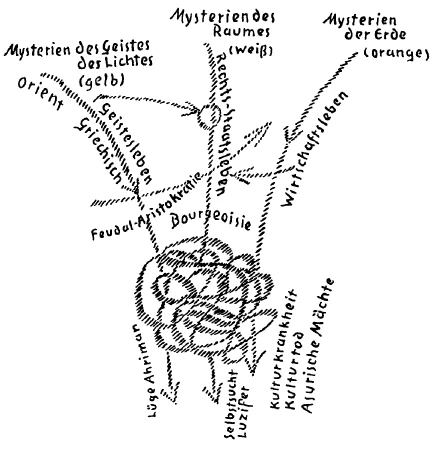
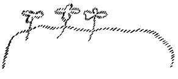

Die Aufgaben, welche der Menschheit in der Gegenwart und in der nächsten Zukunft gestellt sind, sind einschneidende, bedeutsame, große. Und es handelt sich darum, daß in der Tat ein starker seelischer Mut aufgebracht werden muß, um etwas zur Bewältigung dieser Aufgaben zu tun. Wer heute diese Aufgaben sich besieht und einen wirklichen Einblick sich zu verschaffen sucht in dasjenige, was der Menschheit not tut, der muß oftmals denken an die oberflächliche Leichtigkeit, mit der heute die öffentlichen, die sogenannten öffentlichen Angelegenheiten genommen werden. Man möchte sagen, die Menschen politisieren heute ins Blaue hinein. Aus ein paar Emotionen heraus, aus ein paar ganz egoistischen oder volksegoistischen Gesichtspunkten heraus bilden sich die Menschen ihre Anschauung über das Leben, während es dem Ernste der Gegenwart angemessen wäre, eine gewisse Sehnsucht danach zu haben, die tatsächlichen Untergründe für ein gesundes Urteil wirklich zu gewinnen. Ich habe im Laufe der letzten Monate und auch Jahre hier über die verschiedensten Gegenstände, auch der Zeitgeschichte und der Zeitforderungen Vorträge gehalten und Betrachtungen angestellt, immer zu dem Ziel, Tatsachen zu liefern, welche den Menschen in den Stand setzen können, sich ein Urteil zu bilden, nicht um das Urteil vor Sie fertig hinzustellen. Die Sehnsucht, die Tatsachen des Lebens kennenzulernen, gründlicher und immer gründlicher kennenzulernen, um eine wirkliche Unterlage für ein Urteil zu haben, darauf kommt es heute an. Ich muß dieses insbesondere deshalb sagen, weil die verschiedenen Äußerungen, die verschiedenen schriftstellerischen Darlegungen, die ich getan habe mit Bezug auf die sogenannte soziale Frage und mit Bezug auf die Dreigliederung des sozialen Organismus, wirklich, wie man deutlich sehen kann, viel zu leicht genommen werden, weil diesen Dingen gegenüber viel zu wenig die Fragen gestellt werden nach den schwerwiegenden tatsächlichen Grundlagen. Die Menschen der Gegenwart kommen so schwer zu diesen tatsächlichen Grundlagen, weil sie, trotzdem sie das nicht wahr haben wollen, eigentlich auf allen Gebieten des Lebens Theoretiker sind. Diejenigen, die sich heute am meisten einbilden, Praktiker zu sein, die sind die stärksten Theoretiker, aus dem Grund, weil sie sich gemeiniglich damit begnügen, ein paar Vorstellungen, wenige Vorstellungen über das Leben sich zu bilden und von diesen wenigen Vorstellungen über das Leben dieses Leben beurteilen wollen, während es heute nur einem wirklichen, universellen und umfassenden Eingehen auf das Leben möglich ist, ein sachgemäßes Urteil über dasjenige zu gewinnen, was notwendig ist. Man kann sagen, in gewissem Sinne ist es heute eine wenigstens intellektuelle Frivolität, wenn man ohne sachgemäße Grundlagen ins Blaue hinein politisiert oder lebensanschaulich phantasiert. Den Lebensernst möchte man auf dem Grunde der Seelen heute wünschen. ^6u3nw9

Wenn gewissermaßen wie die andere Seite, auch die praktische Seite unseres geisteswissenschaftlichen Strebens in der neuesten Zeit vor die Welt hingestellt ist, die Dreigliederung des sozialen Organismus, so ist es so, daß schon der ganzen Art des Denkens und Vorstellens, die da waltet in der Ausarbeitung dieses dreigliedrigen sozialen Organismus, heute Vorurteile und namentlich Vorempfindungen entgegengebracht werden. Diese Vorurteile, namentlich Vorempfindungen, woher stammen sie? Ja, der Mensch bildet sich heute Vorstellungen über dasjenige, was die Wahrheit ist - ich rede jetzt immer vom sozialen Leben -, er bildet sich Vorstellungen von dem, was das Gute, was das Rechte ist, was das Nützliche ist und so weiter. Und wenn er sich dann gewisse Vorstellungen gebildet hat, dann ist er der Meinung, diese Vorstellungen haben nun ganz absolute Geltung für überall und für immer. Zum Beispiel, nehmen wir einen sozialistisch orientierten Menschen West- oder Mittel- oder Osteuropas. Er hat ganz bestimmte sozialistisch formulierte Ideale. Aber was hat er diesen sozialistisch formulierten Idealen gegenüber gewissermaßen für Untergrund vorstellungen? Er hat die Untergrundvorstellung: dasjenige, wovon er sich vorstellen muß, daß es ihn befriedigt, das müsse nun alle Menschen über die ganze Erde hin befriedigen, und das müsse gelten ohne Ende für das gesamte zukünftige Erdendasein. Daß alles dasjenige, was als Gedanke für das soziale Leben gelten soll, herausgeboren sein muß aus dem Grundcharakter der Zeit und des Ortes, dafür hat man heute wenig Empfindung. Daher kommt man auch nicht leicht darauf, wie notwendig es ist, daß, mit verschiedenen Nuancen, unserer heutigen europäischen Kultur mit ihrem amerikanischen Anhange die Dreigliederung des sozialen Organismus eingefügt werde. Wird sie eingefügt, so wird schon von selbst die Nuancierung in bezug auf den Raum, das heißt auf die verschiedenen Gebiete der Erdenvölker eintreten. Und außerdem: Nach derjenigen Zeit, nach welcher, der Menschheitsevolution wegen, die heute in den «Kernpunkten der sozialen Frage» von mir erwähnten Ideen und Gedanken nicht mehr gelten können, müssen eben andere wieder gefunden werden. ^hy6cl2

Es handelt sich nicht um absolute Gedanken, sondern es handelt sich um Gedanken für die Gegenwart und für die nächste Menschheitszukunft. Aber um das in seiner vollen Tragweite einzusehen, wie notwendig diese Dreigliederung des sozialen Organismus in ein selbständiges Geistesleben, in ein selbständiges Rechts- und Staatsleben, in ein selbständiges Wirtschaftsleben ist, muß man einmal einen unbefangenen Blick werfen auf die Art, wie in unserer europäisch-amerikanischen Zivilisation zustandegekommen ist das Ineinanderwirken von Geist, Staat und Wirtschaft. Dieses Ineinanderwirken der Fäden, des Geistesfadens, des Rechts- oder Staatsfadens und des Wirtschaftsfadens ist keineswegs etwas Leichtes. Unsere Kultur, unsere Zivilisation ist ein Knäuel, was aufgewickelt etwas ist, worinnen drei Fäden verwickelt sind, die ganz verschiedenen Ursprungs sind. Unser Geistesleben ist wesentlich anderen Ursprunges als unser Rechts- oder Staatsleben und wiederum ganz anderen Ursprunges als unser Wirtschaftsleben. Und diese drei Strömungen mit verschiedenem Ursprunge, sie sind chaotisch miteinander verwickelt. Ich kann heute natürlich nur skizzenhaft darstellen, weil ich in der Kürze - ich möchte sagen bis zum Urquell diese drei Strömungen verfolgen werde. ^wly4pb

Unser Geistesleben, wie es sich zunächst darbietet für den, der die Dinge äußerlich wirklich nimmt, sinnenfällig wirklich nimmt, es wird dadurch von den Menschen angeeignet, daß die Menschen auf sich wirken lassen jene Fortsetzung des alten griechischen und lateinischen Kulturlebens, des griechisch-lateinischen Geisteslebens, wie es zunächst geflossen ist durch das, was dann später unsere Gymnasien geworden sind, durch das, was unsere Universitäten geworden sind. Denn unsere übrige sogenannte humanistische Bildung bis in die Volksschule herunter ist ja ganz abhängig von dem, was als eine Strömung, sagen wir, hereinfließt (es wird gezeichnet, gelb, siehe Seite 229) zunächst vom griechischen Elemente. Denn das, was wir als Geistesleben haben, als unser europäisches Geistesleben, ist zunächst doch griechischen Ursprungs, durch das Lateinische nur hindurchgegangen. Das Lateinische ist eine Durchgangsstation. Allerdings hat sich in der neuesten Zeit mit diesem von Griechenland her stammenden Geistesleben anderes vermischt, welches aus dem stammt, was wir die Technik der verschiedensten Gebiete nennen, die dem Griechen noch nicht zugänglich war: die Technik des mechanischen Wesens, die Technik des kaufmännischen Wesens und so weiter. Ich könnte sagen: Zu unseren Universitäten sind die technischen Hochschulen, die kommerziellen Hochschulen und so weiter getreten, die ein neuzeitlicheres Element hinzubringen zu dem, was durch unsere humanistischen, auf das Griechentum zurückgehenden Schulen in unsere Seelen hineinfließt; nicht etwa bloß in die Seelen irgendeiner sogenannten gebildeten Klasse hineinfließt, denn dasjenige, was heute sozialistische "Theorien sind, was in den Köpfen auch der Proletarier spukt, es ist nur eine Ableitung desjenigen, was vom griechischen Geistesleben eigentlich herstammt. Es ist nur durch verschiedene Metamorphosen durchgegangen. Dieses Geistesleben geht aber seinem weiteren Ursprunge nach durchaus zurück bis in den Orient hinein. Und dasjenige, was wir finden bei Plato, was wir finden bei Heraklit, bei Pythagoras, bei Empedokles, namentlich bei Anaxagoras, das alles geht zurück nach dem Orient. Dasjenige, was wir bei Äschylos, bei Sophokles, bei Euripides finden, es geht zurück nach dem Orient, was wir bei Phidias finden, es geht zurück nach dem Orient. Die griechische Kultur geht durchaus zurück nach dem Orient. Sie hat eine bedeutende Wandlung durchgemacht auf dem Wege vom Orient nach Griechenland. Im Orient drüben war diese Geisteskultur wesentlich spiritueller, als sie im alten Griechenland war, und sie war im Oriente ein Ausfluß desjenigen, was man nennen kann: die Mysterien des Geistes, ich kann auch sagen die Mysterien des Lichtes (es wird wieder gezeichnet, siehe Seite 229). Schon ein filtriertes, ein verdünntes Geistesleben war das griechische gegenüber jenem Geistesleben, von dem es seinen Ursprung genommen hat, dem orientalischen Geistesleben. Dieses beruhte auf ganz besonderen geistigen Erfahrungen. Wenn ich Ihnen diese geistigen Erfahrungen beschreiben soll, so müßte ich sie Ihnen in der folgenden Weise charakterisieren. ^x8vp4x

Natürlich müssen wir in vorhistorische Zeiten zurückgehen, denn die Mysterien des Lichtes oder die Mysterien des Geistes sind durchaus vorhistorische Erscheinungen. Wenn ich Ihnen darstellen soll den Charakter dieses Geisteslebens, wie es sich gebildet hat, so muß ich das Folgende sagen. Wir wissen ja, wenn wir sehr weit zurückgehen in der Menschheitsevolution, so finden wir immer mehr und mehr, daß die Menschen der alten Zeiten ein atavistisches Hellsehen, ein träumerisches Hellsehen hatten, durch das sich ihnen die Geheimnisse des Weltenalls enthüllten. Und wir sprechen durchaus richtig, wenn wir sagen, daß über die ganze, im dritten, vierten, fünften, sechsten, siebenten Jahrtausend vor dem Mysterium von Golgatha zivilisierte asiatische Erde Menschen wohnten, denen sich für ihr durchaus naturgebundenes, an das Blut, an die leibliche Organisation gebundenes Hellsehen geistige Wahrheiten offenbarten. Das war gewissermaßen die im weiten Umkreis verbreitete Bevölkerung. Aber dieses atavistische Hellsehen, es war in absteigender Entwickelung, es kam immer mehr und mehr in die Dekadenz. Und dieses In-die-Dekadenz-Kommen des atavistischen Hellsehens ist nicht bloß eine kulturhistorische Erscheinung, es ist zugleich eine Erscheinung des sozialen Lebens der Menschheit. ^wduiqs

Warum? Weil aus dieser weiten Masse der Erdenbevölkerung von verschiedenen Zentren her, hauptsächlich aber von einem Zentrum in Asien, gewissermaßen aufstand eine besondere Art von Menschen, eine Art von Menschen mit besonderen Fähigkeiten. Diese Menschen hatten außer dem atavistischen Hellsehen, das ihnen in einer gewissen Beziehung noch geblieben war - es stieg noch aus ihrem inneren Seelenleben traumhaftes Erfassen der Geheimnisse der Welt auf —, außer diesem traumhaften Erfassen der Welt hatten sie aber noch dasjenige — und zwar als erste Menschen der Menschheitsentwickelung —, was wir die Denkkraft nennen. Sie hatten zuerst die aufdämmernde Intelligenz. ^i1w9cn

Das war eine bedeutsame soziale Erscheinung, daß jene alten Menschen, die nichts hatten als die traumhaft aufsteigenden Schauungen über die Geheimnisse der Welt, Einwanderer in ihre Territorien kommen sahen, die sie noch verstehen konnten, weil die auch Schauungen hatten, die aber etwas schon hatten, was sie selbst nicht hatten: die Denkkraft. Das war eine besondere Menschensorte. Die Inder sahen diejenige Kaste, die sie als die Brahmanen-Kaste bezeichneten, als die Nachkommen dieser Menschen an, die mit dem atavistischen Hellsehen die Denkkraft verbanden. Und als sie in die südlichen Gegenden von den höhergelegenen nördlichen Gegenden Asiens hinunterstiegen, da machte sich für sie geltend der Name Arier. Das ist die arische Bevölkerung. Ihr Urkennzeichen ist dieses, daß sie - wenn ich mich jetzt des späteren Ausdrucks bedienen darf — mit den plebejischen Fähigkeiten des atavistischen Hellsehens die Denkkraft verbanden. ^b9asd2

Und diejenigen Mysterien, die man die Mysterien des Geistes oder namentlich die Mysterien des Lichtes nennt, wurden begründet von solchen Menschen, die das atavistische Hellsehen mit dem ersten Aufflammen der Intelligenz, dem inneren Lichte des Menschen verbanden. Und eine Dependenz desjenigen, was dazumal als ein erleuchtender Funke in die Menschheit kam, ist unsere Geistesbildung, aber eben durchaus eine Dependenz. ^c8j0ij

Es hat sich in der Menschheit manches erhalten von dem, was da geoffenbart worden war. Aber man muß bedenken, daß schon die Griechen, gerade die gebildeteren Persönlichkeiten unter den Griechen, die alte atavistische Hellsehergabe hatten verglimmen, verlöschen sehen, und daß ihnen geblieben war die Denkkraft. Bei den Römern ist nur die Denkkraft geblieben. Bei den Griechen war noch das Bewußtsein vorhanden, daß auch die Denkkraft aus denselben Quellen heraufkommt, aus denen das alte atavistische Hellsehen kam. Daher sprach Sokrates noch durchaus etwas aus, was er als Erlebnis kannte, wenn er von seinem Dämon sprach, der ihm seine ja allerdings nur dialektischen, intelligenten Wahrheiten eingab. ^vpvqbx

Die Griechen haben auch künstlerisch bedeutsam hingestellt das Herausragen des Intelligenzmenschen, besser gesagt, das Herauswachsen des Intelligenzmenschen aus der anderen Menschheit: Denn die Griechen haben in ihrer Plastik — man studiere sie nur genau - drei stark voneinander verschiedene Typen. Sie haben den arischen Typus, den der Apollo-Kopf hat, der Pallas-Athene-Kopf, der Zeus-Kopf, der Hera-Kopf. Vergleichen Sie die Ohren des Apollo mit den Ohren eines Merkur-Kopfes, die Nase des Apollo mit der Nase eines MerkurKopfes, da werden Sie sehen, welch anderer Typus das ist. Der Grieche wollte hinweisen, wie im Merkur-Typus zusammengeflossen ist im Griechentum mit der Intelligenz dasjenige, was altes, vergangenes Hellsehen war, das noch als Aberglaube fortlebte, das niedere Bildung war, wie dieses auf dem Grunde der Kultur da war, und wie hinausragte der Arier, dessen künstlerische Repräsentanz der Zeus-Kopf, Pallas-AtheneKopf und so weiter war. Und die ganz unten stehenden, mit den trüben Überresten des alten Hellsehertums vorhandenen Rassen, die auch noch in Griechenland lebten, aber namentlich an der Peripherie von Griechenland von den Griechen wahrgenommen wurden, sind wiederum in einem anderen Typus plastisch erhalten: in dem Satyr-Typus, der wieder ganz anders ist als der Merkur-Typus. Vergleichen Sie die SatyrNase mit der Merkur-Nase, die Satyr-Ohren mit den Merkur-Ohren und so weiter. Der Grieche hat in seiner Kunst zusammenfließen lassen dasjenige, was er in seinem Bewußtsein über sein Werden trug. ^2ast7k

Das, was dadurch die Mysterien des Geistes oder des Lichtes in allmählicher Filtrierung durch Griechenland dann auf die Neuzeit heraufkam, das hatte aber eine gewisse Eigentümlichkeit als Geisteskultur. Es war als Geisteskultur mit solcher inneren Stoßkraft versehen, daß es aus sich heraus zu gleicher Zeit das Rechtsleben der Menschen begründen konnte. Daher auf der einen Seite die Offenbarung der Götter in den Mysterien, die dem Menschen den Geist bringen, und die Einpflanzung dieses von den Göttern erworbenen Geistes in den äußeren sozialen Organismus, in die Theokratien. Alles geht zurück auf die Theokratien. Und diese Theokratien waren nicht nur imstande, aus dem Mysterienwesen selbst heraus sich mit dem Rechte zu durchdringen, mit dem politischen Wesen zu durchdringen, sondern auch das Wirtschaftsleben zu regeln aus dem Geiste heraus. Die Mysterienpriester der Mysterien des Lichtes waren zu gleicher Zeit die ökonomischen, die wirtschaftlichen Verwalter ihrer Gebiete. Sie wirtschafteten nach den Regeln der Mysterien. Sie bauten die Häuser, sie bauten die Kanäle, sie bauten die Brücken, sie sorgten auch für das Bebauen des Bodens und so weiter. ^s03wgq

Das war in der Urzeit eine Kultur durchaus aus dem Geistesleben heraus. Aber diese Kultur verabstrahierte. Aus geistigem Leben wurde sie immer mehr und mehr eine Summe von Ideen. Im Mittelalter ist sie schon Theologie, das heißt, eine Summe von Begriffen, statt des alten geistigen Lebens, oder sie ist angewiesen darauf, weil man mit dem geistigen Leben nicht mehr zusammenhing, abstrakt gehalten zu werden, kurial gehalten zu werden. Denn wenn wir nach den alten Theokratien zurückblicken, da finden wir, daß derjenige, der da herrscht, von den Göttern in den Mysterien dazu seinen Auftrag erhalten hat. Die letzte Dependenz ist der abendländische Herrscher. Man sieht ihm gar nicht mehr an, daß er die letzte Dependenz des aus den Mysterien von den Göttern mit seinem Auftrage hervorgegangenen Beherrschers der Theokratie ist. Alles, was geblieben ist, ist Krone und Krönungsmantel. Das sind die äußeren Insignien, die nun später mehr Orden wurden. Den Titeln merkt man manchmal noch an, wenn man solche Dinge versteht, wie sie zurückgehen auf die Mysterienzeit. Aber alles ist veräußerlicht. ^9bht2t

Kaum weniger veräußerlicht ist dasjenige, was durch unsere Gymnasien und Universitäten wallt als Geisteskultur, als letzter Nachklang der göttlichen Botschaften der Mysterien. Es ist das Geistesleben in unser Leben eingeflossen, aber es ist ganz abstrakt geworden, es ist bloßes Vorstellungsleben geworden. Es ist das geworden, wovon endlich die sozialistisch orientierten Kreise sagen: es ist eine Ideologie geworden, das heißt, eine Summe von Gedanken, die nur Gedanken sind. Zu dem ist wirklich unser Geistesleben geworden. ^ektoq1

Unter diesem Geistesleben hat sich dasjenige heranentwickelt, was das heutige soziale Chaos ist, weil das Geistesleben, das so filtriert ist, das so verabstrahiert ist, alle Stoßkraft verloren hat. Und wir sind darauf angewiesen, das Geistesleben wiederum auf seine eigenen Grundlagen zu stellen, denn nur so kann es gedeihen. Wir müssen wiederum von dem bloß gedachten Geist zu dem schaffenden Geist den Weg finden. Das können wir nur, wenn wir aus dem staatlichen Geistesleben heraus das freie Geistesleben zu entwickeln suchen, das dann auch die Kraft haben wird, wiederum zum Leben eben zu erwachen. Denn weder ein von der Kirche gegängeltes, noch ein vom Staate bewahrtes und beschütztes Geistesleben, noch ein unter der Last des Wirtschaftens keuchendes Geistesleben kann für die Menschheit fruchtbar sein, sondern nur das auf sich selbst gestellte Geistesleben. ^fyiimg

Ja, heute ist es an der Zeit, daß wir den Mut in unseren Seelen aufbringen, frank und frei vor der Welt zu vertreten, daß das Geistesleben auf seinen eigenen Boden gestellt werden müsse. Viele Menschen fragen heute: Was sollen wir denn tun? Das Nächste, worauf es ankommt, das ist, daß wir die Menschen aufklären über das, was notwendig ist. Daß wir möglichst viele Menschen gewinnen, die einsehen, wie notwendig es ist, zum Beispiel das Geistesleben auf seinen eigenen Boden zu stellen, daß wir möglichst viele Menschen gewinnen, die es einsehen, daß dasjenige, was Pädagogik des 19. Jahrhunderts für Volks-, Mittel- und Hochschulen geworden ist, nicht weiter der Menschheit zum Heil gereichen kann, sondern daß neu gebaut werden müsse aus einem freien Geistesleben heraus. Es ist noch wenig der Mut in den Seelen vorhanden, wirklich in radikaler Weise diese Forderung zu stellen. Und man kann sie ja nur stellen, wenn man dahin arbeiter, daß möglichst viele Menschen die Einsicht in diese Verhältnisse gewinnen. Alle andere soziale Arbeit ist heute provisorisch. Das ist dasjenige, was das Wichtigste ist: zu sehen, zu arbeiten, daß immer mehr und mehr Menschen die Einsicht in die sozialen Notwendigkeiten, von denen die eben charakterisierte eine ist, gewinnen können. Aufklärung über diese Dinge verschaffen mit allen Mitteln, die uns zur Verfügung stehen, das ist es, worauf es heute ankommt. ^buh9e2

Wir sind noch nicht produktiv geworden in bezug auf das Geistesleben, und wir werden erst produktiv werden in bezug auf das Geistesleben. Ansätze dazu sind vorhanden, ich werde gleich davon sprechen, aber wir sind noch nicht produktiv geworden in bezug auf das Geistesleben. Wir müssen produktiv werden durch die Verselbständigung des Geisteslebens. ^pdd90t

Alles was auf der Erde entsteht, läßt Reste zurück. Die Mysterien des Lichtes sind in der heutigen orientalischen Kultur, im orientalischen Geistesleben weniger filtriert als im Abendlande, aber doch durchaus nicht mehr in der Gestalt, in der sie damals waren in der Zeit, die ich geschildert habe. Doch kann man, wenn man das studiert, was die Hindus heute noch haben, was die orientalischen Buddhisten haben, viel eher den Nachklang desjenigen vernehmen, wovon wir selber unser Geistesleben haben, nur ist es auf einer anderen Altersstufe in Asien stehengeblieben. Aber wir sind unproduktiv, wir sind in hohem Grade unproduktiv. Als sich im Abendlande dieKunde von dem Mysterium von Golgatha verbreitet hat — woher nahmen die griechischen, die lateinischen Gelehrten die Begriffe, um das Mysterium von Golgatha zu begreifen? Sie nahmen sie aus der orientalischen Weisheit. Das Abendland hat das Christentum nicht hervorgebracht, es ist aus dem Orient entnommen. ^vo5d0g

Und ein anderes: Als man die geistige Kultur in englisch sprechenden Gegenden recht unfruchtbar fühlte und nach einer Befruchtung des Geisteslebens seufzte, da gingen die Theosophen zu den unterworfenen Indern und suchten dort ihre Quelle für ihre neuzeitliche Theosophie. Für dasjenige, was man suchte, um das spirituelle Leben zu verbessern, war keine fruchtbare Quelle im eigenen Leben da: man ging nach dem Orient. Und neben diesem Signifikanten könnten Sie viele Beweise für die Unfruchtbarkeit des Geisteslebens im Abendlande finden. Und jeder Beweis für die Unfruchtbarkeit des Geisteslebens im Abendlande ist zu gleicher Zeit ein Beweis für die Notwendigkeit der Verselbständigung des Geisteslebens im dreigliedrigen sozialen Organismus. ^o5njj7

Eine zweite Strömung in dem Knäuelwickel ist die Staats- oder Rechtsströmung. Da ist der Knüppel in unserer Kultur, die zweite Strömung. Wenn sie der Mensch heute äußerlich anschaut, wenn er sich äußerlich mit ihr bekannt macht, da sieht er sie, wenn unsere ehrwürdigen Richter auf ihren Richterstühlen mit den Geschworenen sitzen und über die Verbrechen oder Vergehen richten, oder wenn die Verwaltungsbeamten in ihrer Bürokratie walten über unsere zivilisierte Welt hin, zum Verzweifeln derjenigen, die so verwaltet werden. Alles dasjenige, was wir Jurisprudenz, was wir Staat nennen, und alles, was in Verbindung von Jurisprudenz und Staat als Politik entsteht, das ist diese Strömung (siehe Zeichnung S. 229, weiß). Es ist — wie ich das (orange) die Strömung des Geisteslebens nennen kann, so ist dieses die Strömung des Rechtes, des Staates (weiß). ^j6r9u7

Woher kommt dies? Allerdings geht das auch auf Mysterienkultur zurück. Es geht zurück auf ägyptische Mysterienkultur, die durch die südlichen europäischen Gegenden gegangen ist, und die dann durchgegangen ist durch das nüchterne, phantasielose Wesen der Römer, sich verbunden hat im phantasielosen Wesen der Römer mit einem Seitenast des orientalischen Wesens und da das katholische Christentum beziehungsweise das katholische Kirchentum geworden ist (siehe Zeichnung). Dieses katholische Kirchentum, das ist im Grunde genommen, wenn auch etwas radikal gesprochen, auch eine Jurisprudenz. Denn von einzelnen Dogmen bis zu jenem gewaltigen, großen Gerichte, das immer als « Jüngstes Gericht» dargestellt wurde durch das ganze Mittelalter, wurde das ganz andersartige Geistesleben des Orients, da es den ägyptischen Einschlag hatte aus den Mysterien des Raumes, im Grunde genommen verwandelt in eine Gesellschaft von Weltenrichtern mit Weltenurteilen und Weltenbestrafungen und Sündern und Guten und Bösen: Es ist eine Jurisprudenz. Und das ist das zweite Element, das in unserem Geistesknäuel in der Verwirrung, die wir Zivilisation nennen, drinnen lebt und sich keineswegs organisch mit dem anderen verbunden hat. Daß es sich nicht verbunden hat, das kann jeder erfahren, der einmal an die Universität geht und meinetwillen nacheinander hört eine juristische Rede über Staatsrecht und nachher hört eine theologische Rede, meinetwillen über kanonisches Recht sogar. Das liegt nebeneinander. Aber diese Dinge sind menschengestaltend gewesen. Selbst in späteren Zeiten, wo man ihre Ursprünge vergessen hat, gestalten sie die Menschengemüter noch. Verabstrahierend wirkte das Rechtsleben auf das spätere Geistesleben, aber im äußeren Leben war es in den Menschensitten, Menschengewohnheiten, Menscheneinrichtungen schaffend. Und das, was in der dekadenten Geistesströmung des Orients der letzte soziale Ausläufer war, was ist es denn, wovon man nicht mehr den Ursprung erkennt? Das ist die Feudal-Aristokratie (siehe Zeichnung). Dem Adeligen könnten Sie nicht mehr ansehen, daß er seinen Ursprung hat aus dem orientalisch theokratischen Geistesleben, denn er hat alles abgestreift, es ist nur noch die soziale Konfiguration geblieben. Die Journalisten-Intelligenz, die bekommt manchmal so merkwürdige Alpdruckerscheinungen! Sie bekam solche Alpdruckerscheinung in der neueren Zeit und erfand ein kurioses Wort, auf das sie besonders stolz wurde: «Geistes-Aristokratie». Das konnte man ab und zu hören. Dasjenige, was durch die römische Kirchenverfassung durchgehend, durch die theokratisierende Jurisprudenz, die jurisprudenzende Theokratie hindurchgehend, sich dann verweltlicht im mittelalterlichen Städtewesen, sich völlig verweltlicht in der neueren Zeit, was ist das in der äußersten Dependenz? Das ist die Bourgeoisie (siehe Zeichnung). Und so sind getreulich unter den Menschen durcheinandergewürfelt diese geistigen Kräfte in ihren äußersten Dependenzen. ^y8veov

Eine dritte Strömung verbindet sich schon auch noch damit. Wenn Sie sie heute von außen beobachten (Zeichnung, orange), wo zeigt sich diese dritte Strömung äußerlich sinnenfällig besonders charakteristisch? Ja, es gab für Mitteleuropa geradezu eine Methode, gewissen Leuten zu demonstrieren, wo sich diese äußersten Dependenzen eines auch ursprünglich anderen entfalteten. Das geschah, wenn der mitteleuropäische Mensch seinen Sohn ins Kontor nach London oder nach New York schickte, damit er dort die Usancen des Wirtschaftens lerne. In den Usancen des Wirtschaftslebens, deren Ursprung in Volksgewohnheiten der anglo-amerikanischen Welt liegen, da ist die letzte Konsequenz desjenigen zu sehen, was sich entwickelt hat in Dependenzen aus dem, was ich nennen möchte, die Mysterien der Erde, von denen zum Beispiel die Druiden-Mysterien nur eine besondere Abart waren. Die Mysterien der Erde enthielten in Urzeiten europäischer Bevölkerung noch eine eigentümliche Art des Weisheitslebens. Jener europäischen Bevölkerung, die nichts wußte, ganz barbarisch war gegenüber den Offenbarungen der orientalischen Weisheit, gegenüber den Mysterien des Raumes, gegenüber dem, was dann zum Katholizismus wurde, jener Bevölkerung, die entgegenkam dem sich ausbreitenden Christentum, ihr war eigen eine eigentümliche Art des Weisheitslebens, das ganz und gar physische Weisheit war. Man kann historisch davon höchstens noch die alleräußersten Gebräuche studieren, die in der Geschichte dieser Strömung aufgezeichnet sind: wie zusammenhingen die Festlichkeiten derjenigen Menschen, aus denen die Usancen, die Gewohnheiten Englands und Amerikas geworden sind. DieFestlichkeiten wurden hier in ganz andere Beziehungen gebracht als in Ägypten, wo die Ernte mit den Sternen zusammenhing. Hier war die festliche Gelegenheit die Ernte als solche, und mit anderen Dingen als dort, mit Dingen, die durchaus dem Wirtschaftsleben angehören, hingen die höchsten Festlichkeiten des Jahres zusammen. Wir haben hier durchaus etwas, was auf das Wirtschaftsleben zurückgeht. Und wollen wir den ganzen Geist dieser Sache erfassen, dann müssen wir uns sagen: Von Asien herüber und vom Süden herauf verpflanzen Menschen ein Geistes- und Rechtsleben, das sie von oben her empfangen haben und herunterführen zur Erde. Da, in der dritten Strömung, sprießt ein Wirtschaftsleben auf, das sich hinaufentwickeln muß, das sich hinaufranken muß, das ursprünglich eigentlich in seinen Rechtsusancen, in seinen geistigen Einrichtungen ganz und gar nur Wirtschaftsleben ist, so weit Wirtschaftsleben, daß zum Beispiel eines der besonderen Jahresfeste darinnen bestand, daß man die Befruchtung der Herden als besonderes Fest zu Ehren der Götter feierte. Und ähnliche Feste gab es: alles aus dem Wirtschaftsleben herausgedacht. Und wenn wir in die Gegenden Nordrußlands, Mittelrußlands, Schwedens, Norwegens gehen, oder in diejenigen Gegenden, die bis vor kurzer Zeit die Gegenden Deutschlands waren, nach Frankreich, wenigstens Nordfrankreich, und nach dem heutigen Großbritannien, wenn wir diese Gegenden durchgehen, überall finden wir ausgebreitet eine Bevölkerung, die durchaus vor der Ausbreitung des Christentums in alten Zeiten eine deutlich ausgesprochene Wirtschaftskultur hatten. Und das, was noch als die alten Sitten, als Rechtssittenfest, Götterfestes-Sitte gefunden werden kann, ist Nachklang dieser alten Wirtschaftskultur. (Die Zeichnung an der Tafel ist nun vollständig.) ^99pv0g

 ^vk5db7

Diese Wirtschaftskultur begegnet sich mit dem, was von der anderen Seite kommt. Zunächst hat es diese Wirtschaftskultur nicht dazu gebracht, ein selbständiges Rechts- und Geistesleben zu entwickeln. Die ursprünglichen Rechtsusancen sind abgeworfen worden, weil das römische Recht eingeflossen ist, die ursprünglichen Geistesusancen sind abgeworfen worden, weil das griechische Geistesleben eingeflossen ist. Zunächst wird dieses Wirtschaftsleben steril, und arbeitet nach und nach sich wiederum heraus, kann sich aber nur herausarbeiten, wenn es die Chaotisierung mit dem von fremd her angenommenen Geistesleben und Rechtsleben überwindet. Nehmen Sie das heutige anglo-amerikanische Geistesleben. In diesem englisch-amerikanischen Geistesleben haben Sie zwei sehr stark voneinander unterschiedene Dinge. Erstens haben Sie überall mehr als sonstwo auf der Erde im anglo-amerikanischen Geistesleben die sogenannten Geheimgesellschaften, die ziemlich starken Einfluß haben, viel mehr als die Leute wissen. Sie sind durchaus die Bewahrer alten Geisteslebens, und sie sind stolz darauf, die Bewahrer ägyptischen oder orientalischen Geisteslebens zu sein, das ganz und gar filtriert, bis ins Symbol verflüchtigt ist; bis ins Symbol, das man nicht mehr versteht, verflüchtigt ist, aber bei den Oberen eine gewisse große Macht hat. Das ist aber altes Geistesleben, nicht auf eigenem Boden erwachsenes Geistesleben. Daneben ist ein Geistesleben da, das auf dem Wirtschaftsboden durchaus wächst, aber so kleine Blümchen erst treibt, ganz als kleineBlümchen wuchert am Wirtschaftsboden. ^cilzng

 ^9mfcs6

Wer solche Dinge studiert und verstehen kann, der weiß gut, daß Locke, Hume, Mill, Spencer, Darwin und andere durchaus diese Blümchen sind aus dem Wirtschaftsleben heraus. Man kann ganz genau die Gedanken eines Mill, die Gedanken eines Spencer aus dem Wirtschaftsleben heraus gewinnen. Die Sozialdemokratie hat das dann zur Theorie erhoben und betrachtet das Geistesleben als eine Dependenz des Wirtschaftslebens. Das ist da zunächst vorhanden, alles herausgeholt aus dem sogenannten Praktischen, eigentlich aus der Lebensroutine heraus, nicht aus der wirklichen Lebenspraxis. So daß da nebeneinandergehen solche Dinge wie der Darwinismus, Spencerismus, Millismus, Humeismus und die filtrierten Mysterienlehren, die dann ihre Fortsetzungen finden in den verschiedenen sektiererischen Evolutionen, die Theosophische Gesellschaft, die Quäker und so weiter. Das Wirtschaftsleben, das herauf will, hat erst die kleinen Blümchen getrieben, ist noch gar nicht weit. Dasjenige, was Geistesleben ist, dasjenige, was Rechtsleben ist: fremde Pflanzen! Und am allermeisten fremde Pflanzen — das bitte ich wohl zu beachten -, fremde Pflanzen um so mehr, je mehr wir in der europäischen Zivilisation nach dem Westen gehen. ^4vaml9

Denn in Mitteleuropa, da hat es immer etwas gegeben, was, ich möchte sagen, wie ein Sich-Wehren war, ein Ankämpfen war gegen das griechische Geistesleben auf der einen Seite und das römisch-katholische Rechtsleben auf der anderen Seite. Ein Sich-Aufbäumen hat es da immer gegeben. Ein Beispiel für dieses Aufbäumen ist die mitteleuropäische Philosophie. In England weiß man in Wirklichkeit eigentlich nichts von dieser mitteleuropäischen Philosophie. Man kann in Wirklichkeit den Hegel nicht übersetzen in die englische Sprache, es ist nicht möglich. Man weiß nichts von ihm. Deutsche Philosophie nennt man ja in England Germanismus und meint damit etwas, womit sich ein vernünftiger Mensch nicht befassen kann. Aber gerade in dieser deutschen Philosophie, mit Ausnahme einer Episode -— wo nämlich Kant durch Hume gründlich’ verdorben worden ist, und dieses scheußlicheKantischHumesche Element in die deutsche Philosophie hineingebracht worden ist, das wirklich in den Köpfen der mitteleuropäischen Menschheit so heilloses Unheil angerichtet hat —, mit Ausnahme dieser Episode haben wir immerhin nachher die Nachblüte dieses Aufbäumens gerade in Fichte, Schelling, Hegel. Und wir haben das Suchen nach einem freien Geistesleben schon in Goethe, der nichts mehr wissen will von dem letzten Nachklang der römisch-katholischen Jurisprudenz in dem, was man Naturgesetz nennt. Fühlen Sie ebenso, wie in dem schäbig gewordenen Talar und in den sonderbaren Mützen, die noch die Richter aus der alten Zeit haben — heute machen sie Petitionen, daß sie das ablegen können -, fühlen Sie ebenso in der Naturwissenschaft, in dem Naturgesetze, «Gesetz», das Juristische noch drinnen! Denn der ganze Ausdruck «Naturgesetz» hat zum Beispiel der Goetheschen Naturwissenschaft gegenüber, die nur mit dem Urphänomen, die nur mit der Urtatsache arbeitet, keinen Sinn. Da ist zum ersten Mal radikal angekämpft — aber natürlich ist das alles in dem Beginn geblieben -, das war der erste Vorstoß nach dem freien Geistesleben: die Goethesche Naturwissenschaft. Und in diesem Mitteleuropa gibt es sogar schon den ersten Anstoß zu dem selbständigen Rechts- oder Staatsleben. Lesen Sie solch eine Schrift wie die Wilhelms von Humboldt. Der Mann ist sogar preußischer Unterrichtsminister gewesen. Lesen Sie die Schrift von Wilhelm von Humboldt. Sie hat früher - ich weiß nicht, wie viel sie jetzt kostet - in der Reclamschen Universal-Bibliothek bloß zwanzig Pfennige gekostet. Lesen Sie diese Schrift: «Ideen zu einem Versuch, die Grenzen der Wirksamkeit des Staates zu bestimmen», dann werden Sie sehen den ersten Ansatz, das selbständige Rechts- oder Staatsleben, die Selbständigkeit des eigentlichen politischen Gebietes zu konstruieren. Allerdings ist es eben niemals weiter als zu Ansätzen gekommen. Diese Ansätze liegen zurück bis in die erste Hälfte des 19. Jahrhunderts, sogar bis in das Ende des 18. Jahrhunderts. Aber man muß nur bedenken, daß immerhin doch in diesem Mitteleuropa gerade nach dieser Richtung hin wichtige Impulse da sind, Impulse, an die angeknüpft werden kann, die nicht unberücksichtigt gelassen werden sollen, die einmünden können in den Impuls vom dreigliedrigen sozialen Organismus. ^isdep6

Nietzsche hat in eines seiner ersten Bücher dasjenige Wort geschrieben, das ich wieder zitiert habe in meinem Nietzsche-Buch gleich auf den ersten Seiten, und mit dem geahnt wird etwas wie die Tragik des deutschen Geisteslebens. Nietzsche versuchte dazumal in seiner Schrift «David Strauß, der Bekenner und Schriftsteller» die Ereignisse von 1870/71, die Begründung des Deutschen Reiches zu charakterisieren mit dem Wort: «Exstirpation des deutschen Geistes zu Gunsten des deutschen Reiches». Seither ist dieser Kehlkopfschnitt des deutschen Geistes gründlich durchgeführt worden. Und als in den letzten fünf bis sechs Jahren drei Viertel der Welt über dieses ehemalige Deutschland sich hermachten - ich will nicht über die Ursachen und über die Schuldigen sprechen, sondern eben nur die Konfiguration, die Weltlage angeben -, da war es im Grunde genommen schon der Leichnam des deutschen Geisteslebens. Aber wenn man so spricht, wie ich gestern gesprochen habe, unbefangen die Tatsachen charakterisierend, so sollte man nicht heraushören, daß nicht vieles noch drinnenliegt in diesem deutschen Geistesleben, was trotz der zukünftigen Zigeunerhaftigkeit herauskommen muß, was beachtet werden muß, was beachtet sein will. Denn woran sind im Grunde genommen die Deutschen zugrunde gegangen? Man muß sich auch diese Frage unbefangen einmal beantworten. Die Deutschen sind daran zugrunde gegangen, daß sie es auch mitmachen wollten mit dem Materialismus, und weil sie kein Talent haben zum Materialismus. Die anderen haben gute Talente für den Materialismus. Die Deutschen haben überhaupt jene Eigentümlichkeit, die einmal Herman Grimm ausgezeichnet charakterisiert hat, indem er sagte: Die Deutschen weichen in der Regel dann zurück, wenn es ihnen heilsam wäre, kühn vorzuschreiten, und sie stürmen furchtbar stark vor, wenn es ihnen heilsam wäre, sich zurückzuhalten. — Es ist das ein sehr gutes Wort für eine innere Charaktereigenschaft gerade des deutschen Volkes. Denn die Deutschen haben Stoßkraft durch die Jahrhunderte gehabt, aber nicht die Fähigkeit, die Stoßkraft durchzuhalten. Goethe konnte das Urphänomen hinstellen, aber es nicht bis zu den Anfängen der Geisteswissenschaft bringen. Er konnte eine Geistigkeit entwickeln, wie zum Beispiel in seinem «Faust» oder in seinem «Wilhelm Meister», welche die Welt hätte revolutionieren können, wenn die rechten Wege gefunden worden wären. Dagegen brachte es die äußere Persönlichkeit dieses genialen Menschen nur so weit, daß er in Weimar Fett ansetzte und ein Doppelkinn hatte, ein dicker Geheimrat wurde, der ungemein fleißig war auch als Minister, aber der doch genötigt war, fünfte grad sein zu lassen, wie man sagt, gerade im politischen Leben. ^pa3n71

Das sollte in der Welt eingesehen werden, daß solche Erscheinungen wie Goethe und Humboldt überall die Ansätze darstellen, und daß die Welt wahrhaftig zu ihrem Schaden, nicht zu ihrem Nutzen, unberücksichtigt lassen könnte dasjenige, was innerhalb der deutschen Evolution lebt, und was durchaus noch nicht ausgebaut ist, was herauskommen muß. Denn die Deutschen haben schließlich auch nicht die Anlage, welche die anderen so großartig haben, je weiter wir nach Westen gehen: überall bis zu den letzten Abstraktionen aufzusteigen. Man nennt nur dasjenige, was die Deutschen in ihrem Geistesleben haben, «Abstraktionen», weil man es nicht erleben kann; und weil man das Leben selbst auspreßt, so glaubt man, die anderen haben es auch nicht drinnen. Aber die Deutschen haben nicht die Gabe, bis zu den äußersten Abstraktionen vorzudringen. Das zeigte sich insbesondere in ihrem Staatsleben, in diesem unglückseligsten aller Staatsleben. Hätten die Deutschen von jeher das große Talent für den Monarchismus gehabt, das sich die Franzosen bis zum heutigen Tage so glänzend bewahrt haben, so würden sie dem «Wilhelminismus» niemals verfallen sein. Sie hätten nicht diese sonderbare, karikaturhafte Gestalt eines Monarchen dastehen zu lassen oder hinzustellen brauchen. Die Franzosen nennen sich zwar Republikaner, aber sie haben unter sich einen heimlichen Monarchen, der das Staatsgefüge fest zusammenhält, der die Gemüter furchtbar im Zaume hält: denn im Grunde genommen ist überall noch der Geist Ludwigs XIV. da. Es ist nur noch in der Dekadenz natürlich, aber es ist da. Es ist schon ein heimlicher Monarch in dem französischen Volke enthalten, das geht im Grunde genommen aus jeder seiner Kulturäußerungen hervor. Und jenes Talent zur Abstraktion, das in Woodrow Wilson zutage getreten ist, das ist eben auf äußerem, politischem Gebiete das äußerste Talent zur Abstraktion. Jene Vierzehn Punkte des Weltenschulmeisters, die in jedem ihrer Worte das Gepräge des Unpraktischen und Undurchführbaren tragen, die konnten nur entspringen aus dem Geiste heraus, der ganz für das Abstrakte gebaut ist, der gar keinen Sinn hat für wahre Wirklichkeiten. ^uwhjsi

Es wird einmal wohl zwei Dinge geben, die die Kulturgeschichte der Zukunft schwer begreifen wird. Das eine habe ich öfter mit den Worten Herman Grimms vor Ihnen charakterisiert: es ist die Kant-Laplacesche Theorie, an die manche Leute heute noch glauben. Herman Grimm sagt in seinem «Goethe» so schön: man wird einmal jene Krankheit, von den Leuten heute Wissenschaft genannt, schwer begreifen können, die sich in der Kant-Laplaceschen Theorie zum Vorschein bringt, wonach aus einem allgemeinen Weltnebel durch Zusammenballung alles das entstanden ist, was wir heute um uns herum haben. Und das soll so weiter gehen, bis das ganze Zeug wiederum in die Sonne zurückfällt! Ein Aasknochen, um den ein hungriger Hund seine Kreise zieht, ist ein appetitlicheres Stück, als diese Phantasievorstellungen, diese phantastische Vorstellung von der Weltentwickelung. — So meint Herman Grimm. Natürlich wird es einmal große Schwierigkeiten haben, aus dem wissenschaftlichen Wahnsinn des 19. und 20. Jahrhunderts diese KantLaplacesche Theorie zu erklären. ^386mt8

Das zweite Stück wird sein die Erklärung der unglaublichen Tatsache, daß es jemals eine große Anzahl Menschen geben konnte, welche den Humbug der Vierzehn Punkte von Woodrow Wilson ernst nahmen, in einem Zeitalter, das sozial so ernst ist. ^1hk1g2

Studieren wir dasjenige, was in der Welt nebeneinander steht, dann finden wir, wie in einer eigentümlichen Weise sich durcheinanderknäueln Wirtschaftsleben, politisches Rechtsleben, Geistesleben. Wollen wir nicht zugrunde gehen unter dem in die alleräußerste Degeneration gekommenen Geistes- und Rechtsleben, dann müssen wir uns hinwenden zu dem dreigliedrigen sozialen Organismus, der aus den selbständigen Wurzeln heraus baut das Wirtschaftsleben, das emporkommen will, das aber nicht emporkommen kann, wenn ihm kein Rechtsleben und kein Geistesleben aus der Freiheit entgegenkommen. Die Dinge haben in der ganzen Menschheitsevolution und im menschlichen Zusammenleben ihre tiefen Wurzeln. Diese Wurzeln, sie müssen aufgesucht werden. Den Menschen muß heute verständlich gemacht werden, wie da unten, ich möchte sagen, ganz am Boden kriecht das Wirtschaftsleben, eingefädelt von anglo-amerikanischen Denkgewohnheiten, wie es sich nur hinaufranken wird können, wenn es im Zusammenklang mit der ganzen Welt arbeitet, mit dem, wofür andere auch befähigt, andere auch begabt sind. Sonst wird ihm das Erringen der Weltherrschaft zum Verhängnis werden. ^w2lyqb

Geht der Gang der Welt so fort, wie er gegangen ist mit dem sich degenerierenden, vom Oriente her kommenden Geistesleben, dann saust dieses Geistesleben, während es an einem Ende die erhabenste Wahrheit war, am andern Ende in die furchtbarste Lüge hinein. Nietzsche hat schildern müssen, wie schon die Griechen sich vor der Lebenslüge haben bewahren müssen durch ihre Kunst. Und im Grunde genommen ist die Kunst das Götterkind, das die Menschen bewahrt vor dem Versinken in die Lüge. Wenn diesem ersten Zweige der Kultur nur einseitig nachgegangen wird, so mündet diese Strömung hinein in die Lüge. In den letzten fünf bis sechs Jahren ist von allen weltgeschichtlichen Jahren am allermeisten innerhalb der zivilisierten Menschheit gelogen worden. Es ist fast überhaupt nicht die Wahrheit gesagt worden im öffentlichen Lebens, es war fast kein Wort, das durch die Welt gegangen ist, wahr. Während diese Strömung hineinmündet in die Lüge (siehe Zeichnung $. 229), mündet die mittlere Strömung hinein in die Selbstsucht. Und ein Wirtschaftsleben wie das anglo-amerikanische, das in die Weltherrschaft ausmünden sollte: wenn es sich nicht bequemt, sich durchdringen zu lassen von dem selbständigen Geistesleben und selbständigen Staatsleben, mündet ein in den dritten der Abgründe des Menschenlebens, in den dritten jener drei. Der erste Abgrund ist die Lüge, die Entartung der Menschheit durch Ahriman. Der zweite ist die Selbstsucht, die Entartung der Menschheit durch Luzifer. Der dritte ist auf physischem Gebiete Krankheit und Tod, auf Kulturgebieten: Kulturkrankheit, Kulturtod. ^dwmvh1

Die anglo-amerikanische Welt mag die Weltherrschaft erringen: ohne die Dreigliederung wird sie durch diese Weltherrschaft über die Welt den Kulturtod und die Kulturkrankheit ergießen, denn diese sind ebenso eine Gabe der Asuras, wie die Lüge eine Gabe des Ahriman, wie die Selbstsucht eine Gabe des Luzifer ist. So ist das dritte, sich würdig den anderen an die Seite Stellende, eine Gabe der asurischen Mächte! ^sajp79

Man muß aus diesen Dingen den Enthusiasmus nehmen, der einen befeuern soll, nun wirklich zu suchen die Wege, möglichst viele Menschen aufzuklären. Heute ist die Aufgabe des Einsichtigen: die Aufklärung der Menschheit. Wir müssen so viel als möglich dazu tun, gegen jene Torheit, die sich Weisheit dünkt und die da glaubt, daß sie es so herrlich weit gebracht hat, gegen jene Torheit dasjenige hinzustellen, was wir gewinnen können aus dem praktischen Aspekt der anthroposophisch orientierten Geisteswissenschaft. ^0ghbin

Habe ich noch mit diesen Worten ein wenig das Gefühl in Ihnen erwecken können, welch tiefer Ernst in diesen Dingen heute stecken muß, dann habe ich vielleicht etwas von dem erreicht, was ich gern gerade mit diesen Worten erreicht haben möchte. Wenn wir uns dann nach ein paar Wochen wieder sehen, wollen wir von ähnlichen Dingen weiter reden. Heute habe ich nur ein Gefühl in Ihnen hervorrufen wollen davon, daß es gegenwärtig wirklich die wichtigste soziale Arbeit ist, die Menschen im weitesten Umkreise aufzuklären. ^gwlk4m