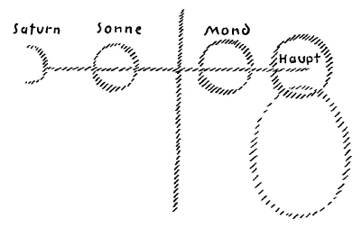

Ich habe Ihnen gestern von jenem Irrtum gesprochen, der eingezogen ist in unser neuzeitliches Geistesleben und der heute noch von wenigen Menschen eigentlich in der richtigen Weise bemerkt wird. Sie haben wohl aus diesen Auseinandersetzungen herausgefühlt, daß wir gerade mit dem Hinweis auf diesen Irrtum an einer sehr wichtigen Stelle geisteswissenschaftlicher Betrachtungen stehen. Es wird durchaus notwendig sein für eine gedeihliche Entwickelung des geistigen Lebens der Menschheit, daß in diesem Punkte klar gesehen werde. Ich habe Sie hingewiesen auf solche Kulturerzeugnisse, die wie Miltons «Verlorenes Paradies» oder Klopstocks «Messias» so recht herausgeboren sind aus dem allgemeinen populären Denken der letzten Jahrhunderte. Ich habe Sie aber auch darauf hingewiesen, wie gerade an diesen, in bezug auf das Künstlerische, in bezug auf das allgemein Geistige hervorragenden Kulturerzeugnissen, bemerkbar ist, vor welchen Gefahren das menschliche Seelenleben steht, wenn nicht durchschaut wird, wie unmöglich der Mensch zu einem wahren, für ihn notwendigen Gottesbegriff und damit auch Christus-Begriff kommen kann, wenn er sich nur vorstellt, daß die Weltstruktur, das Geistige inbegriffen, im Sinnbilde einer Zweiheit zu begreifen ist. Gerade indem man gewissermaßen nur die Zweiheit unterschied, auf der einen Seite das Gute, auf der anderen Seite das Böse, verfiel man in den Fehler, zum Bösen alles hinzuzurechnen, was wir bezeichnen mußten im Laufe der Zeit als das Luziferische und als das Ahrimanische. Nur hat man nicht erkannt, daß man zusammengeworfen hat zwei Weltelemente in eines. Dadurch ist es gekommen, daß man auf der anderen Seite nach dem Guten hin in der Tat die luziferischen Elemente geschoben hat, daß man mit anderen Worten glaubte, Göttliches zu verehren, Göttliches zu erkennen, daß man vom Göttlichen mit Namen sprach, aber doch das luziferische Element in dieses Göttliche hineinmischte. Dadurch aber wird es auch unserer Zeit so schwer, zu einem reinen Begriff des Göttlichen und zu einem reinen Begriff des Christus-Impulses in der Menschheits- und Weltenentwickelung zu kommen. Wir sind gewohnt worden, aus der Kultur der Jahrhunderte heraus, wegen der Anerkennung dieser Zweiheit auf der einen Seite zu sprechen von dem Seelischen, auf der anderen Seite zu sprechen von dem Leiblichen oder Körperlichen. Und wir haben den Zusammenhang verloren zwischen jenen Vorstellungen, die uns das Seelisch-Geistige vermitteln, und denjenigen Vorstellungen, die uns das Leibliche vermitteln. Wir sprechen heute, und am meisten tut das unsere Schulpsychologie, wenn wir vom Denken, vom Wollen, vom Gemüte, vom Fühlen sprechen, kaum von etwas anderem als von Wortklängen. Wir kommen zu keinen wirklichen inneren inhaltsvollen Vorstellungen von diesem seelischen Elemente. Und wir sprechen auf der anderen Seite von einem entgeistigten Materiellen, von einem seelenlosen Materiellen, und wir klopfen gleichsam auf dieses äußere harte, steinhafte, seelenlose Materielle und können keine Brücke bauen von ihm zum Seelischen hinüber. ^6mspfv

In zwei Elemente auseinandergefallen ist uns das Geistige, das überall, und das Leibliche, das zu gleicher Zeit ein Geistiges ist. Mit bloßen Theorien kommt man zu einer solchen Brücke zwischen dem Leiblichen und Geistigen nicht. Und da man nicht dazu kommt, hat vor allen Dingen unser ganzes wissenschaftliches Denken diesen Charakter eines Zwiespaltes zwischen Leiblichem und Geistigem oder Seelischem angenommen. Man möchte sagen: Auf der einen Seite sind die verschiedenen Glaubensbekenntnisse dahinein verfallen, auf ein Geistiges hinzuweisen, ohne in der Lage zu sein, darzulegen, wie dieses Geistige unmittelbar eingreift ins Leiblich-Körperliche, wie es schöpferisch tätig ist an dem Leiblich-Körperlichen, auf der anderen Seite aber betrachtet heute ein seelenloses Wissen, eine seelenlose Naturanschauung das Körperliche so, daß sie nirgends durch die leiblichen Vorgänge hindurchschauen kann auf das in diesen leiblichen Vorgängen waltende Geistig-Seelische. Wer von diesem Gesichtspunkte aus die naturwissenschaftliche Anschauung, wie sie sich entwickelt hat im Laufe des 19. Jahrhunderts und in das 20. Jahrhundert herein, überblickt, der wird sich sagen müssen: Alles dasjenige, was uns da auftritt, erscheint wie eine Folge dessen, was eben charakterisiert worden ist. Wir müssen aber vor allen Dingen das Richtige, das uns jetzt schon folgen kann aus mannigfachen Voraussetzungen, die wir ja hier auch hinlänglich besprochen haben, hinzusetzen, bevor wir den Irrwahn, der heute das Richtige zudeckt, voll einsehen können. Man spricht heute vom Menschen wie von einer einheitlichen Wesenheit, gleichgültig, ob man vom Seelischen spricht oder ob man vom Leiblichen spricht. Man spricht vom Seelischen als einer einheitlichen Wesenheit, man spricht vom Leiblichen als einer einheitlichen Wesenheit. Und dennoch, Sie werden aus unseren Betrachtungen gesehen haben, daß im Menschenwesen vor allen Dingen der Ihnen schon angedeutete große Gegensatz waltet zwischen all dem, was Hauptes- oder Kopfbildung ist, und all dem — wir wollen es jetzt nicht weiter gliedern, Sie wissen, es kann auch weiter gegliedert werden, aber wir wollen es jetzt in eins zusammenfassen —, was der Mensch an sich trägt außer seiner Hauptes- oder Kopfesbildung. (Es wurde der rechte Teil der Zeichnung, siehe $. 30, skizziert.) Man fragt nach der Entwickelung des Menschen. Man muß in ganz anderer Art fragen nach der Entwickelung des Menschen in bezug auf seine Hauptesbildung, Kopfbildung, und nach der Entwickelung des Menschen in bezug auf die übrige Leibesbildung. ^2entmk

Wenn wir die Kopfbildung des Menschen - fassen wir sie zunächst ganz körperlich auf — ins Auge fassen, insofern diese Kopfbildung den Organismus enthält für das sinnliche Wahrnehmen oder für das Denken oder Vorstellen, dann müssen wir allerdings weit zurückblicken in die kosmische Entwickelung des Menschen. Dann müssen wir uns sagen: Dasjenige, was heute seinen Ausdruck findet in der menschlichen Hauptesbildung, das hat sich nach und nach entwickelt und umgeformt. Es hat sich hindurchentwickelt durch die alte Saturnbildung, durch die alte Sonnenbildung, durch die alte Mondenbildung und ist dann weiterentwickelt worden während der Erdenzeit. Aber so ist es nicht mit dem, was die andere Leiblichkeit des Menschen ist. Es wäre ganz falsch, eine einheitliche Entwickelungsgeschichte zu suchen für den ganzen Menschen. Wir können sagen (es wird weitergezeichnet): Die Hauptesbildung, die weist zurück auf die vorhergehenden planetarischen Stufen unserer Erdenbildung: Mondenbildung, Sonnenbildung, Saturnbildung. Dasjenige, was zuletzt seinen unmittelbaren Abschluß gefunden hat in dem menschlichen Haupte, das geht auf eine weite Entwickelung zurück. Wenn wir aber dazufügen alles übrige, was : zum Menschen gehört, so dürfen wir nicht zurückgehen bis zu der Saturnbildung, sondern wir müssen sagen: Dasjenige, was der Mensch an sich trägt außer seinem Haupte, das können wir höchstens, insoweit es die Brustbildung ist, zurückverfolgen bis in die planetarische Mondenzeit (Zeichnung: senkrechter Trennungsstrich), dasjenige, was die Gliedmaßen sind, ist erst während der Erdenformation an den Men sehen herangekommen. ^3paq40

 ^sm54ms

Wir betrachten den Menschen nur dann richtig, wenn wir etwa das Folgende vergleichsweise sagen. Aber bitte, fassen Sie das vergleichsweise auf. Sie können sich sehr leicht hypothetisch vorstellen: durch irgendwelche organischen Verhältnisse im Kosmos, durch irgendwelche Anpassungsverhältnisse, verbunden mit inneren Wachstumsverhältnissen, würde der Mensch irgendwelche neue Gliedmaßen ansetzen. Sie würden dann nicht zurück verfolgen die ganze Menschengestalt bis zur früheren Entwickelung, sondern Sie würden sagen: Der Mensch, insofern er sich entwickelt hat, muß zurückverfolgt werden; aber in einem gewissen Zeitpunkte hat sich erst dieses oder jenes Glied angesetzt. Daß wir versucht sind, nicht so zu denken mit Bezug auf das Haupt und den übrigen Menschen, das rührt nur davon her, weil, rein in bezug auf die äußere Raumesgröße, der übrige Mensch größer ist als sein Haupt. Die Wahrheit ist doch diese, daß die Hauptesbildung am weitesten zurückgeht und daß die andere Bildung erst spätere Ansätze darstellt. Spricht man überhaupt von einem Zusammenhang des Menschen mit der Tierwelt in bezug auf die Entwickelung, dann kann man nur sagen: Dasjenige, was im menschlichen Haupte ist, das geht zurück auf eine frühere Tierbildung. Das menschliche Haupt ist umgewandelte Tiergestalt, sehr stark umgewandelte Tiergestalt. ^9mf32g

Der Mensch hat äußerlich, allerdings in ganz anderen physikalischen Verhältnissen, eine Tierbildung gehabt, als es noch gar keine Tiere gab. Die Tiere haben sich später zum Menschen hinzugebildet. Dasjenige aber, was im Menschen Tierbildung gehabt hat, das ist heute menschliches Haupt, menschlicher Kopf geworden. Und dasjenige, was an den Kopf angesetzt ist als der übrige Organismus, das ist erst gleichzeitig mit der Entwickelung der Tiere an den Kopf angesetzt worden, das hat also nichts zu tun mit einer wirklichen Tierabstammung. So daß wir eigentlich sagen müssen: Das zunächst scheinbar edelste Glied des Menschen, sein Kopf, weist uns zurück auf die Tierheit; in bezug auf das hat der Mensch selbst früher eine Art Tiergestalt gehabt. Dasjenige aber, was wir sonst an uns tragen, das haben wir neben der Entwickelung der Tiere als gewissermaßen organischen Ansatz zum Kopfe in der kosmischen Entwickelung hinzu erhalten. ^gxfy3x

Nun ist das Haupt in einem gewissen Sinne unser Denkorgan geworden. Unser Denkorgan ist also gerade dasjenige geworden, welches Tierabstammung hat, wenn wir so sagen dürfen. Nur hat es allerdings eine sonderbare Tierabstammung. Wenn Sie heute ein menschliches Haupt nehmen, so werden Sie ihm anatomisch vielleicht nicht gleich das ansehen, was zurück weist auf Tiergestalt. Genauer angesehen werden Sie aber doch erkennen, wenn Sie nur richtig zu deuten verstehen die Form der Organe des Hauptes, wie sie umgestaltete Organe der Tierheit sind. ^pvfnu0

Nun, wenn wir dieses ins Auge fassen, müssen wir allerdings zugleich erwähnen, daß die Umgestaltung aus der Tierheit heraus für das menschliche Haupt dadurch zustande gekommen ist, daß in dieses Haupt bereits eingezogen ist eine rückwärts gerichtete Entwickelung. Dasjenige, was voll lebendigen Lebens war in früheren Stadien der Entwickelung, ist im menschlichen Haupte bereits auf dem Wege des Absterbens, ist im menschlichen Haupte in einer rückwärts gerichteten Entwickelung. Ich habe einmal gesagt: Würden wir als Menschen nur Haupt sein, so könnten wir eigentlich niemals leben, so müßten wir im Grunde fortwährend sterben, denn der organische Zusammenhang des menschlichen Hauptes durch die Kräfte des Hauptes selbst ist nicht ein Lebensvorgang, sondern ein Sterbensvorgang. Das, was im Haupte ist, wird fortwährend neu belebt vom übrigen Organismus aus. Daß das Haupt auch teilnimmt am allgemeinen Leben des Organismus, das verdankt es dem übrigen Leben des Organismus. Würde sich das Haupt nur denjenigen Kräften überlassen können, für die es organisiert ist, den sinnlichen Wahrnehmungskräften und den Vorstellungskräften, so würde das Haupt fortwährend absterben. Das Haupt hat fortwährend die Tendenz zu sterben, es muß fortwährend belebt werden. Und wenn wir denken, wenn wir sinnlich wahrnehmen, so geht in unserem Haupte, in unserem Nervensystem überhaupt und seiner Verbindung mit den Sinnesorganen, nicht ein aufsteigender, dem Wachstum oder dergleichen angemessener Lebensprozeß vor sich, denn da würden wir nur schlafen können, in tiefen Schlaf versunken sein, da würden wir niemals hell denken können. Nur dadurch, daß fortwährend der Tod durch unser Haupt zieht, daß eine fortwährende Rückentwickelung da ist, daß die organischen Prozesse fortwährend zurückgenommen werden, dadurch greift in unserem Haupte das Denken und das sinnliche Wahrnehmen Platz. ^8hgn1u

Wer in materialistischer Weise aus Gehirnprozessen das Denken oder das Sinneswahrnehmen erklären will, der weiß eben gar nicht, welche Vorgänge im Haupte vor sich gehen, der glaubt, da gehen solche Prozesse vor sich, die sich mit dem organischen Wachstum oder dergleichen vergleichen lassen. Das ist nicht der Fall. Dasjenige, was parallel geht dem Sinneswahrnehmen und dem Vorstellen, das sind Absterbeprozesse, das sind Abtrageprozesse, Zerstörungsprozesse. Das Organische, das Materielle muß erst abgetragen, muß erst zerstört werden, dann erhebt sich über dem organischen Zerstörungsprozeß der Denkprozeß. ^todqi4

Diese Dinge werden heute von der Menschheit so aufgefaßt, daß man versucht, ihre Natur äußerlich zu erschließen. Der Mensch denkt, der Mensch nimmt sinnlich wahr, was aber da parallel in seinem Organismus vorgeht, davon weiß er nichts, das bleibt ihm ganz im Unbewußten sitzen. Nur durch diejenigen Vorgänge, die ich geschildert habe in meinem Buche «Wie erlangt man Erkenntnisse der höheren Welten?», kann man allmählich aufsteigen zu einer solchen Erkenntnis, die nicht bloß in dem lebt, was man fast nur mit seiner Wortbedeutung das Seelische nennt: im Sinneswahrnehmen und im Denken. Bei einer Entwickelung, die die Seele durchmacht in dieser Art, kann sie auf der einen Seite sich dem Denken, dem Sinneswahrnehmen hingeben und gleichzeitig wahrnehmen, was da im Gehirn geschieht. Da nimmt man nicht dasjenige wahr, was man sonst etwa als Wachstumsprozeß empfindet, da nimmt man wahr einen Abbauprozef, der stets wiederum ausgeglichen werden muß vom übrigen Organismus aus. ^az6k5q

Das ist die tragische Begleiterscheinung einer wirklichen Erkenntnis unserer Hauptestätigkeit. Der hellsichtige Mensch kann sich nicht erfreuen etwa an einem Aufblühen der organischen Prozesse des Hauptes, wenn er denkt, wenn er sinnlich wahrnimmt, sondern er muß sich bekanntmachen mit einem Zerstörungsprozeß. Er muß sich aber auch bekanntmachen damit, daß der materialistisch Gesinnte annimmt, solche Prozesse spielen sich im menschlichen Haupte ab, welche gerade ausgeschlossen sind, wenn der Mensch denkt oder wenn der Mensch sinnlich wahrnimmt. Gerade das Gegenteil von dem, was wirklich wahr ist, muß der Materialismus für sich annehmen. ^dwn3tw

Also wir haben es beim menschlichen Haupte zu tun mit einer Entwickelung zwar aus der Tierheit heraus, aber jetzt schon mit einer rückläufigen Entwickelung, mit einem Abbauprozeß. In aufsteigender Entwickelung ist unser anderer menschlicher Organismus. Von diesem anderen menschlichen Organismus dürfen wir nicht etwa glauben, daß er nun keinen Anteil hat an dem Seelisch-Geistigen und seinem Erleben im Menschen. Fortwährend wird nicht nur das Blut aus dem übrigen Organismus heraufgesendet in das Haupt, sondern fortwährend steigen auch auf in das Blut jene seelisch-geistigen Gedankengebilde, aus denen die Welt gewoben ist, aus denen auch unser Organismus gewoben ist. Diese seelisch-geistigen Gedankengebilde, die nimmt der Mensch heute in seinem normalen Zustande noch nicht wahr, aber es ist das Zeitalter eingetreten, indemder Mensch beginnen muß, dasjenige wahrzunehmen, was aus seinem eigenen Wesen aufsteigt an Gedankengebilden. Sie wissen ja, wir schlafen nicht bloß vom Einschlafen bis zum Aufwachen, mit einem Teil unseres Wesens schlafen wir den ganzen Tag über. Wir sind eigentlich nur wach in bezug auf unser Denken, Vorstellen und Sinneswahrnehmen. Wir träumen in bezug auf unser Gefühlsleben, wir schlafen völlig in bezug auf unser Willensleben. Denn von dem, was wir wollen, wissen wir ja nur die Gedanken, die Ideen, nicht den Vorgang des Willens. Was der Wille eigentlich macht, das vollzieht sich für unser Bewußtsein so unbewußt wie das Schlafesleben vom Einschlafen bis zum Aufwachen. Aber wenn wir fragen: Auf welchen Wegen kann allein das Wissen von dem wirklich Göttlichen an den Menschen herankommen? — dann können wir nicht verweisen auf den Weg durch das Haupt, auf den Weg durch die Sinneswahrnehmung und durch das Denken, sondern dann können wir nur verweisen auf den Weg, der durchgeht durch unseren übrigen Organismus. Und das große, gewaltige Geheimnis liegt vor, daß der Mensch sein Haupt entwickelt hat in einer langen Entwickelungsreihe, daß dann hinzugekommen ist dasjenige, was sein übriger Organismus ist, daß das Haupt bereits eine rückläufige Entwickelung angetreten hat, daß aber dasjenige, was der Mensch als sein Göttliches empfinden kann, durch den übrigen Organismus zu ihm sprechen muß, nicht durch das Haupt. Denn das ist wichtig, daß man sich klar ist darüber: Durch das Haupt sprachen zu Menschen zunächst nur die luziferischen Wesenheiten. Und wir können sagen: Dem Menschen wurde zu seinem Haupte hinzu erschaffen der übrige Organismus, damit zu ihm sprechen können seine Götter. Am Ausgangspunkt der Bibel steht nicht: Und Gott sandte dem Menschen den Lichtstrahl und er ward eine lebendige Seele — sondern: Gott blies dem Menschen den lebendigen Odem ein und er ward eine lebendige Seele. — Hier wird richtig erkannt, daß durch eine Nicht-Hauptestätigkeit zu dem Menschen der göttliche Impuls kam. ^grdum8

Daraus wird es Ihnen aber auch verständlich sein, daß zunächst dieser göttliche Impuls zum Menschen nur kommen konnte in einer Art unbewußten Hellsehens, oder wenigstens durch ein Verständnis desjenigen, was durch unbewußtes Hellsehen gegeben wurde. Wenn Sie von unserer Bibel das Alte Testament ansehen, so werden Sie es finden müssen — wir wissen das ja von anderen Betrachtungen aus - als ein Ergebnis eines unbewußten Hellsehens. Dessen waren sich auch diejenigen bewußt, die Mithilfe geleistet haben beim Zustandekommen des Alten Testaments. Ich kann Ihnen heute hier nicht das Zustandekommen des Alten Testaments schildern, aber ich möchte Sie doch hinweisen darauf, in wie vielen Betrachtungen wir über solche Dinge uns ergangen haben, wie Sie bei den Lehrern des alten hebräischen Volkes durchaus das Bewußtsein überall finden, daß ihr Gott zu ihnen gesprochen hat nicht durch die unmittelbaren Sinneswahrnehmungen, nicht durch das gewöhnliche Denken, nicht durch alles dasjenige also, wofür das Haupt der Vermittler ist, sondern daß ihr Gott zu ihnen gesprochen hat durch Träume — worunter sie nicht gewöhnliche Träume, sondern von Wirklichkeit durchtränkte Träume verstanden —, was da Gott zu ihnen gesprochen hat durch solche hellseherischen Momente wie zu Moses aus dem Dornbusch und ähnlichem. Und wenn man die Eingeweihten dieser alten Zeit gefragt hat, wie sie sich vorstellen, daß die göttlichen Rufe zu ihnen kommen, dann haben sie gesagt: Zu uns spricht der Herr, dessen Name unaussprechlich ist, aber er spricht durch sein Antlitz zu uns. — Und das Antlitz ihres Gottes nannten sie den Michael, jene geistige Macht, die wir zu der Hierarchie der Archangeloi rechnen. Ihren Gott empfanden sie als den unbekannt hinter den Erscheinungen auch des Hellsehers bleibenden. Wenn der Hellseher aber sich durch die innere Verfassung seiner Seele zu seinem Gotte erhob, so sprach zu ihm Michael. Aber dieser Michael sprach nur dann, wenn die Menschen sich versetzen konnten in einen anderen Zustand, als der gewöhnliche Bewußtseinszustand war, wenn die Menschen sich versetzen konnten in einen Zustand einer gewissen Hellsichtigkeit, durch den dasjenige ins Bewußtsein hereintrat, was sonst nur am Menschen schafft und lebt entweder vom Einschlafen bis zum Aufwachen, oder aber durch den unterbewußt bleibenden Willen, der eigentlich auch schläft, auch dann, wenn wir tagwachend sind. ^lh5t1t

Und so nannte man in der alten hebräischen Geheimlehre die JahveOffenbarung die Offenbarung der Nacht und empfand die JahveOffenbarung durch die Michael-Offenbarung als die Offenbarung der Nacht. Man sah auf der einen Seite hinein in die Welt nach dem, was sie einem geben konnte durch die Sinneswahrnehmung und durch das menschliche verständige Denken, und sagte sich: Auf diesem Wege kommen Erkenntnisse, kommt ein Wissen an den Menschen heran, das zunächst das Göttliche nicht enthält. Wenn aber der Mensch aus diesem Bewußtseinszustand heraus sich zu einem anderen Bewußtseinszustand entwickelt, dann spricht zu ihm Gottes Angesicht, der Michael, und offenbart ihm die eigentlichen Geheimnisse, die mit dem Menschenwesen zusammenhängen, offenbart ihm dasjenige, was ihm eine Brücke baut zwischen dem Menschen und jenen Mächten, die nicht wahrgenommen werden können in der äußeren Sinneswelt, die nicht erdacht werden können mit dem an das Gehirn gebundenen Verstand. ^m7wqpo

So muß man sagen: Es lebten die Menschen in den vorchristlichen Zeiten so, daß sie hinschauen konnten auf der einen Seite auf die Sinneserkenntnis — die war da als Richtschnur für die Erdenverrichtungen — und hinschauten auf der anderen Seite nach jener Erkenntnis, die der Mensch nur haben würde - er hat sie nicht gehabt — für das gewöhnliche Bewußtsein, wenn dieses Bewußtsein wach bliebe, während es schläft zwischen dem Einschlafen und Aufwachen. Der Mensch ist in der Umgebung von geistigen Wesenheiten — das wußte man —, wenn er wacht. Und diese geistigen Wesenheiten sind nicht seine schöpferischen Wesenheiten — so dachte man im Alten Testament in der Zeit, aus der das Alte Testament stammt -, diese Wesenheiten sind die luziferischen Wesenheiten. Die Wesenheiten, die als die schöpferischgöttlichen gegenüber der Menschheit empfunden wurden, die wirkten an dem Menschenwesen vom Einschlafen bis zum Aufwachen, oder an denjenigen Teilen des Menschenwesens, die auch während des Tagwachens schlafen. Den Regierer der Nacht, so nannte man in der Zeit, aus der das Alte Testament stammt, den Gott Jahve, und den Diener des Regierers der Nacht, so nannte man, wie man sagte, das Antlitz Jahves, den Michael. Und an den Michael dachte man, wenn man all die prophetischen Eingebungen meinte, durch die man mehr begriff als dasjenige, was durch die Erkenntnis der Sinneswelt kommen würde. ^0wge5p

Und welches Bewußtsein steckt denn hinter all dem? Hinter all dem steckt das Bewußtsein, das herausgewachsen ist aus jener Seinssphäre, in welcher die den Jahve mit umschließenden Mächte wesen, während die menschliche Hauptesbildung umgeben ist von luziferischer Wesenheit. Es war ein Geheimnis, das man durch alle alten Tempel trug, und mit dem man der Wahrheit wirklich recht nahestand, daß, indem aus dem Organismus des Menschen herausragt das menschliche Haupt, der Mensch sich durch sein Haupt zugewendet hat den luziferischen Wesenheiten. Man wußte gewissermaßen, indem das Haupt aus dem menschlichen Organismus herausragt, ragt Luzifer aus dem menschlichen Organismus heraus. Diejenige Macht, welche das menschliche Haupt aus der Tierheit heraus zu seiner jetzigen Gestalt geführt hat, ist eine luziferische Macht. Und diejenige Macht, die der Mensch als göttliche empfinden soll, die muß aus dem Nachtzustand des übrigen Organismus in das menschliche Haupt heraufströmen. So lag dasjenige, was der Mensch wissen konnte in den vorchristlichen Zeiten. ^s6i15t

Dann schlug ein in die Erdenentwickelung das Mysterium von Golgatha. Und wir wissen ja, daß das Mysterium von Golgatha bedeutet eine Vereinigung eines überirdischen Wesens mit der menschlichen Erdenentwickelung durch den Leib des Jesus von Nazareth, eine solche Vereinigung, daß durch den Tod auf Golgatha diese Wesenheit, die wir die Christus-Wesenheit nennen, sich verbunden hat mit der menschlichen Erdenwesenheit. Was ist dadurch in der Erdenentwickelung geschehen? Ja, dadurch hat die Erdenentwickelung eigentlich erst ihren Sinn bekommen. Dann hätte die Erde nicht ihren Sinn, wenn der Mensch auf dieser Erde sich entwickeln würde, dastehen würde mit seinen Sinnen und mit seinem an das Haupt gebundenen Verstande, die zunächst einen luziferischen Ursprung haben, die äußere Erdenwelt, die auf die Erde strömende Lichteswelt der Sonne und der Sterne wahrnehmen würde, aber im Schlafeszustand verharren müßte, um das Göttliche wahrzunehmen. Nimmermehr würde dadurch die Erde ihren Sinn bekommen, denn der wachende Mensch gehört mit der Erde zusammen. Der schlafende Mensch ist sich seines Zusammenhanges mit dem Erdensein zunächst nicht bewußt. Dadurch, daß die ChristusWesenheit gewohnt hat in einem Menschenleib, der durch den Tod gegangen ist, dadurch hat sich innerhalb der Erdenentwickelung etwas wie ein Ruck vollzogen. Alles in dieser Erdenentwickelung hat einen neuen Sinn bekommen. Die Möglichkeit hat sich zunächst herausgebildet, daß der Mensch nach und nach fähig werde, seine schöpferischen göttlichen Mächte auch während des Tages, während des gewöhnlichen Wachens, das heißt im gewöhnlichen Bewußtseinszustande, zu erkennen. Darüber herrscht heute nur noch Irrtum aus dem Grunde, weil die seit dem Mysterium von Golgatha verflossene Zeit noch nicht hingereicht hat, den Menschen dazu zu führen, auch im Tagwachen nun hineinzuschauen in diejenige Welt, in die hineinschauen konnten die Propheten des Alten Testamentes in den Zeiten, die sie empfanden als durchdrungen von Offenbarungen ihres Regierers der Nacht, des Jahve, und seines Antlitzes, des Michael. Es bedurfte einer Durchgangszeit. Aber mit dem Ablauf des 19. Jahrhunderts — die ganze orientalische Weisheit weist hin, aber von einem völlig anderen Gesichtspunkte, auf die Wichtigkeit dieses Ablaufes des 19. Jahrhunderts - ist die Zeit eingetreten, wo die Menschen erkennen müssen, daß etwas erfüllt ist, was früher nicht erfüllt war, wo die Menschen erkennen müssen: Jetzt ist in ihnen die Fähigkeit latent, jetzt ist in ihnen die Fähigkeit zum Aufwecken reif, durch die Tagesoffenbarung hindurch zu sehen dasjenige, was früher nur in der Nachtoffenbarung durch Michael vermittelt worden ist. ^uyqt9e

Dem aber mußte noch ein großer Irrtum vorangehen, gewissermaßen eine Erkenntnisnacht vorangehen. Ich habe ja öfters gesagt, daß ich durchaus nicht übereinstimme mit denjenigen, die immer sagen, unsere Zeit ist eine Übergangsepoche. Ich weiß ganz gut, jede Zeit ist eine Übergangsepoche. Aber bei solchen formal abstrakten Bestimmungen will ich nicht stehenbleiben, denn es kommt darauf an, daß man angebe, worinnen der Übergang einer bestimmten Zeit besteht. Der Übergang in unserer Zeit besteht darinnen, daß die Menschen erkennen sollen: Durch die Tagerkenntnis hindurch muß kommen dasjenige, was früher nur Nachterkenntnis war. Mit anderen Worten: Michael war der Öffenbarer durch die Nacht und soll werden in unserer Zeit der Offenbarer während des Tages. Michael soll werden aus einem Nachtgeist ein Taggeist. Für ihn bedeutet das Mysterium von Golgatha die Umwandlung aus einem Nachtgeist in einen Taggeist. ^cdibd6

Aber dieser Erkenntnis, die sich schneller als wir heute glauben, Bahn brechen sollte unter den Menschen, dieser Erkenntnis mußte ein noch größerer Irrtum vorangehen, der größtdenkbare Irrtum, der eigentlich in der Menschheitsentwickelung möglich war, trotzdem man ihn heute noch in vielen Kreisen als eine besonders wichtige und wesentliche Wahrheit ansieht. Völlig verhüllt hat sich der neueren Menschheit der Ursprung des menschlichen Hauptes, völlig verhüllt hat sich die mit dem menschlichen Haupte verbundene luziferische Geistigkeit. Der Mensch wurde, wie ich sagte, auch leiblich als eine Einheit genommen. Man fragte nach seiner Abstammung, und es wurde einem zur Antwort gegeben, der Mensch stamme von der Tierheit ab, während in Wahrheit nur dasjenige, was am Menschen das Luziferische ist, von der Tierheit abstammt. Dasjenige aber, durch das früher gesprochen haben zu ihm aus seinem Schlafeszustande heraus seine göttlichen Schöpfer, das ist erst entstanden — nachdem nebenher die Tiere entstanden sind — als Ansatz des menschlichen Hauptes. Man hat alles am Menschen zusammengeworfen und spricht von der Abstammung des Menschen von der Tierheit. Das ist etwas wie eine Erkenntnisstrafe, die in die Menschheit hereingekommen ist, wobei ich das Wort «Strafe» in einem etwas umgedeuteten Sinne meine. ^c99v11

Woher kann denn eigentlich diese Tendenz stammen, daß der Mensch die Dichtung erfand, er stamme von der Tierheit ab, während der wahre Vorgang der ist, den wir zunächst hingestellt haben bezüglich der Abstammung des Hauptes und des übrigen Organismus. Was hat dem Menschen eingegeben die Dichtung: der ganze Mensch stamme von der Tierheit ab? ^b6a91i

Sehen Sie, in der Zwischenzeit, die zwischen dem Mysterium von Golgatha und unseren Tagen verflossen ist, und die in gewissem Sinne eine Vorbereitung war für das Verständnis des Mysteriums von Golgatha, in dieser Zeit, in der zurückgetreten ist die alte heidnische Weisheit, durch die man ja zunächst auch das Christentum erfassen wollte, und in der noch nicht völlig reif war die neue Geist-Erkenntnis, in dieser Zeit stahl sich allmählich in die Menschheitsentwickelung herein das ahrimanische Element. Und indem man nicht erkannte das luziferische Element in dem menschlichen Haupte, konnte man auch nicht erkennen das ahrimanische Element, mit dem das Göttliche im Kampfe liegt, in der übrigen menschlichen Organisation. Und so entstand denn die rein ahrimanische Dichtung, der Mensch stamme ab aus der 'Tierreihe. ^iqsgo0

Daß der Mensch von der Tierreihe abstamme, ist eine ahrimanische Eingebung. Diese Wissenschaft hat rein ahrimanischen Charakter. Der Verdunkelung jener Weisheit, welche uns darauf hinweist, wie im menschlichen Haupte luziferische Bildung ist, verdankt man den Irrwahn, der Mensch stamme ab von der Tierreihe. Indem man das eine in bezug auf die Abstammung des menschlichen Hauptes nicht mehr in der richtigen Weise durchschauen konnte, lernte man auch das andere nicht in der richtigen Weise durchschauen. Und so schlich sich herein in das menschliche Anschauen die Meinung von der Verwandtheit des Menschen als ganzen Wesens mit der Tierheit. Und so schlich sich in die Auffassung des menschlichen Wesens dasjenige auch ein, was im Grunde genommen in der neueren Zivilisationsentwickelung eine ganze Weltanschauung durchdrungen hat: das menschliche Haupt wurde zum Edelsten gemacht, das andere ihm entgegengestellt, so wie man entgegenstellt Gutes und Böses in der Welt, den Himmel und die Hölle, eine Zweiheit statt der Dreiheit. In Wahrheit hätte man wissen sollen, daß der Mensch zunächst dasjenige, was er durch sein Haupt in der Welt erringt, zwar der Weisheit der Welt verdankt, aber der luziferischen Weisheit, und daß diese luziferische Weisheit erst nach und nach durchdrungen werden muß von anderen Elementen. ^qkgneo

Diejenige geistige Macht, welche - nachdem die Menschheitsentwikkelung durchgegangen war durch Saturn-, Sonnen- und Mondenentwickelung und die Erdenentwickelung begonnen hatte — das luziferische Wesen in die menschliche Hauptesbildung einorganisiert hat, das ist die Michael-Macht. «Und er stieß seine gegnerischen Geister herunter auf die Erde», das heißt: Durch dieses Herunterwerfen der dem Michael gegnerischen luziferischen Geister wurde der Mensch zunächst durchdrungen mit seiner Vernunft, mit dem, was dem menschlichen Haupte entsprießt. ^2x23oe

So ist es Michael, der seine Gegner dem Menschen gesandt hat, damit der Mensch durch die Aufnahme dieses gegnerischen, dieses luziferischen Elementes zunächst seine Vernunft erhalten hat. Dann trat in der Menschheitsentwickelung das Mysterium von Golgatha ein. Die Christus-Wesenheit ging durch den Tod des Jesus von Nazareth. Die Christus-Wesenheit verband sich mit der Menschheitsentwickelung. ^1jlemc

Die Vorbereitungszeit ist verflossen. Michael selber hat in übersinnlichen Welten an den Ergebnissen des Mysteriums von Golgatha teilgenommen. Michael hat seit dem letzten Drittel des 19. Jahrhunderts eine ganz besondere Stellung innerhalb der Menschheitsentwickelung. Das erste, was eintreten muß durch eine richtige Erkenntnis dieser Stellung des Menschen zu dem Michael, muß sein, daß man hineinsieht in solche Geheimnisse, wie wir sie zum Beispiel mit Bezug auf das menschliche Haupt und den übrigen menschlichen Organismus heute versuchen hinzustellen. ^xwryab

Das Wesentliche muß sein, daß den Menschen klar werde: Weil sie nicht erkannt haben den wirklichen Ursprung des menschlichen Hauptes, konnten sie nur in einen Irrwahn verfallen mit Bezug auf den Ursprung des ganzen Menschen. Weil sie sich nicht vorstellen wollten, daß die luziferische Bildung zunächst Platz gegriffen hat im menschlichen Haupte, verfielen die Menschen in den Wahn, daß dasjenige, was mit dem menschlichen Haupte zusammenhängt, zurückzuführen sei auf gleichen Ursprung mit dem ganzen übrigen Menschen. Diese Geheimnisse muß die Menschheit durchschauen. Die Menschheit muß zu der Möglichkeit kommen, kühn und tapfer sich gegenüberzustellen der Erkenntnis, daß sie an sich von innen aus durch das Ergreifen neuer göttlicher Geheimnisse etwas zu verbessern habe an alledem, was ihr gegeben werden kann durch die bloße Einsicht des Hauptes, durch die bloße menschliche irdische Weisheit oder Gescheitheit. Und zuerst muß Korrektur geübt werden können an dem großen Irrtum, der der Umkehr hat vorausgehen müssen, an dem Irrtum, der da liegt in der materialistischen Ausdeutung der Entwickelungslehre von dem Ursprung des ganzen Menschen aus der Tierreihe heraus. ^cj3j0y

Nur das wird der Weg sein, um wiederum zur Möglichkeit zu kommen, überhaupt in diesem Menschen, wie er vor uns steht, nicht auf der einen Seite ein bloß Geistig-Seelisches, das nur in einem Leibe wohnt, zu sehen, und auf der anderen Seite ein seelenloses Leibliches, sondern zu schauen das Konkret-Geistige, das da arbeitet, wenn auch in einer luziferischen Weise, an dem menschlichen Haupte, das KonkretGöttlich-Geistige, das an dem ganzen Menschen arbeitet, das einen Gegner allerdings bekommt in der außer dem Haupte befindlichen Organisation in der ahrimanischen Natur. ^x8dxsd

In Imaginationen gesprochen, können wir zurückweisen darauf, wie das Luziferische dem Menschen einverleibt worden ist durch den Michael-Impuls; durch dasjenige, was der Michael geworden ist, muß ihm nun wiederum das Ahrimanische genommen werden. Vor unserer äußeren Wissenschaft steht heute unserem Bewußtsein gegenüber der Mensch so, als wäre das die Wahrheit, was wir durch Anatomie, Physiologie und so weiter erkennen, oder was wir in der äußeren Sinnesbeobachtung an dem Menschen vor uns haben. Wir müssen fähig werden, den Menschen so anzusehen, daß wir in jeder seiner Fibern das Geistige, das konkret-geistige Wesen mit dem Leiblichen schauen. Wir müssen uns bewußt sein: Im lebendigen Menschen rinnendes Blut ist nicht dasjenige, was wir abtropfen lassen, sondern dieses im lebendigen Menschen rinnende Blut ist durchgeistigt in einer besonderen Art. Aber wir müssen den Geist kennenlernen, der durch das Blut pulst. Wir müssen den Geist kennenlernen, der durch das Nervensystem dann pulsiert, wenn das Nervensystem gerade in einer Absterbephase ist und so weiter. Wir müssen in allen einzelnen Lebensäußerungen das geistige Element mit sehen können. ^hmris5

Michael ist der Geist der Stärke. Er muß befähigen, indem er in die Menschheitsentwickelung einzieht, nicht die abstrakte Geistigkeit auf der einen Seite zu haben, und auf der anderen die Materialität, die wir beklopfen, die wir durchschneiden, und von der wir keine Ahnung haben, daß sie im Grunde genommen nur eine äußere Offenbarungsform auch des Geistigen ist, Michael muß uns durchdringen als die starke Kraft, die das Materielle durchschauen kann, indem sie im Materiellen zu gleicher Zeit das Geistige sieht, indem im Materiellen überall der Geist gesehen wird. Auf eine alte Stufe des Menschheitsbewußtseins wurde hingewiesen, da wurde gesagt: Es lebte in dieser alten Zeit das Wort in geistiger Weise, aber das Wort ist Fleisch geworden und hat unter uns gewohnet - so drückt es der Evangelist aus. Es hat sich vereinigt mit dem Fleische das Wort, und die MichaelOffenbarung ist dem vorangegangen. Das alles sind Vorgänge im menschlichen Bewußtsein, auf die da hingedeutet wird. Der umgekehrte Prozeß muß beginnen, dieser umgekehrte Prozeß, der darinnen besteht, daß man zu dem Worte des Evangelisten ein anderes hinzuzufügen hat. In unserem Bewußtsein muß die Kraft sich ansetzen, zu sehen, wie der Mensch aufnimmt dasjenige, was aus geistigen Welten durch den Christus-Impuls sich mit der Erde vereinigt hat und mit der Menschheit sich verbinden muß, damit die Menschheit nicht mit der Erde zugleich zugrunde gehe. Gesehen muß werden, wie der Mensch nicht nur in sein Haupt herein, sondern in seinen ganzen Menschen aufnimmt das Geistige, wie er sich ganz durchdringt mit dem Geistigen. Dazu kann nur der Christus-Impuls helfen. Dazu muß aber auch die Interpretation des Christus-Impulses durch den Michael-Impuls helfen. Dann wird hinzugefügt werden können zu den Worten des Evangelisten: Und die Zeit muß kommen, da das Fleisch wiederum zum Worte wird und lernet im Reich des Wortes zu wohnen. ^pxb6q8

Es ist nicht eine Erfindung irgendeines späteren Hinzuschreibers, wenn am Schluß der Evangelien steht, daß manches ausgelassen ist. Mit diesem ist zugleich hingewiesen auf dasjenige, was erst nach und nach sich der Menschheit enthüllen kann. Der versteht die Evangelien schlecht, der sie so betrachtet, als ob sie zu bleiben haben, wie sie sind, und nicht angetastet werden dürfen. Sie müssen ausgelegt werden nach dem Worte des Christus Jesus, das sagte ich immer zu Ihnen: Ich bin bei euch alle Tage bis ans Ende der Erdenzeiten. — Das heißt aber: Ich habe mich euch nicht nur geoffenbart in den Tagen, in denen die Evangelien geschrieben sind, ich werde durch meinen Taggeist Michael hereinsprechen zu euch immerdar, wenn ihr den Weg zu mir sucht. Ihr werdet hinzufügen dürfen durch die fortlaufende Christus-Offenbarung zu den Evangelien, was zwar nicht im Evangelium des ersten Jahrtausends, wohl aber im Evangelium des zweiten Jahrtausends gewußt werden kann, und zu dem immer Neues hinzugefügt werden kann in den folgenden Jahrtausenden. — Denn so wahr es ist, was in dem Evangelium steht: Im Urbeginne war das Wort, und das Wort ist Fleisch geworden und hat unter uns gewohnet — ebenso wahr ist es, daß wir hinzufügen müssen der Offenbarung: und das Menschenfleisch muß wiederum durchgeistigt werden, damit es fähig werde, im Reiche des Wortes zu wohnen, um zu schauen die göttlichen Geheimnisse. — Die Fleischwerdung des Wortes ist die erste Michael-Offenbarung, die Geistwerdung des Fleisches muß die zweite Michael-Offenbarung sein. ^cvzhm8