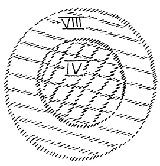
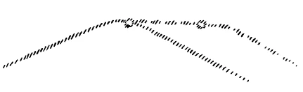
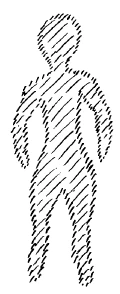
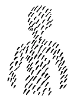

Vorgestern habe ich hier davon gesprochen, wie wir als Mitglieder der Menschheit zunächst einmal in einer Sphäre leben, die wir bezeichnen können als unsere vierte Entwickelungssphäre. Wir wissen, daß die Erdenentwickelung so vor sich gegangen ist, daß dasjenige, was jetzt Erdenentwickelung ist, sich nach und nach herausgestaltet hat aus der Saturnentwickelung, daß daraus die Sonnenentwickelung geworden ist, daraus die Mondenentwickelung, daraus die Erdenentwickelung. Wenn wir nun diese vier aufeinanderfolgenden Gestaltungen des Erdenplaneten, zu dem selbstverständlich die Menschheit als solche gehört, ins Auge fassen, so dürfen wir auf den Menschen nur sehen, insofern der Mensch ein Haupteswesen ist. Wir müssen uns aber auch klar sein darüber, daß, indem wir so sprechen, für uns alles, was wir als Haupt des Menschen bezeichnen, der symbolische Ausdruck ist für dasjenige, was dem menschlichen Sinneswahrnehmen angehört, was der menschlichen Intelligenz angehört, und was wiederum ins soziale Leben überfließt durch die menschliche Sinneswahrnehmung, durch die menschliche Intelligenz. Auch alles das, was der Mensch in seiner Entwickelung durchmacht dadurch, daß er Sinneswahrnehmungswesen ist, dadurch daß er ein intelligentes Wesen ist, alles das müssen wir umfassen. So daß gewissermaßen, wenn ich sage «der Mensch als Haupteswesen», dies bildlich gesprochen ist für all das andere, was ich eben erwähnt habe. ^c7tbkr

Wir sprechen leichten Herzens davon, daß wir als physische Menschen im Luftkreis drinnen sind. Wir müssen auch einsehen, daß dieser Luftkreis zu uns selber gehört. Denn, nicht wahr, diejenige Luft, die eben jetzt in uns ist, war vor kurzer Zeit noch außer uns. Wir sind als Menschen außerhalb dieses Luftkreises gar nicht denkbar. Aber wir haben uns sogar gewöhnt als moderne Menschheit zu glauben, es wäre auch früher so gewesen — was gar nicht der Fall ist -, von diesen Dingen wie der Luft und dergleichen nur in der modernen Art zu sprechen. Wir finden es heute schon absonderlich, wenn wir davon sprechen, daß wir, ebenso wie wir in der Luft wandeln, in einer Sphäre wandeln, welche gewissermaßen die Bedingungen dazu enthält, daß wir Sinneswesen, daß wir intelligente Wesen sind, kurz, daß wir alles das an uns haben, was in dem eben erwähnten Sinne symbolisch ausgedrückt werden kann dadurch, daß wir Haupteswesen sind. Nun aber habe ich Ihnen gesagt, daß dieses eben nur die eine Sphäre ist, in der wir sind. Wir befinden uns jedoch in verschiedenen Sphären und wollen jetzt zu einer menschheitlich praktischen Sphäre vorschreiten und alles das ins Auge fassen, worin wir dadurch leben, daß unserer Erde drei Entwickelungsstadien vorangegangen sind und wir in dem vierten sind. Das alles wollen wir durch diese Kreisfläche charakterisiert sein lassen, in der wir darinnen leben gewissermaßen als in unserer vierten Entwickelungssphäre (die innere Kreisfläche wird gezeichnet: orange). Außerdem leben wir in einer anderen Entwickelungssphäre dadurch, daß diese Entwickelungssphäre so zu den geistigen Wesenheiten, die unsere Schöpfer sind, gehört, wie diese vierte Entwickelungssphäre zu uns gehört. Sehen wir jetzt zunächst einmal von uns Menschen ab, sehen wir auf diejenigen Wesen, die wir immer genannt haben in der Reihenfolge der über uns stehenden Hierarchien die Geister der Form, die Geister alles schöpferischen Formwesens, so müssen wir so sprechen, daß wir die Sphäre, die wir diesen unseren schöpferisch göttlichen Geistern zuschreiben, als Menschen erst erreichen, wenn die Erde noch drei weitere Entwickelungsstadien, die Sie in meiner «Geheimwissenschaft im Umriß» als Jupiterstadium, Venusstadium, Vulkanstadium bezeichnet finden, durchschritten hat und beim achten Stadium angekommen ist. Da also, wo wir Menschen stehen werden nach der Vulkanentwickelung, stehen diese schöpferischen Geister. Da ist ihre Sphäre, die zu ihnen so gehört, wie die vierte Sphäre zu uns. Aber diese zwei Sphären müssen wir uns ineinandergeschoben, einander durchdringend denken. (Über die erste Kreisfläche wird eine größere gezeichnet: gelb.) Wenn ich also die andere Sphäre, die ich jetzt genannt habe, als die achte bezeichne, so leben wir eben nicht bloß in der vierten, sondern auch in dieser achten Sphäre, dadurch, daß mit uns zusammen unsere göttlichen Schöpfer in dieser Sphäre leben. ^m6xah8

 ^03mg7a

Wenn Sie nun diese achte Sphäre ins Auge fassen, dann leben darinnen aber nicht nur unsere göttlichen Schöpfergeister, sondern darinnen leben außerdem die ahrimanischen Wesenheiten. So daß dadurch, daß wir in der Umgebung der achten Sphäre leben, wir zusammen mit unseren von uns als unsere göttlichen Mächte empfundenen Geistern leben, aber auch mit den ahrimanischen Wesenheiten. In der vierten Sphäre leben mit uns, genau gesprochen, die luziferischen Geister. So also steht es gewissermaßen mit der Verteilung dieser geistigen Wesenheiten. Wir können auf diese geistigen Wesenheiten nunmehr eingehen, wenn wir erfassen dasjenige, was mit den entsprechenden Umgebungen dieser Sphären von uns selbst in Verbindung steht. ^kn8bni

Da offenbart sich dem Schauen der Initiationswissenschaft zunächst, daß dadurch, daß wir in der vierten Sphäre unserer Entwickelung leben, wir, wie gesagt, wahrnehmende und intelligente Wesen sind. Aber wir dürfen nie vergessen, daß eben in diese Intelligenz, wobei wir immer die Sinneswahrnehmungen mit der Intelligenz zugleich bezeichnen wollen, hereinspielt die luziferische Macht. Diese luziferische Macht ist eigentlich innig verbunden mit der besonderen Art von Intelligenz, die heute noch der Mensch wesentlich als seine eigentliche, ihm zukommende Intelligenz ansieht, mit der er am liebsten als seiner Intelligenz wirtschaftet. Und dennoch, diese Intelligenz ist dem Menschen nur dadurch zugeteilt worden, daß jene höhere Wesenheit, von der ich als der Michael-Wesenheit gesprochen habe, luziferische Geister herabgestoßen hat in die Sphäre der Menschen, in die vierte Sphäre der Menschen, und dadurch in den Menschen der intelligente Impuls eigentlich hineingekommen ist. ^m2istw

Sie können fühlen, was dieser intelligente Impuls in der Menschheit bedeutet, wenn Sie das unpersönliche Element der noch gegenwärtigen menschlichen Intelligenz ins Auge fassen. Nicht wahr, wir Menschen haben viele persönliche Interessen. Wir begegnen einander mit unseren persönlichen Interessen, und in bezug auf unsere persönlichen Interessen sind wir eben individualisiert. Aber diese Individualisierung macht Halt vor der Intelligenz. In bezug auf die Intelligenz, in bezug auf die Logik haben wir, alle Menschen, das Gleiche und rechnen mit diesem Gleichen. Dieses Gleiche hätten wir nicht, wenn nicht der luziferische Einfluß, durch Michael vermittelt, auf die Menschheit ausgeübt worden wäre. ^rqcnfy

Wir verstehen uns in dieser einfachen Weise nur dadurch, daß wir eine gemeinsame Intelligenz haben, nur dadurch, daß die gemeinsame Intelligenz eben von der luziferischen Geistigkeit herrührt. Nun, diese luziferische Geistigkeit, sie ist entstanden dadurch, daß Michael die Menschen sozusagen durchdrungen, influenziert hat mit der luziferischen Wesenheit. Diese luziferischen Einflüsse, sie haben sich in der menschlichen Geschichtsentwickelung weiter ausgestaltet. Neben ihnen hat sich manches andere im Menschen entwickelt. Aber heute noch immer wird diese luziferische Geistigkeit, die wir unsere Intelligenz nennen, als das den Menschen eigentlich Auszeichnende in weitesten Kreisen empfunden. ^5f3rzw

Sie müssen, um sich vielleicht die Sache noch klarer zu machen, einmal Ihre Seelenblicke richten auf etwas anderes, was uns Menschen auch sogar über die ganze Erde hin zusammenführen kann, wenn es einmal über die ganze Erde hin sich verbreitet. Das ist der ChristusImpuls. Aber der Christus-Impuls ist etwas anderes als der IntelligenzImpuls. Der Intelligenz-Impuls hat etwas Zwingendes. Sie können nicht die Intelligenz der Menschheit zu Ihrer persönlichen Angelegenheit machen. Sie können nicht plötzlich sich entschließen, irgend etwas, was durch Intelligenz zu entscheiden ist, persönlich zu entscheiden, ohne daß Sie eben herausfallen aus dem sozialen Leben der Menschheit als wahnsinnig. Aber Sie können auf der anderen Seite auch wiederum kein anderes Verhältnis zu dem Christus-Impuls gewinnen, als ein persönliches. Es kann niemand im Grunde genommen dem anderen hineinsprechen in das Verhältnis, in das der andere sich zu Christus versetzen will. Das ist eine persönliche Angelegenheit letzten Endes. Aber dadurch, daß der Christus durch das Mysterium von Golgatha gegangen ist und mit der Erdenentwickelung sich verbunden hat, ist es so, daß, wenn ganz unabhängig voneinander noch so viele Menschen den Christus-Impuls zu ihrem persönlichen machen, so wird er ganz von selber der gleiche. Das heißt: die Menschen werden zusammengeführt durch etwas, was jeder für sich macht, nicht zwangsweise, wie durch die Intelligenz, sondern dadurch, daß eben durch den Christus-Impuls selber sich das Verhältnis in jedem Menschen zu dem Christus so bildet, daß es bei jedem Menschen, indem es sich in der richtigen Weise bildet, dasselbe ist. Das ist der Unterschied zwischen dem Intelligenz-Impuls und dem Christus-Impuls. Der Christus-Impuls kann über die ganze Menschheit hin gleich sein und ist doch für jeden einzelnen eine persönliche Angelegenheit. Die Intelligenz ist nicht eine persönliche Angelegenheit. ^tn7b5m

Nun, wo hinein ist denn der Christus-Impuls gefallen? Das können wir uns beantworten nach Andeutungen, die ich schon gegeben habe. Wir wissen, die Kopfentwickelung ist schon eine rückschreitende, eine rückläufige. In bezug auf sein Haupt ist der Mensch gewissermaßen in einem fortwährenden Absterben drinnen. So daß wir also auf die kosmische Tatsache hinweisen können: Michael hat die luziferischen Scharen in das Reich der Menschheit heruntergestoßen. Die luziferischen Scharen haben so zu ihrem Wohnsitz das menschliche Haupt bekommen, aber das menschliche Haupt im absterbenden Charakter. ^qvmyaz

Hier begannen sie, diese luziferischen Scharen, fortdauernd gegen das Absterben des menschlichen Hauptes anzukämpfen. Und hier berühren wir ein zwar altbekanntes, in den verschiedensten Formen bekanntes, aber der neueren Menschheit fast ganz verhülltes Geheimnis der Menschennatur. Der Mensch trägt, wenn man seine göttliche Entwickelung ins Auge faßt, in seinem Haupt eine absterbende Entwickelung, ein fortwährendes Ersterben. Aber diesem fortwährenden Ersterben geht ein Anfachen des Lebens von seiten Luzifers parallel. Fortwährend will Luzifer unser Haupt zu einem so lebendigen machen, wie unser übriger Organismus ein lebendiger ist. Dadurch würde, wenn man auf das Organische sieht, Luzifer abtrünnig machen die Menschheitsentwickelung von ihrer göttlichen Richtung, wenn es ihm gelänge, tatsächlich das menschliche Haupt so zu beleben, wie der übrige Organismus des Menschen belebt ist. ^32ioir

Aber dagegen eben muß die göttliche Richtung der menschlichen Entwickelung sich wenden. Denn der Mensch muß verbunden bleiben mit der Erdenentwickelung, damit er mit der folgenden Erdenentwikkelung durch die Jupiter-, Venus- und Vulkanentwickelung weitergehen könne. Der Mensch würde diesen Weg, der ihm vorgezeichnet ist, nicht gehen, sondern er würde einem Kosmos einverleibt werden, der durch und durch intelligent wäre, wenn Luzifer sein Ziel erreichen würde. ^9h642e

Ich möchte sagen, physiologisch gesprochen ist es eben so, daß Luzifer fortwährend in uns so tätig ist, daß er uns die Lebenskräfte, die das Haupt des Menschen durchdringen wollen, heraufsendet aus unserem übrigen Organismus. Seelisch gesprochen, will Luzifer fortwährend unserem Intelligenzinhalte, der ja nur Gedanken umschließt, Bilder umschließt, einen substantiellen Inhalt geben. Luzifer hat fortwährend die Tendenz - ich spreche dasselbe, was ich vorhin physisch gesprochen habe, jetzt seelisch —, Luzifer hat fortwährend die Tendenz, wenn wir formen, im Geiste ein Bild formen, irgend etwas, was meinetwillen künstlerische Gestaltung ist, dem einen wirklichen substantiellen Gehalt zu geben, also unsere Gedankeninhalte, unsere Vorstellungsinhalte zu durchdringen mit der gewöhnlichen irdischen Wirklichkeit. Dadurch würde er dasjenige erreichen, daß wir als Menschen verließen die andere Wirklichkeit und in eine Gedankenwirklichkeit überfliegen würden, die dann eine Realität wäre, nicht bloße Gedanken wäre. Diese Tendenz ist fortwährend mit unserem Menschenwesen verbunden, daß unsere Phantasien Wirklichkeiten werden sollen, und die größtdenkbaren Anstrengungen werden gemacht, damit die menschlichen Phantasien Wirklichkeiten werden können. ^xzeerk

Nun hängt aber alles dasjenige, was es in der Menschheit gibt an inneren Krankheitsursachen, mit dieser luziferischen Tendenz zusammen. Das Durchschauen der Arbeit Luzifers in dieser Beziehung, des Hineinpressens von Vitalitätskräften in die absterbenden Kräfte des menschlichen Hauptes, das bedeutet in Wahrheit letzten Endes die Diagnose sämtlicher innerer Krankheiten. Und naturwissenschaftlich-medizinische Entwickelung muß dahin gehen, auf dieses luziferische Element zuletzt die Erkenntnis aufzubauen. Dies, einen solchen Einschlag zu geben, gehört zu den Tendenzen des in unsere menschliche Entwickelung hereinbrechenden Michael-Einflusses. ^knjirj

Umgekehrt ist der ahrimanische Einfluß da. Er macht sich zunächst geltend aus der achten Sphäre heraus, aus der geschaffen ist unser übriger Organismus — außer dem Haupte -, der ist voller Vitalität, er ist durch seine eigene Organisation für die Vitalität geschaffen. Da hinein wirken nun die ahrimanischen Mächte. Die sind umgekehrt bestrebt, in die Vitalitätskräfte des übrigen Organismus hineinzusenden die Todeskräfte, die eigentlich der göttlichen Entwickelung nach in das Haupt gehören. So daß wir aus der achten Sphäre heraus die Kräfte des Todes in dieser Weise durch den Umweg des Ahriman vermittelt erhalten. Das ist wiederum physisch gesprochen. ^p8ls8p

Seelisch gesprochen müßte ich mich so ausdrücken: Es wirkt alles dasjenige, was aus dieser achten Sphäre hereinwirkt, auf den menschlichen Willen, nicht auf die Intelligenz. Aber dem menschlichen Willen liegt der Wunsch zugrunde; in dem Willen steckt immer etwas vom Wünschen. Dasjenige, was als Wunschnatur zugrunde liegt dem Wollen, in das versucht fortwährend Ahriman hineinzubringen das persönliche Element des Menschen. Und dadurch, daß in der Wunschnatur das persönliche Element des Menschen verborgen liegt, dadurch ist unsere menschliche Seelen-Willenstätigkeit eben ein Abdruck unseres Entgegengehens dem Tode. Statt daß wir uns von den göttlichen Idealen durchdringen lassen, diese hineindringen lassen in unser Wünschen und dadurch in unseren Willen, wird etwas Persönliches in unser Wünschen, in unsern Willen hineingebracht. ^qv80qy

So sind wir wirklich in dem Gleichgewichtszustande zwischen dem luziferischen und dem ahrimanischen Elemente. Das luziferisch-ahrimanische Element überliefert uns Krankheit und Tod im Physischen, im Seelischen entwickelt es uns all dasjenige, was als Täuschung auftritt dadurch, daß wir das eine oder das andere, was nur der Gedankenwelt, Vorstellungswelt, Phantasiewelt angehört, als eine Wirklichkeit ansehen. In bezug auf das geistige Element ferner dringt gerade die Begierde des Egoismus auf diesem Wege in unser Menschenwesen ein. Nun, so sehen wir verbunden mit der Menschennatur diese Dualität Luzifer-Ahriman. Und wie sich die moderne zivilisierte Menschheit über diese Dualität täuscht, täuschen kann, das habe ich Ihnen an Miltons «Verlorenem Paradies», an Klopstocks «Messias» und an Goethes «Faust» erläutert. Nun handelt es sich darum, daß wir als Menschheit in der Erdenentwickelung an einem Punkt angelangt sind, der sich dadurch charakterisieren läßt, daß wir gewissermaßen die Mitte der Erdenentwickelung schon überschritten haben. Nicht wahr, die Sache ist so (es wird gezeichnet): Die Erdenentwickelung war zunächst eine ansteigende, erreichte einen Höhepunkt, ist seit jener Zeit eine absteigende. Aus gewissen Gründen, die wir heute nicht zu erörtern brauchen, war eine Art von gleichbleibendem Niveau bis in die griechisch-lateinische Zeit, bis in das 15. Jahrhundert herein. Seit jener Zeit ist aber die Erdenmenschheitsentwickelung eine wirklich absteigende. ^j870b9

 ^azp0y8

Die physische Erdenentwickelung ist schon viel länger eine absteigende. Schon in der Zeit, die unserer letzten Eiszeit vorangegangen ist, also vor der atlantischen Katastrophe, begann die absteigende Erdenentwickelung in physischer Beziehung. Das ist etwas, was man heute nicht als Anthroposoph den Leuten zu sagen braucht, das ist etwas, was die Geologie bereits weiß, wie ich öfter erwähnt habe, daß, indem wir heute über die Erdschollen hinüberschreiten, an zahlreichen Erdenstellen wir bereits die absteigende Erdenrinde zu überschreiten haben. Sie brauchen nur in besseren Geologien die Beschreibungen der Erdenentwickelung nachzulesen, so werden Sie das auch heute schon als das Ergebnis der physischen Wissenschaft konstatieren können, daß die Erde auf der absteigenden Stufe ihrer Entwickelung ist. Aber auch dasjenige, was in uns Menschen west, das ist auch in absteigender Entwickelung. Wir haben nicht mehr zu rechnen darauf als Menschen, daß uns aus unserer Leibesentwickelung herauf noch irgendein Aufschwung kommt. Wir müssen den Aufschwung ergreifen dadurch, daß wir auf den Menschen hinschauen lernen in dem, wodurch er aus der Erdenentwickelung hinaus zu den folgenden Gestalten der Erdenentwickelung führt. Wir müssen lernen auf den Zukunftsmenschen schauen. Das heißt michaelisch denken. Ich will Ihnen genauer charakterisieren, was michaelisch denken heißt. ^y5db3i

Wenn Sie heute Ihrem Nebenmenschen gegenübertreten, so treten Sie ihm eigentlich mit einem ganz materialistischen Bewußtsein gegenüber. Sie sagen sich, wenn Sie dieses auch nicht laut, nicht einmal im Gedanken sagen, aber Sie sagen es sich eigentlich in den intimeren Gründen Ihres Bewußtseins: Das ist ein Mensch aus Fleisch und Blut, das ist ein Mensch aus Erdenstoffen. Sie sagen sich das auch beim Tiere, Sie sagen sich das auch bei der Pflanze. Aber das, was Sie sich da Mensch, Tier, Pflanze gegenüber sagen, sagen Sie sich mit Recht nur dem Mineral gegenüber, nur der mineralischen Wesenheit gegenüber. Fassen wir gleich den extremsten Fall, den Menschen, auf. Nehmen wir, so wie er durch die äußere Erscheinung formiert ist, den Menschen zunächst in bezug auf seine äußere Gestalt. (Es wird gezeichnet): Das, was er so als seine äußere Gestalt ist, das sehen Sie gar nicht in Wirklichkeit, dem treten Sie gar nicht mit Ihrem physischen Wahrnehmungsvermögen entgegen, sondern das ist ausgefüllt, sogar zu mehr als neunzig Prozent, mit Flüssigkeit, mit Wasser. Und das, was da als Mineralisches ausfüllt die Gestalt, das sehen Sie mit Ihren physischen Augen. Was der Mensch von der äußeren mineralischen Welt mit sich vereinigt, das sehen Sie. ^i40569

 ^f96udr

Den Menschen, der das vereinigt, den sehen Sie nicht. Sie reden nur richtig, wenn Sie sich sagen: Dasjenige, was da vor mir steht, das sind die Stoffpartikelchen, die die menschliche Geistgestalt in sich aufspeichert, das macht mir das Unsichtbare, was da vor mir steht, sichtbar. — Der Mensch ist unsichtbar, richtig unsichtbar. Sie alle sind hier, wie Sie hier sitzen, unsichtbar für physische Sinne. Nur sitzen so und so viele Gestalten da, die haben durch eine gewisse innere Anziehungskraft Stoffpartikelchen so angesammelt (es wird gezeichnet): Die sieht man, diese Stoffpartikelchen. Man sieht nur Mineralisches. Die wirklichen Menschen, die hier sitzen, sind unsichtbar, sind übersinnlich. Daß man sich mit vollem Bewußtsein in jedem Augenblick seines wachen Lebens so etwas sagt, das macht die michaelische Denkweise aus, daß man aufhört, den Menschen anzuschauen als dieses Konglomerat von mineralischen Partikelchen, die er nur in einer gewissen Weise anordnet. Die Tiere tun es auch, die Pflanzen tun es auch, nur die Mineralien tun es nicht. Daß man sich dessen bewußt wird: Wir wandeln unter unsichtbaren Menschen — das heißt michaelisch denken. ^ytanjy

 ^6uqfvp

Wir sprechen von ahrimanischen Wesenheiten und von luziferischen Wesenheiten, wir sprechen von den Wesenheiten der Hierarchie der Angeloi, Archangeloi, Archai und so weiter. Das sind unsichtbare Wesenheiten. Wir lernen sie erkennen an ihren Wirkungen. Wir haben viele von diesen Wirkungen besprochen, auch jetzt in diesen Tagen wiederum. Wir lernen diese Wesenheiten erkennen aus dem, was sie tun. Ja, ist es denn mit den Menschen anders? Wir lernen den Menschen, der unsichtbar ist, hier in der physischen Welt dadurch kennen, daß er mineralische Partikelchen in einer menschenähnlichen Form so anordnet, so übereinanderlagert. Das ist aber nur eine Tätigkeit, eine Wirkung des Menschenwesens. Daß wir auf eine andere Weise uns die Wirkungen von Ahriman und Luzifer, die Wirkungen von Angeloi, Archangeloi, Archai und so weiter klarmachen müssen, das heißt eben nur, diese Wesenheiten auf eine andere Art kennenlernen. Aber in bezug darauf, daß diese Wesenheiten übersinnlich sind, unterscheiden sie sich von uns gar nicht, wenn wir nur mit Vernunft an das herangehen, was Menschenwesen ist. ^i8o92e

Sehen Sie, das ist michaelisch denken: einzusehen, daß wir uns im Wesen ja gar nicht unterscheiden von den übersinnlichen Wesenheiten. Die Menschheit konnte ohne dieses Bewußtsein auskommen, als ihr noch die Minerale etwas gaben. Aber seit die mineralische Welt in absteigender Entwickelung ist, ist der Mensch angewiesen, hineinzuwachsen in eine geistige Auffassung seiner selbst und der Welt. Daß wir die innere Kraft finden können, daß wir wirklich nicht mit dem Bewußtsein durch die Welt zu gehen brauchen, diese regelmäßige Stoffpartikelchen-Anhäufung sei der Mensch, sondern der Mensch sei ein übersinnliches Wesen, diese Stoffpartikelchen deuteten uns nur hin mit einer Gebärde der äußeren mineralischen Welt: da ist ein Mensch - die Kraft, solches Bewußtsein zu entwickeln, die kann der Mensch haben seit den siebziger Jahren des 19. Jahrhunderts, die kann er in höherem Maße haben. Und nur wegen der ahrimanischen Einflüsse, wie ich sie charakterisiert habe vor acht Tagen hier, wehrt der Mensch dieses innere Bewußtsein zurück, will er an dieses innere Bewußtsein nicht herantreten. Eins hängt mit dem anderen zusammen im Menschenleben. Und:so wie wir unter dem Irrwahn herumgehen, der Mensch sei ein sinnliches Wesen, nicht ein übersinnliches Wesen, so gehen wir unter anderen Irrwahnen herum. Wir sprechen von Entwickelung und denken immer, nun, das geht so hintereinander vorwärts, immer weiter und weiter. Sie wissen, das war nicht möglich, eine solche Entwickelung künstlerisch zu gestalten an unserem Bau. Als ich die Kapitäle ausgestaltete, da mußte ich das erste, zweite, dritte Kapitäl in aufsteigender Entwickelung zeigen, das vierte steht in der Mitte, das fünfte steht in absteigender Entwickelung, das sechste ist wieder einfacher, das siebente am einfachsten wieder. Da mußte ich zu der aufsteigenden Entwickelung die absteigende Entwickelung hinzufügen. ^mu2kve

Die haben wir tatsächlich in unserem Haupte. Während unser übriger Organismus noch in einer aufsteigenden Entwickelung ist, befindet sich unser Haupt bereits in absteigender Entwickelung. Dann, wenn man glaubt, Entwickelung läge nur im Aufsteigen vor, dann entfernt man sich von der wahren Wirklichkeit, dann redet man so, wie Haeckel unter gewissem Irrwahn-Einfluß geredet hat: erst einfache Wesen, dann Weiterentwickelung, wieder kompliziertere Wesen und so weiter ins Unendliche fort, immer komplizierter, immer vollkommener. Das ist Unsinn. Jede Entwickelung, die vorwärtsschreitet, tritt auch wiederum den Rückweg an. Alles Aufsteigen wird gefolgt von einem Absteigen, und alles Aufsteigen trägt schon die Anlage zum Absteigen in sich. Das gehört zu den verfänglichsten Täuschungen der neueren Menschheit, daß dieser neueren Menschheit abhandengekommen ist der Zusammenhang zwischen Evolution und Devolution, Entwickelung und wiederum rückläufigem Werden. Denn wo aufsteigende Entwickelung ist, da muß sich die Anlage zu rückläufiger Entwickelung ergeben. Dann geht in dem Momente, wo eine aufsteigende Entwickelung anfängt rückläufig zu werden, das Physische in die geistige Entwickelung hinein. Denn sobald das Physische beginnt rückläufig zu werden, ist für eine geistige Entwickelung Platz. In unserem Haupte ist für eine geistige Entwickelung Platz, weil eine physisch rückläufige Entwickelung da ist. Wir werden aber nicht früher das Menschenwesen und damit die übrige Welt durchschauen, bevor wir in die Lage kommen, die Dinge im rechten Lichte zu sehen, also unsere Intelligenz wirklich in den Zusammenhang mit der luziferischen Entwickelung zu bringen, so wie ich es dargestellt habe. Denn dann werden wir diese Dinge in der richtigen Weise bewerten und werden wissen, daß unsere Intelligenz einen Einschlag braucht, wenn sie tatsächlich den Menschen an sein Ziel bringen soll. Es muß Luzifer verhindert werden durch das Christus-Prinzip, den Menschen abtrünnig zu machen von seiner ihm vorbestimmten göttlichen Richtung. ^0xd334

Ich sagte schon, eins hängt mit dem anderen zusammen. Sehen Sie, der Mensch ist unter dem Einflusse desselben Irrwahns, der den göttlichen Mächten gewisse luziferische Eigenschaften beigelegt hat, heute geneigt, einseitig in der Darstellung des Schönen zum Beispiel ein Ideal zu sehen. Gewiß, man kann das Schöne als solches darstellen. Aber man muß sich bewußt sein: Würde man sich nur an das Schöne hingeben als Mensch, dann würde man in sich kultivieren diejenigen Kräfte, die in das luziferische Fahrwasser hineinführen. Denn in der wirklichen Welt ist ebensowenig wie die einseitige Entwickelung — zu der die rückläufige gehört, zu der Evolution die Devolution - einseitig vorhanden das bloße Schöne. Das bloße Schöne, verwendet von Luzifer, um die Menschen zu fesseln, zu blenden, würde gerade die Menschheit frei machen von der Erdenentwickelung und sie nicht mit der Erdenentwickelung zusammenhalten. In der Wirklichkeit haben wir, so wie mit einem Ineinanderspiel von Evolution und Devolution, es zu tun mit einem Ineinanderspielen, und zwar einem harten Kampfe der Schönheit gegen die Häßlichkeit. Und wollen wir Kunst wirklich fassen, so dürfen wir niemals vergessen, daß das letzte Künstlerische in der Welt das Ineinanderspielen, das Im-Kampfe-Zeigen des Schönen mit dem Häßlichen sein muß. Denn allein dadurch, daß wir hinblicken auf den Gleichgewichtszustand zwischen dem Schönen und dem Häßlichen, stehen wir in der Wirklichkeit darinnen, nicht einseitig in einer nicht zu uns gehörigen Wirklichkeit, die aber mit uns erstrebt wird in der luziferischen, in der ahrimanischen Wirklichkeit. Es ist sehr notwendig, daß solche Ideen, wie ich sie eben geäußert habe, in die menschliche Kulturentwickelung einziehen. In Griechenland — Sie wissen, mit welchem Enthusiasmus ich von dieser Stelle aus oftmals über die griechische Bildung gesprochen habe -, da konnte man sich einseitig der Schönheit widmen, denn da war noch nicht die Menschheit von der absteigenden Erdenentwickelung ergriffen, wenigstens nicht im Griechenvolke, Seit jener Zeit aber darf der Mensch den Luxus sich nicht mehr gönnen, etwa bloß das Schöne zu kultivieren. Das würde Flucht aus der Wirklichkeit sein. Er muß sich kühn und tapfer gegenüberstellen dem realen Kampfe zwischen Schönem und Häßlichem. Er muß die Dissonanzen im Kampfesspiel mit den Konsonanzen in der Welt empfinden können, mitfühlen, miterleben können. ^89vygb

Dadurch kommt Stärke in die Menschheitsentwickelung, und von dieser Stärke kommt auch die Möglichkeit, jene innere Bewußtseinsverfassung zu haben, die uns nun wirklich über die Täuschung hinweghebt, der Mensch bestehe ja in seinem wahren Wesen in den übereinandergetürmten Stoffen, mineralischen Stoffpartikelchen, die er nur in sich zusammengezogen hat. Heute könnte man eigentlich schon physisch sagen, daß der Mensch wahrhaftig in seiner Wesenheit gar nicht das Kennzeichen trägt für die mineralische Natur, die äußerlich physische Natur. Das äußere Mineral ist schwer. Aber dasjenige, was uns zum Beispiel befähigt, Seelisches zu entwickeln — ich sage jetzt nicht das Intelligente -, das ist nicht an die Schwere gebunden, sondern an das Gegenteil der Schwere, an dasjenige, was man den Auftrieb der Flüssigkeit nennt. Ich habe es Ihnen ja dargestellt bei anderen Gelegenheiten, wie unser Gehirn im Gehirnwasser schwimmt. Wenn es da nicht schwimmen würde, so würden die darin liegenden Blutäderchen erdrückt. Als Archimedes einmal im Bade war, da fand er, daß er leichter würde, und war so erfreut, daß er damals sein Heureka rief. Sie haben ja das alles in der Physik gelernt. Wir leben also nicht vom Heruntergezogenwerden seelisch, sondern wir leben vom Hinaufgezogenwerden. Nicht dadurch, daß unser Gehirn schwer ist, sondern daß unser Gehirn durch sein Schwimmen in der Gehirnflüssigkeit leichter ist, dadurch leben wir eigentlich seelisch. Wir leben durch dasjenige, was uns von der Erde wegzieht. Das kann man heute sogar schon physisch sagen. ^kyqlat

Worauf ich aber hindeuten wollte in diesen drei Tagen, das war und ist, daß wir gegenüber dem modernen Leben brauchen eine Seelenverfassung, die sich wirklich in jedem Momente des tagwachen Lebens bewußt ist des Übersinnlichen in der unmittelbaren Umgebung, die sich nicht der Täuschung hingibt, die Menschen sehe man für wirklich an, weil man sie sieht und die Geister sieht man nicht für wirklich an, weil man sie nicht sieht. Man sieht in Wahrheit die Menschen auch nicht. Gerade das ist die Täuschung, daß man glaubt, man sähe sie. Wir unterscheiden uns gar nicht von den Wesen der höheren Hierarchien. Zu lernen, die Gleichartigkeit aufzufassen zwischen den Wesen der höheren Hierarchien und uns selbst, sogar den Tieren und den Pflanzen, das ist die Aufgabe, die der modernen Menschheit gestellt ist. ^rk2ing

Wir reden davon, daß durch das Mysterium von Golgatha der Christus-Impuls in die Erdenentwickelung, zunächst in die Menschheitsentwickelung eingezogen ist, mit ihr nun verbunden ist. Die Leute sagen, sie sehen ihn nicht. Ja, sie können ihn solange nicht sehen, solange sie sich über den Menschen selber täuschen, solange sie etwas ganz anderes als den Menschen anschauen, als der Mensch wirklich ist. In dem Augenblicke, wo das nicht eine Theorie ist, sondern lebendig empfundene Wirklichkeit der Seele ist, die uns befähigt, in dem Menschen ein Übersinnliches zu sehen, in dem Augenblicke erziehen wir in uns die Fähigkeit, den Christus-Impuls mitten unter uns überall wahrzunehmen, aus unserer Überzeugung heraus überall sagen zu können: Sucht ihn nicht durch äußere Gebärde, er ist überall unter euch. -— Aber die Menschheit müßte auch die Bescheidenheit und Demut entwickeln, daran zu glauben, daß zu dem Heranerziehen eines solchen Bewußtseins, das im Menschen von vornherein überall ein übersinnliches Wesen sieht, wirklich etwas gehört. Wenn man sich es theoretisch sagen kann, so ist damit eben noch nichts getan. Erst wenn man wirklich nicht glaubt, es empfindungsgemäß als eine Absurdität ansieht, daß dasjenige, was einem da begegnet, der wirkliche Mensch ist, erst dann ist man in der Seelenverfassung drinnen, die ich eigentlich meine. ^90tld0

Wenn Sie imstande wären, da hinauszugehen auf den Bauplatz, um so viel zusammenzuraffen von allerlei Dingen, die da liegen, daß Sie das durch geschickte Handhabung so vor sich hinhalten könnten, daß der, der Ihnen begegnet, nichts von Ihnen sehen würde, sondern Ziegeltrümmer, Holztrümmer und so weiter: Sie würden nicht sagen, diese Ziegeltrümmer und Holztrümmer, die in einer gewissen Form angeordnet sind, die seien der Mensch. Aber etwas anderes machen Sie mit den mineralischen Stoffen auch nicht, die Sie in einer gewissen Anordnung Ihren Mitmenschen entgegentragen. Sie sagen doch, diese mineralischen Stoffe, weil Ihre physischen Augen sie sehen, das sei der Mensch. In Wahrheit ist das nur die Gebärde, die auf den wahren Menschen hindeutet. ^16z7x7

Wenn wir zurückblicken in vorchristliche Zeiten, dann werden wir finden, daß sichtbarlich, ich möchte sagen, Gottes Boten auf die Erde herabkamen und sich dem Menschen offenbarten, dem Menschen sich begreiflich machten. Der größte auf die Erde herabkommende Gottesbote, der Christus, war auch zu gleicher Zeit derjenige, der am letzten ohne des Menschen Zutun in dem größten Erdenereignis sich offenbaren konnte. Jetzt leben wir in der Zeit der Michael-Offenbarung. Die ist ebenso da wie die anderen Offenbarungen. Aber sie drängt sich dem Menschen nicht mehr auf, weil der Mensch in seine Freiheitsentwickelung eingetreten ist. Wir müssen der Offenbarung des Michael entgegenkommen, wir müssen uns vorbereiten, so daß er in uns die stärksten Kräfte hereinsendet, daß wir des Übersinnlichen in der unmittelbaren Erdenumgebung uns bewußt sind. Verkennen Sie nicht, was in dieser Michael-Offenbarung, wenn die Menschen sich durch Freiheit ihr nähern würden, für die Menschen der Gegenwart und der nächsten Zukunft gegeben wäre. Verkennen Sie nicht, daß heute die Menschen aus den Überresten alter Bewußtseinszustände nach Lösung der sozialen Frage streben. Alles dasjenige, was aus alten Bewußtseinszuständen der Menschheit hat gelöst werden können, das ist gelöst. Die Erde ist im absteigenden Aste ihrer Entwickelung. Mit jenem Nachdenken, das vom Alten heraufgekommen ist, werden die Forderungen, die heute auftauchen, nicht gelöst. Die werden allein gelöst bei einer Menschheit mit einer neuen Seelenverfassung. Die Aufgabe, die wir haben, die ist diese: dazu zu wirken, daß diese neue Seelenverfassung unter die Menschen kommt. Wir sehen es heute, ich möchte sagen, als etwas, was wie ein furchtbarer Alp auf unsere Seele drückt, daß die Menschen nicht heraus können aus den Vorstellungen, die Jahrtausendelang gepflegt worden sind. Wir sehen heute, wie fast automatisch ablaufen die Ergebnisse dieser jahrtausendealten Vorstellungen, die schon alles Inhalts entkleidet worden sind und im Grunde genommen nur mehr die Worthülsen enthalten. Es wird geredet allüberall unter uns von menschlichen Idealen. Dasjenige, was wirklich in diesen Idealen steckt, ist nichts, es sind nur Wortklänge, denn die Menschheit braucht eine neue Seelenverfassung. Es erklang einmal ein Ruf in die Menschheit herein, den wir in unsere Sprache übersetzen: Ändert den Sinn, denn die Zeit ist nahe herbeigekommen! — Aber dazumal konnten die Menschen noch aus den alten Seelenverfassungen heraus den Sinn ändern. Jetzt ist diese Möglichkeit abgelaufen, jetzt muß, wenn das erfüllt werden soll, was dazumal verlangt worden ist, es aus einer neuen Seelenverfassung heraus erfüllt werden. Michael hat die Jahve-Überlieferung, den Jahve-Einfluß den Menschen vermittelt. Seit dem Ende der siebziger Jahre des vorigen Jahrhunderts ist er daran, wenn wir ihm nur entgegengehen, das Verständnis für den Christus-Impuls im wahren Sinne des Wortes zu vermitteln. Aber wir müssen ihm entgegengehen. Und wir gehen ihm entgegen, wenn wir zweierlei erfüllen. ^1b38a4

In bezug auf unsere eigene Seelenverfassung können wir uns sagen: Wir müssen von einem gewissen Irrtum zurückkommen. Ich möchte Sie nicht allzu sehr belasten mit engen Abstraktionen, philosophischen Weltanschauungen, aber auf das muß ich Sie doch aufmerksam machen, weil es ein Symptom für die neuere Menschheitsentwickelung ist, daß in der Morgenröte der neueren Zeit zum Beispiel ein solcher Philosoph wie Cartesins gelebt hat. Er hat noch etwas gewußt von dem Geistigen, das zum Beispiel durch das absterbende menschliche Nervensystem spielt. Aber er hat zu gleicher Zeit den Satz ausgesprochen: Ich denke, also bin ich. -— Das ist das Gegenteil von der Wahrheit. Indem wir denken, sind wir nicht, denn im Denken haben wir nur das Bild des Wirklichen. Wir hätten vom Denken nichts, wenn wir mit dem Denken in der Wirklichkeit darinnen steckten, wenn das Denken nicht bloß ein Spiegelbild wäre. Wir müssen uns bewußt werden des Spiegelcharakters unserer Vorstellungswelt, des Spiegelcharakters unserer Gedankenwelt. In dem Augenblicke, wo wir uns dieses Spiegelcharakters bewußt werden, werden wir appellieren an einen anderen Quell der Wirklichkeit in uns. Von diesem will uns Michael sprechen. Das heißt, wir müssen versuchen, unsere Gedankenwelt in ihrem Spiegelungscharakter zu erkennen, dann werden wir der luziferischen Entwickelung entgegenarbeiten. Denn die hat alles Interesse daran, Substanz hineinzugießen, und den trügerischen Schein vorzuspiegeln, als ob Substanz in unserem Denken wäre. Es ist nicht Substanz, es ist bloß Bild darinnen. Wir werden die Substanz aus etwas anderem holen, aus tieferen Schichten unseres Bewußtseins. Das ist das eine. Wir brauchen nur das Bewußtsein, daß unsere Gedanken uns schwach machen, dann werden wir an die Stärke des Michael appellieren, denn der soll der Geist sein, der uns auf dasjenige in uns weist, was stärker ist in uns als der Gedanke, während wir gelernt haben durch die neuere Zivilisation, vorzugsweise auf den Gedanken zu sehen und dadurch schwache Menschen geworden sind, weil wir den Gedanken selbst für etwas Wirkliches gehalten haben. Wenn wir auch noch so von der bloßen abstrakten Intelligenz uns wegwenden, wir tun es nur zum Scheine, wir sind unter der furchtbaren Sklavenknute der Intelligenz als moderne Menschen und senden nicht aus den tieferen Schichten unseres Wesens hinein in die Gedanken selber dasjenige, was drinnen sein soll. ^m7b2ol

Das zweite ist, daß wir in unsere Wünsche und damit in unseren Willen dasjenige hineinbringen, was lediglich aus einer solchen Realität folgt, die wir als übersinnliche erkennen müssen. Das habe ich ja des öfteren hier erwähnt, daß sich das nicht völlig Ernstnehmen des übersinnlichen Charakters des Mysteriums von Golgatha bitter gerächt hat. Ich habe Sie aufmerksam gemacht auf solch eine Anschauung, wie zum Beispiel die des liberalen Theologen Adolf Harnack. Solche liberalen Theologen gibt es viele, die ruhig eingestehen: Aus historischen Dokumenten heraus ist kein Beweis für die Realität des Mysteriums von Golgatha zu finden. Ja, in derselben Art historisch zu beweisen, wie zu beweisen ist das Dasein des Cäsar oder das Dasein des Napoleon, in derselben Art historisch zu beweisen ist das Dasein des Christus Jesus nicht. Warum? Weil in dem Mysterium von Golgatha ein Ereignis hingestellt werden sollte vor die Menschen, zu dem die Menschheit nur einen übersinnlichen Zugang haben soll. Sie sollte gar keinen sinnlichen Zugang haben. Damit die Menschheit gerade durch das Mysterium von Golgatha lerne, zum Übersinnlichen sich zu erheben, deshalb sollte es keinen sinnlichen, keinen äußerlich sinnlich historischen Beweis geben. ^m2yy2v

Damit aber ist uns auf zweierlei hingedeutet, dem wir entgegengehen müssen. Zuerst erkennen in der unmittelbaren Sinneswelt, also in der Menschen-, Tier- und Pflanzenwelt das Übersinnliche, das ist der Michaels-Weg. Und seine Fortsetzung: in dieser Welt, die wir so selber als eine übersinnliche erkennen, den Christus-Impuls darinnen zu finden. ^0vjp63

Indem ich Ihnen dieses schildere, schildere ich Ihnen zu gleicher Zeit die tiefsten Impulse der sozialen Frage. Denn der abstrakte Völkerbund, er wird das internationale Problem nicht lösen. Mit diesen Abstraktionen bringt man die Menschen über die Erde hin nicht zusammen. Aber die Geister, die die Menschen ins Übersinnliche führen, und von denen wir in diesen Tagen gesprochen haben, die werden die Menschen zusammenbringen. ^dh3ejs

Äußerlich geht heute die Menschheit schweren Kämpfen entgegen. Und es wird gegenüber diesen schweren Kämpfen, an deren Anfang wir erst stehen — ich habe das oftmals hier erwähnt — und die die alten Impulse der Erdenentwickelung ad absurdum führen, keine politischen, ökonomischen oder geistigen Heilmittel geben, die aus der Apotheke der alten geschichtlichen Entwickelung heraus genommen sind. Aus dem, was von alten Zeiten kommt, stammen die Fermente, welche zunächst Europa an den Anfang seines Abgrundes gestellt haben, welche Asien und Amerika gegeneinander bringen werden, welche vorbereiten werden einen Kampf über die ganze Erde hin. Entgegenwirken kann diesem ad-absurdum-Führen der menschlichen Entwickelung einzig und allein dasjenige, was die Menschen auf den Weg zum Geistigen hinführt: der Michaels-Weg, der seine Fortsetzung in dem Christus-Weg findet. ^3lvltn