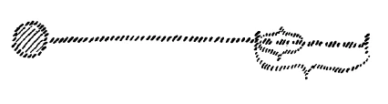
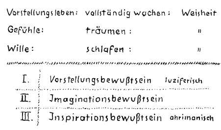
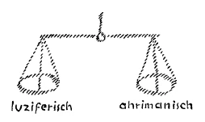

Im Anschlusse an manches, das ich in den Vorträgen der vorigen Woche hier vorgebracht habe, möchte ich heute gerade etwas Vorbereitendes sagen, das dann morgen und übermorgen weiter ausgebaut werden soll. Es wird sich darum handeln, Ihnen mancherlei auf eine andere Art, als das bisher geschehen ist, ins Gedächtnis zurückzurufen, mancherlei von dem, was wir brauchen werden, um unser ja bereits angeschlagenes Thema weiter zu verfolgen. ^0i31ld

Wenn wir uns klarmachen, wie der Verlauf der Erdenentwickelung war, so können wir dies am besten dadurch, daß wir immer, ich möchte sagen, die Ereignisse auf den Schwerpunkt der Erdenentwickelung hin betrachten, anordnen. Denn durch diese Anordnung kommt eine gewisse Struktur in all dasjenige hinein, in dem der Mensch durch die Entwickelung der Menschheit in seiner eigenen Entwickelung darinnensteht. Dieser Schwerpunkt ist ja, wie Sie wissen, das Mysterium von Golgatha, durch das alle übrige Erdenentwickelung erst ihren Sinn, ihren wahren inneren Gehalt erhalten hat. ^6amotf

Wenn wir zurückgehen in der Entwickelung der abendländischen Menschheit, die ja den Impuls des Mysteriums von Golgatha wie einen Einschlag herein empfangen hat aus dem Orient, so müssen wir uns sagen: Etwa im 5. Jahrhundert vor dem Eintritte dieses Mysteriums von Golgatha beginnt, und zwar aus der griechischen Kultur heraus, eine Art von Vorbereitung für dieses Mysterium von Golgatha. Wir können sagen, es ist ein gewisser einheitlicher Zug in dem griechischen Denken, Empfinden und Wollen durch etwa viereinhalb Jahrhunderte vor dem Eintritte des Mysteriums von Golgatha. Und dieser einheitliche Zug leitet sich ein durch die Gestalt des Sokrates, setzt sich dann fort in aller griechischen Kultur, eigentlich auch im Künstlerischen ist derselbe Zug bemerklich, er setzt sich fort in der gewaltigen, überragenden Persönlichkeit des Plato und bekommt dann einen mehr, ich möchte sagen, gelehrt aussehenden Charakter in Aristoteles. ^bn364t

Sie wissen ja aus den verschiedenen Darstellungen, die ich gegeben habe, daß das Mittelalter, namentlich in der Zeit nach Augustinus, besonders bemüht war, die Anleitung, die man bekommen konnte aus der Denkweise des Aristoteles heraus, zu benützen, um alles das zu verstehen, was sich an das Mysterium von Golgatha, seine Vorbereitung und seinen Nachklang, anschließt. Dadurch ist gerade das griechische Denken so wichtig geworden, auch für die christliche Entwickelung des Abendlandes bis zum Ende des Mittelalters, daß eigentlich griechisches Denken dazu benützt worden ist, um zu durchdringen den Gehalt des Mysteriums von Golgatha. Wir tun gut, wenn wir uns klarmachen, was da eigentlich in diesen letzten Jahrhunderten vor dem Einschlag des Mysteriums von Golgatha in Griechenland geschehen ist. ^dpcewz

Das, was da sich abgespielt hat im Denken, Empfinden, Wollen des griechischen Menschen, ist eigentlich der letzte Ausklang einer heute nicht mehr gewürdigten Urkultur der Menschheit. Mit unseren geschichtlichen Betrachtungen können wir ja diese Dinge wahrhaftig nicht in ihrem rechten Lichte sehen, denn unsere geschichtlichen Betrachtungen gehen nicht bis zu jenen Zeiten zurück, in denen eine über die damals zivilisierte Erde hin sich erstreckende Mysterienkultur alles menschliche Wollen und Empfinden im Grunde durchdrungen hat. Wir müssen schon in die Jahrtausende, in welche die Geschichte nicht mehr reicht, zurückgehen, mit den Methoden zurückgehen, die Sie ja wenigstens andeutungsweise finden in meinem Buche «Die Geheimwissenschaft im Umriß», um zu schauen, welcher Art diese menschliche Urkultur war. Sie hatte ihren Quell in den alten Mysterien, in jenen alten Mysterien, zu denen von großen führenden Persönlichkeiten zugelassen wurden diejenigen Menschen, die man objektiv zur unmittelbaren Einweihung geeignet finden mußte. Durch solche Eingeweihte wiederum strömte dasjenige, dessen diese Eingeweihten als Erkenntnis teilhaftig geworden waren in den Mysterien, zu den anderen Menschen hinaus. Und man kann im Grunde genommen die ganze alte Kultur nicht verstehen, wenn man nicht den Mutterboden der Mysterienkultur ins Auge faßt. Bei Äschylos sieht man, wenn man nur will, diesen Mutterboden der Mysterien noch ganz deutlich. In Platos Philosophie kann man ihn auch verspüren. Aber dasjenige, was eigentlich die Menschheit durch Mysterien an Offenbarungen über das Göttliche erhalten hat, das ist geschichtlich verloren gegangen. Das ist nur im primitivsten noch in dem enthalten, was geschichtlich nachweisbare Kultur geworden ist. Nun, was da eigentlich geschehen ist, das kann eben am besten dadurch beurteilt werden, daß man sich klarmacht, was denn eigentlich in der nachsokratischen Zeit des Griechentums noch zurückgeblieben ist von jener Urmysterienkultur, in der auch das Griechentum wurzelt. Es ist zurückgeblieben eine gewisse Art des Denkens, eine gewisse Art des Vorstellens. ^lc33x2

Sie wissen ja, in der äußeren Geschichte wird erzählt, wie Sokrates die Dialektik begründet hat, wie er eigentlich der große Lehrmeister des Denkens war, jenes Denkens, das dann Aristoteles mehr wissenschaftlich denkend ausgebildet hat. Aber dies, was so griechische Denkungs- und Vorstellungsweise war, das ist eigentlich nur der letzte Ausklang der Mysterienkultur, denn die Mysterienkultur war eine sehr inhaltsvolle. Man hat in die Gesamtanschauung des Menschen geistige Tatsachen, die grundlegende Ursachen für unsere Weltordnung sind, erkenntnismäßig aufgenommen. Die Inhalte, die gewaltigen, großen Inhalte sind allmählich verglommen. Aber die Art des Denkens, welche die Mysterienschüler ausgebildet haben, die Vorstellungsart, die Konfiguration des Denkens, die ist geblieben, und die ist eigentlich historisch geworden, historisch geworden zunächst im griechischen Denken, dann wiederum im mittelalterlichen Denken, im Denken der christlichen Theologen, die ja sich im wesentlichen für ihre Theologie angeeignet haben dieses griechische Denken, um aus der Denkschulung heraus mit den Gedankenformen, mit den Ideen und Begriffen, die im Grunde eine Fortsetzung des griechischen Denkens waren, das zu begreifen, was durch das Mysterium von Golgatha in die Welt geflossen ist. Was mittelalterliche Philosophie, sogenannte Scholastik ist, ist durchaus ein Zusammenfluß der geistigen Wahrheiten des Mysteriums von Golgatha mit griechischem Denken. Die Ausarbeitung, die gedankenmäßige Durcharbeitung der Golgatha-Mysterien, die ist durchaus — wenn ich mich des trivialen Ausdrucks bedienen darf - mit dem Handwerkszeug des griechischen Denkens, der griechischen Dialektik gemacht worden. Bis zum Mysterium von Golgatha verfließen ungefähr von dem Verlust des Inhaltes der Mysterien, von dem Auftreten des bloß Formalen, des bloß Gedankenmäßigen der alten Mysterien viereinhalb Jahrhunderte. Wir können approximativ sagen: viereinhalb Jahrhunderte. So daß wir also uns vorzustellen haben: In einer vorgeschichtlichen Zeit breitet sich über die damals zivilisierte Erde die Mysterienkultur aus. Die wird gleichsam so weiterentwickelt, daß nur ein Destillat zurückbleibt, die griechische Dialektik, das griechische Denken. Dann tritt das Mysterium von Golgatha ein. Das wird zunächst im Abendlande begriffen mit dieser griechischen Dialektik. Wer sich ganz einleben will etwa in die noch durchaus Theologie tragende Wissenschaft, sagen wir, selbst erst des 10., 11., 12., 13., 14. Jahrhunderts, der muß anders sein Denken einrichten, als heute die Menschheit aus der naturwissenschaftlichen Vorstellungsart heraus gewöhnt ist. Diejenigen Menschen, die heute gewöhnlich über die Scholastik urteilen, können ihr nicht gerecht werden, weil sie alle im Grunde nur naturwissenschaftlich geschult sind, und die Scholastik eine andere Gedankenschulung voraussetzt, als die heutige naturwissenschaftliche Schulung ist. ^8ijaig

Nun leben wir heute in einem Zeitpunkte, in dem wiederum viereinhalb Jahrhunderte verflossen sind, seit diese andere Denkweise, die naturwissenschaftliche Denkweise die Menschheit ergriffen hat. Um die Mitte des 14. Jahrhunderts beginnt das. Da fangen im Abendlande die Menschen an, so zu denken, wie wir es dann schon bis zu einem gewissen Grade hell ausgebildet finden bei Galilei etwa oder bei Giordano Bruno. Das wird dann heraufgetragen bis in unsere Zeiten. Ja, das ist scheinbar dieselbe Logik wie die griechische Logik, und dennoch eine ganz, ganz andere Logik. Das ist eine Logik, die ebenso abgelesen ist allmählich an den Naturvorgängen, wie abgelesen war die griechische Logik an dem, was die Mysterienschüler, was die Mysten schauten in den Mysterien. ^7m29gp

Und jetzt wollen wir uns einmal den Unterschied klarmachen, der da besteht zwischen den viereinhalb Jahrhunderten vor dem Auftreten des Mysteriums von Golgatha in der damals ja fast einzig zivilisierten Welt, der griechischen, und unseren viereinhalb Jahrhunderten, in denen die Menschheit erzogen wurde durch die naturwissenschaftliche Schulung. Am besten kann ich Ihnen dieses graphisch darstellen. (Es Tafel 6 wird zu zeichnen begonnen:) ^0ffwi0

Denken Sie sich einmal die Mysterienkultur wie eine Art Chimborazo der menschlichen Geisteskultur in sehr alter Zeit (weiß). Diese Mysterienkultur wird dann in Griechenland - ich will das der Farbe nach beschreiben — Logik, bis zu dem Mysterium von Golgatha (roter Linienstrich bis zum ersten roten senkrechten Strich). Das wird dann im Mittelalter fortgesetzt durch die Scholastik (weiße Linie bis zum zweiten roten senkrechten Strich). Da (obere rote Klammer) haben wir diesen letzten Ausläufer, diesen Ausklang der alten Mysterienkultur durch viereinhalb Jahrhunderte (über die rote Klammer wird geschrieben: 4½ Jh.). Und nun, seit dem 15. Jahrhundert, beginnt eine neue Art der Vorstellungsweise, wir könnten sie die Galileische nennen. Wir sind ungefähr so weit entfernt von dem Ausgangspunkte (kleiner roter Kreis und dritter roter senkrechter Strich), wie die Zeit betrug, die man gebraucht hat von dem Auftreten dieser griechischen Denkweise bis zu dem Mysterium von Golgatha (untere rote Klammer vor dem ersten roten senkrechten Strich). Aber während das ein Ausklang ist (weißer Bogen unter der unteren roten Klammer), gewissermaßen eine Abendröte, haben wir es zu tun mit einem Vorklang (weißer Bogen zwischen dem zweiten und dritten roten Strich und 4½ Jh.), mit etwas, was herauf sich entwickeln muß, was wir hinaufbringen müssen zu einer gewissen Höhe. Die griechische Kultur stand an einem Ende. Wir stehen an einem Anfange. ^z0vv2v

Vollständig verstehen werden wir diese Zusammenstellung eines Endes und eines Anfanges nur, wenn wir geisteswissenschaftlich einmal auf die Entwickelung der Menschheit von einem gewissen Gesichtspunkte aus eingehen. ^fz6ecb

Ich habe Ihnen ja früher schon einmal ausgeführt und bin wiederholt darauf zurückgekommen, daß in der Gegenwart nicht umsonst jene Selbsterkenntnis der Menschheit versucht wird, die geliefert werden soll durch die anthroposophisch orientierte Geisteswissenschaft. Denn die weitaus größte Mehrzahl der Menschheit steht ja vor einer bedeutungsvollen Zukunftsmöglichkeit. Sehen Sie, es ist da notwendig, daß man ernst nehme die Tatsache, daß die sich fortentwickelnde Menschheit der Geschichte ein sich fortentwickelnder Organismus ist. Wie beim einzelnen Organismus die Geschlechtsreife eintritt, und auch später epochale Übergänge da sind, so sind schon einmal auch in der Geschichte der Menschheit epochale Übergänge da. Heute setzen die Menschen noch der Lehre von den wiederholten Erdenleben immer wieder und wieder den Einwand entgegen: ja, die Menschen erinnern sich nicht daran, die Menschen erinnern sich nicht an ihr früheres Erdenleben. ^yhsv2m

Wer die Entwickelungsgeschichte der Menschheit, wie ich gerade andeutete, als einen Organismus auffaßt, der sollte sich nicht wundern — wenn er diese Entwickelungsgeschichte wirklich sachgemäß ins Auge faßt -, daß die Menschen sich heute nicht an ihre früheren Erdenleben im gewöhnlichen Erkennen erinnern. Denn ich frage Sie: An was erinnert sich der Mensch im gewöhnlichen Leben denn eigentlich? An dasjenige, was er zuerst gedacht hat. Was er nicht gedacht hat, an das erinnert er sich ja nicht. Denken Sie, wie viele Ereignisse im Tage von Ihnen unbeachtet bleiben. Sie erinnern sich nicht daran, weil Sie sie nicht gedacht haben, trotzdem sie sich vielleicht in Ihrer Umgebung zugetragen haben. Sie können sich nur an dasjenige erinnern, was Sie gedacht haben. ^a5x2k3

Nun ist die Entwickelung der Menschheit in den früheren Jahrhunderten und Jahrtausenden nicht so gewesen, daß die Menschen sachgemäß sich wirklich das Wesen des Menschen klargemacht haben. Es gibt zwar seit dem griechischen Denken wie eine Sehnsucht das «Erkenne dich selbst», aber dieses «Erkenne dich selbst» soll erst erfüllt werden durch wirkliche Geisteserkenntnis. Erst dadurch, daß die Menschen einmal ein Leben anwenden — wozu die Menschheit erst in unserer Zeit reif geworden ist —, um in Gedanken zu erfassen das eigene Selbst, erst dadurch wird für das nächste Erdenleben vorbereitet das Erinnern. Denn man muß zuerst nachgedacht haben über dasjenige, woran man sich erinnern soll. Nur diejenigen, die in früheren Zeiten durch die Einweihung, die ja nicht immer in Mysterien erworben sein muß, wirklich sachgemäß hinschauen konnten auf das eigene Selbst, die können in der Gegenwart — und die Menschen sind ja nicht so selten, die es können — wirklich zurückblicken auf frühere Erdenleben. Aber die Sache liegt doch so, daß die Menschen auch in bezug auf ihre rein körperliche Entwickelung eine Umwandlung durchmachen. Diese Dinge lassen sich nicht physiologisch äußerlich, aber geisteswissenschaftlich beobachten. Die Menschheit ist heute nicht so, wie sie vor zwei Jahrtausenden war mit Bezug auf ihre körperliche Konstitution, und sie wird nach zwei Jahrtausenden wiederum nicht so sein wie heute. Über diese Sache habe ich ja öfter gesprochen. Die Menschen leben in eine Zeit, in eine Zukunftszeit hinein, in der — wenn ich mich banal ausdrücken möchte — die Gehirne anders konstruiert sein werden, als die Gehirne heute beim Menschen konstruiert sind in äußerer Beziehung. Das Gehirn wird die Möglichkeit der Rückerinnerung an frühere Erdenleben haben. Aber diejenigen, die heute nicht vorgesorgt haben werden durch Nachdenken über das eigene Selbst, die werden diese Fähigkeit, die doch in ihnen mechanisch sein wird, nur wie eine innere Nervosität — um den heutigen Ausdruck zu gebrauchen -, wie einen inneren Mangel empfinden. Sie werden nicht finden, was ihnen fehlt, weil die Menschheit mittlerweile mit Bezug auf ihre Körperlichkeit reif wird, zurückzuschauen auf ihre früheren Erdenleben. Aber wenn sie nicht vorbereitet hat diese Rückschau, so kann sie nicht zurückschauen. Dann empfindet sie die Fähigkeit nur als einen Mangel. Deshalb liegt es im richtigen Erkennen der gegenwärtigen Umwandlungskräfte der Menschheit selbst, daß durch anthroposophisch orientierte Geisteswissenschaft die Menschen zur Selbsterkenntnis gebracht werden. Nun kann man, und heute will ich das zunächst andeuten, nun kann man auch heute schon darauf hinweisen, wie das besondere Erlebnis sein wird, das den Menschen nahelegen wird, mit den früheren Erdenleben zu rechnen. ^021kh0

Heute leben wir noch in einem Zeitalter, wo jene Empfindungsnuancen eigentlich bei wenigen Menschen, aber doch schon bei wenigen Menschen angedeutet sind, die immer mehr und mehr vorhanden sein werden. Heute werden diese Empfindungsnuancen noch nicht recht beachtet. Ich will sie Ihnen schildern in der Weise, wie sie einmal auftreten werden. Die Menschen werden hineingeboren werden in die Welt und werden sich sagen: Ja, ich werde, indem ich mit den anderen Menschen zusammenlebe, entweder bewußt oder unbewußt erzogen für ein gewisses Denken. Es steigen mir Gedanken auf. Ich werde in eine gewisse Art des Vorstellens hineingeboren und erzogen. Aber zu gleicher Zeit sehe ich mir die äußere Umgebung an: mein Denken, mein Vorstellen paßt nicht recht zur äußeren umgebenden Welt. - Diese Empfindungsnuance ist heute schon bei einzelnen Menschen vorhanden. Sie müssen denken in einer Richtung, die ihnen so erscheint, als ob die äußere Natur etwas ganz anderes sagte, als ob die äußere Natur etwas ganz anderes verlangte von ihnen. Wo einmal solche Menschen aufgetreten sind, die diese Diskrepanz gefühlt haben zwischen dem, was sie denken müssen, und dem, was die äußere Natur sagt, da hat man sie ausgelacht. Hegel zum Beispiel ist ein klassisches Beispiel dafür. Er hat gewisse Gedanken — nicht alle Hegelschen Gedanken sind ja töricht — über die Natur geäußert, sie systematisch zusammengestellt. Dann sind die Spießer gekommen und haben gesagt: Ja, das sind deine Ideen über die Natur. Aber schaue dir einmal diesen oder jenen Vorgang in der Natur an, das ist ja nicht so. Da sagte Hegel: Um so schlimmer für die Natur. ^psz54n

Das erscheint natürlich ganz paradox, und dennoch, es liegt subjektiv durchaus Begründetes in dieser Empfindung darinnen. Es ist durchaus möglich, daß man ganz unbefangen sich auf der einen Seite dem eingeborenen Denken überläßt und sich sagt, es müßte eigentlich die Natur anders sich formen, wenn sie wirklich diesem Denken entsprechen würde. Dann kommt man allerdings nach einiger Zeit darauf, sich auch an das zu gewöhnen, was der Natur abgelauscht ist. Da merken die meisten Menschen dann nicht, daß sie eigentlich dann, wenn sie herangereift sind, das zu beobachten, was der Natur abgelauscht ist, im Grunde genommen etwas wie eine Doppelseele in sich haben, wirklich etwas wie zwei Wahrheiten. Diejenigen, die das schon richtig bemerken, können sehr darunter leiden, weil dadurch in die Seele eine Diskrepanz hineingebracht wird. Aber das, was ich Ihnen jetzt schildere, was heute bei wenigen Menschen, aber bei diesen schon vorhanden ist, obwohl sie es oftmals nicht sehen, das wird immer mehr und mehr überhandnehmen. Die Menschen werden immer mehr und mehr sich sagen: Ja, so wie ich geboren bin, so zwingt mich eigentlich mein Kopf dazu, über die Natur mir ein Bild zu machen. Es stimmt eigentlich nicht recht mit der Natur. Dann lebe ich mich in das Leben hinein, und im Laufe der Zeit eigne ich mir auch dasjenige an, was die Natur sagt. Dann muß ich einen Ausweg schaffen. ^1tjjja

Diese zwiespältigen Empfindungen werden unsere Seelen ganz besonders haben, wenn sie wiederum auf die Erde zurückkommen werden. Da wird nämlich deutlich auftreten eine Art innerer Gedankenund Empfindungsquell, durch den man sich sagen wird: Ja, du empfindest, wie die Welt eigentlich sein sollte, aber sie ist nicht so, sie ist anders. - Dann wiederum wird man sich in diese Welt hineinleben, man wird eine zweite Art von Gesetzmäßigkeit kennenlernen und wird einen Ausgleich suchen müssen. Worauf wird das beruhen? ^nywrlp

 ^riss84

Nehmen Sie an (es wird zu zeichnen begonnen), der Mensch geht durch die Geburt ins physische Dasein. Er bringt sich mit dasjenige, was in seinem Denken und Empfinden das Ergebnis seines früheren Erdenlebens ist. Während er mit diesem Erdenleben nicht vereint war, hat sich tatsächlich das äußere Erdenleben in einer gewissen Weise verändert. Er empfindet eine Diskrepanz zwischen dem Denken, dessen Wirkungen er mitbringt aus dem früheren Erdenleben, das nicht mehr stimmt zu dem, wie die Dinge geworden sind in der Zeit, in der er abwesend war von der Erde. Und nun lebt er sich allmählich in sein neues Leben hinein und nimmt keineswegs in sein Bewußtsein dasjenige vollständig auf, was von ihm aus der Umgebung abgelauscht werden kann. Er nimmt es nur, ich möchte sagen, wie durch Schleier auf. Er verarbeitet es ja erst nach dem Tode, dann trägt er es in das nächste Leben wiederum hinein. Immer wird der Mensch in dieser Zweiheit seines Seelenlebens drinnenstehen. Immer wird der Mensch gewahr werden: Du bringst dir etwas mit, dem gegenüber die Welt neu ist, in die du als physischer Mensch durch die Geburt hineingewachsen bist. Aber durch deinen physischen Menschen nimmst du jetzt in dieser Welt etwas auf, was nicht gleich vollständig in deine Seele dringt, was du erst nach dem Tode wiederum zu verarbeiten hast. ^jph82n

In diese Art, das Leben zu empfinden, müßte der gegenwärtige Mensch sehr intensiv eigentlich sich hineinleben. Denn nur dadurch, daß man sich in so etwas hineinlebt, wird man gewahr die Kräfte, die eigentlich durch unser Dasein pulsen, und die einem sonst ganz entgehen. Und wir sind eingesponnen in sie. Aber wenn wir nicht versuchen, sie mit dem Bewußtsein zu durchdringen, bleiben sie im Unterbewußten und machen uns bis zu einem gewissen Grade seelisch krank. Dieses Auseinanderfallen wird der Mensch immer mehr wahrnehmen: das Auseinanderfallen desjenigen, was ihm aus dem vorigen Lebenslauf bleibt, und desjenigen, was sich in diesem Lebenslauf für den nächsten Lebenslauf vorbereitet. Und weil der Mensch diese Zweiheit immer mehr empfinden wird, wird er eine innerliche Vermittlung brauchen, eine wirkliche innerliche Vermittlung. Und die große Frage wird immer brennender werden: Wie kommt der Mensch zu dieser innerlichen Vermittlung? Dieser Frage gegenüber können wir nur eine Antwort finden, wenn wir das Folgende überlegen. ^gs52rj

Ich habe Ihnen öfters ausgeführt: Wir sind als Menschen im gewöhnlichen Leben zwischen Aufwachen und Einschlafen eigentlich nur vollständig wach für unser Vorstellungsleben. (Im folgenden wird der obere Teil des Schemas auf Seite 74 an die Tafel geschrieben.) Das Vorstellungsleben, das bedeutet vollständig wachen. Nicht vollständig wachen tun wir, auch wenn wir sonst wachen, mit Bezug auf unser Gefühlsleben. Unsere Gefühle sind nämlich, auch wenn wir für unsere Vorstellungen und Gedanken voll wach sind, innerhalb unseres Bewußtseins von keiner anderen Daseinsstufe als sonst die Träume. Wer untersuchen kann in diesem Felde, der weiß es durch unmittelbare Anschauung, daß in unserem Bewußtsein die Gefühle nicht lebendiger sind, nur läßt die Vorstellung, durch die wir die Gefühle repräsentiert haben, das anders erscheinen. Aber das Gefühlsleben als solches kommt aus den Untergründen des Bewußtseins so herauf, daß das, was da heraufwogt, gleich ist einem Träumen. Und der Wille in seinem eigentlichen Leben bedeutet für uns erwas, was in uns schläft, auch wenn wir sonst wachen. In bezug auf den Willen schlafen wir. So daß wir also diese drei Bewußtseinszustände auch wachend in uns tragen. Wir gehen herum bei Tag wachend in unserem Vorstellungsleben, täuschen uns, daß wir auch im Willen wach sind, weil wir von dem, was unser Wille vollbringt, Vorstellungen haben. Aber was der Wille erlebt, das geht nicht in unser Bewußtsein herauf, sondern nur das Vorstellungsbild. Wir träumen unsere Gefühle, wir verbringen schlafend unsere Wollungen. Aber wenn man durch die imaginative Erkenntnis heraufholt dasjenige, was sonst in den Gefühlen träumt, es zu vollständiger, klarer Welterkenntnis bringt, dann merkt man: Nicht nur in unseren Vorstellungen und Gedanken ist Weisheit, wenn ich das jetzt so nennen darf - wir können es technisch so nennen, wenn es auch bei vielen Menschen Unweisheit ist —, Weisheit ist in unseren Gedanken, Weisheit ist aber auch in unseren Gefühlen, und Weisheit ist auch in unserem Willen. (Dabei wurde «Weisheit» an die Tafel geschrieben.) ^dwhh69

Vorstellungsleben: vollständig wachen: Weisheit ^6708i4

Gefühle: träumen : Weisheit ^dn7jdf

Wille: Schlafen : Weisheit ^7183sf

Wir können mit Bezug auf das heutige Menschendasein eigentlich nur klar sprechen über dasjenige, was in unserem Vorstellungsleben ist. Was in der Gefühlswelt lebt, darüber hat die Menschheit heute im allgemeinen kaum andere Ideen als über das Traumleben, und dennoch ist Weisheit darinnen. ^qz7yrh

Am ehesten ist es ja für denjenigen möglich, der ernsthaftig die Übungen auf die eigene Seele anwendet, die in meinem Buche «Wie erlangt man Erkenntnisse der höheren Welten?» beschrieben sind, kennenzulernen ein gewisses inneres Seelenwogen, das gewissermaßen traumhaft verläuft, für die meisten Menschen nur traumhaft verläuft, nicht viel mehr Regelmäßigkeit hat als das gewöhnliche Träumen. Aber so viel Ordnung kann verhältnismäßig bald hereingebracht werden in dieses innere Erleben, daß man merkt: Zwar dieselbe Logik herrscht nicht in diesem innerlichen Erleben — manchmal herrscht eine sehr groteske Logik, und die verschiedensten Gedankenfetzen ordnen sich zusammen, spielen sich traumhaft ab, es herrscht manchmal eine merkwürdige Logik darinnen -, aber daß darinnen sich doch erwas abspielt, das kann, wie gesagt, als eine erste innere Erfahrung, die noch sehr primitiv ist, derjenige erkennen, der nur ein wenig auf das eigene Seelenleben das anwendet, was in meinem Buche «Wie erlangt man Erkenntnisse der höheren Welten?» geschildert ist. Da taucht ja, wenn der Mensch hinuntertaucht in dieses Gewoge wacher Träume, in der Tat eine neue Realität auf gegenüber der gewöhnlichen Realität des äußeren Lebens. Dann kann der Mensch verhältnismäßig bald bemerken, daß da eine neue Realität auftaucht. Er kann auch verhältnismäßig bald bemerken, daß in diesem Ganzen auch Weisheit darinnen ist, aber eine Weisheit, die er nicht fassen kann, für die er sich nicht reif genug fühlt, um sie ins Bewußtsein voll hereinzubringen. Es entschlüpft ihm immer wieder, und er weiß nicht, was das soll. Und so merkt denn der Mensch, kann es wenigstens merken, daß Weisheit nicht nur durchflutet die Oberschichte seines Bewußtseins, das ihn durchdringt im gewöhnlichen wachen Tagesleben, sondern daß darunter eine andere Schichte seines Bewußtseins liegt, die ihm nur unlogisch erscheint, weil er sie selber so nennt, weil er ihre Weisheit noch nicht erfassen kann. Man kann sagen: In dem Augenblicke, wo man sich vollständig das imaginative Erkennen angeeignet hat, da hören diese wachen Träume auf, so grotesk zu sein, wie sie im gewöhnlichen Leben erscheinen, dann. durchdringen sie sich mit einer Weisheit, die nur hinweist auf einen anderen Realitätsgehalt, auf eine andere Welt als die Sinneswelt ist, die wir mit der gewöhnlichen Weisheit überschauen. ^7hhnnw

Im gewöhnlichen Leben wogt herauf in unser alltägliches Bewußtsein aus dieser Unterschichte des Bewußtseins nur die Gefühlswelt. Und aus einer tieferen Schichte, die noch darunterliegt, wogt herauf die Willenswelt, die aber auch von Weisheit durchzogen, die durchaus auch von Weisheit durchzogen ist. Mit dieser Weisheit sind wir auch verbunden, nur bekommen wir sie erst recht nicht in unser gewöhnliches Bewußtsein herauf. So daß wir sagen können: Wir sind eigentlich als Menschen beherrscht von drei Bewußtseinsschichten. Das erste ist unser Vorstellungsbewußtsein, in dem wir alle’Tage drinnen leben. Das zweite ist ein Imaginationsbewußtsein. Und das dritte ist ein inspiriertes Bewußtsein, das aber sehr tief unten bleibt, das zwar in uns wirkt, richtig wirkt, aber dessen Eigenart wir nicht im gewöhnlichen Leben erkennen. (Es wurde an die Tafel geschrieben:) ^wb1j5r

I. Vorstellungsbewußtsein ^qmd7tr

II. Imaginationsbewußtsein ^www0gq

III. Inspirationsbewußtsein ^mk5of2

Wenn nur einigermaßen unsere Gegenwartsphilosophie nicht so begriffsstutzig wäre, wie sie ist, so würde dieser Gegenwartsphilosophie sehr stark auffallen - ich sage nicht demjenigen, der mit dieser Philosophie nichts zu tun hat, aber Philosophen sollten so etwas begreifen können, sie tun es aber heute nicht -, es sollte aber dieser Gegenwartsphilosophie sehr stark auffallen, in ganz anderer Intensität noch auffallen, was für ein großer Unterschied ist zwischen dem, was man an Wahrheiten rein auf Grundlage der äußeren Naturbeobachtung bemerkt, und demjenigen, was man in den Wissenschaften findet, zum Beispiel aus Mathematik und Geometrie heraus, mit denen man ja bestrebt ist, die äußere Natur zu verstehen. ^n9gsjs

Man kann mit einem gewissen Recht sagen: Für die Wahrheiten, die sich der Mensch aneignet durch äußere Beobachtung - es ist ja das so oft wiederholt worden in der Philosophiegeschichte, daß es eigentlich für den Philosophen selber überflüssig sein sollte, diese Dinge besonders scharf auseinanderzusetzen -, für das, was äußerlich zu beobachten ist, können wir niemals eigentlich von einer Sicherheit sprechen. Kant oder Hume haben ja das ganz besonders deutlich ausgeführt, indem sie grotesk sogar behauptet haben: Wir beobachten zwar, daß die Sonne aufgeht, aber wir haben aus dem Beobachten heraus nicht ein Recht zu behaupten, daß die Sonne nun morgen auch aufgehen wird. Wir schließen nur daraus, daß bis jetzt die Sonne immer aufgegangen ist, daß sie auch morgen aufgehen wird. — So ist es mit den Wahrheiten, die wir äußerlich aus der Beobachtung entlehnen. Aber so ist es zum Beispiel nicht mit den mathematischen Wahrheiten. Haben wir sie einmal begriffen, dann wissen wir, die gelten auch für alle Zukunft. Wer da weiß, aus inneren Gründen beweisen kann, daß das Quadrat über der Hypotenuse gleich ist der Summe der Quadrate über den beiden Katheten, der weiß, daß niemals einer ein rechtwinkliges Dreieck wird zeichnen können, für welches das nicht gilt. ^0fza8d

Mit diesen mathematischen Wahrheiten ist es anders als mir den Wahrheiten, die man aus den äußeren Beobachtungen kennt. Diese Tatsache weiß man, aber man ist nicht in der Lage, mit den Mitteln des heutigen Forschens den Grund einzusehen. Der Grund liegt darinnen, daß die mathematischen Wahrheiten tief aus dem Inneren des Menschen herauskommen, daß die mathematische Wahrheit im dritten Bewußtsein, hier in der unteren Schichte des Bewußtseins entspringt, und ohne daß der Mensch etwas davon ahnt, in sein oberstes Bewußtsein heraufschießt, wo er sie dann innerlich sieht. Die mathematischen Wahrheiten haben wir daher, daß wir uns selbst mathematisch in der Welt verhalten. Wir gehen, stehen und so weiter, wir beschreiben da Linien. Durch dieses Willensverhältnis zur Außenwelt bekommen wir eigentlich die innere Anschauung von der Mathematik. Die Mathematik entsteht da unten im dritten Bewußtsein (siehe Schema S. 78) und schießt herauf. ^qrrkqp

Wir haben also im Grunde genommen, wenn auch in diesem Fall der Ursprung dem gewöhnlichen Bewußtsein nicht vorliegt, wenigstens von einem Teile dieses unterschichtigen Bewußtseins sehr klare Vorstellungen. Die mathematischen, die geometrischen Vorstellungen, die kommen uns da herauf. Traumhaft, verworren wird nur die mittlere Schichte. Die mittlere Schichte, die hat etwas von traumhaft Verworrenem. Da oben im Oberstübchen, da, wo das gewöhnliche Tagwachen im Vorstellungsleben stattfindet, da sind wir wieder klar. Und dann ist in uns das klar, was da heraufspielt aus der dritten Schichte des Bewußtseins. Was dazwischen ist, das erreicht die meisten Menschen nur wie ein verworrenes Wachträumen. Das ist sehr bedeutsam, daß wir diese Tatsache uns klarmachen. Denn mit diesem Bewußtsein waren insbesondere die Griechen in diesen viereinhalb Jahrhunderten verbunden. Dieses Bewußtsein I haben sie aufgenommen, dasjenige, was ihnen als Rest der Mysterienkultur zurückgeblieben ist. Und das ist ein rein luziferisches Element, ein rein luziferisches Element. Ich habe es Ihnen neulich beschrieben. Es ist die intellektualistische Kultur. In unserem Kopfe ist es sehr klar. Er ist von Weisheit durchdrungen, von einer allgemein gültigen Weisheit. Aber das ist ein luziferisches Element in uns. (Es wird «luziferisch» an die Tafel geschrieben.) Und wiederum, was da unten ist, was die heutigen Wissenschafter so sehr lieben, Kant schon sehr geliebt hat, so daß er gesagt hat: Es ist nur so viel Wissenschaft der Natur gegenüber vorhanden, als Mathematik drinnen ist -, das ist rein ahrimanisches Element, das da durch unser Menschenwesen heraufkommt. Das ist ahrimanisches Element. (Es wird «ahrimanisch» an die Tafel geschrieben. Das Schema ist nun vollständig.) ^q4czov

Es genügt nicht, daß wir von irgend etwas wissen, daß es richtig ist. Wir wissen, daß die Dinge, die wir intellektuell durch unseren Kopf begreifen, richtig sind, aber es ist eine Gabe des luziferischen Elementes. Und wir wissen, daß die Mathematik richtig ist, aber diese mächtige Richtigkeit der Mathematik, die verdanken wir dem Ahriman, der in uns sitzt. Und das unsicherste Element ist in der Mitte, Das sind scheinbar unlogisch wogende Träume. ^o3wqsl

Ich will Ihnen noch ein anderes Kennzeichen anführen, damit Sie die ganze Wichtigkeit dieser Sache begreifen. Im Grunde genommen rührt all das mathematische Durchdringen der Welt, wie es aufgekommen ist durch Galilei, Giordano Bruno, aus dieser tieferen Schichte des Bewußtseins her. Viereinhalb Jahrhunderte sind verflossen, seit wir uns das aneignen, viereinhalb Jahrhunderte, seit wir dieses ahrimanische Element bemüht sind in unser menschliches Denken und Empfinden einzuführen. Während in die hellste Klarheit des Bewußtseins hineinschien der letzte Nachklang der Mysterienkultur im griechischen Denken, istin den untersten, dunkelsten Schichten unseres Bewußtseins erst der Aufgang desjenigen, was seinen Chimborazo erst in der Zukunft erringen soll. Das muß da herauf. ^5emtu1

 ^si9lfu

Wir Menschen stehen mit unserem Seelenleben wirklich so, daß dieses Seelenleben wie ein Waagebalken ist, der das Gleichgewicht zunächst suchen muß zwischen dem luziferischen Element auf der einen Seite, dem ahrimanischen Element auf der anderen Seite. Nur daß das luziferische Element in unserem hellen Kopfe liegt, das ahrimanische Element unten liegt in der Weisheit, die unseren Willen durchzieht. Dazwischen müssen wir das Gleichgewicht suchen in etwas, was eigentlich zunächst uns nicht als von etwas durchzogen erscheint. ^rkq82y

 ^czkq8g

Wie kommt Weisheit in diesen mittleren Teil des Menschen hinein? So wie der Mensch zunächst in der Welt steht, wird er seinem Kopfe nach von Luzifer gehalten, wird er seiner Stoffwechsel-Weisheit nach, der Gliedmaßen-Weisheit nach von Ahriman gehalten. Aber dem Herzen nach — denn dasjenige, was da als der mittlere Zustand des Bewußtseins geschildert ist, das ist ebenso abhängig von unserer Herzorganisation mit dem menschlichen Rhythmus, lesen Sie darüber nach in meinem Buche «Von Seelenrätseln», wie unsere Intellektualität mit dem Kopfe zusammenhängt -, in diese Sphäre unseres Daseins muß nach und nach eine ebenso große Ordnung hineinkommen, wie sie in die Kopfweisheit durch die Kopflogik hineingekommen ist, wie sie in alles dasjenige, was wir auf ahrimanische Weise wissen, durch die Mathematik, Geometrie, überhaupt durch diese äußerlich rationelle Naturbeobachtung kommt. Wodurch kommt in diesen mittleren Teil unseres Menschenwesens die innere Logik, die innere Weisheit, Orientierungsfähigkeit hinein? Durch den Christus-Impuls, durch dasjenige, was in die Erdenkultur übergegangen ist durch das Mysterium von Golgatha. ^uajh9g

Es gibt eine geisteswissenschaftliche Anatomie, die uns zeigt, was Kopfkultur ist, die uns zeigt, was Stoffwechselkultur ist, die uns auch zeigt, was diejenige Organisationssphäre ist, die zwischen beiden darinnenliegt, und was diese braucht. Es gehört zu unserem Menschenwesen die Durchdringung mit dem Christus-Impuls. ^2kxduh

So daß wir uns sagen können: Nehmen wir einen Augenblick hypothetisch an, das Mysterium von Golgatha wäre nicht in die Erdenentwickelung hereingekommen, dann würde der Mensch die Kopfweisheit auch haben. Er würde auch dasjenige haben, was seit dem 15. Jahrhunderte heraufgekommen ist. Aber er würde mit Bezug auf seine Mittelpunktswesenheit leer und öde sein. Er würde immer mehr und mehr bloß den Zwiespalt empfinden zwischen den beiden angeführten inneren Sphären. Er würde nicht den Gleichgewichtszustand herbeiführen können. Diesen Gleichgewichtszustand können wir nur herbeiführen dadurch, daß wir uns immer mehr und mehr durchdringen mit dem Christus-Impuls, der den Gleichgewichtszustand hervorruft zwischen dem luziferischen und dem ahrimanischen Elemente. ^za80fu

Daraus ersehen Sie, daß wir sagen können: In diesen vorchristlichen viereinhalb Jahrhunderten ist dem Menschen beschert worden wie eine Vorbereitung zum Mysterium von Golgatha der letzte Ausläufer der alten Mysterienkultur, der sich festgesetzt hat wie eine Kopfeserinnerung an diese alte Mysterienkultur. Und in der neueren Zeit, durch viereinhalb Jahrhunderte, ist durch das Menschenwesen gegangen die Vorbereitung für eine neue Geistesrichtung, für eine neue Art von Mysterienkultur. Aber daß diese beiden auch in der geschichtlichen Entwickelung der Menschheit verbunden werden können, dazu mußte das Mysterium von Golgatha objektiv in die Menschheitsentwickelung hineingestellt werden. Von außen betrachtet verläuft die Menschheitsentwickelung so, daß das Mysterium von Golgatha als eine objektive Tatsache hineingestellt wird. Innerlich aber verläuft die Menschheitsentwickelung so, daß die Menschen mittlerweile heranwachsen, bis sie vom 15. Jahrhundert ab jenen neuen Einschlag bekommen, den ich Ihnen eben charakterisiert habe als einen Ahriman-Einschlag, und durch den sie erst recht empfinden werden: sie brauchen die Möglichkeit, eine Brücke zu bauen zwischen dem einen und dem anderen. ^ff50cy

So können wir innerlich den dreigliedrigen Menschen begreifen. Und wir werden ihn noch genauer begreifen, wenn wir mit dem, was ich Ihnen heute gesagt habe, etwas verbinden, was ich schon wiederholt erwähnt habe. Dem alten Griechen mit seinen letzten Resten aus der alten Mysterienkultur wäre es gar nicht möglich gewesen — außer daß es aufgetreten ist bei einigen Entarteten, aber auch nicht in dem Grade, wie in unserer Zeit, es wäre ihm gar nicht möglich gewesen, atheistisch zu sein. Der Atheismus ist im Grunde genommen erst ein neueres Gebilde, wenigstens in seinen radikalen Ausgestaltungen. Denn der Grieche, der wirklich Dialektik innehatte, der fühlte noch im Denken, sogar im inhaltslosen Denken das Walten des Göttlichen. ^7lif7k

Wenn man dies weiß und dann auf das Auftreten des Atheismus sieht, auf die völlige Leugnung des Göttlichen, dann kommt man darauf, worauf eigentlich dieser Atheismus beruht. Atheisten - man braucht natürlich geisteswissenschaftliche Methoden, um das zu erkennen -, Atheisten sind nur diejenigen Menschen, bei denen — es kann ja das in sehr feinen Strukturverhältnissen sein, aber es ist so — etwas nicht in der Ordnung ist organisch. Der Atheismus ist in Wirklichkeit eine Krankheit. ^3i61bt

Das ist dasjenige, was wir zuerst festhalten müssen: Der Atheismus ist eine Krankheit. Denn wenn unser Organismus vollständig gesund ist, so kann er in seinen einzelnen Gliederungen nicht anders zusammenwirken, als daß wir unseren Ursprung aus dem Göttlichen — ex deo nascimur — selber empfinden. ^ajw4h2

Das zweite ist allerdings etwas anderes. Der Mensch kann das Göttliche empfinden, aber keine Möglichkeit haben, den Christus zu empfinden. Man macht in dieser Beziehung heute nicht sehr feine Unterschiede. Man begnügt sich heute zu sehr mit Worten, auch auf anderen Gebieten. Wenn man nämlich heute den eigentlichen geistigen Gehalt recht vieler abendländischer Menschen prüft und sich nicht nach den Worten richtet — sie sagen, sie glauben an eine Freiheit des Willens und so weiter —, zeigt es sich, wie die ganze Konfiguration des Denkens widerspricht diesem, was sie damit ausdrücken. Nur im Zusammenhang der Kultur sind sie gewohnt worden, von Christus zu sprechen, von Freiheit und so weiter. In Wirklichkeit ist eine große Anzahl unter uns lebender Menschen nichts weiter als Türken; denn ihr Glaubensinhalt ist genau derselbe fatalistische - wenn auch dieser Fatalismus oftmals als Naturnotwendigkeit geschildert ist —, wie der Glaubensinhalt der Mohammedaner ist. Der Mohammedanismus ist viel verbreiteter, als man denkt. Wenn man eben nicht auf die Worte geht, sondern auf den geistig-seelischen Inhalt, dann sind manche Christen eigentlich Türken, viele Christen sind Türken. Und so nennen sich die Leute auch Christen, wenn sie auch nicht den Übergang finden können zwischen dem Gott, den sie empfinden und dem Christus. ^mqxm51

Ich brauche Sie nur hinzuweisen auf das klassische Beispiel eines modernen 'Theologen, Adolf Harnack, der das «Wesen des Christentums» schrieb. Bitte, machen Sie die Probe, streichen Sie im «Wesen des Christentums» überall den Christus-Namen aus und schreiben Sie bloß den Gottes-Namen hin, es ändert gar nichts an dem Inhalt dieses Buches. Es besteht gar keine Notwendigkeit, daß der Mann das, was er aussagt, von dem Christus aussagt. Er braucht es nur auszusagen von dem allgemeinen, von dem der Welt zugrunde liegenden Vater-Gotte. Es ist gar keine Nötigung, daß er dasjenige, was er aussagt, auf den Christus bezieht. Wo er etwas beweist, ist es äußerlich und innerlich unwahr, indem er eben aus den Evangelien die einzelnen Mitteilungen entlehnt; aber in der Art, wie er sie verarbeitet, ist keine Veranlassung, sie an den Christus anzulehnen. Man muß die Möglichkeit gewinnen, den Christus nicht so aufzufassen, daß man ihn identifiziert mit dem Vater-Gotte. Das können schon ganz besonders sehr viele neuere evangelische 'Theologen nicht mehr: einen Unterschied machen zwischen dem allgemeinen Gottes-Begriff und dem Christus-Begriff. Christus nicht zu finden im Leben ist etwas anderes, als Gott nicht zu finden, den Vater-Gott nämlich. Daß es sich hier nicht darum handelt, irgendwie die Göttlichkeit des Christus zu bezweifeln, wissen Sie. Es handelt sich nur darum, daß man innerhalb der Sphäre des Göttlichen genau unterscheiden muß zwischen dem Vater-Gott und dem Christus-Gott. Aber das drückt sich auch aus in dem Seelenleben des Menschen. Gott-Vater nicht zu finden, ist eine Krankheit; den Christus nicht zu finden, ist ein Unglück. Denn mit dem Christus ist der Mensch so verbunden, daß er innerlich darauf angewiesen ist. Aber er ist angewiesen auf etwas, das als ein historisches Ereignis sich abgespielt hat. Er muß im äußeren Leben hier auf der Erde einen Zusammenhang finden mit dem Christus. Findet er ihn nicht, so ist das ein Unglück. Es ist eine Krankheit, Atheist zu sein, den Vater-Gott nicht zu finden. Es ist ein Unglück, den Sohnes-Gott nicht zu finden, den Christus. ^8pc96b

Und was ist das, den Geist nicht zu finden? Nicht die Möglichkeit zu haben, die eigene Geistigkeit zu erfassen, um den Zusammenhang der eigenen Geistigkeit mit der Geistigkeit der Welt zu finden, das ist eine Schwachgeistigkeit; ein seelischer Schwachsinn ist es, den Geist nicht anzuerkennen. ^uxpj2f

An diese drei Mängel der menschlichen Seelenverfassung bitte ich Sie, sich noch einmal zu erinnern — dann werden wir in der richtigen Weise in dieser Betrachtung morgen fortfahren können -, sich zu erinnern an dasjenige, was ich Ihnen heute von einem anderen Gesichtspunkte aus wieder über die drei Bewußtseine gesagt habe, und sich zu erinnern daran: Atheist zu sein, den Gott, aus dem wir geboren sind — den wir finden müssen bei einer vollständig gesunden Organisation — nicht zu finden, ist eine Krankheit, und den Christus nicht zu finden, ist ein Unglück, den Geist nicht zu finden, ist ein seelischer Schwachsinn. ^at9xrw

In dieser Weise unterscheiden sich auch die Wege des Menschen zur Trinität voneinander. Und das wird für die Menschheit immer mehr und mehr notwendig, auf diese konkreten Dinge des Seelenlebens einzugehen, nicht immer in allgemeinen, verschwommenen, nebulosen Dingen stecken zu bleiben. Und zu dieser Nebulosität hat man heute eine ganz besondere Neigung. Zu ersetzen diese Neigung durch die Neigung, ins Konkrete des Seelenlebens wiederum einzutreten, das ist eine wesentliche Aufgabe der Zeit. ^ejzy8t